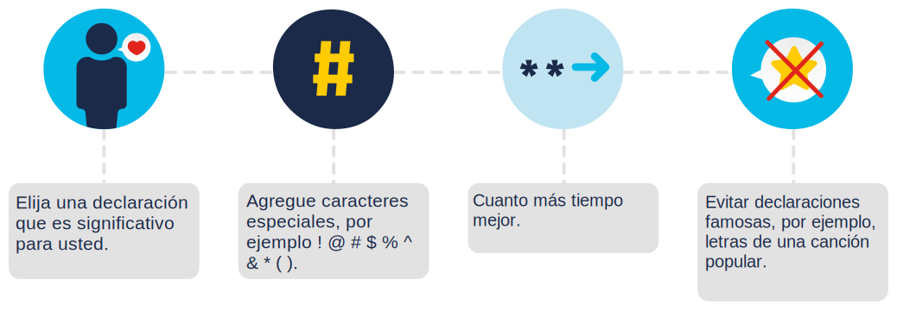

<a href="./00-Curso.md"><< Menú principal del módulo</a>

# 3. Protegiendo sus datos y su privacidad
## Proteja sus dispositivos y su red
### Protegiendo sus Dispositivos Informáticos
Para que su dispositivo sea seguro y protegido, deberá:

* Encender el firewall.
* Instalar el antivirus y el antiespías.
* Administrar su sistema operativo o navegador web.
* Configurar la protección de contraseñas.

__Encienda el firewall__. Debe usar al menos un tipo de firewall (ya sea un firewall de software o un firewall de hardware en un enrutador) para proteger su dispositivo del acceso no autorizado. El firewall debe activarse y actualizarse constantemente para evitar que los hackers accedan a sus datos personales o de la organización .

Puedes hacer clic <a href="http://windows.microsoft.com/es-us/windows-10/turn-windows-firewall-on-or-off" target="_blank">aquí</a> para aprender a activar el firewall en  Windows 10, o hacer clic <a href="https://support.apple.com/es-us/HT201642" target="_blank">aquí</a> para los dispositivos Mac OS X.

__Instale el antivirus y el antiespía__. El software malintencionado, como virus y spyware (programa espía), está diseñado para obtener acceso no autorizado a su equipo y a sus datos. Una vez instalados, los virus pueden destruir los datos y ralentizar el equipo. Incluso pueden tomar su computadora y emitir correos electrónicos no deseados con su cuenta. El spyware puede supervisar sus actividades en línea, recopilar su información personal o enviar anuncios emergentes no deseados a su navegador web mientras está en línea.

Para evitarlo, solo debe descargar software de sitios web de confianza. Sin embargo, siempre debe utilizar un software antivirus para proporcionar otra capa de protección. El software, que usualmente incluye antispyware, está diseñado para analizar su computadora y correo electrónico entrante para detectar virus y eliminarlos. Mantener su software actualizado protegerá a su computadora de cualquier software malicioso reciente.

__Administre su sistema operativo o navegador web__. Los hackers siempre intentan aprovechar las vulnerabilidades que pueden existir en su sistema operativo (como Microsoft Windows o macOS) o en el navegador web (como Google Chrome o Apple Safari).

De este modo, para proteger su computadora y sus datos, debe establecer la configuración de seguridad en su computadora o navegador a un nivel medio o alto. También debe actualizar el sistema operativo de la computadora, incluyendo los navegadores web, y descargue e instale periódicamente parches y actualizaciones de seguridad del software de los proveedores.

__Configure la protección de contraseñas__. Todos sus dispositivos informáticos, ya sean ordenadores, computadoras portátiles, tabletas o teléfonos inteligentes, deben estar protegidos con contraseña para evitar el acceso no autorizado. Cualquier información almacenada debe estar cifrada, especialmente en el caso de datos sensibles o confidenciales. Solo debe almacenar la información necesaria en su dispositivo móvil, en caso de que se lo roben o se pierda.

Recuerde, si alguno de sus dispositivos se ve comprometido, los delincuentes pueden tener acceso a todos sus datos a través del proveedor de servicios de almacenamiento en la nube, como iCloud o Google Drive.

Los dispositivos de IoT (Internet de las cosas) representan un riesgo incluso mayor que los otros dispositivos electrónicos. Mientras que las computadoras de escritorio, portátiles y los dispositivos móviles reciben actualizaciones de software frecuentes, la mayoría de los dispositivos de IdC aún tiene su software original. Si se encuentran vulnerabilidades en el software, el dispositivo de IoT es probable que se mantenga vulnerable. Y para empeorar el problema, los dispositivos IdC requieren acceso a Internet y, en la mayoría de los casos, dependen de su red local. El resultado es que cuando los dispositivos de IoT se ven comprometidos, permiten a los piratas informáticos acceder a su red y datos locales. La mejor manera de protegerse de esta situación es contar con dispositivos de IdC con una red aislada.

Echa un vistazo a <a href="https://www.shodan.io/" target="_blank">Shodan</a>, un escáner de dispositivos IdC basado en la web que te ayuda a identificar cualquier dispositivo vulnerable en Internet.

### Seguridad de la red inalámbrica en casa
Las redes inalámbricas permiten que los dispositivos habilitados con Wi-Fi, como computadoras portátiles y tablets, se conecten a la red por medio de un identificador de red conocido como identificador de conjunto de servicios (SSID - Service Set Identifier). Si bien un enrutador inalámbrico se puede configurar para que no transmita el SSID, esto no debe considerarse una seguridad adecuada para una red inalámbrica.

Los hackers conocerán el SSID preestablecido y la contraseña predeterminada. Por lo tanto,  estos detalles deben cambiarse para evitar que los intrusos entren en la red inalámbrica doméstica. Además, debe encriptar la comunicación inalámbrica habilitando la seguridad inalámbrica y la función de encriptado WPA2 en el router inalámbrico. Pero tenga en cuenta que, incluso con el cifrado WPA2 habilitado, una red inalámbrica puede seguir siendo vulnerable.

__Falla de seguridad en protocolo WPA2__. Descubierta en 2017, esta vulnerabilidad  puede ser atacada utilizando el ataque de reinstalación de clave (KRACK, Key Reinstallation Attack) por intrusos. En términos sencillos, los atacantes rompen el cifrado entre un enrutador inalámbrico y un dispositivo inalámbrico, lo que les da acceso a los datos de la red. Esta falla afecta a todas las redes Wi-Fi modernas y protegidas. Para mitigar esta situación, debe:
* Actualizar todos los productos afectados como routers inalámbricos, computadoras portátiles y dispositivos móviles, tan pronto como las actualizaciones de seguridad estén disponibles.
* Usar una conexión por cable para cualquier dispositivo con una tarjeta de interfaz de red (NIC) con cable.
* Utilizar un servicio de red privada virtual (VPN) de confianza al acceder a una red inalámbrica

Haga clic <a href="https://www.krackattacks.com/" target="_blank">aquí</a> para obtener más información sobre KRACK.

### Riesgos del Wi-Fi público
Cuando está lejos de casa, puede acceder a su información online y navegar por internet a tráves redes inalámbricas públicas o puntos de acceso a Wi-Fi. Sin embargo, hay algunos riesgos involucrados, lo que significa que es mejor no acceder ni enviar ninguna información personal cuando se usa una red Wi-Fi pública.

Siempre debe verificar que su dispositivo no esté configurado para compartir archivos y datos multimedia, y que requiera la autenticación de usuario con cifrado.

También debe usar un servicio de VPN encriptado para evitar que otras personas intercepten su información (lo que se conoce como "espionaje") a través de una red inalámbrica pública. Este servicio le brinda acceso seguro a Internet, al cifrar la conexión entre su dispositivo y el servidor VPN. Incluso si los hackers interceptan una transmisión de datos en un túnel VPN encriptado, no podrán descifrarla.

Haga clic <a href="file:///home/adolfokuhn/Documentos/Formaci%C3%B3n/CALIDAD/Seguridad/CISCO/Introduccion%20a%20Ciberseguridad/doc/datos_para_resguardar_su_bluetooth_y_otras_conexiones_inalambricas.pdf" target="_blank">aquí</a> para obtener más información acerca de la protección personal al utilizar redes inalámbricas.

No olvide que el protocolo inalámbrico Bluetooth, que se encuentra en muchos teléfonos inteligentes y tabletas, también puede ser aprovechado por los hackers para espiar, establecer controles de acceso remoto, distribuir malware y agotar las baterías.
\
Por lo tanto, mi consejo principal es mantener el Bluetooth desactivado cuando no lo estés usando.

### Seguridad por contraseña
Es importante que todas sus cuentas en línea tengan una contraseña única. Usar las mismas contraseñas lo deja a usted y a sus datos vulnerables a los ciberdelincuentes.

Y si se vuelve demasiado complicado recordar todas estas contraseñas, debe usar un administrador de contraseñas. Esta herramienta almacena y cifra todas sus contraseñas y le ayuda a iniciar sesión en sus cuentas automáticamente.

### Una contraseña segura
Estos son algunos consejos sencillos que le ayudarán a elegir una contraseña segura:

* No use palabras del diccionario o nombres en ningún idioma.
* No use errores ortográficos comunes de palabras del diccionario.
* De ser posible, utilice caracteres especiales como `! @ # $ % ^ & * ( )`.
* No use nombres de equipos o cuentas.
* Utilice una contraseña con más de diez caracteres.

### Uso de una frase de contraseña
Para evitar el acceso no autorizado a sus dispositivos, debería considerar el uso de frases de contraseña en lugar de contraseñas. Por lo general, una frase de contraseña adopta la forma de una oración ('Acat th @tlov3sd0gs. '), lo que hace que sea más fácil recordarla. Y dado que es más larga que una contraseña típica, es menos vulnerable a los ataques de diccionario o de fuerza bruta.

	

### Guías para las contraseñas
El Instituto Nacional de Normas y Tecnología (NIST) de los Estados Unidos publicó requisitos de contraseña mejorados. Las normas del NIST están destinadas a aplicaciones del gobierno, pero también pueden servir como normas para otras.

Estas pautas tienen como objetivo colocar la responsabilidad de la verificación del usuario en los proveedores de servicios y garantizar una mejor experiencia para los usuarios en general. Ellos afirman:
* Las contraseñas deben tener por lo menos 8 &nbsp;caracteres, pero no más de 64.
* No utilice contraseñas comunes ni que se puedan adivinar con facilidad; por ejemplo, "contraseña", "abc123".
* No deben haber reglas de composición, como incluir números y letras mayúsculas y minúsculas.
* Los usuarios deben poder ver la contraseña al escribir, para ayudar a mejorar la precisión.
* Se deben permitir todos los caracteres de impresión y espacios.
* No debe haber sugerencias para la contraseña.
* No debe haber periodo de caducidad de contraseña.
* No debe haber autenticación basada en el conocimiento, como tener que proporcionar respuestas a preguntas secretas o verificar el historial de transacciones.

Pulse <a href="https://pages.nist.gov/800-63-3/" target="_blank">aquí</a> para obtener más información sobre estos requisitos de contraseña del NIST.

## Mantenimiento de datos
¿Está listo para mostrar todas sus fotos y documentos a extraños? ¿Su información financiera con sus amigos? ¿Sus contraseñas de correo electrónico con el público en general? ¿No? Entonces, sus datos deben estar cifrados.

### ¿Qué es el cifrado?

La encriptación o cifrado es el proceso de conversión de la información a un formato que una parte no autorizada no puede leer. Solo una persona de confianza autorizada con la contraseña o clave secreta puede descifrar los datos y acceder a ellos en su formato original.

Note que la encriptación en sí misma no evita que una persona intercepte los datos. Solo puede evitar que una persona no autorizada vea o acceda al contenido. De hecho, algunos delincuentes pueden decidir simplemente encriptar sus datos y hacer que sean inutilizables hasta que usted pague un rescate,

### ¿Cómo se cifran los datos?
Se utilizan programas de software para cifrar archivos, carpetas e incluso unidades enteras.

El sistema de encriptación de archivos (EFS, Encrypting File System) es una característica de Windows que permite encriptar datos. Está directamente vinculado a una cuenta de usuario específica y solo el usuario que encripta los datos podrá acceder a él después de haber sido encriptados usando EFS.

__Cómo cifrar datos mediante EFS en todas las versiones de Windows__

* Seleccione uno o más archivos o carpetas.
* Haga clic derecho en los datos seleccionados y en "Propiedades".
* Busque y haga clic en "Avanzado".
* Seleccione la casilla de verificación "Encriptar contenido para proteger datos".
* Las carpetas y los archivos encriptados con el EFS se muestran en verde.

### Realice un respaldo de sus datos
Tenga en cuenta la cantidad de datos valiosos que ha almacenado en su teléfono móvil o portátil. ¡Probablemente tenga documentos importantes, información de contacto y fotos familiares! Imagínese si le robaron su teléfono móvil o si perdió su computadora portátil. Toda esa información se perdería... ¡a menos que la respalde!

Tener un respaldo o copia de seguridad puede evitar la pérdida de datos irreemplazables, como fotos familiares. Para hacer un respaldo correcto de los datos, necesitará una ubicación de almacenamiento adicional para los datos y deberá copiar los datos en dicha ubicación periódica y automáticamente.

* Red doméstica: Almacenar sus datos localmente significa que tiene el control total de los mismos.
* Ubicación secundaria: Puede copiar todos sus datos en un dispositivo de almacenamiento conectado a la red (NAS), un disco duro externo simple o puede seleccionar solo algunas carpetas importantes para hacer un respaldo en unidades de memoria USB, CD/DVD o incluso cintas. En dicho escenario, usted es el propietario y es totalmente responsable del costo y el mantenimiento de los equipos del dispositivo de almacenamiento.
* La nube: Puede suscribirse a un servicio de almacenamiento en la nube, como Amazon Web Services (AWS). El costo de este servicio dependerá de la cantidad de espacio de almacenamiento que necesite, por lo que es posible que deba ser más selectivo en cuanto a los datos de los que hace una copia de seguridad. Tendrá acceso a la copia de respaldo siempre y cuando tenga acceso a su cuenta. Uno de los beneficios de usar un servicio de almacenamiento en la nube es que sus datos están seguros en caso de que falle un dispositivo de almacenamiento o si experimenta una situación extrema, como un incendio o un robo.

### ¿Realmente se han ido?
Has iniciado sesión en tu portátil pero contiene algunas fotos que pertenecen al usuario anterior, que ya no trabaja en @Apollo. Su gerente de línea le pide que los elimine. Arrastras las fotos a la papelera de reciclaje, abres la papelera de reciclaje, las selecciona y hace clic en "Eliminar" una vez más. ¡Eso debería bastar!

¿Cree que las fotos se han ido del portátil? Cuando mueve un archivo a la papelera de reciclaje y lo elimina de manera permanente, no se puede acceder al archivo solo desde el sistema operativo. Cualquier persona con las herramientas forenses adecuadas puede recuperar el archivo debido al rastro magnético que deja en el disco duro.

Entonces, ¿cómo se asegura de que los datos borrados ya no se puedan recuperar? 

### ¿Cómo se eliminan sus datos de forma permanente?
¿Alguna vez ha tenido que eliminar datos o deshacerse de un disco duro? Si es así, ¿ha tomado alguna medida de precaución para proteger los datos y evitar que caigan en malas manos?

Para borrar datos de modo que no sean recuperables, los datos deben sobrescribirse con unos y ceros varias veces, utilizando herramientas diseñadas específicamente para hacer precisamente eso. El programa SDelete de Microsoft (para Vista y versiones posteriores) reclama tener la capacidad de eliminar los archivos confidenciales por completo. Shred para Linux y Secure Empty Trash para Mac OS X afirman proporcionar un servicio similar.

La única forma de estar seguros de que los datos o los archivos no son recuperables es destruir físicamente el disco duro o el dispositivo de almacenamiento. ¡Muchos delincuentes se han aprovechado de archivos que se consideran impenetrables o irrecuperables!

No se olvide de los datos que se pueden almacenar en línea en la nube. Dichas copias también deberán eliminarse.

## ¿A quién le pertenecen sus datos?
### Términos del servicio
Se le ha pedido que configure una cuenta de almacenamiento y uso compartido de fotos en línea para utilizarla en la colaboración creativa con el departamento de diseño y otros equipos de @Apollo.

Al registrarse, se le solicitará que firme un acuerdo de servicio con el proveedor. No lo piensas demasiado y aceptas todos los términos sin leerlos.

Acaba de firmar un acuerdo de Términos de servicio. Pero, ¿sabe qué es esto? Los Términos de servicio, también conocidos como Términos de uso o Términos y condiciones, son un contrato de vinculación legal que rige las reglas de la relación entre usted, su proveedor,  y otras personas que utilizan el servicio.

### Comprenda los términos
Los Términos de servicio incluirán una serie de secciones, desde los derechos y responsabilidades del usuario hasta las exenciones de responsabilidad y los términos de modificación de la cuenta.

* La política de uso de datos describe cómo el proveedor de servicios recopilará, usará y compartirá sus datos.
* La configuración de privacidad le permite controlar quién ve información sobre usted y quién puede acceder a los datos de su perfil o cuenta.
* La política de seguridad describe lo que la empresa está haciendo para proteger los datos que obtiene de usted.
### Política de uso de datos
La política de uso de datos de la empresa que utilizó para configurar la cuenta establece que para cualquier contenido que publique: "nos otorga una licencia no exclusiva, transferible, sublicenciable, libre de regalías y mundial para alojar, usar, distribuir, modificar, ejecutar, copiar, ejecutar o mostrar públicamente, traducir, y crear trabajos derivados de su contenido (de acuerdo con su configuración de privacidad y aplicación)".

¿Qué significa realmente esta afirmación? Esto significa que, si bien usted es el propietario del contenido, la empresa podría reutilizar cualquier contenido que haya compartido para cualquier propósito.

### Configuración de privacidad
Como no estableció la configuración de privacidad antes de aceptar los términos, se aplicó la configuración predeterminada. Aceptar la configuración de privacidad predeterminada generalmente significa que cualquier persona puede ver información sobre usted y acceder a su perfil.

Ahora que lo ha analizado más de cerca, ¿todavía está de acuerdo con todos estos términos?

### Antes de registrarse
¿Qué factores debe tener en cuenta antes de suscribirse a un servicio en línea?

* ¿Ha leído el acuerdo de los términos de servicio?
* ¿Cuáles son sus derechos en relación con sus datos?
* ¿Puede solicitar una copia de sus datos?
* ¿Qué puede hacer el proveedor con los datos que usted carga?
* ¿Qué sucede con sus datos cuando cierra su cuenta?

### Proteja sus datos
Para proteger sus datos y proteger su cuenta, debe:

* Leer siempre los Términos de servicio cuando se registre para un nuevo servicio y decida si vale la pena renunciar a sus derechos sobre sus datos por el servicio.
* Seleccionar su configuración de privacidad en lugar de aceptar la configuración predeterminada.
* Limitar el grupo de personas con las que compartes contenido.
* Revisar la política de seguridad del proveedor de servicios para comprender lo que están haciendo para proteger sus datos.
* Cambiar sus contraseñas periódicamente, usar una contraseña compleja y una autenticación de dos factores para proteger su cuenta.

## Protección de la privacidad en línea
### Autenticación en Dos Factores
Los servicios en línea más populares, como Google, Facebook, Twitter, LinkedIn, Apple y Microsoft, utilizan la autenticación de dos factores para agregar una capa adicional de seguridad para los inicios de sesión de la cuenta.

Además del nombre de usuario y la contraseña, o un patrón o número de identificación personal (PIN), la autenticación de dos factores requiere un segundo token para verificar tu identidad. Esto puede ser:

* Objeto físico como una tarjeta de crédito, teléfono móvil o llavero.
* Escaneo biométrico como huellas digitales o reconocimiento de voz o de rostro.
* Código de verificación enviado por SMS o correo electrónico.

Haga clic <a href="https://brainstation.io/cybersecurity/two-factor-auth" target="_blank">aquí</a> para obtener más información sobre la autenticación de dos factores.

Incluso con la autenticación de dos factores, los hackers aún pueden obtener acceso a sus cuentas en línea mediante ataques tales como suplantación de identidad o phishing, malware e ingeniería social.

### Autorización abierta (Open Authorization OAuth)
Open Authorization (OAuth) es un protocolo de estándar abierto que permite que las credenciales de los usuarios finales tengan acceso a aplicaciones de terceros sin exponer las contraseñas de los usuarios. A modo de ejemplo pŕactico.

Está deseando inscribirse en «Cybersecurity Essentials» de Cisco, el próximo curso de esta serie, que lo ayudará a desarrollar su carrera. Sin embargo, debe iniciar sesión en el   portal de eLearning para hacerlo.

No puedes recordar tus datos de inicio de sesión, pero está bien. El portal le da la opción de iniciar sesión con sus credenciales de un sitio web de redes sociales como Facebook o a través de otra cuenta como Google.

Por lo tanto, en lugar de tener que restablecer sus datos de inicio de sesión, usted inicia sesión en el  portal de aprendizaje electrónico con sus cuentas de redes sociales existentes y se registra en su próximo curso con facilidad. ¡No puede esperar para empezar!

### Social Sharing (compartir en redes sociales)
Decide actualizar su nuevo puesto de trabajo en sus redes sociales. Al hacerlo, uno de los sitios le pide que actualice la información de su perfil para asegurarse de recibir el contenido que realmente no quiere perderse.

Echa un vistazo a los campos que faltan. ¿Cuáles llena? Recuerde que responder correctamente mejorará su configuración de privacidad, así que piense detenidamente en la información que desea compartir en línea.

* Su foto de perfil ✔️
* Dirección de correo electrónico ❌
* Nombre de la organización ✔️
* Fecha de nacimiento ❌
* Los nombres y la información de contacto de sus colegas ❌
* Nombre e información de contacto de su gerente ❌
* Número de teléfono móvil ❌

### No se deje engañar
Un simple correo electrónico falsificado puede provocar una violación masiva de datos y quizás causar un daño irreversible a su reputación.

### Privacidad de correo electrónico y navegadores web
Internet es una gran herramienta no solo para acceder a la información de forma rápida y fácil, sino también para comunicarse con amigos, familiares y colegas. Pero, ¿sabía que cualquier persona con acceso físico a su dispositivo o enrutador puede ver los sitios web que ha visitado? ¿Y que cada vez que envía un correo electrónico, puede leerlo cualquier persona que tenga acceso a la cadena digital entre usted y su  destinatario?

Entonces, ¿qué puedes hacer?

Estos problemas pueden minimizarse habilitando el modo de navegación privada en el navegador web. La mayoría de los exploradores web populares tienen un nombre propio para el modo de navegación privada:

* __Microsoft Internet Explorer__: InPrivate
* __Google Chrome__: Incógnito
* __Mozilla Firefox__: Pestaña privada o ventana privada
* __Safari__: Navegación privada

Cuando el modo privado está habilitado, las cookies (archivos guardados en su dispositivo para indicar qué sitios web ha visitado) se desactivan. Por lo tanto, todos los archivos temporales de Internet se eliminan y el historial de navegación se elimina cuando cierra la ventana o el programa. Esto puede ayudar a evitar que otros recopilen información sobre sus actividades en línea y traten de tentarlo a comprar algo con anuncios dirigidos.

Incluso con la navegación privada habilitada y las cookies desactivadas, las empresas desarrollan diferentes maneras de identificar usuarios para recopilar información y seguir el comportamiento de los usuarios. Por ejemplo, los dispositivos intermediarios, como los routers, pueden tener información sobre el historial de navegación web del usuario.

Por último, es su responsabilidad proteger sus datos, su identidad y sus dispositivos informáticos. Por lo tanto, la próxima vez que vaya a enviar un correo electrónico o navegar por Internet, ¿por qué no verifica que sigue todas las pautas descritas en este módulo? Solo algunas precauciones pueden ahorrarle problemas en el futuro.

## Descubra su propio comportamiento con riesgo en línea
### Escenario 1
¿Sabe qué información es segura para compartir en los sitios de redes sociales? Las fotos que muestran datos bancarios o información valiosa sobre bienes y vacaciones siempre lo ponen en riesgo, especialmente cuando ya ha dado pistas sobre dónde vive o dónde va a visitar. Siempre deténgase y piense en lo que está a punto de publicar, ¿se lo diría a un completo extraño?

### Escenario 2
Al crear una nueva cuenta en un servicio en línea, ¿qué contraseña utiliza? ¿Es seguro? Las aplicaciones de gestión de contraseñas pueden proteger las contraseñas guardándolas en un formato cifrado seguro. Permiten generar y administrar contraseñas aleatorias fácilmente, evitando la necesidad de que los usuarios tengan la misma contraseña para varias cuentas, lo que presenta un riesgo de seguridad.

### Escenario 3
Conectarse a un punto de acceso Wi-Fi abierto puede hacer que su sistema y sus datos sean vulnerables a un ataque. Utilizar una VPN para que todo el tráfico sea seguro y encriptado.

### Escenario 4
¿Conoce los riesgos que conlleva descargar una versión de prueba de un programa? Ninguna organización puede permitirse correr el riesgo de un ciberataque al instalar aplicaciones de una fuente que no sea de confianza.

### Escenario 5
¿Alguna vez ha recibido un mensaje de advertencia que le indica que descargue un programa de diagnóstico que garantice la seguridad de su equipo? Debe ser consciente de los riesgos. Haciendo clic en cualquier cosa que no sea el  icono de cerrar podría poner en riesgo su sistema. Para estar seguro, debe ejecutar un análisis de seguridad del sistema con su software antivirus de confianza en su computadora. Y siempre debe rechazar o cancelar los recordatorios de actualizaciones, a menos que esté seguro de que provienen de una fuente oficial y confiable.

### Escenario 6
Hacer clic en los enlaces de un correo electrónico puede parecer seguro, pero a menudo no todo es lo que parece. ¡Asegúrese de conocer las señales a las que debe prestar atención! Los indicios clave de un posible correo electrónico de phishing son señales de que se ha enviado desde fuera de la organización. Recuerde que incluso si cree que el correo electrónico es seguro, siempre debe consultar con su departamento de TI antes de hacer clic en los enlaces para descargar cualquier cosa.

## Enlaces de interés
 
 
 
 
 
 
 
 
<a href="#3-protegiendo-sus-datos-y-su-privacidad">⬆️</a>
<a href="./00-Curso.md"><< Menú principal del módulo</a>