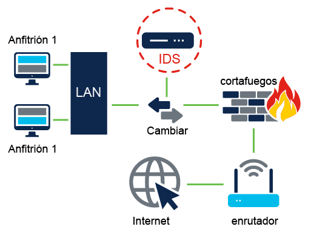
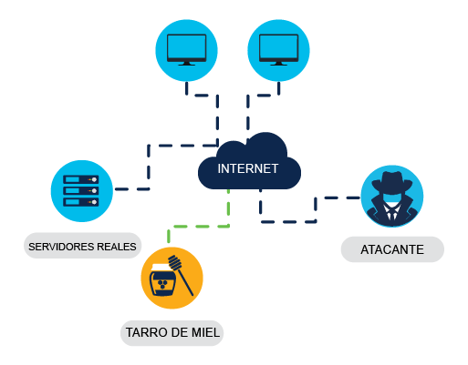
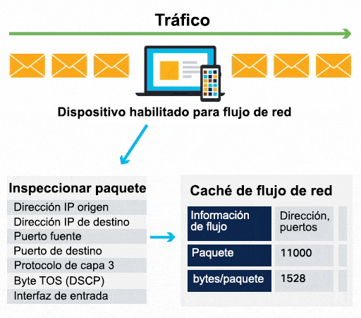

<a href="./00-Curso.md"><< Menú principal del módulo</a>

# 4. Protegiendo a la Organización

## Dispositivos de Ciberseguridad y Tecnología
No existe un solo dispositivo de seguridad o pieza de tecnología que resuelva todas las necesidades de seguridad de la red en una organización. Debe considerar qué herramientas serán más efectivas como parte de su sistema de seguridad.

### Dispositivos de seguridad
Los dispositivos de seguridad pueden ser dispositivos independientes como un enrutador o herramientas de software que se ejecutan en un dispositivo de red. Se dividen en seis categorías generales.

#### Enrutadores
Si bien los enrutadores se utilizan principalmente para interconectar varios segmentos de red, generalmente también proporcionan capacidades básicas de filtrado de tráfico. Esta información puede ayudarlo a definir qué equipos de un segmento de red determinado pueden comunicarse con qué segmentos de red.

#### Cortafuegos (Firewall)
Los _firewalls_ pueden analizar más a fondo el tráfico de red en sí e identificar comportamientos maliciosos que deben bloquearse. Los _firewalls_ pueden tener políticas de seguridad sofisticadas aplicadas al tráfico que los atraviesa.

#### Sistemas de prevención de intrusiones (IPS Intrusion Prevention System)
Los sistemas IPS utilizan un conjunto de firmas de tráfico que coinciden y bloquean el tráfico y los ataques maliciosos.

#### Redes Privadas Virtuales (VPN Virtual Private Network)
Los sistemas VPN permiten que los empleados remotos usen un túnel cifrado seguro desde su computadora móvil y se conecten de forma segura a la red de la organización. Los sistemas VPN también pueden interconectar de forma segura las sucursales con la red de la oficina central.

#### Antimalware o Antivirus
Estos sistemas utilizan firmas o análisis de comportamiento de las aplicaciones para identificar y bloquear la ejecución de código malicioso.

#### Otros dispositivos de seguridad
Otros dispositivos de seguridad incluyen dispositivos de seguridad web y de correo electrónico, dispositivos de descifrado, servidores de control de acceso de clientes y sistemas de gestión de seguridad.

### ¿Cuál es?
* __Enrutador de servicios integrados de Cisco (ISR) 4000__. Estos enrutadores tienen muchas capacidades, incluido el filtrado de tráfico, la capacidad de ejecutar un sistema de prevención de intrusiones (IPS), capacidades de cifrado y VPN para un túnel cifrado seguro.

* __La serie Firepower 4100 de Cisco__ es un _firewall_ de próxima generación que tiene todas las capacidades de un enrutador ISR, así como administración y análisis de red avanzados. Puede ayudarlo a ver lo que sucede en la red para que pueda detectar los ataques antes.

* __El cliente de movilidad segura AnyConnect de Cisco__ es un sistema VPN que permite a los trabajadores remotos utilizar un túnel cifrado seguro desde su computadora móvil para volver a conectarse de forma segura a la red de la organización. Todos los dispositivos de seguridad de Cisco están equipados con un servidor VPN y tecnología de cliente, diseñados para la tunelización cifrada segura.

* __Advanced Malware Protection (AMP) de Cisco__ se instala en enrutadores, _firewalls_, dispositivos IPS y dispositivos de seguridad web y de correo electrónico de Cisco de próxima generación. También se puede instalar como software en equipos host.

### Cortafuegos
En las redes de computadoras, un _firewall_ está diseñado para controlar o filtrar qué comunicaciones se permiten dentro y cuáles se permiten fuera de un dispositivo o red. Se puede instalar un _firewall_ en una sola computadora con el propósito de proteger esa computadora (_firewall_ basado en host) o puede ser un dispositivo de red independiente que protege una red completa de computadoras y todos los dispositivos host en esa red (_firewall_ basado en red). <a href="https://www.paloaltonetworks.com/cyberpedia/types-of-firewalls" target="_blank">➕</a>

A medida que los ataques informáticos y de red se han vuelto más sofisticados, se han desarrollado nuevos tipos de cortafuegos que sirven para diferentes propósitos.

* __Cortafuegos de la capa de red__. Esto filtra las comunicaciones según las direcciones IP de origen y destinos.
* __Cortafuegos de la capa de transporte__. Filtra las comunicaciones según los puertos de datos de origen y destino, así como los estados de conexión. <a href="https://www.swhosting.com/es/blog/firewall-de-capa-4-navegando-por-la-seguridad-de-la-capa-de-transporte" target="_blank">➕</a>
* __Cortafuegos de la capa de aplicación__. Filtra las comunicaciones en función de una aplicación, programa o servicio.
* __Cortafuegos de capa sensible al contexto__. Filtra las comunicaciones según el usuario, el dispositivo, la función, el tipo de aplicación y el perfil de amenaza.
* __Servidor proxy__. Filtra las solicitudes de contenido web, como URL, nombres de dominio y tipos de medios.
* __Servidor proxy inverso__. Colocados frente a servidores web, los servidores proxy inversos protegen, ocultan, descargan y distribuyen el acceso a los servidores web.
* __Cortafuegos de traducción de direcciones de red (NAT Network Address Translation)__. Este cortafuegos oculta o enmascara las direcciones privadas de los hosts de la red.
* ___Firewall_ basado en el host__. Filtra puertos y llamadas de servicio del sistema en un solo sistema operativo de computadora.

### Análisis de puertos
En redes, a cada aplicación que se ejecuta en un dispositivo se le asigna un identificador llamado número de puerto. Este número de puerto se utiliza en ambos extremos de la transmisión para asegurar que los datos estén llegando a la aplicación correcta. El escaneo de puertos es un proceso de comprobación de una computadora, un servidor u otro host de red para conocer los puertos abiertos. Puede usarse maliciosamente como una herramienta de reconocimiento para identificar el sistema operativo y los servicios que se ejecutan en una computadora o host, o un administrador de red puede usarlo de manera inofensiva para verificar las políticas de seguridad de la red.

Descargue e inicie una herramienta de escaneo de puertos como <a href="https://nmap.org/zenmap/" target="_blank">Zenmap</a>. Ingrese la dirección IP de su computadora, elija un perfil de escaneo predeterminado y presione "escanear". El escaneo reportará cualquier servicio que se esté ejecutando, como servicios web o de correo electrónico, y sus números de puerto. _Zenmap_ es un GUI de la herramienta <a href="https://nmap.org/" target="_blank">nmap</a>

	

 

El análisis también reportará una de las siguientes respuestas:

* `Abierto` o `Aceptado` significa que otros dispositivos de red pueden acceder al puerto o servicio que se ejecuta en la computadora.
* `Cerrado`, `Denegado` o `Sin escuchar` significa que el puerto o servicio no se está ejecutando en el equipo y, por lo tanto, no se puede explotar.
* `Filtrado`, `Eliminado` o `Bloqueado` significa que el acceso al puerto o servicio está bloqueado por un _firewall_ y, por lo tanto, no se puede explotar.

Para ejecutar un análisis de puertos desde fuera de su red, deberá ejecutarlo en la dirección IP pública de su _firewall_ o enrutador.

Ingrese la consulta "¿cuál es mi dirección IP?" en un motor de búsqueda como Google para encontrar esta información.

Vaya al escáner de puertos en línea de Nmap, ingrese su dirección IP pública en el cuadro de entrada y presione "Escaneo rápido de Nmap". Si la respuesta está abierta para los puertos 21, 22, 25, 80, 443 o 3389<strong>\*</strong>, lo más probable es que el reenvío de puertos se haya habilitado en su enrutador o _firewall_ y tenga habilitados los servidores en su red privada.

<strong>*</strong> <i>Puerto TCP/UDP IANA para Microsoft Terminal Server (Remote Desktop Protocol)</i>

Una respuesta de estado "abierto" significa que otras redes pueden acceder al servicio que se ejecuta en la red y, si el servicio contiene una vulnerabilidad, podría ser aprovechado por un atacante que podría obtener acceso a los equipos de la red.

Es importante tener en cuenta que el escaneo de puertos debe verse como un precursor de un ataque a la red y, por lo tanto, nunca debe llevarse a cabo en servidores públicos en Internet o en la red de una organización sin permiso.

### Sistemas de detección y prevención de Intrusiones
Los sistemas de detección de intrusiones (_IDS_) y los sistemas de prevención de intrusiones (_IPS_) son medidas de seguridad implementadas en una red para detectar y prevenir actividades maliciosas.

Un _IDS_ puede ser un dispositivo de red dedicado o una de varias herramientas en un servidor, _firewall_ o incluso un sistema operativo de computadora host, como Windows o Linux, que escanea datos contra una base de datos de reglas o firmas de ataques, en busca de tráfico malicioso. 

	

 

Si se detecta una coincidencia, el _IDS_ registrará la detección y creará una alerta para un administrador de red. No tomará medidas y, por lo tanto, no evitará que ocurran ataques. El trabajo del _IDS_ es simplemente detectar, registrar y generar informes.

El análisis que realiza el _IDS_ ralentiza la red (esto se denomina latencia). Para evitar retrasos en la red, un _IDS_ generalmente se coloca fuera de línea, separado del tráfico de red normal. Los datos se copian o duplican mediante un switch y luego se reenvían a los _IDS_ para la detección sin conexión.

Un _IPS_ puede bloquear o denegar el tráfico según una regla positiva o una coincidencia de firma. Uno de los _IPS/IDS_ más reconocidos es _Snort_. La versión comercial de _Snort_ es _Sourcefire_ de Cisco. _Sourcefire_ tiene la capacidad de realizar el análisis de tráfico y puerto en tiempo real, registrar, buscar y comparar contenido; puede detectar sondas, ataques y escaneos de puertos. También se integra con otras herramientas de terceros para informes, rendimiento y análisis de registros.

	

 

### Detección en tiempo real
El software no es perfecto. Y más que nunca, los hackers aprovechan las fallas del software antes de que los creadores tengan la oportunidad de solucionarlas. Cuando lo hacen, ¡se dice que los hackers llevaron a cabo un ataque de día cero!

La capacidad de detectar estos ataques en tiempo real y detenerlos de inmediato, o en cuestión de minutos, es el objetivo final. Hoy en día, muchas organizaciones no pueden detectar ataques hasta días o incluso meses después de que ocurran.

La detección de ataques en tiempo real requiere un análisis activo de ataques mediante el uso de _firewall_ y dispositivos de red _IDS/IPS_. También se debe utilizar la detección de _malware_ de servidor y cliente de próxima generación con conexiones a centros de amenazas globales en línea. En la actualidad, el software y los dispositivos de análisis activos deben detectar anomalías de red mediante la detección de comportamientos y el análisis basado en el comportamiento.

_DDoS_ es una de las mayores amenazas de ataque que requiere detección y respuesta en tiempo real. Para muchas organizaciones, los ataques _DDoS_ que ocurren regularmente paralizan los servidores de Internet y la disponibilidad de la red. Es extremadamente difícil defenderse de estos ataques porque se originan en cientos, incluso miles, de _hosts zombies_, y los ataques aparecen como tráfico legítimo.

### Protección contra software malicioso
Una forma de defenderse contra los ataques de día cero y las amenazas persistentes avanzadas (_APT Advanced Persistent Thread_) es utilizar una solución de detección de _malware_ avanzada de nivel empresarial, como la Red de amenazas de protección contra _malware_ avanzada (_AMP Advanced Malware Protection_) de Cisco.

Este es un software de cliente / servidor que se puede implementar en puntos finales de _host_, como un servidor independiente o en otros dispositivos de seguridad de red. Analiza millones de archivos y los correlaciona con cientos de millones de otros artefactos de _malware_ analizados en busca de comportamientos que revelen una _APT_. Este enfoque proporciona una visión global de los ataques de _malware_, las campañas y su distribución.

__Información sobre los beneficios de Threat Grid de Cisco__

* Equipo del Centro de operaciones seguras: Threat Grid permite al equipo de Cisco Secure Operations Center recopilar datos más precisos y procesables.
* Equipo de respuesta a incidencias: Por lo tanto, el equipo de respuesta a incidentes tiene acceso a información forense sólida a partir de la cual puede analizar y comprender más rápidamente los comportamientos sospechosos.
* Equipo de inteligencia de amenazas: Con este análisis, el equipo de inteligencia de amenazas puede mejorar de manera proactiva la infraestructura de seguridad de la organización.
* Equipo de ingeniería de infraestructua de seguridad: En general, el equipo de ingeniería de infraestructura de seguridad puede consumir y actuar sobre la información de amenazas más rápido, a menudo de forma automatizada.

### Mejores prácticas de seguridad
Muchas organizaciones nacionales y profesionales han publicado listas de buenas prácticas de seguridad. Algunas de las pautas más útiles se encuentran en repositorios organizacionales como el Centro de recursos de seguridad informática del Instituto Nacional de Estándares y Tecnología (_NIST_).

* __Realizar un evaluación de riesgos__: Conocer y comprender el valor de lo que está protegiendo ayudará a justificar los gastos de seguridad.
* __Crear una política de seguridad__: Cree una política que describa claramente las reglas, los roles laborales y las responsabilidades y expectativas de los empleados de la organización.
* __Medidas de seguridad físicas__: Restrinja el acceso a los armarios de redes y a ubicaciones del servidor, así como a la extinción de incendios.
* __Medidas de seguridad de recursos humanos__: Las verificaciones de antecedentes deben completarse para todos los empleados.
* __Realice y pruebe copias de seguridad__: Realice copias de seguridad de la información con regularidad y pruebe la recuperación de datos a partir de copias de seguridad.
* __Mantenga actualizaciones y parches de seguridad__: Actualice periódicamente los programas y sistemas operativos de servidor, cliente y dispositivo de red.
* __Emplee controles de aceso__: Configure los roles de usuario y los niveles de privilegio, así como una autenticación de usuario sólida.
* __Pruebe regularmente la respuesta a incidentes__: Utilice un equipo de respuesta ante incidentes y pruebe los escenarios de respuesta ante emergencias.
* __Implemente una herramienta de administración, análisis y monitoreo de redes__: Elija una solución de monitoreo de seguridad que se integre en otras tecnologías.
* __Implemente dispositivos de seguridad de red__: Utilice enrutadores, _firewalls_ y otros dispositivos de seguridad de próxima generación.
* __Implemente una solución integral de seguridad para _endpoints___: Utilice software antivirus y antimalware en el nivel de la empresa.
* __Eduque a los usuarios__: Proporcione capacitación a los empleados en procedimientos de seguridad. Una de las organizaciones más conocidas y respetadas para la capacitación en ciberseguridad es el _SANS Institute_. Pulse <a href="https://www.sans.org/" target="_blank">aquí</a> para obtener más información sobre _SANS_ y los tipos de capacitación y certificaciones que ofrecen.
* __Cifrar datos__: Cifre todos los datos organizativos confidenciales, incluido el correo electrónico.

## Enfoque de comportamiento de la ciberseguridad
### Seguridad basada en el comportamiento
La seguridad basada en el comportamiento es una forma de detección de amenazas que implica capturar y analizar el flujo de comunicación entre un usuario en la red local y un destino local o remoto. Cualquier cambio en los patrones normales de comportamiento se considera anomalía y puede indicar un ataque.

* ___Honeypot___: Un _honeypot_ es una herramienta de detección basada en el comportamiento que atrae al atacante apelando a su patrón predicho de comportamiento malicioso. Una vez que el atacante está dentro del _honeypot_, el administrador de la red puede capturar, registrar y analizar su comportamiento para poder construir una mejor defensa.

	

 

* **Arquitectura de la solución _Cisco Cyber Threat Defense_**: Esta arquitectura de seguridad utiliza detección e indicadores basados en el comportamiento para proporcionar mayor visibilidad, contexto y control. El objetivo es saber quién está llevando a cabo el ataque, qué tipo de ataque están realizando y dónde, cuándo y cómo se está produciendo el ataque. Esta arquitectura de seguridad utiliza muchas tecnologías de seguridad para lograr este objetivo.

### _NetFlow_
La tecnología _NetFlow_ se utiliza para recopilar información sobre los datos que fluyen a través de una red, incluidos quiénes y qué dispositivos están en la red, y cuándo y cómo los usuarios y los dispositivos acceden a la red.

_NetFlow_ es un componente importante del análisis y la detección basados en el comportamiento. Los conmutadores, enrutadores y firewalls equipados con _NetFlow_ pueden reportar información sobre la entrada, salida y viaje de datos a través de la red. 

Esta información se envía a los recopiladores de _NetFlow_ que recopilan, almacenan y analizan datos de _NetFlow_, que se pueden utilizar para establecer comportamientos de referencia en más de 90 atributos, como la dirección IP de origen y destino.

	

 

### Pruebas de Penetración
Las pruebas de penetración, son el acto de evaluar un sistema informático, una red o una organización en busca de vulnerabilidades de seguridad. Una prueba de penetración busca violar los sistemas, las personas, los procesos y el código para descubrir vulnerabilidades que podrían explotarse. Esta información se utiliza para mejorar las defensas del sistema y garantizar que pueda resistir mejor los ciberataques en el futuro.

El proceso de las pruebas de penetración implica los siguientes pasos:
1. __Planificación__. Se recopila la mayor cantidad de información posible sobre un sistema o red de destino, sus posibles vulnerabilidades y _exploits_ para usarlo en su contra. Esto implica llevar a cabo un reconocimiento pasivo o activo (huella) e investigación de vulnerabilidad.
2. __Escaneo__. La prueba de penetración lleva a cabo un reconocimiento activo para sondear un sistema o red objetivo e identificar posibles debilidades que, si se explotan, podrían dar acceso a un atacante. El reconocimiento activo puede incluir:
	* Escaneo de puertos para identificar puntos de acceso potenciales en un sistema de destino.
	* Análisis de vulnerabilidades para identificar posibles vulnerabilidades explotables de un objetivo en particular.
	* Establecer una conexión activa con un destino (enumeración) para identificar la cuenta de usuario, la cuenta del sistema y la cuenta de administrador.
3. __Obtener acceso__. La prueba de penetración intentará obtener acceso a un sistema de destino y rastreará el tráfico de la red, utilizando varios métodos para explotar el sistema, que incluyen:
	* Lanzar un exploit con una carga útil en el sistema.
	* Traspasar las barreras físicas a los activos.
	* Ingeniería social.
	* Explotar las vulnerabilidades del sitio web.
	* Explotar vulnerabilidades o configuraciones incorrectas de software y hardware.
	* Violación de los controles de acceso de seguridad.
	* Descifrar Wi-Fi encriptado débil.
4. __Mantener el acceso__. La prueba mantendrá el acceso al objetivo para averiguar qué datos y sistemas son vulnerables a la explotación. Es importante que permanezcan sin ser detectados, por lo general, utilizando puertas traseras, caballos de Troya, _rootkits_ y otros canales encubiertos para ocultar su presencia. Cuando esta infraestructura esté en su lugar, la prueba procederá a recopilar los datos que considere valiosos.
5. __Análisis y reportes__. La prueba de penetración proporcionará comentarios a través de un informe que recomienda actualizaciones de los productos, las políticas y la capacitación para mejorar la seguridad de la organización.

### Reducción del Impacto
Si bien la mayoría de las organizaciones actuales son conscientes de las amenazas de seguridad comunes y hacen un esfuerzo considerable para prevenirlas, ningún conjunto de prácticas de seguridad es infalible. Por lo tanto, las organizaciones deben estar preparadas para contener el daño si se produce una violación de la seguridad. ¡Y deben actuar rápido!

* __Comunicar el problema__. La comunicación genera transparencia, que es crucial para este tipo de situación. Internamente, se debe informar a todos los empleados y comunicar una llamada a la acción clara. Externamente, todos los clientes deben ser informados a través de comunicación directa y anuncios oficiales.
* __Ser sinero y responsable__. Responda a la infracción de manera honesta y genuina, asumiendo la responsabilidad cuando la organización tenga la culpa.
* __Proporcione los detalles__. Sea abierto y explique por qué se produjo la infracción y qué información se vio comprometida. En general, se espera que las organizaciones se hagan cargo de los costos de los clientes asociados con los servicios de robo de identidad requeridos como resultado de una violación de seguridad.
* __Encuetre la causa__. Tome medidas para comprender qué causó y facilitó la infracción. Esto puede implicar la contratación de expertos forenses para investigar y conocer los detalles.
* __Aplicar lecciones aprendidas__. Asegúrese de que las lecciones aprendidas de las investigaciones forenses se apliquen para evitar que se produzcan infracciones similares en el futuro.
* __Compruebe y vuelva a comprobar__. Los atacantes con frecuencia probarán dejar una puerta trasera para facilitar las infracciones futuras. Para evitar que esto suceda, asegúrese de que todos los sistemas estén limpios, no haya puertas traseras instaladas y nada más se haya visto comprometido.
* __Eduque__. Sensibilice, capacite y eduque a los empleados, socios y clientes sobre cómo prevenir futuras infracciones.X

No olvide que el impacto de una violación de seguridad va más allá del aspecto técnico de los datos robados o la propiedad intelectual dañada. ¡Puede tener un efecto devastador en la reputación de una organización!

### ¿Qué es la gestión de riesgos?
La gestión de riesgos es el proceso formal de identificar y evaluar continuamente el riesgo en un esfuerzo por reducir el impacto de las amenazas y las vulnerabilidades. No puede eliminar el riesgo por completo, pero puede determinar los niveles aceptables sopesando el impacto de una amenaza con el costo de implementar controles para mitigarla. El costo de un control nunca debe superar el valor del activo que está protegiendo.

#### Proceso de gestión de riesgos

* __Encuadrar el riesgo__: Identifique las amenazas que aumentan el riesgo. Las amenazas pueden incluir procesos, productos, ataques, posibles fallos o interrupciones de los servicios, percepción negativa de la reputación de una organización, responsabilidad legal potencial o pérdida de propiedad intelectual.
* __Evaluar el riesgo__: Determine la gravedad que representa cada amenaza. Por ejemplo, algunas amenazas pueden tener el potencial de paralizar a toda una organización, mientras que otras amenazas pueden ser solo inconvenientes menores. El riesgo se puede priorizar evaluando el impacto financiero (un análisis cuantitativo) o el impacto a escala en la operación de una organización (un análisis cualitativo).
* __Responder al riesgo__: Desarrolle un plan de acción para reducir la exposición general al riesgo de la organización, detallando dónde se puede eliminar, mitigar, transferir o aceptar el riesgo.
* __Supervisar el riesgo__: Revise continuamente cualquier riesgo reducido mediante acciones de eliminación, mitigación o transferencia. Recuerde, no todos los riesgos se pueden eliminar, por lo que deberá monitorear de cerca cualquier amenaza que haya sido aceptada.

## Enfoque de Cisco para la ciberseguridad
La experiencia en ciberseguridad tiene una gran demanda. La mayoría de las grandes organizaciones tienen Equipos de Respuesta a Incidentes de seguridad informática (CSIRT) dedicados para protegerlos de los ataques cibernéticos. Echemos un vistazo a cómo funciona esto en Cisco.

### CSIRT de Cisco
Muchas organizaciones grandes tienen un Equipo de respuesta a incidentes de seguridad informática (CSIRT _Computer Security Incident Response Team_) para recibir, revisar y responder a los informes de incidentes de seguridad informática. Cisco CSIRT va un paso más allá y proporciona evaluación proactiva de amenazas, planificación de mitigación, análisis de tendencias de incidentes y revisión de la arquitectura de seguridad en un esfuerzo por evitar que ocurran incidentes de seguridad.

El CSIRT de Cisco adopta un enfoque proactivo, colaborando con el Foro de Equipos de Seguridad y Respuesta a Incidentes (<a href="https://www.first.org/" target="_blank">FIRST</a> _Forum of Incident Response and Security Teams_), el Intercambio de Información de Seguridad Nacional (NSIE _Network Security Information Exchange_), el Intercambio de Información de Seguridad de Defensa (DSIE _Defense Security Information Exchange_) y el Centro de Análisis e Investigación de Operaciones de DNS (<a href="https://www.dns-oarc.net/" target="_blank">DNS-OARC</a> _DNS Operations, Analysis, and Research Center_) para asegurarnos de estar al día con los nuevos desarrollos.

Hay varias organizaciones CSIRT nacionales y públicas, como la División CERT del Instituto de Ingeniería de Software de la Universidad Carnegie Mellon, que están disponibles para ayudar a las organizaciones y <a href="https://www.csirt.es/" target="_blank">CSIRT nacionales</a> para desarrollar, operar y mejorar sus capacidades de gestión de incidentes.

### Libro de estrategias de seguridad
Una de las mejores formas de prepararse para una infracción de seguridad es prevenirla. Las organizaciones deben brindar orientación sobre:

* Cómo identificar el riesgo de ciberseguridad para los sistemas, los activos, los datos y las capacidades.
* La aplicación de salvaguardias y la capacitación del personal.
* Un plan de respuesta flexible que minimiza el impacto y el daño en caso de una violación de la seguridad.
* Medidas y procesos de seguridad que deben ponerse en marcha después de una violación de la seguridad.

Toda esta información se debe recopilar en un libro de estrategias de seguridad.

Un libro de de estrategias de seguridad es una colección de consultas o informes repetibles que describen un proceso estandarizado para la detección y respuesta a incidentes. Idealmente, un manual de estrategias de seguridad debería:
* Resaltar cómo identificar y automatizar la respuesta a las amenazas comunes, como la detección de máquinas infectadas con malware, la actividad de red sospechosa o los intentos de autenticación irregulares.
* Describir y definir claramente el tráfico entrante y saliente.
* Proporcionar información resumida, incluidas tendencias, estadísticas y recuentos.
* Proporcionar acceso rápido y utilizable a estadísticas y métricas clave.
* Correlacionar eventos en todas las fuentes de datos relevantes.

### Herramientas para la prevención y la detección de Incidentes
Estas son algunas de las herramientas utilizadas para detectar y evitar incidentes de seguridad.

* __SIEM Security Information and Event Management__: Un sistema de gestión de eventos y seguridad de información recopila y analiza alertas de seguridad, registros y otros datos históricos y en tiempo real de los dispositivos de seguridad en la red para facilitar la detección temprana de ataques cibernéticos.

* __DLP Data Lost Prevention__: Un sistema de prevención de pérdida de datos está diseñado para evitar que los datos confidenciales se roben o escapen de una red. Supervisa y protege los datos en tres estados diferentes: datos en uso (datos a los que acceden un usuario), datos en movimiento (datos que viajan a través de la red) y datos en reposo (datos almacenados en una red o dispositivo informático).

### ISE y TrustSec de Cisco
Cisco Identity Services Engine (ISE) y TrustSec aplican el acceso de los usuarios a los recursos de red mediante la creación de políticas de control de acceso basadas en roles.

## Enlaces de interés
 
 
 
 
 
 
 
 
<a href="#4-protegiendo-a-la-organización">⬆️</a>
<a href="./00-Curso.md"><< Menú principal del módulo</a>