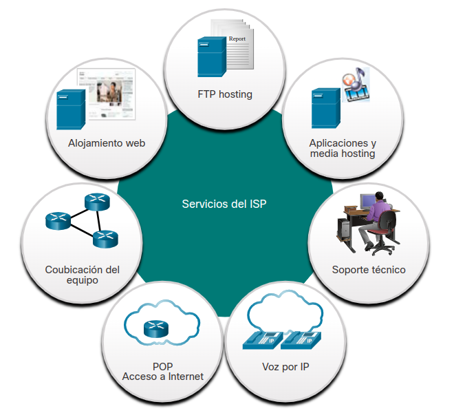
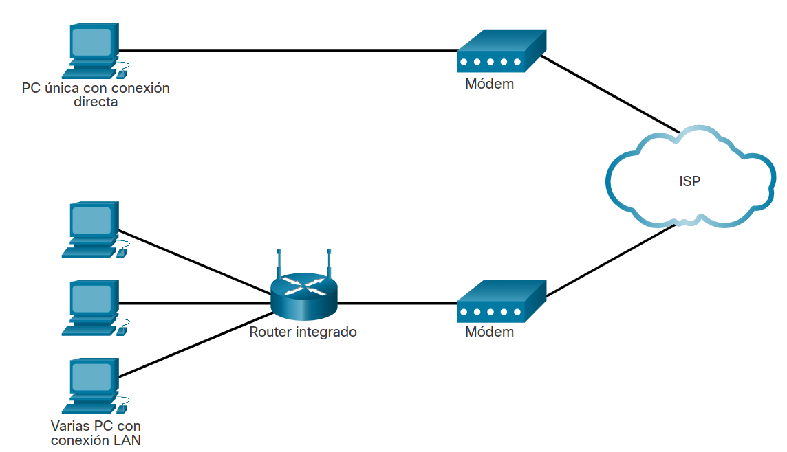
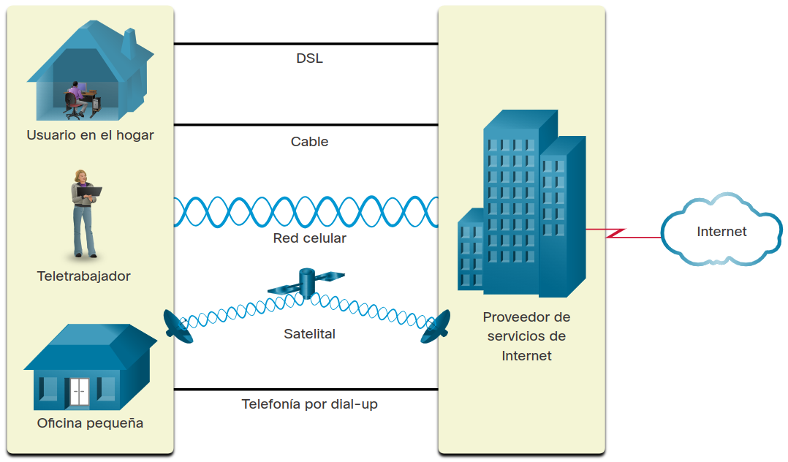
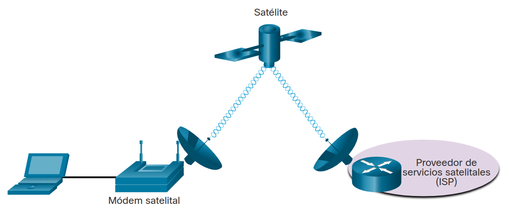

<a href="./00-Curso.md"><< Menú principal del módulo</a>

# 2. Componentes, tipos y conexiones de red
## Clientes y Servidores
### Roles de cliente y servidor
Todas las PC conectadas a una red que participan directamente en las comunicaciones de la red se clasifican como hosts. Los hosts pueden enviar y recibir mensajes a través de la red. En las redes modernas, las PC hosts pueden actuar como cliente, servidor o ambos, como se muestra en la figura. El software instalado en la computadora determina cuál es la función que cumple la computadora.

Los servidores son hosts con software instalado que les permite proporcionar información, por ejemplo correo electrónico o páginas web, a otros hosts de la red. Cada servicio requiere un software de servidor independiente. Por ejemplo, para proporcionar servicios Web a la red, un host necesita un software de servidor Web. Cada destino que visita en línea es ofrecido por un servidor ubicado en alguna parte de una red que está conectada a Internet global.

Los clientes son computadoras host que tienen instalado un software que les permite solicitar información al servidor y mostrar la información obtenida. Un ejemplo de software cliente son los navegadores web como Internet Explorer, Safari, Mozilla Firefox o Chrome.

### Redes entre pares
El software de servidor y el de cliente normalmente se ejecutan en computadoras distintas, pero también es posible que una misma computadora los ejecute a ambos a la vez. En pequeñas empresas y hogares, muchas PC funcionan como servidores y clientes en la red. Este tipo de red se denomina red entre pares (Peer-to-Peer - P2P).

La red P2P más simple consta de dos computadoras conectadas directamente mediante una conexión por cable o inalámbrica. Ambas computadoras pueden utilizar esta red simple para intercambiar datos y servicios entre sí; para ello, actuarán como cliente o servidor según sea necesario.

También se pueden conectar varias PC para crear una red P2P más grande, pero esto requiere un dispositivo de red, como un conmutador, para interconectar las computadoras.

La principal desventaja de un entorno P2P es que el rendimiento de un host puede verse afectado si éste actúa como cliente y servidor a la vez. En la figura se enumeran algunas de las ventajas y desventajas de las redes entre pares.
En empresas más grandes, en las que el tráfico de red puede ser intenso, con frecuencia es necesario tener servidores dedicados para poder responder a la gran cantidad de solicitudes de servicio.

Las ventajas de las redes entre pares:
* Fácil de configurar.
* Menos complejo.
* Menor costo porque es posible que no se necesiten dispositivos de red ni servidores dedicados.
* Se pueden utilizar para tareas sencillas como transferir archivos y compartir impresoras.

Las desventajas de las redes entre pares:
* La administración no está centralizada.
* No son tan seguras.
* No son escalables.
* Todos los dispositivos pueden funcionar como clientes y como servidores, lo que puede lentificar el rendimiento.

### Aplicaciones entre pares
Una aplicación P2P permite que un dispositivo funcione como cliente y como servidor dentro de la misma comunicación, como se muestra en la figura. En este modelo, cada cliente es un servidor y cada servidor es un cliente. Las aplicaciones P2P requieren que cada terminal proporcione una interfaz de usuario y ejecute un servicio en segundo plano.

Algunas aplicaciones P2P utilizan un sistema híbrido donde se descentraliza el intercambio de recursos, pero los índices que apuntan a las ubicaciones de los recursos están almacenados en un directorio centralizado. En un sistema híbrido, cada punto accede a un servidor de índice para obtener la ubicación de un recurso almacenado en otro punto.

### Múltiples Roles en la Red
Una computadora con software de servidor puede proporcionar servicios simultáneamente a uno o muchos clientes, tal como se indica en la figura.

Además, una única PC puede ejecutar varios tipos de software de servidor. En una negocio doméstico o pequeño, puede ser necesario que una PC funcione como servidor de archivos, servidor web y servidor de correo electrónico.

Una única PC también puede ejecutar varios tipos de software de cliente. Debe haber un software de cliente para cada servicio requerido. Si un host tiene varios clientes instalados, puede conectarse a varios servidores de manera simultánea. Por ejemplo, un usuario puede consultar el correo electrónico y ver una página web mientras envía mensajes instantáneos y escucha la radio por Internet.

## Componentes de la red
### Infraestructura de red
El trayecto que toma un mensaje desde el origen al destino puede ser tan simple como un solo cable que conecta una computadora con otra o tan complejo como una red que, literalmente, abarca todo el planeta. Esta infraestructura de red es la plataforma que da soporte a la red. Proporciona el canal estable y confiable por el cual se producen las comunicaciones.

La infraestructura de red contiene tres categorías de componentes de hardware:
* Dispositivos finales.
* Dispositivos intermedios.
* Medios de red.

Los dispositivos y los medios son los elementos físicos o hardware de la red. Por lo general, el hardware está compuesto por los componentes visibles de la plataforma de red, como una PC portátil, una PC, un switch, un router, un punto de acceso inalámbrico o el cableado que se utiliza para conectar estos dispositivos. A veces, puede que algunos componentes no sean visibles. En el caso de los medios inalámbricos, los mensajes se transmiten a través del aire mediante radio frecuencias invisibles u ondas infrarrojas.

Haga una lista de los componentes de la infraestructura de red instalados en su red doméstica. Incluya los cables o puntos de acceso inalámbrico que proporcionan sus conexiones de red.

### Dispositivos finales
Los dispositivos de red con los que las personas están más familiarizadas se denominan “dispositivos finales” o “hosts”. Estos dispositivos forman la interfaz entre los usuarios y la red de comunicación subyacente.

Algunos ejemplos de dispositivos finales son:
* Computadores (estaciones de trabajo, PC portátiles, servidores de archivos, servidores web).
* Impresoras de red.
* Teléfonos y equipo de teleconferencias.
* Cámaras de seguridad.
* Dispositivos móviles (como smartphones, tablets, PDA y lectores inalámbricos de tarjetas de débito y crédito, y escáneres de códigos de barras).

Un dispositivo final (o host) es el origen o el destino de un mensaje transmitido a través de la red. Para identificar los hosts de forma exclusiva, se usan direcciones. Cuando un host inicia la comunicación, utiliza la dirección del host de destino para especificar a dónde se debe enviar el mensaje.

## Opciones de Conectividad al ISP
### Servicios del ISP
Un Proveedor de Servicios de Internet (ISP) constituye el eslabón entre la red doméstica y la Internet. Un ISP puede ser el proveedor de cable local, un proveedor de servicio de telefonía fija, la red celular que brinda su servicio de teléfono inteligente o un proveedor independiente que alquila ancho de banda en la infraestructura de red física de otra empresa.

Muchos ISP también ofrecen servicios adicionales a sus suscriptores. Estos servicios pueden incluir cuentas de correo electrónico, almacenamiento en red y _hosting_ de sitios web, además de servicios automatizados de copia de respaldo o seguridad.

	

Los ISP son fundamentales para las comunicaciones a través de la red global de Internet. Cada ISP se conecta a otros ISP para formar una red de enlaces que interconectan usuarios en todo el mundo. Los ISP están conectados de una manera jerárquica que garantiza que el tráfico de Internet generalmente tome el camino más corto desde el origen hasta el destino.

La red troncal de Internet es como una súper autopista de la información que proporciona enlaces de datos de alta velocidad para conectar las diversas redes de proveedores de servicios en las principales áreas metropolitanas de todo el mundo. El medio principal que conecta la red troncal de Internet es el cable de fibra óptica. Generalmente, este cable se instala bajo tierra para conectar ciudades dentro de un continente. Los cables de fibra óptica también se tienden bajo el mar para conectar continentes, países y ciudades.

### Conexiones de ISP
La interconexión de los ISP que conforman la red troncal de Internet es una red compleja de cables de fibra óptica con conmutadores y enrutadores de red costosos que dirigen el flujo de información entre los hosts de origen y de destino. Los usuarios domésticos promedio no conocen la infraestructura fuera de su red. Para un usuario doméstico, la conexión al ISP es un proceso bastante simple.

La parte superior de la figura muestra la opción de conexión a un ISP más simple. Es un módem que proporciona una conexión directa entre una computadora y el ISP. Sin embargo, esta opción no debería utilizarse porque su computadora no está protegida en Internet.

Como se muestra en la parte inferior de la figura, necesita un enrutador para conectar con seguridad una computadora a un ISP. Esta es la opción de conexión más común. Consiste en utilizar un enrutador integrado inalámbrico para conectarse al ISP. El enrutador incluye un conmutador para conectar hosts cableados y un AP inalámbrico para conectar hosts inalámbricos. El enrutador también proporciona información de direccionamiento IP del cliente y seguridad para los hosts internos.

	

### Conexiones de Cable y DSL
La mayoría de los usuarios de redes domésticas no se conectan a sus proveedores de servicios con cables de fibra óptica. En la figura se ilustran opciones de conexión comunes para oficinas pequeñas y usuarios residenciales. Los dos métodos más comunes son los siguientes:

* __Cable__. Por lo general, es un servicio ofrecido por proveedores de servicios de televisión por cable. La señal de datos de Internet se transmite a través del mismo cable coaxial que transporta la señal de televisión por cable. Esta opción proporciona una conexión a Internet siempre activa y de un ancho de banda elevado. Se utiliza un módem por cable especial que separa la señal de datos de Internet de las otras señales que transporta el cable y proporciona una conexión Ethernet a un equipo host o a una LAN.
* __DSL__. La Línea de Suscriptor Digital proporciona una conexión a Internet siempre activa y de un ancho de banda elevado. Requiere un módem de alta velocidad especial que separa la señal DSL de la señal telefónica y proporciona una conexión Ethernet a un equipo host o a una LAN. La señal DSL se transmite a través de una línea telefónica, que está dividida en tres canales. Uno de los canales se utiliza para llamadas telefónicas de voz. Este canal permite que una persona reciba llamadas telefónicas sin desconectarse de Internet. El segundo es un canal de descarga más rápido y se utiliza para recibir información de Internet. El tercer canal se utiliza para enviar o subir información. Por lo general, este canal es un poco más lento que el canal de descarga. La calidad y velocidad de la conexión DSL depende principalmente de la calidad de la línea telefónica y de la distancia desde la oficina central de su compañía telefónica. Cuanto más lejos esté de la oficina central, más lenta será la conexión.

	

### Opciones de Conectividad Adicionales
Otras opciones de conexión a un ISP para usuarios domésticos incluyen las siguientes:

* __Red celular__. El acceso a Internet celular utiliza una red de telefonía celular para conectarse. En cualquier lugar donde tenga cobertura de telefonía móvil, puede tener acceso a Internet. El rendimiento se verá limitado por las capacidades del teléfono y la torre celular a la que se conecte. La disponibilidad del acceso a Internet por redes celulares es una gran ventaja para gente que vive en áreas sin acceso a otro tipo de conectividad a Internet, o para personas que van siempre de un lado a otro. La desventaja de la conectividad celular es que la empresa que presta el servicio suele medir el uso del ancho de banda de la conexión y puede cobrar tarifas adicionales por el ancho de banda que supere el plan de datos contratado.
* __Satélite__. El servicio satelital es una buena opción para hogares u oficinas que no tienen acceso a DSL o cable. Las antenas parabólicas (ver la figura) requieren una línea de visión despejada hasta el satélite, por lo que podrían no ser adecuadas para zonas muy boscosas o lugares que posean algún otro tipo de obstrucción aérea. Las velocidades varían según el contrato, pero suelen ser buenas. Los costos de equipos e instalación pueden ser elevados (consulte con el proveedor para conocer las ofertas especiales) y luego se paga una tarifa mensual módica. Al igual que en el caso del acceso por redes celulares, la disponibilidad del acceso satelital a Internet es una gran ventaja para áreas que no tienen acceso a otro tipo de conectividad a Internet.
* __Teléfono de marcación__. Una opción económica que utiliza cualquier línea telefónica y un módem. Para conectarse al ISP, el usuario llama al número telefónico de acceso del ISP. El bajo ancho de banda proporcionado por una conexión de módem de acceso telefónico generalmente no es suficiente para una gran transferencia de datos, aunque es útil para el acceso móvil mientras viaja. La opción de conexión de módem de acceso telefónico solo se debe considerar cuando no haya opciones de conexión más veloces disponibles.

En áreas metropolitanas, muchos departamentos y oficinas pequeñas se conecten directamente mediante cables de fibra óptica. Esto permite que los proveedores de servicios de Internet proporcionen velocidades de ancho de banda más elevadas y admitan más servicios, como internet, teléfono y TV.

Las opciones de conexión varían según la ubicación geográfica y la disponibilidad del proveedor de servicios.

	

## Resumen

### Clientes y servidores
Todas las PC conectadas a una red que participan directamente en las comunicaciones de la red se clasifican como hosts. Los hosts pueden enviar y recibir mensajes a través de la red. En las redes modernas, las computadoras que son hosts pueden actuar como clientes, servidores o ambos. El software instalado en la computadora determina cuál es la función que cumple la computadora.

El software de servidor y el de cliente normalmente se ejecutan en computadoras distintas, pero también es posible que una misma computadora los ejecute a ambos a la vez. En pequeñas empresas y hogares, muchas PC funcionan como servidores y clientes en la red. Este tipo de red se denomina red P2P (peer-to-peer o redes entre pares). En empresas más grandes, en las que el tráfico de red puede ser intenso, con frecuencia es necesario tener servidores dedicados para poder responder a la gran cantidad de solicitudes de servicio. Las redes P2P son fáciles de configurar, menos complejas, de menor costo y se pueden usar para tareas simples como transferir archivos y compartir impresoras. Sin embargo, no existe una administración centralizada. Tienen menos seguridad, no son escalables y pueden funcionar más lento.

### Componentes de la Red
Hay símbolos que representan varios tipos de equipos de red. La infraestructura de red es la plataforma que da soporte a la red. Proporciona el canal estable y confiable por el cual se producen las comunicaciones. La infraestructura de red contiene tres categorías de componentes de hardware: dispositivos finales, dispositivos intermedios y medios de red. Por lo general, el hardware está compuesto por los componentes visibles de la plataforma de red, como una PC portátil, una PC, un switch, un router, un punto de acceso inalámbrico o el cableado que se utiliza para conectar estos dispositivos. Los componentes que no son visibles incluyen medios inalámbricos.
Los dispositivos finales, o hosts, forman la interfaz entre los usuarios y la red de comunicación subyacente. Algunos ejemplos de dispositivos finales incluyen:

* Computadores (estaciones de trabajo, PC portátiles, servidores de archivos, servidores web)
* Impresoras de red
* Teléfonos y equipo de teleconferencias
* Cámaras de seguridad
* Dispositivos móviles (como teléfonos inteligentes, tabletas, PDA y lectores de tarjetas de crédito/débito inalámbricos y lectores de códigos de barras)

### Opciones de Conectividad al ISP
Un Proveedor de Servicios de Internet (ISP) constituye el eslabón entre la red doméstica y la Internet. Un ISP puede ser el proveedor de cable local, un proveedor de servicio de telefonía fija, la red celular que brinda su servicio de teléfono inteligente o un proveedor independiente que alquila ancho de banda en la infraestructura de red física de otra empresa. Cada ISP se conecta a otros ISP para formar una red de enlaces que interconectan usuarios en todo el mundo. Los ISP están conectados de una manera jerárquica que garantiza que el tráfico de Internet generalmente tome el camino más corto desde el origen hasta el destino.

La interconexión de los ISP que conforman la red troncal de Internet es una red compleja de cables de fibra óptica con conmutadores y enrutadores de red costosos que dirigen el flujo de información entre los hosts de origen y de destino.

Para un usuario doméstico, la conexión al ISP es un proceso bastante simple. Esta es la opción de conexión más común. Consiste en utilizar un enrutador integrado inalámbrico para conectarse al ISP. El enrutador incluye un conmutador para conectar hosts cableados y un AP inalámbrico para conectar hosts inalámbricos. El enrutador también proporciona información de direccionamiento IP del cliente y seguridad para los hosts internos. Los dos métodos más comunes son cable y DSL. Otras opciones incluyen telefonía celular, satelital y telefónica.

## Enlaces de interés
 
 
 
 
 
 
 
 
<a href="#2-componentes-tipos-y-conexiones-de-red">⬆️</a>
<a href="./00-Curso.md"><< Menú principal del módulo</a>