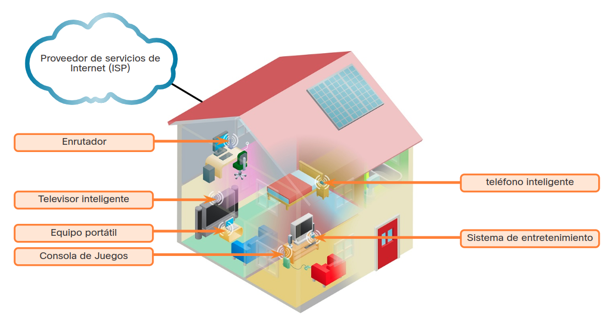
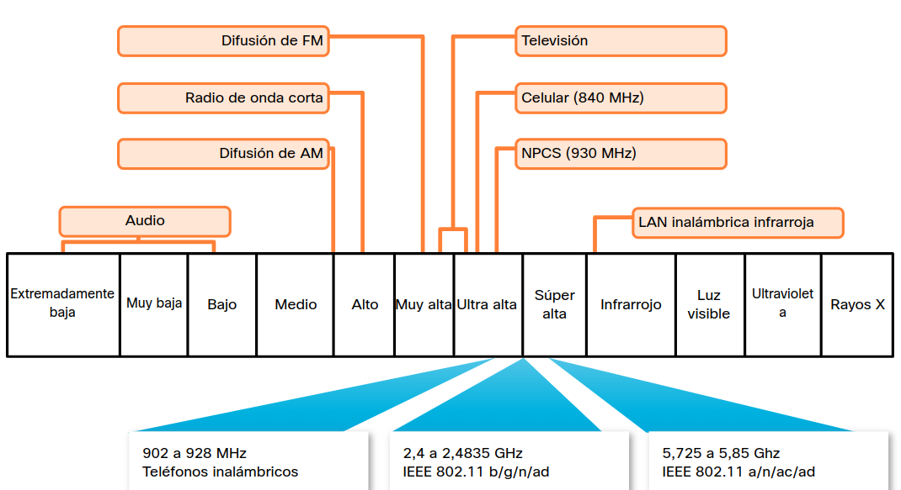
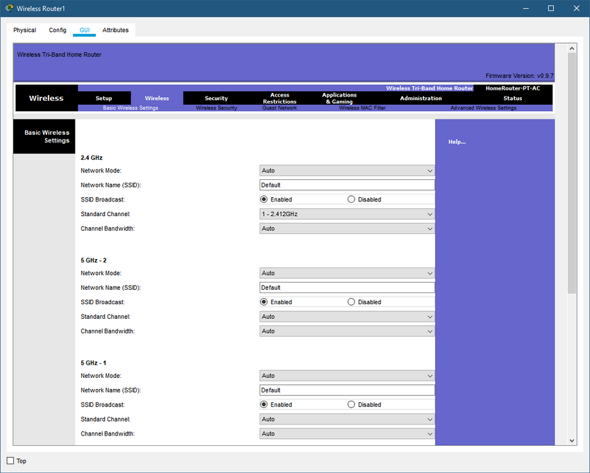

<a href="./00-Curso.md"><< Menú principal del módulo</a>

# 4. Crear una red doméstica
## Conceptos básicos de Redes Dométicas
### Componentes de una Red Doméstica
Además de un enrutador integrado, muchos tipos diferentes de dispositivos podrían conectarse a una red doméstica, tal como se indica en la figura. Estos son algunos ejemplos:

* Computadoras de escritorio.
* Sistemas de juegos.
* Sistemas de televisores inteligentes.
* Impresoras.
* Escáneres.
* Cámaras de seguridad.
* Teléfonos.
* Dispositivos de control del clima.

A medida que lleguen nuevas tecnologías al mercado, cada vez más funciones del hogar dependerán de una red para proporcionar conectividad y control.

	

### Enrutadores de Red Domésticos Típicos
Los enrutadores domésticos y de pequeñas empresas suelen tener dos tipos de puertos principales:

* Puertos Ethernet. Estos puertos se conectan a la parte del conmutador interno del enrutador. Estos puertos generalmente están etiquetados como "Ethernet" o "LAN". Todos los dispositivos conectados a los puertos del conmutador están en la misma red local.
* Puerto de Internet. Este puerto se utiliza para conectar el dispositivo a otra red. El puerto de Internet conecta el enrutador a una red diferente a la de los puertos Ethernet. Este puerto a menudo se utiliza para conectarse al cable módem o módem DSL para acceder a Internet.

Además de los puertos cableados, muchos enrutadores domésticos incluyen una antena de radio y un punto de acceso inalámbrico integrado. De manera predeterminada, los dispositivos inalámbricos están en la misma red local que los que están conectados físicamente en los puertos de switch de la red LAN. El puerto de Internet es el único puerto que está en una red diferente en la configuración predeterminada.

## Tecnologías de Red en el Hogar
### Frecuencias Inalámbricas LAN
Las tecnologías inalámbricas usadas con más frecuencia en las redes domésticas se encuentran en los rangos de frecuencia de 2.4 GHz y 5 GHz.

Bluetooth es una tecnología que utiliza la banda de 2.4 GHz. Se limita a comunicaciones de baja velocidad y corto rango, pero tiene la ventaja de comunicarse con muchos dispositivos al mismo tiempo. Estas comunicaciones de uno a varios dispositivos han hecho que la tecnología Bluetooth sea el método preferido para conectar periféricos de computadora, como mouse, teclados e impresoras. Bluetooth es un buen método para transmitir audio a altavoces o auriculares.

Otras tecnologías que utilizan las bandas de 2.4 GHz y 5 GHz son las modernas tecnologías LAN inalámbricas que cumplen con los distintos estándares IEEE 802.11. A diferencia de la tecnología Bluetooth, los dispositivos 802.11 transmiten a un nivel de potencia mucho más alto, lo que les brinda un gran alcance y un rendimiento mejorado. Ciertas áreas del espectro electromagnético pueden utilizarse sin un permiso.

La figura muestra dónde se sitúan las tecnologías inalámbricas en el espectro electromagnético.

	

### Tecnologías para Redes Cableadas
Aunque muchos dispositivos de redes domésticas admiten comunicaciones inalámbricas, aún hay algunas aplicaciones que se benefician de una conexión de conmutador cableada que no se comparte con otros usuarios de la red.

El protocolo cableado implementado más comúnmente es el protocolo Ethernet. Ethernet utiliza un conjunto de protocolos que permiten que los dispositivos de red se comuniquen a través de una conexión LAN cableada. Una LAN Ethernet puede conectar dispositivos con muchos tipos diferentes de medios de cableado.

Los dispositivos conectados directamente utilizan un cable de conexión Ethernet, generalmente de par trenzado no blindado. Estos cables se pueden comprar con los conectores RJ-45 ya instalados, y vienen en diversas longitudes. En las viviendas más modernas es posible que ya haya tomas Ethernet cableadas en las paredes. En el caso de viviendas que no tengan cableado UTP, se pueden utilizar otras tecnologías, como las líneas eléctricas, para distribuir conectividad cableada por los distintos espacios.

* Cable categoría 5e. La categoría 5e es el cableado más común utilizado en una LAN. El cable consta de cuatro pares de hilos trenzados para reducir la interferencia eléctrica.
* Cable Coaxial. El cable coaxial tiene un alambre interno rodeado por una capa aislante tubular, que luego está rodeada por un blindaje conductor tubular. La mayoría de los cables coaxiales también tienen un revestimiento aislante externo.
* Cable de Fibra Óptica. Los cables de fibra óptica puede ser de vidrio o de plástico con un diámetro similar al de un cabello humano y puede transmitir información digital a velocidades muy rápidas a través de grandes distancias. Los cables de fibra óptica tienen un ancho de banda muy alto, lo que les permite transportar grandes cantidades de datos.

## Estándares Inalámbricos
### Redes Wi-Fi
Se ha desarrollado una cantidad de estándares para garantizar que los dispositivos inalámbricos puedan comunicarse. Especifican el espectro de RF utilizado, las velocidades de transmisión de datos, cómo se transmite la información y más. La principal organización responsable de la creación de estándares técnicos inalámbricos es el Instituto de Ingenieros Eléctricos y Electrónicos (IEEE).
El estándar IEEE 802.11 rige el entorno WLAN. Ciertas modificaciones al estándar IEEE 802.11 describen las características de los diferentes estándares para las comunicaciones inalámbricas. Los estándares inalámbricos para redes LAN usan las bandas de frecuencia de 2.4 GHz y 5 GHz. En conjunto, estas tecnologías se conocen como Wi-Fi.

Otra organización, conocida como la Alianza WiFi (WiFi Alliance), es responsable de probar los dispositivos LAN inalámbricos de distintos fabricantes. El logotipo WiFi en un dispositivo significa que ese equipo cumple con los estándares y debería interoperar con otros dispositivos del mismo estándar.

Los estándares inalámbricos están mejorando constantemente la conectividad y la velocidad de las redes WiFi. Es importante conocer los nuevos estándares a medida que se introducen porque los fabricantes de dispositivos inalámbricos implementarán estos estándares rápidamente en sus nuevos productos.

### Configuración inalámbrica
La interfaz de Configuración Inalámbrica Básica de Packet Tracer se muestra en la figura. Los enrutadores inalámbricos que usan los estándares 802.11 tienen muchos ajustes que se deben configurar. 

	

Las configuraciones son las siguientes:
* Modo de red. Determina el tipo de tecnología que debe admitirse. Por ejemplo, __802.11b__, __802.11g__, __802.11n__ o __Modo Mixto__.
* Nombre de la red (SSID). Utilizado para identificar la WLAN. Todos los dispositivos que deseen participar en la WLAN deben tener el mismo SSID.
* Canal estándar. Especifica el canal en el que se llevará a cabo la comunicación. La configuración predeterminada está establecida en __Auto__ para permitir que el AP (_Acces Point_) determine el canal óptimo para usar.
* Difusión de SSID. Determina si el SSID (_Service Set Identifier_) se transmitirá a todos los dispositivos dentro del alcance. De manera predeterminada está __Activado__ (_Enabled_).

#### Modo de Red

El protocolo 802.11 puede proporcionar un rendimiento superior según el entorno de red inalámbrica. Si todos los dispositivos inalámbricos se conectan con el mismo estándar 802.11, pueden obtenerse las máximas velocidades para ese estándar. Si el punto de acceso está configurado para aceptar solo un estándar 802.11, no pueden conectarse dispositivos que no utilicen ese estándar al punto de acceso.

Un entorno de red inalámbrica de modo mixto puede incluir dispositivos que utilizan cualquiera de los estándares WiFi existentes. Este entorno brinda fácil acceso a los dispositivos más antiguos que necesitan una conexión inalámbrica pero que no admiten los estándares más recientes.

Cuando se genera una red inalámbrica es importante que los componentes inalámbricos se conecten a la WLAN apropiada. Esto se logra mediante el uso de un SSID.

El SSID es una cadena alfanumérica, que distingue entre mayúsculas y minúsculas y consta de hasta 32 caracteres. Se envía en el encabezado de todas las tramas transmitidas por la WLAN. El SSID se utiliza para informar a los dispositivos inalámbricos y a las estaciones inalámbricas llamadas (STA) a qué red WLAN pertenecen y con qué otros dispositivos pueden comunicarse.

Utilizamos el SSID para identificar una red inalámbrica específica. Es esencialmente el nombre de la red. Los enrutadores inalámbricos generalmente transmiten sus SSID configurados de manera predeterminada. La difusión del SSID permite que otros dispositivos y clientes inalámbricos detecten automáticamente el nombre de la red inalámbrica. Si la transmisión del SSID está deshabilitada, debe introducir manualmente el SSID en los dispositivos inalámbricos.

Deshabilitar la transmisión del SSID puede hacer que a los clientes legítimos les resulte más difícil encontrar la red inalámbrica, Sin embargo, simplemente apagar la transmisión SSID no es suficiente para evitar que los clientes no autorizados se conecten a la red inalámbrica. Todas las redes inalámbricas deben utilizar el cifrado disponible más sólido para restringir el acceso no autorizado.

## Configurar un Enrutador Doméstico
### Configuración Inicial
Muchos enrutadores inalámbricos diseñados para el uso doméstico tienen una utilidad de configuración automática que se puede usar para configurar los ajustes básicos del enrutador. Estas utilidades requieren una PC o computadora portátil conectada a un puerto cableado en el enrutador. Si no hay ningún dispositivo disponible con una conexión cableada, puede ser necesario primero configurar el software de cliente inalámbrico en la computadora portátil o tableta.

Para conectarse al enrutador mediante una conexión cableada, conecte un cable de conexión Ethernet al puerto de red de la computadora. Conecte el otro extremo a un puerto LAN del router. No conecte el cable al puerto o a la interfaz con la etiqueta de "Internet". El puerto de Internet se conectará al módem DSL o cable módem. Algunos enrutadores domésticos pueden tener un módem incorporado para conexiones a Internet. Si este es el caso, verifique que el tipo de conexión sea el correcto para su servicio de Internet. Una conexión de cable módem tendrá un terminal coaxial para aceptar un conector de tipo BNC. Una conexión DSL tendrá un puerto para un cable de tipo telefónico, generalmente un conector RJ-11.

Después de confirmar que la computadora está conectada al router de la red y de que se enciendan las luces de enlace de la NIC (_Network Interface Card_) para indicar que la conexión está funcionando, la computadora necesita una dirección IP. La mayoría de los enrutadores de red se configuran de modo que la computadora reciba una dirección IP automáticamente de un servidor DHCP local. Si la computadora no tiene una dirección IP, consulte la documentación del router y configure la PC o la tableta con una dirección IP única, una máscara de subred, una puerta de enlace predeterminada e información de DNS.

### Consideraciones de Diseño
Antes de ingresar la utilidad de configuración, o de configurar manualmente el enrutador a través de un navegador web, debe considerar cómo se usará la red. No querrá configurar el enrutador y que esa configuración limite las capacidades de la red; pero tampoco querrá dejar su red sin protección.
* __¿Cómo se debería llamar mi red?__ Si la difusión del SSID está activada, todos los clientes inalámbricos pueden ver el nombre SSID dentro del rango de la señal. Muchas veces el SSID revela demasiada información sobre la red a dispositivos cliente desconocidos. No se recomienda incluir el modelo ni la marca del dispositivo como parte del SSID. Los dispositivos inalámbricos tienen configuraciones predeterminadas que son fáciles de encontrar en Internet, así como debilidades de seguridad conocidas.
* __¿Qué tipos de dispositivos se conectarán a mi red?__ Los dispositivos inalámbricos contienen transmisor/receptores de radio que funcionan dentro de un rango de frecuencias específico. Si un dispositivo solo tiene la radio necesaria para 802.11 b/g, no se conectará si el enrutador o punto de acceso inalámbricos están configurados para admitir solo los estándares 802.11n u 802.11ac. Si todos los dispositivos admiten el mismo estándar, la red funcionará a su velocidad óptima. Si tiene dispositivos que no son compatibles con los estándares 802.11n o 802.11ac, deberá habilitar el modo heredado. Un entorno de red inalámbrica de modo heredado varía según el modelo de enrutador, pero puede incluir una combinación de 802.11a, 802.11b, 802.11g, 802.11n y 802.11ac. Este entorno proporciona un acceso sencillo a dispositivos antiguos que requieran conexión inalámbrica.
* __¿Cómo agrego nuevos dispoisitivos?__ La decisión respecto de quién puede acceder a su red doméstica debe tomarse según cómo planee usar la red. En algunos enrutadores inalámbricos, es posible configurar el acceso de invitados. Se trata de un área de cobertura de SSID especial que permite el acceso abierto, pero restringe dicho acceso a usar Internet solamente.
	* __Nota__: Algunos enrutadores inalámbricos pueden etiquetar el modo heredado como modo mixto.

### _Packet Tracer_. Configurador de cliente y enrutador inalámbrico
En esta actividad de Packet Tracer, completará los siguientes objetivos.
* __Parte 1__: Conectar los dispositivos
* __Parte 2__: Configurar el enrutador inalámbrico
* __Parte 3__: Configurar el direccionamiento IP y probar la conectividad

##### Aspectos básicos/Situación
Su amiga, Natsumi, escuchó que usted está estudiando redes. Le pidió que viniera y la ayudara a conectar su nuevo hogar a la red de televisión por cable. Debe conectar los cables correctos a los dispositivos correctos, conectar los dispositivos a un router inalámbrico doméstico y configurar el router para proporcionar direcciones IP a los clientes de la red. Natsumi también desea que configure una LAN inalámbrica para su red doméstica, por lo que también deberá configurarla. Usted está seguro de que este será un proceso fácil y que la red se configurará en muy poco tiempo.

##### Instrucciones
* __Parte 1__: Conectar los dispositivos. El área de trabajo muestra el interior de la casa de su amigo. Desplácese por la ventana para tener una idea del diseño de la casa y la ubicación de los dispositivos. En esta parte, conectará todos los dispositivos etiquetados.
	* __Paso 1__: Conectar los cables coaxiales. La empresa de cable de Natsumi ofrece servicios de Internet y video a su hogar a través de un cable coaxial. El cable está conectado a una salida en su casa. Un dispositivo divisor separa el servicio de datos de Internet del servicio de video. Esto permite que los dos servicios se conecten a los dispositivos correspondientes. Conectará el servicio de Internet al cable módem y el servicio de video al televisor.
		1. En Componentes de red, haga clic en Conexiones (el rayo).
		2. Busque y haga clic en el icono del cable coaxial. Es el icono azul en zigzag.
		3. Haga clic en Cable Splitter y seleccione el puerto Coaxial1.
		4. Haga clic en Cable Modem y seleccione Port 0.
		5. Repita los pasos anteriores para conectar el cable coaxial 2 en el divisor de cable al puerto 0 del televisor.
		6. Haga clic en TV y luego en ON para Estado. Si las conexiones son correctas, verá una imagen que representa un programa de TV.
	* __Paso 2__: Conectar los cables de red. Hay dos PC en la casa de Natsumi. No tienen adaptadores LAN inalámbricos, por lo que se conectarán con cables Ethernet. El router inalámbrico doméstico es el centro de la red. Permite que los dispositivos configurados en la red doméstica se comuniquen entre sí y con Internet. El router incluye un switch de red que acepta conexiones cableadas para hasta cuatro hosts. Conectará las PC a estos puertos.

		Para que el router inalámbrico doméstico acceda a Internet a través de la red del proveedor de televisión por cable, el cable módem debe estar conectado al puerto de Internet del router inalámbrico doméstico. Esto se hace con un cable directo de cobre.
		1. Haga clic en Conexiones y después en el Cable de cobre directo. Parece una línea negra sólida.
		2. Conecte el puerto 1 del módem por cable al puerto de Internet del router inalámbrico doméstico.
		3. Haga clic en la PC de oficina y conecte el cable al puerto FastEthernet0. Busque el router inalámbrico doméstico y haga clic en él. Conecte el otro extremo del cable al puerto GigabitEthernet 1 para completar la conexión.
		4. Repita los pasos anteriores para conectar la PC de dormitorio al puerto GigabitEthernet 2 del router inalámbrico doméstico.

		La red doméstica cableada ahora está completamente conectada a Internet a través de la red del proveedor de televisión por cable.

* __Parte 2__: Configurar el router inalámbrico. La mayoría de los routers inalámbricos domésticos se configuran mediante una interfaz gráfica de usuario (GUI) a la que se accede a través del navegador web de la computadora. En esta parte, accederá al router inalámbrico doméstico a través del navegador en la PC de oficina y configurará la red doméstica de Natsumi.
	* __Paso 1__: Acceder a la GUI del router inalámbrico doméstico.
		1. Haga clic en PC de la oficina> pestaña Escritorio y luego en Configuración de IP.
		2. Haga click en DHCP. DHCP configurará automáticamente la PC de oficina para que esté en la misma red IP que el router inalámbrico doméstico.
		3. Después de un breve retraso, los valores para la configuración de IP deben actualizarse automáticamente. La dirección IPv4 debe comenzar con el número 192. Si no es así, haga clic en Fast Forward Time (Tiempo de avance rápido), que se encuentra justo debajo de la topología de red en la esquina inferior izquierda. Esto acelerará la simulación de DHCP.
		4. Tome nota de la dirección de la puerta de enlace predeterminada. La puerta de enlace predeterminada es el dispositivo que proporciona a los dispositivos de la red doméstica acceso a redes externas, como Internet. En este caso, la dirección de la puerta de enlace predeterminada es la dirección del enrutador inalámbrico doméstico.
		5. Manteniendo la ventana de la PC de oficina abierta, cierre la ventana de configuración de IP y luego haga clic en el navegador web. Ingrese la dirección IP del router inalámbrico doméstico (la dirección de la puerta de enlace predeterminada) en el cuadro URL y haga clic en Ir.
		6. Los routers domésticos recién instalados se configuran con credenciales predeterminadas. Use admin tanto para el nombre de usuario y la contraseña. Ahora debería ver aparecer la GUI del router inalámbrico doméstico y estar listo para configurar la red de Natsumi. Ajuste el tamaño de la ventana, según sea necesario, para ver más de la interfaz.

		__Nota__: Las contraseñas predeterminadas en dispositivos reales deben cambiarse inmediatamente porque es ampliamente conocido, incluyento a los agentes de amenaza.

	* __Paso 2__: Configurar ajustes básicos. En este paso, configurará un nuevo nombre de usuario y contraseña para el router inalámbrico y limitará la cantidad de direcciones IP que DHCP emitirá a hosts que estén conectadas a la red.

		Natsumi solo tiene unos pocos dispositivos para conectar la red, y no tendrá muchos amigos. Ella piensa que no más de 10 dispositivos se conectarían a su red al mismo tiempo. Decide reducir el número de usuarios a 10. Su amiga vive en una parte densamente poblada de la ciudad, por lo que es posible que muchas personas puedan ver su red inalámbrica.

		1. Actualmente está viendo las opciones de configuración en la pestaña Configuración. Localice el área de Network Setup (Configuración de red). Aquí es donde puede configurar el servidor DHCP del router. Busque el campo Número máximo de usuarios e introduzca 10. Desplácese hasta la parte de abajo de la página y haga clic en Save Settings (Guardar configuración). Debe guardar la configuración en cada página de la GUI en la que realice cambios.

		__Nota__: es posible que pierda la conexión con el router. Haga clic en Ir en el navegador web para volver a cargar la página de la GUI. Es posible que deba cerrar el navegador web, hacer clic en Configuración de IP y alternar entre DHCP y Estático para actualizar el direccionamiento IP para PC de oficina. Luego verifique que la PC de oficina tenga una configuración de dirección IP que comience con 192, abra el navegador web nuevamente, ingrese la dirección IP del router y vuelva a autenticarse con admin como credenciales predeterminadas.

		2. Haga clic en la pestaña administration. Aquí, puede cambiar la contraseña admin predeterminada. Ingrese y confirme MyPassword1! como la nueva contraseña. Desplácese hasta la parte inferior de la página y haga clic en Save Settings (Guardar configuración). Se le pedirá que inicie sesión nuevamente. Ingrese admin como nombre de usuario y MyPassword1! como nueva contraseña y haga clic en Continuar.

	* __Paso 3__: Configurar la LAN inalámbrica. En este punto, está listo para configurar la red inalámbrica de Natsumi para que pueda conectar sus dispositivos inalámbricos a Internet a través de Wi-Fi.
		1. Desplácese hacia la parte superior de la ventana y haga clic en la pestaña Inalámbrico.
		2. Para la red de 2,4 GHz, haga clic en Habilitar para activar la radio de red.
		3. Cambie el nombre de la red (SSID) de Default a MyHome. Cuando las personas buscan redes Wi-Fi para conectarse, verán este nombre de red. El nombre de la red puede estar oculto, pero esto puede dificultar un poco la conexión de los invitados a la red. Desplácese hasta la parte inferior de la página y haga clic en Save Settings (Guardar configuración).
		4. Ahora configurará la seguridad en la red MyHome. Esto evitará que personas no autorizadas se conecten a la red inalámbrica. Desplácese hasta la parte superior de la ventana y luego haga clic en Seguridad inalámbrica en la pestaña Inalámbrico.
		5. Tenga en cuenta que la seguridad está actualmente deshabilitada en las tres redes inalámbricas. Solo utiliza la red de 2,4 GHz. Haga clic en el menú desplegable de la red de 2,4 GHz y seleccione WPA2 Personal. Esta es la seguridad más sólida que ofrece este router para redes inalámbricas.
		6. Se revelan más configuraciones. WPA2 Personal requiere una frase de contraseña que debe introducir cualquier persona que desee conectarse a la red inalámbrica. Ingrese MyPassPhrase1! como la frase de contraseña. Tenga en cuenta que las mayúsculas son importantes.
		7. Desplácese hasta la parte inferior de la página, haga clic en Guardar configuración y cierre el navegador web de la PC de oficina.

* __Parte 3__: Configurar el direccionamiento IP y probar la conectividad. Ahora que el router está configurado, en esta parte configurará el direccionamiento IP para las PC y las computadoras portátiles y verificará que se puedan conectar a Internet.
	* __Paso 1__: Conecte la computadora portátil a la red inalámbrica.
		1. Haga clic en la computadora portátil en la sala de estar y luego en la pestaña Escritorio > PC inalámbrica.
		2. Haga clic en la pestaña Conectar. Después de un breve retraso, la red inalámbrica que configuró anteriormente aparecerá en la lista de nombres de redes inalámbricas.
		3. Haga clic en el nombre de la red que creó y luego en el botón Conectar.
		4. Ingrese la frase de contraseña que configuró antes para la red inalámbrica en el campo Clave precompartida (Pre-shared Key) y haga clic en Conectar.
		5. Haga clic en la pestaña de Información de enlace (Link Information). Debería ver el mensaje You have successfully connected to the access point (Se ha conectado correctamente al punto de acceso).
		6. Haga clic en el botón Más Información (More Information) para ver detalles sobre la conexión. Si la dirección IP no comienza con 192, haga clic en Fast Forward Time varias veces para acelerar la simulación.
		7. Cierre la aplicación PC Wireless y abra el navegador web. Verifique que la computadora portátil ahora pueda conectarse a skillsforall.srv, haciendo clic en Fast Forward Time (Tiempo de avance rápido) hasta que se cargue la página. Esto verifica que la computadora portátil tenga conectividad a Internet.

	* __Paso 2__: Pruebe la conectividad desde la PC de oficina. Usted sabe que la PC de Office puede conectarse a la red porque la utilizó para configurar el router. Sin embargo, ¿también puede acceder a Internet? Si puede, sabrá que la red cableada está correctamente conectada y configurada.
		1. Haga clic en PC de oficina > pestaña Escritorio > Navegador web.
		2. Ingrese skillsforall.srv y haga clic en Ir. Después de un breve retraso, verá aparecer la página web. Si es necesario, haga clic en Fast Forward Time varias veces para acelerar la convergencia. Cargar un sitio web externo verifica que la conectividad a Internet para la PC de oficina.
	* __Paso 3__: Configurar la PC de dormitorio.
		1. Para la PC de dormitorio, abra Configuración IP y configúrela como DHCP. Verifique que la PC del dormitorio recibió una dirección IP que comienza con 192.
		2. Cierre la ventana Configuración IP y haga clic en Web Browser (Navegador web). Verifique que la PC del dormitorio ahora pueda conectarse a skillsforall.srv, haciendo clic en Fast Forward Time (Tiempo de avance rápido) hasta que se cargue la página. Esto verifica que la PC del dormitorio tenga conectividad a Internet.

Ha completado la conexión de dispositivos de red, la configuración del router y la LAN inalámbrica, y la configuración de hosts para conectarse a la red. Todos los dispositivos deben poder conectarse a Internet. Su trabajo está hecho y Natsumi se ha ofrecido a prepararle la cena como recompensa por su ayuda.

## Resumen 
### Conceptos Básicos de Redes Domésticas
La mayoría de las redes domésticas constan de al menos dos redes separadas. La red pública procedente del proveedor de servicios. El router está conectado a Internet. Lo más probable es que el enrutador doméstico esté equipado con funcionalidades tanto cableadas como inalámbricas. Una red doméstica es una pequeña LAN con dispositivos que generalmente se conectan a un enrutador integrado y entre sí para intercambiar información.

La instalación de la tecnología inalámbrica es simple y económica. Las ventajas de la tecnología LAN inalámbrica incluyen movilidad, escalabilidad, flexibilidad, ahorro de costos, tiempo de instalación reducido y confiabilidad en entornos hostiles.

Además de un router integrado, hay muchos tipos diferentes de dispositivos que pueden conectarse a una red doméstica; por ejemplo, computadoras de escritorio, sistemas de juegos, sistemas de televisión inteligente, impresoras, escáneres, cámaras de seguridad y dispositivos de control de temperatura.

Los enrutadores domésticos y de pequeñas empresas suelen tener dos tipos principales de puertos: puertos Ethernet y puertos de Internet. Además de los puertos cableados, muchos enrutadores domésticos incluyen una antena de radio y un punto de acceso inalámbrico integrado.

### Tecnologías de Red en el Hogar
Las tecnologías inalámbricas utilizan ondas electromagnéticas para transportar información entre dispositivos. El espectro electromagnético incluye bandas de transmisión de radio y televisión, luz visible, rayos X y rayos gama. Algunos tipos de ondas electromagnéticas no son adecuados para transportar datos. Otras partes del espectro están reguladas por los Gobiernos y se otorgan licencias para aplicaciones específicas a varias organizaciones.

Ciertas secciones no autorizadas del espectro se incorporan a los productos de consumo, incluidos los routers Wi-Fi que se encuentran en la mayoría de los hogares.- Las tecnologías inalámbricas usadas con más frecuencia en las redes domésticas se encuentran en los rangos de frecuencia de 2.4 GHz y 5 GHz. Bluetooth es una tecnología que utiliza la banda de 2.4 GHz. Otras tecnologías que utilizan las bandas de 2.4 GHz y 5 GHz son las modernas tecnologías LAN inalámbricas que cumplen con los distintos estándares IEEE 802.11. A diferencia de la tecnología Bluetooth, los dispositivos 802.11 transmiten a un nivel de potencia mucho más alto, lo que les brinda un gran alcance y un rendimiento mejorado.

Aunque muchos dispositivos de red domésticos admiten comunicaciones inalámbricas, todavía hay algunas aplicaciones en las que los dispositivos se benefician de una conexión de interruptor por cable. El protocolo cableado implementado más comúnmente es el protocolo Ethernet. Los dispositivos conectados directamente utilizan un cable de conexión Ethernet, generalmente de par trenzado no blindado. La categoría 5e es el cableado más común utilizado en una LAN. El cable consta de cuatro pares de hilos trenzados para reducir la interferencia eléctrica. En el caso de viviendas que no tengan cableado UTP, se pueden utilizar otras tecnologías, como las líneas eléctricas, para distribuir conectividad cableada por los distintos espacios.

### Estándares Inalámbricos
El estándar IEEE 802.11 rige el entorno WLAN. Los estándares inalámbricos para redes LAN usan las bandas de frecuencia de 2.4 GHz y 5 GHz. En conjunto, estas tecnologías se conocen como Wi-Fi. La Alianza WiFi (Wi-Fi Alliance) es responsable de probar los dispositivos LAN inalámbricos de diferentes fabricantes.

Los enrutadores inalámbricos que usan los estándares 802.11 tienen muchos ajustes que se deben configurar. Las configuraciones son las siguientes:

* __Modo de red__. Determina el tipo de tecnología que debe admitirse. Por ejemplo, 802.11b, 802.11g, 802.11n o modo mixto.
* __Nombre de la red (SSID)__. Se utiliza para identificar la WLAN. Todos los dispositivos que deseen participar en la WLAN deben tener el mismo SSID.
* __Canal estándar__. Especifica el canal a través del cual se producirá la comunicación. La configuración predeterminada está establecida en Auto para permitir que el AP determine el canal óptimo para usar.
* __Transmisión de SSID__. Determina si el SSID se transmitirá a todos los dispositivos dentro del alcance. De manera predeterminada está Activado (Enabled).

El protocolo 802.11 puede proporcionar un rendimiento superior según el entorno de red inalámbrica. Si todos los dispositivos inalámbricos se conectan con el mismo estándar 802.11, pueden obtenerse las máximas velocidades para ese estándar. Si el punto de acceso está configurado para aceptar solo un estándar 802.11, no pueden conectarse dispositivos que no utilicen ese estándar al punto de acceso. Un entorno de red inalámbrica de modo mixto puede incluir dispositivos que utilizan cualquiera de los estándares WiFi existentes.

Cuando se genera una red inalámbrica es importante que los componentes inalámbricos se conecten a la WLAN apropiada. Esto se logra mediante el uso de un SSID. El SSID se utiliza para indicar a los dispositivos inalámbricos, llamados STA, a qué WLAN pertenecen y con qué otros dispositivos se pueden comunicar. La difusión del SSID permite que otros dispositivos y clientes inalámbricos detecten automáticamente el nombre de la red inalámbrica. Si la transmisión del SSID está deshabilitada, debe introducir manualmente el SSID en los dispositivos inalámbricos.

### Configurar un Enrutador Doméstico
Muchos enrutadores inalámbricos diseñados para el uso doméstico tienen una utilidad de configuración automática que se puede usar para configurar los ajustes básicos del enrutador. Para conectarse al enrutador mediante una conexión cableada, conecte un cable de conexión Ethernet al puerto de red de la computadora. Conecte el otro extremo a un puerto LAN del router.

Una vez que la computadora está conectada al enrutador de la red y las luces de enlace en la NIC indican una conexión que funciona, la computadora necesita una dirección IP. La mayoría de los enrutadores de red se configuran de modo que la computadora reciba una dirección IP automáticamente de un servidor DHCP local.

Antes de ingresar la utilidad de configuración, o de configurar manualmente el enrutador a través de un navegador web, debe considerar cómo se usará la red. Considere cómo llamará a su red y qué dispositivos deben conectarse a su red. No es una buena práctica incluir el modelo o la marca del dispositivo como parte del SSID, ya que las búsquedas en Internet pueden exponer las debilidades de seguridad.

La decisión respecto de quién puede acceder a su red doméstica debe tomarse según cómo planee usar la red. Muchos enrutadores admiten el filtrado de direcciones MAC. Esto le permite identificar específicamente quién está permitido en la red inalámbrica. Esto le permite identificar específicamente quién está permitido en la red inalámbrica. En algunos enrutadores inalámbricos, es posible configurar el acceso de invitados. Se trata de un área de cobertura de SSID especial que permite el acceso abierto, pero restringe dicho acceso a usar Internet solamente.

## Enlaces de interés
 
 
 
 
 
 
 
 
<a href="#4-crear-una-red-doméstica">⬆️</a>
<a href="./00-Curso.md"><< Menú principal del módulo</a>