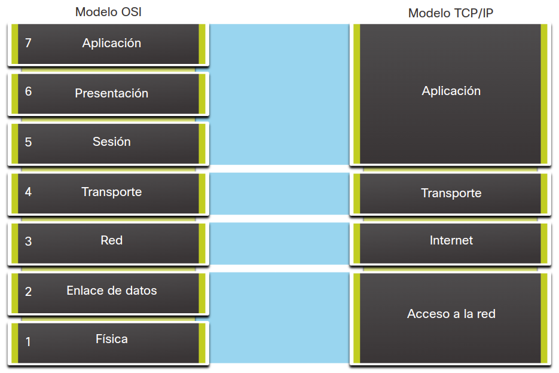

<a href="./00-Curso.md"><< Menú principal del módulo</a>

# 5. Principios de comunicación

## Protocolos de comunicación
### Protocolos de Comunicación
La comunicación en nuestra vida cotidiana tiene diferentes formas y existe en muchos entornos. Tenemos diferentes expectativas dependiendo de si estamos conversando por Internet o participando en una entrevista de trabajo. Cada situación tiene su comportamiento y estilo correspondiente.

Antes de comenzar a comunicarnos, establecemos reglas o acuerdos que rigen la conversación. Estos acuerdos incluyen lo siguiente:

* ¿Cuál método de comunicación debemos utilizar? Antes de que comience la comunicación, es probable que tengamos que llegar a un acuerdo con respecto al método que se usará.
* ¿Qué idioma debemos usar? Antes de que comience la comunicación, es probable que tengamos que llegar a un acuerdo con respecto al idioma que se usará.
* ¿Debemos confirmar que se reciben nuestros mensajes? La comunicación es exitosa cuando el mensaje deseado se ha recibido y confirmado.

Estas reglas, o protocolos, deben respetarse para que el mensaje se envíe y comprenda correctamente. Algunos de los protocolos que rigen con éxito las comunicaciones humanas son:

* Un emisor y un receptor identificados.
* Método de comunicación acordado (en persona, teléfono, carta, fotografía).
* Idioma y gramática común.
* Velocidad y momento de entrega.
* Requisitos de confirmación o acuse de recibo.
* Las técnicas utilizadas en las comunicaciones de red comparten estos fundamentos con las conversaciones humanas.

Piense en los protocolos aceptados comúnmente para enviar mensajes de texto a sus amigos.

### Por qué importan los protocolos
Las computadoras, al igual que los seres humanos, utilizan reglas o protocolos para comunicarse. Los protocolos son necesarios para que las computadoras se comuniquen correctamente a través de la red. Tanto en un entorno cableado como en uno inalámbrico, una red local se define como un área en la que todos los hosts deben "hablar el mismo idioma" lo que, en términos informáticos, significa que deben "compartir un protocolo común".

Si todas las personas de una misma sala hablaran idiomas diferentes, no podrían comunicarse. De manera similar, si los dispositivos de una red local no utilizaran los mismos protocolos, no podrían comunicarse.

Los protocolos de red definen muchos aspectos de la comunicación a través de la red local. Como se muestra en la tabla, estos incluyen formato de mensaje, tamaño de mensaje, temporización, codificación, encapsulamiento y patrones de mensaje.

<table class="" style="min-width: 800px">
    <tbody>
        <tr>
            <th rowspan="1" colspan="1" style="width: 200;">Características de los protocolos</th>
            <th rowspan="1" colspan="1">Descripción</th>
        </tr>
        <tr>
            <td rowspan="1" colspan="1">Formato del mensaje</td>
            <td rowspan="1" colspan="1">Cuando se envía un mensaje se debe utilizar un formato o estructura específicos. Los formatos de los mensajes dependen del tipo de mensaje y el canal que se utilice para entregar el mensaje.</td>
        </tr>
        <tr>
            <td rowspan="1" colspan="1">Tamaño del mensaje</td>
            <td rowspan="1" colspan="1">Las reglas que controlan el tamaño de las partes que se comunican a través de la red son muy estrictas. También pueden ser diferentes, de acuerdo con el canal utilizado. Cuando se envía un mensaje largo de un host a otro a través de una red, puede ser necesario dividirlo en partes más pequeñas para asegurarse de que pueda entregarse en forma confiable.</td>
        </tr>
        <tr>
            <td rowspan="1" colspan="1">Sincronización</td>
            <td rowspan="1" colspan="1">Muchas funciones de comunicación de red dependen de la sincronización. La sincronización determina la velocidad a la que se transmiten los bits a través de la red. También afecta cuándo un host individual puede enviar datos y la cantidad total de datos que se pueden enviar en una transmisión dada.</td>
        </tr>
        <tr>
            <td rowspan="1" colspan="1">Codificación</td>
            <td rowspan="1" colspan="1">El host emisor, primero convierte en bits los mensajes enviados a través de la red. Cada bit se codifica en un patrón de sonidos, ondas de luz o impulsos electrónicos, según el medio de red a través del cual se transmitan los bits. El host de destino recibe y decodifica las señales para interpretar el mensaje.</td>
        </tr>
        <tr>
            <td rowspan="1" colspan="1">Encapsulamiento</td>
            <td rowspan="1" colspan="1">Cada mensaje transmitido en una red debe incluir un encabezado que contenga información de asignación de direcciones que identifique los hosts de origen y de destino; de lo contrario, no se lo podrá entregar. La encapsulación es el proceso de agregar esta información a los elementos de datos que conforman el mensaje. Además de la asignación de direcciones, puede haber otra información en el encabezado que asegure que el mensaje se entregue a la aplicación correcta en el host de destino.</td>
        </tr>
        <tr>
            <td rowspan="1" colspan="1">Patrón del mensaje</td>
            <td rowspan="1" colspan="1">Algunos mensajes requieren confirmación de recepción para poder enviar el siguiente mensaje. Este tipo de patrón de solicitud y respuesta es un aspecto común de muchos protocolos de red. Sin embargo, hay otros tipos de mensajes que pueden simplemente transmitirse a través de la red, sin preocuparse de si llegan a su destino.</td>
        </tr>
    </tbody>
</table>

## Estándares de Comunicación
### Internet y Estándares
Con la creciente cantidad de nuevos dispositivos y nuevas tecnologías en línea, ¿cómo es posible manejar todos los cambios y continuar brindando servicios de manera confiable, tales como el correo electrónico? La respuesta son los estándares de Internet.

Un estándar es un conjunto de reglas que determina cómo se realiza algo. Los estándares de red e Internet aseguran que todos los dispositivos que se conectan a la red implementen el mismo conjunto de reglas o protocolos del mismo modo. Usando estándares, es posible que diferentes tipos de dispositivos se envíen información entre sí a través de Internet. Por ejemplo, el modo en que los dispositivos formatean, envían y reciben un correo electrónico se realiza de una manera estandarizada. Si una persona envía un correo electrónico a través de una computadora personal, otra persona puede utilizar un teléfono celular para recibir y leer ese correo siempre que el teléfono utilice los mismo estándares.

### Organizaciones de Estándares de Red
Un estándar de Internet es el resultado final de un ciclo completo de discusión, resolución de problemas y pruebas. Estos distintos estándares son desarrollados, publicados y mantenidos por diferentes organizaciones, tal como se indica en la figura. Cuando se propone un nuevo estándar, cada etapa del desarrollo y del proceso de aprobación es registrada en un documento numerado de solicitud de comentarios (RFC, Request for Comments) para seguir la evolución del estándar. Las RFC para los estándares de Internet son publicadas y administradas por el Grupo de Trabajo de Ingeniería de Internet (Internet Engineering Task Force - IETF).

## Modelos de comunicación de red
### El Modelo TCP/IP
Los modelos en capas nos ayudan a ver cómo se integran los diversos protocolos para posibilitar las comunicaciones de red. Este modelo describe el funcionamiento de los protocolos que se produce en cada capa y la interacción con las capas que se encuentran por encima y por debajo de ellas. El modelo en capas presenta muchos beneficios:

* Ayuda en el diseño de protocolos, ya que los protocolos que operan en una capa específica tienen información definida según la cual actúan, y una interfaz definida para las capas superiores e inferiores.
* Fomenta la competencia, ya que los productos de distintos proveedores pueden trabajar en conjunto.
* Hace posible que se implementen cambios tecnológicos en un nivel sin afectar a los demás niveles.
* Proporciona un lenguaje común para describir las funciones y capacidades de las redes.

El primer modelo en capas para comunicaciones entre redes se creó a principios de la década de 1970 y se conoce con el nombre de modelo de internet. Define cuatro categorías de funciones que deben estar presentes para que las comunicaciones sean exitosas. El conjunto de protocolos TCP/IP que se utilizan para las comunicaciones por Internet sigue la estructura de este modelo, como se muestra en la tabla. Por esto, es común que al modelo de internet se le conozca como modelo TCP/IP.

| __Capa del modelo TCP/IP__ | __Descripción__ |
| -------------------------- | --------------- |
| Aplicación | Representa datos para el usuario más el control de codificación y de diálogo |
| Transporte | Admite la comunicación entre distintos dispositivos a través de diversas redes |
| Internet | Determina el mejor camino a través de una red |
| Acceso a la red | Controla los dispositivos del hardware y los medios que forman la red |

### El Modelo de Referencia OSI

Hay dos tipos básicos de modelos para describir las funciones que deben estar presentes para que las comunicaciones de red sean exitosas: modelos de protocolo y modelos de referencia.

* __Modelo de Protocolo__. Este modelo coincide estrechamente con la estructura de un conjunto de protocolos en particular. Una suite de protocolos incluye el conjunto de protocolos relacionados que generalmente proporcionan toda la funcionalidad requerida para que las personas se comuniquen mediante la red de datos. El modelo TCP/IP es un modelo de protocolos porque describe las funciones que ocurren en cada capa de protocolos dentro de una suite de TCP/IP.
* __Modelo de Referencia__. Este tipo de modelo describe las funciones que se deben completar en una capa en particular, pero no especifica exactamente cómo se debe realizar una función. Un modelo de referencia no pretende ofrecer un nivel de detalle suficiente para definir en forma precisa la manera en la que cada protocolo debería funcionar en cada capa. El objetivo principal de un modelo de referencia es ayudar a comprender mejor las funciones y los procesos necesarios para las comunicaciones de red.

El modelo de referencia de redes más conocido fue creado por el proyecto Interconexión de Sistemas Abiertos (_Open Systems Interconnection_ - OSI) en la Organización Internacional de Estandarización (ISO). Se usa para diseño de redes de datos, especificaciones de funcionamiento y resolución de problemas. Este modelo se conoce comúnmente como el modelo OSI.

| __Capa del Modelo OSI__ | __Descripción__ |
| ----- | ----- |
| 7 - Aplicación | La capa de aplicación contiene protocolos utilizados para comunicaciones proceso a proceso |
| 6 - Presentación  | La capa de presentación proporciona una representación común de los datos trasferidos entre los servicios de la capa de aplicación |
| 5 - Sesión  | La capa de sesión proporciona servicios a la capa de presentación para organizar su diálogo y adminsitrar el intercambio de datos |
| 4 - Transporte  | La capa de transporte define los servicios para segmentar, transferir y reensamblar los datos para las comunicaciones individuales entre terminales |
| 3 - Red  | La capa de red proporciona servicios para intercambiar los datos individuales en la red entre terminales identificados |
| 2 - Enlace de Datos | Los protocolos de la capa de enlace de datos describen los métodos para intercambiar tramas de datos entre dispositivos en un medio común |
| 1 - Físico | Los protocolos de la capa física describen los medio mecánicos, eléctricos, funcionales y de procedimiento para activar, mantener y desactivar conexiones físicas para una transmisión de bits hacia y desde un dispositivo de red. |

### Comparación del Modelo OSI y el Modelo TCP/IP
Debido a que TCP/IP es el conjunto de protocolos en uso para las comunicaciones por Internet, ¿por qué también necesitamos aprender el modelo OSI?

El modelo TCP/IP es un método para visualizar las interacciones de los diversos protocolos que conforman el conjunto de protocolos TCP/IP. No describe las funciones generales necesarias para todas las comunicaciones de red. Describe las funciones de red específicas de los protocolos en uso en el conjunto de protocolos TCP/IP. Por ejemplo, en la capa de acceso a la red, la suite de protocolos TCP/IP no especifica los protocolos que se deben utilizar para transmitir a través de un medio físico, ni el método de codificación de las señales para la transmisión. Las capas 1 y 2 de OSI tratan los procedimientos necesarios para acceder a los medios y las maneras físicas de enviar datos por la red.

Los protocolos que forman la suite de protocolos TCP/IP pueden describirse en términos del modelo de referencia OSI. Las funciones que se producen en la capa de Internet del modelo TCP/IP se incluyen en la capa de red del modelo OSI, tal como se indica en la figura. La funcionalidad de la capa de transporte es la misma en ambos modelos. Sin embargo, la capa de acceso a la red y la capa de aplicaciones del modelo TCP/IP se dividen a su vez en el modelo OSI para describir funciones discretas que deben realizarse en estas capas.

    

Las similitudes clave se encuentran en la capa de transporte y en la capa de red. Sin embargo, los dos modelos se diferencian en el modo en que se relacionan con las capas que están por encima y por debajo de cada capa.

* La capa 3 de OSI, la capa de red, asigna directamente a la capa de Internet TCP/IP. Esta capa se utiliza para describir protocolos que abordan y dirigen mensajes a través de una internetwork.
* La capa 4 de OSI, la capa de transporte, asigna directamente a la capa de transporte TCP/IP. Esta capa describe los servicios y las funciones generales que proporcionan la entrega ordenada y confiable de datos entre los hosts de origen y de destino.
* La capa de aplicación TCP/IP incluye un número de protocolos que proporciona funcionalidad específica a una variedad de aplicaciones de usuario final. Las capas 5, 6 y 7 del modelo OSI se utilizan como referencias para proveedores y desarrolladores de software de aplicación para fabricar productos que funcionan en redes.
* Tanto el modelo TCP/IP como el modelo OSI se utilizan comúnmente en la referencia a protocolos en varias capas. Dado que el modelo OSI separa la capa de enlace de datos de la capa física, se suele utilizar cuando se refiere a esas capas inferiores.

## Resumen

### Protocolo de Comunicación
Los protocolos son necesarios para que las computadoras se comuniquen correctamente a través de la red. Estos incluyen el formato del mensaje, el tamaño del mensaje, el tiempo, la codificación, la encapsulación y los patrones del mensaje.

* __Formato del mensaje__ - Cuando se envía un mensaje, debe usar un formato o estructura específica.
* __Tamaño del mensaje__ - Las reglas que rigen el tamaño de las piezas comunicadas a través de la red son muy estrictas. También pueden ser diferentes, de acuerdo con el canal utilizado.
* __Sincronización__ - La sincronización determina la velocidad a la que se transmiten los bits a través de la red. También afecta cuándo un host individual puede enviar datos y la cantidad total de datos que se pueden enviar en una transmisión dada.
* __Codificación__ - El host de envío convierte primero los mensajes enviados a través de la red en bits. Cada bit se codifica en un patrón de sonidos, ondas de luz o impulsos electrónicos, según el medio de red a través del cual se transmitan los bits.
* __Encapsulación__ - Cada mensaje transmitido en una red debe incluir un encabezado que contenga información de direccionamiento que identifique los hosts de origen y destino. La encapsulación es el proceso de agregar esta información a los elementos de datos que conforman el mensaje.
* __Patrón de mensaje__ - Algunos mensajes requieren una confirmación antes de que se pueda enviar el siguiente mensaje. Este tipo de patrón de solicitud y respuesta es un aspecto común de muchos protocolos de red. Sin embargo, hay otros tipos de mensajes que pueden simplemente transmitirse a través de la red, sin preocuparse de si llegan a su destino.

### Estándares de Comunicación
Las topologías nos permiten ver la red mediante la representación de dispositivos finales y dispositivos intermediarios. ¿Cómo ve una red un dispositivo? Piense en un dispositivo en una burbuja. Lo único que ve un dispositivo es su propia información de direccionamiento. ¿Cómo sabe el dispositivo que está en la misma red que otro dispositivo? La respuesta son los protocolos de red. La mayoría de las comunicaciones de red se divide en unidades de datos o paquetes más pequeños.

Un estándar es un conjunto de reglas que determina cómo se realiza algo. Los estándares de red e Internet aseguran que todos los dispositivos que se conectan a la red implementen el mismo conjunto de reglas o protocolos del mismo modo. Usando estándares, es posible que diferentes tipos de dispositivos se envíen información entre sí a través de Internet.

Un estándar de Internet es el resultado final de un ciclo completo de discusión, resolución de problemas y pruebas. Estos diferentes estándares son desarrollados, publicados y mantenidos por una variedad de organizaciones. Cuando se propone un nuevo estándar, cada etapa del desarrollo y del proceso de aprobación es registrada en un documento numerado de Solicitud de Comentarios (RFC, Request for Comments) para seguir la evolución del estándar. Las RFC para los estándares de Internet son publicadas y administradas por el Grupo de Trabajo de Ingeniería de Internet (IETF).

### Modelos de Comunicación de Red
Los protocolos son reglas que rigen las comunicaciones. La comunicación correcta entre hosts requiere la interacción entre una serie de protocolos. Los protocolos incluyen HTTP, TCP, IP y Ethernet. Estos protocolos se implementan en el software y el hardware que están instalados en cada host y dispositivo de red.

La interacción entre los diferentes protocolos en un dispositivo se puede ilustrar como una pila de protocolos. En una pila se ilustran los protocolos como una jerarquía en capas, donde cada protocolo de nivel superior depende de los servicios de los protocolos que aparecen en los niveles inferiores. La separación de funciones permite que cada capa de la pila funcione independientemente de las otras capas.

El conjunto de protocolos TCP/IP que se utilizan para las comunicaciones por Internet sigue la estructura de este modelo.

* __Aplicación__ - Representa datos para el usuario, además de codificación y control de diálogo
* __Transporte__ - Admite la comunicación entre varios dispositivos a través de diversas redes.
* __Internet__ - Determina la mejor ruta a través de la red
* __Acceso a la red__ - Los dispositivos de hardware y los medios que componen la red.

Un modelo de referencia describe las funciones que se deben completar en una capa en particular, pero no especifica exactamente cómo se debe lograr una función. El objetivo principal de un modelo de referencia es ayudar a comprender mejor las funciones y los procesos necesarios para las comunicaciones de red.

El modelo de referencia entre redes más conocido fue creado por el proyecto OSI en la ISO internacional. Se usa para diseño de redes de datos, especificaciones de funcionamiento y resolución de problemas. Este modelo se conoce comúnmente como el modelo OSI.

### Descripción de la capa del modelo OSI
* __7 – Aplicación__ - La capa de aplicación contiene protocolos que se utilizan para las comunicaciones de proceso a proceso.
* __6 – Presentación__ - La capa de presentación proporciona una representación común de los datos transferidos entre los servicios de la capa de aplicación.
* __5 – Sesión__ - La capa de sesión proporciona servicios a la capa de presentación para organizar su diálogo y gestionar el intercambio de datos.
* __4 – Transporte__ - La capa de transporte define los servicios para segmentar, transferir y volver a ensamblar los datos para las comunicaciones individuales entre los dispositivos finales.
* __3 – Red__ - La capa de red proporciona servicios para intercambiar datos individuales a través de la red entre dispositivos finales identificados.
* __2 – Enlace de datos__ - Los protocolos de la capa de enlace de datos describen métodos para intercambiar tramas de datos entre dispositivos a través de un medio común.
* __1 – Físico__ - Los protocolos de la capa física describen los medios mecánicos, eléctricos, funcionales y de procedimiento para activar, mantener y desactivar conexiones físicas para la transmisión de bits hacia y desde un dispositivo de red.

## Enlaces de interés
 
 
 
 
 
 
 
 
<a href="#5-principios-de-comunicación">⬆️</a>
<a href="./00-Curso.md"><< Menú principal del módulo</a>