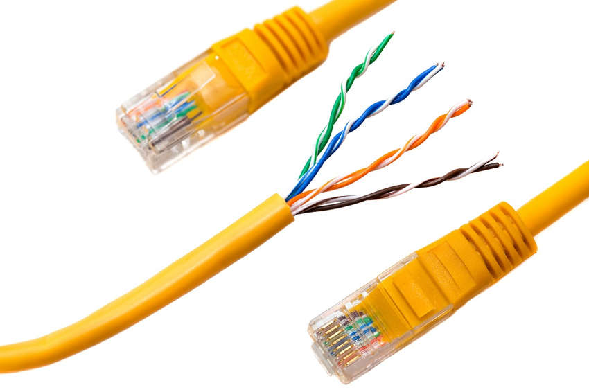

<a href="./00-Curso.md"><< Menú principal del módulo</a>

# 6. Medios de red
### Tres tipos de medios
Los datos se transmiten a través de una red en los medios. El medio proporciona el canal por el cual viaja el mensaje desde el origen hasta el destino.

Las redes modernas utilizan principalmente tres tipos de medios para interconectar dispositivos, como se muestra en la figura:

* __Hilos metálicos dentro de cables__ - Los datos se codifican en impulsos eléctricos.
* __Fibras de vidrio o plástico (cable de fibra óptica)__ - Los datos se codifican como pulsos de luz.
* __Transmisión inalámbrica__ - Los datos se codifican a través de la modulación de frecuencias específicas de ondas electromagnéticas.

Los cuatro criterios principales para elegir los medios de red son:

* ¿Cuál es la distancia máxima en la que el medio puede transportar una señal exitosamente?
* ¿Cuál es el entorno en el que se instalarán los medios?
* ¿Cuál es la cantidad de datos y a qué velocidad deben transmitirse?
* ¿Cuál es el costo del medio y de la instalación?

### Cables de Red comunes
Los tres cables de red más comunes son el cable coaxial, el cable de par trenzado y el cable de fibra óptica.

#### Cable de par trenzado
La tecnología Ethernet generalmente usa cables de par trenzado para interconectar dispositivos. Debido a que Ethernet es la base de la mayoría de las redes locales, el par trenzado es el tipo de cableado de red más común.

En par trenzado, los cables se agrupan en pares y se trenzan para reducir la interferencia. Los pares de cables están coloreados para que pueda identificar el mismo cable en cada extremo. Por lo general, en cada par, uno de los cables es de color sólido y su compañero es con rayas del mismo color sobre un fondo blanco.

	

#### Cable Coaxial
El cable coaxial fue uno de los primeros tipos de cable utilizados para el tendido de redes. El cable coaxial es como los cables de cobre que utilizan las compañías de TV. También se utiliza para conectar los diversos componentes que forman los sistemas de comunicación satelitales. Tiene un único núcleo de cobre rígido que conduce la señal. Este núcleo suele estar rodeado por una capa aisladora, un blindaje metálico trenzado y una funda protectora. Se utiliza como línea de transmisión de alta frecuencia para transportar señales de banda ancha o de alta frecuencia.

	

#### Cable de Fibra Óptica
El cable de fibra óptica puede ser de vidrio o de plástico con un diámetro similar al de un cabello humano y puede transmitir información digital a velocidades muy rápidas a través de grandes distancias. Dado que usan luz en lugar de electricidad, la interferencia eléctrica no afecta la señal. Los cables de fibra óptica tienen muchos usos aparte de las comunicaciones. También se utilizan en la generación de imágenes médicas, tratamientos médicos e inspecciones de ingeniería mecánica.

Tienen un ancho de banda muy amplio, lo que les permite transportar grandes cantidades de datos. La fibra óptica se utiliza en redes troncales, entornos de grandes empresas y grandes centros de datos. También es muy utilizada por las compañías de telefonía.

	

## Resumen
### Tipos de medios de red
La comunicación se transmite a través de una red en los medios. El medio proporciona el canal por el cual viaja el mensaje desde el origen hasta el destino.

Las redes modernas utilizan principalmente tres tipos de medios para interconectar dispositivos:

* Hilos metálicos dentro de cables - Los datos se codifican en impulsos eléctricos.
* Fibras de vidrio o plástico (cable de fibra óptica) - Los datos se codifican como pulsos de luz.
* Transmisión inalámbrica - Los datos se codifican a través de la modulación de frecuencias específicas de ondas electromagnéticas.

Los cuatro criterios principales para elegir los medios son los siguientes:

* ¿Cuál es la distancia máxima en la que el medio puede transportar una señal exitosamente?
* ¿Cuál es el entorno en el que se instalarán los medios?
* ¿Cuál es la cantidad de datos y a qué velocidad se deben transmitir?
* ¿Cuál es el costo de la instalación de los medios?

Los tres cables de red más comunes son el cable coaxial, el cable de par trenzado y el cable de fibra óptica. La tecnología Ethernet generalmente usa cables de par trenzado para interconectar dispositivos. El cable coaxial es como los cables de cobre que utilizan las compañías de TV. También se utiliza para conectar los diversos componentes que forman los sistemas de comunicación satelitales. El cable de fibra óptica puede ser de vidrio o de plástico con un diámetro similar al de un cabello humano y puede transmitir información digital a velocidades muy rápidas a través de grandes distancias. Dado que usan luz en lugar de electricidad, la interferencia eléctrica no afecta la señal.

## Enlaces de interés
 
 
 
 
 
 
 
 
<a href="#6-medios-de-red">⬆️</a>
<a href="./00-Curso.md"><< Menú principal del módulo</a>