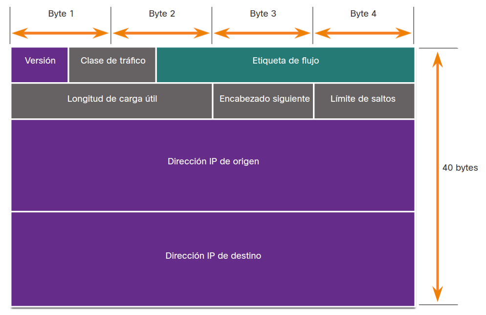

<a href="./00-Curso.md"><< Menú principal del módulo</a>

# 7. La capa de acceso
## Encapsulación y la Trama Ethernet
### Los Campos de la Trama Ethernet
Ethernet es la tecnología comúnmente utilizada en redes de área local. Los dispositivos acceden a la red LAN Ethernet con una Tarjeta de interfaz de red (NIC) Ethernet. Cada NIC Ethernet tiene una dirección única integrada en forma permanente en la tarjeta que se conoce como dirección de Control de acceso al medio (MAC). La dirección MAC tanto para el origen como para el destino son campos en una trama de Ethernet.

* __Preamble__. Preámbulo (7 Bytes). Mantiene la sincronía entre emisor y receptor.
* __Start Frame Delimiter (SFD)__. Delimitador de comienzo de trama (1 Byte). Con este delimitador se indica al dispositivo receptor que a partir de este momento comienza la información remitida en la trama.
* __Destination MAC Address__. Dirección MAC de destino (6 Bytes). Dirección del dispositivo de red destino.
* __Source MAC Addresss__. Dirección MAC de origen (6 Bytes). Dirección del dispositivo de red origen.
* __Length Type__. Campo de longitud o tipo de datos (2 Byte). Se puede utilizar para indicar la longitud del bloque de datos que se envía, o se puede utilizar como campo de tipo, indicando si es un paquete de tipo IPv4 o IPv6.
* __Data__. Datos enviados (46-1500 Bytes). Son los datos que se envían en la trama; están encapsulados y pueden ser tanto los datos de la información final que se está transmitiendo, así como datos referentes a otros protocolos superiores utilizados para el control de transmisión u otras tareas.
* __Frame Check Sequence (FCS)__. Secuencia de comprobación de trama (4 Bytes). Se utiliza por el dispositivo receptor para realizar la comprobación de errores en la trama.

### Encapsulación
Cuando envía una carta, la persona que la escribe utiliza un formato aceptado para asegurarse de que la carta se entregue y de que el destinatario la comprenda. De la misma manera, un mensaje que se envía a través de una red de computadoras sigue reglas de formato específicas para que pueda ser entregado y procesado.

El proceso que consiste en colocar un formato de mensaje (la carta) dentro de otro formato de mensaje (el sobre) se denomina encapsulamiento. Cuando el destinatario revierte este proceso y quita la carta del sobre se produce el desencapsulamiento del mensaje. De la misma manera en la que una carta se encapsula en un sobre para la entrega, los mensajes de las computadoras también deben encapsularse.

Cada mensaje de computadora se encapsula en un formato específico, llamado trama, antes de enviarse a través de la red. Una trama actúa como un sobre: proporciona la dirección del destino y la dirección del host de origen. El formato y el contenido de una trama están determinados por el tipo de mensaje que se envía y el canal que se utiliza para enviarlo. Los mensajes que no tienen el formato correcto no se pueden enviar al host de destino o no pueden ser procesados por éste.

#### Analogía
Un ejemplo común de requerir el formato correcto en las comunicaciones humanas es cuando se envía una carta. Haga clic en Reproducir en la figura para ver una animación de formato y encapsulación de una letra.

El sobre tiene la dirección del emisor y la del receptor, cada una escrita en el lugar adecuado del sobre. Si la dirección de destino y el formato no son correctos, la carta no se entrega.

El proceso que consiste en colocar un formato de mensaje (la carta) dentro de otro formato de mensaje (el sobre) se denomina encapsulamiento. Cuando el destinatario revierte este proceso y quita la carta del sobre se produce el desencapsulamiento del mensaje.

#### Red
Semejante a enviar una carta, un mensaje que se envía a través de una red de computadoras sigue reglas de formato específicas para que pueda ser entregado y procesado.

Al igual que el envío de una carta, un mensaje que se envía a través de una red informática sigue reglas de formato específicas para su entrega y procesamiento.

El Protocolo de Internet (IP) es un protocolo con una función similar a la del ejemplo sobre. En la figura, los campos del paquete de Protocolo de Internet versión 6 (IPv6) identifican el origen del paquete y su destino. IP es responsable de enviar un mensaje desde el origen del mensaje al destino a través de una o más redes.

__Nota__: Los campos del paquete IPv6 se analizan en detalle en otro módulo.

	

## La Capa de Acceso
### Conmutadores Ethernet
Los conmutadores de red (switches) funcionan en la capa de enlace de datos del modelo OSI (Capa 2), leyendo los campos de MAC origen y destino en la cabecera de la trama Ethernet. Los conmutadores tienen una tabla de direcciones MAC. Suponiendo que la tabla de direcciones estuviera completa, el conmutador consulta el destino de la trama en dicha tabla, enviando la trama solamente por el puerto Ethernet donde está conectado dicha MAC.

### Tablas de Direcciones MAC
La construcción de la tabla de direcciones MAC en un conmutador se realiza de la siguiente manera:
* En primer lugar se comprueba la dirección MAC de origen en la trama; si no dispone de dicha MAC en su tabla, la añade indicando en qué puerto está conectada.
* A continuación comprueba la dirección MAC de destino; si no está en su tabla, el conmutador envía dicha trama a todos los puertos donde desconoce la MAC que tiene conectada. Los hosts de las MAC que no coinciden con la MAC de destino ignoran la trama, que solo es interpretada por el host que tiene dicha MAC.

## Resumen
### Encapsulación y Trama Ethernet
El proceso que consiste en colocar un mensaje dentro de otro formato de mensaje se denomina encapsulamiento. Cuando el destinatario revierte este proceso y quita la carta del sobre se produce la desencapsulación del mensaje. De la misma manera en la que una carta se encapsula en un sobre para la entrega, los mensajes de las computadoras también deben encapsularse. Un mensaje que se envía a través de una red de computadoras sigue reglas de formato específicas para que pueda ser entregado y procesado.

Los estándares del protocolo Ethernet definen muchos aspectos de la comunicación en red, incluido el formato, el tamaño, la temporización y la codificación de las tramas. El formato para las tramas de Ethernet especifica la ubicación de las direcciones MAC de origen y de destino, e información adicional, incluido el preámbulo para la secuencia y la temporización, el delimitador de inicio de trama, la longitud y el tipo de trama, y la secuencia de verificación de tramas para detectar errores de transmisión.

### La Capa de Acceso
La capa de acceso es la parte de la red que permite a las personas obtener acceso a otros hosts y a archivos e impresoras compartidos. La capa de acceso proporciona la primera línea de dispositivos de red que conecten hosts a la red Ethernet cableada. Dentro de una red Ethernet, cada host puede conectarse directamente a un dispositivo de red de capa de acceso mediante un cable Ethernet. Los concentradores Ethernet tienen varios puertos que se utilizan para conectar hosts a la red. Solo es posible enviar un mensaje a la vez en un concentrador Ethernet. Dos o más mensajes enviados al mismo tiempo provocarán una colisión. Como el exceso de retransmisiones puede congestionar la red y reducir la velocidad del tráfico de red, ahora los concentradores se consideran obsoletos y fueron reemplazados por conmutadores Ethernet.

Un switch Ethernet es un dispositivo que se utiliza en la capa 2. Cuando un host envía un mensaje a otro host conectado a la misma red conmutada, el conmutador acepta y decodifica las tramas para leer la parte de la dirección MAC del mensaje. Una tabla en el switch, llamada tabla de direcciones MAC, contiene una lista de todos los puertos activos y las direcciones MAC del host que se adjuntan a ellos. Cuando se envía un mensaje entre hosts, el conmutador verifica si la dirección MAC de destino está en la tabla. Si está, el conmutador establece una conexión temporal, llamada circuito, entre el puerto de origen y el puerto de destino. Los conmutadores Ethernet también permiten enviar y recibir tramas a través del mismo cable Ethernet simultáneamente. Esto mejora el rendimiento de la red porque elimina las colisiones.

Para crear la tabla de direcciones MAC, los conmutadores examinan la dirección MAC de origen de cada trama que se envía entre los hosts. Cuando un host envía un mensaje o responde a un mensaje enviado por inundación, el conmutador inmediatamente aprende la dirección MAC de ese host y el puerto al que está conectado. La tabla se actualiza de manera dinámica cada vez que el conmutador lee una nueva dirección MAC de origen.

## Enlaces de interés
 
 
 
 
 
 
 
 
<a href="#7-la-capa-de-acceso">⬆️</a>
<a href="./00-Curso.md"><< Menú principal del módulo</a>