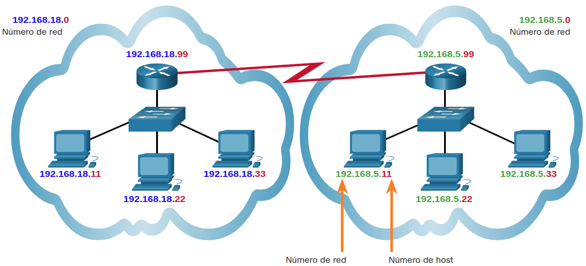

<a href="./00-Curso.md"><< Menú principal del módulo</a>

# 8. El Protocolo de Internet

## Propósito de una dirección IPv4
### La dirección IPv4
Un host necesita una dirección IPv4 para participar en Internet y en casi todas las LAN hoy en día. La dirección IPv4 es una dirección de red lógica que identifica a un host en particular Debe configurarse correctamente y ser única dentro de la red LAN, para posibilitar la comunicación local. También debe configurarse correctamente y ser única en el mundo, para posibilitar la comunicación remota. Así es como un host puede comunicarse con otros dispositivos en Internet.

Se asigna una dirección IPv4 a la conexión de la interfaz de red para un host. Esta conexión generalmente es una tarjeta de interfaz de red (NIC) instalada en el dispositivo. Algunos ejemplos de dispositivos de usuario final con interfaces de red incluyen las estaciones de trabajo, los servidores, las impresoras de red y los teléfonos IP. Algunos servidores pueden tener más de una NIC, y cada una de ellas tiene su propia dirección IPv4. Las interfaces del enrutador que proporcionan conexiones a una red IP también tendrán una dirección IPv4.

Cada paquete que se envía por Internet tiene una dirección IPv4 de origen y de destino. Los dispositivos de red requieren esta información para asegurarse de que la información llegue a destino y de que toda respuesta sea devuelta al origen.

### Octetos y notación decimal con puntos
Las direcciones IPv4 tienen 32 bits de longitud. Aquí hay una dirección IPv4 en binario:

	11010001101001011100100000000001

Observe lo difícil que es leer esta dirección. ¡Imagine tener que configurar dispositivos con una serie de 32 bits! Por esta razón, los 32 bits se agrupan en cuatro bytes de 8 bits llamados octetos así:

	11010001.10100101.11001000.00000001

Eso está mejor, pero sigue siendo difícil de leer. Por ese motivo, cada octeto se representa como su valor decimal separado por un punto decimal. El IPv4 binario anterior se convierte en esta representación decimal con puntos:

	209.165.200.1

__Nota__: Por ahora, no necesita saber cómo convertir entre sistemas de números binarios y decimales.

### Packet Tracer. Conectarse a un Servidor Web
#### Objetivos
Observar cómo se envían los paquetes a través de Internet usando direcciones IP.

#### Instrucciones
* __Parte 1__: Verifique la conectividad con el servidor Web
	1. Abra la ventana de la petición de entrada de comandos del host de origen. Seleccione `PC0`.

	2. Seleccione la ficha `Desktop -> Command Prompt`.

	3. Verificar la conectividad al servidor Web. En la línea de comandos, haga _ping_ en la dirección IP del servidor web ingresando `ping 172.33.100.50`.
		```
		PC-> ping 172.33.100.50
		
		Pinging 172.33.100.50 with 32 bytes of data:
		
		Reply from 172.33.100.50: bytes=32 time=4ms TTL=127
		Reply from 172.33.100.50: bytes=32 time<1ms TTL=127
		Reply from 172.33.100.50: bytes=32 time<1ms TTL=127
		Reply from 172.33.100.50: bytes=32 time=10ms TTL=127
		
		Ping statistics for 172.33.100.50:
		    Packets: Sent = 4, Received = 4, Lost = 0 (0% loss),
		Approximate round trip times in milli-seconds:
		    Minimum = 0ms, Maximum = 10ms, Average = 3ms
		```
		Una respuesta verifica la conectividad desde el cliente al servidor web de destino. Inicialmente se puede agotar el tiempo de espera de la respuesta mientras se cargan los dispositivos y se ejecuta ARP.

	4. Cierre solamente la ventana de la línea de comandos haciendo clic en la cruz que se encuentra dentro de la ventana de la línea de comandos. Asegúrese de dejar abierta la ventana de configuración de `PC0`.

* __Parte 2__: Conéctese con el servidor Web a través del cliente Web
	1. En `PC0`, seleccione la ficha `Desktop -> Web Browser`.

	2. Escriba `172.33.100.50` en la URL y haga clic en `Go`. El cliente web se conectará al servidor web a través de la dirección IP y abrirá la página web.

#### Pregunta
¿Qué mensajes se ven después de que la página web se terminó de cargar?

## La Estructura de la Dirección IPv4
### Redes y Hosts
La dirección IPv4 lógica de 32 bits tiene una composición jerárquica y consta de dos partes, la de red y la de host. En la figura, la parte de red es azul y la parte del host es roja. Las dos partes se requieren en una dirección IPv4. Ambas redes tienen la máscara de subred `255.255.255`.0. La máscara de subred se utiliza para identificar la red a la que está conectado el host.

A modo de ejemplo, hay un host con la dirección IPv4 `192.168.5.11` y la máscara de subred `255.255.255.0`. Los primeros tres octetos (`192.168.5`), identifican la porción de red de la dirección, y el último octeto (11) identifica al host. Esto se conoce como direccionamiento jerárquico, debido a que la porción de red indica la red en la que cada dirección host única está ubicada. Los enrutadores solo necesitan conocer cómo llegar a cada red en lugar de conocer la ubicación de cada host individual.

Con el direccionamiento IPv4 pueden existir varias redes lógicas en una red física, si la porción de red de las direcciones del host correspondiente a la red es diferente. Por ejemplo: tres hosts en una única red local física tienen la misma porción de red en su dirección IPv4 (`192.168.18`) y otros tres hosts tienen porciones de red diferentes en sus direcciones IPv4 (`192.168.5`). Los hosts que poseen el mismo número de red en su dirección IPv4 podrán comunicarse entre sí pero no podrán comunicarse con los otros hosts sin utilizar routing. En este ejemplo, hay una red física y dos redes IPv4 lógicas.

Otro ejemplo de una red jerárquica es el sistema telefónico. Con un número telefónico, el código de país, el código de área y el intercambio representan la dirección de red; y los dígitos restantes representan un número telefónico local.

<div align="center">
	
</div>

## Resumen del Protocolo de Internet
### Propósito de la Dirección IPv4
La dirección IPv4 es una dirección de red lógica que identifica a un host en particular Debe configurarse correctamente y ser única dentro de la red LAN, para posibilitar la comunicación local. También debe configurarse correctamente y ser única en el mundo, para posibilitar la comunicación remota.

Se asigna una dirección IPv4 a la conexión de la interfaz de red para un host. Esta conexión suele ser una NIC instalada en el dispositivo.

Cada paquete que se envía por Internet tiene una dirección IPv4 de origen y de destino. Los dispositivos de red requieren esta información para asegurarse de que la información llegue a destino y de que toda respuesta sea devuelta al origen.

### La Estructura de la Dirección IPv4
La dirección IPv4 lógica de 32 bits tiene una composición jerárquica y consta de dos partes, la de red y la de host. A modo de ejemplo, hay un host con la dirección IPv4 `192.168.5.11` y la máscara de subred `255.255.255.0`. Los primeros tres octetos (`192.168.5`), identifican la porción de red de la dirección, y el último octeto (11) identifica al host. Esto se conoce como direccionamiento jerárquico, debido a que la porción de red indica la red en la que cada dirección host única está ubicada.

Los enrutadores solo necesitan conocer cómo llegar a cada red en lugar de conocer la ubicación de cada host individual. Con el direccionamiento IPv4 pueden existir varias redes lógicas en una red física, si la porción de red de las direcciones del host correspondiente a la red es diferente.

## Enlaces de interés
<br />
<br />
<br />
<br />
<br />
<br />
<br />
<br />
<a href="#8-el-protocolo-de-internet">⬆️</a>
<a href="./00-Curso.md"><< Menú principal del módulo</a>