<a href="./00-Curso.md"><< Menú principal del módulo</a>

# 9. IPv4 y Segmentación de redes
## Unidifusión, difusión y multidifusión de IPv4
En el tema anterior, aprendió acerca de la estructura de una dirección IPv4; cada una tiene una parte de red y una parte de host. Existen diferentes formas de enviar un paquete desde un dispositivo de origen, y estas diferentes transmisiones afectan a las direcciones IPv4 de destino.

### Unidifusión (_Unicast_)
La transmisión unidifusión (_unicast transmission_) se refiere a un dispositivo que envía un mensaje a otro dispositivo en comunicaciones uno a uno.

Un paquete de unidifusión tiene una dirección IP de destino que es una dirección de unidifusión que va a un único destinatario. Una dirección IP de origen sólo puede ser una dirección de unidifusión, ya que el paquete sólo puede originarse de un único origen. Esto es independiente de si la dirección IP de destino es una unidifusión, difusión o multidifusión.

<div align="center" style="width:50%;float:left;">
	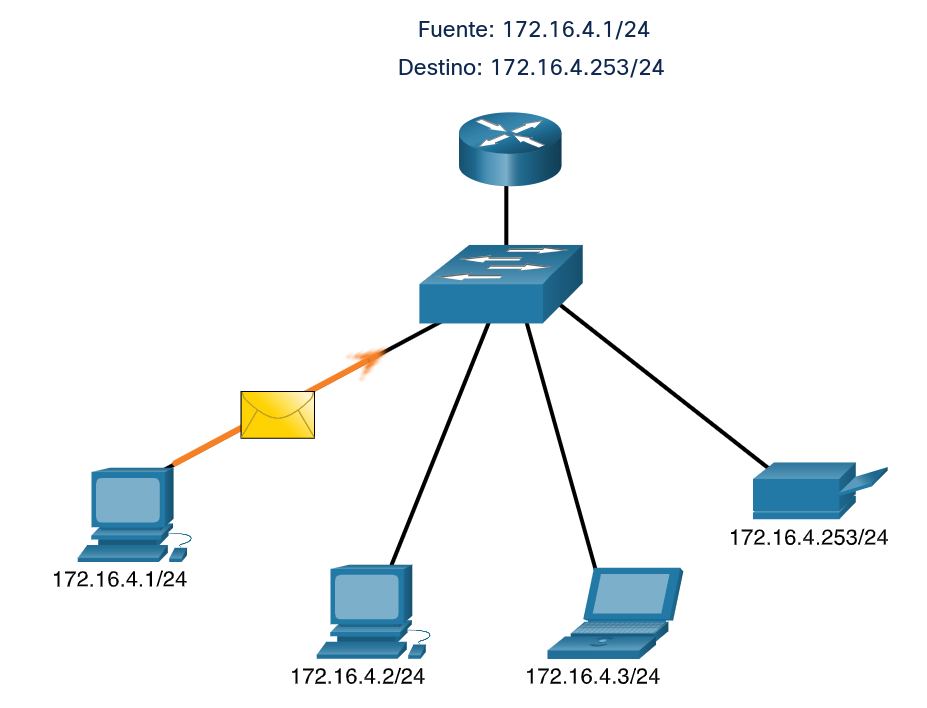
</div>

<div align="center" style="width:50%;float:left;">
	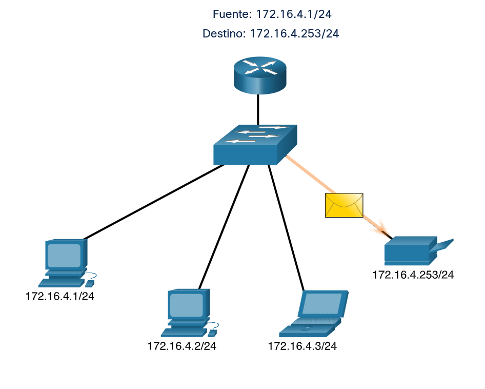
</div>

__Nota__: En este curso, todas las comunicaciones entre dispositivos son de unidifusión, a menos que se indique lo contrario.

Las direcciones de host de unidifusión IPv4 están en el rango de direcciones de `1.1.1.1` a `223.255.255.255`. Sin embargo, dentro de este intervalo existen muchas direcciones reservadas para fines específicos. Estas direcciones de propósito especial se discutirán más adelante en este módulo.

__Nota__: En la animación, observe que la máscara de subred para `255.255.255.0` se representa mediante la noción de barra inclinada `/24`. Esto indica que la máscara de subred tiene 24 bits de longitud. La máscara de subred `255.255.255.0` en binario es `11111111.11111111.11111111.00000000`.

<a href="./notes/cidr.md" target="_blank">Explicación de CIDR</a>

### Difusión (_Broadcast_)
Una transmisión en una red informática es un mensaje en el que se transmiten paquetes de datos desde un punto a todos los suscriptores de una red de mensajes. En la tecnología de conmutación, una transmisión es una forma especial de conexión multipunto.

Un paquete de difusión llega a todos los suscriptores de una red local sin que se les especifique explícitamente como destinatarios. Como resultado, las transmisiones deberían limitarse a su propio segmento de red y no reenviarse a través de enrutadores. Si se va a enviar información a un grupo de suscriptores seleccionados, se utiliza en su lugar un procedimiento de multidifusión.

Cada destinatario de una emisión decide por sí mismo si, en caso de ser responsable, procesa el mensaje recibido o lo rechaza tácitamente. Las transmisiones existen en diferentes capas del modelo de referencia OSI. Lo que todos tienen en común es que las emisiones de una capa superior deben adaptarse en consecuencia a las capas inferiores. Por ejemplo, una transmisión IPv4 se envía como una transmisión Ethernet a la dirección MAC `FF:FF:FF:FF:FF:FF`. Si la red subyacente no tiene capacidad de transmisión, por ejemplo porque consta de varias conexiones punto a punto, el mensaje se puede enviar utilizando un algoritmo de inundación.

__Uso__
Una transmisión se utiliza en una red informática, entre otras cosas, si aún se desconoce la dirección IP del destinatario del mensaje. Según el modelo OSI, esta técnica se utiliza en la capa de conmutación. Algunos ejemplos son ARP, DHCP y _Wake On LAN_. Los juegos de computadora con capacidad de red utilizan transmisiones para encontrar una lista de todos los juegos abiertos en la red local en los que el usuario puede participar. El protocolo de comunicación SMB utiliza transmisión para buscar archivos compartidos e impresoras en la red local.

Transmisión de difusión (_broadcast transmission_) hace referencia a un dispositivo que envía un mensaje a todos los dispositivos de una red en comunicaciones unipersonales mediante una dirección de grupo.

Los paquetes de difusión tienen una dirección IPv4 de destino, en binario, que contiene solo números uno (1) en la porción de host.

__Nota__: IPv4 utiliza paquetes de difusión. Sin embargo, __no hay paquetes de difusión con IPv6__.

Todos los dispositivos del mismo dominio de difusión deben procesar un paquete de difusión. Un dominio de difusión identifica todos los hosts del mismo segmento de red. Existen dos tipos de transmisión por difusión:

* Difusión dirigida. El destino son los hosts de una red determinada. La dirección de destino se especifica mediante la combinación de la red objetivo y estableciendo todos los bits del host a 1. Por ejemplo, la dirección de destino para una transmisión de difusión dirigida a la red `192.168.0.0` con máscara de subred `255.255.255.0` sería, por tanto, `192.168.0.255` (o en notación CIDR `192.168.0.255/24`).

	Una difusión dirigida es reenviada por un router si las redes de origen y destino son diferentes, y solo se convierte a una difusión Ethernet en la red de destino. Si las redes de origen y destino son idénticas, se corresponde con una difusión limitada (también conocida como difusión local).

	Las difusiones dirigidas pueden ser de diferente tipo:
	* Difusiones dirigidas a una subred. Tienen como objetivo una subred fija.
	* Difusiones dirigidas a todas las subredes. Es una difusión sobre todas las subredes de la red.
	* Difusiones dirigidas a la red. Se distribuyen en redes de Clase que no están dividas en subredes. Por ejemplo, una transmisión de difusión a la dirección `10.255.255.255` se distribuye a una red IP de Clase A.

* Difusión limitada. El destino son todos los hosts de la propia red; la dirección de destino especificada es siempre `255.255.255.255` que está localizada siempre dentro de la propia red local y se convierte directamente a una difusión Ethernet. Las difusiones limitadas no se reenvían por los routers.

Los paquetes de difusión usan recursos en la red y hacen que cada host receptor en la red procese el paquete. Por lo tanto, se debe limitar el tráfico de difusión para que no afecte negativamente el rendimiento de la red o de los dispositivos. Debido a que los enrutadores separan los dominios de difusión, la subdivisión de redes puede mejorar el rendimiento de la red al eliminar el exceso de tráfico de difusión.

### Multidifusión
La transmisión de multidifusión reduce el tráfico al permitir que un host envíe un único paquete a un grupo seleccionado de hosts que estén suscritos a un grupo de multidifusión.

Un paquete de multidifusión es un paquete con una dirección IP de destino que es una dirección de multidifusión. IPv4 reservó las direcciones de 224.0.0.0 a 239.255.255.255 como rango de multidifusión.

Los hosts que reciben paquetes de multidifusión particulares se denominan clientes de multidifusión. Los clientes de multidifusión utilizan servicios solicitados por un programa cliente para subscribirse al grupo de multidifusión.

Cada grupo de multidifusión está representado por una sola dirección IPv4 de destino de multidifusión. Cuando un host IPv4 se suscribe a un grupo de multidifusión, el host procesa los paquetes dirigidos a esta dirección de multidifusión y los paquetes dirigidos a la dirección de unidifusión asignada exclusivamente.

Los protocolos de enrutamiento como OSPF utilizan transmisiones de multidifusión. Por ejemplo, los routeres habilitados con <a href="https://ccnadesdecero.com/curso/ospf/" target="_blank">OSPF</a> se comunican entre sí mediante la dirección de multidifusión OSPF reservada 224.0.0.5. Sólo los dispositivos habilitados con OSPF procesarán estos paquetes con 224.0.0.5 como dirección IPv4 de destino. Todos los demás dispositivos ignorarán estos paquetes.


<div align="center" style="width:50%;float:left;">
	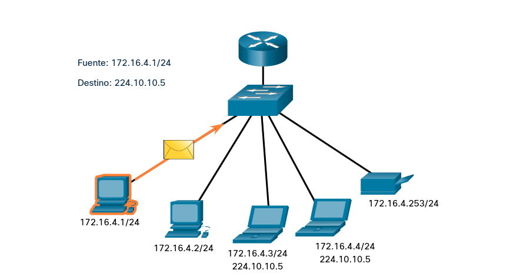
</div>
<div align="center" style="width:50%;float:left;">
	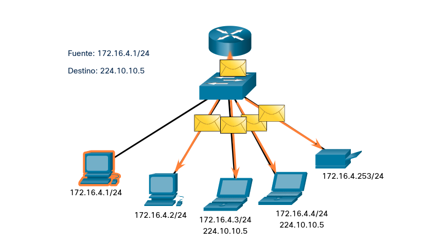
</div>
<div align="center">
	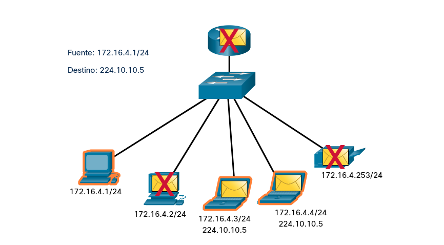
</div>

## Tipos de direcciones IPv4
### Direcciones IPv4 Públicas y Privadas
Del mismo modo que hay diferentes formas de transmitir un paquete IPv4, también hay diferentes tipos de direcciones IPv4. Algunas direcciones IPv4 no se pueden usar para salir a Internet, y otras se asignan específicamente para enrutar a Internet. Algunos se utilizan para verificar una conexión y otros se autoasignan. Como administrador de red, eventualmente se familiarizará con los tipos de direcciones IPv4, pero por ahora, al menos debe saber qué son y cuándo usarlas.

Las direcciones IPv4 públicas son direcciones que se enrutan globalmente entre routeres de proveedores de servicios de Internet (ISP). Sin embargo, no todas las direcciones IPv4 disponibles pueden usarse en Internet. Existen bloques de direcciones denominadas direcciones privadas que la mayoría de las organizaciones usan para asignar direcciones IPv4 a los hosts internos.

A mediados de la década de 1990, con la introducción de la World Wide Web (WWW), se introdujeron direcciones IPv4 privadas debido al agotamiento del espacio de direcciones IPv4. Las direcciones IPv4 privadas no son exclusivas y cualquier red interna puede usarlas.

__Nota__: La solución a largo plazo para el agotamiento de direcciones IPv4 fue IPv6.

| Dirección de red y prefijo | Rango de direcciones privadas de RFC 1918 |
| :-: | :-: |
| 10.0.0.0/8 | 10.0.0.0 a 10.255.255.255 |
| 172.16.0.0/12 | 172.16.0.0 a 172.31.255.255 |
| 192.168.0.0/16 | 192.168.0.0 a 192.168.255.255 |

### Enrutamiento a Internet
La mayoría de las redes internas, desde grandes empresas hasta redes domésticas, utilizan direcciones IPv4 privadas para dirigirse a todos los dispositivos internos (intranet), incluidos los hosts y enrutadores. Sin embargo, las direcciones privadas no son enrutables globalmente.

En la figura, las redes de clientes 1, 2 y 3 están enviando paquetes fuera de sus redes internas. Estos paquetes tienen una dirección IPv4 de origen que es una dirección privada y una dirección IPv4 de destino que es pública (enrutable globalmente). Los paquetes con una dirección privada deben filtrarse (descartarse) o traducirse a una dirección pública antes de reenviar el paquete a un ISP (Internet Service Provider).

Traducción de direcciones de red (NAT - _Network Address Translation_), para utilizar direcciones IP privadas.

<div align="center">
	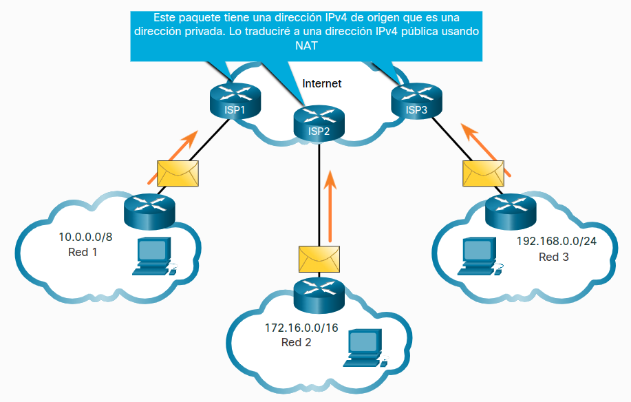
</div>

Antes de que el ISP pueda reenviar este paquete, debe traducir la dirección IPv4 de origen, que es una dirección privada, a una dirección IPv4 pública mediante la traducción de direcciones de red (NAT). Se usa la traducción de direcciones de red (NAT) para traducir entre direcciones IPv4 privadas y públicas. Esto generalmente se realiza en el router que conecta la red interna a la red ISP. Las direcciones IPv4 privadas de la intranet de la organización se traducirán a direcciones IPv4 públicas antes de enrutar a Internet.

### Direcciones IPv4 de uso especial
Existen ciertas direcciones, como la dirección de red y la dirección de difusión, que no se pueden asignar a los hosts. También hay direcciones especiales que pueden asignarse a los hosts, pero con restricciones respecto de la forma en que dichos hosts pueden interactuar dentro de la red.

#### Direcciones de loopback
Las direcciones de bucle invertido (loopback) (`127.0.0.0/8` o `127.0.0.1` a `127.255.255.254`) se identifican más comúnmente como solo `127.0.0.1`. Estas son direcciones especiales utilizadas por un host para dirigir el tráfico hacia sí mismo. Por ejemplo, el comando ping se usa comúnmente para probar conexiones a otros hosts. Pero también puede usar el comando ping para probar si la configuración de IP en su propio dispositivo, como se muestra en la figura.

Ping a la interfaz de bucle invertido.
```
-> ping 127.0.0.1
PING 127.0.0.1 (127.0.0.1) 56(84) bytes of data.
64 bytes from 127.0.0.1: icmp_seq=1 ttl=64 time=0.073 ms
64 bytes from 127.0.0.1: icmp_seq=2 ttl=64 time=0.055 ms
64 bytes from 127.0.0.1: icmp_seq=3 ttl=64 time=0.054 ms
64 bytes from 127.0.0.1: icmp_seq=4 ttl=64 time=0.053 ms
64 bytes from 127.0.0.1: icmp_seq=5 ttl=64 time=0.060 ms
64 bytes from 127.0.0.1: icmp_seq=6 ttl=64 time=0.053 ms
64 bytes from 127.0.0.1: icmp_seq=7 ttl=64 time=0.054 ms
64 bytes from 127.0.0.1: icmp_seq=8 ttl=64 time=0.054 ms
64 bytes from 127.0.0.1: icmp_seq=9 ttl=64 time=0.049 ms
--- 127.0.0.1 ping statistics ---
9 packets transmitted, 9 received, 0% packet loss, time 8199ms
rtt min/avg/max/mdev = 0.049/0.056/0.073/0.006 ms
```

#### Direcciones de enlace local
Direcciones link-local o direcciones IP privadas automáticas (<a href="https://learn.microsoft.com/es-es/windows-server/troubleshoot/how-to-use-automatic-tcpip-addressing-without-a-dh" target="_blank">APIPA</a> - _Automatic Private Internet Protocol Addressing_) `169.254.0.0/16` o `169.254.0.1` a `169.254.255.254` Los utiliza un cliente de Windows para autoconfigurarse en caso de que el cliente no pueda obtener un direccionamiento IP a través de otros métodos. Las direcciones de enlace local se pueden utilizar en una conexión de punto a punto, pero no se utilizan comúnmente para este propósito.

### Direccionamiento con clase heredado
En 1981, las direcciones IPv4 se asignaron utilizando direccionamiento con clase como se define en  <a href="https://tools.ietf.org/html/rfc790" target="_blank">RFC 790</a>, Números Asignados. A los clientes se les asignaba una dirección de red basada en una de tres clases: A, B o C. RFC dividía los rangos de unidifusión en las siguientes clases específicas:

* __Clase A (`0.0.0.0/8` a `127.0.0.0/8`)__: diseñada para admitir redes extremadamente grandes, con más de 16 millones de direcciones de host. La clase A utilizó un prefijo fijo `/8` con el primer octeto para indicar la dirección de red y los tres octetos restantes para las direcciones de host (más de 16 millones de direcciones de host por red).
* __Clase B (`128.0.0.0/16` a `191.255.0.0/16`)__: diseñada para satisfacer las necesidades de redes de tamaño moderado a grande, con hasta 65.000 direcciones de host. La clase B utilizó un prefijo fijo `/16` con los dos octetos de alto orden para indicar la dirección de red y los dos octetos restantes para las direcciones de host (más de 65.000 direcciones de host por red).
* __Clase C (`192.0.0.0/24` a `223.255.255.0/24`)__: diseñada para admitir redes pequeñas con un máximo de 254 hosts. La clase C utilizó un prefijo fijo `/24` con los primeros tres octetos para indicar la red y el octeto restante para las direcciones de host (solo 254 direcciones de host por red).

__Nota__: También hay un bloque de multidifusión Clase D que consta de `224.0.0.0` a `239.0.0.0` y un bloque de direcciones experimental Clase E que consta de `240.0.0.0` - `255.0.0.0`.

En ese momento, con un número limitado de computadoras que utilizan Internet, el direccionamiento con clase era un medio eficaz para asignar direcciones. Como se muestra en la figura, las redes de clase A y B tienen un número muy grande de direcciones de host y la clase C tiene muy pocas. Las redes de clase A representaron el 50% de las redes IPv4. Esto hizo que la mayoría de las direcciones IPv4 disponibles no se utilizaran.

<div style="width:50%;padding-left:30%">
	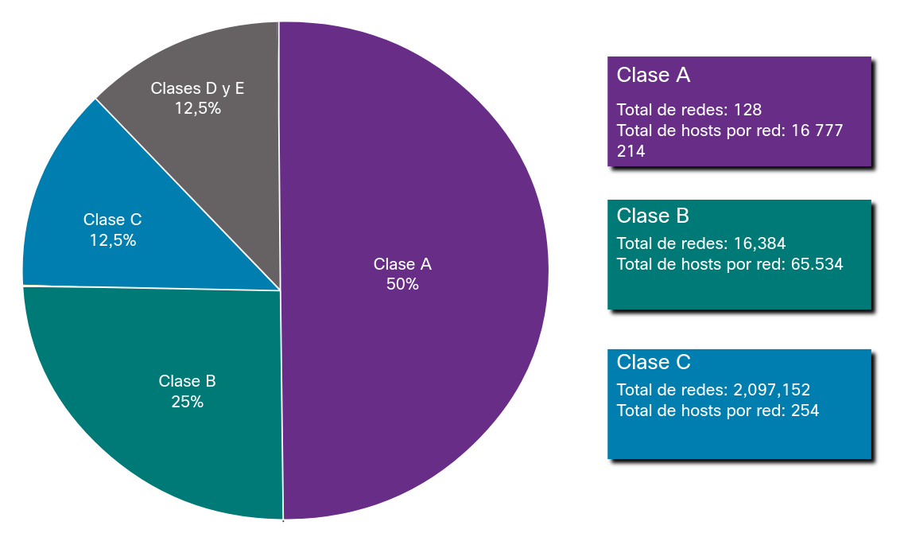
</div>

A mediados de la década de 1990, con la introducción de la _World Wide Web_, el direccionamiento de clase fue obsoleto para asignar de manera más eficiente el limitado espacio de direcciones IPv4. La asignación de direcciones con clase se reemplazó con direcciones sin clase, que se usa hoy en día. El direccionamiento sin clases ignora las reglas de las clases (A, B, C). Las direcciones de red IPv4 públicas (direcciones de red y máscaras de subred) se asignan en función del número de direcciones que se pueden justificar.

### Asignación de direcciones IP
Las direcciones IPv4 públicas son direcciones en las que se realiza routing globalmente entre los routers ISP. Las direcciones IPv4 públicas deben ser únicas.

Tanto las direcciones IPv4 como las IPv6 son administradas por la Autoridad de Números Asignados a Internet (_Internet Assigned Numbers Authority_, <a href="https://www.ripe.net/membership/internet-governance/internet-technical-community/iana/" target="_blank">IANA</a>). La IANA administra y asigna bloques de direcciones IP a los Registros Regionales de Internet (_Regional Internet Registries_ <a href="https://www.ripe.net/membership/internet-governance/internet-technical-community/the-rir-system/#regional-internet-registries-rirs" target="_blank">RIR</a>). Los cinco RIR se muestran en la figura.

<div style="width:50%;padding-left:30%">
	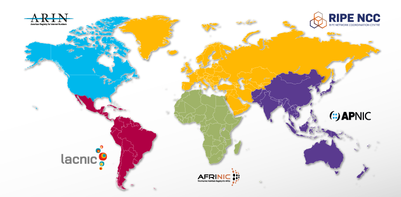
</div>

Los RIR se encargan de asignar direcciones IP a los ISP, quienes a su vez proporcionan bloques de direcciones IPv4 a las organizaciones y a los ISP más pequeños. Las organizaciones pueden obtener sus direcciones directamente de un RIR, según las políticas de ese RIR.

#### _Regional Internet Registries_

* __AfriNIC__ (Centro de Información de Redes Africano) - Región de África.
* __APNIC__ (Centro de Información de Redes de Asia Pacífico) - Región de Asia/Pacífico.
* __ARIN__ (Registro Americano de Números de Internet) - Región de América del Norte.
* __LACNIC__ (Registro Regional de Direcciones IP de América Latina y el Caribe) - América Latina y algunas Islas del Caribe.
* __RIPE NCC__ (Réseaux IP Européens Network Coordination Centre) - Europa, Medio Oriente y Asia Central.

## Segmentación de la Red
### Dominios de difusión y segmentación
¿Ha recibido alguna vez un correo electrónico dirigido a todas las personas de su trabajo o escuela? Este era un email de transmisión. Con suerte, contenía información que cada uno de ustedes necesitaba saber. Pero a menudo una transmisión no es realmente pertinente para todos en la lista de correo. A veces, sólo un segmento de la población necesita leer esa información.

En una LAN Ethernet, los dispositivos utilizan difusiones y el Protocolo de resolución de direcciones (Address Resolution Protocol - ARP) para localizar otros dispositivos. ARP envía transmisiones de capa 2 a una dirección IPv4 conocida en la red local para descubrir la dirección MAC asociada. Los dispositivos de LAN Ethernet también localizan otros dispositivos que utilizan servicios. Un host normalmente adquiere su configuración de dirección IPv4 utilizando el Protocolo de configuración dinámica de host (DHCP) que envía transmisiones en la red local para localizar un servidor DHCP.

Los switches propagan las difusiones por todas las interfaces, salvo por aquella en la cual se recibieron. Por ejemplo, si un switch de la ilustración recibiera una difusión, la reenviaría a los demás switches y a otros usuarios conectados en la red.

__Dominios de difusión de segmentos de router__

<div style="width:50%;padding-left:30%">
	
</div>

Los routers no propagan difusiones. Cuando un router recibe una difusión, no la reenvía por otras interfaces. Por ejemplo, cuando el `R1` recibe una difusión en la interfaz `Gigabit Ethernet 0/0`, no la reenvía por otra interfaz.

Por lo tanto, cada interfaz de router se conecta a un dominio de transmisión y las transmisiones solo se propagan dentro de ese dominio de transmisión específico.

### Problemas con los dominios de difusión grandes
Un dominio de difusión grande es una red que conecta muchos hosts. Un problema con un dominio de difusión grande es que estos hosts pueden generar difusiones excesivas y afectar la red de manera negativa. En la figura, `LAN 1` conecta a 400 usuarios que podrían generar una cantidad excesiva de tráfico de difusión. Esto da como resultado operaciones de red lentas debido a la cantidad significativa de tráfico que puede causar, y operaciones de dispositivo lentas porque un dispositivo debe aceptar y procesar cada paquete de difusión.

__Un dominio de difusión amplio__

<div style="width:60%;padding-left:25%">
	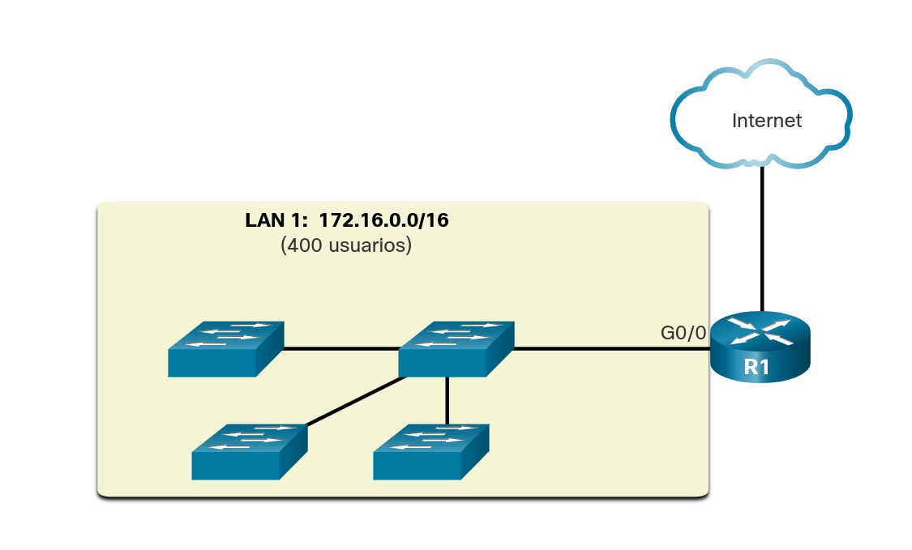
</div>

La solución es reducir el tamaño de la red para crear dominios de difusión más pequeños mediante un proceso que se denomina división en subredes. Estos espacios de red más pequeños se denominan subredes.

En la figura, los 400 usuarios en LAN 1 con la dirección de red `172.16.0.0/16` se han dividido en dos subredes de 200 usuarios cada una: `172.16.0.0/24` y `172.16.1.0/24`. Las difusiones solo se propagan dentro de los dominios de difusión más pequeños. Por lo tanto, una transmisión en `LAN 1` no se propagaría a `LAN 2`.

__Comunicación entre redes__

<div style="width:60%;padding-left:25%">
	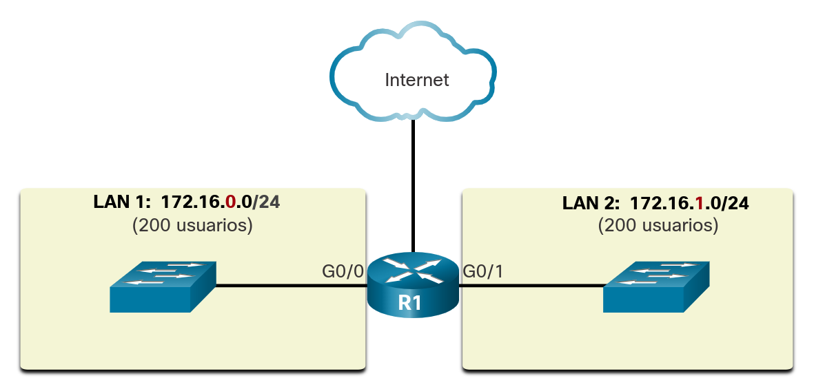
</div>

Observe cómo la longitud del prefijo ha cambiado de una sola red `/16` a dos `/24` redes. Esta es la base de la división en subredes: el uso de bits de host para crear subredes adicionales.

__Nota__: Los términos "subred" y "red" se suelen usar indistintamente. La mayoría de las redes son una subred de un bloque de direcciones más grande.

### Razones para la segmentación de redes
La división en subredes disminuye el tráfico de red general y mejora su rendimiento. A su vez, le permite a un administrador implementar políticas de seguridad, por ejemplo, qué subredes están habilitadas para comunicarse entre sí y cuáles no lo están. Otra razón es que reduce el número de dispositivos afectados por el tráfico de difusión anormal debido a configuraciones incorrectas, problemas de hardware o software o intenciones malintencionadas.

Existen diversas maneras de usar las subredes para contribuir a administrar los dispositivos de red.

* __División de subredes por ubicación__
 <div style="width:60%;padding-left:25%">
	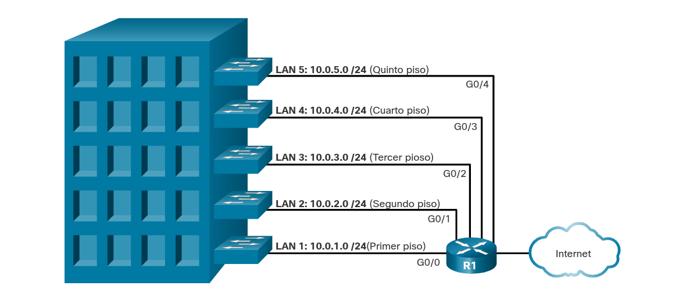
</div>

* __División en subredes por grupo o función__
 <div style="width:60%;padding-left:25%">
	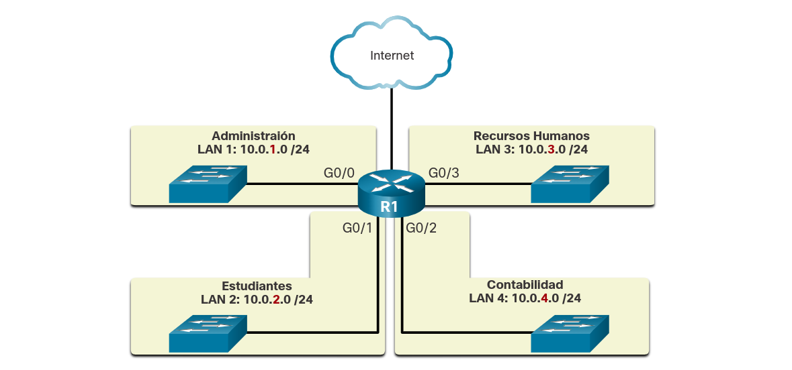
</div>

* __División en redes por tipo de dispositivo__
 <div style="width:60%;padding-left:25%">
	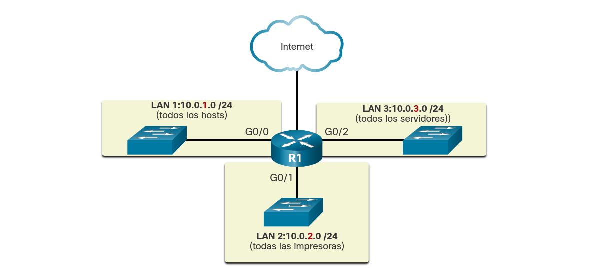
</div>

Los administradores de red pueden crear subredes utilizando cualquier otra división que tenga sentido para la red. Observe que, en cada ilustración, las subredes usan longitudes de prefijo más largas para identificar las redes.

Entender cómo dividir redes en subredes es una aptitud fundamental que deben tener todos los administradores de redes. Se desarrollaron diversos métodos que contribuyen a la comprensión de este proceso. Aunque un poco abrumador al principio, preste mucha atención a los detalles y, con práctica, la división en subredes será más fácil.

## Resumen
### Unidifusión, difusión y multidifusión de IPv4
La transmisión unidifusión se refiere a un dispositivo que envía un mensaje a otro dispositivo en comunicaciones uno a uno. Un paquete de unidifusión tiene una dirección IP de destino que es una dirección de unidifusión que va a un único destinatario. Una dirección IP de origen sólo puede ser una dirección de unidifusión, ya que el paquete sólo puede originarse de un único origen. Esto es independientemente de si la dirección IP de destino es una unidifusión, difusión o multidifusión. Las direcciones de host de unidifusión IPv4 están en el rango de direcciones de `1.1.1.1` a `223.255.255.255`.

Transmisión de difusión hace referencia a un dispositivo que envía un mensaje a todos los dispositivos de una red en comunicaciones unipersonales. Los paquetes de difusión tienen una dirección IPv4 de destino que contiene solo números uno (1) en la porción de host. Todos los dispositivos del mismo dominio de difusión deben procesar un paquete de difusión. Una transmisión puede ser dirigida o limitada. Una difusión dirigida se envía a todos los hosts de una red específica. Se envía una difusión limitada a `255.255.255.255`. De manera predeterminada, los enrutadores no reenvían difusiones.

La transmisión de multidifusión reduce el tráfico al permitir que un host envíe un único paquete a un grupo seleccionado de hosts que estén suscritos a un grupo de multidifusión. Un paquete de multidifusión es un paquete con una dirección IP de destino que es una dirección de multidifusión. IPv4 reservó las direcciones de `224.0.0.0` a `239.255.255.255` como rango de multidifusión. Cada grupo de multidifusión está representado por una sola dirección IPv4 de destino de multidifusión. Cuando un host IPv4 se suscribe a un grupo de multidifusión, el host procesa los paquetes dirigidos a esta dirección de multidifusión y los paquetes dirigidos a la dirección de unidifusión asignada exclusivamente.

### Tipos de direcciones IPv4
Las direcciones IPv4 públicas son direcciones en las que se realiza routing globalmente entre los routers ISP. Sin embargo, no todas las direcciones IPv4 disponibles pueden usarse en Internet. Existen bloques de direcciones denominadas direcciones privadas que la mayoría de las organizaciones usan para asignar direcciones IPv4 a los hosts internos. La mayoría de las redes internas, desde grandes empresas hasta redes domésticas, utilizan direcciones IPv4 privadas para dirigirse a todos los dispositivos internos (intranet), incluidos los hosts y enrutadores. Sin embargo, las direcciones privadas no son enrutables globalmente. Antes de que el ISP pueda reenviar este paquete, debe traducir la dirección IPv4 de origen, que es una dirección privada, a una dirección IPv4 pública mediante NAT.

Direcciones de Loopback (`127.0.0.0/8` o `127.0.0.1` a `127.255.255.254`) generalmente identificadas solo como `127.0.0.1`, son direcciones especiales que usa un host para dirigir el tráfico hacia sí mismo. Direcciones link-local o direcciones IP privadas automáticas (APIPA) `169.254.0.0/16` o `169.254.0.1` a `169.254.255.254` Los utiliza un cliente DHCP de Windows para autoconfigurarse en caso de que no haya servidores DHCP disponibles.

En 1981, las direcciones IPv4 se asignaron utilizando direccionamiento con clase como se define en RFC-790, Números Asignados. A los clientes se les asignaba una dirección de red basada en una de tres clases: A, B o C. RFC dividía los rangos de unidifusión en las siguientes clases específicas:

Clase A (`0.0.0.0/8` a `127.0.0.0/8`) - Diseñada para admitir redes extremadamente grandes, con más de 16 millones de direcciones de host.
Clase B (`128.0.0.0/16` a `191.255.0.0/16`) - Diseñada para satisfacer las necesidades de redes de tamaño moderado a grande, con hasta 65.000 direcciones de host.
Clase C (`192.0.0.0/24` a `223.255.255.0/24`) - Diseñada para admitir redes pequeñas con un máximo de 254 hosts.
También existe un bloque de multidifusión de clase D que va de `224.0.0.0` a `239.0.0.0`, y un bloque de direcciones experimentales de clase E que va de `240.0.0.`0 a `255.0.0.0`.

Las direcciones IPv4 públicas son direcciones en las que se realiza routing globalmente entre los routers ISP. Las direcciones IPv4 públicas deben ser únicas. Tanto las direcciones IPv4 como las IPv6 son administradas por la IANA. La IANA administra y asigna bloques de direcciones IP a los RIR. Los RIR se encargan de asignar direcciones IP a los ISP, quienes a su vez proporcionan bloques de direcciones IPv4 a las organizaciones y a los ISP más pequeños. Las organizaciones también pueden obtener sus direcciones directamente de un RIR.

### Segmentación de la red
En una LAN Ethernet, los dispositivos usan transmisiones y ARP para ubicar otros dispositivos. ARP envía transmisiones de capa 2 a una dirección IPv4 conocida en la red local para descubrir la dirección MAC asociada. Los dispositivos de LAN Ethernet también localizan otros dispositivos que utilizan servicios. Un host generalmente adquiere su configuración de dirección IPv4 mediante DHCP, que envía transmisiones en la red local para ubicar un servidor DHCP. Los switches propagan las broadcasts por todas las interfaces, salvo por aquella en la cual se recibieron.

Un dominio de difusión grande es una red que conecta muchos hosts. Un problema con un dominio de broadcast grande es que estos hosts pueden generar broadcasts excesivas y afectar la red de manera negativa. La solución es reducir el tamaño de la red para crear dominios de difusión más pequeños mediante un proceso que se denomina división en subredes. Estos espacios de red más pequeños se denominan subredes. La base de la división en subredes es usar bits de host para crear subredes adicionales. La división en subredes disminuye el tráfico de red general y mejora su rendimiento. Ayuda a los administradores a implementar políticas de seguridad, como qué subredes pueden o no pueden comunicarse entre sí. Reduce la cantidad de dispositivos afectados por tráfico de transmisión anormal debido a malas configuraciones, problemas de hardware/software o intenciones maliciosas.

## Enlaces de interés
<br />
<br />
<br />
<br />
<br />
<br />
<br />
<br />
<a href="#9-ipv4-y-segmentación-de-redes">⬆️</a>
<a href="./00-Curso.md"><< Menú principal del módulo</a>