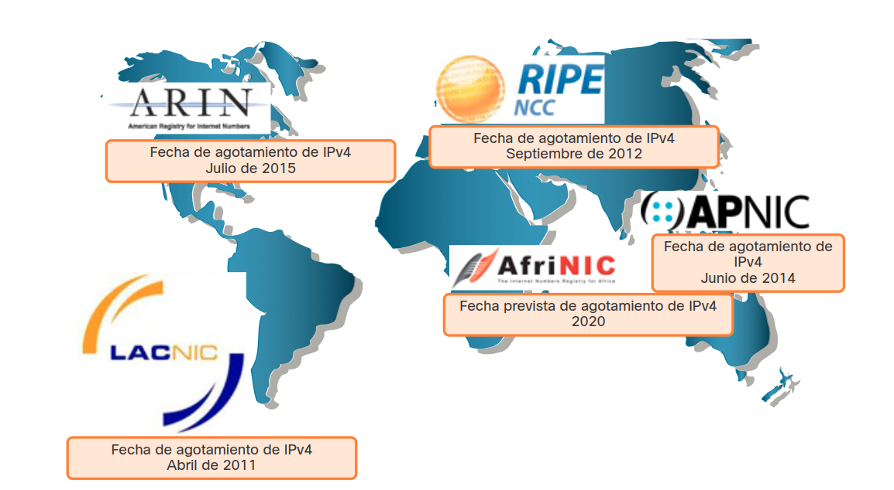
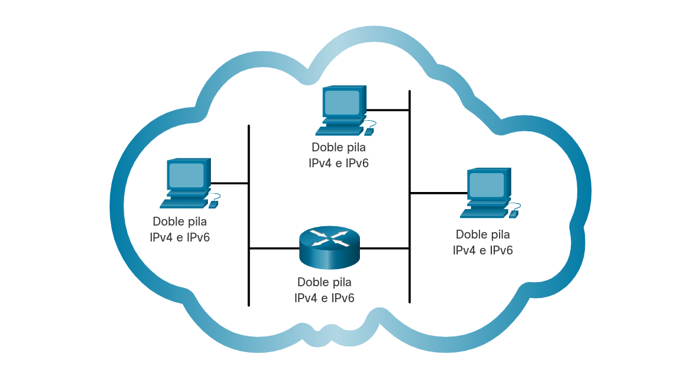
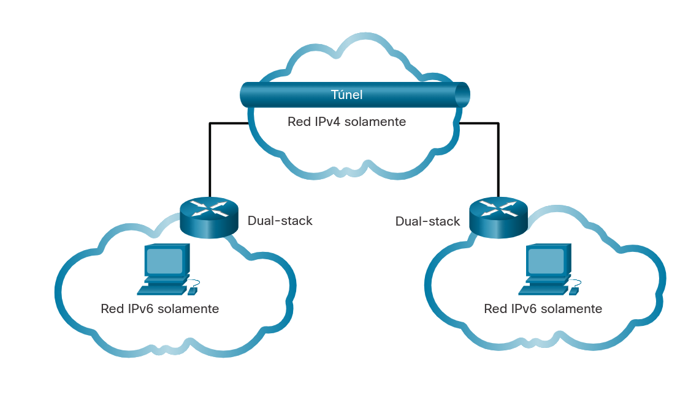
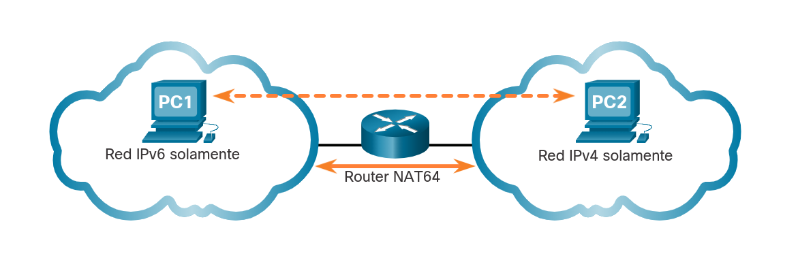
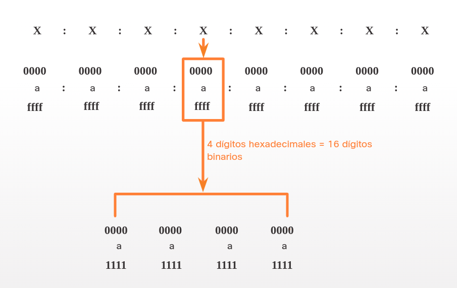

<a href="./00-Curso.md"><< Menú principal del módulo</a>

# 10. Formatos y Reglas de direccionamiento IPv6
# Problemas con IPv4
## La necesidad de IPv6
Ya sabe que IPv4 se está quedando sin direcciones. Es por eso que necesita aprender acerca de IPv6.

IPv6 está diseñado para ser el sucesor de IPv4. IPv6 tiene un espacio de direcciones más grande de 128 bits, que proporciona <math><mrow><mi>340</mi><mo>x</mo><msup><mi>10</mi><mn>36</mn></msup></mrow></math> posibles direcciones. Sin embargo, IPv6 es más que solo direcciones más extensas.

Cuando el IETF comenzó a desarrollar un sucesor de IPv4, aprovechó esta oportunidad para corregir las limitaciones de IPv4 e incluir mejoras. Un ejemplo es el Protocolo de mensajes de control de Internet versión 6 (ICMPv6), que incluye la resolución de direcciones y la configuración automática de direcciones que no se encuentran en ICMP para IPv4 (ICMPv4).

El agotamiento del espacio de direcciones IPv4 fue el factor que motivó la migración a IPv6. A medida que África, Asia y otras áreas del mundo están más conectadas a Internet, no hay suficientes direcciones IPv4 para acomodar este crecimiento. Como se muestra en la ilustración, a cuatro de cinco Registros Regionales de Internet (RIR) se les agotaron las direcciones IPv4.

<div style="width:60%;padding-left:20%">
	
</div>

IPv4 tiene un máximo teórico de 4.300 millones de direcciones. Las direcciones privadas en combinación con la traducción de direcciones de red (NAT) fueron esenciales para demorar la reducción del espacio de direcciones IPv4. Sin embargo, NAT es problemático para muchas aplicaciones, crea latencia y tiene limitaciones que impiden severamente las comunicaciones entre pares.

Con el número cada vez mayor de dispositivos móviles, los proveedores de telefonía móvil han estado liderando el camino con la transición a IPv6. Los dos principales proveedores de telefonía móvil en los Estados Unidos informan que más del 90% de su tráfico es sobre IPv6.

La mayoría de los principales proveedores de Internet y proveedores de contenido, como YouTube, Facebook y Netflix, también han hecho la transición. Muchas empresas como Microsoft, Facebook y LinkedIn están haciendo la transición a IPv6 solo internamente. En 2018, el ISP de banda ancha Comcast reportó un despliegue de más del 65% y British Sky Broadcasting más del 86%.

__Internet de las cosas__

En la actualidad, Internet es significativamente distinta de como era en las últimas décadas. Actualmente, Internet es mucho más que el correo electrónico, las páginas web y la transferencia de archivos entre equipos. Internet evoluciona y se está convirtiendo en una Internet de las cosas (IoT). Ya no serán solo los equipos, las tabletas y los teléfonos inteligentes los únicos dispositivos que accedan a Internet. Los dispositivos del futuro preparados para acceder a Internet y equipados con sensores incluirán desde automóviles y dispositivos biomédicos hasta electrodomésticos y ecosistemas naturales.

Con una población de Internet cada vez mayor, un espacio limitado de direcciones IPv4, problemas con NAT y el IoT, ha llegado el momento de comenzar la transición a IPv6.

## Coexistencia de IPv4 e IPv6
No hay una fecha específica para pasar a IPv6. Tanto IPv4 como IPv6 coexistirán en un futuro próximo y la transición llevará varios años. El IETF creó diversos protocolos y herramientas para ayudar a los administradores de redes a migrar las redes a IPv6. Las técnicas de migración pueden dividirse en tres categorías:

__Doble pila__
Doble pila permite que IPv4 e IPv6 coexistan en el mismo segmento de red. Los dispositivos _dual-stack_ ejecutan pilas de protocolos IPv4 e IPv6 de manera simultánea. Conocido como IPv6 nativo, esto significa que la red del cliente tiene una conexión IPv6 a su ISP y puede acceder al contenido que se encuentra en Internet a través de IPv6.

<div style="width:50%;padding-left:20%">
	
</div>

__Tunelización__
La tunelización es un método para transportar un paquete IPv6 a través de una red IPv4. El paquete IPv6 se encapsula dentro de un paquete IPv4, de manera similar a lo que sucede con otros tipos de datos.

<div style="width:50%;padding-left:20%">
	
</div>

__Traducción__
La Traducción de Direcciones de Redes 64 (NAT64) permite que los dispositivos con IPv6 habilitado se comuniquen con dispositivos con IPv4 habilitado mediante una técnica de traducción similar a la NAT para IPv4. Un paquete IPv6 se traduce a un paquete IPv4 y un paquete IPv4 se traduce a un paquete IPv6.

<div style="width:50%;padding-left:20%">
	
</div>

__Nota__: La tunelización y la traducción son para la transición a IPv6 nativo y solo deben usarse cuando sea necesario. El objetivo debe ser las comunicaciones IPv6 nativas de origen a destino.

# Direccionamiento IPv6
## Sistema de números hexadecimales

Antes de sumergirse en el direccionamiento IPv6, es importante que sepa que las direcciones IPv6 se representan mediante números hexadecimales. Este sistema de base de 16 números utiliza los dígitos del `0` al `9` y las letras de la `A` a la `F`:

__`0 1 2 3 4 5 6 7 8 9 A B C D E F`__

En las direcciones IPv6, estos 16 dígitos se representan como hextetos (que se analizan a continuación), lo que nos permite representar estas direcciones masivas en un formato mucho más legible.

## Formatos de direccionamiento IPv6
El primer paso para aprender acerca de IPv6 en las redes es comprender la forma en que se escribe y se formatea una dirección IPv6. Las direcciones IPv6 son mucho más grandes que las direcciones IPv4, por lo que es poco probable que se nos quede sin ellas.

Las direcciones IPv6 tienen una longitud de 128 bits y se escriben como una cadena de valores hexadecimales. Cada cuatro bits está representado por un solo dígito hexadecimal; para un total de 32 valores hexadecimales, como se muestra en la figura. Las direcciones IPv6 no distinguen entre mayúsculas y minúsculas, y pueden escribirse en minúsculas o en mayúsculas.

<div style="width:50%;padding-left:20%">
	
</div>

__Formato preferido__

La figura anterior también muestra que el formato preferido para escribir una dirección IPv6 es x: x: x: x: x: x: x: x, donde cada "x" consta de cuatro valores hexadecimales. El término octeto hace referencia a los ocho bits de una dirección IPv4. En IPv6, un “hexteto” es el término no oficial que se utiliza para referirse a un segmento de 16 bits o cuatro valores hexadecimales. Cada "x" es un único hexteto que tiene 16 bits o cuatro dígitos hexadecimales.

El formato preferido significa que dirección IPv6 se escribe utilizando los 32 dígitos hexadecimales. No significa necesariamente que sea el método ideal para representar la dirección IPv6. En este módulo, verá dos reglas que ayudan a reducir la cantidad de dígitos necesarios para representar una dirección IPv6.

Estos son ejemplos de direcciones IPv6 en el formato preferido.

```
	2001 : 0db8 : 0000 : 1111 : 0000 : 0000 : 0000 : 0200
	2001 : 0db8 : 0000 : 00a3 : abcd : 0000 : 0000 : 1234
	2001 : 0db8 : 000a : 0001 : c012 : 9aff : fe9a : 19ac
	2001 : 0db8 : aaaa : 0001 : 0000 : 0000 : 0000 : 0000
	fe80 : 0000 : 0000 : 0000 : 0123 : 4567 : 89ab : cdef
	fe80 : 0000 : 0000 : 0000 : 0000 : 0000 : 0000 : 0001
	fe80 : 0000 : 0000 : 0000 : c012 : 9aff : fe9a : 19ac
	fe80 : 0000 : 0000 : 0000 : 0123 : 4567 : 89ab : cdef
	0000 : 0000 : 0000 : 0000 : 0000 : 0000 : 0000 : 0001
	0000 : 0000 : 0000 : 0000 : 0000 : 0000 : 0000 : 0001
```

## Reglas de formato IPv6
### Regla 1 - Omitir ceros iniciales
La primera regla para ayudar a reducir la notación de las direcciones IPv6 es omitir los ceros iniciales en cualquier hexteto. Aquí hay cuatro ejemplos de formas de omitir ceros a la izquierda:

* `01ab` se puede representar como `1ab`
* `09f0` se puede representar como `9f0`
* `0a00` se puede representar como `a00`
* `00ab` se puede representar como `ab`

Esta regla solo es válida para los ceros iniciales, y NO para los ceros finales; de lo contrario, la dirección sería ambigua. Por ejemplo, el hexteto "abc" podría ser "0abc" o "abc0", pero no representan el mismo valor.

|Tipo|Formato|Resultado|
|:-|:-|:-:
|Recomendado|2001 : **0**db8 : **000**0 : 1111 : **000**0 : **000**0 : **000**0 : **0**200
|Sin ceros a la izquierda|2001 : &nbsp;&nbsp;db8 : &nbsp;&nbsp;&nbsp;&nbsp;&nbsp;&nbsp;0 : 1111 : &nbsp;&nbsp;&nbsp;&nbsp;&nbsp;&nbsp;0 : &nbsp;&nbsp;&nbsp;&nbsp;&nbsp;&nbsp;0 : &nbsp;&nbsp;&nbsp;&nbsp;&nbsp;&nbsp;0 :  &nbsp;&nbsp;200|2001 : db8 : 0 : 1111 : 0 : 0 : 0 : 200
|Recomendado|2001 : **0**db8 : **000**0 : **00**a3 : ab00 : **0**ab0 : **00**ab : 1234
|Sin ceros a la izquierda|2001 : &nbsp;&nbsp;db8 : &nbsp;&nbsp;&nbsp;&nbsp;&nbsp;&nbsp;0 : &nbsp;&nbsp;&nbsp;&nbsp;a3 : ab00 : &nbsp;&nbsp;ab0 : &nbsp;&nbsp;&nbsp;&nbsp;ab : 1234|2001 : db8 : 0 : a3 : ab00 : ab0 : ab : 1234
|Recomendado|2001 : **0**db8 : **000**a : **000**1 : c012 : 90ff : fe90 : **000**1
|Sin ceros a la izquierda|2001 : &nbsp;&nbsp;db8 : &nbsp;&nbsp;&nbsp;&nbsp;&nbsp;&nbsp;a : &nbsp;&nbsp;&nbsp;&nbsp;&nbsp;&nbsp;1 : c012 : 90ff : fe90 : &nbsp;&nbsp;&nbsp;&nbsp;&nbsp;&nbsp;1|2001 : db8 : a : 1 : c012 : 90ff : fe90 : 1
|Recomendado|2001 : **0**db8 : aaaa : **000**1 : **000**0 : **000**0 : **000**0 : **000**0
|Sin ceros a la izquierda|2001 : &nbsp;&nbsp;db8 : aaaa : &nbsp;&nbsp;&nbsp;&nbsp;&nbsp;&nbsp;1 : &nbsp;&nbsp;&nbsp;&nbsp;&nbsp;&nbsp;0 : &nbsp;&nbsp;&nbsp;&nbsp;&nbsp;&nbsp;0 : &nbsp;&nbsp;&nbsp;&nbsp;&nbsp;&nbsp;0 : &nbsp;&nbsp;&nbsp;&nbsp;&nbsp;&nbsp;0|2001 : db8 : aaaa : 1 : 0 : 0 : 0 : 0
|Recomendado|fe80 : **000**0 : **000**0 : **000**0 : 0123 : 4567 : 89ab : cdef
|Sin ceros a la izquierda|fe80 : &nbsp;&nbsp;&nbsp;&nbsp;&nbsp;&nbsp;0 : &nbsp;&nbsp;&nbsp;&nbsp;&nbsp;&nbsp;0 : &nbsp;&nbsp;&nbsp;&nbsp;&nbsp;&nbsp;0 : &nbsp;&nbsp;123 : 4567 : 89ab : cdef|fe80 : 0 : 0 : 0 : 123 : 4567 : 89ab : cdef
|Recomendado|fe80 : **000**0 : **000**0 : **000**0 : **000**0 : **000**0 : **000**0 : **000**1
|Sin ceros a la izquierda|fe80 : &nbsp;&nbsp;&nbsp;&nbsp;&nbsp;&nbsp;0 : &nbsp;&nbsp;&nbsp;&nbsp;&nbsp;&nbsp;0 : &nbsp;&nbsp;&nbsp;&nbsp;&nbsp;&nbsp;0 : &nbsp;&nbsp;&nbsp;&nbsp;&nbsp;&nbsp;0 : &nbsp;&nbsp;&nbsp;&nbsp;&nbsp;&nbsp;0 : &nbsp;&nbsp;&nbsp;&nbsp;&nbsp;&nbsp;0 : &nbsp;&nbsp;&nbsp;&nbsp;&nbsp;&nbsp;1|fe80 : 0 : 0 : 0 : 0 : 0 : 0 : 1
|Recomendado|**000**0 : **000**0 : **000**0 : **000**0 : **000**0 : **000**0 : **000**0 : **000**1
|Sin ceros a la izquierda|&nbsp;&nbsp;&nbsp;&nbsp;&nbsp;&nbsp;0 : &nbsp;&nbsp;&nbsp;&nbsp;&nbsp;&nbsp;0 : &nbsp;&nbsp;&nbsp;&nbsp;&nbsp;&nbsp;0 : &nbsp;&nbsp;&nbsp;&nbsp;&nbsp;&nbsp;0 : &nbsp;&nbsp;&nbsp;&nbsp;&nbsp;&nbsp;0 : &nbsp;&nbsp;&nbsp;&nbsp;&nbsp;&nbsp;0 : &nbsp;&nbsp;&nbsp;&nbsp;&nbsp;&nbsp;0 : &nbsp;&nbsp;&nbsp;&nbsp;&nbsp;&nbsp;1|0 : 0 : 0 : 0 : 0 : 0 : 0 : 1
|Recomendado|**000**0 : **000**0 : **000**0 : **000**0 : **000**0 : **000**0 : **000**0 : **000**0
|Sin ceros a la izquierda|&nbsp;&nbsp;&nbsp;&nbsp;&nbsp;&nbsp;0 : &nbsp;&nbsp;&nbsp;&nbsp;&nbsp;&nbsp;0 : &nbsp;&nbsp;&nbsp;&nbsp;&nbsp;&nbsp;0 : &nbsp;&nbsp;&nbsp;&nbsp;&nbsp;&nbsp;0 : &nbsp;&nbsp;&nbsp;&nbsp;&nbsp;&nbsp;0 : &nbsp;&nbsp;&nbsp;&nbsp;&nbsp;&nbsp;0 : &nbsp;&nbsp;&nbsp;&nbsp;&nbsp;&nbsp;0 : &nbsp;&nbsp;&nbsp;&nbsp;&nbsp;&nbsp;0|0 : 0 : 0 : 0 : 0 : 0 : 0 : 0

### Regla 2 - Dos puntos dobles
La segunda regla para ayudar a reducir la notación de las direcciones IPv6 es que dos puntos dobles (`::`) puede reemplazar cualquier cadena única y contigua de uno o más hextetos de 16 bits que consisten en todos los ceros. Por ejemplo, `2001:db8:cafe:1:0:0:0:1` (con los ceros iniciales omitidos) podría representarse como `2001:db8:cafe:1::1`. Los dos puntos dobles (`::`) se utilizan en lugar de los hextetos de tres ceros (`0:0:0`).

Los dos puntos dobles (`::`) se pueden utilizar solamente una vez dentro de una dirección; de lo contrario, habría más de una dirección resultante posible. Cuando se utiliza junto con la técnica de omisión de ceros iniciales, la notación de direcciones IPv6 generalmente se puede reducir de manera considerable. Esto se suele conocer como "formato comprimido".

Aquí hay un ejemplo del uso incorrecto del dos puntos dobles: `2001:db8::abcd::1234`.

Los dos puntos dobles se utilizan dos veces en el ejemplo anterior. Aquí están las posibles expansiones de esta dirección de formato comprimido incorrecto:
* `2001:db8::abcd:0000:0000:1234`
* `2001:db8::abcd:0000:0000:0000:1234`
* `2001:db8:0000:abcd::1234`
* `2001:db8:0000:0000:abcd::1234`

Si una dirección tiene más de una cadena contigua de hextetos, todos cero, la práctica recomendada es usar los dos puntos dobles (`::`) en la cadena más larga. Si las cadenas son iguales, la primera cadena debe usar los dos puntos dobles (`::`).

|Tipo|Formato
|:-|:-
|Recomendado|`2001 : 0db8 : 0000 : 1111 : 0000 : 0000 : 0000 : 0200`
|Comprimido / espacios|`2001 :  db8 :    0 : 1111 :                     : 200`
|Comprimido|`2001:db8:0:1111::200`
|Recomendado|`2001 : 0db8 : 0000 : 0000 : ab00 : 0000 : 0000 : 0000`
|Comprimido / espacios|`2001 :  db8 :    0 :    0 : ab00 : :`
|Comprimido|`2001:db8:0:0:ab00::`
|Recomendado|`2001 : 0db8 : aaaa : 0001 : 0000 : 0000 : 0000 : 0000`
|Comprimido / espacios|`2001 :  db8 : aaaa :     1: :`
|Comprimido|`2001:db8:aaaa:1::`
|Recomendado|`fe80 : 0000 : 0000 : 0000 : 0123 : 4567 : 89ab : cdef`
|Comprimido / espacios|`fe80 :                    :  123 : 4567 : 89ab : cdef`
|Comprimido|`fe80::123:4567:89ab:cdef`
|Recomendado|`fe80 : 0000 : 0000 : 0000 : 0000 : 0000 : 0000 : 0001`
|Comprimido / espacios|`fe80 :                                         :    1`
|Comprimido|`fe80::1`
|Recomendado|`0000 : 0000 : 0000 : 0000 : 0000 : 0000 : 0000 : 0001`
|Comprimido / espacios|`::                                                  1`
|Comprimido|`::1`
|Recomendado|`0000 : 0000 : 0000 : 0000 : 0000 : 0000 : 0000 : 0000`
|Comprimido / espacios|`::`
|Comprimido|`::`

# Resumen
## Problemas con IPv6
El agotamiento del espacio de direcciones IPv4 fue el factor que motivó la migración a IPv6. IPv6 tiene un mayor espacio de direcciones de 128 bits, lo que proporciona 340 sextillones de direcciones. Cuando el IETF comenzó a desarrollar un sucesor de IPv4, aprovechó esta oportunidad para corregir las limitaciones de IPv4 e incluir mejoras. Un ejemplo es ICMPv6, que incluye resolución de direcciones y configuración automática de direcciones que no se encuentran en ICMPv4.

Tanto IPv4 como IPv6 coexisten y la transición a solo IPv6 llevará varios años. El IETF creó diversos protocolos y herramientas para ayudar a los administradores de redes a migrar las redes a IPv6. Las técnicas de migración se pueden dividir en tres categorías: doble pila, tunelización y traducción. Los dispositivos dual-stack ejecutan pilas de protocolos IPv4 e IPv6 de manera simultánea. La tunelización es un método para transportar un paquete IPv6 a través de una red IPv4. El paquete IPv6 se encapsula dentro de un paquete IPv4, de manera similar a lo que sucede con otros tipos de datos. NAT64 permite que los dispositivos con IPv6 habilitado se comuniquen con dispositivos con IPv4 habilitado mediante una técnica de traducción similar a la NAT para IPv4. Un paquete IPv6 se traduce a un paquete IPv4 y un paquete IPv4 se traduce a un paquete IPv6.

## Asignación de direcciones IPv6

Las direcciones IPv6 tienen una longitud de 128 bits y se escriben como una cadena de valores hexadecimales. Cada cuatro bits está representado por un solo dígito hexadecimal; para un total de 32 valores hexadecimales. Las direcciones IPv6 no distinguen entre mayúsculas y minúsculas, y pueden escribirse en minúsculas o en mayúsculas. En IPv6, un hexteto que se refiere a un segmento de 16 bits o cuatro valores hexadecimales. Cada "x" es un único hexteto que tiene 16 bits o cuatro dígitos hexadecimales. El formato preferido significa que dirección IPv6 se escribe utilizando los 32 dígitos hexadecimales. Aquí hay un ejemplo: `fe80:0000:0000:0000:0123:4567:89ab:cdef`.
Dos reglas ayudan a reducir el número de dígitos necesarios para representar una dirección IPv6.

__Regla 1__: Omitir los ceros iniciales Solo puede omitir ceros a la izquierda, no ceros a la izquierda.

* `01ab` se puede representar como `1ab`.
* `09f0` se puede representar como `9f0`.
* `0a00` se puede representar como `a00`.
* `00ab` se puede representar como `ab`.

__Regla 2__: Dos puntos dobles Los dos puntos dobles (`::`) pueden reemplazar cualquier cadena única y contigua de uno o más segmentos de 16 bits (hextetos) que estén compuestas solo por ceros. Por ejemplo, `2001:db8:cafe:1:0:0:0:1` (ceros iniciales omitidos) podría representarse como `2001:db8:cafe:1::1`. Los dos puntos dobles (`::`) se utilizan en lugar de los hextetos de tres ceros (`0:0:0`). Los dos puntos dobles (`::`) se pueden utilizar solamente una vez dentro de una dirección; de lo contrario, habría más de una dirección resultante posible. Si una dirección tiene más de una cadena contigua de hextetos, todos 0, la práctica recomendada es usar los dos puntos dobles (`::`) en la cadena más larga. Si las cadenas son iguales, la primera cadena debe usar los dos puntos dobles (`::`).

## Enlaces de interés
<br />
<br />
<br />
<br />
<br />
<br />
<br />
<br />
<a href="#10-formatos-y-reglas-de-direccionamiento-ipv6">⬆️</a>
<a href="./00-Curso.md"><< Menú principal del módulo</a>