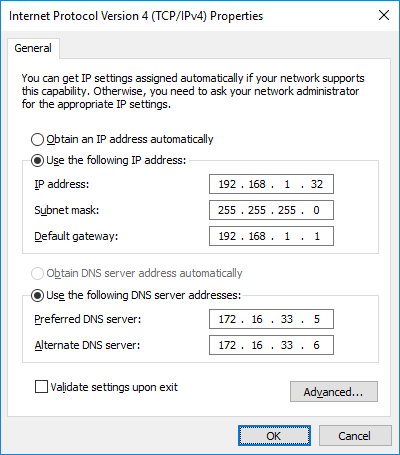
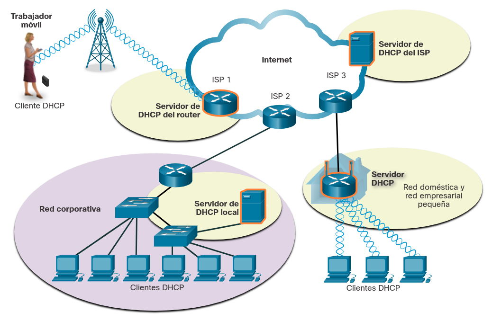

<a href="./00-Curso.md"><< Menú principal del módulo</a>

# 11. Direccionamiento dinámico con DHCP
# Direccionamiento Estático y Dinámico
## Asignación de Direcciones IPv4 Estáticas
Las direcciones IPv4 pueden asignarse de manera estática o dinámica.

Con una asignación estática, el administrador de red debe configurar manualmente la información de red para un host. Como mínimo, esto incluye lo siguiente:

* __Dirección IP__. Identifica al host en la red.
* __Máscara de subred__. Se utiliza para identificar la red a la que está conectado el host.
* __Puerta de enlace predeterminada__. Identifica el dispositivo de red que utiliza el host para acceder a Internet o a otra red remota.

Las direcciones estáticas tienen algunas ventajas. Por ejemplo, son útiles para impresoras, servidores y otros dispositivos de red que deben estar accesibles para los clientes de la red. Si los hosts normalmente acceden al servidor en una dirección IPv4 en particular, no es adecuado que se cambie esa dirección.

La asignación estática de la información de direccionamiento puede proporcionar un mayor control de los recursos de red, pero introducir la información en cada host puede ser muy lento. Cuando se introducen direcciones IPv4 estáticamente, el host solo realiza comprobaciones de errores básicas en la dirección IPv4. Por lo tanto, es más probable que haya errores.

Cuando se utiliza el direccionamiento IPv4 estático, es importante mantener una lista precisa de qué direcciones IPv4 se asignan a qué dispositivos. Además, estas direcciones son permanentes y generalmente no se reutilizan.

	

## Asignación Dinámica de Direcciones IPv4
En las redes locales, es habitual que la población de usuarios cambie frecuentemente. Los nuevos usuarios llegan con computadoras portátiles y necesitan una conexión. Otros tienen nuevas estaciones de trabajo que necesitan conexión. En lugar de que el administrador de red deba asignar las direcciones IPv4 para cada estación de trabajo, es más fácil que las direcciones IPv4 se asignen automáticamente. Esto se logra a través de un protocolo denominado Protocolo de Configuración Dinámica de Host (DHCP _Dynamic Host Configuration Protocol_).

DHCP asigna automáticamente la información de direccionamiento, como la dirección IPv4, la máscara de subred, la puerta de enlace predeterminada y otra información de configuración, como se muestra en la figura.

DHCP es generalmente el método preferido para asignar direcciones IPv4 a los hosts de grandes redes, dado que reduce la carga para al personal de soporte de la red y prácticamente elimina los errores de entrada.

Otro de los beneficios del DHCP es que las direcciones no se asignan permanentemente a un host, sino que son arrendadas durante un período. Si el host se apaga o se desconecta de la red, la dirección regresa al pool para volver a utilizarse. Esto es especialmente útil en el caso de los usuarios móviles que entran en una red y salen de ella.

## Servidores DHCP
Si ingresa a un aeropuerto o cafetería con un punto de acceso inalámbrico, DHCP le permite acceder a Internet. Una vez que ingresa al área, el cliente DHCP de la computadora portátil contacta al servidor DHCP mediante una conexión inalámbrica. El servidor DHCP asigna una dirección IPv4 a su computadora portátil.

Varios tipos de dispositivos pueden actuar como servidores DHCP, siempre y cuando ejecuten software de servicios DHCP. En la mayoría de las redes medianas a grandes, el servidor DHCP generalmente es un servidor local dedicado, basado en una PC.

En el caso de las redes domésticas, el servidor DHCP puede estar ubicado en el ISP y un host de la red doméstica recibe su configuración IPv4 directamente del ISP, tal como se indica en la figura.

	

Muchas redes domésticas y de empresas pequeñas utilizan un enrutador inalámbrico y un módem. En este caso, el enrutador inalámbrico funciona como cliente DHCP y como servidor. El enrutador inalámbrico actúa como cliente para recibir su configuración IPv4 del ISP y, luego, actúa como servidor DHCP para los hosts internos en la red local. El enrutador recibe la dirección IPv4 pública del ISP y, en su rol de servidor DHCP, distribuye direcciones privadas a los hosts internos.

Además de los servidores basados en PC y los enrutadores inalámbricos, otros tipos de dispositivos de red como los enrutadores de uso dedicado pueden proporcionar servicios DHCP a clientes, aunque esto no es muy común.

# Configuración DHCPv4
## Operación DHCPv4
A continuación se describe el proceso de funcionamiento del direccionamiento mediante DHCP.

El direccionamiento dinámico de IP's puede realizarse por el router inalámbrico en el caso de una infraestructura doméstica, o por un PC dedicado a este propósito, funcionando como servidor.

El protocolo DHCP establece un conjunto de mensajes que se establecen entre la máquina que necesita una dirección y el dispositivo que las proporciona. Los mensajes intercambiados son los siguientes:

1. El dispositivo que necesita de una dirección IP lanza un paquete broadcast denominado __`DHCP DISCOVER`__ que busca un servidor DHCP; este paquete contiene la dirección MAC del dispositivo emisor y está destinado a cualquier dispositivo que esté configurado como servidor de DHCP, que lo recibirá.
2. El servidor DHCP de la red responderá con un paquete denominado __`DHCP OFFER`__ que contiene la dirección IP que podrá ser usada por el dispositivo solicitante si la acepta. Esta respuesta contiene la dirección IP, la máscara de subred y la puerta de enlace determinada.
3. Una vez recibida la oferta por el solicitante, este devuelve un paquete denominado __`DHCP REQUEST`__ en la que enviará de vuelta la información recibida indicando que se acepta y la establecerá como su configuración de red.
4. Cuando el servidor recibe esta petición, remite una respuesta denominada __`DHCP ACK`__ (_acknowledge_) indicando que se ha añadido dicha dirección a su tabla asociada con la máquina que hizo la solicitud.

## Configuración del servicio DHCP
Habitualmente la configuración de DHCP permite establecer un rango de direcciones que estarán disponibles para su asignación dinámica; de esta manera, se indica una dirección inicial y el número de direcciones que se podrán asignar. En el momento en que se empiecen a recibir solicitudes DHCP, se comenzarán a asignar dichas direcciones en orden.

## Packet Tracer - Configurar DHCP en un Enrutador Inalámbrico
Packet Tracer: Configurar DHCP en un enrutador inalámbrico

__Objetivos__
* Conectar 3 PC a un enrutador inalámbrico
* Cambiar la configuración del DHCP a un rango de red específico
* Configurar los clientes para obtener su dirección mediante DHCP

__Aspectos básicos/situación__
Un usuario doméstico desea usar un enrutador inalámbrico para conectar 3 PC. Las 3 PC deben obtener su dirección automáticamente del enrutador inalámbrico.

__Instrucciones__
Parte 1: Configure la topología de red
1. Agregue tres PC genéricas.
2. Conecte cada PC a un puerto Ethernet al enrutador inalámbrico usando cables directos.

Parte 2: Observe la configuración predeterminada del DHCP
1. Después de que las luces ámbar se hayan vuelto verdes, haga clic en PC0. Haga clic en la ficha Desktop (Escritorio). Seleccione IP Configuration. Seleccione DHCP para recibir una dirección IP del DHCP Enabled Router (Enrutador habilitado para DHCP).

__Pregunta__
Registre la dirección IP del gateway predeterminado:

# Resumen
## Direccionamiento Estático y Dinámico
Con una asignación estática, el administrador de red debe configurar manualmente la información de red para un host. Como mínimo, esto incluye la dirección IPv4 del host, la máscara de subred y la puerta de enlace predeterminada. La asignación estática de la información de direccionamiento puede proporcionar un mayor control de los recursos de red, pero introducir la información en cada host puede ser muy lento. Cuando se utiliza el direccionamiento IPv4 estático, es importante mantener una lista precisa de qué direcciones IPv4 se asignan a qué dispositivos.

Las direcciones IPv4 se pueden asignar automáticamente mediante un protocolo conocido como DHCP. DHCP es generalmente el método preferido para asignar direcciones IPv4 a los hosts de grandes redes, dado que reduce la carga para al personal de soporte de la red y prácticamente elimina los errores de entrada. Otro de los beneficios del DHCP es que las direcciones no se asignan permanentemente a un host, sino que son arrendadas durante un período. Si el host se apaga o se desconecta de la red, la dirección regresa al pool para volver a utilizarse.

A medida que ingresa a un área con un punto de acceso inalámbrico, el cliente DHCP de su computadora portátil se comunica con el servidor DHCP local a través de una conexión inalámbrica. El servidor DHCP asigna una dirección IPv4 a su computadora portátil. Con las redes domésticas, el servidor DHCP puede estar ubicado en el ISP y un host en la red doméstica recibe su configuración IPv4 directamente del ISP. Muchas redes domésticas y de empresas pequeñas utilizan un enrutador inalámbrico y un módem. En este caso, el enrutador inalámbrico funciona como cliente DHCP y como servidor.

## Configuración de DHCPv4
El servidor DHCP está configurado con un rango (o pool) de direcciones IPv4 que pueden ser asignadas a clientes DHCP. El cliente que necesite una dirección IPv4 enviará un mensaje Descubrir DHCP (DHCP Discover), que es una difusión con dirección IPv4 de destino `255.255.255.255` (32 unos) y dirección MAC de destino `FF-FF-FF-FF-FF-FF` (48 unos). Todos los hosts de la red recibirán esta trama DHCP de difusión, pero solo un servidor DHCP responderá. El servidor responderá con una Oferta de DHCP (DHCP Offer) y sugerirá una dirección IPv4 para el cliente. Luego, el host envía una Solicitud DHCP (DHCP Request) a ese servidor, en la cual pedirá autorización para utilizar la dirección IPv4 sugerida. El servidor responde con una confirmación de recepción DHCP.

En la mayoría de las redes domésticas y de pequeñas empresas, un router inalámbrico proporciona servicios DHCP a los clientes de la red local. Para configurar un enrutador inalámbrico doméstico, acceda a su interfaz web gráfica abriendo el navegador e ingresando la dirección IPv4 predeterminada del enrutador. La dirección IPv4 `192.168.0.1` y la máscara de subred `255.255.255.0` son los valores predeterminados para la interfaz interna del enrutador. Esta es la puerta de enlace predeterminado para todos los hosts en la red local y también la dirección IPv4 interna del servidor DHCP. La mayoría de los enrutadores inalámbricos domésticos tienen la opción de Servidor DHCP habilitada de manera predeterminada.

## Enlaces de interés
 
 
 
 
 
 
 
 
<a href="#11-direccionamiento-dinámico-con-dhcp">⬆️</a>
<a href="./00-Curso.md"><< Menú principal del módulo</a>