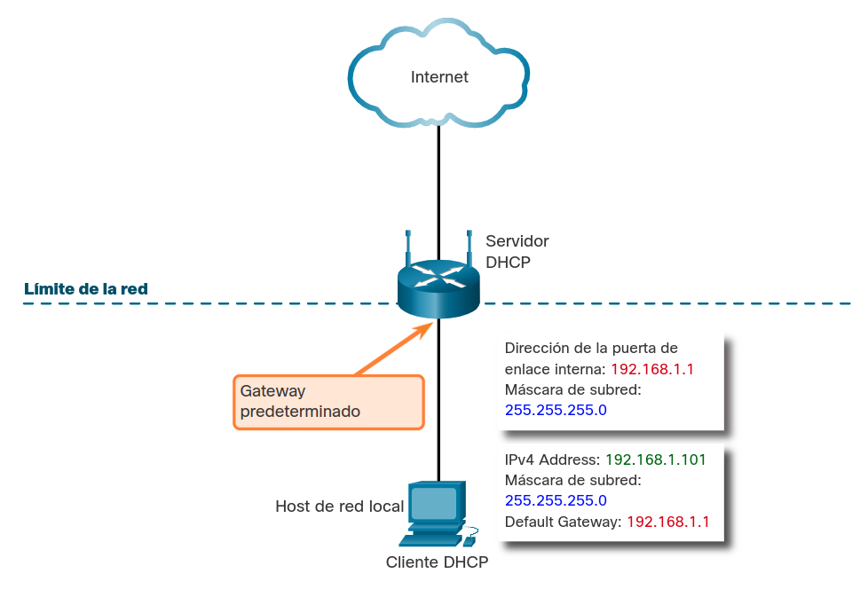
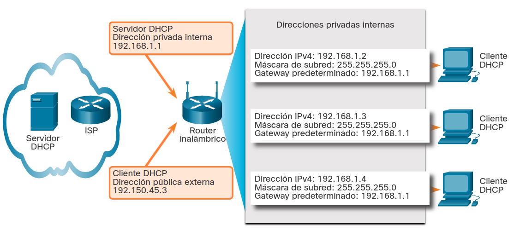

<a href="./00-Curso.md"><< Menú principal del módulo</a>

# 12. Puertas de enlace a otras redes
# Límites de la red
## Enrutadores como puertas de enlace
El enrutador proporciona una puerta de enlace por la cual los hosts de una red pueden comunicarse con los hosts de diferentes redes. Cada interfaz en un enrutador está conectada a una red separada.

La dirección IPv4 asignada a la interfaz identifica qué red local está conectada directamente a ella.

Cada host de una red debe utilizar el router como gateway hacia otras redes. Por lo tanto, cada host debe conocer la dirección IPv4 de la interfaz del enrutador conectada a la red donde el host se encuentra. Esta dirección se conoce como dirección de puerta de enlace predeterminada. Puede configurarse estáticamente en el host o puede recibirse dinámicamente por DHCP.

Cuando un router inalámbrico está configurado para actuar como servidor DHCP para la red local, envía automáticamente la dirección IPv4 de la interfaz correcta a los hosts como la dirección del gateway predeterminado. De esta manera, todos los hosts de la red pueden usar esa dirección IPv4 para enviar mensajes a los hosts ubicados en el ISP y pueden obtener acceso a otros hosts en Internet. Los enrutadores inalámbricos generalmente están configurados en forma predeterminada para actuar como servidores DHCP.

La dirección IPv4 de la interfaz de router local se convierte en la dirección del gateway predeterminado para la configuración del host. La puerta de enlace predeterminada puede proporcionarse estáticamente o por DHCP.

Cuando un router inalámbrico está configurado como servidor DHCP, proporciona su propia dirección IPv4 interna como gateway predeterminado a los clientes DHCP. También les proporciona su dirección IPv4 y máscara de subred correspondientes, tal como se indica en la figura

	

## Enrutadores como Límites Entre Redes
El enrutador inalámbrico actúa como servidor DHCP para todos los hosts locales que tiene conectados, ya sea por medio de cable de Ethernet o en forma inalámbrica. Se dice que estos hosts locales son internos, ya que se encuentran dentro de la red. La mayoría de los servidores DHCP están configurados para asignar direcciones privadas a los hosts de la red interna, en lugar de direcciones públicas enrutables de Internet. Esto garantiza que, en forma predeterminada, no sea posible acceder directamente a la red interna desde Internet.

La dirección IPv4 predeterminada configurada en la interfaz del router inalámbrico local suele ser la primera dirección de host en esa red. A los hosts internos se les deben asignar direcciones dentro de la misma red que el enrutador inalámbrico, ya sea mediante una configuración estática o a través de DHCP. Cuando está configurado como servidor DHCP, el enrutador inalámbrico proporciona direcciones dentro de este rango. También proporciona información de la máscara de red y la dirección IPv4 de su propia interfaz como la puerta de enlace predeterminada, tal como se indica en la figura.

Muchos ISP también utilizan servidores DHCP para proporcionar direcciones IPv4 al lado de Internet del enrutador inalámbrico instalado en los sitios de sus clientes. La red asignada al lado de Internet del router inalámbrico se conoce como red externa, o fuera de la red.

Cuando se conecta un enrutador inalámbrico al ISP, este actúa como cliente DHCP para recibir la dirección IPv4 de la red externa correcta correspondiente a la interfaz de Internet. Los ISP suelen proporcionar una dirección enrutable para Internet, que permite que los hosts conectados al enrutador inalámbrico tengan acceso a Internet.

El enrutador inalámbrico actúa como límite entre la red local interna y la red de Internet externa.

	

# Traducción de Direcciones de Red
## Introducción a NAT
NAT (_Network Address Translation_) es el sistema utilizado para que los _hosts_ en una red interna puedan comunicarse con otros de redes externas, generalmente internet.

Los _hosts_ de la red local tienen asignadas direcciones IPv4 privadas, por lo que, al no estar consideradas como direcciones públicas registradas, no pueden direccionarse en internet. NAT se aplica normalmente a nivel del router que da salida a internet y asigna direcciones públicas a cada una de los _hosts_ conectados a su red interna, registrados en una tabla; así, en la peticiones a _hosts_ externos, el router cambia la dirección de origen del paquete de la privada a la pública.

Este mismo procedimiento se hace a la inversa cuando se recibe la respuesta correspondiente, intercambiando las IP's para que el paquete pueda ser recibido por el _host_ que inició la transacción.

## Packet Tracer - Examinar NAT en un Enrutador Inalámbrico
### Objetivos

* Examinar la configuración NAT en un enrutador inalámbrico.
* Configurar 4 PC para que se conecten a un enrutador inalámbrico mediante DHCP.
* Examine el tráfico que cruza la red usando NAT.

### Instrucciones
#### Parte 1: Examine la configuración para acceder a la red externa.
1. Agregue 1 PC y conéctela al router inalámbrico con un cables directo. Espere a que todas las luces de enlace se vuelvan verdes antes de continuar con el siguiente paso o haga clic en _Fast Forward_ (Adelantar).
2. En la PC, haga clic en Desktop (Escritorio). Seleccione IP Configuration. Haga clic en DHCP para habilitar cada dispositivo para que reciba una dirección IP mediante DHCP en el enrutador inalámbrico.
3. Anote la dirección IP de la puerta de enlace predeterminada. Cierre IP Configuration (Configuración IP) cuando termine.
4. Desplácese al navegador web e introduzca la dirección IP de la puerta de enlace predeterminada en el campo URL. Cuando se le solicite , ingrese admin como el nombre de usuario y admin como la contraseña.
5. Haga clic en la opción de menú Status (Estado) en la esquina superior derecha. Cuando se selecciona, muestra la página de submenús del enrutador.
6. Desplácese hacia abajo por la página del enrutador hasta la opción de conexión a Internet. La dirección IP asignada aquí es la dirección asignada por el ISP. Si no hay una dirección IP (aparece 0.0.0.0), cierre la ventana, espere unos segundos e inténtelo nuevamente. El enrutador inalámbrico se encuentra en el proceso de obtener una dirección IP del servidor DHCP del ISP.

#### Parte 2: Examinar la configuración para acceder a la red interna.
1. Haga clic en Local Network (Red local) dentro de la barra de submenús Status (Estado).
2. Desplácese hacia abajo para analizar la información de la red local. Esta es la dirección asignada a la red interna.
3. Desplácese aún más abajo para examinar la información del servidor DHCP y el rango de direcciones IP que se pueden asignar a los hosts conectados.
¿Son direcciones privadas o públicas?

#### Parte 3: Conectar 3 PC al enrutador inalámbrico.
1. Agregue 3 PCs mas y conéctelas al router inalámbrico con cables directos. Espere a que todas las luces de enlace se vuelvan verdes antes de continuar con el siguiente paso o haga clic en Fast Forward (Adelantar).
2. En cada PC, haga clic en Desktop (Escritorio). Seleccione IP Configuration. Haga clic en DHCP para habilitar cada dispositivo para que reciba una dirección IP mediante DHCP en el enrutador inalámbrico. Cierre IP Configuration (Configuración IP) cuando termine.
3. Haga clic en Command Prompt (Línea de comandos) para verificar la configuración IP de cada dispositivo con el comando ipconfig /all.
_Nota_: Estos dispositivos recibirán una dirección privada. Las direcciones privadas no pueden atravesar Internet; por lo tanto se debe realizar una traducción de NAT.

#### Parte 4: Ver la traducción NAT a través del enrutador inalámbrico.
1. Haga clic en la ficha Simulación de la esquina inferior derecha para acceder al modo Simulación. La pestaña de Simulation (Simulación) se encuentra detrás de la ficha Realtime (Tiempo real) y tiene el símbolo de un cronómetro.
2. Cree una PDU compleja en el modo Simulación para ver el tráfico:
	* En el panel de simulación, haga clic en Show All/None (Mostrar todos/ninguno) para no ver ningún evento. Ahora haga clic en Edit Filters (Editar filtros ) y en la pestaña Misc, marque las casillas de TCP y HTTP. Cierre la ventana cuando haya terminado.
	* Agregue una PDU Compleja haciendo clic en el sobre abierto ubicado en el menú superior.
	* Haga clic en una de las PC para especificarla como origen.
3. Especifique la configuración de la PDU compleja cambiando lo siguiente en la ventana de la PDU compleja:
	* En PDU Settings (Configuración de PDU), Select Application (Seleccionar aplicación) debeser HTTP.
	* Haga clic en el servidor ciscolearn.nat.com para especificarlo como dispositivo de destino.
	* En Source Port (Puerto de origen), introduzca 1000.
	* En Simulation Settings (Configuración de simulación), seleccione Periodic (Periódica). Introduzca 120 segundos en Interval (Intervalo).
	* Haga clic en Create PDU (Crear PDU) en la ventana Create Complex PDU (Crear PDU compleja).

#### Parte 5: Ver la información del encabezado de los paquetes que atravesaron la red.
1. Examine los encabezados de los paquetes enviados entre una PC y el servidor web.
	1. En el panel de simulación, haga doble clic en la tercera línea hacia abajo en la lista de eventos. Aparecerá un sobre en el área de trabajo que representa a esa línea.
	2. Haga clic en el sobre en la ventana del área de trabajo para ver la información del encabezado y el paquete.
2. Haga clic en la ficha de detalles Inbound PDU (PDU entrante). Examine la información del paquete en busca de la dirección IP de origen (SRC) y la dirección IP de destino.
3. Haga clic en la ficha de detalles Outbound PDU (PDU saliente). Examine la información del paquete en busca de la dirección IP de origen (SRC) y la dirección IP de destino.
Observe el cambio en la dirección IP SRC.
4. Haga clic en otras líneas de eventos para ver los encabezados correspondientes a lo largo del proceso.
5. Al finalizar, haga clic en Check Results (Verificar resultados) para verificar el trabajo.

# Resumen
## Límites de la Red
Cada host de una red debe utilizar el router como gateway hacia otras redes. Por lo tanto, cada host debe conocer la dirección IPv4 de la interfaz del enrutador conectada a la red donde el host se encuentra. Esta dirección se conoce como dirección de puerta de enlace predeterminada. Puede configurarse estáticamente en el host o puede recibirse dinámicamente por DHCP.

El enrutador inalámbrico actúa como servidor DHCP para todos los hosts locales que tiene conectados, ya sea por medio de cable de Ethernet o en forma inalámbrica. Se dice que estos hosts locales son internos, ya que se encuentran dentro de la red. Cuando se conecta un enrutador inalámbrico al ISP, este actúa como cliente DHCP para recibir la dirección IPv4 de la red externa correcta correspondiente a la interfaz de Internet. Los ISP suelen proporcionar una dirección enrutable para Internet, que permite que los hosts conectados al enrutador inalámbrico tengan acceso a Internet. El enrutador inalámbrico actúa como límite entre la red local interna y la red de Internet externa.

## Funcionamiento de NAT
El enrutador inalámbrico recibe una dirección pública del ISP, lo que le permite enviar y recibir paquetes en el Internet. Este, a su vez, proporciona direcciones privadas a los clientes de la red local.

El proceso utilizado para convertir direcciones privadas en direcciones enrutables de Internet se llama NAT. Con la NAT, una dirección IPv4 privada de origen (local) se traduce a una dirección pública (global). En el caso de los paquetes entrantes, el proceso es inverso. Por medio de NAT, el enrutador inalámbrico puede traducir muchas direcciones IPv4 internas a la misma dirección pública.

Solo es necesario traducir los paquetes destinados a otras redes. Estos paquetes deben pasar por la puerta de enlace, donde el enrutador inalámbrico reemplaza la dirección IPv4 privada del host de origen por su propia dirección IPv4 pública.

## Enlaces de interés
 
 
 
 
 
 
 
 
<a href="#12-puertas-de-enlace-a-otras-redes">⬆️</a>
<a href="./00-Curso.md"><< Menú principal del módulo</a>