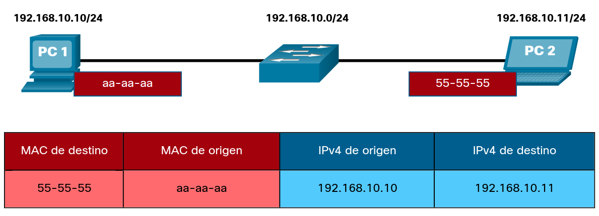
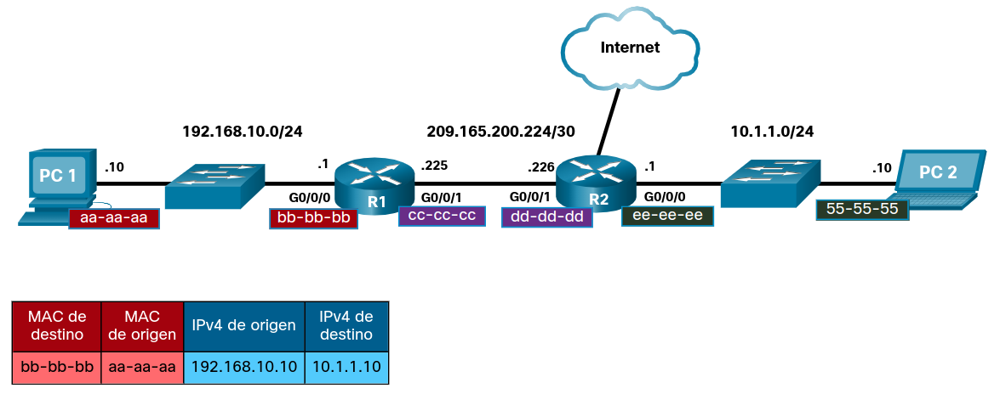
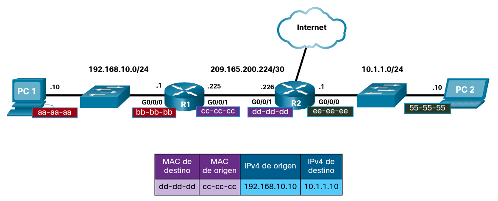
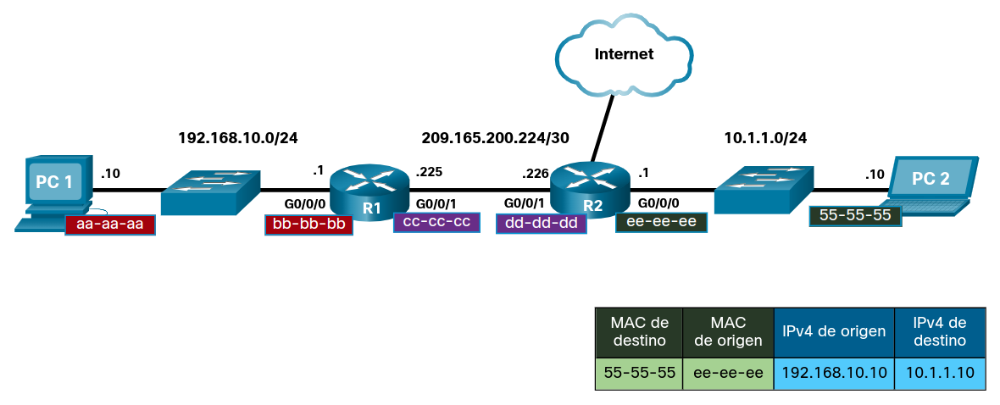
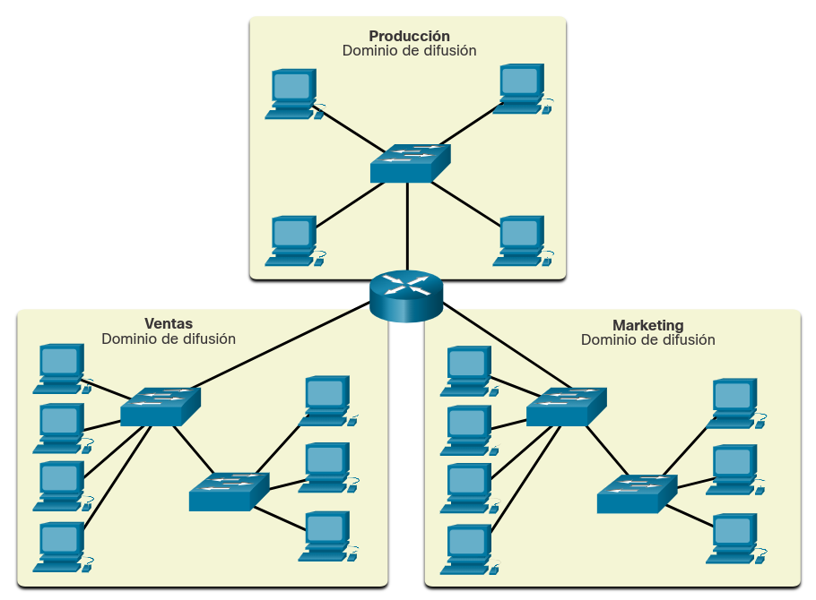
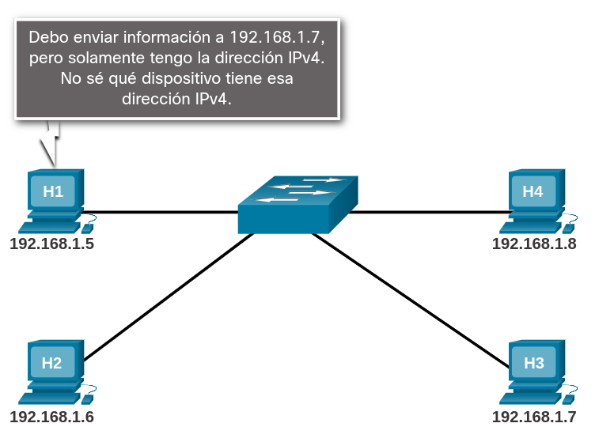
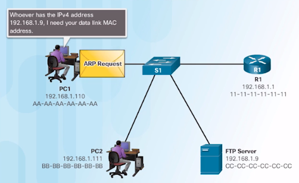
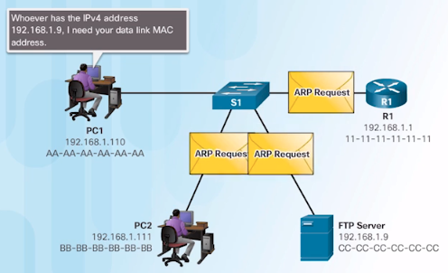
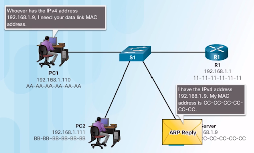
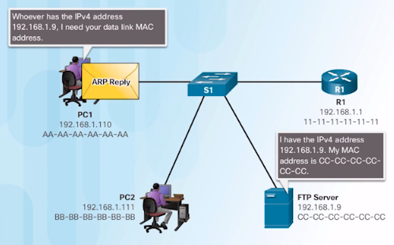

<a href="./00-Curso.md"><< Menú principal del módulo</a>

# 13. El Proceso ARP
# MAC e IP
## Destino en la misma red
A veces, un host debe enviar un mensaje, pero solo conoce la dirección IP del dispositivo de destino. El host necesita saber la dirección MAC de ese dispositivo, pero ¿cómo se puede descubrir? Ahí es donde la resolución de direcciones se vuelve crítica.

Hay dos direcciones primarias asignadas a un dispositivo en una LAN Ethernet:

* __Dirección física (la dirección MAC)__: Se utiliza para las comunicaciones de NIC a NIC en la misma red Ethernet.
* __Dirección lógica (la dirección IP)__: Se utiliza para enviar el paquete desde el dispositivo de origen al dispositivo de destino. La dirección IP de destino puede estar en la misma red IP que la de origen o en una red remota.

Las direcciones físicas de capa 2 (es decir, las direcciones MAC de Ethernet) se utilizan para entregar la trama de enlace de datos con el paquete IP encapsulado de una NIC a otra NIC que está en la misma red. Si la dirección IP de destino está en la misma red, la dirección MAC de destino es la del dispositivo de destino.

Considere el siguiente ejemplo utilizando representaciones de direcciones MAC simplificadas.

	

En este ejemplo, PC1 desea enviar un paquete a PC2. La figura muestra las direcciones MAC de origen y destino de Capa 2 y el direccionamiento IPv4 de Capa 3 que se incluirían en el paquete enviado desde PC1.

La trama Ethernet de capa 2 contiene lo siguiente:

* __Dirección MAC de destino__: Esta es la dirección MAC simplificada de PC2, `55-55-55`.
* __Dirección MAC de origen__: Esta es la dirección MAC simplificada de la NIC de Ethernet en la PC1, `aa-aa-aa`.

El paquete IP de capa 3 contiene lo siguiente:

* __Dirección IPv4 de origen__: Esta es la dirección IPv4 de PC1, `192.168.10.10`.
* __Dirección IPv4 de destino__: Esta es la dirección IPv4 de PC2, `192.168.10.11`.

## Destino en la red remota
Cuando la dirección IP de destino (IPv4 o IPv6) está en una red remota, la dirección MAC de destino será la dirección de gateway predeterminada del host (es decir, la interfaz del router).

Considere el siguiente ejemplo utilizando una representación de dirección MAC simplificada.

	

En este ejemplo, PC1 desea enviar un paquete a PC2. PC2 se encuentra en una red remota. Dado que la dirección IPv4 de destino no está en la misma red local que PC1, la dirección MAC de destino es la del gateway predeterminado local en el router.

Los routers examinan la dirección IPv4 de destino para determinar la mejor ruta para reenviar el paquete IPv4. Cuando el router recibe una trama de Ethernet, desencapsula la información de capa 2. Por medio de la dirección IP de destino, determina el dispositivo del siguiente salto y desencapsula el paquete IP en una nueva trama de enlace de datos para la interfaz de salida.

En nuestro ejemplo, R1 ahora encapsularía el paquete con la nueva información de dirección de Capa 2, como se muestra en la figura.

	

La nueva dirección MAC de destino sería la de la interfaz R2 G0/0/1 y la nueva dirección MAC de origen sería la de la interfaz R1 G0/0/1.

A lo largo de cada enlace de una ruta, un paquete IP se encapsula en una trama. El trama es específico de la tecnología de enlace de datos asociada a ese vínculo, como Ethernet. Si el dispositivo del siguiente salto es el destino final, la dirección MAC de destino será la del NIC de Ethernet del dispositivo, como se muestra en la figura.

	

¿Cómo se asocian las direcciones IP de los paquetes IP en un flujo de datos con las direcciones MAC en cada enlace a lo largo de la ruta hacia el destino? Para los paquetes IPv4, esto se realiza a través de un proceso llamado Protocolo de resolución de direcciones (ARP). Para los paquetes IPv6, el proceso es _ICMPv6 Neighbor Discovery_ (ND).

## Packet Tracer - Identificación de direcciones IP y MAC
### Objetivos

* Recopilar información de PDU para la comunicación de red local
* Recopilar información de PDU para la comunicación de red remota

Esta actividad está optimizada para la visualización de PDU. Los dispositivos ya están configurados. Reunirá información de PDU en el modo de simulación y responderá una serie de preguntas sobre los datos que obtenga.

### Aspectos básicos
Si está interesado en una carrera en administración de redes o seguridad de redes, es importante que comprenda los procesos de comunicación de red normales. En esta actividad de Packet Tracer, inspeccionará las tramas de Ethernet y los paquetes IP en diferentes puntos de la red a medida que viajan del origen al destino. Se centrará en la forma en que las direcciones MAC e IP cambian según el destino (local o remoto) y el lugar donde se capturan las PDU.

Packet Tracer tiene un modo de simulación que le permitirá investigar detalles sobre cómo viajan las PDU en las redes. Le permite verificar el direccionamiento MAC de capa 2 y el direccionamiento IPv4 de capa 3 de las PDU en diferentes ubicaciones de la red a medida que las PDU fluyen del origen al destino.

Esta actividad está optimizada para ver las PDU a medida que viajan en redes locales y remotas. Reunirá información de PDU en el modo de simulación de PT y responderá una serie de preguntas sobre los datos que obtenga. No se requiere ninguna configuración de dispositivo.

### Instrucciones
#### Parte 1: Recopilar información de PDU para la comunicación de red local
En esta parte, estudiará cómo un dispositivo en una red local no necesita una puerta de enlace predeterminada para comunicarse con otro dispositivo en la misma red local.

__Nota__: Revise las Preguntas de reflexión en la Parte 3 antes de continuar con esta parte. Le dará una idea del tipo de información que necesitará recopilar.

1. Pulse sobre  el host `172.16.31.3` y abra  _Command Prompt_.
2. Introduzca el comando `ping 172.16.31.2`. Este comando emitirá una serie de paquetes de solicitud de eco ICMP al destino. Si los paquetes llegan al destino, enviará un paquete de mensajes de respuesta de eco al origen de las solicitudes de ping.
3. Haga clic en el botón Modo de simulación para cambiar al modo de simulación. Repita el comando `ping 172.16.31.2`. Aparece un icono de sobre que representa una PDU junto a `172.16.31.3`.
4. Haga clic en la PDU y localice la siguiente información en las pestañas Modelo OSI y Detalles de PDU de salida. La ficha Outbound PDU Details (Detalles de PDU de salida) muestra encabezados de paquetes y paquetes simplificados para la PDU. Debe observar los siguientes detalles sobre el direccionamiento para la PDU.
	* En el dispositivo: `172.16.31.3`
	* Dirección MAC de origen: `0060.7036.2849`
	* Dirección MAC destino: `000C:85CC:1DA7`
	* Dirección IP de origen: `172.16.31.3`
	* Dirección IP destino: `172.16.31.2`
5. Haga clic en Capture / Forward (la flecha derecha seguida de una barra vertical) para mover la PDU al siguiente dispositivo. Use la pestaña del modelo OSI para recopilar la misma información del Paso 1d. Repita este proceso hasta que la PDU llegue al destino. Para cada paso de la ruta de entrega, registre la información de cada PDU en una hoja de cálculo que utilice un formato como el de la tabla que se muestra a continuación. La información para el primer paso se muestra en la tabla.

__En dispositivo__|__MAC de origen__|__MAC de destino__|__IPv4 de origen__|__IPv4 de destino__|__In/Out__
:-:|:-:|:-:|:-:|:-:|:-:
`172.16.31.3`|`0060.7036.2849`|`000C:85CC:1DA7`|`172.16.31.3`|`172.16.31.2`|Out
`Switch 2`|`0060.7036.2849`|`000C:85CC:1DA7`|`172.16.31.3`|`172.16.31.2`|In/Out
`172.16.31.2`|`0060.7036.2849`|`000C:85CC:1DA7`|`172.16.31.3`|`172.16.31.2`|In
`172.16.31.2`|`000C:85CC:1DA7`|`0060.7036.2849`|`172.16.31.2`|`172.16.31.3`|Out
`Switch 2`|`000C:85CC:1DA7`|`0060.7036.2849`|`172.16.31.2`|`172.16.31.3`|In/Out
`172.16.31.2`|`000C:85CC:1DA7`|`0060.7036.2849`|`172.16.31.2`|`172.16.31.3`|In

6. Notará que la información para la PDU entrante no cambia.
En la ventana de información de la PDU, haga clic en la ficha de la PDU saliente. ¿En qué se diferencia el direccionamiento y por qué? Registre el direccionamiento en su tabla.
	* En la PDU saliente se intercambian las direcciones física y lógica de origen y destino; el _host_ que era el origen en la emisión del _ping_ pasa a ser el destino en la respuesta _pong_.
7. Vuelva al modo _Realtime_.

#### Parte 2: Recopilar información de PDU para la comunicación de red remota
Para comunicarse con redes remotas, es necesario un dispositivo de puerta de enlace predeterminada. El dispositivo de  puerta de enlace predeterminada conecta dos o más redes. En esta parte, estudiará el proceso que tiene lugar cuando un dispositivo se comunica con otro dispositivo que está en una red remota. Preste mucha atención a las direcciones MAC utilizadas.

 _Nota_: Pase el mouse por el Router. Verá información sobre el direccionamiento de las interfaces del router. Consulte estas direcciones mientras observa el flujo de la PDU a través del router.

1. Regrese al símbolo del sistema para `172.16.31.3`.
2. Introduzca el comando ping `10.10.10.2`. Los primeros pings pueden agotar el tiempo de espera.
3. Cambie al modo de simulación y repita el comando ping 10.10.10.2. A PDU appears next to `172.16.31.3`.
4. Haga clic en la PDU y observe la siguiente pestaña de información:
	* En el dispositivo: `172.16.31.3`
	* Dirección MAC de origen: `0060.7036.2849`
	* Dirección MAC destino: `00D0.BA8E.741A`
	* Dirección IP de origen: `172.16.31.3`
	* Dirección IP destino: `10.10.10.2`

	¿Qué dispositivo tiene la MAC de destino que se muestra?
	* La interfaz `FastEthernet 1/0` del _router_.

5. Haga clic en Capture / Forward (la flecha derecha seguida de una barra vertical) para mover la PDU al siguiente dispositivo. Reúna la misma información del paso 1d. Repita este proceso hasta que la PDU llegue al destino. Registre la información de la PDU que recopiló del ping 172.16.31.5 a 10.10.10.2 en una hoja de cálculo utilizando un formato como la tabla de muestra que se muestra a continuación. Ingrese los detalles de las PDU entrantes y salientes en el _router_.

|__En dispositivo__|__MAC de origen__|__MAC de destino__|__IPv4 de origen__|__IPv4 de destino__|__In/Out__
|:-:|:-:|:-:|:-:|:-:|:-:
|`172.16.31.3`|`0060.7036.2849`|`00D0.BA8E.741A`|`172.16.31.3`|`10.10.10.2`|Out
|`Switch 2`|`0060.7036.2849`|`00D0.BA8E.741A`|`172.16.31.3`|`10.10.10.2`|In/Out
|`Router`|`0060.7036.2849`|`00D0.BA8E.741A`|`172.16.31.3`|`10.10.10.2`|In
|`Router`|`00D0.588C.2401`|`0060.2F84.4AB6`|`172.16.31.3`|`10.10.10.2`|Out
|`Switch 1`|`00D0.588C.2401`|`0060.2F84.4AB6`|`172.16.31.3`|`10.10.10.2`|In/Out
|`Access Point`|`00D0.588C.2401`|`0060.2F84.4AB6`|`172.16.31.3`|`10.10.10.2`|In
|`Access Point`|`0050.0FAB.6C82`|`0060.2F84.4AB6`|`172.16.31.3`|`10.10.10.2`|Out
|`10.10.10.2`|`0050.0FAB.6C82`|`0060.2F84.4AB6`|`172.16.31.3`|`10.10.10.2`|In

6. Repita el proceso para el mensaje de respuesta de eco que se origina en el host `10.10.10.2`. Complete la tabla para cada paso.

|__En dispositivo__|__MAC de origen__|__MAC de destino__|__IPv4 de origen__|__IPv4 de destino__|__In/Out__
|:-:|:-:|:-:|:-:|:-:|:-:
|`10.10.10.2`|`0060.2F84.4AB6`|`0050.0FAB.6C82`|`10.10.10.2`|`172.16.31.3`|Out
|`Access Point`|`0060.2F84.4AB6`|`0050.0FAB.6C82`|`10.10.10.2`|`172.16.31.3`|In
|`Access Point`|`0060.2F84.4AB6`|`00D0.588C.2401`|`10.10.10.2`|`172.16.31.3`|Out
|`Switch 1`|`0060.2F84.4AB6`|`00D0.588C.2401`|`10.10.10.2`|`172.16.31.3`|In/Out
|`Router`|`0060.2F84.4AB6`|`00D0.588C.2401`|`10.10.10.2`|`172.16.31.3`|In
|`Router`|`00D0.BA8E.741A`|`0060.7036.2849`|`10.10.10.2`|`172.16.31.3`|Out
|`Switch 2`|`00D0.BA8E.741A`|`0060.7036.2849`|`10.10.10.2`|`172.16.31.3`|In/Out
|`172.16.31.3`|`00D0.BA8E.741A`|`0060.7036.2849`|`10.10.10.2`|`172.16.31.3`|In

#### Preguntas de reflexión
Responda las siguientes preguntas relacionadas con los datos capturados:

1. ¿Se utilizaron diferentes tipos de cables / medios para conectar dispositivos?
	* Se utilizaron conexiones cableadas e inalámbricas.
2. ¿Los cables cambiaron el manejo de la PDU de alguna manera?
	* Sí, ya que en la conexión de la red `10.10.10.1/24` se utiliza un punto de acceso que funciona como otro conmutador, enviando las peticiones a ambos nodos cuando no hay registro en la tabla de direcciones MAC.
3. ¿El punto de acceso inalámbrico hizo algo con las PDU que recibió?
	* Las envió a los dos nodos que tiene conectados.
4. ¿El punto de acceso cambió el direccionamiento de la PDU?
	* Sí; modificó la dirección MAC de origen en el _ping_ y la de destino en el _pong_.
5. ¿Cuál fue la capa OSI más alta que utilizó el punto de acceso?
	* La capa 1.
6. ¿En qué capa del modelo OSI operan los cables y los puntos de acceso?
	* En la capa 1.
7. Al examinar la ficha PDU Details (Detalles de PDU), ¿qué dirección MAC aparecía primero, la de origen o la de destino?
	* La MAC de destino.
8. A veces, las PDU se marcaban con una X roja, mientras que otras tenían marcas de verificación verdes. ¿Cuál es el significado de estas marcas?
	* Las marcas rojas indican que el paquete se ha desechado por el _host_ en cuestión, mientras que la marca verde es que se acepta.
9. Cada vez que se enviaba la PDU entre las redes 10 y 172, había un punto donde las direcciones MAC cambiaban repentinamente. ¿Dónde ocurrió eso?
	* En el _router_.
10. ¿Qué dispositivo usa direcciones MAC que comienzan con 00D0: BA?
	* La interfaz `FastEthernet 1/0` del _router_.
11. ¿A qué dispositivos pertenecían las otras direcciones MAC?
	* De los siguientes dispositivos:
		1. `0060.7036.2849` del _host_ `172.16.31.3`.
		2. `0060.2F84.4AB6` del _host_ `10.10.10.2`.
		3. `00D0.588C.2401` de la interfaz `FastEthernet 0/0` del _router_.
12. ¿Cambiaron las direcciones IPv4 de envío y recepción en alguna de las PDU?
	* No.
13. Cuando sigue la respuesta a un _ping_, a veces llamado _pong_, ¿qué sucede con las direcciones de origen y destino?
	* Se intercambian.
14. ¿Por qué cree que las interfaces del _router_ forman parte de dos redes IP diferentes?
	* Para permitir la segmentación de la red.
15. ¿Qué redes IP están conectadas por el _router_?
	* `172.16.31.0/24` y `10.10.10.0/24`.

# Contención de Difusiones
## La difusión Ethernet
La difusión Ethernet (_Ethernet broadcast_) se realiza cuando la dirección MAC de destino es `11111111.11111111.11111111.11111111.11111111.11111111` (48 bits) en binario, o `FFFF.FFFF.FFFF` en hexadecimal. Cuando un _host_ envía un _broadcast_ y es recibido por un conmutador, este lo reenvía por todos sus interfaces excepto por el que fue recibido, de manera que todos los _hosts_ conectados a dicho dispositivo recibirán la difusión. Si la difusión la recibe por un _router_, no es reenviada como en el caso anterior.

## Dominios de difusión
Cuando un host recibe un mensaje dirigido a la dirección de difusión, lo acepta y lo procesa como si estuviera dirigido directamente a él. Cuando un host envía un mensaje de difusión, los conmutadores reenvían el mensaje a cada host conectado dentro de la misma red local. Por este motivo, a una red de área local o una red con uno o más conmutadores Ethernet también se las denomina dominio de difusión.

Si hay demasiados hosts conectados al mismo dominio de difusión, el tráfico de difusión puede volverse excesivo. El número de hosts y la cantidad de tráfico de red que puede admitir las redes locales están limitados por las capacidades de los conmutadores utilizados para conectarlas. A medida que la red crece y se agregan nuevos hosts, aumenta el tráfico de la red (incluido el tráfico de difusión). Para mejorar el rendimiento, a menudo es necesario dividir una red local en varias redes, o dominios de difusión, tal como se indica en la figura. Se utilizan enrutadores para dividir la red en dominios de difusión múltiples.

	

## Comunicación de la Capa de Acceso
En una red Ethernet local, una NIC solo acepta una trama si la dirección de destino es la dirección MAC de difusión o si corresponde a la dirección MAC de la NIC.

Sin embargo, la mayoría de las aplicaciones de la red utiliza la dirección IP lógica de destino para identificar la ubicación de los servidores y los clientes. En la figura se ilustra el problema que surge si el host emisor solo tiene la dirección IP lógica del host de destino. ¿Cómo hace el host emisor para determinar qué dirección MAC de destino debe incluir en la trama?

El host emisor puede utilizar un protocolo IPv4 llamado Protocolo de Resolución de Direcciones (_Address Resolution Protocol_, ARP) para detectar la dirección MAC de cualquier host en la misma red local. IPv6 usa un método similar conocido como Detección de Vecinos.

	

## ARP
Cuando un host tiene que enviar información a otro host de la misma red necesita conocer tanto la dirección lógica IPv4, como la dirección física MAC, ya que tiene que encapsular en una trama Ethernet el paquete IPv4.

La tabla ARP es un mecanismo de resolución de direcciones que se utiliza para convertir direcciones IP en direcciones MAC. Almacena entradas que relacionan direcciones IP con direcciones MAC, se almacena en memoria caché en el equipo que la utiliza, y se actualiza dinámicamente según sea necesario.

Las entradas de la tabla ARP tienen un tiempo de vida limitado, después del cual se eliminan automáticamente. Esto se hace para evitar que la tabla ARP se llene con entradas obsoletas y para mantener la eficiencia en la resolución de direcciones.

La tabla ARP se actualiza automáticamente cuando un equipo recibe una respuesta ARP de un equipo que posee la dirección IP correspondiente.

ARP utiliza un proceso de tres pasos para determinar y almacenar la dirección MAC de un host que se encuentre en la red local cuando se conoce solo la dirección IPv4 del host:

1. El host emisor crea una trama Ethernet dirigida a una dirección MAC de difusión y la envía. En la trama hay un mensaje con la dirección IPv4 del host de destino que se desea encontrar.
	* El conmutador reenvía la trama Ethernet de difusión a todos sus interfaces excepto por el que la recibió.
	* El _router_ también recibe dicha trama pero no la reenvía a otras redes, manteniendo la difusión en la red local.

	

	

2. Cada host de la red recibe la trama de difusión y compara la dirección IPv4 del mensaje con su dirección IPv4 configurada. El host con la dirección IPv4 coincidente envía su dirección MAC como respuesta al host emisor original.

	

	

3. El host emisor recibe el mensaje y almacena la información de la dirección MAC y la dirección IPv4 en la tabla ARP.

Una vez que el host emisor tiene la dirección MAC del host de destino en su tabla ARP, puede enviar tramas directamente al destino sin realizar una solicitud ARP. Como los mensajes ARP dependen de tramas de difusión para entregar las solicitudes, todos los hosts de la red local IPv4 deben estar en el mismo dominio de difusión.

# Resumen del proceso ARP
## MAC e IP
A veces, un host debe enviar un mensaje, pero solo conoce la dirección IP del dispositivo de destino. El host necesita saber la dirección MAC de ese dispositivo. La dirección MAC se puede descubrir mediante la resolución de direcciones. Hay dos direcciones primarias asignadas a un dispositivo en una LAN Ethernet:

* __Dirección física (la dirección MAC)__. Se utiliza para las comunicaciones de NIC a NIC en la misma red Ethernet.
* __Dirección lógica (la dirección IP)__. Se utiliza para enviar el paquete desde el dispositivo de origen al dispositivo de destino. La dirección IP de destino puede estar en la misma red IP que la de origen o en una red remota.

Cuando la dirección IP de destino (IPv4 o IPv6) está en una red remota, la dirección MAC de destino será la dirección de la puerta de enlace predeterminada del host (es decir, la interfaz del router). Los routers examinan la dirección IPv4 de destino para determinar la mejor ruta para reenviar el paquete IPv4. Cuando el router recibe una trama de Ethernet, desencapsula la información de capa 2. Por medio de la dirección IP de destino, determina el dispositivo del siguiente salto y desencapsula el paquete IP en una nueva trama de enlace de datos para la interfaz de salida. A lo largo de cada enlace de una ruta, un paquete IP se encapsula en una trama. El trama es específico de la tecnología de enlace de datos asociada a ese vínculo, como Ethernet. Si el dispositivo del siguiente salto es el destino final, la dirección MAC de destino es la de la NIC Ethernet del dispositivo.

## Contención de difusiones
Un mensaje puede contener solo una dirección MAC de destino. La resolución de direcciones permite que un host envíe un mensaje de difusión a una dirección MAC única que es reconocida por todos los hosts. La dirección MAC de transmisión es una dirección de 48 bits compuesta por todos unos. Las direcciones MAC generalmente se representan en notación hexadecimal. La dirección MAC de difusión en notación hexadecimal es `FFFF.FFFF.FFFF`. Cada F en notación hexadecimal representa cuatro unos en la dirección binaria.

Cuando un host envía un mensaje de difusión, los conmutadores reenvían el mensaje a cada host conectado dentro de la misma red local. Por este motivo, a una red de área local o una red con uno o más conmutadores Ethernet también se las denomina dominio de difusión.

Si hay demasiados hosts conectados al mismo dominio de difusión, el tráfico de difusión puede volverse excesivo. El número de hosts y la cantidad de tráfico de red que puede admitir las redes locales están limitados por las capacidades de los conmutadores utilizados para conectarlas. Para mejorar el rendimiento, es posible que deba dividir una red local en varias redes o dominios de transmisión. Se utilizan enrutadores para dividir la red en dominios de difusión múltiples.

En una red Ethernet local, una NIC solo acepta una trama si la dirección de destino es la dirección MAC de difusión o si corresponde a la dirección MAC de la NIC. La mayoría de las aplicaciones de red se basan en la dirección IP de destino lógica para identificar la ubicación de los servidores y clientes. ¿Cómo hace el host emisor para determinar qué dirección MAC de destino debe incluir en la trama? El host emisor puede ARP para descubrir la dirección MAC de cualquier host en la misma red local.

ARP utiliza un proceso de tres pasos para descubrir y almacenar la dirección MAC de un host en la red local cuando solo se conoce la dirección IPv4 del host:

1. El host emisor crea una trama dirigida a una dirección MAC de difusión y la envía. En la trama hay un mensaje con la dirección IPv4 del host de destino que se desea encontrar.
2. Cada host de la red recibe la trama de difusión y compara la dirección IPv4 del mensaje con su dirección IPv4 configurada. El host con la dirección IPv4 coincidente envía su dirección MAC como respuesta al host emisor original.
3. El host emisor recibe el mensaje y almacena la información de la dirección MAC y la dirección IPv4 en una tabla, denominada tabla ARP.

IPv6 usa un método similar conocido como Detección de Vecinos.

## Enlaces de interés
 
 
 
 
 
 
 
 
<a href="#13-el-proceso-arp">⬆️</a>
<a href="./00-Curso.md"><< Menú principal del módulo</a>