<a href="./00-Curso.md"><< Menú principal del módulo</a>

# 14. Enrutamiento entre redes
# La Necesidad del Enrutamiento
## División de la Red Local
Existen diferentes razones para dividir redes locales de cierto tamaño en distintos segmentos de red.

La división o segmentación de redes limita el área de los dominios de difusión, y por tanto el alcance de las difusiones que se puedan generar en los _hosts_ de dicha red. Estas difusiones pueden generar un tráfico excesivo que es totalmente innecesario para la mayoría de los equipos en la red.

Por otro lado, la división permite acotar la visibilidad entre las distintas subredes añadiendo con ello cierta seguridad.

Finalmente, la cuestión más importante es la localización. Si cualquiera de las partes de la red original (sin segmentar) quisiera trasladarse físicamente a otra localización solo cabría la segmentación.

## Ahora necesitamos enrutamiento
En la mayoría de las situaciones queremos que nuestros dispositivos puedan conectarse más allá de nuestra red local: a otros hogares, a otras empresas y a Internet. Los dispositivos que no están en el segmento de red local se denominan _hosts_ remotos. Cuando un dispositivo de origen envía un paquete a un dispositivo de destino remoto, se necesita la ayuda de los enrutadores y del enrutamiento. El enrutamiento es el proceso de identificación de la mejor ruta para llegar a un destino.

Un enrutador es un dispositivo de red que conecta varias redes IP de Capa 3. En la capa de distribución de red, los enrutadores dirigen el tráfico y realizan otras funciones críticas para el funcionamiento de red eficiente. Los enrutadores, al igual que los conmutadores, pueden decodificar y leer los mensajes que reciben. A diferencia de los conmutadores, que toman su decisión de reenvío según la dirección MAC de Capa 2, los enrutadores toman su decisión de reenvío según la dirección IP de Capa 3.

El formato del paquete contiene las direcciones IP de los _hosts_ de destino y de origen, además de los datos del mensaje que se envían entre ellos. El enrutador lee la porción de red de la dirección IP de destino y utiliza esta información para determinar cuál de las redes conectadas es el mejor camino para reenviar el mensaje al destino.

Cada vez que las porciones de red de las direcciones IP de los _hosts_ de origen y de destino no coinciden, se debe utilizar un enrutador para reenviar el mensaje. Si un _host_ que se encuentra en la red `1.1.1.0` necesita enviar un mensaje a un _host_ de la red `5.5.5.0`, el _host_ reenvía el mensaje al enrutador. El enrutador recibe el mensaje, desencapsula la trama de Ethernet y, luego, lee la dirección IP de destino en el paquete IP. Después determina dónde debe reenviar el mensaje. Vuelve a encapsular el paquete en una trama nueva y reenvía la trama a su destino.

Paquete IP encapsulado en una trama de Ethernet

	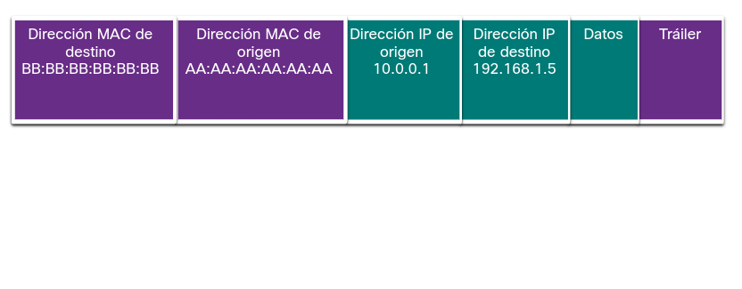

	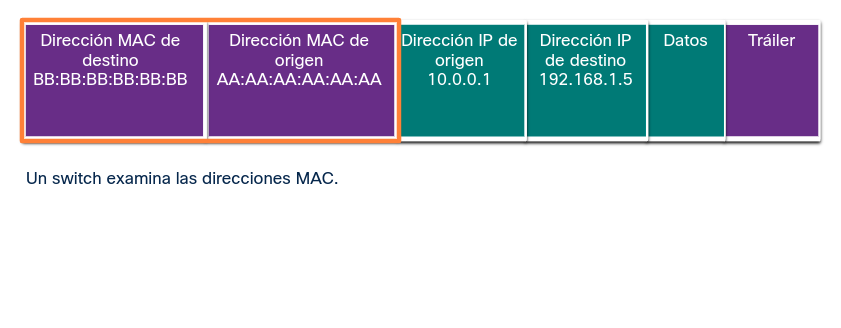

	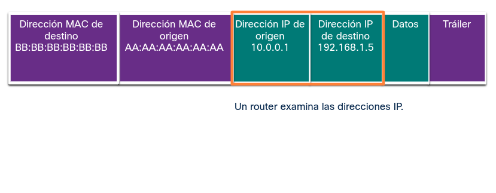

	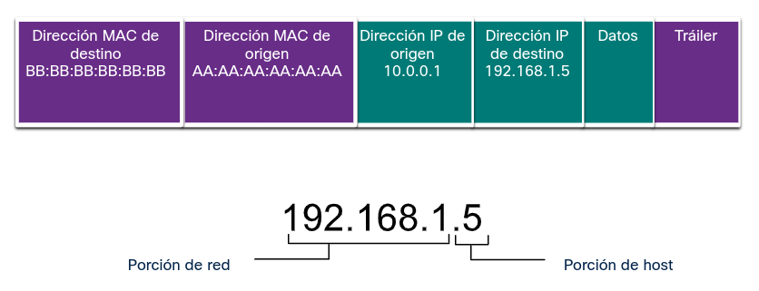

# La Tabla de Enrutamiento
## Reenvío de Paquetes del Enrutador
Cuando un _host_ quiere transmitir información a otro _host_ perteneciente a una red distinta, envía el paquete con la dirección IPv4 de destino a su puerta de enlace predeterminada; lo hace así al saber por él mismo que el destino pertenece a otra red por su máscara de red configurada.

	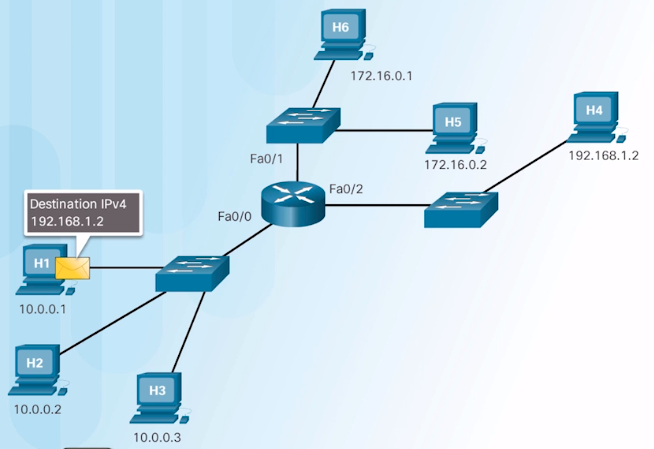

	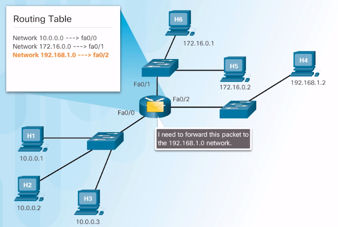

El _router_ comprueba su tabla de enrutamiento y reenvía por la interfaz correspondiente.

	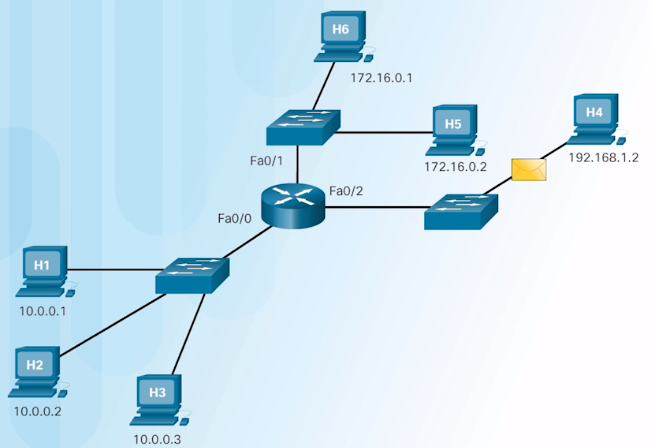

Si el _host_ anterior envía un paquete a una dirección IPv4 de difusión, esta paquete también es recibido por el _router_ pero no es reenviado al resto de redes.

	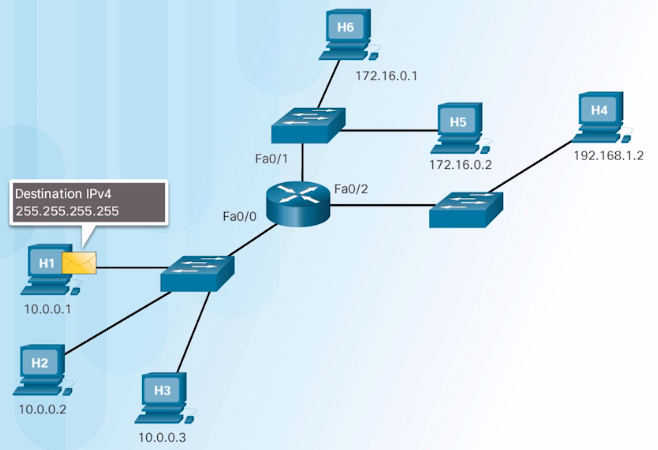

	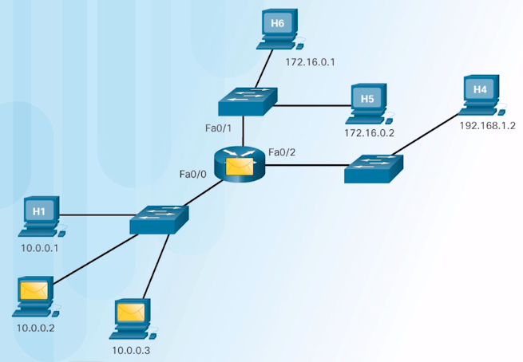

## Entradas en la Tablas de Enrutamiento
Los enrutadores transmiten información entre redes locales y remotas. Para hacerlo, los enrutadores deben utilizar tablas de enrutamiento a fin de almacenar información. Las tablas de enrutamiento no tienen relación con las direcciones de los _hosts_ individuales. Las tablas de enrutamiento contienen las direcciones de las redes y el mejor camino para llegar a esas redes. Se pueden incorporar entradas a la tabla de enrutamiento de dos maneras: por actualización dinámica por medio de información recibida de otros enrutadores de la red; o ser ingresadas manualmente por un administrador de la red. Los enrutadores utilizan las tablas de enrutamiento para determinar qué interfaz deben utilizar para reenviar un mensaje al destino.

Si el enrutador no puede determinar a dónde debe reenviar el mensaje, lo descartará. Los administradores de red configuran una ruta predeterminada estática que se coloca en la tabla de enrutamiento para que no se descarte un paquete debido a que la red de destino no está en la tabla de enrutamiento. Una ruta predeterminada es la interfaz a través de la cual el enrutador reenvía los paquetes que contienen una dirección IP de una red de destino desconocida. Esta ruta predeterminada normalmente se conecta a otro enrutador que puede reenviar el paquete hacia la red de destino final.

	

__Tipo__|__Red__|__Destino__
:-:|:-:|:-:
C|`10.0.0.0/8`|FastEthernet 0/0
C|`172.16.0.0/16`|FastEthernet 0/1

__Tipo__. El tipo de conexión. "C" significa conectada directamente.
__Red__. La dirección de red.
__Destino__. La interfaz utilizada para reenviar paquetes a la red.

## La puerta de enlace predeterminada
El método que utilizan los _hosts_ para enviar mensajes a un destino de una red remota es diferente de la manera en la que envían mensajes a la misma red local. Cuando un _host_ necesita enviar un mensaje a otro _host_ ubicado en la misma red, reenvía el mensaje de manera directa. El _host_ utiliza ARP para determinar la dirección MAC del _host_ de destino. El paquete IPv4 contiene la dirección IPv4 de destino y encapsula el paquete en una trama que contiene la dirección MAC del destino y lo reenvía.

Cuando un _host_ necesita enviar un mensaje a una red remota, debe utilizar el enrutador. El _host_ incluye la dirección IP del _host_ de destino en el paquete igual que antes. Sin embargo, cuando encapsula el paquete en una trama, utiliza la dirección MAC del enrutador como destino de la trama. De este modo, el enrutador recibirá y aceptará la trama en función de la dirección MAC.

¿Cómo hace el _host_ de origen para determinar la dirección MAC del enrutador? Un _host_ recibe la dirección IPv4 del enrutador a través de la dirección de la puerta de enlace predeterminada definida en su configuración TCP/IP. La dirección de la puerta de enlace predeterminada es la dirección de la interfaz del enrutador conectada a la misma red local que el _host_ de origen. Todos los _hosts_ de la red local utilizan la dirección de la puerta de enlace predeterminada para enviar mensajes al enrutador. Cuando el _host_ conoce la dirección IPv4 de la puerta de enlace predeterminada, puede usar ARP para determinar la dirección MAC. La dirección MAC del enrutador se coloca luego en la trama, destinada a otra red.

Es importante que en cada _host_ de la red local se configure la puerta de enlace predeterminada adecuada. Si no se define ninguna puerta de enlace predeterminada en la configuración TCP/IP o si se especifica una puerta de enlace predeterminada errónea, no se podrán entregar los mensajes dirigidos a _hosts_ de redes remotas.

	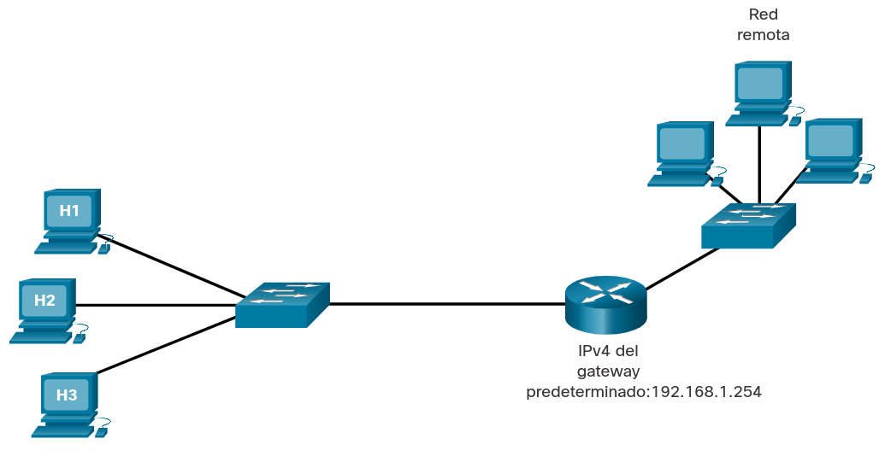

 

__PC__|__Dirección IPv4__|__Máscara de subred__|__Gateway predeterminado__
:-:|:-:|:-:|:-:
H1|`192.168.1.1`|`255.255.255.0`|`192.168.1.254`
H2|`192.168.1.2`|`255.255.255.0`|`192.168.1.254`
H3|`192.168.1.3`|`255.255.255.0`|`192.168.1.254`

# Crear una LAN
## Redes de Área Local
El término red de área local (Local Area Network, LAN) hace referencia a una red local o un grupo de redes locales interconectadas que están bajo el mismo control administrativo. En los comienzos de las redes, las LAN se definían como redes pequeñas que existían en una única ubicación física. Aunque las LAN pueden ser una única red local instalada en una vivienda u oficina pequeña, la definición de LAN ha evolucionado y ahora incluye redes locales interconectadas compuestas por muchos cientos de hosts, instaladas en múltiples edificios y ubicaciones.

Lo importante a recordar es que todas las redes locales dentro de una LAN están bajo el mismo control administrativo. Otras características comunes de las LAN son que suelen usar protocolos Ethernet o inalámbricos, y que admiten velocidades de transmisión de datos altas.

El término intranet se usa a menudo para referirse a una LAN privada que pertenece a una organización y está diseñada para que solo los miembros de la organización, los empleados u otras personas con autorización puedan acceder a ella.

	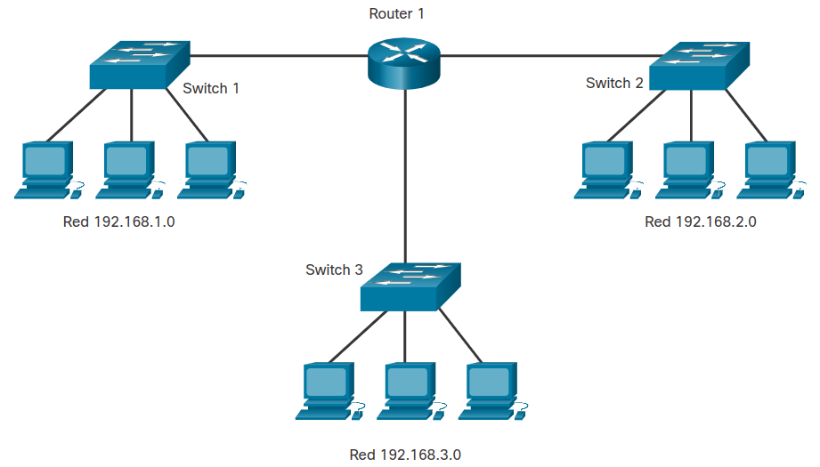

## Segmentos de Red Locales y Remotos
En una red LAN, es posible colocar todos los _hosts_ en una sola red local o dividirlos en varias redes conectadas por un dispositivo de la capa de distribución. Cómo se determina esta ubicación depende de los resultados deseados.

### Todos los _hosts_ en un Segmento Local
Si todos los hosts están en una única red local, cada host podrá ser visto por todos los demás hosts. Esto es así porque hay un dominio de difusión, y los hosts utilizan ARP para encontrarse.

En un diseño de red simple, puede resultar beneficioso tener todos los hosts en una sola red local. Sin embargo, a medida que la red crece, el aumento del tráfico disminuye el rendimiento y la velocidad de la red. En este caso, puede resultar beneficioso trasladar algunos hosts a una red remota.

Ventajas de un único segmento local:

* Apto para redes simples.
* Menos complejidad y menor costo de red.
* Permite que otros dispositivos "vean" los dispositivos.
* Transferencia de datos más rápida; comunicación más directa.
* Facilita el acceso de los dispositivos.

Desventajas de un solo segmento local:

* Todos los hosts están en un dominio de difusión que ocasiona más tráfico en el segmento y puede ralentizar el rendimiento de la red.
* Es más difícil implementar QoS.
* Es más difícil implementar seguridad.

	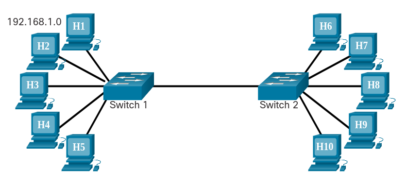

La figura de todos los hosts en un segmento local muestra la red `192.168.1.0` con hosts `H1` a `H5` conectados al `Switch 1`. El `Switch 1` está conectado al `Switch 2`, que se conecta a los hosts `H6` a `H10`. 

Colocar todos los hosts en una única red local les permite ser vistos por todos los demás hosts. Esto es así porque hay un dominio de difusión, y los hosts utilizan ARP para encontrarse. 

En un diseño de red simple, puede resultar beneficioso tener todos los hosts en una sola red local. Sin embargo, a medida que la red crece, el aumento del tráfico disminuye el rendimiento y la velocidad de la red. En este caso, puede resultar beneficioso trasladar algunos hosts a una red remota. 

__Ventajas de un solo segmento local__: apropiado para redes más simples, menos complejas y de menor costo de red, permite que otros dispositivos vean los dispositivos, transferencia de datos más rápida: comunicación más directa, facilidad de acceso a los dispositivos. 

__Desventajas de un solo segmento local__: todos los hosts están en un dominio de transmisión, lo que provoca más tráfico en el segmento y puede ralentizar el rendimiento de la red, más difícil de implementar QoS, más difícil de implementar la seguridad.

### _Hosts_ en un Segmento Remoto
Colocar hosts adicionales en una red remota disminuirá el impacto de las demandas de tráfico. Sin embargo, los hosts de una red no podrán comunicarse con los hosts de la otra red sin el uso del enrutamiento. Los enrutadores aumentan la complejidad de la configuración de la red y pueden generar latencia o retraso en los paquetes enviados de una red local a la otra.

__Ventajas__:
* Más apropiado para redes más grandes y complejas.
* Divide los dominios de difusión y disminuye el tráfico.
* Puede mejorar el rendimiento en cada segmento.
* Hace las máquinas invisibles para quienes se encuentran en otros segmentos de la red local.
* Puede proporcionar más seguridad.
* Puede mejorar la organización de la red.

__Desventajas__:
* Requiere el uso de enrutamiento (capa de distribución).
* El enrutador puede ralentizar el tráfico entre segmentos.
* Más complejidad y gastos (requiere un enrutador).

	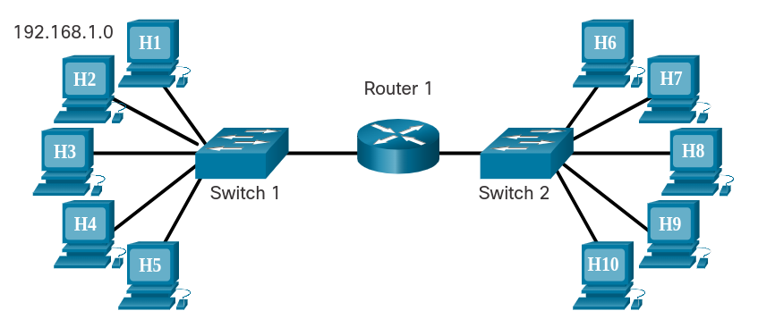

La figura de hosts en un segmento remoto muestra la red `192.168.1.0` con hosts `H1` a `H5` conectados al `Switch 1`. El conmutador 1 se conecta al `Router 1`. El `Router 1` también se conecta al `Switch 2`, que está conectado a los hosts `H6` a `H10`. 

Colocar hosts adicionales en una red remota disminuirá el impacto de las demandas de tráfico. Sin embargo, los hosts de una red no podrán comunicarse con los hosts de la otra red sin el uso del enrutamiento. Los enrutadores aumentan la complejidad de la configuración de la red y pueden generar latencia o retraso en los paquetes enviados de una red local a la otra. 

## Packet Tracer - Observar el flujo de tráfico en una red enrutada
### Objetivos
__Parte 1__: Observar el flujo de tráfico en una LAN no enrutada
__Parte 2__: Reconfigurar la red para enrutar entre las LAN
__Parte 3__: Observar el flujo de tráfico en la red enrutada

### Aspectos básicos/Situación
Se le ha pedido a la empresa para la que trabaja que proponga un nuevo diseño de red para `XYZ LLC`. _XYZ_ es una empresa nueva que recientemente ha tenido éxito con sus ofertas de productos. Se expandirán y su red deberá crecer con ellos. Actualmente, la red está configurada con una única red IP para hosts en todos los departamentos. Este diseño se ha vuelto ineficiente y las demoras en la red son cada vez más notorias. Se le ha pedido que ayude a preparar la propuesta con el equipo de ventas. El equipo de ventas propondrá una solución en la que se mejorará la eficiencia de la red mediante la implementación de enrutamiento entre redes de departamentos separadas. Está trabajando en una demostración de cómo tener varias redes enrutadas en una empresa puede mejorar la eficiencia de la red. Siga las instrucciones para realizar la demostración y proponer una nueva red a `XYZ LLC`.

### Instrucciones
#### Parte 1: Observar el flujo de tráfico en una LAN no enrutada
La red `XYZ` consta de aproximadamente 150 dispositivos que están conectados a una LAN. La LAN está configurada en una sola red IPv4. Los hosts en diferentes departamentos se conectan a_switches_que luego se conectan al _router_ __Edge__. El _router_ solo enruta el tráfico entre la LAN e Internet, representado por la nube del __ISP__. Dado que solo se utiliza una red IP en la LAN, todos los departamentos están en la misma red.

La topología de Packet Tracer está simplificada. Solo muestra algunos de los departamentos y hosts. Suponga que el comportamiento que demostrará sucede a una escala mucho mayor que la que se muestra en la red de PT.

En esta parte, utilizará el modo de simulación de Packet Tracer para observar cómo fluye el tráfico a través de una LAN no enrutada.

##### Paso 1: Borre la caché de ARP en el host de Sales 1.
Pase el mouse sobre el host de __Sales 1__ para ver su dirección IP. Anótelo.
1. Haga clic en __Sales 1__ > pestaña __Desktop__ (Escritorio) > __Símbolo del sistema__ y escriba el comando `arp -a`. No debe haber direcciones MAC en la caché de ARP. Si hay entradas en la caché de ARP, utilice el comando `arp -d` para eliminarlas.

##### Paso 2: Observe el flujo de tráfico en la red.
1. Haga clic en el botón __Modo de simulación__ en la esquina inferior derecha de la ventana del PT para pasar del modo __Realtime__ al de __Simulación__.
2. Abra el símbolo del sistema para __Sales 2__ e introduzca el comando `ping` seguido de la dirección IP de __Sales 1__.
3. Utilice el botón __Capture then Forward__ (Capturar y Avanzar) (el triángulo que apunta hacia la derecha con una barra vertical adjunta) en los __controles de reproducción__ del __panel de simulación__ para comenzar a ejecutar el comando `ping`. Verá un icono de sobre de color junto a __Sales 2__. Esto representa una PDU. Haga clic en el botón __Capture then Forward__ para mover la PDU al primer dispositivo en su ruta al dispositivo de destino. Haga clic en el sobre de la PDU para inspeccionar el contenido.
	* ¿Cuáles son las direcciones IP y MAC de origen y destino para la trama y el paquete?
		* Origen. IP = `192.168.1.5`; MAC = `00E0.8FA9.B373`
		* Destino. IP = `192.168.1.3`; MAC = `FFFF.FFFF.FFFF`
	* ¿Por qué la dirección MAC de destino es la dirección de difusión?
		* Porque `Sales 2` no tiene registrada la dirección MAC de destino en su tabla ARP.
4. Avance las PDU a través de la red hasta que se cree una nueva PDU (color diferente) en __Sales 2__.
	* ¿Qué hosts y otros tipos de dispositivos necesitaban procesar los paquetes de solicitud de ARP?
		* Todos los _hosts_ de la red, los conmuntadores y el enrutador.
	* ¿Cuál es el impacto de esto en el funcionamiento eficiente de la red como está configurada actualmente?
		* Mayor tráfico y menor rendimiento.
5.  En __Sales 2__, apareció una nueva PDU con un color diferente. Haga clic en la nueva PDU e inspeccione su contenido. Mire los detalles de la PDU de salida.
	* ¿Qué tipo de PDU es esta?
		* Es una PDU de unidifusión, ya que incorpora la MAC de destino específica de __Sales 1__.
6. Vuelva al modo __Realtime__.

#### Parte 2: Reconfigurar la red para enrutar entre las LAN.
En esta parte, demostrará los beneficios del enrutamiento entre redes de departamentos. Primero, cableará cada switch de red para conectarse directamente a una interfaz de router. Luego, reconfigurará los hosts para recibir direcciones en dos redes IPv4 nuevas creadas por el router.

##### Paso 1: Cambie las conexiones de los dispositivos.
Los tres_switches_están conectados entre sí con cables directos de cobre.
1. Para el cable que conecta el switch de contabilidad con el switch de finanzas, haga clic en el triángulo verde en el lado del enlace del switch de contabilidad.
2. Arrastre el extremo del cable al router __Edge__ y conéctelo al puerto __GigabitEthernet 1/0__.
3. Repita este paso para el enlace entre finanzas y ventas. Conéctese al puerto GigabitEthernet disponible.

##### Paso 2: Configure los hosts con direcciones en las nuevas LAN.
Cada interfaz del router Edge se configuró previamente para poner a cada departamento en su propia red IPv4. Los hosts recibirán sus nuevas direcciones IP del router. Sin embargo, llevará tiempo para que los hosts en las redes de finanzas y ventas reciban sus nuevas direcciones IP. (Los hosts en la red de contabilidad permanecerán en 192.168.1.0/24).
1. Para acelerar el proceso de obtención de nuevas direcciones IP, abra un símbolo del sistema en cada uno de los cuatro dispositivos en las redes de finanzas y ventas.
2. Ingrese el comando `ipconfig/renew` . Esto obligará al host a solicitar una nueva dirección IP del servidor DHCP que corre en el router __Edge__. Debería ver la confirmación del nuevo direccionamiento IP.
	* ¿Qué red IPv4 se asigna a la red de finanzas?
		* 192.168.2.0/24
	* ¿Qué red IPv4 se asigna a la red de ventas?
		* 192.168.3.0/24
#### Parte 3: Observar el flujo de tráfico en la red enrutada.
En esta parte, observará cómo el tráfico ahora fluye a través de una red enrutada.

##### Paso 1: Haga ping a Sales 1 de Sales 2.
1. Vuelva al __símbolo del sistema__ de __Sales 2__ y verifique que su caché ARP esté vacía. Si no es así, elimine las entradas.
2. Cambie a modo de simulación.
3. Haga `ping` a __Sales 1__ desde __Sales 2__.
4. Utilice el botón __Capture then Forward__ para pasar las PDU por la red. Observe cómo el mensaje de solicitud ARP fluye a través de la red esta vez.
	* ¿Qué dispositivos reciben las transmisiones ARP esta vez?
		* Todos los _hosts_ de la red __Sales__, el conmuntador y el enrutador.
##### Paso 2: Haga ping a otros hosts.
Repita esta demostración haciendo ping a otros hosts y al servidor de Internet. Observe el flujo de las PDU de solicitud de ARP.
* ¿Cuál es el beneficio de utilizar múltiples redes IPv4, o subredes, dentro de una empresa?
	* Se evita tráfico innecesario aumentando el rendimiento de los segmentos y de toda la de red.
__Nota__: La topología de red que se usa en la actividad es solo para fines de demostración. Si bien es posible que una red empresarial real pueda utilizar un router de esta manera, existen topologías más óptimas que logran estos resultados. Aprenderá sobre otros enfoques de diseño en cursos de redes posteriores.

## Packet Tracer - Crear una LAN
### Tabla de direccionamiento
__Dispositivo__|__Interfaz / puerto__|__Dirección IPv4__|__Máscara de subred__
:-:|:-:|:-:|:-:
PC Admin|NIC|DHCP|N/D
PC de Administrador|NIC|DHCP|N/D
Impresora|NIC|`192.168.1.100`|`255.255.255.0`
www.Cisco.pt|NIC|`209.165.200.225`|No disponible

### Objetivos
__Parte 1__: Conectar dispositivos de red y hosts.
__Parte 2__: Configurar dispositivos con direccionamiento IPv4.
__Parte 3__: Verificar la configuración y la conectividad del dispositivo final.
__Parte 4__: Utilizar los comandos de red para ver la información del host.

### Aspectos básicos/Situación
Se está abriendo una nueva sucursal y se le ha pedido que configure la LAN. Los dispositivos de red ya están configurados, pero debe conectarlos junto con los hosts. También debe configurar el direccionamiento IPv4 en los dispositivos finales y verificar que puedan alcanzar los recursos locales y remotos.

### Instrucciones
#### Parte 1: Conectar dispositivos de red y hosts
##### Paso 1: Encienda los dispositivos finales y el router de oficina.
1. Haga clic en cada dispositivo y abra su pestaña _Physical_ (Física). __Nota__: No hay ningún interruptor de alimentación en el modelo de switch utilizado en esta actividad.
2. Localice el interruptor de alimentación para cada dispositivo en la ventana Vista de dispositivo físico.
3. Haga clic en el interruptor de alimentación para encender el dispositivo. Debería ver una luz verde cerca del interruptor de alimentación para indicar que el dispositivo está encendido.

##### Paso 2: Conectar los dispositivos finales.
Utilice la tabla y las instrucciones para conectar los dispositivos de red y los hosts para crear la red física.

__Tabla de conexiones__

__Dispositivo__|__Interfaz / puerto__|__Conectado al dispositivo__|__Interfaz de conexión / Puerto__
:-:|:-:|:-:|:-:
Office Router|G0/0|ISP1|G0/0
Office Router|G0/1|Switch|G0/1
PC/Admin|NIC(F / 0)|Switch|F0/1
PC de Administrador|NIC(F / 0)|Switch|F0/2
Impresora|NIC(F / 0)|Switch|F0/24

__Nota__: En la tabla anterior, las interfaces designadas con G son interfaces GigabitEthernet. Las interfaces que se designan con F son interfaces FastEthernet.

1. Conecte los dispositivos de red según la información de la tabla de conexiones mediante cables directos de cobre Ethernet. Para la conexión de Internet a Office Router, seleccione el dispositivo y el puerto de los menús desplegables que aparecen cuando hace clic en la nube con la herramienta de conexiones seleccionada.
2. Conecte las dos PC y la impresora al switch de oficina según la información de la tabla de conexiones. Utilice cables directos de cobre.
3. Debería ver luces de enlace verdes en todas las conexiones después de un breve retraso.

#### Parte 2: Configurar dispositivos con direccionamiento IPv4
##### Paso 1: Configure los hosts con información de direccionamiento.
1. Las PC de Admin y Manager deben recibir la información de direccionamiento IP de DHCP. Office Router se ha configurado para proporcionar direcciones IP a los hosts en la LAN de la sucursal. Haga clic en las PC y vaya a las fichas de escritorio en cada PC. Abra la aplicación de configuración de IP y configure las PC para recibir sus direcciones IP dinámicamente.
2. Las impresoras y los servidores a menudo se configuran manualmente con direccionamiento porque otros dispositivos en la red están configurados para acceder a ellos mediante direcciones IP. La configuración manual con una dirección estática garantizará que las direcciones IP de estos dispositivos no cambien.
	1. Haga clic en la impresora y abra la pestaña Configuración.
	2. Haga clic en la interfaz `FastEthernet0` en el panel izquierdo.
	3. Ingrese la información de direccionamiento de la tabla de direccionamiento.
3. Dado que las dos computadoras se encuentran en la misma red, las direcciones IPv4 serán similares, las máscaras de subred y las puertas de enlace predeterminadas serán idénticas también.
	* ¿Por qué cree que las direcciones IPv4 son diferentes, pero las máscaras de subred y los gateways predeterminados son los mismos?
		* Porque la dirección IPv4 determina al _host_ dentro de la red, la máscara de subred determina el segmento de red perteneciendo todos a la misma red y las puertas de enlace para comunicación con otras redes es la misma.
	* La impresora no requiere una puerta de enlace predeterminada porque solo los hosts podrán acceder a ella en la red local. Sin embargo, si necesita configurarlo con una puerta de enlace predeterminada, ¿qué valor utilizará la impresora? ¿Cómo puede determinar esto a partir de los otros dispositivos en la red?
		* Utilizará la misma que el resto de dispositivos de la red y viene determinada por el valor que estos dispositivos tengan configurado.

#### Parte 3: Verificar la configuración y la conectividad del dispositivo final
##### Paso 1: Verificar la conectividad entre las dos PC.
1. Vaya a los escritorios de las PC y compruebe la configuración de direccionamiento IP. Debería ver que las PC han recibido dinámicamente direcciones IP en la red `192.168.1.0 255.255.255.0`. También debería ver que han recibido direcciones para la configuración de la puerta de enlace predeterminada y del servidor DNS.
2. Desde el símbolo del sistema en Admin PC, haga ping a la dirección IP de la impresora. Repita este proceso para Manager PC. Debería ver pings exitosos para cada uno. Esto verifica que las PC y la impresora estén encendidas, conectadas y direccionadas correctamente.

##### Paso 2: Verificar la conectividad hacia internet.
Desde el escritorio de las PC, abra el navegador web. Ingrese la dirección IP del servidor de Internet para mostrar la página web. Repita el proceso pero conéctese con la URL del servidor.
* Si puede conectarse por la dirección IP, pero no por la URL, ¿cuál cree que es la causa de este problema?
	* Que no hay resolución de DNS.

#### Parte 4: Utilizar los comandos de red para ver la información del host
Los comandos de red disponibles desde el símbolo del sistema en las PC son muy similares a los disponibles en Windows. En esta parte de la actividad, utilizará ipconfig y tracert para obtener más información sobre la LAN.

##### Paso 1: Use comando ipconfig.
El comando `ipconfig` muestra detalles sobre el direccionamiento configurado en un host.
* Abra un símbolo del sistema en una de las PC, ingrese el comando `ipconfig` y tome nota de la información que se devuelve. Ahora ingrese el comando `ipconfig /all`. ¿Qué información adicional se muestra?
	* La dirección física de la NIC.
	* La dirección IP del servidor DHCP.
	* El DUID (identificador) de cliente DHCP.
	* La dirección IP del servidor DNS.

##### Paso 2: Utilizar el comando tracert.
El comando tracert utiliza ICMP para devolver información sobre los routers que se pasan a medida que los paquetes pasan de la PC de origen al destino.
Rastree hasta un destino remoto yendo a una de las PC e ingresando tracert seguido de la URL del servidor web.
* ¿Cuántos enrutadores se pasan en el camino hacia el destino?
	* Dos.
* ¿Cómo se identifican esos routers?
	* Con sus direcciones IP; el primero con la dirección IP privada de la red local, y el segundo con la dirección IP pública.
* ¿Dónde se encuentra el segundo router?
	* Es la puerta de enlace del dispositivo destino.

#### Reflexión
* Considere una oficina pequeña que tenga una LAN similar a la que ha creado aquí. ¿Cuál es el mayor desafío de las instalaciones para configurar la red en una nueva ubicación?
	* La necesidad de enrutadores que aumentan la complejidad de configuración y puede generar latencias.

# Resumen
## La Necesidad de Enrutamiento
A medida que las redes crecen, a menudo es necesario dividir una red de capa de acceso en varias redes de capa de acceso. Hay muchas maneras de dividir redes según diferentes criterios:

* __Contención de difusión__. Los enrutadores de la capa de distribución pueden limitar el envío de difusiones a la red local donde se deben escuchar.
* __Requerimientos de seguridad__. Los enrutadores de la capa de distribución pueden separar y proteger ciertos grupos de computadoras donde reside la información confidencial.
* __Ubicaciones físicas__. Los enrutadores de la capa de distribución se pueden utilizar para interconectar las redes locales que se encuentran en diferentes ubicaciones de una organización y separadas geográficamente.
* __Agrupación lógica__. Los enrutadores en la capa de distribución se pueden usar para agrupar de forma lógica a los usuarios, como departamentos dentro de una empresa, que tienen necesidades comunes o acceso a recursos.

La capa de distribución conecta estas redes locales independientes y controla el tráfico que circula entre ellas. Es responsable de garantizar que el tráfico entre los hosts de la red local siga siendo local.

Un enrutador es un dispositivo de red que conecta varias redes IP de Capa 3. En la capa de distribución de red, los enrutadores dirigen el tráfico y realizan otras funciones críticas para el funcionamiento de red eficiente. Los enrutadores, al igual que los conmutadores, pueden decodificar y leer los mensajes que reciben. A diferencia de los conmutadores, que toman su decisión de reenvío según la dirección MAC de Capa 2, los enrutadores toman su decisión de reenvío según la dirección IP de Capa 3.

Cada vez que las porciones de red de las direcciones IP de los hosts de origen y de destino no coinciden, se debe utilizar un enrutador para reenviar el mensaje.

## La Tabla de Enrutamiento
Cada puerto o interfaz de un enrutador se conecta a una red local diferente. Cada router tiene una tabla de todas las redes conectadas de manera local y las interfaces que se conectan a ellas.

Cuando un enrutador recibe una trama, la decodifica para obtener el paquete que contiene la dirección IP de destino. Hace coincidir la porción de red de la dirección IP de destino a las redes que se enumeran en la tabla de enrutamiento. Si la dirección de red de destino aparece en la tabla, el enrutador encapsula el paquete en una nueva trama para realizar el envío. Reenvía la nueva trama por la interfaz asociada con la ruta hacia la red de destino. El proceso que consiste en el reenvío de paquetes hacia la red de destino se denomina enrutamiento.

Un enrutador reenvía un paquete a uno de dos lugares: una red conectada directamente que contiene el host de destino real, u otro enrutador en la ruta para llegar al host de destino. Cuando un enrutador encapsula la trama para reenviarla a una interfaz enrutada, debe incluir una dirección MAC de destino. Si el enrutador debe reenviar el paquete a otro enrutador a través de una interfaz enrutada, utilizará la dirección MAC del enrutador conectado. Los enrutadores obtienen estas direcciones MAC de las tablas ARP.

Un host recibe la dirección IPv4 del enrutador a través de la dirección de la puerta de enlace predeterminada definida en su configuración TCP/IP. La dirección de la puerta de enlace predeterminada es la dirección de la interfaz del enrutador conectada a la misma red local que el host de origen. Todos los hosts de la red local utilizan la dirección de la puerta de enlace predeterminada para enviar mensajes al enrutador.

Las tablas de enrutamiento contienen las direcciones de las redes y el mejor camino para llegar a esas redes. Se pueden incorporar entradas a la tabla de enrutamiento de dos maneras: por actualización dinámica por medio de información recibida de otros enrutadores de la red; o ser ingresadas manualmente por un administrador de la red.

## Crear una LAN
LAN se refiere a una red local o un grupo de redes locales interconectadas que están bajo el mismo control administrativo. Todas las redes locales dentro de una LAN están bajo un control administrativo. Otras características comunes de las LAN son que suelen usar protocolos Ethernet o inalámbricos, y que admiten velocidades de transmisión de datos altas.

En una red LAN, es posible colocar todos los hosts en una sola red local o dividirlos en varias redes conectadas por un dispositivo de la capa de distribución.

Si todos los hosts están en una única red local, cada host podrá ser visto por todos los demás hosts. Esto es así porque hay un dominio de difusión, y los hosts utilizan ARP para encontrarse.

Colocar hosts adicionales en una red remota disminuirá el impacto de las demandas de tráfico. Sin embargo, los hosts de una red no podrán comunicarse con los hosts de la otra red sin el uso del enrutamiento. Los enrutadores aumentan la complejidad de la configuración de la red y pueden generar latencia o retraso en los paquetes enviados de una red local a la otra.

## Enlaces de interés
 
 
 
 
 
 
 
 
<a href="#14-enrutamiento-entre-redes">⬆️</a>
<a href="./00-Curso.md"><< Menú principal del módulo</a>