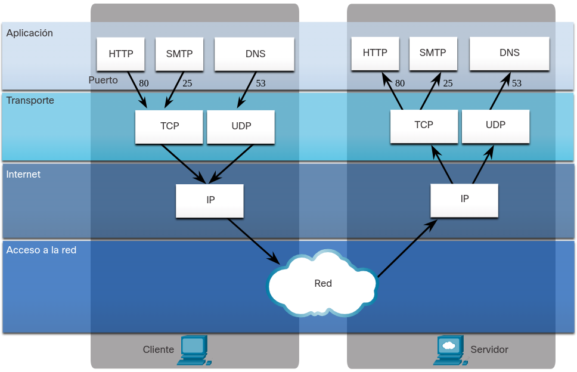
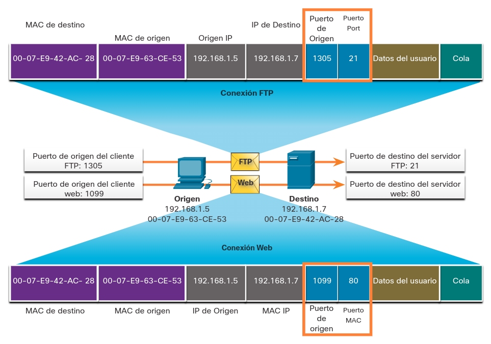

<a href="./00-Curso.md"><< Menú principal del módulo</a>

# 15. TCP y UDP 
## TCP y UDP
TCP (_Transmission Control Protocol_) y UDP (_User Datagram Protocol_) son protocolos de la capa de transporte.

UDP suele utilizarse para comunicaciones en tiempo real o reproducción de medios sincronizados, en los que la pérdida de pequeñas partes de la información no suponen un problema importante en el resultado final. Incorpora en los segmentos que encapsula las direcciones de los puertos de origen y destino de la comunicación.

TCP tiene proporciona la fiabilidad en las transmisiones necesaria para que no se pierda ninguna porción de la información. Además de las direcciones de puertos de origen y destino, incorpora en sus segmentos una secuencia de orden que establece cómo deben ser reemsamblados en destino y permiten conocer si se han recuperado todos.

La diferencia entre la fiabilidad de uno y otro tiene su contrapartida en eficiencia, al tener que incorporarse en TCP mucha más información de control.

### Números de Puerto TCP y UDP
Accedemos a gran cantidad de servicios a través de internet durante el día. DNS, web, correo electrónico, FTP, IM y VoIP son solo algunos de estos servicios que proporcionan los sistemas cliente-servidor en todo el mundo. Estos servicios pueden ser prestados por un solo servidor o por muchos servidores en grandes centros de datos.

Cuando se entrega un mensaje mediante TCP o UDP, los protocolos y servicios solicitados se identifican mediante un número de puerto, como se muestra en la figura. Un puerto es un identificador numérico dentro de cada segmento, que se usa para llevar un seguimiento de las conversaciones específicas entre un cliente y un servidor. Cada mensaje que envía un _host_ contiene un puerto de origen y un puerto de destino.

	

Cuando un servidor recibe un mensaje, tiene que poder determinar qué servicio está solicitando el cliente. Los clientes se pre-configuran para usar un puerto de destino que ya está registrado en Internet para cada servicio. Un ejemplo de esto son los clientes de navegador web que está preconfigurados para enviar solicitudes a servidores web por medio de puerto 80, el puerto conocido para servicios web de HTTP.

Los puertos son asignados y administrados por una organización conocida como la Corporación de Internet para Nombres y Números Asignados (_Internet Corporation for Assigned Names and Numbers_, ICANN). Los puertos se dividen en tres categorías y van de 1 a 65.535:
* __Puertos Conocidos__. Los puertos de destino que están asociados con aplicaciones de red comunes se identifican como puertos conocidos. Estos puertos están en el rango de 1 a 1023.
* __Puertos Registrados__. Los puertos 1024 a 49151 pueden usarse como puertos de origen o de destino. Las organizaciones los utilizan para registrar aplicaciones específicas, como las aplicaciones IM.
* __Puertos Privados__. Los puertos 49152 a 65535, usados frecuentemente como puertos de origen. Estos puertos pueden ser utilizados por cualquier aplicación.</li></ul>
La tabla muestra algunos números de puerto conocidos y sus aplicaciones asociadas.

__Número de puerto__|__Transporte__|__Protocolo de aplicación__
:-:|:-:|:-:
20|TCP|FTP - Datos
21|TCP|FTP - Control
22|TCP|SSH
23|TCP|Telnet
25|TCP|SMTP
53|UDP,TCP|DNS
67|UDP|DHCP - servidor
68|UDP|DHCP - cliente
69|UDP|TFTP
80|TCP|HTTP
110|TCP|POP3
143|TCP|IMAP
161|UDP|SNMP (_Simple Network Management Protocol_)
443|TCP|HTTPS

Algunas aplicaciones pueden utilizar TCP y UDP. Por ejemplo, DNS utiliza UDP cuando los clientes envían solicitudes a un servidor DNS. Sin embargo, la comunicación entre dos servidores DNS siempre usa TCP.

Busque en el sitio web de IANA el registro de puertos para ver la lista completa de números de puerto y aplicaciones asociadas.

### Pares de sockets
Los puertos de origen y de destino se colocan dentro del segmento. Los segmentos se encapsulan dentro de un paquete IP. El paquete IP contiene la dirección IP de origen y de destino. Se conoce como socket a la combinación de la dirección IP de origen y el número de puerto de origen, o de la dirección IP de destino y el número de puerto de destino.

En el ejemplo de la figura, el PC está solicitando simultáneamente servicios FTP y web desde el servidor de destino.

	

En el ejemplo, la solicitud FTP generada por el PC incluye las direcciones MAC de Capa 2 y las direcciones IP de Capa 3. La solicitud también identifica el puerto de origen 1305 (generado dinámicamente por el host) y el puerto de destino, identificando los servicios FTP en el puerto 21. El _host_ también ha solicitado una página web del servidor utilizando las mismas direcciones de Capa 2 y Capa 3. Sin embargo, está utilizando el número de puerto de origen 1099 (generado dinámicamente por el host) y el puerto de destino que identifica el servicio web en el puerto 80.

El socket se utiliza para identificar el servidor y el servicio que solicita el cliente. Un socket de cliente puede ser parecido a esto, donde 1099 representa el número de puerto de origen: `192.168.1.5:1099`.

El socket en un servidor web puede ser `192.168.1.7:80`,

Juntos, estos dos sockets se combinan para formar un par de sockets: `192.168.1.5:1099`, `192.168.1.7:80`.

Los sockets permiten que los diversos procesos que se ejecutan en un cliente se distingan entre sí. También permiten la diferenciación de diferentes conexiones a un proceso de servidor.

El número de puerto de origen actúa como dirección de retorno para la aplicación que realiza la solicitud. La capa de transporte hace un seguimiento de este puerto y de la aplicación que generó la solicitud de manera que cuando se devuelva una respuesta, esta se envíe a la aplicación correcta.

### El comando _netstat_
Las conexiones TCP no identificadas pueden representar una importante amenaza a la seguridad. Pueden indicar que algo o alguien está conectado al _host_ local. A veces es necesario conocer las conexiones TCP activas que están abiertas y en ejecución en el _host_ de red. _Netstat_ es una utilidad de red importante que puede usarse para verificar esas conexiones. Como se muestra a continuación, ingrese el comando netstat para enumerar los protocolos en uso, la dirección local y los números de puerto, la dirección externas y los números de puerto, y el estado de la conexión.

<pre><code class="bash">C:∖> netstat
   
Active Connections
   
  Proto Local Address           Foreign Address             State
  TCP   192.168.1.124:3126      192.168.0.2:netbios-ssn     ESTABLISHED
  TCP   192.168.1.124:3158      207.138.126.152:http        ESTABLISHED
  TCP   192.168.1.124:3159      207.138.126.169:http        ESTABLISHED
  TCP   192.168.1.124:3161      sc.msn.com:http             ESTABLISHED
  TCP   192.168.1.124:3166      www.cisco.com:http          ESTABLISHED
  ...
  (output omitted)
C:∖>
</code></pre>

De forma predeterminada, el comando _netstat_ intentará resolver las direcciones IP en nombres de dominio y los números de puerto en aplicaciones conocidas. La opción `-n` se puede utilizar para mostrar direcciones IP y números de puerto en su formato numérico.

## Resumen de la TCP y UDP
### TCP y UDP
UDP es un sistema de entrega de "mejor esfuerzo" que no requiere confirmación de recepción. UDP es el protocolo aconsejable para aplicaciones como transmisiones de audio y de voz por IP (VoIP). Las confirmaciones de recepción reducirían la velocidad de la entrega, y las retransmisiones no son recomendables. Los paquetes toman una ruta desde el origen hasta el destino. Es posible que se pierdan algunos paquetes, pero generalmente no se nota.

Los paquetes TCP toman una ruta desde el origen hasta el destino. Sin embargo, cada uno de los paquetes tiene un número de secuencia. TCP divide el mensaje en partes pequeñas, conocidas como segmentos. Los segmentos se numeran en secuencia y se pasan al proceso IP para armarse en paquetes. TCP realiza un seguimiento del número de segmentos que se enviaron a un host específico desde una aplicación específica. Si el remitente no recibe una confirmación antes de transcurrido cierto tiempo, supone que los segmentos se perdieron y los retransmite. Solo se vuelve a enviar la parte del mensaje que se perdió, no todo el mensaje.

### Números de puerto
Cuando se envía un mensaje utilizando TCP o UDP, los protocolos y servicios solicitados se identifican con un número de puerto. Un puerto es un identificador numérico dentro de cada segmento, que se usa para llevar un seguimiento de las conversaciones específicas entre un cliente y un servidor. Cada mensaje que envía un host contiene un puerto de origen y un puerto de destino.

Cuando un servidor recibe un mensaje, tiene que poder determinar qué servicio está solicitando el cliente. Los clientes se pre-configuran para usar un puerto de destino que ya está registrado en Internet para cada servicio.

Los puertos son asignados y administrados por una organización conocida como ICANN. Los puertos se dividen en tres categorías y van de 1 a 65.535:

* __Puertos Conocidos__. Los puertos de destino que están asociados con aplicaciones de red comunes se identifican como puertos conocidos. Estos puertos están en el rango de 1 a 1023.
* __Puertos Registrados__. Los puertos 1024 a 49151 pueden usarse como puertos de origen o de destino. Las organizaciones los utilizan para registrar aplicaciones específicas, como las aplicaciones IM.
* __Puertos Privados__. Los puertos 49152 a 65535, usados frecuentemente como puertos de origen. Estos puertos pueden ser utilizados por cualquier aplicación.

El número de puerto de origen es generado de manera dinámica por el dispositivo emisor para identificar una conversación entre dos dispositivos. Este proceso permite establecer varias conversaciones simultáneamente. Resulta habitual para un dispositivo enviar varias solicitudes de servicio HTTP a un servidor web al mismo tiempo. El seguimiento de cada conversación HTTP por separado se basa en los puertos de origen.

El cliente coloca un número de puerto de destino en el segmento para informar al servidor de destino el servicio solicitado. Un servidor puede ofrecer más de un servicio de manera simultánea, por ejemplo, servicios web en el puerto 80 al mismo tiempo que ofrece el establecimiento de una conexión FTP en el puerto 21.

Las conexiones TCP no identificadas pueden representar una importante amenaza a la seguridad. Pueden indicar que algo o alguien está conectado al host local. A veces es necesario conocer las conexiones TCP activas que están abiertas y en ejecución en el host de red. Netstat es una utilidad de red importante que puede usarse para verificar esas conexiones. El comando netstat se usa para enumerar los protocolos en uso, la dirección local y los números de puerto, la dirección extranjera y los números de puerto, y el estado de la conexión.

## Enlaces de interés
 
 
 
 
 
 
 
 
<a href="#15-tcp-y-udp">⬆️</a>
<a href="./00-Curso.md"><< Menú principal del módulo</a>