<a href="./00-Curso.md"><< Menú principal del módulo</a>

# 16. Servicios de la Capa de Aplicación
# La Relación Cliente Servidor
## Interacción de Cliente y Servidor
Diariamente utilizamos los servicios disponibles en las redes y en internet para comunicarnos con otras personas y realizar tareas de rutina. Pocas veces pensamos en los servidores, clientes y dispositivos de redes necesarios para poder recibir un correo electrónico, actualizar nuestro estado en los medios sociales o buscar las mejores ofertas en una tienda en línea. La mayoría de las aplicaciones de internet más comunes se basa en interacciones complejas entre diversos servidores y clientes.

El término servidor hace referencia a un host que ejecuta una aplicación de software que proporciona información o servicios a otros hosts que están conectados a la red. Un ejemplo conocido de dicha aplicación es un servidor Web. Hay millones de servidores conectados a Internet que proporcionan servicios como sitios web, correo electrónico, transacciones financieras, descargas de música, etc. Un factor fundamental para permitir el funcionamiento de estas interacciones complejas es que todos emplean estándares y protocolos acordados.

	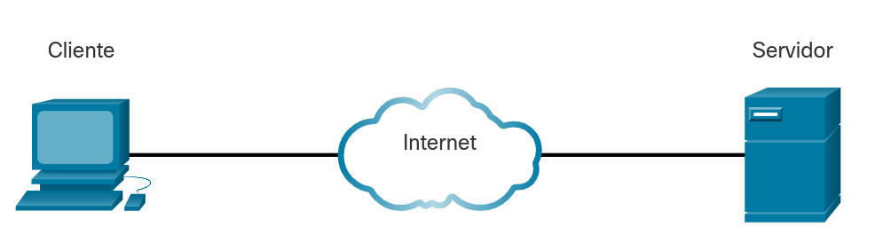

Un navegador web, como Chrome o Firefox, es un ejemplo de software de cliente. Una única PC también puede ejecutar varios tipos de software de cliente. Por ejemplo, un usuario puede consultar el correo electrónico y ver una página web mientras envía mensajes instantáneos y escucha una transmisión de audio. La tabla enumera tres tipos comunes de software de servidor.

**Tipo**|**Descripción**
:-|:-
Correo electrónico|El servidor de correo electrónico ejecuta el software del servidor de correo electrónico. Los clientes utilizan software de cliente de correo, como Microsoft Outlook, para acceder al correo electrónico en el servidor.
Web|El servidor web ejecuta software de servidor web. Los clientes usan software de navegador, como Chrome o Firefox, para acceder a páginas web en el servidor.
Archivo|El servidor de archivos almacena archivos de usuario y empresariales en una ubicación central. Los dispositivos cliente acceden a estos archivos con software cliente como el Explorador de Archivos de Windows.

## Interacciones de IP de Cliente y Servidor Web
Cuando un cliente va a realizar una petición a un servidor web ocurren una serie de procesos.

En primer lugar debe haber una resolución del nombre de dominio, ya que el usuario teclea en su navegador una dirección web en forma de URL que debe ser traducida a una dirección IP para la conexión TCP necesaria. Esto se realiza mediante una búsqueda DNS (_DNS lookup_) a un servidor DNS que estará configurado en el cliente.

Posteriormente se realiza la conexión entre un puerto del cliente elegido aleatoriamente por encima del 1024 al puerto 80 del servidor. Todas las interacciones necesarias para la conversación entre cliente y servidor llevarán las direcciones IP y puertos de origen y destino, pudiéndose de esta forma identificar la conversación durante todo el trayecto entre ambos.

## URI, URN, y URL
Los recursos web y los servicios web, como las API RESTful, se identifican mediante un Identificador Uniforme de Recursos, URI (_Uniform Resource Identifier_). Un URI es una cadena de caracteres que identifica un recurso de red específico. Como se muestra en la figura, un URI tiene dos especializaciones:

* __Nombre uniforme de recurso (URN)__. Identifica solo el espacio de nombres del recurso (página web, documento, imagen, etc.) sin referencia al protocolo.
* __Localizador uniforme de recursos (URL)__. Define la ubicación de red de un recurso específico dentro de la red. Las URL HTTP o HTTPS se utilizan normalmente con los navegadores web. Otros protocolos como FTP, SFTP, SSH y otros pueden usarse como URL. Una URL que usa SFTP podría tener el siguiente aspecto: `sftp://sftp.example.com`.

Estas son las partes de un URI, tal y como se muestra en la figura:

* __Protocolo/esquema__. HTTPS u otros protocolos como FTP, SFTP, mailto y NNTP
* __Nombre de host__ &#8658; `www.example.com`
* __Ruta y nombre de archivo__ &#8658; `/author/book.html`
* __Fragmento__ &#8658; `#página155`

	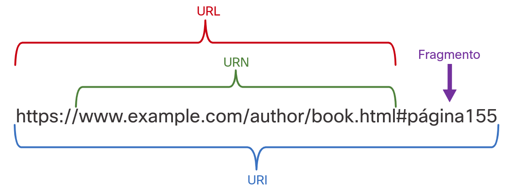

## Packet Tracer - La Interacción del Cliente
### Objetivos
Observar la interacción de los clientes entre el servidor y la PC.

### Aspectos básicos/situación
Los clientes, como las PC de escritorio, solicitan servicios a los servidores. El entorno de laboratorio, que usa PC y servidores físicos, admite una gama completa de servicios. En un ambiente simulado, la cantidad de servicios es limitada. Packet Tracer permite agregar servidores de red simulados que soportan DHCP, DNS, HTTP y TFTP. Packet Tracer también soporta la adición de PC simuladas que pueden solicitar dichos servicios. Esta actividad usa una red simple que consiste en una PC conectada directamente a un servidor configurado para prestar servicios de DNS, además de alojar una página web mediante un servidor HTTP. Esta actividad rastreará el flujo de tráfico que se produce cuando se solicita una página web, cómo se resuelve la dirección IP de la página web y cómo se entrega esta.

### Instrucciones
#### Parte 1: Ingrese al modo de simulación.
Cuando se inicia el Packet Tracer, éste presenta una vista lógica de la red en el modo de tiempo real.
Pulse en __Simulation Mode__ para ingresar al modo de simulación. El icono del modo de simulación se encuentra en la parte inferior derecha del área de trabajo lógico.

#### Parte 2: Establezca filtros para la lista de eventos.
En el modo de simulación, la opción predeterminada es capturar todos los eventos. Usará filtros para capturar solamente eventos DNS y HTTP.
1. En la sección ___Event List Filters___ (Filtros de la lista de eventos), pulse en ___Show All/None___ (Mostrar todos/ninguno) para borrar todas las marcas.
2. Pulse en ___Edit Filters___ (Editar filtros). En la ficha __IPv4__, seleccione ___DNS___. En la ficha ___Misc___, seleccione ___HTTP___. Cierre la ventana cuando haya terminado. ___Event List Filters___ muestra DNS y HTTP como los únicos eventos visibles.

#### Parte 3: Solicite una página web desde la PC.
Abrirá un navegador web simulado en la PC y solicitará una página web al servidor.
1. Pulse en ___PC___. Pulse en la ficha ___Desktop___ (Escritorio) y en __Web Browser__ (Navegador web).
2. Se abrirá un navegador web simulado. Escriba `www.ejemplo.com` en el cuadro de la URL y pulse en el botón ___Go___ (Ir) a la derecha. Minimice la ventana de la PC.

#### Parte 4: Ejecute la simulación.
1. En la sección ___Play Controls___ (Controles de reproducción) del ___Simulation Panel___ (Panel de simulación), pulse en ___Play___ (Reproducir). Se anima el intercambio entre la PC y el servidor, y se agregan eventos a ___Event List___ (Lista de eventos).

Estos eventos representan la solicitud de la PC de resolver la URL en una dirección IP, el suministro del servidor de la dirección IP, la solicitud de la página web por parte de la PC, el envío de la página web por parte del servidor en dos segmentos y la confirmación de la PC de que recibió la página web.

2. Pulse en View Previous Event (Ver evento anterior) para continuar cuando el búfer esté lleno.

#### Parte 5: Acceda a una PDU específica.
1. Restaure la ventana de la PC simulada. Observe que se muestra una página web en el navegador web. Minimice la ventana de navegador simulado.
2. En la sección ___Simulation Panel Event List___ (Lista de eventos del panel de simulación), la última columna contiene un cuadro coloreado que brinda acceso a información detallada sobre un evento. Pulse en el cuadro coloreado en la primera fila del primer evento. Se abre la ventana ___PDU Information___ (Información de la PDU).

#### Parte 6: Examine el contenido de la ventana _PDU Information_ (Información de la PDU).
La primera ficha en la ventana ___PDU Information___ (Información de PDU) contiene información sobre la PDU entrante y/o saliente en relación con el modelo OSI. Pulse en ___Next Layer >>___ (Próxima capa) varias veces para recorrer las capas entrantes y salientes, y lea la descripción del cuadro debajo de las capas para obtener una descripción general de cómo funciona el intercambio.

Examine la información de PDU de los otros eventos para obtener una descripción general de todo el proceso de intercambio.

# Servicios de Aplicaciones de Red
## Servicios de Aplicaciones de Red Comunes
¿Cuáles son los servicios de Internet más comunes que utiliza periódicamente? Para la mayoría de las personas, la lista incluye servicios como búsquedas en Internet, sitios de redes sociales, transmisión de vídeo y audio, sitios de compras en línea, correo electrónico y mensajería. Cada uno de estos servicios depende de los protocolos de la suite de protocolos TCP/IP para transmitir de manera confiable la información entre los clientes y los servidores.

Algunos de los servidores más comunes que proporcionan estos servicios se muestran en la figura. En la tabla se muestra una breve descripción de cada servicio.

	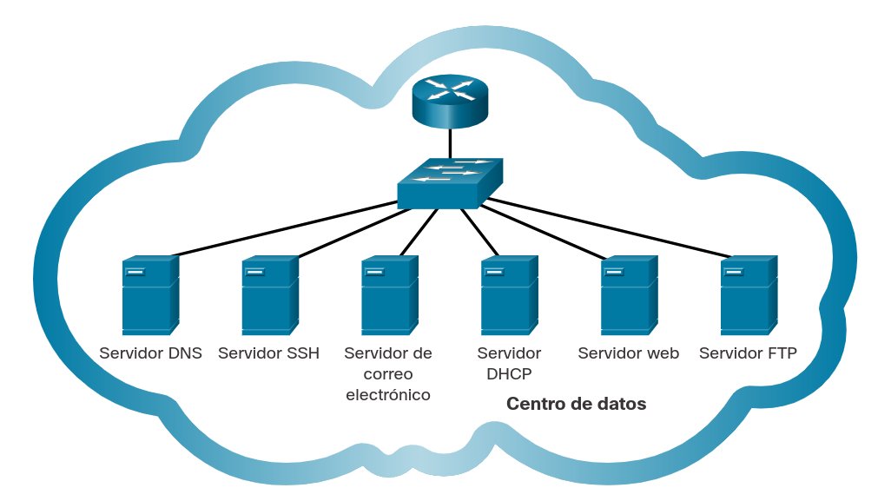

 

**Protocolo**|**Descripción**
:-|:-
__Sistema de nombres de dominio (DNS)__|Recupera los mensjaes de correo electrónico de los clientes.
__Secure Shell (SSH)__|Se utiliza para proporcionar acceso remoto a servidores y dispositivos de red.
__Protocolo simple de transferencia de correo (SMTP)__|Envía mensajes de correo electrónico y archivos adjuntos de clientes a servidores y de servidores a otros servidores de correo electrónico.
__Protocolo de oficina de correos (POP)__|Utilizado por clientes de correo electrónico para recuperar correos electrónicos y archivos adjuntos desde un servidor remoto.
__Protocolo de acceso a mensajes de Internet (IMAP)__|Utilizado por clientes de correo electrónico para recuperar correos electrónicos y archivos adjuntos desde un servidor remoto.
__Protocolo de configuración dinámica de host (DHCP)__|Se utiliza para configurar automáticamente dispositivos con direccionamiento IP y otra información necesaria para permitirles comunicarse a través de Internet.
__Protocolo de transferencia de hipertexto (HTTP)__|Utilizado por los navegadores web para solicitar páginas web y servidores web para transferir los archivos que conforman las páginas web de la World Wide Web.
__Protocolo de transferencia de archivos (FTP)__|Se utiliza para la transferencia interactiva de archivos entre sistemas.

# Sistema de Nombres de Dominio
## Servidores DNS
Cuando un cliente necesita realizar una petición a un servidor lo hace mediante el nombre de dominio en la URL; sin embargo, en un entorno de red, el nombre de dominio no sirve para identificación del destino, por lo que es necesario traducir el nombre en una dirección IP.

Al realizar la petición al servidor, primero se realiza una búsqueda de la IP en un servidor DNS, que devolverá la dirección correspondiente registrada para dicho dominio.

## Una nota sobre las actividades del verificador de sintáxis
Cuando esté aprendiendo a modificar las configuraciones de los dispositivos, es posible que desee comenzar en un entorno seguro que no sea de producción antes de probarlo en equipos reales. Hay diferentes herramientas de simulación para ayudarlo a desarrollar sus habilidades de configuración y resolución de problemas. Debido a que se trata de herramientas de simulación, normalmente no tienen toda la funcionalidad del equipo real. Una de esas herramientas es el Verificador de Sintaxis. En cada Verificador de Sintaxis, se le da un conjunto de instrucciones para introducir un conjunto específico de comandos. No puede progresar en el Verificador de Sintaxis a menos que se introduzca el comando exacto y completo como se especifica. Las herramientas de simulación más avanzadas, como Packet Tracer, le permiten introducir comandos abreviados, como lo haría con equipos reales.

## El comando _nslookup_
Cuando configura manualmente un dispositivo para conectividad de red, recuerde que también incluye una dirección de servidor DNS. En el caso de las redes domésticas, DHCP ejecuta esta configuración en el router doméstico. Su ISP proporciona la dirección del servidor DNS al router de su hogar, y luego utiliza el DHCP para enviar la configuración a todos los dispositivos conectados a su red. Cuando escribe el nombre de un sitio web, como `www.cisco.com`, el cliente DNS que se ejecuta en su dispositivo primero solicita al servidor DNS la dirección IP, como `172.230.155.162`, antes de enviar su solicitud HTTP.

Puede utilizar el comando ___nslookup___ para descubrir las direcciones IP de cualquier nombre de dominio. En esta actividad del Verificador de sintaxis, practique el ingreso del comando _nslookup_ tanto en Windows como en Linux.

# Clientes y Servidores Web
## HTTP y HTML
Cuando un cliente web recibe una dirección IP de un servidor web, el explorador cliente utiliza esa dirección IP y el puerto 80 para solicitar servicios web. Esta solicitud se envía al servidor mediante el protocolo de transferencia de hipertexto (HTTP, Hypertext Transfer Protocol).

Cuando el servidor recibe una solicitud del puerto 80, responde la solicitud del cliente y le envía la página Web. El contenido de la información de una página Web se codifica utilizando lenguajes de "etiquetas" especializados. La codificación del Lenguaje de Marcado de Hipertexto (HTML) indica al navegador cómo formatear la página web y qué gráficos y fuentes usar. HTML es el lenguaje más utilizado.

El protocolo HTTP no es un protocolo seguro; la información podría ser fácilmente interceptada por otros usuarios a medida que los datos se envían a través de la red. Para garantizar la seguridad de los datos, HTTP se puede utilizar con protocolos de transporte seguros. Las solicitudes de HTTP se envían al puerto 443. These requests use https in the site address in the browser, rather than http.

Hay muchos servidores web y clientes web diferentes disponibles. El protocolo HTTP y los estándares HTML hacen posible que estos servidores y clientes de diferentes fabricantes funcionen juntos sin problemas.

## Packet Tracer - Observar Solicitudes Web
### Objetivos
Ver el tráfico cliente y servidor enviado desde una PC a un servidor Web al solicitar servicios Web

### Instrucciones
#### Parte 1: Verificar la conectividad al servidor Web.
1. Pulse en External Client (Cliente externo) y acceda a Command Prompt (Línea de comandos) desde la ficha  Desktop  (Escritorio).
2. Use el comando ping para comunicarse con la URL `ciscolearn.web.com`. Observe la dirección IP que aparece en el resultado del ping. Esta dirección se obtiene del servidor DNS y se resuelve como el nombre de dominio `ciscolearn.web.com`. Todo el tráfico reenviado a través de una red usar información de dirección IP de origen y destino.
3. Cierre la ventana de la línea de comandos pero deje la ventana del escritorio del cliente externo abierta.

#### Parte 2: Conéctese con el servidor web.
1. En la ventana del escritorio acceda al ___Web Browser___ (Explorador Web).
2. En el cuadro de la URL escriba `ciscolearn.web.com`. Asegúrese de leer la página Web que se muestra. Deje esta página abierta.
3. Minimice la ventana del cliente externo, pero no la cierre.

#### Parte 3: Vea el código HTML.
1. Desde la topología lógica, pulse en el servidor `ciscolearn.web.com`.
2. Pulse en la ficha ___Services > HTTP___. Luego, junto al archivo `index.html`, pulse en ___(edit)___.
3. Compare el código de marcado HTML en el servidor que crea la página de visualización del navegador web en el cliente externo. Puede ser necesario volver a maximizar la ventana del cliente si se minimizó al abrir la ventana del servidor.
4. Cierre la ventana del cliente externo y la del servidor Web.

#### Parte 4: Observe el tráfico entre el cliente y el servidor Web.
1. Pulse en la ficha Simulación de la esquina inferior derecha para acceder al modo ___Simulation___.
2. Haga doble clic en el Panel de simulación para desacoplarlo de la ventana de PT. Esto le permite mover el Panel de simulación para ver toda la topología de la red.
3. Cree una PDU compleja en el modo Simulación para ver el tráfico.
	1) En el ___Simulation Panel___, seleccione __Edit Filters__.
	2) Pulse en la ficha __Misc__ para verificar que solo estén marcadas las casillas TCP y HTTP.
	3) Pulse en el sobre abierto que está sobre el ícono del modo de simulación para agregar una PDU compleja.
	4) Pulse en ___External Client___ para especificarlo como origen. Se abre la ventana ___Create Complex PDU___.
4. Especifique la configuración de ___Create Complex PDU___ cambiando lo siguiente en la ventana de la PDU compleja:
	1) En ___PDU Settings___, ___Select Application___ debe ser HTTP.
	2) Pulse en el servidor `ciscolearn.web.com` para configurarlo como dispositivo de destino. Observe que aparecerá la dirección IP del servidor web en el cuadro de destino dentro de la ventana de la PDU compleja.
	3) En ___Starting Source Port___, introduzca `1000`.
	4) En ___Simulation Settings___, seleccione ___Periodic Interval___ y escriba `120`.
5. Cree la PDU, pulse en la casilla ___Create PDU___ de la ventana ___Create Complex PDU___.
	1) Observe el flujo de tráfico haciendo clic en __Play__ en el panel de simulación. Para acelerar la animación utilice el control deslizante de reproducción.
	Cuando aparezca la ventana ___Buffer Full___, pulse en el botón ___View Previous Events___.
	2) Desplácese por la lista de eventos. Observe la cantidad de paquetes que viajaron desde el origen hacia el destino. HTTP es un protocolo TCP, por lo que requiere que se establezca una conexión y se acuse recibo de los paquetes. Esto aumenta considerablemente la cantidad de tráfico.

# Clientes y Servidores FTP
## Protocolo de Transferencia de Archivos
Además de los servicios Web, otro servicio que se utiliza comúnmente por medio de Internet es el que permite a los usuarios transferir archivos.

El Protocolo de Transferencia de Archivos, FTP (_File Transfer Protocol_) brinda un método sencillo para transferir archivos de una computadora a otra. Un host que ejecuta un software cliente FTP puede acceder a un servidor FTP para realizar diversas funciones de administración de archivos, entre ellas subir y descargar archivos.

El servidor FTP permite a un cliente intercambiar archivos entre dispositivos. También permite a los clientes administrar archivos de manera remota enviando comandos de administración de archivos, como Eliminar o Cambiar nombre. Para lograr esto, el servicio FTP utiliza dos puertos para las comunicaciones entre el cliente y el servidor.

En el ejemplo de la figura se ilustra cómo funciona FTP. Para comenzar con una sesión FTP, se envían solicitudes de conexión de control al servidor mediante el puerto 21 TCP de destino. Cuando se abre la sesión, el servidor cambia al puerto 20 TCP para transferir los archivos de datos.

El software cliente FTP viene incorporado en los sistemas operativos y en la mayoría de los exploradores Web. Los clientes FTP independientes ofrecen muchas opciones en una interfaz fácil de usar basada en GUI.

	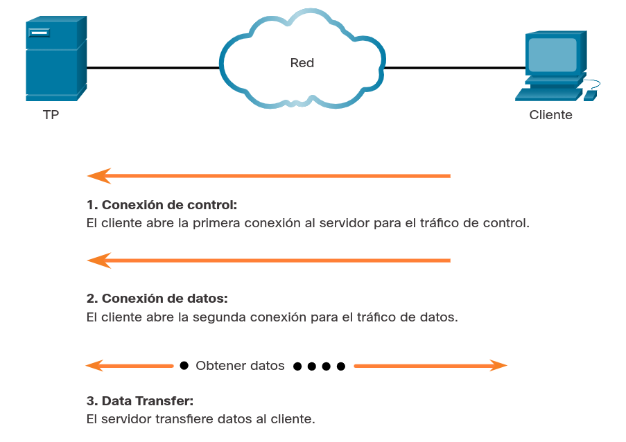

De acuerdo con el comando enviado a través de la conexión de control, los datos pueden descargarse desde el servidor o subirse desde el cliente.

## Packet Tracer - Usar Servicios FTP
### Tabla de direccionamiento
Dispositivo|Interfaz|Dirección IP|Máscara de subred
:-|:-:|:-:|:-:
Servidor FTP (ftp.pka)|NIC|`209.165.200.226`|`255.255.255.224`

### Objetivos
* Cargar un archivo al servidor FTP
* Descargar un archivo desde el servidor FTP

### Aspectos básicos/Situación
El Protocolo de transferencia de archivos (FTP) es una aplicación comúnmente utilizada para transferir archivos entre clientes y servidores en la red. El servidor está configurado para ejecutar el servicio donde los clientes se conectan, inician sesión y transfieren archivos. FTP utiliza el puerto 21 como puerto de comando del servidor para crear la conexión. A continuación, FTP utiliza el puerto 20 para la transferencia de datos.

En esta actividad, cargará un archivo a un servidor FTP. También descargará un archivo desde un servidor FTP.

### Instrucciones
#### Parte 1: Cargar un archivo al servidor FTP
En esta parte, encontrará el archivo sampleFile.txt y lo cargará en un servidor FTP.

* __Paso 1: Ubique el archivo.__
	1. Pulse en ___PC-A___.
	2. Pulse en ___Desktop___.
	3. Pulse en ___Command Prompt___.
	4. En el indicador, pulse en _`?`_ para listar los comandos disponibles.
	5. Ingrese `dir` para ver los archivos en la PC. Observe que hay un archivo `sampleFile.txt` en el directorio `C:\`.
		
		<pre>C:\> dir
		
		Volume in drive C has no label.
		Volume Serial Number is 5E12-4AF3
		Directory of C:\
		
		12/31/1969 17:0 PM 26 sampleFile.txt
		26 bytes 1 File (s)</pre>

* __Paso 2: Conectarse al servidor FTP.__
	1. FTP al servidor FTP en `209.165.200.226` o `ftp.pka`.
	
		<pre>C:\> ftp 209.165.200.226
		Trying to connect...209.165.200.226
		Connected to 209.165.200.226</pre>

	2. Ingrese el nombre de usuario student y la contraseña class para obtener acceso.

		<pre>220- Welcome to PT Ftp Server
		Username:student
		331- Username ok, need password
		Password:
		230- Logged in
		(passive mode On)</pre>

* __Paso 3: Cargar un archivo al servidor FTP.__
	1. Ingresar `?` para ver los comandos disponibles en el cliente FTP.

		<pre>ftp> ?
		?
		cd
		delete
		dir
		get
		help
		passive
		put
		pwd
		quit
		rename</pre>

	2. Introduzca `dir` para ver los archivos disponibles en el servidor.

		<pre>ftp> dir
		Listing /ftp directory from 192.168.1.3:
		0 : asa842-k8.bin 5571584
		1 : asa923-k8.bin 30468096
		2 : c1841-advipservicesk9-mz.124-15.T1.bin 33591768
		3 : c1841-ipbase-mz.123-14.T7.bin 13832032
		&lt;output omitted&gt;</pre>

	3. Introduzca `put sampleFile.txt` para enviar el archivo al servidor.

		<pre>ftp> put sampleFile.txt
		Writing file sampleFile.txt to 209.165.200.226:
		File transfer in progress...
		[Transfer complete - 26 bytes]
		26 bytes copied in 0.08 secs (325 bytes/sec)</pre>

	4. Utilice el comando `dir` nuevamente para listar el contenido del servidor FTP y verificar que el archivo se haya cargado en el servidor FTP.

#### Parte 2: Descargar un archivo desde el servidor FTP
También puede descargar un archivo desde un servidor FTP. En esta parte, cambiará el nombre del archivo `sampleFile.txt` y lo descargará del servidor FTP.

* __Paso 1: Cambie el nombre del archivo a un servidor FTP.__
	1. En el indicador ftp>, cambie el nombre del archivo sampleFile.txt a sampleFile_FTP.txt.

		<pre>ftp> rename sampleFile.txt sampleFile_FTP.txt
		Renaming sampleFile.txt
		[OK Renamed file successfully from sampleFile.txt to sampleFile_FTP.txt]</pre>

	2. En el indicador `ftp>`, ingrese `dir` para verificar que se haya cambiado el nombre del archivo.

* __Paso 2: Descargar el archivo desde el servidor FTP.__
	1. Ingrese el comando `get sampleFile_FTP.txt` para recuperar el archivo del servidor.
	2. Ingrese quit para salir del cliente FTP cuando haya terminado.
	3. Mostrar de nuevo el contenido del directorio en el PC para ver el archivo de imagen desde el servidor FTP.

* __Paso 3: Eliminar el archivo del servidor FTP.__
	1. Inicie sesión en el servidor FTP nuevamente para eliminar el archivo sampleFile_FTP.txt.
	2. Ingrese el comando para eliminar el archivo sampleFile_FTP.txt del servidor.
	* Pregunta. ¿Qué comando utilizó para eliminar el archivo del servidor FTP?
	3. Ingrese quit para salir del cliente FTP cuando haya terminado.

# Terminales Virtuales
## Telnet
Mucho antes de que existieran las computadoras de escritorio con interfaces gráficas sofisticadas, las personas utilizaban sistemas basados en textos que eran simplemente terminales conectadas físicamente a una computadora central. Después de que las redes estuvieron disponibles, la gente necesitaba una manera de acceder remotamente a los sistemas informáticos de la misma manera que con terminales conectados directamente.

Para satisfacer esa demanda, se desarrolló Telnet. Telnet se remonta a principios de la década de los 70 y se encuentra entre los servicios y protocolos de capa de aplicación más antiguo dentro del grupo TCP/IP. Telnet proporciona un método estándar de emulación de dispositivos de terminal con base en texto en la red de datos. Tanto el protocolo como el software del cliente que implementa son conocidos como Telnet. Los servidores Telnet escuchan las solicitudes del cliente en el puerto 23 de TCP.

De un modo adecuado, una conexión que utiliza Telnet se llama sesión de terminal virtual (_vty_) o conexión. En lugar de utilizar un dispositivo físico para conectarse al servidor, Telnet utiliza software para crear un dispositivo virtual que proporcione las mismas características de una sesión de terminal con acceso a la interfaz de línea de comandos (CLI, _Command Line Interface_) del servidor.

En la figura, el cliente se ha conectado de forma remota al servidor a través de Telnet. Ahora el cliente puede ejecutar comandos como si estuviera conectado localmente al servidor.

__Nota__: Telnet no se considera un protocolo seguro. Se debe usar SSH en la mayoría de los entornos en lugar de Telnet. Telnet se usa en varios ejemplos de este curso para simplificar la configuración.

	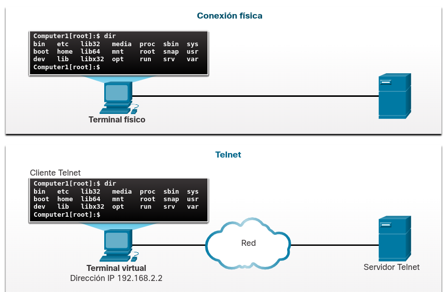

 

Telnet proporciona una forma de utilizar una computadora, conectada a través de la red, para acceder a un dispositivo de red como si el teclado y el monitor estuvieran conectados directamente al dispositivo.

## Problemas de Seguridad con Telnet
Una vez establecida una conexión Telnet, los usuarios pueden realizar cualquier función autorizada en el servidor, como si utilizaran una sesión de línea de comandos en el servidor mismo. Si están autorizados, pueden iniciar y detener procesos, configurar el dispositivo e inclusive apagar el sistema.

Aunque el protocolo Telnet puede requerir que un usuario inicie sesión, no admite el transporte de datos cifrados. Todos los datos intercambiados durante las sesiones de Telnet se transportan como texto normal por la red. Esto significa que los datos pueden ser fácilmente interceptados y entendidos.

El protocolo Secure Shell (SSH) ofrece un método alternativo y seguro para el acceso a servidores. SSH proporciona la estructura para un inicio de sesión remoto seguro y otros servicios de red seguros. También proporciona una autenticación más sólida que Telnet y admite el transporte de datos de sesión mediante cifrado. Como una mejor práctica, los profesionales de red deberían utilizar siempre SSH en lugar de Telnet, cada vez que sea posible.

En la figura se ilustra por qué SSH es más seguro que Telnet. Observe que, cuando se utiliza Telnet, los datos que captura el pirata informático son claramente legibles, mientras que al utilizar SSH, los datos están cifrados y, por lo tanto, son más seguros.

	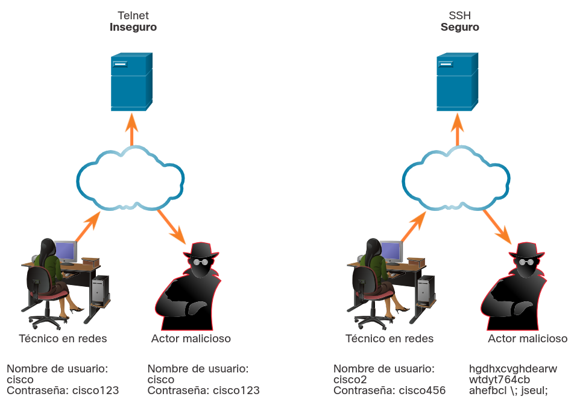

 

## Packet Tracer - uso de Telnet y SSH
### Tabla de direccionamiento
Dispositivo|Interfaz|Dirección IP|Máscara de subred
:-|:-:|:-:|:-:
SEDE CENTRAL (HQ)|G0/0/1|`64.100.1.1`|`255.255.255.0`
PC0|NIC|DHCP|DHCP
PC1|NIC|DHCP|DHCP

### Objetivos
En esta actividad, establecerá una conexión remota a un enrutador utilizando Telnet y SSH.
* Verifique la conectividad.
* Acceder a un dispositivo remoto.

### Instrucciones
#### Parte 1: Verificar la conectividad
En esta parte, verificará que la PC tenga direccionamiento IP y pueda hacer ping al router remoto.
* __Paso 1: Verificar la dirección IP en una PC.__
	1. Desde una PC, haga clic en Desktop (Escritorio). Haga clic en Command Prompt (Símbolo del sistema).
	2. En el indicador, verifique que la PC tenga una dirección IP de DHCP.
	Pregunta. ¿Qué comando utilizó para verificar la dirección IP de DHCP?
* __Paso 2: Verifique la conectividad a la sede central (HQ).__
Verifique que pueda hacer ping al enrutador en HQ con la dirección IP que figura en la tabla de direccionamiento.

#### Parte 2: Acceder a un dispositivo remoto
En esta parte, intentará establecer una conexión remota mediante Telnet y SSH.

* __Paso 1: Telnet a la sede central (HQ).__
1. En el indicador, ingrese el comando `telnet 64.100.1.1`.
Pregunta. ¿Tuvo éxito? ¿Cuál fue la salida?

* __Paso 2: SSH a HQ.__
El enrutador está configurado correctamente para no permitir el acceso inseguro a Telnet. Debe usar SSH.
1. En el indicador, ingrese el comando `ssh -l admin 64.100.1.1`. Introduzca la contraseña `class` cuando corresponda.
Pregunta. ¿Qué aparece después de acceder al enrutador con éxito a través de SSH?

# Correo Electrónico y Mensajería
## Clientes y Servidores de Correo Electrónico
El correo electrónico es una de las aplicaciones cliente/servidor más populares de Internet. Los servidores de correo electrónico ejecutan software servidor que les permite interactuar con clientes y con otros servidores de correo electrónico mediante la red.

Cada servidor de correo recibe y almacena correspondencia para los usuarios que tienen buzones configurados en el servidor de correo. Cada usuario que tenga un buzón deberá utilizar entonces un cliente de correo electrónico para acceder al servidor de correo y leer estos mensajes. Muchos sistemas de mensajería de Internet utilizan un cliente basado en web para acceder al correo electrónico. Algunos ejemplos de este tipo de cliente son Microsoft 365, Yahoo y Gmail.

Los buzones se identifican con el formato: `usuario@empresa.dominio`

Diversos protocolos de aplicaciones que se usan en el procesamiento del correo electrónico incluyen SMTP, POP3 e IMAP4.

	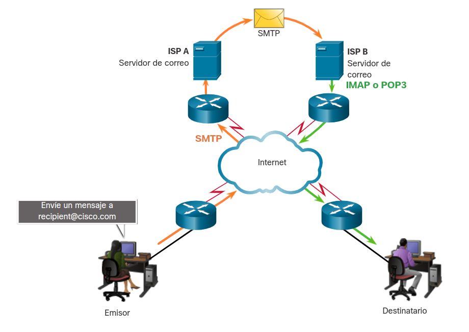

## Protocolos de Correo Electrónico
### Protocolo Simple de Transferencia de Correo (SMTP)

SMTP es utilizado por un cliente de correo electrónico para enviar mensajes a su servidor de correo electrónico local. El servidor local entonces decide si el mensaje se destina a un buzón local o si se remite a un buzón de otro servidor.

Si el servidor tiene que enviar el mensaje a un servidor diferente, también se utiliza SMTP entre esos dos servidores. Las solicitudes SMTP se envían al puerto 25.

	<b>&nbsp;1</b>
	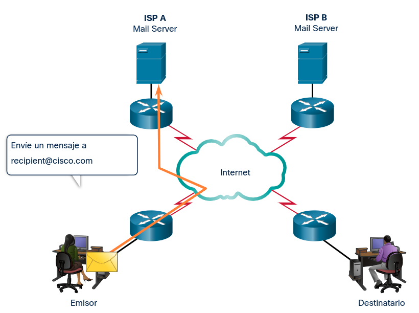

	<b>&nbsp;2</b>
	

	<b>&nbsp;3</b>
	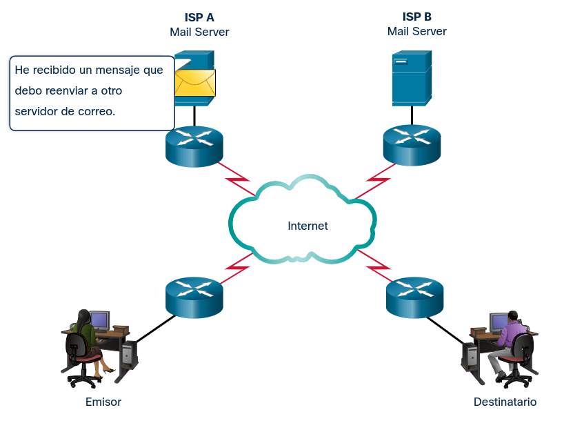

	<b>&nbsp;4</b>
	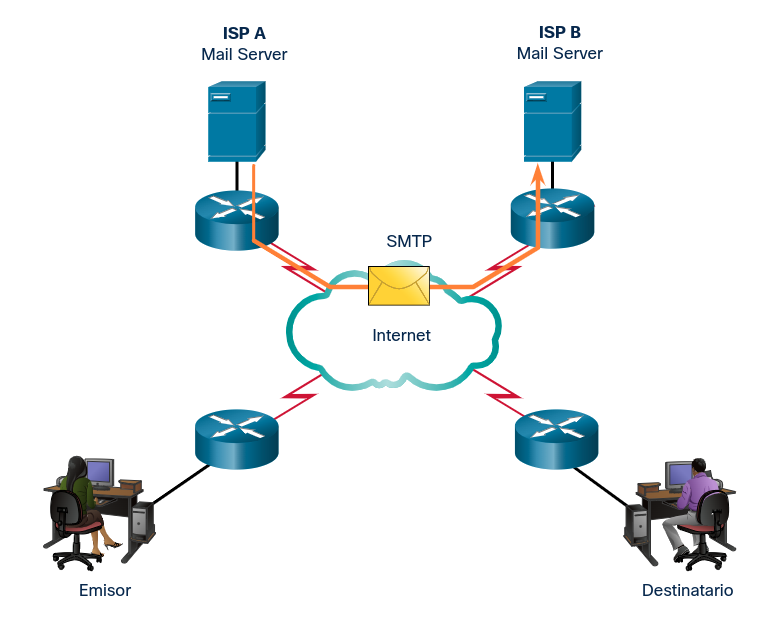

	<b>&nbsp;5</b>
	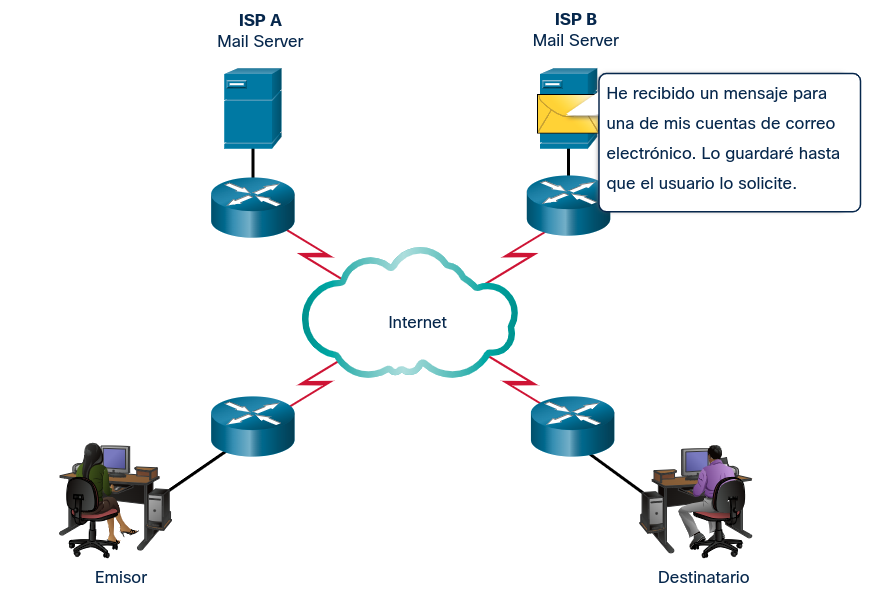

 

### Protocolo de oficina de correos (POP3)

Un servidor que admite clientes POP recibe y almacena mensajes dirigidos a sus usuarios. Cuando el cliente se conecta con el servidor de correo electrónico, los mensajes se descargan al cliente. De manera predeterminada , los mensajes no se retienen en el servidor una vez que el cliente accede a ellos. Los clientes se ponen en contacto con los servidores POP3 en el puerto 110.

### Protocolo de acceso a mensajes de Internet (IMAP4)

Un servidor que admite el cliente IMAP también recibe y almacena los mensajes dirigidos a sus usuarios. Sin embargo, a diferencia de POP, IMAP conserva los mensajes en los buzones del servidor, a menos que el usuario los elimine. La versión más actual de IMAP es IMAP4, que espera las solicitudes del cliente en el puerto 143.

Existen muchos servidores de correo electrónico diferentes para las diversas plataformas de sistema operativo de la red.

## Mensajería de Texto
La mensajería de texto, que se muestra en la figura, es una de las herramientas de comunicación más populares que se utilizan en la actualidad. Además, el software de mensajería de texto está integrado en muchas aplicaciones en línea, aplicaciones de teléfonos inteligentes y sitios de redes sociales.

	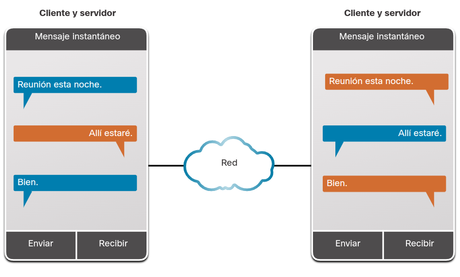

Ambos clientes pueden enviar y recibir mensajes simultáneamente.

Los mensajes de texto también pueden denominarse mensajes instantáneos, mensajes directos, mensajes privados y mensajes de chat. La mensajería de texto permite a los usuarios comunicarse o chatear por internet en tiempo real. Por lo general, se accede a los servicios de mensajería de texto en una computadora a través de un cliente basado en la web que está integrado en una red social o en un sitio para compartir información. Estos clientes se suelen conectar solo a otros usuarios del mismo sitio.

También hay varios clientes de mensajes de texto independientes, como Cisco Webex Teams, Microsoft Teams, WhatsApp, Facebook Messenger y muchos otros. Estas aplicaciones están disponibles para una amplia variedad de sistemas operativos y dispositivos. Por lo general, se ofrece una versión móvil. Además de los mensajes de texto, estos clientes admiten la transferencia de documentos, videos, música y archivos de audio.

## Llamadas Telefónicas por Internet
Realizar llamadas telefónicas por medio de internet es cada vez más común. Un cliente de telefonía por Internet utiliza una tecnología entre pares similar a la empleada por la mensajería instantánea, como se indica en la figura. La telefonía IP usa la tecnología de Voz sobre IP (VoIP) que convierte las señales analógicas de voz en datos digitales. Los datos de voz se encapsulan en paquetes IP que llevan la llamada telefónica a través de la red.

Una vez instalado el software del teléfono IP, el usuario selecciona un nombre exclusivo. De esta manera, los usuarios pueden recibir llamadas de otros usuarios. Se necesitan altavoces y un micrófono, ya sea incorporados o independientes. También se suele conectar a la computadora un auricular para usarlo como teléfono.

Para llamar a otros usuarios del mismo servicio por Internet se debe seleccionar el nombre de usuario de una lista. Para realizar una llamada a un teléfono común (de línea o celular), se necesita una puerta de enlace para acceder a la Red Pública de Telefonía Conmutada (Public Switched Telephone Network, PSTN). Según el servicio, pueden aplicarse tarifas asociadas con este tipo de llamadas. Los protocolos y los puertos de destino que utilizan las aplicaciones de telefonía por Internet pueden variar según el software.

	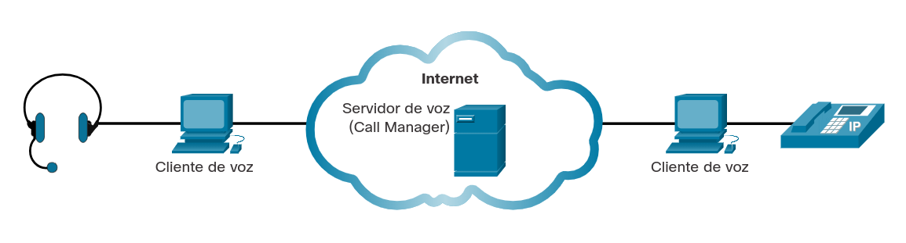

# Resumen de Servicios de la Capa de Aplicación
## La Relación Cliente Servidor
El término servidor hace referencia a un host que ejecuta una aplicación de software que proporciona información o servicios a otros hosts que están conectados a la red, como un servidor web. Un navegador web, como Chrome o Firefox, es un ejemplo de software de cliente. Una única PC también puede ejecutar varios tipos de software de cliente. Un factor crucial para permitir que estas interacciones complejas funcionen es que todas utilizan normas y protocolos acordados.

La característica clave de los sistemas de cliente y servidor es que el cliente envía una solicitud a un servidor y el servidor responde realizando una función, como devolver el documento solicitado al cliente. La combinación de un explorador Web y un servidor Web es quizás el ejemplo que más se utiliza en un sistema cliente-servidor.

Un URI es una cadena de caracteres que identifica un recurso de red específico. Las partes de un URI son protocolo / esquema, nombre de host, ruta y nombre de archivo y fragmento. Un URI tiene dos especializaciones:

__URN__: identifica solo el espacio de nombres del recurso sin referencia al protocolo.
__URL__: define la ubicación de red de un recurso específico en la red. Las URL HTTP o HTTPS se utilizan normalmente con los navegadores web. Otros protocolos como FTP, SFTP, SSH y otros pueden usarse como URL.

## Servicios de Aplicaciones De Red
Para la mayoría de las personas, los servicios de Internet más comunes que utilizan incluyen búsquedas en Internet, sitios de redes sociales, transmisión de video y audio, sitios de compras en línea, correo electrónico y mensajería. Cada uno de estos servicios depende de los protocolos de la suite de protocolos TCP/IP para transmitir de manera confiable la información entre los clientes y los servidores. Los servicios comunes incluyen: DNS, SSH, SMTP, POP, IMAP, DHCP, HTTP y FTP.

## Sistema de Nombres de Dominios
El DNS proporciona una forma para que los hosts soliciten la dirección IP de un servidor específico. Los nombres del DNS están registrados y organizados en Internet en grupos específicos de alto nivel, o dominios. Algunos de los dominios de alto nivel más comunes en Internet son: .com, .edu y .net.

Cuando el servidor DNS recibe la solicitud, verifica la tabla para determinar la dirección IP asociada con ese servidor Web. Si el servidor DNS local no tiene una entrada para el nombre solicitado, realiza una consulta a otro servidor DNS dentro del dominio. Cuando el servidor DNS aprende la dirección IP, esa información se envía de vuelta al host.

## Clientes y Servidores Web
Cuando un cliente web recibe una dirección IP de un servidor web, el explorador cliente utiliza esa dirección IP y el puerto 80 para solicitar servicios web. Esta solicitud se envía al servidor mediante HTTP. El protocolo HTTP no es un protocolo seguro; la información podría ser fácilmente interceptada por otros usuarios a medida que los datos se envían a través de la red. Para brindar seguridad a los datos, HTTP se puede usar con protocolos de transporte seguros. Las solicitudes de HTTP se envían al puerto 443. Estas solicitudes usan https en la dirección del sitio en el navegador, en lugar de http.

Cuando el servidor recibe una solicitud del puerto 80, responde la solicitud del cliente y le envía la página Web. El contenido de información de una página web se codifica mediante HTML. La codificación HTML le dice al navegador cómo formatear la página web y qué gráficos y fuentes usar.

Hay muchos servidores web y clientes web diferentes. El protocolo HTTP y los estándares HTML hacen posible que estos servidores y clientes de diferentes fabricantes funcionen juntos sin problemas.

## Clientes y Servidores FTP
FTP proporciona un método fácil para transferir archivos de una computadora a otra. Un host que ejecuta un software cliente FTP puede acceder a un servidor FTP para realizar diversas funciones de administración de archivos, entre ellas subir y descargar archivos. El servidor FTP permite a un cliente intercambiar archivos entre dispositivos. También permite a los clientes administrar archivos de manera remota enviando comandos de administración de archivos, como Eliminar o Cambiar nombre. Para lograr esto, el servicio FTP utiliza dos puertos para las comunicaciones entre el cliente y el servidor. Para comenzar con una sesión FTP, se envían solicitudes de conexión de control al servidor mediante el puerto 21 TCP de destino. Cuando se abre la sesión, el servidor cambia al puerto 20 TCP para transferir los archivos de datos.

La mayoría de los sistemas operativos cliente como Windows, Mac OS y Linux incluyen una interfaz de línea de comandos para FTP. También existe un software de cliente FTP basado en GUI que proporciona una interfaz simple de arrastrar y soltar para FTP.

## Terminales Virtuales
Telnet proporciona un método estándar de emulación de dispositivos de terminal con base en texto en la red de datos. Tanto el protocolo como el software del cliente que implementa son conocidos como Telnet. Los servidores Telnet escuchan las solicitudes del cliente en el puerto 23 de TCP. Una conexión que utiliza Telnet se denomina sesión de terminal virtual (vty) o conexión. En lugar de usar un dispositivo físico para conectarse al servidor, Telnet usa software para crear un dispositivo virtual que proporciona las mismas características de una sesión de terminal con acceso a la CLI del servidor.

Telnet no se considera un protocolo seguro. Aunque el protocolo Telnet puede requerir que un usuario inicie sesión, no admite el transporte de datos cifrados. Todos los datos intercambiados durante las sesiones de Telnet se transportan como texto normal por la red. Esto significa que los datos pueden ser fácilmente interceptados y entendidos.

SSH proporciona la estructura para un inicio de sesión remoto seguro y otros servicios de red seguros. También proporciona una autenticación más sólida que Telnet y admite el transporte de datos de sesión mediante cifrado. Los profesionales de la red siempre deben usar SSH en lugar de Telnet, siempre que sea posible.

## Correo Electrónico y Mensajería
Cada servidor de correo recibe y almacena correspondencia para los usuarios que tienen buzones configurados en el servidor de correo. Cada usuario que tenga un buzón deberá utilizar entonces un cliente de correo electrónico para acceder al servidor de correo y leer estos mensajes. Muchos sistemas de mensajería de Internet utilizan un cliente basado en web para acceder al correo electrónico, incluidos Microsoft 365, Yahoo y Gmail. Los protocolos de aplicación utilizados en el procesamiento de correo electrónico incluyen SMTP, POP3 e IMAP4.

SMTP es utilizado por un cliente de correo electrónico para enviar mensajes a su servidor de correo electrónico local. El servidor local entonces decide si el mensaje se destina a un buzón local o si se remite a un buzón de otro servidor. Si el servidor debe enviar el mensaje a un servidor diferente, se utiliza SMTP entre esos dos servidores. Las solicitudes SMTP se envían al puerto 25. Un servidor que admite clientes POP recibe y almacena mensajes dirigidos a sus usuarios. Cuando el cliente se conecta con el servidor de correo electrónico, los mensajes se descargan al cliente. De manera predeterminada , los mensajes no se retienen en el servidor una vez que el cliente accede a ellos. Los clientes se ponen en contacto con los servidores POP3 en el puerto 110.

Un servidor que admite el cliente IMAP también recibe y almacena los mensajes dirigidos a sus usuarios. Sin embargo, a diferencia de POP, IMAP conserva los mensajes en los buzones del servidor, a menos que el usuario los elimine. La versión más actual de IMAP es IMAP4, que espera las solicitudes del cliente en el puerto 143.

Los mensajes de texto pueden llamarse mensajes instantáneos, mensajes directos, mensajes privados y mensajes de chat. La mensajería de texto permite a los usuarios chatear por Internet en tiempo real. Por lo general, se accede a los servicios de mensajería de texto en una computadora a través de un cliente basado en la web que está integrado en una red social o en un sitio para compartir información. Estos clientes se suelen conectar solo a otros usuarios del mismo sitio.

Un cliente de telefonía por Internet utiliza una tecnología peer-to-peer similar a la que utiliza la mensajería instantánea. La telefonía IP utiliza VoIP, que convierte las señales de voz analógicas en datos digitales. Los datos de voz se encapsulan en paquetes IP que llevan la llamada telefónica a través de la red. 

## Enlaces de interés
 
 
 
 
 
 
 
 
<a href="#16-servicios-de-la-capa-de-aplicación">⬆️</a>
<a href="./00-Curso.md"><< Menú principal del módulo</a>