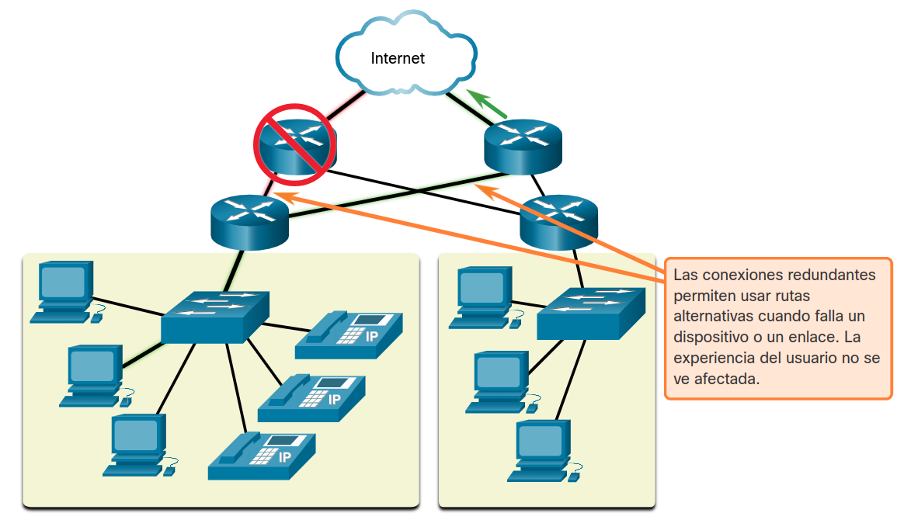
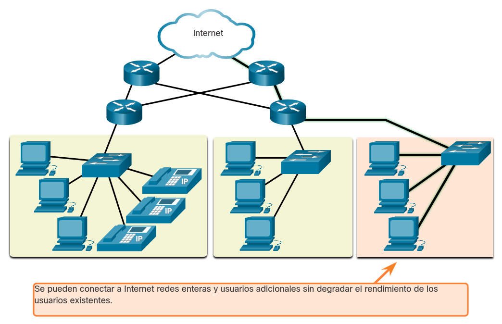
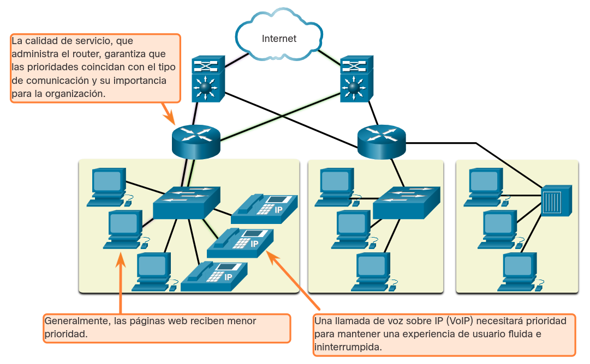
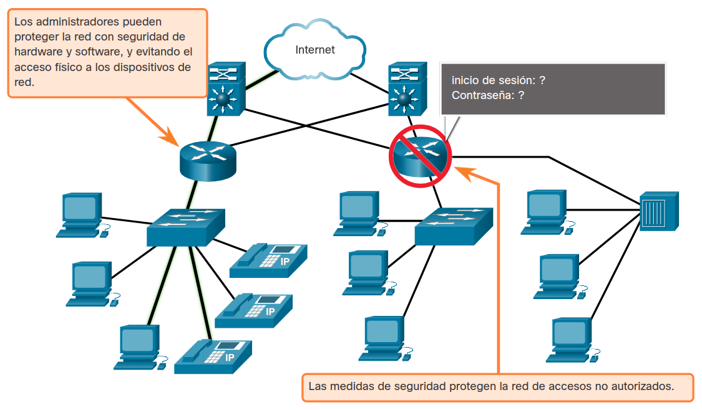
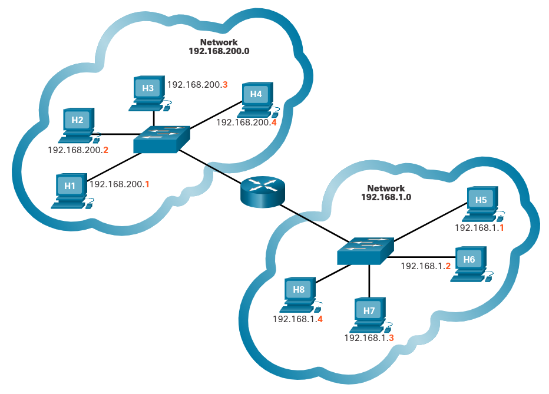
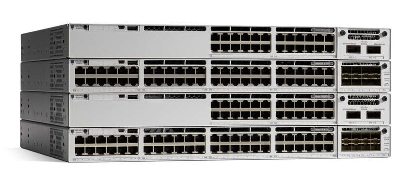

<a href="./00-Curso.md"><< Menú principal del módulo</a>

# 1. Redes Confiables
## Arquitectura de la Red
¿Alguna vez ha estado ocupado trabajando en línea, solo para que "Internet se caiga"? Como ya sabe, Internet no se cayó, simplemente perdió la conexión. Es muy frustrante. Con tantas personas en el mundo que dependen del acceso a la red para trabajar y aprender, es imperativo que las redes sean confiables. En este contexto, la fiabilidad significa más que su conexión a Internet. Este tema se centra en los cuatro aspectos de la fiabilidad de la red.

La función de la red cambió de una red únicamente de datos a un sistema que permite conectar personas, dispositivos e información en un entorno de red convergente y con gran variedad de medios. Para que las redes funcionen eficazmente y crezcan en este tipo de entorno, se deben crear sobre la base de una arquitectura de red estándar.

Las redes también admiten una amplia gama de aplicaciones y servicios. Deben operar sobre muchos tipos diferentes de cables y dispositivos, que conforman la infraestructura física. En este contexto, el término arquitectura de red, se refiere a las tecnologías que dan soporte a la infraestructura y a los servicios y las reglas, o protocolos, programados que trasladan los datos a través de la red.

A medida que las redes evolucionan, hemos aprendido que hay cuatro características básicas que los arquitectos de redes deben abordar para cumplir con las expectativas del usuario:

* <a href="https://ciberseguridad.com/guias/prevencion-proteccion/tolerancia-fallos/" target="_blank">Tolerancia a fallas</a>
* <a href="https://cyberinsight.co/what-is-scalability-in-a-network/" target="_blank">Escalabilidad</a>
* <a href="https://www.fortinet.com/lat/resources/cyberglossary/qos-quality-of-service" target="_blank">Calidad de servicio (QoS)</a>
* Seguridad

## Tolerancia de Fallas
Una red tolerante a fallas es aquella que limita la cantidad de dispositivos afectados durante una falla. Está construido para permitir una recuperación rápida cuando se produce una falla de este tipo. Estas redes dependen de varias rutas entre el origen y el destino del mensaje. Si falla una ruta, los mensajes se pueden enviar inmediatamente por otro enlace. El hecho de que haya varias rutas que conducen a un destino se denomina redundancia.

La implementación de una red de _packet-switched_ (conmutación de paquetes) es una forma en que las redes confiables proporcionan redundancia. La conmutación de paquetes divide el tráfico en paquetes que se enrutan a través de una red compartida. Un solo mensaje, como un correo electrónico o una transmisión de vídeo, se divide en múltiples bloques de mensajes, llamados paquetes. Cada paquete tiene la información de dirección necesaria del origen y el destino del mensaje. Los enrutadores dentro de la red cambian los paquetes según la condición de la red en ese momento. Esto significa que todos los paquetes en un mismo mensaje pueden tomar distintas rutas para llegar a destino. En la figura, el usuario no se da cuenta y no se ve afectado por el cambio dinámico de rutas que hace el enrutador cuando falla un enlace.

	

## Escalabilidad
Una red escalable se expande rápidamente para admitir nuevos usuarios y aplicaciones. Lo hace sin degradar el rendimiento de los servicios a los que están accediendo los usuarios existentes. En la figura, se muestra cómo puede agregarse una red nueva a una red existente con facilidad. Además, las redes son escalables porque los diseñadores siguen los estándares y protocolos aceptados. Esto permite a los proveedores de software y hardware centrarse en mejorar los productos y servicios sin tener que diseñar un nuevo conjunto de reglas para operar dentro de la red.

	

## Calidad de Servicio (QoS)
La calidad de servicio es un requisito cada vez más importante para las redes hoy en día. Las nuevas aplicaciones disponibles para los usuarios en internet, como las transmisiones de voz y de vídeo en vivo generan expectativas más altas sobre la calidad de los servicios que se proporcionan. ¿Alguna vez intentó mirar un vídeo con interrupciones y pausas constantes? A medida que el contenido de datos, voz y vídeo sigue convergiendo en la misma red, QoS se convierte en un mecanismo principal para administrar la congestión y garantizar el envío confiable de contenido a todos los usuarios.

La congestión se produce cuando la demanda de ancho de banda excede la cantidad disponible. El ancho de banda de la red es la medida de la cantidad de bits que se pueden transmitir en un segundo, es decir, bits por segundo (bps). Cuando se producen intentos de comunicaciones simultáneas a través de la red, la demanda de ancho de banda puede exceder su disponibilidad, lo que provoca congestión en la red.

Cuando el volumen de tráfico es mayor de lo que se puede transportar en la red, los dispositivos colocan los paquetes en cola en la memoria hasta que haya recursos disponibles para transmitirlos. En la figura, un usuario solicita una página web y otro está realizando una llamada telefónica. Con una política de QoS, el router puede administrar el flujo de datos y el tráfico de voz, dando prioridad a las comunicaciones de voz si la red se congestiona. El enfoque de QoS es priorizar el tráfico urgente. El tipo de tráfico, no el contenido del tráfico, es lo que importa.

	

## Seguridad de la Red
La infraestructura de red, los servicios y los datos contenidos en los dispositivos conectados a la red son activos comerciales y personales muy importantes. Los administradores de red deben abordar dos tipos de problemas de seguridad de red: seguridad de la infraestructura de red y seguridad de la información.

Asegurar la infraestructura de red incluye asegurar físicamente los dispositivos que proporcionan conectividad de red y evitar el acceso no autorizado al software de administración que reside en ellos, como se muestra en la figura.

	

Los administradores de red también deben proteger la información contenida en los paquetes que se transmiten a través de la red y la información almacenada en los dispositivos conectados a la red. Para alcanzar los objetivos de seguridad de la red, hay tres requisitos principales

* __Confidencialidad__. La confidencialidad de los datos se refiere a que solamente los destinatarios deseados y autorizados pueden acceder a los datos y leerlos.
* __Integridad__. Integridad de datos significa tener la seguridad de que la información no ha sido alterada en la transmisión, del origen al destino.
* __Disponibilidad__. Significa tener la seguridad de acceder en forma confiable y oportuna a los servicios de datos para usuarios autorizados.

# 2. Diseño de Redes Jerárquico
## Direcciones fisicas y Lógicas
El nombre de una persona generalmente no cambia. Por otro lado, la dirección de una persona indica dónde vive esa persona y puede cambiar. En un host, la dirección MAC no cambia; está físicamente asignada a la NIC del host y se conoce como dirección física. La dirección física es siempre la misma, independientemente del lugar de la red en donde se encuentre el host.

La dirección IP es similar a la dirección de una persona. Se conoce como dirección lógica porque está asignada lógicamente en función de la ubicación del host. La dirección IP o dirección de red es asignada a cada host por un administrador de la red en función de la red local.

Las direcciones IP contienen dos partes. Una parte identifica la porción de la red. La porción de red de la dirección IP será la misma para todos los hosts conectados a la misma red local. La segunda parte de la dirección IP identifica el host individual en esa red. En la misma red local, la porción de host de la dirección IP es única para cada host, como se muestra en la figura.

Para que una computadora pueda comunicarse en una red jerárquica, se necesitan tanto la dirección MAC física como la dirección IP lógica, de la misma manera en la que se necesitan el nombre y la dirección de una persona para poder enviarle una carta.

	

## Analogía Jerárquica
Imagine lo difícil que sería la comunicación si la única manera de enviar un mensaje a alguien fuera utilizar el nombre de la persona. Si no hubiera direcciones, ciudades, pueblos o países, la entrega del mensaje a una persona específica en algún lugar del mundo sería prácticamente imposible.

En una red Ethernet, la dirección MAC del host es similar al nombre de una persona. Una dirección MAC indica la identidad individual de un host específico, pero no indica en qué lugar de la red se encuentra el host. Si todos los hosts en Internet (millones y millones de ellos) fueran identificados solo por su dirección MAC única, imagine lo difícil que sería localizar uno en particular.

Además, la tecnología Ethernet genera una gran cantidad de tráfico de difusión para que los hosts se comuniquen. Las difusiones se envían a todos los hosts de una única red. Las difusiones consumen ancho de banda y afectan el rendimiento de la red. ¿Qué ocurriría si los millones de hosts conectados a Internet estuvieran todos en una red Ethernet y utilizaran difusiones?

Por estos dos motivos, no es eficaz utilizar grandes redes Ethernet con muchos hosts. Es mejor dividir las redes más grandes en partes más pequeñas y fáciles de administrar. Una manera de dividir redes grandes es utilizar un modelo de diseño jerárquico.

## Acceso, Distribución y Núcleo
El tráfico IP se administra basándose en las características y los dispositivos asociados con cada una de las tres capas del modelo de diseño de redes jerárquico: Acceso, Distribución y Núcleo.

### Capa de Acceso
La capa de acceso proporciona un punto de conexión a la red para los dispositivos para usuarios finales y permite que varios hosts se conecten a otros hosts a través de un dispositivo de red, generalmente un conmutador, como el Cisco 2960-XR que se muestra en la figura, o un punto de acceso inalámbrico. Normalmente, la porción de red de la dirección IP será la misma para todos los dispositivos de una misma capa de acceso.

Si un mensaje está destinado a un host local, según se indique en la porción de red de la dirección IP, el mensaje permanecerá en el nivel local. Si está destinado a una red diferente, pasa a la capa de distribución. Los conmutadores proporcionan la conexión a los dispositivos de la capa de distribución, generalmente un dispositivo de Capa 3, como un enrutador o un conmutador de Capa 3.

	

### Capa de Distribución
La capa de distribución proporciona un punto de conexión para redes separadas y controla el flujo de información entre las redes. Por lo general, contiene conmutadores más potentes, como la serie Cisco C9300 que se muestra en la figura, que la capa de acceso, así como enrutadores para el enrutamiento entre redes. Los dispositivos de la capa de distribución controlan el tipo y la cantidad de tráfico que circula desde la capa de acceso hasta la capa principal.

	

### Capa de Núcleo
La capa de núcleo es una capa troncal de alta velocidad con conexiones redundantes (de respaldo). Es la encargada de transportar grandes cantidades de datos entre múltiples redes finales. Los dispositivos de capa de núcleo suelen incluir enrutadores y conmutadores muy potentes y de alta velocidad, como el Cisco Catalyst 9600 que se muestra en la figura. El objetivo principal de la capa de núcleo es transportar datos con rapidez.

	

# 3. Resumen
## Redes confiables
A medida que las redes evolucionan, hemos aprendido que hay cuatro características básicas que los arquitectos de redes deben abordar para cumplir con las expectativas de los usuarios: tolerancia a fallas, escalabilidad, QoS y seguridad.

Una red tolerante a fallas limita la cantidad de dispositivos afectados durante una falla. Permite una recuperación rápida cuando ocurre una falla de este tipo. Estas redes dependen de varias rutas entre el origen y el destino del mensaje. Si falla una ruta, los mensajes se pueden enviar inmediatamente por otro enlace.

Una red escalable se expande rápidamente para admitir nuevos usuarios y aplicaciones. Lo hace sin degradar el rendimiento de los servicios a los que están accediendo los usuarios existentes. Las redes pueden ser escalables porque los diseñadores siguen los estándares y protocolos aceptados.

QoS es un requisito cada vez mayor de las redes hoy en día. A medida que el contenido de datos, voz y vídeo sigue convergiendo en la misma red, QoS se convierte en un mecanismo principal para administrar la congestión y garantizar el envío confiable de contenido a todos los usuarios. El ancho de banda de la red se mide en bps. Cuando se producen intentos de comunicaciones simultáneas a través de la red, la demanda de ancho de banda puede exceder su disponibilidad, lo que provoca congestión en la red. El enfoque de QoS es priorizar el tráfico urgente. El tipo de tráfico, no el contenido del tráfico, es lo que importa.

Los administradores de red deben abordar dos tipos de problemas de seguridad de red: seguridad de la infraestructura de red y seguridad de la información. Los administradores de red también deben proteger la información contenida en los paquetes que se transmiten a través de la red y la información almacenada en los dispositivos conectados a la red. Hay tres requisitos principales para lograr los objetivos de la seguridad de la red: Confidencialidad, Integridad y Disponibilidad.

## Diseño de Redes Jerárquico
Las direcciones IP contienen dos partes. Una parte identifica la porción de la red. La porción de red de la dirección IP será la misma para todos los hosts conectados a la misma red local. La segunda parte de la dirección IP identifica el host individual en esa red. Se requieren tanto la dirección MAC física como la IP lógica para que una computadora se comunique en una red jerárquica.

El Centro de Redes y Recursos Compartidos en una PC muestra la información básica de la red y las conexiones de configuración, incluidas las redes activas y si está conectado por cable o de forma inalámbrica a Internet y dentro de su LAN. Puede ver las propiedades de las conexiones aquí.

En una red Ethernet, la dirección MAC del host es similar al nombre de una persona. Una dirección MAC indica la identidad individual de un host específico, pero no indica en qué lugar de la red se encuentra el host. Si todos los hosts en Internet (millones y millones de ellos) fueran identificados solo por su dirección MAC única, imagine lo difícil que sería localizar uno en particular. Es mejor dividir las redes más grandes en partes más pequeñas y fáciles de administrar. Una manera de dividir redes grandes es utilizar un modelo de diseño jerárquico.

Las redes jerárquicas escalan bastante bien. La capa de acceso proporciona un punto de conexión a la red para los dispositivos de usuarios finales y permite que varios hosts se conecten a otros hosts a través de un dispositivo de red, por lo general un conmutador o un punto de acceso inalámbrico. Normalmente, la porción de red de la dirección IP será la misma para todos los dispositivos de una misma capa de acceso. La capa de distribución proporciona un punto de conexión para redes independientes y controla el flujo de información entre las redes. Los dispositivos de la capa de distribución controlan el tipo y la cantidad de tráfico que circula desde la capa de acceso hasta la capa principal. La capa de núcleo es una capa troncal de alta velocidad con conexiones redundantes. Es la encargada de transportar grandes cantidades de datos entre múltiples redes finales. El objetivo principal de la capa principal es transportar datos con rapidez.

## Enlaces de interés
* <a href="https://www.ciscopress.com/articles/printerfriendly/2189637" target="_blank">Introduction to Scaling Networks</a>
* <a href="./notes/alta_disponibilidad.md" target="_blank">Alta Disponibilidad</a>
* <a href="https://ccnadesdecero.es/redes-jerarquicas/" target="_blank">Redes Jeráquicas</a>
* <a href="https://ccnadesdecero.es/diseno-jerarquico-de-redes/" target="_blank">Diseño jeráquico de redes</a>
 
 
 
 
 
 
<a href="#1-redes-confiables">⬆️</a>
<a href="./00-Curso.md"><< Menú principal del módulo</a>