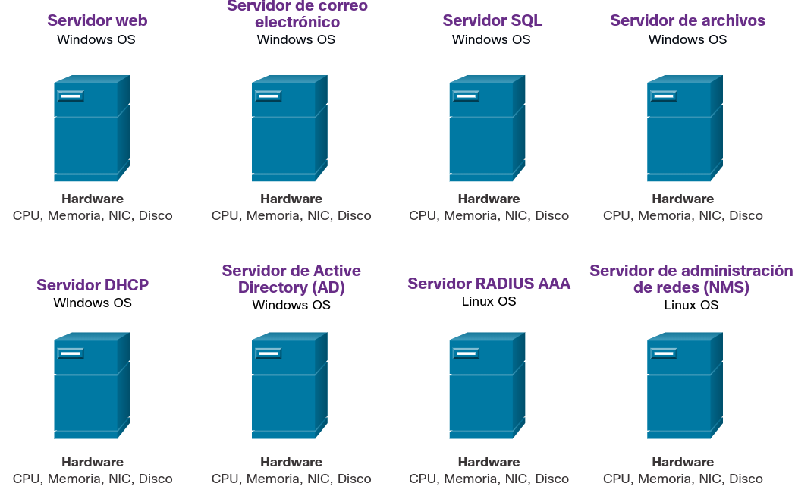
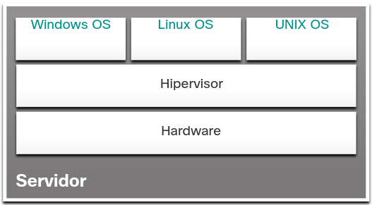
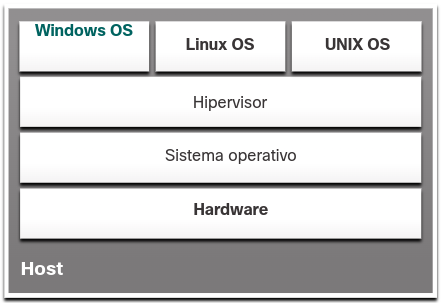

<a href="./00-Curso.md"><< Menú principal del módulo</a>

# 2. La Nube y Virtualización
En general, cuando se habla de la nube, se engloban tres conceptos:

* Centros de datos
* Computación o Servicios en la Nube
* Virtualización

Modelos de Nube:

* Privadas y públicas

Servicios en la Nube:

* SaaS: Software as a Service
* PaaS: Platform as a Service
* IaaS: Infrastructure as a Service

# La Nube y Servicios en la nube
## Tipos de Nubes
Los cuatro modelos principales en la nube son:

* __Nubes Públicas__. Las aplicaciones basadas en la nube y los servicios que se ofrecen en una nube pública están a disposición de la población en general. Los servicios pueden ser gratuitos u ofrecerse sobre la base de pago por utilización, como el pago por almacenamiento en línea. La nube pública utiliza Internet para proporcionar servicios.
* __Nubes Privadas__. Las aplicaciones y los servicios basados en una nube privada que se ofrecen en una nube privada están destinados a una organización o una entidad específica, como el gobierno. Se puede configurar una nube privada usando la red privada de una organización, aunque esto puede ser costoso de construir y mantener. Una nube privada también puede ser administrada por una organización externa con estricta seguridad de acceso.
* __Nubes Híbridas__. Una nube híbrida consta de dos o más nubes (por ejemplo, una parte privada y otra parte pública), donde cada una de las partes sigue siendo un objeto separado, pero ambas están conectadas a través de una única arquitectura. En una nube híbrida, las personas podrían tener grados de acceso a varios servicios según sus derechos de acceso de usuario.
* __Nubes Comunitarias__. Una nube comunitaria se crea para el uso exclusivo de una comunidad específica. Las diferencias entre nubes públicas y nubes comunitarias son las necesidades funcionales que se personalizan para la comunidad. Por ejemplo, las organizaciones de servicios de salud deben cumplir las políticas y leyes (p. ej., HIPAA, en los Estados Unidos) que requieren niveles de autenticación y confidencialidad especiales.

## Computación en la Nube y Virtualización
Los términos "computación en la nube" y "virtualización" suelen usarse de manera intercambiable; no obstante, significan dos cosas distintas. La virtualización es la base de la computación en la nube. Sin esta base, la computación en la nube que se implementa masivamente no sería posible.

Hace más de una década, VMware desarrolló una tecnología de virtualización que permitió que un sistema operativo host admitiera uno o más sistemas operativos cliente. La mayoría de las tecnologías de virtualización ahora se basan en esta tecnología. La transformación de los servidores exclusivos para los servidores virtualizados se ha adoptado y se implementa rápidamente en el centro de datos y las redes empresariales.

La virtualización significa crear una versión virtual en lugar de una versión física de algo, como una computadora. Un ejemplo sería ejecutar una “computadora con Linux” en su PC con Windows, lo que hará más adelante en la práctica de laboratorio.

Para poder apreciar completamente la virtualización, primero es necesario entender un poco parte la historia de la tecnología de los servidores. Históricamente, los servidores empresariales consistían en un sistema operativo de servidor, como Windows Server o Linux Server, instalado en un hardware específico, como se muestra en la figura. Toda la RAM del servidor, la potencia de procesamiento y el espacio del disco duro se dedicaban al servicio prestado (por ejemplo, servicios web, de correo electrónico, etc.).

	

# Virtualización
## Ventajas de la Virtualización
Una de las ventajas más importantes de la virtualización es un menor costo total:

* __Se requiere menos equipo__ - La virtualización permite la consolidación de servidores, lo que requiere menos dispositivos físicos y reduce los costos de mantenimiento.
* __Menor consumo de energía__ - La consolidación de servidores reduce los costos mensuales de alimentación y refrigeración.
* __Se requiere menos espacio__ - La consolidación de servidores reduce la cantidad de espacio requerido.

Estos son los beneficios adicionales de la virtualización:

* __Simplificación de prototipos__ - Se pueden crear rápidamente laboratorios autónomos que operan en redes aisladas para las pruebas y los prototipos de instalaciones de red.
* __Aprovisionamiento más rápido de servidores__ - La creación de un servidor virtual es mucho más rápida que el aprovisionamiento de un servidor físico.
* __Mayor tiempo de actividad del servidor__ - La mayoría de las plataformas de virtualización de servidores ahora ofrecen funciones avanzadas redundantes de tolerancia a fallas.
* __Recuperación mejorada ante desastres__ - La mayoría de las plataformas de virtualización de servidores empresariales tienen software que puede ayudar a probar y automatizar la conmutación por error antes de que ocurra un desastre.
* __Soporte de tecnologías heredadas__ - La virtualización puede extender la vida útil de los sistemas operativos y las aplicaciones, brindando más tiempo para que las organizaciones migren a soluciones más nuevas.

## Hipervisores
El Hipervisor es un programa, un firmware o un hardware que suma una capa de abstracción a la parte superior del hardware físico real. La capa de abstracción se utiliza para crear máquinas virtuales que tienen acceso a todo el hardware de la máquina física, como CPU, memoria, controladores de disco y NIC. Cada una de esas máquinas virtuales ejecuta un sistema operativo completo y separado. Con la virtualización, no es raro que 100 servidores físicos se consoliden como máquinas virtuales sobre 10 servidores físicos que usan hipervisores.

### Hipervisores de Tipo 1
El hipervisor de tipo 1 también se denomina infraestructura física (bare metal), porque el hipervisor está instalado directamente en el hardware. Los hipervisores de tipo 1 se usan generalmente en los servidores empresariales y los dispositivos de redes para centros de datos.

Con los hipervisores de tipo 1, el hipervisor se instala directamente en el servidor o en el hardware de red. Luego, las instancias de OS se instalan sobre el hipervisor, como se muestra en la figura. Los hipervisores de tipo 1 tienen acceso directo a los recursos de hardware; por lo tanto, son más eficaces que las arquitecturas alojadas. Los hipervisores de tipo 1 mejoran la escalabilidad, el rendimiento y la solidez.

	

### Hipervisores de Tipo 2
Un hipervisor, tipo 2, es un software que crea y ejecuta instancias de VM. La computadora, en la que un hipervisor está ejecutando una o más VM, es un equipo host. Los hipervisores de tipo 2 también se denominan hipervisores alojados. Esto se debe a que el hipervisor está instalado sobre el OS existente, como Mac OS X, Windows o Linux. Luego, una o más instancias adicionales de OS se instalan sobre el hipervisor, como se muestra en la figura. Una gran ventaja de los hipervisores de tipo 2 es que el software de la consola de administración no es necesario.

__Nota__: Es importante asegurarse de que la máquina de host sea lo suficientemente robusta como para instalar y ejecutar las VM, a fin de evitar que se agoten los recursos.

	

## Laboratorio - Instalar de Linux en una Máquina Virtual y Explorar la GUI

# Resumen
## La Nube y Servicios en la Nube
Generalmente cuando hablamos de la nube, hablamos de tres elementos: centros de datos, computación en la nube y virtualización. Los centros de datos suelen ser grandes instalaciones que proporcionan grandes cantidades de energía, refrigeración y ancho de banda. Solo empresas muy grandes pueden permitirse sus propios centros de datos. La mayoría de las organizaciones más pequeñas arrienda los servicios de un proveedor de la nube.
Los servicios en la nube incluyen lo siguiente:

* SaaS - Software como servicio
* PaaS - Plataforma como servicio
* IaaS - Infraestructura como servicio
* Hay cuatro modelos de nube principales, como se muestra en la figura
* Nubes Públicas - Las aplicaciones basadas en la nube y los servicios que se ofrecen en una nube pública están a disposición de la población en general.
* Nubes Privadas - Las aplicaciones y los servicios basados en una nube privada que se ofrecen en una nube privada están destinados a una organización o una entidad específica, como el gobierno.
* Nubes híbridas - Una nube híbrida se compone de dos o más nubes, donde cada parte sigue siendo un objeto separado, pero ambas están conectadas mediante una única arquitectura.
* Nubes Comunitarias - Una nube comunitaria se crea para el uso exclusivo de una comunidad específica. Las diferencias entre nubes públicas y nubes comunitarias son las necesidades funcionales que se personalizan para la comunidad.

La virtualización es la base de la computación en la nube. Sin esta base, la computación en la nube que se implementa masivamente no sería posible. La virtualización significa crear una versión virtual un lugar de una versión física de algo, como una computadora. Un ejemplo sería ejecutar una “computadora con Linux” en su PC con Windows.

## Virtualización
Una de las ventajas más importantes de la virtualización es un menor costo total:

* Se requiere menos equipo - La virtualización permite la consolidación de servidores, lo que requiere menos dispositivos físicos y reduce los costos de mantenimiento.
* Menor consumo de energía - La consolidación de servidores reduce los costos mensuales de alimentación y refrigeración.
* Se requiere menos espacio - La consolidación de servidores reduce la cantidad de espacio requerido.

Estos son los beneficios adicionales de la virtualización:

* Simplificación de prototipos - Se pueden crear rápidamente laboratorios autónomos que operan en redes aisladas para las pruebas y los prototipos de instalaciones de red.
* Aprovisionamiento de servidores más rápido - Crear un servidor virtual es mucho más rápido que aprovisionar un servidor físico.
* Mayor tiempo de actividad del servido - La mayoría de las plataformas de virtualización de servidores ahora ofrecen funciones avanzadas de tolerancia a fallas redundantes.
* Recuperación mejorada ante desastres - La mayoría de las plataformas de virtualización de servidores empresariales tienen software que puede ayudar a probar y automatizar la conmutación por error antes de que ocurra un desastre.
* Soporte de tecnologías heredadas - La virtualización puede extender la vida útil de los sistemas operativos y las aplicaciones, brindando más tiempo para que las organizaciones migren a soluciones más nuevas.

El Hipervisor es un programa, un firmware o un hardware que suma una capa de abstracción a la parte superior del hardware físico real. La capa de abstracción se utiliza para crear máquinas virtuales que tienen acceso a todo el hardware de la máquina física, como CPU, memoria, controladores de disco y NIC. Cada una de esas máquinas virtuales ejecuta un sistema operativo completo y separado.

El hipervisor de tipo 1 también se denomina infraestructura física (bare metal), porque el hipervisor está instalado directamente en el hardware. Los hipervisores de tipo 1 se usan generalmente en los servidores empresariales y los dispositivos de redes para centros de datos.

Un hipervisor, tipo 2, es un software que crea y ejecuta instancias de VM. La computadora, en la que un hipervisor está ejecutando una o más VM, es un equipo host. Los hipervisores de tipo 2 también se denominan hipervisores alojados. Esto se debe a que el hipervisor está instalado sobre el OS existente, como Mac OS X, Windows o Linux. Luego, una o más instancias adicionales de OS se instalan sobre el hipervisor. Una gran ventaja de los hipervisores de tipo 2 es que el software de la consola de administración no es necesario.

## Enlaces de interés
* <a href="https://www.oracle.com/es/applications/what-is-saas/" target="_blank">SaaS - Oracle</a>
* <a href="https://www.oracle.com/es/cloud/what-is-paas/" target="_blank">PaaS - Oracle</a>
* <a href="https://www.oracle.com/es/cloud/what-is-iaas/" target="_blank">IaaS - Oracle</a>
 
 
 
 
 
 
<a href="#2-la-nube-y-virtualización">⬆️</a>
<a href="./00-Curso.md"><< Menú principal del módulo</a>