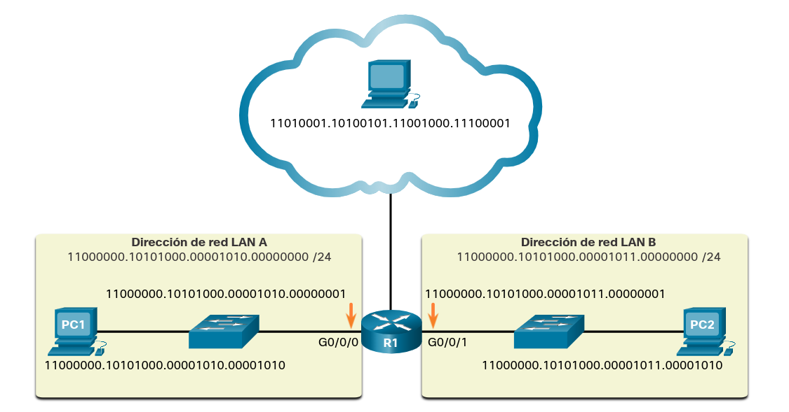
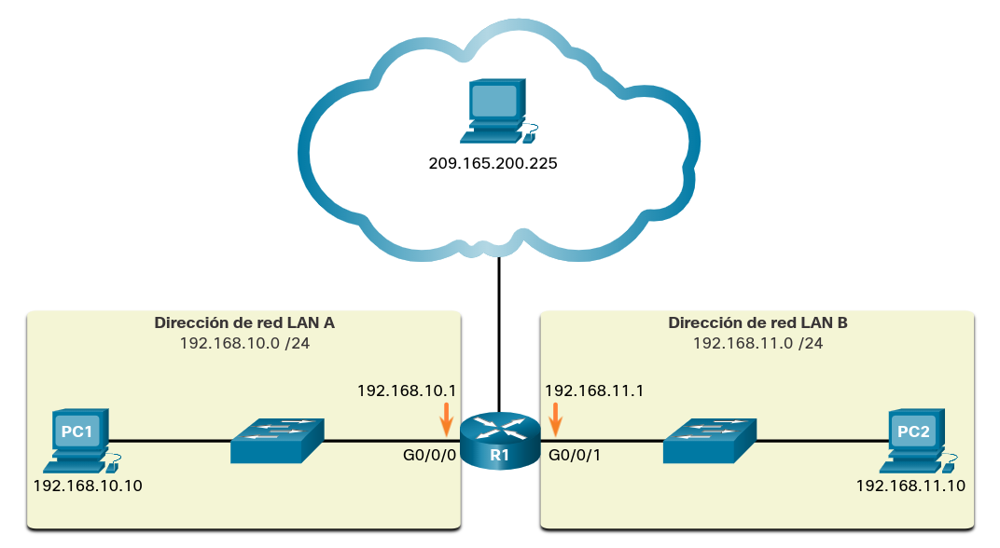
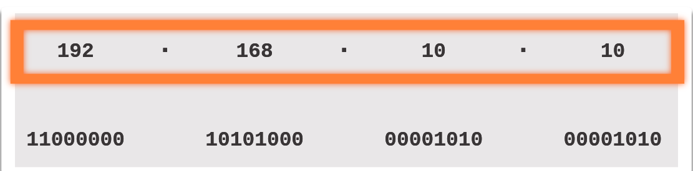
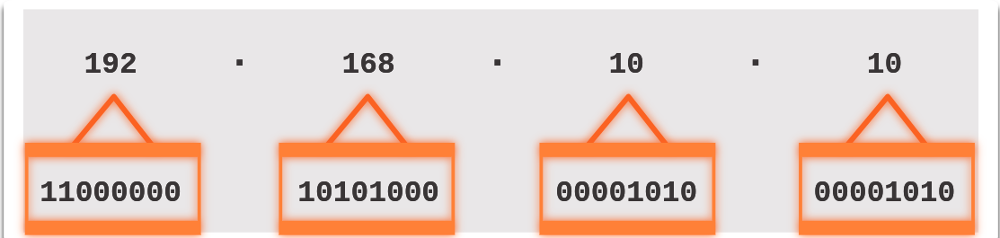
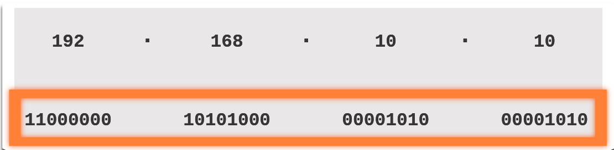
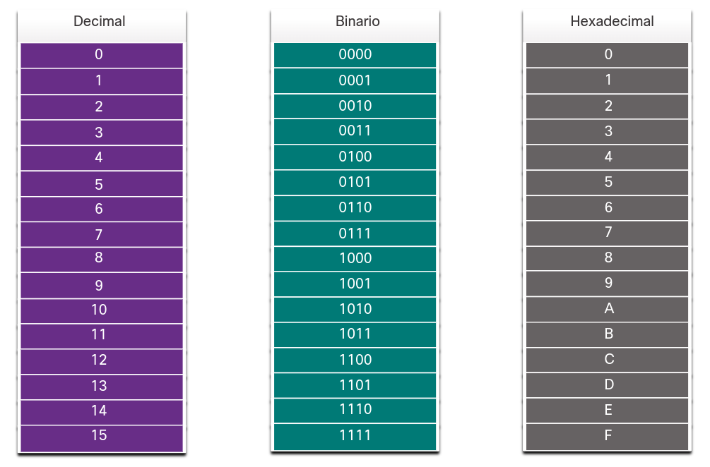
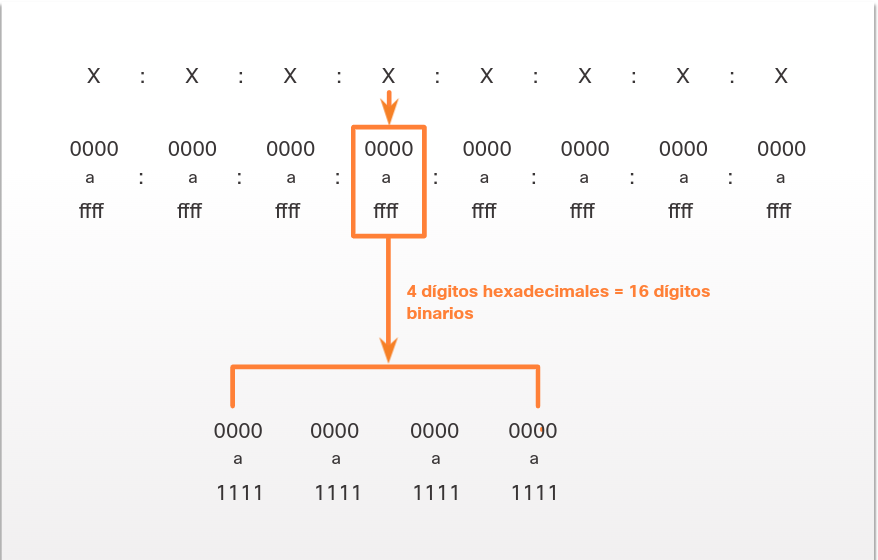
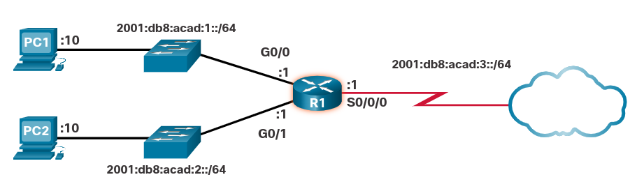

<a href="./00-Curso.md"><< Menú principal del módulo</a>

# 3. Sistemas de Numeración
# Sistema Numérico Binario
## Direcciones Binarias e IPv4
Las direcciones IPv4 comienzan como binarias, una serie de solo 1 y 0. Estos son difíciles de administrar, por lo que los administradores de red deben convertirlos a decimales. En este tema se muestran algunas formas de hacerlo.

Binario es un sistema de numeración que consta de los dígitos 0 y 1 llamados bits. Por el contrario, el sistema de numeración decimal consta de 10 dígitos que incluye del 0 al 9.

Es importante que comprendamos el sistema binario, ya que los hosts, los servidores y los dispositivos de red usan el direccionamiento binario. Específicamente, usan direcciones IPv4 binarias, como se muestra en la figura, para identificarse entre sí.

	

Cada dirección consta de una cadena de 32 bits, divididos en cuatro secciones denominadas octetos. Cada octeto contiene 8 bits (o 1 byte) separados por un punto. Por ejemplo, a la PC1 de la ilustración se le asignó la dirección IPv4 11000000.10101000.00001010.00001010. La dirección de gateway predeterminado sería la de la interfaz Gigabit Ethernet del R1, 11000000.10101000.00001010.00000001.

El binario funciona bien con hosts y dispositivos de red. Sin embargo, es muy difícil para los humanos trabajar con él.

Para facilitar el uso por parte de las personas, las direcciones IPv4 se expresan comúnmente en notación decimal punteada. A la PC1 se le asigna la dirección IPv4 192.168.10.10, y su dirección de puerta de enlace predeterminada es 192.168.10.1, como se muestra en la figura.

	

Para tener una buena comprensión del direccionamiento de red, es necesario comprender el direccionamiento binario y obtener habilidades prácticas en la conversión entre direcciones IPv4 binarias y decimales punteadas. Esta sección cubrirá cómo convertir entre sistemas de numeración de base dos (binario) y base 10 (decimal).

## Conversión de Binario a Decimal
## Conversión de Decimal a Binario
## Direcciones IPv4
Como se mencionó al principio de este tema, los enrutadores y las computadoras solo entienden binario, mientras que los humanos trabajan en decimal. Es importante que usted conozca a fondo estos dos sistemas de numeración y cómo se utilizan en redes.

192.168.10.10 es una dirección IP asignada a una computadora.

	

 

La dirección se compone de cuatro octetos diferentes.

	

 

La computadora almacena la dirección como el flujo de datos total de 32 bits.

	

 

# Sistema Numérico Hexadecimal
## Direcciones Hexadecimales e IPv6
Ahora sabes cómo convertir binario a decimal y decimal a binario. Necesita esa habilidad para comprender el direccionamiento IPv4 en su red. Pero es igual de probable que use direcciones IPv6 en su red. Para entender las direcciones IPv6, debe ser capaz de convertir hexadecimal a decimal y viceversa.

Así como el decimal es un sistema de base diez, el hexadecimal es un sistema de base dieciséis. El sistema base de dieciséis números usa los dígitos del 0 al 9 y las letras de la A a la F. La figura muestra los valores decimales y hexadecimales equivalentes para el binario 0000 a 1111.

	

Binario y hexadecimal funcionan bien juntos porque es más fácil expresar un valor como un solo dígito hexadecimal que como cuatro bits binarios.

El sistema de numeración hexadecimal se usa en redes para representar direcciones IP Versión 6 y direcciones MAC Ethernet.

Las direcciones IPv6 tienen una longitud de 128 bits y cada 4 bits está representado por un solo dígito hexadecimal; para un total de 32 valores hexadecimales. Las direcciones IPv6 no distinguen entre mayúsculas y minúsculas, y pueden escribirse en minúsculas o en mayúsculas.

Como se muestra en la figura, el formato preferido para escribir una dirección IPv6 es x: x: x: x: x: x: x: x, donde cada "x" consta de cuatro valores hexadecimales. Al hacer referencia a 8 bits de una dirección IPv4, utilizamos el término “octeto”. En IPv6, un hexteto es el término no oficial que se utiliza para referirse a un segmento de 16 bits o cuatro valores hexadecimales. Cada “x” es un único hexteto, 16 bits o cuatro dígitos hexadecimales.

	

La topología de ejemplo de la figura muestra direcciones hexadecimales IPv6.

	

## Conversión entre sistemas de Numeración Hexadecimal y Decimal

# Resumen
## Sistema de numeración binario

Binario es un sistema de numeración que consta de los dígitos 0 y 1 llamados bits. En contraste, el sistema de numeración decimal consta de 10 dígitos que consisten en los dígitos desde el 0 al 9. Los hosts, los servidores y los dispositivos de red utilizan direccionamiento binario. Específicamente, utilizan direcciones IPv4 binarias. Para facilitar el uso por parte de las personas, las direcciones IPv4 se expresan comúnmente en notación decimal punteada.

Este sistema decimal utiliza las potencias de diez, o base 10. Por ejemplo, el número 2,146 tiene un 2 en el lugar de miles, o dos mil. 2,146 tiene un 1 en el lugar de las cientos, o cien. Tiene un 4 en el lugar de las decenas, o cuarenta. Tiene un 6 en el lugar de las unidades, o seis.

El sistema binario es un sistema numérico de base 2. Cada valor posicional puede tener un 0 o un 1. La tabla de valores de posición binarios es una herramienta útil. Es común utilizar una tabla con ocho marcadores de posición. 8 bits equivalen a un byte.

## Sistema Numérico Hexadecimal
El sistema de numeración hexadecimal se usa en redes para representar direcciones IP Versión 6 y direcciones MAC Ethernet. Este sistema numérico de base dieciséis utiliza los dígitos del 0 al 9 y las letras de la A a la F. El binario y el hexadecimal funcionan bien juntos porque es más fácil expresar un valor como un solo dígito hexadecimal que como cuatro bits binarios.

Las direcciones IPv6 tienen una longitud de 128 bits y cada 4 bits está representado por un solo dígito hexadecimal; para un total de 32 valores hexadecimales. Las direcciones IPv6 no distinguen entre mayúsculas y minúsculas, y pueden escribirse en minúsculas o en mayúsculas.

## Enlaces de interés
* <a href="https://learningnetwork.cisco.com/s/binary-game" target="_blank">Cisco Binary Game</a>
 
 
 
 
 
 
 
 
<a href="#3-sistemas-de-numeración">⬆️</a>
<a href="./00-Curso.md"><< Menú principal del módulo</a>