<a href="./00-Curso.md"><< Menú principal del módulo</a>

# 4. Conmutación Ethernet
# Ethernet
## El Auge de Ethernet
En los comienzos de las redes, cada fabricante utilizaba sus propios métodos para la interconexión de los dispositivos de red y los protocolos de red. Si compró equipos de otros proveedores, nadie puede garantizarle que funcionen bien juntos. Los equipos de un proveedor podrían no comunicarse con los de otro fabricante.

A medida que se generalizó el uso de las redes, se desarrollaron estándares que definían las reglas con las que operaban los equipos de red de los diferentes fabricantes. Los estándares resultan beneficiosos para las redes de muchas maneras:

* Facilitan el diseño.
* Simplifican el desarrollo de productos.
* Promueven la competencia.
* Proporcionan interconexiones coherentes.
* Facilitan la capacitación.
* Proporcionan más opciones de fabricantes a los clientes.

No hay un protocolo oficial estándar para las redes locales pero, con el tiempo, una tecnología, Ethernet, se volvió más habitual que las demás. Los protocolos de Ethernet definen qué formato tienen los datos y cómo se transmiten por la red cableada. Los estándares de Ethernet especifican protocolos que funcionan en la capa 1 y en la capa 2 del modelo OSI. Se ha convertido en un estándar de facto, lo que significa que Ethernet es la tecnología que se utiliza en casi todas las redes de área local cableadas, tal como se indica en la figura.

	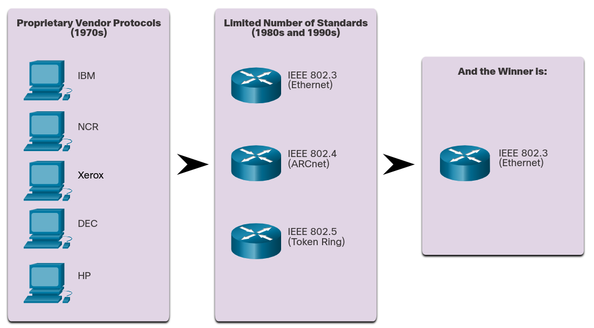

## Evolución de Ethernet
El Instituto de Ingenieros Eléctricos y Electrónicos (IEEE) lleva un control de los estándares de redes, incluidos los estándares Ethernet e inalámbricos. Los comités del IEEE son responsables de aprobar y mantener los estándares para conexiones, requisitos de medios y protocolos de comunicación. A cada estándar de tecnología se le asigna un número que hace referencia al comité que es responsable de aprobar y mantener el estándar. El comité responsable de los estándares de Ethernet es el 802.3.

Desde la creación de Ethernet en 1973, los estándares evolucionaron para especificar versiones más rápidas y flexibles de la tecnología. Esta capacidad que tiene Ethernet de evolucionar con el paso del tiempo es una de las principales razones por las que se ha popularizado. Cada versión de Ethernet tiene un estándar asociado. Por ejemplo: 802.3 100BASE-T representa los estándares de Ethernet de 100 Megabits utilizando cables de par trenzado. La notación del estándar se traduce de la siguiente manera:

* 100 es la velocidad en Mbps.
* BASE significa transmisión en banda base.
* T es el tipo de cable, en este caso, par trenzado.

Las primeras versiones de Ethernet eran relativamente lentas, con una velocidad de 10 Mbps, Las versiones más recientes de Ethernet funcionan a 10 Gb/s e, incluso, más rápido. Imagine cuánto más rápidas son estas nuevas versiones que las redes Ethernet originales.

## Direccionamiento Ethernet
En la trama Ethernet se envía la dirección MAC de destino, la dirección MAC de origen y los datos encapsulados que se quieran transmitir. El conmutador, la primera vez que recibe esta trama, la reenvía a todos los puertos a los que tiene conectados dispositivos; la trama es aceptada o rechazada por cada uno de los elementos terminales analizando la trama y comprobando si la MAC de destino coincide con la suya propia: en caso de que concuerden, se acepta, y se rechaza en caso contrario.

## Laboratorio
* Herramienta para comprobar fabricante de NIC's mediante MAC: https://www.wireshark.org/tools/oui-lookup.html

# Tramas de Ethernet
## Encapsulación de Ethernet

Este módulo comienza con una discusión de la tecnología Ethernet incluyendo una explicación de la subcapa MAC y los campos de trama Ethernet.

Ethernet es una de las dos tecnologías LAN utilizadas hoy en día, siendo la otra LAN inalámbricas (WLAN). Ethernet utiliza comunicaciones por cable, incluyendo pares trenzados, enlaces de fibra óptica y cables coaxiales.

Ethernet funciona en la capa de enlace de datos y en la capa física. Es una familia de tecnologías de redes definidas en los estándares IEEE 802.2 y 802.3. Ethernet soporta los siguientes anchos de banda de datos:

* 10 Mbps
* 100 Mbps
* 1000 Mbps (1 Gbps)
* 10.000 Mbps (10 Gbps)
* 40,000 Mbps (40 Gbps)
* 100,000 Mbps (100 Gbps)

Como se muestra en la figura, los estándares de Ethernet definen tanto los protocolos de Capa 2 como las tecnologías de Capa 1.

	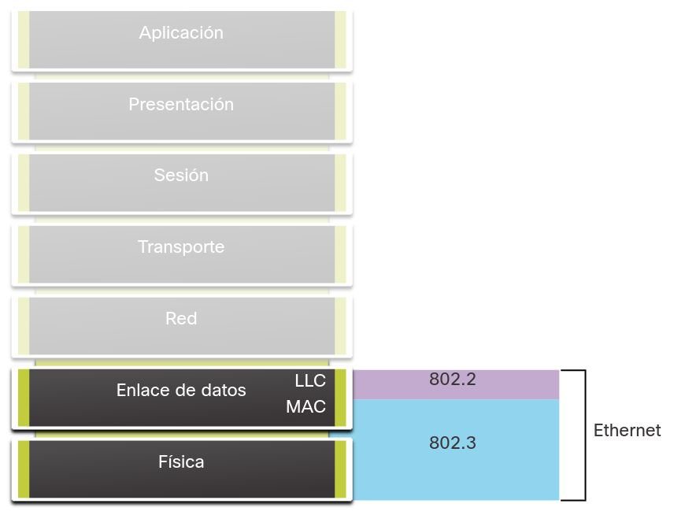

Ethernet se define mediante protocolos de capa física y de capa de enlace de datos.

## Subcapas de Enlace de Datos
Los protocolos IEEE 802 LAN/MAN, incluyendo Ethernet, utilizan las dos subcapas independientes siguientes de la capa de enlace de datos para operar. Son el Control de Enlace Lógico (LLC - _Logic Link Control_) y el Control de Acceso a Medios (MAC _Media Access Control_), como se muestra en la figura.

Recuerde que LLC y MAC tienen los siguientes roles en la capa de enlace de datos:

* __Subcapa LLC__. Esta subcapa IEEE 802.2 se comunica entre el software de red en las capas superiores y el hardware del dispositivo en las capas inferiores. Coloca en la trama información que identifica qué protocolo de capa de red se utiliza para la trama. Esta información permite que múltiples protocolos de Capa 3, como IPv4 e IPv6, utilicen la misma interfaz de red y medios.
* __Subcapa MAC__. Esta subcapa (IEEE 802.3, 802.11 o 802.15, por ejemplo) se implementa en hardware y es responsable de la encapsulación de datos y el control de acceso a medios. Proporciona direccionamiento de capa de enlace de datos y está integrada con varias tecnologías de capa física.

	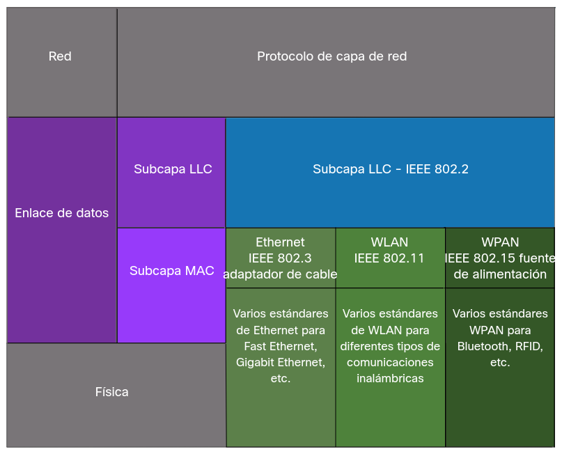

## Subcapa MAC
La subcapa MAC es responsable de la encapsulación de datos y el acceso a los medios.

### Encapsulación de Datos

La encapsulación de datos IEEE 802.3 incluye lo siguiente:

* __Trama de Ethernet__. Esta es la estructura interna de la trama Ethernet.
* __Direccionamiento Ethernet__. La trama Ethernet incluye una dirección MAC de origen y destino para entregar la trama Ethernet de NIC Ethernet a NIC Ethernet en la misma LAN.
* __Detección de Errores Ethernet__. La trama Ethernet incluye un tráiler de secuencia de verificación de trama (FCS - _Frame Check Sequence_) utilizado para la detección de errores.

### Acceso a los Medios

Como se muestra en la figura, la subcapa MAC IEEE 802.3 incluye las especificaciones para diferentes estándares de comunicaciones Ethernet sobre varios tipos de medios, incluyendo cobre y fibra.

	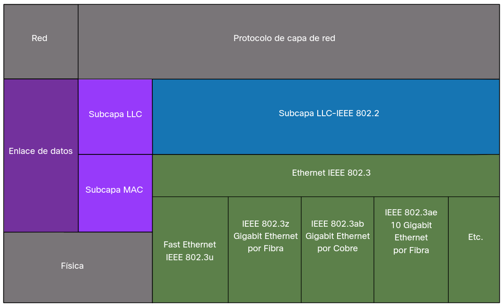

Recuerde que Ethernet heredado utiliza una topología de bus o hubs, es un medio compartido, _half-dúplex_. Ethernet a través de un medio _half-dúplex_ utiliza un método de acceso basado en contencion, detección de accesos múltiples/detección de colisiones (CSMA/CD - _Carrier Sense Multiple Access with Collision Detection_) Esto garantiza que sólo un dispositivo esté transmitiendo a la vez. CSMA/CD permite que varios dispositivos compartan el mismo medio _half-dúplex_, detectando una colisión cuando más de un dispositivo intenta transmitir simultáneamente. También proporciona un algoritmo de retroceso para la retransmisión.

Las LAN Ethernet de hoy utilizan conmutadores que funcionan en dúplex completo. Las comunicaciones dúplex completo con conmutadores Ethernet no requieren control de acceso a través de CSMA/CD.

## Campos de la Trama de Ethernet
El tamaño mínimo de la trama de Ethernet es de 64 bytes y el máximo esperado es de 1518 bytes. Esto incluye todos los bytes desde el campo de dirección MAC de destino hasta el campo de secuencia de verificación de trama (FCS). El campo preámbulo no se incluye al describir el tamaño de una trama.

__Nota__: El tamaño de la trama puede ser mayor si se incluyen requisitos adicionales, como el etiquetado de VLAN. El etiquetado de VLAN está fuera del alcance de este curso.

Cualquier trama de menos de 64 bytes de longitud se considera un fragmento de colisión o una trama corta, y es descartada automáticamente por las estaciones receptoras. Las tramas de más de 1500 bytes de datos se consideran "jumbo" o "tramas bebés gigantes".

Si el tamaño de una trama transmitida es menor que el mínimo o mayor que el máximo, el dispositivo receptor descarta la trama. Es posible que las tramas descartadas se originen en colisiones u otras señales no deseadas. Ellas se consideran inválidas Las tramas jumbo suelen ser compatibles con la mayoría de los conmutadores Fast Ethernet y Gigabit Ethernet, y las NICs.

La figura muestra cada campo en la trama Ethernet. Consulte la tabla para obtener más información sobre la función de cada campo.

	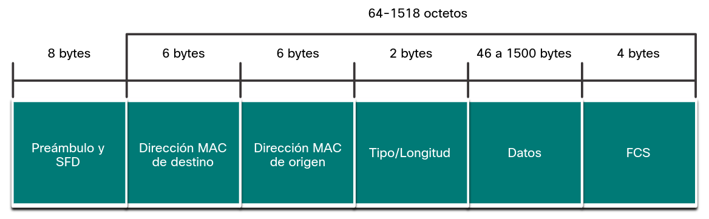

* __Campos delimintadores de inicio y preámbulo de trama__. Los campos Preámbulo (7 bytes) y Delimitador de inicio de trama (SFD - _Start Frame Delimiter_), también llamado "inicio de trama" (1 byte), se utilizan para la sincronización entre los dispositivos emisores y receptores. Estos ocho primeros bytes de la trama se utilizan para captar la atención de los nodos receptores. Básicamente, los primeros bytes le indican al receptor que se prepare para recibir una trama nueva.
* __Campo Dirección MAC de destino__. Este campo de 6 bytes es el identificador del destinatario deseado. Como recordará, la capa 2 utiliza esta dirección para ayudar a los dispositivos a determinar si la trama está dirigida a ellos. La dirección de la trama se compara con la dirección MAC del dispositivo. Si coinciden, el dispositivo acepta la trama. Puede ser una dirección de unidifusión, de multidifusión o de difusión.
* __Campo Dirección MAC de origen__. Este campo de 6 bytes identifica la NIC o la interfaz de origen de la trama.
* __Tipo/Longitud__. Este campo de 2 bytes identifica el protocolo de capa superior encapsulado en la trama de Ethernet. Los valores comunes son, en hexadecimal, `0x800` para IPv4, `0x86DD` para IPv6 y `0x806` para ARP. : También puede ver este campo denominado _EtherType_, Tipo o Longitud.
* __Campo de datos__. Este campo (de 46 a 1500 bytes) contiene los datos encapsulados de una capa superior, que es una PDU de capa 3 o, más comúnmente, un paquete IPv4. Todas las tramas deben tener, al menos, 64 bytes de longitud. Si se encapsula un paquete pequeño, se utilizan bits adicionales (llamados "relleno") para aumentar el tamaño de la trama al tamaño mínimo.
* __Campo secuencia de verificación de trama__. El campo Secuencia de verificación de trama (FCS) (4 bytes) se utiliza para detectar errores en la trama. Utiliza una comprobación cíclica de redundancia (CRC - _Cyclic Redundancy Check_). El dispositivo emisor incluye los resultados de una CRC en el campo FCS de la trama. El dispositivo receptor recibe la trama y genera una CRC para buscar errores. Si los cálculos coinciden, significa que no se produjo ningún error. Los cálculos que no coinciden indican que los datos cambiaron y, por consiguiente, se descarta la trama. Un cambio en los datos podría ser consecuencia de una interrupción de las señales eléctricas que representan los bits.

## Laboratorio - Visualización del tráfico capturado en _Wireshark_
## Laboratorio - Uso de _Wireshark_ para Examinar Tramas Ethernet

# Dirección MAC de Ethernet
## Dirección MAC y Hexadecimal
En redes, las direcciones IPv4 se representan utilizando el sistema numérico decimal de base diez y el sistema numérico binario de base dos. Las direcciones IPv6 y las direcciones Ethernet se representan utilizando el sistema numérico hexadecimal de base dieciséis. Para entender hexadecimal, primero debe estar muy familiarizado con binario y decimal.

El sistema de numeración hexadecimal usa los números del 0 al 9 y las letras de la A a la F.

Una dirección MAC Ethernet consta de un valor binario de 48 bits. Se utiliza el hexadecimal para identificar una dirección Ethernet porque un solo dígito hexadecimal representa cuatro bits binarios. Por lo tanto, una dirección MAC Ethernet de 48 bits se puede expresar utilizando sólo 12 valores hexadecimales.

La figura compara los valores decimales y hexadecimales equivalentes para el binario 0000 a 1111.

	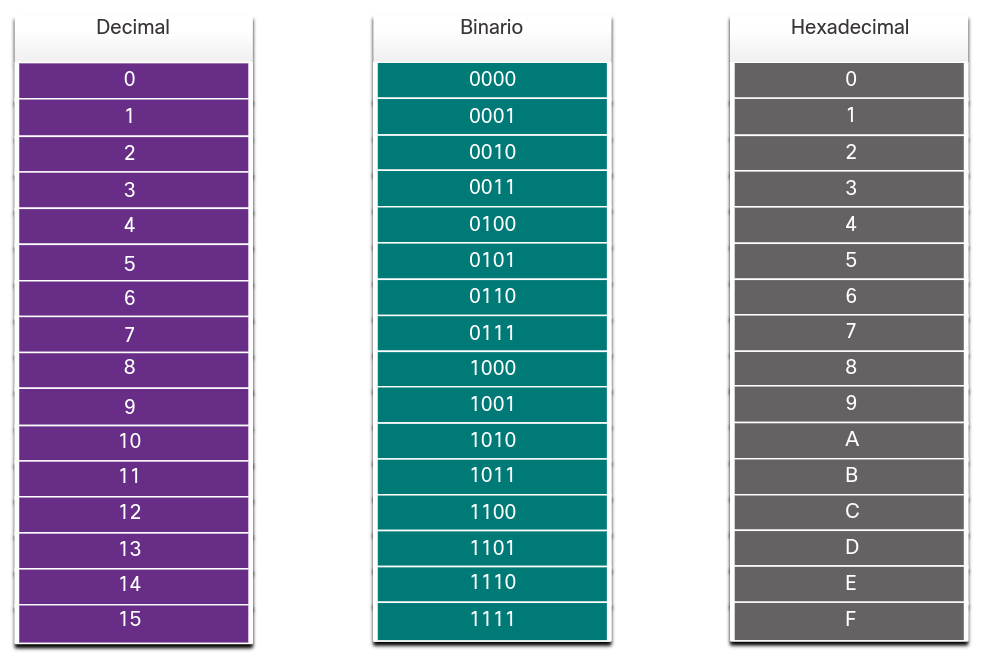

Dado que 8 bits (un byte) es un método de agrupación binaria común, los números binarios del 00000000 al 11111111 se pueden representar en hexadecimal como el rango del 00 al FF, como se muestra en la figura.

	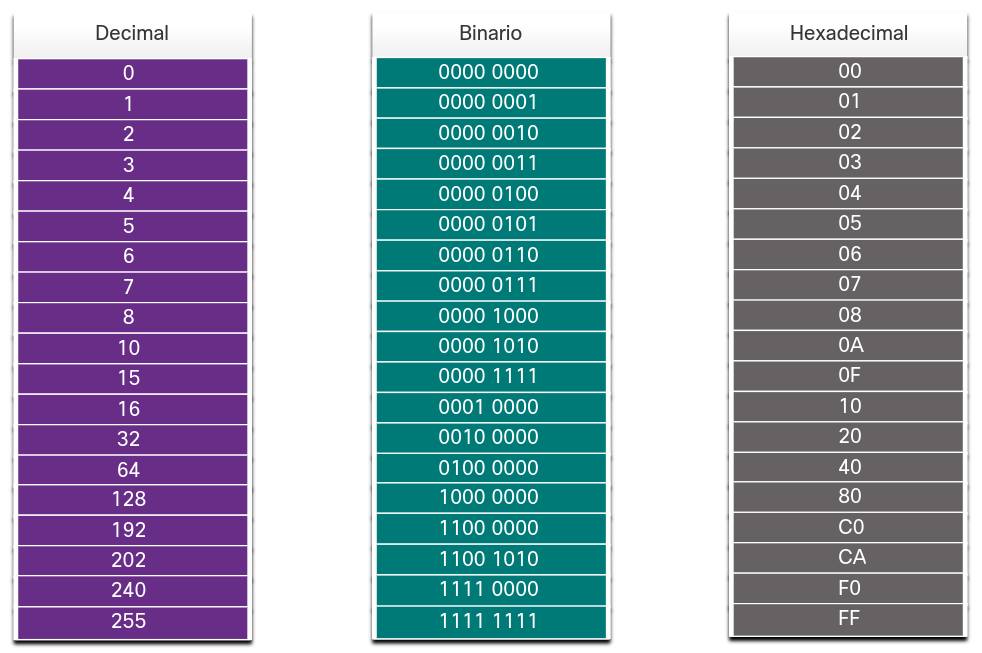

Cuando se usa hexadecimal, los ceros iniciales siempre se muestran para completar la representación de 8 bits. Por ejemplo, en la tabla, el valor binario 0000 1010 se muestra en hexadecimal como 0A.

Los números hexadecimales suelen ser representados por el valor precedido por 0x (por ejemplo, 0x73) para distinguir entre valores decimales y hexadecimales en la documentación.

El hexadecimal también puede estar representado por un subíndice 16, o el número hexadecimal seguido de una H (por ejemplo, 73H).

Es posible que tenga que convertir entre valores decimales y hexadecimales. Si es necesario realizar dichas conversiones, generalmente, es más fácil convertir el valor decimal o hexadecimal a un valor binario y, a continuación, convertir ese valor binario a un valor decimal o hexadecimal, según corresponda.

## Dirección MAC de Unidifusión
En Ethernet, se utilizan diferentes direcciones MAC para las comunicaciones de unidifusión, difusión y multidifusión de Capa 2.

Una dirección MAC de unidifusión es la dirección única que se utiliza cuando se envía una trama desde un único dispositivo de transmisión a un único dispositivo de destino.

Haga clic en Reproducir en la animación para ver cómo se procesa un trama de unidifusión. En este ejemplo, la dirección MAC de destino y la dirección IP de destino son unicast.

		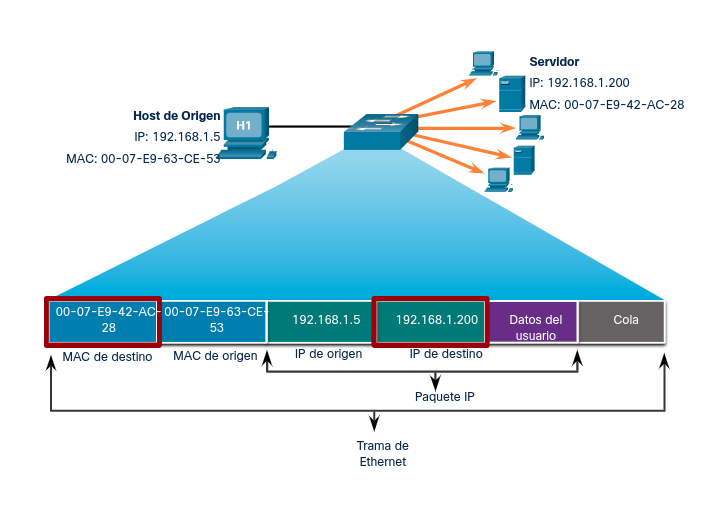
		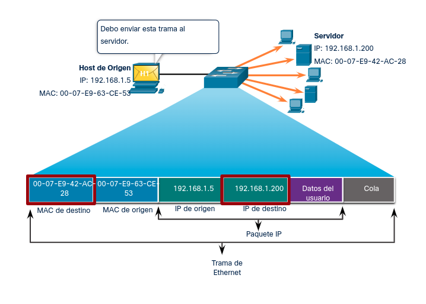
		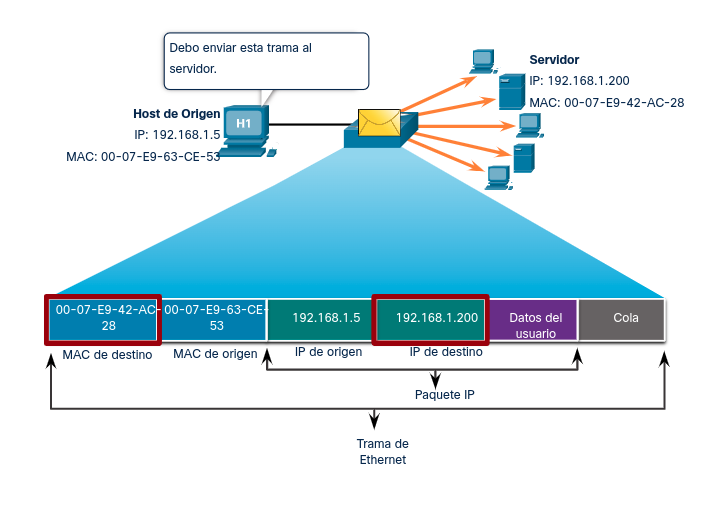
		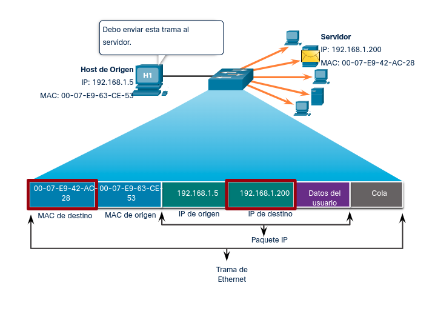

En el ejemplo de la animación, un host con la dirección IPv4 192.168.1.5 (origen) solicita una página web del servidor en la dirección IPv4 unicast 192.168.1.200. Para que un paquete de unicast se envíe y se reciba, la dirección IP de destino debe estar incluida en el encabezado del paquete IP. Además, el encabezado de la trama de Ethernet también debe contener una dirección MAC de destino correspondiente. Las direcciones IP y MAC se combinan para la distribución de datos a un host de destino específico.

El proceso que utiliza un host de origen para determinar la dirección MAC de destino asociada con una dirección IPv4 se conoce como Protocolo de Resolución de Direcciones (ARP). El proceso que utiliza un host de origen para determinar la dirección MAC de destino asociada con una dirección IPv6 se conoce como _Neighbour Discovery_ (ND).

__Nota__: La dirección MAC de origen siempre debe ser unidifusión.

## Dirección MAC de Difusión
Una trama de difusión de Ethernet es recibida y procesada por cada dispositivo de la LAN Ethernet. Las características de una transmisión Ethernet son las siguientes:

* Tiene una dirección MAC de destino de `FF-FF-FF-FF-FF-FF` en hexadecimal (48 unidades en binario).
* Se inunda hacia todos los puertos del conmutador Ethernet excepto el puerto entrante.
* No es reenviada por un enrutador.

Si los datos encapsulados son un paquete de difusión IPv4, esto significa que el paquete contiene una dirección IPv4 de destino que tiene todos los (1s) en la parte del host. Esta numeración en la dirección significa que todos los hosts de esa red local (dominio de difusión) recibirán y procesarán el paquete.

Haga clic en Reproducir en la animación para ver cómo se procesa un trama de difusión. En este ejemplo, la dirección MAC de destino y la dirección IP de destino son ambas difusiones.

		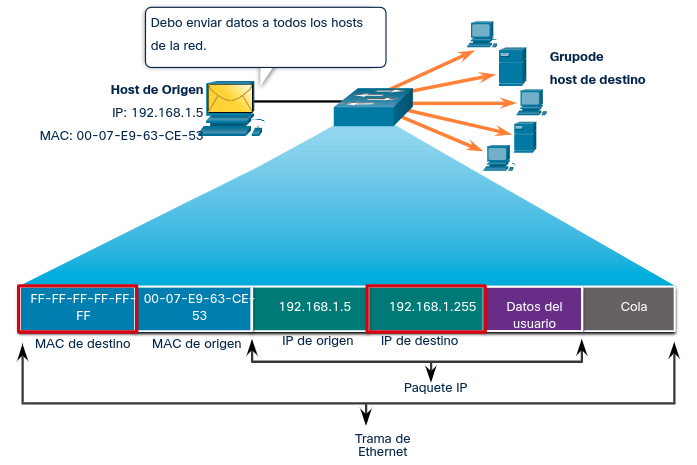
		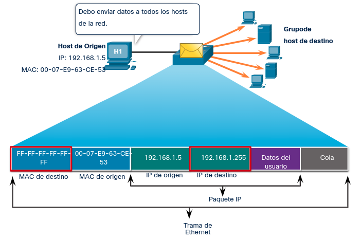
		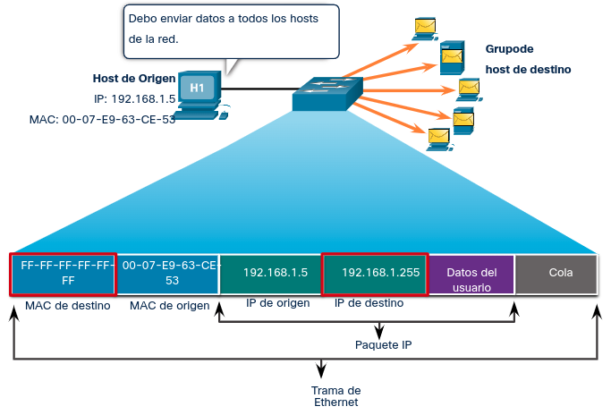

Como se muestra en la animación, el host de origen envía un paquete broadcast IPv4 a todos los dispositivos de la red. La dirección IPv4 de destino es una dirección broadcast: 192.168.1.255. Cuando el paquete de broadcast IPv4 se encapsula en la trama de Ethernet, la dirección MAC de destino es la dirección MAC de difusión FF-FF-FF-FF-FF-FF en hexadecimal (48 números uno en binario).

DHCP para IPv4 es un ejemplo de protocolo que utiliza direcciones de broadcast Ethernet e IPv4.

Sin embargo, no todas las transmisiones Ethernet llevan un paquete de broadcast IPv4. Por ejemplo, las solicitudes ARP no utilizan IPv4, pero el mensaje ARP se envía como un broadcast Ethernet.

## Dirección MAC de Multidifusión
Una trama de multicast de Ethernet es recibida y procesada por un grupo de dispositivos en la LAN de Ethernet que pertenecen al mismo grupo de multicast. Las características de una multicast Ethernet son las siguientes:

* Hay una dirección MAC de destino `01-00-5E` cuando los datos encapsulados son un paquete de multidifusión IPv4 y una dirección MAC de destino de `33-33` cuando los datos encapsulados son un paquete de multidifusión IPv6.
* Existen otras direcciones MAC de destino de multicast reservadas para cuando los datos encapsulados no son IP, como Spanning Tree Protocol (STP) y Link Layer Discovery Protocol (LLDP).
* Se inundan todos los puertos del conmutador Ethernet excepto el puerto entrante, a menos que el conmutador esté configurado para la indagación de multidifusión.
* No es reenviado por un enrutador, a menos que el enrutador esté configurado para enrutar paquetes de multidifusión.

Si los datos encapsulados son un paquete de multicast IP, a los dispositivos que pertenecen a un grupo de multicast se les asigna una dirección IP de grupo de multicast. El intervalo de direcciones IPv4 de multidifusión va de `224.0.0.0` a `239.255.255.255`. El rango de direcciones de multicast IPv6 comienza con `ff00 :: / 8`. Debido a que las direcciones de multicast representan un grupo de direcciones (a veces denominado grupo de hosts), solo se pueden utilizar como el destino de un paquete. El origen siempre tiene una dirección de unicast.

Al igual que con las direcciones de unicast y broadcast, la dirección IP de multicast requiere una dirección MAC de multicast correspondiente para entregar tramas en una red local. La dirección MAC de multicast está asociada a la dirección de multicast IPv4 o IPv6 y utiliza la información de direccionamiento de dicha dirección.

Haga clic en Reproducir en la animación para ver cómo se procesa un trama de multidifusión. En este ejemplo, la dirección MAC de destino y la dirección IP de destino son ambas multicast.

		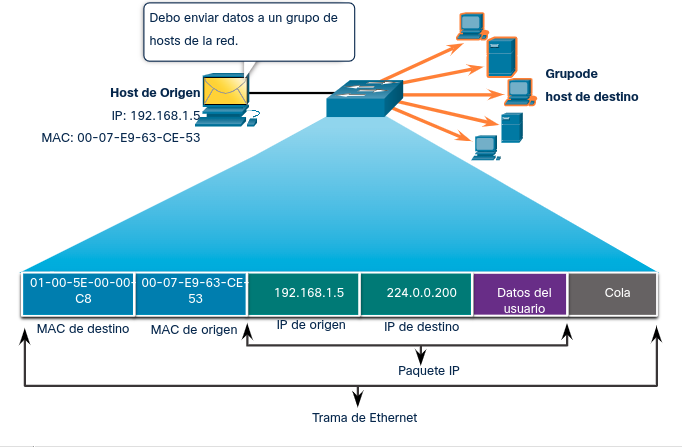
		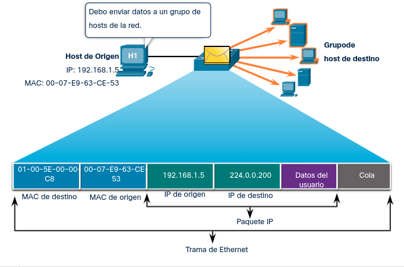
		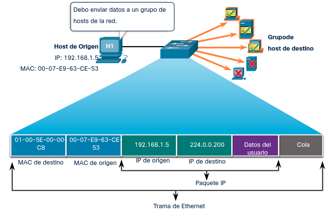

Los protocolos de enrutamiento y otros protocolos de red utilizan direccionamiento multicast. Las aplicaciones como el software de vídeo e imágenes también pueden utilizar direccionamiento multicast, aunque las aplicaciones multicast no son tan comunes.

# La Tabla de Direcciones MAC
## Fundamentos del Conmutador
Ahora que sabe todo acerca de las direcciones MAC Ethernet, es hora de hablar sobre cómo un conmutador utiliza estas direcciones para reenviar (o descartar) tramas a otros dispositivos de una red. Si un conmutador acaba de reenviar cada trama que recibió a todos los puertos, su red estaría tan congestionada que probablemente se detendría por completo.

Un conmutador Ethernet de capa 2 usa direcciones MAC de capa 2 para tomar decisiones de reenvío. No tiene conocimiento de los datos (protocolo) que se transportan en la porción de datos de la trama, como un paquete IPv4, un mensaje ARP o un paquete IPv6 ND. El conmutador toma sus decisiones de reenvío basándose únicamente en las direcciones MAC Ethernet de capa 2.

Un conmutador Ethernet examina su tabla de direcciones MAC para tomar una decisión de reenvío para cada trama, a diferencia de los hubs Ethernet heredados que repiten bits en todos los puertos excepto el puerto entrante. En la ilustración, se acaba de encender el conmutador de cuatro puertos. La tabla muestra la tabla de direcciones MAC que aún no ha aprendido las direcciones MAC para las cuatro PC conectadas.

__Nota__: Las direcciones MAC se acortan a lo largo de este tema con fines de demostración.

	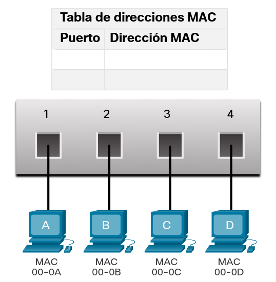

La tabla de direcciones MAC del conmutador está vacía.

Nota: A veces, la tabla de direcciones MAC se conoce como tabla de memoria de contenido direccionable (content addressable memory, CAM). Aunque el término "tabla CAM" es bastante común, en este curso nos referiremos a ella como "tabla de direcciones MAC".

## Aprendizaje y Reenvío del Conmutador
El conmutador arma la tabla de direcciones MAC de manera dinámica después de examinar la dirección MAC de origen de las tramas recibidas en un puerto. El conmutador reenvía las tramas después de buscar una coincidencia entre la dirección MAC de destino de la trama y una entrada de la tabla de direcciones MAC.

### Examinar la Dirección MAC de Origen
Se revisa cada trama que ingresa a un conmutador para obtener información nueva. Esto se realiza examinando la dirección MAC de origen de la trama y el número de puerto por el que ingresó al conmutador. Si la dirección MAC de origen no existe, se la agrega a la tabla, junto con el número de puerto de entrada. Si la dirección MAC de origen existe en la tabla, el conmutador actualiza el temporizador de actualización para esa entrada. De manera predeterminada, la mayoría de los conmutadores Ethernet guardan una entrada en la tabla durante cinco minutos.

En la figura, por ejemplo, la PC-A está enviando una trama Ethernet a la PC-D. La tabla muestra que el conmutador agrega la dirección MAC para PC-A a la tabla de direcciones MAC.

__Nota__: Si la dirección MAC de origen existe en la tabla, pero en un puerto diferente, el conmutador la trata como una entrada nueva. La entrada se reemplaza con la misma dirección MAC, pero con el número de puerto más actual.

1. PC-A envía una trama Ethernet.
2. El conmutador agrega el número de puerto y la dirección MAC para PC-A a la tabla de direcciones MAC.

	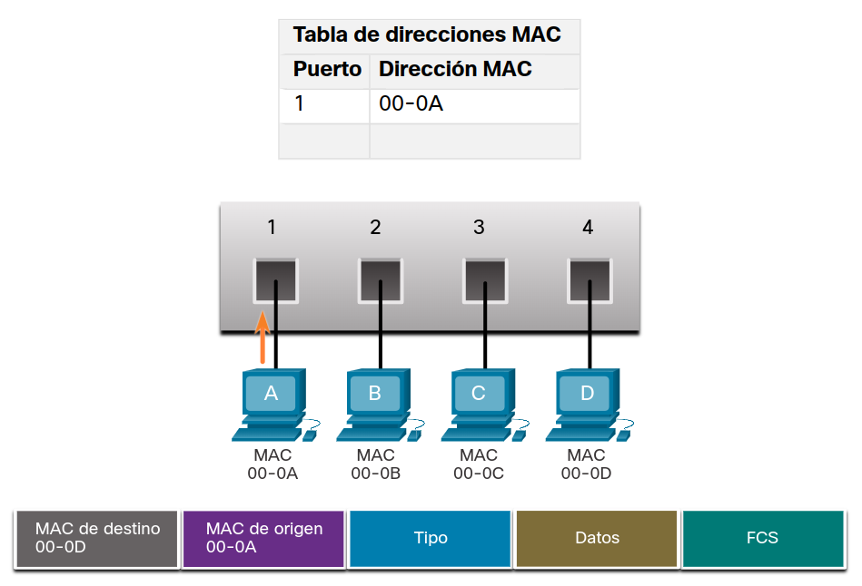

#### Buscar la Dirección MAC de Destino
Si la dirección MAC de destino es una dirección de unidifusión, el conmutador busca una coincidencia entre la dirección MAC de destino de la trama y una entrada en la tabla de direcciones MAC. Si la dirección MAC de destino está en la tabla, reenvía la trama por el puerto especificado. Si la dirección MAC de destino no está en la tabla, el conmutador reenvía la trama por todos los puertos, excepto el puerto de entrada. Esto se conoce como una unidifusión desconocida.

Como se muestra en la figura, el conmutador no tiene la dirección MAC de destino en su tabla para PC-D, por lo que envía la trama a todos los puertos excepto el puerto 1.

__Nota__: Si la dirección MAC de destino es de difusión o multidifusión, la trama también se envía a todos los puertos, excepto el puerto de entrada.

1. La dirección MAC de destino no está en la tabla.
2. El conmutador reenviará la trama a todos los puertos.

	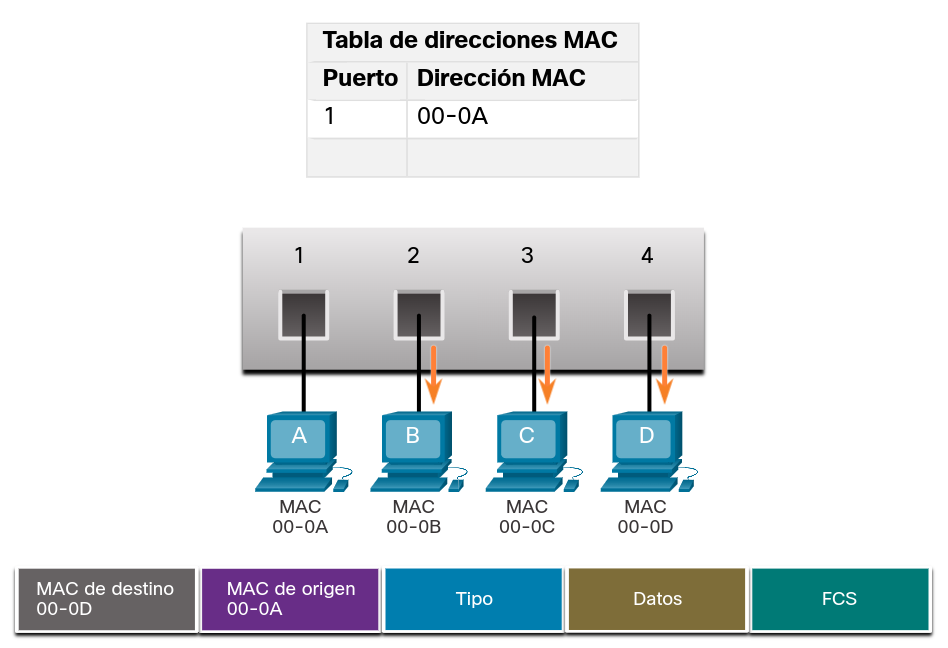

## Filtrado de Tramas
A medida que un conmutador recibe tramas de diferentes dispositivos, puede completar la tabla de direcciones MAC examinando la dirección MAC de cada trama. Cuando la tabla de direcciones MAC del conmutador contiene la dirección MAC de destino, puede filtrar la trama y reenviar un solo puerto.

__PC-D a Conmutador__
En la figura, PC-D responde a PC-A. El conmutador ve la dirección MAC de PC-D en la trama entrante en el puerto 4. A continuación, el conmutador coloca la dirección MAC de PC-D en la tabla de direcciones MAC asociada con el puerto 4.

El conmutador agrega el número de puerto y la dirección MAC para PC-D a su tabla de direcciones MAC.

	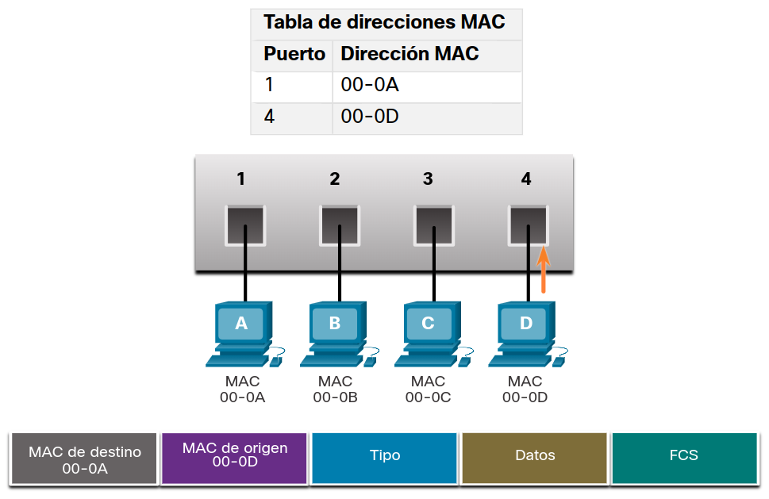

__Conmutador a PC-A__
A continuación, dado que el conmutador tiene la dirección MAC de destino para la PC-A en la Tabla de direcciones MAC, enviará la trama solo al puerto 1, como se muestra en la figura.

1. El conmutador tiene una entrada de dirección MAC para el destino.
2. El conmutador filtra la trama, enviándolo solo desde el puerto 1.

	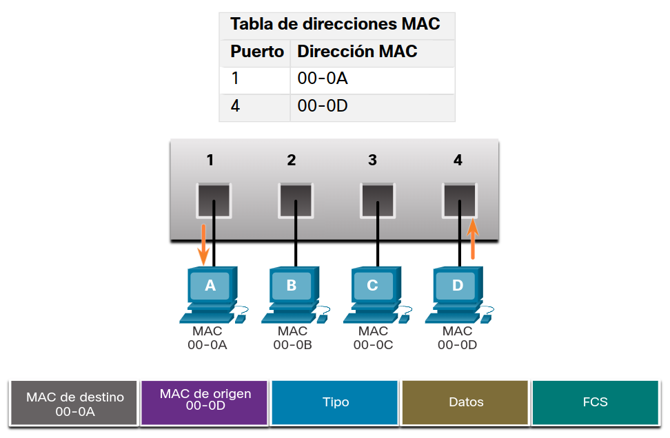

__PC-A a Conmutador a PC-D__
A continuación, PC-A envía otro trama a PC-D como se muestra en la figura. La tabla de direcciones MAC ya contiene la dirección MAC para PC-A; por lo tanto, el temporizador de actualización de cinco minutos para esa entrada se restablece. Luego, debido a que la tabla de conmutador contiene la dirección MAC de destino para PC-D, envía la trama solo por el puerto 4.

1. El conmutador recibe otra trama de PC-A y actualiza el temporizador para la entrada de dirección MAC del puerto 1.
2. El conmutador tiene una entrada reciente para la dirección MAC de destino y filtra la trama, reenviando sólo el puerto 4.

	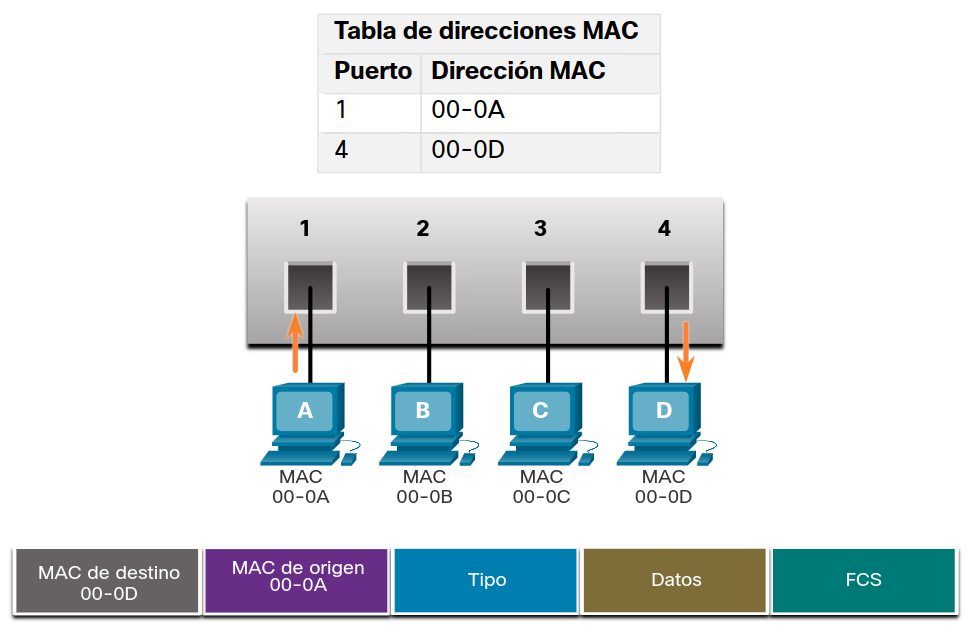

## Tablas de Direcciones MAC en Conmutadores Conectados
Un switch puede tener muchas direcciones MAC asociadas a un solo puerto. Esto es común cuando el switch está conectado a otro switch. El switch tiene una entrada independiente en la tabla de direcciones MAC para cada trama recibida con una dirección MAC de origen diferente.

## Envío de la Trama a la Ṕuerta de Enlace Predeterminada
Cuando un dispositivo tiene una dirección IP ubicada en una red remota, la trama de Ethernet no se puede enviar directamente al dispositivo de destino. En cambio, la trama de Ethernet se envía a la dirección MAC del gateway predeterminado: el router.

En la ilustración, haga clic en Reproducir para ver una demostración de cómo la PC-A se comunica con el gateway predeterminado.

Nota: En el vídeo, el paquete IP que se envía de la PC-A a un destino en una red remota, tiene como dirección IP de origen la de la PC-A y como dirección IP de destino, la del host remoto. El paquete IP de retorno tiene la dirección IP de origen del host remoto, y la dirección IP de destino es la de la PC A.

# Resumen
## Ethernet
No hay un protocolo oficial estándar para las redes locales pero, con el tiempo, una tecnología, Ethernet, se volvió más habitual que las demás. Los protocolos de Ethernet definen qué formato tienen los datos y cómo se transmiten por la red cableada. Los estándares de Ethernet especifican protocolos que funcionan en la capa 1 y en la capa 2 del modelo OSI. Ethernet se ha convertido en un estándar de facto, lo que significa que es la tecnología utilizada por casi todas las redes de área local cableadas.
El IEEE mantiene los estándares de red, incluidos los estándares de Ethernet e inalámbricos. A cada estándar de tecnología se le asigna un número que hace referencia al comité que es responsable de aprobar y mantener el estándar. El estándar 802.3 Ethernet ha mejorado con el tiempo.

Los conmutadores Ethernet pueden enviar una trama hacia todos los puertos (excepto el puerto desde el que se recibió). Cada host que recibe esta trama examina la dirección MAC de destino y la compara con su dirección MAC. Es la tarjeta NIC Ethernet la que examina y compara la dirección MAC. Si no coincide con la dirección MAC del host, se ignora el resto de la trama. Cuando se trata de una coincidencia, ese host recibe el resto de la trama y el mensaje que contiene.

## Tramas de Ethernet
Ethernet se define por los protocolos de capa de enlace de datos 802.2 y 802.3. Ethernet admite anchos de banda de 10 Mbps a 100 Gbps. Los protocolos EEE 802 LAN/MAN, incluido Ethernet, usan dos subcapas separadas de la capa de enlace de datos para operar: LLC y MAC.

* __Subcapa LLC__. Esta subcapa IEEE 802.2 se comunica entre el software de red en las capas superiores y el hardware del dispositivo en las capas inferiores. Coloca en la trama información que identifica qué protocolo de capa de red se utiliza para la trama. Esta información permite que múltiples protocolos de Capa 3, como IPv4 e IPv6, utilicen la misma interfaz de red y medios.
* __Subcapa MAC__. Esta subcapa (IEEE 802.3, 802.11 o 802.15, por ejemplo) se implementa en hardware y es responsable de la encapsulación de datos y el control de acceso a medios. Proporciona direccionamiento de capa de enlace de datos y está integrada con varias tecnologías de capa física. La encapsulación de datos incluye la trama de Ethernet, el direccionamiento de Ethernet y la detección de errores de Ethernet.

Las LAN Ethernet de hoy utilizan conmutadores que funcionan en dúplex completo. Las comunicaciones dúplex completo con conmutadores Ethernet no requieren control de acceso a través de CSMA/CD. El tamaño mínimo de la trama de Ethernet es de 64 bytes y el máximo esperado es de 1518 bytes. Los campos son Preámbulo y Delimitador de Inicio de Trama, Dirección MAC de Destino, Dirección MAC de Origen, Tipo/Longitud, Datos y FCS. Esto incluye todos los bytes desde el campo de dirección MAC de destino hasta el campo de secuencia de verificación de trama (FCS).

## Dirección MAC de Ethernet
Una dirección MAC Ethernet consta de un valor binario de 48 bits. Hexadecimal se utiliza para identificar una dirección Ethernet porque un solo dígito hexadecimal representa cuatro bits binarios. Por lo tanto, una dirección MAC Ethernet de 48 bits se puede expresar utilizando sólo 12 valores hexadecimales.

Una dirección MAC de unicast es la dirección única que se utiliza cuando se envía una trama desde un único dispositivo de transmisión a un único dispositivo de destino. El proceso que utiliza un host de origen para determinar la dirección MAC de destino asociada con una dirección IPv4 se conoce como Protocolo de Resolución de Direcciones (Address Resolution Protocol, ARP). El proceso que utiliza un host de origen para determinar la dirección MAC de destino asociada con una dirección IPv6 se conoce como Descubrimiento de Vecinos (_Neighbour Discovery_, ND)

Las características de una transmisión Ethernet son las siguientes:

* Tiene una dirección MAC de destino de `FF-FF-FF-FF-FF-FF` en hexadecimal (48 unidades en binario).
* Se inunda hacia todos los puertos del conmutador Ethernet excepto el puerto entrante.
* No es reenviada por un enrutador.

Las características de una multicast Ethernet son las siguientes:

* Hay una dirección MAC de destino `01-00-5E` cuando los datos encapsulados son un paquete de multidifusión IPv4 y una dirección MAC de destino de `33-33` cuando los datos encapsulados son un paquete de multidifusión IPv6.
* Hay otras direcciones MAC de destino de multidifusión reservadas para cuando los datos encapsulados no son IP, como STP y LLDP.
* Se inundan todos los puertos del conmutador Ethernet excepto el puerto entrante, a menos que el conmutador esté configurado para la indagación de multidifusión.
* No es reenviado por un enrutador, a menos que el enrutador esté configurado para enrutar paquetes de multidifusión.

## La Tabla de Direcciones MAC
Un conmutador Ethernet de capa 2 usa direcciones MAC de capa 2 para tomar decisiones de reenvío. Es completamente inconsciente de los datos (protocolo) que se transportan en la parte de datos de la trama. Un switch Ethernet examina su tabla de direcciones MAC para tomar una decisión de reenvío para cada trama. En ocasiones, la tabla de direcciones MAC se denomina tabla CAM.

El switch arma la tabla de direcciones MAC de manera dinámica después de examinar la dirección MAC de origen de las tramas recibidas en un puerto. El switch reenvía las tramas después de buscar una coincidencia entre la dirección MAC de destino de la trama y una entrada de la tabla de direcciones MAC. Si la dirección MAC de destino es una dirección de unidifusión, el switch busca una coincidencia entre la dirección MAC de destino de la trama y una entrada en la tabla de direcciones MAC. Si la dirección MAC de destino está en la tabla, reenvía la trama por el puerto especificado. Si la dirección MAC de destino no está en la tabla, el switch reenvía la trama por todos los puertos, excepto el de entrada. Esto se conoce como unicast desconocida.

A medida que un switch recibe tramas de diferentes dispositivos, puede completar la tabla de direcciones MAC examinando la dirección MAC de cada trama. Cuando la tabla de direcciones MAC del switch contiene la dirección MAC de destino, puede filtrar la trama y reenviar un solo puerto. Un switch puede tener muchas direcciones MAC asociadas a un solo puerto. Esto es común cuando el switch está conectado a otro switch. El switch tiene una entrada independiente en la tabla de direcciones MAC para cada trama recibida con una dirección MAC de origen diferente. Cuando un dispositivo tiene una dirección IP ubicada en una red remota, la trama de Ethernet no se puede enviar directamente al dispositivo de destino. En cambio, la trama de Ethernet se envía a la dirección MAC del gateway predeterminado: el router.

## Enlaces de interés
* <a href="https://study-ccna.com/csma-cd/" target="_blank">CSMA/CD</a>
* <a href="https://study-ccna.com/ndp-neighbor-discovery-protocol/" target="_blank">IPv6 Neighbour Discovery Protocol (NDP)</a>
 
 
 
 
 
 
 
 
<a href="#4-conmutación-ethernet">⬆️</a>
<a href="./00-Curso.md"><< Menú principal del módulo</a>