<a href="./00-Curso.md"><< Menú principal del módulo</a>

# 5. La Capa de Red
# Características de la Capa de Red
## Encapsulación de Datos
Veamos un ejemplo de la encapsulación de datos según el modelo OSI.

En primer lugar, un cliente realiza una petición HTTP con unos datos. Estos datos se pasan a la capa 7 de nivel de aplicación al protocolo, en este caso HTTPS.

	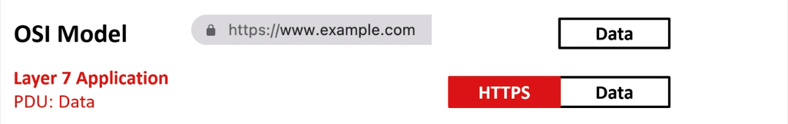

El proceso HTTP encapsula los datos a enviar junto con una cabecera HTTP. El PDU (_Protocolo Data Unit_) son los datos que se envían.
A continuación este PDU se envía a la capa 4 de nivel de transporte, en este caso, al protocolo TCP. El proceso TCP encapsula la cabecera HTTPS incluida en la PDU y le agrega una cabecera TCP. La anterior cabecera HTTPS y los datos anteriores pasan a ser ahora la porción de datos del segmento TCP.

	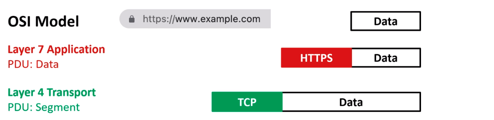

El segmento TCP se envía a la capa 3 de nivel de red al protocolo IPv4, en este caso. El proceso IPv4 encapsula el segmento en la parte de datos y adjunta una cabecera IPv4 al paquete.

	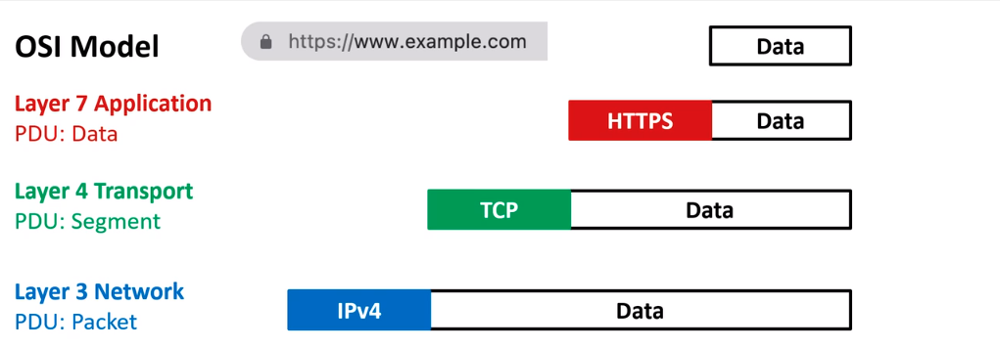

El paquete se envía a la capa 2 de nivel de enlace de datos, Ethernet en el ejemplo. En el proceso se añade al paquete IPv4 la cabecera y cola Ethernet en la trama correspondiente.

	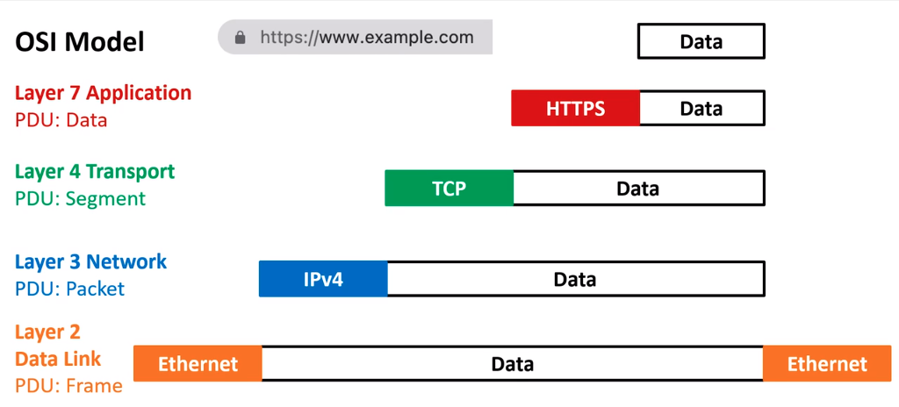

Finalmente, la trama se envía a la NIC para su conversión en una secuencia de bits para ser enviado por el medio en cuestión, ya sea cable o inalámbrico.

	

La porción correspondiente al protocolo y los datos se convierten en la porción de datos en el siguiente protocolo. Acepta la información conjunta de protocolo y datos y los encapsula en su propia porción de datos y añade su propia cabecera. Solo la capa de enlace de datos en el caso de Ethernet incluye información de cola en la trama.

	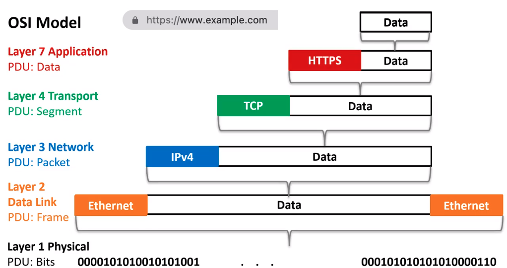

## La Capa de Red
La capa de red, o Capa OSI 3, proporciona servicios para permitir que los dispositivos finales intercambien datos a través de redes. Como se muestra en la figura, IP versión 4 (IPv4) e IP versión 6 (IPv6) son los principales protocolos de comunicación de la capa de red. Otros protocolos de capa de red incluyen protocolos de enrutamiento como Open Shortest Path First (OSPF) y protocolos de mensajería como Internet Control Message Protocol (ICMP).

	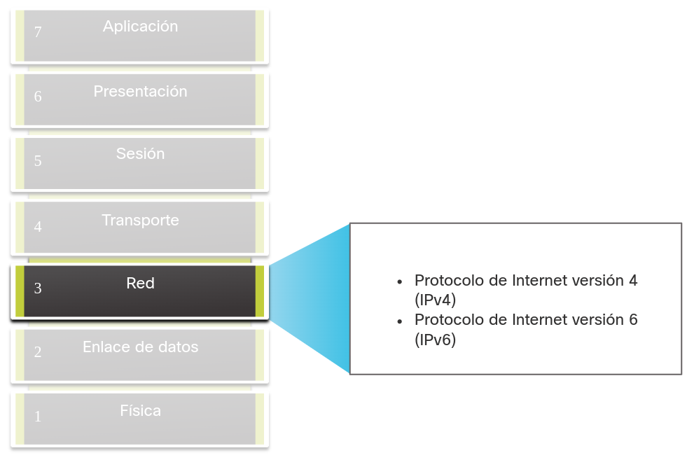

Para lograr comunicaciones punto a punto a través de los límites de la red, los protocolos de la capa de red realizan cuatro operaciones básicas:

* __Direccionamiento de dispositivos finales__. Los dispositivos finales deben configurarse con una dirección IP única para la identificación en la red.
* __Encapsulación__. La capa de red encapsula la unidad de datos de protocolo (PDU _Protocol Data Unit_) de la capa de transporte en un paquete. El proceso de encapsulamiento agrega información del encabezado IP, como la dirección IP de los hosts de origen (emisores) y de destino (receptores). El proceso de encapsulación lo realiza el host fuente del paquete IP.
* __Enrutamiento__. La capa de red proporciona servicios para dirigir los paquetes a un host de destino en otra red. Para transferir un paquete a otras redes, debe procesarlo un router. La función del router es seleccionar la mejor ruta y dirigir los paquetes al host de destino en un proceso que se denomina "enrutamiento". Un paquete puede cruzar muchos routers antes de llegar al host de destino. Se denomina "salto" a cada router que cruza un paquete antes de alcanzar el host de destino.
* __Desencapsulación__. Cuando el paquete llega a la capa de red del host de destino, el host verifica el encabezado IP del paquete. Si la dirección IP de destino dentro del encabezado coincide con su propia dirección IP, se elimina el encabezado IP del paquete. Una vez que la capa de red desencapsula el paquete, la PDU de capa 4 que se obtiene se transfiere al servicio apropiado en la capa de transporte. El proceso de desencapsulación lo realiza el host de destino del paquete IP.

A diferencia de la capa de transporte (Capa OSI 4), que gestiona el transporte de datos entre los procesos que se ejecutan en cada host, los protocolos de comunicación de la capa de red (es decir, IPv4 e IPv6) especifican la estructura de paquetes y el procesamiento utilizado para transportar los datos de un host a otro. La capa de red puede transportar paquetes de varios tipos de comunicación entre varios hosts porque funciona sin tener en cuenta los datos que contiene cada paquete.

	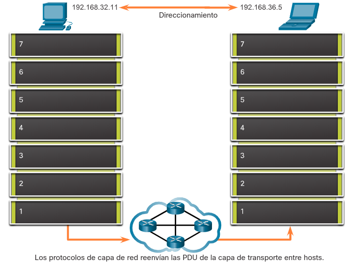
	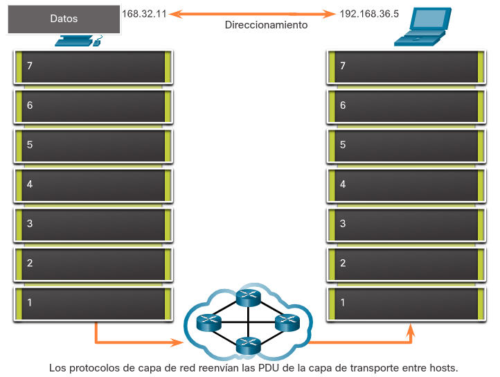
	

	 
	
Los datos generados por la aplicación llegan a la capa de transporte (OSI 4) y se encapsulan en un <b>segmento</b> que se pasa a continuación a la capa de red (OSI 3).

	 
	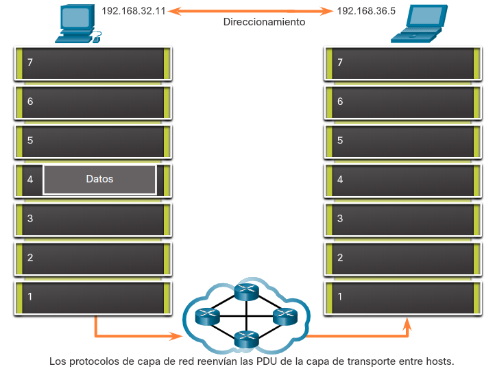
	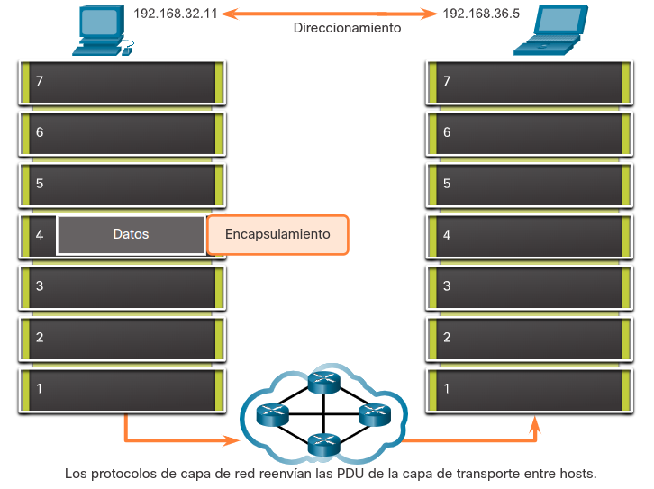
	

	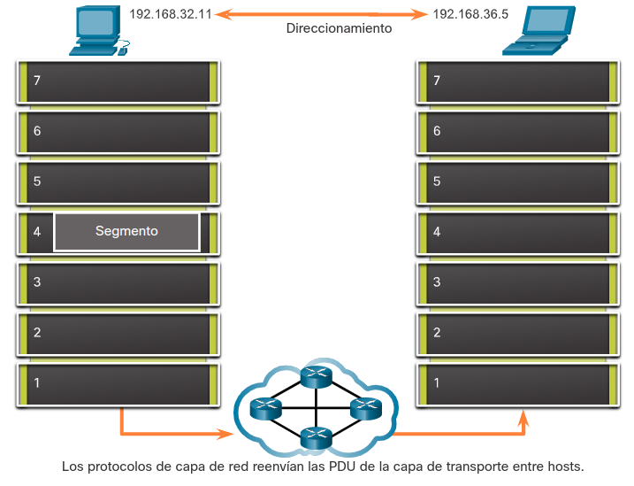
	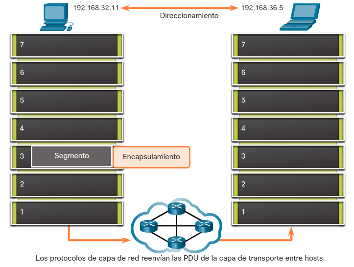
	

	 
	
La encapsulación en la capa de red da como resultado un <b>paquete</b>, que se traspasa a su vez a la capa de enlace de datos.

	 
	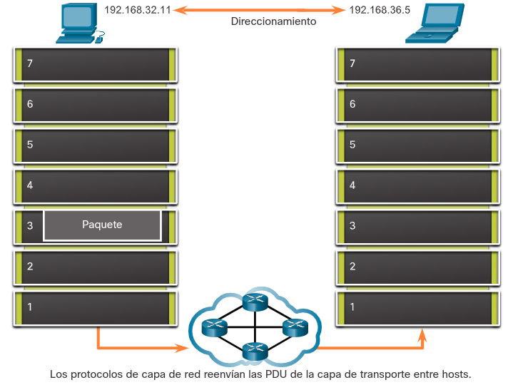
	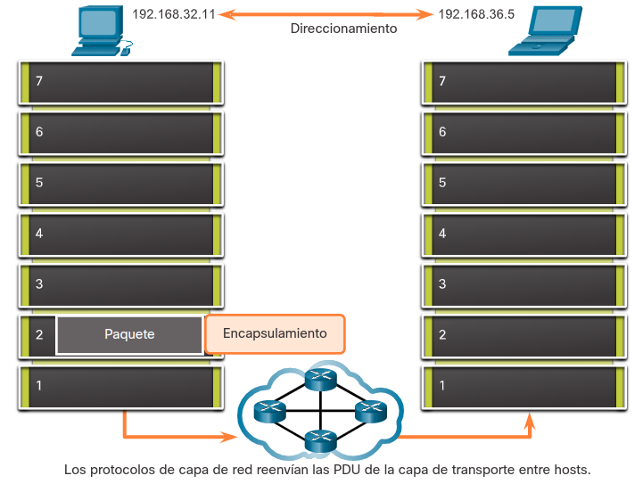
	

	 
	
La capa de enlace de datos encapsula el paquete recibido en una <b>trama</b>, que será recibida por la capa física (OSI 1).

	 
	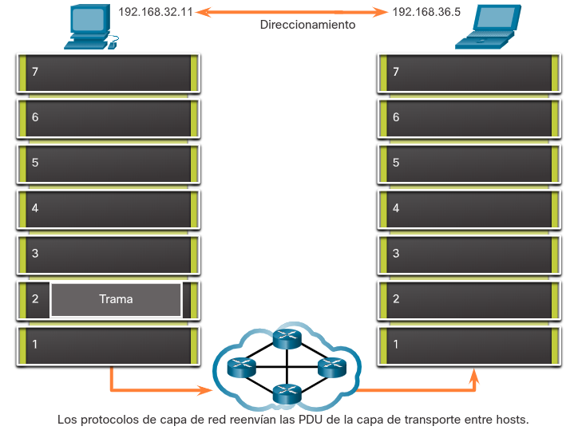
	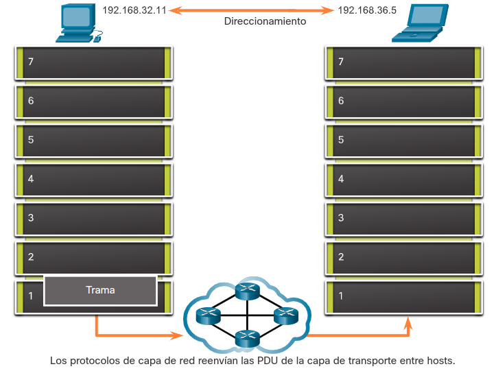
	

	 
	
La capa física ha de transforma dicha trama en las señales apropiadas para su envío por el medio físico correspondiente, al igual que la capa física del host de destino las interpretará para proporcionar una trama comprensible a su capa de enlace de datos.

	 
	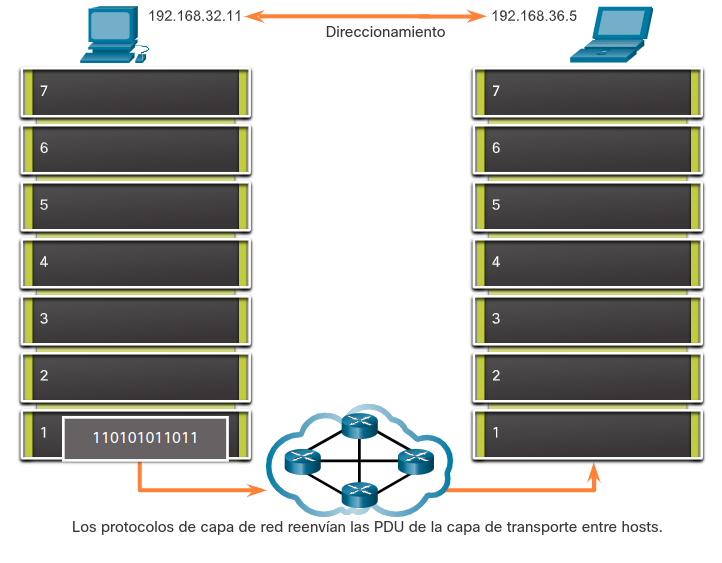
	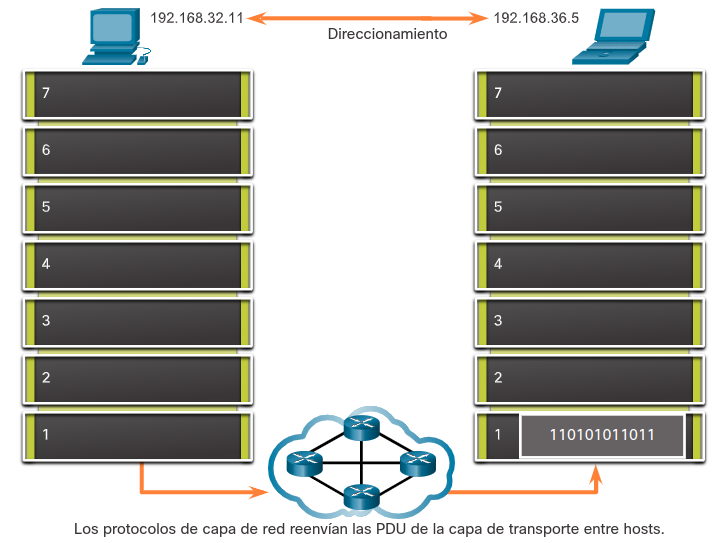
	

	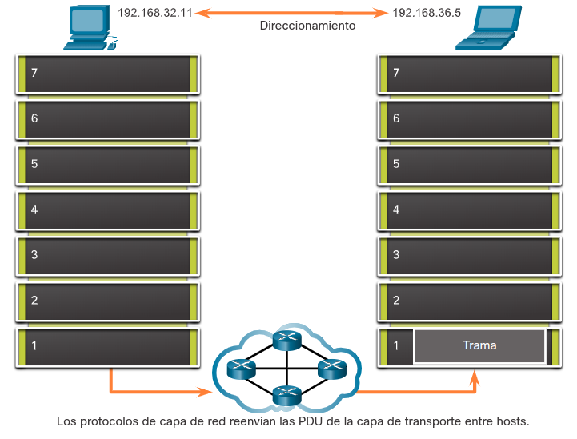
	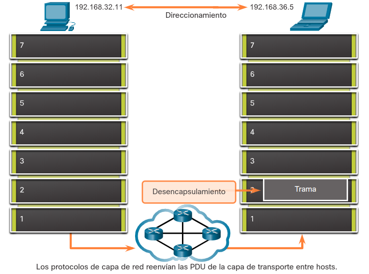
	

	 
	
Así se produce la desencapsulación de la trama en la capa de enlace de datos en el correspondinte paquete a entregar a la capa de red.

	 
	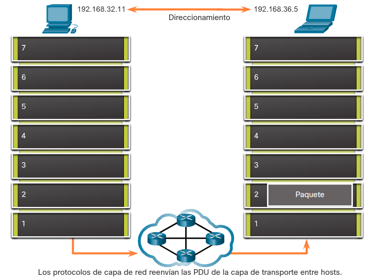
	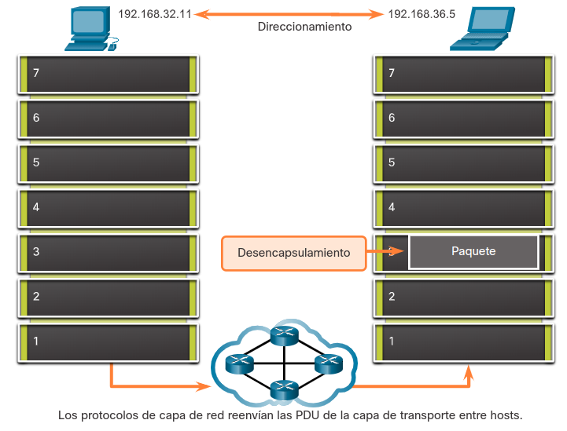
	

	 
	
E igualmente se produce en la capa de red para obtener el segmento necesario para ser interpretado por la capa de transporte a la que se envía.
	
	 
	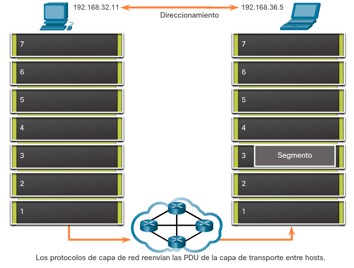
	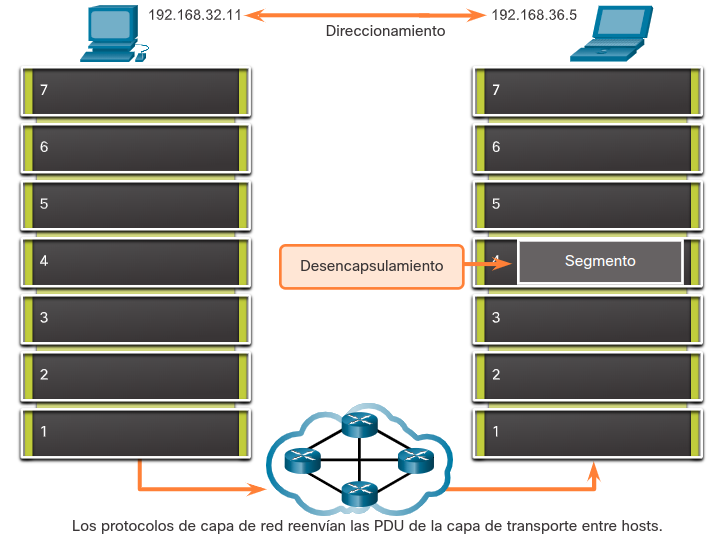
	

	 
	
Finalmente, del segmento se desencapsulan los datos originales a traspasar a las capas superiores.

	 
	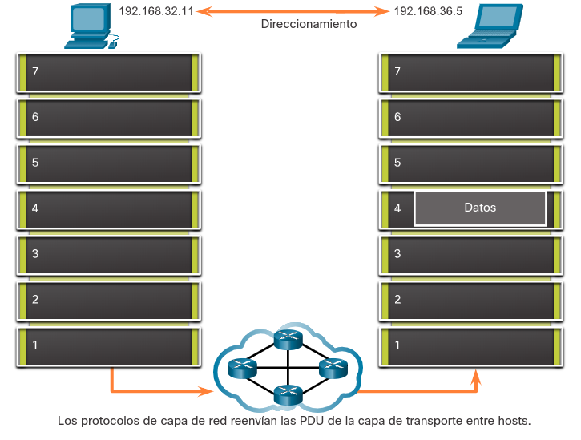
	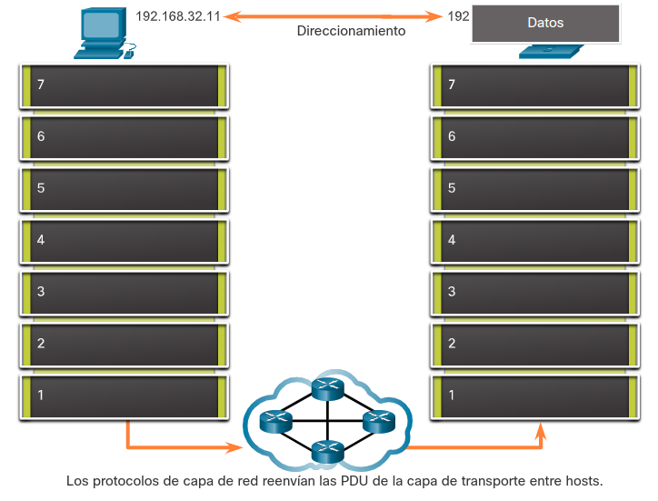
	

## Encapsulación IP
IP encapsula el segmento de la capa de transporte (la capa justo por encima de la capa de red) u otros datos agregando un encabezado IP. El encabezado IP se usa para entregar el paquete al host de destino.
La figura ilustra cómo la PDU de la capa de transporte es encapsulada por la PDU de la capa de red para crear un paquete IP.

	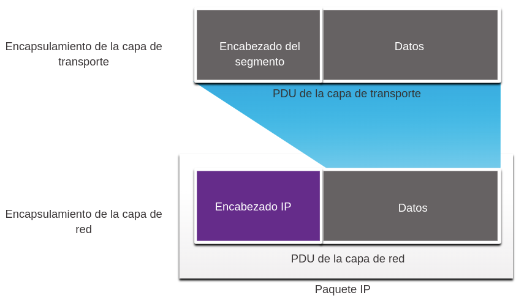

El proceso de encapsulamiento de datos capa por capa permite que se desarrollen y se escalen los servicios en las diferentes capas sin afectar a las otras capas. Esto significa que IPv4 o IPv6 o cualquier protocolo nuevo que se desarrolle en el futuro puede armar sin inconvenientes un paquete con los segmentos de capa de transporte.

El encabezado IP es examinado por dispositivos de Capa 3 (es decir, routers y switches de Capa 3*) a medida que viaja a través de una red a su destino. Es importante tener en cuenta que la información de direccionamiento IP permanece igual desde el momento en que el paquete sale del host de origen hasta que llega al host de destino, excepto cuando se traduce por el dispositivo que realiza la traducción de direcciones de red (NAT) para IPv4.

__Nota__: NAT se discute en módulos posteriores.

Los routers implementan protocolos de enrutamiento para encaminar paquetes entre redes. El enrutamiento realizado por estos dispositivos intermediarios examina el direccionamiento de la capa de red en el encabezado del paquete. En todos los casos, la porción de datos del paquete, es decir, la PDU de la capa de transporte encapsulada u otros datos, permanece sin cambios durante los procesos de la capa de red.

## Características de IP
IP se diseñó como un protocolo con sobrecarga baja. Provee solo las funciones necesarias para enviar un paquete de un origen a un destino a través de un sistema interconectado de redes. El protocolo no fue diseñado para rastrear ni administrar el flujo de paquetes. Estas funciones, si es necesario, están a cargo de otros protocolos en otras capas, principalmente TCP en la capa 4.

Estas son las características básicas de la IP:

* __Sin conexión__. No hay conexión con el destino establecido antes de enviar paquetes de datos.
* __Mejor esfuerzo__. La IP es inherentemente poco confiable porque no se garantiza la entrega de paquetes.
* __Medios independientes__. La operación es independiente del medio (es decir, cobre, fibra óptica o inalámbrico) que transporta los datos.

A menudo, el protocolo IP se describe como un protocolo no confiable o de máximo esfuerzo de entrega. Esto no significa que IP a veces funcione bien y a veces funcione mal, ni que sea un protocolo de comunicación de datos deficiente. "No confiable" significa simplemente que IP no tiene la capacidad de administrar paquetes no entregados o dañados ni de recuperar datos de estos. Esto se debe a que los paquetes IP se envían con información sobre la ubicación de entrega, pero no contienen información que se pueda procesar para informar al emisor si la entrega se realizó correctamente. No se incluyen datos de sincronización en el encabezado del paquete para realizar un seguimiento del orden de entrega de los paquetes. Con el protocolo IP, tampoco hay acuses de recibo de la entrega de los paquetes ni datos de control de errores que permitan realizar un seguimiento de si los paquetes se entregaron sin daños. Los paquetes pueden llegar al destino dañados o fuera de secuencia, o pueden no llegar en absoluto. De acuerdo con la información proporcionada en el encabezado IP, no hay capacidad de retransmisión de paquetes si se producen errores como estos.

Si los paquetes faltantes o que no funcionan generan problemas para la aplicación que usa los datos, los servicios de las capas superiores, como TCP, deben resolver estos problemas. Esto permite que el protocolo IP funcione de forma muy eficaz. Si se incluyera la sobrecarga de confiabilidad en IP, las comunicaciones que no requieren conexión o confiabilidad se cargarían con el consumo de ancho de banda y la demora producidos por esta sobrecarga. En la suite TCP/IP, la capa de transporte puede utilizar el protocolo TCP o UDP, según la necesidad de confiabilidad en la comunicación. Dejar que la capa de transporte decida sobre la confiabilidad hace que el protocolo IP se adapte y se acomode mejor a los distintos tipos de comunicación.

La capa de red tampoco tiene la carga de las características de los medios por los cuales se transportan los paquetes. IP funciona con independencia de los medios que transportan los datos en las capas inferiores del stack de protocolos. Como se muestra en la figura, cualquier paquete IP individual puede ser comunicado eléctricamente por cable, como señales ópticas por fibra, o sin cables como señales de radio.

Es responsabilidad de la capa de enlace de datos del modelo OSI tomar un paquete IP y prepararlo para transmitirlo a través del medio de comunicación. Esto significa que el transporte de paquetes IP no está limitado a un medio en particular.

Sin embargo, existe una característica importante de los medios que la capa de red tiene en cuenta: el tamaño máximo de la PDU que cada medio puede transportar. Esta característica se denomina "unidad máxima de transmisión" (MTU). Parte de la comunicación de control entre la capa de enlace de datos y la capa de red consiste en establecer el tamaño máximo para el paquete. La capa de enlace de datos pasa el valor de MTU a la capa de red. A continuación, la capa de red determina cuán grandes pueden ser los paquetes.

En algunos casos, un dispositivo intermediario, generalmente un router, debe dividir un paquete cuando lo reenvía de un medio a otro con una MTU más pequeña. A este proceso se lo llama fragmentación de paquetes o fragmentación.

## Sin Conexión
IP sin conexión, significa que el protocolo IP no crea una conexión de extremo a extremo dedicada antes de enviar los datos. La comunicación sin conexión es conceptualmente similar a enviar una carta a alguien sin notificar al destinatario por adelantado. La figura resume este punto clave.

	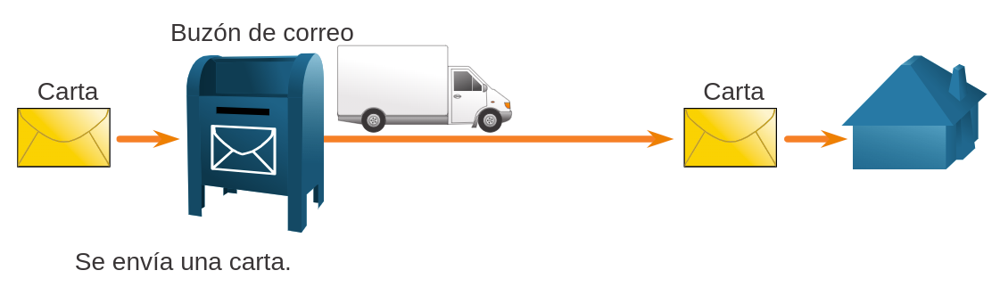

Las comunicaciones de datos sin conexión funcionan con el mismo principio. Como se muestra en la figura, el protocolo IP no requiere un intercambio inicial de información de control para establecer una conexión de extremo a extremo antes de que se reenvíen los paquetes.

	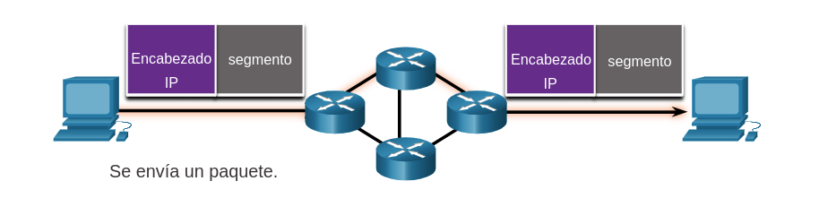

## Mejor Esfuerzo
IP tampoco necesita campos adicionales en el encabezado para mantener una conexión establecida. Este proceso reduce en gran medida la sobrecarga del protocolo IP. Sin embargo, sin una conexión completa preestablecida, los remitentes no saben si los dispositivos de destino están presentes y en funcionamiento cuando envían paquetes, ni tampoco si el destinatario recibe el paquete o si puede acceder al paquete y leerlo.

El protocolo IP no garantiza que todos los paquetes que se envían, de hecho, se reciban. En la ilustración, se muestran las características de entrega de mejor esfuerzo o poco confiable del protocolo IP.

	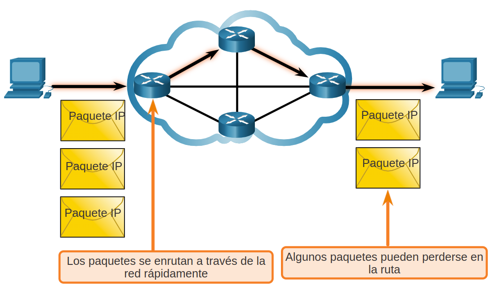

Dado que es un protocolo de capa de red no confiable, IP no garantiza que se reciban todos los paquetes enviados. Otros protocolos administran el proceso de seguimiento de paquetes y de aseguramiento de entrega.

## Independiente de los Medios
Que sea poco confiable significa que el protocolo IP no tiene la capacidad para administrar y recuperar paquetes no recibidos o dañados. Esto se debe a que, si bien los paquetes IP se envían con información sobre la ubicación de la entrega, no contienen información que pueda procesarse para informar al remitente si la entrega fue exitosa. Es posible que los paquetes lleguen dañados o fuera de secuencia al destino o que no lleguen en absoluto. IP no tiene la funcionalidad de retransmitir paquetes si se producen errores.

Las aplicaciones que utilizan los datos o los servicios de capas superiores deben solucionar problemas como el envío de paquetes fuera de orden o la pérdida de paquetes. Esta característica permite que el protocolo IP funcione de manera muy eficaz. En el conjunto de protocolos TCP / IP, la confiabilidad es la función del protocolo TCP en la capa de transporte.

IP funciona independientemente de los medios que transportan los datos en las capas más bajas de la pila de protocolos. Como se muestra en la ilustración, los paquetes IP pueden ser señales electrónicas que se transmiten por cables de cobre, señales ópticas que se transmiten por fibra óptica o inalámbricamente como las señales de radio.

	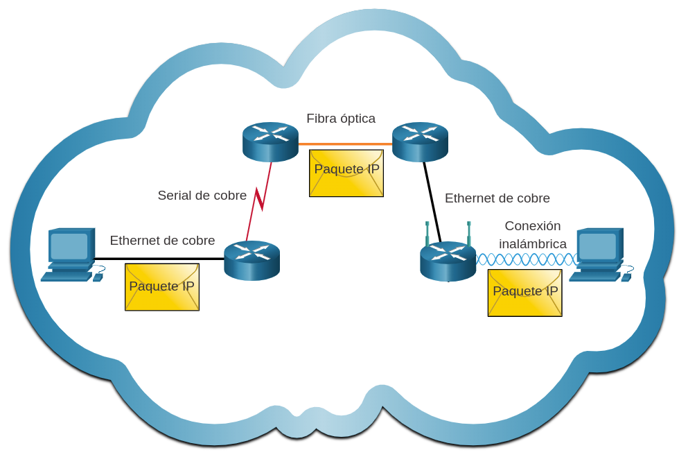

 

Los paquetes IP pueden trasladarse a través de diferentes medios.

La capa de enlace de datos OSI es responsable de tomar un paquete IP y prepararlo para la transmisión a través del medio de comunicaciones. Esto significa que la entrega de paquetes IP no se limita a ningún medio en particular.

Sin embargo, la capa de red tiene en cuenta una de las características más importantes del medio, que es el tamaño máximo de PDU que cada medio puede transportar. Esta característica se conoce como "unidad de transmisión máxima" (MTU). Parte del control de la comunicación entre la capa de enlace de datos y la capa de red consiste en establecer el tamaño máximo del paquete. La capa de enlace de datos pasa el valor de MTU a la capa de red. La capa de red luego determina qué tamaño pueden tener los paquetes.

En algunos casos, un dispositivo intermedio, generalmente un router, debe dividir un paquete IPv4 cuando lo reenvía de un medio a otro con una MTU más pequeña. Este proceso se denomina "fragmentación de paquetes" o "fragmentación". La fragmentación provoca latencia. El router no puede fragmentar los paquetes IPv6.

# Paquete IPv4
## Encabezado del Paquete IPv4
IPv4 es uno de los protocolos de comunicación de la capa de red principal. El encabezado del paquete IPv4 se utiliza para garantizar que este paquete se entrega en su siguiente parada en el camino a su dispositivo final de destino.

El encabezado de paquetes IPv4 consta de campos que contienen información importante sobre el paquete. Estos campos tienen números binarios que examinan el proceso de capa 3.

## Campos del Encabezado del Paquete IPv4
Los valores binarios de cada campo identifican diversos parámetros de configuración del paquete IP. Los diagramas de encabezado del protocolo, que se leen de izquierda a derecha y de arriba hacia abajo, proporcionan una representación visual de consulta al analizar los campos de protocolo. El diagrama de encabezado del protocolo IP en la ilustración identifica los campos de un paquete IPv4.

	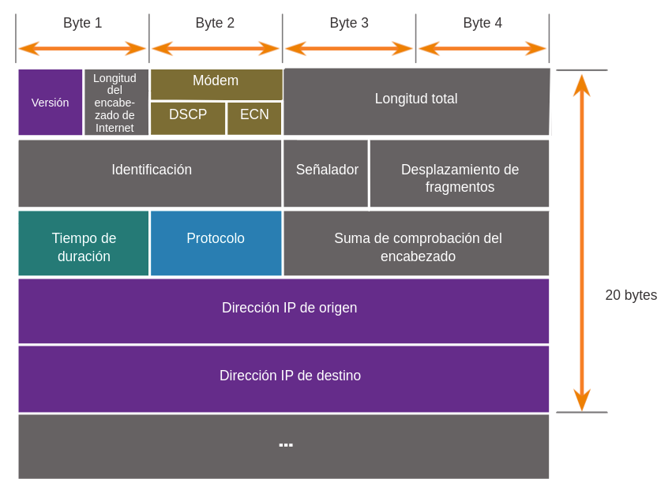

Los campos significativos en el encabezado IPv4 incluyen lo siguiente:

* __Versión__. Contiene un valor binario de 4 bits establecido en 0100 que identifica esto como un paquete IPv4.
* __Servicios Diferenciados o _DiffServ_ (DS)__. Este campo, formalmente conocido como Tipo de servicio (ToS - _Type of Service_), es un campo de 8 bits que se utiliza para determinar la prioridad de cada paquete. Los seis bits más significativos del campo _DiffServ_ son los bits de punto de código de servicios diferenciados (DSCP - _Differentiated Services Code Point_) y los dos últimos bits son los bits de notificación de congestión explícita (ECN - _Explicit Congestion Notification_).
* __Tiempo de Duración (_Time to Live_, TTL)__. El TTL contiene un valor binario de 8 bits que se utiliza para limitar la vida útil de un paquete. El dispositivo de origen del paquete IPv4 establece el valor TTL inicial. Se reduce en uno cada vez que el paquete es procesado por un router. Si el campo TTL llega a cero, el router descarta el paquete y envía a la dirección IP de origen un mensaje de tiempo superado del protocolo de mensajes de control de Internet (ICMP). Debido a que el router disminuye el TTL de cada paquete, el router también debe volver a calcular la suma de comprobación del encabezado.
* __Protocolo__. Este campo se utiliza para identificar el protocolo del siguiente nivel. Este valor binario de 8 bits indica el tipo de carga de datos que lleva el paquete, lo que permite que la capa de red transmita los datos al protocolo de capa superior apropiado. ICMP (1), TCP (6) y UDP (17) son algunos valores comunes.
* __Suma de comprobación de encabezado__. Se utiliza para detectar daños en el encabezado IPv4.
* __Dirección IPv4 de origen__. Contiene un valor binario de 32 bits que representa la dirección IPv4 de origen del paquete. La dirección IPv4 de origen es siempre una dirección unicast.
* __Dirección IPv4 de destino__. Contiene un valor binario de 32 bits que representa la dirección IPv4 de destino del paquete. La dirección IPv4 de destino es una dirección unicast, multicast o de difusión.

Los dos campos a los que se hace más referencia son los de dirección IP de origen y de destino En estos campos, se identifica de dónde viene el paquete y a dónde va. Por lo general, estas direcciones no cambian mientras se viaja desde el origen hasta el destino.

Los campos __Longitud de encabezado de Internet (IHL)__, __Longitud total__ y __Suma de comprobación__ del encabezado se utilizan para identificar y validar el paquete.

Para reordenar un paquete fragmentado, se usan otros campos. Específicamente, el paquete IPv4 utiliza los campos de identificación, señaladores y desplazamiento de fragmentos para llevar un control de los fragmentos. Un router puede tener que fragmentar un paquete IPv4 cuando lo reenvía de un medio a otro con una MTU más pequeña.

Los campos __Opciones__ y __Relleno__ rara vez se usan y están fuera del alcance de este módulo.

# Paquete IPv6
## Limitaciones de IPv4
IPv4 todavía está en uso hoy en día. Este tema trata sobre IPv6, que eventualmente reemplazará a IPv4. Para comprender mejor por qué necesita conocer el protocolo IPv6, ayuda a conocer las limitaciones de IPv4 y las ventajas de IPv6.

A lo largo de los años, se han elaborado protocolos y procesos adicionales para hacer frente a los nuevos desafíos. Sin embargo, incluso con los cambios, IPv4 aún tiene tres grandes problemas:

* __Agotamiento de la dirección IPv4__. IPv4 tiene un número limitado de direcciones públicas únicas disponibles. Si bien hay aproximadamente 4000 millones de direcciones IPv4, el incremento en la cantidad de dispositivos nuevos con IP habilitado, las conexiones constantes y el crecimiento potencial de regiones menos desarrolladas aumentaron la necesidad de direcciones.
* __Falta de conectividad de extremo a extremo__. La traducción de direcciones de red (NAT) es una tecnología comúnmente implementada dentro de las redes IPv4. NAT proporciona una manera para que varios dispositivos compartan una única dirección IPv4 pública. Sin embargo, dado que la dirección IPv4 pública se comparte, se oculta la dirección IPv4 de un host de la red interna. Esto puede ser un problema para las tecnologías que necesitan conectividad completa.
* __Mayor complejidad de la red__. Mientras que NAT ha ampliado la vida útil de IPv4, solo se trataba de un mecanismo de transición a IPv6. NAT en sus diversas implementaciones crea una complejidad adicional en la red, creando latencia y haciendo más difícil la solución de problemas.

## Descripción General de IPv6
A principios de la década de 1990, los problemas con IPv4 preocuparon al Grupo de trabajo de ingeniería de Internet (IETF) que, en consecuencia, comenzó a buscar un reemplazo. Esto tuvo como resultado el desarrollo de IP versión 6 (IPv6). IPv6 supera las limitaciones de IPv4 y representa una mejora importante con características que se adaptan mejor a las demandas de red actuales y previsibles.

Las mejoras que ofrece IPv6 incluyen las siguientes:

* __Mayor Espacio de Direcciones__. Las direcciones IPv6 se basan en direcciones jerárquicas de 128 bits en lugar de IPv4 con 32 bits.
* __Manejo de Paquetes Mejorado__. El encabezado de IPv6 se ha simplificado con menos campos.
* __Elimina la necesidad de NAT__. Con una cantidad tan grande de direcciones IPv6 públicas, no se necesita NAT entre una dirección IPv4 privada y una IPv4 pública. Esto evita algunos de los problemas inducidos por NAT que experimentan las aplicaciones que requieren conectividad de extremo a extremo.

El espacio de las direcciones IPv4 de 32 bits ofrece aproximadamente 4.294.967.296 direcciones únicas. El espacio de direcciones IPv6 proporciona 340,282,366,920,938,463,463,374,607,431,768,211,456, o 340 undecillones de direcciones. Esto es aproximadamente equivalente a cada grano de arena en la Tierra.

En la ilustración, se puede ver una comparación entre el espacio de direcciones IPv4 e IPv6.

	

	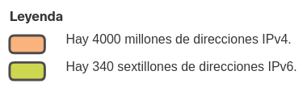

## Campos del Encabezado del Paquete IPv4 en el Encabezado del Paquete IPv6
Uno de las mejoras de diseño más importantes de IPv6 con respecto a IPv4 es el encabezado simplificado de IPv6.

Por ejemplo, el encabezado IPv4 consiste en un encabezado de longitud variable de 20 octetos (hasta 60 bytes si se usa el campo Opciones) y 12 campos de encabezado básicos, sin incluir el campo Opciones y el campo Relleno.

Para IPv6, algunos campos se han mantenido igual, algunos campos han cambiado de nombre y posición, y algunos campos de IPv4 ya no son necesarios, como se destaca en la figura.

	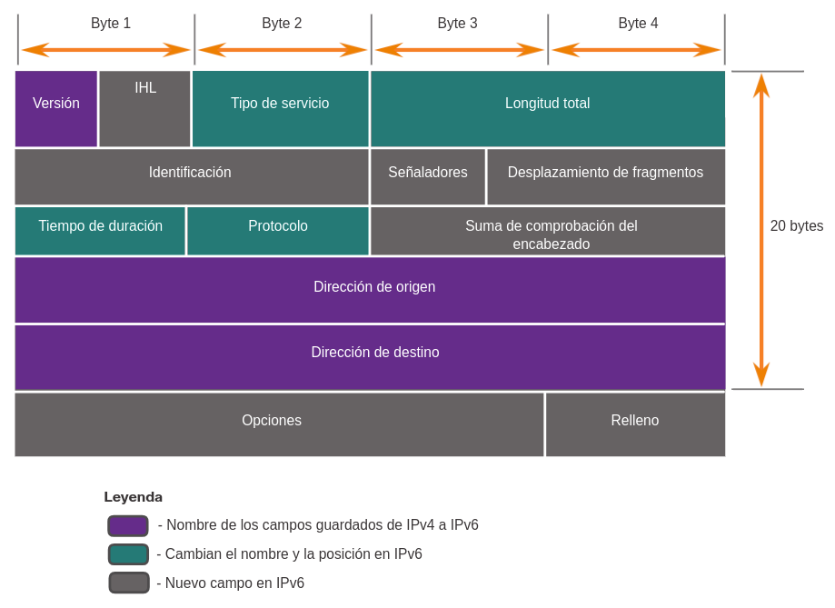

La figura muestra los campos de encabezado de paquete IPv4 que se mantuvieron, movieron, cambiaron, así como aquellos que no se mantuvieron en el encabezado de paquete IPv6.

En contraste, el encabezado IPv6 simplificado que se muestra en la siguiente figura consiste en un encabezado de longitud fija de 40 octetos (en gran parte debido a la longitud de las direcciones IPv6 de origen y destino).

El encabezado simplificado IPv6 permite un procesamiento más eficiente de encabezados IPv6.

	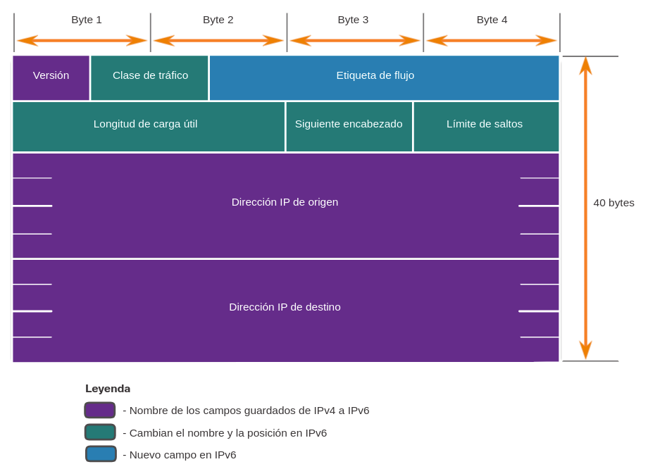

## Encabezado del Paquete IPv6
El diagrama de encabezado del protocolo IP en la ilustración identifica los campos de un paquete IPv6.

	

Los campos en el encabezado del paquete IPv6 incluyen lo siguiente:

* __Versión__. Este campo contiene un valor binario de 4 bits establecido en 0110 que identifica esto como un paquete IP versión 6.
* __Clase de Tráfico__. Este campo de 8 bits es el equivalente al campo Servicios Diferenciados (DS) de IPv4.
* __Etiqueta de Flujo__. Este campo de 20 bits sugiere que todos los routers manipulen del mismo modo los paquetes con la misma etiqueta de flujo.
* __Longitud de Carga Útil__. Este campo de 16 bits indica la longitud de la parte de los datos o la carga útil del paquete IPv6. Esto no incluye la longitud del encabezado IPv6, que es un encabezado fijo de 40 bytes.
* __Siguiente Encabezado__. Este campo de 8 bits equivale al campo Protocolo IPv4. Es un valor que indica el tipo de contenido de datos que lleva el paquete, lo que permite que la capa de red transmita la información al protocolo de capa superior apropiado.
* __Límite de Saltos__. Este campo de 8 bits reemplaza al campo TTL de IPv4. Cada router que reenvía el paquete reduce este valor en 1. Cuando el contador llega a 0, el paquete se descarta y se reenvía un mensaje ICMPv6 de tiempo excedido al host emisor. Esto indica que el paquete no llegó a su destino porque se excedió el límite de saltos. A diferencia de IPv4, IPv6 no incluye una suma de comprobación de encabezado IPv6, ya que esta función se realiza tanto en las capas inferior como superior. Esto significa que la suma de comprobación no necesita ser recalculada por cada router cuando disminuye el campo Límite de saltos, lo que también mejora el rendimiento de la red.
* __Dirección IPv6 de Origen__. Este campo de 128 bits identifica la dirección IPv6 del host emisor.
* __Dirección IPv6 de Destino__. Este campo de 128 bits identifica la dirección IPv6 del host receptor.

Un paquete IPv6 también puede contener encabezados de extensión (EH), que proveen información optativa de la capa de red. Los encabezados de extensión son opcionales y están ubicados entre el encabezado de IPv6 y el contenido. Los EH se usan para fragmentar, dar seguridad, admitir la movilidad y otras acciones.

A diferencia de IPv4, los routers no fragmentan de los paquetes IPv6 enrutados.

# Resumen
## Características de la capa de red
La capa de red, o Capa OSI 3, proporciona servicios para permitir que los dispositivos finales intercambien datos a través de redes. IPv4 e IPv6 son los principales protocolos de comunicación de la capa de red. Otros protocolos de capa de red incluyen protocolos de enrutamiento como OSPF y protocolos de mensajería como ICMP.

Los protocolos de capa de red realizan cuatro operaciones: direccionamiento de dispositivos finales, encapsulación, enrutamiento y desencapsulación. IPv4 e IPv6 especifican la estructura de paquetes y el procesamiento utilizado para transportar los datos de un host a otro. La capa de red puede transportar paquetes de varios tipos de comunicación entre varios hosts porque funciona sin tener en cuenta los datos que contiene cada paquete.

Para encapsular el segmento de capa de transporte u otros datos, a la IP le agrega un encabezado IP. El encabezado IP se usa para entregar el paquete al host de destino. El encabezado IP es examinado por enrutadores y conmutadores de capa 3 a medida que viaja a través de una red hasta su destino. La información de direccionamiento IP permanece igual desde el momento en que el paquete sale del host de origen hasta que llega al host de destino, excepto cuando la traduce el dispositivo que realiza NAT para IPv4.

Las características de la IP son que es: sin conexión, el mejor esfuerzo e independiente de los medios de comunicación. IP sin conexión, significa que el protocolo IP no crea una conexión de extremo a extremo dedicada antes de enviar los datos. IP no necesita campos adicionales en el encabezado para mantener una conexión establecida. Este proceso reduce la sobrecarga del protocolo IP. Los remitentes no saben si los dispositivos de destino están presentes y en funcionamiento cuando envían paquetes, ni tampoco si el destinatario recibe el paquete o si puede acceder al paquete y leerlo. IP funciona independientemente de los medios que transportan los datos en las capas más bajas de la pila de protocolos. Los paquetes IP pueden ser comunicados por medio de señales electrónicas que se transmiten por cables de cobre, señales ópticas que se transmiten por fibra óptica o señales de radio inalámbricas. Una característica de los medios que considera la capa de red es el tamaño máximo de la PDU que cada medio puede transportar, o la MTU.

## Paquete IPv4
El encabezado del paquete IPv4 se utiliza para garantizar que un paquete se entrega a su siguiente parada en el camino a su dispositivo final de destino. Un encabezado de paquete IPv4 consiste en campos que contienen números binarios que son examinados por el proceso de Capa 3. Los campos significativos en el encabezado de IPv4 incluyen: versión, DS, TTL, protocolo, suma de verificación del encabezado, dirección IPv4 de origen y dirección IPv4 de destino.
Los campos Longitud de Encabezado de Internet (IHL), Longitud Total y Suma de Comprobación del Encabezado se utilizan para identificar y validar el paquete. El paquete IPv4 utiliza los campos de Identificación, Señaladores y Desplazamiento de Fragmentos para llevar un control de los fragmentos. Un router puede tener que fragmentar un paquete IPv4 cuando lo reenvía de un medio a otro con una MTU más pequeña.

## Paquete IPv6
IPv4 tiene limitaciones, que incluyen: agotamiento de direcciones IPv4, falta de conectividad de extremo a extremo y una mayor complejidad de la red. IPv6 vence las limitaciones de IPv4. Las mejoras que ofrece IPv6 incluyen lo siguiente: mayor espacio de direcciones, mejor manejo de paquetes y elimina la necesidad de NAT.

El espacio de las direcciones IPv4 de 32 bits ofrece aproximadamente 4.294.967.296 direcciones únicas. El espacio de direcciones IPv6 proporciona 340,282,366,920,938,463,463,374,607,431,768,211,456, o 340 undecillones de direcciones. Esto es aproximadamente equivalente a cada grano de arena en la Tierra.

Los campos de encabezado simplificados de IPv6 incluyen: versión, clase de tráfico, etiqueta de flujo, longitud de carga útil, siguiente encabezado, límite de salto, dirección IP de origen y dirección IP de destino. Un paquete IPv6 también puede contener Encabezados de Extensión (EH), que proveen información opcional de la capa de red. Los encabezados de extensión son opcionales y están ubicados entre el encabezado de IPv6 y el contenido. Los EH se usan para fragmentar, dar seguridad, admitir la movilidad y otras acciones. A diferencia de IPv4, los routers no fragmentan de los paquetes IPv6 enrutados.

# Enlaces de interés
* <a href="https://study-ccna.com/csma-cd/" target="_blank">CSMA/CD</a>
* <a href="https://study-ccna.com/ndp-neighbor-discovery-protocol/" target="_blank">IPv6 Neighbour Discovery Protocol (NDP)</a>
* <a href="https://www.blackbox.com/es-es/insights/blackbox-explains/inner/detail/redes/conectividad/conmutadores-de-capa-2-capa-3-y-capa-4" target="_blank">Conmutadores de capa 2, capa 3 y capa 4</a>
* <a href="https://community.fs.com/es/article/layer-2-switch-vs-layer-3-switch-what-is-the-difference.html" target="_blank">Diferencias entre conmutadores de capa 2 y capa 3</a>
* <a href="https://linuxreviews.org/Type_of_Service_(ToS)_and_DSCP_Values" target="_blank">Type of Service (ToS) and DSCP Values</a>
* <a href="https://www.juniper.net/documentation/us/en/software/junos/cos/topics/concept/cos-qfx-series-explicit-congestion-notification-understanding.html" target="_blank">Understanding CoS Explicit Congestion Notification</a>
 
 
 
 
 
 
<a href="#5-la-capa-de-red">⬆️</a>
<a href="./00-Curso.md"><< Menú principal del módulo</a>