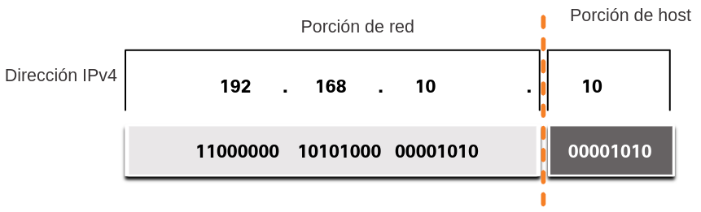
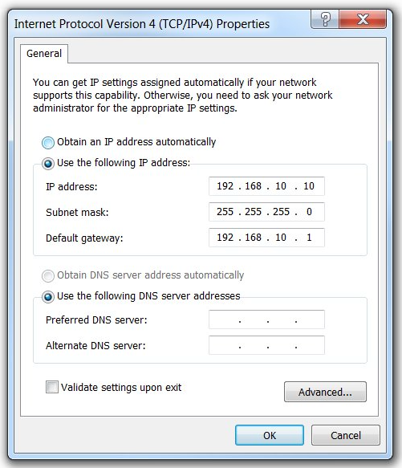
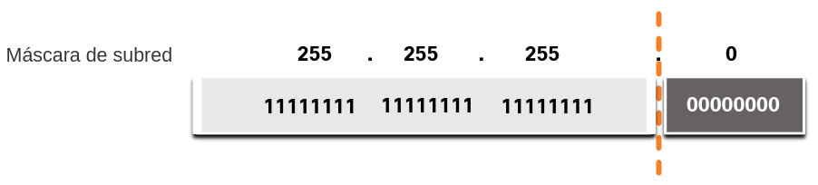
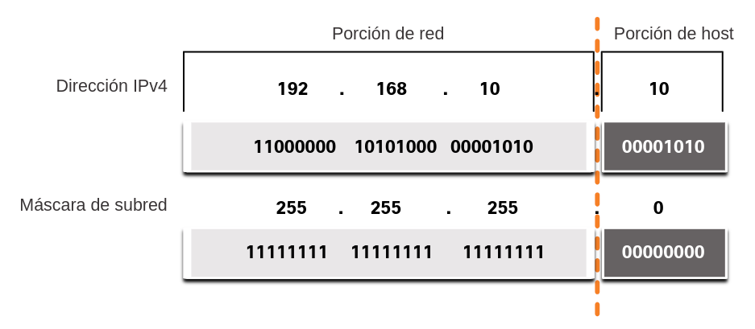
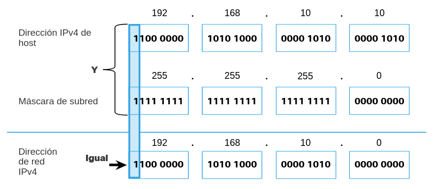

<a href="./00-Curso.md"><< Menú principal del módulo</a>

# 6. Estructura de la dirección IPv4
## Porciones de Red y de Host
Una dirección IPv4 es una dirección jerárquica de 32 bits que se compone de una porción de red y una porción de host. Al determinar la porción de red frente a la porción del host, debe mirar la secuencia de 32 bits, como se muestra en la figura.

	

Los bits dentro de la porción de red de la dirección deben ser idénticos para todos los dispositivos que residen en la misma red. Los bits dentro de la porción de host de la dirección deben ser únicos para identificar un host específico dentro de una red. Si dos hosts tienen el mismo patrón de bits en la porción de red especificada de la secuencia de 32 bits, esos dos hosts residen en la misma red.

¿Pero cómo saben los hosts qué porción de los 32 bits identifica la red y qué porción identifica el host? El rol de la máscara de subred

## La Máscara de Subred
Como se muestra en la figura, asignar una dirección IPv4 a un host requiere lo siguiente:

* __Dirección IPv4__. Esta es la dirección IPv4 única del host.
* __Máscara de subred__. Se usa para identificar la parte de red/host de la dirección IPv4.

	

__Nota__: Se requiere una dirección IPv4 de puerta de enlace (gateway) predeterminada para llegar a redes remotas y se requieren direcciones IPv4 del servidor DNS para traducir nombres de dominio a direcciones IPv4.

La máscara de subred IPv4 se usa para diferenciar la porción de red de la porción de host de una dirección IPv4. Cuando se asigna una dirección IPv4 a un dispositivo, la máscara de subred se usa para determinar la dirección de red del dispositivo. La dirección de red representa todos los dispositivos de la misma red.

La siguiente figura muestra la máscara de subred de 32 bits en formato decimal y binario punteado.

	

Observe cómo la máscara de subred es una secuencia consecutiva de bits "1" seguida de una secuencia consecutiva de bits "0".

Para identificar las porciones de red y host de una dirección IPv4, la máscara de subred se compara con la dirección IPv4 bit por bit, de izquierda a derecha como se muestra en la figura.

	

Tenga en cuenta que la máscara de subred en realidad no contiene la porción de red o host de una dirección IPv4, solo le dice a la computadora dónde buscar la parte de la dirección IPv4 que es la porción de red y qué parte es la porción de host.

El proceso real que se usa para identificar la porción de red y la porción de host se denomina AND.

## La Longitud del Prefijo
Puede ser difícil expresar direcciones de red y de host con la dirección de la máscara de subred decimal punteada. Afortunadamente, hay un método alternativo para identificar una máscara de subred, un método llamado longitud del prefijo.

La longitud del prefijo es el número de bits establecidos en 1 en la máscara de subred. Está escrito en "notación de barra", que se observa mediante una barra diagonal (/) seguida del número de bits establecidos en 1. Por lo tanto, cuente el número de bits en la máscara de subred y anteponga una barra diagonal.

Consulte la tabla para ver ejemplos. En la primera columna, se enumeran varias máscaras de subred que se pueden usar con una dirección de host. En la segunda columna, se muestra la dirección binaria de 32 bits convertida. En la última columna, se muestra la longitud de prefijo resultante.

| **Máscara de Subred** | **Dirección de 32 bits** | **Longitud del Prefijo** |
| :-- | -- | --: |
|255.0.0.0|`11111111.00000000.00000000.00000000`|/8|
|255.255.0.0|`11111111.11111111.00000000.00000000`|/16|
|255.255.255.0|`11111111.11111111.11111111.00000000`|/24|
|255.255.255.128|`11111111.11111111.11111111.10000000`|/25|
|255.255.255.192|`11111111.11111111.11111111.11000000`|/26|
|255.255.255.224|`11111111.11111111.11111111.11100000`|/27|
|255.255.255.240|`11111111.11111111.11111111.11110000`|/28|
|255.255.255.248|`11111111.11111111.11111111.11111000`|/29|
|255.255.255.252|`11111111.11111111.11111111.11111100`|/30|

__Nota__: Una dirección de red también se conoce como prefijo o prefijo de red. Por lo tanto, la longitud del prefijo es el número de bits "1" en la máscara de subred.

Al representar una dirección IPv4 utilizando una longitud de prefijo, la dirección IPv4 se escribe seguida de la longitud del prefijo sin espacios. Por ejemplo, `192.168.10.10` `255.255.255.0` se escribiría como `192.168.10.10/24`. Más adelante se analiza el uso de varios tipos de longitudes de prefijo. Por ahora, el foco estará en el prefijo `/24` (es decir, `255.255.255.0`).

## Determinación de la Red: AND lógico
Un AND lógico es una de las tres operaciones booleanas utilizadas en la lógica booleana o digital. Las otras dos son OR y NOT. La operación AND se usa para determinar la dirección de red.

el AND lógico es la comparación de dos bits que producen los resultados que se muestran a continuación. Observe que solo mediante 1 AND 1 se obtiene 1. Cualquier otra combinación da como resultado un 0.

* `1 & 1 = 1`
* `0 & 1 = 0`
* `1 & 0 = 0`
* `0 & 0 = 0`

__Nota__: En la lógica digital, 1 representa True y 0 representa False Cuando se utiliza una operación AND, ambos valores de entrada deben ser True (1) para que el resultado sea True (1).

Para identificar la dirección de red de un host IPv4, se recurre a la operación lógica AND para la dirección IPv4, bit por bit, con la máscara de subred. El uso de la operación AND entre la dirección y la máscara de subred produce la dirección de red.

Para ilustrar cómo se usa AND para descubrir una dirección de red, considere un host con dirección IPv4 192.168.10.10 y una máscara de subred de 255.255.255.0, como se muestra en la figura:

* __Dirección de hostIPv4 (192.168.10.10)__. La dirección IPv4 del host en formato decimal y binario punteados.
* __Máscara de subred (255.255.255.0)__. La máscara de subred del host en formatos decimales y binarios punteados.
* __Dirección de red (192.168.10.0)__. La operación AND lógica entre la dirección IPv4 y la máscara de subred da como resultado una dirección de red IPv4 que se muestra en formato decimal y binario punetados.

	

Utilizando la primera secuencia de bits como ejemplo, observe que la operación AND se realiza en el bit 1 de la dirección del host con el bit 1 de la máscara de subred. Esto resulta en un bit "1" para la dirección de red. 1 AND 1 = 1.

La operación AND entre una dirección de host IPv4 y una máscara de subred da como resultado la dirección de red IPv4 para este host. En este ejemplo, la operación AND entre la dirección host 192.168.10.10 y la máscara de subred 255.255.255.0 (/24) da como resultado la dirección de red IPv4 192.168.10.0/24. Esta es una operación IPv4 importante, ya que le dice al host a qué red pertenece.

# Resumen
Una dirección IPv4 es una dirección jerárquica de 32 bits que se compone de una porción de red y una porción de host. Al determinar la porción de red frente a la porción de host, debe mirar la secuencia de 32 bits. Los bits dentro de la porción de red de la dirección deben ser idénticos para todos los dispositivos que residen en la misma red. Los bits dentro de la porción de host de la dirección deben ser únicos para identificar un host específico dentro de una red. Si dos hosts tienen el mismo patrón de bits en la porción de red especificada de la secuencia de 32 bits, esos dos hosts residen en la misma red.

La máscara de subred IPv4 se usa para diferenciar la porción de red de la porción de host de una dirección IPv4. Cuando se asigna una dirección IPv4 a un dispositivo, la máscara de subred se usa para determinar la dirección de red del dispositivo. La dirección de red representa todos los dispositivos de la misma red.

Un método alternativo para identificar una máscara de subred, un método llamado longitud de prefijo. La longitud del prefijo es el número de bits establecidos en 1 en la máscara de subred. Está escrito en "notación de barra", que se observa mediante una barra diagonal (/) seguida del número de bits establecidos en 1. Por ejemplo, 192.168.10.10 255.255.255.0 se escribiría como 192.168.10.10/24.

La operación AND se usa para determinar la dirección de red. La operación lógica AND es la comparación de dos bits. Observe que solo mediante 1 AND 1 se obtiene 1. Cualquier otra combinación da como resultado un 0.

Para identificar la dirección de red de un host IPv4, se recurre a la operación lógica AND para la dirección IPv4, bit por bit, con la máscara de subred. El uso de la operación AND entre la dirección y la máscara de subred produce la dirección de red.

# Enlaces de interés
 
 
 
 
 
 
<a href="#6-estructura-de-la-dirección-ipv4">⬆️</a>
<a href="./00-Curso.md"><< Menú principal del módulo</a>