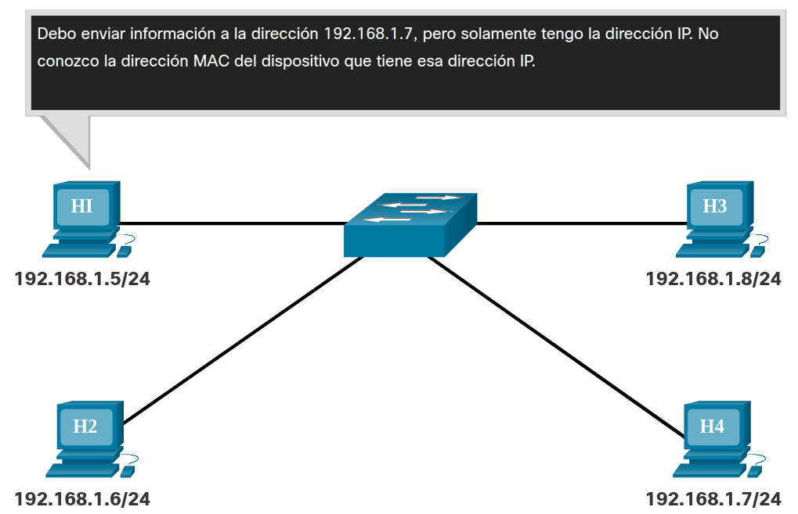
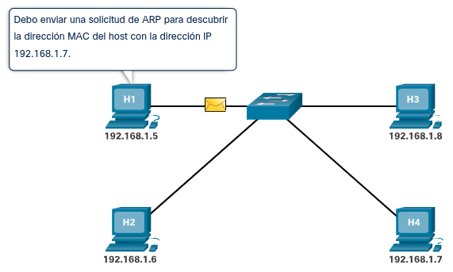
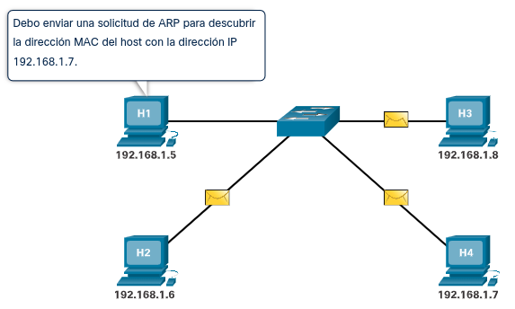
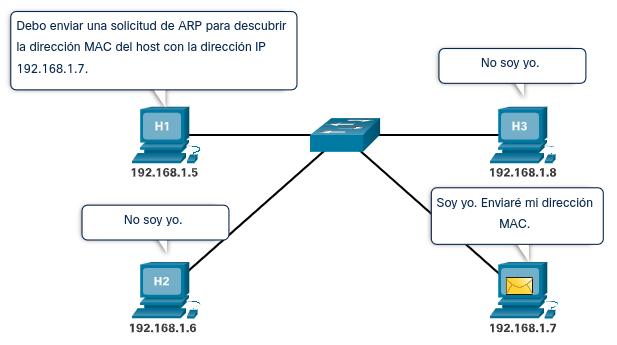
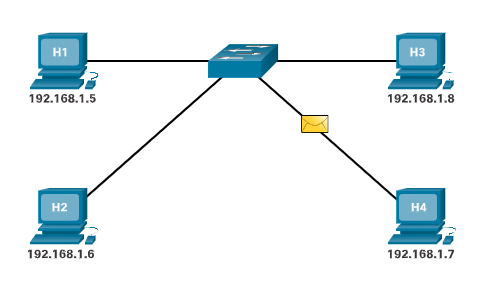
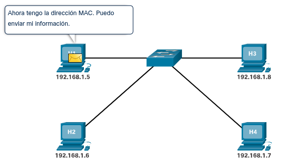
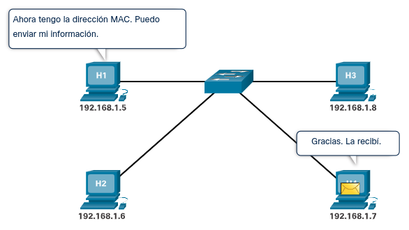
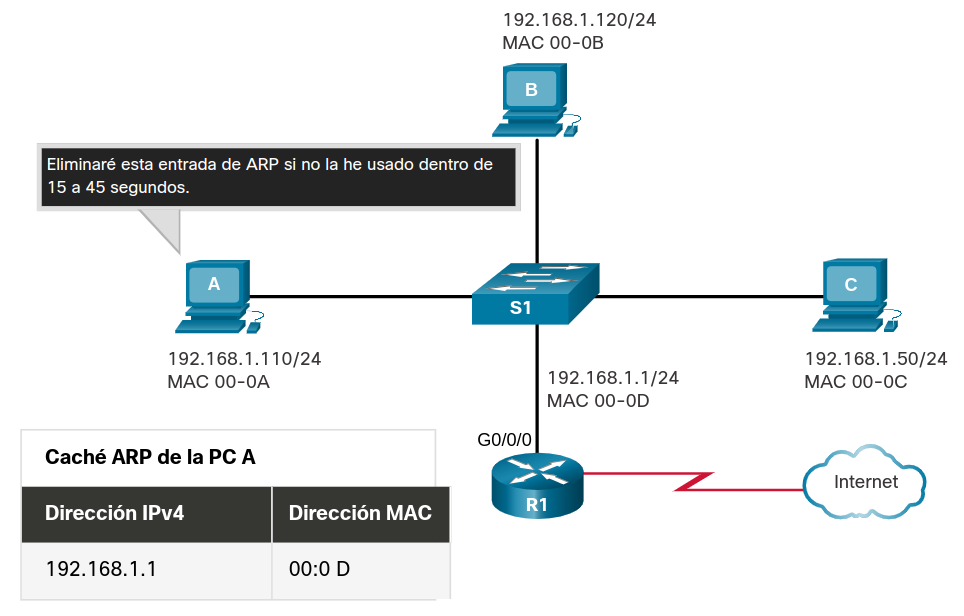
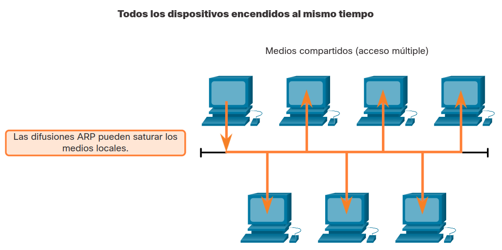
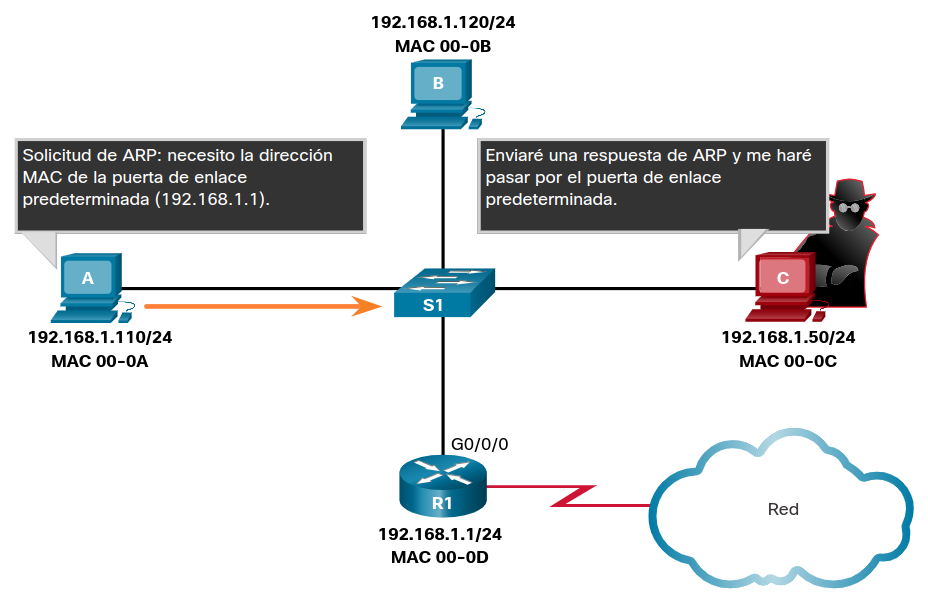

<a href="./00-Curso.md"><< Menú principal del módulo</a>

# 7. Resolución de direcciones
# ARP
## Descripción General de ARP
Si su red utiliza el protocolo de comunicaciones IPv4, el protocolo de resolución de direcciones o ARP es lo que necesita para asignar direcciones IPv4 a direcciones MAC. En este tema se explica cómo funciona ARP.

Cada dispositivo IP de una red Ethernet tiene una dirección MAC Ethernet única. Cuando un dispositivo envía una trama de capa 2 de Ethernet, contiene estas dos direcciones:

* Dirección MAC de destino - La dirección MAC Ethernet del dispositivo de destino en el mismo segmento de red local. Si el host de destino está en otra red, entonces la dirección de destino en el trama sería la del gateway predeterminado (es decir, router).
* Dirección MAC de origen - La dirección MAC de la NIC de Ethernet en el host de origen.

La figura ilustra el problema al enviar una trama a otro host en el mismo segmento en una red IPv4.

<div style="width: 40%;padding-left: 25%;">
	
</div><br />

Para enviar un paquete a otro host en la misma red IPv4 local, un host debe conocer la dirección IPv4 y la dirección MAC del dispositivo de destino. Las direcciones IPv4 de destino del dispositivo se conocen o se resuelven por el nombre del dispositivo. Sin embargo, las direcciones MAC deben ser descubiertas.

Un dispositivo utiliza el Protocolo de resolución de direcciones (ARP) para determinar la dirección MAC de destino de un dispositivo local cuando conoce su dirección IPv4.

ARP proporciona dos funciones básicas:
* Resolución de direcciones IPv4 a direcciones MAC
* Mantener una tabla de asignaciones de direcciones IPv4 a MAC

## Funciones de ARP
Cuando se envía un paquete a la capa de enlace de datos para encapsularlo en una trama de Ethernet, el dispositivo consulta una tabla en su memoria para encontrar la dirección MAC que está asignada a la dirección IPv4. Esta tabla se almacena temporalmente en la memoria RAM y se denomina __tabla o caché ARP__.

El dispositivo emisor busca en su tabla ARP la dirección IPv4 de destino y la dirección MAC correspondiente.

* Si la dirección IPv4 de destino del paquete está en la misma red que la dirección IPv4 de origen, el dispositivo busca la dirección IPv4 de destino en la tabla ARP.
* Si la dirección IPv4 de destino está en una red diferente que la dirección IPv4 de origen, el dispositivo busca la dirección IPv4 del gateway predeterminado.

En ambos casos, se realiza una búsqueda de la dirección IPv4 y la dirección MAC correspondiente para el dispositivo.

En cada entrada o fila de la tabla ARP, se enlaza una dirección IPv4 con una dirección MAC. La relación entre los dos valores se denomina asignación. Esto solamente significa que es posible buscar una dirección IPv4 en la tabla y encontrar la dirección MAC correspondiente. La tabla ARP almacena temporalmente (en caché) la asignación para los dispositivos de la LAN.

Si el dispositivo localiza la dirección IPv4, se utiliza la dirección MAC correspondiente como la dirección MAC de destino de la trama. Si no se encuentra ninguna entrada, el dispositivo envía una solicitud de ARP.

<div style="padding-left: 5%;">
	
	
	<div style="clear: both;" />
	
	
	<div style="clear: both;" />
	
	
	<div style="clear: both;" />
</div>

## Operación ARP - Solicitud de ARP
Se envía una solicitud ARP cuando un dispositivo necesita determinar la dirección MAC que está asociada con una dirección IPv4, y no tiene una entrada para la dirección IPv4 en su tabla ARP.

Los mensajes de ARP se encapsulan directamente dentro de una trama de Ethernet. No se utiliza un encabezado de IPv4. La solicitud de ARP se encapsula en una trama de Ethernet con la siguiente información de encabezado:

* __Dirección MAC de destino__. Esta es una dirección broadcast que requiere que todas las NIC Ethernet de la LAN acepten y procesen la solicitud de ARP.
* __Dirección MAC de origen__. Esta es la dirección MAC del remitente de la solicitud ARP.
* __Tipo__. Los mensajes de ARP tienen un campo de tipo `0x806`. Esto informa a la NIC receptora que la porción de datos de la trama se debe enviar al proceso ARP.
Como las solicitudes de ARP son de broadcast, el switch las envía por todos los puertos, excepto el de recepción. Todas las NIC Ethernet de la LAN procesan transmisiones y deben entregar la solicitud ARP a su sistema operativo para su procesamiento. Cada dispositivo debe procesar la solicitud de ARP para ver si la dirección IPv4 objetivo coincide con la suya. Un router no reenvía difusiones por otras interfaces.

Solo un dispositivo de la LAN tiene la dirección IPv4 que coincide con la dirección IPv4 objetivo de la solicitud de ARP. Todos los demás dispositivos no envían una respuesta.

Supongamos el caso de una red en la que hay tres PC's conectados mediante un conmutador junto con un enrutador que da salida a internet.

Si cualquier PC quiere enviar una petición a otro host cualquiera, monta un paquete IP con la dirección IPv4 del host de destino; las direcciones IPv4 se conocen o resuelven por el nombre del host.
Al pasar el paquete a la Capa 2 de enlace de datos, se debe incluir también la dirección MAC del destino. Lo primero que hace el host de origen es comprobar su caché ARP para comprobar si tiene registrada la dirección IP y su MAC correspondiente. En caso negativo, se ha de enviar una petición ARP para descubrirla, por lo que se deja la petición original en espera y se prepara un petición ARP previa. En esta petición se pone como origen la dirección MAC del dispositivo de red de origen y como destino se pone la dirección MAC de difusión (`ff:ff:ff:ff:ff:ff`). Esta petición será reenviada por el conmutador a todos los hosts de la red, incluido el enrutador, salvo por la interfaz por la que fue recibida.

La petición ARP será procesada por todos los hosts de la red, compararán la IP de destino con la suya propia y, en caso de coincidir, el host responderá con una respuesta ARP que incluye su propia dirección MAC.

## Operación ARP - Respuesta de ARP
Solo el dispositivo con la dirección IPv4 de destino asociada con la solicitud ARP responderá con una respuesta ARP. La respuesta ARP se encapsula en una trama de Ethernet con la siguiente información de encabezado:

* Dirección MAC de destino – Es la dirección MAC del remitente de la solicitud de ARP.
* Dirección MAC de origen – Esta es la dirección MAC del remitente de la respuesta ARP.
* Tipo - Los mensajes de ARP tienen un campo de tipo 0x806. Esto informa a la NIC receptora que la porción de datos de la trama se debe enviar al proceso ARP.

Solamente el dispositivo que envió inicialmente la solicitud de ARP recibe la respuesta de ARP de unidifusión. Una vez que recibe la respuesta de ARP, el dispositivo agrega la dirección IPv4 y la dirección MAC correspondiente a su tabla ARP. A partir de ese momento, los paquetes destinados para esa dirección IPv4 se pueden encapsular en las tramas con su dirección MAC correspondiente.

Si ningún dispositivo responde a la solicitud de ARP, el paquete se descarta porque no se puede crear una trama.

Las entradas de la tabla ARP tienen marcas de tiempo. Si un dispositivo no recibe una trama de un dispositivo en particular antes de que caduque la marca de tiempo, la entrada para este dispositivo se elimina de la tabla ARP.

Además, se pueden introducir entradas estáticas de asignaciones en una tabla ARP, pero esto no sucede con frecuencia. Las entradas estáticas de la tabla ARP no caducan con el tiempo y se deben eliminar de forma manual.

__Nota__: IPv6 utiliza un proceso similar al ARP para IPv4 llamado "detección de vecinos" (Network Discovery) ICMPv6. El protocolo IPv6 utiliza mensajes de solicitud de vecino y de anuncio de vecino similares a las solicitudes y respuestas ARP de IPv4.

## El Rol de ARP en Comunicaciones Remotas
Cuando la dirección IPv4 de destino no está en la misma red que la dirección IPv4 de origen, el dispositivo de origen debe enviar la trama al gateway predeterminado, es decir a la interfaz del router local. Cuando un dispositivo de origen tiene un paquete con una dirección IPv4 de otra red, lo encapsula en una trama con la dirección MAC de destino del router.

La dirección IPv4 de la puerta de enlace predeterminada se almacena en la configuración IPv4 de los hosts. Cuando un host crea un paquete para un destino, compara la dirección IPv4 de destino con la propia para determinar si ambas están ubicadas en la misma red de capa 3. Si el host de destino no está en la misma red, el origen busca en la tabla ARP una entrada que contenga la dirección IPv4 del gateway predeterminado. Si no existe una entrada, utiliza el proceso ARP para determinar la dirección MAC del gateway predeterminado.

## Eliminando Entradas de una Tabla de ARP
Para cada dispositivo, un temporizador de memoria caché ARP elimina las entradas de ARP que no se hayan utilizado durante un período especificado. Los tiempos varían según el sistema operativo del dispositivo. Por ejemplo, los sistemas operativos Windows más recientes almacenan entradas de tabla ARP entre 15 y 45 segundos, como se ilustra en la figura.

<div style="width: 50%;padding-left: 20%;">
	
</div>

Los comandos también se pueden usar para eliminar manualmente algunas o todas las entradas de la tabla de ARP. Después de eliminar una entrada, el proceso de envío de una solicitud de ARP y de recepción de una respuesta de ARP debe ocurrir nuevamente para que se introduzca la asignación en la tabla ARP.

## Tablas de ARP en Dispositivios
En un enrutador Cisco, se utiliza el comando show ip arp para visualizar la tabla de ARP, como se muestra en la figura.

```bash
R1# show ip arp
Protocol   Address           Age (min)  Hardware Addr   Type  Interface
Internet   192.168.10.1            -    a0e0.af0d.e140  ARPA  GigabitEthernet0/0/0
Internet   209.165.200.225         -    a0e0.af0d.e141  ARPA  GigabitEthernet0/0/1
Internet   209.165.200.226         1    a03d.6fe1.9d91  ARPA  GigabitEthernet0/0/1
R1#
```
En una PC con Windows 10, el comando arp -a se usa para mostrar la tabla ARP, como se muestra en la figura.

```bash
C:∖Users∖PC> arp -a
Interface: 192.168.1.124 --- 0x10
Internet Address     Physical Address     Type
192.168.1.1          c8-d7-19-cc-a0-86    dynamic
192.168.1.101        08-3e-0c-f5-f7-77    dynamic
192.168.1.110        08-3e-0c-f5-f7-56    dynamic
192.168.1.112        ac-b3-13-4a-bd-d0    dynamic
192.168.1.117        08-3e-0c-f5-f7-5c    dynamic
192.168.1.126        24-77-03-45-5d-c4    dynamic
192.168.1.146        94-57-a5-0c-5b-02    dynamic
192.168.1.255        ff-ff-ff-ff-ff-ff    static
224.0.0.22           01-00-5e-00-00-16    static
224.0.0.251          01-00-5e-00-00-fb    static
239.255.255.250      01-00-5e-7f-ff-fa    static
255.255.255.255      ff-ff-ff-ff-ff-ff    static
C:∖Users∖PC>
```

## Problemas de ARP - Difusiones de ARP y Suplantación de Identidad de ARP
Todos los dispositivos de la red local reciben y procesan una solicitud de ARP debido a que es una trama de difusión. En una red comercial típica, estas difusiones tendrían, probablemente, un efecto mínimo en el rendimiento de la red. Sin embargo, si se encendiera una gran cantidad de dispositivos que comenzaran a acceder a los servicios de red al mismo tiempo, el rendimiento podría disminuir durante un breve período, como se muestra en la figura. Después que los dispositivos envían las solicitudes de difusión ARP iniciales y obtienen las direcciones MAC necesarias, se minimiza cualquier efecto en la red.

<div style="width: 50%;padding-left: 20%;">
	
</div>

En algunos casos, el uso de ARP puede conducir a un riesgo potencial de seguridad. Un atacante puede usar la suplantación ARP para realizar un ataque de envenenamiento ARP. Esta es una técnica utilizada por un atacante para responder a una solicitud de ARP de una dirección IPv4 que pertenece a otro dispositivo, como la puerta de enlace predeterminada, tal como se muestra en la ilustración. El atacante envía una respuesta de ARP con su propia dirección MAC. El receptor de la respuesta de ARP agrega la dirección MAC incorrecta a la tabla ARP y envía estos paquetes al atacante.
Los switches de nivel empresarial incluyen técnicas de mitigación conocidas como “inspección dinámica de ARP (DAI)”. DAI está más allá del alcance de este curso.

<div style="width: 50%;padding-left: 20%;">
	
</div>

## Packet Tracer - Examinar la Tabla de ARP
* <a href="./notes/pt_revision_tabla_arp.md" target="_blank">Actividad</a>

## Laboratorio - Ver Tráfico ARP en Wireshark
* <a href="./notes/arp_wireshark.md" target="_blank">Actividad</a>
# Resumen
## ARP
Para enviar un paquete a otro host en la misma red IPv4 local, un host debe conocer la dirección IPv4 y la dirección MAC del dispositivo de destino. Las direcciones IPv4 de destino del dispositivo se conocen o se resuelven por el nombre del dispositivo. Sin embargo, las direcciones MAC deben ser descubiertas. Un dispositivo utiliza ARP para determinar la dirección MAC de destino de un dispositivo local cuando conoce su dirección IPv4. ARP proporciona dos funciones básicas: resolver direcciones IPv4 a direcciones MAC y mantener una tabla de asignaciones de direcciones IPv4 a MAC.

El dispositivo emisor busca en su tabla ARP la dirección IPv4 de destino y la dirección MAC correspondiente.

* Si la dirección IPv4 de destino del paquete está en la misma red que la dirección IPv4 de origen, el dispositivo busca la dirección IPv4 de destino en la tabla ARP.
* Si la dirección IPv4 de destino está en una red diferente que la dirección IPv4 de origen, el dispositivo busca la dirección IPv4 del gateway predeterminado.

En cada entrada o fila de la tabla ARP, se enlaza una dirección IPv4 con una dirección MAC. La relación entre los dos valores se denomina asignación. Los mensajes de ARP se encapsulan directamente dentro de una trama de Ethernet. No se utiliza un encabezado de IPv4. La solicitud de ARP se encapsula en una trama de Ethernet con la siguiente información de encabezado:

* Dirección MAC de destino – Esta es una dirección broadcast que requiere que todas las NIC Ethernet de la LAN acepten y procesen la solicitud de ARP.
* Dirección MAC de origen – Esta es la dirección MAC del remitente de la solicitud ARP.
* Tipo - Los mensajes de ARP tienen un campo de tipo 0x806. Esto informa a la NIC receptora que la porción de datos de la trama se debe enviar al proceso ARP.

Como las solicitudes de ARP son de broadcast, el switch las envía por todos los puertos, excepto el de recepción. Sólo el dispositivo con la dirección IPv4 de destino asociada con la solicitud ARP responderá con una respuesta ARP. Una vez que recibe la respuesta de ARP, el dispositivo agrega la dirección IPv4 y la dirección MAC correspondiente a su tabla ARP.

Cuando la dirección IPv4 de destino no está en la misma red que la dirección IPv4 de origen, el dispositivo de origen debe enviar la trama al gateway predeterminado, es decir a la interfaz del router local. Cuando un dispositivo de origen tiene un paquete con una dirección IPv4 de otra red, lo encapsula en una trama con la dirección MAC de destino del router. La dirección IPv4 de la puerta de enlace predeterminada se almacena en la configuración IPv4 de los hosts. Si el host de destino no está en la misma red, el origen busca en la tabla ARP una entrada que contenga la dirección IPv4 del gateway predeterminado. Si no existe una entrada, utiliza el proceso ARP para determinar la dirección MAC del gateway predeterminado.

Para cada dispositivo, un temporizador de memoria caché ARP elimina las entradas de ARP que no se hayan utilizado durante un período especificado. Los tiempos varían según el sistema operativo del dispositivo. Los comandos se pueden usar para eliminar manualmente algunas o todas las entradas de la tabla de ARP.

En un router Cisco, se utiliza el comando show ip arp para visualizar la tabla de ARP. En una PC con Windows 10, se utiliza el comando arp –a para visualizar la tabla de ARP.

Todos los dispositivos de la red local reciben y procesan una solicitud de ARP debido a que es una trama de difusión. Si se encendiera una gran cantidad de dispositivos que comenzaran a acceder a los servicios de red al mismo tiempo, el rendimiento podría disminuir durante un breve período de tiempo. En algunos casos, el uso de ARP puede conducir a un riesgo potencial de seguridad.

Un atacante puede usar la suplantación ARP para realizar un ataque de envenenamiento ARP. Esta es una técnica utilizada por un actor de amenazas para responder a una solicitud ARP de una dirección IPv4 que pertenece a otro dispositivo, como la puerta de enlace predeterminada. El atacante envía una respuesta de ARP con su propia dirección MAC. El receptor de la respuesta de ARP agrega la dirección MAC incorrecta a la tabla ARP y envía estos paquetes al atacante.

# Enlaces de interés
<br />
<br />
<br />
<br />
<br />
<br />
<a href="#7-resolución-de-direcciones">⬆️</a>
<a href="./00-Curso.md"><< Menú principal del módulo</a>