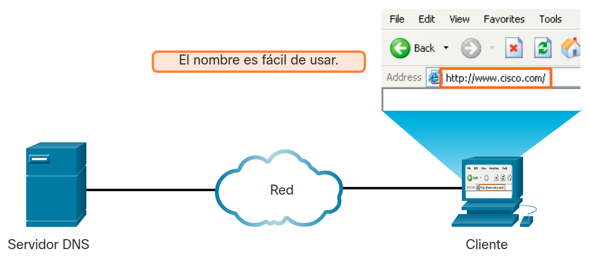
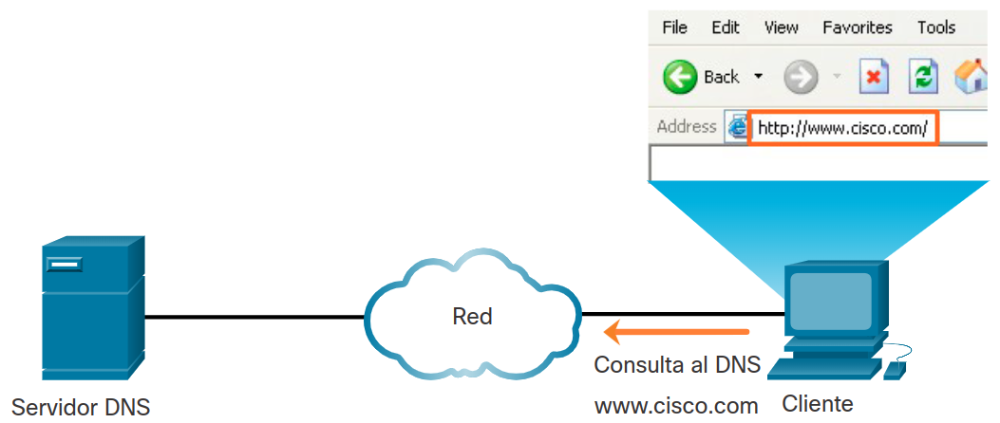
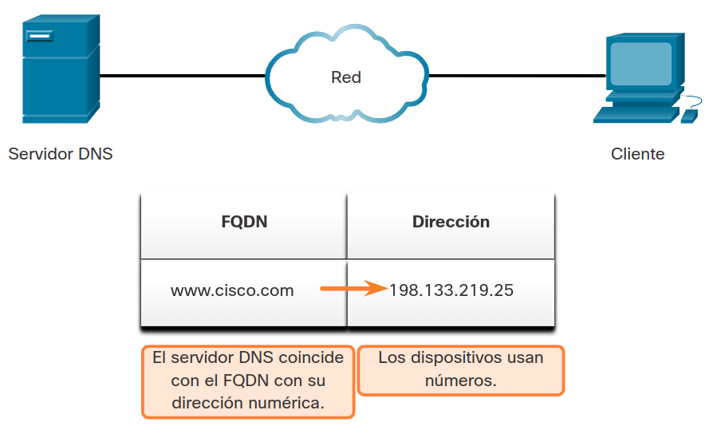
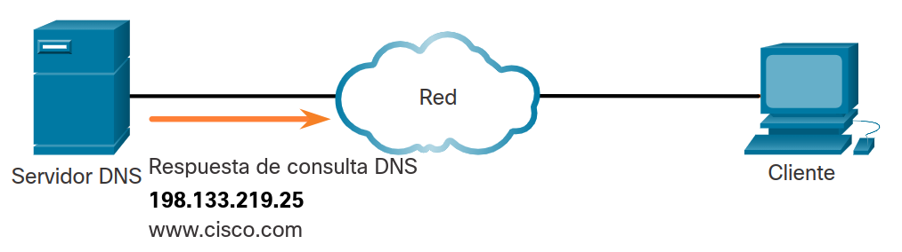
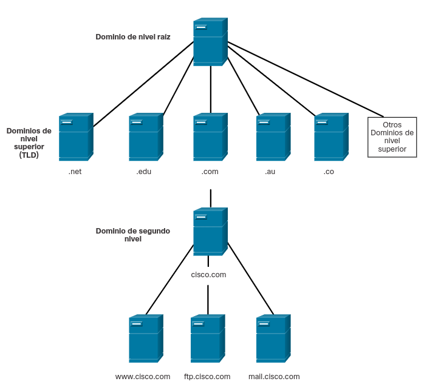
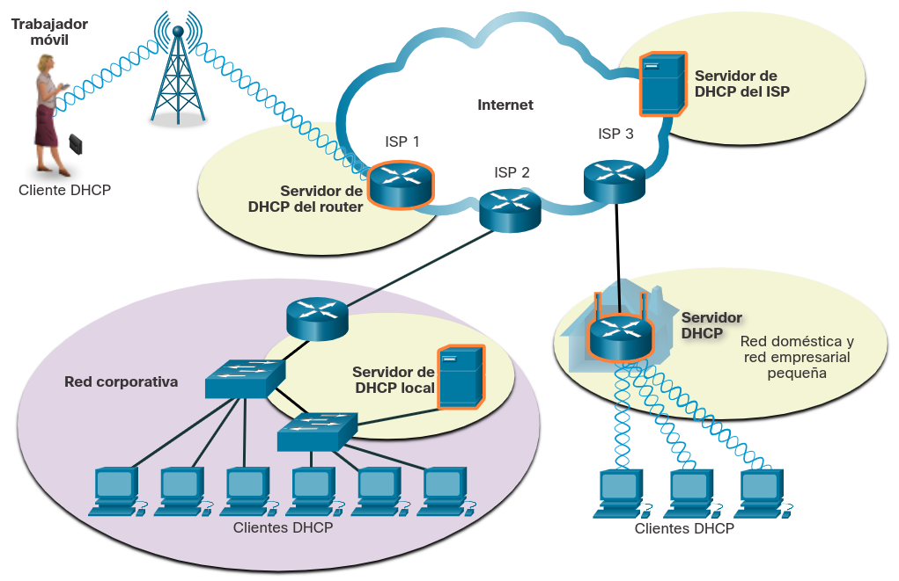
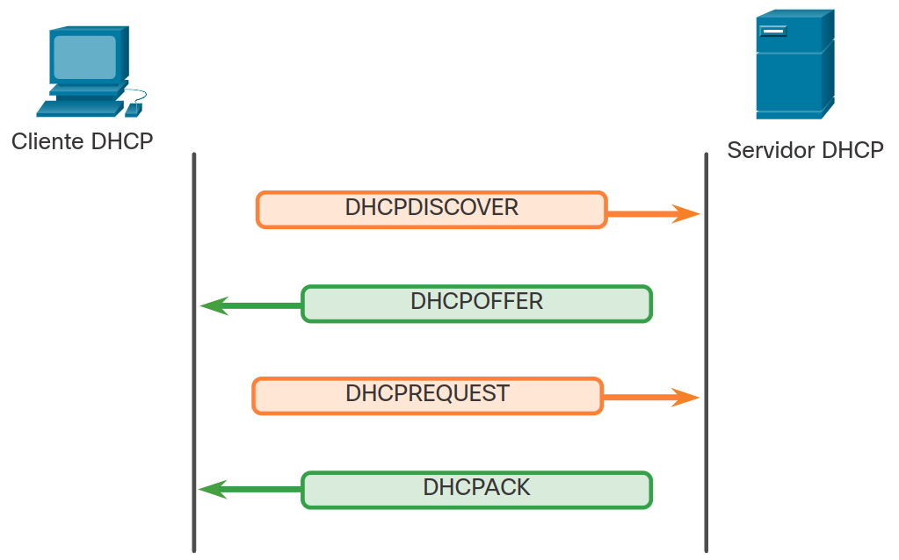

<a href="./00-Curso.md"><< Menú principal del módulo</a>

# 8. Servicios de Direccionamiento IP
# Servicios de DNS
## Sistema de Nombre de Dominio
Existen otros protocolos específicos de capa de aplicación diseñados para facilitar la obtención de direcciones para dispositivos de red. Estos servicios son esenciales porque llevaría mucho tiempo recordar direcciones IP en lugar de direcciones URL o configurar manualmente todos los dispositivos de una red mediana a grande. En este tema se detallan los servicios de direccionamiento IP, DNS y DHCP.

En las redes de datos, los dispositivos se etiquetan con direcciones IP numéricas para enviar y recibir datos a través de las redes. Los nombres de dominio se crearon para convertir las direcciones numéricas en un nombre sencillo y reconocible.

En Internet, los nombres de dominio completos (FQDN), como http://www.cisco.com, son mucho más fáciles de recordar para las personas que 198.133.219.25, que es la dirección numérica real de este servidor. . Si Cisco decide cambiar la dirección numérica de www.cisco.com, esto no afecta al usuario, porque el nombre de dominio se mantiene. Simplemente se une la nueva dirección al nombre de dominio existente y se mantiene la conectividad.

El protocolo DNS define un servicio automatizado que coincide con nombres de recursos que tienen la dirección de red numérica solicitada. Incluye el formato de consultas, respuestas y datos. Las comunicaciones del protocolo DNS utilizan un único formato llamado “mensaje”. Este formato de mensaje se utiliza para todos los tipos de solicitudes de clientes y respuestas del servidor, mensajes de error y para la transferencia de información de registro de recursos entre servidores.

1. El usuario escribe un FQDN en un campo Dirección de aplicación del explorador.

<div style="width: 40%;padding-left: 25%;">
	
</div>

2. Se envía una consulta DNS al servidor DNS designado para el equipo cliente.

<div style="width: 40%;padding-left: 25%;">
	
</div>

3. El servidor DNS coincide con el FQDN con su dirección IP.

<div style="width: 40%;padding-left: 25%;">
	
</div>

4. La respuesta de consulta DNS se envía de nuevo al cliente con la dirección IP del FQDN.

<div style="width: 40%;padding-left: 25%;">
	
</div>

5. El equipo cliente utiliza la dirección IP para realizar solicitudes del servidor.

<div style="width: 40%;padding-left: 25%;">
	
</div>

## Formato de Mensajes DNS
El servidor DNS almacena diferentes tipos de registros de recursos utilizados para resolver nombres. Estos registros contienen el nombre, la dirección y el tipo de registro. Algunos de estos tipos de registros son los siguientes:

* __A__ - Una dirección IPv4 de un dispositivo final.
* __NS__ - Un servidor de nombre autoritativo.
* __AAAA__ - Una dirección IPv6 de un dispositivo final (pronunciado quad-A).
* __MX__ - Un registro de intercambio de correo.

Cuando un  cliente realiza una consulta, el proceso DNS del servidor observa primero sus propios registros para resolver el nombre. si no puede resolverlo con los registros almacenados, contacta a otros servidores para hacerlo. Una vez que se encuentra una coincidencia y se la devuelve al servidor solicitante original, este almacena temporalmente la dirección numerada por si se vuelve a solicitar el mismo nombre.

El servicio del cliente DNS en los equipos Windows también almacena los nombres resueltos previamente en la memoria. El comando __ipconfig/displaydns__ muestra todas las entradas de DNS en caché.

Este formato de mensaje que se ve en la figura se utiliza para todos los tipos de solicitudes de clientes y respuestas del servidor, para los mensajes de error y para la transferencia de información de registro de recursos entre servidores.

<table>
<tr><td>Pregunta<td>La pregunta para el servidor de nombres
<tr><td>Respuesta<td>Registros de recursos que responden la pregunta
<tr><td>Autoridad<td>Registros de recursos que apuntan a una autoridad
<tr><td>Adicional<td>Registros de recursos que poseen información adicional
</table>

## La Jerarquía DNS
El protocolo DNS utiliza un sistema jerárquico para crear una base de datos que proporcione la resolución de nombres, como se muestra en la figura. DNS utiliza nombres de domino para formar la jerarquía.

La estructura de nomenclatura se divide en zonas pequeñas y manejables. Cada servidor DNS mantiene un archivo de base de datos específico y sólo es responsable de administrar las asignaciones de nombre a IP para esa pequeña porción de toda la estructura DNS. Cuando un servidor DNS recibe una solicitud para una traducción de nombre que no se encuentra dentro de esa zona DNS, el servidor DNS reenvía la solicitud a otro servidor DNS dentro de la zona adecuada para su traducción. DNS es escalable, porque la resolución de los nombres de hosts se distribuye entre varios servidores.

Los diferentes dominios de primer nivel representan el tipo de organización o el país de origen. Algunos ejemplos de dominios de nivel superior son los siguientes:
* __.com__, una empresa o industria
* __.org__, una organización sin fines de lucro
* __.au__, Australia
* __.co__, Colombia

<div style="width: 60%;padding-left: 20%;">
	
</div>

### El Comando nslookup
Al configurar un dispositivo de red, se proporcionan una o más direcciones de servidor DNS que el cliente DNS puede utilizar para la resolución de nombres. En general, el proveedor de servicios de Internet (ISP) suministra las direcciones para utilizar con los servidores DNS. Cuando la aplicación del usuario pide conectarse a un dispositivo remoto por su nombre, el cliente DNS solicitante consulta al servidor de nombres para resolver el nombre para una dirección numérica.

Los sistemas operativos informáticos también cuentan con una herramienta llamada nslookup que permite que el usuario consulte de forma manual los servidores de nombres para resolver un nombre de host dado. Esta utilidad también puede utilizarse para solucionar los problemas de resolución de nombres y verificar el estado actual de los servidores de nombres.

En esta figura, cuando se ejecuta el comando nslookup, se muestra el servidor DNS predeterminado configurado para su host. El nombre de un host o dominio se puede ingresar en el indicador de nslookup. La utilidad nslookup tiene muchas opciones disponibles para realizar una prueba y una verificación exhaustivas del proceso DNS.
```bash
C:\Users> nslookup
Default Server:  dns-sj.cisco.com
Address:  171.70.168.183
> www.cisco.com
Server:  dns-sj.cisco.com
Address:  171.70.168.183
Name:    origin-www.cisco.com
Addresses:  2001:420:1101:1::a
          173.37.145.84
Aliases:  www.cisco.com
> cisco.netacad.net
Server:  dns-sj.cisco.com
Address:  171.70.168.183
Name:  cisco.netacad.net
Address:  72.163.6.223
>
```

### Laboratorio
* <a href="./notes/resolucion_dns.md" target="_blank">Observar la Resolución de DNS</a>

# Servicios de DHCP
## Protocolo de Configuración Dinámica de Host
El protocolo DHCP del servicio IPv4 automatiza la asignación de direcciones IPv4, máscaras de subred, gateways y otros parámetros de redes IPv4. Esto se denomina “direccionamiento dinámico”. La alternativa al direccionamiento dinámico es el direccionamiento estático. Al utilizar el direccionamiento estático, el administrador de redes introduce manualmente la información de la dirección IP en los hosts.

Cuando un host se conecta a la red, se realiza el contacto con el servidor de DHCP y se solicita una dirección. El servidor de DHCP elige una dirección de un rango de direcciones configurado llamado grupo y la asigna (concede) al host.

En redes más grandes, o donde los usuarios cambian con frecuencia, se prefiere asignar direcciones con DHCP. Es posible que los nuevos usuarios necesiten conexiones; otros pueden tener PC nuevas que deben estar conectadas. En lugar de usar asignación de direcciones estáticas para cada conexión, es más eficaz que las direcciones IPv4 se asignen automáticamente mediante DHCP.

DHCP puede asignar direcciones IP durante un período de tiempo configurable, denominado período de concesión. El período de concesión es una configuración DHCP importante. Cuando caduca el período de concesión o el servidor DHCP recibe un mensaje DHCPRELASE, la dirección se devuelve al grupo DHCP para su reutilización. Los usuarios pueden moverse libremente desde una ubicación a otra y volver a establecer con facilidad las conexiones de red por medio de DHCP.

Como lo muestra la figura, varios tipos de dispositivos pueden ser servidores DHCP. En la mayoría de las redes medianas a grandes, el servidor DHCP suele ser un servidor local y dedicado con base en una PC. En las redes domésticas, el servidor de DHCP suele estar ubicado en el router local que conecta la red doméstica al provedor de servicio de internet (ISP).

<div style="width: 60%;padding-left: 20%;">
	
</div><br />

Muchas redes utilizan tanto el direccionamiento estático como DHCP. DHCP se utiliza para hosts de propósito general, tales como los dispositivos de usuario final. El direccionamiento estático se utiliza para los dispositivos de red, tales como enrutadores, puertas de enlace, conmutadores, servidores e impresoras.

DHCPv6 (DHCP para IPv6) proporciona servicios similares para los clientes IPv6. Una diferencia importante es que DHCPv6 no brinda una dirección de puerta de enlace predeterminada. Esto sólo se puede obtener de forma dinámica a partir del Router Advertisenemt (Anuncio de Enrutador) del propio enrutador.

## Mensajees DHCP
Como se muestra en la ilustración, cuando un dispositivo configurado con DHCP e IPv4 se inicia o se conecta a la red, el cliente transmite un mensaje de detección de DHCP (DHCPDISCOVER) para identificar cualquier servidor de DHCP disponible en la red. Un servidor de DHCP responde con un mensaje de oferta de DHCP (DHCPOFFER), que ofrece una concesión al cliente. El mensaje de oferta contiene la dirección IPv4 y la máscara de subred que se deben asignar, la dirección IPv4 del servidor DNS y la dirección IPv4 del gateway predeterminado. La oferta de concesión también incluye la duración de esta.

<div style="width: 60%;padding-left: 20%;">
	
</div><br />

El cliente puede recibir varios mensajes DHCPOFFER si hay más de un servidor de DHCP en la red local. Por lo tanto, debe elegir entre ellos y enviar un mensaje de solicitud de DHCP (DHCPREQUEST) que identifique el servidor explícito y la oferta de concesión que el cliente acepta. Un cliente también puede optar por solicitar una dirección previamente asignada por el servidor.

Suponiendo que la dirección IPv4 solicitada por el cliente, u ofrecida por el servidor, aún está disponible, el servidor devuelve un mensaje de reconocimiento de DHCP (DHCPACK) que le informa al cliente que finalizó la concesión. Si la oferta ya no es válida, el servidor seleccionado responde con un mensaje de reconocimiento negativo de DHCP (DHCPNAK). Si se devuelve un mensaje DHCPNAK, entonces el proceso de selección debe volver a comenzar con la transmisión de un nuevo mensaje DHCPDISCOVER. Una vez que el cliente tiene la concesión, se debe renovar mediante otro mensaje DHCPREQUEST antes de que expire.

El servidor DHCP asegura que todas las direcciones IP sean únicas (no se puede asignar la misma dirección IP a dos dispositivos de red diferentes de forma simultánea). La mayoría de los proveedores de Internet utilizan DHCP para asignar direcciones a los clientes.

DHCPv6 tiene un conjunto similar de mensajes a los de DHCP para IPv4. Los mensajes de DHCPv6 son SOLICIT, ADVERTISE, INFORMATION REQUEST y REPLY.
# Resumen
## Servicios de direccionamiento IP
En las redes de datos, los dispositivos se etiquetan con direcciones IP numéricas para enviar y recibir datos a través de las redes. Los nombres de dominio se crearon para convertir las direcciones numéricas en un nombre sencillo y reconocible. El protocolo del DNS define un servicio automatizado que coincide con los nombres de recursos que tienen la dirección de red numérica solicitada. Las comunicaciones del protocolo DNS utilizan un único formato llamado “mensaje”. Este formato de mensaje se utiliza para todos los tipos de solicitudes de clientes y respuestas del servidor, mensajes de error y para la transferencia de información de registro de recursos entre servidores.

El servidor DNS almacena diferentes tipos de registros de recursos utilizados para resolver nombres. Estos registros contienen el nombre, la dirección y el tipo de registro. Este formato de mensaje que se ve en la figura se utiliza para todos los tipos de solicitudes de clientes y respuestas del servidor, para los mensajes de error y para la transferencia de información de registro de recursos entre servidores.

DNS utiliza nombres de domino para formar la jerarquía. La estructura de nombres se divide en zonas. Cada servidor DNS mantiene un archivo de base de datos específico y sólo es responsable de administrar las asignaciones de nombre a IP para esa pequeña porción de toda la estructura DNS. Cuando un servidor DNS recibe una solicitud para una traducción de nombre que no se encuentra dentro de esa zona DNS, el servidor DNS reenvía la solicitud a otro servidor DNS dentro de la zona adecuada para su traducción. DNS es escalable, porque la resolución de los nombres de hosts se distribuye entre varios servidores.

Los sistemas operativos informáticos cuentan con una herramienta llamada nslookup que permite que el usuario consulte de forma manual los servidores de nombres para resolver un nombre de host dado. Esta utilidad también puede utilizarse para solucionar los problemas de resolución de nombres y verificar el estado actual de los servidores de nombres. Cuando se ejecuta el comando nslookup, se muestra el servidor DNS predeterminado configurado para su host. El nombre de un host o dominio se puede ingresar en el indicador de nslookup.

En redes más grandes, se prefiere asignar direcciones con DHCP. En lugar de usar asignación de direcciones estáticas para cada conexión, es más eficaz que las direcciones IPv4 se asignen automáticamente mediante DHCP. DHCP puede asignar direcciones IP durante un período de tiempo configurable, denominado período de concesión. Cuando caduca el período de concesión o el servidor DHCP recibe un mensaje DHCPRELASE, la dirección se devuelve al rango de DHCP para su reutilización. Los usuarios pueden moverse libremente desde una ubicación a otra y volver a establecer con facilidad las conexiones de red por medio de DHCP.

DHCPv6 proporciona servicios similares para los clientes IPv6. Una diferencia importante es que DHCPv6 no brinda una dirección de puerta de enlace predeterminada. Esto sólo se puede obtener de forma dinámica a partir del Router Advertisenemt (Anuncio de Enrutador) del propio enrutador.
Cuando un dispositivo configurado con DHCP e IPv4 se inicia o se conecta a la red, el cliente transmite un mensaje de detección de DHCP (DHCPDISCOVER) para identificar cualquier servidor de DHCP disponible en la red.

Un servidor de DHCP responde con un mensaje de oferta de DHCP (DHCPOFFER), que ofrece una concesión al cliente. El cliente envía un mensaje DHCPREQUEST que identifica el servidor específico y le arrenda una oferta que el cliente está aceptando

Suponiendo que la dirección IPv4 solicitada por el cliente u ofrecida por el servidor aún está disponible, el servidor devuelve un mensaje DHCPACK que reconoce al cliente que el arrendamiento ha finalizado. Si la oferta ya no está disponible, entonces el servidor seleccionado responde con un mensaje DHCPNAK. Si se devuelve un mensaje DHCPNAK, entonces el proceso de selección debe volver a comenzar con la transmisión de un nuevo mensaje DHCPDISCOVER.

DHCPv6 tiene un conjunto similar de mensajes a los de DHCP para IPv4. Los mensajes de DHCPv6 son SOLICIT, ADVERTISE, INFORMATION REQUEST y REPLY.

## Enlaces de interés
* <a href="https://www.hostinger.es/tutoriales/que-es-dns" target="_blank">Funcionamiento de DNS</a>
* <a href="https://notes.networklessons.com/dhcp-message-types" target="_blank">DHCP - Message Types</a>
<br />
<br />
<br />
<br />
<br />
<br />
<br />
<a href="#8-servicios-de-direccionamiento-ip">⬆️</a>
<a href="./00-Curso.md"><< Menú principal del módulo</a>