<a href="./00-Curso.md"><< Menú principal del módulo</a>

# 9. La Capa de Transporte
# Transporte de Datos
## Función de la Capa de Transporte
Los programas de capa de aplicación generan datos que deben intercambiarse entre los hosts de origen y de destino. La capa de transporte es responsable de las comunicaciones lógicas entre aplicaciones que se ejecutan en diferentes hosts. Esto puede incluir servicios como el establecimiento de una sesión temporal entre dos hosts y la transmisión fiable de información para una aplicación.

Como se muestra en la ilustración, la capa de transporte es el enlace entre la capa de aplicación y las capas inferiores que son responsables de la transmisión a través de la red.

<div style="width: 40%;padding-left: 25%;">
	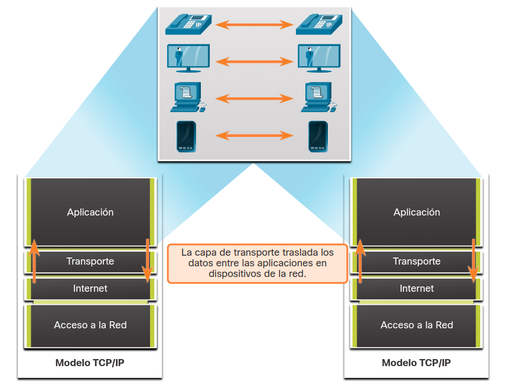
</div><br />

La capa de transporte no tiene conocimiento del tipo de host de destino, el tipo de medio por el que deben viajar los datos, la ruta tomada por los datos, la congestión en un enlace o el tamaño de la red.

La capa de transporte incluye dos protocolos:
* Protocolo de control de transmisión (TCP - _Transmission Control Protocol_)
* Protocolo de datagramas de usuario (UDP - _User Datagram Protocol_)

## Tareas de la Capa de Trasnporte
La capa de transporte tiene muchas responsabilidades.

### Seguimiento de Conversaciones Individuales
En la capa de transporte, cada conjunto de datos que fluye entre una aplicación de origen y una aplicación de destino se conoce como una conversación y se rastrea por separado. Es responsabilidad de la capa de transporte mantener y hacer un seguimiento de todas estas conversaciones.

Como se ilustra en la figura, un host puede tener múltiples aplicaciones que se comunican a través de la red simultáneamente.

La mayoría de las redes tienen un límite de la cantidad de datos que se puede incluir en un solo paquete. Por lo tanto, los datos deben dividirse en piezas manejables.

<div style="width: 50%;padding-left: 20%;">
	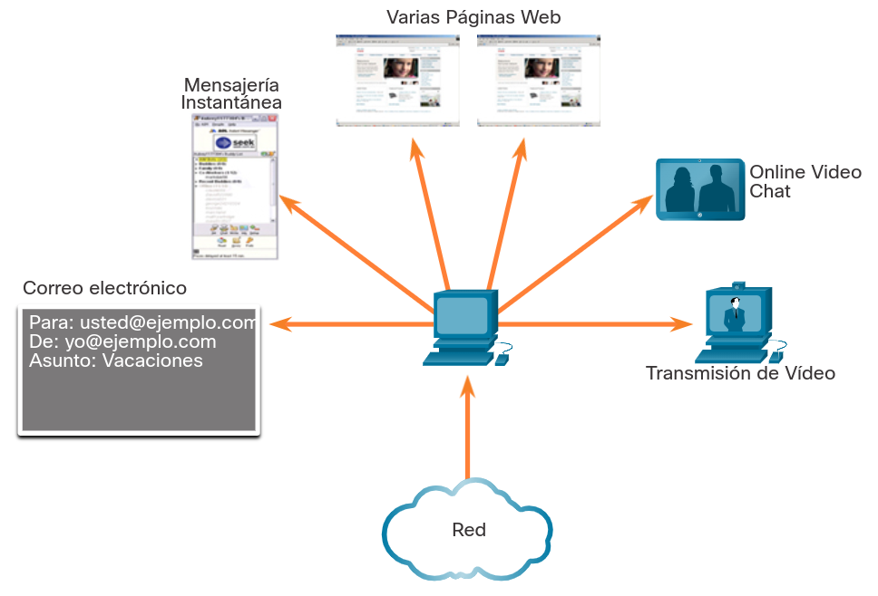
</div>

### Segmentación de Datos y Rearmado de Segmentos
Es responsabilidad de la capa de transporte dividir los datos de la aplicación en bloques de tamaño adecuado. Dependiendo del protocolo de capa de transporte utilizado, los bloques de capa de transporte se denominan segmentos o datagramas. La figura ilustra la capa de transporte utilizando diferentes bloques para cada conversación.

La capa de transporte divide los datos en bloques más pequeños (es decir, segmentos o datagramas) que son más fáciles de administrar y transportar.

<div style="width: 50%;padding-left: 20%;">
	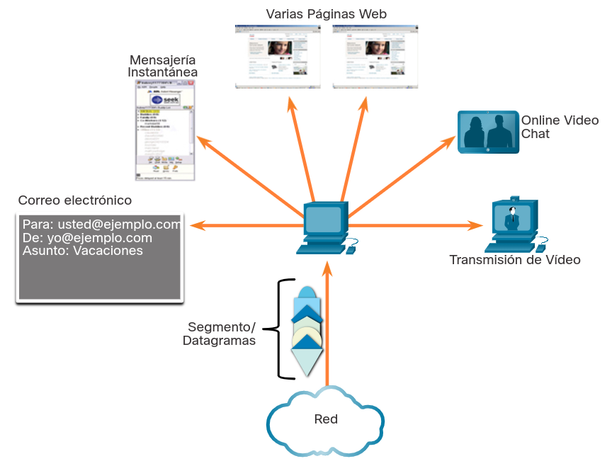
</div>

### Agregar Información de Encabezado
El protocolo de capa de transporte también agrega información de encabezado que contiene datos binarios organizados en varios campos a cada bloque de datos. Los valores de estos campos permiten que los distintos protocolos de la capa de transporte lleven a cabo variadas funciones de administración de la comunicación de datos.

Por ejemplo, el host receptor utiliza la información de encabezado para volver a ensamblar los bloques de datos en un flujo de datos completo para el programa de capa de aplicación de recepción.

La capa de transporte garantiza que incluso con múltiples aplicaciones que se ejecutan en un dispositivo, todas las aplicaciones reciben los datos correctos.

<div style="width: 50%;padding-left: 20%;">
	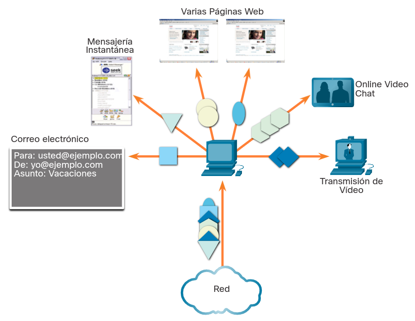
</div>

### Identificación de las Aplicaciones
La capa de transporte debe poder separar y administrar varias comunicaciones con diferentes necesidades de requisitos de transporte. Para pasar flujos de datos a las aplicaciones adecuadas, la capa de transporte identifica la aplicación de destino utilizando un identificador llamado número de puerto. Como se ilustra en la figura, a cada proceso de software que necesita acceder a la red se le asigna un número de puerto único para ese host.

<div style="width: 50%;padding-left: 20%;">
	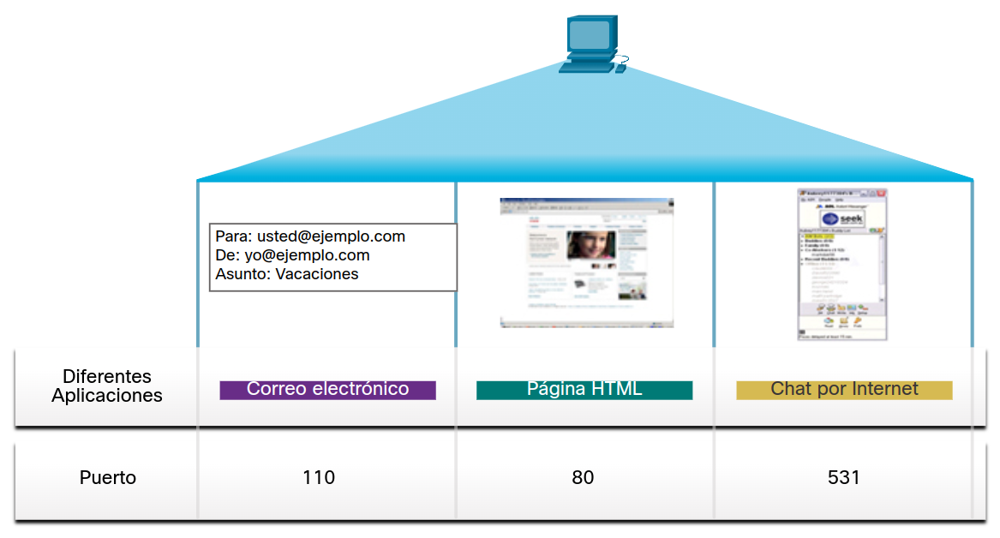
</div>

### Multiplexión de Conversaciones
El envío de algunos tipos de datos (por ejemplo, una transmisión de video) a través de una red, como una transmisión de comunicación completa, puede consumir todo el ancho de banda disponible. Esto evitaría que se produzcan otras conversaciones de comunicación al mismo tiempo. También podría dificultar la recuperación de errores y la retransmisión de datos dañados.

Como se muestra en la figura, la capa de transporte utiliza segmentación y multiplexación para permitir que diferentes conversaciones de comunicación se intercalen en la misma red.

La verificación de errores se puede realizar en los datos del segmento, para determinar si el segmento se modificó durante la transmisión.

<div style="width: 50%;padding-left: 20%;">
	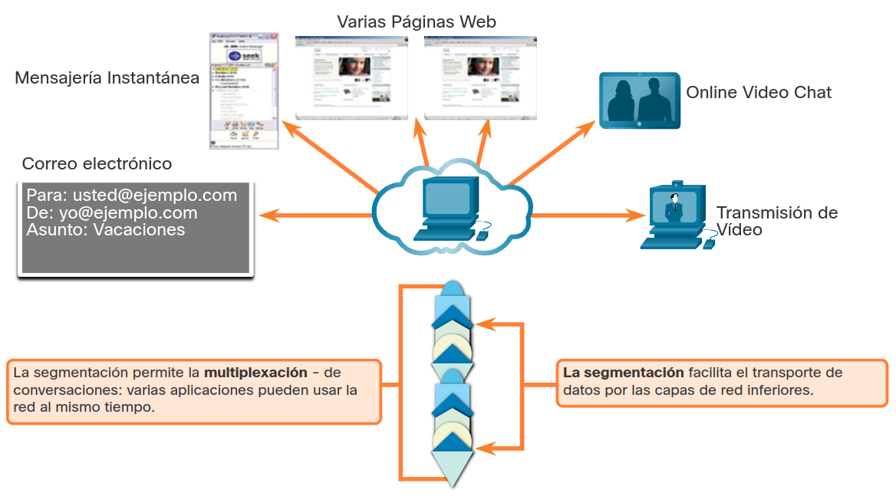
</div>

## Protocolos de la Capa de Transporte
IP se ocupa solo de la estructura, el direccionamiento y el routing de paquetes. IP no especifica la manera en que se lleva a cabo la entrega o el transporte de los paquetes.

Los protocolos de capa de transporte especifican cómo transferir mensajes entre hosts y son responsables de administrar los requisitos de fiabilidad de una conversación. La capa de transporte incluye los protocolos TCP y UDP.

Las diferentes aplicaciones tienen diferentes requisitos de confiabilidad de transporte. Por lo tanto, TCP/IP proporciona dos protocolos de capa de transporte, como se muestra en la figura.

<div style="width: 50%;padding-left: 20%;">
	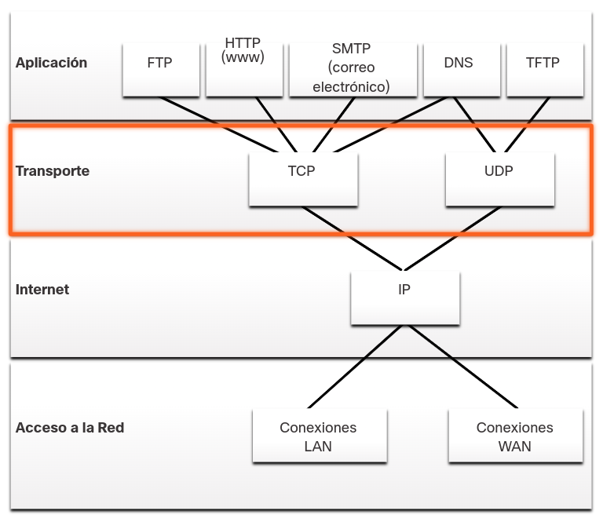
</div>

## Protocolo de Control de Transmisión (TCP)
IP solo se refiere a la estructura, direccionamiento y enrutamiento de paquetes, desde el remitente original hasta el destino final. IP no es responsable de garantizar la entrega o determinar si es necesario establecer una conexión entre el remitente y el receptor.

El TCP se considera un protocolo de la capa de transporte confiable y completo, que garantiza que todos los datos lleguen al destino. TCP incluye campos que garantizan la entrega de los datos de la aplicación. Estos campos requieren un procesamiento adicional por parte de los hosts de envío y recepción.

__Nota__: TCP divide los datos en segmentos.

La función del protocolo de transporte TCP es similar al envío de paquetes de los que se hace un rastreo de origen a destino. Si se divide un pedido de envío en varios paquetes, un cliente puede verificar en línea para ver el orden de la entrega.

TCP proporciona confiabilidad y control de flujo mediante estas operaciones básicas:

* Numerar y rastrear segmentos de datos transmitidos a un host específico desde una aplicación específica.
* Confirmar acuses de recibidos.
* Vuelver a transmitir cualquier información no reconocida después de un cierto período de tiempo.
* Datos de secuencia que pueden llegar en un orden incorrecto.
* Enviar datos a una velocidad eficiente que sea aceptable por el receptor.

Para mantener el estado de una conversación y realizar un seguimiento de la información, TCP debe establecer primero una conexión entre el remitente y el receptor. Es por eso que TCP se conoce como un protocolo orientado a la conexión.

En las imágenes puede ver cómo los segmentos de TCP y los reconocimientos se transmiten entre el emisor y el receptor.

<div style="padding-left: 5%;">
	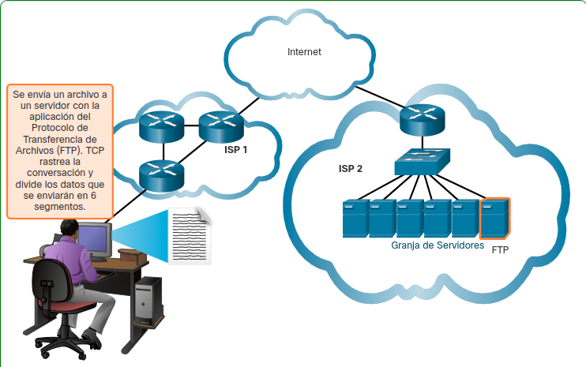
	
	<div style="clear: both;" />
	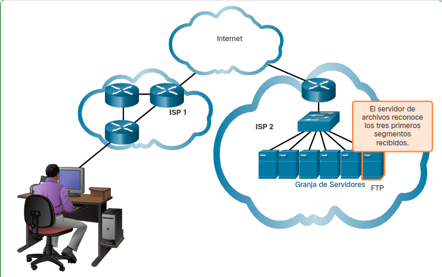
	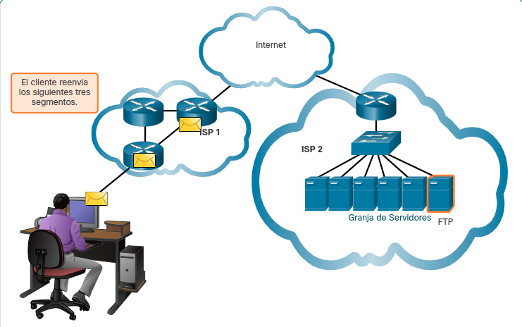
	<div style="clear: both;" />
	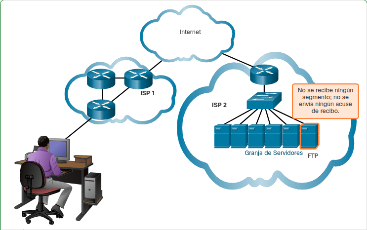
	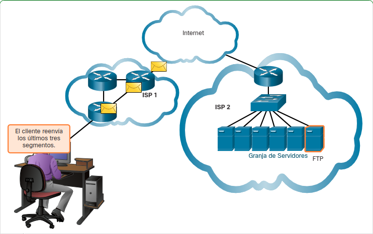
	<div style="clear: both;" />
	
	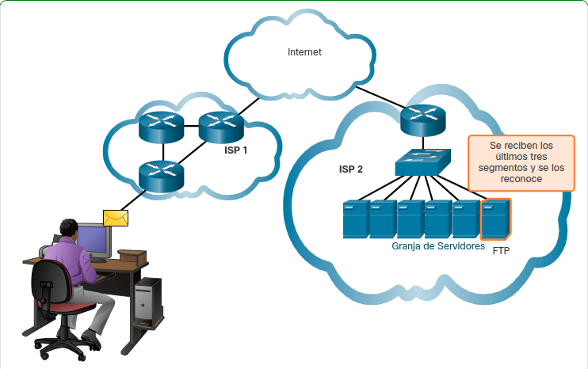
	<div style="clear: both;" />
</div>

## Protocolo de Datagramas de Usuario (UDP)
UDP es un protocolo de capa de transporte más simple que TCP. No proporciona confiabilidad y control de flujo, lo que significa que requiere menos campos de encabezado. Debido a que los procesos UDP remitente y receptor no tienen que administrar la confiabilidad y el control de flujo, esto significa que los datagramas UDP se pueden procesar más rápido que los segmentos TCP. El UDP proporciona las funciones básicas para entregar segmentos de datos entre las aplicaciones adecuadas, con muy poca sobrecarga y revisión de datos.

Nota: UDP divide los datos en datagramas que también se conocen como segmentos.

UDP es un protocolo sin conexión. Debido a que UDP no proporciona fiabilidad ni control de flujo, no requiere una conexión establecida. Debido a que UDP no realiza un seguimiento de la información enviada o recibida entre el cliente y el servidor, UDP también se conoce como protocolo sin estado.

UDP también se conoce como un protocolo de entrega de mejor esfuerzo porque no hay reconocimiento de que los datos se reciben en el destino. Con UDP, no existen procesos de capa de transporte que informen al emisor si la entrega se realizó correctamente.

UDP es como colocar una carta regular, no registrada, en el correo. El emisor de la carta no conoce la disponibilidad del receptor para recibir la carta. Además, la oficina de correos tampoco es responsable de hacer un rastreo de la carta ni de informar al emisor si esta no llega a destino.

En las imágenes puede ver cómo los datagramas UDP que se transmiten del remitente al receptor.

<div style="padding-left: 5%;">
	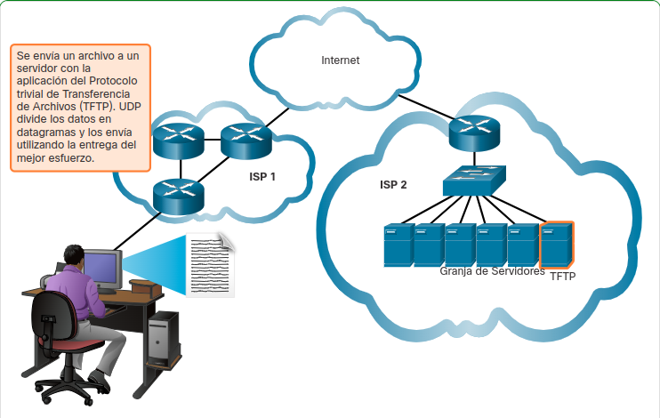
	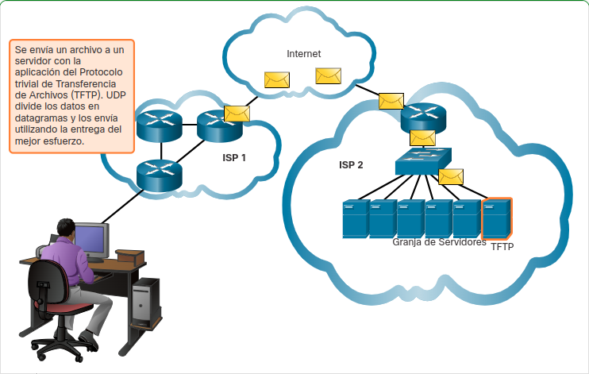
	<div style="clear: both;" />
	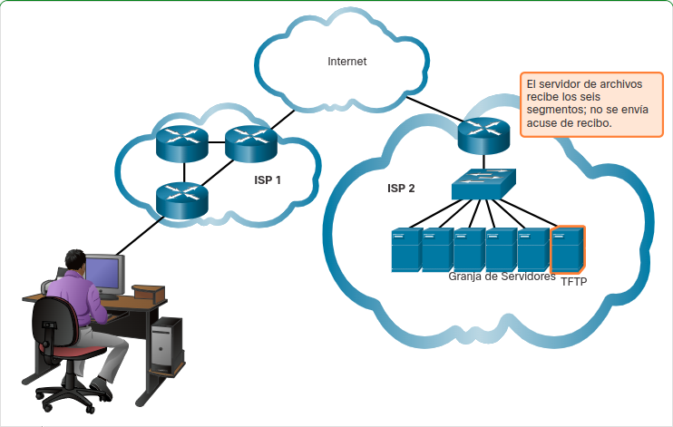
</div>

## El Protocolo de la Capa de Transporte Adecuado para la Aplicación Adecuada
Algunas aplicaciones pueden tolerar cierta pérdida de datos durante la transmisión a través de la red, pero los retrasos en la transmisión son inaceptables. Para estas aplicaciones, UDP es la mejor opción porque requiere menos sobrecarga de red. UDP es preferible para aplicaciones como Voz sobre IP (VoIP). Los reconocimientos y la retransmisión retrasarían la entrega y harían inaceptable la conversación de voz.

UDP también es utilizado por las aplicaciones de solicitud y respuesta donde los datos son mínimos, y la retransmisión se puede hacer rápidamente. Por ejemplo, el Sistema de Nombres de Dominio (DNS) utiliza UDP para este tipo de transacción. El cliente solicita direcciones IPv4 e IPv6 para obtener un nombre de dominio conocido desde un servidor DNS. Si el cliente no recibe una respuesta en un período de tiempo predeterminado, simplemente envía la solicitud de nuevo.

Por ejemplo, si uno o dos segmentos de una transmisión de vídeo en vivo no llegan al destino, se interrumpe momentáneamente la transmisión. Esto puede manifestarse como distorsión en la imagen o el sonido, pero puede no ser perceptible para el usuario. Si el dispositivo de destino tuviera que dar cuenta de los datos perdidos, la transmisión se podría demorar mientras espera las retransmisiones, lo que ocasionaría que la imagen o el sonido se degraden considerablemente. En este caso, es mejor producir el mejor vídeo o audio posible con los segmentos recibidos y prescindir de la confiabilidad.

Para otras aplicaciones es importante que todos los datos lleguen y que puedan ser procesados en su secuencia adecuada. Para estos tipos de aplicaciones, TCP se utiliza como protocolo de transporte. Por ejemplo, las aplicaciones como las bases de datos, los navegadores web y los clientes de correo electrónico, requieren que todos los datos que se envían lleguen a destino en su formato original. Cualquier dato faltante podría corromper una comunicación, haciéndola incompleta o ilegible. Por ejemplo, cuando se accede a la información bancaria a través de la web, es importante asegurarse de que toda la información se envía y recibe correctamente.

Los desarrolladores de aplicaciones deben elegir qué tipo de protocolo de transporte es adecuado según los requisitos de las aplicaciones. El vídeo puede enviarse a través de TCP o UDP. Las aplicaciones que transmiten audio y video almacenado generalmente usan TCP. La aplicación utiliza TCP para realizar buffering, sondeo de ancho de banda y control de congestión, con el fin de controlar mejor la experiencia del usuario.

El vídeo y la voz en tiempo real generalmente usan UDP, pero también pueden usar TCP, o tanto UDP como TCP. Una aplicación de videoconferencia puede usar UDP de forma predeterminada, pero debido a que muchos firewalls bloquean UDP, la aplicación también se puede enviar a través de TCP.

Las aplicaciones que transmiten audio y video almacenado usan TCP. Por ejemplo, si de repente la red no puede admitir el ancho de banda necesario para ver una película a pedido, la aplicación detiene la reproducción. Durante la pausa, es posible que vea un mensaje de "almacenando en búfer..." mientras TCP intenta restablecer la transmisión. Cuando todos los segmentos están en orden y se restaura un nivel mínimo de ancho de banda, se reanuda la sesión TCP y se reanuda la reproducción de la película.

La figura resume las diferencias entre UDP y TCP.

<div style="width: 60%;padding-left: 15%;">
	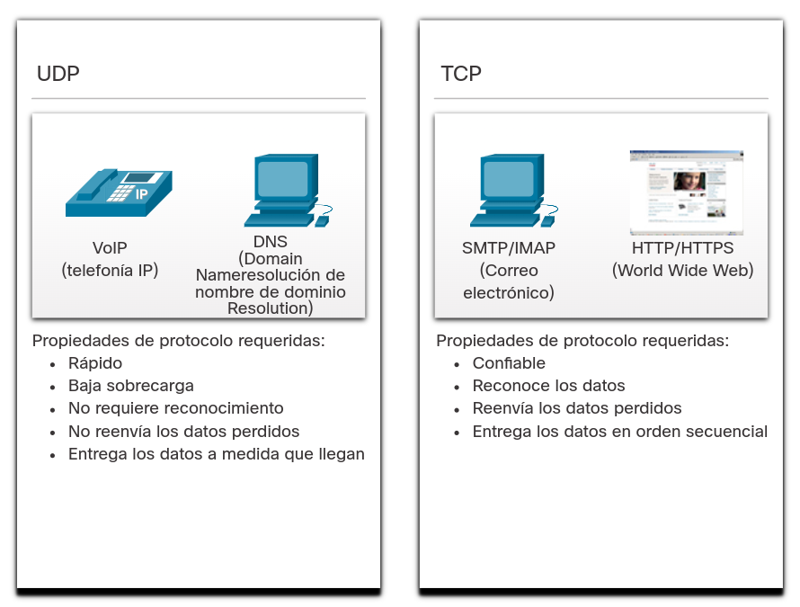
</div>

# Descripción General de TCP
## Características de TCP
En el tema anterior, aprendió que TCP y UDP son los dos protocolos de capa de transporte. Este tema proporciona más detalles sobre lo que hace TCP y cuándo es una buena idea usarlo en lugar de UDP.

Para comprender las diferencias entre TCP y UDP, es importante comprender cómo cada protocolo implementa funciones de confiabilidad específicas y cómo cada protocolo rastrea las conversaciones.

Además de admitir las funciones básicas de segmentación y reensamblado de datos, TCP también proporciona los siguientes servicios:

* __Establece una sesión__. TCP es un protocolo orientado a la conexión que negocia y establece una conexión permanente (o sesión) entre los dispositivos de origen y destino antes de reenviar cualquier tráfico. Mediante el establecimiento de sesión, los dispositivos negocian la cantidad de tráfico que se puede reenviar en un momento determinado, y los datos que se comunican entre ambos se pueden administrar detenidamente.
* __Garantiza una Entrega Confiable__. Por muchas razones, es posible que un segmento se corrompa o se pierda por completo, ya que se transmite a través de la red. TCP asegura que cada segmento que envía la fuente llega al destino.
* __Proporciona Entrega en el Orden Correcto__. Debido a que las redes pueden proporcionar múltiples rutas que pueden tener diferentes velocidades de transmisión, los datos pueden llegar en el orden incorrecto. Al numerar y secuenciar los segmentos, TCP garantiza que los segmentos se vuelvan a ensamblar en el orden correcto.
* __Admite Control de Flujo__. Los hosts de red tienen recursos limitados (es decir, memoria y potencia de procesamiento). Cuando TCP advierte que estos recursos están sobrecargados, puede solicitar que la aplicación emisora reduzca la velocidad del flujo de datos. Esto lo lleva a un cabo TCP, que regula la cantidad de datos que transmite el origen. El control de flujo puede evitar la necesidad de retransmitir los datos cuando los recursos del host receptor se ven desbordados.

Para obtener más información sobre TCP, busque en Internet el RFC 793.

## El Encabezado TCP
TCP es un protocolo con estado, lo que significa que realiza un seguimiento del estado de la sesión de comunicación. Para hacer un seguimiento del estado de una sesión, TCP registra qué información se envió y qué información se reconoció. La sesión con estado comienza con el establecimiento de la sesión y termina con la finalización de la sesión.

Un segmento TCP agrega 20 bytes (es decir, 160 bits) de sobrecarga al encapsular los datos de la capa de aplicación. La figura muestra los campos en un encabezado TCP.

<div style="width: 60%;padding-left: 15%;">
	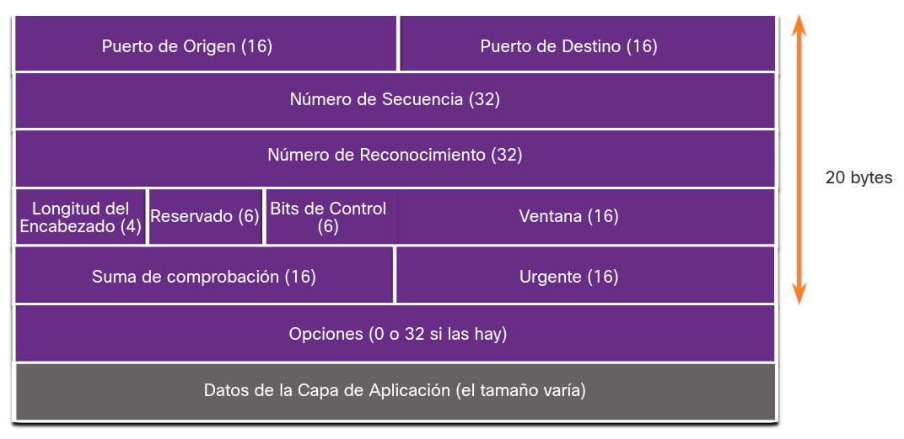
</div>

## Campos del Encabezado TCP
A continuación se identifican y describen los diez campos de un encabezado TCP.

* __Puerto de origen__: Campo de 16 bits utilizado para identificar la aplicación de origen por número de puerto.
* __Puerto de destino__: Campo de 16 biits utilizado para identificar la aplicación de destino por número de puerto.
* __Número de secuencia__: Campo de 32 bits utilizado para reensamblar datos.
* __Número de reconocimiento__: Campo de 32 bits utilizado para inidcar que se han recibido datos y el siguiente byte esperado de la fuente.
* __Longitud de encabezado__: CAmpo de 4 bits conocido como "desplazamiento de datos" que indica la longitud del encabezado del segmento TCP.
* __Reservado__: Un campo de 6 bits que está reservado para uso futuro.
* __Bits de control__: Un campo de 6 bits que incluye códigos de bit, o indicadores, que indican el propósito y la función del segmento TCP.
* __Tamaño de la ventana__: Un campo de 16 bits utilizado para indicar el número de bytes que se pueden aceptar a la vez.
* __Suma de Comprobación__: Un campo de 16 bits utilizado para verificar errores en el segmento de encabezado y datos.
* __Urgente__: Campo de 16 bits utiilizado para indicar si los datos contenidos son urgentes.

## Aplicaciones que Utilizan TCP
TCP es un buen ejemplo de cómo las diferentes capas del conjunto de protocolos TCP / IP tienen roles específicos. TCP maneja todas las tareas asociadas con la división del flujo de datos en segmentos, proporcionando confiabilidad, controlando el flujo de datos y reordenando segmentos. TCP libera la aplicación de tener que administrar estas tareas. Las aplicaciones, como las que se muestran en la figura, simplemente puede enviar el flujo de datos a la capa de transporte y utilizar los servicios de TCP.

<div style="width: 60%;padding-left: 15%;">
	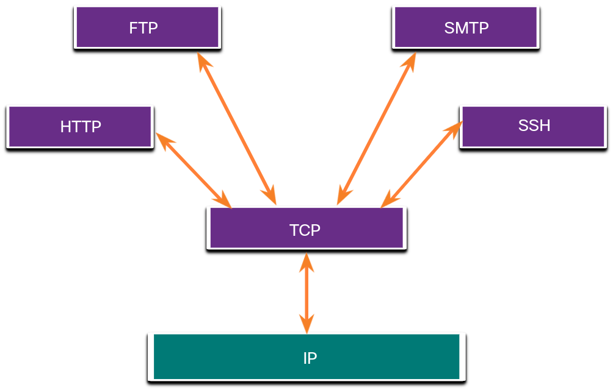
</div>

# Descripción General de UDP
## Características de UDP
Este tema abarcará UDP, lo que hace y cuándo es una buena idea usarlo en lugar de TCP. UDP es un protocolo de transporte del mejor esfuerzo. UDP es un protocolo de transporte liviano que ofrece la misma segmentación y rearmado de datos que TCP, pero sin la confiabilidad y el control del flujo de TCP.

UDP es un protocolo tan simple que, por lo general, se lo describe en términos de lo que no hace en comparación con TCP.

Las características UDP incluyen lo siguiente:

* Los datos se reconstruyen en el orden en que se recibieron.
* Los segmentos perdidos no se vuelven a enviar.
* No hay establecimiento de sesión.
* El envío no está informado sobre la disponibilidad de recursos.

Para obtener más información sobre UDP, busque en Internet el RFC 768.

## El Encabezado UDP
UDP es un protocolo sin estado, lo que significa que ni el cliente ni el servidor rastrean el estado de la sesión de comunicación. Si se requiere confiabilidad al utilizar UDP como protocolo de transporte, a esta la debe administrar la aplicación.

Uno de los requisitos más importantes para transmitir vídeo en vivo y voz a través de la red es que los datos fluyan rápidamente. Las aplicaciones de vídeo y de voz en vivo pueden tolerar cierta pérdida de datos con un efecto mínimo o imperceptible, y se adaptan perfectamente a UDP.

Los bloques de comunicación en UDP se denominan datagramas o segmentos. Estos datagramas se envían como el mejor esfuerzo por el protocolo de la capa de transporte.

El encabezado UDP es mucho más simple que el encabezado TCP porque solo tiene cuatro campos y requiere 8 bytes (es decir, 64 bits). La figura muestra los campos en un encabezado TCP.

<div style="width: 60%;padding-left: 20%;">
	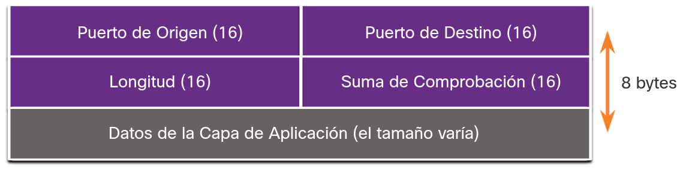
</div>

## Campos del Encabezado UDP
A continuación se identifican y describen los cuatro campos de un encabezado UDP.

* __Puerto de Origen__: Campo de 16 bits utilizado para identificar la aplicación de origen por número de puerto.
* __Puerto de Destino__: Campo de 16 bits utilizado para identificar la aplicación de destino por número de puerto.
* __Duración__: Campo de 16 bits que indica la longitud del encabezado del datagrama UDP.
* __Suma de Comprobación__: Campo de 16 bits utilizado para la comprobación de errores del encabezado y los datos del datagrama.

## Aplicaciones que Utilizan UDP
Existen tres tipos de aplicaciones que son las más adecuadas para UDP:

* Aplicaciones de video en vivo y multimedia - Estas aplicaciones pueden tolerar cierta pérdida de datos, pero requieren poco o ningún retraso. Los ejemplos incluyen VoIP y la transmisión de video en vivo.
* Aplicaciones simples de solicitud y respuesta - Aplicaciones con transacciones simples en las que un host envía una solicitud y puede o no recibir una respuesta. Los ejemplos incluyen DNS y DHCP.
* Aplicaciones que manejan la confiabilidad por sí mismas - Comunicaciones unidireccionales donde el control de flujo, la detección de errores, los reconocimientos y la recuperación de errores no son necesarios o la aplicación puede manejarlos. Los ejemplos incluyen SNMP y TFTP.

La figura identifica las aplicaciones que requieren UDP.

<div style="width: 60%;padding-left: 15%;">
	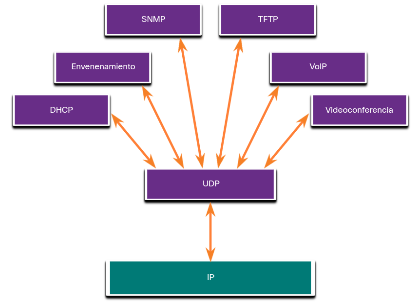
</div>

Aunque DNS (_Domain Name System_) y SNMP (_Simple Network Management Protocol_) utilizan UDP de manera predeterminada, ambos también pueden utilizar TCP. DNS utilizará TCP si la solicitud de DNS o la respuesta de DNS son más de 512 bytes, como cuando una respuesta de DNS incluye muchas resoluciones de nombre. Del mismo modo, en algunas situaciones, el administrador de redes puede querer configurar SNMP para utilizar TCP.

# Número de Puerto
## Comunicaciones Separadas Múltiples

Como ha aprendido, hay algunas situaciones en las que TCP es el protocolo correcto para el trabajo, y otras situaciones en las que se debe usar UDP. Independientemente del tipo de datos que se transporten, tanto TCP como UDP utilizan números de puerto.

Los protocolos de capa de transporte TCP y UDP utilizan números de puerto para administrar múltiples conversaciones simultáneas. Como se muestra en la figura, los campos de encabezado TCP y UDP identifican un número de puerto de aplicación de origen y destino.

<div style="width: 60%;padding-left: 15%;">
	
</div>

El número de puerto de origen está asociado con la aplicación de origen en el host local, mientras que el número de puerto de destino está asociado con la aplicación de destino en el host remoto.

Por ejemplo, supongamos que un host está iniciando una solicitud de página web desde un servidor web. Cuando el host inicia la solicitud de página web, el host genera dinámicamente el número de puerto de origen para identificar de forma exclusiva la conversación. Cada solicitud generada por un host utilizará un número de puerto de origen creado dinámicamente diferente. Este proceso permite establecer varias conversaciones simultáneamente.

En la solicitud, el número de puerto de destino es lo que identifica el tipo de servicio que se solicita del servidor web de destino. Por ejemplo, cuando un cliente especifica el puerto 80 en el puerto de destino, el servidor que recibe el mensaje sabe que se solicitan servicios web.

Un servidor puede ofrecer más de un servicio simultáneamente, como servicios web en el puerto 80, mientras que ofrece el establecimiento de conexión de Protocolo de transferencia de archivos (FTP) en el puerto 21.

## Pares de Sockets
Los puertos de origen y de destino se colocan dentro del segmento. Los segmentos se encapsulan dentro de un paquete IP. El paquete IP contiene la dirección IP de origen y de destino. Se conoce como socket a la combinación de la dirección IP de origen y el número de puerto de origen, o de la dirección IP de destino y el número de puerto de destino.

En el ejemplo de la figura, el PC está solicitando simultáneamente servicios FTP y web desde el servidor de destino.

<div style="width: 60%;padding-left: 15%;">
	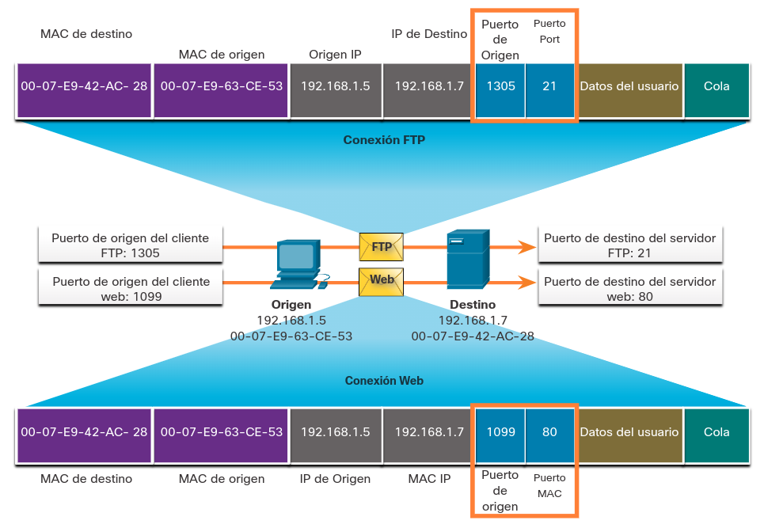
</div>

En el ejemplo, la solicitud FTP generada por el PC incluye las direcciones MAC de Capa 2 y las direcciones IP de Capa 3. La solicitud también identifica el puerto de origen 1305 (es decir, generado dinámicamente por el host) y el puerto de destino, identificando los servicios FTP en el puerto 21. El host también ha solicitado una página web del servidor utilizando las mismas direcciones de Capa 2 y Capa 3. Sin embargo, está utilizando el número de puerto de origen 1099 (es decir, generado dinámicamente por el host) y el puerto de destino que identifica el servicio web en el puerto 80.

El socket se utiliza para identificar el servidor y el servicio que solicita el cliente. Un socket de cliente puede ser parecido a esto, donde 1099 representa el número de puerto de origen: 192.168.1.5:1099

El socket en un servidor web puede ser 192.168.1.7:80

Juntos, estos dos sockets se combinan para formar un par de sockets: 192.168.1.5:1099, 192.168.1.7:80

Los sockets permiten que los diversos procesos que se ejecutan en un cliente se distingan entre sí. También permiten la diferenciación de diferentes conexiones a un proceso de servidor.

El número de puerto de origen actúa como dirección de retorno para la aplicación que realiza la solicitud. La capa de transporte hace un seguimiento de este puerto y de la aplicación que generó la solicitud de manera que cuando se devuelva una respuesta, esta se envíe a la aplicación correcta.

## Grupos de Números de Puerto
La Autoridad de Números Asignados de Internet (IANA) es la organización de estándares responsable de asignar varios estándares de direccionamiento, incluidos los números de puerto de 16 bits. Los 16 bits utilizados para identificar los números de puerto de origen y destino proporcionana un rango de puertos entre 0 yu 65535.

La IANA ha dividido el rango de números en los siguientes tres grupos de puertos.

* __Puertos bien conocidos__
	* Van del 0 al 1.023.
	* Por lo general, se utilizan para aplicaciones como navegadores web, clientes de correo electrónico y clientes de acceso remoto.
	* Los puertos conocidos definidos para aplicaciones de servidor comunes permiten a los clientes identificar fácilmente el servicio asociado requerido.
* __Puertos registrados__
	* Van del 1.024 al 49.151.
	* Estos número de puerto son asignados a una entidad qu elos solicite para utilizar con procesos o aplicaciones específicos.
	* Principalmente, estos procesos son aplicaciones individuales que el usuario elige instalar en lugar de aplicaciones comunes que recibiría un número de puerto conocido.
	* Por ejemplo, Cisco ha registrado el puertro 1812 para su proceso de autenticación del servidor RADIUS.
* __Puertos Privados y/o Dinámicos__
	* Van del 49.152 al 65.535.
	* Estos puertos también se conocen como puertos efímeros.
	* El sistema operativo del cliente suele asignar números de puerto dinámicamente cuando se inicia una conexión a un servicio.
	* Después, el puerto dinámico se utiliza para identificar la aplicación cliente durante la comunicación.

__Nota__: Algunos sistemas operativos cliente pueden utilizar números de puerto registrados en lugar de números de puerto dinámicos para asignar los puertos de origen.

La tabla muestra algunos números de puerto conocidos y sus aplicaciones asociadas.

|__Número de puerto__|__Protocolo__|__Aplicación__|
|:--:|:--:|:--:|
|20|TCP|FTP - Datos|
|21|TCP|FTP - Control|
|22|TCP|SSH|
|23|TCP|Telnet|
|25|TCP|SMTP|
|53|UDP, TCP|DNS|
|67|UDP|DHCP - Servidor|
|68|UDP|DHCP - Cliente|
|69|UDP|TFTP - _Trivial File Transfer Protocol_|
|80|TCP|HTTP|
|110|TCP|POP3|
|143|TCP|IMAP|
|161|UDP|SNMP|
|443|TCP|HTTPS|

Algunas aplicaciones pueden utilizar TCP y UDP. Por ejemplo, DNS utiliza UDP cuando los clientes envían solicitudes a un servidor DNS. Sin embargo, la comunicación entre dos servidores DNS siempre usa TCP.

Busque en el sitio web de IANA el registro de puertos para ver la lista completa de números de puerto y aplicaciones asociadas.

## El Comando netstat
Las conexiones TCP no identificadas pueden representar una importante amenaza a la seguridad. Pueden indicar que algo o alguien está conectado al host local. A veces es necesario conocer las conexiones TCP activas que están abiertas y en ejecución en el host de red. Netstat es una utilidad de red importante que puede usarse para verificar esas conexiones. Como se muestra a continuación, ingrese el comando `netstat` para enumerar los protocolos en uso, la dirección local y los números de puerto, la dirección externas y los números de puerto, y el estado de la conexión.
```bash
C:∖> netstat
Active Connections

  Proto    Local Address          Foreign Address           State
  TCP      192.168.1.124:3126     192.168.0.2:netbios-ssn   ESTABLISHED
  TCP      192.168.1.124:3158     207.138.126.152:http      ESTABLISHED
  TCP      192.168.1.124:3159     207.138.126.169:http      ESTABLISHED
  TCP      192.168.1.124:3160     207.138.126.169:http      ESTABLISHED
  TCP      192.168.1.124:3161     sc.msn.com:http           ESTABLISHED
  TCP      192.168.1.124:3166     www.cisco.com:http        ESTABLISHED
(output omitted)
C:∖>
```
De forma predeterminada, el comando netstat intentará resolver las direcciones IP en nombres de dominio y los números de puerto en aplicaciones conocidas. La opción -n se puede utilizar para mostrar direcciones IP y números de puerto en su formato numérico.

# Proceso de Comunicación TCP
## Procesos del Servidor TCP
Ya conoce los fundamentos de TCP. Comprender el papel de los números de puerto le ayudará a comprender los detalles del proceso de comunicación TCP. En este tema, también aprenderá acerca de los procesos de enlace de tres vías TCP y terminación de sesión.

Cada proceso de aplicación que se ejecuta en el servidor para utilizar un número de puerto. El número de puerto es asignado automáticamente o configurado manualmente por un administrador del sistema.

Un servidor individual no puede tener dos servicios asignados al mismo número de puerto dentro de los mismos servicios de la capa de transporte. Por ejemplo, un host que ejecuta una aplicación de servidor web y una aplicación de transferencia de archivos no puede tener ambos configurados para usar el mismo puerto, como el puerto TCP 80.

Una aplicación de servidor activa asignada a un puerto específico se considera abierta, lo que significa que la capa de transporte acepta y procesa los segmentos dirigidos a ese puerto. Toda solicitud entrante de un cliente direccionada al socket correcto es aceptada y los datos se envían a la aplicación del servidor. Pueden existir varios puertos abiertos simultáneamente en un servidor, uno para cada aplicación de servidor activa.

### Clientes Enviando Solicitudes TCP
El Cliente 1 está solicitando servicios web y el Cliente 2 está solicitando servicio de correo electrónico del mismo servidor.

<div style="width: 60%;padding-left: 15%;">
	
</div>

### Puertos de Destino de Solicitud
El cliente 1 está solicitando servicios web utilizando el conocido puerto de destino 80 (HTTP) y el cliente 2 está solicitando servicio de correo electrónico utilizando el conocido puerto 25 (SMTP).

<div style="width: 60%;padding-left: 15%;">
	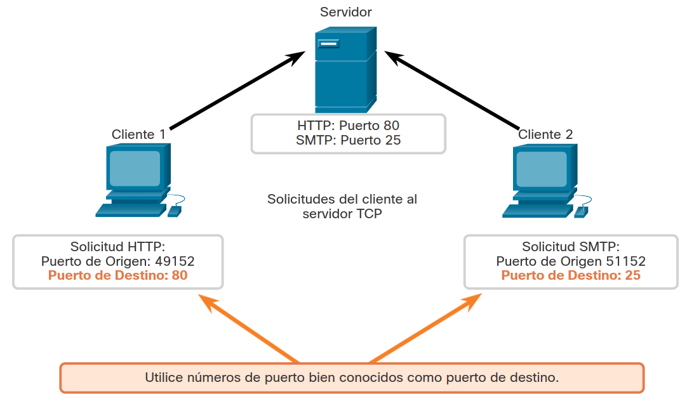
</div>

### Puertos de Origen de Solicitud
Las solicitudes de cliente generan dinámicamente un número de puerto de origen. En este caso, el Cliente 1 está utilizando el puerto de origen 49152 y el Cliente 2 está utilizando el puerto de origen 51152.

<div style="width: 60%;padding-left: 15%;">
	
</div>

### Puertos de Destino de Respuesta
Cuando el servidor responde a las solicitudes del cliente, invierte los puertos de destino y origen de la solicitud inicial. Observe que la respuesta del servidor a la solicitud web ahora tiene el puerto de destino 49152 y la respuesta de correo electrónico ahora tiene el puerto de destino 51152.

<div style="width: 60%;padding-left: 15%;">
	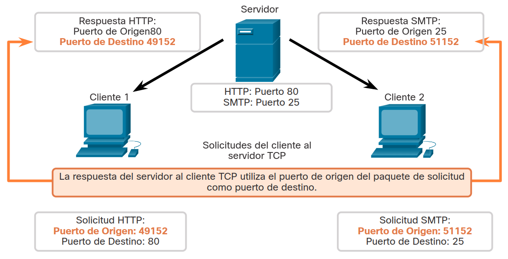
</div>

### Puertos de Origen de Respuesta
El puerto de origen en la respuesta del servidor es el puerto de destino original en las solicitudes iniciales.

<div style="width: 60%;padding-left: 15%;">
	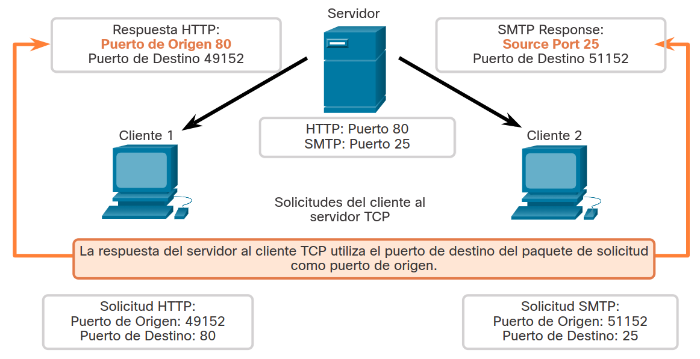
</div>

## Establecimiento de Conexiones TCP
En algunas culturas, cuando dos personas se conocen, generalmente se saludan dándose la mano. Ambas partes entienden el acto de estrechar la mano como una señal de saludo amistoso. Las conexiones en la red son similares. En las conexiones TCP, el cliente host establece la conexión con el servidor mediante el proceso de enlace de tres vías.

### Paso 1. SYN
El cliente de origen solicita una sesión de comunicación con el servidor.

<div style="width: 40%;padding-left: 20%;">
	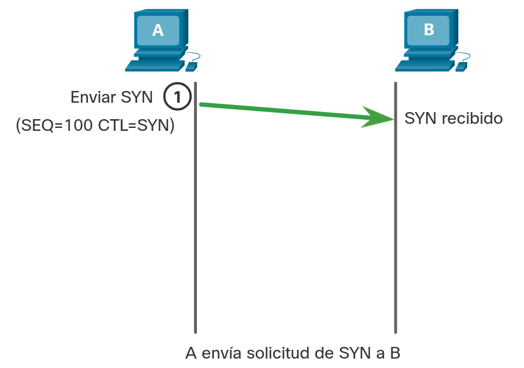
</div>

### Paso 2. ACK y SYN
El servidor acusa recibo de la sesión de comunicación de cliente a servidor y solicita una sesión de comunicación de servidor a cliente.

<div style="width: 40%;padding-left: 20%;">
	
</div>

### Paso 3. ACK
El cliente de origen acusa recibo de la sesión de comunicación de servidor a cliente.

<div style="width: 40%;padding-left: 20%;">
	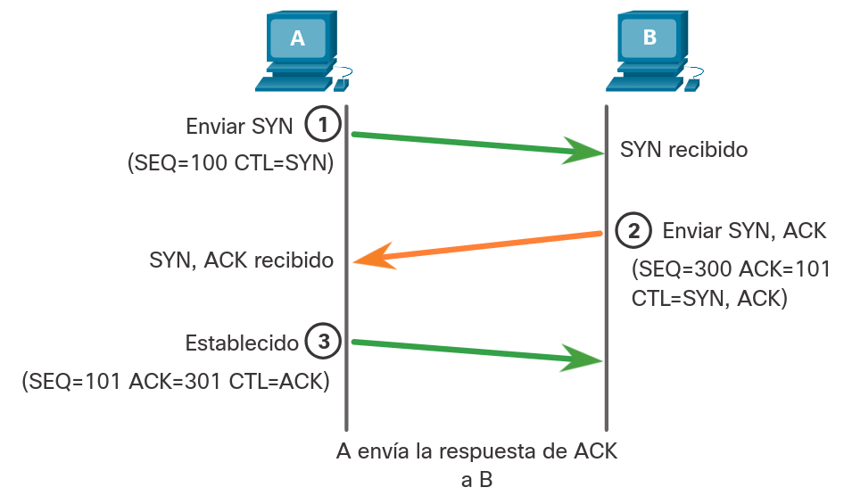
</div>

El protocolo de enlace de tres vías valida que el host de destino esté disponible para comunicarse. En este ejemplo, el host A ha validado que el host B está disponible.

## Terminación de la Sesión
Para cerrar una conexión, se debe establecer el marcador de control de finalización (FIN) en el encabezado del segmento. Para finalizar todas las sesiones TCP de una vía, se utiliza un enlace de dos vías, que consta de un segmento FIN y un segmento de reconocimiento (ACK). Por lo tanto, para terminar una conversación simple admitida por TCP, se requieren cuatro intercambios para finalizar ambas sesiones. El cliente o el servidor pueden iniciar la terminación.

En el ejemplo, los términos cliente y servidor se utilizan como referencia por simplicidad, pero dos hosts que tengan una sesión abierta pueden iniciar el proceso de finalización.

### Paso 1. FIN
Cuando el cliente no tiene más datos para enviar en la transmisión, envía un segmento con el indicador FIN establecido.

<div style="width: 40%;padding-left: 20%;">
	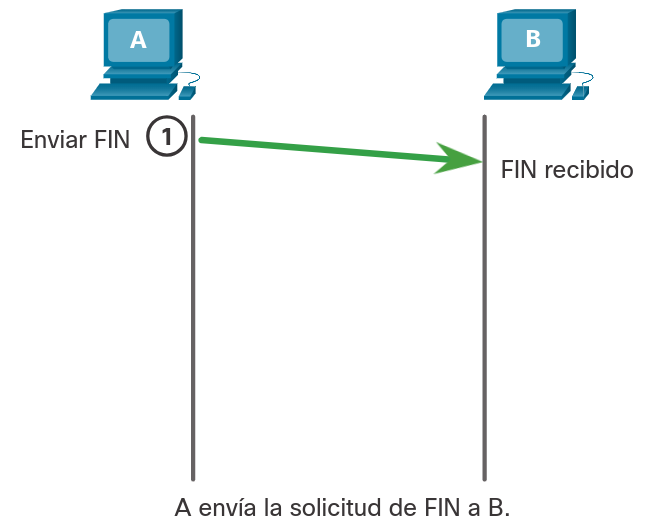
</div>

### Paso 2. ACK
El servidor envía un ACK para acusar recibo del FIN para terminar la sesión de cliente a servidor.

<div style="width: 40%;padding-left: 20%;">
	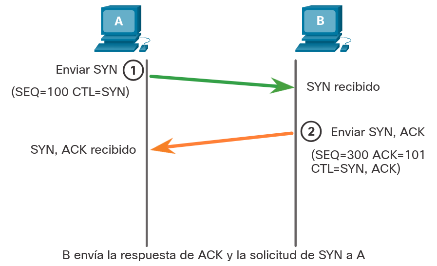
</div>

### Paso 3. FIN
El servidor envía un FIN al cliente para terminar la sesión de servidor a cliente.

<div style="width: 40%;padding-left: 20%;">
	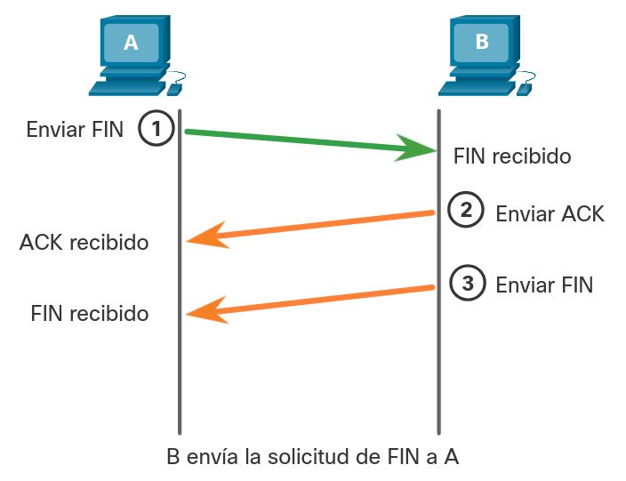
</div>

### Paso 4. ACK
El cliente responde con un ACK para dar acuse de recibo del FIN desde el servidor.

<div style="width: 40%;padding-left: 20%;">
	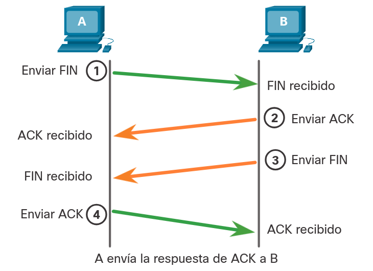
</div>

Una vez reconocidos todos los segmentos, la sesión se cierra.

## Análisis del Protocolo TCP de Enlace de Tres Vias
Los hosts mantienen el estado, rastrean cada segmento de datos dentro de una sesión e intercambian información sobre qué datos se reciben utilizando la información en el encabezado TCP. TCP es un protocolo full-duplex, donde cada conexión representa dos sesiones de comunicación unidireccionales. Para establecer la conexión, los hosts realizan un enlace de tres vías. Como se muestra en la figura, los bits de control en el encabezado TCP indican el progreso y el estado de la conexión.

Estas son las funciones del apretón de manos de tres vías:

* Establece que el dispositivo de destino está presente en la red.
* Verifica que el dispositivo de destino tenga un servicio activo y acepte solicitudes en el número de puerto de destino que el cliente de origen desea utilizar.
* Informa al dispositivo de destino que el cliente de origen intenta establecer una sesión de comunicación en dicho número de puerto.

Una vez que se completa la comunicación, se cierran las sesiones y se finaliza la conexión. Los mecanismos de conexión y sesión habilitan la función de confiabilidad de TCP.

<div style="width: 60%;padding-left: 15%;">
	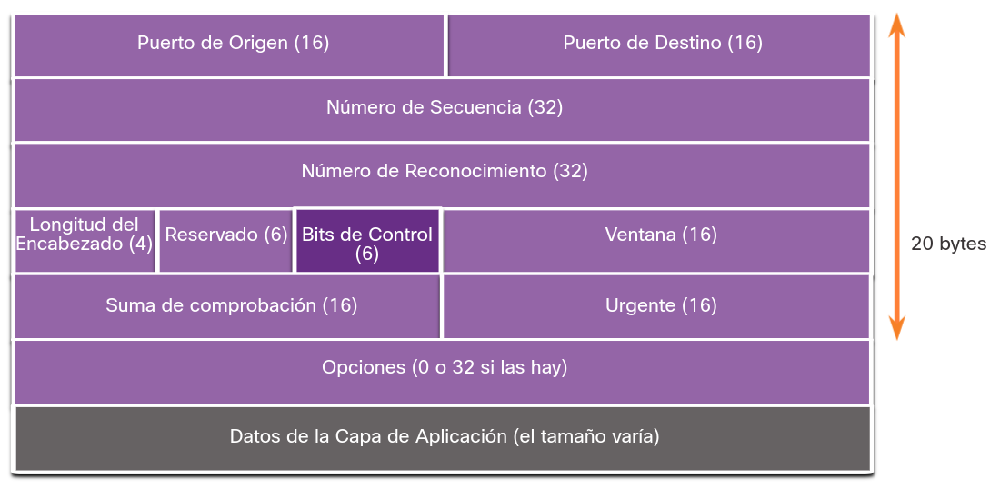
</div>

Los seis bits del campo de bits de control del encabezado del segmento TCP también se conocen como marcadores. Una bandera es un bit que está activado o desactivado.

Los seis indicadores de bits de control son los siguientes:

* __URG__. Campo indicador urgente significativo.
* __ACK__. Indicador de acuse de recibo utilizado en el establecimiento de la conexión y la terminación de la sesión.
* __PSH__. Función de empuje.
* __RST__. Restablece la conexión cuando se produce un error o un tiempo de espera.
* __SYN__. Sincroniza números de secuencia utilizados en el establecimiento de conexión.
* __FIN__. No más datos del remitente y se utilizan en la terminación de la sesión.

# Confiabilidad y Control de Flujo
## Confiabilidad de TCP - Entrega Garantizada y Ordenada
La razón por la que TCP es el mejor protocolo para algunas aplicaciones es porque, a diferencia de UDP, reenvía paquetes descartados y paquetes numerados para indicar su orden correcto antes de la entrega. TCP también puede ayudar a mantener el flujo de paquetes para que los dispositivos no se sobrecarguen. En este tema se tratan detalladamente estas características de TCP.

Puede haber momentos en que los segmentos TCP no llegan a su destino. Otras veces, los segmentos TCP podrían llegar fuera de servicio. Para que el receptor comprenda el mensaje original, los datos en estos segmentos se vuelven a ensamblar en el orden original. Para lograr esto, se asignan números de secuencia en el encabezado de cada paquete. __El número de secuencia representa el primer byte de datos del segmento TCP__.

Durante la configuración de la sesión, se establece un número de secuencia inicial (ISN - _Initial Sequence Number_). Este ISN representa el valor inicial de los bytes que se transmiten a la aplicación receptora. A medida que se transmiten los datos durante la sesión, el número de secuencia se incrementa según el número de bytes que se han transmitido. Este seguimiento de bytes de datos permite identificar y reconocer cada segmento de manera exclusiva. A partir de esto, se pueden identificar segmentos perdidos.

El ISN no comienza en uno, si no que es un número aleatorio. Esto permite evitar ciertos tipos de ataques maliciosos. Para mayor simplicidad, usaremos un ISN de 1 para los ejemplos de este módulo.

Los números de secuencia de segmento indican cómo reensamblar y reordenar los segmentos recibidos, como se muestra en la figura.

<div style="width: 60%;padding-left: 15%;">
	
</div>

El proceso TCP receptor coloca los datos del segmento en un búfer de recepción. Los segmentos se colocan en el orden de secuencia adecuado y se pasan a la capa de aplicación cuando se vuelven a montar. Todos los segmentos que lleguen con números de secuencia desordenados se retienen para su posterior procesamiento. A continuación, cuando llegan los segmentos con bytes faltantes, tales segmentos se procesan en orden.

## Confiabilidad de TCP - Pérdida de Datos y Retransmisión
No importa cuán bien diseñada esté una red, ocasionalmente se produce la pérdida de datos. TCP proporciona métodos para administrar la pérdida de segmentos. Entre estos está un mecanismo para retransmitir segmentos para los datos sin reconocimiento.

El número de secuencia (SEQ) y el número de acuse de recibo (ACK) se utilizan juntos para confirmar la recepción de los bytes de datos contenidos en los segmentos transmitidos. El número SEQ identifica el primer byte de datos en el segmento que se transmite. TCP utiliza el número de ACK reenviado al origen para indicar el próximo byte que el receptor espera recibir. Esto se llama acuse de recibo de expectativa.

Antes de mejoras posteriores, TCP solo podía reconocer el siguiente byte esperado. Por ejemplo, en la figura, utilizando números de segmento para simplificar, el host A envía los segmentos del 1 al 10 al host B. Si llegan todos los segmentos excepto los segmentos 3 y 4, el host B respondería con acuse de recibo especificando que el siguiente segmento esperado es el segmento 3. El host A no tiene idea de si algún otro segmento llegó o no. Por lo tanto, el host A reenviaría los segmentos 3 a 10. Si todos los segmentos de reenvío llegan correctamente, los segmentos 5 a 10 serían duplicados. Esto puede provocar retrasos, congestión e ineficiencias.

<div style="width: 60%;padding-left: 15%;">
	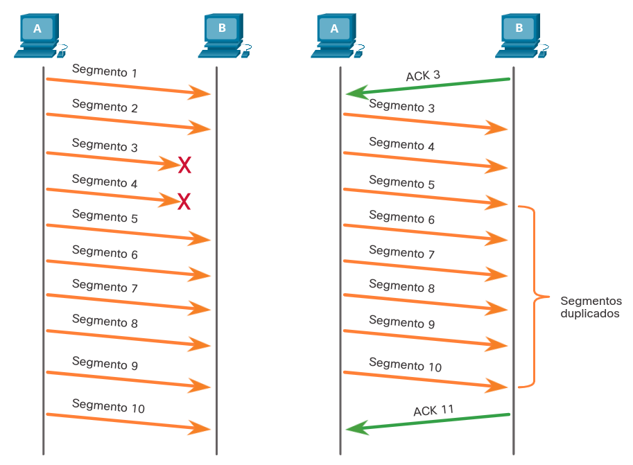
</div>

Los sistemas operativos actualmente suelen emplear una característica TCP opcional llamada reconocimiento selectivo (SACK), negociada durante el protocolo de enlace de tres vías. Si ambos hosts admiten SACK, el receptor puede reconocer explícitamente qué segmentos (bytes) se recibieron, incluidos los segmentos discontinuos. Por lo tanto, el host emisor solo necesitaría retransmitir los datos faltantes. Por ejemplo, en la siguiente figura, utilizando de nuevo números de segmento para simplificar, el host A envía los segmentos 1 a 10 al host B. Si llegan todos los segmentos excepto los segmentos 3 y 4, el host B puede reconocer que ha recibido los segmentos 1 y 2 (ACK 3) y reconocer selectivamente los segmentos 5 a 10 (SACK 5-10). El host A solo necesitaría reenviar los segmentos 3 y 4.

<div style="width: 60%;padding-left: 15%;">
	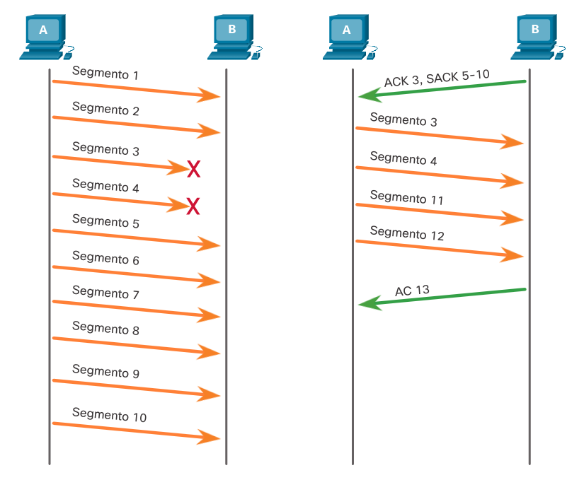
</div>

__Nota__: TCP normalmente envía ACK para cada otro paquete, pero otros factores más allá del alcance de este tema pueden alterar este comportamiento.

TCP utiliza temporizadores para saber cuánto tiempo debe esperar antes de reenviar un segmento. En la figura, reproduzca el vídeo y haga clic en el enlace para descargar el archivo PDF. El vídeo y el archivo PDF examinan la pérdida y la retransmisión de datos.

## Control de Flujo TCP - Tamaño de la Ventana y Acuses de Recibo
TCP también proporciona mecanismos para el control de flujo. El control de flujo es la cantidad de datos que el destino puede recibir y procesar de manera confiable. El control de flujo permite mantener la confiabilidad de la transmisión de TCP mediante el ajuste de la velocidad del flujo de datos entre el origen y el destino para una sesión dada. Para lograr esto, el encabezado TCP incluye un campo de 16 bits llamado "tamaño de la ventana" (_window size_).

En la figura, se muestra un ejemplo de tamaño de ventana y reconocimientos.

<div style="width: 60%;padding-left: 15%;">
	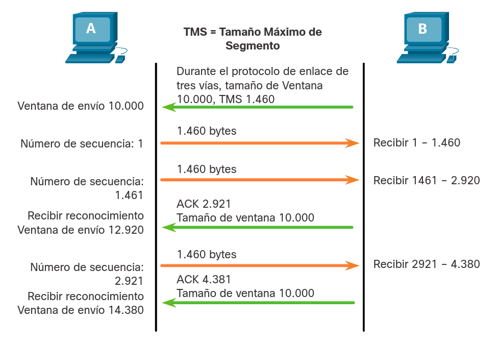
</div>

El tamaño de la ventana determina la cantidad de bytes que se pueden enviar para recibir un reconocimiento. El número de reconocimiento es el número del siguiente byte esperado.

El tamaño de ventana es la cantidad de bytes que el dispositivo de destino de una sesión TCP puede aceptar y procesar al mismo tiempo. En este ejemplo, el tamaño de la ventana inicial de la PC B para la sesión TCP es de 10,000 bytes. A partir del primer byte, el byte1, el último byte que A puede enviar sin recibir un reconocimiento es el byte 10.000. Esto se conoce como la ventana de envío (_send window_) de A. El tamaño de la ventana se incluye en cada segmento TCP para que el destino pueda modificar el tamaño de la ventana en cualquier momento dependiendo de la disponibilidad del búfer.

El tamaño inicial de la ventana se acuerda cuando se establece la sesión TCP durante la realización del enlace de tres vías. El dispositivo de origen debe limitar el número de bytes enviados al dispositivo de destino en función del tamaño de la ventana del destino. El dispositivo de origen puede continuar enviando más datos para la sesión solo cuando obtiene un reconocimiento de los bytes recibidos. Por lo general, el destino no esperará que se reciban todos los bytes de su tamaño de ventana antes de contestar con un acuse de recibo. A medida que se reciben y procesan los bytes, el destino envía reconocimientos para informar al origen que puede continuar enviando bytes adicionales.

Por ejemplo, es típico que B no espere hasta que se hayan recibido los 10.000 bytes antes de enviar un acuse de recibo. Esto significa que A puede ajustar su ventana de envío a medida que recibe confirmaciones de B. Como se muestra en la figura, cuando A recibe una confirmación con el número de confirmación 2.921, que es el siguiente byte esperado, la ventana de envío de A incrementará 2.920 bytes. Esto cambia la ventana de envío de 10.000 bytes a 12.920, lo que significa que A puede ajustar su ventana de envío a medida que recibe confirmaciones de B cuando la A recibe una confirmación con el número de confirmación 2.921, que es el siguiente byte esperado.

Un destino que envía confirmaciones a medida que procesa los bytes recibidos, y el ajuste continuo de la ventana de envío de origen, se conoce como ventanas deslizantes (sliding window). En el ejemplo anterior, la ventana de envío de A aumenta o se desliza sobre otros 2.921 bytes de 10.000 a 12.920.

Si disminuye la disponibilidad de espacio de búfer del destino, puede reducir su tamaño de ventana para informar al origen que reduzca el número de bytes que debe enviar sin recibir un reconocimiento.

__Nota__: Hoy en día, los dispositivos utilizan el protocolo de ventanas deslizantes. El receptor generalmente envía un acuse de recibo después de cada dos segmentos que recibe. El número de segmentos recibidos antes de que se acuse recibo puede variar. La ventaja de las ventanas deslizantes es que permiten que el emisor transmita continuamente segmentos mientras el receptor está acusando recibo de los segmentos anteriores. Los detalles de las ventanas deslizantes exceden el ámbito de este curso.

## Control de Flujo TCP - Tamaño Máximo de Segmento
En la figura, la fuente está transmitiendo 1.460 bytes de datos dentro de cada segmento TCP. Normalmente, es el Tamaño Máximo de Segmento (MSS - _Maximum Segment Size_) que puede recibir el dispositivo de destino. El MSS forma parte del campo de opciones del encabezado TCP que especifica la mayor cantidad de datos, en bytes, que un dispositivo puede recibir en un único segmento TCP. El tamaño MSS no incluye el encabezado TCP. El MSS se incluye normalmente durante el apretón de manos de tres vías.

<div style="width: 60%;padding-left: 15%;">
	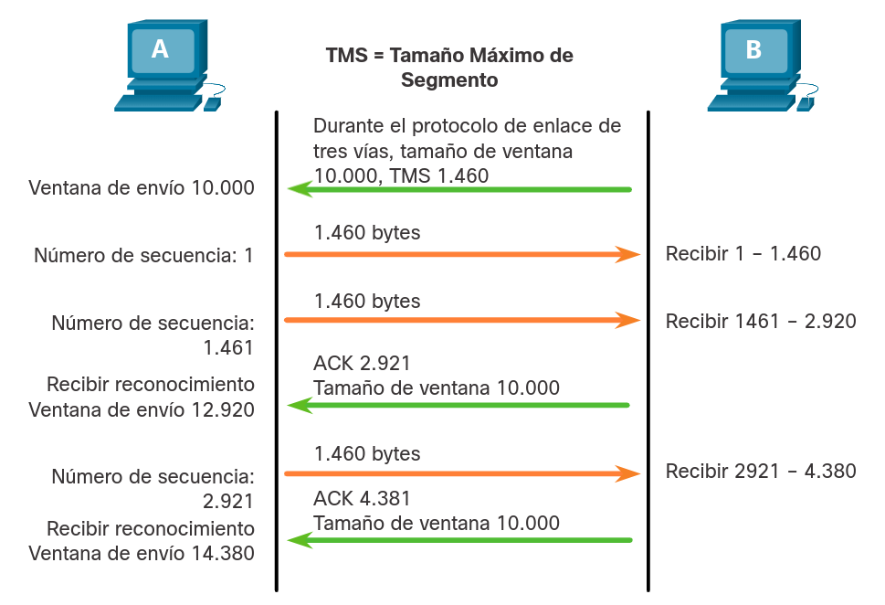
</div>

Un MSS común es de 1.460 bytes cuando se usa IPv4. Un host determina el valor de su campo de MSS restando los encabezados IP y TCP de unidad Máxima de transmisión (MTU) de Ethernet. En una interfaz de Ethernet, el MTU predeterminado es de 1500 bytes. Restando el encabezado IPv4 de 20 bytes y el encabezado TCP de 20 bytes, el tamaño predeterminado de MSS será 1460 bytes, como se muestra en la figura.

<div style="width: 60%;padding-left: 15%;">
	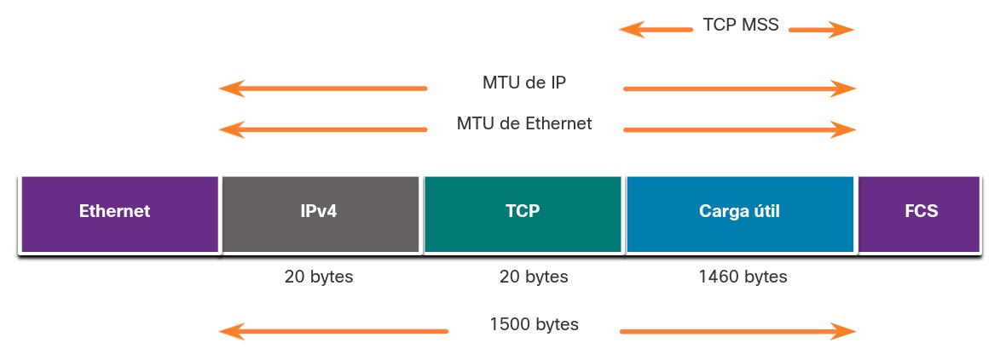
</div>

## Control de Flujo TCP - Prevención de Congestión
Cuando se produce congestión en una red, el router sobrecargado comienza a descartar paquetes. Cuando los paquetes que contienen segmentos TCP no llegan a su destino, se dejan sin confirmar. Mediante la determinación de la tasa a la que se envían pero no se reconocen los segmentos TCP, el origen puede asumir un cierto nivel de congestión de la red.

Siempre que haya congestión, se producirá la retransmisión de los segmentos TCP perdidos del origen. Si la retransmisión no se controla adecuadamente, la retransmisión adicional de los segmentos TCP puede empeorar aún más la congestión. No sólo se introducen en la red los nuevos paquetes con segmentos TCP, sino que el efecto de retroalimentación de los segmentos TCP retransmitidos que se perdieron también se sumará a la congestión. Para evitar y controlar la congestión, TCP emplea varios mecanismos, temporizadores y algoritmos de manejo de la congestión.

Si el origen determina que los segmentos TCP no están siendo reconocidos o que sí son reconocidos pero no de una manera oportuna, entonces puede reducir el número de bytes que envía antes de recibir un reconocimiento. Como se ilustra en la figura, A detecta que hay congestión y, por lo tanto, reduce el número de bytes que envía antes de recibir un acuse de recibo de B.

<div style="width: 60%;padding-left: 15%;">
	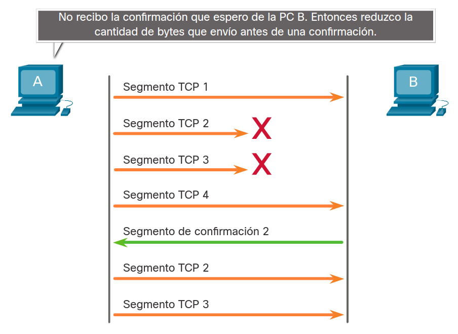
</div>

Los números de acuse de recibo corresponden al siguiente byte esperado y no a un segmento. Los números de segmentos utilizados se simplifican con fines ilustrativos.

Tenga en cuenta que es el origen el que está reduciendo el número de bytes sin reconocimiento que envía y no el tamaño de ventana determinado por el destino.

__Nota__: La explicación de los mecanismos, temporizadores y algoritmos reales de manejo de la congestión se encuentra fuera del alcance de este curso.

# Comunicación UDP
## Bajo Costo UDP vs Confiabilidad
Como se explicó anteriormente, UPD es perfecto para comunicaciones que necesitan ser rápidas, como VoIP. Este tema explica en detalle por qué UDP es perfecto para algunos tipos de transmisiones. Como se muestra en la figura, UDP no establece una conexión. UDP suministra transporte de datos con baja sobrecarga debido a que posee un encabezado de datagrama pequeño sin tráfico de administración de red.

<div style="width: 60%;padding-left: 15%;">
	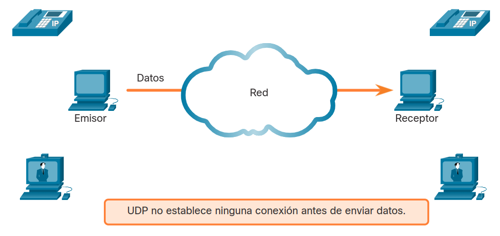
</div>

## Rearmado de Datagramas UDP
Tal como los segmentos con TCP, cuando se envían datagramas UDP a un destino, a menudo toman diferentes rutas y llegan en el orden equivocado. UDP no realiza un seguimiento de los números de secuencia de la manera en que lo hace TCP. UDP no tiene forma de reordenar datagramas en el orden en que se transmiten, como se muestra en la ilustración.

Por lo tanto, UDP simplemente reensambla los datos en el orden en que se recibieron y los envía a la aplicación. Si la secuencia de datos es importante para la aplicación, esta debe identificar la secuencia adecuada y determinar cómo se deben procesar los datos.

<div style="width: 60%;padding-left: 15%;">
	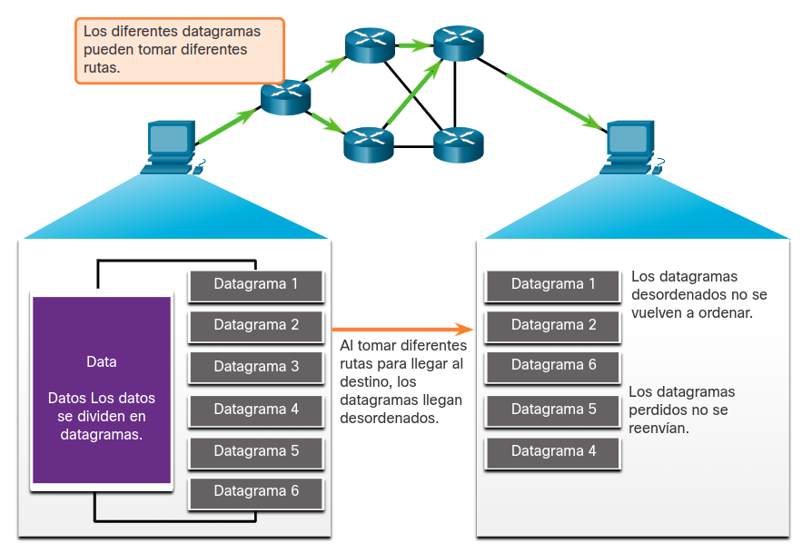
</div>

## Procesos y Solicitudes del Servidor UDP
Al igual que las aplicaciones basadas en TCP, a las aplicaciones de servidor basadas en UDP se les asignan números de puerto conocidos o registrados, como se muestra en la figura. Cuando estas aplicaciones o estos procesos se ejecutan en un servidor, aceptan los datos que coinciden con el número de puerto asignado. Cuando UDP recibe un datagrama destinado a uno de esos puertos, envía los datos de aplicación a la aplicación adecuada en base a su número de puerto.

<div style="width: 60%;padding-left: 15%;">
	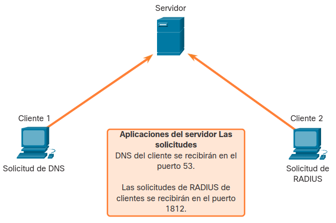
</div>

## Procesos de Cliente UDP
Como en TCP, la comunicación cliente-servidor es iniciada por una aplicación cliente que solicita datos de un proceso de servidor. El proceso de cliente UDP selecciona dinámicamente un número de puerto del intervalo de números de puerto y lo utiliza como puerto de origen para la conversación. Por lo general, el puerto de destino es el número de puerto bien conocido o registrado que se asigna al proceso de servidor.

Una vez que el cliente selecciona los puertos de origen y de destino, este mismo par de puertos se utiliza en el encabezado de todos los datagramas que se utilizan en la transacción. Para la devolución de datos del servidor al cliente, se invierten los números de puerto de origen y destino en el encabezado del datagrama.

Las siguientes imágenes muestran a dos hosts que solicitan servicios del servidor de autenticación DNS y RADIUS.

* __Clientes enviando solicitudes UDP__
El Cliente 1 envía una solicitud de DNS mientras que el Cliente 2 solicita los servicios de autenticación RADIUS del mismo servidor.

<div style="width: 60%;padding-left: 15%;">
	
</div>

* __Puertos de destino de la solicitud UDP__
El cliente 1 está enviando una solicitud DNS utilizando el conocido puerto de destino 53, mientras que el cliente 2 solicita servicios de autenticación RADIUS mediante el puerto registrado de destino 1812.

<div style="width: 60%;padding-left: 15%;">
	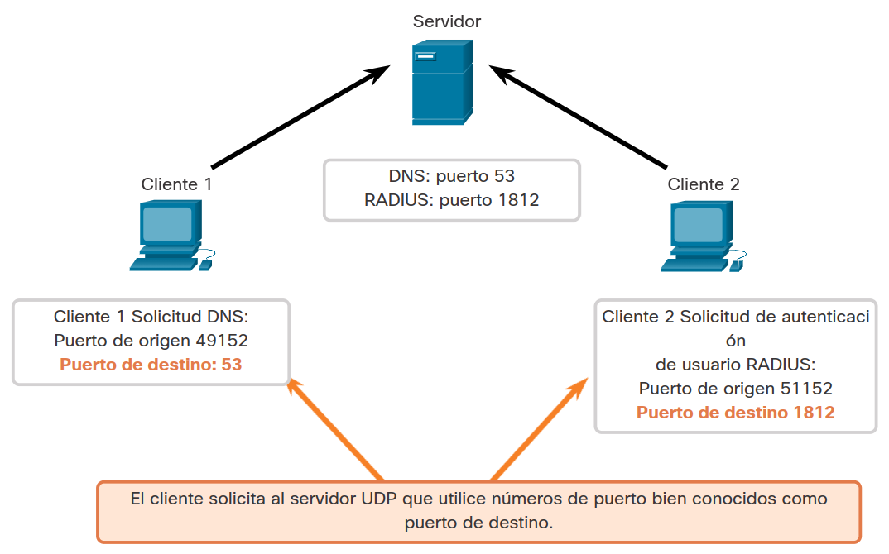
</div><br />

* __Puertos de origen de la solicitud UDP__
Las solicitudes de los clientes generan dinámicamente números de puerto de origen. En este caso, el cliente 1 está utilizando el puerto de origen 49152 y el cliente 2 está utilizando el puerto de origen 51152.

<div style="width: 60%;padding-left: 15%;">
	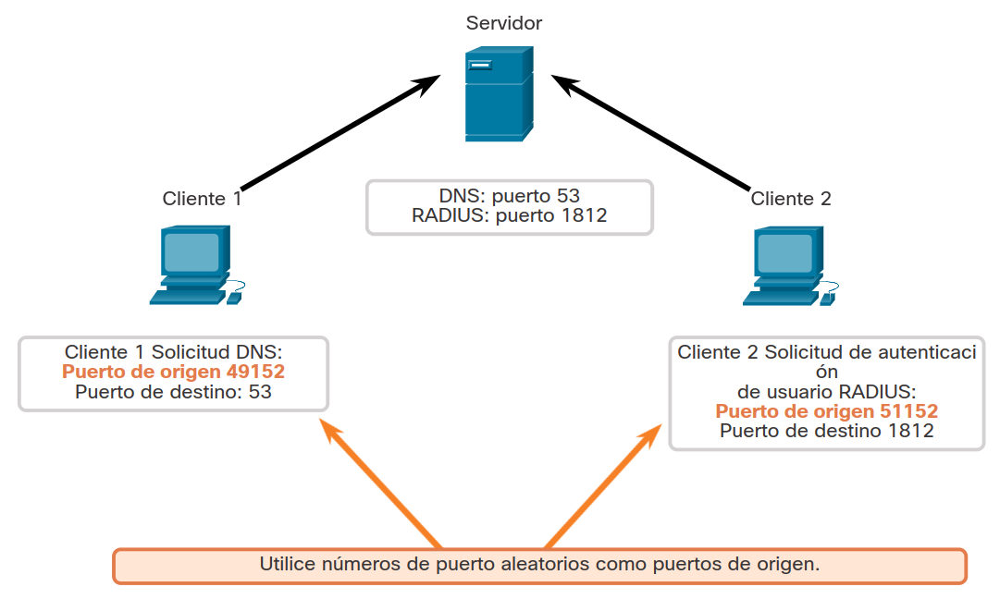
</div><br />

* __Destino de respuesta UDP__
Cuando el servidor responde a las solicitudes del cliente, invierte los puertos de destino y origen de la solicitud inicial. En la respuesta del servidor a la solicitud DNS ahora es el puerto de destino 49152 y la respuesta de autenticación RADIUS ahora es el puerto de destino 51152.

<div style="width: 60%;padding-left: 15%;">
	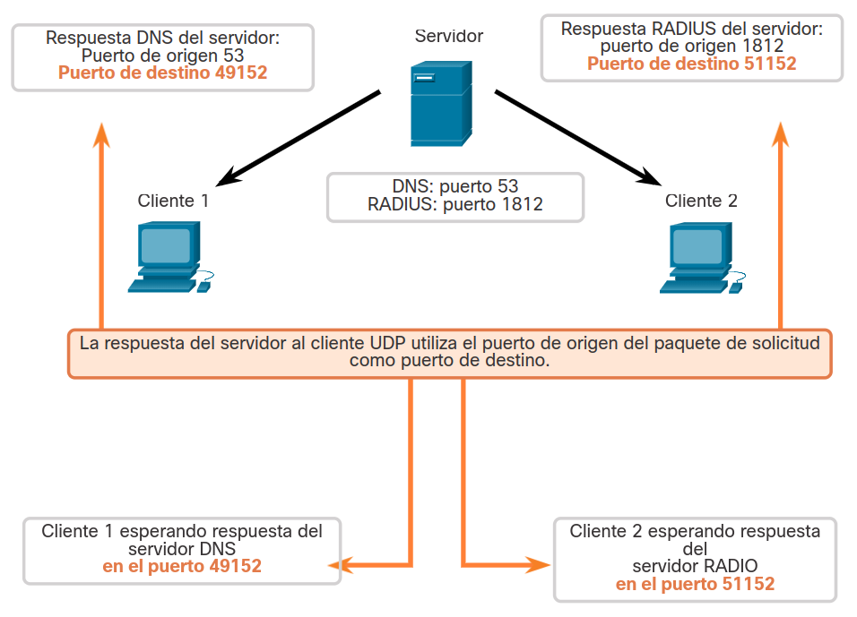
</div>

* __Puertos de origen de respuesta UDP__
Los puertos de origen en la respuesta del servidor son los puertos de destino originales en las solicitudes iniciales.

<div style="width: 60%;padding-left: 15%;">
	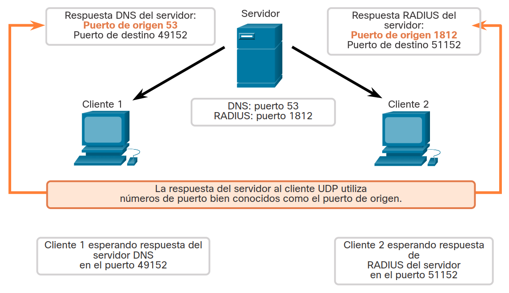
</div>

# Resumen
## Packet Tracer - Comunicaciones TCP y UDP
* <a href="./notes/pt_tcp_udp.md" target="_blank">Actividad</a>

## La Capa de Transporte
Los programas de capa de aplicación generan datos que deben intercambiarse entre los hosts de origen y de destino. La capa de transporte es responsable de las comunicaciones lógicas entre aplicaciones que se ejecutan en diferentes hosts. La capa de transporte incluye dos protocolos: Protocolo de control de transmisión TCP y Protocolo de datagramas de usuario UDP.
* Seguimiento de conversaciones individuales - En la capa de transporte, cada conjunto de datos que fluye entre una aplicación de origen y una aplicación de destino se conoce como conversación y se realiza un seguimiento por separado. Es responsabilidad de la capa de transporte mantener y hacer un seguimiento de todas estas conversaciones.
* Segmentación de Datos y Reensamblaje de Segmentos - Es responsabilidad de la capa de transporte dividir los datos de la aplicación en bloques de tamaño adecuado. Dependiendo del protocolo de capa de transporte utilizado, los bloques de capa de transporte se denominan segmentos o datagramas.
* Agregar Información del Encabezado - El protocolo de la capa de transporte también agrega información de encabezado que contiene datos binarios organizados en varios campos para cada bloque de datos.
* Identificación de las Aplicaciones - La capa de transporte debe poder separar y administrar múltiples comunicaciones con diferentes necesidades de requisitos de transporte.
* Multiplexación de Conversaciones - El envío de algunos tipos de datos (por ejemplo, una transmisión de video) a través de una red, como una transmisión de comunicación completa, puede consumir todo el ancho de banda disponible. La capa de transporte utiliza segmentación y multiplexación para permitir que diferentes conversaciones de comunicación se intercalen en la misma red.

Los protocolos de capa de transporte especifican cómo transferir mensajes entre hosts y son responsables de administrar los requisitos de fiabilidad de una conversación. La capa de transporte incluye los protocolos TCP y UDP.

TCP proporciona confiabilidad y control de flujo mediante estas operaciones básicas:

* Numerar y rastrear segmentos de datos transmitidos a un host específico desde una aplicación específica.
* Reconocer los datos recibidos.
* Vuelver a transmitir cualquier información no reconocida después de un cierto período de tiempo.
* Datos de secuencia que pueden llegar en un orden incorrecto.
* Enviar datos a una velocidad eficiente que sea aceptable por el receptor.

Para mantener el estado de una conversación y realizar un seguimiento de la información, TCP debe establecer primero una conexión entre el remitente y el receptor. Es por eso que TCP se conoce como un protocolo orientado a la conexión.

UDP es un protocolo sin conexión. Debido a que UDP no proporciona fiabilidad ni control de flujo, no requiere una conexión establecida. Debido a que UDP no realiza un seguimiento de la información enviada o recibida entre el cliente y el servidor, UDP también se conoce como protocolo sin estado. UDP también se conoce como un protocolo de entrega de mejor esfuerzo porque no hay reconocimiento de que los datos se reciben en el destino. Con UDP, no existen procesos de capa de transporte que informen al emisor si la entrega se realizó correctamente. UDP es preferible para aplicaciones como Voz sobre IP (VoIP). Los reconocimientos y la retransmisión retrasarían la entrega y harían inaceptable la conversación de voz. UDP también es utilizado por las aplicaciones de solicitud y respuesta donde los datos son mínimos, y la retransmisión se puede hacer rápidamente.

Para otras aplicaciones es importante que todos los datos lleguen y que puedan ser procesados en su secuencia adecuada. Para estos tipos de aplicaciones, TCP se utiliza como protocolo de transporte. Por ejemplo, las aplicaciones como las bases de datos, los navegadores web y los clientes de correo electrónico, requieren que todos los datos que se envían lleguen a destino en su formato original. Cualquier dato faltante podría corromper una comunicación, haciéndola incompleta o ilegible.

## Descripción General de TCP
Además de admitir las funciones básicas de segmentación y reensamblado de datos, TCP también proporciona los siguientes servicios:
* Establece una sesión - TCP es un protocolo orientado a la conexión que negocia y establece una conexión permanente (o sesión) entre los dispositivos de origen y destino antes de reenviar cualquier tráfico. Mediante el establecimiento de sesión, los dispositivos negocian la cantidad de tráfico que se puede reenviar en un momento determinado, y los datos que se comunican entre ambos se pueden administrar detenidamente.
* Garantiza una entrega confiable - Por muchas razones, es posible que un segmento se corrompa o se pierda por completo, ya que se transmite a través de la red. TCP asegura que cada segmento que envía la fuente llega al destino.
* Proporciona entrega en el mismo pedido - Debido a que las redes pueden proporcionar múltiples rutas que pueden tener diferentes velocidades de transmisión, los datos pueden llegar en el orden incorrecto. Al numerar y secuenciar los segmentos, TCP garantiza que los segmentos se vuelvan a ensamblar en el orden correcto.
* Admite control de flujo - Los hosts de red tienen recursos limitados (es decir, memoria y potencia de procesamiento). Cuando TCP advierte que estos recursos están sobrecargados, puede solicitar que la aplicación emisora reduzca la velocidad del flujo de datos. Esto lo lleva a un cabo TCP, que regula la cantidad de datos que transmite el origen. El control de flujo puede evitar la necesidad de retransmitir los datos cuando los recursos del host receptor se ven desbordados.

TCP es un protocolo con estado, lo que significa que realiza un seguimiento del estado de la sesión de comunicación. Para hacer un seguimiento del estado de una sesión, TCP registra qué información se envió y qué información se reconoció. La sesión con estado comienza con el establecimiento de la sesión y termina con la finalización de la sesión.

Los diez campos en el encabezado TCP son los siguientes:

* Puerto de Origen - Un campo de 16 bits que se utiliza para identificar la aplicación de origen por número de puerto.
* Puerto de Destino - Un campo de 16 bits que se utiliza para identificar la aplicación de destino por número de puerto.
* Número de Secuencia - Un campo de 32 bits que se utiliza para fines de reensamblaje de datos.
* Número de Acuse de Recibo - Un campo de 32 bits que se utiliza para indicar que se han recibido datos y que se espera el próximo byte de la fuente.
* Longitud del Encabezado - Un campo de 4 bits conocido como "desplazamiento de datos" que indica la longitud del encabezado del segmento TCP.
* Reservado - Un campo de 6 bits que está reservado para uso futuro.
* Bits de Control - Un campo de 6 bits que incluye códigos de bits o indicadores que indican el propósito y la función del segmento TCP.
* Tamaño de la Ventana - Un campo de 16 bits que se utiliza para indicar el número de bytes que se pueden aceptar a la vez.
* Suma de Comprobación - Un campo de 16 bits que se utiliza para la comprobación de errores del encabezado y los datos del segmento.
* Urgente - Un campo de 16 bits que se utiliza para indicar si los datos contenidos son urgentes.

TCP es un buen ejemplo de cómo las diferentes capas del conjunto de protocolos TCP/IP tienen roles específicos. TCP maneja todas las tareas asociadas con la división del flujo de datos en segmentos, proporcionando confiabilidad, controlando el flujo de datos y reordenando segmentos. TCP libera la aplicación de tener que administrar estas tareas. HTTP, FTP, SMTP y SSH pueden simplemente enviar el flujo de datos a la capa de transporte y usar los servicios de TCP.

## Descripción General de UDP
UDP es un protocolo de transporte liviano que ofrece la misma segmentación y rearmado de datos que TCP, pero sin la confiabilidad y el control del flujo de TCP.
Las características UDP incluyen lo siguiente:

* Los datos se reconstruyen en el orden en que se recibieron.
* Los segmentos perdidos no se vuelven a enviar.
* No hay establecimiento de sesión.
* El envío no está informado sobre la disponibilidad de recursos.

UDP es un protocolo sin estado, lo que significa que ni el cliente ni el servidor rastrean el estado de la sesión de comunicación. Si se requiere confiabilidad al utilizar UDP como protocolo de transporte, a esta la debe administrar la aplicación.

Los bloques de comunicación en UDP se denominan datagramas o segmentos. Estos datagramas se envían como el mejor esfuerzo por el protocolo de la capa de transporte. El encabezado UDP es mucho más simple que el encabezado TCP porque solo tiene cuatro campos y requiere 8 bytes (es decir, 64 bits).

Los cuatro campos en el encabezado UDP son los siguientes:

* Puerto de Origen - Un campo de 16 bits que se utiliza para identificar la aplicación de origen por número de puerto.
* Puerto de Destino - Un campo de 16 bits que se utiliza para identificar la aplicación de destino por número de puerto.
* Longitud - Un campo de 16 bits que indica la longitud del encabezado del datagrama UDP.
* Suma de Comprobación - Un campo de 16 bits que se utiliza para la comprobación de errores del encabezado y los datos del datagrama.

Hay tres tipos de aplicaciones que se adaptan mejor a UDP: aplicaciones de video en vivo y multimedia, aplicaciones simples de solicitud y respuesta, aplicaciones que manejan la confiabilidad por sí mismas.

## Números de Puerto
Los protocolos de capa de transporte TCP y UDP utilizan números de puerto para administrar múltiples conversaciones simultáneas. Los campos de encabezado TCP y UDP identifican un número de puerto de origen y destino de la aplicación. El número de puerto de origen está asociado con la aplicación de origen en el host local, mientras que el número de puerto de destino está asociado con la aplicación de destino en el host remoto.
Los puertos de origen y de destino se colocan dentro del segmento. Los segmentos se encapsulan dentro de un paquete IP. El paquete IP contiene la dirección IP de origen y de destino. Se conoce como socket a la combinación de la dirección IP de origen y el número de puerto de origen, o de la dirección IP de destino y el número de puerto de destino.

El socket se utiliza para identificar el servidor y el servicio que solicita el cliente. Un socket de cliente puede ser parecido a esto, donde 1099 representa el número de puerto de origen: 192.168.1.5:1099 El socket en un servidor web podría ser el siguiente: 192.168.1.7:80 Juntos, estos dos sockets se combinan para formar un par de sockets: 192.168.1.5:1099, 192.168.1.7:80 Los sockets permiten que los diversos procesos que se ejecutan en un cliente se distingan entre sí. También permiten la diferenciación de diferentes conexiones a un proceso de servidor.

La IANA es la organización de estándares responsable de asignar varios estándares de direccionamiento, incluidos los números de puerto de 16 bits. Los 16 bits utilizados para identificar los números de puerto de origen y destino proporcionan un rango de puertos entre 0 y 65535.

La IANA ha dividido el rango de números en los siguientes tres grupos de puertos:

* Puertos Bien Conocidos (0 a 1,023)
* Puertos Registrados (1,024 a 49,151)
* Puertos Privados y/o Dinámicos (49,152 a 65,535)

Las conexiones TCP no identificadas pueden representar una importante amenaza a la seguridad. Pueden indicar que algo o alguien está conectado al host local. Netstat es una utilidad de red importante que puede usarse para verificar esas conexiones. Ingrese el comando netstat para enumerar los protocolos en uso, la dirección local y los números de puerto, la dirección externa y los números de puerto, y el estado de la conexión. De forma predeterminada, el comando netstat intentará resolver las direcciones IP en nombres de dominio y los números de puerto en aplicaciones conocidas.

## Proceso de Comunicación TCP
La razón por la que TCP es el mejor protocolo para algunas aplicaciones es porque, a diferencia de UDP, reenvía paquetes descartados y paquetes numerados para indicar su orden correcto antes de la entrega. TCP también puede ayudar a mantener el flujo de paquetes para que los dispositivos no se sobrecarguen.
Los números de secuencia se asignan en el encabezado de cada paquete para garantizar que todos los segmentos lleguen en el orden correcto al destino. El número de secuencia representa el primer byte de datos del segmento TCP. Durante la configuración de la sesión, se establece un número de secuencia inicial (ISN). Este ISN representa el valor inicial de los bytes que se transmiten a la aplicación receptora. A medida que se transmiten los datos durante la sesión, el número de secuencia se incrementa según el número de bytes que se han transmitido. Este seguimiento de bytes de datos permite identificar y reconocer cada segmento de manera exclusiva. A partir de esto, se pueden identificar segmentos perdidos.
El número de secuencia (SEQ) y el número de acuse de recibo (ACK) se utilizan juntos para confirmar la recepción de los bytes de datos contenidos en los segmentos transmitidos. El número SEQ identifica el primer byte de datos en el segmento que se transmite. TCP utiliza el número de ACK reenviado al origen para indicar el próximo byte que el receptor espera recibir. Esto se llama acuse de recibo de expectativa.

TCP también proporciona mecanismos para el control de flujo. El control de flujo es la cantidad de datos que el destino puede recibir y procesar de manera confiable. El control de flujo permite mantener la confiabilidad de la transmisión de TCP mediante el ajuste de la velocidad del flujo de datos entre el origen y el destino para una sesión dada. Para lograr esto, el encabezado TCP incluye un campo de 16 bits llamado “tamaño de la ventana”.

El tamaño de la ventana determina la cantidad de bytes que se pueden enviar para recibir un reconocimiento. El número de reconocimiento es el número del siguiente byte esperado. El tamaño inicial de la ventana se acuerda cuando se establece la sesión TCP durante la realización del enlace de tres vías. El dispositivo de origen debe limitar el número de bytes enviados al dispositivo de destino en función del tamaño de la ventana del destino. El dispositivo de origen puede continuar enviando más datos para la sesión solo cuando obtiene un reconocimiento de los bytes recibidos.

El MSS forma parte del campo de opciones del encabezado TCP que especifica la mayor cantidad de datos, en bytes, que un dispositivo puede recibir en un único segmento TCP. El tamaño MSS no incluye el encabezado TCP. El MSS se incluye normalmente durante el apretón de manos de tres vías.

Siempre que haya congestión, se producirá la retransmisión de los segmentos TCP perdidos del origen. Si la retransmisión no se controla adecuadamente, la retransmisión adicional de los segmentos TCP puede empeorar aún más la congestión. Para evitar y controlar la congestión, TCP emplea varios mecanismos, temporizadores y algoritmos de manejo de la congestión.

## Comunicaciones UDP
UDP no establece ninguna conexión. UDP suministra transporte de datos con baja sobrecarga debido a que posee un encabezado de datagrama pequeño sin tráfico de administración de red.
Tal como los segmentos con TCP, cuando se envían datagramas UDP a un destino, a menudo toman diferentes rutas y llegan en el orden equivocado. UDP no realiza un seguimiento de los números de secuencia de la manera en que lo hace TCP. Por lo tanto, UDP simplemente reensambla los datos en el orden en que se recibieron y los envía a la aplicación.

Al igual que las aplicaciones basadas en TCP, a las aplicaciones de servidor basadas en UDP se les asignan números de puerto bien conocidos o registrados. Cuando estas aplicaciones o estos procesos se ejecutan en un servidor, aceptan los datos que coinciden con el número de puerto asignado. Cuando UDP recibe un datagrama destinado a uno de esos puertos, envía los datos de aplicación a la aplicación adecuada en base a su número de puerto.

Después de que un cliente ha seleccionado los puertos de origen y destino, se utiliza el mismo par de puertos en el encabezado de todos los datagramas en la transacción. Para la devolución de datos del servidor al cliente, se invierten los números de puerto de origen y destino en el encabezado del datagrama.

## Enlaces de interés
* <a href="https://www.rfc-es.org/rfc/rfc0793-es.txt" target="_blank">Protocolo de Control de Transmisión - TCP</a>
* <a href="https://www.rfc-es.org/rfc/rfc0768-es.txt" target="_blank">Protocolo de Datagramas de Usuario - UDP</a>
* <a href="https://learn.microsoft.com/es-es/troubleshoot/windows-server/networking/dns-works-on-tcp-and-udp" target="_blank">DNS u otros servicios funcionan en TCP y UDP</a>
* <a href="https://packetlife.net/blog/2011/mar/2/tcp-flags-psh-and-urg/" target="_blank">TCP Flags: PSH and URG</a>
* <a href="https://www.extrahop.com/blog/tcp-windowing-sliding-window-protocol-congestion-extrahop" target="_blank">TCP Windowing</a>
<br />
<br />
<br />
<br />
<br />
<a href="#9-la-capa-de-transporte">⬆️</a>
<a href="./00-Curso.md"><< Menú principal del módulo</a>