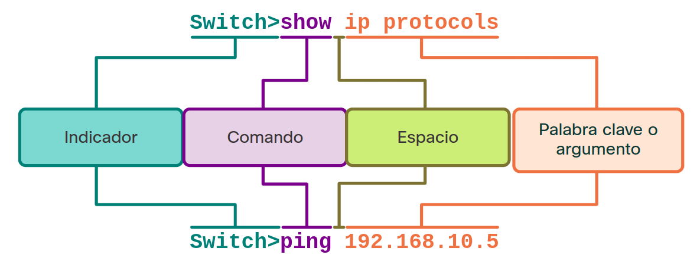

<a href="./00-Curso.md"><< Menú principal del módulo</a>

# 10. La Línea de Comandos del IOS de Cisco
# Navegación del IOS
## La Interfaz de Línea de Comandos de IOS de Cisco
La interfaz de línea de comandos (CLI) del IOS de Cisco es un programa basado en texto que permite el ingreso y la ejecución de los comandos del IOS de Cisco para configurar, monitorear y mantener los dispositivos de Cisco. La CLI de Cisco puede ser utilizada para tareas de administración tanto dentro de banda como fuera de banda.

Utilice los comandos de la CLI para modificar la configuración del dispositivo y para mostrar el estado actual de los procesos del enrutador. Para los usuarios avanzados, la CLI ofrece muchas características que sirven para ahorrar tiempo al crear configuraciones simples y complejas. Casi todos los dispositivos de red Cisco utilizan una CLI similar. Cuando el enrutador ha completado la secuencia de encendido y aparece el indicador Router>, se puede utilizar la CLI para ingresar los comandos IOS de Cisco, como se muestra en la salida del comando.

```bash
Router con0 is now available

Press RETURN to get started!

Router> enable
Router# configure terminal
Enter configuration commands, one per line. End with CNTL/Z.
Router(config)# hostname R1
R1(config)# interface gigabitethernet 0/0/0
R1(config-if)#
```
A los técnicos que están familiarizados con los comandos de IOS y con el funcionamiento de la CLI les resulta fácil monitorear y configurar una variedad de distintos dispositivos de red porque se usan los mismos comandos básicos para configurar un conmutador y un enrutador. La CLI cuenta con un amplio sistema de ayuda que asiste a los usuarios en la configuración y el monitoreo de los dispositivos.

## Modos de Comando Principales
Todos los dispositivos de red requieren un sistema operativo y pueden configurarse mediante la CLI o una GUI. El uso de la CLI puede proporcionar al administrador de red un control y flexibilidad más precisos que el uso de la GUI. En este tema se describe el uso de CLI para navegar por Cisco IOS.

Como característica de seguridad, el software IOS de Cisco divide el acceso de administración en los siguientes dos modos de comando:

Modo EXEC del usuario - Este modo tiene capacidades limitadas pero resulta útil en el caso de algunas operaciones básicas. Permite solo una cantidad limitada de comandos de monitoreo básicos, pero no permite la ejecución de ningún comando que podría cambiar la configuración del dispositivo. El modo EXEC del usuario se puede reconocer por la petición de entrada de la CLI que termina con el símbolo >.
Modo EXEC privilegiado- Para ejecutar comandos de configuración, un administrador de redes debe acceder al modo EXEC privilegiado. Solo se puede ingresar al modo de configuración global y a los modos de configuración más altos por medio del modo EXEC con privilegios. El modo EXEC con privilegios se puede reconocer por la petición de entrada que termina con el símbolo #.
A continuación se resumen los dos modos y muestra las solicitudes CLI predeterminadas de un conmutador y enrutador Cisco.

* __Modo EXEC de usuario__. Permite el acceso solamente a una cantidad limitada de comandos básicos de monitoreo. A menudo se le conoce como un modo de "visualización solamente"
	* Indicador predeterminado del dispisitivo: `Switch>`, `Router>`
* __Modo EXEC con privilegios__. Permite el acceso a todos los comandos y funciones. El usuario puede utilizar cualquier comando de monitoreo y ejecutar comandos de configuración y administración.
	* Indicador predeterminado del dispositivo: `Switch#`, `Router#`

## Nota Sobre las Actividades del Verificador de Sintaxis

Cuando esté aprendiendo a modificar las configuraciones de los dispositivos, es posible que desee comenzar en un entorno seguro que no sea de producción antes de probarlo en equipos reales. Hay diferentes herramientas de simulación para ayudarlo a desarrollar sus habilidades de configuración y resolución de problemas. Debido a que se trata de herramientas de simulación, normalmente no tienen toda la funcionalidad del equipo real. Una de esas herramientas es el Verificador de Sintaxis. En cada Verificador de Sintaxis, se le da un conjunto de instrucciones para introducir un conjunto específico de comandos. No puede progresar en el Verificador de Sintaxis a menos que se introduzca el comando exacto y completo como se especifica. Las herramientas de simulación más avanzadas, como Packet Tracer, le permiten introducir comandos abreviados, como lo haría con equipos reales.

# La Estructura de comandos
## Estructura Básica de los Comandos del IOS
Un administrador de red debe conocer la estructura de comandos básica del IOS para poder usar la CLI para la configuración del dispositivo.

Los dispositivos Cisco IOS admiten muchos comandos. Cada comando de IOS tiene una sintaxis o formato específico y puede ejecutarse solamente en el modo adecuado. La sintaxis general para un comando, que se muestra en la figura, es el comando seguido de cualquier palabra clave y argumento apropiados.

<div style="width: 50%;padding-left: 20%;">
	
</div><br />

* Palabra clave - Este es un parámetro específico que se define en el sistema operativo (en la figura, ip protocols)
* Argumento - No está predefinido; es un valor o variable definido por el usuario, (en la figura, 192.168.10.5)

Después de ingresar cada comando completo, incluso cualquier palabra clave y argumento, presione la tecla Enter (Introducir) para enviar el comando al intérprete de comandos.

## Sintaxis de los Comandos del IOS
Un comando podría requerir uno o más argumentos. Para determinar cuáles son las palabras clave y los argumentos requeridos para un comando, consulte la sintaxis de comandos. La sintaxis proporciona el patrón o el formato que se debe utilizar cuando se introduce un comando.

Como se identifica en la tabla, el texto en negrita indica los comandos y las palabras clave que se ingresan como se muestra. El texto en cursiva indica los argumentos para los cuales el usuario proporciona el valor.

__Convención__|__Descripción__
:-:|:--
__negrita__|El texto en negrita indica los comandos y palabras clave que se introducen literalmente como se muestran.
_cursiva_|El texto en cursiva indica los argumentos para los cuales el usuario proporciona el valor.
<span style="fontsize: 2em;font-weight: bolder;">[x]</span>|Los corchetes indican un elemento opcional (palabra clave o argumento).
<span style="fontsize: 2em;font-weight: bolder;">{x}</span>|Las llaves indican un elemento obligatorio (palabra clave o argumento).
<span style="fontsize: 2em;font-weight: bolder;">[x {y \| z}]</span>|Las llaves y las líneas verticales dentro de corchetes indican una opción obligatoria dentro de un elemento opcional. Los espacios se utilizan para delinear claramente partes del comando.

Por ejemplo, la sintaxis para utilizar el comando __description__ es __description__ _caracteres_. El argumento en _caracteres_ es un valor proporcionado por el usuario. El comando __description__ suele utilizarse para identificar el propósito de una interfaz. Por ejemplo, cuando se ingresa el comando, __description Conecta al conmutador principal de la oficina central__, describe la ubicación del otro dispositivo al otro extremo de la conexión.

Los siguientes ejemplos muestran algunas convenciones utilizadas para registrar y usar comandos de IOS:

* __ping__ _dirección-ip_ - El comando es __ping__ y el argumento definido por el usuario _dirección-ip_ es la dirección IP del dispositivo de destino. Por ejemplo, __ping 10.10.10.5__.
* __traceroute__ _dirección-ip_ - El comando es __traceroute__ y el argumento _dirección-ip_ definido por el usuario es la dirección IP del dispositivo de destino. Por ejemplo, __traceroute 192.168.254.254__.

Si un comando es complejo con múltiples argumentos, puede verlo representado así:
```tty
Switch(config-if)# switchport port-security aging { static | time time | type {absolute | inactivity}}
```

Por lo general, el comando irá seguido de una descripción detallada del comando y cada argumento en la Referencia de Comandos de Cisco IOS.

La referencia de comando de Cisco IOS es la última fuente de información para un comando de IOS en particular.

## Teclas de Acceso Rápido y de Metodo Abreviado
La CLI de IOS proporciona teclas de acceso rápido y accesos directos que facilitan la configuración, el monitoreo y la solución de problemas.

Los comandos y las palabras clave pueden acortarse a la cantidad mínima de caracteres que identifica a una selección única. Por ejemplo, el comando configure puede acortarse a conf, ya que configure es el único comando que empieza con conf. Una versión más corta, como con, no dará resultado, ya que hay más de un comando que empieza con con. Las palabras clave también pueden acortarse.

La tabla muestra las pulsaciones de teclas para mejorar la edición de la línea de comandos.

__Pulsación de teclas__|__Descripción__
:--|:--
__Tabulación__|Completa una entrada de nombre de comando parcial.
__Retroceso__|Borra el carácter a la izquierda del cursor.
__Ctrl+D__|Borra el carácter donde está el cursor.
__Ctrl+K__|Borra todos los caracteres desde el cursor hasta el final de la línea de comandos.
__Esc D__|Borra todos los caracteres desde el cursor hasta el final de la palabra.
__Ctrl+U__ o __Ctrl+X__|Borra todos los caracteres desde el cursor hasta el comienzo de la línea de comandos.
__Ctrl+W__|Borra la palabra a la izqueirda del cursor.
__Ctrl+A__|Desplaza el cursor hacia el principio de la línea.
__Flecha Izq__ o __Ctrl+B__|Desplaza el cursor un carácter hacia la izquierda.
__Esc B__|Desplaza el cursor una plabra haciaq la izquierda.
__Esc F__|Desplaza el cursor una palabra hacia la derecha.
__Flecha Dcha__ o __Ctrl+F__|Desplaza el cursor una palabra hacia la derecha.
__Ctrl+E__|Desplaza el cursor hasta el final de la línea de comandos.
__Flecha Arriba__ o __Ctrl+P__|Recupera el comando anterior enel búfer de historial, comenzando con el comando más reciente.
__Flecha Abajo__ o __Ctrl+N__|Va a la línea siguiente en el búfer de historial.
__Ctrl+R__, __Ctrl+I__ o __Ctrl+L__|Vuelve a mostrar la petición de entrada del sistema y la línea de comando después de que se recibe un mensaje de consola.

__Nota__: Si bien la tecla __Suprimir__ generalmente elimina el carácter a la derecha del indicador, la estructura de comandos de IOS no reconoce la tecla __Suprimir__.

Cuando una salida de comando produce más texto del que se puede mostrar en una ventana de termianl, el IOS mostrará un mensaje `--More--`. En la tabla siguiente se describen las pulsaciones de teclas que se pueden utilizar cuando se muestra esta solicitud.

__Pulsación de teclas__|__Descripción__
:--|:--
__Entrar__|Muestra la siguiente línea.
__Espacio__|Muestra la siguiente pantalla.
Cualquier otra tecla|Finaliza la cadena de visualización y vuelve al indicador anterior (excepto `y`, que responde "sí" al indicador `--More--` y actúa como el __Espacio__).

La siguiente talba enumera los comandos utilizados para salir de una operación.

__Pulsación de teclas__|__Descripción__
:--|:--
__Ctrl+C__|Cuando está en cualquier modo de configuración, termina el modo de configuración y regresa al modo EXEC privilegiado. Cuando está en modo de configuración, interrumpe y regresa al símbolo del sistema.
__Ctrl+Z__|Cuando está en cualquier modo de configuración, termina el modo de configuración y regresa al modo EXEC privilegiado.
__Ctrl+Shift+6__|Secuencia de interrupción multipropósito utilizada para cancelar búsquedas de DNS, rastrear rutas, hacer ping y para interrumpir un proceso de IOS.

## Packet Tracer - Navegar por el IOS
* <a href="./notes/cisco_navegacion_ios.md" target="_blank"> Actividad</a>

# Ver la Información del Dispositivo
## Comandos Show del IOS de Cisco
Cisco IOS proporciona comandos para verificar el funcionamiento de interfaces del enrutador y conmutador.

Los comandos `show` de la CLI del IOS de Cisco muestran información importante sobre la configuración y el funcionamiento del dispositivo. Los técnicos de red utilizan los comandos `show` con frecuencia para ver los archivos de configuración, revisar el estado de los procesos y las interfaces del dispositivo, y verificar el estado de funcionamiento del dispositivo. Se puede mostrar el estado de casi todos los procesos o funciones del enrutador mediante un comando `show`.

Los comandos `show` de uso común y cuándo usarlos se enumeran a continuación.

* `show running-config`. Verifica la configuración y los ajustes actuales.
	```bash
	R1# show running-config
	
	(Output omitted)
	
	!
	versión 15.5
	service timestamps debug datetime msec
	service timestamps log datetime msec
	service password-encryption
	!
	hostname R1
	!
	interface GigabiteThernet0/0/0
	 description Enlace a R2
	 ip address 209.165.200.225 255.255.255.252
	 negotiation auto
	!
	interface GigabitEthernet0/0/1
	 description Enlace a LAN
	 ip address 192.168.10.1 255.255.255.0
	 negotiation auto
	!
	router ospf 10
	 network 192.168.10.0 0.0.0.255 area 0
	 network 209.165.200.224 0.0.0.3 area 0
	!
	banner motd ^C ¡Solamente acceso autorizado! ^C
	!
	líne con 0
	 password 7 14141B180F0B
	 login
	line vty 0 4
	 password 7 00071A150754
	 login
	 transport input telnet ssh
	!
	end
	R1#
	```

* `show interfaces`. Verifica el estado de la interfaz y muestra cualquier mensaje de error.
	```bash
	R1# show interfaces
	GigabitEthernet0/0/0 is up, line protocol is up
	  Hardware is ISR4321-2x1GE, address is a0e0.af0d.e140 (bia a0e0.af0d.e140)
	  Description: Enlace a R2
	  Internet address is 209.165.200.225/30
	  MTU 1500 bytes, BW 100000 Kbit/sec, DLY 100 usec,
	    reliability 255/255, txload 1/255, rxload 1/255
	  Encapsulation ARPA, loopback not set
	  Keepalive not supported
	  Full Duplex, 100Mbps, link type is auto, media type is RJ45
	  output flow-control is off, input flow-control is off
	  ARP type: ARPA, ARP Timeout 04:00:00
	  Last input 00:00:01, output 00:00:21, output hang never
	  Last clearing of "show interface" counters never
	  Input queue: 0/375/0/0 (size/max/drops/flushes); Total output drops: 0
	  Queueing strategy: fifo
	  Output queue: 0/40 (size/max)
	  5 minute input rate 0 bits/sec, 0 packets/sec
	  5 minute output rate 0 bits/sec, 0 packets/sec
	    5127 packets input, 590285 bytes, 0 no buffer
	    Received 29 broadcasts (0 IP multicasts)
	    0 runts, 0 giants, 0 throttles
	    0 input errors, 0 CRC, 0 frame, 0 overrun, 0 ignored
	    0 watchdog, 5043 multicast, 0 pause input
	    0 watchdog, 5043 multicast, 0 pause input
	    0 output errors, 0 collisions, 2 interface resets
	    0 unknown protocol drops
	    0 babbles, 0 late collision, 0 deferred
	    1 lost carrier, 0 no carrier, 0 pause output
	    0 output buffer failures, 0 output buffers swapped out
	```

* `show ip interface`. Verifica la información de la Capa 3 de una interfaz.
 	```bash
	R1# show ip interface
	GigabitEthernet0/0/0 is up, line protocol is up
	  Internet address is 209.165.200.225/30
	  Broadcast address is 255.255.255.255
	  Address determined by setup command
	  MTU is 1500 bytes
	  Helper address is not set
	  Directed broadcast forwarding is disabled
	  Multicast reserved groups joined: 224.0.0.5 224.0.0.6
	  Outgoing Common access list is not set
	  Outgoing access list is not set
	  Inbound Common access list is not set
	  Inbound access list is not set
	  Proxy ARP is enabled
	  Local Proxy ARP is disabled
	  Security level is default
	  Split horizon is enabled
	  ICMP redirects are always sent
	  ICMP unreachables are always sent
	  ICMP mask replies are never sent
	  IP fast switching is enabled
	  IP Flow switching is disabled
	  IP CEF switching is enabled
	  IP CEF switching turbo vector
	  IP Null turbo vector
	  Associated unicast routing topologies:
	        Topology "base", operation state is UP
	  IP multicast fast switching is enabled
	  IP multicast distributed fast switching is disabled
	  IP route-cache flags are Fast, CEF
	  Router Discovery is disabled
	  IP output packet accounting is disabled
	  IP access violation accounting is disabled
	  TCP/IP header compression is disabled
	  RTP/IP header compression is disabled
	  Probe proxy name replies are disabled
	  Policy routing is disabled
	  Network address translation is disabled
	  BGP Policy Mapping is disabled
	  Input features: MCI Check
	  IPv4 WCCP Redirect outbound is disabled
	  IPv4 WCCP Redirect inbound is disabled
	  IPv4 WCCP Redirect exclude is disabled
	 
	(Output omitted)	
	```

* `show arp`. Verifica la lista de hosts conocidos en la LAN de Ethernet local.
 	```bash
	R1# show arp
	Protocol   Address          Age (min) Hardware Addr Type Interface
	Internet   192.168.10.1      - a0e0.af0d.e141 ARPA GigabitEthernet0/0/1
	Internet   192.168.10.10     95 c07b.bcc4.a9c0 ARPA GigabitEthernet0/0/1
	Internet   209.165.200.225   - a0e0.af0d.e140 ARPA GigabitEthernet0/0/0
	Internet   209.165.200.226   138 a03d.6fe1.9d90 ARPA GigabitEthernet0/0/0
	R1#	
	```

* `show ip route`. Verifica la información de enrutamiento de la Capa 3.
 	```bash
	R1# show ip route
	Codes: L - local, C - connected, S - static, R - RIP, M - mobile, B - BGP
	   D - EIGRP, EX - EIGRP external, O - OSPF, IA - OSPF inter area
	   N1 - OSPF NSSA external type 1, N2 - OSPF NSSA external type 2
	   E1 - OSPF external type 1, E2 - OSPF external type 2
	   i - IS-IS, su - IS-IS summary, L1 - IS-IS level-1, L2 - IS-IS level-2
	   ia - IS-IS inter area, * - candidate default, U - per-user static route
	   o - ODR, P - periodic downloaded static route, H - NHRP, l - LISP
	   a - application route
	   + - replicated route, % - next hop override, p - overrides from PfR
	Gateway of last resort is 209.165.200.226 to network 0.0.0.0
	O*E2 0.0.0.0/0 [110/1] via 209.165.200.226, 02:19:50, GigabitEthernet0/0/0
	   10.0.0.0/24 is subnetted, 1 subnets
	O   10.1.1.0 [110/3] via 209.165.200.226, 02:05:42, GigabitEthernet0/0/0
	   192.168.10.0/24 is variably subnetted, 2 subnets, 2 masks
	C   192.168.10.0/24 is directly connected, GigabitEthernet0/0/1
	L   192.168.10.1/32 is directly connected, GigabitEthernet0/0/1
	   209.165.200.0/24 is variably subnetted, 3 subnets, 2 masks
	C   209.165.200.224/30 is directly connected, GigabitEthernet0/0/0
	L   209.165.200.225/32 is directly connected, GigabitEthernet0/0/0
	O   209.165.200.228/30 [110/2] via 209.165.200.226, 02:07:19, GigabitEthernet0/0/0
	R1#
	```

* `show protocols`. Verifica cuáles protocolos están operativos
 	```bash
	R1# show protocols
	Global values:
	  Internet Protocol routing is enabled
	GigabitEthernet0/0/0 is up, line protocol is up
	  Internet address is 209.165.200.225/30
	GigabitEthernet0/0/1 is up, line protocol is up
	  Internet address is 192.168.10.1/24
	Serial0/1/0 is down, line protocol is down
	Serial0/1/1 is down, line protocol is down
	GigabitEthernet0 is administratively down, line protocol is down
	R1#
	```

* `show version`. Verifica la memoria, las interfaces y las licencias del dispositivo
 	```bash
	R1# show version
	Cisco IOS XE Software, Version 03.16.08.S - Extended Support Release
	Cisco IOS Software, ISR Software (X86_64_LINUX_IOSD-UNIVERSALK9-M), Version 15.5(3)S8, RELEASE SOFTWARE
	(fc2)
	Technical Support: http://www.cisco.com/techsupport
	Copyright (c) 1986-2018 by Cisco Systems, Inc.
	Compiled Wed 08-Aug-18 10:48 by mcpre
	
	(Output omitted)
	
	ROM: IOS-XE ROMMON
	R1 uptime is 2 hours, 25 minutes
	Uptime for this control processor is 2 hours, 27 minutes
	System returned to ROM by reload
	System image file is "bootflash:/isr4300-universalk9.03.16.08.S.155-3.S8-ext.SPA.bin"
	Last reload reason: LocalSoft
	
	(Output omitted)
	
	Technology Package License Information:
	-----------------------------------------------------------------
	Technology     Technology-package     Technology-package
	               Current      Type          Next reboot
	------------------------------------------------------------------
	appxk9         appxk9       RightToUse    appxk9
	uck9           None         None          None
	securityk9     securityk9   Permanent     securityk9
	ipbase         ipbasek9     Permanent     ipbasek9
	cisco ISR4321/K9 (1RU) processor with 1647778K/6147K bytes of memory.
	Processor board ID FLM2044W0LT
	2 Gigabit Ethernet interfaces
	2 Serial interfaces
	32768K bytes of non-volatile configuration memory.
	4194304K bytes of physical memory.
	3207167K bytes of flash memory at bootflash:.
	978928K bytes of USB flash at usb0:.
	Configuration register is 0x2102
	R1#
	```

## Packet Tracer - Uso de los Comandos Show del IOS de Cisco
* <a href="./notes/cisco_cli_show.md" target="_blank">Actividad</a>

# Resumen
## Navegación de IOS
La CLI del IOS de Cisco es un programa basado en texto que permite ingresar y ejecutar comandos del IOS de Cisco para configurar, monitorear y mantener los dispositivos de Cisco. La CLI de Cisco puede ser utilizada para tareas de administración tanto dentro de banda como fuera de banda.
Utilice los comandos de la CLI para modificar la configuración del dispositivo y para mostrar el estado actual de los procesos del enrutador. Cuando el enrutador ha completado la secuencia de encendido y aparece el indicador Router>, se puede utilizar la CLI para ingresar los comandos del IOS de Cisco.

Como característica de seguridad, el software IOS de Cisco divide el acceso de administración en los siguientes dos modos de comando:

* Modo EXEC del usuario - Este modo resulta útil para operaciones básicas. Permite una cantidad limitada de comandos de monitoreo básicos, pero no permite la ejecución de ningún comando que podría cambiar la configuración del dispositivo. El modo EXEC del usuario se puede reconocer por la petición de entrada de la CLI que termina con el
símbolo `>`.
* Modo EXEC privilegiado- Para ejecutar comandos de configuración, un administrador de redes debe acceder al modo EXEC privilegiado. El modo EXEC con privilegios se puede reconocer por la petición de entrada que termina con el símbolo #. Solo se puede ingresar al modo de configuración global y a los modos de configuración más altos por medio del modo EXEC con privilegios. El modo de configuración global se identifica mediante el indicador de CLI que termina en `(config)#`.

Los comandos utilizados para navegar entre los diferentes modos de comando de IOS son:
* `enable`
* `disable`
* `configure terminal`
* `exit`
* `end`
* `Ctrl+Z`
* `line console 0`
* `line vty 0 15`
* `interface vlan 1`

## La Estructura de Comandos
Cada comando de IOS tiene una sintaxis o formato específico y puede ejecutarse solamente en el modo adecuado. La sintaxis general para un comando es el comando seguido de las palabras clave y los argumentos correspondientes. La palabra clave es un parámetro específico definido en el sistema operativo. El argumento no está predefinido; es un valor o variable definida por el usuario.

* La sintaxis proporciona el patrón o el formato que se debe utilizar cuando se introduce un comando. El texto en negrita indica los comandos y las palabras clave que se introducen literalmente como se muestran.
* El texto en cursiva indica los argumentos para los cuales el usuario proporciona el valor.
* Los corchetes `[x]` indican un elemento opcional (palabra clave o argumento).
* Las llaves `{x}` indican un elemento obligatorio (palabra clave o argumento).

# Enlaces de interés
<br />
<br />
<br />
<br />
<br />
<br />
<br />
<br />
<a href="#10-la-línea-de-comandos-del-ios-de-cisco">⬆️</a>
<a href="./00-Curso.md"><< Menú principal del módulo</a>