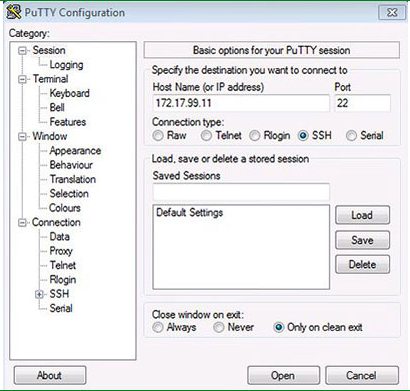
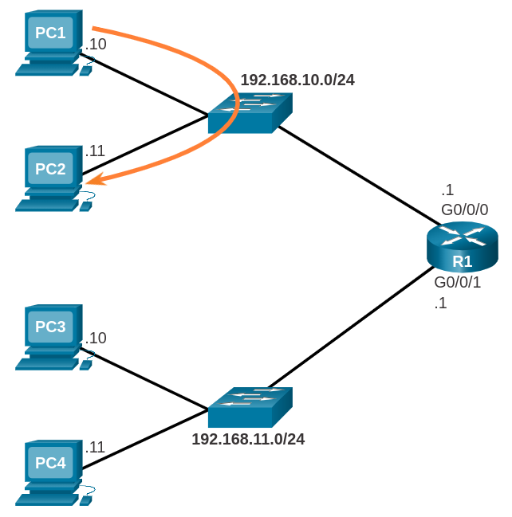
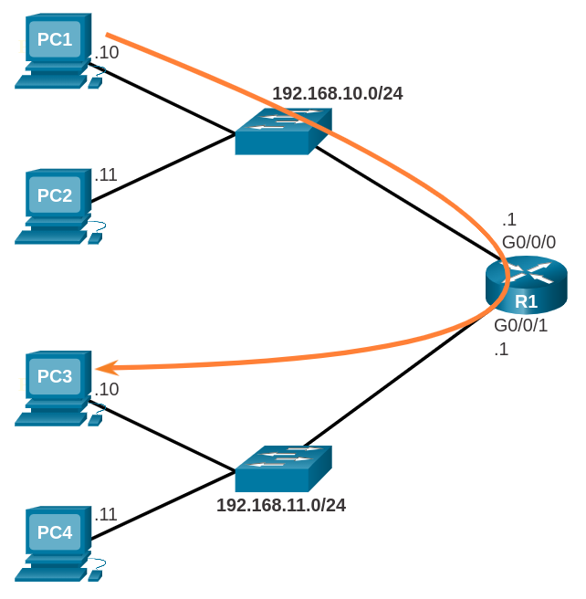
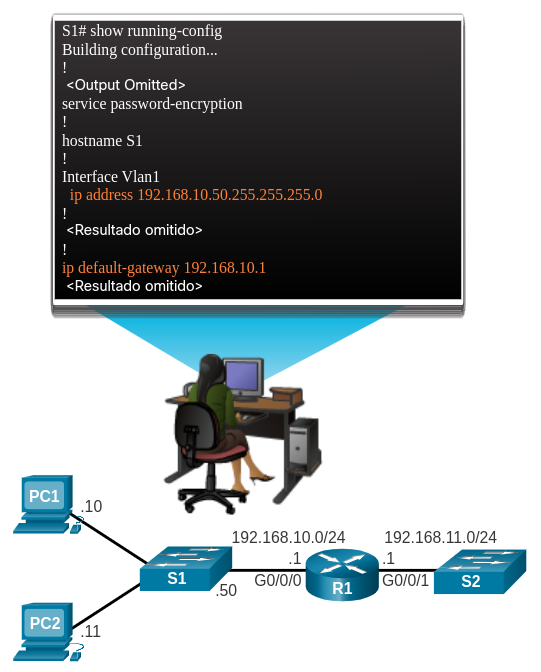

<a href="./00-Curso.md"><< Menú principal del módulo</a>

# 11. Crear una Pequeña Red de Cisco
# Configuración Básica del Conmutador
## Pasos Básicos en la Configuración de un Conmutador
El conmutador Cisco viene preconfigurado y solo necesita que se le asigne información de seguridad básica antes de conectarse a la red. Algunos elementos que suelen configurarse en el conmutador de una LAN son: nombre de host, dirección IP de administración, contraseñas e información descriptiva.

El nombre de host de un conmutador es el nombre configurado del dispositivo. Del mismo modo que a cada computadora o impresora se le asigna un nombre, los equipos de red se deben configurar con un nombre descriptivo. Se aconseja que el nombre del dispositivo incluya la ubicación donde se instalará el conmutador. Un ejemplo podría ser: `SW_Bldg_R-Room_216`.

Una dirección IP de administración solo es necesaria si tiene pensado configurar y administrar el conmutador a través de una conexión dentro de banda en la red. Una dirección de administración le permite llegar al dispositivo a través de Telnet, SSH o de clientes HTTP. La información de dirección IP que se debe configurar en un conmutador es esencialmente la misma que se configura en una PC: dirección IP, máscara de subred y puerta de enlace predeterminada.

Para proteger un conmutador LAN de Cisco, es necesario configurar contraseñas en cada uno de los diversos métodos de acceso a la línea de comandos. Los requisitos mínimos incluyen la asignación de contraseñas a los métodos de acceso remoto como Telnet, SSH y la conexión de consola. También debe asignar una contraseña al modo privilegiado en el que se pueden realizar cambios de configuración.

__Nota__: _telnet_ envía el nombre de usuario y la contraseña como texto sin cifrar y no se considera seguro. SSH cifra el nombre de usuario y la contraseña y, por lo tanto, es un método más seguro.

### Tareas de configuración
Antes de configurar un conmutador, revise las siguientes tareas de configuración inicial del conmutador:

* Configure el nombre del dispositivo.
```shell
hostname name
```

* Proteger el modo EXEC de usuario.
```shell
line console 0
password contraseña
login
```

* Proteger el acceso remoto por Telnet y SSH.
```shell
line vty 0 15
password contraseña
login
```

* Proteja el modo EXEC con privilegios.
```shell
enable secret contraseña
```

* Proteja todas las contraseñas del archivo de configuración.
```shell
service password-encryption
```

* Proporcione una notificación legal.
```shell
banner motd delimitador mensaje delimitador
```

* Configurar la SVI de administración.
```shell
interface vlan 1
ip address dirección-ip máscara-subred
no shutdown
```

* Guarde la configuración.
```shell
copy running-config startup-config
```

### Ejemplo de configuración del Conmutador
```shell
Switch> enable
Switch# configure terminal
Switch(config)# hostname S1
S1(config)# enable secret class
S1(config)# line console 0
S1(config-line)# password cisco
S1(config-line)# login
S1(config-line)# line vty 0 15
S1(config-line)# password cisco
S1(config-line)# login
S1(config-line)# exit
S1(config)# service password-encryption
S1(config)# banner motd #Prohibido el acceso no autorizado!#
S1(config)# interface vlan1
S1(config-if)# ip address 192.168.1.20 255.255.255.0
S1(config-if)# no shutdown
S1(config-if)# end
S1# copy running-config startup-config
Destination filename [startup-config]?
Building configuration...
[OK]
S1#
```

## Configuración de la Interfaz Virtual del Conmutador
Para acceder al conmutador de manera remota, se deben configurar una dirección IP y una máscara de subred en la interfaz virtual del conmutador (SVI). Para configurar un SVI en un conmutador, use el comando de configuración global interface vlan 1. La Vlan 1 no es una interfaz física real, sino una virtual. A continuación, asigne una dirección IPv4 mediante el comando de la configuración de interfaz `ip address <dirección-ip> <mascara-de-subred>`. Finalmente, habilite la interfaz virtual con el comando de configuración de interfaz `no shutdown`.

Después de configurar el conmutador con estos comandos, el conmutador tiene todos los elementos IPv4 listos para la comunicación a través de la red local.

__Nota__: De manera similar a los hosts de Windows, los conmutadores configurados con una dirección IPv4 generalmente también deben tener una puerta de enlace predeterminada asignada. Esto se puede hacer mediante el comando de configuración global `ip <default-gateway> <dirección-ip>`. El parámetro `<dirección-ip>` sería la dirección IPv4 del enrutador local en la red, como se muestra en el ejemplo. Sin embargo, en este tema solo configurará una red con conmutadores y hosts. Los enrutadores se configurarán más adelante.
```shell
Sw-Floor-1# configure terminal
Sw-Floor-1(config)# interface vlan 1
Sw-Floor-1(config-if)# ip address 192.168.1.20 255.255.255.0
Sw-Floor-1(config-if)# no shutdown
Sw-Floor-1(config-if)# exit
Sw-Floor-1(config)# ip default-gateway 192.168.1.1
```

## Verificador de Sintaxis - configuración de una Interfaz Virtual del Conmutador
## Packet Tracer - Implementación de conectividad básica
* <a href="./notes/pt_ajustes_conmutador.md" target="_blank">Actividad</a>

# Configurar los Ajustes Iniciales del Enrutador
## Pasos Básicos de Configuración del Enrutador
Las siguientes tareas deben completarse al configurar la configuración inicial en un enrutador.

1. Configure el nombre del dispositivo.
```shell
Router(config)# hostname hostname
```

2. Proteja el modo EXEC con privilegios.
```shell
Router(config)# enable secret password
```

3. Proteger el modo EXEC de usuario.
```shell
Router(config)# line console 0
Router(config-line)# password password
Router(config-line)# login
```

4. Proteger el acceso remoto por Telnet y SSH.
```shell
Router(config-line)# line vty 0 4
Router(config-line)# password password
Router(config-line)# login
Router(config-line)# transport input {ssh | telnet | none | all}
```

5. Proteja todas las contraseñas del archivo de configuración.
```shell
Router(config-line)# exit
Router(config)# service password-encryption
```

6. Proporcione una notificación legal.
```shell
Router(config)# banner motd delimiter message delimiter
```

7. Configurar el interfaz `G0/0/0` con IP y puerta de enlace
```shell
R1(config)#interface g0/0/0
R1(config-if)#ip address 192.168.0.1 255.255.255.0
R1(config-if)#no shutdown
```

8. Guarde la configuración.
```shell
Router(config)# copy running-config startup-config
```

## Ejemplo de Configuración Básica del Enrutador
En este ejemplo, el enrutador R1 se configurará con la configuración inicial. Para configurar el nombre del dispositivo para R1, utilice los siguientes comandos .
```shell
Router> enable
Router# configure terminal
Enter configuration commands, one per line.
End with CNTL/Z.
Router(config)# hostname R1
R1(config)#
```
__Nota__: Observe cómo el indicador del enrutador muestra ahora el nombre de host del enrutador.

Todo el acceso al enrutador debe estar asegurado. El modo EXEC privilegiado brinda al usuario acceso completo al dispositivo y su configuración, por lo que debe protegerlo.

Los siguientes comandos aseguran el modo EXEC privilegiado y el modo EXEC de usuario, habilitan el acceso remoto Telnet y SSH y cifran todas las contraseñas de texto sin formato (es decir, EXEC de usuario y línea VTY). Es muy importante utilizar una contraseña segura al proteger el modo EXEC con privilegios, ya que este permite el acceso a la configuración del dispositivo.
```shell
R1(config)# enable secret class
R1(config)#
R1(config)# line console 0
R1(config-line)# password cisco
R1(config-line)# login
R1(config-line)# exit
R1(config)#
R1(config)# line vty 0 4
R1(config-line)# password cisco
R1(config-line)# login
R1(config-line)# transport input ssh telnet
R1(config-line)# exit
R1(config)#
R1(config)# service password-encryption
R1(config)#
```

La notificación legal advierte a los usuarios que solo deben acceder al dispositivo los usuarios permitidos. La notificación legal se configura de la siguiente manera:
```shell
R1(config)# banner motd #
Enter TEXT message. End with the character '#'.
***********************************************
WARNING: Unauthorized access is prohibited!
***********************************************
R1(config)#
```

Si el enrutador se configurara con los comandos anteriores y accidentalmente perdiera energía, la configuración del enrutador se perdería. Por esta razón, es importante guardar la configuración cuando se implementen los cambios. Los siguientes comandos guardan la configuración en ejecución en la NVRAM:
```shell
R1# copy running-config startup-config
Destination filename [startup-config]?
Building configuration...
[OK]
R1#
```

## Verificador de Sintaxis - Configurar los Ajsutes Iniciales del Enrutador
## Packet Tracer - Configurar los Parámetros Iniciales del Enrutador
* <a href="./notes/pt_ajustes_enrutador.md" target="_blank">Actividad</a>

# Asegurar los Dispositivos
## Recomendaciones para Contraseñas
Para proteger los dispositivos de red, es importante utilizar contraseñas seguras. Las pautas estándar que se deben seguir son las siguientes:
* Use una contraseña de al menos ocho caracteres, preferiblemente 10 o más caracteres. Una contraseña más larga es una contraseña más segura.
* Cree contraseñas complejas. Incluya una combinación de letras mayúsculas y minúsculas, números, símbolos y espacios, si están permitidos.
* Evite las contraseñas basadas en la repetición, las palabras comunes de diccionario, las secuencias de letras o números, los nombres de usuario, los nombres de parientes o mascotas, información biográfica (como fechas de nacimiento), números de identificación, nombres de antepasados u otra información fácilmente identificable.
* Escriba una contraseña con errores de ortografía a propósito. Por ejemplo, Smith = Smyth = 5mYth, o Seguridad = 5egur1dad.
* Cambie las contraseñas con frecuencia. Si una contraseña se ve comprometida sin saberlo, la ventana de oportunidad para que el actor de la amenaza use la contraseña es limitada.
* No anote las contraseñas ni las deje en lugares obvios, por ejemplo, en el escritorio o el monitor.

Las tablas muestran ejemplos de contraseñas seguras y débiles.
**Contraseña débil**|**Por qué es débil**
:-|:-
secreto|Contraseña de diccionario simple
perez|Nombre de soltera de la madre
toyota|Marca de un auto
bob1967|Nombre y cumpleaños del usuario
Blueleaf23|Palabras y números simples

**Contraseña débil**|**Por qué es débil**
:-|:-
b67n42d39c| Combinación de caracteres alfanuméricos
12^h u4@1p7|Combina caracteres alfanuméricos, símbolos e incluye un espacio

En los enrutadores Cisco, se ignoran los espacios iniciales para las contraseñas, pero no ocurre lo mismo con los espacios que le siguen al primer carácter. Por lo tanto, un método para crear una contraseña segura es utilizar la barra espaciadora y crear una frase compuesta de muchas palabras. Esto se conoce como frase de contraseña. Una frase de contraseña suele ser más fácil de recordar que una contraseña simple. Además, es más larga y más difícil de descifrar.

## Acceso Remoto Seguro
Existen muchas maneras de obtener acceso a un dispositivo para ejecutar tareas de configuración. Una es utilizar una PC conectada al puerto de la consola del dispositivo. Este tipo de conexión se usa frecuentemente para la configuración inicial del dispositivo.

La configuración de una contraseña para el acceso a la conexión de consola se realiza en el modo de configuración global. Estos comandos evitan que los usuarios no autorizados accedan al modo usuario desde el puerto de consola.
```shell
Switch(config)# line console 0
Switch(config-line)# password password
Switch(config-line)# login
```

Cuando el dispositivo se conecta a la red, se puede acceder a él a través de la conexión de red mediante SSH o Telnet. SSH es el método preferido porque es más seguro. Cuando se accede al dispositivo a través de la red, se considera que es una conexión de vty. La contraseña debe asignarse al puerto vty. La siguiente configuración se utiliza para habilitar el acceso SSH al conmutador.
```shell
Switch(config)# line vty 0 15
Switch(config-line)# password password
Switch(config-line)# transport input ssh
Switch(config-line)# login
```

Un ejemplo de configuración se muestra en la ventana de comandos.
```shell
S1(config)# line console 0
S1(config-line)# password cisco
S1(config-line)# login
S1(config-line)# exit
S1(config)#
S1(config)# line vty 0 15
S1(config-line)# password cisco
S1(config-line)# login
S1(config-line)#
```

De manera predeterminada, muchos conmutadores Cisco admiten hasta 16 líneas vty que se numeran del 0 al 15. El número de líneas vty que admite un enrutador Cisco varía según el tipo de enrutador y la versión de IOS. No obstante, la cantidad más frecuente de líneas vty configuradas es cinco en un enrutador. Estas líneas se numeran del 0 al 4 de manera predeterminada, aunque se pueden configurar líneas adicionales. Es necesario establecer una contraseña para todas las líneas vty disponibles. Puede configurarse la misma contraseña para todas las conexiones.

Para verificar que las contraseñas estén configuradas correctamente, utilice el comando show running-config. Estas contraseñas se guardan en la configuración en ejecución como texto sin cifrar. Es posible establecer la encriptación en todas las contraseñas guardadas en el enrutador de manera que no puedan ser leídas fácilmente por individuos no autorizados. El comando de configuración global `service password-encryption` garantiza que todas las contraseñas estén encriptadas.

Con el acceso remoto protegido en el conmutador, ahora puede configurar SSH.

## Habilitar SSH
* __Paso 1. Verificar la compatibilidad con SSH.__
Use el comando `show ip ssh` para verificar que el conmutador admita SSH. Si el conmutador no ejecuta un IOS que admita características criptográficas, este comando no se reconoce.

* __Paso 2. Configurar el dominio IP.__
Configure el nombre de dominio IP de la red mediante el comando de modo de configuración global `ip domain-name nombre-de-dominio`. En la siguiente configuración de ejemplo, el valor del nombre de dominio es `cisco.com`.

* __Paso 3. Generar pares de claves RSA.__
No todas las versiones del IOS utilizan la versión 2 de SSH de manera predeterminada, y la versión 1 de SSH tiene fallas de seguridad conocidas. Para configurar la versión 2 de SSH, emita el comando `ip ssh version 2` en el modo de configuración global. La creación de un par de claves RSA habilita SSH automáticamente. Utilice el comando de modo de configuración global `crypto key generate rsa` para habilitar el servidor SSH en el conmutador y generar un par de claves RSA. Al crear claves RSA, se solicita al administrador que introduzca una longitud de módulo. La configuración de ejemplo en la figura 1 utiliza un tamaño de módulo de 1024 bits. Una longitud de módulo mayor es más segura, pero se tarda más en generarla y utilizarla.

	__Nota__: para eliminar el par de claves RSA, use el comando `crypto key zeroize rsa` en el modo de configuración global. Después de eliminarse el par de claves RSA, el servidor SSH se deshabilita automáticamente.

* __Paso 4. Configurar la autenticación de usuario.__
El servidor SSH puede autenticar a los usuarios localmente o usar un servidor de autenticación. Para usar el método de autenticación local, cree un par de nombre de usuario y contraseña con el comando `username nombre-de-usuario secret contraseña` en modo de configuración global. En el ejemplo, al usuario `admin` se le asignó la contraseña `ccna`.

* __Paso 5. Configurar las líneas vty.__
Habilite el protocolo SSH en las líneas vty mediante el comando `transport input ssh` del modo de configuración de línea. El conmutador Catalyst 2960 tiene líneas vty que van de 0 a 15. Esta configuración evita las conexiones que no son SSH (como Telnet) y limita al conmutador a que acepte solo las conexiones SSH. Use el comando `line vty` del modo de configuración global y, luego, el comando `login local` del modo de configuración de línea para requerir la autenticación local de las conexiones SSH mediante la base de datos de nombres de usuarios locales.

* __Paso 6. Habilitar la versión 2 de SSH.__
De manera predeterminada, SSH admite las versiones 1 y 2. Si se admiten ambas versiones, en el resultado de `show ip ssh` se muestra que está habilitada la versión 1.99. La versión 1 tiene vulnerabilidades conocidas. Por esta razón, se recomienda habilitar únicamente la versión 2. Habilite la versión de SSH mediante el comando de configuración global `ip ssh version 2`.

```bash
S1# show ip ssh
SSH Disabled - version 1.99
%Please create RSA keys (of at least 768 bits size) to enable SSH v2.
Authentication timeout: 120 secs; Authentication retries: 3
S1# configure terminal
S1(config)# ip domain-name cisco.com
S1(config)# crypto key generate rsa
The name for the keys will be: S1.cisco.com
...
How many bits in the modulus [512]: 1024
...
S1(config)# username admin secret ccna
S1(config-line)# line vty 0 15
S1(config-line)# transport input ssh
S1(config-line)# login local
S1(config-line)# exit
S1(config)# ip ssh version 2
S1(config)# exit
S1#
```

## Verificar SSH
En las computadoras se usa un cliente SSH, como PuTTY, para conectarse a un servidor SSH. Para los ejemplos se ha configurado lo siguiente:

* Se habilitó SSH en el conmutador S1
* Interfaz VLAN 99 (SVI) con la dirección IPv4 172.17.99.11 en el conmutador S1
* PC1 con la dirección IPv4 172.17.99.21

En la figura, el técnico está iniciando una conexión SSH a la dirección IPv4 de SVI VLAN de S1. Se muestra el software de terminal PuTTY.

<div style="width: 40%;padding-left: 25%;">
	
</div>

Después de hacer clic en Abrir en PuTTY, se le solicita al usuario un nombre de usuario y una contraseña. Usando la configuración del ejemplo anterior, se ingresan el nombre de usuario admin y la contraseña ccna. Después de introducir la combinación correcta, el usuario se conecta a la CLI del switch Catalyst 2960 mediante SSH.

Para mostrar los datos de la versión y de configuración de SSH en el dispositivo que configuró como servidor SSH, use el comando show ip ssh. En el ejemplo, se habilitó la versión 2 de SSH. Para verificar las conexiones SSH al dispositivo, use el comando show ssh.

```bash
Login as: admin
Using keyboard-interactive authentication.
Password: <ccna>
 
S1> enable
Password: <class>
S1# show ip ssh
SSH Enabled - version 2.0
Authentication timeout: 90 secs; Authentication retries: 2
Minimum expected Diffie Hellman key size : 1024 bits
IOS Keys in SECSH format(ssh-rsa, base64 encoded):
ssh-rsa AAAAB3NzaC1yc2EAAAADAQABAAAAgQCdLksVz2QlREsoZt2f2scJHbW3aMDM8 /8jg/srGFNL
i+f+qJWwxt26BWmy694+6ZIQ/j7wUfIVNlQhI8GUOVIuKNqVMOMtLg8Ud4qAiLbGJfAaP3fyrKmViPpO
eOZof6tnKgKKvJz18Mz22XAf2u/7Jq2JnEFXycGMO88OUJQL3Q==
 
S1# show ssh
Connection Version Mode Encryption  Hmac        State        Username
0           2.0     IN   aes256-cbc  hmac-sha1 Session started admin
0           2.0     OUT  aes256-cbc  hmac-sha1 Session started admin
%No SSHv1 server connections running.
S1#
```

## Packet Tracer - Configurar SSH
* <a href="./notes/pt_configuracion_ssh.md" target="_blank">Actividad</a>

# Configuración de la Puerta de Enlace Predeterminada
## Puerta de Enlace Predeterminada en un Host
Si su red local sólo tiene un enrutador, será el enrutador de puerta de enlace y todos los hosts y conmutadores de su red deben estar configurados con esta información. Si la red local tiene varios enrutadores, debe seleccionar uno de ellos para que sea el enrutador de puerta de enlace predeterminado. En este tema se explica cómo configurar la puerta de enlace predeterminada en hosts y conmutadores.

Para que un dispositivo final se comunique a través de la red, se debe configurar con la información de dirección IP correcta, incluida la dirección de la puerta de enlace predeterminada. La puerta de enlace predeterminada se usa solamente cuando el host desea enviar un paquete a un dispositivo de otra red. En general, la dirección de la puerta de enlace predeterminada es la dirección de la interfaz del enrutador conectada a la red local del host. La dirección IP del dispositivo host y la dirección de interfaz del enrutador deben estar en la misma red.

Por ejemplo, supongamos que una topología de red IPv4 consiste en un enrutador que interconecta dos LAN independientes. `G0/0` está conecta a la red `192.168.10.0`, mientras que `G0/1` está conectada a la red `192.168.11.0`. Cada dispositivo host está configurado con la dirección de la puerta de enlace predeterminada apropiada.

En este ejemplo, si PC1 envía un paquete a PC2, no se utiliza la puerta de enlace predeterminada. PC1 dirige el paquete con la dirección IPv4 de PC2 y lo reenvía directamente a PC2 a través del conmutador.

<div style="width: 30%;padding-left: 30%;">
	
</div>

¿Qué pasa si PC1 envió un paquete a PC3? PC1 dirigiría el paquete con la dirección IPv4 de PC3, pero reenviaría el paquete a su puerta de enlace predeterminada, que es la interfaz `G0/0/0` de R1. El enrutador acepta el paquete, accede a su tabla de enrutamiento para determinar la interfaz de salida apropiada según la dirección de destino. R1 reenvía el paquete fuera de la interfaz apropiada para llegar a PC3.

<div style="width: 30%;padding-left: 30%;">
	
</div>

El mismo proceso ocurriría en una red IPv6, aunque esto no se muestra en la topología. Los dispositivos usarían la dirección IPv6 del enrutador local como puerta de enlace predeterminada.

## Puerta de Enlace Predeterminada en un Conmutador
Un conmutador que interconecta equipos cliente suele ser un dispositivo de capa 2. Como tal, un conmutador de capa 2 no requiere una dirección IP para funcionar correctamente. Sin embargo, se puede configurar una configuración IP en un conmutador para dar a un administrador acceso remoto al conmutador.

Para conectarse y administrar un conmutador a través de una red IP local, debe tener configurada una interfaz virtual de conmutador (_Switch Virtual Interface_, SVI). El SVI se configura con una dirección IPv4 y una máscara de subred en la LAN local. El conmutador también debe tener una dirección de puerta de enlace predeterminada configurada para administrar el conmutador de forma remota desde otra red.

Por lo general, la dirección del gateway predeterminado se configura en todos los dispositivos que desean comunicarse más allá de la red local.

Para configurar una puerta de enlace predeterminada IPv4 en un conmutador, use el comando de configuración global `ip default-gateway dirección-ip`. La dirección IP que se configura es la dirección IPv4 de la interfaz del enrutador local conectada al conmutador.

En la figura se muestra un administrador que establece una conexión remota al conmutador S1 en otra red.

<div style="width: 40%;padding-left: 25%;">
	
</div>

En este ejemplo, el host administrador usaría su puerta de enlace predeterminada para enviar el paquete a la interfaz `G0/0/1` de R1. R1 reenviaría el paquete a S1 desde su interfaz `G0/0/0`. Dado que la dirección IPv4 de origen del paquete provenía de otra red, S1 requeriría una puerta de enlace predeterminada para reenviar el paquete a la interfaz `G0/0/0` de R1. Por lo tanto, el conmutador S1 se debe configurar con una puerta de enlace predeterminada, para que pueda responder y establecer una conexión SSH con el host administrativo.

Nota: Los paquetes que se originan en servidores conectados al conmutador ya deben crearse con la dirección de la puerta de enlace predeterminada configurada en el sistema operativo de su servidor.

Un conmutador de grupo de trabajo también se puede configurar con una dirección IPv6 en un SVI. Sin embargo, el conmutador no requiere que la dirección IPv6 de la puerta de enlace predeterminada se configure manualmente. El conmutador recibirá automáticamente su puerta de enlace predeterminada del mensaje ICMPv6 _Router Advertisement_ del enrutador.

## Packet Tracer - Solución de Problemas de la Puerta de Enlace Predeterminada
* <a href="./notes/pt_problemas_gateway_predeterminado.md" target="_blank">Actividad</a>

# Resumen
## Configuración Básica del Conmutador
Los elementos para configurar en un conmutador LAN incluyen el nombre del host, la información de la dirección IP de administración, las contraseñas y la información descriptiva. Una dirección de administración le permite llegar al dispositivo a través de Telnet, SSH o de clientes HTTP. La información de la dirección IP que debe configurarse en un conmutador incluye la dirección IP, la máscara de subred y la puerta de enlace predeterminada. Para proteger un conmutador LAN de Cisco, configure contraseñas en cada uno de los diversos métodos de acceso a la línea de comandos. Asigne contraseñas a métodos de acceso remoto, como Telnet, SSH y la conexión de la consola. También asigne una contraseña al modo privilegiado en el que se pueden realizar cambios de configuración.

Para acceder al conmutador de forma remota, configure una dirección IP y una máscara de subred en el SVI. Utilice el comando de configuración global `interface vlan 1`. Asigne una dirección IPv4 mediante el comando de la configuración de interfaz `ip address dirección-ip mascara-de-subred`. Finalmente, habilite la interfaz virtual con el comando de configuración de interfaz `no shutdown`. Después de configurar el conmutador con estos comandos, el conmutador tiene todos los elementos IPv4 listos para la comunicación a través de la red.

## Configurar los Ajustes Iniciales del Enrutador
__Paso 1__. Configure el nombre del dispositivo.
__Paso 2__. Proteja el modo EXEC con privilegios.
__Paso 3__. Proteger el modo EXEC de usuario.
__Paso 4__. Proteja el acceso remoto por Telnet/SSH.
__Paso 5__. Proteja todas las contraseñas del archivo de configuración.
__Paso 6__. Proporcione una notificación legal.
__Paso 7__. Guarde la configuración.

Todo el acceso al enrutador debe estar asegurado. El modo EXEC privilegiado brinda al usuario acceso completo al dispositivo y su configuración, por lo que debe protegerlo. Es muy importante utilizar una contraseña segura al proteger el modo EXEC con privilegios, ya que este permite el acceso a la configuración del dispositivo. La notificación legal advierte a los usuarios que solo deben acceder al dispositivo los usuarios permitidos. La configuración del enrutador se perdería si el enrutador pierde energía. Por esta razón, es importante guardar la configuración cuando se implementen los cambios.

## Asegurar los Dispositivos

Para proteger los dispositivos de red, es importante utilizar contraseñas seguras. Una contraseña segura combina caracteres alfanuméricos y, si está permitido, incluye símbolos y un espacio. Otro método para crear una contraseña segura es usar la barra espaciadora y crear una frase compuesta por muchas palabras, llamada frase de contraseña. Una frase de contraseña suele ser más fácil de recordar que una contraseña segura. Además, es más larga y más difícil de descifrar.

La configuración de una contraseña para el acceso a la conexión de consola se realiza en el modo de configuración global. Esto evita que los usuarios no autorizados accedan al modo de usuario desde el puerto de la consola. Cuando el dispositivo se conecta a la red, se puede acceder a él a través de la conexión de red mediante SSH o Telnet. SSH es el método preferido porque es más seguro. Cuando se accede al dispositivo a través de la red, se considera que es una conexión de vty. La contraseña debe asignarse al puerto vty. Cinco es el número más común de líneas vty configuradas en un enrutador. Estas líneas se numeran del 0 al 4 de manera predeterminada, aunque se pueden configurar líneas adicionales. Es necesario establecer una contraseña para todas las líneas vty disponibles. Puede configurarse la misma contraseña para todas las conexiones.

Para verificar que las contraseñas estén configuradas correctamente, utilice el comando `show running-config`. Estas contraseñas se guardan en la configuración en ejecución como texto sin cifrar. Es posible establecer cifrado en todas las contraseñas almacenadas en el enrutador. El comando de configuración global `service password-encryption` garantiza que todas las contraseñas estén encriptadas.

## Habilitación de SSH
__Paso 1__. Verificar la compatibilidad con SSH - __show ip ssh__
__Paso 2__. Configure el dominio IP - __ip domain-name nombre-de-dominio__
__Paso 3__. Generar pares de claves RSA - __crypto key generate rsa__
__Paso 4__. Configure la autenticación de usuario - __username nombre-de-usuario secret contraseña__
__Paso 5__. Configure las líneas vty - __line vty__
__Paso 6__. Habilitar SSH versión 2 - __ip ssh versión 2__

Para mostrar los datos de la versión y de configuración de SSH en el dispositivo que configuró como servidor SSH, use el comando __show ip ssh__. En el ejemplo, se habilitó la versión 2 de SSH. Para verificar las conexiones SSH al dispositivo, use el comando __show ssh__.

## Configuración de la puerta de enlace predeterminada

Si su red local sólo tiene un enrutador, será el enrutador de puerta de enlace y todos los hosts y conmutadores de su red deben estar configurados con esta información. Si la red local tiene varios enrutadores, debe seleccionar uno de ellos para que sea el enrutador de puerta de enlace predeterminado. La puerta de enlace predeterminada se usa solamente cuando el host desea enviar un paquete a un dispositivo de otra red. En general, la dirección de la puerta de enlace predeterminada es la dirección de la interfaz del enrutador conectada a la red local del host. La dirección IP del dispositivo host y la dirección de interfaz del enrutador deben estar en la misma red.

Para conectarse y administrar un conmutador a través de una red IP local, debe tener un SVI configurado. El SVI se configura con una dirección IPv4 y una máscara de subred en la LAN local. El conmutador también debe tener una dirección de puerta de enlace predeterminada configurada para administrar el conmutador de forma remota desde otra red. Para configurar una puerta de enlace predeterminada IPv4 en un conmutador, use el comando de configuración global `ip default-gateway dirección-ip`. La dirección IP que se configura es la dirección IPv4 de la interfaz del enrutador local conectada al conmutador.

# Enlaces de interés
<br />
<br />
<br />
<br />
<br />
<br />
<br />
<br />
<a href="#11-crear-una-pequeña-red-de-cisco">⬆️</a>
<a href="./00-Curso.md"><< Menú principal del módulo</a>