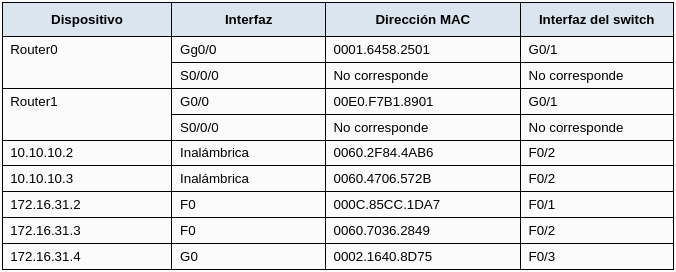

# Examinar la tabla de ARP
## Tabla de direccionamiento

	

## Objetivos
* Parte 1: Examinar una solicitud de ARP
* Parte 2: Examinar una tabla de direcciones MAC del switch
* Parte 3: Examinar el proceso ARP en comunicaciones remotas

## Aspectos básicos
Esta actividad está optimizada para la visualización de PDU. Los dispositivos ya están configurados. Reunirá información de PDU en el modo de simulación y responderá una serie de preguntas sobre los datos que obtenga.

## Instrucciones
### Parte 1: Examinar una solicitud de ARP
#### Paso 1: Generar solicitudes de ARP haciendo ping a 172.16.31.3 en 172.16.31.2.
1. Haga click en172.16.31.2 y abra el Command Prompt.
2. Introduzca el comando arp -d para borrar la tabla ARP.
3. Cierre símbolo del sistema
4. Ingrese al modo Simulation (Simulación) e introduzca el comando ping 172.16.31.3. Se generan dos PDU. El comando ping no puede completar el paquete ICMP sin conocer la dirección MAC del destino. Por lo tanto, la PC envía una trama de difusión de ARP para encontrar la dirección MAC del destino.
5. Haga clic en Capture/Forward (Capturar/Adelantar) una vez. La PDU ARP mueve el Switch1, mientras que la PDU ICMP desaparece y espera la respuesta de ARP. Abra la PDU y registre la dirección MAC de destino.
* Pregunta: ¿Esta dirección se indica en la tabla anterior?
6. Haga clic en Capture/Forward (Capturar/Adelantar) para mover la PDU al siguiente dispositivo.
* Pregunta: ¿Cuántas copias de la PDU realizó el Switch1?
7. ¿Cuál es la dirección IP del dispositivo que aceptó la PDU?
8. Abra la PDU y examine la capa 2.
* Pregunta: ¿Qué sucedió con las direcciones MAC de origen y destino?
9. Haga clic en Capture/Forward (Capturar/Adelantar) hasta que la PDU regrese a 172.16.31.2.
* Pregunta: ¿Cuántas copias de la PDU realizó el switch durante la respuesta de ARP?

#### Paso 2: Examinar la tabla ARP.
1. Observe que vuelve a aparecer el paquete ICMP. Abra la PDU y examine las direcciones MAC.
* Pregunta: ¿Las direcciones MAC de origen y destino coinciden con sus direcciones IP?
2. Vuelva a cambiar al modo Realtime (Tiempo real); el ping se completa.
3. Haga clic en 172.16.31.2 e introduzca el comando `arp -a`.
* Pregunta: ¿A qué dirección IP corresponde la entrada de la dirección MAC?
4. En general, ¿cuándo emite una terminal una solicitud de ARP?

### Parte 2: Examinar una tabla de direcciones MAC del switch
#### Paso 1: Generar tráfico adicional para completar la tabla de direcciones MAC del switch.
Abra un símbolo del sistema.
1. Desde 172.16.31.2, introduzca el 172.16.31.4 comando ping.
2. Haga clic en 10.10.10. 2 y abra el símbolo del sistema .
3. Introduzca el comando ping 10.10.10.3.
* Pregunta: ¿Cuántas respuestas se enviaron y se recibieron?

#### Paso 2: Examinar la tabla de direcciones MAC en los switches.
1. Haga clic en Switch1 y, a continuación, en la ficha CLI. Introduzca el comando show mac-address-table.
* Pregunta: ¿Las entradas corresponden a las de la tabla de arriba?
2. Haga clic en Switch0 y, a continuación, en la ficha CLI. Introduzca el comando show mac-address-table.
* Preguntas: ¿Las entradas corresponden a las de la tabla de arriba?
3. ¿Por qué hay dos direcciones MAC asociadas a un puerto?

### Parte 3: Examinar el proceso ARP en comunicaciones remotas
#### Paso 1: Generar tráfico para producir tráfico ARP.
Abra un símbolo del sistema.
1. Haga click 172.16.31.2 y abra el Command Prompt.
2. Introduzca el comando ping 10.10.10.1.
3. Escriba arp -a.
* Pregunta: ¿Cuál es la dirección IP de la nueva entrada de la tabla ARP?
4. Escriba arp -d para borrar la tabla ARP y cambiar al modo Simulation (Simulación).
5. Repita el ping a 10.10.10.1
* Pregunta: ¿Cuántas PDU aparecen?
6. Haga clic en Capture/Forward (Capturar/Adelantar). Haga clic en la PDU que ahora se encuentra en el Switch1.
* Pregunta: ¿Cuál es la dirección IP de destino objetivo de la solicitud de ARP?
7. La dirección IP de destino no es 10.10.10.1.
* Pregunta: ¿Por qué?

#### Paso 2: Examinar la tabla ARP en el Router1.
1. Cambie al modo Realtime. Haga clic en Router1 y, a continuación, en la ficha CLI.
2. Ingrese al modo EXEC privilegiado y, a continuación, introduzca el comando show mac-address-table.
* Pregunta: ¿Cuántas direcciones MAC figuran en la tabla? ¿Por qué?
3.  Introduzca el comando show arp.
* Preguntas: ¿Existe una entrada para 172.16.31.2?
* ¿Qué sucede con el primer ping en una situación en la que el router responde a la solicitud de ARP?