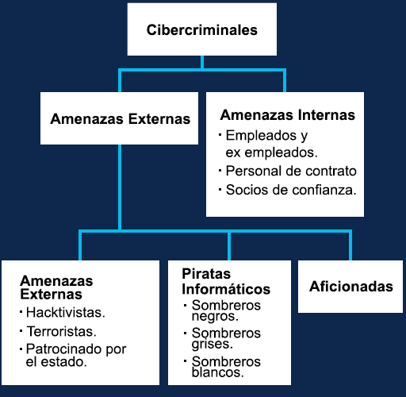
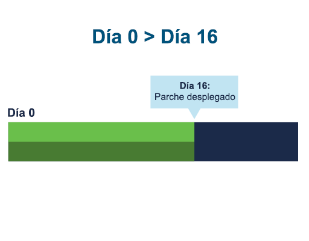
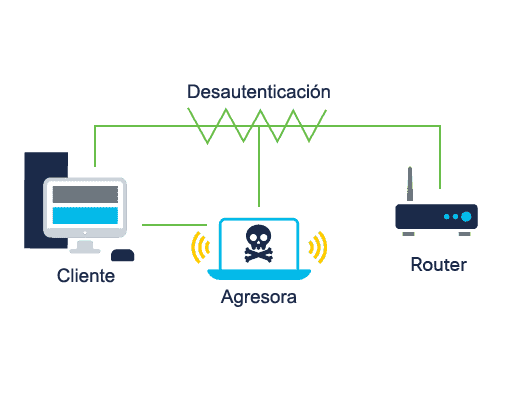
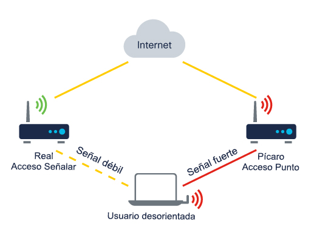
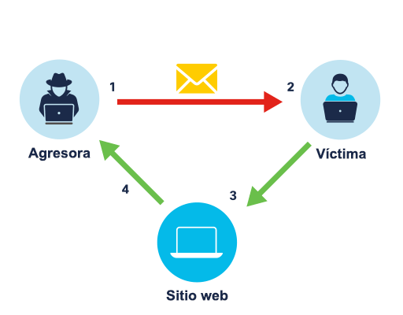

<a href="./00-Curso.md"><< Menú principal del módulo</a>

# 1. Amenazas, vulnerabilidades y ataques a la ciberseguridad
# Amenazas comunes
## Dominios de amenazas
Dado que las organizaciones enfrentan un número cada vez mayor de amenazas cibernéticas, es fundamental que cuenten con soluciones de seguridad sólidas. Pero para protegerse, las organizaciones primero deben saber qué vulnerabilidades existen dentro de sus dominios de amenazas. Se considera que un “dominio de amenazas” es un área de control, autoridad o protección que los atacantes pueden aprovechar para obtener acceso a un sistema.

Los atacantes pueden descubrir muchas vulnerabilidades y aprovechar los sistemas de un dominio de muchas maneras. Los atacantes pueden aprovechar los sistemas dentro de un dominio mediante:
* Acceso directo y físico a sistemas y redes.
* Redes inalámbricas que se extienden más allá de los límites de una organización.
* Bluetooth o dispositivos de comunicación de campo cercano (NFC).
* Tipos de adjuntos maliciosos.
* Elementos menos seguros dentro de la cadena de abastecimiento de una organización.
* Las cuentas de medios sociales de una organización.
* Medios extraíbles, como unidades flash.
* Aplicaciones basadas en la nube

## Tipos de amenazas cibernéticas
Las ciberamenazas se pueden clasificar en diferentes categorías. Esto permite a las organizaciones evaluar la probabilidad de que se produzca una amenaza y comprender el impacto monetario de una amenaza para que puedan priorizar sus esfuerzos de seguridad.
* Ataques de software: 
	* Ataque de Denegación de Servicios (Dennial-of-Service DoS)
	* Un virus informático.
* Errores de software: 
	* Error de funcionamiento de software
	* Una aplicación que se desconecta.
	* Se comparte la detección de un script entre sitios o un servidor de archivos ilegal.
* Sabotaje: 
	* Un usuario no autorizado penetra exitosamente y compromete la base de datos principal de una organización.
	* La degradación del sitio web de una organización afecta las relaciones públicas.
* Error humano: 
	* Errores de entrada de datos involuntarios.
	* Error de configuración de firewall
* Robo:
	*  PC portátiles o equipos robados de una sala desbloqueada
* Fallas del hardware: 
	* Discos duros
* Interrrupción de servicios: 
	* Energía eléctrica
	* Daños causados por el agua como resultado de la falla del aspersor.
* Desastres naturales: 
	* Una fuerte tormenta, como un huracán o un tornado.
	* Terremotos.
	* Inundaciones.
	* Incendios

Recuerde que el repertorio de los ciberdelincuentes es vasto y está en constante evolución. A veces, pueden combinar dos o más de las tácticas anteriores para aumentar sus posibilidades. Depende de los profesionales de ciberseguridad crear conciencia y educar a otras personas en una organización sobre estas tácticas para evitar que sean víctimas de tales ataques.

## Amenazas Internas vs. Externas
Las amenazas pueden originarse tanto dentro como fuera de una organización, con atacantes que buscan acceso a información confidencial valiosa, como registros de personal, propiedad intelectual y datos financieros.

Las amenazas internas generalmente son llevadas a cabo por empleados actuales o anteriores y otros socios contractuales que manipulan accidental o intencionalmente datos confidenciales o amenazan las operaciones de servidores o dispositivos de infraestructura de red conectando medios infectados o accediendo a correos electrónicos o sitios web maliciosos.

Las amenazas externas de los aficionados o de los atacantes expertos pueden explotar las vulnerabilidades en los dispositivos conectados a la red o pueden utilizar la ingeniería social, como trucos, para obtener acceso.

	

¿Sabía que las amenazas internas tienen el potencial de causar un daño mayor que las amenazas externas? Esto se debe a que los empleados o partners que trabajan en una organización tienen acceso directo a sus instalaciones y dispositivos de infraestructura. También tendrán un conocimiento interno de la red, los recursos y los datos confidenciales de la organización, así como las medidas de seguridad implementadas.

Las ciberamenazas pueden propagarse de varias maneras, como a través de los propios usuarios, dispositivos conectados a la red o servicios alojados en una nube pública o privada. Y no olvide la amenaza de un ataque físico si no se aplican las medidas de seguridad adecuadas.

## Vulnerabilidades y amenazas comunes a los usuarios
Un __dominio de usuario__ incluye cualquier persona con acceso al sistema de información de una organización, incluidos empleados, clientes y partners contractuales. Los usuarios generalmente son el eslabón más débil en los sistemas de seguridad informática y representan una amenaza importante para la confidencialidad, la integridad y la disponibilidad de los datos de la organización.
* Sin conocimiento sobre la seguridad: Los usuarios deben conocer los datos confidenciales, las políticas y los procedimientos de seguridad, las tecnologías y las contramedidas proporcionados para proteger la información y los sistemas de información.
* Políticas de seguridad aplicadas de mododeficiente: Todos los usuarios deben conocer y comprender las políticas de seguridad de una organización, así como las consecuencias del incumplimiento.
* Robo de datos: Los datos robados por los usuarios pueden representar una amenaza financiera importante para las organizaciones, tanto en términos del daño resultante a su reputación como de la responsabilidad legal asociada con la divulgación de información confidencial.
* Descargas no autorizadas: Muchas infecciones y ataques a redes y dispositivos se remontan a usuarios que han descargado correos electrónicos, fotos, música, juegos, aplicaciones y vídeos no autorizados en sus computadoras, redes o dispositivos de almacenamiento, o han utilizado medios no autorizados, como discos duros externos y unidades USB.
* Redes privadas virtuales (VPN) no autorizadas: Las VPN pueden ocultar el robo de información no autorizada porque el cifrado que normalmente se utiliza para proteger la confidencialidad puede impedir que un administrador de red rastree la transmisión de datos (a menos que tenga permiso para hacerlo).
* Sitios web no autorizados: Sitios web no autorizados: El acceso a sitios web no autorizados puede representar un riesgo para los datos del usuario, los dispositivos y la organización. Muchos sitios web solicitan a los visitantes que descarguen scripts o complementos que contienen código malicioso o adware. Algunos de estos sitios pueden apoderarse de dispositivos, como cámaras, y aplicaciones.
* Destrucción de sistemas, aplicaciones o datos: La destrucción accidental o deliberada; O el sabotaje de sistemas, aplicaciones y datos supone un gran riesgo para todas las organizaciones. Los activistas, los empleados descontentos y los competidores del sector pueden eliminar datos, destruir dispositivos o configurar mal los dispositivos para que no pueda disponerse de los datos y los sistemas de información.

Siempre tenga en cuenta que ninguna solución, control o contramedida técnica hace que los sistemas de información sean más seguros que los comportamientos y los procesos de las personas que los usan.

## Amenazas a los dispositivos
* Cualquier dispositivo que quede encendido y desatendido representa el riesgo de que alguien obtenga acceso no autorizado a los recursos de la red.
* La descarga de archivos, fotos, música o vídeos de fuentes poco confiables podría generar la ejecución de código malicioso en los dispositivos.
* Los ciberdelincuentes a menudo aprovechan las vulnerabilidades de seguridad dentro del software instalado en los dispositivos de una organización para lanzar un ataque.
* Los equipos de seguridad de la información de una organización deben intentar mantenerse al día con el descubrimiento diario de nuevos virus, gusanos y otro malware que representa una amenaza para sus dispositivos.
* Los usuarios que insertan unidades USB, CD o DVD no autorizados corren el riesgo de introducir malware o comprometer los datos almacenados en sus dispositivos.
* Las políticas existen para proteger la infraestructura de TI de la organización. Un usuario puede enfrentar serias consecuencias por violar intencionalmente dichas políticas.
* El uso de hardware o software desactualizado hace que los sistemas y los datos de una organización sean más vulnerables a los ataques.

## Amenazas a la red de área local
La red de área local (LAN) es un conjunto de dispositivos, generalmente en la misma área geográfica, conectados por cables (cableados) o ondas (inalámbricas).

Debido a que los usuarios pueden acceder a los sistemas, aplicaciones y datos de una organización desde el dominio LAN, es fundamental que tenga una seguridad sólida y controles de acceso estrictos.

Entre los ejemplos de amenazas a la LAN se incluyen:
* Acceso no autorizado a los centros de datos, las salas de computadoras y los armarios de cableado
* Acceso no autorizado a los sistemas, las aplicaciones y los datos
* Vulnerabilidades de software del sistema operativo de la red.
* Acceso no autorizado de usuarios dudosos a las redes inalámbricas.
* Ataques a los datos en tránsito
* Tener servidores LAN con hardware o sistemas operativos diferentes hace que administrarlos y solucionarlos sea más difícil.
* Escaneo de puertos y sondeo de redes no autorizados
* Firewall mal configurado.

## Amenazas a la nube privada
El dominio de nube privada incluye servidores, recursos e infraestructura de TI privados disponibles para los miembros de la organización a través de Internet. Si bien muchas organizaciones consideran que sus datos están más seguros en una nube privada, este dominio aún presenta amenazas de seguridad significativas, que incluyen:
* Escaneo de puertos y sondeo de redes no autorizados
* Acceso no autorizado a los recursos
* Vulnerabilidad del software del sistema operativo de los dispositivos de red, firewall o router
* Error de configuración del router, firewall o dispositivo de red
* Usuarios remotos que acceden a la infraestructura de la organización y descargan datos confidenciales.

## Amenazas a la nube pública
Cuando un dominio de nube privada aloja recursos de computación para una sola organización, el dominio de nube pública es la totalidad de los servicios de computación alojados por una nube, un servicio o un proveedor de Internet que están disponibles para el público y se comparten entre las organizaciones.

Hay tres modelos de servicios de nube pública que las organizaciones pueden optar por utilizar.

### Software como servicio (SaaS)
Software como servicio (SaaS): un modelo por suscripción que brinda acceso al software alojado de manera centralizada al que los usuarios acceden mediante un navegador web. En otras palabras, se trata de software que no se almacena localmente sino en la nube.

### Plataforma como servicio (PaaS)
Plataforma como servicio (PaaS): proporciona una plataforma que permite que una organización desarrolle, ejecute y administre sus aplicaciones en el hardware del servicio con herramientas provistas por el servicio. A esta plataforma se accede a través de la nube pública.

### Infraestructura como servicio (IaaS)
Infraestructura como servicio (IaaS): proporciona recursos de computación virtualizados, como hardware, software, servidores, almacenamiento y otros componentes de infraestructura en Internet. Una organización comprará acceso a ellos y los usará a través de la nube pública.

Si bien los proveedores de servicios de nube pública implementan controles de seguridad para proteger el entorno de la nube, las organizaciones son responsables de proteger sus propios recursos en la nube. Por lo tanto, algunas de las amenazas más comunes al dominio de nube pública incluyen:
* Violaciones de datos
* Pérdida o robo de propiedad intelectual
* Credenciales comprometidas o secuestro de cuenta.
* Ataques de ingeniería social
* Violación del cumplimiento.

## Amenazas a las Aplicaciones
El dominio de aplicación incluye todos los sistemas críticos, las aplicaciones y los datos. Las organizaciones están moviendo aplicaciones, como el correo electrónico, el monitoreo de la seguridad y la administración de la base de datos a la nube pública.

Amenazas comunes a las aplicaciones:
* Acceso no autorizado a los centros de datos, las salas de computadoras y los armarios de cableado
* Tiempo de inactividad del servidor durante los períodos de mantenimiento.
* Vulnerabilidades de software del sistema operativo de la red.
* Pérdida de datos
* Vulnerabilidades de desarrollo de aplicaciones web o de cliente/servidor

## Complejidad de las amenazas
Las vulnerabilidades de software actualmente tienen como base los errores de programación, las vulnerabilidades de protocolo o las configuraciones erróneas del sistema. Los ciberdelincuentes buscan aprovechar dichas vulnerabilidades y se están volviendo cada vez más sofisticados en sus métodos de ataque.

Una __amenaza persistente avanzada__ (APT - _Advanced Persistent Threat_) es un ataque continuo que utiliza tácticas de espionaje elaboradas que involucran a múltiples actores y / o malware sofisticado para obtener acceso a la red de un objetivo y analizarla. Los atacantes operan bajo el radar y permanecen sin ser detectados durante un largo período de tiempo, con consecuencias potencialmente devastadoras. Las APT generalmente apuntan a gobiernos y organizaciones de alto nivel y generalmente están bien organizadas y bien financiadas.

Como su nombre indica, los __ataques de algoritmos__ aprovechan los algoritmos de un software legítimo para generar comportamientos no deseados. Por ejemplo, los algoritmos utilizados para rastrear e informar cuánta energía consume una computadora se pueden utilizar para seleccionar objetivos o activar alertas falsas. Los ataques algorítmicos también pueden desactivar una computadora forzándola a usar memoria o a trabajar demasiado su unidad de procesamiento central.

Muchas organizaciones confían en los datos de inteligencia de amenazas para comprender su riesgo general, a fin de poder formular y aplicar medidas preventivas y de respuesta eficaces.

Algunos de estos datos son de código cerrado y requieren una suscripción pagada para acceder. Otros datos se consideran inteligencia de código abierto (OSINT) y se puede acceder desde fuentes de información disponibles al público. De hecho, compartir datos de inteligencia de amenazas es cada vez más popular, con gobiernos, universidades, organizaciones del sector de la salud y empresas privadas trabajando juntos para mejorar la seguridad de todos.

## Puertas traseras y _rootkits_
Los ciberdelincuentes utilizan muchos tipos diferentes de software malicioso, o malware, para llevar a cabo sus actividades.
* __Puertas traseras__: Los delincuentes cibernéticos utilizan los programas de puerta trasera, como Netbus y Back Orificio, para obtener acceso no autorizado a un sistema sin pasar por los procedimientos de autenticación normales. Los ciberdelincuentes generalmente tienen usuarios autorizados que, sin saberlo, ejecutan un programa de herramienta administrativa (RAT) remoto en su máquina para instalar una puerta trasera que otorga al control administrativo delictivo un equipo objetivo. El propósito de la puerta trasera es otorgar a los delincuentes cibernéticos el acceso futuro al sistema, incluso si la organización arregla la vulnerabilidad original utilizada para atacar al sistema.
* ___Rootkits___: Este malware está diseñado para modificar el sistema operativo para crear una puerta trasera, que los atacantes pueden usar para acceder a su computadora de forma remota. La mayoría de los rootkits aprovecha las vulnerabilidades de software para ganar acceso a recurso que normalmente no debería ser accesibles (escalada de privilegios) y modificar los archivos del sistema. Los rootkits también pueden modificar las herramientas de monitoreo y análisis forense del sistema, lo que los hace muy difíciles de detectar. En la mayoría de los casos, un equipo infectado por un rootkit debe borrarse y reinstalarse cualquier software necesario.

## Inteligencia contra amenazas y fuentes de investigación
El Equipo de Preparación para Emergencias Informáticas de los Estados Unidos (US-CERT) y el Departamento de Seguridad Nacional de los Estados Unidos patrocinan un diccionario de vulnerabilidades y exposiciones comunes (CVE).

Cada entrada de CVE contiene un número de identificador estándar, una breve descripción de la vulnerabilidad de seguridad y referencias importantes a informes de vulnerabilidad relacionados. The Mitre Corporation mantiene una lista de CVE y su sitio web público.
* La red oscura (_Dark Web_): Esto se refiere al contenido web encriptado que no está indexado por motores de búsqueda convencionales y requiere software específico, autorización o configuraciones para acceder. Investigadores expertos monitorean la web oscura en busca de nueva inteligencia de amenazas.
* Indicadores de riesgo (IoC - _Indicators of Compromise_): Los IoC, como las firmas de malware o los nombres de dominio, proporcionan evidencia de violaciones de seguridad y detalles sobre ellos.
* Uso compartido de indicadores automatizados (AIS): El AIS (_Automated Indicator Sharing_), una capacidad de la Agencia de Seguridad de la Ciberseguridad e Infraestructura (CISA), permite el intercambio en tiempo real de indicadores de amenazas de ciberseguridad mediante un lenguaje estandarizado y estructurado llamado Expresión de información de Amenazas Estructuradas (STIX - _Structured Threat Information eXpression_) e Intercambio Automatizado Confiable de Información de Inteligencia (TAXII - _Trusted Automated eXchange of Intelligence Information_).

# Engaño
## Ingeniería social
La ingeniería social es un ataque que intenta manipular a las personas para que realicen acciones o divulguen información confidencial.

En lugar de vulnerabilidades de software o hardware, la ingeniería social aprovecha la naturaleza humana, aprovechando la disposición de las personas a ayudar o aprovechando sus debilidades, como la avaricia o la vanidad.
* __Pretexto__: Este tipo de ataque ocurre cuando un individuo miente para obtener acceso a datos con privilegios. Por ejemplo, fingir que necesita los datos personales o financieros de una persona para confirmar su identidad.
* __Quid pro quo__: Los ataques quid pro quo implican una solicitud de información personal a cambio de algo, como un regalo. Por ejemplo, un correo electrónico malicioso podría pedirle que proporcione sus datos personales confidenciales a cambio de unas vacaciones gratuitas.
* __Fraude de identidad__: Este es el uso de la identidad robada de una persona para obtener bienes o servicios mediante el engaño. Por ejemplo, alguien adquirió sus datos e intenta emitir una tarjeta de crédito a su nombre.

## Tácticas de ingeniería social
Los ciberdelincuentes dependen de varias tácticas de ingeniería social para obtener acceso a información confidencial.
* __Autoridad__: Los atacantes se aprovechan del hecho de que las personas son más propensas a cumplir cuando son instruidas por alguien que perciben como una figura de autoridad. Por ejemplo, un ejecutivo abre lo que parece un archivo adjunto de citación oficial, pero en realidad es un PDF infectado.
* __Intimidación__: Los ciberdelincuentes a menudo intimidan a una víctima para que tome medidas que comprometan la seguridad. La secretaria de un ejecutivo recibe una llamada que indica que su jefe está a punto de dar una presentación importante, pero sus archivos están dañados. El delincuente por teléfono afirma que es culpa de la secretaria y presiona a la secretaria para que envíe los archivos inmediatamente o se arriesgue a ser despedida.
* __Consenso__: A menudo denominados “prueba social”, los ataques de consenso funcionan porque las personas tienden a actuar de la misma manera que otras personas a su alrededor, pensando que algo debe estar bien si otros lo están haciendo. Por ejemplo, los ciberdelincuentes pueden publicar una publicación en medios sociales sobre una 'oportunidad de negocios' y obtener docenas de cuentas legítimas o ilegítimas para comentar su validez debajo, lo que alienta a las víctimas desprevenidas a realizar una compra.
* __Escasez__: Una táctica de marketing bien conocida, los ataques de escasez funcionan porque los atacantes saben que las personas tienden a actuar cuando piensan que hay una cantidad limitada de algo disponible. Por ejemplo, alguien recibe un correo electrónico sobre un artículo de lujo que se vende por muy poco dinero, pero afirma que solo hay unos pocos disponibles a este precio, en un esfuerzo por estimular a la víctima desprevenida a tomar medidas.
* __Urgencia__: De manera similar, las personas también tienden a actuar cuando creen que hay un tiempo limitado para hacerlo. Por ejemplo, los ciberdelincuentes promueven una oferta de envío por tiempo limitado para intentar incitar a las víctimas a actuar rápidamente.
* __Familiaridad__: Es más probable que las personas hagan lo que otra persona les dice si les gusta esa persona. Por lo tanto, los atacantes a menudo intentan establecer una relación con su víctima para establecer una relación. En otros casos, pueden clonar el perfil de medios sociales de un amigo para que piense que les está hablando.
* __Confianza__: Crear confianza en una relación con una víctima puede requerir más tiempo para establecerse. Por ejemplo, un ciberdelincuente disfrazado de experto en seguridad llama a la víctima desprevenida para ofrecerle asesoramiento. Mientras ayuda a la víctima, el delincuente detecta un “error grave” que requiere atención inmediata. La solución ofrece al ciberdelincuente la oportunidad de violar la seguridad de la víctima.

Recuerde que el repertorio de los ciberdelincuentes es vasto y está en constante evolución. A veces, pueden combinar dos o más de las tácticas anteriores para aumentar sus posibilidades.

Depende de los profesionales de ciberseguridad crear conciencia y educar a otras personas en una organización sobre estas tácticas para evitar que sean víctimas de tales ataques.

## Shoulder Surfing y Dumpster Diving
La __navegación de hombro__ es un ataque simple que implica observar o literalmente mirar por encima del hombro de un objetivo para obtener información valiosa, como PIN, códigos de acceso o detalles de tarjetas de crédito. Los delincuentes no siempre tienen que estar cerca de la víctima para navegar por el hombro; pueden usar binoculares o cámaras de seguridad para obtener esta información.

Ese es un motivo por el que una persona solo puede leer una pantalla de ATM en determinados ángulos. Estos tipos de medidas de seguridad hacen la técnica de espiar por encima del hombro sea mucho más difícil.

Es posible que haya oído hablar de la frase "la basura de un hombre es el tesoro de otro". En ninguna parte es esto más cierto que en el mundo del buceo en basureros (_dumpster diving_): el proceso de revisar la basura de un objetivo para ver qué información se ha tirado. 

Esta es la razón por la cual los documentos que contienen información confidencial deben triturarse o almacenarse en bolsas para quemar hasta que el fuego los destruya después de un cierto período de tiempo. 

## Suplantación de identidad y engaños
Los ciberdelincuentes tienen muchas otras técnicas de engaño para ayudarlos a tener éxito.

* __Simulación de identidad__. La suplantación de identidad es el acto de engañar a alguien para que haga algo que normalmente no haría fingiendo ser otra persona. Por ejemplo, un ciberdelincuente que se hizo pasar por un empleado del IRS recientemente atacó a los contribuyentes, diciéndoles a las víctimas que debían dinero que debía pagarse inmediatamente por transferencia bancaria, o corrían el riesgo de ser arrestados. Los delincuentes también utilizan la simulación para atacar a otras personas. Por ejemplo, pueden hacerse pasar por víctimas en línea y publicar en sitios web o páginas de medios sociales para socavar la credibilidad de la víctima.
* __Engaños__. Un engaño es un acto destinado a engañar o engañar a alguien, y puede causar tanta interrupción como una violación a la seguridad real. Por ejemplo, un mensaje que advierte de una amenaza de virus (inexistente) en un dispositivo y le solicita al destinatario que comparta esta información con todas las personas que conoce. Este engaño provoca una reacción del usuario, lo que genera un miedo innecesario y un comportamiento irracional que se perpetúa a través del correo electrónico y las redes sociales.

## Piggybacking y Tailgating
___Piggybacking___ o ___tailgating___ ocurren cuando un delincuente sigue a una persona autorizada para ingresar a un lugar seguro o un área restringida. Los delincuentes pueden lograr esto:
* Dando la apariencia de ser escoltado a las instalaciones por una persona autorizada.
* Uniéndose y fingiendo ser parte de una gran multitud que ingresa a las instalacione.
* Apuntándose a una persona autorizada que descuida las reglas de la instalación.

Una forma de evitar esto es usar dos conjuntos de puertas. Esto a veces se denomina _mantrap_ y significa que las personas ingresan por una puerta exterior, que debe cerrarse antes de que puedan acceder a través de una puerta interior.

## Otros métodos de engaño
Tenga en cuenta que los atacantes tienen muchos más trucos bajo la manga para engañar a sus víctimas.
* __Estafa de facturas__. Las facturas falsas se envían con el objetivo de recibir dinero de una víctima solicitándoles que pongan sus credenciales en una pantalla de inicio de sesión falsa. La factura falsa también puede incluir lenguaje urgente o amenazante.
* __Ataque de abrevadero__ (_watering hole_). Un ataque a un abrevadero describe un ataque en el que un atacante observa o adivina qué sitios web utiliza una organización con más frecuencia e infecta uno o más de ellos con malware.
* __Error tipográfico__ (_typosquatting_). Este tipo de ataque se basa en errores comunes, como errores tipográficos cometidos por personas al introducir la dirección de un sitio web en su navegador. La URL incorrecta llevará a las personas a un sitio web de aspecto legítimo propiedad del atacante, cuyo objetivo es recopilar su información personal o financiera.
* __Antecedente__. Los atacantes pueden eliminar la etiqueta de correo electrónico "externa" utilizada por las organizaciones para advertir al destinatario que un correo electrónico se originó a partir de una fuente externa. Esto engaña a las personas para que crean que se envió un correo electrónico malicioso desde el interior de su organización.
* __Campañas de influencia__ (_fake news_). A menudo utilizadas en la guerra cibernética, las campañas de influencia generalmente están muy bien coordinadas y combinan varios métodos, como noticias falsas, campañas de desinformación y publicaciones en medios sociales.

## Defensa contra el engaño

Las organizaciones deben promover el conocimiento de tácticas de ingeniería social y formar correctamente a los empleados en relación con las medidas de prevención, como las siguientes: Estos son algunos consejos importantes.
* Nunca proporcione información confidencial o credenciales por correo electrónico, sesiones de chat, en persona o por teléfono a desconocidos.
* Resista el impulso de hacer clic en correos electrónicos y enlaces de sitio web atractivos.
* Tenga cuidado con las descargas no iniciadas o automáticas.
* Establecer y educar a los empleados sobre las políticas de seguridad clave.
* Aliente a los empleados a asumir la responsabilidad de los problemas de seguridad.
* No se sienta presionado por personas desconocidas.

## Explorar técnicas de ingeniería social
* Acceder a https://www.caeepnc.org/social_engineering/
* Si cambia la URL buscar por el término: "CSSIA Social Engineering Interactive"

# Ataques cibernéticos
## ¿Cuál es la diferencia?
Los ciberdelincuentes utilizan muchos tipos diferentes de software malicioso, o malware, para llevar a cabo sus actividades. El malware es cualquier código que se puede utilizar para robar datos, eludir los controles de acceso o causar daño o comprometer un sistema.

### Virus
Un virus es un tipo de programa informático que, cuando se ejecuta, se replica y se adjunta a otros archivos ejecutables, como un documento, insertando su propio código. Los virus pueden ser inofensivos y simplemente mostrar una imagen o pueden ser destructivos, como los que modifican o borran datos. La mayoría de los virus requieren la interacción del usuario final para iniciar la activación y se pueden escribir para que actúen en una fecha u hora específica.

Los virus pueden propagarse a través de medios extraíbles, como unidades flash USB, descargas de Internet y archivos adjuntos de correo electrónico. El simple acto de abrir un archivo puede activar un virus. Una vez que el virus del programa está activo, infectará generalmente otros programas en la computadora u otras computadoras de la red. Los virus también pueden programarse para mutar a fin de evitar la detección.

Por ejemplo, el virus Melissa se lanzó en 1999 y se propagó por correo electrónico, lo que afectó a decenas de miles de usuarios y causó daños estimados en USD 1.200 millones.

### Gusanos
Los gusanos son códigos maliciosos que se replican al explotar de manera independiente las vulnerabilidades en las redes. A diferencia de un virus, que requiere un programa anfitrión para ejecutarse, los gusanos pueden ejecutarse por sí mismos. Aparte de la infección inicial del host, no requieren la participación del usuario y pueden propagarse muy rápidamente por la red.

Los gusanos comparten patrones similares: aprovechan las vulnerabilidades del sistema, tienen una forma de propagarse y todos contienen código malicioso (carga útil) para dañar los sistemas informáticos o las redes.

Los gusanos son responsables de algunos de los ataques más devastadores en Internet. En 2001, el gusano Code Red había infectado más de 300.000 servidores en solo 19 horas.

### Troyanos
Este malware lleva a cabo operaciones maliciosas al enmascarar su verdadera intención. Puede parecer legítimo pero, de hecho, es muy peligroso. Los troyanos aprovechan los privilegios del usuario que los ejecuta.

A diferencia de los virus, los troyanos no se autorreplican, sino que a menudo se unen a archivos no ejecutables, como archivos de imagen, audio o vídeo, que actúan como trampas para dañar los sistemas de usuarios desprevenidos.

## Bombas lógicas
Una bomba lógica es un programa malicioso que espera un activador, como una fecha específica o una entrada en la base de datos, para activar el código malicioso. La bomba lógica permanece inactiva hasta que se produce el evento activador.

Una vez activada, una bomba lógica implementa un código malicioso que provoca daños en una computadora. Una bomba lógica puede sabotear los registros de bases de datos, borrar los archivos y atacar los sistemas operativos o aplicaciones. 

Los especialistas en ciberseguridad han descubierto recientemente bombas lógicas que atacan y destruyen los componentes de hardware de un dispositivo o servidor, incluidos los ventiladores de refrigeración, la unidad central de procesamiento (CPU), la memoria, los discos duros y las fuentes de alimentación. La bomba lógica abruma estos dispositivos hasta que se sobrecalientan o fallan.

## Ransomware
Este tipo de malware está diseñado para mantener cautivo un sistema computacional o los datos que contiene hasta que se realice un pago.

El ransomware generalmente funciona cifrando sus datos para que no pueda acceder a ellos. Según las afirmaciones de ransomware, una vez que se paga el rescate a través de un sistema de pago imposible de rastrear, el ciberdelincuente proporcionará un programa que descifra los archivos o envía un código de desbloqueo, pero en realidad, muchas víctimas no obtienen acceso a sus datos incluso después de haber pagado . 

Algunas otras versiones de ransomware pueden aprovechar vulnerabilidades específicas del sistema para bloquearlo. El ransomware a menudo se propaga a través de correos electrónicos de phishing que lo alientan a descargar un archivo adjunto malicioso o a través de una vulnerabilidad.

## Ataques por denegación de servicio
Los ataques de denegación de servicio (DoS) son un tipo de ataque de red que es relativamente sencillo de llevar a cabo, incluso por parte de un atacante no cualificado. Son un riesgo importante, ya que generalmente provocan algún tipo de interrupción de los servicios de red, lo que genera una importante pérdida de tiempo y dinero. Incluso las tecnologías operativas, el hardware o el software que controlan los dispositivos físicos o los procesos en edificios, fábricas o proveedores de servicios públicos son vulnerables a los ataques de DoS, que pueden causar un cierre, en circunstancias extremas.
* __Cantidad abrumadora de tráfico__. Esto es cuando se envía una gran cantidad de datos a una red, a un host o a una aplicación a una velocidad que no pueden procesar. Esto ocasiona una disminución de la velocidad de transmisión o respuesta o una falla en un dispositivo o servicio.
* __Paquetes maliciosos formateados__. Un paquete es una colección de datos que fluye entre una computadora o aplicación de origen y una receptora a través de una red, como Internet. Cuando se envía un paquete con formato malicioso, el receptor no puede manejarlo. Por ejemplo, si un atacante reenvía paquetes que contienen errores o paquetes formateados incorrectamente que no pueden ser identificados por una aplicación, esto hará que el dispositivo receptor funcione muy lentamente o se bloquee.

Los ataques de denegación de servicio distribuido (DDoS) son similares, pero se originan en varias fuentes coordinadas. Así es como sucede esto:
1. Un atacante crea una red (_botnet_) de hosts infectados llamados zombies, que son controlados por sistemas de gestión.
2. Las computadoras zombis constantemente analizan e infectan más hosts, creando más y más zombis.
3. Cuando está listo, el hacker proporciona instrucciones a los sistemas manipuladores para que los _botnet_ de zombies lleven a cabo un ataque de DDoS.

## Sistema de nombres de dominio
Hay muchos servicios técnicos esenciales necesarios para que una red funcione, como el routing, el direccionamiento y los nombres de dominio. Estos son los objetivos principales para el ataque.

### Reputación del dominio (_Domain Reputation_)
Los servidores DNS utilizan el sistema de nombres de dominio (DNS) para traducir un nombre de dominio, como www.cisco.com, a una dirección IP numérica para que las computadoras puedan entenderlo. Si un servidor DNS no conoce la dirección IP, consultará a otro servidor DNS.

Una organización necesita monitorear su reputación de dominio, incluida su dirección IP, para ayudar a proteger contra dominios externos maliciosos. 

### Falsificación de DNS (_DNS Poisoning_ o _DNS Spoofing_)
La falsificación de DNS o la intoxicación por caché de DNS es un ataque en el que se introducen datos falsos en una caché de resolución de DNS, la base de datos temporal en el sistema operativo de una computadora que registra las visitas recientes a sitios web y otros dominios de Internet.

Estos ataques de envenenamiento atacan una debilidad en el software DNS que hace que los servidores DNS redirijan el tráfico de un dominio específico a la computadora del delincuente, en lugar de redirigirlo al propietario legítimo del dominio.

### Secuestro de dominio
Cuando un atacante obtiene el control de la información de DNS de un objetivo por error, puede realizar cambios no autorizados en ella. Esto se conoce como secuestro de dominio.

La manera más común de secuestrar un nombre de dominio es cambiar la dirección de correo electrónico de contacto del administrador a través de ingeniería social o pirateando la cuenta de correo electrónico del administrador. La dirección de correo electrónico del administrador se puede encontrar fácilmente a través del registro de WHOIS del dominio, que es de registro público.

### Localizador Uniforme de Recursos (URL)
Un localizador uniforme de recursos (URL) es un identificador único para encontrar un recurso específico en Internet. El redireccionamiento de una URL suele suceder con fines legítimos.

Por ejemplo, ha iniciado sesión en un portal de aprendizaje electrónico para comenzar este curso de Cybersecurity Essentials. Si cierra sesión en el portal y regresa a él en otro momento, el portal lo redirigirá a la página de inicio de sesión. 

Es este tipo de funcionalidad la que los atacantes pueden aprovechar. En lugar de llevarlo a la página de inicio de sesión de eLearning, pueden redirigirlo a un sitio malicioso.

## Ataques de capa 2
La capa 2 se refiere a la capa de enlace de datos en el modelo de comunicación de datos de interconexión de sistemas abiertos (OSI).

Esta capa se utiliza para mover datos a través de una red física vinculada. Las direcciones IP se asignan a cada dirección de dispositivo físico (también conocida como dirección de control de acceso a medios (MAC)) en la red, mediante un procedimiento denominado protocolo de resolución de direcciones (ARP). 

En sus términos más simples, la dirección MAC identifica el receptor previsto de una dirección IP enviada a través de la red, y ARP resuelve las direcciones IP en direcciones MAC para transmitir datos. 

Los atacantes a menudo aprovechan las vulnerabilidades en esta seguridad de capa 2.

### Suplantación de identidad (spoofing)
La falsificación de identidad es un ataque que aprovecha una relación de confianza entre dos sistemas.
* La suplantación de direcciones MAC se produce cuando un atacante oculta su dispositivo como válido en la red y, por lo tanto, puede omitir el proceso de autenticación. 
* La falsificación de ARP envía mensajes ARP falsificados a través de una LAN. Esto vincula la dirección MAC de un atacante con la dirección IP de un dispositivo autorizado en la red.
* La falsificación de direcciones IP envía paquetes IP de una dirección de origen falsificada para disfrazarse.

### Saturación de direcciones MAC
Los dispositivos en una red se conectan a través de un switch de red mediante la conmutación de paquetes para recibir y reenviar datos al dispositivo de destino. La inundación de MAC compromete los datos transmitidos a un dispositivo. Un atacante inunda la red con direcciones MAC falsas, comprometiendo la seguridad del switch de red.

## Ataques de Man-in-the-Middle y Man-in-the-Mobile
Los atacantes en ruta interceptan o modifican las comunicaciones entre dos dispositivos, como un navegador web y un servidor web, ya sea para recopilar información de uno de los dispositivos o para hacerse pasar por uno de ellos.

### Hombre en el medio (MitM)
Un ataque MiTM ocurre cuando un ciberdelincuente toma el control de un dispositivo sin que el usuario lo sepa. Con este nivel de acceso, un atacante puede interceptar, manipular y transmitir información falsa entre el remitente y el destino previsto.

### Hombre en el móvil (MitMo)
Una variación del hombre en el medio, el Hombre en el móvil (MitMo) es un tipo de ataque utilizado para tomar el control de un dispositivo móvil. Cuando está infectado, el dispositivo móvil recibe instrucciones de filtrar información confidencial del usuario y enviarla a los atacantes. ZeUS es un ejemplo de paquete de malware con capacidades MitMO. Permite a los atacantes capturar silenciosamente los mensajes SMS de verificación en dos pasos que se envían a los usuarios.

Un ataque de repetición ocurre cuando un atacante captura la comunicación entre dos hosts y luego retransmite el mensaje al destinatario, para engañar al destinatario para que haga lo que el atacante evita, por lo tanto, cualquier mecanismo de autenticación.

## Ataques de día cero
Un ataque de día cero o una amenaza de día cero aprovechan las vulnerabilidades de software antes de que se conozcan o antes de que el proveedor de software las divulgue.

Una red es extremadamente vulnerable a los ataques entre el momento en que se detecta un ataque (cero horas) y el tiempo que le lleva al proveedor de software desarrollar y lanzar un parche que corrige este ataque.

La defensa contra ataques tan rápidos requiere que los profesionales de seguridad de redes adopten una visión más sofisticada y holística de cualquier arquitectura de red.

	

## Registro de teclado
Como su nombre indica, el registro de teclado o de teclas se refiere a la grabación o el registro de cada tecla presionada en el teclado de una computadora.

Los ciberdelincuentes registran las pulsaciones de teclas mediante el software instalado en un sistema informático o mediante dispositivos de hardware conectados físicamente a una computadora, y configuran el software del registrador de teclas para enviar el archivo de registro al delincuente. Debido a que ha registrado todas las pulsaciones de teclas, este archivo de registro puede revelar nombres de usuario, contraseñas, sitios web visitados y otra información confidencial.

Muchas aplicaciones antispyware pueden detectar y eliminar registros de clave no autorizados. 

Es importante tener en cuenta que el software de registro de teclas puede ser legítimo. Muchos padres la utilizan para controlar el comportamiento de sus hijos en Internet.

## Defensa contra ataques
Una organización puede realizar varios pasos para defenderse de diversos ataques. Estos incluyen los siguientes:
* Configure firewalls para descartar cualquier paquete fuera de la red que tenga direcciones que indican que se originaron dentro de la red. 
* Asegúrese de que los parches y las actualizaciones estén actualizados.
* Distribuya la carga de trabajo entre los sistemas de servidor.
* Los dispositivos de red utilizan paquetes de protocolo de mensajes de control de Internet (ICMP) para enviar mensajes de error y control, como si un dispositivo puede comunicarse con otro en la red. Para evitar ataques DoS y DDoS, las organizaciones pueden bloquear paquetes ICMP externos con sus firewalls.

# Ataques a dispositivos inalámbricos y móviles
El uso generalizado de Internet y los dispositivos móviles significa que ahora, más que nunca, podemos comunicarnos y trabajar sobre la marcha, sin la necesidad de cables. Pero esto también genera más oportunidades para que los ciberdelincuentes accedan a la información confidencial que buscan.

## Grayware y SMiShing
La **técnica de _grayware_** incluye aplicaciones que se comportan de manera molesta o no deseada. Y si bien es posible que el malware no contenga ningún malware reconocible, aún puede representar un riesgo para el usuario, por ejemplo, mediante el seguimiento de su ubicación o la entrega de publicidad no deseada.

Los creadores de _grayware_ mantienen generalmente la legitimidad al incluir las capacidades de una aplicación en la letra chica del contrato de licencia de software. Este factor representa una amenaza creciente para la seguridad móvil en particular, ya que muchos usuarios de smartphones instalan aplicaciones móviles sin tener realmente en cuenta esta letra pequeña. 

La suplantación de identidad de servicio de mensajes cortos o __SMiShing__ es otra táctica utilizada por los atacantes para engañarlo. Los mensajes de texto falsos le piden que visite un sitio web malicioso o llame a un número de teléfono fraudulento, lo que puede provocar la descarga de malware en su dispositivo o el intercambio de información personal.

## Puntos de Acceso No Autorizados
Un punto de acceso dudoso es un punto de acceso inalámbrico instalado en una red segura sin autorización explícita. Aunque podría ser configurado por un empleado bien intencionado que busca una mejor conexión inalámbrica, también ofrece una oportunidad para los atacantes que buscan obtener acceso a la red de una organización.

Un atacante a menudo utilizará tácticas de ingeniería social para obtener acceso físico a la infraestructura de red de una organización e instalar el punto de acceso dudoso.

También conocido como punto de acceso de un delincuente, el punto de acceso puede configurarse como un dispositivo MitM para capturar su información de inicio de sesión.

Esto funciona desconectando el punto de acceso dudoso, que activa la red para enviar una trama de autenticación para desvincular el punto de acceso. Este proceso se aprovecha mediante la suplantación de identidad de su dirección MAC y el envío de una transmisión de autenticación de datos al punto de acceso inalámbrico.

	

Un __ataque gemelo maligno__ describe una situación en la que el punto de acceso del atacante está configurado para parecer una mejor opción de conexión. Una vez que los usuarios se conectan al punto de acceso no autorizado, los delincuentes pueden analizar el tráfico y ejecutar ataques de MitM.

	

## Bloqueo de radiofrecuencia
Las señales inalámbricas son susceptibles a la interferencia electromagnética (EMI), a la interferencia de radiofrecuencia (RFI) e incluso pueden ser vulnerables a los rayos o ruidos de luces fluorescentes.

Los atacantes pueden aprovechar este hecho bloqueando deliberadamente la transmisión de una estación de radio o satélite para evitar que una señal inalámbrica llegue a la estación receptora.

Para bloquear con éxito la señal, la frecuencia, la modulación y la potencia del bloqueador de RF deben ser iguales a las del dispositivo que el atacante busca interrumpir.

## Bluejacking y Bluesnarfing
Probablemente haya oído hablar de las Bluetooth, pero ¿sabe exactamente qué es y cómo funciona?

Bluetooth es un protocolo de corto alcance y baja potencia que transmite datos en una red de área personal (PAN) y utiliza el emparejamiento para establecer una relación entre dispositivos como móviles, computadoras portátiles e impresoras. Los ciberdelincuentes han descubierto formas de aprovechar las vulnerabilidades entre estas conexiones.

Debido al alcance limitado de Bluetooth, un atacante debe estar dentro del alcance de su objetivo. Estas son algunas formas en que pueden aprovechar el dispositivo de un objetivo sin su conocimiento.

__Bluejacking__ utiliza la tecnología inalámbrica Bluetooth para enviar mensajes no autorizados o imágenes impactantes a otro dispositivo Bluetooth.

El __bluesnarf__ se produce cuando un atacante copia información, como correos electrónicos y listas de contactos, del dispositivo de un objetivo mediante una conexión Bluetooth.

## Ataques contra protocolos de Wi-Fi
La privacidad equivalente al cable (WEP - _Wired Equivalent Privacy_) y el acceso protegido a Wi-Fi (WPA - _Wi-Fi Protected Access_) son protocolos de seguridad diseñados para proteger las redes inalámbricas vulnerables a los ataques.

WEP se desarrolló para proporcionar datos transmitidos a través de una red de área local inalámbrica (WLAN) con un nivel de protección comparable al que generalmente se espera de una red cableada tradicional. Agregó seguridad a las redes inalámbricas cifrando los datos.

El protocolo WEP utiliza una clave para la encriptación. El problema, sin embargo, era que WEP no tenía ninguna disposición para la administración de claves, por lo que la cantidad de personas que compartían la misma clave creció continuamente, lo que dio a los delincuentes acceso a una gran cantidad de datos de tráfico. Además, el vector de inicialización (IV) de WEP, uno de los componentes clave de su clave de cifrado, era demasiado pequeño, legible y estático.

Para abordar esto y reemplazar WEP, WPA y luego WPA2 se desarrollaron como protocolos de seguridad mejorados. A diferencia de lo que sucede con WEP, un atacante no puede recuperar la clave de cifrado de WPA2 observando el tráfico de red. Sin embargo, aún pueden usar un sniffer de paquetes para analizar los paquetes que van entre un punto de acceso y un usuario legítimo.

## Wi-Fi y defensa móvil
Existen varios pasos a seguir para defenderse de los ataques a los dispositivos móviles e inalámbricos. Estos incluyen los siguientes:

* Aproveche las características básicas de seguridad inalámbrica como la autenticación y la encriptación al cambiar los ajustes de configuración predeterminada.
* Restrinja la ubicación de puntos de acceso colocando estos dispositivos fuera del firewall o dentro de una zona desmilitarizada, una red perimetral que protege la LAN de una organización contra dispositivos no confiables.
* Las herramientas de WLAN como _NetStumbler_(\*) pueden descubrir puntos de acceso dudosos o estaciones de trabajo no autorizadas. 
* Desarrolle una política para el acceso de usuarios temporales a la red Wi-Fi de una organización.
* Los empleados de una organización deben usar una VPN de acceso remoto para el acceso a la WLAN.

 _(*)_ <a href="https://www.seguridadwireless.net/netstumbler/">¿Qué es Netstumbler?</a>

# Ataques a las aplicaciones
Los ataques a través de aplicaciones web son cada vez más comunes. Implican a los ciberdelincuentes que aprovechan las vulnerabilidades en la codificación de una aplicación basada en la web para obtener acceso a una base de datos o un servidor.

## Secuencias de comandos entre sitios
El scripts entre sitios (XSS - _Cross Site Scripting_) es una vulnerabilidad que se encuentra en las aplicaciones Web. Funciona de la siguiente manera:
1. Los ciberdelincuentes aprovechan la vulnerabilidad de XSS mediante la inyección de scripts que contienen código malicioso en una página web.
2. La víctima accede a la página web y los scripts maliciosos pasan sin saberlo a su navegador. 
3. El script malicioso puede acceder a las cookies, los tokens de sesión u otra información confidencial sobre el usuario, que se envía al ciberdelincuente.
4. Con esta información, el ciberdelincuente puede hacerse pasar por el usuario.

	

## Inyección de código
La mayoría de los sitios web modernos utilizan una base de datos, como un lenguaje de consulta estructurado (SQL) o una base de datos de lenguaje de marcado extensible (XML), para almacenar y administrar datos. Los ataques de inyección buscan aprovechar las debilidades en estas bases de datos.
* Ataques de inyección XML. Un ataque de inyección XML puede dañar los datos de la base de datos XML y poner en riesgo la seguridad del sitio web. Funciona al interferir con el procesamiento de una aplicación de datos XML o consulta ingresada por un usuario. Los ciberdelincuentes pueden manipular esta consulta programándola para satisfacer sus necesidades. Esto les dará acceso a toda la información confidencial almacenada en la base de datos y les permitirá realizar cualquier cantidad de cambios en el sitio web.
* Ataques de inyección SQL. Los ciberdelincuentes pueden llevar a cabo un ataque de inyección SQL en sitios web o en cualquier base de datos SQL insertando una declaración SQL maliciosa en un campo de entrada. Este ataque aprovecha una vulnerabilidad en la que la aplicación no filtra correctamente los datos ingresados por un usuario para los caracteres en una instrucción SQL. Como resultado, el ciberdelincuente puede obtener acceso no autorizado a la información almacenada en la base de datos, desde la cual puede falsificar una identidad, modificar datos existentes, destruir datos o incluso convertirse en administrador del servidor de la base de datos.
* Ataques de inyección DLL. Un archivo de biblioteca de enlaces dinámicos (DLL - _Dynamic-Link Library_) es una biblioteca que contiene un conjunto de código y datos para llevar a cabo una actividad particular en Windows. Las aplicaciones utilizan este tipo de archivo para agregar funcionalidad que no está integrada, cuando necesitan llevar a cabo esta actividad. La inyección de archivos `.dll` permite que un delincuente cibernético engañe a una aplicación para que llame a un archivo dll malicioso, que se ejecuta como parte del proceso de destino.
* Ataques de inyección LDAP. El protocolo ligero de acceso a directorios (LDAP) es un protocolo abierto para autenticar el acceso de los usuarios a los servicios de directorio. Un ataque de inyección de LDAP aprovecha las vulnerabilidades de validación de entrada mediante la inyección y la ejecución de consultas en servidores LDAP, lo que brinda a los ciberdelincuentes la oportunidad de extraer información confidencial del directorio de LDAP de una organización.  

## Desbordamiento de búfer (_Buffer overflow_)
Los búferes son áreas de memoria asignadas a una aplicación. Un desbordamiento de búfer se produce cuando los datos van más allá de los límites de un búfer. Al cambiar los datos más allá de los límites de un búfer, la aplicación puede acceder a la memoria asignada a otros procesos. Esto puede llevar a un bloqueo del sistema, comprometer los datos u ocasionar el escalamiento de los privilegios.

Estas fallas de memoria también pueden brindar a los atacantes control total sobre el dispositivo de un objetivo. Por ejemplo, un atacante puede cambiar las instrucciones de una aplicación vulnerable mientras el programa se carga en la memoria y, como resultado, puede instalar malware y acceder a la red interna desde el dispositivo infectado.

¿Sabía que una investigación realizada por la Universidad Carnegie Mellon estima que casi la mitad de todas las vulnerabilidades de los programas informáticos se derivan de algún tipo de desbordamiento del búfer?

## Ejecuciones remotas de código (_RCE - Remote Code Execution_)
Ejecuciones remotas de códigos: vulnerabilidades que permiten que los delincuentes cibernéticos ejecuten códigos maliciosos y tomen el control de un sistema con los privilegios del usuario que ejecuta la aplicación.

El escalamiento de privilegios aprovecha un error, un defecto de diseño o una configuración incorrecta en un sistema operativo o una aplicación de software para obtener acceso a recursos que normalmente están restringidos.

El proyecto Metasploit es un proyecto de seguridad informática que proporciona información sobre vulnerabilidades de seguridad y ayuda en las pruebas de penetración. Entre las herramientas que han desarrollado se encuentra Metasploit Framework, que puede utilizarse para desarrollar y ejecutar código de ataque contra un objetivo remoto.

Meterpreter, en particular, es una carga útil dentro de Metasploit que permite a los usuarios tomar el control del dispositivo de destino escribiendo sus propias extensiones y cargando estos archivos en un proceso en ejecución en el dispositivo. Estos archivos se cargan y ejecutan desde la memoria, por lo que nunca afectan al disco duro. Esto también significa que estos archivos se desplazan bajo el radar de la detección antivirus.

Meterpreter tiene un módulo para controlar la cámara web de un sistema remoto. Una vez que Meterpreter está instalado en un dispositivo de destino, el usuario de Metasploit puede ver y capturar imágenes de la cámara web del objetivo.

## Otros ataques a aplicaciones
Cada pieza de información que recibe un atacante sobre un sistema o una aplicación objetivo puede utilizarse como arma valiosa para lanzar un ataque peligroso.

### Falsificación de solicitudes entre sitios (CSRF - _Cross Site Request Forgery_)
CSRF describe el ataque malicioso de un sitio web donde se envían comandos no autorizados desde el navegador de un usuario a una aplicación web confiable.

Un sitio web malicioso puede transmitir dichos comandos a través de etiquetas de imagen especialmente diseñadas, formularios ocultos o solicitudes de JavaScript, todo lo cual puede funcionar sin el conocimiento del usuario.

### Condición de carrera (_Race Condition_)
También conocido como ataque de tiempo de verificación (TOC - _Time of check_) o tiempo de uso (TOU - _Time of use_), un ataque de condición de carrera ocurre cuando un sistema informático diseñado para manejar tareas en una secuencia específica se ve obligado a realizar dos o más operaciones simultáneamente.

Por ejemplo, los sistemas operativos están formados por hilos: la secuencia más pequeña de instrucciones de programa necesarias para llevar a cabo un proceso. Cuando dos o más hilos acceden a datos compartidos e intentan cambiarlos al mismo tiempo, se produce un ataque de condición de carrera.

### Ataque de manejo de entrada incorrecto
Los datos ingresados por un usuario que no se validan correctamente pueden afectar el flujo de datos de un programa y causar vulnerabilidades críticas en los sistemas y las aplicaciones que provocan el desbordamiento del búfer o ataques de inyección de SQL.

### Gestión de errores
Los atacantes pueden utilizar mensajes de error para extraer información específica, como los nombres de host de sistemas internos y directorios o archivos que existen en un servidor web determinado, así como nombres de bases de datos, tablas y campos que pueden utilizarse para crear ataques de inyección SQL.

### Interfaz de programación de aplicaciones (API)
Una API ofrece una respuesta del usuario a un sistema y envía la respuesta del sistema al usuario. Un ataque de API ocurre cuando un ciberdelincuente abusa de un terminal de API.

### Ataques de repetición
Esto describe una situación en la que un atacante repite o retrasa una transmisión de datos válida de manera maliciosa o fraudulenta, quien intercepta, modifica y reenvía los datos para que el receptor haga lo que quiera.

### Ataque transversal al directorio (_Path traversal_)
El recorrido del directorio ocurre cuando un atacante puede leer archivos en el servidor web fuera del directorio del sitio web. Un atacante puede utilizar esta información para descargar archivos de configuración del servidor que contienen información confidencial, exponer potencialmente más vulnerabilidades del servidor o incluso tomar el control del servidor.

### Agotamiento de recursos (_Resource exhaustion_)
Estos ataques son ataques a la seguridad informática que bloquean, bloquean o interfieren con un programa o sistema específico. En lugar de abrumar el ancho de banda de la red como un ataque de DoS, los ataques de agotamiento de recursos saturan los recursos de hardware disponibles en el servidor del destino.

## Defensa contra ataques de aplicaciones
Hay varias medidas que puede tomar para defenderse de un ataque de aplicaciones. Encontrará algunos de ellos descritos aquí.
* La primera línea de defensa contra un ataque a las aplicaciones es escribir un código sólido. 
* Una práctica de programación prudente implica tratar y validar todas las entradas desde fuera de una función como si fuera hostil. 
* Mantenga actualizado todo el software, que incluye sistemas operativos y aplicaciones, y no ignore los indicadores de actualización. Recuerde que no todos los programas se actualizan automáticamente.

## Spam
El correo electrónico es utilizado por miles de millones de personas en todo el mundo y, como resultado, se ha convertido en una vulnerabilidad importante para los usuarios y las organizaciones.

El correo no deseado, también conocido como “correo basura”, es correo electrónico no solicitado. En la mayoría de los casos, el correo no deseado es un método publicitario. Sin embargo, una gran cantidad de correo electrónico no deseado es enviado a granel por computadoras infectadas por virus o gusanos, y a menudo contiene enlaces maliciosos, malware o contenido engañoso que tiene como objetivo engañar a los destinatarios para que divulguen información confidencial, como un número de seguridad social o información de cuenta bancaria.

Casi todos los proveedores de correo electrónico filtran el correo electrónico no deseado, pero aún así consumen ancho de banda. Incluso con la implementación de estas características de seguridad, algunos correos no deseados aún pueden llegar a la bandeja de entrada. Esté atento a los siguientes indicadores de correo electrónico no deseado:
* El correo electrónico no tiene asunto.
* El correo electrónico le solicita que actualice los detalles de su cuenta.
* El texto del correo electrónico tiene palabras mal escritas o puntuación extraña.
* Los enlaces del correo electrónico son largos o crípticos.
* El correo electrónico parece correspondencia de una empresa legítima, pero hay pequeñas diferencias o contiene información que no le parece relevante.
* El correo electrónico le solicita que abra un archivo adjunto, a menudo con urgencia.

Si un usuario recibe un correo electrónico que contiene uno o más de estos indicadores, este no debe abrir el correo electrónico ni los archivos adjuntos. Muchas organizaciones tienen una política de correo electrónico que requiere que los empleados informen la recepción de este tipo de correo electrónico a su equipo de ciberseguridad para una mayor investigación. En caso de duda, informe siempre. 

## Suplantación de identidad (Phishing)
La suplantación de identidad es una forma de actividad fraudulenta que a menudo se utiliza para robar información personal.

La suplantación de identidad se produce cuando un usuario es contactado por correo electrónico o mensaje instantáneo, o de cualquier otra manera, por alguien que se hace pasar por una persona u organización legítima. El objetivo de este mensaje es engañar al destinatario para que instale malware en su dispositivo o comparta información personal o financiera.

Por ejemplo, recibirá un correo electrónico felicitándolo por ganar un premio. Parece que se envió desde una tienda minorista conocida y le solicita que haga clic en un enlace para reclamar su premio. De hecho, este enlace puede redirigirlo a un sitio falso que le solicita que ingrese sus datos personales, o incluso puede instalar un virus en su dispositivo.

La suplantación de identidad focalizada es un ataque altamente dirigido, la suplantación de identidad (phishing) envía correos electrónicos personalizados a una persona específica en función de la información que el atacante sabe sobre ellos, que podrían ser sus intereses, preferencias, actividades y proyectos de trabajo.

Por ejemplo, un ciberdelincuente descubre a través de su investigación que está buscando comprar un modelo específico de automóvil. El ciberdelincuente se une a un foro de discusión de automóviles del que es miembro, falsifica una oferta de venta de automóviles y le envía un correo electrónico que contiene un enlace para ver las imágenes del automóvil. Al hacer clic, instala sin saberlo malware en el dispositivo.

## Vishing, Pharming y Whalingy
Los delincuentes utilizan una amplia gama de técnicas para intentar obtener acceso a su información personal.
* Vishing. A menudo conocido como suplantación de identidad por voz, este tipo de ataque hace que los delincuentes usen tecnología de comunicación por voz para alentar a los usuarios a divulgar información, como los detalles de su tarjeta de crédito. Los delincuentes pueden falsificar llamadas telefónicas mediante el protocolo de voz por Internet (VoIP) o dejar mensajes grabados para dar la impresión de que son personas que llaman legítimamente.
* Pharming. Este tipo de ataque redirige deliberadamente a los usuarios a una versión falsa de un sitio web oficial. Engañados para creer que están conectados a un sitio legítimo, los usuarios ingresan sus credenciales en el sitio web fraudulento.
* Whaling. El _whaling_ es un ataque de suplantación de identidad que apunta a objetivos de alto nivel dentro de una organización, como ejecutivos sénior.

## Defensa contra ataques de correo electrónico y navegador
Hay muchas medidas que puede tomar para defenderse de los ataques de correo electrónico y navegador. Algunos de los más importantes se describen aquí.

* Es difícil detener el correo electrónico no deseado, pero existen maneras de reducir sus efectos.
	* La mayoría de los proveedores de servicios de Internet (ISP) filtran el correo electrónico no deseado antes de que llegue a la bandeja de entrada del usuario.
	* Muchos programas antivirus y de software de correo electrónico detectan y eliminan automáticamente el correo electrónico no deseado peligroso de una bandeja de entrada de correo electrónico.
	* Las organizaciones deben educar a los empleados sobre los peligros de los correos electrónicos no solicitados y hacerlos conscientes de los peligros de abrir archivos adjuntos. 
	* No suponga que los archivos adjuntos de correo electrónico son seguros, aun cuando provengan de un contacto de confianza. Siempre examine los archivos adjuntos de correo electrónico antes de abrirlos.
* Conviértase en miembro del Anti-Phishing Working Group (APWG). Es una asociación internacional de empresas centradas en eliminar el robo de identidad y el fraude como resultado de la suplantación de identidad y suplantación de identidad por correo electrónico.
* Todo el software debe mantenerse actualizado, con los últimos parches de seguridad aplicados para proteger contra cualquier vulnerabilidad de seguridad conocida. 

## Otros tipos de ataques
### Ataques físicos
Los ataques físicos son acciones intencionales y ofensivas que se utilizan para destruir, exponer, alterar, deshabilitar, robar u obtener acceso no autorizado a la infraestructura o el hardware de una organización.

Entre los ejemplos de ataques físicos se incluyen:
* Carga de malware en una unidad flash USB que infecta un dispositivo cuando está enchufado.
* Instalar cables y enchufes, como cables USB genéricos, cables de carga de dispositivos móviles y adaptadores de pared o de alimentación con tecnologías avanzadas, como un chip inalámbrico, para permitir que un atacante controle o proporcione instrucciones a un dispositivo.
* Copiar o eliminar datos de una tarjeta de crédito o débito mediante un terminal especializado para crear una tarjeta clonada, que puede utilizarse para obtener acceso no autorizado a las cuentas de la víctima. 

### Ataques de adversarios de inteligencia artificial
El aprendizaje automático es un método de automatización que permite que los dispositivos realicen análisis y realicen tareas sin estar específicamente programados para ello. Funciona con muchas de las aplicaciones que usamos hoy en día, como la búsqueda web, el etiquetado de fotografías, la detección de correo electrónico no deseado, la videovigilancia, la detección de fraudes y la automatización de la seguridad.

El aprendizaje automático utiliza modelos matemáticos para predecir resultados. Sin embargo, estos modelos dependen de los datos que se ingresan. Si los datos están contaminados, pueden tener un impacto negativo en el resultado previsto. Los atacantes pueden aprovechar esto para perpetrar ataques contra algoritmos de aprendizaje automático. Por ejemplo, el uso de datos contaminados para engañar a un vehículo autónomo y malinterpretar las señales de tráfico.  

### Ataques a la cadena de abastecimiento
Muchas organizaciones interactúan con un tercero para la administración de sus sistemas o para comprar componentes y software. Las organizaciones pueden incluso depender de piezas o componentes de fuentes externas.

Los atacantes a menudo encuentran formas de interceptar estas cadenas de abastecimiento. Por ejemplo, el software puede basarse en acuerdos de soporte específicos y estar sujeto a una fecha de fin de vida útil (EOL). Cambiar esta fecha podría significar que una organización ya no es elegible para el servicio y el soporte de mantenimiento

### Ataques basados en la nube
En lugar de desarrollar sistemas en sus propias instalaciones, cada vez más organizaciones están avanzando hacia la computación basada en la nube, como mencionamos anteriormente en este módulo.

La ventaja es que el proveedor de la nube mantendrá el equipo, pero esto también abre una organización a una gran cantidad de posibles amenazas. Los atacantes aprovechan constantemente las formas de aprovechar los datos confidenciales almacenados en la nube, así como las aplicaciones, las plataformas y la infraestructura basadas en la nube, como hemos visto con SaaS, PaaS e IaaS.

# Resumen
## Dominios de amenazas
Un dominio de amenaza es un área de control, autoridad o protección que los atacantes pueden aprovechar para obtener acceso a un sistema. Las categorías de ciberamenazas incluyen ataques y errores de software, sabotaje, errores humanos, robos, fallas de hardware, interrupción de servicios públicos y desastres naturales. Las amenazas internas generalmente son llevadas a cabo por empleados actuales o anteriores y otros partners contractuales. Las amenazas externas de los aficionados o de los atacantes expertos pueden explotar las vulnerabilidades en los dispositivos conectados a la red o pueden utilizar la ingeniería social, como trucos, para obtener acceso. Un dominio de usuario incluye cualquier persona con acceso al sistema de información de una organización, incluidos empleados, clientes y partners contractuales. Las amenazas comunes de los usuarios incluyen políticas de seguridad mal aplicadas, robo de datos, descargas y medios no autorizados, VPN y sitios web no autorizados, y la destrucción de sistemas, aplicaciones o datos. Los dispositivos individuales, las LAN y las nubes públicas y privadas también son vulnerables a los ataques. Existen amenazas complejas, como un APT y un ataque de algoritmo. Los ciberdelincuentes usan programas de puerta trasera para obtener acceso no autorizado a un sistema sin pasar por los procedimientos de autenticación normales. El propósito de la puerta trasera es otorgar a los delincuentes cibernéticos el acceso futuro al sistema, incluso si la organización arregla la vulnerabilidad original utilizada para atacar al sistema. La mayoría de los rootkits aprovechan las vulnerabilidades de software para obtener acceso a los recursos y modificar los archivos del sistema. Los rootkits también pueden modificar las herramientas de monitoreo y análisis forense del sistema, lo que los hace muy difíciles de detectar.

La web oscura es contenido web cifrado que no está indexado por motores de búsqueda convencionales y requiere software específico, autorización o configuraciones para acceder. Los IOC, como las firmas de malware o los nombres de dominio, proporcionan evidencia de violaciones a la seguridad. AIS permite el intercambio en tiempo real de indicadores de amenazas de ciberseguridad mediante lenguajes estandarizados y estructurados denominados STIX y TAXII.

## Engaños
La ingeniería social es un ataque que intenta manipular a las personas para que realicen acciones o divulguen información confidencial. El pretexto ocurre cuando un individuo miente para obtener acceso a datos privilegiados. Los ataques quid pro quo son una solicitud de información personal a cambio de algo. El fraude de identidad es utilizar la identidad robada de una persona para obtener bienes o servicios mediante el engaño.

Las tácticas de ingeniería social incluyen hacerse pasar por una figura de autoridad, intimidación, consenso (“todos lo hacen”), pretender que algo es escaso o que una situación es urgente, generar familiaridad y confianza con un empleado para eventualmente aprovechar eso en el acceso. La navegación de hombro es mirar por encima del hombro de un objetivo para obtener información valiosa, como PIN, códigos de acceso o detalles de tarjetas de crédito. Los delincuentes no siempre tienen que estar cerca de la víctima para navegar por el hombro; pueden usar binoculares o cámaras de seguridad para obtener esta información. Bucear en un contenedor de basura es atravesar la basura de un objetivo para ver qué información se ha arrojado. Piggybacking o tailgating ocurren cuando un delincuente sigue a una persona autorizada para ingresar a un lugar seguro o un área restringida. Otros métodos de engaño incluyen estafas de facturas, ataques de abrevaderos, suplantación de errores tipográficos, antecedente y campañas de influencia.

Las organizaciones deben promover el conocimiento de tácticas de ingeniería social y formar correctamente a los empleados en relación con las medidas de prevención.

## Ataques cibernéticos
El malware es cualquier código que se puede utilizar para robar datos, eludir los controles de acceso o causar daño o comprometer un sistema. Un virus es un tipo de programa informático que, cuando se ejecuta, se replica y se adjunta a otros archivos ejecutables, como un documento, insertando su propio código. Los gusanos son códigos maliciosos que se replican al explotar de manera independiente las vulnerabilidades en las redes. Este malware lleva a cabo operaciones maliciosas al enmascarar su verdadera intención. Una bomba lógica es un programa malicioso que utiliza un activador para reactivar el código malicioso. Ransomware está diseñado para mantener captivo un sistema de computación o los datos que contiene hasta que se realice un pago. Los ataques DoS funcionan creando una cantidad abrumadora de tráfico o enviando paquetes con formato malicioso que una aplicación no puede identificar, lo que hace que el dispositivo receptor se ejecute lentamente o se bloquee. Los ataques de denegación de servicio distribuido (DDoS) son similares, pero se originan en varias fuentes coordinadas. Los ataques de DNS incluyen suplantación de identidad y secuestro.

Los ataques de capa 2 incluyen la dirección MAC, la falsificación de ARP e IP, la inundación de MAC, el intermediario y el móvil. Los ataques de día cero aprovechan las vulnerabilidades del software antes de que se den a conocer. El registro del teclado (keylogging) registra las pulsaciones del teclado y configura el software del keylogger para enviar el archivo de registro al delincuente. Este archivo de registro puede revelar nombres de usuario, contraseñas, sitios web visitados, etc.

Para defenderse de estos ataques, use firewalls, manténgase actualizado sobre actualizaciones y parches, distribuya la carga de trabajo entre los sistemas de servidor y bloquee los paquetes ICMP externos con firewalls.

## Ataques a los dispositivos móviles e inalámbricos
La técnica de Grayware incluye aplicaciones que se comportan de manera molesta o no deseada. SMiShing son mensajes de texto falsos que le solicitan que visite un sitio web malicioso o llame a un número de teléfono fraudulento, lo que puede provocar la descarga de malware en su dispositivo. Un punto de acceso dudoso es un punto de acceso inalámbrico instalado en una red segura sin autorización explícita. Un ataque gemelo malvado es donde el punto de acceso del atacante está configurado para parecer una mejor opción de conexión. La interferencia de radio frecuencia interfiere deliberadamente la transmisión de una estación de radio o satélite para evitar que una señal inalámbrica llegue a la estación receptora.

Bluejacking utiliza la tecnología inalámbrica Bluetooth para enviar mensajes no autorizados o imágenes impactantes a otro dispositivo Bluetooth. Bluesnarfing es cuando un atacante copia información del dispositivo de un objetivo mediante Bluetooth. WEP y WPA son protocolos de seguridad diseñados para proteger las redes inalámbricas. WPA2 es un protocolo de seguridad mejorado. A diferencia de WEP, un atacante no puede recuperar la clave de cifrado de WPA2 observando el tráfico de red.

Para defenderse de ataques de dispositivos móviles e inalámbricos: cambie las configuraciones predeterminadas. Restrinja la colocación de puntos de acceso colocando estos dispositivos fuera del firewall o en una DMZ. Utilice herramientas WLAN para detectar puntos de acceso dudosos o estaciones de trabajo no autorizadas. Tenga una política de acceso de usuarios temporales a una red Wi-Fi. Los empleados deben utilizar una VPN de acceso remoto para el acceso a la WLAN.

## Ataques a las aplicaciones
El script entre sitios (XSS) es una vulnerabilidad que se encuentra en las aplicaciones Web. Los tipos de ataques de inyección de código incluyen XML, SQL, DLL y LDAP. Un desbordamiento de búfer se produce cuando los datos van más allá de los límites de un búfer. La ejecución remota de código aprovecha las vulnerabilidades de las aplicaciones para ejecutar cualquier comando con privilegios del usuario autorizado. Otros ataques de aplicaciones incluyen CSRF, condición de carrera, manejo de entrada incorrecto, manejo de errores, API, reproducción, recorrido de directorio y agotamiento de recursos.

Escriba código sólido para defenderse de un ataque de aplicaciones. Trate y valide todas las entradas desde fuera de una función como si fuera hostil. Mantenga el software actualizado. El correo electrónico no deseado es correo electrónico no solicitado que suele ser un método de publicidad. Parte del correo electrónico no deseado es enviado a granel por computadoras infectadas con virus o gusanos. Suplantación de identidad es cuando un agente de amenazas se hace pasar por un correo electrónico o un mensaje instantáneo y se hace pasar por una persona legítima. La suplantación de identidad (Spear Phishing) envía correos electrónicos personalizados a una persona específica según la información que el atacante sabe sobre ellos. Otras estafas comunes incluyen vishing, pharming y caza de ballenas. Otros tipos de ataques incluyen ataques físicos a equipos, ataques adversos de AI, ataques a la cadena de abastecimiento y ataques basados en la nube.

Utilice software antivirus para defenderse de los ataques de correo electrónico y navegador. Nunca suponga que los archivos adjuntos de correo electrónico son seguros. Siempre examine los archivos adjuntos de correo electrónico antes de abrirlos. Conviértase en miembro del Anti-Phishing Working Group (APWG). Todo el software debe mantenerse actualizado.

## Enlaces de interés
* <a href="https://www.crowdstrike.com/cybersecurity-101/malware/" target="_blank">Types of Malware</a>
* <a href="https://www.javatpoint.com/virus-vs-worm-vs-trojan-horse" target="_blank">Difference between Virus, Worm, and Trojan horse</a>
* <a href="https://www.crowdstrike.com/cybersecurity-101/malware/trojans/" target="_blank">What is a Trojan Horse?</a>
* <a href="https://postmarkapp.com/glossary/domain-reputation" target="_blank">Domain reputation</a>
* <a href="https://www.fortinet.com/resources/cyberglossary/dns-poisoning" target="_blank">DNS Poisoning</a>
* <a href="https://runcloud.io/blog/flush-dns-cache" target="_blank">How To Flush DNS Cache</a>
* <a href="https://www.upguard.com/blog/domain-hijacking" target="_blank">What is Domain Hijacking?</a>
* <a href="https://www.avast.com/es-es/c-keylogger" target="_blank">¿Qué es un keylogger?</a>
* <a href="https://www.mcafee.com/learn/es/registro-de-pulsaciones-de-teclas/" target="_blank">Registro de pulsaciones de teclas</a>
* <a href="https://latam.kaspersky.com/resource-center/definitions/wep-vs-wpa">¿Qué es WEP, WPA, WPA2 y WPA3 y cuáles son sus diferencias?</a>
* <a href="https://www.netstumbler.com/">The Physics Of Where To Put a Wi-Fi Router</a>
* <a href="https://www.packetlabs.net/posts/what-are-tocttou-vulnerabilities/">What are TOCTTOU Vulnerabilities?</a>
* <a href="CWE-367: Time-of-check Time-of-use (TOCTOU) Race Condition">CWE-367: Time-of-check Time-of-use (TOCTOU) Race Condition</a>
* 
 
 
 
 
 
 
<a href="#1-amenazas-vulnerabilidades-y-ataques-a-la-ciberseguridad">⬆️</a>
<a href="./00-Curso.md"><< Menú principal del módulo</a>