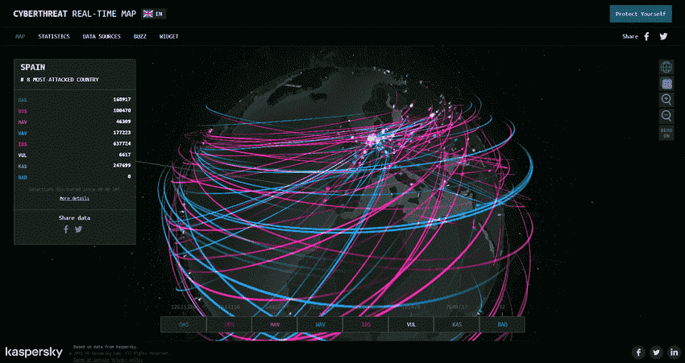
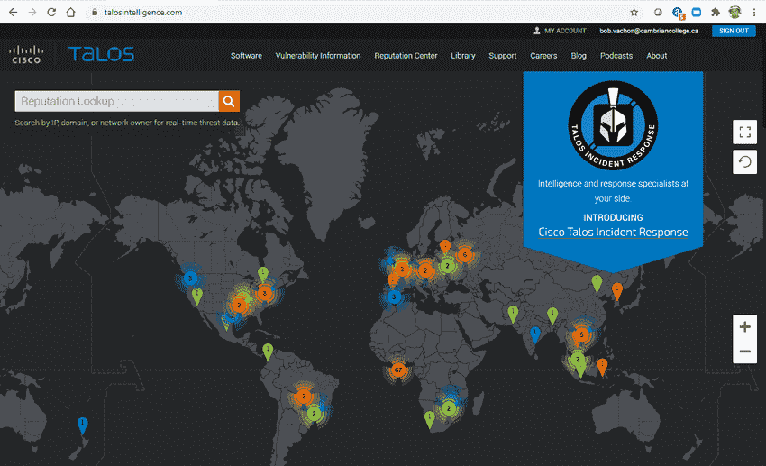
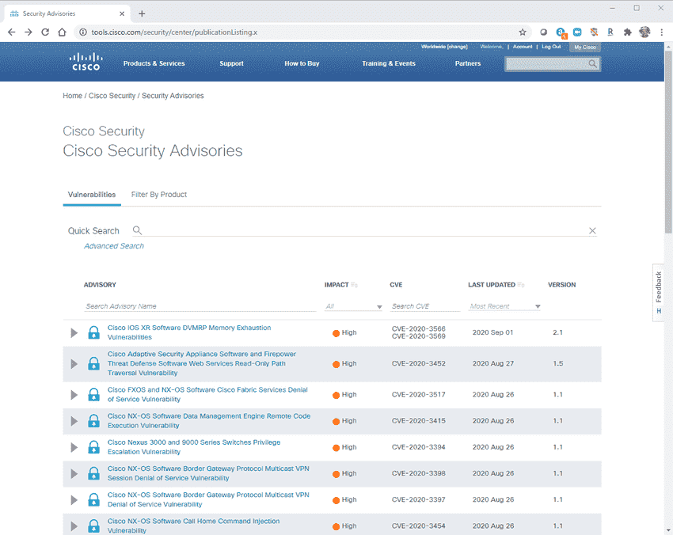
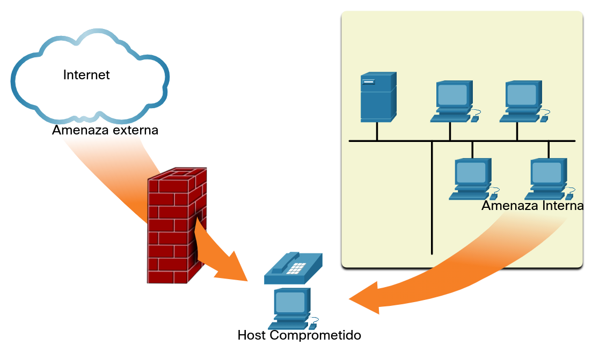
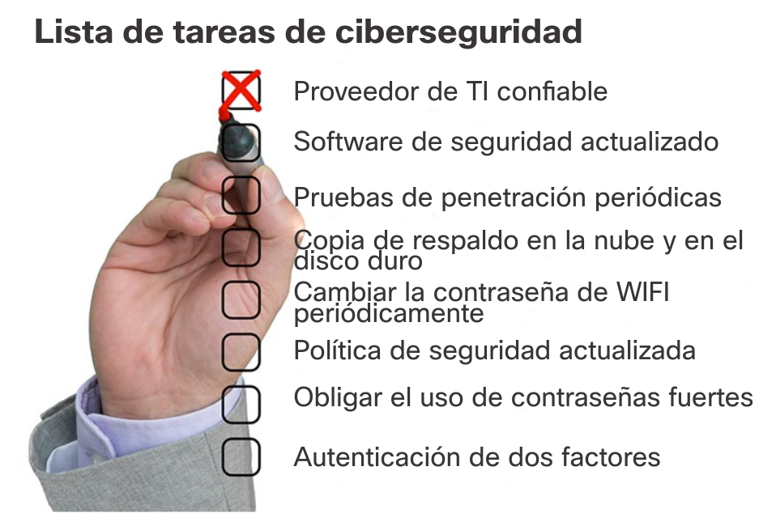

<a href="./00-Curso.md"><< Menú principal del módulo</a>

# 2. Protección de redes
# Estado actual de los casos
## Las redes son objetivos
Las redes sistemáticamente sufren ataques. Es común leer en las noticias que otra red se ha comprometido. Una búsqueda rápida en Internet de ataques a la red arrojará muchos artículos sobre ataques a la red, incluidas noticias sobre organizaciones que han sido comprometidas, las últimas amenazas a la seguridad de la red, herramientas para mitigar ataques y mucho más.

Para ayudarlo a comprender la gravedad de la situación, Kapersky mantiene la visualización interactiva de Cyberthreat Real-Time Map de los ataques a la red actuales. Los datos del ataque se envían desde los productos de seguridad de red de Kapersky que se implementan en todo el mundo. La figura muestra una captura de pantalla de muestra de esta herramienta web, que muestra estos ataques en tiempo real. Muchas herramientas similares están disponibles en Internet y se pueden encontrar buscando mapas de amenazas cibernéticas.

<div style="width: 75%;padding-left: 15%;">
	
</div>

## Razones para la seguridad de la red
La seguridad de la red se relaciona directamente con la continuidad del negocio de una organización. Las transgresiones de seguridad en la red pueden interrumpir el comercio electrónico, causar la pérdida de datos comerciales, amenazar la privacidad de las personas y comprometer la integridad de la información. Estas transgresiones pueden dar como resultado la pérdida de ingresos para las corporaciones, el robo de propiedad intelectual, demandas judiciales e incluso pueden amenazar la seguridad pública.

Mantener una red segura garantiza la seguridad de los usuarios de la red y protege los intereses comerciales. Mantener una red segura requiere vigilancia por parte de los profesionales de seguridad de la red de una organización. Deben estar constantemente al tanto de las amenazas y los ataques a las redes nuevos y en evolución, y de las vulnerabilidades de los dispositivos y las aplicaciones.

Muchas herramientas están disponibles para ayudar a los administradores de red a adaptar, desarrollar e implementar técnicas de mitigación de amenazas. Por ejemplo, el sitio web de Cisco Talos Intelligence Group, que se muestra en la figura, proporciona seguridad integral e inteligencia de amenazas para defender a los clientes y proteger sus activos.

<div style="width: 75%;padding-left: 15%;">
	
</div><br />

Otro grupo, llamado Cisco Product Security Incident Response Team (PSIRT), es responsable de investigar y mitigar las posibles vulnerabilidades en los productos Cisco. La figura muestra una página de muestra de Cisco Security Advisories que enumera estas vulnerabilidades en tiempo real y proporciona a los administradores de red información para mitigarlas.

<div style="width: 75%;padding-left: 15%;">
	
</div><br />

## Vectores de Ataques de Red
Un vector de ataque es una ruta por la cual un atacante puede obtener acceso a un servidor, host o red. Los vectores de ataque se originan dentro o fuera de la red corporativa, como se muestra en la figura. Por ejemplo, las amenazas pueden apuntar a una red a través de Internet, para interrumpir las operaciones de la red y crear un ataque de denegación de servicio (DoS).

<div style="width: 75%;padding-left: 15%;">
	
</div><br />

__Nota__: Un ataque DoS ocurre cuando un dispositivo o aplicación de red está incapacitado y ya no es capaz de admitir solicitudes de usuarios legítimos.

Un usuario interno, como un empleado o un consultor, puede de manera accidental o intencional:
* Robar y copiar datos confidenciales a dispositivos de almacenaje, correos electrónicos, software de mensajería y otros medios.
* Comprometer servidores internos o dispositivos de infraestructura de red.
* Desconectar una conexión de red crítica y provoquar una interrupción de la red.
* Conecte una unidad USB infectada a un sistema informático corporativo.

Las amenazas internas tienen el potencial de causar mayores daños que las amenazas externas porque los usuarios internos tienen acceso directo al edificio y a sus dispositivos de infraestructura. Los empleados también tienen conocimiento de la red corporativa, sus recursos y sus datos confidenciales, así como diferentes niveles de usuario o privilegios administrativos.

Los profesionales de seguridad de red deben implementar herramientas y aplicar técnicas para mitigar las amenazas externas e internas.

## Pérdida de datos
Es probable que los datos sean el activo más valioso de una organización. Los datos de la organización pueden tener que ver con investigación y desarrollo, ventas, finanzas, recursos humanos, asuntos legales, empleados, contratistas y clientes.

Pérdida o filtración de datos son los términos utilizados para describir cuándo los datos se pierden con o sin intención, son robados o se filtran fuera de la organización. La pérdida de datos puede generar:
* Daño de la marca/pérdida de la reputación
* Pérdida de la ventaja competitiva
* Pérdida de clientes
* Pérdida de ingresos
* Acciones legales que generen multas y sanciones civiles
* Costo y esfuerzo significativos para notificar a las partes afectadas y recuperarse de la transgresión

Los profesionales de seguridad de red deben proteger los datos de la organización. Se deben implementar varios controles de prevención de pérdida de datos (DLP) que combinen medidas estratégicas, operativas y tácticas.

Los vectores de pérdida de datos comunes se indican seguidamente.
* __Correo electrónico / Redes sociales__. El vector más común para la pérdida de datos incluye software de mensajería instantánea y los sitios de medios sociales. Por ejemplo, el correo electrónico o ME interceptará ES mensajes puede capturar y mostrar la información confidencial.
* __Dispositivos no encriptados__. Una computadora portátil corporativa robada generalmente contiene datos confidenciales de la organización. Si los datos no se almacenan utilizando un algoritmo de cifrado, entonces el ladrón puede extraer datos confidenciales de valor.
* __Dispositivos de almacenamiento en al nube__. Guardar datos en la nube tiene muchos beneficios potenciales. Sin embargo, los datos confidenciales se pueden perder si el acceso a la nube se ve comprometido debido a una configuración de seguridad débil.
* __Medios Extraíbles__. Un riesgo es que un empleado pueda realizar una transferencia no autorizada de datos a un dispositivo USB. Otro riesgo es que el dispositivo USB que contiene datos corporativos de valor se puede extraviar.
* __Respaldo físico__. Los datos corporativos deben eliminarse completamente. Por ejemplo, los datos confidenciales deben triturarse cuando ya no se necesiten. De lo contrario, un ladrón podría recuperar informes descartados y obtener información valiosa.
* __Control de acceso incorrecto__. Las contraseñas son la primera línea de defensa. Las contraseñas robadas o las contraseñas débiles que se han visto comprometidas pueden proporcionar a un atacante un fácil acceso a los datos corporativos.

## Investigar un panorama de amenazas
* <a href="./notes/investigar_panorama_amenazas.md" target="_blank">Actividad</a>

# ¿Quién está atacando nuestra red?
## Amenaza, vulnerabilidad y riesgo
Estamos bajo ataque y los atacantes quieren tener acceso a nuestros activos. Los activos son cualquier elemento de valor para una organización, tales como datos y cualquier tipo de propiedad intelectual, servidores, computadoras, teléfonos inteligentes, tabletas y más.
* __Amenaza__. El peligro potencial de un recurso, como los datos o la propia red.
* __Vulnerabilidad__. Una debilidad en un sistema o en su diseño que podría ser aprovechada por una amenaza.
* __Superficie de ataque__. Una superficie de ataque es la suma total de las vulnerabilidades presentes en un determinado sistema las cuales son accesibles para un atacante. La superficie de ataque detalla los diferentes puntos donde un atacante podría entrar en un sistema y donde podría obtener datos del sistema. Por ejemplo, su sistema operativo y navegador web podrían ambos necesitar parches de seguridad. Cada uno de ellos es vulnerable a los ataques y están expuestos en la red o en Internet. Juntos, crean una superficie de ataque que un atacante podría aprovechar.
* __Ataque__. Un ataque (exploit) es un mecanismo que es utilizado para aprovechar una vulnerabilidad y así poner en riesgo un activo. Los ataques pueden ser locales o remotos. Un ataque remoto es uno que tiene lugar en la red sin acceso previo al sistema de destino. El atacante no necesita una cuenta en el sistema final para aprovechar la vulnerabilidad. En un ataque local, el agente de amenaza tiene algún tipo de acceso de usuario o administrador al sistema final. Un ataque local no significa, necesariamente, que el atacante tenga acceso físico al sistema final.
* __Riesgo__. Es la probabilidad de que una amenaza específica aproveche una vulnerabilidad específica de un activo y provoque un resultado indeseable como consecuencia.

La gestión de riesgos es el proceso que equilibra los costos operacionales de proporcionar medidas de protección con los beneficios que brinda la protección de los activos. Existen cuatro maneras comunes de gestionar el riesgo:
* __Aceptación de riesgos__. Esto sucede cuando el costo de las opciones de gestión del riesgo sobrepasa el costo del riesgo mismo. El riesgo es aceptado (o sea, es ignorado) y no se toma ninguna medida.
* __Evasión de riesgos__. Esto significa evitar cualquier exposición al riesgo eliminando la actividad o el dispositivo que presenta el riesgo. Al eliminar una actividad para evitar riesgos, también se pierden los beneficios posibles de la actividad.
* __Reducción de riesgos__. Esto reduce la exposición al riesgo o reduce el impacto del riesgo mediante la adopción de medidas para disminuir el riesgo. Es la estrategia de mitigación de riesgos más comúnmente utilizada. Esta estrategia requiere una evaluación cuidadosa de los costos de las pérdidas, la estrategia de mitigación y los beneficios obtenidos de la operación o actividad en riesgo.
* __Transferencia de riesgos__. Algunos o todos los riesgos son transferidos a un tercero que acepte hacerse cargo, como una compañia de seguros.

Otros términos comúnmente utilizados en la seguridad de la red son los siguientes:
* __Contramedida__ - las acciones que se toman para proteger los activos mitigando una amenaza o reduciendo el riesgo.
* __Impacto__ - El daño potencial que sufre la organización que es causada debido a la amenaza.

__Nota__: Un ataque local requiere el acceso interno a la red, por ejemplo, un usuario con una cuenta en la red. Un ataque remoto no requiere una cuenta en la red para aprovechar su vulnerabilidad.

## Hacker vs actor de amenazas
Como sabemos, "hacker" es un término comumente usado para describir a un atacante. Sin embargo, el término "hacker" tiene una variedad de significados, como los siguientes:

* Un programador inteligente capaz de desarrollar nuevos programas y cambios de código en los programas existentes para hacerlos más eficientes.
* Una red profesional que utiliza habilidades de programación sofisticadas para asegurar que las redes no sean vulnerables a los ataques.
* Una persona que trata de obtener acceso no autorizado a los dispositivos en Internet.
* Una persona que ejecuta programas para prevenir o retardar el acceso a la red de un gran número de usuarios, o para dañar o eliminar los datos en los servidores.

Un vector de ataque es una ruta por la cual un atacante puede obtener acceso a un servidor, host o red. Los vectores de ataque se originan dentro o fuera de la red corporativa, como se muestra en la figura. Por ejemplo, las amenazas pueden apuntar a una red a través de Internet, para interrumpir las operaciones de la red y crear un ataque de denegación de servicio (DoS).

Se suelen usar los términos hacker de sombrero blanco, hacker de sombrero negro y hacker de sombrero gris para describir a los hackers.

Los hackers de sombrero blanco son hackers éticos que utilizan sus habilidades de programación con fines buenos, éticos y legales. Pueden realizar pruebas de penetración de redes con la finalidad de poner en riesgo los sistemas y las redes usando sus conocimientos sobre sistemas de seguridad informática con el fin de detectar las vulnerabilidades de la red. Las vulnerabilidades de seguridad son reportadas a los desarrolladores y al personal de seguridad quienes intentaran arreglar la vulnerabilidad antes que pueda ser explotada. Algunas organizaciones otorgan premios o recompensan a los hackers de sombrero blanco cuando proveen información que ayuda a identificar vulnerabilidades.
Los hackers de sombrero gris son personas que cometen delitos y realizan acciones probablemente poco éticas, pero no para beneficio personal ni para causar daños. Un ejemplo sería alguien que pone en riesgo una red sin permiso y luego divulga la vulnerabilidad públicamente. Un hacker de sombrero gris puede divulgar una vulnerabilidad a la organización afectada después de haber puesto en peligro la red. Esto permite que la organización solucione el problema.
Los hackers de sombrero negro son delincuentes poco éticos que violan la seguridad de una computadora y una red para beneficio personal o por motivos maliciosos, como ataques a la red. Los hackers de Sombrero Negro atacan las vulnerabilidades para comprometer la computadora y los sistemas de red.

Bueno o malo, el hacking es un aspecto importante de la seguridad de la red. En este curso, el término "agente de amenaza" se utiliza cuando se hace referencia a aquellos individuos o grupos que podrían clasificarse como hackers de sombrero gris o negro.

## Evolución de los actores de amenazas
El hacking comenzó en los sesenta con el "phone freaking" o el "phreaking", una actividad que hace referencia al uso de diversas frecuencias de audio para manipular los sistemas telefónicos. En aquel momento, los sistemas telefónicos utilizaban varios tonos (o la marcación por tonos) para indicar distintas funciones. Los primeros agentes de amenaza se dieron cuenta de que, imitando un tono con un silbato, podían atacar los sistemas telefónicos y hacer llamadas de larga distancia gratis.

A mediados de los ochenta, se usaban módems de acceso telefónico para conectar las computadoras a las redes. Los agentes de amenaza desarrollaron programas de _war dialing_ que marcaban cada número de teléfono en un área determinada en busca de computadoras, sistemas de tablón de anuncios y máquinas de fax. Cuando se encontraba un número de teléfono, se utilizaban programas que descifren contraseñas para obtener acceso. Desde entonces, los perfiles generales de los agentes de amenaza y sus motivos han cambiado un poco.

Existen muchos tipos diferentes de atacantes.
* __Script kiddies__. El término “script kiddies” surgió en los noventa y se refiere a los atacantes adolescentes o inexpertos que ejecutan scripts, herramientas y exploits existentes para ocasionar daño, generalmente sin buscar obtener ganancias.
* __Vulnerability brokers__. Por lo general, los "Vulnerability brokers" son hackers de sombrero gris que intentan descubrir los ataques e informarlos a los proveedores, a veces a cambio de premios o recompensas.
* __Hacktivistas__. Hacktivistas es un término que hace referencia a los hackers de sombrero gris que se reúnen y protestan contra diferentes ideas políticas y sociales. Los hacktivistas protestan en público contra las organizaciones o los gobiernos mediante la publicación de artículos, vídeos, la filtración de información confidencial y la ejecución de ataques de denegación de servicio distribuida.
* __Ciberdelicuentes__. El término Ciberdelincuente es utilizado para los hackers de sombrero negro que son independientes o trabajan para grandes organizaciones de delito cibernético. Cada año, los delincuentes cibernéticos son responsables de robar miles de millones de dólares de consumidores y empresas.
* __Patrociandos por el estado__. Los hackers patrocinados por el estado son agentes de amenaza que roban secretos de gobierno, recogen inteligencia y sabotean las redes de gobiernos extranjeros, grupos terroristas y corporaciones. La mayoría de los países del mundo participan en algún tipo de hacking patrocinado por el estado. Según la perspectiva de cada persona, se trata de hackers de sombrero blanco o de sombrero negro.

## Ciberdelincuentes
Los ciberdelincuentes son agentes de amenaza cuya motivación es hacer dinero como sea. Aunque los ciberdelincuentes trabajan de manera independiente algunas veces, lo más común es que reciban financiación y patrocinio de organizaciones criminales. Se calcula que, en todo el mundo, los ciberdelincuentes roban miles de millones de dólares de los consumidores y las empresas cada año.

Los ciberdelincuentes hacen sus negocios en un mercado ilegal donde compran, venden e intercambian ataques y herramientas. Ellos también compran y venden información personal y de propiedad intelectual que roban de sus víctimas. Los ciberdelincuentes apuntan a pequeñas empresas y consumidores, así como a grandes empresas e industrias.

## Tareas de ciberseguridad
Los agentes de amenaza no discriminan. Atacan terminales vulnerables de usuarios domésticos y pequeñas y medianas empresas, al igual que de organizaciones públicas y privadas importantes.

Para hacer más seguro el Internet y las redes, todos debemos desarrollar un buen nivel de conocimiento sobre ciberseguridad. La ciberseguridad es una responsabilidad compartida que deben practicar todos los usuarios. Por ejemplo, debemos informar los casos de ciberdelincuencia a las autoridades competentes, ser conscientes de posibles amenazas en la web y en el correo electrónico, y proteger de los robos la información importante.

Las organizaciones deben tomar medidas y proteger sus activos, usuarios y clientes. Deben desarrollar e implementar tareas de ciberseguridad, como las que aparecen en la figura.

<div style="width: 75%;padding-left: 15%;">
	
</div>

## Indicadores de amenazas cibernéticas
Muchos ataques de red pueden ser prevenidos si se comparte la información acerca de los Indicadores de Peligro (IOT - _Indicators of Threat_). Cada ataque tiene atributos únicos que lo identifican. Los indicadores de compromiso (IOC - _Indicators of Compromise_) son la evidencia de que se ha producido un ataque. Los IOC pueden ser características que identifican archivos de malware, direcciones IP de servidores que se utilizan en ataques, nombres de archivos y cambios característicos realizados en el software de un sistema final (_end system_), entre otros. Los IOC ayudan al personal de ciberseguridad a identificar lo que ha ocurrido en un ataque y a desarrollar defensas contra el ataque. En la figura se muestra un resumen del IOC para un fragmento de malware.
```shell
Malware File - "studiox-link-standalone-v20.03.8-stable.exe"
        sha256 6a6c28f5666b12beecd56a3d1d517e409b5d6866c03f9be44ddd9efffa90f1e0
        sha1 eb019ad1c73ee69195c3fc84ebf44e95c147bef8
        md5 3a104b73bb96dfed288097e9dc0a11a8
DNS requests
        domain log.studiox.link
        domain my.studiox.link
        domain  _sips._tcp.studiox.link
        domain sip.studiox.link
Connections
        ip 198.51.100.248
        ip 203.0.113.82
```

Por ejemplo, un usuario recibe un correo electrónico en el que lee que ha sido el ganador de un gran premio. Si hace clic en el enlace, el correo electrónico termina siendo un ataque. El IOC puede incluir el hecho de que el usuario no interactuó con el correo, la dirección IP del remitente, la línea del asunto del correo electrónico, el enlace incluido para hacer click o un archivo adjunto para descargar, entre otros.

Los indicadores de ataque (IOA - _Indicators of Attack_) se centran más en la motivación detrás de un ataque y en los medios potenciales por los que los atacantes han comprometido o comprometerán las vulnerabilidades para acceder a los activos. Los IOA se interesan por las estrategias que utilizan los atacantes. Por esta razón, en lugar de informar la respuesta a una sola amenaza, los IOA pueden ayudar a generar un enfoque de seguridad proactivo. Esto se debe a que las estrategias se pueden reutilizar en múltiples contextos y múltiples ataques. Por lo tanto, defenderse contra una estrategia puede evitar futuros ataques que utilicen la misma estrategia o estrategia similar.

[Indicadores de compromiso, peligro y ataque](./notes/indicadores_compromiso_peligro_ataque.md)

## Intercambio de información sobre amenazas y concienzación sobre la ciberseguridad
En la actualidad, los gobiernos están promoviendo activamente la ciberseguridad. Por ejemplo, la Agencia de Seguridad e Infraestructura de Ciberseguridad de los Estados Unidos (CISA, siglas en inglés) está liderando los esfuerzos para automatizar el intercambio de información de ciberseguridad con organizaciones públicas y privadas sin costo alguno. CISA utiliza un sistema llamado Intercambio Automatizado de Indicadores (AIS, siglas en inglés). AIS permite el intercambio de indicadores de ataque entre el gobierno de los Estados Unidos y el sector privado tan pronto como las amenazas son verificadas. CISA ofrece muchos recursos que ayudan a limitar el tamaño de la superficie de ataque de Los Estados Unidos.

La CISA y la Alianza Nacional de Ciberseguridad (NCSA) promueven la ciberseguridad para todos los usuarios. Por ejemplo, tienen una campaña anual en octubre que se denomina “Mes de conciencia sobre la ciberseguridad nacional (NCASM, siglas en inglés)”. Esta campaña fue desarrollada para promover y crear conciencia sobre la ciberseguridad.

El tema de la NCASM para 2019 fue "Tú propio TI" Seguridad de TI. Protección de TI. Esta campaña animó a todos los ciudadanos a ser más seguros y personalmente responsables en el uso de las buenas prácticas de seguridad en línea. La campaña proporciona material sobre una amplia variedad de temas de seguridad, entre ellos:
* Seguridad en las redes sociales
* Actualizar la configuración de privacidad
* Concientización de la seguridad en las aplicaciones
* Mantener el software actualizado
* Compras en línea seguras
* Seguridad Wi-Fi
* Proteger los datos de los clientes

La Agencia Europea de Seguridad de las Redes y de la Información (ENISA, siglas en inglés) ofrece asesoramiento y soluciones para los desafíos de ciberseguridad de los Estados miembros de la Unión Europea. ENISA cumple un papel en Europa similar al papel de CISA en los Estados Unidos.

# Resumen
## Estado actual de los casos
La seguridad de la red se relaciona directamente con la continuidad del negocio de una organización. Las transgresiones de seguridad en la red pueden interrumpir el comercio electrónico, causar la pérdida de datos comerciales, amenazar la privacidad de las personas y comprometer la integridad de la información. Estas transgresiones pueden dar como resultado la pérdida de ingresos para las corporaciones, el robo de propiedad intelectual, demandas judiciales e incluso pueden amenazar la seguridad pública. Muchas herramientas están disponibles para ayudar a los administradores de red a adaptar, desarrollar e implementar técnicas de mitigación de amenazas, incluido Cisco Talos Intelligence Group. Un vector de ataque es una ruta por la cual un actor de amenaza puede obtener acceso a un servidor, host o red. Los vectores de ataque se originan dentro o fuera de la red corporativa. Es probable que los datos sean el activo más valioso de una organización. Se deben implementar varios controles de prevención de pérdida de datos (DLP) que combinen medidas estratégicas, operativas y tácticas. Los vectores comunes de pérdida de datos incluyen correo electrónico y redes sociales, dispositivos de datos sin cifrar, dispositivos de almacenamiento en la nube, medios extraíbles, copias impresas y control de acceso incorrecto.

## ¿Quién ataca nuestra red?
Para comprender la seguridad de la red es necesario comprender los siguientes términos: amenaza, vulnerabilidad, superficie de ataque, exploit y riesgo. La gestión de riesgos es el proceso que equilibra los costos operacionales de proporcionar medidas de protección con los beneficios que brinda la protección de los activos. Cuatro formas comunes de gestionar el riesgo son la aceptación de riesgos, evitar los riesgos, la reducción de riesgos y la transferencia de riesgos. El término hacker es utilizado para describir a un atacante. Los hackers de sombrero blanco son hackers éticos que utilizan sus habilidades de programación con fines buenos, morales y legales. Los hackers de sombrero gris son personas que cometen delitos y realizan acciones probablemente inmorales, pero no para beneficio personal ni para causar daños. Los hackers de sombrero negro son delincuentes inmorales que violan la seguridad de una computadora y una red para beneficio personal o por motivos maliciosos, como ataques a la red. Algunos términos para describirlos son script kiddies, vulnerability brokers, hacktivistas, ciberdelincuentes y hackers patrocinados por el Estado. Muchos ataques de red pueden prevenirse si se comparte información sobre los indicadores de los ataques. En la actualidad, muchos gobiernos están promoviendo activamente la ciberseguridad. La CISA y la NCSA son algunos ejemplos de esas organizaciones.

## Enlaces de interés
<br />
<br />
<br />
<br />
<br />
<br />
<br />
<br />
<br />
<br />
<a href="#2-protección-de-redes">⬆️</a>
<a href="./00-Curso.md"><< Menú principal del módulo</a>