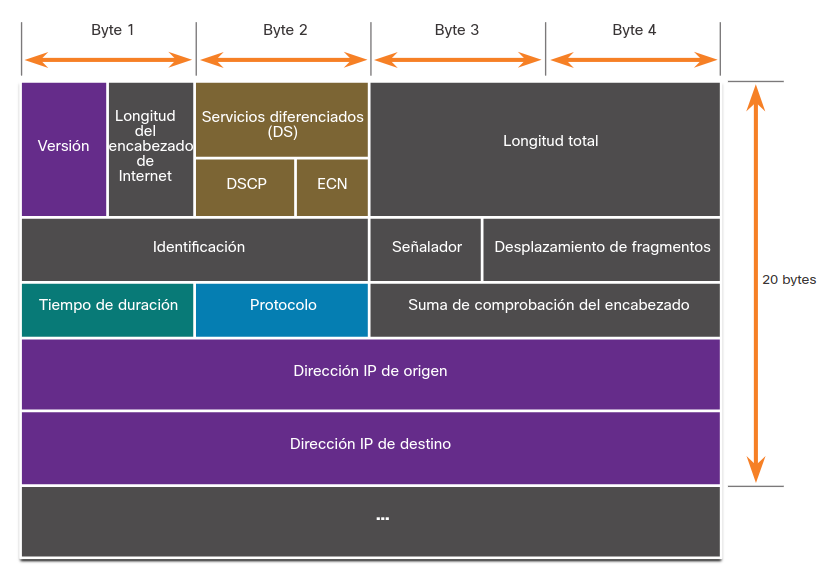
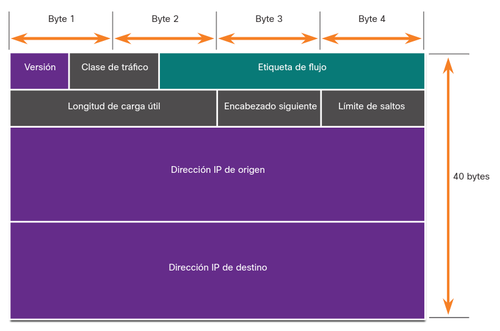
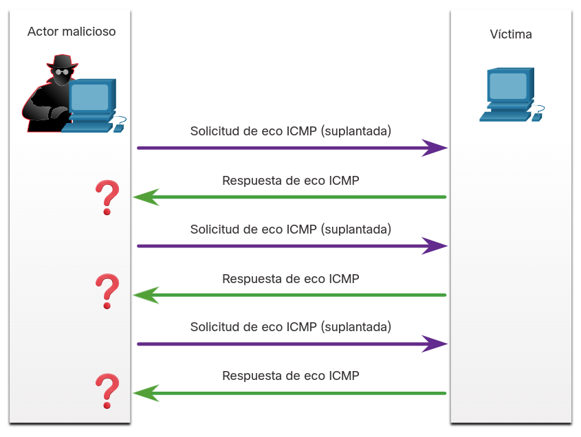
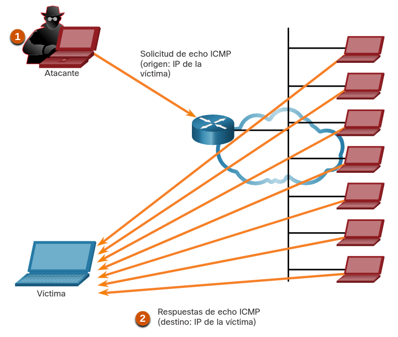
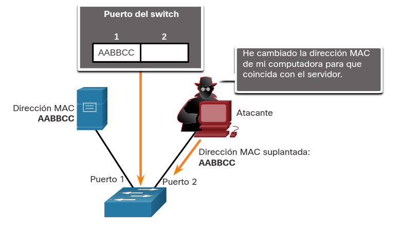
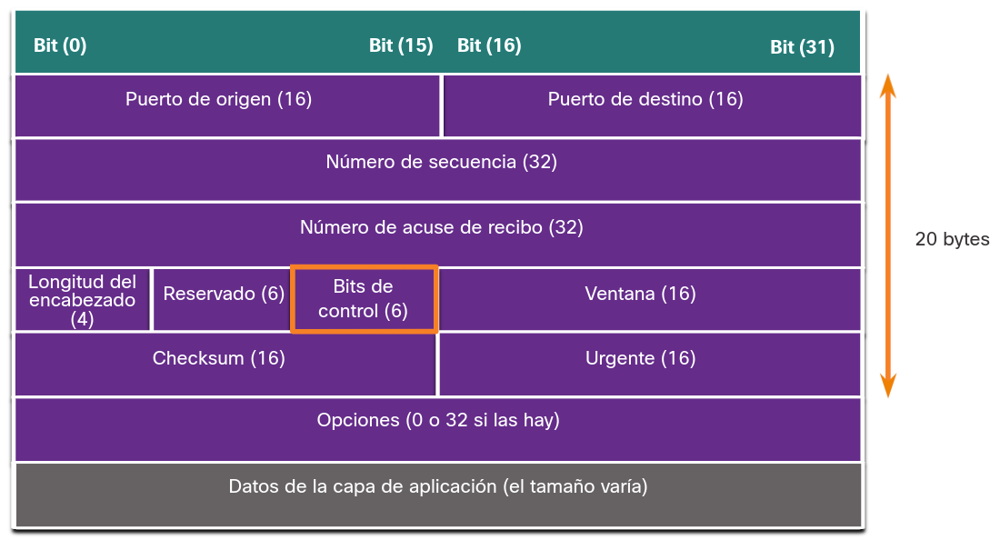
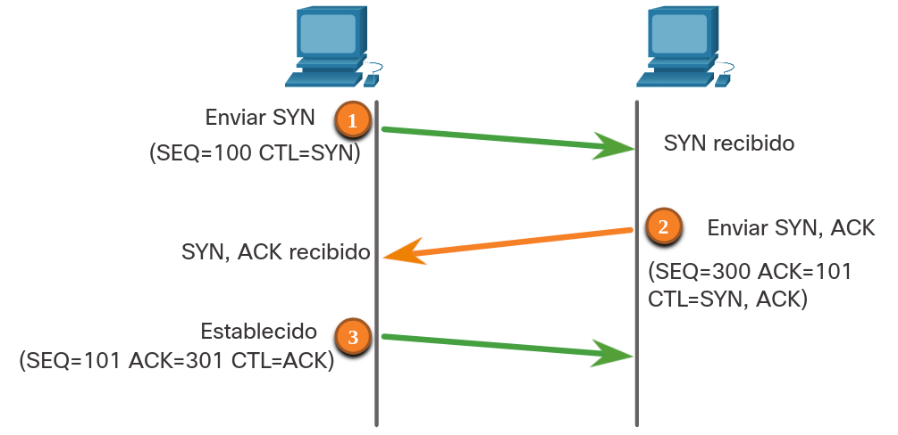
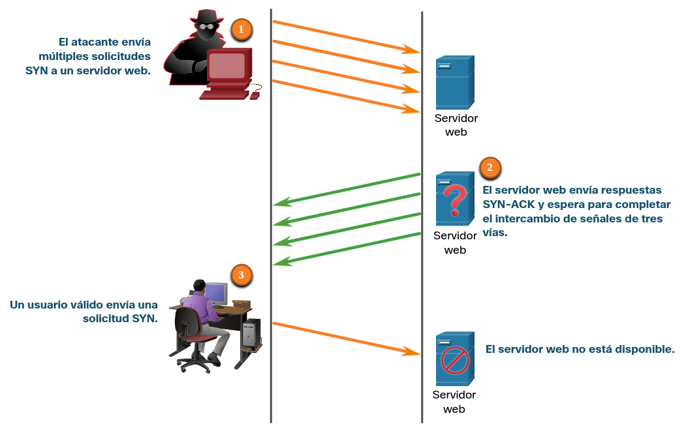
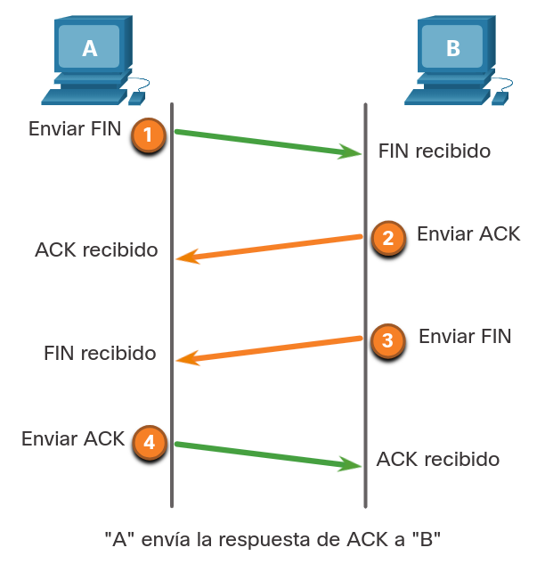
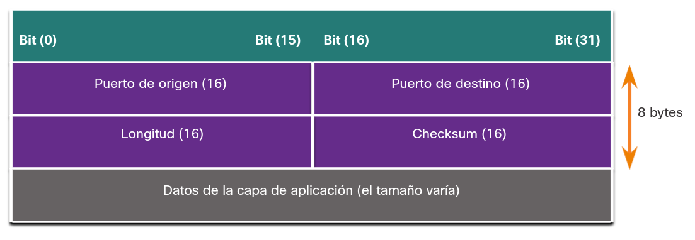

<a href="./00-Curso.md"><< Menú principal del módulo</a>

# 3. Ataque a los fundamentos
# Detalles de la PDU de IP
## IPv4 e IPv6
IP fue diseñado como un protocolo sin conexión de capa 3. Brinda las funciones necesarias para enviar un paquete de un host de origen a uno de destino mediante un sistema interconectado de redes. El protocolo no fue diseñado para rastrear ni administrar el flujo de paquetes. Si es necesario, TCP realiza principalmente estas funciones en la capa 4.

El protocolo IP no hace ningún esfuerzo para validar si la dirección IP de origen que figura en un paquete realmente proviene de ese origen. Por eso, los agentes de amenaza pueden enviar paquetes con una dirección IP de origen falsa. Además, los agentes de amenaza pueden alterar los demás campos del encabezado de IP para llevar a cabo sus ataques. Por lo tanto, es importante que los analistas de seguridad entiendan los diferentes campos de los encabezados de IPv4 e IPv6.

## El encabezado del paquete IPv4
Los campos acerca del encabezado IPv4 se muestran en la siguiente figura.

	

### Versión
Contiene un valor binario de 4 bits establecido en `0100` que lo identifica como un paquete de IPv4.

### Longitud del encabezado de Internet
* Un campo de 4 bits que contiene la longitud del encabezado IP.
* La longitud mínima de un encabezado IP es de 20 bytes.

### Servicios diferenciados de DiffServ (DS)
* Antiguamente conocido como el campo de "Tipo de Servicio" (ToS - _Type of Service_), el campo DS es un campo de 8 bits utilizado para determinar la prioridad de cada paquete.
* Los seis bits más importantes del campo DiffServ se encuentran en el punto de código de servicios diferenciados (DSCP - _Differentiated Services Code Point_).
* Los dos últimos bits son los bits de notificación de congestión explícita (ECN - _Explicit Congestion Notification_).

### Longitud total
* Especifica la longitud total del paquete IP incluyendo el encabezado IP y los datos del usuario.
* El campo de longitud total es de 2 bytes, por lo que el tamaño máximo de un paquete IP es de 65 535 bytes.

### Identificación, Banderas y Desplazamiento de fragmentos.
* A medida que un paquete IP se moviliza, es posible que deba cruzar una ruta que no es capaz de manejar el tamaño total del paquete.
* El paquete se dividirá fragmentará en paquetes más pequeños y se rearmará más adelante.
* Estos campos se utilizan para fragmentar y rearmar los paquetes.

### Tiempo de Existencia (TTL)
* Contiene un valor binario de 8 bits que es utilizado para delimitar el tiempo de existencia de un paquete
* El emisor del paquete establece el valor inicial de TTL que se reduce en uno cada vez que un router procesa el paquete.
* Si el campo TTL llega a cero, el router descarta el paquete y envía a la dirección IP de origen un mensaje de tiempo superado del protocolo de mensajes de control de Internet (ICMP).

### Protocolo
* Este campo se utiliza para identificar el protocolo de capa superior.
* Este valor binario de 8 bits indica el tipo de carga de datos que lleva el paquete, lo que permite que la capa de red transmita los datos al protocolo de capa superior apropiado.
* ICMP (1), TCP (6) y UDP (17) son algunos valores comunes.

### Checksum del encabezado
* Corresponde a un valor que es calculado basándose en el contenido del encabezado IP del paquete.
* Se utiliza para determinar si se han introducido errores durante la transmisión.

### Dirección IPv4 de origen
* Contiene un valor binario de 32 bits que representa la dirección IPv4 de origen del paquete.
* La dirección IPv4 de origen siempre es una dirección de Unicast.

### Dirección IPv4 de destino
* Contiene un valor binario de 32 bits que representa la dirección IPv4 de destino del paquete.

### Opciones y Relleno
* Este es un campo que varia la longitud de 0 a un múltiplo de 32 bits
* Si las opciones de valores no son un múltiplo de 32 bits, se agregan o intercalan ceros para garantizar que este campo contenga un múltiplo de 32 bits.

## El encabezado del paquete IPv6
Existen ocho campos en el encabezado IPv6, tal como se muestra en la figura.

	

### Versión
* Este campo contiene un valor binario de 4 bits establecido en `0110` que lo identifica como un paquete IPv6.

### Clase de tráfico
* Este campo de 8 bits es equivalente al campo Differentiated Services (DS) de IPv4

### Etiqueta de flujo
* Este campo de 20 bits sugiere que todos los paquetes con la misma etiqueta de flujo sean manejados de la misma manera por los routers

### Longitud de carga útil (_Payload_)
* Este campo de 16 bits indica la longitud de la porción de datos o de la payload (carga útil) del paquete IPv6.

### Próximo encabezado
* Este campo de 8 bits es equivalente al campo "Protocolo" de IPv4.
* Es un valor que indica el tipo de payload (carga útil) de datos que contiene el paquete, lo cual permite que la capa de red transmita los datos al protocolo de capa superior apropiado.

### Límite de saltos
* Este campo de 8 bits sustituye el campo TTL de IPv4.
* Cada router que reenvía el paquete reduce este valor en 1.
* Cuando llega a cero, se descarta el paquete y se envía un mensaje de tiempo superado de ICMPv6 al host de origen que indica que el paquete no llegó a destino porque excedió el límite de saltos.

### Dirección IPv6 de origen
* Este campo de 128 bits identifica la dirección IPv6 de origen del host emisor.

### Dirección IPv6 de destino
* Este campo de 128 bits identifica la dirección IPv6 del host receptor.

Un paquete IPv6 también contiene encabezados de extensión (EH - _Extension Headers_) que proporcionan información opcional de la capa de red. Los encabezados de extensión son opcionales y están ubicados entre el encabezado de IPv6 y la payload (carga útil). Los encabezados de extensión se utilizan para fragmentar, dar seguridad, soportar movilidad, entre otras.

A diferencia de IPv4, los routers no fragmentan los paquetes IPv6 enrutados.

# Vulnerabilidades de IP
## Vulnerabilidades de IP
Existen distintos tipos de ataques de IP. A continuación se mencionan algunos de los ataques comunes relacionados con IP:
* Ataques de ICMP. Los atacantes utilizan paquetes de echo (pings) del Protocolo de Mensajes de Control de Internet (ICMP) para detectar subredes y hosts en una red protegida, y luego generar ataques DoS de saturación y modificar las tablas de enrutamiento de los hosts.
* Ataque de Denegación de Servicio (DoS - _Denial of Service_). Los atacantes intentan impedir que usuarios legítimos tengan acceso a información o servicios.
* Ataque de Denegación de Servicio Distribuido (DDoS - _Distributed Denial of Service_). Similar a los ataques DoS, pero es llevado a cabo mediante un ataque simultáneo y coordinado desde varias máquinas de origen.
* Ataques de Suplantación de Dirección. Los atacantes suplantan la dirección IP de origen en un intento por llevar a cabo _blind spoofing_ o _non-blind spoofing_.
* Ataques Man-in-the-Middel (MiTM). Los atacantes se posicionan entre un origen y un destino para monitorear, capturar y controlar la comunicación en forma transparente. Ellos simplemente pueden monitorear pasivamente (_eavesdropping_), inspeccionando paquetes capturados o alterarlos y reenviarlos a su destino original.
* Secuestro de sesiones. Los atacantes obtienen acceso a la red física y, luego, usan un ataque de tipo MiTM para secuestrar una sesión.

## Ataques de ICMP
El ICMP se desarrolló para llevar mensajes de diagnóstico e informar condiciones de error cuando no están disponibles rutas, hosts y puertos. Los mensajes de ICMP son generados por los dispositivos cuando ocurre un error o una interrupción en la red. El comando "ping" es un mensaje de ICMP generado por el usuario, es una "solicitud echo", y es utilizado para verificar la conectividad a un destino.

Los agentes de amenaza utilizan el ICMP para los ataques de reconocimiento y análisis. Esto les permite iniciar ataques de recopilación de información para conocer la disposición de una topología de red, detectar qué hosts están activos (dentro del alcance), identificar el sistema operativo del host y determinar el estado de un_firewall_.

Los atacantes también utilizan ICMP para realizar ataques DoS y DDoS, como se muestra en el ataque de saturación de ICMP en la imagen.

	

__Nota__: ICMP para IPv4 (ICMPv4) e ICMP para IPv6 (ICMPv6) son susceptibles a ataques similares.

La siguiente tabla menciona algunos mensajes de interés ICMP para los atacantes.

* [_ICMP echo request_ y _echo replay_](./notes/icmp_echo_request_replay.md). Esto se utiliza para realizar la verificación del host y los ataques DoS.
* [_ICMP unreachable_](./notes/icmp_echo_unreachable.md). Esto se utiliza para realizar ataques de reconocimiento y escaneo de la red.
* [_ICMP mask replay_](./notes/icmp_mask_replay.md). Se utiliza para mapear una red IP interna.
* [_ICMP redirects_](./notes/icmp_redirects.md). Se utiliza para lograr que un host objetivo envíe todo el tráfico a través de un dispositivo comprometido y crear un ataque de MiTM.
* [_ICMP router discovery_](./notes/icmp_router_discovery.md). Esto se utiliza para inyectar entradas de rutas falsas en la tabla de routing de un host objetivo.

Las redes deben tener filtros estrictos de Lista de Control de Acceso (ACL - _Access Control List_) de ICMP en el perímetro de la red para evitar sondeos de ICMP desde Internet. Los analistas de seguridad deben ser capaces de detectar ataques relacionados con ICMP observando el tráfico capturado y los archivos de registro. En el caso de redes grandes, los dispositivos de seguridad (como _firewalls_ e IDS) deben detectar este tipo de ataques y generar alertas para los analistas de seguridad.

## Ataquetes de Reflexión y Amplificación
Los atacantes suelen usar técnicas de amplificación y reflexión para crear ataques de DoS. La figura muestra como una técnica de amplificación y reflexión llamada _smurf attack_ es utilizada para abrumar o sobrecargar a un objetivo.

	

1. __Amplificación__. El atacante reenvía mensajes de "echo request" de ICMP a muchos hosts. Estos mensajes contienen la dirección IP de origen de la víctima.
2. __Reflejo__. Todos estos hosts responden a la dirección IP falsa de la víctima para abrumarla.

__Nota__: Actualmente se han estado utilizando nuevas formas de ataques de amplificación y reflexión, como ataques de amplificación y reflexión basados en DNS y ataques de amplificación de Network Time Protocol (NTP).

Los atacantes también usan ataques de agotamiento de recursos. Estos ataques consumen los recursos de un host objetivo para detener su funcionamiento o consumir los recursos de una red.

## Ataques de suplantación (spoofing) de direcciones
Los ataques de Suplantación de dirección IP se producen cuando un atacante crea paquetes con información suplantada de la dirección IP de origen, ya sea para ocultar la identidad del remitente o hacerse pasar por otro usuario legítimo. Entonces, el atacante puede obtener acceso a datos a los que, de otro modo, no podría acceder, o para eludir configuraciones de seguridad. La Suplantación de dirección IP suele formar parte de otro ataque denominado ataque Smurf.

Los ataques de Spoofing (suplantación) pueden ser _blind_ (a ciegas) o _non-blind_ (con visibilidad):

* __Non-blind spoofing__: El atacante puede observar el tráfico que está siendo enviado entre el host y el objetivo. El atacante usa este tipo de suplantación para inspeccionar el paquete de respuesta del objetivo. Esta técnica determina el estado de un Firewall y la predicción del número de secuencia. También puede secuestrar una sesión autorizada.
* __Blind spoofing__: El atacante no puede ver el tráfico que se envía entre el host y el objetivo. Este tipo de suplantación se utiliza en ataques de DoS.
Los ataques de suplantación de dirección MAC se utilizan cuando los agentes de amenaza tienen acceso a la red interna. Los atacantes cambian la dirección MAC de su host para que coincida con otra dirección MAC conocida de un host objetivo, como se ve en la figura. Luego, el host atacante envía una trama a través de la red con la dirección MAC recién configurada. Cuando el switch recibe la trama, examina la dirección MAC de origen.

	

La suplantación de aplicaciones o servicios es otro ejemplo de suplantación. Un atacante puede conectar un servidor DHCP malicioso para crear una condición MiTM.

# Vulnerabilidades de TCP y UDP
## Encabezado de Segmento TCP
Si bien algunos ataques apuntan a IP, este tema trata los ataques que apuntan a TCP y UDP.

La información de segmento de TCP aparece inmediatamente después del encabezado de IP. En la figura se muestran los campos del segmento TCP y los marcadores (_flags_) para el campo de bits de control.

	

Los siguientes son los seis bits de control del segmento TCP:

* __URG__ - campo indicador urgente importante.
* __ACK__ - campo de reconocimiento significativo.
* __PSH__ - función de empuje.
* __RST__ - restablecer la conexión.
* __SYN__ - sincronizar números de secuencia.
* __FIN__ - no hay más datos del emisor.

## Servicios TCP
El TCP ofrece los siguientes servicios:
* __Entrega confiable__. TCP incorpora reconocimientos para garantizar la entrega, en lugar de depender de protocolos de capa superior para detectar y resolver errores. Si no se recibe un acuse de recibo oportuno, el emisor retransmite los datos. Requerir acuses de recibo de los datos recibidos puede causar retardos sustanciales. Algunos ejemplos de los protocolos de capa de aplicación que hacen uso de la confiabilidad de TCP incluyen HTTP, SSL/TLS, FTP y transferencias de zona DNS.
* __Control de flujo__. El TCP implementa el control de flujo para abordar este problema. En lugar de acusar recibo de un segmento a la vez, es posible hacerlo con varios segmentos acusando recibo de un único segmento individual.
* __Comunicación con estado__. La comunicación TCP con estado entre 2 partes ocurre durante la comunicación de "intercambio de señales de tres vías" de TCP (_three-way handshake_). Antes de que sea posible transferir datos utilizando el TCP, una comunicación de "intercambio de señales de tres vías" abre la conexión TCP, tal como se ve en la Figura. Si ambas partes aceptan la conexión TCP, pueden enviar y recibir datos utilizando TCP.

### Intercambio de señales de tres vías de TCP

	

Una conexión TCP se establece en tres pasos:
1. El cliente de origen solicita una sesión de comunicación con el servidor.
2. El servidor reconoce la sesión de comunicación de cliente a servidor y solicita una sesión de comunicación de servidor a cliente.
3. El cliente que inicia reconoce la sesión de comunicación de servidor a cliente.

## Ataques TCP
Las aplicaciones de red utilizan puertos TCP o UDP. Los agentes de amenaza llevan a cabo análisis de puertos de los dispositivos objetivo para detectar qué servicios ofrecen.

### Ataque de saturación SYN a TCP
El ataque de saturación de SYN de TCP ataca la comunicación de "intercambio de señales de tres vías" de TCP. Como se observa en la Figura 1, el atacante envía constantemente a un objetivo paquetes de solicitud de sesión TCP SYN con una dirección IP de origen falsificada de manera aleatoria. El dispositivo de destino responde con un paquete SYN-ACK de TCP a la dirección IP falsificada y espera un paquete ACK de TCP. Las respuestas nunca llegan. Finalmente, el host objetivo se ve sobrecargado por las conexiones TCP medio abiertas, y los servicios TCP se deniegan a los usuarios legítimos.

	

1. El atacante envía múltiples solicitudes SYN a un servidor web.
2. El servidor web responde con SYN-ACK para cada solicitud SYN y espera para completar el intercambio de señales de tres vías.
3. Un usuario válido no puede acceder al servidor web porque el servidor tiene demasiadas conexiones TCP medio abiertas

### Ataque de restablecimiento a TCP
Un ataque de restablecimiento de TCP puede utilizarse para terminar las comunicaciones de TCP entre dos hosts. La figura muestra como TCP utiliza un intercambio de cuatro vías para cerrar la conexión TCP con un par de segmentos FIN y ACK desde cada terminal de TCP. Una conexión TCP termina cuando recibe un bit RST. Esta es una manera abrupta de eliminar la conexión TCP e informar al host de recepción que deje de usar la conexión TCP de inmediato. Un agente de amenaza podría efectuar un ataque de restablecimiento de TCP y enviar un paquete falso con un RST de TCP a uno o ambos terminales.

	

La finalización de una sesión TCP utiliza el siguiente proceso de intercambio de cuatro vías:
1. Cuando el cliente no tiene más datos para enviar en la transmisión, envía un segmento con el indicador FIN establecido.
2. El servidor envía un ACK para acusar recibo del FIN para terminar la sesión del cliente al servidor.
3. El servidor envía el FIN al cliente para finalizar la sesión de servidor a cliente.
4. El cliente responde con un ACK para reconocer el FIN del servidor.

### Secuestro de sesiones TCP
Otra vulnerabilidad es el secuestro de sesiones de TCP. Aunque es difícil de realizar, permite que un atacante tome el control de un host autenticado mientras este se comunica con el objetivo. El atacante tendría que suplantar la dirección IP de un host, predecir el siguiente número de secuencia y enviar un ACK al otro host. Si tiene éxito, el atacante puede enviar, pero no recibir, datos desde el dispositivo objetivo.

## Encabezado y Operación del Segmento UDP
UDP es comúnmente utilizado por DNS, DHCP, TFTP, NFS, y SNMP. También lo utilizan aplicaciones en tiempo real, como la transmisión multimedia o VoIP. UDP es un protocolo de capa de transporte sin conexión (no se establece comunicación previa entre emisor y receptor). Tiene una sobrecarga mucho menor que TCP ya que no está orientado a la conexión y no proporciona los mecanismos sofisticados de retransmisión, secuenciación y control del flujo que ofrecen confiabilidad. La estructura del segmento UDP (el cual se muestra en la imagen) es mucho menor que la estructura del segmento TCP.

__Nota__: UDP actualmente divide los datos en datagramas. Sin embargo, el término genérico "segmento" se utiliza comúnmente.

	

Sin embargo aunque UDP es normalmente llamado "poco confiable", no significa que aplicaciones que utilizan UDP no sean confiables. Significa que estas funciones no las proporciona el protocolo de la capa de transporte, y se deben implementar aparte si es necesario.

La baja sobrecarga del UDP es muy deseable para los protocolos que realizan transacciones simples de solicitud y respuesta. Por ejemplo, usar TCP para DHCP introduciría una cantidad innecesaria de tráfico de red. Si no se recibe respuesta, el dispositivo reenvía la solicitud.

## Ataques de UDP
UDP no está protegido por ningún tipo de encriptación. Podemos agregar encriptación a UDP, pero no está disponible de forma predeterminada. La falta de encriptación permite que cualquiera vea el tráfico, lo modifique y lo envíe a su destino. Si se cambian los datos en el tráfico, se altera la checksum de 16 bits, pero esta es opcional y no siempre se usa. Cuando se utiliza checksum, el atacante puede crear una nueva suma basada en la nueva payload (carga útil) de los datos, y registrarla en el encabezado como una nueva checksum. El dispositivo de destino verificará que la suma de comprobación coincide con los datos sin saber que los datos se modificaron. Este tipo de ataque no es el más utilizado.

### Ataque de saturación de UDP
Es más probable que veamos un ataque de saturación UDP. En un ataque de saturación UDP, se consumen todos los recursos en una red. El atacante debe usar una herramienta como _UDP Unicorn_ o _Low Orbit Ion Cannon_. Estas herramientas envían una avalancha de paquetes UDP, a menudo desde un dispositivo suplantado, hacia un servidor en la subred. El programa analiza todos los puertos conocidos intentando encontrar puertos cerrados. Esto hace que el servidor responda con un mensaje de "puerto ICMP inaccesible". Debido a que hay muchos puertos cerrados en el servidor, esto crea mucho tráfico en el segmento, el cual utiliza la mayor parte del ancho de banda. El resultado es muy similar al de un ataque de DoS.

# Resumen
## Detalles de la PDU de IP
IP fue diseñado como un protocolo sin conexión de capa 3. El encabezado IPv4 consta de varios campos, mientras que el encabezado IPv6 contiene menos campos. Es importante que los analistas de seguridad entiendan los diferentes campos de los encabezados de IPv4 e IPv6.

## Vulnerabilidades de IP
Existen distintos tipos de ataques de IP. Los ataques comunes relacionados con IP incluyen:
* Ataques de ICMP
* Ataques de Denegación de Servicios (DoS)
* Ataques de Denegación de Servicios Distribuida (DDoS)
* Ataques de suplantación de dirección.
* Ataques Man-in-the-middle (MiTM)
* Secuestros de sesiones

El ICMP se desarrolló para llevar mensajes de diagnóstico e informar condiciones de error cuando no están disponibles rutas, hosts y puertos. Los atacantes utilizan el ICMP para los ataques de reconocimiento y análisis. Los atacantes también utilizan ICMP para ataques DoS y DDoS Los atacantes suelen usar técnicas de amplificación y reflexión para crear ataques DoS. Los atacantes también utilizan ataques de agotamiento de recursos para consumir los recursos de un host objetivo, con el propósito de que deje de funcionar o para consumir los recursos de una red. Los ataques de suplantación de dirección IP se producen cuando un atacante crea paquetes con información suplantada (o falsa) de la dirección IP de origen para ocultar la identidad del remitente o hacerse pasar por otro usuario legítimo. Los ataques de suplantación de dirección pueden ser una spoofing non-blind (a ciegas) para secuestrar una sesión o una spoofing blind (con visibilidad) para crear un ataque DoS. Los ataques de suplantación (spoofing) de dirección MAC se utilizan cuando los atacantes tienen acceso a la red interna.

## Vulnerabilidades de TCP y UDP
La información de segmento TCP y del datagrama UDP, aparece inmediatamente después del encabezado de IP. Es importante comprender los encabezados de Capa 4 y sus funciones en la comunicación de datos. TCP proporciona entrega confiable, control de flujo y comunicación con estado. La comunicación TCP con estado entre 2 partes ocurre durante la comunicación de "intercambio de señales de tres vías" de TCP (_three-way handshake_). Los atacantes pueden llevar a cabo una variedad de ataques relacionados con TCP:
* Escaneo de puertos TCP
* Ataque de saturación TCP SYN
* Ataque de restablecimiento de TCP
* Ataque de secuestro de sesión TCP

El segmento UDP (es decir, datagrama) es mucho más pequeño que el segmento TCP, lo que hace que sea muy conveniente para su uso por protocolos que hacen transacciones simples de solicitud y respuesta como DNS, DHCP y SNMP. Los atacantes pueden llevar a cabo ataques de saturación UDP que analizan todos los puertos UDP conocidos en un servidor, intentando encontrar puertos cerrados. Esto puede crear una situación de DoS.

## Enlaces de interés
<a href="https://security.stackexchange.com/questions/58838/who-can-carry-out-man-in-the-middle-mitm-attacks" target="_blank">Who can carry out Man-in-the-Middle (MITM) attacks?</a>
<a href="https://security.stackexchange.com/questions/31653/how-to-demonstrate-man-in-the-middle-attack" target="_blank">How to "demonstrate" man-in-the-middle attack?</a>
<a href="https://www.cisco.com/c/en/us/support/docs/ip/access-lists/26448-ACLsamples.html#toc-hId--1588884728" target="_blank">Configure Commonly Used IP ACLs</a>
 
 
 
 
 
 
 
<a href="#2-protección-de-redes">⬆️</a>
<a href="./00-Curso.md"><< Menú principal del módulo</a>