<a href="./00-Curso.md"><< Menú principal del módulo</a>

# 4. Atacando lo que hacemos
Los fundamentos de la red deben estar protegidos, pero no es suficiente para proteger completamente nuestra red. Los protocolos que se utilizan para llevar a cabo las actividades diarias de la organización, también deben estar protegidos. Además, los protocolos y el software que proporcionan servicios a través de la red también pueden ser el objetivo de los atacantes. Un analista de ciberseguridad debe estar familiarizado con las vulnerabilidades y amenazas a los fundamentos de la comunicación de red.

En este módulo, aprenderá cómo funcionan los protocolos comúnmente utilizados en la empresa y cómo son vulnerables a ataques y explotaciones.

# Servicios IP
## Vulnerabilidades de ARP
Los hosts transmiten una solicitud ARP hacia otros hosts del segmento de red para determinar la dirección MAC de un host con una dirección IP específica. Todos los hosts de la subred reciben y procesan la solicitud de ARP. El host con la dirección IP que coincide con la de la solicitud de ARP envía una respuesta de ARP.

Cualquier cliente puede enviar una respuesta de ARP no solicitada llamada “ARP gratuito”. Esto suele hacerse cuando un dispositivo se inicia por primera vez para informar a todos los demás dispositivos de la red local sobre la nueva dirección MAC del dispositivo. Cuando un host envía un ARP gratuito, otros hosts en la subred almacenan en sus tablas de ARP la dirección MAC y la dirección IP que contiene dicho ARP.

Sin embargo, esta característica de ARP también significa que cualquier host puede afirmar ser el dueño de cualquier IP/MAC que elija. Un atacante puede envenenar la caché ARP([1](#enlaces-de-interés)) de los dispositivos en la red local y crear un ataque MiTM para redireccionar el tráfico. El objetivo es asociar la dirección MAC del atacante con la dirección IP de la Puerta de enlace por defecto en las caché ARP de los hosts del segmento LAN. Esto posiciona al atacante entre la víctima y todos los demás sistemas fuera de la subred local.

## Envenenamiento de cahé de ARP
El envenenamiento de caché ARP se puede usar para lanzar varios ataques Man-in-the-middle.
1. __Solicitud de ARP__
La figura muestra cómo funciona el envenenamiento de caché ARP. La PC-A requiere la dirección MAC de su Puerta de enlace por defecto (R1); por lo tanto, envía una solicitud ARP para la dirección MAC de 192.168.10.1.

	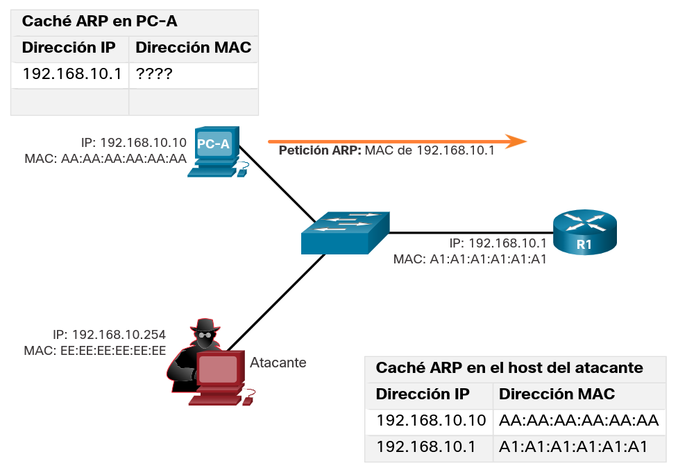

2. __Respuesta de ARP__
En está figura, R1 actualiza su caché ARP con las direcciones IP y MAC de la PC-A y envía una respuesta de ARP a PC-A, la cual a su vez, actualiza su caché ARP con las direcciones IP y MAC del R1.

	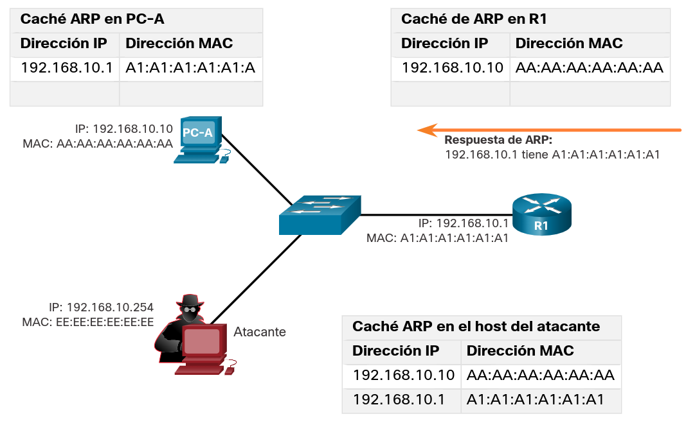

3. __Respuestas ARP gratuitas falsificadas__
En la figura, el atacante envía dos respuestas de ARP gratuitas falsas usando su propia dirección MAC para las direcciones IP de destino indicadas. La PC-A actualiza su caché ARP con su Puerta de enlace por defecto, la cual ahora apunta hacia la MAC del host del atacante. El R1 también actualiza su caché ARP con la dirección IP de la PC-A y comienza a apuntar a la dirección MAC del atacante.
El anfitrión del atacante está ejecutando un ataque de envenenamiento ARP. El envenenamiento ARP puede ser pasivo o activo: Pasivo: Los atacantes roban información confidencial. Activo: Los atacantes modifican datos en tránsito o inyectan datos maliciosos.

	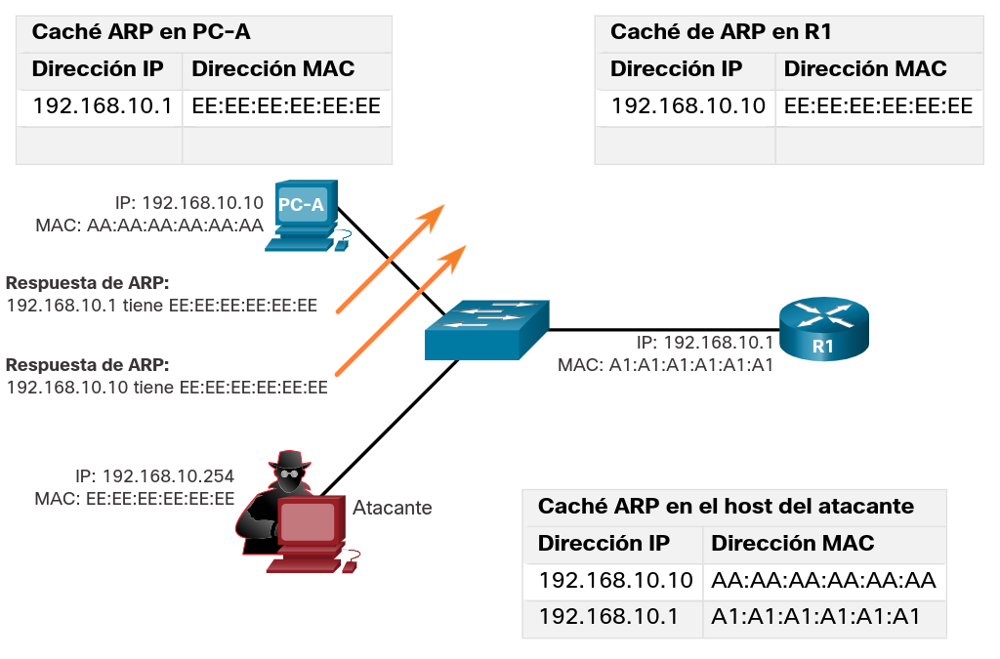

__Nota__: Hay muchas herramientas disponibles en Internet para crear ataques de MiTM de ARP, como dsniff, Cain & Abel, ettercap y Yersinia.

## Ataques de DNS
El protocolo de Sistema de Nombres de Dominio (DNS) define un servicio automatizado que empareja los nombres de recursos, como www.cisco.com, con su respectiva dirección de red numérica, ya sea dirección IPv4 o IPv6. Incluye el formato para las consultas, respuestas y datos, y usa registros de recursos (RR) para identificar el tipo de respuesta de DNS.

La protección de DNS suele pasarse por alto. Sin embargo, es fundamental para el funcionamiento de una red y debe protegerse correctamente. Los ataques DNS incluyen los siguientes:
* Ataques de resolución abierta de DNS
* Ataques sigilosos de DNS
* Ataques de domain shadowing de DNS
* Ataques de tunelización de DNS

### Ataques de resolución abierta
Muchas organizaciones utilizan los servicios de los servidores DNS públicos abiertos, como GoogleDNS (8.8.8.8), para responder las consultas. Este tipo de servidor DNS se denomina resolución abierta. Una resolución de DNS abierta responde las consultas de clientes fuera de su dominio administrativo. Las resoluciones abiertas de DNS son vulnerables a múltiples actividades maliciosas, como las descritas a continuación.
* __Ataque de envenenamiento de caché DNS([2](#enlaces-de-interés)) (_DNS spoofing_, _DNS poisoning_)__. Los atacantes envían registros de recursos (RR) falsificados a una "DNS resolver" para redirigir a los usuarios de sitios legítimos a sitios maliciosos. Estos ataques se pueden utilizar para informar a la resolución de DNS que utilice un servidor de nombre malicioso que proporciona información del RR para actividades maliciosas.
* __Ataque de amplificación y reflexión de DNS__. Los atacantes usan ataque DoS o DDoS para aumentar el volumen de ataques y para ocultar la verdadera fuente de un ataque. Los atacantes envían mensajes de DNS a las resoluciones abiertas utilizando la dirección IP de un host de destino. Estos ataques son posibles porque la resolución abierta responde las consultas de cualquiera que pregunte.
* __Ataque de utilización de recursos DNS__. Un ataque DoS consume los servidores de resolución abierta de DNS. Este ataque de DoS consume todos los recursos disponibles para afectar negativamente las operaciones de la resolución de DNS abierta. El impacto de este ataque de DoS puede requerir el reinicio de la resolución de DNS abierta o la interrupción y el reinicio de los servicios.

### Ataques sigilosos de DNS
Para ocultar su identidad, los atacantes también utilizan las siguientes técnicas de DNS sigilosas para llevar a cabo sus ataques.
* __Flujo rápido__. Los atacantes utilizan esta técnica para ocultar sus sitios de entrega de phishing y malware en una red de hosts DNS atacados que cambia rápidamente. Las direcciones IP de DNS cambian constantemente en apenas minutos. A menudo, los botnets emplean técnicas de flujo rápido para ocultar con eficacia servidores maliciosos y evitar su detección.
* __Double IP Flux__. Los atacantes utilizan esta técnica para cambiar rápidamente el hostname para las asignaciones de dirección IP y también cambiar el servidor de nombres autorizados. Esto aumenta la dificultad para identificar el origen del ataque.
* __Algoritmos de generación de dominio__. Los atacantes utilizan esta técnica en malware para generar aleatoriamente nombres de dominio que puedan utilizarse como puntos de encuentro de sus servidores de Mando y control (C&C, siglas en inglés).

### Ataques de domain shadowing de DNS
El uso de [_domain shadowing_](./notes/dns_domain_shadowing.md) implica que el atacante recolecte credenciales de cuenta de dominio para crear múltiples subdominios para utilizarlos durante los ataques. Estos subdominios generalmente apuntan a servidores maliciosos sin alertar al propietario real del dominio principal.

## Túnel de DNS
Las botnets se han convertido en un método popular de ataque de los agentes de amenaza. La mayoría de las veces, las botnets se utilizan para propagar malware o iniciar ataques de DDoS y phishing.

A veces, el DNS en la empresa no se tiene en cuenta como un protocolo que las botnets pueden utilizar. Debido a esto, cuando se determina que el tráfico DNS es parte de un incidente, el ataque ya finalizó. Es necesario que el analista de ciberseguridad sea capaz de detectar cuándo un intruso utiliza la tunelización DNS para robar los datos, y así evitar y contener el ataque. Para lograr esto, el analista de seguridad debe implementar una solución que puede bloquear las comunicaciones salientes de los hosts infectados.

Los agentes de amenaza que utilizan la tunelización de DNS colocan tráfico que no es DNS en tráfico DNS. Con frecuencia, este método evita las soluciones de seguridad. Para que el agente de amenaza use la tunelización de DNS, se modifican los diferentes tipos de registros de DNS, como TXT, MX, SRV, NULL, A o CNAME. Por ejemplo, un registro TXT puede almacenar los comandos que son enviados hacia los bots de los host infectados como respuestas DNS. Un ataque de tunelización de DNS mediante TXT funciona así:

1. Los datos se dividen en varias partes codificadas.
2. Cada parte se coloca en una etiqueta de nombre de dominio de nivel inferior de la consulta de DNS.
3. Dado que no hay ninguna respuesta del DNS local o en red para la consulta, la solicitud se envía a los servidores DNS recursivos del ISP.
4. El servicio de DNS recursivo reenvía la consulta al servidor de nombres autorizado del atacante.
5. El proceso se repite hasta que se envían todas las consultas que contienen las partes.
6. Cuando el servidor de nombre autorizado del atacante recibe las consultas de DNS de los dispositivos infectados, envía las respuestas para cada consulta de DNS, las cuales contienen los comandos encapsulados y codificados.
7. El malware en el host atacado vuelve a combinar las partes y ejecuta los comandos ocultos dentro.

Para poder detener la tunelización de DNS, debe utilizarse un filtro que inspecciona el tráfico de DNS. Preste especial atención a las consultas de DNS que son más largas de lo normal, o las que tienen un nombre de dominio sospechoso. Además, las soluciones de seguridad DNS, como Cisco Umbrella (Antes conocido como Cisco OpenDNS), bloquean gran parte del tráfico de la tunelización de DNS identificando dominios sospechosos. Los dominios asociados con servicios de DNS Dinámico deben considerarse altamente sospechosos.

	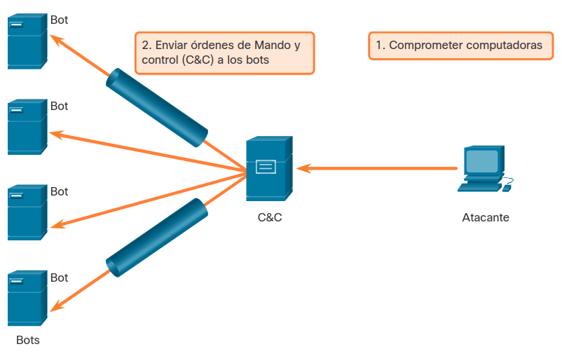

## DHCP
Los servidores DHCP proporcionan de manera dinámica, información de configuración de IP a los clientes. La figura muestra la secuencia típica de un intercambio de mensajes DHCP entre el cliente y el servidor.

	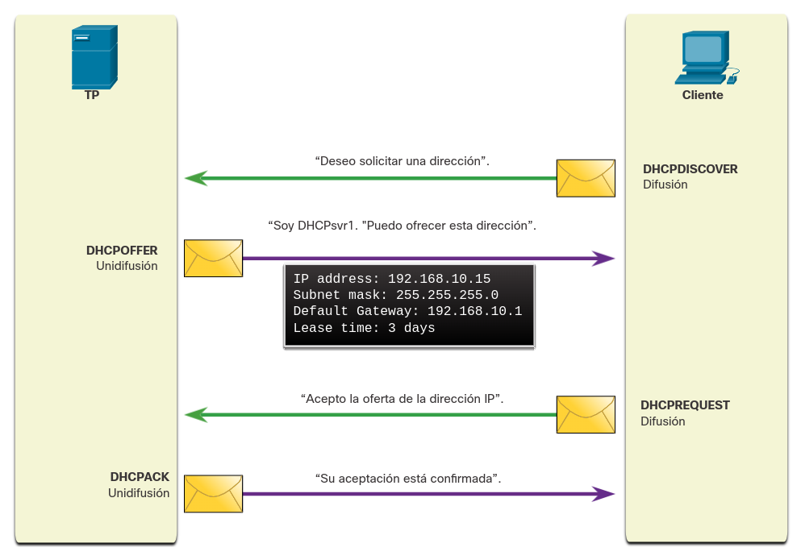

En la figura, un cliente transmite un mensaje de DHCP discover. El servidor DHCP responde con una oferta de _unicast_ que incluye información de direccionamiento que el cliente puede usar. El cliente transmite una solicitud DHCP para decirle al servidor que acepta la oferta. El servidor le responde mediante _unicast_ con un acuse de recibo, aceptando la solicitud.

## Ataques DHCP
Un ataque de suplantación de DHCP se produce cuando un servidor DHCP dudoso se conecta a la red y brinda parámetros de configuración IP falsos a los clientes legítimos. Un servidor dudoso puede proporcionar una variedad de información engañosa:
* __Puerta de enlace predeterminada incorrecta__. El agente de amenaza proporciona un gateway no válido o la dirección IP de su host para crear un ataque de MITM. Esto puede pasar totalmente inadvertido, ya que el intruso intercepta el flujo de datos por la red.
* __Servidor DNS incorrecto__.  El atacante proporciona una dirección del servidor DNS incorrecta que dirige al usuario a un sitio web malicioso.
* __Dirección IP incorrecta__. El atacante proporciona una dirección IP no válida, una dirección IP de puerta de enlace por defecto no válida o ambas. Luego, el atacante crea un ataque DoS en el cliente DHCP.

Supongamos que un agente de amenaza conecta con éxito un servidor DHCP dudoso a un puerto de switch en la misma subred que los clientes de destino. El objetivo del servidor dudoso es proporcionarles a los clientes información de configuración de IP falsa.

1. __El cliente transmite mensajes DHCP Discovery__. En la figura, un cliente legítimo se conecta a la red y requiere parámetros de configuración de IP. Por lo tanto, el cliente transmite una solicitud de DHCP Discover en busca de una respuesta de un servidor DHCP. Ambos servidores recibirán el mensaje.

	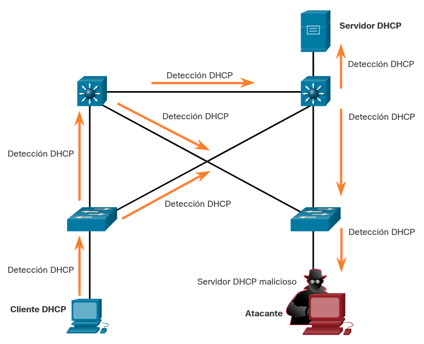

2. Los servidores DHCP responden con ofertas. 
En la figura, se ejemplifica cómo el servidor DHCP malicioso y el legítimo responden ambos con parámetros de configuración IP válidos. El cliente responde a la primera oferta recibida.

	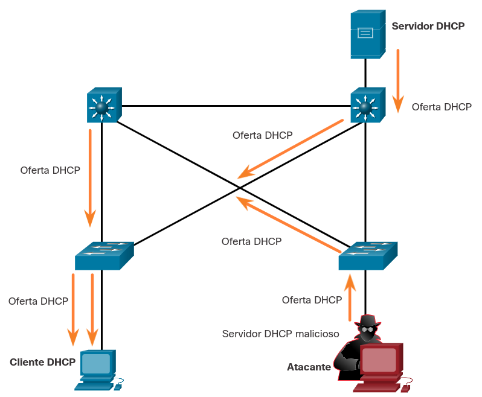

3. El cliente acepta la solicitud del DHCP malicioso. 
En esta situación, el cliente recibió primero la oferta del servidor malicioso, y transmite una solicitud de DHCP aceptando los parámetros del servidor malicioso, como se muestra en la Figura. El servidor legítimo y el malicioso reciben la solicitud.

	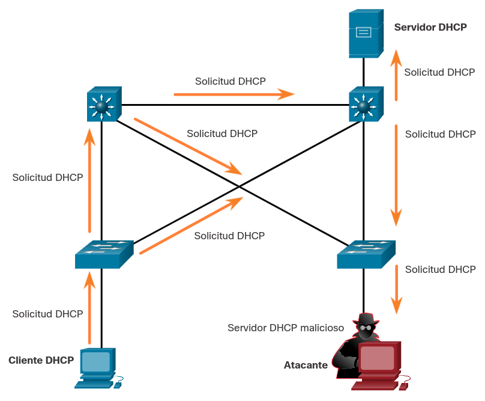

4. El servidor DHCP malicioso hace acuse de recibo de la solicitud. 
Sin embargo, solamente el servidor malicioso emite una respuesta unicast al cliente para acusar recibo de su solicitud, como se muestra en la figura. El servidor legítimo deja de comunicarse con el cliente porque la solicitud ya ha sido confirmada.

	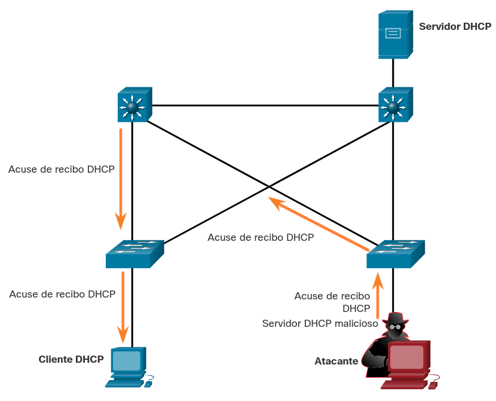

## Lab - Explorar tráfico DNS (pendiente hacer)
En esta práctica de laboratorio se cumplirán los siguientes objetivos:
* Capturar tráfico DNS
* Explorar tráfico de consultas DNS
* Explorar tráfico de respuestas DNS

<a href="./notes/lab_explorar_trafico_dns.md" target="_blank">Explorar tráfico DNS</a>

# Servicios empresariales
## HTTP y HTTPS
Casi todo el mundo usa navegadores de Internet. Bloquearlos por completo no es una opción, ya que las empresas necesitan tener acceso a la web sin poner en riesgo la seguridad web.

Para investigar los ataques basados en la web, los analistas de seguridad deben comprender muy bien cómo funciona un ataque estándar basado en la web. Normalmente, estas son las etapas de un ataque típico de la web:

1. La víctima, sin saberlo, visita una página web infectada con malware.
2. La página web infectada redirige al usuario (a menudo, mediante muchos servidores atacados) a un sitio que contiene código malicioso.
3. El usuario visita este sitio con código malicioso y su computadora se infecta. Esto se conoce como "drive-by download". Cuando el usuario visita el sitio, un kit de ataque analiza el software que se ejecuta en la computadora de la víctima (por ejemplo, el sistema operativo, Java o Flash Player) en busca de una vulnerabilidad de software. El kit de ataque es, a menudo, un script PHP y le proporciona al atacante una consola de administración para gestionar el ataque.
4. Después de identificar un paquete de software vulnerable ejecutándose en la computadora de la víctima, el kit de ataque se comunica con su servidor para descargar código que pueda aprovechar la vulnerabilidad a fin de ejecutar código malicioso en la computadora de la víctima.
5. Una vez que se infecta la computadora de la víctima, se conecta al servidor de malware y descarga una carga útil. Esta carga podría ser malware o un servicio de descarga de archivos que descarga otro malware.
6. El paquete final de malware se ejecuta en la computadora de la víctima.

Independientemente del tipo de ataque que se utilice, el objetivo principal del atacante es asegurarse que el navegador web de la víctima llegue a su página web, la cual introduce el código malicioso en la computadora de la víctima.

Algunos sitios maliciosos aprovechan complementos vulnerables o vulnerabilidades del navegador para poner en riesgo el sistema del cliente. Las redes más grandes dependen de IDS para analizar los archivos descargados en busca de malware. Si detectan que los archivos podrían contener malware, los IDS emiten alertas y registran el evento en archivos de registro para su posterior análisis.

Los registros de conexión del servidor suelen revelar información sobre el tipo de análisis o de ataque. Los diferentes tipos de códigos de estado de conexión se enumeran aquí:
* __Informativo 1xx__. Este corresponde a una respuesta provisional, que consiste solamente en la línea de estado y los encabezados opcionales. Finaliza con una línea vacía. No se necesitan encabezados para esta clase de código de estado. Los servidores NO DEBEN enviar una respuesta 1xx a un cliente HTTP/1.0, salvo en condiciones experimentales.
* __Correcto 2xx__. La solicitud del cliente fue satisfactoriamente recibida, comprendida, y aceptada.
* __Redirección 3xx__. El agente de usuario debe tomar medidas adicionales para completar la solicitud. Un cliente DEBE detectar bucles de redireccionamiento infinito, porque estos bucles generan tráfico de red para cada redireccionamiento.
* __Error de Cliente 4xx__. Para casos en los que el cliente parece haber cometido un error. Excepto al responder a una petición de ENCABEZADO, el servidor DEBE incluir una entidad que contenga una explicación de la situación, y si es temporal. Los agentes de un usuario DEBEN mostrar todas las entidades incluidas al usuario.
* __Error de Servidor 5xx__. Para casos donde el servidor detecta que se equivocó, o no puede realizar la solicitud. Excepto al responder a una petición de ENCABEZADO, el servidor DEBE incluir una entidad que contenga una explicación de la situación de error, y si es temporal. Los agentes de un usuario DEBEN mostrar todas las entidades incluidas al usuario.

Para defenderse de los ataques basados en la web, se deben implementar las siguientes medidas:
* Actualizar siempre el sistema operativo y los navegadores con versiones y parches actuales.
* Utilizar un proxy web como Cisco Cloud Web Security o Cisco Web Security Appliance para bloquear sitios maliciosos.
* Utilizar las mejores prácticas de seguridad del proyecto Open Web Application Security Project (OWASP) en el desarrollo de aplicaciones web.
* Educar a los usuarios finales demostrándoles cómo evitar ataques basados en la web.

El "Top 10 Web Application Security Risks" (Top 10 principales riesgos de seguridad para las aplicaciones Web de OWASP) está diseñado para ayudar a las organizaciones a crear aplicaciones web seguras. Es una lista útil de vulnerabilidades potenciales que son comúnmente aprovechadas por los atacantes.

## Ataques HTTP comunes
A continuación se citan las vulnerabilidades HTTP más comunes.
* **_iFrames_ maliciosos**. Los agentes de amenaza suelen usar iFrames o Inline Frames maliciosos. Un iFrame es un elemento HTML que le permite al navegador cargar otra página web desde otra fuente. Los ataques de iFrame se han vuelto muy comunes, ya que suelen utilizarse para insertar anuncios de otras fuentes en la página. Los atacantes comprometen un servidor web y modifican las páginas web agregando HTML para el iFrame malicioso. El HTML hace un enlace al servidor web del atacante. En algunos casos, la página iFrame que se carga consta de apenas algunos píxeles. Esto hace que el usuario tenga dificultades para ver el contenido. Debido a que el iFrame se ejecuta en la página, se puede utilizar para lanzar un exploit malicioso, como publicidad Spam, kits de ataque (exploit kits) y otros tipos de malware.
Estas son algunas maneras de evitar o reducir los iFrames maliciosos:
	* Utilizar un proxy web para bloquear sitios maliciosos.
	* Debido a que los atacantes suelen cambiar la fuente HTML del iFrame en un sitio web comprometido, nos debemos asegurar de que los desarrolladores web no utilicen iFrames. Esto aislará cualquier contenido de sitios web de terceros y facilitará la búsqueda de páginas modificadas.
	* Utilizar un servicio como Cisco Umbrella para evitar que los usuarios visiten sitios web que se sabe que son maliciosos.
	* Asegurarse de que el usuario final entienda lo que es un iFrame. Los atacantes suelen utilizar este método en ataques basados en web.
* __Redireccionamiento HTTP 302__. Otro tipo de ataque HTTP es el ataque de redireccionamiento HTTP 302. Los atacantes utilizan el código de respuesta HTTP 302 Found (Encontrado) para dirigir el navegador web del usuario a una nueva ubicación. Los atacantes suelen utilizar funciones legítimas de HTTP como redireccionamientos HTTP para llevar a cabo sus ataques. HTTP permite a los servidores redirigir una solicitud HTTP de cliente a un servidor diferente. El redireccionamiento HTTP se utiliza, por ejemplo, cuando el contenido de la web se ha trasladado a una dirección URL o un nombre de dominio diferentes. Esto permite que la dirección URL y los marcadores anteriores continúen funcionando. Por lo tanto, los analistas de seguridad deben comprender cómo funciona una característica como el redireccionamiento HTTP y cómo se usa durante los ataques.
Cuando la respuesta del servidor es un estado HTTP 302 Found, también proporciona la dirección URL en el campo de ubicación. El navegador cree que la nueva ubicación es la dirección URL en el encabezado, y recibe la invitación para solicitar esta nueva dirección URL. Esta función de redireccionamiento puede utilizarse varias veces hasta que el navegador finalmente llega a la página que contiene el ataque. Los redireccionamientos pueden ser difíciles de detectar debido los redireccionamientos legítimos son comunes en la red.
Estas son algunas maneras de evitar o reducir los ataques de redireccionamiento HTTP 302:
	* Utilizar un proxy web para bloquear sitios maliciosos.
	* Utilizar un servicio como Cisco Umbrella para evitar que los usuarios visiten sitios web que se sabe que son maliciosos.
	* Asegúrese de que el usuario final entienda cómo se redirige al navegador por una serie de redireccionamientos HTTP 302.
* __Concurrencia de dominios__. Cuando un atacante quiere crear un ataque de Domain shadowing, el atacante primero debe comprometer un dominio. Luego, el atacante debe crear múltiples subdominios de ese dominio para usarlos en los ataques. Una vez que lo hace, los inicio de sesión del registro secuestrados son utilizados para crear los subdominios que sean necesarios. Después de crear estos subdominios, los atacantes pueden utilizarlos como quieran, incluso si se detecta que son dominios maliciosos. Simplemente pueden crear nuevos desde el dominio principal. Los agentes de amenaza suelen respetar la siguiente secuencia:
	1. Un sitio web es comprometido.
	2. El redireccionamiento HTTP 302 es utilizado para enviar el navegador a sitios web maliciosos.
	3. Se utiliza Domain shadowing para dirigir el navegador a un servidor comprometido.
	4. Se accede a una página que contiene un kit de ataque (exploit kit)
	5. Se descarga el malware de la página que contiene el exploit kit.

	Estas son algunas maneras de evitar o reducir los ataques Domain shadowing:
	* Proteja todas las cuentas de propietario de dominio. Utilice contraseñas fuertes y la autenticación de dos factores para garantizar estas cuentas tan importantes.
	* Utilizar un proxy web para bloquear sitios maliciosos.
	* Utilizar un servicio como Cisco Umbrella para evitar que los usuarios visiten sitios web que se sabe que son maliciosos.
	* Asegurarse de que los propietarios de dominios validen sus cuentas de registro y busquen cualquier subdominio que no hayan autorizado.

## Correo electrónico
Durante más de 25 años, el correo electrónico ha evolucionado: pasó de ser una herramienta que usaban principalmente los profesionales técnicos y de investigación a ser el pilar de las comunicaciones corporativas. Todos los días se intercambian más de 100 000 millones de mensajes de correo electrónico corporativos. A medida que aumenta el uso del correo electrónico, la seguridad se torna más importante. La manera en que los usuarios tienen acceso al correo electrónico en la actualidad también aumenta la oportunidad de ataques de malware. En el pasado, los usuarios corporativos accedían a correo electrónico basado en texto desde un servidor corporativo. El servidor corporativo estaba en una estación de trabajo protegida por el firewall de la empresa. Hoy, se tiene acceso a los mensajes de correo electrónico desde muchos dispositivos diferentes que no suelen estar protegidos por el firewall de la empresa. HTML permite más ataques debido al volumen de acceso que, a veces, puede esquivar las distintas capas de seguridad.

Los siguientes son ejemplos de amenazas por correo electrónico:
* Ataques basados en adjuntos. Los atacantes incrustan contenido malicioso en los archivos empresariales, por ejemplo, en un correo electrónico del departamento de TI. Los usuarios legítimos abren el contenido malicioso. El malware se usa en grandes ataques, a menudo en nombre de un área empresarial específica, para convencer a los usuarios que trabajan en esa área que abran los archivos adjuntos o hagan clic en los enlaces incrustados.
* Suplantación de identidad por correo electrónico. Los agentes de amenaza crean mensajes de correo electrónico con una dirección de remitente falsificada que pretende engañar al destinatario para que entregue dinero o información confidencial. Por ejemplo, un banco envía un correo electrónico solicitando actualizar las credenciales. Cuando este mensaje tiene un logo del banco idéntico al de otros correos legítimos recibidos en el pasado, tiene más probabilidades de que el usuario lo abra, abra los archivos adjuntos y haga clic en los enlaces. El mensaje de correo electrónico falsificado puede pedirle al usuario incluso que verifique sus credenciales para que el banco se asegure de que no es otra persona, logrando exponer así su información de inicio de sesión.
* Correo electrónico no deseado. Los atacantes envían correo electrónico no solicitado que contiene publicidad o archivos maliciosos. Normalmente, este tipo de correo electrónico se envía para generar una respuesta que le indica al agente de amenaza que el mensaje se validó y que un usuario abrió el correo electrónico no deseado.
* Abrir servidor de relay de correo. Los atacantes toman ventaja de los servidores empresariales que están mal configurados como servidores de correo con "open relay", para así poder enviar grandes cantidades de Spam o de malware a usuarios desprevenidos. Este tipo de servidor mal configurado es un servidor SMTP que permite que cualquiera en internet pueda enviar correo. Debido a que cualquier persona puede utilizar el servidor, este es vulnerable al envío de correo electrónico no deseado y gusanos. Es posible enviar grandes volúmenes de correo electrónico no deseado utilizando un servidor de retransmisión abierta de correo. Es importante que los servidores de correo electrónico corporativo nunca se configuren como servidores de retransmisión abierta. Esto reducirá considerablemente la cantidad de correos electrónicos no solicitados.
* Homoglifos. Los atacantes pueden utilizar caracteres de texto que son muy similares o incluso idénticos a los caracteres de texto legítimo. Por ejemplo, puede ser difícil distinguir entre una O (“O” mayúscula) y el 0 (número cero) o una l (“L” minúscula) y un 1 (número uno). Estos pueden utilizarse en los correos electrónicos de suplantación de identidad para hacerlos muy convincentes. En DNS, estos caracteres son muy diferentes de la realidad. Cuando se realizan búsquedas en el registro de DNS, se encuentra una dirección URL totalmente diferente si se usa el enlace con el homógrafo en la búsqueda.

Al igual que cualquier otro servicio que escucha en un puerto en busca de conexiones entrantes, los servidores SMTP también pueden tener vulnerabilidades. Siempre mantenga al día el software de SMTP con parches y actualizaciones de software y seguridad. Para evitar que los agentes de amenaza cumplan su tarea de engañar al usuario final, implemente medidas. Utilice un dispositivo de seguridad específico para correo electrónico, como el Dispositivo de seguridad de correo electrónico Cisco. Esto ayudará a detectar y bloquear muchos tipos conocidos de amenazas, como la suplantación de identidad, el correo electrónico no deseado y el malware. Además, eduque al usuario final. Cuando los ataques superan las medidas de seguridad implementadas (lo harán a veces), el usuario final es la última línea de defensa. Enséñeles a reconocer el correo electrónico no deseado, los intentos de suplantación de identidad, los enlaces y las direcciones URL dudosos, los homógrafos y a nunca abrir archivos adjuntos sospechosos.

## Bases de datos expuestas en la web
Las aplicaciones web suelen conectarse a una base de datos relacional para tener acceso a los datos. Como las bases de datos relacionales a menudo contienen datos sensibles, son un objetivo frecuente de los ataques.
* Inyección de código. Los atacantes son capaces de ejecutar comandos en el sistema operativo de un servidor web mediante una aplicación web vulnerable. Esto puede ocurrir si la aplicación web proporciona campos de entrada al atacante para ingresar datos maliciosos. Los comandos del atacante son ejecutados mediante la aplicación web y tienen los mismos permisos que dicha aplicación. Este tipo de ataques se usa porque usualmente no hay suficiente validación de las entradas. Un ejemplo es cuando un atacante "inyecta" código PHP en un campo de entrada inseguro en la página del servidor.
* Inyección SQL. SQL es el lenguaje que se utiliza para consultar una base de datos relacional. Los agentes de amenaza utilizan las inyecciones SQL para infringir la seguridad de la base de datos relacional, crear consultas SQL maliciosas y obtener datos confidenciales de la base de datos relacional.

Uno de los ataques de base de datos más común es el ataque de inyección SQL. Este ataque consiste en introducir una consulta SQL usando los datos de entrada desde el cliente hacia la aplicación. Un ataque exitoso de inyección SQL, puede leer los datos confidenciales de la base de datos, modificarlos, ejecutar operaciones de administración de la base de datos y, a veces, emitir comandos al Sistema Operativo.

A menos que una aplicación utilice validación estricta para los datos de entrada, será vulnerable al ataque de inyección SQL. Si una aplicación acepta y procesa los datos suministrados por el usuario sin ninguna validación de datos de entrada, un agente de amenaza podría presentar una cadena de entrada maliciosa para desencadenar el ataque de inyección SQL.

Los analistas de seguridad deben ser capaces de reconocer consultas SQL sospechosas para detectar si se realizaron ataques de inyección SQL en la base de datos relacional. Deben tener la capacidad de determinar qué identificación de usuario usó el agente de amenaza para iniciar sesión y, después, identificar cualquier información o acceso posterior que el agente de amenaza podría haber usado tras un inicio de sesión satisfactorio.

## Scripting del lado cliente
### _Cross-Site Scripting_
No todos los ataques se inician desde el servidor. El scripting entre sitios (XSS, Cross-Site Scripting) ocurre cuando páginas web que se ejecutan en el propio navegador web del cliente se inyectan con secuencias de comandos maliciosas. Visual Basic, Javascript y otras aplicaciones pueden usar estas secuencias de comandos para tener acceso a una computadora, recopilar información confidencial o implementar más ataques y propagar malware. Al igual que con la inyección SQL, el XSS suele originarse cuando el atacante publica contenido en un sitio web confiable que no tiene validación de entrada. Los futuros visitantes del sitio web de confianza estarán expuestos al contenido publicado por el atacante.

Existen dos tipos principales de XSS:
* __Almacenado (persistente)__: se almacena permanentemente en el servidor infectado y lo reciben todos los visitantes a la página infectada.
* __Reflejado (no persistente)__: solamente requiere que la secuencia de comandos maliciosa se encuentre en un enlace y los visitantes hagan clic en él para infectarse.

Estas son algunas maneras de prevenir o reducir los ataques XSS:

* Asegúrese de que los desarrolladores de aplicaciones web conozcan las vulnerabilidades de XSS y cómo evitarlas.
* Utilizar una implementación de IPS para detectar y evitar script maliciosos.
* Utilizar un proxy web para bloquear sitios maliciosos.
* Utilizar un servicio como Cisco Umbrella para evitar que los usuarios visiten sitios web que se sabe que son maliciosos.
* Al igual que con las demás medidas de seguridad, asegúrese de educar a los usuarios finales. Enséñeles a identificar los ataques de suplantación de identidad y notificar al personal de seguridad de la información si tienen cualquier tipo de sospecha relacionada con la seguridad.

## Instalación de una máquina virtual en una PC
Los analistas de ciberseguridad utilizan muchas herramientas para buscar amenazas y realizar investigaciones de ciberseguridad. La máquina virtual utilizada en esta actividad se ha integrado previamente con algunas de estas herramientas, para que pueda ponerse a trabajar fácilmente.

En esta práctica de laboratorio, aprenderá cómo configurar una máquina virtual en una computadora para que esté lista para usarse con las demás actividades de laboratorio de este curso.
* <a href="./notes/lab_instalar_VM.md" target="_blank">Instalación de una máquina virtual</a>

## Lab - Atacar una BBDD MySQL
En esta práctica de laboratorio revisaremos un archivo PCAP([3](#enlaces-de-interés)) de un ataque anterior a una base de datos SQL.
* Parte 1: Abrir Wireshark y cargar el archivo PCAP.
* Parte 2: Visualizar el ataque de inyección SQL.
* Parte 3: El ataque de inyección SQL continúa...
* Parte 4: El ataque de inyección SQL proporciona información del sistema.
* Parte 5: El ataque de inyección SQL e información de tablas
* Parte 6: El ataque de inyección SQL concluye.
* <a href="./notes/lab_atacar_mysql.md" target="_blank">Atacar una base de datos mySQL</a>

## Lab - Lectura de registros del servidor
En esta práctica de laboratorio se cumplirán los siguientes objetivos:
* Leer archivos de registro con cat, more y less
* Archivos de registro y Syslog
* Archivos de registro y Journalctl
* <a href="./notes/lab_registros_servidor.md" target="_blank">Lectura de registros del servidor</a>

# Mitigando ataques de red comunes
## Defensa de la red
Se requiere vigilancia constante y educación continua para defender su red contra ataques. A continuación se citan una serie de buenas prácticas para proteger una red:
* Desarrolle una política de seguridad escrita para la organización.
* Capacite a los empleados sobre los ataques de ingeniería social y desarrolle políticas para validar identidades por teléfono, mediante correo electrónico y personalmente.
* Controle el acceso físico a los dispositivos.
* Utilice contraseñas seguras y cámbielas con frecuencia.
* Cifre los datos confidenciales y protéjalos con una contraseña segura.
* Implemente hardware y software de seguridad, como firewalls, sistemas de prevención de intrusiones (IPS), dispositivos de red privada virtual (VPN), software antivirus y filtrado de contenido.
* Realice copias de respaldo y pruébelas periódicamente.
* Desactive los servicios y puertos que no se utilicen.
* Mantenga los parches actualizados instalándolos semanalmente o diariamente, si es posible, para evitar el desbordamiento del búfer y los ataques de escalamiento de privilegios.
* Realice auditorías de seguridad para probar la red.

## Malware mitigante
El malware, incluidos virus, gusanos y troyanos, puede causar serios problemas en las redes y los dispositivos finales. Los administradores de red tienen varios medios para mitigar estos ataques.

__Nota__: Las técnicas de mitigación a menudo se denominan en la comunidad de seguridad “contramedidas”.

Una forma de mitigar los ataques de virus y troyanos es el software antivirus. El software antivirus ayuda a evitar que los hosts se infecten y propaguen códigos maliciosos. Requiere mucho más tiempo para limpiar equipos infectados que para mantener actualizado el software antivirus y las definiciones de antivirus en los mismos equipos.

El software antivirus es el producto de seguridad más implementado en el mercado hoy en día. Varias empresas que crean software antivirus, como Symantec, McAfee y Trend Micro, han estado en el negocio de la detección y eliminación de virus durante más de una década. Muchas corporaciones e instituciones educativas adquieren licencias por volumen para sus usuarios. Los usuarios pueden iniciar sesión en un sitio web con su cuenta y descargar el software antivirus en sus equipos de escritorio, portátiles o servidores.

Los productos antivirus tienen opciones de automatización de actualizaciones para que las nuevas definiciones de virus y las nuevas actualizaciones de software se puedan descargar automáticamente o a pedido. Esta práctica es el requisito más importante para mantener una red libre de virus y debe formalizarse en una política de seguridad de red.

Los productos antivirus están basados en el host. Estos productos se instalan en computadoras y servidores para detectar y eliminar virus. Sin embargo, no impiden que los virus ingresen a la red, por lo que un profesional de seguridad de red debe conocer los principales virus y realizar un seguimiento de las actualizaciones de seguridad con respecto a los virus emergentes.

Otra forma de mitigar las amenazas de malware es evitar que los archivos de malware ingresen a la red. Los dispositivos de seguridad en el perímetro de la red pueden identificar archivos de malware conocidos en función de sus indicadores de riesgo. Los archivos se pueden eliminar del flujo de datos entrantes antes de que puedan causar un incidente. Desafortunadamente, los agentes de amenazas son conscientes de esta contramedida y, con frecuencia, alteran su malware lo suficiente como para evadir la detección. Estas vulnerabilidades ingresarán a la red y también evadirán el software antivirus. Ninguna técnica de mitigación puede ser 100% eficaz. Los incidentes de seguridad van a suceder.

## Gusanos atenuantes
Los gusanos se basan más en la red que los virus. La mitigación de gusanos requiere diligencia y coordinación por parte de los profesionales de seguridad de la red.

Como se muestra en la figura, la respuesta a un ataque de gusano se puede dividir en cuatro fases: contención, inoculación, cuarentena y tratamiento.

	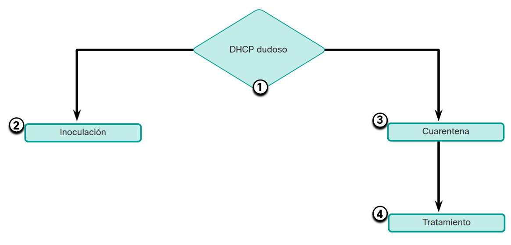

* __Contención__. La fase de contención implica limitar la propagación de una infección de gusanos a las áreas de la red que ya están afectadas. Esto requiere la compartimentación y la segmentación de la red para ralentizar o detener el gusano y para evitar que los hosts actualmente infectados ataquen e infecten otros sistemas. La contención requiere el uso de ACL (_Access Control List_) salientes y entrantes en routers y firewalls en puntos de control dentro de la red.
* __Inoculación__. La fase de inoculación es paralela o posterior a la fase de contención. Durante la fase de inoculación, todos los sistemas no infectados reciben los parches del proveedor correspondiente. El proceso de inoculación priva aún más al gusano de cualquier objetivo disponible.
* __Cuarentena__. La fase de cuarentena implica localizar e identificar las máquinas infectadas dentro de las áreas contenidas y desconectarlas, bloquearlas o eliminarlas. Esto aísla estos sistemas adecuadamente para la fase de tratamiento.
* __Tratamiento__. La fase de tratamiento implica la desinfección activa de los sistemas infectados. Esto puede implicar la finalización del proceso del gusano, la eliminación de archivos modificados o la configuración del sistema introducida por el gusano y la corrección de la vulnerabilidad que el gusano utilizó para aprovechar el sistema. Alternativamente, en casos más graves, es posible que sea necesario reinstalar el sistema para garantizar la eliminación del gusano y sus subproductos.

## Mitigando los ataques de reconocimiento
Los ataques de reconocimiento suelen ser el precursor de otros ataques que tienen la intención de obtener acceso no autorizado a una red o interrumpir la funcionalidad de la red. Un profesional de seguridad de la red puede detectar cuándo se está produciendo un ataque de reconocimiento al recibir notificaciones de alarmas preconfiguradas. Estas alarmas se activan cuando se superan ciertos parámetros, como la cantidad de solicitudes ICMP por segundo. Se puede utilizar una variedad de tecnologías y dispositivos para monitorear este tipo de actividad y generar una alarma. El dispositivo de seguridad adaptable (ASA([7](#enlaces-de-interés)) - _Adaptive Security Appliance_) de Cisco proporciona prevención de intrusiones en un dispositivo independiente. Además, los routers empresariales, como los routers de servicios integrados (ISR([8](#enlaces-de-interés))) de Cisco, admiten la prevención de intrusiones basada en la red con software adicional.

Los ataques de reconocimiento se pueden mitigar de varias maneras, incluidas las siguientes:
* Implementación de autenticación para garantizar el acceso adecuado.
* Uso del cifrado para inutilizar los ataques de sniffer de paquetes.
* Uso de herramientas anti-sniffer para detectar ataques de sniffer de paquetes.
* Implementación y administración de la infraestructura
* Firewall e IPS

Las herramientas de hardware y software anti-sniffer detectan cambios en el tiempo de respuesta de los hosts para determinar si los hosts están procesando más tráfico del que indicarían sus propias cargas de tráfico. Si bien esto no elimina por completo la amenaza, como parte de un sistema de mitigación general, puede reducir la cantidad de instancias de amenaza.

El cifrado también es eficaz para mitigar los ataques del sniffer de paquetes. Si el tráfico está encriptado, usar un sniffer de paquetes es de poca utilidad porque los datos capturados no son legibles.

Es imposible mitigar el escaneo de puertos, pero el uso de un sistema de prevención de intrusiones (IPS) y un firewall pueden limitar la información que se puede detectar con un escáner de puertos. Los barridos de ping se pueden detener si el eco ICMP y la respuesta de eco están desactivados en los routers de perímetro; sin embargo, cuando se desactivan estos servicios, se pierden los datos de diagnóstico de la red. Además, los análisis de puertos se pueden ejecutar sin barridos de ping completos. Los análisis simplemente llevan más tiempo porque las direcciones IP inactivas también se analizan.

	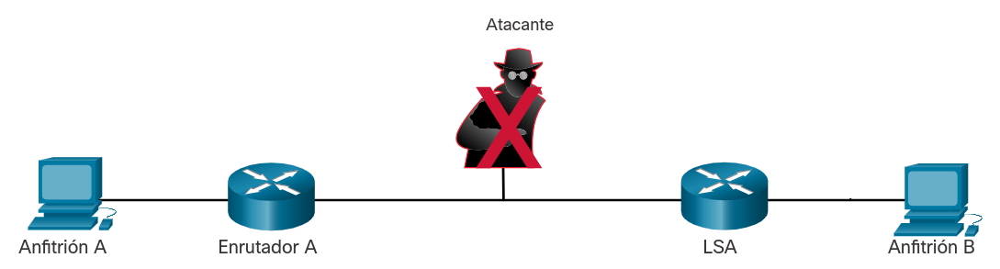

## Mitigando los ataques de acceso
Existen varias técnicas disponibles para mitigar los ataques de acceso. Estos incluyen seguridad de contraseña sólida, principio de confianza mínima, criptografía y aplicación de parches de aplicaciones y sistema operativo.

Una cantidad sorprendente de ataques de acceso se llevan a cabo mediante simples adivinanzas de contraseña o ataques de diccionario por fuerza bruta contra contraseñas. Para defenderse de esto, cree y aplique una política de autenticación sólida que incluya:

* __Utilice contraseñas seguras__. Las contraseñas seguras tienen al menos ocho caracteres y contienen letras mayúsculas, minúsculas, números y caracteres especiales.
* __Deshabilitar cuentas después de que se haya producido un número específico de inicios de sesión fallidos__. Esta práctica ayuda a evitar intentos continuos de contraseña.
La red también debe diseñarse utilizando el principio de confianza mínima. Esto significa que los sistemas no deben usarse unos a otros innecesariamente. Por ejemplo, si una organización tiene un servidor de confianza que utilizan dispositivos que no son de confianza, como servidores web, el servidor de confianza no debe confiar en los dispositivos no confiables sin condiciones.

La criptografía es un componente crítico de cualquier red segura moderna. Se recomienda el uso de cifrado para el acceso remoto a una red. El tráfico del protocolo de routing también debe cifrarse. Cuanto más cifrado esté el tráfico, menos oportunidades tendrán los hackers para interceptar datos con ataques de intermediarios.

El uso de protocolos de autenticación cifrados o hash, junto con una política de contraseñas seguras, reduce en gran medida la probabilidad de ataques de acceso exitosos.

Finalmente, las empresas deben capacitar y educar a sus usuarios sobre los riesgos de la ingeniería social, y desarrollar estrategias para validar las identidades por teléfono, por correo electrónico o en persona. La autenticación multifactor (MFA) se ha vuelto cada vez más común. En este enfoque, la autenticación requiere dos o más medios de verificación independientes. Por ejemplo, una contraseña puede combinarse con un código que se envía a través de un mensaje de texto. Se puede usar software o dispositivos separados para generar tokens que son válidos para un solo uso. Estos valores de token, cuando se proporcionan con una contraseña, proporcionan una capa adicional de seguridad que evita el uso de contraseñas que los agentes de amenazas han adivinado o robado.

En general, los ataques de acceso pueden detectarse mediante la revisión de los registros, el uso del ancho de banda y las cargas de procesos. La política de seguridad de la red debe especificar que los registros se mantengan formalmente para todos los dispositivos y servidores de red. Al revisar los registros, el personal de seguridad de la red puede determinar si se ha producido un número inusual de intentos fallidos de inicio de sesión.

## Mitigando los ataques DoS
Uno de los primeros signos de un ataque DoS es una gran cantidad de quejas de los usuarios sobre los recursos no disponibles o el rendimiento inusualmente lento de la red. Para minimizar la cantidad de ataques, se debe ejecutar un paquete de software de uso de la red en todo momento. El análisis del comportamiento de la red puede detectar patrones inusuales de uso que indican que se está produciendo un ataque DoS. La política de seguridad de la red de la organización debe requerir un medio para detectar el comportamiento inusual de la red. Un gráfico de uso de la red que muestra una actividad inusual también podría indicar un ataque de DoS.

Los ataques DoS podrían ser un componente de una ofensiva más grande. Los ataques DoS pueden generar problemas en los segmentos de red de las computadoras atacadas. Por ejemplo, un ataque puede superar la capacidad de paquetes por segundo de un router entre Internet y una LAN, lo que compromete no solo el sistema de destino sino también los dispositivos de red por los que debe pasar el tráfico. Si el ataque se lleva a cabo a una escala suficientemente grande, regiones geográficas enteras de conectividad a Internet podrían verse comprometidas.

Históricamente, muchos ataques de DoS se originaban en direcciones falsificadas. Los routers y switches de Cisco admiten una serie de tecnologías antifalsificación, como seguridad de puertos, detección del protocolo de configuración dinámica de host (DHCP), protección de origen IP, inspección del protocolo de resolución de direcciones dinámicas (DAI([9](#enlaces-de-interés))) y listas de control de acceso (ACL).

## Lab - Recomendar medidas de mitigación de amenazas
En esta práctica de laboratorio se cumplirán los siguientes objetivos:
* Parte 1: Revisar un incidente en una productora de video
* Parte 2: Revisar un incidente en una empresa minorista
* <a href="./notes/lab_medidas_mitigacion.md" target="_blank">Recomendar medidas de mitigación de amenazas</a>

# Resumen
## Servicios IP
Los hosts transmiten una solicitud de ARP hacia otros hosts del segmento, para determinar la dirección MAC de un host con una dirección IP específica. Cualquier cliente puede enviar una respuesta de ARP no solicitada llamada "ARP gratuito." Está característica de ARP también significa que cualquier host puede decir ser el dueño de cualquier dirección IP/MAC que escoja. Un atacante puede envenenar la caché ARP de los dispositivos en la red local y crear un ataque MiTM para redireccionar el tráfico.

El protocolo DNS define un servicio automatizado que empareja los nombres de recursos, como www.cisco.com, con su respectiva dirección IP. Incluye el formato de mensaje de consultas, respuestas y datos. Utiliza Registros de recursos (RR) para identificar el tipo de respuesta DNS. DNS es fundamental para la operación y funcionamiento de una red y debe ser protegido correctamente. Muchas empresas utilizan los servicios públicos de servidores de resolución DNS abierta (open resolvers) para responder las consultas. Los servidores de DNS abiertos son vulnerables a varias actividades maliciosas, incluido el envenenamiento de caché DNS, en el que se proporcionan registros falsificados al servidor abierto. En los ataques de amplificación y reflexión DNS, se aprovecha la naturaleza benigna del protocolo DNS, para causar ataques DoS o DDoS. En los ataques de utilización de recursos DNS, se inicia un ataque DoS contra el propio servidor DNS. Los atacantes suelen ocultarse utilizando técnicas sigilosas, como Fast Flux, una técnica en la cual los servidores maliciosos cambian rápidamente su dirección IP. Los atacantes también utilizan Double IP Flux para cambiar rápidamente su nombre de dominio para las asignaciones de dirección IP y también cambiar el servidor de nombres autorizados. Los atacantes también podrían utilizar "Domain shadowing" para ocultar el origen de sus ataques mediante la recolección de credenciales de cuenta de dominio, para crear múltiples subdominios para utilizarlos durante los ataques. A veces, el DNS en la empresa no se tiene en cuenta como un protocolo que las botnets pueden utilizar. Los agentes de amenaza que utilizan la tunelización de DNS colocan tráfico que no es DNS en tráfico DNS. Con frecuencia, este método evita las soluciones de seguridad. Para poder detener la tunelización DNS, debe utilizarse un filtro que inspeccione el tráfico de DNS. Los servidores DNS dinámicos son populares entre los atacantes y el tráfico que utiliza DNS Dinámico debería ser una preocupación especial para el analista de ciberseguridad.

DHCP utiliza un intercambio simple de mensajes de broadcast y unicast para proporcionar a los hosts información de direccionamiento. Un ataque de suplantación DHCP se produce cuando un servidor DHCP malicioso se conecta a la red, y proporciona parámetros falsos de configuración IP a los clientes legítimos. El servidor malicioso puede proporcionar información incorrecta sobre la puerta de enlace por defecto, el servidor DNS o direcciones IP.

## Servicios Empresariales
Los navegadores web son utilizados por casi todos a nivel mundial. Bloquear por completo la navegación web no es una opción, ya que las empresas necesitan tener acceso a la web. Los analistas de ciberseguridad deben tener una buena comprensión sobre cómo funciona un ataque estándar basado en web. Las fases comunes de un ataque típico web incluyen que la victima (sin saberlo) acceda a una página web que ha sido comprometida con malware. La página web comprometida redirige al usuario a un sitio que aloja código malicioso. El navegador visita este sitio y el código malicioso infecta su computadora. Esto se conoce como "drive-by download". Independientemente del tipo de ataque que se utilice, el objetivo principal del atacante es asegurarse que el navegador web de la víctima llegue a su página web, la cual introduce el código malicioso en la computadora de la víctima. Algunos sitios maliciosos aprovechan complementos vulnerables o vulnerabilidades del navegador para poner en riesgo el sistema del cliente. Las redes más grandes dependen de IDS para analizar los archivos descargados en busca de malware. Si detectan que los archivos podrían contener malware, los IDS emiten alertas y registran el evento en archivos de registro para su posterior análisis. Los registros de conexión del servidor suelen revelar información sobre el tipo de escaneo o de ataque. Los diferentes grupos de códigos de estado de conexión incluyen Informativo 1xx, Correcto 2xx, Redirección 3xx, Error de cliente 4xx, y Error de servidor 5xx.Para defenderse contra ataques basados en web, las contramedidas que deben utilizarse incluyen actualizar siempre el Sistema Operativo y los navegadores con los últimos parches y actualizaciones, usar un proxy web para bloquear sitios maliciosos, usar las buenas prácticas de seguridad del Proyecto Abierto de Seguridad de Aplicaciones Web (Open Web Application Security Project, OWASP) al desarrollar aplicaciones web, y capacitar a los usuarios finales enseñándoles cómo evitar ataques basados en la web.

Hay una serie de ataques que utilizan el correo electrónico para llevar payloads de malware o para obtener información personal. Los servidores SMTP también pueden tener vulnerabilidades y deben mantenerse actualizados con los parches. Los dispositivos de seguridad de correo electrónico pueden detectar y bloquear muchos tipos de amenazas de correo electrónico conocidas, como Phishing, Spam y malware.

Las aplicaciones web suelen conectarse a bases de datos. Debido a que estas bases de datos pueden contener información confidencial, son un objetivo frecuente de los ataques. Los ataques de inyección de código e inyección de SQL aprovechan campos de entrada que no tienen suficiente validación, y así enviar comandos a bases de datos u otras aplicaciones con el fin de obtener acceso a información privada. Los ataques de Cross-Site Scripting (XSS) se producen cuando los navegadores web ejecutan scripts maliciosos en el cliente y proporcionan a los atacantes acceso a información confidencial en el host local.

El "Top 10 Web Application Security Risks" (Top 10 principales riesgos de seguridad para las aplicaciones Web de OWASP) está diseñado para ayudar a las organizaciones a crear aplicaciones web seguras. Es una lista útil de vulnerabilidades potenciales que son comúnmente aprovechadas por los atacantes.

## Mitigando ataques de red comunes
Las siguientes mejores prácticas se utilizan para proteger una red: desarrollar una política de seguridad por escrito, educar a los empleados, controlar el acceso físico a los sistemas, usar contraseñas seguras, cifrar y proteger con contraseña los datos confidenciales, implementar hardware y software de seguridad, realizar copias de seguridad y probar de archivos, cerrar servicios y puertos innecesarios, mantener los parches actualizados y realizar auditorías y pruebas de seguridad.

El principal medio para mitigar los ataques de virus y troyanos es el software antivirus. Un profesional de seguridad de red debe conocer los principales virus y realizar un seguimiento de las actualizaciones de seguridad con respecto a los virus emergentes.

Los gusanos se basan más en la red que los virus. La respuesta a un ataque de gusanos se puede dividir en cuatro fases: contención, inoculación, cuarentena y tratamiento.

Los ataques de reconocimiento se pueden mitigar de varias maneras: implemente la autenticación para garantizar el acceso adecuado, utilice el cifrado para que los ataques sniffer de paquetes sean inútiles, use herramientas anti-sniffer para detectar ataques de sniffer de paquetes, implemente una infraestructura de switch y use un firewall e IPS. El cifrado también es eficaz para mitigar los ataques del sniffer de paquetes. Existen varias técnicas disponibles para mitigar los ataques de acceso: seguridad de contraseña segura, principio de confianza mínima, criptografía y aplicación de parches en el sistema operativo y las aplicaciones.

Para minimizar la cantidad de ataques DoS, se debe ejecutar un paquete de software de uso de la red en todo momento. Los ataques DoS podrían ser un componente de una ofensiva más grande. Los ataques DoS pueden generar problemas en los segmentos de red de las computadoras atacadas. Históricamente, muchos ataques de DoS se originaban en direcciones falsificadas.

## Enlaces de interés
1. <a href="./notes/arp_poisoning-spoofing.md" target="_blank">ARP Poisoning</a>
2. <a href="https://www.cloudflare.com/es-es/learning/dns/dns-cache-poisoning/" target="_blank">¿Qué es el envenenamiento de caché DNS?</a>
3. <a href="./notes/ficheros_pcap.md" target="_blank">Ficheros PCAP</a>
4. <a href="https://www.wireshark.org/docs/" target="_blank">Wireshark Documentation</a>
5. <a href="https://crackstation.net/" target="_blank">Password Hash Cracker</a>
6. <a href="https://www.man7.org/linux/man-pages/man1/journalctl.1.html" target="_blank">Registos de sistema 'systemd journal' ( <i>journalctl</i> )</a>
7. <a href="https://www.cxtec.com/blog/what-is-cisco-asa-security-appliance/" target="_blank">What is Cisco ASA</a>
8. <a href="./notes/cisco_isr_routers.md" target="_blank">Cisco ISR</a>
9. <a href="./notes/dai_protocol.md" target="_blank">DAI Protocol</a>
 
 
 
 
 
 
<a href="#4-atacando-lo-que-hacemos">⬆️</a>
<a href="./00-Curso.md"><< Menú principal del módulo</a>