<a href="./00-Curso.md"><< Menú principal del módulo</a>

# 5. Comunicación de red inalámbrica
# Comunicaciones Inalámbricas
## LAN Inalámbricas frente a redes cableadas
Las WLAN usan radiofrecuencias (RF) en lugar de cables en la capa física y la subcapa MAC([1](#enlaces-de-interés)) de la capa de enlace de datos. Las WLAN comparten un origen similar con las LAN Ethernet. El IEEE adoptó la cartera 802&nbsp;LAN/MAN de estándares de arquitectura de redes informáticas. Los dos grupos de trabajo 802 dominantes son Ethernet 802.3 (que define Ethernet para redes LAN cableadas) y 802.11 (que define Ethernet para redes WLAN). Hay diferencias importantes entre los dos.

Las WLAN también difieren de las LAN conectadas por cable de la siguiente manera: 

* Las WLAN conectan clientes a la red mediante puntos de acceso (AP) inalámbrico o un router inalámbrico, en lugar de hacerlo mediante un switch Ethernet.
* Las WLAN conectan los dispositivos móviles que, en general, están alimentados por batería, en lugar de los dispositivos enchufados de la LAN. Las NIC inalámbricas tienden a reducir la duración de la batería de los dispositivos móviles.
* Las WLAN admiten hosts que se disputan el acceso a los medios de RF (bandas de frecuencia). Para evitar proactivamente las colisiones dentro de los medios, el estándar 802.11 recomienda la prevención de colisiones (CSMA/CA - _Carrier Sense Multiple Access/Collision Avoidance_) en lugar de la detección de colisiones (CSMA/CD - _Carrier Sense Multiple Access/Collision Detection_) para el acceso a los medios.
* Las WLAN utilizan un formato de trama diferente al de las LAN Ethernet conectadas por cable. Las WLAN requieren información adicional en el encabezado de la Capa 2 de la trama.
* Las WLAN tienen mayores inconvenientes de privacidad debido a que las frecuencias de radio pueden salir fuera de las instalaciones.

La tabla resume las diferencias entre LAN inalámbricas y cableadas.

__Característica__|__LAN Inalámbrica 802.11__|802.3 LANs Ethernet inalámbricas
-|-|-
__Capa físisca__|Frecuencia de radio (RF)|Cables físicos
__Acceso a medios__|Prevención de colisiones|Detección de colisiones
__Disponibilidad__|Cualquiera con una NIC inalámbrica en el rango de un punto de acceso|Se requiere conexión por cable físico
__Interferencia en la señal__|Sí|Mínimo
__Regulación__|Diferentes regulaciones por país|El estándar IEEE dictamina

## Estructura de trama 802.11
Recuerde que todas los frames de capa 2 consisten en un encabezado, carga útil y sección de secuencia de verificación de trama (FCS). El formato del Frame 802.11 es similar al formato de Frame de Ethernet, excepto que contiene más campos, como se muestra en la figura.

	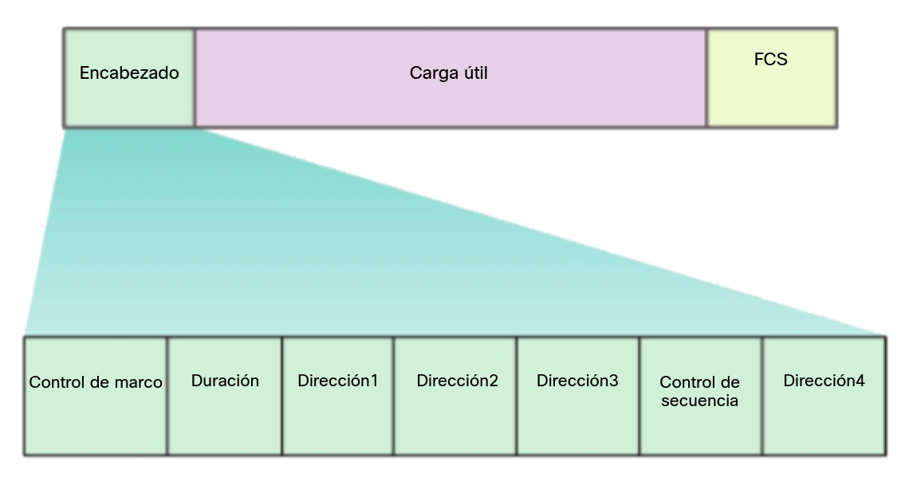

Todas las tramas 802.11 inalámbricas contienen los siguientes campos:
* __Control de trama__. Identifica el tipo de trama inalámbrica y contiene subcampos para la versión del protocolo, el tipo de trama, el tipo de dirección, la administración de energía y la configuración de seguridad.
* __Duración__. En general, se usa para indicar el tiempo restante necesario para recibir la siguiente transmisión de tramas.
* __Dirección 1__. Normalmente, contiene la dirección MAC del dispositivo o AP receptor inalámbrico.
* __Dirección 2__. Normalmente, contiene la dirección MAC del dispositivo o AP receptor inalámbrico.
* __Dirección 3__. En ocasiones, contiene la dirección MAC del destino, como la interfaz del router (puerta de enlace predeterminada) a la que se conecta el AP.
* __Control de Secuencia__. Contiene información para controlar la secuencia y las tramas fragmentadas
* __Dirección 4__. Suele estar vacío, ya que se usa solo en el modo ad hoc.
* __Payload__. Contiene los datos para la transmisión.
* __FCS__. Esto se utiliza para el control de errores de la capa 2.

## CSMA/CA
Las WLAN son configuraciones de medios compartidos semidúplex. Semidúplex o _half-duplex_ significa que solo un cliente puede transmitir o recibir en un momento dado. Medios compartidos significa que todos los clientes pueden transmitir y recibir en el mismo canal de radio. Esto crea un problema porque un cliente inalambrico no puede escuchar mientras está enviando, lo que hace que sea imposible detectar una colisión.

Para resolver este problema las WLAN utilizan el acceso múltiple con detección de operador con evitación de colisiones (CSMA / CA) para determinar cómo y cuándo enviar datos. Un cliente inalámbrico hace lo siguiente:

1. Escucha el canal para ver si está inactivo, es decir, no hay otro tráfico actualmente en el canal. El canal es tambien llamado el portador.
2. Envía un mensaje listo para enviar (RTS - _Ready To Send_) al punto de acceso para solicitar acceso dedicado a la red.
3. Recibe un mensaje de permiso para enviar (CTS - _Clear To Send_) desde el punto de acceso garantizando el acceso para enviar.
4. Si el cliente inalámbrico no recibe el mensaje CTS este espera una cantidad de tiempo aleatoria antes de reiniciar el proceso.
5. Después de recibir el CTS, transmite la información.
6. Todas las transmisiones son reconocidas con la señal ACK. Si un cliente no recibe el reconocimiento, asume que ocurrió una colisión y reinicia el proceso.

## Cliente Inalámbrica y Asociación al AP
Para que los dispositivos inalámbricos se comuniquen a través de una red, primero se deben asociar a un AP o un router inalámbrico. Una parte importante del proceso 802.11 es descubrir una WLAN y conectarse a esta. Los dispositivos inalámbricos completan el siguiente proceso de tres etapas:
* Descubre un AP inalámbrico.
* Se autentica con el AP.
* Se asocia con el AP.

	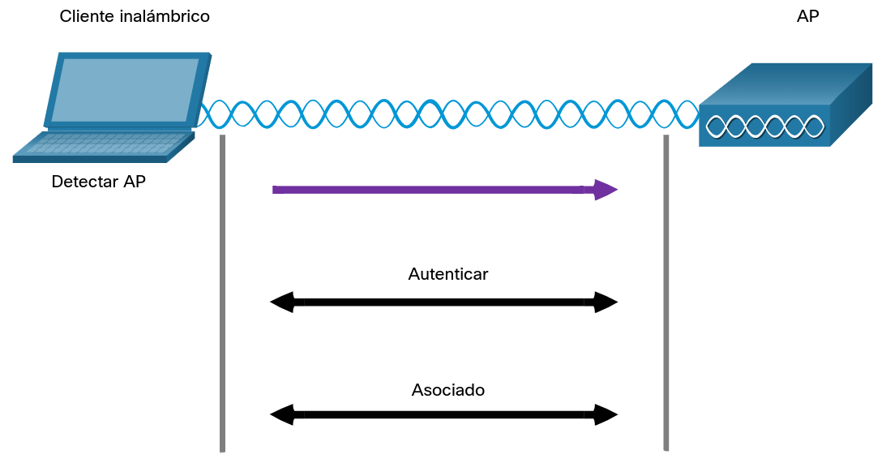

Para lograr una asociación exitosa, un cliente inalámbrico y un AP deben acordar parámetros específicos: Para permitir la negociación de estos procesos, se deben configurar los parámetros en el AP y posteriormente en el cliente.
* __SSID__ - El nombre del SSID aparece en la lista de redes inalámbricas disponibles en un cliente. En organizaciones más grandes que usan múltiples VLAN para segmentar el tráfico, cada SSID se asigna a una VLAN Según la configuración de la red, varios AP en una red pueden compartir un SSID.
* __Contraseña__ - El cliente inalámbrico la necesita para autenticarse con el AP.
* __Modo de red__ - Se refiere a los estándares WLAN 802.11 a/b/g/n/ac/ad. Los AP y routers inalámbricos pueden funcionar en modo combinado, lo que significa que pueden utilizar varios estándares al mismo tiempo.
* __Modo de seguridad__ - Se refiere a la configuración de los parámetros de seguridad, como WEP, WPA o WPA2. Habilite siempre el nivel más alto de seguridad que se admita.
* __Configuración de canales__ - Se refiere a las bandas de frecuencia que se usan para transmitir datos inalámbricos. Los routers inalámbricos y los AP pueden escanear los canales de radiofrecuencia y seleccionar automáticamente una configuración de canal adecuada. Los routers y los AP inalámbricos pueden elegir la configuración de canales, o esta se puede definir manualmente si existe interferencia con otro AP o dispositivo inalámbrico.

## Modo de descubrimiento Pasivo y Activo
Los dispositivos inalámbricos deben detectar un AP o un router inalámbrico y se deben conectar a este. Los clientes inalámbricos se conectan al AP mediante un proceso de análisis (sondeo). Este proceso puede ser pasivo o activo.

### Modo pasivo
En modo pasivo el AP anuncia abiertamente su servicio enviando periódicamente tramas de señal de difusión que contienen el SSID, los estándares admitidos y la configuración de seguridad. El propósito principal de la señal es permitir que los clientes inalámbricos descubran qué redes y qué AP existen en un área determinada, de modo que puedan elegir qué red y qué AP usar. Esto permite a los clientes inalámbricos elegir qué red y AP utilizar.

	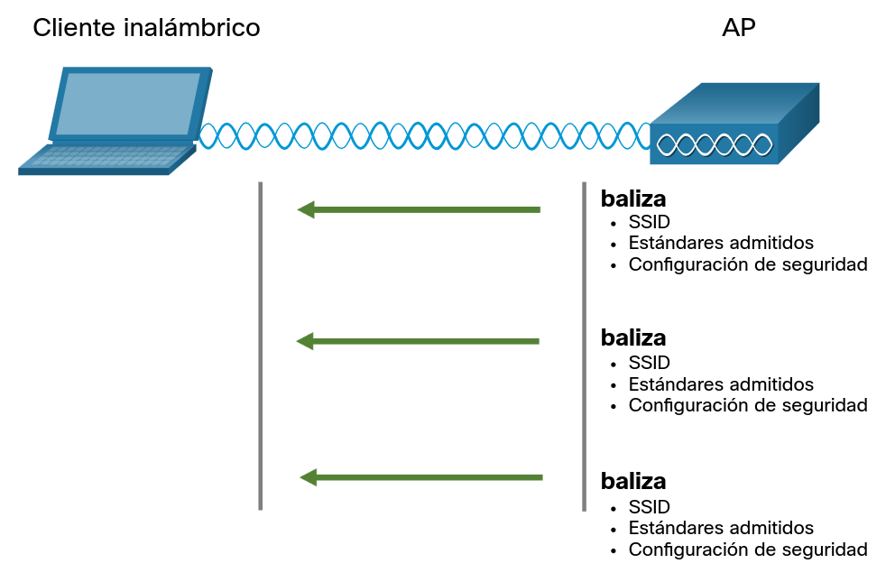

### Modo activo
En modo activo: los clientes inalámbricos deben conocer el nombre del SSID. El cliente inalámbrico inicia el proceso al transmitir por difusión una trama de solicitud de sondeo en varios canales. La solicitud de sondeo incluye el nombre del SSID y los estándares admitidos. Los AP configurados con el SSID enviarán una respuesta de prueba que incluye el SSID, los estándares admitidos y la configuración de seguridad. Si un AP o un router inalámbrico se configuran para que no transmitan por difusión las tramas de señal, es posible que se requiera el modo activo.

Para descubrir las redes WLAN cercanas, un cliente inalámbrico también podría enviar una solicitud de sondeo sin un nombre de SSID. Los AP configurados para transmitir por difusión tramas de señal responderían al cliente inalámbrico con una respuesta de sondeo y proporcionarían el nombre del SSID. Los AP con la característica de transmisión del SSID por difusión deshabilitada no responden.

	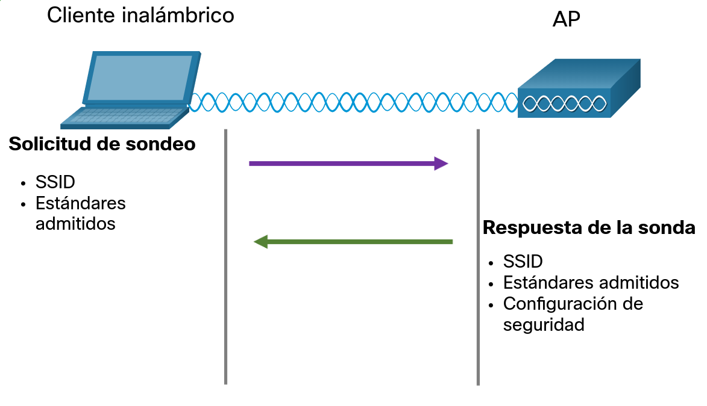

## Dispositivos Inalámbricos - AP, LWAP y WLC
Una implementación común de tecnología inalámbrica de datos permite a los dispositivos conectarse en forma inalámbrica a través de una LAN. En general, una LAN inalámbrica requiere puntos de acceso inalámbrico y clientes que tengan NIC inalámbricas. Los routers inalámbricos domésticos y de pequeñas empresas integran las funciones de un router, un switch y un punto de acceso en un solo dispositivo, como el que se ve en la figura. Tenga en cuenta que, en redes pequeñas, es posible que el router inalámbrico sea el único AP debido a que solamente se brinda cobertura inalámbrica a un área pequeña. En redes de más tamaño, puede haber muchos AP.

	

Todas las funciones de control y gestión de los AP en una red pueden centralizarse en una controladora de LAN inalámbrica (WLC - _Wireless LAN Controller_). Cuando se utiliza una WLC, los AP ya no actúan de manera autónoma, sino que actúan como AP ligeros (LWAP - _Lightweight Access Point_). Los LWAP solamente reenvían datos entre la LAN inalámbrica y la WLC. Todas las funciones de administración, como definir SSID y autenticar, se llevan a cabo en la WLC centralizada, en lugar de en cada AP individual. Una de las tantas ventajas de centralizar las funciones de administración de AP en la WLC es simplificar la configuración y el monitoreo de numerosos puntos de acceso.

# Amenazas a la WLAN
## Resumen de Seguridad Inalámbrica
Una WLAN está abierta a cualquier persona dentro del alcance de un AP y las credenciales apropiadas para asociarla. Con una NIC inalámbrica y conocimiento de técnicas de craqueo, un atacante puede no tener que ingresar físicamente al lugar de trabajo para obtener acceso a una WLAN.

Los ataques pueden ser generados por personas externas, empleados descontentos e incluso involuntariamente por los empleados. Las redes inalámbricas son específicamente susceptibles a varias amenazas, incluidas las siguientes:

* __Interceptación de datos__. Los datos inalámbricos deben estar encriptados para evitar que los espías los lean.
* __Intrusión inalámbrica__. Los usuarios no autorizados que intentan acceder a los recursos de la red pueden ser disuadidos mediante técnicas de autenticación efectivas.
* __Ataques de Denegación de Servicio__. El acceso a los servicios WLAN puede verse comprometido de forma accidental o maliciosa. Existen varias soluciones dependiendo de la fuente del ataque DoS.
* __Puntos de Acceso No Autorizados__. Los AP no autorizados instalados por un usuario bien intencionado o con fines maliciosos se pueden detectar utilizando un software de administración.

## Ataques DoS
Los ataques DoS inalámbricos pueden ser el resultado de:

* __Dispositivos configurados inapropiadamente__. Los errores de configuración pueden deshabilitar la WLAN. Por ejemplo, un administrador podría alterar accidentalmente una configuración y deshabilitar la red, o un intruso con privilegios de administrador podría deshabilitar intencionalmente una WLAN.
* __Un usuario malintencionado que interfiere intencionalmente con la comunicación inalámbrica__. Su objetivo es deshabilitar la red inalámbrica por completo o hasta el punto en que ningún dispositivo legítimo pueda acceder al medio.
* __Interferencia Accidental__. La redes WLANs son propensas a interferencia de otros dispositivos inalámbricos como hornos microondas, teléfonos inalámbricos, monitores de bebé y más como se muestra en la figura. La banda 2.4 GHz es más propensa a interferencia que la banda 5 GHz.

	

Para minimizar el riesgo de un ataque DoS debido a dispositivos mal configurados y ataques maliciosos, fortalezca todos los dispositivos, mantenga las contraseñas seguras, cree copias de seguridad y asegúrese de que todos los cambios de configuración se incorporen fuera de horario.

Monitoree la WLAN en busca de problemas de interferencia accidental y atiéndalos cuando aparezcan. Debido a que la banda 2.4 GHz es usada por otro tipo de dispositivos, la banda 5 GHz debe ser usada en áreas propensas a interferencias.

## Puntos de Acceso No Autorizados
Un AP falso es un punto de acceso o router inalámbrico que se ha conectado a una red corporativa sin autorización explícita y en contra de la política corporativa. Cualquier persona con acceso a las instalaciones puede instalar (de forma maliciosa o no maliciosa) un enrutador inalámbrico de bajo costo que potencialmente puede permitir el acceso a un recurso de red seguro.

Una vez conectado, el AP falso pueder ser usado por el atacante para capturar direcciones MAC, capturar paquetes de datos, obtener acceso a recursos de red o lanzar un ataque de intermediario.

Un punto de acceso a la red personal también podría usarse como un AP no autorizado Por ejemplo, un usuario con acceso seguro a la red permite que su host Windows autorizado se convierta en un AP Wi-Fi. Al hacerlo, elude las medidas de seguridad y otros dispositivos no autorizados ahora pueden acceder a los recursos de la red como un dispositivo compartido.

Para evitar la instalación de puntos de acceso no autorizados, las organizaciones deben configurar WLC con políticas de puntos de acceso no autorizados y utilizar software de monitoreo para monitorear activamente el espectro de radio en busca de puntos de acceso no autorizados.

	

## Ataque de Intermediario
En un ataque intermediario (MITM por su sigla en inglés), el pirata informático se coloca entre dos entidades legítimas para leer o modificar los datos que pasan entre las dos partes. Hay muchas maneras de crear un ataque MITM.

Un ataque de "AP gemelo malvado" es un ataque MITM inalámbrico popular en el que un atacante introduce un AP falso y lo configura con el mismo SSID que un AP legítimo Las ubicaciones que ofrecen Wi-Fi gratis, como aeropuertos, cafeterías y restaurantes, son lugares particularmente populares para este tipo de ataque debido a la autenticación abierta.

	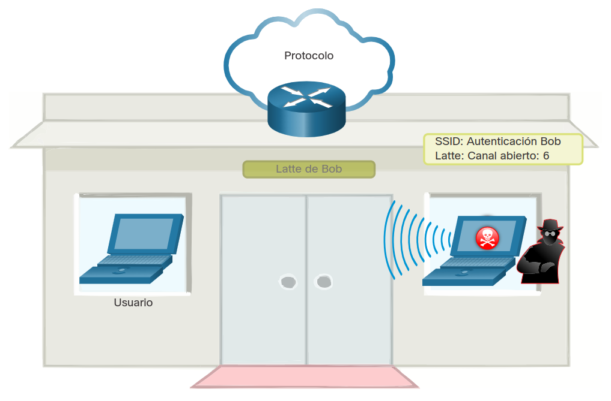

Clientes inalámbricos que se tratan de conectar a una red WLAN podrían ver dos APs con el mismo SSID ofreciendo acceso inalámbrico. Los que están cerca del AP falso encuentran la señal más fuerte y probablemente se asocian con ella. El tráfico de usuarios ahora se envía al AP falso, que a su vez captura los datos y los reenvía al AP legítimo, como se muestra en la figura. El tráfico de retorno del AP legítimo se envía al AP falso, se captura y luego se reenvía al usuario desprevenido. El atacante puede robar la contraseña del usuario, su información personal, obtener acceso a su dispositivo y comprometer el sistema

	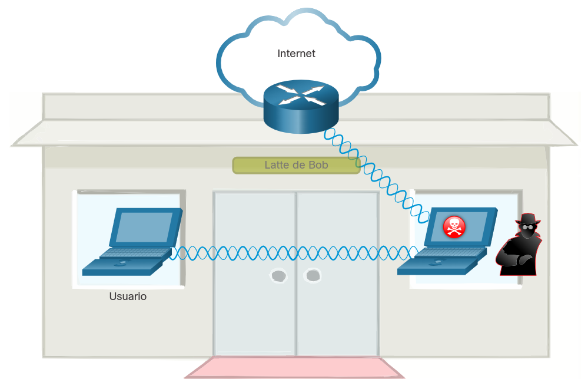

La derrota de un ataque como un ataque MITM depende de la sofisticación de la infraestructura WLAN y la vigilancia en el monitoreo de la actividad en la red. El proceso comienza con la identificación de dispositivos legítimos en la WLAN. Para hacer esto los usuarios deben estar autenticados. Una vez qye todos los dispositivos legitimos son conocidos, la red puede ser monitoreada de dispositivos o trafico anormal.

# WLAN Seguras
## Encubrimiento SSID y Filtreado de direcciones MAC
Las señales inalámbricas pueden viajar a través de materiales sólidos como techos,pisos,paredes, fuera de casa o del espacio de la oficina. Sin medidas de seguridad estrictas, la instalación de una WLAN puede ser equivalente a colocar puertos Ethernet en todas partes, incluso en el exterior.

Para abordar las amenazas de mantener alejados a los intrusos inalámbricos y proteger los datos, se utilizaron dos características de seguridad tempranas que aún están disponibles en la mayoría de los enrutadores y puntos de acceso: encubrimiento SSID y filtrado de direcciones MAC.

### Encubrimiento SSID
Los AP y algunos enrutadores inalámbricos permiten deshabilitar la trama de baliza SSID, como se muestra en la figura Los clientes inalámbricos deben configurarse manualmente con el SSID para conectarse a la red.

	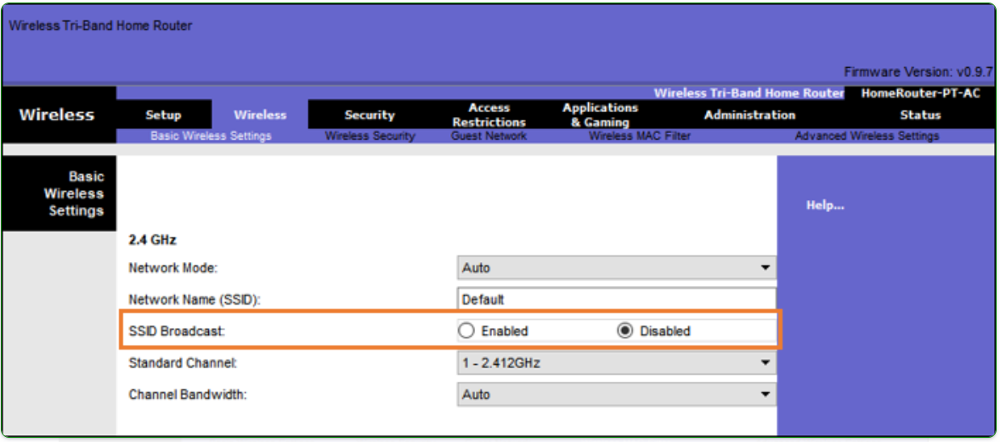

### Filtrado de direcciones MAC

Un administrador puede permitir o denegar manualmente el acceso inalámbrico de los clientes en función de su dirección física de hardware MAC. En la figura, el router está configurado para permitir dos direcciones MAC. Los dispositivos con diferentes direcciones MAC no podrán unirse a la WLAN de 2.4GHz.

	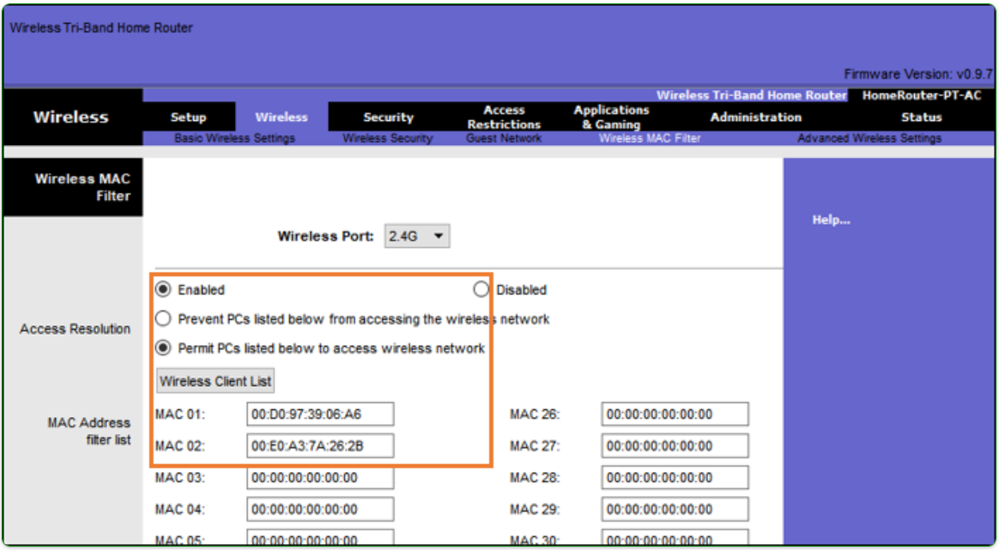

## Métodos de autenticación original 802.11
Aunque estas dos características disuadirían a la mayoría de los usuarios, la realidad es que ni el ocultamiento de SSID ni el filtrado de direcciones MAC disuadirían a un intruso astuto. Los SSID se descubren fácilmente incluso si los AP no los transmiten y las direcciones MAC pueden ser falsificadas. La mejor manera de proteger una red inalámbrica es utilizar sistemas de autenticación y cifrado.

Se introdujeron dos tipos de autenticación con el estándar 802.11 original:

* __Sistema de autenticación abierto__. Cualquier cliente inalámbrico debería poder conectarse fácilmente y solo debería usarse en situaciones en las que la seguridad no sea una preocupación, como las que proporcionan acceso gratuito a Internet, como cafeterías, hoteles y áreas remotas. El cliente inalámbrico es responsable de proporcionar seguridad, como el uso de una red privada virtual (VPN) para conectarse de forma segura. Los VPNs proveen servicios de autenticación y cifrado. VPNs están mas allá del alcance de este tema.
* __Autenticación de llave compartida__. Proporciona mecanismos, como WEP, WPA, WPA2 y WPA3 para autenticar y cifrar datos entre un cliente inalámbrico y AP. Sin embargo, la contraseña debe ser pre-compartida entre las dos partes para conectar.

El siguiente cuadro resumen estos metodos de autenticación.

	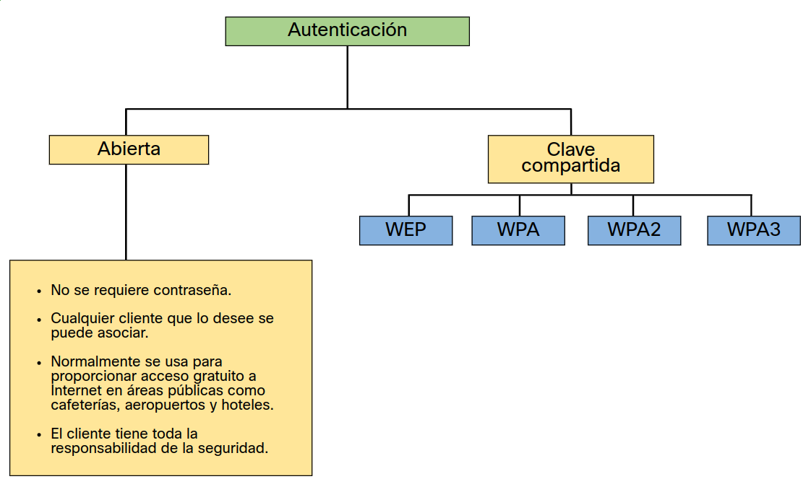

## Métodos de Autenticación de Clave Compartida
Actualmente hay cuatro técnicas de autenticación de clave compartida disponibles, como se muestra en la tabla. Hasta que la disponibilidad de dispositivos WPA3 se vuelva omnipresente, las redes inalámbricas deben usar el estándar WPA2.

__Método de Autenticación__|__Descripción__
:-|:-
Privacidad Equivalente al Cableado (WEB - _Wired Equivalent Privacy_)|La especificación original 802.11 diseñada para proteger los datos utilizando el método de cifrado Rivest Cipher 4 (RC4) con una clave estática.Sin embargo, la clave nunca cambia cuando se intercambian paquetes. Esto lo hace fácil de hackear. WEP ya no se recomienda y nunca debe usarse.
Acceso Protegido Wi-Fi (WPA - _Wi-Fi Protected Access_)|Un estándar de Wi-Fi Alliance que usa WEP, pero protege los datos con el algoritmo de encriptación del protocolo de integridad de clave temporal (TKIP - _Temporal Key Integrity Protocol_) mucho más fuerte. El TKIP cambia la clave para cada paquete, lo que hace que sea mucho más difícil de descifrar.
WPA2|WPA2 es un estándar de la industria para proteger las redes inalámbricas. Utiliza el Estándar de Cifrado Avanzado (AES - _Advanced Encryption Standard_) para el cifrado. AES actualmente se considera el protocolo de cifrado más sólido.
WPA3|La próxima generación de seguridad Wi-Fi. Todos los dispositivos habilitados para WPA3 utilizan los últimos métodos de seguridad, no permiten protocolos heredados obsoletos y requieren el uso de marcos de administración protegidos (PMF - _Protected Management Frames_). Sin embargo, los dispositivos con WPA3 aún no están disponibles.

## Autenticación de un usuario doméstico
Los routers domésticos suelen tener dos opciones de autenticación: WPA y WPA2. WPA2 es el más fuerte de los dos. La figura muestra la opción para seleccionar uno de los dos métodos de autenticación WPA2:
* __Personal (PSK)__. Destinados a redes domésticas o de pequeñas oficinas, los usuarios se autentican utilizando una clave pre-compartida (PSK - _Pre-Shared Key_). Los clientes inalámbricos se autentican con el enrutador inalámbrico utilizando una contraseña previamente compartida. No requiere un servidor de autenticación especial.
* __Empresa__. Destinado para redes empresariales pero requiere un servidor de autenticación de Servicio de usuario de acceso telefónico de autenticación remota (RADIUS - _Remote Authentication Dial-In User Service_). Aunque requiere una configuración más complicada, proporciona seguridad adicional. El servidor RADIUS debe autenticar el dispositivo y luego los usuarios deben autenticarse utilizando el estándar 802.1X, que utiliza el protocolo de autenticación extensible (EAP - _Extensible Authentication Protocol_) para la autenticación.

En la figura el administrador está configurando el router inalambrico con autenticación personal WPA2 en la banda 2.4 GHz.

	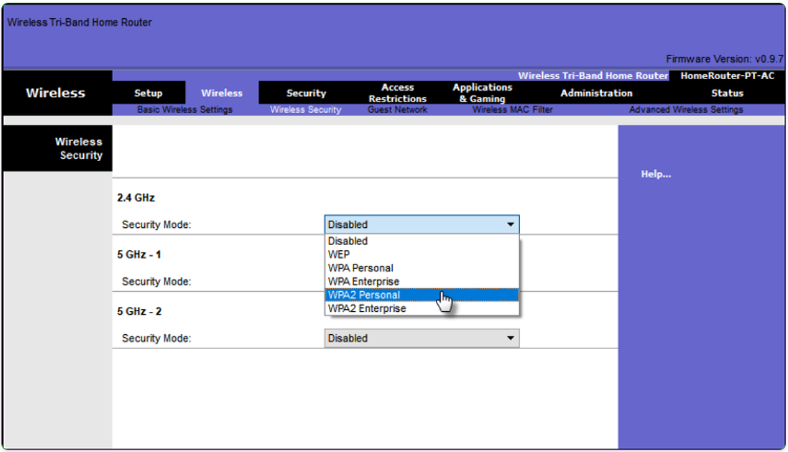

## Métodos de Encriptación
El cifrado suele utilizarse para proteger datos. Si un intruso ha capturado datos cifrados, no podrá descifrarlos en un período de tiempo razonable.

Los estándares WPA y WPA2 usan los siguientes métodos de cifrado:

* __Temporal Key Integrity Protocol (TKIP)__. TKIP es el método de encriptación utilizado por WPA. Proporciona soporte para equipos WLAN heredados al abordar las fallas originales asociadas con el método de encriptación WEP 802.11. Utiliza WEP, pero encripta la carga útil de la Capa 2 usando TKIP y realiza una verificación de integridad de mensajes (MIC - _Message Integrity Check_) en el paquete encriptado para garantizar que el mensaje no haya sido alterado.
* __Advanced Encryption Standard (AES)__. AES es el método de encriptación utilizado por WPA2. este es el método preferido de cifrado porque es un método mucho más fuerte. Utiliza el modo de contador de cifrado con el protocolo de código de autenticación de mensajes de bloqueo de cadena (CCMP - _Counter Mode with Cipher Block Chaining Message Authentication Code Protocol_) que permite a los hosts de destino reconocer si se han alterado los bits encriptados y no encriptados.

En la figura el administrador está configurando el router inalámbrico para usar WPA2 con cifrado AES en la banda 2.4 GHz.

	

## Autenticación en la Empresa
En redes que tienen requerimientos de seguridad estrictos, una autenticación adicional o inicio de sesión es requerida para garantizar al cliente acceso inalámbrico. La elección del modo de seguridad empresarial requiere un servidor RADIUS de autenticación, autorización y contabilidad (AAA).

* __RADIUS Server IP address__. Esta es la dirección accesible del servidor RADIUS.
* __UDP port numbers__. Los puertos UDP 1812 para la autenticación RADIUS y 1813 para la contabilidad RADIUS, pero también pueden funcionar utilizando los puertos UDP 1645 y 1646.
* __Shared key__. Se utiliza para autenticar el AP con el servidor RADIUS.

En la figura el administrador está configurando el router inalámbrico para usar autenticación WPA2 Enterprise con encripción AES. La dirección IPv4 del servidor RADIUS también se configura con una contraseña segura que se utilizará entre el router inalámbrico y el servidor RADIUS.

	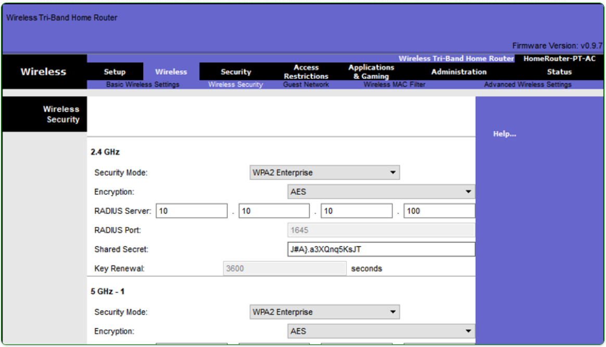

 

La llave compartida no es un parámetro que debe ser configurado en un cliente inalámbrico. Solo se requiere en el AP para autenticarse con el servidor RADIUS. 

__Nota__: La autenticación y autorización del usuario se maneja mediante el estándar 802.1X, que proporciona una autenticación centralizada basada en el servidor de los usuarios finales.

El proceso de inicio de sesión 802.1X utiliza EAP para comunicarse con el servidor AP y RADIUS. EAP es un marco para autenticar el acceso a la red. Puede proporcionar un mecanismo de autenticación seguro y negociar una clave privada segura que luego puede usarse para una sesión de encriptación inalámbrica usando encriptación TKIP o AES.

## WPA3
En el momento de este escrito los dispositivos que soportan autenticación WPA3 no están fácilmente disponibles. Sin embargo, WPA2 ya no se considera segura. WPA3, si está disponible, es el método de autenticación 802.11 recomendado. WPA3 incluye cuatro características;
* __WPA3 - Personal__. Los actores de amenazas pueden escuchar el _handshake_ entre un cliente inalámbrico y el AP y utilizar un ataque de fuerza bruta para intentar adivinar el PSK. WPA3-Personal frustra este ataque utilizando la Autenticación Simultánea de Iguales (SAE - _Simultaneous Authentication of Equals_), una característica especificada en el IEEE 802.11-2016. El PSK nunca es expuesto, haciendolo imposible de adivinar para el atacante.
* __WPA3 - Empresa__. Utiliza la autenticación 802.1X / EAP. Sin embargo, requiere el uso de una suite criptográfica de 192 bits y elimina la combinación de protocolos de seguridad para los estándares 802.11 anteriores. WPA3 - Empresa se adhiere a la Suite de Algoritmo de Seguridad Nacional Comercial (CNSA - _Commercial National Security Algorithm_) que se usa comúnmente en redes Wi-Fi de alta seguridad.
* __Redes abiertas__. Las redes abiertas en WPA2 envían tráfico de usuarios en texto claro no autenticado. En WPA3, las redes Wi-Fi abiertas o públicas aún no utilizan ninguna autenticación. Sin embargo, utiliza el cifrado inalámbrico oportunista (OWE - _Opportunistic Wireless Encryption_) para cifrar todo el tráfico inalámbrico.
* __Internet de las cosas (IoT)__. Aunque WPA2 incluyó la Configuración protegida de Wi-Fi (WPS - _Wi-Fi Protected Setup_) para incorporar rápidamente dispositivos sin configurarlos primero, WPS es vulnerable a una variedad de ataques y no se recomienda. Además, los dispositivos IoT generalmente no tienen cabeza, lo que significa que no tienen una interfaz gráfica de usuario incorporada para la configuración, y necesitan una forma fácil de conectarse a la red inalámbrica. El Protocolo de aprovisionamiento de dispositivos (DPP - _Device Provisioning Protocol_) se diseñó para abordar esta necesidad. Cada dispositivo sin cabeza tiene una clave pública codificada. La clave suele estar estampada en el exterior del dispositivo o en su embalaje como un código de Respuesta rápida (QR). El administrador de red puede escanear el código QR y rápidamente a conectar el dispositivo. Aunque no es estrictamente parte del estándar WPA3, DPP reemplazará a WPS con el tiempo.

## Packet Tracer: configurar la seguridad inalámbrica básica
En esta actividad, configurará la seguridad inalámbrica mediante WPA2 Personal.
* <a href="./notes/pt_configuracion_serguridad_inalambrica_basica.md" target="_blank">Configurar la seguridad inalámbrica básica</a>

## Packet Tracer: solución de problemas de una conexión inalámbrica
Esta actividad tutelada de Packet Tracer (PTTA: Packet Tracer Tutored Activity) tiene características que proporcionan pistas a lo largo de la actividad en el nivel que usted especifique. Puede practicar sus habilidades de solución de problemas con una guía mínima o con tanta orientación como necesite.

En esta actividad, solucionará una conexión inalámbrica.
* <a href="./notes/pt_solucion_problemas_conexion_inalambrica.md" target="_blank">Configurar la seguridad inalámbrica básica</a>

# Resumen
## Comunicaciones inalámbricas
Los dispositivos de red inalámbrica se conectan a un punto de acceso (AP) o a un controlador de LAN inalámbrica (WLC) que demandan el estándar 802.11. El formato de la trama 802.11 es similar al formato de trama de Ethernet, excepto que este contiene campos adicionales. Los dispositivos WLAN usan CSMA/CA como método para determinar cómo y cuándo enviar datos en la red Para conectarse a la WLAN, los dispositivos inalámbricos completan un proceso de tres etapas para descubrir un punto de acceso inalámbrico, autenticarse con el punto de acceso y asociarse con el punto de acceso (AP) Los AP se pueden configurar de forma autónoma (individualmente) o mediante un WLC para simplificar la configuración y supervisión de numerosos puntos de acceso.

## Amenazas de la WLAN
Wireless networks are susceptible to threats, including: data interception, wireless intruders, DoS attacks, and rogue APs. Los ataques DoS inalámbricos pueden ser el resultado de: dispositivos mal configurados, un usuario malintencionado que interfiere intencionalmente con la comunicación inalámbrica e interferencia accidental. Un AP falso es un AP o un router inalámbrico que se ha conectado a una red corporativa sin autorización explícita y en contra de la política corporativa. Una vez conectado, el atacante puede ser utilizado por un atacante para capturar direcciones MAC, capturar paquetes de datos, obtener acceso a recursos de red o lanzar un ataque de hombre en el medio. Ataque man-in-the-middle: el agente de amenaza se coloca entre dos entidades legítimas para leer, modificar o redirigir los datos que se transmiten entre las dos partes. Un ataque de "AP gemelo malvado" es un ataque MITM inalámbrico popular en el que un atacante introduce un AP falso y lo configura con el mismo SSID que un AP legítimo Para evitar la instalación de puntos de acceso no autorizados, las organizaciones deben configurar WLC con políticas de puntos de acceso no autorizados.

## WLAN seguras
Para mantener alejados a los intrusos inalámbricos y proteger los datos, dos características de seguridad tempranas todavía están disponibles en la mayoría de los enrutadores y puntos de acceso: ocultamiento de SSID y filtrado de direcciones MAC. Hay cuatro técnicas de autenticación de clave compartida disponibles: WEP, WPA, WPA2 y WPA3.(los dispositivos con WPA3 aún no están disponibles fácilmente). Los routers domésticos suelen tener dos opciones de autenticación: WPA y WPA2 WPA2 es el mas fuerte de los dos El cifrado suele utilizarse para proteger datos. Los estándares WPA y WPA2 usan los siguientes métodos de cifrado:TKIP y AES. En redes que tienen requerimientos de seguridad estrictos, una autenticación adicional o inicio de sesión es requerida para garantizar al cliente acceso inalámbrico. La elección del modo de seguridad empresarial requiere un servidor RADIUS de autenticación, autorización y contabilidad (AAA).

## Enlaces de interés
1. <a href="./notes/subcapa_mac_enlace_datos.md" target="_blank">Subcapa MAC de la capa de enlace de datos</a>
2. 
3. 
4. 
5. 
6. 
7. 
8. 
9. 
 
 
 
 
 
 
<a href="#5-comunicación-de-red-inalámbrica">⬆️</a>
<a href="./00-Curso.md"><< Menú principal del módulo</a>