<a href="./00-Curso.md"><< Menú principal del módulo</a>

# 6. Infraestructura de seguridad de redes
# Dispositivos de seguridad
## Cortafuegos (_Firewalls_)
Un firewall es un sistema o grupo de sistemas que impone una política de control de acceso entre redes.

	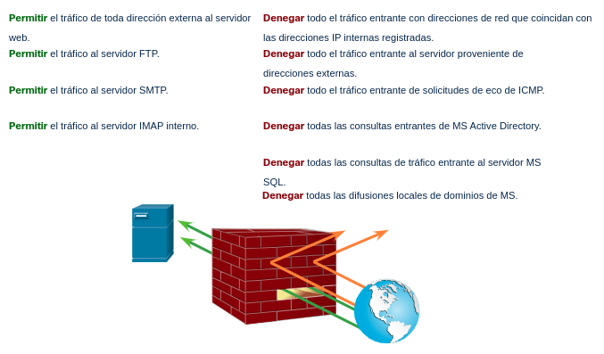

### Propiedades comunes
Todos los firewalls comparten algunas propiedades comunes:
* Los firewalls resisten ataques de red.
* Los firewalls son el único punto de tránsito entre las redes corporativas internas y las redes externas porque todo el tráfico circula por ellos.
* Los firewalls aplican la política de control de acceso.

### Ventajas
Los firewalls en una red brindan numerosos beneficios:
* Evitan la exposición de hosts, recursos y aplicaciones confidenciales a usuarios no confiables.
* Sanean el flujo de protocolos, lo que evita el aprovechamiento de las fallas de protocolos.
* Bloquean los datos maliciosos de servidores y clientes.
* Simplifican la administración de la seguridad, ya que la mayor parte del control del acceso a redes se deriva a unos pocos firewalls de la red.

### Limitaciones
Los firewalls también tienen algunas limitaciones:
* Un firewall mal configurado puede tener graves consecuencias para la red, por ejemplo, convertirse en un punto único de falla.
* Los datos de muchas aplicaciones no se pueden transmitir con seguridad mediante firewalls.
* Los usuarios pueden buscar maneras de esquivar el firewall para recibir material bloqueado, lo que expone a la red a posibles ataques.
* Puede reducirse la velocidad de la red.
* El tráfico no autorizado se puede tunelizar u ocultar como tráfico legítimo a través del firewall.

## Arquitecturas de seguridad comunes
Principalmente, el diseño de firewall tiene por objetivo permitir o denegar el tráfico según el origen, el destino y el tipo de tráfico. Algunos diseños son tan simples y solo consisten en diseñar una red externa y una interna, que son determinadas por dos interfaces en un firewall.

Aquí hay tres diseños comunes de firewall.

### Privado y público
Como se ve en la Figura, la red pública (o externa) no es de confianza y la red privada (o interna) es de confianza.

Normalmente, un firewall con dos interfaces se configura del siguiente modo:

El tráfico procedente de la red privada se autoriza e inspecciona mientras viaja hacia la red pública. También se autoriza el tráfico inspeccionado que regresa de la red pública y está relacionado con el tráfico que se originó en la red privada.
Generalmente, se bloquea el tráfico procedente de la red pública que viaja hacia la red privada.

	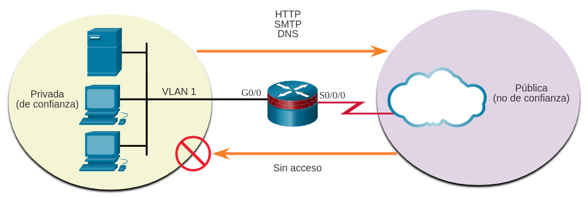

### Zona perimetral
Una zona perimetral (DMZ, _Demilitarized Zone_) es un diseño de firewall donde, normalmente, hay una interfaz interna conectada a la red privada, una interfaz externa conectada a la red pública y una interfaz de DMZ, como se ve en la Figura.
* El tráfico procedente de la red privada se inspecciona mientras viaja hacia la red pública o la DMZ. Este tráfico se permite casi sin restricciones. También se permite el tráfico inspeccionado que regresa a la red privada desde la DMZ o la red pública.
* Con frecuencia, se bloquea el tráfico procedente de la DMZ que viaja hacia la red privada.
* El tráfico procedente de la DMZ y que viaja hacia la red pública se permite, siempre y cuando cumpla con los requisitos de servicio.
* El tráfico procedente de la red pública que viaja hacia la DMZ se permite de manera selectiva y se inspecciona. Este tipo de tráfico suele ser de correo electrónico, DNS, HTTP o HTTPS. Se permite de manera dinámica el tráfico que regresa de la DMZ a la red pública.
* Se bloquea el tráfico procedente de la red pública que viaja hacia la red privada.

	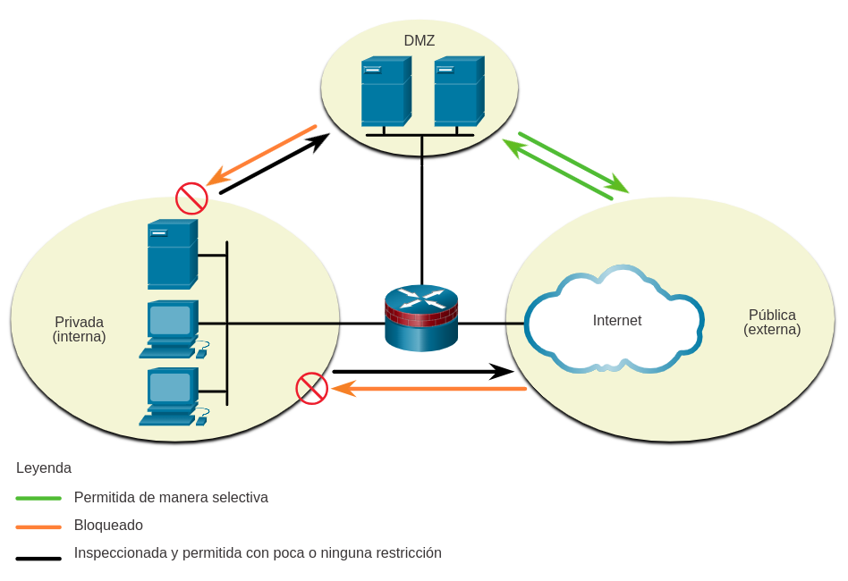

### Firewall de políticas basados en zonas
En los firewalls de políticas basadas en zonas (_Zone-based policy firewalls_, ZPF) se utiliza el concepto de zonas para ofrecer mayor flexibilidad. Una zona es un grupo de al menos una interfaz con funciones o características similares. Las zonas ayudan a especificar dónde se debe implementar una regla o política de firewall Cisco IOS. En la Figura, las políticas de seguridad para las redes LAN-1 y LAN-2 son similares y pueden agruparse en una zona para las configuraciones de firewall. De manera predeterminada, el tráfico entre interfaces en la misma zona no está sujeto a ninguna política y pasa libremente. Sin embargo, se bloquea todo el tráfico de zona a zona. Con el fin de permitir el tráfico entre zonas, debe configurarse una política que permita o inspeccione el tráfico.

La única excepción a esta política predeterminada de __denegar todo__ es la zona autónoma del router. La zona autónoma del router es el router en sí mismo e incluye todas las direcciones IP de interfaz de router. Las configuraciones de políticas que incluyen la zona autónoma se aplican al tráfico hacia el router y al procedente del mismo. De manera predeterminada, no hay ninguna política para este tipo de tráfico. El tráfico que debe tenerse en cuenta al diseñar una política para la zona autónoma incluye el tráfico del plano de control y del plano de administración, como SSH, SNMP y protocolos de enrutamiento.

	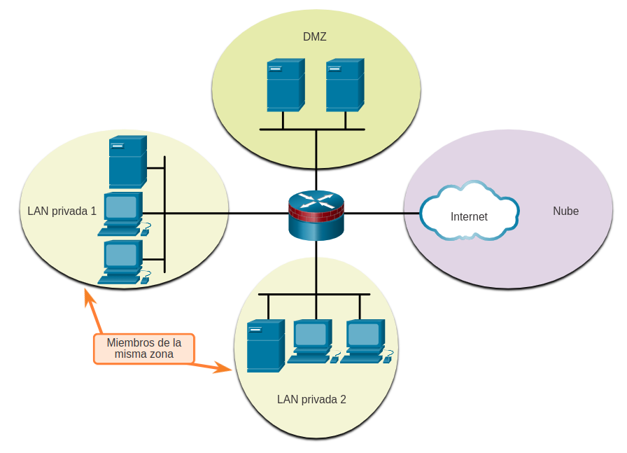

## Descripciones de tipos de firewall
Es importante entender los diferentes tipos de firewalls y sus capacidades específicas, de modo que se utilice el firewall adecuado para cada situación.

### Firewall para filtrado de paquetes (sin estado)
Los firewalls de filtrado de paquetes suelen formar parte de un firewall de router, que autoriza o rechaza el tráfico a partir de la información de las capas 3 y 4. Son firewalls sin estado que utilizan una simple búsqueda en la tabla de políticas que filtra el tráfico según criterios específicos.

Por ejemplo, los servidores SMTP escuchan el puerto 25 de manera predeterminada. Un administrador puede configurar el firewall de filtrado de paquetes para bloquear el puerto 25 desde una estación de trabajo específica a fin de evitar que difunda un virus por correo electrónico.

	

### Firewall activo
Los firewalls con estado son los más versátiles y las tecnologías de firewall más comúnmente usadas. Los firewalls activos proporcionan un filtrado de paquetes utilizando la información de conexión que se mantiene en una tabla de estados. El filtrado con estado es una arquitectura de firewall que se clasifica en la capa de red. También analiza el tráfico en las capas 4 y 5 de OSI.

	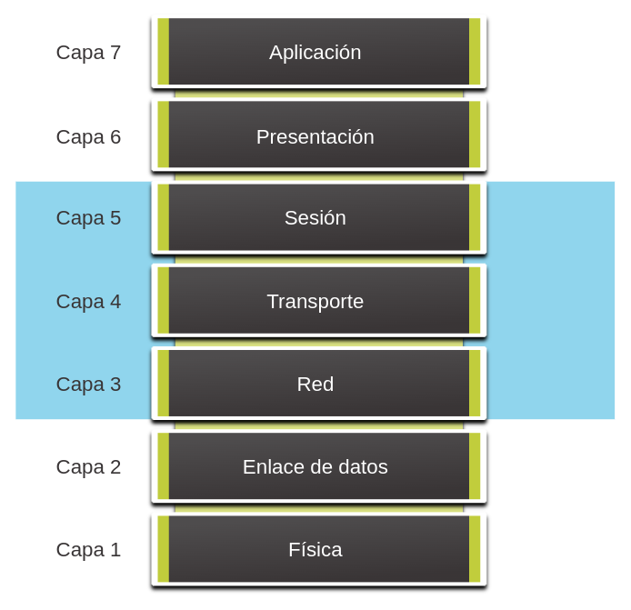

### Firewall del gateway de aplicaciones
Un firewall de gateway de aplicaciones (firewall proxy), como se muestra en la figura, filtra la información en las capas 3, 4, 5 y 7 del modelo de referencia OSI. La mayor parte del control y filtrado del firewall se realiza en el software. Cuando un cliente necesita tener acceso a un servidor remoto, se conecta a un servidor proxy. El servidor proxy se conecta al servidor remoto en nombre del cliente. Por lo tanto, el servidor solamente ve una conexión desde el servidor proxy.

	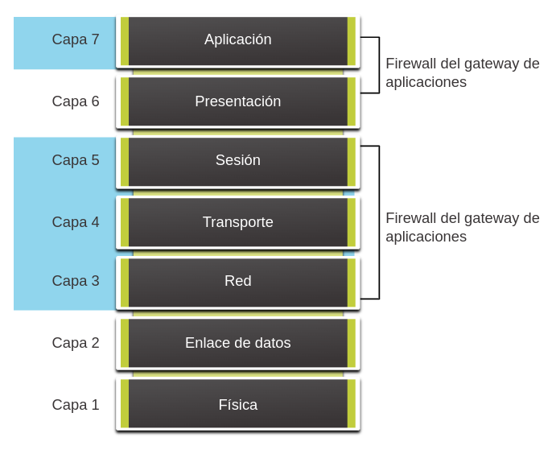

### Firewall de próxima generación
Los firewalls de próxima generación (NGFW - _Next Generation Firewall_) van más allá de los firewalls con estado y ofrecen lo siguiente:
* Prevención de intrusiones integrada.
* Control y reconocimiento de aplicaciones para ver y bloquear aplicaciones riesgosas.
* Rutas de actualización para incluir futuros datos de información.
* Técnicas para afrontar amenazas de seguridad en constante evolución.

	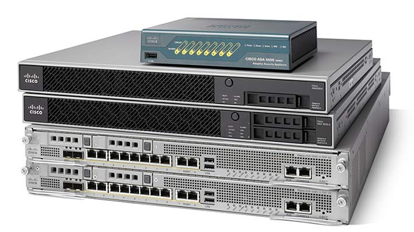

### Otros
Otros métodos de implementación de firewall incluyen los siguientes:
* __Firewall basado en host (servidor y personal)__. Una PC o servidor con software de firewall ejecutándose en él.
* __Firewall transparente__. Filtra el tráfico IP entre un par de interfaces puenteadas.
* __Firewall híbrido__. Una combinación de los distintos tipos de firewall. Por ejemplo, un firewall de inspección de aplicación combina un firewall con estado y un firewall de gateway de aplicación.

## Dispositivos de detección y prevención de intrusiones
Es necesario un cambio de paradigma en las arquitecturas de red para defenderse de los ataques cada vez más rápidos y complejos. Este debe incluir sistemas de detección y prevención rentables, como sistemas de detección de intrusiones (IDS, _Intrusion Detection System_) o sistemas de prevención de intrusiones (IPS, _Intrusion Prevention System_), que son más escalables. La arquitectura de red integra estas soluciones en los puntos de entrada y salida de la red.

Al implementar IDS o IPS, es importante conocer los tipos de sistemas disponibles, los enfoques basados en host y basados en la red, la implementación de estos sistemas, el papel que desempeñan las categorías de firma y las posibles acciones que puede adoptar un router de Cisco IOS cuando se detecta un ataque.

__Características comunes de IDS e IPS__
* Ambas tecnologías se implementan como sensores.
* Ambas tecnologías utilizan firmas para detectar patrones de uso indebido en el tráfico de red.
* Ambas pueden detectar patrones atómicos (un solo paquete) o patrones compuestos (varios paquetes).

	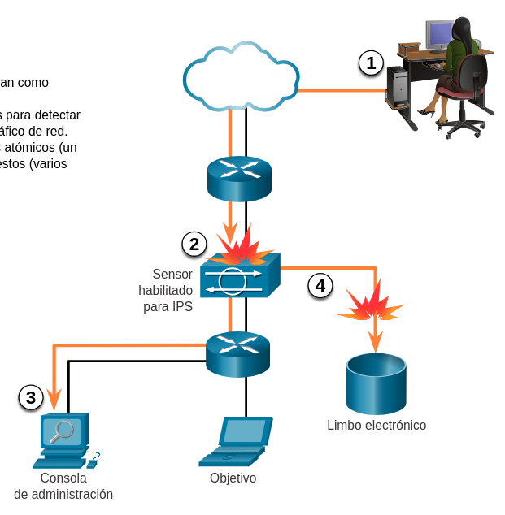

1. El tráfico malicioso se envía al host de destino que está dentro de la red.
2. El tráfico se enruta a la red y es recibido mediante un sensor IPS habilitado donde es bloqueado.
3. El sensor IPS habilitado envía información de registro con respecto al tráfico a la consola de administración de la seguridad de la red.
4. El sensor habilitado para IPS elimina el tráfico (se envía al "depósito de bits").

Ambas tecnologías se implementan como sensores. Un sensor IDS o IPS puede adoptar la forma de varios dispositivos diferentes:
* Un router configurado con el software IPS de Cisco IOS.
* Un dispositivo diseñado específicamente para proporcionar servicios de IDS o IPS exclusivos.
* Un módulo de red instalado en un dispositivo de seguridad adaptable (ASA, _Adaptive Security Appliance_), switch o router.

Las tecnologías IDS e IPS utilizan firmas para detectar patrones de tráfico de red. Una firma es un conjunto de reglas que un IDS o IPS utiliza para detectar actividad maliciosa. Las firmas pueden utilizarse para detectar infracciones graves de seguridad y ataques de red comunes, y para recopilar información. Las tecnologías IDS e IPS pueden detectar patrones de firma atómica (paquete individual) o patrones de firma compuesta (varios paquetes).

## Ventajas y desventajas de IDS e IPS
La tabla de lista de ventajas y desventajas de IDS e IPS.

<table>
	<tr><th>Solución<th>Ventajas<th>Desventajas
	<tr><td rowspan="3">IDS<td>Sin impacto en la red (latencia, jitter)<td>La acción de respuesta no puede detener los paquetes desencadenantes
	<tr><td>Sin impacto en la red si hay una falla del sensor<td>Ajuste correcto requerido para las acciones de respuesta
	<tr><td>Sin impacto en la red si hay sobrecarga del sensor<td>Más vulnerable a las técniacas de evasión de seguridad de la red
	<tr><td><td></tr>
	<tr><td rowspan="3">IPS<td>Detener paquetes de activación<td>Los problemas del sensor afectan el tráfico de la red por la noche
	<tr><td>Puede usar ténicas de normalización de flujo<td>La sobrecarga del sensor afecta la red
	<tr><td><td>Algún impacto en la red (latecia, jitter)
</table>

### Ventajas y desventajas de IDS
__Ventajas de IDS__.
Un IDS se implementa en modo sin conexión y por lo tanto:
* El IDS no afecta el rendimiento de la red. Específicamente, no introduce latencia, fluctuación ni otros problemas de flujo de tráfico.
* El IDS no afecta la funcionalidad de la red si falla el sensor, solamente afecta a la capacidad de IDS para analizar los datos.

__Desventajas de IDS__.
Las desventajas de un IDS incluyen:
* Un sensor de IDS no puede detener el paquete de activación y son menos útiles para detener los virus de correo electrónico y los ataques automatizados, como los gusanos.
* Afinar los sensores IDS para lograr niveles esperados de detección de intrusiones puede llevar mucho tiempo. Los usuarios que implementan acciones de respuesta de sensores de IDS deben tener una política de seguridad bien diseñada y una acabada comprensión operativa de sus implementaciones de IDS.
* Una implementación de IDS es más vulnerable a las técnicas de evasión de seguridad de red porque no está en línea.

### Ventajas y desventajas de IPS
__Ventajas de IPS__.
Las ventajas de IPS incluyen:
* Un sensor IPS se puede configurar para que omita el paquete a fin de detener el paquete de activación, los paquetes asociados a una conexión o los paquetes desde una dirección IP de origen.
* Porque los sensores IPS son en línea, pueden utilizar la normalización de transmisión. La normalización de transmisión es una técnica usada para reconstruir el flujo de datos cuando el ataque se produce en varios segmentos de datos.

__Desventajas de IPS__.
Las desventajas de un IPS incluyen:
* Porque implementado en línea, los errores, las fallas y el sobrecalentamiento del sensor IPS con mucho tráfico pude tener un efecto negativo en el rendimiento de la red.
* Un sensor de IPS puede afectar el rendimiento de la red al introducir latencia y fluctuación.
* Un sensor IPS debe tener el tamaño correcto e implementarse adecuadamente para que las aplicaciones sensibles al tiempo, como VoIP, no se vean afectadas negativamente.

### Consideraciones para la implementación
Puede implementar un IPS y un IDS. Estas tecnologías no son mutuamente exclusivas. De hecho, las tecnologías IDS e IPS pueden complementarse.

Por ejemplo, es posible implementar IDS para validar el funcionamiento de IPS, ya que se puede configurar IDS para que realice una inspección de paquetes más profunda sin conexión. Esto permite que IPS se centre en menos patrones de tráfico en línea, pero que son esenciales.

Decidir qué implementación aplicar depende de los objetivos de seguridad de la organización, como se definen en su política de seguridad de la red.

## Tipos de IPS
Existen dos tipos primarios de IPS disponibles: IPS basados en hosts y con base en la red.

### IPS con base en host
La tecnología IPS con base en host (HIPS) es un software instalado en un host para controlar y analizar actividades sospechosas. Una ventaja importante de HIPS es que puede monitorear y proteger el sistema operativo y los procesos fundamentales del sistema que son específicos de ese host. Con un conocimiento detallado del sistema operativo, HIPS puede monitorear la actividad inusual y evitar que el host ejecute comandos que no coinciden con el comportamiento habitual. Este comportamiento sospechoso o malicioso podría incluir actualizaciones del registro no autorizadas, cambios en el directorio del sistema, ejecución de programas de instalación y actividades que provocan desbordamientos del búfer. También es posible monitorear el tráfico de red para evitar que el host participe en un ataque de denegación de servicio o forme parte de una sesión de FTP ilícita.

HIPS puede considerarse una combinación de firewall, software antivirus y software antimalware. Combinado con IPS con base en la red, HIPS es una herramienta eficaz para brindar protección adicional al host.

Una desventaja de HIPS es que actúa solamente a nivel local. No tiene una perspectiva completa de la red o de los eventos coordinados que podrían estar ocurriendo en toda la red. Para ser eficaz en una red, HIPS debe instalarse en cada host y ser compatible con cada sistema operativo.

#### Ventajas
* Proporciona protección específica a un sistema operativo del host
* Proporciona protección al nivel del sistema operativo y de las aplicaciones
* Protege al host después de descifrar el mensaje

#### Desventajas
* Depende del sistema operativo
* Debe instalarse en todos los hosts

### IPS con base en la red
La tecnología IPS con base en la red se puede implementar utilizando un dispositivo IPS exclusivo o no exclusivo. Las implementaciones de IPS con base en la red son un componente fundamental de la prevención de intrusiones. Hay soluciones IDS/IPS con base en el host, pero estas deben integrarse con una implementación de IPS con base en la red para que la arquitectura de seguridad sea realmente sólida.

Los sensores detectan actividad maliciosa y no autorizada en tiempo real y pueden tomar medidas cuando es necesario. Como se muestra en la figura, los sensores se despliegan en puntos de red designados. Esto permite a los administradodres de seguridad a monitorear la actividad de la red mientras esto ocurre, sin importar dónde sea el objetivo del ataque.

	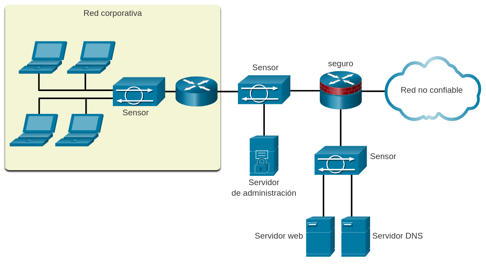

## Dispositivos de seguridad especializados
Hay una variedad de dispositivos de seguridad especializados disponibles. Estos son algunos ejemplos:

### AMP
Cisco Advanced Malware Protection (AMP) es una solución de protección y análisis de malware avanzado de clase empresarial. Brinda protección integral contra malware para las organizaciones antes, durante y después de un ataque:

* Antes del ataque, AMP fortalece las defensas y brinda protección contra amenazas conocidas y emergentes.
* Durante un ataque, AMP identifica y bloquea tipos de archivo que infrinjan las políticas, intentos de ataque y archivos maliciosos que intenten infiltrarse en la red.
* Después de un ataque o de la inspección inicial de un archivo, AMP no solo se queda en las funcionalidades de detección en un momento determinado, sino que también analiza y controla constantemente toda la actividad y el tráfico de archivos, independientemente de su ubicación, y busca detectar cualquier indicador de comportamiento malicioso. Si un archivo con una condición desconocida o que anteriormente se consideró "buena" comienza a comportarse mal, AMP lo detectará e inmediatamente generará una alerta para los equipos de seguridad con un indicador del riesgo. Luego proporciona visibilidad del lugar de origen del malware, los sistemas que se vieron afectados y la actividad del malware.

AMP tiene acceso a la inteligencia de seguridad colectiva del grupo de inteligencia e investigación de seguridad Cisco Talos. Talos detecta y correlaciona amenazas en tiempo real por medio de la mayor red de detección de amenazas del mundo.

### WSA
Un Dispositivo de Seguridad Web (WSA - _Web Security Appliance_) es un gateway de web seguro que combina las mejores protecciones para ayudar a las organizaciones a afrontar los crecientes desafíos de proteger y controlar el tráfico web. WSA protege la red bloqueando automáticamente sitios peligrosos y probando sitios desconocidos antes de permitir que los usuarios tengan acceso a ellos. WSA ofrece protección contra malware, visibilidad y control de las aplicaciones, controles de políticas de uso aceptable, informes detallados y movilidad segura.

Mientras que WSA protege la red contra intrusiones de malware, no proporciona protección para los usuarios que deseen conectarse a Internet directamente fuera de la red protegida, por ejemplo, desde un servicio de Wi-Fi pública. En este caso, la computadora del usuario puede infectarse con malware que, luego, puede diseminarse a otras redes y dispositivos. Para ayudar a proteger a las computadoras de usuarios de estos tipos de infecciones de malware, existe Cisco Cloud Web Security (CWS).

CWS, junto con WSA, proporciona protección completa contra malware y los impactos asociados. La solución Cisco CWS impone comunicación segura desde y hacia Internet, y les proporciona a los trabajadores remotos el mismo nivel de seguridad que el de los empleados en las instalaciones cuando utilizan su computadora portátil. Cisco CWS incorpora dos funciones principales, filtrado web y seguridad web, y ambas están acompañadas de una capacidad amplia y centralizada de generación de informes.

### ESA
Cisco Email Security Appliance (ESA) y Cisco Cloud Email Security ayudan a reducir las amenazas con base en el correo electrónico. Cisco ESA defiende sistemas de correo electrónico fundamentales.

Cisco ESA se actualiza constantemente mediante datos en tiempo real de Cisco Talos, que detecta y correlaciona las amenazas con un sistema de monitoreo que utiliza una base de datos mundial.

Algunas de las características principales de ESA son las siguientes:
* __Inteligencia de amenazas global__. Cisco Talos proporciona una vista de 24 horas de la actividad de tráfico global. Analiza anomalías, descubre nuevas amenazas y monitorea tendencias de tráfico.
* __Bloqueo de correo electrónico no deseado__. Una defensa multicapa que combina una capa externa de filtrado con base en la reputación del emisor y una capa interna de filtrado que lleva a cabo un análisis exhaustivo del mensaje.
* __Protección avanzada contra malware__. Incluye protección que aprovecha la enorme red de inteligencia de seguridad de la nube de Sourcefire. Brinda protección en toda la secuencia del ataque; es decir, antes, durante y después.
* __Control de mensajes salientes__. Controla los mensajes salientes para ayudar a garantizar que los mensajes importantes cumplan con las normas del sector y estén protegidos mientras se transmiten.

# Servicios de seguridad
## Control de tráfico con ACL
Una lista de control de acceso (ACL - _Access Control List_) es una serie de comandos que controla si un dispositivo reenvía o descarta paquetes según la información que se encuentra en el encabezado del paquete. Cuando se las configura, las ACL realizan las siguientes tareas:

* Limitan el tráfico de red para aumentar el rendimiento. Por ejemplo, si la política corporativa no permite el tráfico de vídeo en la red, se pueden configurar y aplicar ACL que bloqueen el tráfico de vídeo. Esto reduciría considerablemente la carga de la red y aumentaría su rendimiento.
* Brindan control de flujo de tráfico. Las ACL pueden restringir la entrega de actualizaciones de enrutamiento para asegurar que las actualizaciones provienen de un origen conocido.
* Proporcionan un nivel básico de seguridad para el acceso a la red. Las ACL pueden permitir que un host acceda a una parte de la red y evitar que otro host acceda a la misma área. Por ejemplo, se puede restringir el acceso a la red de Recursos Humanos a los usuarios autorizados.
* Filtran el tráfico según el tipo. Por ejemplo, una ACL puede permitir el tráfico de correo electrónico, pero bloquear todo el tráfico de Telnet.
* Examinan los hosts para permitirles o denegarles el acceso a los servicios de red. Las ACL pueden permitirles o denegarles a los usuarios el acceso a determinados tipos de archivos, como FTP o HTTP.

Además de permitir o denegar tráfico, las ACL se pueden utilizar para seleccionar tipos de tráfico para analizar, reenviar o procesar de otras formas. Por ejemplo, se pueden utilizar ACL para clasificar el tráfico a fin de permitir el procesamiento por prioridad. Esta capacidad es similar a tener un pase vip para un concierto o un evento deportivo. El pase vip brinda a ciertos invitados privilegios que no se ofrecen a los asistentes que poseen entradas de admisión general, como prioridad de entrada o el ingreso a un área restringida.

En la figura, se ve un ejemplo de una topología con ACL aplicadas a los routers R1, R2 y R3.

	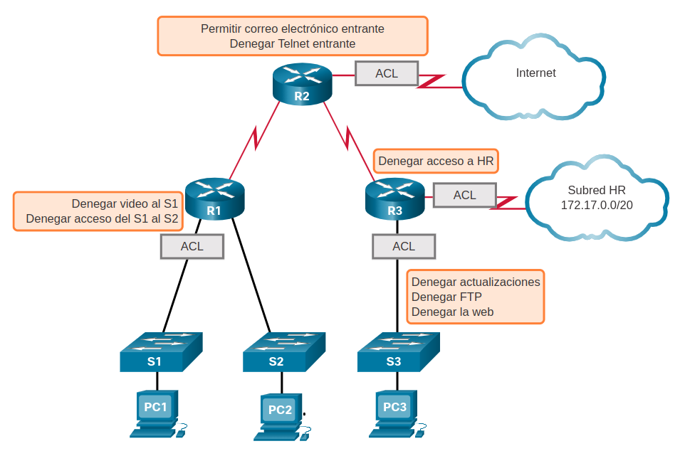

## ACL: características importantes
Los dos tipos de ACL de IPv4 de Cisco son estándar y extendidos. Las ACL estándar se pueden utilizar para permitir o denegar el tráfico de direcciones IPv4 de origen únicamente. El destino del paquete y los puertos involucrados no se evalúan.

Las ACL extendidas filtran paquetes IPv4 según varios atributos, como los siguientes:
* Tipo de protocolo
* Dirección IPv4 de origen
* Dirección IPv4 de destino
* Puertos TCP o UDP de origen
* Puertos TCP o UDP de destino
* Información optativa de tipo de protocolo para un control más preciso

Las ACL estándar y extendidas se pueden crear con un número o un nombre para identificar la ACL y su lista de instrucciones.

El uso de ACL numeradas es un método eficaz para determinar el tipo de ACL en redes más pequeñas con tráfico definido de forma más homogénea. Sin embargo, un número no proporciona información sobre el propósito de la ACL. Por este motivo, se puede usar un nombre para identificar una ACL de Cisco.

Mediante la configuración de registro de ACL, se puede generar y registrar un mensaje de ACL cuando el tráfico cumpla con los criterios de permiso o denegación definidos en la ACL.

Las ACL de Cisco también pueden configurarse para permitir solamente el tráfico de TCP que tiene un conjunto de bits ACK o RST, de modo que únicamente se permita el tráfico de una sesión de TCP establecida. Esto puede utilizarse para denegar el tráfico de TCP que provenga del exterior de la red que intenta establecer una nueva sesión de TCP.

## Packet Tracer - Demostración de ACL
* <a href="./notes/pt_demostracion_acl.md" target="_blank">Demostración de ACL</a>

## SNMP
El protocolo simple de administración de redes (SNMP - _Simple Network Management Protocol_) les permite a los administradores gestionar terminales en una red IP, como servidores, estaciones de trabajo, routers, switches y dispositivos de seguridad. Permite que los administradores de redes monitoreen y administren el rendimiento de la red, detecten y resuelvan problemas de red y planifiquen el crecimiento de la red.

SNMP es un protocolo de capa de aplicación que proporciona un formato de mensaje para la comunicación entre administradores y agentes.

Como se muestra en la figura, el sistema SNMP consta de dos elementos.

El administrador de SNMP, que ejecuta el software de administración de SNMP.
Los agentes de SNMP, que son los nodos monitoreados y administrados.
La base de información de administración (MIB - _Management Information Based_), que es una base de datos de los agentes donde se guardan datos y estadísticas operativas sobre el dispositivo

Para configurar SNMP en un dispositivo de red, primero es necesario definir la relación entre el administrador y el agente.

El administrador de SNMP forma parte de un sistema de administración de red (NMS - _Network Management System_). El administrador de SNMP ejecuta software de administración SNMP. Como se muestra en la ilustración, el administrador de SNMP puede recopilar información de un agente SNMP mediante una acción "get" y puede cambiar la configuración en un agente mediante la acción "set". Además, lo agentes de SNMP pueden reenviar información directamente a un administrador de red mediante "traps".

	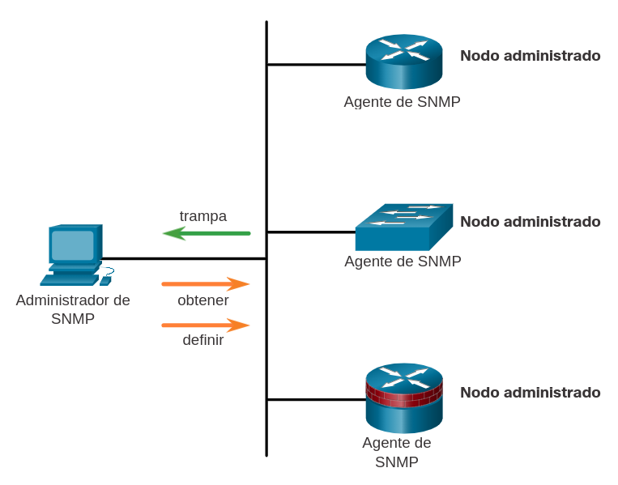

## NetFlow
NetFlow es una tecnología de Cisco IOS que proporciona estadísticas sobre los paquetes que atraviesan un router o switch multicapa de Cisco. Mientras que SNMP intenta proporcionar una amplia variedad de características y opciones de administración de red, NetFlow se centra en proporcionar estadísticas sobre los paquetes IP que fluyen a través de los dispositivos de red.

NetFlow proporciona datos para habilitar el monitoreo de red y de seguridad, la planificación de red, el análisis de tráfico para incluir la identificación de los cuellos de botella de la red y la contabilidad de IP para fines de facturación. Por ejemplo, en la ilustración, la PC1 se conecta a la PC2 mediante una aplicación como HTTPS.

	

NetFlow puede monitorear la conexión de esa aplicación mediante el seguimiento de los conteos de bytes y de paquetes para el flujo de esa aplicación individual. A continuación, inserta las estadísticas en un servidor externo denominado "recopilador NetFlow".

Existen varias generaciones de la tecnología NetFlow que proporcionan mayor sofisticación para definir los flujos de tráfico, pero "NetFlow original" distinguía los flujos mediante una combinación de siete campos. Si el valor de uno de estos campos difería del de otro paquete, se podía determinar con seguridad que los paquetes provenían de flujos diferentes:
* Dirección IP de origen
* Dirección IP de destino
* Número de puerto de origen
* Número de puerto de destino
* Tipo de protocolo de capa 3
* Marca de tipo de servicio (ToS)
* Interfaz lógica de entrada

Los primeros cuatro campos que usa NetFlow para identificar un flujo se deberían conocer. Las direcciones IP de origen y destino, más los puertos de origen y destino, identifican la conexión entre la aplicación de origen y destino. El tipo de protocolo de capa 3 identifica el tipo de encabezado que sigue al encabezado IP (generalmente TCP o UDP, pero otras opciones incluyen ICMP). El byte ToS en el encabezado de IPv4 contiene información sobre cómo los dispositivos deben aplicar las reglas de calidad de servicio (QoS) a los paquetes en ese flujo.

## Puertos reflejados
Un analizador de paquetes (también conocido como sniffer de paquetes o sniffer de tráfico) es, normalmente, un software que captura paquetes de entrada y salida de la tarjeta de interfaz de red (NIC). No siempre es posible ni deseable que el analizador de paquetes esté en el dispositivo que se está monitoreando. A veces, es mejor que esté en una estación separada designada para capturar los paquetes.

Dado que los switches de red pueden aislar el tráfico, los sniffers de tráfico u otros monitores de red (como IDS) no pueden tener acceso a todo el tráfico en un segmento de red. El reflejo de puertos es una característica que le permite al switch hacer copias del tráfico que pasa y, luego, enviarlas a un puerto con un supervisor de redes conectado. El tráfico original se reenvía de la manera habitual. En la figura, se ve un ejemplo de replicación de puertos.

## Servidores Syslog
Cuando ocurren ciertos eventos en una red, los dispositivos de red tienen mecanismos de confianza para notificar mensajes detallados del sistema al administrador. Estos mensajes pueden ser importantes o no. Los administradores de red tienen una variedad de opciones para almacenar, interpretar y mostrar estos mensajes, así como para recibir esos mensajes que podrían tener el mayor impacto en la infraestructura de la red.

El método más común para acceder a los mensajes del sistema es utilizar un protocolo denominado syslog.

Muchos dispositivos de red admiten syslog, incluidos routers, switches, servidores de aplicación, firewalls y otros dispositivos de red. El protocolo syslog permite que los dispositivos de red envíen los mensajes del sistema a servidores de syslog mediante la red, como se ve en la figura.

	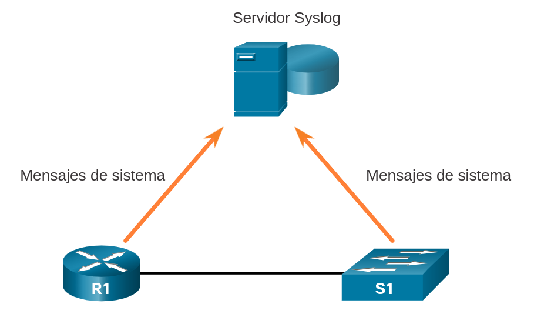

El servicio de registro de syslog proporciona tres funciones principales:
* La capacidad de recopilar información de registro para el control y la solución de problemas.
* La capacidad de escoger el tipo de información de registro que se captura.
* La capacidad de especificar el destino de los mensajes de syslog capturados.

## NTP, _Network Time Protocol_
Es importante sincronizar la hora en todos los dispositivos de la red porque todos los aspectos de administración, protección, solución de problemas y planificación de redes requieren una marca de hora precisa y uniforme. Cuando no se sincroniza la hora entre los dispositivos, resulta imposible determinar el orden de los eventos que tienen lugar en las diferentes partes de la red.

Generalmente, la configuración de fecha y hora en un dispositivo de red se pueden ajustar mediante una de las siguientes maneras:

* Configuración manual de fecha y hora
* Configuración del protocolo de tiempo de red (NTP)

A medida que una red crece, se hace difícil garantizar que todos los dispositivos de infraestructura operen con una hora sincronizada. Incluso en un entorno de red más pequeño, el método manual no es lo ideal. ¿Cómo obtener una fecha y marca de hora precisas si se reinicia un dispositivo?

Una mejor solución es configurar el NTP en la red. Este protocolo permite que los routers de la red sincronicen sus ajustes de hora con un servidor NTP. Si un grupo de clientes NTP obtiene información de fecha y hora de un único origen, tendrá ajustes de hora más consistentes. Cuando se implementa NTP en la red, se lo puede configurar para sincronizarse con un reloj maestro privado o se puede sincronizar con un servidor NTP disponible públicamente en Internet.

Las redes NTP utilizan un sistema jerárquico de fuentes horarias. Cada nivel en este sistema jerárquico se denomina estrato. El nivel de estrato se define como la cantidad de saltos desde fuente autorizada. La hora sincronización se distribuye en la red mediante el protocolo NTP. En la figura muestra una red NTP modelo.

	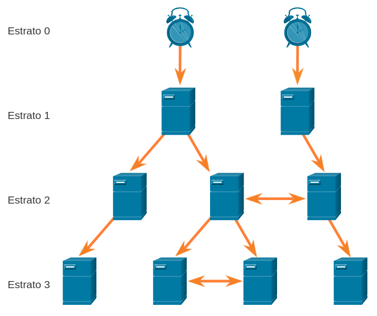

Los servidores NTP están dispuestos en tres niveles, conocidos como estratos:

* __Estrato 0__. Una red NTP obtiene la hora de fuentes horarias autorizadas. Estas fuentes autorizadas, conocidas como dispositivos de estrato 0, son dispositivos de cronometraje de alta precisión que son presuntamente precisos y con poco o ningún retraso asociado con los mismos.
* __Estrato 1__. Los dispositivos del estrato 1 están conectados directamente a las fuentes horarias autorizadas. Actúan como el estándar horario de la red principal.
* __Estrato 2 e inferiores__. Los servidores del estrato 2 están conectados a dispositivos del estrato 1 mediante conexiones de red. Los dispositivos del estrato 2, como clientes de NTP, sincronizan su horario con los paquetes NTP desde servidores del estrato 1. Podrían también actuar como servidores para dispositivos del estrato 3.

Los números más bajos de estratos indican que el servidor está más cerca de la fuente horaria autorizada que los números de estrato más altos. Cuanto mayor sea el número de estrato, menor es el nivel del estrato. El recuento de saltos máximo es 15. El estrato 16, el nivel de estrato inferior, indica que un dispositivo no está sincronizado. Los servidores horarios en el mismo nivel de estrato pueden configurarse para actuar como un par con otros servidores horarios en el mismo nivel de estratos para la verificación o la copia de respaldo del horario.

## Servidores AAA
Las tres funciones de seguridad independientes que ofrece el marco arquitectónico AAA.

### Autenticación
* Los usuarios y administradores deben probar que son quienes dicen ser.
* La autenticación se puede establecer utilizando combinaciones de nombre de usuario y contraseña, preguntas de desafío y respuesta, tarjetas token y otros métodos.
* La autenticación AAA proporciona una forma centralizada de controlar el acceso a la red.

### Autorización
* Una vez autenticado el usuario, los servicios de autorización determinan a qué recursos puede acceder el usuario y qué operaciones está habilitado para realizar.
* Un ejemplo es "el usuario estudiante puede tener acceso al servidor XYZ del host mediante SSH solamente".

### Auditoría
* Los registros de Contabilidad tienen también la función de registrar lo que hace el usuario, incluidos los elementos a los que accede, la cantidad de tiempo que accede al recurso y todos los cambios que se realizaron.
* La contabilidad realiza un seguimiento de la forma en que se utilizan los recursos de red.
* Un ejemplo es "El usuario estudiante tuvo acceso al servidor XYZ del host mediante SSH durante 15 minutos".
* 
Los protocolos Terminal Access Controller Access-Control System Plus (TACACS+) y Remote Authentication Dial-In User Service (RADIUS) son dos protocolos de autenticación que se utilizan para comunicarse con servidores AAA. La selección de TACACS+ o RADIUS depende de las necesidades de la organización.

Mientras ambos protocolos pueden usarse para la comunicación entre un router y los servidores AAA, TACACS+ se considera el protocolo más seguro. Esto se debe a que se cifran todos los intercambios de protocolos TACACS+, mientras que RADIUS solo cifra la contraseña del usuario. RADIUS no cifra nombres de usuario, información de la cuenta, o cualquier otra información que contenga el mensaje de RADIUS.

En la tabla se enumeran las diferencias entre estos programas;

|TACACS+|RADIUS
:-|:-|:-
Funcionalidad|Separa AAA de acuerdo con la arquitectura AAA, lo que permite la modularidad de la implementación del servidor de seguridad|Combina autenticación y autorización pero separa la contabilidad, lo que permite menos flexibilidad en la implementación de TACACS+
Estándar|Principlamente compativle con Cisco|Estándar abierto/RFC
Transporte|TCP|UDP
Protocolo CHAP|Desafío y respuesta bidireccionales como se usa en el protocolo de autenticación por desafío mutuo (CHAP)|Desafío y respuesta unidireccionales del servidor de seguridad RADIUS al cliente RADIUS
Confidencialidad|Todo el paquete encriptado|Contraseña encriptada
Personalización|Proporciona autorización de los comandos del enrutador por usuario o por grupo|No tiene opción para autorizar los comandos del enrutador por usuario o por grupo
Accounting|Limitado|Extenso

## VPN
Una VPN es una red privada que se crea en una red pública, normalmente Internet, como se ve en la Figura.

	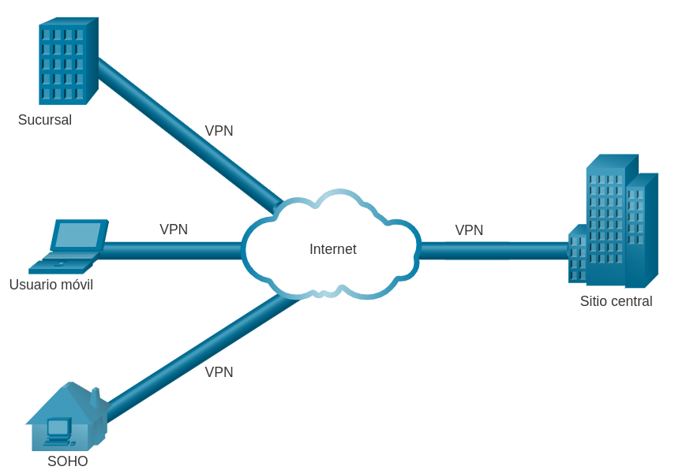

En vez de utilizar una conexión física exclusiva, una VPN utiliza conexiones virtuales cuyo enrutamiento se realiza por Internet desde la organización hacia el sitio remoto. Las primeras VPN eran exclusivamente túneles IP que no incluían la autenticación o el cifrado de los datos. Por ejemplo, la encapsulación de enrutamiento genérico (GRE) es un protocolo de tunelado desarrollado por Cisco que puede encapsular una amplia variedad de tipos de paquetes de protocolo de capa de red dentro de los túneles IP. Esto crea un enlace virtual punto a punto a los routers Cisco en puntos remotos a través de una red IP.

Una VPN es virtual porque transporta la información dentro de una red privada, pero, en realidad, esa información se transporta usando una red pública. Una VPN es privada porque el tráfico se encripta para preservar la confidencialidad de los datos mientras se los transporta por la red pública.

Una VPN es un entorno de comunicaciones en el que el acceso se controla de forma estricta para permitir las conexiones de peers dentro de una comunidad de interés definida. La confidencialidad se consigue encriptando el tráfico dentro de la VPN. En la actualidad, una implementación segura de VPN con encriptación es lo que suele equipararse con el concepto de redes privadas virtuales.

En el sentido más simple, una VPN conecta dos terminales (por ejemplo, una oficina remota con una central) usando una red pública para formar una conexión lógica. Las conexiones lógicas se pueden realizar en la capa 2 o la capa 3. Ejemplos comunes de VPN de capa 3 son GRE, conmutación por etiquetas multiprotocolo (MPLS, _Multiprotocol Label Switching_) e IPsec. Las VPN de capa 3 pueden ser conexiones de sitio de punto a punto (como GRE e IPsec) o pueden establecer conectividad entre cualquier punto y a muchos sitios con MPLS.

IPsec es un conjunto de protocolos desarrollados con el respaldo de la IETF para lograr servicios seguros en redes de conmutación por paquetes IP.

Los servicios de IPSec permiten la autenticación, la integridad, el control de acceso y la confidencialidad. Con IPsec se puede cifrar y verificar la información intercambiada entre sitios remotos. Las VPN suelen implementarse en una topología de sitio a sitio para conectar de forma segura sitios centrales con ubicaciones remotas. También se implementan en una topología de acceso remoto para proporcionar acceso remoto seguro a usuarios externos que viajan o trabajan desde casa. Se pueden implementar redes VPN de acceso remoto y de sitio a sitio por igual utilizando IPsec.

# Resumen
## Dispositivos de seguridad
Hay varios tipos diferentes de firewalls. Los firewalls de filtrado de paquetes (sin estado) proporcionan filtrado de Capa 3 y, a veces, de Capa 4. Principalmente, el diseño de firewall tiene por objetivo permitir o denegar el tráfico según el origen, el destino y el tipo de tráfico. Una inspección de estado de firewall permite o bloquea el tráfico basado en estado, puerto, y protocolo. Firewall de gateway de aplicación (firewall proxy) filtra la información de capa 3, 4, 5 y 7. Los firewalls de última generación proporcionan servicios adicionales más allá de las puertas de enlace de aplicaciones, como la prevención integrada de intrusiones, el reconocimiento y el control de las aplicaciones para ver y bloquear aplicaciones arriesgadas, el acceso a fuentes de información futuras y las técnicas para hacer frente a las amenazas de seguridad en evolución. Los sistemas de prevención de intrusiones (Intrusion prevention system IPS) y los sistemas de detección de intrusiones (IDS) se utilizan para detectar posibles riesgos de seguridad y alertar o detener el tráfico no seguro. IDS/IPS se puede implementar como basado en host o en red con ventajas y desventajas específicas para cada implementación. Están disponibles dispositivos de seguridad especializados, incluidos Proteccin avanzada de malware de Cisco (Cisco Advanced Malware Protection AMP), Cisco Web Security Appliance (WSA) y Cisco Email Security Appliance (WSA). Estos dispositivos de seguridad utilizan los servicios de Cisco Talos Security Intelligence and Research Group. Talos detecta y correlaciona amenazas en tiempo real por medio de la mayor red de detección de amenazas del mundo.

## Servicios de seguridad
Los servicios de seguridad de red incluyen las siguientes tecnologías. Las ACL son una serie de declaraciones que controlan si un dispositivo reenvía o descarta paquetes según la información que se encuentra en el encabezado del paquete. NTP sincroniza el sistema de tiempo en todos los dispositivos en la red para asegurar que guarden las marcas de tiempo del sistema de mensajes. Los servidores Syslog compilan y proporcionan acceso al sistema de mensajes generado por los dispositivos de red. SNMP permite que los administradores de redes monitoreen y administren el rendimiento de la red, detecten y resuelvan problemas de red y planifiquen el crecimiento de la red. NetFlow provee estadísticas sobre los paquetes que pasan a través de un router Cisco o un switch multicapa. La replicación de puertos es una característica que le permite al switch hacer copias del tráfico que pasa y, luego, enviarlas a un puerto con un supervisor de redes conectado. AAA es un marco de trabajo para configurar los servicios de autenticación, autorización y auditoría del usuario. Por lo general, AAA utiliza un servidor TACACS+ o RADIUS para este propósito. Las VPN son redes privadas que son creadas entre dos puntos finales a través de una red pública.

## Enlaces de interés
1. 
2. 
3. 
4. 
5. 
6. 
7. 
8. 
9. 
 
 
 
 
 
 
<a href="#6-infraestructura-de-seguridad-de-redes">⬆️</a>
<a href="./00-Curso.md"><< Menú principal del módulo</a>