<a href="./00-Curso.md"><< Menú principal del módulo</a>

# 7. El sistema operativo Windows
# Historia de Windows
## Sistema operativo de disco
Las primeras computadoras no tenían dispositivos de almacenamiento modernos, como discos duros, unidades ópticas o unidades de memoria flash. Los primeros métodos de almacenamiento utilizaban tarjetas perforadas, cinta de papel, cinta magnética y hasta casetes de audio.

El almacenamiento en disquete y disco duro requiere un software para leer, escribir y administrar los datos que se almacenan. El Sistema Operativo de Disco (DOS) es un sistema operativo que utiliza la computadora para habilitar estos dispositivos de almacenamiento de datos para leer y escribir archivos. DOS provee un sistema de archivos que organiza los archivos en una forma especifica en el disco. Microsoft compró DOS y desarrolló MS-DOS.

MS-DOS utiliza una línea de comandos como interfaz para que las personas creen programas y manipulen archivos de datos, como se muestra en la salida del comando.
```shell
Starting MS-DOS...
HIMEM is testing extended memory... done.
C:∖> C:∖DOS∖SMARTDRV.EXE /X
C:∖> dir
Volume in drive C is MS-DOS_6
Volume Serial Number is 4006-6939
Directory of C:∖
DOS  <DIR>  05-06-17 1:09p
COMMAND  COM   54,645 05-31-94  6:22a
WINA20   386   9,349  05-31-94  6:22a
CONFIG   SYS   71 05-06-17      1:10p
AUTOEXEC   BAT   78 05-06-17    1:10p
     5 file(s)     64,143 bytes
              517,021,696 bytes free
C:∖>
```
Con MS-DOS, la computadora tenía conocimientos básicos sobre cómo acceder a la unidad de disco y cargar los archivos del sistema operativo directamente desde el disco como parte del proceso de arranque. Cuando se cargaba, MS-DOS podía tener acceso al disco fácilmente porque estaba incorporado en el sistema operativo.

Las primeras versiones de Windows consistían en un Interfaz Gráfica de Usuario (GUI) que se ejecuta sobre MS-DOS, iniciando con Windows 1.0 en 1985. El sistema operativo de disco todavía controlaba la computadora y su hardware. Un sistema operativo moderno, como Windows 10, no se considera un sistema operativo de disco. Se basa en Windows NT, y esta sigla significa "nuevas tecnologías". El propio sistema operativo controla directamente la computadora y su hardware. NT es un sistema operativo compatible con múltiples procesos de usuario. Esto es muy diferente al MS-DOS de un solo proceso y un solo usuario.

Actualmente, muchas de las cosas que solían hacerse a través de la interfaz de línea de comandos de MS-DOS se pueden hacer en la GUI de Windows. Todavía es posible experimentar lo que era usar MS-DOS abriendo una ventana de comando, pero lo que vemos ya no es MS-DOS, sino una función de Windows. Para experimentar un poco lo que era trabajar en MS-DOS, abran una ventana de comando escribiendo __cmd__ en la búsqueda de Windows y presionando __Intro__. La tabla muestra algunos comandos que puede utilizar. Introduzca __help__ seguido del comando para obtener más información sobre el mismo.

__Comando MS-DOS__|__Descripción__
-|-
__dir__|Muestra una lista de todos los archivos en el directorio actual (carpeta)
__cd__ _directory_|Cambia el directorio al directorio indicado
__cd ..__|Cambial el directorio al directorio por encima del directorio actual
__cd\\__| Cambia el directorio al directorio raíz (a menudo `C:`)
__copy__ _source destination_|Copia archivos a otra ubicación
__del__ _filename_|Elimina uno o más archivos
__find__|busca texto en arvhivos
__mkdir__ _directory_|Crea un nuevo directorio
__ren__ _oldname newname_|Renombra un archivo
__help__|Muestra todos lo caomandos que se pueden utilizar, con una breve descripción
__help__ _command_|Muestra una amplia ayuda parra el comando indicado

## Versiones de Windows
Desde el año 1993 hubo más de 20 versiones de Windows basadas en el sistema operativo NT. La mayoría de estas versiones eran para uso del público general y las empresas, debido a la seguridad de los archivos que ofrecía el sistema de archivos utilizado por el sistema operativo NT. Las empresas también adoptaron los sistemas operativos Windows basados en NT. Esto ocurrió porque muchas ediciones se diseñaron específicamente para estaciones de trabajo, profesionales, servidores, servidores avanzados y servidores de centro de datos, por nombrar solamente algunas de las muchas versiones de diseño específico.

A partir de Windows XP, comenzó a estar disponible una edición de 64 bits. El sistema operativo de 64 bits era una arquitectura totalmente nueva. Tenía un espacio de direccionamiento de memoria de 64 bits, en lugar de uno de 32 bits. Esto no significa solamente el doble de espacio, ya que estos bits son números binarios. Mientras que Windows de 32 bits tiene espacio para un poco menos de 4 GB de RAM, Windows de 64 bits puede tener, teóricamente, espacio para 16,8 millones de terabytes. Cuando el sistema operativo y el hardware admiten el funcionamiento de 64 bits, es posible usar conjuntos de datos extremadamente grandes. Estos enormes conjuntos de datos incluyen bases de datos muy grandes, computación científica y manipulación de video digital de alta definición con efectos especiales. En general, las computadoras y los sistemas operativos de 64 bits son compatibles con programas más antiguos de 32 bits, pero los programas de 64 bits no pueden ejecutarse en el hardware más antiguo de 32 bits.

Con cada nuevo lanzamiento de Windows, el sistema operativo se ha mejorado con la incorporación de más funciones. Windows 7 se ofreció con seis ediciones diferentes y Windows 8 con cinco. Windows 10 se lanzó ¡con ocho ediciones diferentes! Cada edición no ofrece solamente capacidades diferentes, sino precios distintos. Microsoft ha dicho que Windows 10 es la última versión de Windows y que Windows se ha convertido en un servicio en lugar de solo un sistema operativo. Dicen que, en lugar de comprar nuevos sistemas operativos, los usuarios solamente deberán actualizar Windows 10.

En la tabla se enumeran las versiones comunes de Windows.

__OS__|__Versiones__
-|-
__Windows 7__|Starter, Home Basic, Home Premium, Professional, Enterprise, Ultimate
__Windows Server 2008 R2__|Foundation, Standard, Enterprise, Datacenter, Web Server, HPC Server, Itanium-Based Systems
__Windows Home Server 2011__|Ninguna
__Windows 8__|Windows 8, Windows 8 Pro, Windows 8 Enterprise, Windows RT
__Windows Server 2012__|Foundation, Essentials, Standard, Datacenter
__Windows 8.1__|Windows 8.1, Windows 8.1 Pro, Windows 8.1 Enterprise, Windows RT 8.1
__Windows Server 2012 R2__|Foundation, Essentials, Standard, Datacenter
__Windows 10__|Home, Pro, Pro Education, Enterprise, Education, loT Core, Mobile, Mobile Enterprise
__Windows Server 2016__|Essentials, Standard, Datacenter, Multipoint Premium Server, Storage Server, Hyper-V Server

__Nota__. En el momento de elaboración de esta guía (OCT 2024) está disponible Windows 11 desde 2022.

## GUI de Windows
Windows tiene una interfaz gráfica de usuario (Graphical User Interface, GUI) para que los usuarios trabajen con software y archivos de datos. La interfaz gráfica de usuario tiene un área principal que es conocida como Escritorio, mostrada en la figura.

<div style="width: 50%;padding-left: 20%;">
	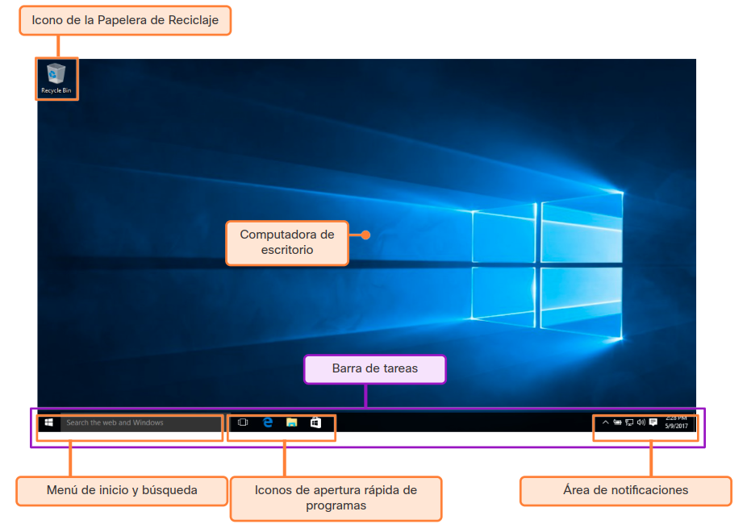
</div>

El escritorio se puede personalizar con diferentes colores e imágenes de fondo. Windows admite múltiples usuarios, para que cada uno pueda personalizar el escritorio a su gusto. El escritorio puede almacenar archivos, carpetas, accesos directos a ubicaciones y programas, y aplicaciones. Además, el escritorio tiene un icono de papelera de reciclaje, donde se almacenan los archivos cuando el usuario los elimina. Es posible restaurar archivos desde la papelera de reciclaje o se la puede vaciar y, de este modo, eliminarlos definitivamente.

En la parte inferior del escritorio, se encuentra la barra de tareas. La barra de tareas tiene tres áreas que se utilizan para diferentes propósitos. A la izquierda, se encuentra el menú Inicio. Se utiliza para acceder a todos los programas instalados, las opciones de configuración y la función de búsqueda. En el centro de la barra de tareas, los usuarios colocan los iconos de inicio rápido que ejecutan programas específicos o abren determinadas carpetas cuando se hace clic en ellos. Finalmente, a la derecha de la barra de tareas, se encuentra el área de notificación. El área de notificación permite ver, a simple vista, la funcionalidad de una serie de programas y características diferentes. Por ejemplo, un icono de un sobre parpadeando puede indicar un correo electrónico nuevo, o un icono de red con una "x" roja puede indicar un problema con la red.

A menudo, al pulsar derecho sobre un icono se presentan funciones adicionales que pueden utilizarse. Esta lista se conoce como menú contextual, que se muestra en la figura.

<div style="width: 50%;padding-left: 20%;">
	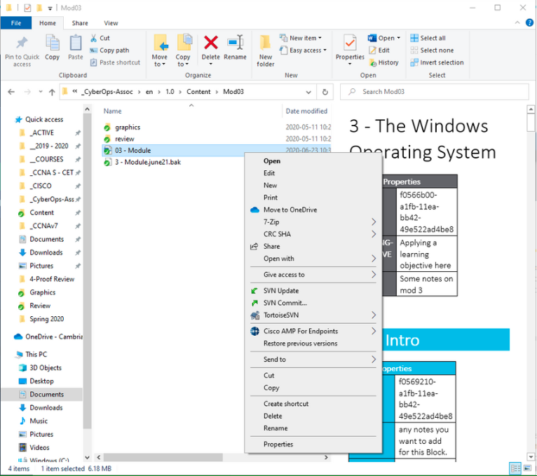
</div>

Existen menús contextuales para los iconos en el área de notificación y también para los iconos de inicio rápido, los iconos de configuración del sistema y para los archivos y carpetas. El menú contextual permite tener acceso a muchas de las funciones más utilizadas con apenas un clic. Por ejemplo, el menú contextual para un archivo contendrá elementos como copiar, eliminar, compartir e imprimir. Para abrir carpetas y manipular archivos, Windows utiliza el explorador de archivos de Windows.

## Vulnerabilidades del Sistema Operativo
Los sistemas operativos consisten en millones de líneas de código. El software instalado también puede contener millones de líneas de código. Todo este código acarrea vulnerabilidades. Una vulnerabilidad es una imperfección o debilidad que puede ser aprovechada por un atacante para reducir la viabilidad de la información de una computadora. Para aprovechar una vulnerabilidad de un sistema operativo, el atacante debe utilizar una técnica o herramienta para atacarla. El atacante puede utilizar la vulnerabilidad para hacer que la computadora actúe de una manera diferente a la prevista en su diseño. En general, el objetivo es hacerse con el control no autorizado de la computadora, cambiar permisos o manipular datos.

* __Protección contra virus o malware__.
	* De manera predeterminada, Windows utiliza Windows Defender para la protección contra el malware
	* Windows Defender ofrece un conjunto de herramientas de protección incorporado en el sistema.
	* Si Windows Defender está desactivado, el sistema es más vulnerable a los ataques y al malware.
* __Servicios Desconocidos o no administrados__.
	* Existen muchos servicios que se ejecutan en segundo plano.
	* Es importante asegurarse de que cada servicio pueda identificarse y sea seguro.
	* Con un servicio desconocido ejecutándose en segundo plano, la computadora puede ser vulnerable a los ataques.
* __Cifrado__.
	* Cuando los datos no se encuentran encriptados pueden ser fácilmente reunidos y explotados.
	* Esto no es solamente importante para computadoras de escritorio, sino especialmente para dispositivos móviles.
* __Política de seguridad__.
	* Se debe configurar una buena política de seguridad y debe cumplirse.
	* Muchos ajustes en el control de la política de seguridad de Windows pueden evitar ataques.
* __Firewall__.
	* Por defecto, Windows utiliza el Firewall de Windows para limitar la comunicación con dispositivos en la red
	* Con el tiempo, es posible que las reglas ya no se apliquen.
	* Por ejemplo, podría dejarse abierto un puerto que ya no debe estar disponible.
	* Es importante revisar la configuración del firewall periódicamente para asegurarse de que las reglas sigan siendo aplicables y eliminar las que ya no se apliquen.
* __Permisos de archivo y uso compartido__.
	* Estos permisos deben ser aplicados correctamente.
	* Es fácil darle al grupo "Todos" el control total, pero esto les permite a todas las personas hacer lo que deseen con todos los archivos.
	* Es mejor otorgar a cada usuario o grupo los permisos mínimos necesarios para todos los archivos y carpetas.
* __Contraseña débil o sin contraseña__.
	* Muchas personas eligen una contraseña débil o no utilizan contraseñas del todo.
	* Es especialmente importante asegurarse de que todas las cuentas, especialmente la cuenta de administrador, tengan una contraseña muy fuerte.
* __Iniciar sesión como administrador__.
	* Cuando el usuario inicia sesión como administrador, cualquier programa que ejecuten tendrá los privilegios de esa cuenta.
	* Es mejor iniciar sesión como un usuario estándar y utilizar solamente la contraseña de administrador para realizar determinadas tareas.

# Arquitectura y operaciones de Windows
## Capa de Abstracción de Hardware
Las computadoras con Windows utilizan muchos tipos de hardware distintos. El sistema operativo se puede instalar en una computadora comprada o en una computadora ensamblada por el usuario. Cuando se instala el sistema operativo, debe aislarse de las diferencias en el hardware. En la figura, se ve la arquitectura básica de Windows.

<div style="width: 50%;padding-left: 20%;">
	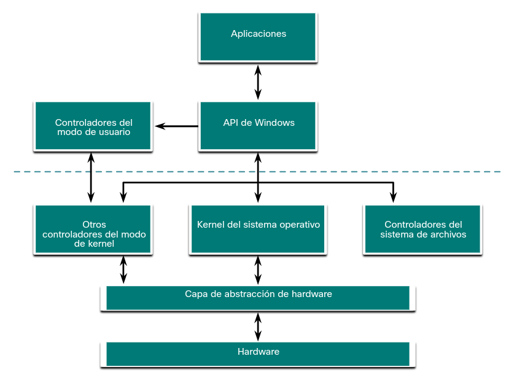
</div>

Una capa de abstracción de hardware (HAL - _Hardware Abstraction Layer_) es un software que maneja toda la comunicación entre el hardware y el kernel. El kernel es el núcleo del sistema operativo y controla toda la computadora. Se encarga de todas las solicitudes de entrada y salida, la memoria y todos los periféricos conectados a la computadora.

En algunos casos, el núcleo todavía se comunica con el hardware directamente, por lo que no es totalmente independiente de la HAL. La HAL también necesita el núcleo para realizar algunas funciones.

## Modo de Usuario y Modo de Kernel
Como se identifica en la figura, hay dos modos diferentes en los que funciona una CPU cuando la computadora tiene Windows instalado: el modo de usuario y el modo de núcleo.

<div style="width: 50%;padding-left: 20%;">
	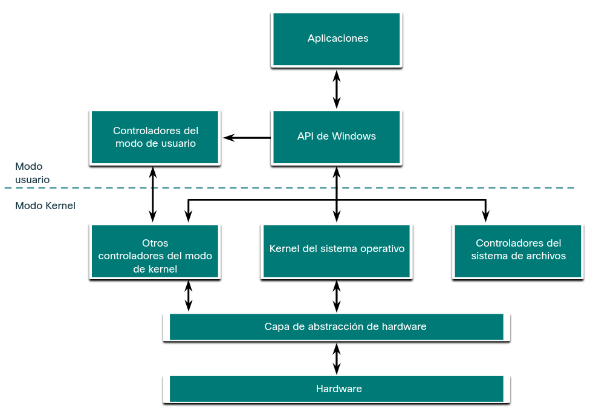
</div>

Las aplicaciones instaladas se ejecutan en el modo de usuario, y el código del sistema operativo lo hace en el modo de kernel. El código que se ejecuta en el modo de núcleo tiene acceso ilimitado al hardware subyacente y es capaz de ejecutar cualquier instrucción de la CPU. El código del modo de núcleo también puede hacer referencia a cualquier dirección de la memoria directamente. Dado que suele estar reservado para las funciones más confiables del sistema operativo, un error en el código que se ejecuta en el modo de núcleo detiene el funcionamiento de toda la computadora. Por el contrario, otros programas (como las aplicaciones de usuario) se ejecutan en modo de usuario y no tienen acceso directo a ubicaciones de memoria o hardware. El código de modo de usuario debe pasar por el sistema operativo para tener acceso a los recursos de hardware. Debido al aislamiento que brinda el modo de usuario, los errores en dicho modo afectan solamente a la aplicación y es posible una recuperación. La mayoría de los programas de Windows funcionan en el modo de usuario. Los controladores de dispositivos (elementos del software que permiten que el sistema operativo y un dispositivo se comuniquen) pueden funcionar en modo de núcleo o de usuario, según el controlador.

Todo el código que se ejecuta en el modo de núcleo usa el mismo espacio para las direcciones de memoria. Los controladores en modo de núcleo no están aislados del sistema operativo. Si se produce un error con el controlador en el modo de núcleo y escribe en el espacio para la dirección incorrecto, el sistema operativo u otro controlador del modo de núcleo podrían verse afectados negativamente. En este sentido, el controlador podría dejar de funcionar e interrumpir el funcionamiento de todo el sistema operativo.

Cuando se ejecuta código en el modo de usuario, el núcleo le otorga su propio espacio para la dirección de memoria limitado, junto con un proceso creado específicamente para la aplicación. Esto se hace, principalmente, para evitar que las aplicaciones cambien código del sistema operativo que se esté ejecutando al mismo tiempo. Al tener su propio proceso, la aplicación tiene su propio espacio para la dirección privado, lo que impide que otras aplicaciones modifiquen sus datos. Esto también ayuda a evitar que el sistema operativo y otras aplicaciones dejen de funcionar si se interrumpe la aplicación.

## Sistema de Archivos de Windows
## exFAT
* Este es un sistema de archivos simple compatible con muchos sistemas operativos diferentes.
* FAT tiene limitaciones en la cantidad de particiones, tamaños de partición y tamaños de archivo que puede abordar, por lo que generalmente ya no se usa para discos duros (HDs) o unidades de estado sólido (SSD).
* FAT16 y FAT32 están disponibles para usarse, y FAT32 es el más común, ya que tiene muchas menos restricciones que FAT16.

## Sistemas de archivos jerárquico + (HFS+)
* Este sistema de archivos se usa en computadoras MAC OS X y permite nombres de archivo, tamaños de archivo y tamaños de partición mucho más largos que los sistemas de archivos anteriores.
* Aunque no es compatible con Windows sin software especializado, Windows es capaz de leer datos de particiones HFS+.

## Sistema de archivos extendido (EXT)
* Este sistema de archivos es utilizado con computadoras basadas en Linux.
* Aunque no es compatible con Windows, Windows es capaz de leer datos de particiones EXT con software especializado.

## Sistema de archivos de nueva tecnología (NTFS)
* Este es el sistema de archivos usado más comúnmente cuando está instalado en Windows. Todas las versiones de Windows y Linux admiten NTFS.
* Los equipos Mac-OS X sólo pueden leer una partición NTFS. Son capaces de escribir en una partición NTFS después de instalar controladores especiales.

NTFS es el sistema de archivos más utilizado en Windows por numerosas razones. NTFS admite archivos y particiones muy grandes y es muy compatible con otros sistemas operativos. Además, NTFS también es muy confiable y admite funciones de recuperación. Lo más importante es que admite muchas características de seguridad. El control de acceso de datos se logra mediante descriptores de seguridad. Estos descriptores de seguridad contienen información de propiedad y permisos en todos los niveles hasta el nivel de archivo. NTFS también controla muchas marcas de hora para registrar la actividad del archivo. También llamadas MACE<sup>[1](#enlaces-de-interés)</sup>, las marcas de hora de modificación, acceso, creación y modificación de entrada suelen usarse en las investigaciones forenses para determinar el historial de un archivo o carpeta. NTFS también admite la encriptación del sistema de archivos para proteger todos los medios de almacenamiento.

Antes de poder usar un dispositivo de almacenamiento, como un disco, se debe formatear con un sistema de archivos. A su vez, antes de poder implementar un sistema de archivos en un dispositivo de almacenamiento, se debe particionar dicho dispositivo. Los discos duros se dividen en áreas llamadas particiones. Cada partición es una unidad lógica de almacenamiento que se puede formatear para almacenar información, como archivos de datos o aplicaciones. Durante el proceso de instalación, la mayoría de los sistemas operativos particionan y formatean automáticamente el espacio disponible de la unidad con un sistema de archivos, como NTFS.

El formato NTFS crea estructuras importantes en el disco para almacenar archivos y tablas para registrar las ubicaciones de los archivos:

* __Sector de Partición de Arranque__. Estos son los primeros 16 sectores de la unidad. contiene la ubicación de la tabla maestra de archivos (MFT, Master File Table). Los últimos 16 sectores contienen una copia del sector de arranque.
* __Tabla Maestra de Archivos (MFT)__. Esta tabla contiene la localización de todos los archivos y los directorios de la partición, incluyendo los atributos de los archivos como la información de seguridad y las marcas de tiempo.
* __Archivos del sistema__. Estos son archivos ocultos que almacenan información sobre otros volúmenes y atributos de archivo.
* __Área de Archivos__. El área principal de la partición donde los archivos y los directorios son guardados.

__Nota__: Cuando se formatea una partición, es posible que puedan recuperarse los datos anteriores, ya que no se eliminan completamente todos los datos. Este espacio libre puede ser examinado y se pueden recuperar archivos que pueden comprometer la seguridad. Si se va a reutilizar una unidad, se recomienda realizar un borrado seguro. El borrado seguro escribirá datos en toda la unidad varias veces para garantizar que no queden datos anteriores.

## Flujo de Datos Alternativo (ADS)
NTFS guarda los archivos como una serie de atributos; por ejemplo, el nombre del archivo o una marca de hora. Los datos que contiene el archivo se almacenan en el atributo $DATA, y se conocen como flujo de datos. Con NTFS, es posible conectar flujos de datos alternativos (ADS) al archivo. En ocasiones, las aplicaciones aprovechan esta función para almacenar información adicional sobre el archivo. Los ADS son un factor importante en relación con el malware. Esto se debe a que resulta sencillo ocultar datos en ADS. Un atacante podría almacenar código malicioso dentro de ADS y otro archivo podría invocar este contenido posteriormente.

En el sistema de archivos NTFS, un archivo con un ADS se identifica después del nombre del archivo y dos puntos, por ejemplo, __Testfile.txt: ADS__. Este nombre de archivo indica que un ADS está asociado con el archivo llamado __Testfile.txt__. Un ejemplo de ADS es mostrada en la salida de un comando.

```shell
C:∖ADS> echo "Alternate Data Here" > Testfile.txt:ADS
C:∖ADS> dir
  Volume in drive C is Windows
  Volume Serial Number is A606-CB1B
  Directory of C:∖ADS
2020-04-28 04:01 PM   <DIR>            .
2020-04-28 04:01 PM   <DIR>            ..
2020-04-28 04:01 PM            0 Testfile.txt
                 1 File(s)                 0 bytes
                 2 Dir(s) 43,509,571,584 bytes free
C:∖ADS> more < Testfile.txt:ADS
"Alternate Data Here"
C:∖ADS> dir /r
   Volume in drive C is Windows
   Volume Serial Number is A606-CB1B
   Directory of C:∖ADS
2020-04-28 04:01 PM   <DIR>
2020-04-28 04:01 PM   <DIR>
2020-04-28 04:01 PM            0 Testfile.txt
                            24 Testfile.txt:ADS:$DATA
            1 File(s)            0 bytes
            2 Dir(s) 43,509,624,832 bytes free
C:∖ADS>
```

En la salida:
* El primer comando coloca el texto "Alternate Data Here" en un ADS del archivo `Testfile.txt`, llamado "ADS".
* El siguiente comando, dir, muestra que el archivo fue creado, pero no se visualiza el ADS.
* El siguiente comando muestra que hay datos en el flujo de datos de `Testfile.txt:ADS`.
* El último comando muestra el ADS del archivo `Testfile.txt`, porque se añadió la r al comando dir.

## Proceso de Arranque de Windows
Ocurren muchas acciones entre el tiempo que es presionado el botón de encendido y Windows siendo cargado completamente, como es mostrado en la figura. Esto se conoce como proceso de arranque de Windows.

<div style="width: 50%;padding-left: 20%;">
	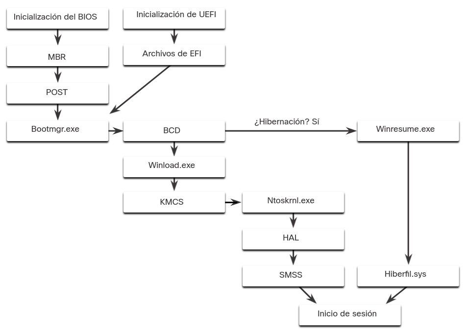
</div>

Existen dos tipos de firmware de computadora:
* __Sistema básico de entrada y salida (BIOS)__. BIOS firmware se creó a principios de la década de 1980 y funciona de la misma manera desde entonces. A medida que las computadoras evolucionaron, BIOS firmware comenzó a tener problemas para admitir todas las nuevas funciones que solicitaban los usuarios.
* __Chip de interfaz de firmware unificada extensible (UEFI<sup>[2](#enlaces-de-interés)</sup>)__. UEFI se diseñó para reemplazar el BIOS y admitir las nuevas funciones.

En BIOS firmware, el proceso comienza con la fase de inicialización del BIOS. Esto ocurre cuando se inicializan los dispositivos de hardware y se realiza una prueba automática de encendido (POST, _Power-On Self Test_) para garantizar que todos estos dispositivos se estén comunicando. La POST finaliza cuando se detecta el disco del sistema. La última instrucción en la POST es buscar el registro principal de arranque (MBR, _Master Boot Record_).

El MBR contiene un pequeño programa que se encarga de localizar y cargar el sistema operativo. La BIOS ejecuta este código y el sistema operativo comienza a cargarse.

A diferencia de BIOS firmware, UEFI firmware tiene mucha visibilidad en el proceso de arranque. El arranque con UEFI se realiza cargando los archivos de programa de EFI, almacenados como archivos `.efi` en una partición especial del disco conocida como la partición de sistema EFI (ESP, _EFI System Partition)_.

__Nota__: Una computadora que utiliza UEFI almacena código de arranque en el firmware. Esto ayuda a aumentar la seguridad de la computadora al momento del arranque, ya que entra directamente en el modo protegido.

Ya sea que el firmware sea BIOS o UEFI, después de ubicar una instalación válida de Windows, se ejecuta el archivo `Bootmgr.exe`, que cambia el sistema del modo real al modo protegido para que pueda usarse toda la memoria del sistema.

__Bootmgr.exe__ lee la base de datos de configuración de arranque (_Boot Configuration Database_, BCD). La BCD contiene cualquier código adicional necesario para iniciar la computadora, junto con una indicación que señala si la computadora está saliendo de una hibernación o si es un arranque en frío. Si la computadora está saliendo de una hibernación, el proceso de arranque continúa con __Winresume.exe__. Esto permite que la computadora lea el archivo __Hiberfil.sys__ que contiene el estado de la computadora cuando ingresó en la hibernación.

Si se inicia la computadora con un arranque en frío, se carga el archivo __Winload.exe__. El archivo __Winload.exe__ crea un registro de la configuración de hardware en el registro. El registro es una lista de todos los ajustes, las opciones, el hardware y el software de la computadora. Más adelante en este capítulo, se analizará en detalle el registro. __WinLoad.exe__ también utiliza la firma de código del modo de núcleo (KMCS, _Kernel Mode Code Signing_) para asegurarse de que todos los controladores estén firmados digitalmente. Esto garantiza que los controladores son seguros para cargarlos al iniciar la computadora.

Después de que se analizan los controladores, __Winload.exe__ ejecuta __Ntoskrnl.exe__, que arranca el núcleo de Windows y configura la HAL. Finalmente, _Session Manager Subsystem_ (SMSS) lee el registro para crear el entorno de usuario, iniciar el servicio de Winlogon y preparar el escritorio de cada usuario a medida que inician sesión.

## Inicio de Windows
Hay dos elementos importantes del registro que se utilizan para iniciar automáticamente aplicaciones y servicios:
* __HKEY_LOCAL_MACHINE__. Muchos aspectos de la configuración de Windows se almacenan en esta clave, incluida la información sobre los servicios que se inician con cada arranque.
* __HKEY_CURRENT_USER__. Muchos aspectos relacionados con el usuario que inicia sesión se almacenan en esta clave, incluida la información sobre los servicios que se inician solamente cuando el usuario inicia sesión en la computadora.

El registro se discutirá más adelante en este tema.

La presencia de entradas diferentes en estas ubicaciones del registro definen qué servicios y aplicaciones se iniciarán, según lo que indiquen sus tipos de entrada. Estos tipos son `Run`, `RunOnce`, `RunServices`, `RunServicesOnce` y `Userinit`. Estas entradas pueden introducirse manualmente en el registro, pero es mucho más seguro utilizar la herramienta `Msconfig.exe`. Esta herramienta se utiliza para ver y cambiar todas las opciones de inicio de la computadora. Use el cuadro de búsqueda para encontrar y abrir la herramienta __Msconfig__.

La herramienta __Msconfig__ abre la ventana Configuración del sistema. Hay cinco pestañas que contienen las opciones de configuración.
* __General__. Aquí se pueden elegir tres tipos de inicio diferentes:
	*  __Normal__ carga todos los controladores y servicios.
	*  __Con diagnóstico__ carga solamente los servicios y controladores básicos.
	*  __Selectivo__ le permite al usuario elegir qué cargar en el inicio.

<div style="width: 50%;padding-left: 20%;">
	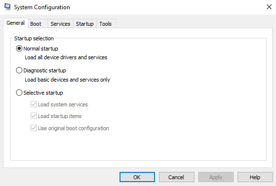
</div><br />

* __Arranque__. Aquí se puede elegir cualquier sistema operativo instalado para comenzar. También hay opciones para el arranque a prueba de errores, que se utiliza para solucionar problemas de inicio.

<div style="width: 50%;padding-left: 20%;">
	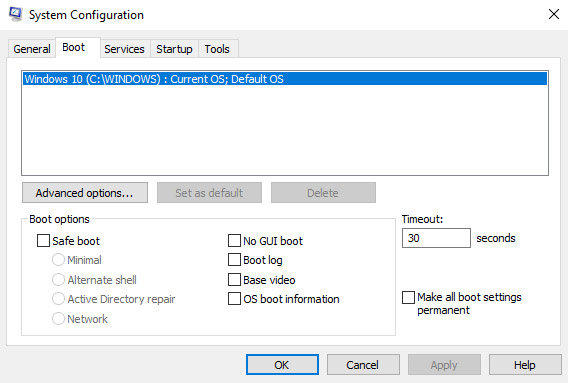
</div>

* __Servicios__. Todos los servicios instalados se enumeran aquí para que se puedan elegir para comenzar al inicio.

<div style="width: 50%;padding-left: 20%;">
	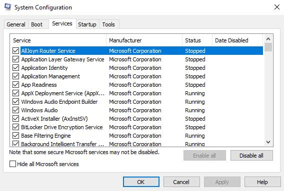
</div>

* __Inicio__. Todas las aplicaciones y servicios que están configurados para comenzar automáticamente al inicio se pueden habilitar o deshabilitar abriendo el administrador de tareas desde esta pestaña.

<div style="width: 50%;padding-left: 20%;">
	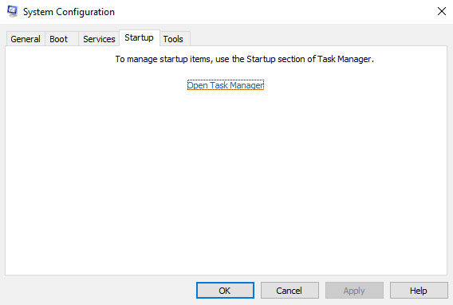
</div>

* __Herramientas__. Muchas herramientas comunes del sistema operativo se pueden iniciar directamente desde esta pestaña.

<div style="width: 50%;padding-left: 20%;">
	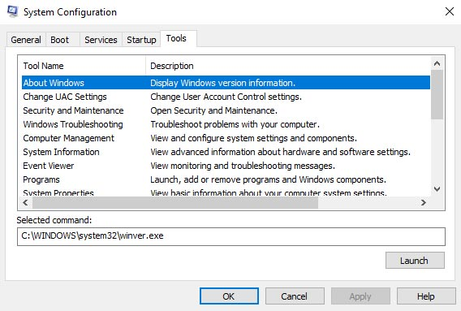
</div>

## Apagado de Windows
Siempre es mejor cerrar correctamente la computadora que apagarla. Los archivos que quedan abiertos, los servicios que se cierran de manera desordenada y las aplicaciones que se bloquean pueden sufrir daños si se apaga la computadora sin informar primero al sistema operativo. La computadora necesita tiempo para cerrar cada aplicación, apagar cada servicio y registrar cualquier cambio de configuración antes de interrumpir la alimentación.

Durante el apagado, la computadora cierra primero las aplicaciones del modo de usuario y, luego, los procesos de modo de núcleo. Si un proceso del modo de usuario no responde durante una cierta cantidad de tiempo, el sistema operativo muestra una notificación y permite que el usuario espere a que la aplicación responda o fuerce la finalización del proceso. Si un proceso en el modo de núcleo no responde, parecerá que el apagado se detuvo y es posible que sea necesario apagar la computadora con el botón de encendido.

Hay varias maneras de apagar una computadora con Windows: las opciones de energía del menú __Inicio__, el comando `shutdown` de la línea de comandos, y presionar juntas las teclas `<Ctrl> + <Alt> + <Supr>` para pulsar en el icono de encendido. Hay tres opciones diferentes entre las que elegir al apagar el equipo:
* __Apagar__, apaga el equipo.
* __Reiniciar__, reinicia la computadora (apaga y enciende).
* __Hibernación__, registra el estado actual del equipo y el entorno de usuario y lo almacena en un archivo. La hibernación le permite al usuario continuar su trabajo rápidamente justo desde donde lo dejó, con todos sus archivos y programas aún abiertos.

## Procesos, subprocesos y servicios
Una aplicación de Windows se compone de procesos. La aplicación puede tener uno o varios procesos exclusivos. Un proceso es cualquier programa que se esté ejecutando. Cada proceso en ejecución está compuesto de, al menos, un subproceso. Un subproceso es una parte del proceso que puede ejecutarse. El procesador realiza los cálculos en el subproceso. Para configurar los procesos de Windows, busque el __Administrador de Tareas__. La pestaña __Procesos__ del __Administrador de Tareas__ se muestra en la figura.

<div style="width: 50%;padding-left: 20%;">
	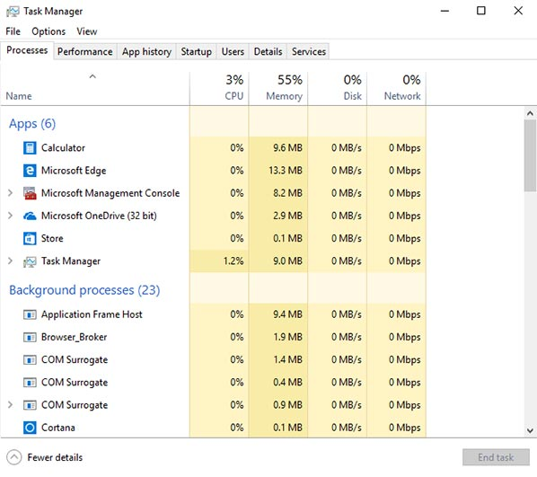
</div><br />

Todos los subprocesos exclusivos de un proceso están incluidos en el mismo espacio para la dirección de memoria. Esto significa que estos subprocesos no pueden tener acceso al espacio para la dirección de memoria de ningún otro proceso. Esto evita el daño de otros procesos. Debido a que Windows realiza múltiples tareas simultáneamente, es posible ejecutar varios subprocesos al mismo tiempo. La cantidad de subprocesos que se pueden ejecutar al mismo tiempo depende del número de procesadores de la computadora.

Algunos de los procesos que ejecuta Windows son servicios. Son programas que se ejecutan en segundo plano para respaldar el funcionamiento del sistema operativo y de las aplicaciones. Pueden configurarse para iniciarse automáticamente cuando Windows arranca o es posible iniciarlos manualmente. También pueden detenerse, reiniciarse o deshabilitarse.

Los servicios proporcionan funcionalidades de duración prolongada, como la conexión inalámbrica o el acceso a un servidor FTP. Para configurar los servicios de Windows, busque __Servicios__. El subprograma del panel de control de __Servicios__ de Windows se muestra en la figura.

<div style="width: 50%;padding-left: 20%;">
	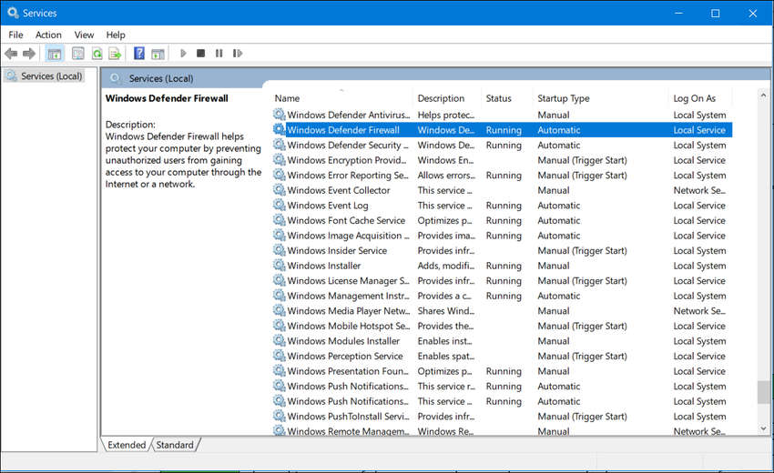
</div><br />

Ser muy cuidadoso manipulando las configuraciones de estos servicios. Algunos programas dependen de uno o más servicios para funcionar correctamente. Apagar un servicio puede afectar adversamente aplicaciones u otros servicios.

## Asignación de Memoria y Controladores
Una computadora funciona almacenando las instrucciones en la memoria RAM hasta que la CPU las procesa. El espacio para la dirección de memoria virtual de un proceso es el conjunto de direcciones virtuales que puede utilizar el proceso. La dirección virtual no es la ubicación física real en la memoria, sino una entrada en una tabla de página que se utiliza para traducir la dirección virtual a una dirección física.

Cada proceso en una computadora con Windows de 32 bits admite un espacio para las direcciones de memoria virtual que hace posible manipular hasta 4 GB. Cada proceso en una computadora con Windows de 64 bits admite un espacio para la dirección de memoria virtual de 8 TB.

Cada proceso de espacio del usuario se ejecuta en un espacio para la dirección de memoria privado, separado de otros procesos de espacio del usuario. Cuando el proceso de espacio del usuario necesita tener acceso a los recursos del núcleo, debe utilizar un identificador de procesos. Esto se debe a que el proceso de espacio del usuario no puede tener acceso directo a estos recursos del núcleo. El identificador de procesos brinda el acceso que necesita el proceso de espacio del usuario sin conectarse directamente.

Una poderosa herramienta para ver la asignación de memoria es __RamMap__, que se muestra en la figura. RamMap forma parte del conjunto de herramientas de Windows __Sysinternals__. Se puede descargar desde Microsoft. RamMap proporciona una gran cantidad de información acerca de cómo Windows ha asignado la memoria del sistema al kernel, los procesos, los controladores y las aplicaciones.

<div style="width: 50%;padding-left: 20%;">
	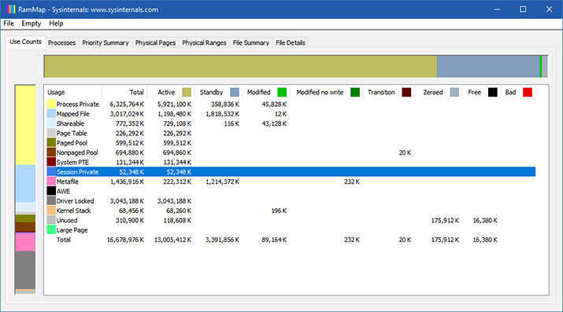
</div>

## El Registro de Windows
Windows almacena toda la información sobre el hardware, las aplicaciones, los usuarios y la configuración del sistema en una extensa base de datos conocida como __Registro del sistema__. Las maneras en que interactúan estos objetos también se registran, por ejemplo, qué archivos abre una aplicación y todos los detalles de propiedad de carpetas y aplicaciones. El registro es una base de datos jerárquica donde el nivel más alto se conoce como subárbol, debajo están las claves y, luego, las subclaves. Los valores almacenan datos y se almacenan en las claves y subclaves. Una clave de registro puede tener hasta 512 niveles de profundidad.

A continuación se proporciona información sobre las cinco secciones del registro de Windows.
* __HKEY_CURRENT_USER (HKCU)__. Contiene información sobre el usuario actualmente conectado.
* __HKEY_USERS (HKU)__. Contiene información sobre todas las cuentas de usuario en el host.
* __HKEY_CLASSES_ROOT (HKCR)__. Contiene información sobre los registros de vinculación e incrustación de objetos (OLE - _Object Linking and Embedding_). OLE permite a los usuarios incrustar objetos de otras aplicaciones (como una hoja de cálculo) en un solo documento (como un documento de Word).
* __HKEY_LOCAL_MACHINE (HKLM)__. Contiene información relacionada con el sistema.
* __HKEY_CURRENT_CONFIG (HKCC)__. Contiene información sobre el perfil de hardware actual.

No es posible crear nuevos subárboles. Las claves y los valores de registro en los subárboles pueden crearse, modificarse o eliminarse usando una cuenta con privilegios de administrador. Como se ve en la figura, se utiliza la herramienta __regedit.exe__ para modificar el registro. Se debe tener mucho cuidado al usar esta herramienta. Cambios mínimos en el registro podrían tener consecuencias sustanciales o hasta catastróficas.

<div style="width: 50%;padding-left: 20%;">
	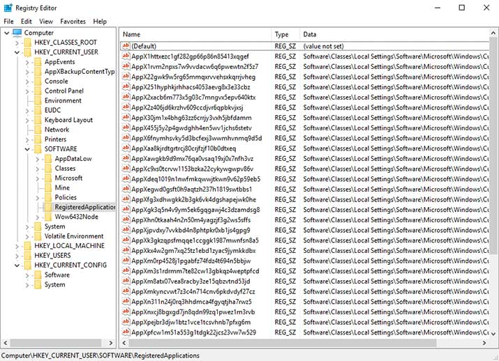
</div><br />

La navegación por el registro es muy similar a la del explorador de archivos de Windows. Use el panel izquierdo para navegar por las colmenas y la estructura debajo de él y use el panel derecho para ver el contenido del elemento resaltado en el panel izquierdo. Con tantas claves y subclaves, la ruta de la clave puede resultar muy prolongada. La ruta aparece en la parte inferior de la ventana como referencia. Dado que cada clave y subclave es, en definitiva, un contenedor, la ruta se representa como una carpeta en un sistema de archivos. La contra-barra (`\`) se utiliza como caracter separador para diferenciar la jerarquía de la base de datos.

Las claves de registro pueden contener una subclave o un valor. Los diferentes valores que pueden contener las claves son los siguientes:
* __REG_BINARY__. Números o valores booleanos
* __REG_DWORD__. Números superiores a 32 bits o datos sin procesar
* __REG_SZ__. Valores de cadena (_string_)

Debido a que el registro mantiene casi toda la información del usuario y del sistema operativo, es fundamental asegurarse de no ponerlo en riesgo. Las aplicaciones potencialmente maliciosas pueden agregar claves de registro para que se inicien cuando se inicia la computadora. Durante un arranque normal, el usuario no verá el programa iniciarse porque la entrada está en el registro y la aplicación no muestra ninguna ventana ni indicio de inicio durante el arranque de la computadora. Un registro de clave, por ejemplo, sería devastador para la seguridad de una computadora si iniciara el arranque sin el conocimiento ni consentimiento del usuario. Cuando se realizan auditorías normales de seguridad o se corrige un sistema infectado, se deben revisar las ubicaciones de inicio de la aplicación en el registro para asegurarse de que cada elemento sea conocido y seguro de ejecutar.

El registro también contiene la actividad que realiza un usuario durante el uso diario habitual de la computadora. Esto abarca el historial de los dispositivos de hardware, incluidos todos los dispositivos que se han conectado a la computadora con el nombre, el fabricante y el número de serie. En el registro, también se almacena otra información, como los documentos que un usuario y un programa abrieron, dónde se encuentran y cuando se tuvo acceso a ellos. Esto resulta muy útil durante la ejecución de una investigación forense.

## Lab - Explorar procesos, subprocesos, controles y el registro de Windows
* <a href="./notes/lab_explorar_windows.md" target="_blank">Explorar procesos, subprocesos, controles y el registro de Windows</a>

# Configuración y monitoreo de Windows
## Ejecutar como administrador
Como mejor práctica de seguridad, no es recomendable iniciar sesión en Windows utilizando la cuenta de administrador o una cuenta con privilegios administrativos. Esto se debe a que cualquier programa que se ejecute cuando inicie sesión con esos privilegios los heredará. El malware con privilegios administrativos tiene acceso completo a todos los archivos y carpetas en la computadora.

En ocasiones es necesario ejecutar o instalar software que requiere los privilegios de un administrador. Para lograr esto, hay dos diferentes formas de realizar la instalación.
* __Administrador__. pulse con el botón derecho en el Explorador de archivos de Windows y elija Ejecutar como administrador en el menú contextual.

<div style="width: 50%;padding-left: 20%;">
	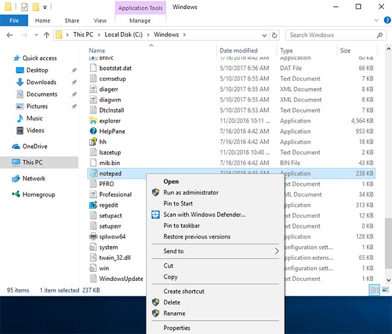
</div><br />

* __Administrador en línea de comandos__. Busque `command`, pulse derecho en el archivo ejecutable y seleccione ejecutar como administrador del menú de contexto. Cada comando que se ejecute desde esta línea de comando se implementará con privilegios de administrador, incluida la instalación de software.

<div style="width: 50%;padding-left: 30%;">
	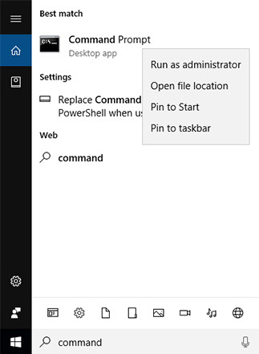
</div><br />

## Usuarios y dominios locales
Cuando se inicia una nueva computadora por primera vez, o al instalar Windows, el sistema solicita la creación de una cuenta de usuario. Esta se conoce como “usuario local”. Esta cuenta contiene todos los ajustes de personalización, los permisos de acceso, las ubicaciones de archivos y muchos otros datos específicos del usuario. Hay también otras dos cuentas: de invitado y de administrador. Ambas están deshabilitadas de manera predeterminada.

Como una mejor práctica de seguridad, no debe habilitarse la cuenta de administrador ni otorgarles privilegios administrativos a los usuarios estándar. Si un usuario necesita realizar cualquier función que requiera privilegios administrativos, el sistema solicitará la contraseña de administrador y permitirá realizar como administrador solamente la tarea específica. Requerir la contraseña de administrador protege la computadora al evitar que cualquier software que no esté autorizado instale, ejecute o acceda a archivos.

No debe habilitarse la cuenta de invitado. La cuenta de invitado no tiene una contraseña, ya que se crea cuando una computadora será utilizada por muchas personas diferentes que no tienen cuentas propias. Cada vez que se inicia sesión con la cuenta de invitado, se proporciona un entorno predeterminado con privilegios limitados.

Para facilitar la administración de usuarios, Windows utiliza grupos. Un grupo tendrá un nombre y un conjunto específico de permisos asociados con él. Cuando se coloca a un usuario en un grupo, los permisos de ese grupo se le otorgan a ese usuario. Se puede colocar a un usuario en varios grupos con muchos permisos diferentes. Cuando se superponen los permisos, algunos de ellos (como “denegar explícitamente”) anulan los permisos otorgados por otro grupo. Hay muchos grupos de usuarios diferentes integrados en Windows que se utilizan para tareas específicas. Por ejemplo, el grupo de usuarios del registro de rendimiento les permite a los miembros programar el registro de contadores de rendimiento y recopilar registros de manera local o remota. Los grupos y usuarios locales se administran con el applet lusrmgr.msc del panel de control, como se ve en la figura.

<div style="width: 70%;padding-left: 20%;">
	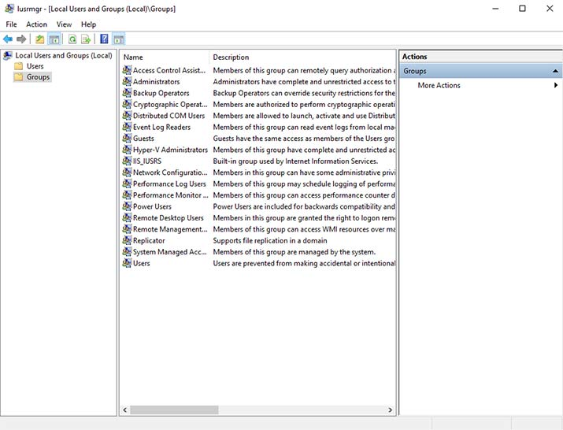
</div><br />

Además de grupos, Windows también puede utilizar dominios para establecer permisos. Un dominio es un tipo de servicio de red en el que todos los usuarios, grupos, computadoras, periféricos y ajustes de seguridad se almacenan en una base de datos, que también los controla. Esta base de datos se almacena en computadoras o grupos de computadoras especiales que se denominan controladores de dominio (DC, _Domain Controller_). Cada usuario y computadora en el dominio deben autenticarse con el DC para iniciar sesión y tener acceso a los recursos de red. El DC establece la configuración de seguridad para cada usuario y cada computadora en cada sesión. Cualquier ajuste suministrado por el DC se aplica de manera predeterminada en la configuración de cuenta de usuario o computadora local.

## CLI y PowerShell
La interfaz de línea de comandos (_Command Line Interface_, CLI) de Windows se puede utilizar para ejecutar programas, navegar por el sistema de archivos y administrar archivos y carpetas. Además, pueden crearse archivos denominados archivos por lotes para ejecutar varios comandos seguidos, algo muy parecido a un script básico.

Para abrir la CLI de Windows, se debe buscar `cmd.exe` y pulsar en el programa. Es necesario recordar que pulsar con el botón derecho en el programa ofrece la opción de ejecutar como administrador, lo que les otorga mucho más poder a los comandos que se utilizarán.

El indicador permite ver la ubicación actual en el sistema de archivos. Estas son algunas sugerencias para recordar cuando se usa la CLI:
* De manera predeterminada, los nombres y rutas de archivo no distinguen entre mayúsculas y minúsculas.
* A los dispositivos de almacenamiento se les asigna una letra de referencia. Esto seguido de dos puntos y barra invertida (`\`). Esto indica la raíz, o el nivel más alto, del dispositivo. La jerarquía de carpetas y archivos en el dispositivo se indica usando la separación con la barra invertida. Por ejemplo, `C:\Usuarios\Jim\Escritorio\archivo.txt` es el archivo denominado `archivo.txt` en la carpeta `Escritorio`, dentro de la carpeta `Jim` y en el interior de la carpeta `Usuarios` del dispositivo `C:`.
* Los comandos que tienen modificadores opcionales utilizan la barra inclinada (`/`) para delinear entre el comando y la opción de cambio.
* Puede utilizar la tecla Tab para auto-completar comandos cuando referencia directorios o archivos.
* Windows guarda un historial de los comandos que se introdujeron durante una sesión de la CLI. Acceda a comandos previamente introducidos presionando las flechas de arriba y abajo.
* Para cambiar entre dispositivos de almacenamiento, escriba la letra del dispositivo seguida de dos puntos y presione Entrar .

A pesar de que la CLI tiene muchos comandos y características, no puede trabajar en conjunto con el núcleo de Windows o la GUI. Se puede utilizar otro entorno, llamado Windows PowerShell, para crear script con el fin de automatizar tareas que la CLI común no puede crear. PowerShell también proporciona una CLI para iniciar comandos. PowerShell es un programa integrado en Windows que se puede abrir buscando la palabra "powershell" y haciendo clic en el programa. Como la CLI, PowerShell también se puede ejecutar con privilegios de administrador.

Estos son los tipos de comandos que puede ejecutar PowerShell:
* cmdlets - estos comandos realizan una acción y envían un resultado u objeto al siguiente comando que se ejecutará.
* Scripts de PowerShell - estos son archivos con una extensión .ps1 que contienen comandos de PowerShell que se ejecutan.
* Funciones de PowerShell - estas son fragmentos de código a los que se puede hacer referencia en un script.

Para obtener más información sobre Windows PowerShell y comenzar a usarlo, escriba en PowerShell, como se ve en la salida del comando.
```shell
Windows PowerShell
Copyright (C) Microsoft Corporation. All rights reserved.
Try the new cross-platform PowerShell https://aka.ms/pscore6
PS C:∖WINDOWS∖system32> help
TOPIC
   Windows PowerShell Help System
SHORT DESCRIPTION
   Displays help about Windows PowerShell cmdlets and concepts.
LONG DESCRIPTION
   Windows PowerShell Help describes Windows PowerShell cmdlets,
   functions, scripts, and modules, and explains concepts, including
   the elements of the Windows PowerShell language.
   Windows PowerShell does not include help files, but you can read the
   help topics online, or use the Update-Help cmdlet to download help files
   to your computer and then use the Get-Help cmdlet to display the help
   topics at the command line.
   You can also use the Update-Help cmdlet to download updated help files
   as they are released so that your local help content is never obsolete.
   Without help files, Get-Help displays auto-generated help for cmdlets,
   functions, and scripts.
ONLINE HELP
   You can find help for Windows PowerShell online in the TechNet Library
   beginning at http://go.microsoft.com/fwlink/?LinkID=108518.
   To open online help for any cmdlet or function, type:
   Get-Help -Online
UPDATE-HELP
   To download and install help files on your computer:
      1. Start Windows PowerShell with the "Run as administrator" option.
      2. Type:
         Update-Help
   After the help files are installed, you can use the Get-Help cmdlet to
   display the help topics. You can also use the Update-Help cmdlet to
   download updated help files so that your local help files are always
   up-to-date.
   For more information about the Update-Help cmdlet, type:
      Get-Help Update-Help -Online
-- More --
```

Hay cuatro niveles de ayuda de Windows PowerShell:
* __get-help__ _PS command_ - Muestra ayuda básica para un comando
* __get-help__ _PS command [-examples]_ - Muestra una ayuda con ejemplos básica para un comando
* __get-help__ _PS command [-detailed]_ - Muestra una ayuda detallada con ejemplos para un comando.
* __get-help__ _PS command [-full]_ - Muestra toda la información de ayuda con ejemplos de mayor profundidad para un comando.

## Instrumentación de la administración de Windows
_Windows Management Instrumentation_ (WMI) se utiliza para administrar computadoras remotas. Puede recuperar información sobre componentes de la computadora, brindar estadísticas de hardware y software, y monitorear el estado de computadoras remotas. Para abrir el control WMI desde el Panel de control, haga doble clic en __Herramientas administrativas > Administración de equipos__ para abrir la ventana __Administración de equipos__, expanda el árbol de __Servicios y aplicaciones__ y pulse con el botón derecho en el icono __Control WMI Propiedades__.

La ventana Propiedades de Control WMI se ve en la figura.

<div style="width: 70%;padding-left: 15%;">
	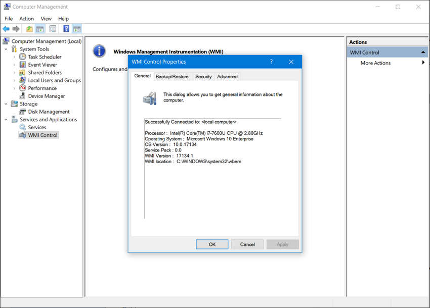
</div><br />

Estas son las cuatro fichas en la ventana Propiedades de Control WMI:
* __General__. Resumen de información sobre la computadora local y WMI
* __Copia de seguridad y/o restauración__. Permite realizar la copia de respaldo manual de las estadísticas recopiladas por WMI
* __Seguridad__. Ajustes para configurar quién tiene acceso a las diferentes estadísticas de WMI
* __Opciones avanzadas__. Ajustes para configurar el espacio de nombres predeterminado para WMI

Actualmente, algunos ataques utilizan WMI para conectarse con sistemas remotos, modificar el registro y ejecutar comandos. WMI ayuda a los atacantes a evitar la detección porque el tráfico es común, los dispositivos de seguridad de red suelen confiar y los comandos de WMI remotos no suelen dejar rastro en el host remoto. Debido a esto, el acceso a WMI debe limitarse al máximo.

## El comando net
Windows tiene muchos comandos que se pueden introducir en la línea de comando. Un comando importante es el comando `net`, que se usa en la administración y el mantenimiento del sistema operativo. El comando `net` puede ir seguido de muchos otros comandos , que pueden combinarse con cambios para concentrarse en resultados específicos.

Para ver una lista de los numerosos comandos `net`, escriba `net` help en la petición de ingreso de comando. La comando output muestra los comandos que puede utilizar el `net` comando. Para ver ayuda detallada sobre cualquiera de los comandos `net`, escriba `C:\> net `help muestra abajo.

```shell
C:∖> net help
The syntax of this command is:
NET HELP
command
          -or-
NET command /HELP
   Commands available are:
   NET ACCOUNTS            NET HELPMSG               NET STATISTICS
   NET COMPUTER            NET LOCALGROUP            NET STOP
   NET CONFIG              NET PAUSE                 NET TIME
   NET CONTINUE            SESSION                   NET USE
   NET FILE                NET SHARE                 NET USER
   NET GROUP               NET START                 NET VIEW
   NET HELP
   NET HELP NAMES explains different types of names in NET HELP syntax lines.
   NET HELP SERVICES lists some of the services you can start.
   NET HELP SYNTAX explains how to read NET HELP syntax lines.
   NET HELP command | MORE displays Help one screen at a time.
C:∖>
```

Algunos de los comandos de red más comunes son:
* `net accounts`. Define los requisitos de contraseñas e inicio de sesión para los usuarios.
* `net session`. Enumera o desconecta las sesiones entre una computadora y otras computadoras de la red.
* `net share`. Crea, elimina o administra recursos compartidos.
* `net start`. Inicia un servicio de red o enumera los servicios de red en ejecución.
* `net stop`. Detiene un servicio de red.
* `net use`. Conecta, desconecta los recursos de red compartidos, y permite ver información sobre ellos.
* `net view`. Muestra una lista de las computadoras y los dispositivos de red en la misma.

## Administrador de Tareas y Monitor de Recursos
Hay dos herramientas muy importantes y útiles para ayudar a un administrador a entender la enorme y variada cantidad de aplicaciones, servicios y procesos que se ejecutan en una computadora con Windows. Estas herramientas también proporcionan información sobre el rendimiento de la computadora, como el uso de CPU, memoria y red. Estas herramientas son especialmente útiles al investigar un problema donde hay sospechas de malware. Cuando un componente no está funcionando de la manera en que debería, estas herramientas pueden utilizarse para determinar cuál puede ser el problema.

__Administrador de tareas__
El Administrador de tareas ofrece mucha información sobre el software que se está ejecutando y el rendimiento general de la computadora.

<div style="width: 70%;padding-left: 15%;">
	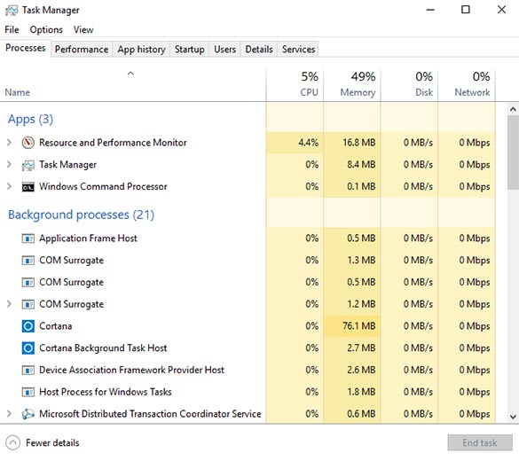
</div><br />

Los distintos apartados del Administrador de tareas son:
* __Procesos__
	* Lista todos los programas y procesos que están siendo ejecutados.
	* Se ve el uso de CPU, memoria, disco y utilización de red de cada proceso.
	* Las propiedades de un proceso se pueden examinar o finalizar si no se comporta correctamente o se ha estancado.
* __Rendimiento__
	* Una vista de todas las estadísticas de rendimiento proporciona un panorama útil del desempeño de la CPU, la memoria, el disco y la red.
	* Al hacer clic en cada elemento en el panel izquierdo, se ven las estadísticas detalladas de dicho elemento en el panel derecho.
* __Historial de aplicaciones__
	* El uso que cada aplicación hace de los recursos a lo largo del tiempo proporciona información sobre aplicaciones que consumen más recursos de los que deberían.
	* pulse en __Opciones y Mostrar historial de todos los procesos__ para ver el historial de cada proceso que se ha ejecutado desde que se inició la computadora.
* __Inicio__
	* Todas las aplicaciones y servicios que inician cuando la computadora es arrancada se muestran en esta pestaña.
	* Para impedir que un programa se inicie durante el arranque, pulse con el botón derecho en el programa y elija __Deshabilitar__.
* __Usuarios__
	* En esta pestaña, se ven todos los usuarios que han iniciado sesión en la computadora.
	* También se ven todos los recursos que utilizan los procesos y las aplicaciones de cada usuario.
	* Desde esta ficha, un administrador puede desconectar a un usuario de la computadora.
* __Detalles__
	* De manera similar a la ficha Procesos, esta ficha proporciona opciones de administración adicionales, por ejemplo, establecer prioridades para que el procesador le dedique más o menos tiempo a un proceso.
	* También es posible establecer afinidad con la CPU, lo que define qué núcleo o CPU utilizará un programa.
	* También, una función útil denominada Analizar cadena de espera permite ver qué procesos esperan a otros.
	* .Esta característica ayuda a determinar si un proceso está en espera o está interrumpido.
* __Servicios__
	* En esta ficha se muestran todos los servicios cargados.
	* También aparecen la identificación del proceso (PID, Process ID) y una breve descripción junto con el estado del proceso (En ejecución o Detenido).
	* En la parte inferior, hay un botón para abrir la consola de servicios y tener acceso a funciones adicionales de administración de los servicios.

__Monitor de recursos__
Cuando se necesita información más detallada sobre el uso de recursos, es posible utilizar el Monitor de recursos, como se muestra en la figura.

<div style="width: 70%;padding-left: 15%;">
	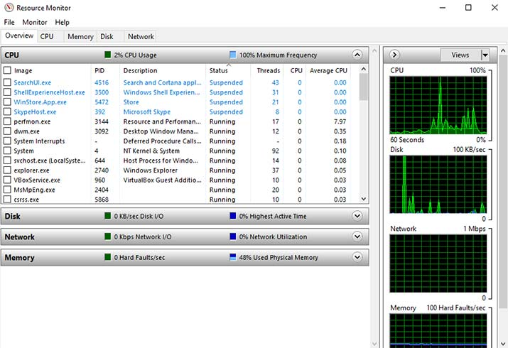
</div><br />

Si la computadora se comporta de manera extraña, el Monitor de recursos puede ayudar a encontrar el origen del problema.

Los apartados del monitor de recursos son los siguientes:
* __Descripción general__
	* La ficha muestra el uso general de cada recurso.
	* Si se selecciona un proceso individual, se filtrará en todas las pestañas para mostrar solamente las estadísticas de dicho proceso.
* __CPU__
	* Se muestra el PID, el número de subprocesos que utiliza el proceso y el uso medio de CPU de cada proceso.
	* Si se expanden las filas inferiores, es posible ver información adicional sobre cualquier servicio que el proceso utilice, y los identificadores y módulos asociados.
* __Memoria__
	* En esta pestaña, se ve toda la información estadística sobre la manera en que cada proceso utiliza la memoria.
	* También, es posible ver un panorama del uso de toda la memoria RAM debajo de la fila Procesos.
* __Disco__
	* En esta pestaña se muestran todos los procesos que están usando un disco, con estadísticas de lectura / escritura y una descripción general de cada dispositivo de almacenamiento.
* __Red__
	* Todos los procesos que están usando la red se muestran en esta pestaña, con estadísticas de lectura / escritura.
	* Lo más importante es poder ver las conexiones actuales de TCP, junto con todos los puertos de escucha.
	* Esta ficha resulta muy útil cuando se intenta determinar qué aplicaciones y procesos se comunican usando la red.
	* Permite observar si un proceso no autorizado tiene acceso a la red y escucha una comunicación, y cuál es la dirección con la que se está comunicando.

## Redes
Una de las características más importantes de cualquier sistema operativo es la capacidad de la computadora de conectarse a una red. Sin esta característica, no hay acceso a los recursos de red o a Internet. Para configurar las propiedades de redes de Windows y probar la configuración de redes, se emplea el Centro de redes y recursos compartidos. La manera más sencilla de ejecutar esta herramienta es buscarla y hacer clic en ella. Utilice el Centro de redes y recursos compartidos para verificar o crear conexiones de red, configurar el uso compartido de red y cambiar la configuración del adaptador de red.

__Centro de redes y recursos compartidos__

<div style="width: 70%;padding-left: 15%;">
	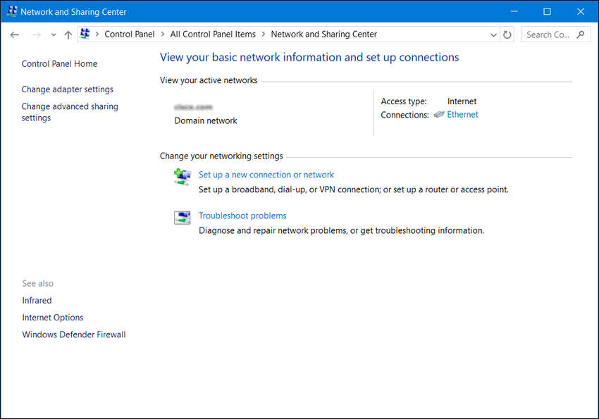
</div><br />

En la vista inicial, se ve un panorama general de la red activa. Esta vista permite ver si hay acceso a Internet y si la red es privada, pública o para invitados. También se ve el tipo de red (por cable o inalámbrica). Desde esta ventana, es posible ver el Grupo Hogar al que pertenece la computadora o crear uno si todavía no forma parte de uno. Esta herramienta también puede usarse para cambiar la configuración del adaptador o la configuración de uso compartido avanzado, establecer una nueva conexión o solucionar problemas. Tenga en cuenta que se eliminó HomeGroup de Windows 10 en la versión 1803.

__Cambiar configuración del adaptador__
Para configurar un adaptador de red, es necesario seleccionar __Cambiar configuración del adaptador__ en centro de redes y recursos compartidos a fin de ver todas las conexiones de red que están disponibles. Seleccione el adaptador que desea configurar. En este caso, cambiamos un adaptador Ethernet para adquirir su dirección IPv4 automáticamente de la red.
* Propiedades de acceso del adaptador. pulse con el botón derecho en el adaptador que desee configurar y seleccione Propiedades, como se ve en la Figura.

<div style="width: 70%;padding-left: 15%;">
	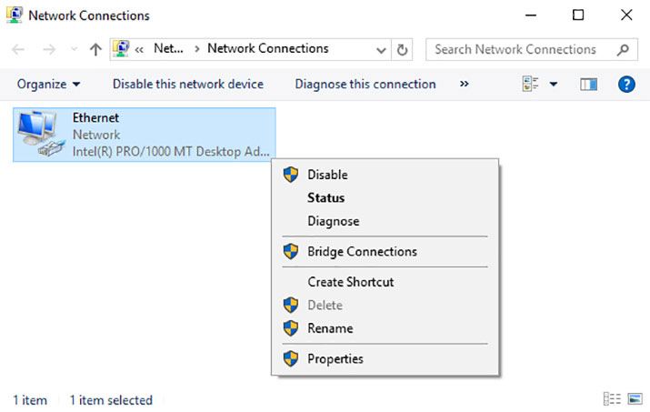
</div><br />

* Acceso a las propiedades de TCP/IPv4. Esta conexión utiliza Protocolo de internet versión 4 (TCP/IPv4) o Protocolo de internet versión 6 (TCP/IPv6) depende de la versión que el usuario desee utilizar. En la figura, IPv4 se está seleccionando.

<div style="width: 70%;padding-left: 25%;">
	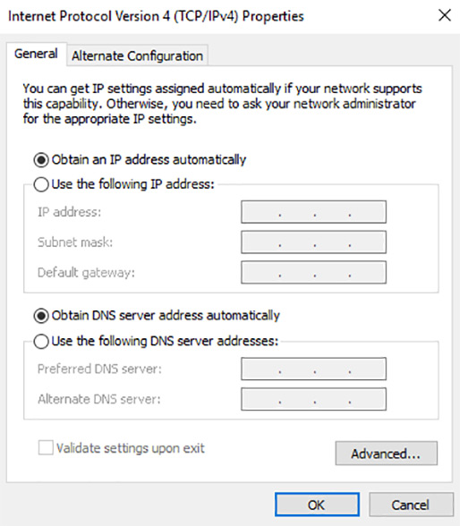
</div><br />

* Cambiar la configuración. pulse en Propiedades para configurar el adaptador. En el cuadro de diálogo Propiedades mostrado en la figura, puede optar por Obtener una dirección automáticamente si hay un servidor DHCP disponible en la red. Si desea configurar la dirección manualmente, puede completar la dirección, subred, puerta de enlace predeterminada y los servidores DNS para configurar el adaptador. pulse en Aceptar para aplicar los cambios. También puede usar la herramienta netsh.exe para configurar los parámetros de red desde una petición de ingreso de comando. Este programa permite ver y modificar la configuración de red. Escriba netsh /? en el command prompt para ver una lista de todos los modificadores que puede utilizar con este comando.

<div style="width: 70%;padding-left: 25%;">
	
</div><br />

**_nslookup_ y _netstat_**

Sistema de Nombres de Dominio (DNS) debe ser probado por que es esencial para encontrar la dirección de los hosts traduciéndola de un nombre, a una URL. Use el comando `nslookup` para probar el DNS. Escriba `nslookup cisco.com` en el command prompt para encontrar la dirección del servidor web de Cisco. Si se devuelve la dirección, significa que el DNS funciona correctamente. También es posible comprobar qué puertos están abiertos, donde están conectados y cuál es su estado actual. Escriba en _netstat_ la línea de comando para ver los detalles de las conexiones de red activas, como se muestra en la salida del comando. Más adelante en este capítulo, el comando _netstat_ se analizará en más detalle.

```shell
C:∖Users∖USER>netstat
Active Connections
  Proto     Local Address        Foreign Address     State
  TCP     127.0.0.1:3030        USER-VGFFA:58652   ESTABLISHED
  TCP     127.0.0.1:3030        USER-VGFFA:62114   ESTABLISHED
  TCP     &127.0.0.1:3030       USER-VGFFA:62480   TIME_WAIT
  TCP     127.0.0.1:3030        USER-VGFFA:62481   TIME_WAIT
  TCP     127.0.0.1:3030        USER-VGFFA:62484   TIME_WAIT
```

## Accediendo a Recursos de Red
Al igual que otros sistemas operativos, Windows utiliza una red para varias aplicaciones diferentes, como web, correo electrónico y servicios de archivo. Microsoft ayudó en el desarrollo del protocolo bloque de mensajes del servidor (SMB, Server Message Block), originalmente diseñado por IBM, para compartir recursos de red. Principalmente, SMB se utiliza para tener acceso a archivos de hosts remotos. Para conectar recursos, se utiliza el formato de convención de nomenclatura universal (UNC, _Universal Naming Convention_), por ejemplo:

__\servernamesharenameile__

En la UNC, servername es el servidor que aloja el recurso. Puede ser un nombre de DNS, un nombre de NetBIOS o, simplemente, una dirección IP. El elemento sharename corresponde a la raíz de la carpeta del sistema de archivos en el host remoto, mientras que file es el recurso que el host local intenta encontrar. Es posible que el archivo se encuentre en un nivel más profundo en el sistema de archivos, y es necesario indicar esta jerarquía.

Al compartir recursos en la red, se deberá identificar el área del sistema de archivos que se compartirá. Es posible aplicar el control de acceso a las carpetas y archivos para limitar a usuarios y grupos a funciones específicas, tales como leer, escribir o denegar. Windows también crea recursos compartidos especiales automáticamente. Estos recursos compartidos se denominan recursos compartidos administrativos. Un recurso compartido administrativo se identifica con el signo de dólar (`$`) que aparece después de su nombre. Cada volumen de disco tiene un recurso compartido administrativo, representado por la letra de volumen y el signo `$` (por ejemplo, `C$`, `D$` o `E$`). La carpeta de instalación de Windows se comparte como `admin$`, la carpeta de impresoras se comparte como `print$`, y hay otros recursos compartidos administrativos que se pueden conectar. Solamente los usuarios con privilegios administrativos pueden acceder a estos recursos compartidos.

La manera más sencilla de conectarse a un recurso compartido es escribir su UNC en el explorador de archivos de Windows, en el cuadro en la parte superior de la pantalla, donde se ve la ruta de navegación de la ubicación actual del sistema de archivos. Cuando Windows intenta conectarse al recurso compartido, solicita las credenciales para tener acceso a los recursos. Recuerde que, dado que el recurso está en una computadora remota, las credenciales deben ser las de la computadora remota, no las de la computadora local.

Además de acceder a recursos compartidos en hosts remotos, también puede iniciar sesión en un host remoto y manipular esa computadora, como si fuera local, para realizar cambios de configuración, instalar software o solucionar un problema. En Windows, esta función se conoce como Protocolo de escritorio remoto (Remote Desktop Protocol, RDP). Al investigar incidentes de seguridad, un analista de seguridad suele usar el RDP para tener acceso a computadoras remotas. Para iniciar el RDP y conectarse a una computadora remota, busque “escritorio remoto” y pulse en la aplicación. En la figura, se ve la ventana Conexión a escritorio remoto.

Debido a que RDP está diseñado para permitir a los usuarios remotos controlar hosts individuales, es un objetivo natural para los actores de amenazas. Se debe tener cuidado al activar RDP, especialmente en versiones heredadas sin parches de Windows, como las que todavía se encuentran en los sistemas de control industrial. Se debe tener cuidado para limitar la exposición de RDP a Internet, y se deben usar enfoques de seguridad y políticas de control de acceso, como Zero Trust, para limitar el acceso a hosts internos.

<div style="width: 70%;padding-left: 25%;">
	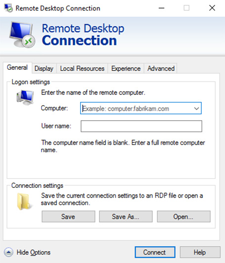
</div><br />

## Windows Server
La mayoría de las instalaciones de Windows se realizan como instalaciones de escritorio en equipos de escritorio y portátiles. En centros de datos se utiliza principalmente otra versión de Windows: Windows Server. Se trata de una familia de productos de Microsoft que empezó con Windows Server 2003. Windows Server aloja muchos servicios diferentes y puede cumplir diferentes roles dentro de una empresa.

Nota: Aunque hay un Windows Server 2000, se considera una versión de cliente de Windows NT 5.0. Windows Server 2003 es un servidor basado en NT 5.2 y es el precursor de una nueva familia de versiones de Windows Server.

Estos son algunos de los servicios que provee Windows Server:
* __Servicios de red__. DNS, DHCP, Terminal Services, controladora de red y virtualización de red en Hyper-V
* __Servicios de archivo__. SMB, NFS y DFS
* __Servicios web__. FTP, HTTP y HTTPS
* __Administración__. Política de grupo y control de servicios de dominio de Active Directory

## Lab - Crear cuentas de usuario
En esta práctica de laboratorio crearán y modificarán cuentas de usuario en Windows.
* <a href="./notes/lab_crear_cuentas_usuario.md" target="_blank">Crear cuentas de usuario</a>

## Lab - Utilizando el PowerShell de Windows
En este laboratorio, explorará algunas de las funciones de PowerShell.
* <a href="./notes/windows_powershell.md" target="_blank">Utilizando el PowerShell de Windows</a>

## Lab - Administrador de Tareas de Windows
* <a href="./notes/lab_win_task_manager.md" target="_blank">Administrador de Tareas de Windows</a>

## Lab - Monitorear y adminitstrar recursos del sistema en Windows
* <a href="./notes/lab_monitor_admin_recursos_win.md" target="_blank">Monitorear y adminitstrar recursos del sistema en Windows</a>

# Seguridad de Windows
## El comando netstat
Cuando hay malware en una computadora, suele abrir puertos de comunicación en el host para enviar y recibir datos. El comando `netstat` puede usarse para buscar conexiones entrantes o salientes no autorizadas. Cuando se usa solo, el comando `netstat` permite ver todas las conexiones de TCP activas disponibles.

Al analizar estas conexiones, es posible determinar cuál de los programas está activado para escuchar conexiones no autorizadas. Cuando se cree que un programa puede ser malware, se puede investigar un poco para determinar su legitimidad. Después, el proceso se puede deshabilitar con el Administrador de tareas y es posible usar software de eliminación de malware para limpiar la computadora.

Para facilitar este proceso, es posible vincular las conexiones con los procesos en ejecución en el Administrador de tareas. Para hacer esto, abra un command prompt con privilegios administrativos y use el `netstat -abno` comando , como se muestra en la salida del comando.

```shell
Microsoft Windows [Version 10.0.18363.720]
(c) 2019 Microsoft Corporation. All rights reserved.
C:∖WINDOWS∖system32> netstat -abno
Active Connections
   Proto   Local Address         Foreign Address           State           PID
   TCP     0.0.0.0:80               0.0.0.0:0             LISTENING         4
 Can not obtain ownership information
   TCP     0.0.0.0:135              0.0.0.0:0             LISTENING        952
   RpcSs
 [svchost.exe]
   TCP     0.0.0.0:445              0.0.0.0:0             LISTENING        4
 Can not obtain ownership information
   TCP     0.0.0.0:623              0.0.0.0:0             LISTENING        14660
 [LMS.exe]
   TCP     0.0.0.0:3389             0.0.0.0:0             LISTENING        1396
   TermService
 [svchost.exe]
   TCP     0.0.0.0:5040             0.0.0.0:0             LISTENING        9792
   CDPSvc
 [svchost.exe]
   TCP     0.0.0.0:5357             0.0.0.0:0             LISTENING        4
 Can not obtain ownership information
   TCP     0.0.0.0:5593             0.0.0.0:0             LISTENING        4
 Can not obtain ownership information
   TCP     0.0.0.0:8099             0.0.0.0:0             LISTENING       5248
 [SolarWinds TFTP Server.exe]
   TCP     0.0.0.0:16992            0.0.0.0:0             LISTENING       14660
```

__Nota__: Si no está en modo administrador, aparecerá el mensaje "La operación solicitada requiere elevación". Busque el _Command Prompt_. Pulse con el botón derecho del ratón en el programa __Command Prompt__ y pulse en __Ejecutar como administrador__.

Al examinar las conexiones de TCP activas, un analista debe ser capaz de determinar si hay programas sospechosos que escuchan conexiones entrantes en el host. También es posible rastrear este proceso hasta el Administrador de tareas de Windows y cancelarlo. Puede haber más de un proceso con el mismo nombre. Si este es el caso, observe el PID para encontrar el proceso correcto. Cada proceso que se ejecuta en la computadora tiene un PID único. Para ver los PID de los procesos en el __Administrador de tareas__, ábralo, pulse con el botón derecho en el encabezado de la tabla y seleccione __PID__.

## Visor de Eventos
El Visor de eventos de Windows registra el historial de eventos del sistema, de aplicaciones y de seguridad. Estos archivos de registro constituyen una valiosa herramienta de resolución de problemas, debido a que proporcionan información necesaria para identificar un problema. Para abrir el Visor de eventos, búsquelo y pulse en el icono del programa, como se muestra en la figura.

<div style="width: 70%;padding-left: 25%;">
	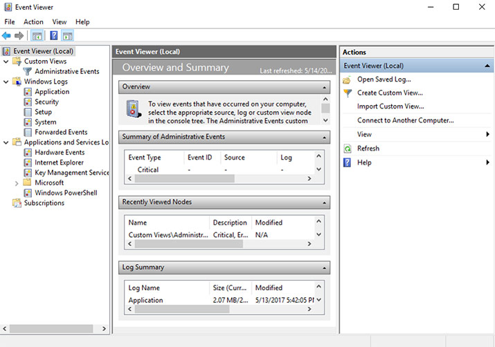
</div><br />

Windows incluye dos categorías de registros de eventos: registros de Windows y registros de aplicaciones y servicios. Cada una de estas categorías tiene varios tipos de registros. Los eventos que aparecen en estos registros tienen un nivel: información, advertencia, error o crítico. También tienen la fecha y hora en que se produjo el evento, junto con su origen y un identificador relacionado con el tipo de evento.

También es posible crear una vista personalizada. Esto resulta útil para buscar determinados tipos de eventos, encontrar eventos que sucedieron durante un período específico, visualizar eventos de un determinado nivel, y muchos otros criterios. Hay una vista personalizada incorporada que se denomina Eventos administrativos e incluye todos los eventos críticos, de error y de advertencia de todos los registros administrativos. Esta vista es un buen lugar para empezar cuando se intenta resolver un problema.

Los registros de sucesos de seguridad se encuentran en Registros de Windows. Utilizan ID de evento para identificar el tipo de evento.

## Administración de Actualizaciones de Windows
Ningún software es perfecto, y el sistema operativo Windows no es la excepción. Los atacantes están ideando siempre nuevas maneras de poner en riesgo computadoras y usar código malicioso. Algunos de estos ataques se producen tan rápidamente que las defensas contra ellos aún no han sido concebidas y distribuidas. Son los llamados ataques de día cero. Los desarrolladores de software de Microsoft y de seguridad intentan constantemente adelantarse a los atacantes, pero no siempre lo logran. Para garantizar el máximo nivel de protección contra estos ataques, siempre es necesario asegurarse de que Windows esté actualizado con los paquetes de servicio y parches de seguridad más recientes.

Los parches son actualizaciones de códigos que proporcionan los fabricantes para evitar que un virus o gusano recientemente descubierto logre atacar con éxito. Periódicamente, los fabricantes combinan parches y actualizaciones en una aplicación de actualización integral denominada paquete de servicios. Numerosos ataques de virus devastadores podrían haber sido mucho menos graves si más usuarios hubieran descargado e instalado el último paquete de servicios. Es muy deseable que las empresas utilicen sistemas que distribuyan, instalen y realicen un seguimiento automático de las actualizaciones de seguridad.

Windows verifica sistemáticamente el sitio web de Windows Update en busca de actualizaciones de alta prioridad que ayuden a proteger un equipo de las amenazas de seguridad más recientes. Estas actualizaciones incluyen actualizaciones de seguridad, actualizaciones críticas y paquetes de servicios. Según la configuración seleccionada, Windows descarga e instala automáticamente todas las actualizaciones de alta prioridad que la PC necesita, o notifica al usuario que dichas actualizaciones están disponibles. Para configurar los ajustes de actualización de Windows, busque Windows Update y pulse en la aplicación.

El estado de actualización, que se muestra en la figura, le permite buscar actualizaciones manualmente y ver el historial de actualizaciones de la computadora.

<div style="width: 70%;padding-left: 25%;">
	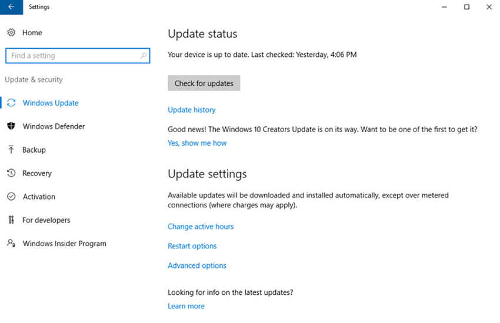
</div>

También hay opciones para no permitir que la computadora se reinicie en determinados horarios, por ejemplo, durante el horario laboral. Además, es posible elegir cuándo reiniciar la computadora después de una actualización con las opciones de reinicio (si es necesario). Las opciones avanzadas también están disponibles para elegir cómo se instalan las actualizaciones y cómo se actualizan otros productos de Microsoft.

## Política de Seguridad Local
Una política de seguridad es un conjunto de objetivos de seguridad que garantiza la seguridad de una red, los datos y los sistemas informáticos en una organización. La directiva de seguridad es un documento en constante evolución según los cambios tecnológicos, negocios, y los requisitos de los empleados.

En la mayoría de las redes que usan computadoras Windows, Active Directory se configura con los dominios en un servidor Windows. Las computadoras con Windows se unen al dominio. El administrador configura una política de seguridad de dominio que se aplica a todas las computadoras que se unen al dominio. Las políticas de cuentas se configuran automáticamente cuando un usuario inicia sesión en una computadora que es miembro de un dominio. La herramienta __Directiva de seguridad local__ (_Local Security Policy_) de Windows, que se ve en la figura, se puede utilizar para las computadoras independientes que no forman parte de un dominio de Active Directory. Para abrir el applet __Directiva de seguridad local__, busque “directiva de seguridad local” y pulse en el programa.

<div style="width: 70%;padding-left: 25%;">
	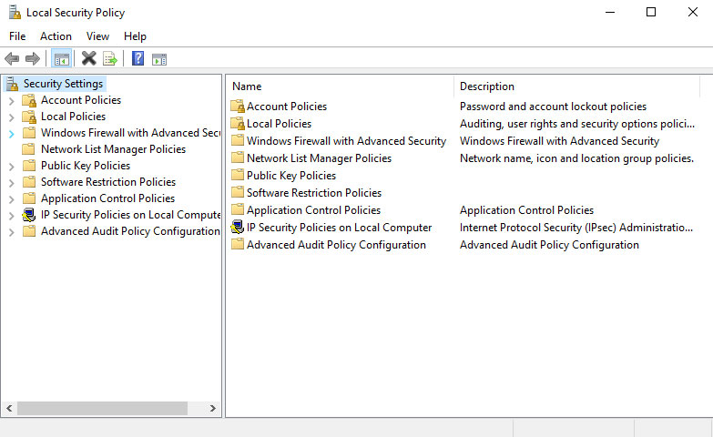
</div><br />

Las pautas para crear contraseñas son un componente importante de las políticas de seguridad. Todo usuario que deba iniciar sesión en una PC o conectarse a un recurso de red debe tener una contraseña. Las contraseñas ayudan a impedir el robo de datos y las acciones malintencionadas. Las contraseñas también ayudan a confirmar que el registro de eventos es válido al garantizar que el usuario es la persona que dice ser. En __Directiva de seguridad local__, la política de contraseñas se encuentra en __Directivas de cuenta__ (_Accounts Policies_) y define los criterios para las contraseñas para todos los usuarios en la computadora local.

Utilice la Directiva de bloqueo de cuenta en Directivas de cuenta para evitar los intentos de inicio de sesión forzosos. Por ejemplo, puede configurar la política para permitir que el usuario ingrese un nombre de usuario y / o contraseña incorrectos cinco veces. Después de cinco intentos, la cuenta queda bloqueada por 30 minutos. Después de 30 minutos, la cantidad de intentos se restablece a cero y el usuario puede intentar iniciar sesión nuevamente.

Es importante asegurar que las computadoras estén protegidas cuando los usuarios no las utilizan. Las políticas de seguridad deben incluir una regla que exija que la PC se bloquee al activarse el protector de pantalla. Esto asegura que, cuando el usuario se aleja de la PC durante un período breve, se active el protector de pantalla, y no pueda utilizarse la PC hasta que el usuario inicie sesión.

Si la configuración de Directiva de seguridad local en cada computadora independiente es la misma, es necesario usar la función de Directiva de exportación. Guarde la política con un nombre, como workstation.inf. Luego, copie el archivo de la política a un medio de almacenamiento externo o una unidad de red para utilizarlo en otras computadoras independientes. Esto es especialmente útil si el administrador debe configurar directivas locales extensas para los derechos de usuario y las opciones de seguridad.

El applet __Directiva de seguridad local__ contiene muchas otras configuraciones de seguridad que se aplican específicamente a la computadora local. Puede configurar derechos de usuario, reglas de firewall y hasta la capacidad de limitar la cantidad de archivos que los usuarios o grupos pueden ejecutar con __AppLocker__.

## Windows Defender
El malware incluye virus, gusanos, troyanos, registradores de teclado, spyware y adware. Estos están diseñados para invadir la privacidad, robar información y dañar la computadora o los datos. Es importante que proteja las computadoras y los dispositivos móviles mediante un software antimalware reconocido. Los siguientes tipos de software antimalware se encuentran disponibles:
* __Protección antivirus de próxima generación__. Este programa monitorea continuamente en busca de virus. Cuando se detecta un virus, se advierte al usuario y el programa intenta eliminar el virus o ponerlo en cuarentena.
* __Protección contra programas publicitarios__. Este programa busca constantemente programas que muestran anuncios publicitarios en la computadora.
* **Protección contra suplantación de identidad (_phishing_)**. Este programa bloquea las direcciones IP de sitios web conocidos por realizar suplantación de identidad y advierte al usuario acerca de sitios sospechosos.
* **Protección contra _spyware_**. El programa busca registradores de teclado y otro tipo de _spyware_.
* __Fuentes confiables / no confiables__. Este programa le advierte si está por instalar programas inseguros o visitar sitios web inseguros.

Es posible que deban utilizarse muchos programas distintos y que deban realizarse varios análisis para eliminar completamente todo el software malintencionado. Ejecute solo un programa de protección contra malware a la vez.

Varias organizaciones con experiencia en seguridad, como McAfee, Symantec y Kaspersky, ofrecen protección contra malware integral para computadoras y dispositivos móviles. Windows tiene protección antivirus y antispyware incorporada llamada Windows Defender, como se muestra en la figura. Windows Defender está activado de forma predeterminada para proporcionar protección en tiempo real contra infecciones.

<div style="width: 70%;padding-left: 25%;">
	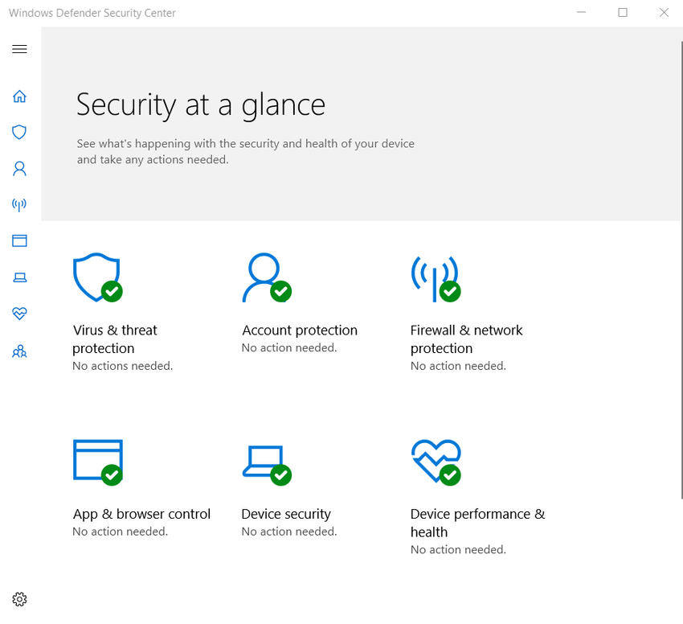
</div><br />

Para abrir _Windows Defender_, búsquelo y pulse en el programa. Aunque _Windows Defender_ funciona en segundo plano, es posible realizar análisis manuales de la computadora y los dispositivos de almacenamiento. También puede actualizar manualmente las definiciones de virus y spyware en la pestaña __Actualizar__. Además, si desea ver todos los elementos que se detectaron durante análisis anteriores, puede hacer clic en la pestaña __Historial__.

## Firewall de Windows Defender
Un firewall deniega selectivamente el tráfico a una PC o a un segmento de red. Los firewalls suelen actuar abriendo y cerrando los puertos que utilizan diversas aplicaciones. Al abrir solo los puertos requeridos en un firewall, se implementa una política de seguridad restrictiva. Se rechaza todo paquete que no esté explícitamente permitido. En cambio, una política de seguridad permisiva permite el acceso a través de todos los puertos, excepto aquellos que estén explícitamente denegados. En el pasado, el software y el hardware venían con una configuración permisiva. Como los usuarios no tenían la precaución de configurar los equipos, la configuración permisiva predeterminada dejaba muchos dispositivos expuestos a atacantes. Actualmente, si bien la mayoría de los dispositivos vienen con una configuración altamente restrictiva, permiten una fácil configuración.

Para permitir el acceso al programa a través del Firewall de Windows Defender, busque __Paneles de control__. En __Sistemas y seguridad__, busque __Firewall de Windows Defender__. Haga clic en __Permitir una aplicación o una función a través del Firewall de Windows Defender__, como se muestra en la figura.

Si desea utilizar otro firewall de software, deberá deshabilitar el Firewall de Windows. Para deshabilitar el firewall de Windows, haga clic en __Activar o desactivar Firewall de Windows__.

Se pueden encontrar muchas configuraciones adicionales en __Configuración avanzada__. Aquí puede crear reglas de tráfico entrante o saliente según diferentes criterios. También puede importar y exportar políticas o monitorear diferentes aspectos del firewall.

<div style="width: 70%;padding-left: 25%;">
	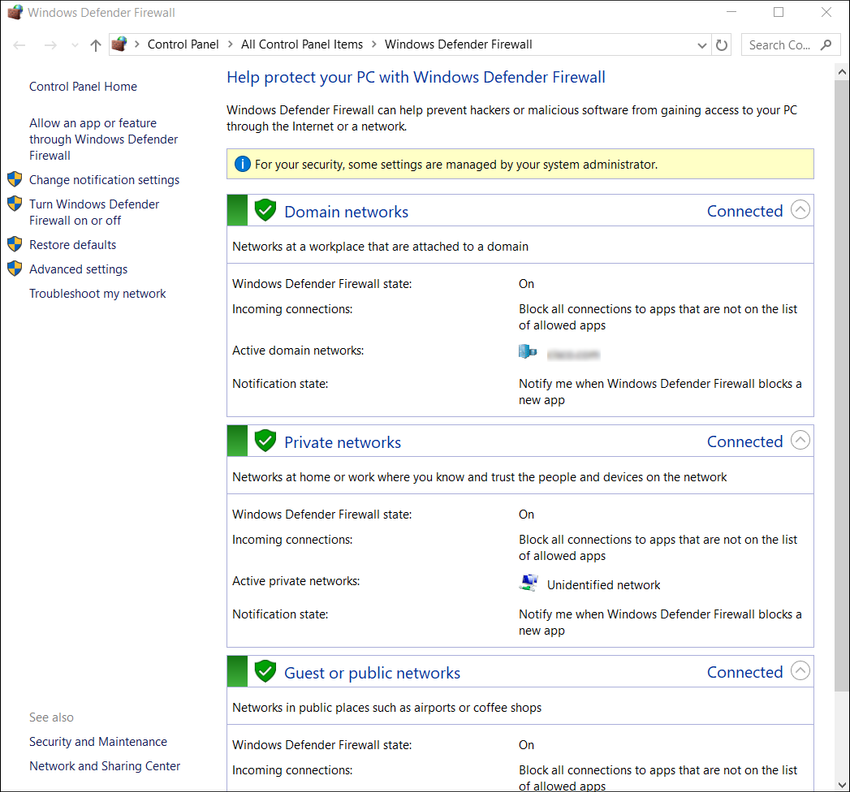
</div>

# Resumen
## Historia de Windows
Los primeros equipos necesitaban un sistema operativo de disco (DOS) para crear y administrar archivos. Microsoft desarrolló MS-DOS como una interfaz de línea de comandos (CLI) para acceder a la unidad de disco y cargar los archivos del sistema operativo. Las primeras versiones de Windows constaban de una interfaz gráfica de usuario (GUI) que se ejecutaba en MS-DOS. Sin embargo, las versiones modernas de Windows controlan directamente la computadora y su hardware y admiten múltiples procesos de usuario. Esto es muy diferente del proceso individual de un solo usuario de MS-DOS. Desde el año 1993 hubo más de 20 versiones de Windows basadas en el sistema operativo NT. Los usuarios utilizan una GUI de Windows para trabajar con archivos de datos y software. La GUI tiene un área principal que se conoce como escritorio y una barra de tareas situada debajo del escritorio. La barra de tareas incluye el menú Inicio, elementos de inicio rápido y área de notificaciones. Windows tiene muchas vulnerabilidades. Las recomendaciones para proteger el sistema operativo Windows incluyen el uso de protección contra virus o malware, el uso de contraseñas seguras, el uso de firewall y el uso limitado de la cuenta de administrador, entre otras.

## Arquitectura y Operaciones de Windows
Windows consta de una capa de abstracción de hardware (Hardware Abstraction Layer, HAL) que es un software que maneja toda la comunicación entre el hardware y el kernel. El núcleo tiene control sobre toda la computadora y maneja las solicitudes de entrada y salida, la memoria y todos los periféricos conectados a la computadora. Windows funciona en dos modos diferentes. El primero es el modo de usuario. Muchos programas de Windows se ejecutan en modo usuario El segundo es el modo kernel. Permite el acceso directo del código del sistema operativo al hardware del ordenador. Windows admite varios sistemas de archivos diferentes, pero NTFS es el más utilizado. Los volúmenes NTFS incluyen el sector de arranque de partición, la tabla maestra de archivos, los archivos del sistema y el área de archivos. Cuando un equipo arranca, primero accede a la información del sistema y al código que se almacena en el hardware del BIOS. El código de arranque del BIOS realiza una prueba del sistema denominada POST, localiza y carga el sistema operativo Windows y carga otros programas asociados para iniciar el sistema operativo. Windows siempre debe estar apagado correctamente.

Una computadora funciona almacenando las instrucciones en la memoria RAM hasta que la CPU las procesa. Cada proceso en una computadora con Windows de 32 bits admite un espacio para la dirección postal virtual que hace posible manipular hasta 4 GB. Cada proceso de una computadora con Windows de 64 bits admite un espacio de direcciones virtuales de hasta 8 terabytes. Windows almacena toda la información sobre el hardware, las aplicaciones, los usuarios y la configuración del sistema en una extensa base de datos conocida como el Registro. El registro es una base de datos jerárquica donde el nivel más alto se conoce como subárbol, debajo están las claves y, luego, las subclaves. Hay cinco colmenas de registro que contienen datos respecto a la configuración y el funcionamiento de Windows. Hay cientos de claves y subclaves.

## Configurración y monitoreo de Windows
Por razones de seguridad, no es recomendable iniciar sesión en Windows utilizando la cuenta de administrador o una cuenta con privilegios administrativos. No otorgue privilegios administrativos a los usuarios estándar. No habilite la cuenta Invitados a menos que el equipo vaya a ser utilizado por muchas personas diferentes que no tienen cuentas. Utilice grupos de Windows para facilitar la administración de usuarios. Los usuarios y grupos locales se administran con el applet del panel de control lusrmgr.msc.

Puede utilizar la CLI o Windows PowerShell para ejecutar comandos. PowerShell se puede utilizar para crear scripts para automatizar tareas que la CLI normal no puede automatizar. Windows Management Instrumentation (WMI) se utiliza para administrar computadoras remotas. El comando net puede ir seguido de muchos otros comandos, que pueden combinarse con cambios para concentrarse en resultados específicos. El Administrador de Tareas provee mucha información sobre lo que se está ejecutando y el rendimiento en general de la computadora. El Monitor de recursos provee información detallada acerca del uso de recursos El Centro de Redes y Recursos Compartidos es utilizado para configurar la propiedades de las redes de Windows y probar las configuraciones de la red. El protocolo de bloqueo de mensaje del servidor (SMB) se utiliza para compartir recursos de la red como archivos en dispositivos remotos. Para conectar recursos se utiliza el formato Convención de nomenclatura universal (UNC). Windows Server es una edición de Windows que es usada principalmente en centros de datos. Proporciona servicios de red, archivos, web y administración a una red o dominio de Windows.

## Seguridad de Windows
El malware puede abrir puertos de comunicación para comunicarse y propagarse. El comando netstat de Windows muestra todos los puertos de comunicación abiertos en un equipo y también puede mostrar los procesos de software asociados con los puertos. Esto permite identificar y apagar el software potencialmente malicioso desconocido. El Visor de sucesos de Windows proporciona acceso a numerosos eventos registrados en relación con el funcionamiento de un equipo. Windows registra eventos de Windows y eventos de aplicaciones y servicios. Los niveles de gravedad de eventos registrados varían a través de los niveles de información, advertencia, error o niveles críticos. Es muy importante mantener Windows actualizado para protegerse contra nuevas amenazas de seguridad. Los parches de software, las actualizaciones y los paquetes de servicios abordan las vulnerabilidades de seguridad a medida que se descubren. Windows debe configurarse para que descargue e instale automáticamente las actualizaciones a medida que estén disponibles. Windows se puede configurar para que solo instale y reinicie un equipo a las horas especificadas del día.

## Enlaces de interés
1. <a href="./notes/mace_timestamps.md" target="_blank">MACE Timestamps</a>
2. <a href="https://uefi.org/" target="_blank">Unified Extensible Firmware Interface Forum</a>
3. <a href="" target="_blank"></a>
4. <a href="" target="_blank"></a>
5. <a href="" target="_blank"></a>
6. <a href="" target="_blank"></a>
7. <a href="" target="_blank"></a>
8. <a href="" target="_blank"></a>
9. <a href="" target="_blank"></a>
<br />
<br />
<br />
<a href="#7-el-sistema-operativo-windows">⬆️</a>
<a href="./00-Curso.md"><< Menú principal del módulo</a>