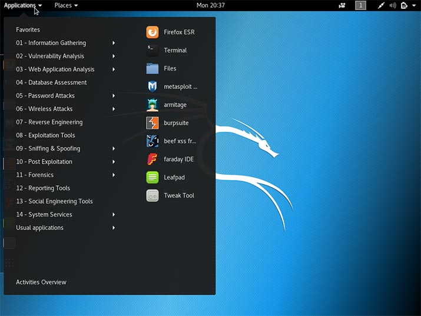
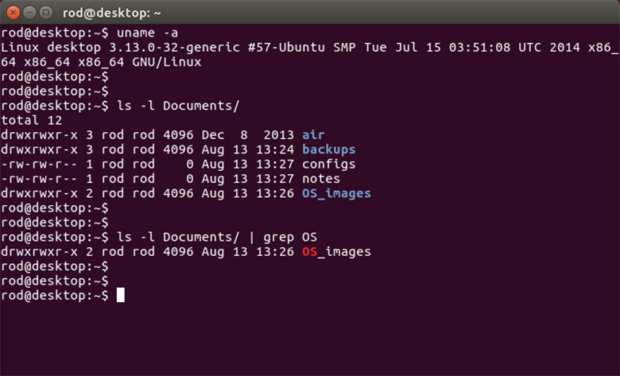
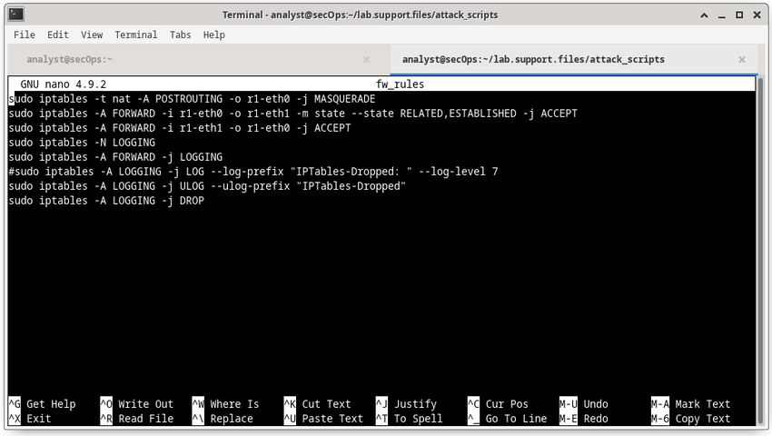
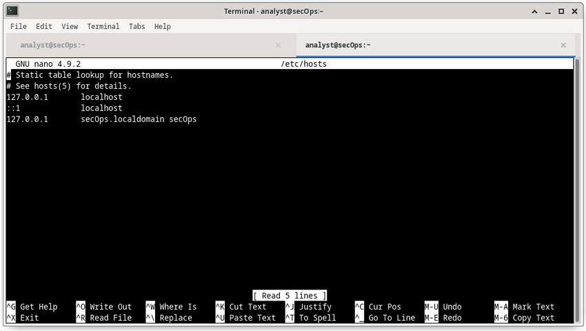
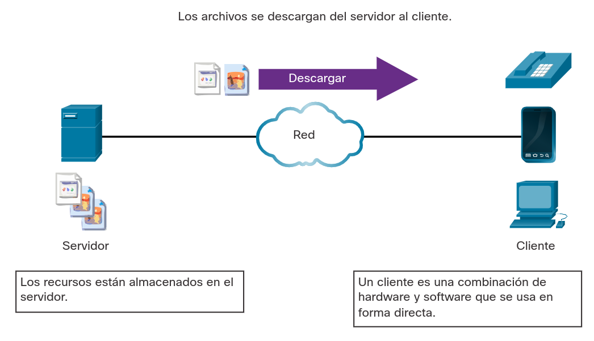
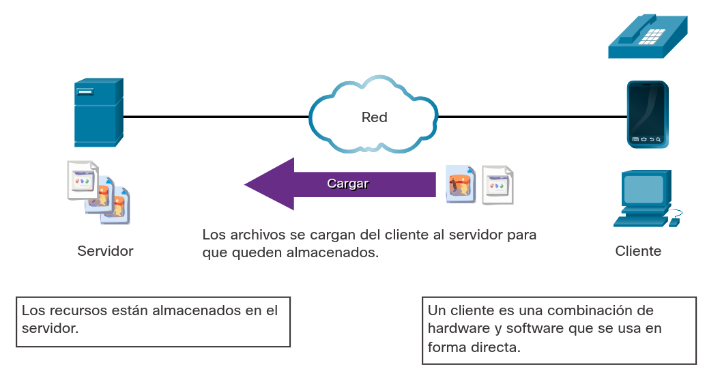
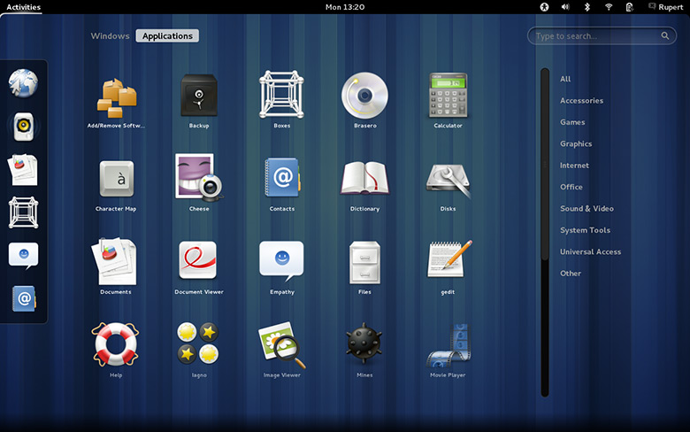
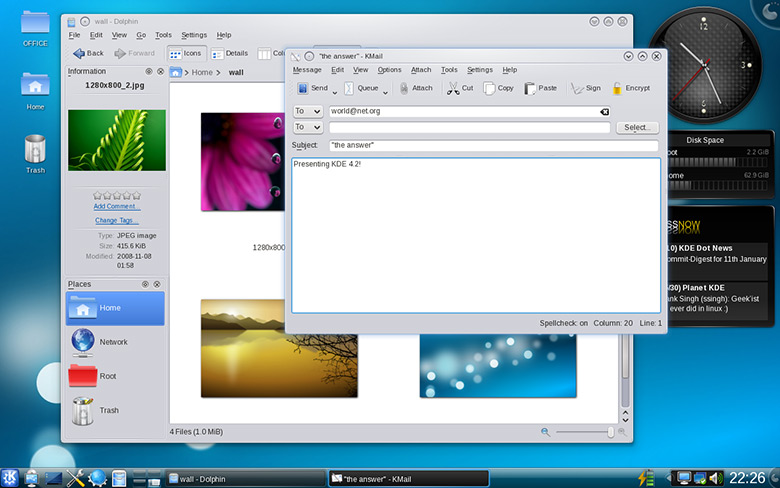
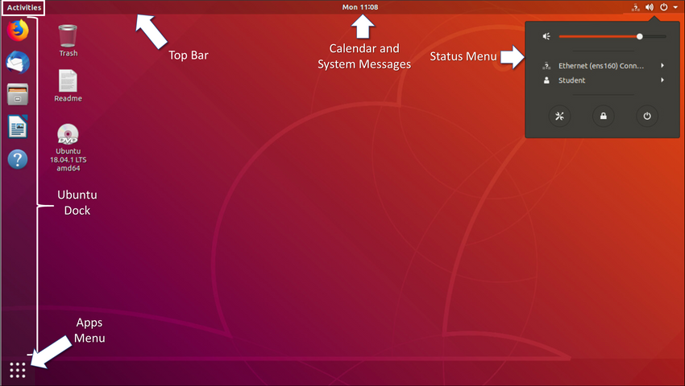

<a href="./00-Curso.md"><< Menú principal del módulo</a>

# 8. Descripción general de Linux
# Nociones básicas de Linux
## ¿Qué es Linux?
Linux es un sistema operativo creado en 1991. Linux es de código abierto, rápido, confiable y pequeño. Requiere muy pocos recursos de hardware para ejecutarse y tiene muchas opciones para ser personalizado. A diferencia de otros sistemas operativos, como Windows y Mac OS X, Linux fue creado por una comunidad de programadores que actualmente lo mantiene vigente. Linux es parte de varias plataformas y puede encontrarse en cualquier tipo de dispositivo, desde relojes a supercomputadoras.

Otro aspecto importante de Linux es que está diseñado para conectarse a la red, lo que facilita mucho la escritura y el uso de aplicaciones con base en la red. Dado que Linux es de código abierto, cualquier persona o empresa puede obtener el código fuente del kernel, examinarlo, modificarlo y volver a compilarlo cuando lo desean. También pueden redistribuir el programa con o sin costo.

Una distribución de Linux es el término que se utiliza para describir paquetes creados por distintas organizaciones. Las distribuciones de Linux (o distros) incluyen el kernel de Linux con herramientas y paquetes de software personalizados. Si bien algunas de estas organizaciones pueden cobrar el soporte de su distribución de Linux (orientado a empresas con base en Linux), la mayoría también ofrece la distribución gratis sin soporte. Debian, Red Hat, Ubuntu, CentOS y SUSE son solo algunos ejemplos de distribuciones de Linux.

## El valor de Linux
Linux es, a menudo, el sistema operativo elegido en el centro de operaciones de seguridad (SOC - _Security Operation Center_). Estos son algunos de los motivos para elegir Linux:

* __Linux es de código abierto__. Cualquier persona puede adquirir Linux sin cargo y modificarlo según sus necesidades específicas. Esta flexibilidad les permite a analistas y administradores diseñar un sistema operativo específicamente para análisis de seguridad.
* __La CLI de Linux es muy potente__. Mientras que una GUI facilita muchas tareas, agrega complejidad y requiere más recursos de la computadora para funcionar. La interfaz de línea de comandos (CLI) de Linux es extremadamente potente y permite a los analistas realizar tareas no solo directamente en la terminal sino que también de manera remota.
* __El usuario tiene más control sobre el sistema operativo__. El usuario de administrador en Linux, conocido como el usuario root o superusuario, tiene poder absoluto sobre la computadora. A diferencia de otros sistemas operativos, el usuario root puede modificar cualquier aspecto de la computadora con unas pocas pulsaciones de teclas. Esta capacidad resulta especialmente útil cuando se trabaja con funciones de niveles inferiores, como la pila de red. Le permite al usuario root tener un control preciso sobre la manera en que el sistema operativo maneja los paquetes de red.
* __Permite mejorar el control de comunicación de la red__. El control es inherente a Linux. Debido a que es posible ajustar el sistema operativo en cualquier aspecto, es una gran plataforma para crear aplicaciones de red. Por este mismo motivo, muchas excelentes herramientas de software con base en la red están disponibles únicamente en Linux

## Linux en el SOC
La flexibilidad que proporciona Linux es una característica grandiosa para el SOC. Todo el sistema operativo se puede adaptar para convertirlo en la plataforma perfecta de análisis de seguridad. Por ejemplo, los administradores pueden agregar al sistema operativo solamente los paquetes necesarios para hacerlo rápido y eficiente. Es posible instalar y configurar herramientas de software específicas para trabajar en conjunto, lo que les permite a los administradores crear una computadora personalizada que se adapta perfectamente al flujo de trabajo de un SOC.

La figura muestra Sguil, que es la consola de analista de ciberseguridad en una versión especial de Linux llamada Cebolla de Seguridad. La Cebolla de Seguridad es un conjunto de herramientas de código abierto que trabajan juntas para el análisis de seguridad de red.

<div style="width: 50%;padding-left: 20%;">
	
</div>

A continuación se muestra información sobre las herramientas que a menudo se encuentran en un SOC.
* __Software de captura de paquetes__.
	* Una herramienta crucial para un analista del SOC, ya que permite observar y entender cada detalle de una transacción de la red.
	* Wireshark es una popular herramienta de captura de paquetes.
* __Herramientas de análisis de malware__. Estas herramientas permiten al analista ejecutar y observar de manera segura el funcionamiento de un malware sin poner en riesgo el sistema subyacente.
* __Sistema de detección de intrusiones (IDS)__.
	* Estas herramientas son utilizadas para el monitoreo y la inspección de tráfico en tiempo real.
	* Si cualquier aspecto del tráfico que fluye actualmente coincide con cualquiera de las reglas establecidas, se ejecuta una acción previamente definida.
* __Firewalls__. Este software se utiliza para especificar, según las reglas predefinidas, si el tráfico está permitido para entrar o salir de la red o dispositivo.
* __Administradores de registros__.
	* Los archivos de registro son usados para registrar eventos.
	* Dado que una red puede generar muchas entradas en el registro de eventos, los software de gestores de registro se emplean para facilitar el monitoreo de los registros.
* __Administración de información y eventos de segurdiad (SIEM - _Security Information and Event Management_)__. SIEM proporciona análisis en tiempo real de alertas y entradas de registro generadas por dispositivos de red, como IDSs y Firewalls
* __Sistema de tiques__. La tarea de asignación, edición y registro de tiques se realiza a través de un sistema de gestión de tiques Las alertas de seguridad a menudo se asignan a los analistas a través de un sistema de tiques.

## Herramientas de Linux
Además de herramientas específicas para el SOC, las computadoras de Linux utilizadas en el SOC suelen tener herramientas de pruebas de penetración. También conocida como PenTesting, una prueba de penetración es el proceso de atacar una red o computadora en busca de vulnerabilidades. Algunos ejemplos de herramientas de PenTesting son los generadores de paquetes, los escáneres de puertos y los ataques de prueba de concepto.

Kali Linux es una distribución de Linux agrupa muchas herramientas de penetración juntas en una sola distribución Linux. Kali contiene una amplia selección de herramientas. En la figura, se ve una captura de pantalla de Kali Linux. Observe todas las categorías principales de herramientas de pruebas de penetración.

<div style="width: 50%;padding-left: 20%;">
	
</div>

# Trabajando en la _shell_ de Linux
## El _shell_ de Linux
En Linux, el usuario se comunica con el sistema operativo mediante la CLI o GUI. Linux a menudo se inicia en la GUI de forma predeterminada. Esto oculta la CLI del usuario. Una manera de tener acceso a la CLI desde la GUI es mediante una aplicación de emulación de terminales. Estas aplicaciones permiten que el usuario tenga acceso a la CLI y, generalmente, se denominan con alguna variación de la palabra "terminal". En Linux, los emuladores de terminal comunes son `Terminator`, `eterm`, `xterm`, `konsole` y `gnome-terminal`.

Fabrice Bellard ha creado JSLinux que permite ejecutar una versión emulada de Linux en un navegador. Busque información en Internet. Abra una consola Linux en JSLinux y escriba el comando `ls` para enumerar el contenido del directorio actual. Mantenga la ficha abierta si desea probar algunos de los demás comandos que veremos en este capítulo.

En la figura, se ve _gnome-terminal_, un emulador de terminal popular de Linux.

__Nota__: Los términos _shell_, consola, ventana de la consola, terminal de la CLI y ventana del terminal suelen usarse indistintamente.

<div style="width: 50%;padding-left: 20%;">
	
</div>

## Comandos básicos
Los comandos de Linux son programas creados para realizar una tarea específica. Use el comando `man` (abreviatura de manual) para obtener documentación sobre comandos. Por ejemplo, `man ls` proporcionará documentación sobre el comando `ls` del manual del usuario incorporado en la versión que se ejecuta de Linux.

Dado que los comandos son programas almacenados en el disco, cuando un usuario escribe un comando, el _shell_ debe encontrarlo en el disco antes de poder ejecutarlo. El _shell_ busca comandos escritos por el usuario en directorios específicos e intenta ejecutarlos. La lista de directorios en la que busca el _shell_ se denomina ruta. La ruta contiene muchos directorios utilizados comúnmente para almacenar los comandos. Si un comando no está en la ruta, el usuario debe especificar su ubicación, o el _shell_ no podrá encontrarlo. Los usuarios pueden agregar fácilmente directorios a la ruta si es necesario.

Para invocar un comando en el _shell_, simplemente escriba su nombre. El _shell_ intentará encontrarlo en la ruta del sistema y lo ejecutará.

La tabla enlista comandos básicos de Linux y sus funciones.

__Comando__|__Descripción__
-|-
`mv`|Mueve o renombra archivos y directorios
`chmod`|Modifica los permisos de archivo
`chown`|Cambia la propiedad de un archivo
`dd`|Copia datos de una entrada a una salida
`pwd`|Muestra el nombre del directorio actual
`ps`|Enumera los procesos qu se estań ejecutando actualmente en el sistema
`su`|Simula un inicio de sesión como otro usuario o para convertirse en superusuario
`sudo`|Ejecuta un comando como superusuario, de forma predeterminada, u otro usuario designado
`grep`|Se utiliza para buscar cadenas específicas de caracteres dentro de un archivo o salidas de comando. Para buscar a través de la salida del comando anterior, se debe canalizar `grep` al final del comando anterior
`ifconfig`|Se utiliza para mostrar o configurar información relacionada con la tarjeta de red. Si se se emite sin parámetros, `ifconfig` mostrará la configuración actual de la(s) tarjeta(s) de red. __Nota__: Aunque todavía se usa ampliamente, este comando está en desuso. Utilice la `ip address` en su lugar.
`apt-get`|Se utiliza para instalar, configurar y elminar paquetes en Debian y sus derivados. __Nota__: `apt-get` es una interfaz de línea de comandos fácil de usar o `dpkg`, el administrador de paquetes de Debian. el combo `dpkg` y `apt-get` es el sistema de administración de paquetes predeterminado en todos los derivados de Debian Linux, incluido Raspbian.
`iwconfig`|Se utiliza para mostrar o configurar inforamción rlacionada con la tarjeta de red inalámbrica. Similar a `ifconfig`, `iwconfig` mostrará información inalḿabrica cuando se emita sin parámetros
`shutdown`|Apaga el sistema, se puede indicar a `shutdown` que realice una serie de tareas relacionadas con el apagado, que icluyen reiniciar, detener, poner en suspensión o expulsar a todos los usuarios actualmente conectados
`passwd`|Se utiliza para cambiar la contraseña. Si no se proporcionana parámetros, `passwd` cambia la contraseña del usuario actual
`cat`|Se utiliza para enumerar el contenido de un archivo y espera el nombre del archivo como parámetro. El comando `cat` generalmente se usa en archivos de texto
`man`|Se utiliza para mostrar la documentación de un comando específico


__Nota__: Se da por asumido que el usuario tiene los permisos adecuados para ejecutar el comando. Los permisos de archivos en Linux se analizan más adelante en este capítulo.

## Comandos de archivos y directorios
Muchas herramientas de línea de comando están incluidas en Linux de manera predeterminada. Para ajustar el funcionamiento del comando, los usuarios pueden añadir los parámetros y los modificadores al comando. La tabla enlista algunos de los comandos más comunes relacionados con archivos y directorios.

__Comando__|__Descripción__
-|-
`ls`|Muestra los archivos dentro de un directorio
`cd`|Cambia el directorio actual
`mkdir`|Crea un directorio bajo el directorio actual
`cp`|Copia archivos de origen y destino
`rm`|Elimina archivos

## Trabajando con archivos de texto
Linux tiene muchos editores de texto diferentes, con diversas características y funciones. Algunos editores de texto incluyen interfaces gráficas, mientras que otros son solamente herramientas de líneas de comando. Cada editor de texto incluye un conjunto de características diseñado para admitir una tarea específica. Algunos editores de texto se centran en la programación e incluyen funciones, como resaltar la sintaxis, verificación de corchetes y paréntesis y otras características orientadas a la programación.

Si bien los editores de texto gráficos son prácticos y fáciles de usar, los basados en la línea de comando son muy importantes para los usuarios de Linux. El principal beneficio de los editores de texto basados en la línea de comando es que permiten editar un archivo de texto desde una computadora remota.

Consideren el siguiente escenario: un usuario tiene que realizar tareas administrativas en una computadora con Linux pero no está frente al equipo. Entonces, utiliza SSH para iniciar una shell remota a la computadora remota. En la shell remota basada en texto, es posible que la interfaz gráfica no esté disponible y eso hace que resulte imposible trabajar con una herramienta como el editor de texto gráfico. En este tipo de situación, los programas con base en texto son cruciales.

La figura muestra __nano__, un popular editor de texto de línea de comando. El administrador está editando las reglas del firewall. Los editores de texto suelen utilizarse para la configuración del sistema y el mantenimiento en Linux.

<div style="width: 50%;padding-left: 20%;">
	
</div>

Debido a la falta de soporte gráfico, _nano_ (o GNU _nano_) se puede controlar solamente con el teclado. Por ejemplo, `<CTRL> + <O>` permite guardar el archivo actual y `<CTRL> + <W>` permite abrir el menú de búsqueda. GNU _nano_ utiliza una barra de accesos directos de dos líneas en la parte inferior de la pantalla; allí se incluyen los comandos del contexto actual. Presione `<CTRL> + <G>` para ingresar en la pantalla de ayuda y ver una lista completa de comandos.

## La importancia de los archivos de texto en Linux
En Linux, todo se trata como un archivo. Esto incluye la memoria, los discos, el monitor y los directorios. Por ejemplo, desde el punto de vista del sistema operativo, mostrar información en pantalla significa escribir en el archivo que representa el dispositivo de pantalla. No debería sorprendernos que la propia computadora esté configurada mediante archivos. Estos archivos, conocidos como archivos de configuración, suelen ser archivos de texto utilizados para almacenar ajustes y configuraciones de aplicaciones o servicios específicos. En Linux, prácticamente todo depende de archivos de configuración para funcionar. Algunos servicios no tienen solo uno, sino varios archivos de configuración.

Los usuarios con los niveles de permisos correctos pueden usar editores de texto para cambiar el contenido de los archivos de configuración. Después de realizados los cambios, se guarda el archivo que ya puede ser utilizado por el servicio o la aplicación relacionados. Los usuarios pueden especificar exactamente cómo quieren que se comporte cualquier aplicación o servicio determinado. Cuando se abren, los servicios y las aplicaciones comprueban el contenido de archivos de configuración específicos para ajustar su comportamiento en consecuencia.

En la figura, el administrador abrió el archivo de configuración host en _nano_ para editarlo. El archivo host contiene asignaciones estáticas de direcciones IP de host a nombres. Los nombres sirven como accesos directos que permiten conectarse a otros dispositivos mediante un nombre en lugar de una dirección IP. Solamente el superusuario puede cambiar el archivo host.

Nota: El administrador usó el comando `sudo nano/etc/hosts` para abrir el archivo. El comando `sudo` (abreviatura de “superuser do”, es decir, "acción del superusuario") invoca el privilegio de superusuario para usar el editor de texto nano a fin de abrir el archivo host.

<div style="width: 50%;padding-left: 20%;">
	
</div>

## Lab - Trabajando con los archivos de texto en Linux
* <a href="./notes/lab_lin_archivos_texto_cli.md" target="_blank">Trabajando con los archivos de texto en la CLI</a>

# Servidores y clientes de Linux
## Introducción a las comunicaciones entre cliente y servidor
Los servidores son computadoras con software instalado que les permite ofrecer servicios a los clientes a través de la red. Existen muchos tipos de servicios. Algunos proporcionan recursos externos a los clientes cuando lo solicitan, como archivos, mensajes de correo electrónico o páginas web. Otros servicios ejecutan tareas de mantenimiento, como la administración de registros y de la memoria, análisis de disco y mucho más. Cada servicio requiere un software de servidor independiente. Por ejemplo, el servidor en la figura utiliza un software para proporcionar al cliente la capacidad de recuperar y enviar archivos

<div style="width: 50%;padding-left: 20%;">
	
</div>

## Servidores, servicios y sus puertos
En orden para que una computadora pueda ser el servidor para múltiples servicios, se utilizan los puertos. Un puerto es un recurso de red reservado utilizado por un servicio. Se dice que un servidor “escucha” en un puerto cuando se asocia a dicho puerto.

Mientras que el administrador puede decidir qué puerto utilizar con cualquier servicio, muchos clientes están configurados para utilizar un puerto específico de manera predeterminada. Es habitual dejar el servicio ejecutándose en su puerto predeterminado. La tabla enlista algunos puertos utilizados comúnmente y sus servicios. A estos también se los denomina "puertos conocidos".

**Puerto**|**Descripción**
-|:-
20|FTP - _File Transfer Protocol_ (transferencia de datos)<sup><a href="./notes/ftp_ports.md" target="_blank">1</a><sup>
21|FTP - _File Transfer Protocol_ (comandos, control)<sup><a href="./notes/ftp_ports.md" target="_blank">1</a><sup>
22|SSH - _Secure Shell_
23|_Telnet remote login service_
25|SMTP - _Simple Mail Transfer Protocol_
53|DNS - _Domain Name System_
67|DHCP - _Dynamic Host Configuration Protocol_ (servidor DHCP)<sup><a href="./notes/dhcp_ports.md" target="_blank">2</a><sup>
68|DHCP - _Dynamic Host Configuration Protocol_ (cliente DHCP)<sup><a href="./notes/dhcp_ports.md" target="_blank">2</a><sup>
69|TFTP - _Trivial File Transfer Protocol_
80|HTTP - _Hypertext Transfer Protocol_
110|POP3 - _Post Office Protocol version 3_
123|NTP - _Network Time Protocol_
143|IMAP - _Internet Message Access Protocol_
161|SNMP - _Simple Network Management Protocol_ (puerto por defecto)<sup><a href="./notes/snmp_ports.md" target="_blank">3</a><sup>
162|SNMP - _Simple Network Management Protocol_ (notificaciones asíncronas)<sup><a href="./notes/snmp_ports.md" target="_blank">3</a><sup>
443|HTTPS - _HTTP Secure_

## Clientes
Los clientes son programas o aplicaciones cuyo objetivo es comunicarse con un tipo de servidor específico. También conocidos como aplicaciones cliente, los clientes usan un protocolo bien definido para comunicarse con el servidor. Los Navegadores Web son clientes web utilizados para comunicarse con servidores web mediante el Protocolo de Transferencia Hyper (HTTP) en el Puerto 80. El cliente del protocolo de transferencia de archivos (FTP) es un software utilizado para comunicarse con un servidor FTP. En la figura, se ve a un cliente cargando archivos a un servidor.

<div style="width: 50%;padding-left: 20%;">
	
</div>

## Lab - Uso de un escáner de puertos para detectar puertos abiertos
* <a href="./notes/lab_escaner_puertos.md" target="_blank">Uso de un escáner de puertos para detectar puertos abiertos</a>

## Lab - Servidores Linux de laboratorio: Servidores Linux
* <a href="./notes/lab_servidores_linux.md" target="_blank">Identificación de servidores Linux</a>

# Administración básica del servidor
## Archivos de configuración de Servicios
En Linux, los servicios se administran por medio de archivos de configuración. Las opciones frecuentes en la configuración de archivos son números de puertos, localización de los recursos alojados y detalles de autorización del cliente. Cuando el servicio se inicia, busca sus archivos de configuración, los carga en la memoria y se ajusta conforme a la configuración presente en los archivos. A menudo, las modificaciones del archivo de configuración requieren el reinicio del servicio antes de que los cambios surtan efecto.

Debido a que los servicios suelen requerir privilegios de superusuario para ejecutarse, los archivos de configuración del servicio suelen requerir privilegios de superusuario para editar.

La salida del comando muestra una porción del archivo de configuración para Nginx, el cual es un servidor web ligero para Linux.
```shell
[analyst@secOps ~]$ cat /etc/nginx/nginx.conf
#user html;
worker_processes  1;
#error_log  logs/error.log;
#error_log  logs/error.log  notice;
#error_log  logs/error.log  info;
#pid        logs/nginx.pid;
events {
    worker_connections 1024;
}
http {
   include      mime.types;
   default_type  application/octet-stream;
   #log_format main '$remote_addr - $remote_user [$time_local] "$request"'
   #                  '$status $body_bytes_sent "$http_referer"'
   #                  '"$http_user_agent" "$http_x_forwarded_for"';
   #access_log logs/access.log main;
```

La salida del siguiente comando muestra los archivos de configuración del protocolo de tiempo de red (Network Time Protocol, NTP).
```shell
[analyst@secOps ~]$ cat /etc/ntp.conf
# Please consider joining the pool:
#
#        http://www.pool.ntp.org/join.html
#
# For additional information see:
# - https://wiki.archlinux.org/index.php/Network_Time_Protocol_daemon
# - http://support.ntp.org/bin/view/Support/GettingStarted
# - the ntp.conf man page
# Associate to Arch's NTP pool
server 0.arch.pool.ntp.org
server 1.arch.pool.ntp.org
server 2.arch.pool.ntp.org
server 3.arch.pool.ntp.org
# By default, the server allows:
# - all queries from the local host
# - only time queries from remote hosts, protected by rate limiting and kod
restrict default kod limited nomodify nopeer noquery notrap
restrict 127.0.0.1
restrict ::1
# Location of drift file
[analyst@secOps ~]$
```

La última salida del comando muestra los archivos de configuración de Snort, un sistema de detección de intrusiones (Intrusion detection system, IDS) con base en Linux.
```shell
[analyst@secOps ~]$ cat /etc/snort/snort.conf
#--------------------------------------------------
#   VRT Rule Packages Snort.conf
#
#   For more information visit us at:
#      http://www.snort.org                 Snort Website
#       http://vrt-blog.snort.org/          Sourcefire VRT Blog
#
#      Mailing list Contact:    snort-sigs@lists.sourceforge.net
#      False Positive reports:  fp@sourcefire.com
#      Snort bugs:              bugs@snort.org
#
#      Compatible with Snort Versions:
#      VERSIONS :2.9.9.0
#
#      Snort build options:
#      OPTIONS : --enable-gre --enable-mpls --enable-targetbased --enable-ppm --enable-perfprofiling --
enable-zlib --enable-active-response --enable-normalizer --enable-reload --enable-react --enable-
flexresp3

###################################################
# Step #1: Set the network variables. For more information, see README.variables
###################################################
# Setup the network addresses you are protecting
###ipvar HOME_NET any
###ipvar HOME_NET [192.168.0.0/24,192.168.1.0/24]
ipvar HOME_NET [209.165.200.224/27]
# Set up the external network addresses. Leave as "any" in most situations
ipvar EXTERNAL_NET any
```

No existe ninguna regla de formato para el archivo de configuración; es decisión del desarrollador del servicio. Sin embargo, el formato `option = value` es de uso frecuente. Por ejemplo, en la Figura 3, la variable `ipvar` está configurada con varias opciones. La primera opción, `HOME_NET`, tiene el valor `209.165.200.224/27`. El carácter hash (`#`) se utiliza para indicar los comentarios.

## Fortalecimiento de dispositivos
El fortalecimiento de dispositivos consiste en implementar métodos probados para proteger el dispositivo y su acceso administrativo. Algunos de estos métodos implican mantenimiento de contraseñas, la configuración de características de inicio de sesión remoto mejorado y la implementación de seguridad al iniciar sesión por medio de SSH. Definir funciones administrativas en términos de acceso es otro aspecto importante para proteger los dispositivos de la infraestructura, ya que no todo el personal de tecnología de la información debe tener el mismo nivel de acceso a los dispositivos de la infraestructura.

De acuerdo con la distribución de Linux, muchos servicios están habilitados de manera predeterminada. Algunas de estas características se habilitaron por motivos históricos pero ya no son necesarias. Detener estos servicios y garantizar que no se inicien automáticamente al momento del arranque constituye otra técnica de fortalecimiento de dispositivos.

Las actualizaciones del sistema operativo también son fundamentales para mantener un dispositivo fortalecido. Todos los días se detectan nuevas vulnerabilidades. Los desarrolladores de sistemas operativos crean y publican correcciones y parches con frecuencia. Una computadora actualizada corre un riesgo menor de verse afectada.

La siguientes son las mejores practicas básicas para fortalecer un dispositivo.
* Garantizar la seguridad física
* Minimizar la cantidad de paquetes instalados
* Deshabilitar servicios que no se utilizan
* Utilizar SSH y deshabilitar el inicio de sesión en cuentas raíz a través de SSH
* Mantener el sistema actualizado
* Deshabilitar la detección automática de USB
* Aplicar contraseñas seguras
* Forzar cambios de contraseña periódicamente
* Impedir que los usuarios vuelvan a utilizar contraseñas antiguas

Existen muchas otras medidas que suelen depender del servicio o las aplicaciones.

## Monitoreo de los registros de servicio
Los archivos de registro son los datos que almacena una computadora para llevar un registro de eventos importantes. Todos los eventos del Kernel, los servicios y las aplicaciones se registran en los archivos de registro. Es muy importante que un administrador revise periódicamente los registros de una computadora para mantenerla libre de problemas. Mediante el monitoreo de archivos de registro de Linux, un administrador obtiene un panorama claro del desempeño de la computadora, el estado de la seguridad y cualquier problema subyacente. El análisis de archivos de registro le permite a un administrador protegerse contra futuros problemas antes de que ocurran.

En Linux, los archivos de registro pueden clasificarse del siguiente modo:
* Registros de aplicaciones.
* Registros de eventos.
* Registros de serviciso.
* Registros del sistema.

Algunos registros contienen información acerca de daemons que se están ejecutando en el sistema Linux. Un _daemon_ (demonio) es un proceso en segundo plano que se ejecuta sin necesidad de interactuar con el usuario. Por ejemplo, el _daemon_ de servicios de seguridad del sistema (SSSD) gestiona autenticación para capacidades de inicio de sesión únicas y acceso remoto.

La tabla enlista algunos archivos de registro de Linux populares y sus funciones.

<table>
	<tr><th>Archivo de registo de Linux<th>Descripción
	<tr><td><code>/var/log/messages</code><td>&bull; Este directorio contiene registros genéricos de la actividad de la computadora.<br />
		&bull; Principalmente se emplea para guardar mensajes informativos y no críticos del sistema.<br />
		&bull; En computadoras con base4 en Debian, el directorio <code>/var/log/syslog</code> tiene el mismo propósito.
	<tr><td><code>/var/log/auth.log</code><td>&bull; Este archivo almacena todos los eventos relacionados con la autenticación en computadoras Debian y Ubuntu.<br />
		&bull; En este archivo, es posible encontrar cualquier información relacionada con el mecanismo de autorización de usuario.
	<tr><td><code>/var/log/secure<td>&bull; Este directorio es utilizado por los equipos RedHat y CentOS en lugar de /var/log/auth.log.<br />
		&bull; También realiza un seguimiento de inicios de sesión de sudo y de SSH, y otros errores registrados por SSSD.
	<tr><td><code>/var/log/boot.log</code><td>&bull; Este archivo almacena información relacionada al arranque y los mensajes registrados durante el proceso de inicio de la computadora.
	<tr><td><code>/var/log/dmesg</code><td>&bull; Este directorio contiene mensajes <i>kernel ring buffer</i>.<br />
		&bull; Aquí se registra la información relacionada con dispositivos de hardware y sus controladores.<br />
		&bull; Es muy importante porque, debido a su natural nivel bajo, los sistemas de registro (como <code>syslog</code>) no se ejecutan cuando estos eventos suceden y, por lo tanto, no suelen estar disponibles para el administrador en tiempo real.
	<tr><td><code>/var/log/kern.log</code><td>&bull; Este archivo contiene información registrada por el Kernel.
	<tr><td><code>/var/log/cron</code><td>* Cron es un servicio utilizado para programar tareas automatizadas en Linux y sus eventos se almacenan en este directorio.<br />
		&bull; Cada vez que se ejecuta una tarea programada (también llamada tarea de cron), toda la información pertinente se almacena aquí, incluidos el estado de ejecución y los mensajes de error.
	<tr><td><code>/var/log/mysqld.log</code> o <code>/var/log/mysql.log</code><td>&bull; Este es el archivo de registro de MySQL.<br />
		&bull; Aquí se registran todos los mensajes de depuración, error y éxito relacionados con el proceso <code>mysqld</code> y el demonio <code>mysqld_safe</code>.<br />
		&bull; Las distribuciones de Linux de RedHat, CentOS y Fedora almacenan registros de MySQL en <code>/var/log/mysqld.log</code>, mientras que Debian y Ubuntu mantienen el registro en el archivo <code>/var/log/mysql.log</code>.
</table>

El resultado del comando muestra una parte del archivo de registro `/var/log/messages`. Cada línea representa un evento registrado. Las marcas de hora en el comienzo de las líneas marcan el momento en que ocurrió el evento.
```shell
[analyst@secOps ~]$ sudo cat /var/log/messages
Mar 20 15:28:45 secOps kernel: Linux version 4.15.10-1-ARCH (builduser@heftig-18961) (gcc version 7.3.1
20180312 (GCC)) #1 SMP PREEMPT Thu Mar 15 12:24:34 UTC 2018
Mar 20 15:28:45 secOps kernel: Command line: BOOT_IMAGE=/boot/vmlinuz-linux root=UUID=07c6b457-3f39-
4ddf-bfd8-c169e8a877b2 rw quiet
Mar 20 15:28:45 secOps kernel: KERNEL supported cpus:
Mar 20 15:28:45 secOps kernel:   Intel GenuineIntel
Mar 20 15:28:45 secOps kernel:   AMD AuthenticAMD
Mar 20 15:28:45 secOps kernel:   Centaur CentaurHauls
Mar 20 15:28:45 secOps kernel: x86/fpu: Supporting XSAVE feature 0x001: 'x87 floating point registers'
Mar 20 15:28:45 secOps kernel: x86/fpu: Supporting XSAVE feature 0x002: 'SSE registers'
Mar 20 15:28:45 secOps kernel: x86/fpu: Supporting XSAVE feature 0x004: 'AVX registers'
Mar 20 15:28:45 secOps kernel: x86/fpu: xstate_offset[2]: 576, xstate_sizes[2]: 256
Mar 20 15:28:45 secOps kernel: x86/fpu: Enabled xstate features 0x7, context size is 832 bytes, using
'standard' format.
Mar 20 15:28:45 secOps kernel: e820: BIOS-provided physical RAM map:
Mar 20 15:28:45 secOps kernel: BIOS-e820: [mem 0x0000000000000000-0x000000000009fbff] usable
Mar 20 15:28:45 secOps kernel: BIOS-e820: [mem 0x000000000009fc00-0x000000000009ffff] reserved
Mar 20 15:28:45 secOps kernel: BIOS-e820: [mem 0x00000000000f0000-0x00000000000fffff] reserved
Mar 20 15:28:45 secOps kernel: BIOS-e820: [mem 0x0000000000100000-0x000000003ffeffff] usable
Mar 20 15:28:45 secOps kernel: BIOS-e820: [mem 0x000000003fff0000-0x000000003fffffff] ACPI data
Mar 20 15:28:45 secOps kernel: BIOS-e820: [mem 0x00000000fec00000-0x00000000fec00fff] reserved
Mar 20 15:28:45 secOps kernel: BIOS-e820: [mem 0x00000000fee00000-0x00000000fee00fff] reserved
Mar 20 15:28:45 secOps kernel: BIOS-e820: [mem 0x00000000fffc0000-0x00000000ffffffff] reserved
Mar 20 15:28:45 secOps kernel: NX (Execute Disable) protection: active
Mar 20 15:28:45 secOps kernel: random: fast init done
Mar 20 15:28:45 secOps kernel: SMBIOS 2.5 present.
Mar 20 15:28:45 secOps kernel: DMI: innotek GmbH VirtualBox/VirtualBox, BIOS VirtualBox 12/01/2006
Mar 20 15:28:45 secOps kernel: Hypervisor detected: KVM
Mar 20 15:28:45 secOps kernel: e820: last_pfn = 0x3fff0 max_arch_pfn = 0x400000000
Mar 20 15:28:45 secOps kernel: MTRR: Disabled
Mar 20 15:28:45 secOps kernel: x86/PAT: MTRRs disabled, skipping PAT initialization too.
Mar 20 15:28:45 secOps kernel: CPU MTRRs all blank - virtualized system.
```

## Lab - Ubicar los archivos de registro
* <a href="./notes/lab_ubicar_archivos_registro.md" target="_blank">Ubicar los archivos de registro</a>

# El sistema de archivos Linux
## Los tipos de sistemas de archivos en Linux
Hay muchos tipos diferentes de sistemas de archivos, que varían en términos de velocidad, flexibilidad, seguridad, tamaño, estructura, lógica y mucho más. Es el administrador quien decide qué tipo de sistema de archivos se adapta mejor al sistema operativo y los archivos que almacenará.
* __ext2__ (segundo sistema de archivos extendido)
	* `ext2` fue el sistema de archivos predeterminado en varias distribuciones de Linux hasta que fue sustituido por `ext3`.
	* Casi totalmente compatible con `ext2`, `ext3` también admite el registro en diario (ver abajo).
	* `ext2` sigue siendo el sistema de archivos preferido de los medios de almacenamiento con base flash, ya que la ausencia de registros diarios aumenta el rendimiento y minimiza la cantidad de escrituras
	* Dado que los dispositivos de memoria flash tienen una cantidad limitada de operaciones de escritura, reducir estas operaciones al mínimo aumenta la vida útil del dispositivo.
	* Sin embargo, los kernels de Linux contemporáneos también admiten ext4, un sistema de archivos todavía más moderno, con mejor rendimiento y que también puede funcionar sin usar el registro por diario.
* __ext3__ (tercer sistema de archivos extendido)
	* `ext3` es un sistema de archivos con registro por diario diseñado para mejorar el sistema de archivos ext2 existente.
	* Un diario, la principal característica que se agregó a `ext3`, es una técnica que se utiliza para minimizar el riesgo de corrupción del sistema de archivos en caso de una interrupción repentina en el suministro de corriente.
	* Los sistemas de archivos mantienen un registro (o diario) de todos los cambios que están por realizarse en el sistema de archivos.
	* Si la computadora deja de funcionar antes de que el cambio se complete, el diario puede utilizarse para restaurar o corregir cualquier posible problema provocado por la interrupción.
	* El tamaño máximo de archivo en sistemas de archivos `ext3` es de 32 TB.
* __ext4__ (cuarto sistema de archivos extendido)
	* Designado como sucesor de `ext3`, `ext4` se creó a partir de una serie de extensiones a `ext3`.
	* Aunque las extensiones mejoraban el rendimiento de `ext3` y aumentaban el tamaño de los archivos admitidos, a los desarrolladores del kernel de Linux les preocupaba la estabilidad y se opusieron a añadir las extensiones al sistema `ext3` estable.
	* El proyecto de `ext3` se dividió en dos: un sistema se mantiene como `ext3` y continúa su desarrollo normal, y el otro, llamado `ext4`, incorpora las extensiones mencionadas.
* __NFS__ (Sistema de Archivos de Red - _Network File System_)
	* NFS es un sistema de archivos basado en la red que permite el acceso a archivos en la red.
	* Desde el punto de vista del usuario, no hay diferencia entre el acceso a un archivo almacenado localmente o en otra computadora en la red.
	* NFS es un estándar abierto que permite que nadie lo implemente.
* __CDFS__ (Sistema de Archivos de Disco Compacto - _Compact Disc File System_)
	* CDFS fue creado específicamente para medios de discos ópticos.
* __Sistema de Intercambio de Archivos__
	* El sistema de archivos de intercambio es usado por Linux cuando se queda sin RAM.
	* Técnicamente, es una partición de intercambio que no tiene un sistema de archivos específico, pero debe incluirse en el análisis de sistemas de archivos.
	* Cuando Linux se queda sin RAM, el kernel mueve el contenido inactivo de la RAM a la partición swap en el disco.
	* Mientras que las particiones swap (también conocidas como espacio de intercambio) pueden ser útiles para computadoras Linux con una cantidad limitada de memoria, no deben considerarse una solución principal.
	* La partición swap se almacena en un disco que tiene velocidades de acceso mucho menores que la RAM.
* __HFS Plus o HSF+__ (Sistema de Archivos Jerárquico Plus - _Hierarchical File System Plus_)
	* Es un sistema de archivos usado por Apple en sus computadoras Macintosh.
	* El kernel de Linux incluye un módulo para montar HFS+ para las operaciones de lectura y escritura.
* __APFS__ (Sistema de Ficheros Apple - _Apple File System_)
	* Sistema de archivos actualizado que utilizan los dispositivos Apple. Proporciona un cifrado fuerte y está optimizado para unidades de estado sólido y flash.
* __MBR__ (Registro Principal de Arranque - _Master Boot Record_)
	* Situado en el primer sector de una computadora con particiones, el MBR almacena toda la información sobre la manera en que está organizado el sistema de archivos.
	* El MBR le cede rápidamente el control a una función de carga para que realice la carga el sistema operativo.

El término que se utiliza para el proceso de asignación de un directorio a una partición es montaje. Después de una operación de montaje exitosa, al sistema de archivos contenido en la partición se puede acceder a través del directorio especificado. En este contexto, el directorio se llama al punto de montaje para ese sistema de archivos. Es posible que los usuarios de Windows estén familiarizados con un concepto similar: la letra de unidad.

El comando `output` muestra el resultado del `mount` comando emitido en la máquina virtual Cisco CyberOPS.

```shell
[analyst@secOps ~]$ mount
proc on /proc type proc (rw,nosuid,nodev,noexec,relatime)
sys on /sys type sysfs (rw,nosuid,nodev,noexec,relatime)
dev on /dev type devtmpfs (rw,nosuid,relatime,size=494944k,nr_inodes=123736,mode=755)
run on /run type tmpfs (rw,nosuid,nodev,relatime,mode=755)
-> /dev/sda1 on / type ext4 (rw,relatime)
securityfs on /sys/kernel/security type securityfs (rw,nosuid,nodev,noexec,relatime)
tmpfs on /dev/shm type tmpfs (rw,nosuid,nodev)
devpts on /dev/pts type devpts (rw,nosuid,noexec,relatime,gid=5,mode=620,ptmxmode=000)
tmpfs on /sys/fs/cgroup type tmpfs (ro,nosuid,nodev,noexec,mode=755)
cgroup2 on /sys/fs/cgroup/unified type cgroup2 (rw,nosuid,nodev,noexec,relatime,nsdelegate)
cgroup on /sys/fs/cgroup/systemd type cgroup (rw,nosuid,nodev,noexec,relatime,xattr,name=systemd)
pstore on /sys/fs/pstore type pstore (rw,nosuid,nodev,noexec,relatime)
none on /sys/fs/bpf type bpf (rw,nosuid,nodev,noexec,relatime,mode=700)
cgroup on /sys/fs/cgroup/rdma type cgroup (rw,nosuid,nodev,noexec,relatime,rdma)
cgroup on /sys/fs/cgroup/cpu,cpuacct type cgroup (rw,nosuid,nodev,noexec,relatime,cpu,cpuacct)
cgroup on /sys/fs/cgroup/blkio type cgroup (rw,nosuid,nodev,noexec,relatime,blkio)
cgroup on /sys/fs/cgroup/hugetlb type cgroup (rw,nosuid,nodev,noexec,relatime,hugetlb)
cgroup on /sys/fs/cgroup/cpuset type cgroup (rw,nosuid,nodev,noexec,relatime,cpuset)
cgroup on /sys/fs/cgroup/devices type cgroup (rw,nosuid,nodev,noexec,relatime,devices)
cgroup on /sys/fs/cgroup/pids type cgroup (rw,nosuid,nodev,noexec,relatime,pids)
cgroup on /sys/fs/cgroup/memory type cgroup (rw,nosuid,nodev,noexec,relatime,memory)
cgroup on /sys/fs/cgroup/net_cls,net_prio type cgroup (rw,nosuid,nodev,noexec,relatime,net_cls,net_prio)
cgroup on /sys/fs/cgroup/perf_event type cgroup (rw,nosuid,nodev,noexec,relatime,perf_event)
cgroup on /sys/fs/cgroup/freezer type cgroup (rw,nosuid,nodev,noexec,relatime,freezer)
systemd-1 on /proc/sys/fs/binfmt_misc type autofs
(rw,relatime,fd=29,pgrp=1,timeout=0,minproto=5,maxproto=5,direct,pipe_ino=11792)
debugfs on /sys/kernel/debug type debugfs (rw,nosuid,nodev,noexec,relatime)
tracefs on /sys/kernel/tracing type tracefs (rw,nosuid,nodev,noexec,relatime)
hugetlbfs on /dev/hugepages type hugetlbfs (rw,relatime,pagesize=2M)
mqueue on /dev/mqueue type mqueue (rw,nosuid,nodev,noexec,relatime)
tmpfs on /tmp type tmpfs (rw,nosuid,nodev)
```

Cuando se emite sin opciones, el comando `mount` arroja la lista de sistemas de archivos actualmente montados en una computadora con Linux. Mientras que muchos de los sistemas de archivos que se muestran no forman parte del alcance de este curso, preste atención al sistema de archivos raíz (marcado). El sistema de archivos raíz está representado por el símbolo `/` y contiene todos los archivos predeterminados de la computadora. También se muestra en el resultado que el sistema de archivos root fue formateado como ext4 y ocupa la primera partición de la primera unidad (`/dev/sda1`).

## Roles y permisos de archivo en Linux
En Linux, se trata a la mayoría de las entidades de sistema como archivos. Con el objetivo de organizar el sistema y reforzar los límites dentro de la computadora, Linux usa permisos de archivos. Los permisos de archivos están integrados en la estructura del sistema de archivos y proporcionan un mecanismo para definir los permisos de cada archivo. Cada archivo en Linux trae sus permisos de archivo, los cuales definen las acciones que el propietario, el grupo y otros puede hacer con el archivo. Los posibles permisos son leer, escribir y ejecutar. El comando `ls` con el parámetro `-l` detalla información adicional sobre el archivo.

Considere el resultado del comando `ls -l` en el resultado de Linux a continuación.
```shell
[analyst@secOps ~]$ ls -l space.txt
-rwxrw-r-- 1 analyst staff 253 May 20 12:49 space.txt
     (1)  (2)  (3)    (4)  (5)     (6)         (7)
```

El resultado proporciona mucha información sobre el archivo __space.txt__.

El primer campo del resultado permite ver los permisos asociados con __space.txt__ (`-rwxrw-r--`). Los permisos de archivo siempre aparecen en el siguiente orden: Usuario, Grupo y Otros.

El archivo __space.txt__ tiene los siguientes permisos:
* El guion (`-`) indica que se trata de un archivo. En el caso de los directorios, el primer guion se reemplazaría por una `d`.
* El primer conjunto de caracteres es para el permiso de usuario (`rwx`). El usuario analista (`analyst`) que posee el archivo puede leer (_Read_), escribir (_Write_) y ejecutar (_eXecute_) el archivo.
* El segundo conjunto de caracteres es para los permisos de grupo (`rw-`). El grupo (`staff`) que posee el archivo puede leer (_Read_) y escribir (_Write_) el archivo.
* El tercer conjunto de caracteres es para cualquier otro permiso de usuario o de grupo (`r--`). Cualquier otro usuario o grupo de la computadora solo puede leer (_Read_) el archivo.

El segundo campo define la cantidad de enlaces físicos hacia el archivo (el número 1 después de los permisos). Un enlace físico crea otro archivo con un nombre diferente vinculado al mismo lugar en el sistema de archivos (se lo denomina _inodo_). Esto es diferente del enlace simbólico, que se analiza en la siguiente página.

El tercer y cuarto campo muestran el usuario (`analyst`) y el grupo (`staff`) que poseen el archivo, respectivamente.

El quinto campo muestra el tamaño del archivo en bytes. El archivo __space.txt__ tiene 253 bytes.

El sexto campo muestra la fecha y hora de la última modificación.

El séptimo campo muestra el nombre del archivo.

### Usar valores octales para definir los permisos

|__Binario__|__Octal__|__Permiso__|__Descripción__|
|:-:|:-:|:-:|:-|
|000|0|`---`|Sin acceso|
|001|1|`--x`|Solo ejecutar|
|010|2|`-w-`|Solo escribir|
|011|3|`-wx`|Escribir y ejecutar|
|100|4|`r--`|Solo leer|
|101|5|`r-x`|Leer y ejecutar|
|110|6|`rw-`|Leer y escribir|
|111|7|`rwx`|Leer, escribir y ejecutar|

Los permisos de archivos son una parte fundamental de Linux y no se pueden eliminar. Un usuario tiene tantos derechos sobre un archivo como se lo permiten los permisos de archivo. El único usuario que puede anular el permiso de archivo en una computadora con Linux es el usuario root. Como el usuario raíz tiene la capacidad para anular permisos de archivos, puede escribir en cualquier archivo. Dado que todo se trata como un archivo, el usuario root tiene control total sobre la computadora Linux. El acceso raíz se requiere a menudo antes de realizar el mantenimiento y las tareas administrativas. Debido a la potencia del usuario raíz, las credenciales root deben usar contraseñas seguras y no compartirse con nadie más que los administradores del sistema y otros usuarios de alto nivel.

## Enlaces rígidos y enlaces simbólicos
Un enlace rígido es otro archivo que apunta a la misma ubicación que el archivo original. Utilice el comando `ln` para crear un enlace físico. El primer argumento es el archivo existente y, el segundo, el archivo nuevo. Como se muestra en el comando `output`, el archivo __space.txt__ está enlazado a __space.hard.txt__ y el campo de enlace ahora muestra `2`.

```shell
[analyst@secOps ~]$ ln space.txt space.hard.txt
[analyst@secOps ~]$
[analyst@secOps ~]$ ls -l space*
-rw-r--r-- 2 analyst analyst 239 May 7 18:18 space.hard.txt
-rw-r--r-- 2 analyst analyst 239 May 7 18:18 space.txt
[analyst@secOps ~]$
[analyst@secOps ~]$ echo "Testing hard link" >> space.hard.txt
[analyst@secOps ~]$
[analyst@secOps ~]$ ls -l space*
-rw-r--r-- 2 analyst analyst 257 May 7 18:19 space.hard.txt
-rw-r--r-- 2 analyst analyst 257 May 7 18:19 space.txt
[analyst@secOps ~]$
[analyst@secOps ~]$ rm space.hard.txt
[analyst@secOps ~]$
[analyst@secOps ~]$ more space.txt
Space... The final frontier…
These are the voyages of the Starship Enterprise. Its continuing mission:
- To explore strange new worlds…
- To seek out new life; new civilizations…
- To boldly go where no one has gone before!
Testing hard link
[analyst@secOps ~]$
```

Ambos archivos apuntan a la misma ubicación en el sistema de archivos. Si cambia un archivo, el otro también cambia. El comando echo se utiliza para añadir texto a space.txt. Observe que el tamaño de archivo para ambos space.txt y space.hard.txt aumentó a 257 bytes. Si se elimina space.hard.txt con el comando rm (eliminar), el archivo space.txt continúa existiendo, como se comprueba con el comando more space.txt .

Un enlace simbólico, también llamado enlace suave o symlink, es similar a un enlace físico en el sentido en que aplicar cambios a un enlace simbólico también cambia el archivo original. Como se muestra en la salida del comando, usar el ln comando con la -s opción para crear un enlace simbólico.

```shell
[analyst@secOps ~]$ echo "Hello World!" > test.txt
[analyst@secOps ~]$
[analyst@secOps ~]$ ln -s test.txt mytest.txt
[analyst@secOps ~]$
[analyst@secOps ~]$ echo "It's a lovely day!" >> mytest.txt
[analyst@secOps ~]$
[analyst@secOps ~]$ more test.txt
Hello World!
It's a lovely day!
[analyst@secOps ~]$
[analyst@secOps ~]$ rm test.txt
[analyst@secOps ~]$
[analyst@secOps ~]$ more mytest.txt
more: stat of mytest.txt failed: No such file or directory
[analyst@secOps ~]$
[analyst@secOps ~]$ ls -l mytest.txt
lrwxrwxrwx 1 analyst analyst 8 May 7 20:17 mytest.txt -> test.txt
[analyst@secOps ~]$
```

Observe que al añadir una línea de texto a __text.txt__ también añade la línea en __mytext.txt__. Sin embargo, a diferencia de un enlace físico, eliminar el archivo original __text.txt__ implica que __mytext.txt__ ahora está vinculado a un archivo que ya no existe, como se muestra con los comandos `more mytest.txt` y `ls -l mytest.txt`.

Aunque los enlaces simbólicos tienen un punto único de falla (el archivo subyacente), los enlaces simbólicos tienen varios beneficios respecto de los enlaces físicos:

* Es más difícil localizar enlaces físicos. Los enlaces simbólicos muestran la ubicación del archivo original en el comando `ls -l`, tal como se ve en la última línea del resultado de la última porción de la línea de comandos mostrada (`mytest.txt-> test.txt`).
* Los enlaces físicos se limitan al sistema de archivos en el que se crean. Los enlaces simbólicos pueden estar vinculados a un archivo en otro sistema de archivos.
* Los enlaces físicos no pueden estar vinculados a un directorio porque el propio sistema utiliza enlaces físicos para definir la jerarquía de la estructura de directorios. Sin embargo, los enlaces simbólicos pueden estar vinculados a directorios.

## Lab - Navegar por el sistema de archivos y la configuración de permisos de Linux
* <a href="./notes/lab_sistema_archivos_permisos.md" target="_blank">Sistema de archivos y configuración de permisos en Linux</a>

# Trabajando con la GUI de Linux
## Sistema X Window
La interfaz gráfica presente en la mayoría de las computadoras Linux tiene como base el sistema X Window. También conocido como X o X11, X Window es un sistema de ventanas diseñado para proporcionar el marco de trabajo básico para una GUI. X incluye funciones para dibujar y mover ventanas en el dispositivo de visualización, e interactuar con un ratón y un teclado.

X funciona como un servidor, el cual le permite a un usuario remoto utilizar la red para conectarse, iniciar una aplicación gráfica y mantener la ventana de gráficos abierta en el terminal remoto. Mientras la aplicación propiamente dicha se ejecuta en el servidor, la apariencia gráfica se envía por X a través de la red y se ve en la computadora remota.

Tenga en cuenta que X no especifica la interfaz de usuario y deja que otros programas, como los gestores de ventanas, definan todos los componentes gráficos. Esta abstracción otorga gran flexibilidad y personalización, ya que es la aplicación del usuario la que define los componentes gráficos, como botones, fuentes, iconos, bordes de ventanas y esquemas de color. Debido a esta separación, la GUI de Linux varía enormemente de una distribución a otra. Ejemplos de gestores de ventanas son Gnome y KDE. Mientras que el aspecto de los gestores de ventanas varía, los componentes principales permanecen presentes.

La figura muestra Administrador de ventanas de Gnome.

<div style="width: 50%;padding-left: 20%;">
	
</div>

Esta figura muestra el Administrador de ventanas de KDE.

<div style="width: 50%;padding-left: 20%;">
	
</div>

## La GUI de Linux
Aunque un sistema operativo no necesita una GUI para funcionar, las GUI se consideran más fáciles de usar que la CLI. El usuario puede reemplazar fácilmente la GUI de Linux en su totalidad. Como resultado de la gran cantidad de distribuciones de Linux, en este capítulo, nos centraremos en Ubuntu al hablar de Linux, ya que es una distribución muy popular y fácil de usar.

Ubuntu Linux utiliza Gnome 3 como la GUI predeterminada. El objetivo de Gnome 3 es hacer que Ubuntu sea todavía más fácil de usar. La tabla muestra los principales componentes de la interfaz de usuario de Unity.

La figura muestra la ubicación de algunas de las características del escritorio Ubuntu Gnome 3.

<div style="width: 50%;padding-left: 20%;">
	
</div><br />

<table>
	<tr><th>Componente UI<th>Descripcíón
	<tr><td>Menú de aplicaciones<td><ul><li>El menú Apps muestra iconos para las aplicaciones instaladas en el sistema.<li>El menú contextual proporciona accesos directos que permiten iniciar o configurar las apps.<li>El cuadro de búsqueda del sistema está disponible en la vista Actividades.</ul>
	<tr><td>Ubuntu Dock<td><ul><li>Es una base que se ubica en el lado izquierdo de la pantalla y sirve como iniciador de aplicaciones y selector de apps favoritas.<li>Pulse para inciar una aplicación y, cuando la aplicación se esté ejecutando, pulse otra vez para cambiar entre las aplicaciones en ejecución.<li>Si se está ejecutando más de una instancia de una aplicación, el selector mostrará todas las instancias.<li>Pulse con el botón derecho en cualquier aplicación que esté alojada en el iniciador para ver detalles acerca de que la aplicación.</ul>
	<tr><td>Barra superior<td><ul><li>Esta barra de menús multipropósito contiene un menú para la aplicación que actualmente tiene el foco.<li>Muestra la hora actual e indica si hay nuevos mensajes del sistema.<li>También proporciona acceso a la vista de escritorio de actividad y al menú de estado del sistema</ul>
	<tr><td>Calendario y bandeja de<br />mensajes del sistema<td><ul><li>Haga clic en el día y la hora para ver el calendario completo de citas y los mensajes actuales del sistema.<li>Acceda al calendario de citas desde aquí para crear nuevas citas.</ul>
	<tr><td>Actividades<td><ul><li>Cambie a la vista de aplicaciones para cambiar o cerrar aplicaciones en ejecución.<li>Una poderosa herramienta de búsqueda está disponible aquí que encontrará aplicaciones, archivos y valores dentro de los archivos.<li>Permite cambiar entre espacios de trabajo.</ul>
	<tr><td>Menú de estado<td><ul><li>Permite la configuración del adaptador de red y otros dispositivos en ejecución.<li>El usuario actual puede cerrar sesión o cambiar su configuración.<li>Los cambios en la configuración del sistema se pueden realizar aquí.<li>La estación de trabajo se puede bloquear o apagar desde aquí.</ul>
</table>

# Trabajando en un host Linux
## Instalación y ejecución de aplicaciones en un host de Linux
Muchas aplicaciones de usuario final son programas complejos escritos en lenguajes compilados. Para ayudar en el proceso de instalación, Linux suele incluir programas llamados administradores de paquetes. Un paquete es el término utilizado para referirse a un programa y a todos sus archivos compatibles. El uso de un administrador de paquetes para instalar un paquete permite colocar todos los archivos necesarios en la ubicación correcta en el sistema de archivos.

Los administradores de paquetes varían dependiendo de las distribuciones de Linux. Por ejemplo, `pacman` es utilizado por Arch Linux mientras que `dpkg` (paquete Debian) y `apt` ( Advanced Packaging Tool) se utilizan en las distribuciones Debian y Ubuntu Linux.

El resultado del comando muestra el resultado de algunos comandos `apt-get` utilizados en las distribuciones de Debian.
```shell
analyst@cuckoo:~$ sudo apt-get update
[sudo] password for analyst:
Hit:l http://us.archive.ubuntu.com/ubuntu xenial InRelease
Get:2 http://us.archive.ubuntu.com/ubuntu xenial-updates InRelease [102 kB]
Get:3 http://security.ubuntu.com/ubuntu xenial-security InRelease [102 kB]
Get:4 http://us.archive.ubuntu.com/ubuntu xenial-backports InRelease [102 kB]
Get:5 http://us.archive.ubuntu.com/ubuntu xenial-updates/main amd64 Packages [534 kB]

Fetched 4,613 kB in 4s (1,003 kB/s)
Reading package lists... Done
analyst@cuckoo:~$
analyst@cuckoo:~$ sudo apt-get upgrade
Reading package lists Done
Building dependency tree
Reading state information... Done
Calculating upgrade... Done
The following packages have been kept back:
linux-generic-hwe-16.04 linux-headers-generic-hwe-16.04
linux-image-generic-hwe-16.04
The following packages will be upgraded:
firefox firefox-locale-en girl.2-javascriptcoregtk-4.0 girl.2-webkit2-4.0 libjavascriptcoregtk-4.0-18
libwebkit2gtk-4.0-37 libwebkit2gtk-4.0-37-gtk2 libxen-4.6 libxenstore3.0 linux-libc-dev logrotate
openssh-client
qemu-block-extra qerau-kvm qemu-system-common qemu-system-x86 qemu-utils
```

El comando `apt-get update` se utiliza para recuperar la lista de paquetes desde el repositorio y actualizar la base de datos de paquetes local. El comando `apt-get upgrade` se utiliza para actualizar todos los paquetes actualmente instalados a sus versiones más recientes.

## Mantener el sistema actualizado
También conocidas como parches, las actualizaciones del sistema operativo son publicadas periódicamente por empresas de sistemas operativos para abordar cualquier vulnerabilidad conocida en sus sistemas operativos. Aunque las empresas tienen programadas las actualizaciones, la publicación de actualizaciones no programadas del sistema operativo puede suceder si se detecta una vulnerabilidad importante en el código del sistema operativo. Los sistemas operativos modernos alertarán al usuario cuando las actualizaciones estén disponibles para la descarga e instalación, pero el usuario puede buscar actualizaciones en cualquier momento.

La siguiente tabla compara los comandos de distribución de Arch Linux y Debian/Ubuntu Linux para realizar operaciones básicas del sistema de paquetes.

__Tarea__|__Arch__|__Debian/Ubuntu__
-|-|-
Instalar un paquete por nombre|`pacman -S`|`apt install`
Eliminar un paquete por nombre|`pacman -Rs`|`apt remove`
Actualizar un paquete local|`pacman -Syy`|`apt update`
Actualizar todos los paquetes instalados actualmente|`pacman -Syu`|`apt upgrade`

Una GUI de Linux también se puede utilizar para comprobar e instalar actualizaciones manualmente. En Ubuntu, por ejemplo, para instalar actualizaciones, haga clic en __Dash Search Box__, escriba __Software Updater__,y a continuación, haga clic en el ícono __Software Updater__, como se muestra en la figura.

<div style="width: 50%;padding-left: 20%;">
	
</div>

## Procesos y bifuraciones
Un proceso es una instancia en ejecución de un programa informático. Los sistemas operativos multitarea pueden ejecutar varios procesos al mismo tiempo.

El plegamiento es un método que utiliza el kernel para permitir que un proceso cree una copia de sí mismo. Los procesos necesitan una manera de crear nuevos procesos en los sistemas operativos multitarea. La bifurcación es la única manera de lograr esto en Linux.

La bifurcación es importante por muchas razones. Una de ellas se relaciona con la escalabilidad de los procesos. Apache, un servidor web muy conocido, es un buen ejemplo de ello. Gracias a que puede bifurcarse a sí mismo, Apache es capaz de responder a una gran cantidad de solicitudes con menos recursos de sistema que un servidor con base en procesos individuales.

Cuando un proceso solicita la bifurcación, el proceso que realiza la solicitud se convierte en el proceso principal, y el proceso recién creado se denomina subproceso. Después de la bifurcación, los procesos son, en cierta medida, independientes; tienen diferentes identificaciones, pero ejecutan el mismo código de programa.

La tabla muestra tres comandos que se utilizan para administrar procesos.

__Comando__|__Descripción__
-|-
`ps`|<ul><li>Se utiliza para enumerar los procesos que se ejecutan en la computadora en el momento en que se invoca.<li>Se le puede indicar que muestre los procesos en ejecución que pertenecen al usuario actual oa otros usuarios.<li>Si bien enumerar los procesos no requiere privilegios de root, eliminar o modificar los procesos de otros usuarios sí lo requiere.</ul>
`top`|<ul><li>Se utiliza para enumerar los procesos en ejecución, pero a diferencia de ps, top sigue mostrando los procesos en ejecución de forma dinámica.<li>Presione `q` para salir de la parte superior.</ul>
`kill`|<ul><li>Se utiliza para modificar el comportamiento de un proceso específico.<li>Dependiendo de los parámetros, kill eliminará, reiniciará o pausará un proceso.<li>En muchos casos, el usuario ejecutará ps o top antes de ejecutar kill.<li>Esto se hace para que el usuario pueda conocer el PID de un proceso antes de ejecutar kill.</ul>

El comando de salida muestra el resultado del comando top en un computadora Linux.

```shell
[analyst@secOps ~]$ top
top - 11:29:16 up 0 min, 1 user, load average: 1.09, 0.31, 0.11
Tasks: 119 total, 1 running, 118 sleeping, 0 stopped, 0 zombie
%Cpu(s): 5.4 us, 2.0 sy, 0.0 ni, 87.4 id, 2.7 wa, 1.4 hi, 1.0 si, 0.0 st
MiB Mem :        982.8 total,        67.9 free,        765.8 used,        149.1 buff/cache
MiB Swap :        0.0 total,        0.0 free,        0.0 used.        39.3 avail Mem
        PID USER        PR NI  VIRT  RES  SHR S  %CPU  %MEM        TIME+ COMMAND
        729 analyst        20  0  2652376  284472  61076 S  2.7  28.3  0:06.75 Web Con+
        570 analyst        20  0  2691388  215728  62404 S  2.0  21.4  0:06.99 firefox
        357 root        20  0  267972   91960  18468 S  1.3  9.1  0:01.63 Xorg
        461 analyst        20  0  322208  21000  7480 S  1.3  2.1  0:00.67 xfce4-p+
        121 root        20  0  0  0  0 S  0.7  0.0  0:00.43 kswapd0
        1 root        20  0  174376  4196   1688 S  0.3  0.4  0:00.66 systemd
        294        root 20  0  245036  11876  868 S  0.3  1.2  0:00.34 python2+
        539 analyst        20  0  150824  660  0 S  0.3  .1  0:00.02VBoxCli+
        800 analyst        200  477768  18968  9800 S  0.3  1.9  0:00.30 xfce4-t+
        2 root        20  0        0        0        0 S    0.0    0.0    0:00.00    kthreadd
        3 root        0  -20        0        0        0 I    0.0    0.0    0:00.00 rcu_gp
        4 root        0  -20        0        0        0.0    0.0    0:00.00    rcu_par+
        5 root        20  0        0        0        0 I    0.0    0.0    0:00.00 kworker+
        6 root        0  -20        0        0        0 I    0.0    0.0    0:00.00    kworker+
        7 root        20  0        0        0        0 I    0.0    0.0    0:00.00 kworker+
        8 root        0  -20        0        0        0 I    0.0    0.0    0:00.00 mm_perc+
        9 root        20  0        0        0        0 S    0.0    0.0    0:00.02 ksoftir+
[analyst@secOps ~]$
```

## Malware en un host de Linux
El malware de Linux incluye virus, troyanos, gusanos y otros tipos de malware que pueden afectar el sistema operativo. Debido a una serie de componentes del diseño, como la estructura del sistema de archivos, los permisos de archivos y las restricciones de las cuentas de usuario, es habitual considerar que los sistemas operativos Linux tienen mejor protección contra malware.

Aunque se podría decir que está mejor protegido, Linux no es inmune al malware. Se han encontrado y aprovechado muchas vulnerabilidades en Linux, desde vulnerabilidades en el software de servidor hasta vulnerabilidades en el kernel. Los atacantes son capaces de aprovechar estas vulnerabilidades y poner en riesgo el sistema de destino. Debido a la naturaleza de código abierto de Linux, los parches y las correcciones suelen estar disponibles apenas horas después de detectar este tipo de problemas.

Si se ejecuta un programa malicioso, causará daños, independientemente de la plataforma. Un vector de ataque común en Linux son sus servicios y procesos. Con frecuencia, las vulnerabilidades se detectan en el código de servidores y procesos ejecutándose en computadoras conectadas a la red. Por ejemplo, una versión desactualizada del servidor web Apache puede contener una vulnerabilidad sin parches que un atacante puede aprovechar. A menudo, los atacantes sondean puertos abiertos para determinar la versión y naturaleza del servidor en ese puerto. Con ese conocimiento, los atacantes pueden investigar si hay algún problema conocido con esa versión particular de ese servidor específico para mejorar el ataque. Al igual que con la mayoría de las vulnerabilidades, mantener la computadora actualizada y cerrar todos los servicios y puertos no utilizados es una buena manera de reducir las posibilidades de ataque en una computadora con Linux.

El comando `output` muestra un atacante usando el comando Telnet para probar la naturaleza y versión de un servidor web (Puerto 80).

```shell
analyst@secOps ~]$ telnet 209.165.200.224 80
Trying 209.165.200.224...
Connected to 209.165.200.224.
Escape character is ‘^]’.
HTTP/1.1 400 Bad Request
Server: nginx/1.12.0
Date: Wed, 17 May 2017 14:27:30 GMT
Content-Type: text/html
Content-Length: 173
Connection: close
<html>
<head><title>400 Bad Request</title></head>
<body bgcolor="white">
<center><h1>400 Bad Request</h1></center>
<hr><center>nginx/1.12.0</center>
</body>
</html >
Connection closed by foreign host.
nalyst@secOps ~]$
```

El atacante descubrió que el servidor en cuestión está ejecutando nginx versión 1.12.0. El siguiente paso sería investigar vulnerabilidades conocidas en el código de nginx 1.12.0.

## Comprobación de _rootkit_
Un _rootkit_ es un tipo de malware diseñado para aumentar los privilegios de un usuario no autorizado u otorgar acceso a partes del software que no suelen estar disponibles. Los _rootkit_ también suelen usarse para asegurar el ingreso a una puerta trasera de una computadora atacada.

Es posible automatizar la instalación de un _rootkit_ (como parte de una infección) o un atacante puede instalarlo manualmente después de atacar una computadora. Un _rootkit_ es destructivo porque cambia el código del kernel y sus módulos, lo que afecta las operaciones más fundamentales del sistema operativo propiamente dicho. Con un nivel tan profundo de ataque, los _rootkits_ pueden ocultar la intrusión, eliminar cualquier rastro de su instalación e incluso manipular las herramientas de solución de problemas y diagnóstico para que oculten la presencia del _rootkit_ en sus resultados. Mientras que hay antecedentes de instalación de _rootkits_ mediante cuentas de usuario comunes en Linux, la gran mayoría de los ataques con _rootkit_ requieren acceso de root o administrador.

Dado que se ve afectada la naturaleza misma de la computadora, la detección de _rootkits_ puede ser muy difícil. Los métodos de detección típicos suelen incluir arrancar la computadora desde medios confiables, como un CD con el sistema operativo de diagnóstico ejecutado en directo. Se monta la unidad afectada y, desde el conjunto seguro de herramientas del sistema, es posible iniciar herramientas de diagnóstico confiables para inspeccionar el sistema de archivos atacado. Los métodos de inspección incluyen métodos basados en el comportamiento, y análisis de firmas, diferencias y volcado de memoria.

La eliminación de _rootkits_ puede ser complicada y, a menudo, es imposible, especialmente en casos en los que el _rootkit_ reside en el kernel. La reinstalación del sistema operativo suele ser la única solución real. Normalmente, los _rootkits_ de firmware requieren la sustitución de hardware.

El programa __chkrootkit__ es un software popular con base en Linux diseñado para comprobar si la computadora tiene _rootkits_ conocidos. Es un script de shell que utiliza herramientas de Linux comunes, como `strings` y `grep`, para comparar las firmas de los programas principales. También busca discrepancias mientras atraviesa el sistema de archivos `/proc` comparando las firmas detectadas con el resultado del comando `ps`.

Aunque son útiles, recuerde que los programas para detectar _rootkits_ no son infalibles.

El comando `output` muestra el resultado de __chkrootkit__ en un sistema Linux con Ubuntu.

```shell
analyst@cuckoo:~$ sudo ./chkrootkit
[sudo] password for analyst:
ROOTDIR is ‘/’
Checking 'amd’... not found
Checking 'basename’... not infected
Checking 'biff’... not found
Checking 'chfn’... not infected
Checking 'chsh'... not infected
Checking 'cron'... not infected
Checking 'crontab’... not infected
Checking 'date'... not infected
Checking 'du'... not infected
Checking 'dirname'... not infected
Checking 'echo'... not infected
Checking 'egrep’... not infected
Checking 'env'— not infected
Checking 'find'... not infected
Checking 'fingerd'... not found
Checking 'gpm'... not found
Checking 'grep'... not infected
Checking 'hdparm’... not infected
Checking 'su'... not infected
Checking 'ifconfig'... not infected
Checking 'inetd’... not tested
Checking 'inetdconf’... not found
```

## Comandos Piping
Aunque las herramientas de línea de comando suelen diseñarse para realizar una tarea específica bien definida, muchos comandos se pueden combinar para realizar tareas más complejas mediante una técnica conocida como tuberías. El carácter que define el proceso de tubería es la barra vertical (`|`), y es un procedimiento que consiste en vincular comandos entre sí, de manera que el resultado de un comando alimente la entrada de otro.

Por ejemplo, el comando `ls` se utiliza para mostrar todos los archivos y directorios de un directorio específico. El comando `grep` realiza búsquedas en un archivo o texto para encontrar una cadena especificada. Si la encuentra, `grep` muestra todo el contenido de la carpeta donde se encontró la cadena.

Los dos comandos, `ls` y `grep`, pueden ser entubados juntos para filtrar el resultado de `ls` . Esto se muestra en la salida del comando `ls -l | grep host` y el comando `ls -l | grep file`.

```shell
[analyst@secOps ~]$ ls -l
total 40
drwxr-xr-x 2 analyst analyst    4096 Mar  22  2018 Desktop
drwxr-xr-x 3 analyst analyst    4096 April 2 14:44 Downloads
-rw-r--r-- 1 analyst analyst    9 May 20 10:51 hostfile1.txt
-rw-r--r-- 1 analyst analyst    9 May 20 10:51 hostfile2.txt
-rw-r--r-- 1 analyst analyst    9 May 20 10:52 hostfile3.txt
drwxr-xr-x 9 analyst analyst    4096 Jul 19 2018 lab.support.files
-rw-r--r-- 1 analyst analyst    19 May 20 10:53 mytest.com
-rw-r--r-- 1 analyst analyst    228844 May 20 10:54 rkhunter-1.4.6-1-any.pkg.tar.xz
drwxr-xr-x 2 analyst analyst     4096 Mar 21 2018 second_drive
-rw-r--r-- 1 analyst analyst    257 May 20 10:52 space.txt
[analyst@secOps ~]$
[analyst@secOps ~]$ ls -l | grep host
-rw-r--r-- 1 analyst analyst    9 May 20 10:51 hostfile1.txt
-rw-r--r-- 1 analyst analyst    9 May 20 10:51 hostfile2.txt
-rw-r--r-- 1 analyst analyst    9 May 20 10:52 hostfile3.txt
[analyst@secOps ~]$
[analyst@secOps ~]$ ls -l | grep file
-rw-r--r-- 1 analyst analyst    9 May 20 10:51 hostfile1.txt
-rw-r--r-- 1 analyst analyst    9 May 20 10:51 hostfile2.txt
-rw-r--r-- 1 analyst analyst    9 May 20 10:52 hostfile3.txt
drwxr-xr-x 9 analyst analyst  4096 Jul 19 2018 lab.support.files
[analyst@secOps ~]$
```

## Lab - Configuración de funciones de seguridad en Windows y Linux
* <a href="./notes/lab_seguridad_windows_linux.md" target="_blank">Funciones de seguridad en Window y Linux</a>

# Resumen
## Fundamentos de Linux
Linux es un sistema operativo de código abierto rápido, confiable y pequeño. Requiere pocos recursos de hardware para ejecutarse y es altamente personalizable. Está diseñado para ser utilizado en redes. El kernel de Linux es distribuido por diferentes organizaciones con diferentes herramientas y paquetes de software. Una versión personalizada de Linux que se llama Security Onion contiene software y herramientas diseñadas para que los analistas de seguridad cibernética las usen en el monitoreo de la seguridad de la red. Kali Linux es otra distribución de Linux personalizada que tiene numerosas herramientas diseñadas para pruebas de penetración de seguridad de red.

## Trabajando en el _shell_ de Linux
En Linux, el usuario se comunica con el sistema operativo a través de una interfaz gráfica de usuario (GUI) o una interfaz de línea de comandos (CLI) o shell. Si se está ejecutando una GUI, se accede al shell a través de una aplicación de terminal, como xterm o gnome terminal. Los comandos de Linux son programas que realizan una tarea específica. El comando man, seguido de un comando específico, proporciona documentación para ese comando. Es importante conocer al menos los comandos básicos de Linux, los comandos de archivos y directorios y los comandos para trabajar con archivos de texto. En Linux todo se trata como si fuera un archivo, incluyendo la memoria, los discos, el monitor y los directorios.

## Servidores y Clientes Linux
Los servidores son computadoras que tienen software instalado que les permite brindar servicios a las computadoras cliente a través de la red. Algunos servicios brindan acceso a recursos externos, como archivos, correo electrónico y páginas web, a los clientes que lo soliciten. Otros servicios se ejecutan internamente y realizan tareas como la gestión de registros, la gestión de la memoria o la exploración del disco. Para permitir que una computadora proporcione múltiples servicios, se utilizan puertos. Un puerto es un recurso de red reservado que "escucha" las solicitudes de los clientes. Si bien se puede configurar el número de puerto que utiliza un servicio, la mayoría de los servicios escuchan en puertos predeterminados "conocidos". Las aplicaciones de software de cliente están diseñadas para comunicarse con tipos específicos de servidores. Los navegadores web están diseñados para comunicarse con los servidores web mediante el protocolo HTTP en el puerto 80. Los clientes FTP se comunican con los servidores FTP para transferir archivos.

## Administración básica de Linux
En Linux, los servidores se administran mediante archivos de configuración. Se pueden modificar y guardar varios ajustes en archivos de configuración. Cuando se inicia un servicio, mira sus archivos de configuración para saber cómo debe ejecutarse. No existe una regla para la forma en que se escriben los archivos de configuración. El formato del archivo de configuración depende del creador del software del servidor. Los dispositivos Linux deben protegerse mediante el uso de métodos probados para proteger el dispositivo y el acceso administrativo. Esto se conoce como dispositivos de fortalecimiento. Una forma de fortalecer un dispositivo es mantener las contraseñas, configurar funciones de inicio de sesión mejoradas e implementar un inicio de sesión remoto seguro con SSH. También es muy importante mantener actualizado el sistema operativo. Otras formas de fortalecer un dispositivo son forzar cambios periódicos de contraseña, hacer cumplir contraseñas seguras y evitar la reutilización de contraseñas. Finalmente, los clientes y servidores Linux utilizan archivos de registro para registrar el funcionamiento del sistema y eventos importantes. Se mantienen varios archivos de registro diferentes, incluidos registros de aplicaciones, registros de eventos, registros de servicios y registros del sistema. Los registros del servidor registran actividades realizadas por usuarios remotos que acceden a los servicios del sistema. Es importante conocer la ubicación de los diferentes registros en el sistema de archivos de Linux para poder acceder a ellos y monitorearlos en busca de problemas.

## El sistema de archivos de Linux
Linux admite varios sistemas de archivos diferentes que varían según la velocidad, la flexibilidad, la seguridad, el tamaño, la estructura, la lógica y más. Algunos de los sistemas de archivos compatibles con Linux son ext2, ext3, ext4, NFS y CDFS. Los sistemas de archivos se montan en particiones y se accede a ellos a través de puntos de montaje o directorios. Las letras de unidad de Windows son ejemplos de puntos de montaje. El comando de montaje se puede usar para mostrar detalles de los sistemas de archivos que están montados actualmente en una computadora con Linux. El sistema de archivos raíz está representado por el símbolo '/'. Contiene todos los archivos en la computadora por defecto. Linux usa permisos de archivo para controlar quién puede tener diferentes tipos de acceso a archivos y directorios. Los permisos incluyen lectura (r), escritura (w) y ejecución (x). Los archivos y directorios tienen permisos que se asignan a usuarios, grupos y otros. Los permisos para archivos y carpetas se muestran con el comando ls -l. Este comando también muestra los enlaces de un archivo. Los enlaces duros crean otro archivo con un nombre diferente que está vinculado al mismo lugar en el sistema de archivos. El propietario del archivo y el grupo del archivo también se muestran junto con la fecha y la hora de la última modificación del archivo. Los permisos de archivo son características poderosas del sistema de archivos de Linux y no se pueden violar. Solo el usuario raíz puede anular los permisos de archivo. Debido al poder del usuario raíz, el acceso raíz debe controlarse cuidadosamente. Los enlaces duros se crean con el comando ln. Los cambios en uno de los archivos vinculados también se realizan en el archivo original. Los enlaces simbólicos, o symlinks, son similares a los enlaces duros en el sentido de que un cambio en el archivo vinculado se refleja en el archivo original. Los enlaces simbólicos tienen varias ventajas sobre los enlaces duros.

## Trabajando con la GUI de Linux
El sistema X Windows, o X11, es un marco de software básico que incluye funciones para crear, controlar y configurar una GUI de ventanas en una interfaz de apuntar y hacer clic. Diferentes proveedores utilizan el sistema X Windows para crear diferentes GUI de administrador de ventanas para Linux. Ejemplos de administradores de ventanas son Gnome y KDE. La distribución Ubuntu Linux usa Gnome 3 por defecto. El escritorio de Gnome 3 consiste en el menú de aplicaciones, el Dock de Ubuntu, la barra superior, el calendario y la bandeja de mensajes del sistema, el área de actividades y el menú de estado.

## Trabajando en un host Linux
Para instalar aplicaciones en hosts Linux, se utilizan programas llamados administradores de paquetes. Los paquetes son aplicaciones de software y todos sus archivos de soporte. Los administradores de paquetes son extremadamente útiles para instalar aplicaciones de software complejas desde repositorios de paquetes centralizados a los que se puede acceder a través de Internet. Diferentes distribuciones de Linux usan diferentes administradores de paquetes. Por ejemplo, Arch Linux usa pacman, Debian usa dpkg como administrador de paquetes base y apto para comunicarse con dpkg. Ubuntu también usa apt. Los comandos CLI del administrador de paquetes se utilizan para instalar, eliminar y actualizar paquetes de software. Los comandos de actualización actualizan todos los paquetes instalados actualmente. La gestión de paquetes también se puede realizar en una GUI. Los procesos de software son instancias de programas de computadora que se están ejecutando. Los sistemas operativos multitarea pueden ejecutar muchos procesos al mismo tiempo. La bifurcación es un método que utiliza el kernel para permitir que un proceso en ejecución se copie a sí mismo. El comando ps enumera los procesos en ejecución, top muestra información sobre los procesos en ejecución de forma dinámica y kill se usa para eliminar, reiniciar o pausar los procesos en ejecución. Si bien se considera que Linux está mejor protegido contra software malicioso (malware) que otros sistemas operativos, aún es susceptible a troyanos, gusanos y otros tipos de malware. Linux suele ser atacado a través de sus servicios y procesos. El software obsoleto suele ser vulnerable a los ataques. Los actores de amenazas pueden sondear un dispositivo en busca de puertos abiertos que estén vinculados a procesos de servidor desactualizados. Con este conocimiento, se pueden lanzar ataques. Es importante mantener actualizado el sistema operativo y sus componentes y aplicaciones. El programa chkrootkit está diseñado para detectar malware _rootkit_. Los rootkits son programas de malware de nivel profundo que son muy difíciles de detectar y eliminar. Pueden cambiar la operación fundamental del propio sistema operativo y pueden usarse para crear acceso no autorizado a los sistemas. La combinación de comandos utiliza el símbolo “|” para encadenar diferentes comandos usando la salida de un comando como entrada para otro.

## Enlaces de interés
1. <a href="./notes/ftp_ports.md" target="_blank">Puertos FTP</a>
2. <a href="./notes/dhcp_ports.md" target="_blank">Puertos DHCP</a>
3. <a href="./notes/snmp_ports.md" target="_blank">Puertos SNMP</a>
4. <a href="" target="_blank"></a>
5. <a href="" target="_blank"></a>
6. <a href="" target="_blank"></a>
7. <a href="" target="_blank"></a>
8. <a href="" target="_blank"></a>
9. <a href="" target="_blank"></a>
<br />
<br />
<br />
<br />
<br />
<br />
<a href="#8-descripción-general-de-linux">⬆️</a>
<a href="./00-Curso.md"><< Menú principal del módulo</a>