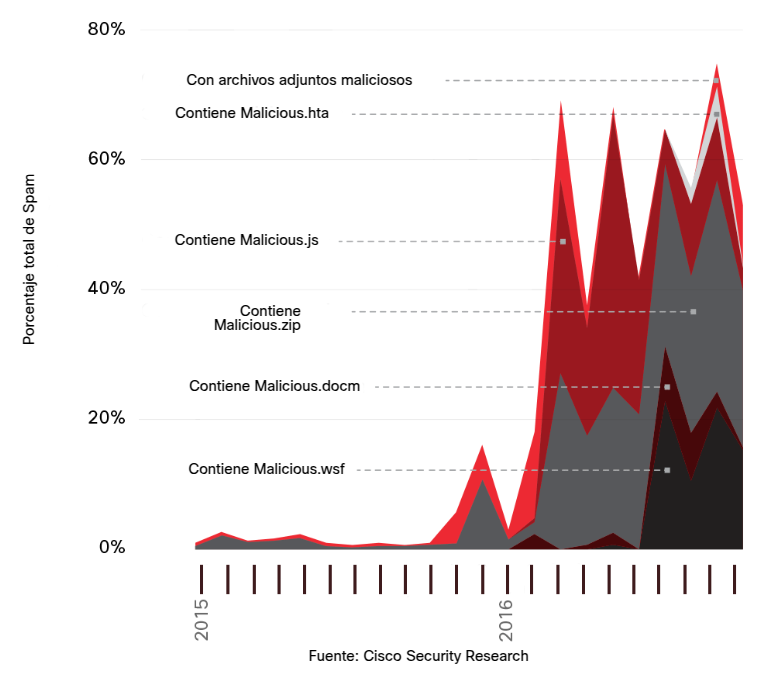
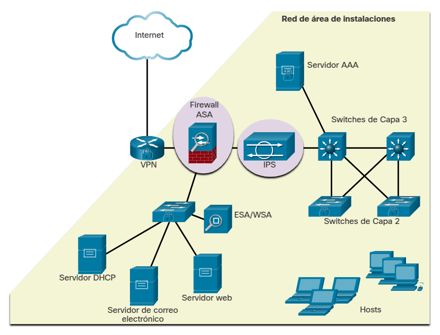
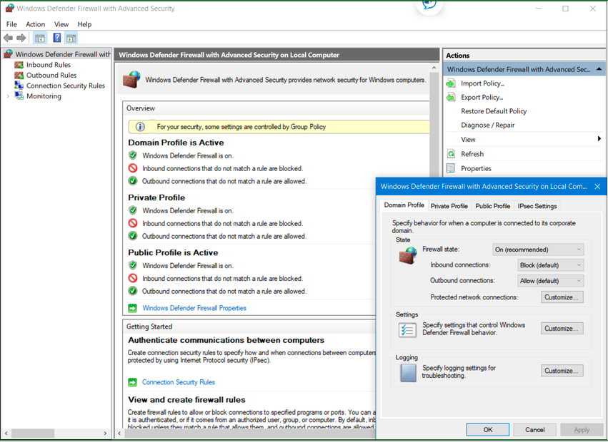
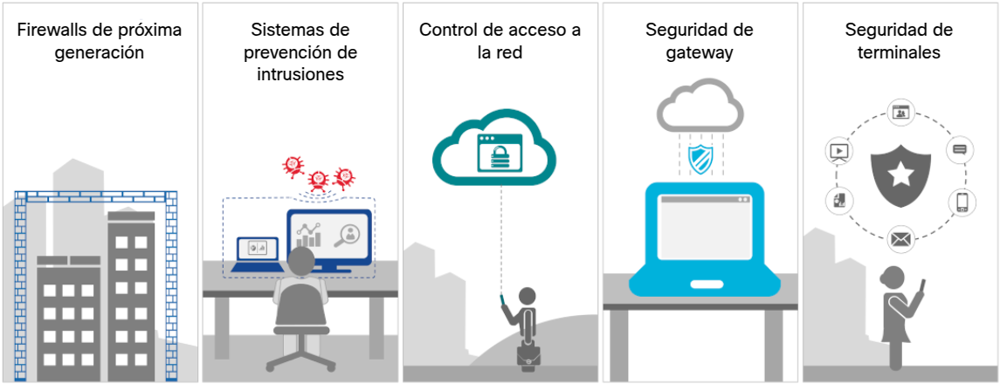
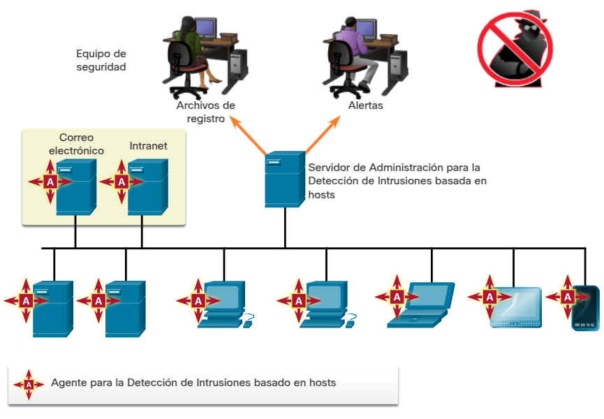
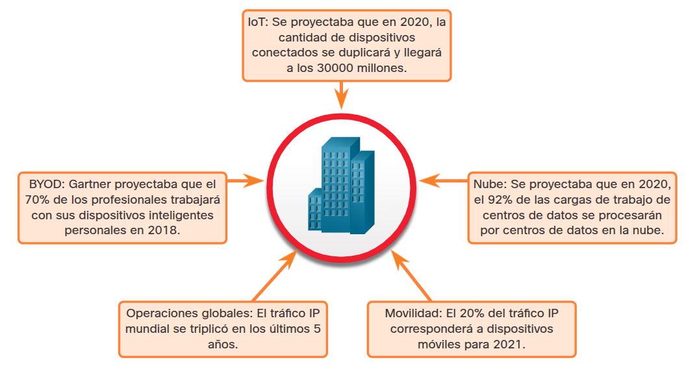
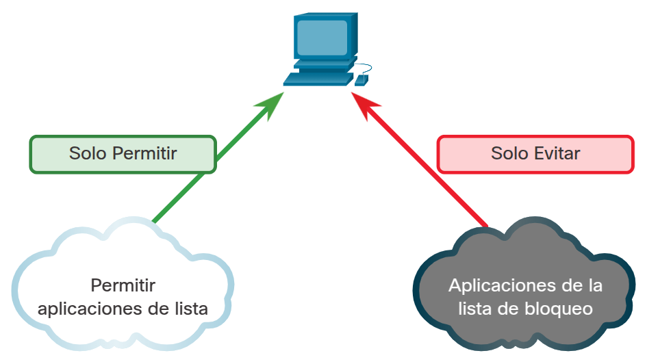
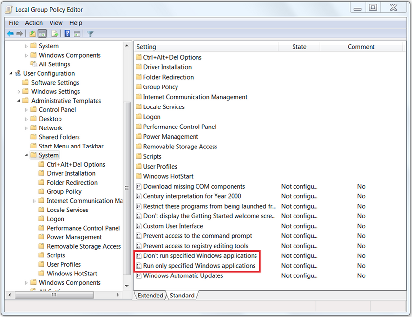
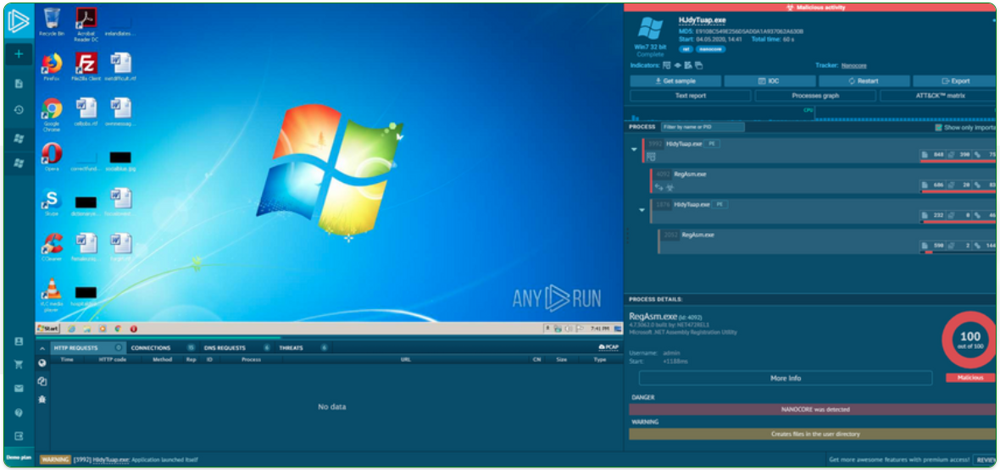

<a href="./00-Curso.md"><< Menú principal del módulo</a>

# 9. Protección de terminales
# Defensa de sistemas y dispositivos
El sistema operativo desempeña un rol importante en la operación de un sistema informático y es el objetivo de muchos ataques. Por lo tanto, nuestro primer trabajo como profesionales de ciberseguridad es proteger el sistema operativo.

Para comenzar, analizaremos los elementos esenciales de la seguridad del sistema operativo.

## Seguridad del sistema operativo
¿Qué debe hacer una organización para fortalecer un sistema operativo y mantenerlo seguro?
* Un buen administrador configurará el sistema operativo para protegerlo contra amenazas externas. Eso significa eliminar los programas y servicios innecesarios y asegurarse de que los parches de seguridad y las actualizaciones se instalen de manera oportuna para corregir fallas y mitigar riesgos.
* Una organización debe tener un enfoque sistemático vigente para abordar las actualizaciones de sistemas mediante: Una organización debe:
	* El establecimiento de procedimientos para monitorear la información relacionada con la seguridad.
	* La evaluación de las actualizaciones respecto de su aplicabilidad.
	* La planificación de la instalación de actualizaciones y parches en las aplicaciones.
	* La instalación de actualizaciones mediante un plan documentado.
* Otro requisito fundamental para proteger los sistemas operativos es identificar posibles vulnerabilidades. Para ello, establezca una línea de base para comparar el rendimiento de un sistema con las expectativas de la línea de base.

## Puntos para recordar
Analicemos algunos puntos importantes para recordar sobre el antimalware.
* Tenga cuidado con los productos antivirus dudosos. Tenga cuidado con los productos antivirus falsos maliciosos que puedan aparecer mientras navega por Internet. La mayoría de estos muestran un anuncio o una ventana emergente que parece una advertencia real de Windows. Usualmente indican que la computadora está siendo infectada por malware e instan al usuario a eliminarlo. Pero no provienen de fuentes legítimas, y hacer clic en cualquier lugar dentro de la ventana puede descargar e instalar malware.
* Los ataques sin archivos son difíciles de detectar y eliminar. El malware sin archivos utiliza programas legítimos para infectar una computadora. Al ir directamente a la memoria, este tipo de malware no depende de los archivos, por lo que no deja huella. Un ataque sin archivos finaliza cuando se reinicia el sistema. Los virus sin archivos usan lenguajes de secuencias de comandos como Windows PowerShell y son difíciles de detectar.
* Los _scripts_ también pueden ser malware. Se pueden utilizar lenguajes de scripting como Python, Bash (el lenguaje de línea de comandos para macOS de Apple y la mayoría de las distribuciones de Linux) o Visual Basic para Aplicaciones (o VBA, utilizado en macros de Microsoft) para crear scripts que sean malware.
* Elimine siempre el software no aprobado. El software no aprobado, o indebido, no es solo el software instalado involuntariamente en una computadora. Los usuarios también pueden instalar intencionalmente programas no autorizados. Aunque el software no aprobado no sea malicioso, puede violar la política de seguridad e interferir con el software o los servicios de red de la organización. El software no conforme debe eliminarse inmediatamente.

## Gestión de parches
Los ciberdelincuentes trabajan sin descanso para aprovechar la debilidad de los sistemas informáticos. Para mantenerse un paso adelante, mantenga los sistemas seguros y actualizados mediante la instalación periódica de parches.

### ¿Qué son los parches?
Los parches son actualizaciones de códigos que proporcionan los fabricantes para evitar que un virus o gusano recientemente descubierto logre atacar con éxito. Los parches y las actualizaciones a menudo se combinan en un paquete de servicios. Se podrían haber evitado muchos ataques de malware si los usuarios hubieran instalado el último Service Pack.

Los sistemas operativos como Windows buscan rutinariamente actualizaciones que puedan proteger una computadora de las amenazas de seguridad más recientes. Estas actualizaciones incluyen actualizaciones de seguridad, actualizaciones críticas y paquetes de servicios. Windows debe configurarse para que descargue e instale automáticamente las actualizaciones a medida que estén disponibles.

### ¿Qué debe hacer?
Como profesional de ciberseguridad, es una buena práctica probar un parche antes de implementarlo en toda la organización. Se puede utilizar una herramienta de administración de parches para administrar los parches localmente en lugar de utilizar el servicio de actualización en línea del proveedor.

El servicio de parches automatizado proporciona a los administradores una configuración más controlada. Analicemos algunos de los beneficios.
* Los administradores pueden aprobar o rechazar las actualizaciones.
* Los administradores pueden imponer la actualización de los sistemas para una fecha específica.
* Los administradores pueden obtener informes sobre la actualización necesaria para cada sistema.
* No es necesario conectar todas las computadoras al servicio del proveedor para descargar parches; un sistema obtiene la actualización de un servidor local.
* Los usuarios no pueden desactivar ni eludir las actualizaciones.

### Un enfoque proactivo
Además de proteger el sistema operativo, es importante actualizar las aplicaciones de terceros como Adobe Acrobat, Java y Chrome para abordar las vulnerabilidades que podrían aprovecharse. Un enfoque proactivo para la administración de parches proporciona seguridad de red y ayuda a prevenir el ransomware y otras amenazas.

## Seguridad de terminales
Una solución basada en el _host_ es una aplicación de software que se ejecuta en una computadora _host_ local para protegerla. El software funciona con el sistema operativo para prevenir ataques.
* **Cortafuegos basados en _host_**. Un firewall basado en host se ejecuta en un dispositivo para restringir la actividad de red entrante y saliente para ese dispositivo. Puede permitir o denegar el tráfico entre el dispositivo y la red. El firewall de software inspecciona y filtra los paquetes de datos para evitar que el dispositivo se infecte. Firewall de Windows, instalado de manera predeterminada durante la instalación de Windows, es un ejemplo de firewall de software.
	El usuario puede controlar el tipo de datos enviados hacia y desde la computadora abriendo o bloqueando los puertos seleccionados. Los firewalls bloquean las conexiones de red entrantes y salientes, a menos que se definan excepciones para abrir y cerrar los puertos que necesita un programa. Puede seleccionar 'reglas de entrada' para configurar los tipos de tráfico que pueden pasar al sistema; esto protegerá el sistema del tráfico no deseado.
* **HIDS - _Host Intrusion Detection System_**. HIPS es un software instalado en un host que se usa para controlar y analizar actividades sospechosas. Supervisa las llamadas al sistema y el acceso al sistema de archivos para detectar solicitudes maliciosas. También puede monitorear la información de configuración sobre el dispositivo contenido en el registro del sistema.
	El HIDS almacena todos los datos de registro localmente. El rendimiento del sistema puede verse afectado debido a su uso intensivo de los recursos. Un sistema de detección de intrusiones basado en el host no puede supervisar el tráfico de red que no alcanza el sistema host, pero puede monitorear los procesos del sistema crítico y el sistema operativo específicos del host.
* **HIPS - _Host Intrusion Prevention System_**. HIPS es un software que monitorea un dispositivo en busca de ataques conocidos y anomalías (desviaciones en el ancho de banda, protocolos y puertos), o encuentra señales de alerta al evaluar los protocolos reales en los paquetes. Si detecta actividad maliciosa, la herramienta HIPS puede enviarle una alarma, registrar la actividad maliciosa, restablecer la conexión y / o descartar los paquetes.
* **EDR - _Endpoint Detectiion and Response_**. EDR es una solución de seguridad integrada que monitorea y recopila continuamente datos de un dispositivo terminal. Luego analiza los datos y responde a cualquier amenaza que detecte. Un antivirus solo puede bloquear contra amenazas, mientras que EDR puede hacer eso y encontrar amenazas en el dispositivo.
* **DLP - _Data Loss Prevention_**. Las herramientas de DLP proporcionan una manera centralizada de garantizar que los datos no confidenciales no se pierdan, se usen mal ni se acceda a ellos por usuarios no autorizados.
* **NGFW - _Next Generation Firewall_**. NGFW es un dispositivo de seguridad de red que combina un firewall tradicional con otras funciones de filtrado de dispositivos de red. Por ejemplo, un firewall de aplicaciones que utiliza la inspección profunda de paquetes (DPI - _Deep Packet Inspection_) en línea en un sistema de protección contra intrusiones (IPS).

## Cifrado de _host_
La encriptación es una herramienta que se usa para proteger datos. La encriptación transforma los datos con un algoritmo complicado para que no puedan leerse.

Una clave especial transforma la información ilegible en información legible.

La función de sistema de archivos de cifrado de Windows (EFS - _Encrypting File System_) permite a los usuarios cifrar archivos, carpetas o un disco duro completo. El cifrado de disco completo (FDE - _Full Disk Encryption_) cifra todo el contenido de una unidad (incluidos los archivos temporales y la memoria). Microsoft Windows utiliza __BitLocker__ para FDE.

Antes de utilizar __BitLocker__, el usuario debe habilitar el módulo de plataforma confiable (TPM - _Trusted Platform Module_) en el BIOS. TPM es un chip especializado en la placa madre que almacena información específica del sistema de computación, como claves de cifrado, certificados digitales y contraseñas. Cuando está habilitado, __BitLocker__ puede usar el chip TPM.

Del mismo modo, __BitLocker To Go__ es una herramienta que cifra las unidades extraíbles. No utiliza un chip TPM, pero encripta los datos y requiere una contraseña para descifrarlos. Mientras tanto, una unidad de autocifrado encripta automáticamente todos los datos de la unidad para evitar que los atacantes accedan a los datos a través de su sistema operativo.

## Integridad de arranque
Los atacantes pueden atacar en cualquier momento, incluso en el breve espacio de tiempo que tarda un sistema en arrancar. Es fundamental garantizar que los sistemas y dispositivos permanezcan seguros al arrancar.

### ¿Qué es la integridad de arranque?
La integridad de arranque garantiza que se pueda confiar en el sistema y que no haya sido alterado mientras se carga el sistema operativo.

El firmware (instrucciones de software sobre las funciones básicas de la computadora) se almacena en un pequeño chip de memoria en la placa base. El sistema básico de entrada / salida (BIOS) es el primer programa que se ejecuta al encender la computadora. 

Unified Extensible Firmware Interface (UEFI), una versión más reciente de BIOS, define una interfaz estándar entre el sistema operativo, el firmware y los dispositivos externos. Se prefiere un sistema que use UEFI sobre uno que use BIOS porque un sistema UEFI puede ejecutarse en modo de 64 bits.

### ¿Cómo funciona el arranque seguro?
El arranque seguro es un estándar de seguridad para garantizar que un dispositivo se inicie utilizando un software de confianza. Cuando se inicia un sistema informático, el firmware verifica la firma de cada pieza de software de arranque, incluidos los controladores de firmware UEFI, las aplicaciones UEFI y el sistema operativo. Si las firmas son válidas, el sistema se inicia y el firmware le da el control al sistema operativo.

### ¿Qué es el arranque medido?
El arranque medido proporciona una validación más sólida que el arranque seguro. El inicio medido mide cada componente desde el firmware hasta los controladores de inicio de inicio, y almacena las mediciones en el chip TMP para crear un registro. El registro se puede probar de forma remota para verificar el estado de arranque del cliente. El arranque medido puede identificar las aplicaciones que no son de confianza que intentan cargarse y también permite que el antimalware se cargue antes.

## Funciones de seguridad del sistema Apple
Como sabemos, las distribuciones de Windows y Linux incluyen funciones de seguridad diseñadas para proteger los puntos finales. Apple proporciona hardware del sistema y funciones de seguridad de macOS que también ofrecen una sólida protección de punto final.

Las características de seguridad de Apple incluyen lo siguiente:
* Hardware centrado en la seguridad. La plataforma de hardware tiene funciones de seguridad mejoradas, como una CPU especial, arranque y un motor de cifrado AES dedicado. Estas características están incluidas en un sistema especial en un chip llamado Secure Enclave.
* Almacenamiento cifrado. El motor de cifrado AES basado en hardware admite el cifrado de almacenamiento de datos de Apple Data Protection y FileVault. Esto permite el cifrado y descifrado de archivos a medida que se escriben o leen sin exponer las claves de cifrado a la CPU principal, el sistema operativo o las aplicaciones en ejecución.
* Arranque seguro. La ROM de arranque protege el hardware de bajo nivel y solo permite que se ejecute el software Apple OS original e inalterado.
* Datos biométricos seguros. Los datos de autenticación biométrica se procesan en el sistema de hardware de seguridad. Esto lo mantiene separado del sistema operativo y del software de aplicación en ejecución, incluido el malware.
* Buscar mi Mac. Buscar mi Mac ayuda a encontrar dispositivos macOS perdidos o robados a través de su función de seguimiento de ubicación. También permite el bloqueo remoto de dispositivos y el borrado de almacenamiento si los datos críticos están en riesgo.
* Xproteger. La tecnología antimalware Xproteger evita la ejecución de malware a través de la detección de malware basada en firmas. También alerta a los usuarios sobre la existencia de malware y brinda la opción de eliminar los archivos de malware detectados.
* Herramienta de eliminación del malware (MRT - _Malware Removal Tool_). La Herramienta de eliminación de malware (MRT) detecta y elimina las infecciones de malware existentes cuando Apple actualiza automáticamente las reglas de detección. También supervisa las infecciones de malware en el reinicio del sistema y el inicio de sesión del usuario.
* Gatekeeper. Gatekeeper garantiza que solo se permite la instalación de software auténtico, firmado digitalmente y creado por un desarrollador de software certificado por Apple.

## Protección física de los dispositivos
* Equipo de cómputo
	* Utilice bloqueos de cable para proteger los dispositivos
	* Mantenga cerradas las salas de telecomunicaciones.
	* Utilice jaulas de seguridad (jaulas de Faraday) alrededor del equipo para bloquear los campos electromagnéticos.
* Cerraduras de puerta
	El tipo más común de cerradura de puerta es la entrada con cerradura con llave estándar. A menudo son fáciles de forzar. Se puede agregar un bloqueo de seguridad para mayor seguridad. Aunque cualquier cerradura con llave presenta una vulnerabilidad si se pierden, roban o duplican las llaves.
	Una cerradura cifrada usa botones que se presionan en una secuencia dada para abrir la puerta. Esto significa que el código de un usuario solo funcionará durante determinados días o cierto tiempo. La cerradura cifrada también puede mantener un registro de cuándo se abre la puerta y el código utilizado para abrirla.
* Identificación de radiofrecuencia (RFID)
	La identificación por radiofrecuencia (RFID) utiliza ondas de radio para identificar y rastrear objetos. Los sistemas de inventario de RFID usan etiquetas adjuntas a todos los elementos que una organización desea rastrear. Las etiquetas contienen un circuito integrado que se conecta a una antena. Las etiquetas de RFID son pequeñas y requieren muy poca energía, por lo que no necesitan batería para almacenar información para intercambiar con un lector. La RFID puede ayudar a automatizar el seguimiento de los activos o bloquear, desbloquear o configurar inalámbricamente los dispositivos electrónicos.

## Lab - Reforzar un sistema Linux
* <a href="./notes/lab_reforzar_sistema_linux.md" target="_blank">Reforzar un sistema Linux</a>

## Lab - Recuperación de contraseñas
* <a href="./notes/lab_recuperacion_contraseñas.md" target="_blank">Recuperación de contraseñas</a>

# Protección antimalware
## Amenazas de teminales
La palabra “terminal” tiene varias definiciones. Para los fines de este curso, definiremos los terminales como hosts en la red que pueden tener acceso a otros hosts de la red y viceversa. Esto obviamente incluye computadoras y servidores, pero muchos otros dispositivos también pueden tener acceso a la red. Con el rápido crecimiento de Internet de las cosas (IoT), otros tipos de dispositivos ya son terminales de la red. Esto incluye cámaras de seguridad conectadas en red, controladoras, y hasta bombillas y electrodomésticos. Cada terminal es un posible lugar que el software malicioso tiene para obtener acceso a una red. Además, las nuevas tecnologías, como la nube, amplían los límites de las redes empresariales para incluir sitios en Internet de los que las empresas no son responsables.

Los dispositivos que tienen acceso remoto a las redes mediante VPN son también terminales que se deben tener en cuenta. Estos terminales podrían inyectar malware en la red VPN desde la red pública.

Los siguientes puntos resumen algunos de los motivos por los que el malware sigue siendo un desafío importante:
* Según una investigación de Cybersecurity Ventures, para 2021 una nueva organización será víctima de un ataque de ransomware cada 11 segundos.
* En 2018, se observaron 8 millones de intentos de robar recursos del sistema usando _malware criptojacking_.
* De 2016 a principios de 2017, el volumen mundial de spam aumentó drásticamente. Del 8% al 10% de este spam puede considerarse malicioso, como se muestra en la figura.
* En 2020, se prevé que el promedio de ataques cibernéticos por cada dispositivo MacOS aumentará de 4,8 en 2018 a 14,2 en 2020.
* Se ha descubierto que numerosos tipos comunes de malware han modificado significativamente sus características en menos de 24 horas para evadir la detección.

	

## Seguridad de terminales
Normalmente, los medios de comunicación cubren los ataques de red externos a redes empresariales. Estos son algunos ejemplos de dichos ataques:
* Ataques de DoS en la red de una organización para degradar o incluso impedir el acceso público.
* Brecha del servidor web de una organización para modificar su presencia web
* Infracción de los servidores de datos y hosts de una organización para robar información confidencial.

Se necesitan diversos dispositivos de seguridad de la red para proteger el perímetro de la red del acceso exterior. Como se ve en la figura, estos dispositivos pueden incluir un router fortalecido que proporciona servicios de VPN, un firewall de última generación (ASA en la figura), un dispositivo de IPS y servicios de autenticación, autorización y responsabilidad (_accountability_) (servidor de AAA en la figura).

	

Sin embargo, muchos ataques se originan dentro de la red. Por lo tanto, proteger una LAN interna es casi tan importante como proteger el perímetro externo de la red. Sin una LAN segura, los usuarios dentro de una organización permanecen susceptibles a las amenazas de la red y las interrupciones que pueden afectar directamente la productividad y el margen de ganancias de una organización. Si un atacante se infiltra en un host interno, este puede ser el punto de partida para que obtenga acceso a dispositivos esenciales del sistema, como servidores e información confidencial.

Específicamente, hay dos elementos internos de la LAN para proteger:
* __Terminales__. Los hosts suelen ser computadoras portátiles, computadoras de escritorio, impresoras, servidores y teléfonos IP, y todos ellos son susceptibles a los ataques relacionados con malware.
* __Infraestructura de red__. Los dispositivos de la infraestructura de la LAN interconectan terminales y, habitualmente, incluyen switches, dispositivos inalámbricos y dispositivos de telefonía IP. La mayoría de estos dispositivos es susceptible a ataques relacionados con la LAN, incluidos los ataques de desbordamiento de la tabla de direcciones MAC, los ataques de suplantación, los ataques relacionados con DHCP, los ataques de tormenta de LAN, los ataques de manipulación de STP y los ataques a la VLAN.
Este capítulo se centra en la protección de los puntos terminales.

## Protección de malware basada en _hosts_
El perímetro de la red se expande todo el tiempo. Las personas tienen acceso a recursos de la red corporativa con dispositivos móviles que utilizan tecnologías de acceso remoto, como la VPN. Estos mismos dispositivos también se utilizan en redes públicas y domésticas con protección mínima o inexistente. El software antivirus/antimalware y los firewalls con base en el host se utilizan para proteger estos dispositivos.
* __Software antivirus/antimalware__. Se trata de software que se instala en un host para detectar y mitigar virus y malware. Algunos ejemplos son Windows Defender Virus & Threat Protection, Cisco AMP for Endpoints, Norton Security, McAfee, Trend Micro, entre otros. Los programas antimalware pueden detectar virus por medio de tres enfoques diferentes:
	* __Basado en firmas__. Este enfoque reconoce diversas características de archivos de malware conocidos.
	* __Basado en heurística__. Este enfoque reconoce características generales que comparten diversos tipos de malware.
	* __Basado en comportamiento__. Este enfoque emplea análisis de comportamiento sospechoso.
	
	Muchos programas antivirus son capaces de proporcionar protección en tiempo real analizando los datos mientras el terminal los usa. Estos programas también analizan en busca de malware existente que podría haber ingresado en el sistema antes de ser reconocible en tiempo real.
	
	A la protección antivirus con base en hosts también se la conoce como basada en agentes. El antivirus basado en agentes se ejecuta en cada máquina protegida. La protección antivirus sin agente realiza escaneos en los hosts desde un sistema centralizado. Los sistemas sin agentes se han popularizado en entornos virtualizados en los que varias instancias de sistemas operativos se ejecutan en un host simultáneamente. Si se ejecutan antivirus con base en agentes en cada sistema virtualizado, es posible que se agoten los recursos del sistema. Los antivirus sin agente para hosts virtuales comprenden el uso de un dispositivo virtual de seguridad especializado que optimiza las tareas de análisis en los hosts virtuales. Un ejemplo de esto es VMware vShield.
* __Firewall basado en *hosts*__. Este software se instala en un host. Limita las conexiones entrantes y salientes a conexiones iniciadas por ese host solamente. El software de firewall también puede evitar que un host se infecte e impedir que los hosts infectados propaguen malware a otros. Esta función se incluye en algunos sistemas operativos. Por ejemplo, Windows incluye "Windows Defender Firewall with Advanced Security", como se muestra en la figura.

	Otras empresas u organizaciones producen otro tipo de soluciones. Las tablas ip de Linux y las herramientas de envoltorios TCP Los firewalls basados en el host se analizan con mayor detalle más adelante en este módulo.

	

		
	

* __Conjuntos de seguridad basados en *hosts*__. Se recomienda instalar un conjunto de productos de seguridad con base en el host en redes domésticas y empresariales. Estos conjuntos de seguridad con base en el host incluyen funcionalidades antivirus, antiphishing y de navegación segura, sistemas de prevención de intrusiones con base en el host y funcionalidades de firewall. Estas diversas medidas de seguridad proporcionan una defensa en capas que brindan protección contra las amenazas más comunes.

	Además de la funcionalidad de protección que brindan los productos de seguridad basados en el host, está la función de telemetría. La mayoría del software de seguridad con base en el host incluye una eficiente funcionalidad de registro que es esencial para las operaciones de ciberseguridad. Algunos programas de seguridad con base en el host envían registros a una ubicación central para su análisis.

	Hay muchos conjuntos de programas de seguridad con base en el host disponibles para los usuarios y las empresas. El laboratorio de pruebas independiente AV-TEST proporciona evaluaciones de alta calidad sobre protecciones con base en el host, así como información acerca de muchos otros productos de seguridad.

	Busque en Internet la organización AVTest para obtener más información sobre AV-TEST.

## Protección contra malware basada en red

	

Las nuevas arquitecturas de seguridad para la red sin fronteras enfrentan los retos de seguridad haciendo que los terminales utilicen elementos de análisis de la red. Estos dispositivos proporcionan muchas más capas de análisis que las que podría ofrecer un solo terminal. Los dispositivos de prevención de malware con base en la red también son capaces de compartir información entre ellos para permitir que se tomen mejores decisiones.

La protección de terminales en una red sin fronteras puede lograrse usando técnicas basadas en la red y basadas en host, como se mostró en la imagen. Los siguientes son ejemplos de dispositivos y técnicas que implementan las protecciones de host en el nivel de la red.

* __Protección avanzada contra malware (AMP, _Advanced Malware Protection_)__. Protege a los terminales de virus y malware.
* __Dispositivo de seguridad de correo electrónico (ESA, _Email Security Appliance_)__. Filtra el correo electrónico no deseado y los mensajes que podrían ser maliciosos antes de que lleguen al terminal. Un ejemplo de esto es Cisco ESA.
* __Dispositivo de seguridad web (WSA, _Web Security Appliance_)__. Filtra sitios web y crea listas negras para evitar que los hosts lleguen a lugares peligrosos en la web. Cisco WSA permite controlar cómo tienen acceso a internet los usuarios y puede imponer políticas de uso aceptable, controlar el acceso a servicios y sitios específicos, y realizar análisis en busca de malware.
* __Control de Admisión de Redes (NAC, _Network Admission Control_)__. Permite que se conecten a la red solamente los sistemas que estén autorizados y que cumplan con las normas.

Estas tecnologías funcionan en colaboración mutua para brindar más protección que la que pueden ofrecer los conjuntos de productos basados en host, como se vió en la figura.

	

 

# Prevención de intrusiones basada en _host_
## Firewalls basados en _host_
Los firewalls personales con base en hosts son programas de software independientes que controlan el tráfico que entra o sale de una computadora. Las aplicaciones de firewall también están disponibles para teléfonos y tabletas Android.

Los firewalls con base en el host pueden utilizar un conjunto de políticas o perfiles predefinidos para controlar los paquetes que entran en una computadora y salen de ella. También pueden tener reglas que se pueden modificar o crear directamente para controlar el acceso según direcciones, protocolos y puertos. Las aplicaciones de firewall con base en el host también pueden configurarse para emitir alertas a los usuarios si se detecta comportamiento sospechoso. Luego, pueden ofrecerle al usuario la posibilidad de permitir que una aplicación sospechosa se ejecute o que no lo haga nunca en el futuro.

Los datos del registro varían según la aplicación de firewall. Por lo general, se incluye la fecha y hora del evento, si la conexión se autorizó o denegó, información sobre las direcciones IP de origen o destino de los paquetes, y los puertos de origen y destino de los segmentos encapsulados. Además, es posible que actividades comunes, como búsquedas de DNS y otros eventos de rutina, aparezcan en los registros del firewall con base en el host, por lo que el filtrado y otras técnicas de análisis son útiles para la inspección de grandes volúmenes de datos de registros.

Una forma de prevenir las intrusiones es el uso de firewalls distribuidos. Los firewalls distribuidos combinan características de firewalls con base en el host y administración centralizada. La función de administración impone reglas a los hosts y también puede aceptar los archivos de registro de los hosts.

Ya sea que esté instalado completamente en el host o distribuido, el firewall con base en el host es una capa importante de la seguridad de la red, junto con el firewall con base en la red. Estos son algunos ejemplos de firewalls con base en el host:
* __Firewall de Windows Defender__. Incluido por primera vez en Windows XP, el Windows Firewall (actualmente conocido como Windows Defender Firewall) utiliza un enfoque basado en perfiles para configurar la funcionalidad del Firewall. Al acceso a redes públicas se le asigna el perfil de firewall "Público" restrictivo. El perfil "Privado" es para computadoras que están aisladas de Internet mediante otros dispositivos de seguridad, como un router doméstico con funcionalidad de firewall. El perfil de dominio es el tercer perfil disponible. Se elige para las conexiones a una red de confianza, como una red empresarial que tiene una infraestructura de seguridad adecuada. Firewall de Windows tiene la funcionalidad de registro y puede administrarse de manera centralizada con políticas de seguridad de grupo personalizadas desde un servidor de administración, como System Center 2012 Configuration Manager.
* __Iptables__. Esta es una aplicación que les permite a los administradores de sistemas de Linux configurar reglas de acceso a la red que forman parte de los módulos de _Netfilter_ del kernel de Linux.
* __Nftables__. El sucesor de _iptables_, _nftables_ es una aplicación de firewall de Linux que utiliza una máquina virtual simple en el kernel de Linux. El código se ejecuta dentro de la máquina virtual que inspecciona los paquetes de red e implementa reglas de decisión en cuanto a la aceptación y el reenvío de paquetes.
* __TCP Wrappers__. Es un sistema de registro y control de acceso basado en reglas para Linux. El filtrado de paquetes se basa en direcciones IP y servicios de red.

## Detección de intrusiones basada en _hosts_
La diferencia entre la prevención de intrusiones y la detección de intrusiones con base en el host no está clara. De hecho, algunas fuentes hacen referencia a sistemas de detección y prevención de intrusiones con base en el host (HIPDS, _host-based intrusion detection and prevention systems_). Debido a que la industria parece favorecer el uso de la sigla HIDS, la utilizaremos en nuestro análisis.

Un Sistema de detección de intrusiones (_Intrusion Detection System_, HIDS) está diseñado para proteger a los hosts de malware conocido y desconocido. Un HIDS puede brindar monitoreo e informes detallados de la actividad de configuración y aplicaciones del sistema. Puede proporcionar análisis de logs, correlación de eventos, verificación de integridad, aplicación de políticas, detección de rootkit y alertas. Un HIDS incluirá, con frecuencia, un terminal de servidor de administración, como se ve en la figura.

Un HIDS es una aplicación de seguridad integral que combina las funcionalidades de las aplicaciones antimalware con la de un firewall. Un HIDS no solo detecta el malware, sino que también puede evitar que se ejecute si llega a un host. Debido a que el software de HIDS debe ejecutarse directamente en el host, se considera un sistema con base en agente.

	

## Operación HIDS
Se puede decir que los sistemas de seguridad con base en el host funcionan como sistemas de detección y prevención, ya que evitan los ataques conocidos y detectan posibles ataques desconocidos. Un HIDS utiliza estrategias proactivas y reactivas. Un HIDS puede prevenir intrusiones porque utiliza firmas para detectar malware conocido y evita que infecte un sistema. Sin embargo, esta estrategia solamente es buena contra las amenazas conocidas. Las firmas son no eficaces contra amenazas nuevas o de día cero. Además, algunas familias de malware se caracterizan por ser polimorfas. Esto significa que los atacantes pueden crear variaciones de un tipo (o familia) de malware para evadir las detecciones con base en firmas, cambiando apenas algunos aspectos de la firma del malware para que no se pueda detectar. Se utiliza un conjunto adicional de estrategias para detectar la posibilidad de intrusiones exitosas de malware que evada la detección de firmas:
* __Anomalía__. El comportamiento del sistema del host se compara con un modelo normal de referencia aprendido. Las desviaciones significativas de la línea de base se interpretan como el resultado de alguna clase de intrusión. Si se detecta una intrusión, el HIDS puede registrar detalles de la intrusión, enviar alertas a los sistemas de administración de la seguridad y tomar medidas para evitar el ataque. La referencia medida deriva de los comportamientos del usuario y del sistema. Dado que, aparte del malware, son muchos los elementos que pueden causar cambios en el comportamiento del sistema, la detección de anomalías puede crear muchos resultados erróneos que pueden aumentar la carga de trabajo del personal de seguridad y, además, disminuir la credibilidad del sistema.
* __Enrutamiento basado en políticas__. El comportamiento normal del sistema se describe mediante reglas (o la violación de las reglas) predefinidas. La violación de estas políticas tiene como resultado las acciones del HIDS. El HIDS puede tratar de cerrar procesos de software que hayan infringido las reglas y puede registrar esos eventos y alertar al personal con respecto a las infracciones. La mayor parte del software de HIDS viene con un conjunto de reglas predefinidas. Con algunos sistemas, los administradores pueden crear políticas personalizadas que se pueden distribuir a hosts desde un sistema centralizado de administración de políticas.

## Productos de HIDS
Existe una serie de productos de HIDS en el mercado actual. La mayoría de ellos utiliza el software en el host y algún tipo de funcionalidad centralizada de administración de la seguridad que permite la integración con servicios de monitoreo de seguridad de la red y de inteligencia de amenazas. Algunos ejemplos son Cisco AMP, AlienVault USM, Tripwire y Open Source HIDS SECurity (OSSEC).

OSSEC<a href="#enlaces-de-interés">1</a> utiliza un servidor de administración centralizada y agentes que se instalan en hosts individuales. Actualmente, los agentes están disponibles para las plataformas Mac, Windows, Linux y Solaris. El servidor o Administrador OSSEC también puede recibir y analizar alertas de una variedad de dispositivos de red y Firewalls a través de syslog. OSSEC monitorea los registros del sistema en los hosts y también lleva a cabo la verificación de la integridad de los archivos. OSSEC puede detectar rootkits y otros tipos de malware, y también se puede configurar para ejecutar scripts o aplicaciones en los hosts como respuesta a los desencadenantes de eventos.

Busque OSSEC en Internet para obtener más información.

## Lab - Recomendar medidas de seguridad de terminales
* <a href="./notes/lab_recomendar_seguridad_terminales.md" target="_blank">Recomendar medidas de seguridad de terminales</a>

# Seguridad de las aplicaciones
## Superficie de ataque
Es necesario recordar que una vulnerabilidad es una debilidad en un sistema o en su diseño que una amenaza podría aprovechar. Una superficie de ataque es la suma total de las vulnerabilidades presentes en un sistema determinado a las que puede acceder un atacante. La superficie de ataque puede consistir en puertos abiertos en servidores o hosts, software que se ejecuta en servidores conectados a internet, protocolos de redes inalámbricas e incluso usuarios.

Como se ve en la figura, la superficie de ataque continúa expandiéndose. Hay más dispositivos que se conectan a las redes mediante Internet de las cosas (IoT) y la política de uso de dispositivos propios (BYOD, _Bring Your Own Device_). Gran parte del tráfico de red ahora ocurre entre dispositivos y algún lugar en la nube. El uso de dispositivos móviles continúa aumentando. Todas estas tendencias contribuyen a prever que el tráfico IP global se triplicará en los próximos cinco años.

El SANS Institute describe tres componentes de la superficie de ataque:
* __Superficie de ataque de la red__. El ataque aprovecha las vulnerabilidades en las redes. Esto puede incluir protocolos de red inalámbrica y por cable convencionales, así como otros protocolos inalámbricos que usen los _smartphones_ o dispositivos de IoT. Los ataques a la red también aprovechan las vulnerabilidades de las capas de red y transporte.
* __Superficie de ataque del software__. Estos ataques son llevados a cabo mediante el aprovechamiento de vulnerabilidades web, en la nube o de aplicaciones de software basado en hosts.
* __Superficie de ataque humana__. El ataque aprovecha las debilidades en el comportamiento del usuario. Estos ataques incluyen ingeniería social, comportamiento malicioso de recursos internos de confianza y errores de los usuarios.

	

## Lista de aplicaciones bloqueadas y lista de permitidas
Una manera de disminuir la superficie de ataque es limitar el acceso a posibles amenazas mediante la creación de listas de aplicaciones prohibidas. Esto se conoce como listas de bloqueo.

Las listas negras de aplicaciones pueden determinar qué aplicaciones de usuario no tienen permitido ejecutarse en una computadora. Del mismo modo, las listas blancas pueden especificar los programas que sí se pueden ejecutar, como se ve en la figura. De esta manera, se puede evitar que las aplicaciones vulnerables conocidas creen vulnerabilidades en los hosts de la red.

Las listas blancas se crean según un estándar de referencia establecido por una organización. Este estándar de referencia define un nivel de riesgo aceptado y los componentes del entorno que contribuyen a ese nivel de riesgo. El software que no se encuentre en la lista blanca puede aumentar el riesgo al violar el estándar de referencia de seguridad establecido.

	

La figura muestra las configuraciones de listas negras y listas blancas de Windows Local Group Policy Editor.

Los sitios web también pueden incluirse en listas blancas y negras. Estas listas se pueden crear manualmente o pueden obtenerse de diferentes servicios de seguridad. Los servicios de seguridad pueden actualizar las listas negras constantemente y distribuirlas a firewalls y otros sistemas de seguridad que las usen. El sistema de administración de seguridad Cisco Firepower es un ejemplo de un sistema que puede tener acceso al servicio de inteligencia de seguridad de Cisco Talos para obtener listas negras. Luego, estas listas pueden distribuirse a los dispositivos de seguridad dentro de una red empresarial.

Busque en Internet _The Spamhaus Project_<a href="#enlaces-de-interés" target="_blank">2</a>, que es un ejemplo de un servicio gratuito de lista negra.

	

## Sandboxing basado en sistema
Sandboxing es una técnica que permite analizar y ejecutar en un entorno seguro los archivos sospechosos. Los sandbox de análisis de malware automatizado ofrecen herramientas que analizan el comportamiento del malware. Estas herramientas observan los efectos de ejecutar malware desconocido para poder determinar el comportamiento del malware y usar la información para crear defensas contra él.

Como se mencionó anteriormente, el malware polimorfo cambia con frecuencia y aparece nuevo malware regularmente. Un perímetro extremadamente sólido y la implementación de sistemas de seguridad con base en el host no evitan totalmente el ingreso de malware. Los HIDS y otros sistemas de detección pueden crear alertas sobre malware sospechoso que podría haber ingresado en la red y haberse ejecutado en un host. Algunos sistemas, como Cisco AMP, pueden seguir la trayectoria de un archivo a través de la red y pueden “retroceder” los eventos de la red para obtener una copia del archivo descargado. Luego, es posible ejecutar este archivo en un sandbox (como Cisco Threat Grid Glovebox) y que el sistema documente las actividades del archivo. Después, esta información puede utilizarse para crear firmas que impidan que el archivo vuelva a ingresar en la red. La información también puede utilizarse para crear reglas de detección y reproducciones automatizadas que identifiquen otros sistemas infectados.

Cuckoo Sandbox es un sistema sandbox gratuito para el análisis de malware. Se puede ejecutar localmente y usarlo para analizar muestras de malware. También existe una serie de sandbox públicos en línea. Estos servicios permiten la carga de muestras de malware para su análisis. Algunos de estos servicios son VirusTotal, Joe Sandbox y CrowdStrike Falcon Sandbox.

Una herramienta online interesante es ANY.RUN, la cual se muestra en la figura. Ofrece la posibilidad de cargar una muestra de malware para su análisis como cualquier sandbox online. Sin embargo, ofrece una funcionalidad de generación de informes interactivos muy enriquecedora que está llena de detalles sobre la muestra de malware. ANY.RUN ejecuta el malware y analiza una serie de capturas de pantalla del malware si tiene elementos interactivos que se muestran en la pantalla del equipo sandbox. Puede ver muestras públicas enviadas por los usuarios de ANY.RUN para investigar información sobre malware recién descubierto o malware que está circulando en Internet. Los informes incluyen la actividad de red e Internet del malware, incluidas las solicitudes HTTP y las consultas DNS. Los archivos que se ejecutan como parte del proceso de malware se muestran y califican como amenaza. Los detalles están disponibles para los archivos, incluidos varios valores hash, vistas hexadecimales y ASCII del contenido del archivo, y los cambios del sistema realizados por los archivos. Además, también se muestran la identificación de indicadores de peligro, como los hashes de archivos de malware, las solicitudes DNS y las conexiones IP que realiza el malware. Finalmente, las tácticas tomadas por el malware se asignan a la MITRE ATT&CK Matrix con cada táctica vinculada a los detalles en el sitio web de MITRE.

	

## Lab - Herramientas de investigación de malware en línea
* <a href="./notes/lab_herramientas_investigacion_malware.md" target="_blank">Herramientas de investigación de malware en línea</a>

# Resumen
## Defensa de dispositivos
Para proteger un sistema operativo, los administradores deben eliminar los programas y servicios innecesarios y asegurarse de que se instalen parches y actualizaciones de seguridad. Una organización debe establecer procedimientos para monitorear la información relacionada con la seguridad, evaluar actualizaciones e instalar actualizaciones utilizando un plan documentado. Además, deben identificar vulnerabilidades potenciales estableciendo una línea de base para comparar el rendimiento de un sistema.

El malware incluye virus, gusanos, troyanos, registradores de teclado, spyware y adware. Todos invaden la privacidad, roban información, dañan el sistema o eliminan y corrompen datos. Utilice un software antimalware de buena reputación. Los virus sin archivos usan lenguajes de secuencias de comandos como Windows PowerShell y son difíciles de detectar. Los lenguajes de secuencias de comandos como Python, Bash o VBA se pueden usar para crear malware. El software no conforme debe eliminarse inmediatamente.

Los parches son actualizaciones de códigos que proporcionan los fabricantes para evitar que un virus o gusano recientemente descubierto logre atacar con éxito. Los parches y las actualizaciones a menudo se combinan en un paquete de servicios. Se puede utilizar una herramienta de administración de parches para administrar los parches localmente. También es importante actualizar las aplicaciones de terceros como Adobe Acrobat, Java y Chrome para abordar las vulnerabilidades. Un firewall basado en host se ejecuta en un dispositivo para restringir la actividad de red entrante y saliente para ese dispositivo. HIDS software monitor system calls and file system access to detect malicious requests. HIPS monitorea un dispositivo en busca de ataques y anomalías conocidas. EDR monitorea y recopila datos continuamente desde un dispositivo de punto final, y luego analiza los datos y responde a cualquier amenaza. Las herramientas DLP garantizan que los datos confidenciales no se pierdan ni accedan a ellos usuarios no autorizados. NGFW combina un firewall tradicional con otras funciones de filtrado de dispositivos de red. El cifrado es una herramienta utilizada para proteger los datos mediante el uso de un algoritmo para transformar los datos y hacerlos ilegibles.

La función Sistema de cifrado de archivos (EFS) de Windows permite a los usuarios cifrar archivos, carpetas o un disco duro completo. La integridad de arranque garantiza que se pueda confiar en el sistema y que no haya sido alterado mientras se carga el sistema operativo. El arranque seguro es un estándar de seguridad para garantizar que un dispositivo se inicie utilizando un software de confianza. El arranque medido puede identificar las aplicaciones que no son de confianza que intentan cargarse y también permite que el antimalware se cargue antes.

Los administradores deben tener políticas y contramedidas implementadas para software sin parches, descargas de usuarios no autorizados, malware, dispositivos desatendidos, violaciones de políticas de uso aceptable y medios no autorizados. Proteja el equipo físico con candados de cable, cerraduras de puertas cifradas, jaulas de Faraday para bloquear campos electromagnéticos y etiquetas RFID para identificar y rastrear artículos. Protección antimalware

Los puntos finales son hosts en la red que pueden acceder (o ser accedidos por) otros hosts en la red. Con IoT, otros tipos de dispositivos ahora son puntos finales. Cada terminal es un posible lugar que el software malicioso tiene para obtener acceso a una red. No todos los extremos están dentro de una red. Muchos terminales se conectan a redes remotamente a través de VPN. El perímetro de la red se expande todo el tiempo. Se necesitan diversos dispositivos de seguridad de la red para proteger el perímetro de la red contra el acceso exterior. Muchos ataques se originan desde el interior de la red; por lo tanto, asegurar una LAN interna también es importante. Si un atacante se infiltra en un host interno, este puede ser el punto de partida para que obtenga acceso a dispositivos esenciales del sistema, como servidores y dispositivos con información confidencial. Hay dos elementos LAN internos para proteger: puntos finales e infraestructura de red.

El software Antivirus/Antimalware se instala en un host, para detectar y mitigar virus y malware Lo hace usando firmas (usando varias características de archivos de malware conocidos), heurísticas (usando características generales compartidas por varios tipos de malware) y basadas en comportamiento (usando un análisis de comportamiento sospechoso). Muchos programas antivirus son capaces de proporcionar protección en tiempo real analizando los datos mientras el terminal los usa. Un firewall basado en host restringe las conexiones entrantes y salientes a conexiones iniciadas solo por ese host. El software de firewall también puede evitar que un host se infecte e impedir que los hosts infectados propaguen malware a otros. La mayoría del software de seguridad basado en hosts incluye una funcionalidad de registro que es esencial para las operaciones de ciberseguridad. La protección de terminales en una red sin fronteras puede lograrse usando técnicas basadas en la red y basadas en el host.

## Prevención de intrusiones basada en hosts
Los firewalls basados en hosts pueden utilizar un conjunto de políticas o perfiles predefinidos para controlar los paquetes que entran y salen de una computadora. También pueden tener reglas que se pueden modificar o crear directamente para controlar el acceso según direcciones, protocolos y puertos. También pueden configurarse para emitir alertas a los usuarios si se detecta comportamiento sospechoso. Los datos del registro varían según la aplicación de firewall. Por lo general, se incluye la fecha y hora del evento, si la conexión se autorizó o denegó, información sobre las direcciones IP de origen o destino de los paquetes, y los puertos de origen y destino de los segmentos encapsulados. (Los firewalls distribuidos combinan funciones de firewalls basados en host con administración centralizada).

Algunos ejemplos de Firewalls basados en host incluyen Windows Defender Firewall, iptables, nftables y TCP Wrappers. HIDS protege a los hosts contra malware conocido y desconocido. Puede realizar un monitoreo e informes detallados sobre la configuración del sistema y la actividad de la aplicación, análisis de registros, correlación de eventos, verificación de integridad, aplicación de políticas, detección de rootkits y alertas. Un HIDS incluirá, con frecuencia, un servidor terminal de administración, como se ve en la figura. Debido a que el software HIDS debe ejecutarse directamente en el host, se considera un sistema basado en agente. Un HIDS utiliza estrategias proactivas y reactivas. Un HIDS puede prevenir intrusiones porque utiliza firmas para detectar malware conocido y evita que infecte un sistema.

Las firmas son no eficaces contra amenazas nuevas o de día cero. Además, algunas familias de malware se caracterizan por ser polimorfas. Las estrategias adicionales para detectar la posibilidad de ataques exitosos incluyen la detección basada en anomalías y la detección basada en políticas.

## Seguridad de aplicación
Una superficie de ataque es la suma total de las vulnerabilidades presentes en un sistema determinado a las que puede acceder un atacante. Puede consistir de puertos abiertos en servidores o hosts, software que se ejecuta en servidores conectados a internet, protocolos de redes inalámbricas e incluso usuarios. La superficie de ataque continúa expandiéndose. Hay más dispositivos que se conectan a las redes mediante Internet de las cosas (IoT) y la política de uso de dispositivos propios (BYOD, Bring Your Own Device).

El Instituto SANS describe tres componentes de la superficie de ataque: superficie de ataque de red, superficie de ataque de software y superficie de ataque humano. Una manera de disminuir la superficie de ataque es limitar el acceso a posibles amenazas mediante la creación de listas de aplicaciones prohibidas. De manera similar, una organización puede crear listas de programas permitidos de acuerdo con una línea de base de seguridad que haya sido establecida por una organización. Sandboxing es una técnica que permite analizar y ejecutar en un entorno seguro los archivos sospechosos. Los sandbox de análisis de malware automatizado ofrecen herramientas que analizan el comportamiento del malware. Estas herramientas observan los efectos de ejecutar malware desconocido para poder determinar el comportamiento del malware y usar la información para crear defensas contra él. El malware polimorfo cambia con frecuencia y aparece nuevo malware regularmente Un perímetro extremadamente sólido y la implementación de sistemas de seguridad con base en el host no evitan totalmente el ingreso de malware. Los HIDS y otros sistemas de detección pueden crear alertas sobre malware sospechoso que podría haber ingresado en la red y haberse ejecutado en un host.

# Enlaces de interés
1. <a href="https://www.ossec.net/" target="_blank">Open Source HIDS Security</a>
2. <a href="https://www.spamhaus.org/" target="_blank">Spamhaus Project</a>
 
 
 
 
 
 
 
 
 
<a href="#9-protección-de-terminales">⬆️</a>
<a href="./00-Curso.md"><< Menú principal del módulo</a>