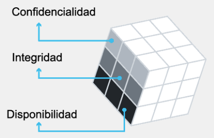
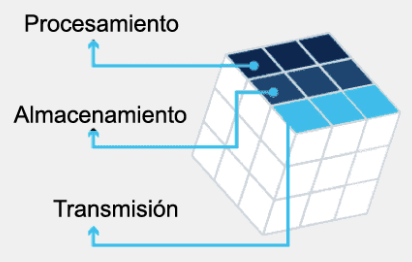
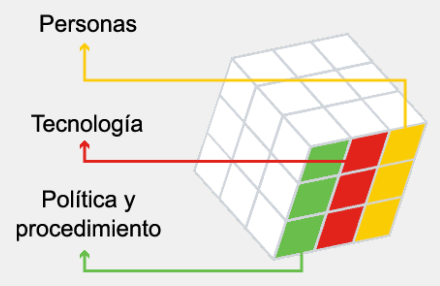

<a href="./00-Curso.md"><< Menú principal del módulo</a>

# 10. Principios, prácticas y procesos de ciberseguridad
# Las tres dimensiones
## El cubo de ciberseguridad
¿Ha oído hablar del cubo de la ciberseguridad? Proporciona una manera útil de pensar en la protección de datos. El cubo nos recuerda lo que implica la tarea de proteger los datos, incluidas las tres dimensiones de la seguridad de la información.

### Principios de seguridad
La primera dimensión del cubo de ciberseguridad identifica los objetivos para proteger el ciberespacio. Los principios básicos de confidencialidad, integridad y disponibilidad de datos proporcionan un enfoque que permite al experto en ciberseguridad priorizar las acciones al proteger cualquier sistema en red.

	

 

* La __confidencialidad__ de datos previene la divulgación de información a las personas, los recursos o los procesos no autorizados.
* La __integridad__ de datos hace referencia a la precisión, la uniformidad y la confiabilidad de datos.
* La __disponibilidad__ de datos garantiza que los usuarios pueden tener acceso a la información cuando sea necesario.

Utilice el acrónimo __CID__ para recordar estos tres principios.

### Estados de datos
El dominio del ciberespacio contiene una cantidad considerable de datos de importancia crítica. ¿Pero en qué estado? La segunda dimensión del cubo de ciberseguridad representa los tres estados de datos posibles:

	

 

* Datos __en tránsito__.
* Datos __almacenados__.
* Datos __en proceso__.

La ciberseguridad eficaz requiere la protección de datos en los tres estados. No podemos centrarnos solo en proteger los datos que se están procesando, ni solo en los datos almacenados.

Utilice el acrónimo __TAD__ para recordar estos tres principios.

### Medidas de seguridad
La tercera dimensión del cubo de ciberseguridad define los pilares en los que debemos basar nuestras defensas de ciberseguridad para proteger los datos y la infraestructura en el ámbito digital.

	

 

Estas son __tecnología__, __políticas__ y __prácticas__, y mejoran la educación, la capacitación y la concienzación de las personas.
Los profesionales de ciberseguridad deben utilizar una variedad de habilidades y disciplinas diferentes a su disposición al proteger los datos y la infraestructura en el ciberespacio.

## Tríada de la CIA: el principio de confidencialidad
Para lograr la confidencialidad sin usar cifrado, la _tokenización_ es una técnica de sustitución que puede aislar los elementos de datos de la exposición a otros sistemas de datos. Un valor aleatorio sin relación matemática reemplaza los datos originales. Fuera del sistema, un _token_ no tiene valor y no tiene sentido. La _tokenización_ puede conservar el formato de datos (su tipo y longitud de datos), lo que lo hace útil para bases de datos y procesamiento de pagos con tarjeta.

La administración de derechos abarca tanto la __administración de derechos digitales__ (DRM - _Digital Rights Management_) como la __administración de derechos de información__ (IRM - _Information Rights Management_). Protege los datos del dispositivo del acceso no autorizado mediante el cifrado del disco.

DRM<a href="#enlaces-de-interés">1</a> protege el material con derechos de autor, como música, películas o libros. Cuando dicho contenido aparece en forma digital (por ejemplo, en CD, mp3 o libro electrónico), se cifra, por lo que los medios no se pueden copiar sin la clave de descifrado. La clave de descifrado está disponible solo para las partes con licencia.

IRM<a href="#enlaces-de-interés">2</a> se utiliza con correo electrónico y otros archivos que son relevantes para las actividades y las comunicaciones de una organización. Cuando esta información se comparte con otros, IRM permite que el propietario del documento, la organización o uno de sus miembros controlen y administren el acceso al documento.

## Protección de la privacidad de los datos
Ahora que conoce los aspectos básicos sobre la protección de datos confidenciales, recuerde que las organizaciones recopilan una gran cantidad de datos y, si bien gran parte de ellos están a disposición del público, algunos datos son información confidencial que debe mantenerse confidencial.

A medida que que las empresas crecen, habrá cada vez más datos confidenciales que deben protegerse contra el acceso no autorizado.

Los tipos de información confidencial se dividen en tres categorías: información __personal__, información __comercial__ e información __clasificada__.

## Integridad de Datos
La integridad es la precisión, uniformidad y confiabilidad de los datos durante su ciclo de vida.

Los datos experimentan varias operaciones como captura, almacenamiento, recuperación, actualización y transferencia. Las entidades no autorizadas deben mantener inalteradas los datos durante todas estas operaciones.

Los métodos utilizados para garantizar la integridad de los datos incluyen la función de hash, las comprobaciones de validación de datos, las comprobaciones de consistencia de los datos y los controles de acceso. Los sistemas de integridad de datos pueden incluir uno o más de estos métodos.

La integridad de datos es un componente fundamental de la seguridad informática. Proteger la integridad de los datos es un desafío constante para la mayoría de las organizaciones. La pérdida de la integridad de los datos puede lograr que todos los recursos de datos sean dudosos o inutilizables.

Sin embargo, la importancia de la integridad de los datos varía según la forma en que una organización utiliza sus datos. Por ejemplo, un banco o una organización financiera asigna una mayor importancia a la integridad de los datos que un canal de redes sociales.
* __Nivel crítico__. En una organización de servicios de salud, la integridad de datos puede ser una cuestión de vida o muerte. La información sobre prescripciones debe ser precisa. Por lo tanto, todos los datos se validan, prueban y verifican continuamente.
* __Alto nivel de necesidad__. En una organización basada en análisis o comercio electrónico, las transacciones y las cuentas de clientes deben ser precisas. Todos los datos se validan y verifican a intervalos frecuentes.
* __Nivel medio de necesidad__. Las ventas en línea y los motores de búsqueda recopilan datos publicados públicamente. Se realiza poca verificación y los datos no son completamente confiables.
* __Nivel bajo de necesidad__. Los blogs, los foros y las páginas personales en las redes sociales cuentan con el respaldo de la opinión pública y de contribuciones abiertas. Los datos pueden no verificarse en absoluto, y hay un bajo nivel de confianza en el contenido.

## Disponibilidad
La disponibilidad se refiere a la necesidad de mantener la disponibilidad de la información siempre que sea necesario. Los ataques cibernéticos y las fallas en el sistema pueden impedir el acceso a los sistemas y servicios de información.

Hay muchos motivos por los que los ciberdelincuentes desean interrumpir la disponibilidad de un servicio o sistema, o incluso archivos y datos.

Eliminar un sitio web de un competidor, por ejemplo, puede proporcionar una ventaja a su competencia. Estos ataques de denegación de servicio (DoS) amenazan la disponibilidad del sistema y evitan que los usuarios legítimos tengan acceso y usen sistemas de información cuando sea necesario.

Los métodos utilizados para garantizar la disponibilidad incluyen la redundancia del sistema, las copias de seguridad del sistema, mayor recuperabilidad del sistema, mantenimiento del equipo, sistemas operativos y software actualizados y planes para recuperarse rápidamente de desastres no planificados.

## Garantía de disponibilidad
Hay muchas medidas que las organizaciones pueden implementar para garantizar la disponibilidad de sus servicios y sistemas. Analicemos algunos ejemplos.
* __Realizar el mantenimiento del equipo__. El mantenimiento regular de los equipos puede mejorar significativamente el tiempo de actividad del sistema. El mantenimiento incluye el reemplazo, la limpieza y la alineación de los componentes.
* __Acutalizaciones y parches de los sistemas operativos__. Los sistemas operativos, las aplicaciones y los programas de software modernos, se actualizan continuamente para corregir los errores y eliminar las vulnerabilidades. En toda organización, todos los sistemas, las aplicaciones y los software se deben actualizar de forma periódica. Los profesionales de ciberseguridad pueden suscribirse a las alertas que anuncian nuevas versiones de actualización.
* __Realizar las pruebas de copia de respaldo__. El respaldo de los datos de la organización, los datos de configuración y los datos personales garantizan la disponibilidad del sistema. Los sistemas de respaldo también deben comprobarse para garantizar que estos sistemas funcionen correctamente y que los datos se puedan recuperar en caso de pérdida de datos.
* __Realizar una planificación para evitar desastres__. La planificación para evitar desastres es una pieza fundamental en el aumento de la disponibilidad del sistema. Los empleados y los clientes deben saber cómo responder ante un desastre. El equipo de ciberseguridad debe practicar la respuesta y probar los sistemas de respaldo, y conocer los procedimientos para restaurar los sistemas críticos.
* __Realizar implementaciones de nuevas tecnologías__. La alta disponibilidad requiere la evaluación continua y la prueba de nuevas tecnologías para responder a las nuevas amenazas y los nuevos ataques. Los profesionales cibernéticos también deben utilizar las tecnologías, los productos y los dispositivos nuevos.
* __Monitoreo activo__. La supervisión continua del sistema aumenta la disponibilidad de este. La supervisión de los registros de eventos, las alertas del sistema y los registros de acceso proporciona al profesional de ciberseguridad la información del sistema en tiempo real. Tal monitoreo puede identificar ataques en segundos y permitir que los profesionales de ciberseguridad los rechacen rápidamente, cuando ocurren.
* __Realizar la prueba de disponibilidad__. Todos los sistemas deben probarse para encontrar vulnerabilidades. Las pruebas pueden incluir análisis de puertos y vulnerabilidades, y pruebas de penetración.

## Lab - El Cubo de Hechicería de Ciberseguridad Scatter Quizlet
* <a href="./notes/lab_cubo_ciberseguridad_scatter.md" target="_blank">El Cubo de Hechicería de Ciberseguridad Scatter Quizlet</a>

## Packet Tracer: verificación de la integridad de datos y archivos
* <a href="./notes/pt_verificacion_integridad_datos.md" target="_blank">Verificación de la integridad de datos y archivos</a>

## Packet Tracer: exploración del cifrado de archivos y datos
* <a href="./notes/pt_cifrado_archivos_datos.md" target="_blank">Exploración del cifrado de archivos y datos</a>

# Estado de los datos
Ahora está informado sobre los principios de seguridad de la información. A continuación, analizaremos en mayor detalle los estados de los datos y los desafíos que enfrentan las organizaciones al proteger los datos durante la transmisión, el almacenamiento y el procesamiento.

## Datos en reposo
"Datos en reposo" se refiere a los datos almacenados. En pocas palabras, es el estado en el que se encuentran los datos cuando ningún usuario o proceso accede a ellos, los solicita o los modifica. Los datos en reposo pueden almacenarse en dispositivos locales, como un disco duro en la computadora de un usuario, o centralizarse en una red, como el servidor de una organización.

Los datos que no están en tránsito o en proceso se consideran datos en reposo. Si tiene datos que necesita almacenar y desea acceder más tarde, existen varias opciones de almacenamiento.
* __Alamcenamiento de conexión directa (DAS)__. Este tipo de almacenamiento está conectado a una computadora. Una unidad de disco duro o una unidad de memoria flash USB son un ejemplo de almacenamiento de conexión directa. De manera predeterminada, los sistemas no están configurados para compartir el almacenamiento de conexión directa.
* __Matriz redundante de discos independientes (RAID, _Redundant Array of Independent Disks_)__. Estas soluciones de almacenamiento profesional utilizan varias unidades de disco duro en una matriz, que es un método para combinar varios discos para que el sistema operativo los vea como un solo disco. RAID proporciona un mejor rendimiento y una mejor tolerancia a fallas.
* __Almacenamiento conectado en red__. Este es un dispositivo de almacenamiento conectado a una red que permite el almacenamiento y la recuperación de datos desde una ubicación centralizada por parte de usuarios autorizados de la red. Los dispositivos de NAS son flexibles y escalables, lo cual significa que los administradores pueden aumentar la capacidad según sea necesario.
* __Red de área de almacenamiento (SAN)__. Una arquitectura de red de área de almacenamiento (SAN) es un sistema de almacenamiento con base en la red. Los sistemas de SAN se conectan a la red mediante las interfaces de alta velocidad que permiten un mejor rendimiento y la capacidad para conectarse varios servidores a un repositorio centralizado de almacenamiento en disco.
* __Almacenamiento en la nube__. El almacenamiento en la nube es una opción de almacenamiento remoto que usa el espacio en un proveedor del centro de datos y es accesible desde cualquier computadora con acceso a Internet. Google Drive, iCloud y Dropbox son ejemplos de proveedores de almacenamiento en la nube.

## Desafíos de proteger los datos almacenados
Para mejorar el almacenamiento de datos, las empresas pueden automatizar y centralizar las copias de respaldo de datos.

El almacenamiento de conexión directa puede ser uno de los tipos más difíciles de almacenamiento de datos en administrar y controlar. El almacenamiento de conexión directa es vulnerable a los ataques maliciosos en el host local.

Los datos en reposo también incluyen datos de respaldo (cuando no se están escribiendo o en tránsito). Las copias de respaldo pueden ser manuales o automáticas. Las organizaciones deben limitar los tipos de datos almacenados en el almacenamiento de conexión directa.

Los sistemas de almacenamiento en red ofrecen una alternativa más segura. Los sistemas de almacenamiento en red incluidos RAID, SAN y NAS proporcionan mayor rendimiento y redundancia. Sin embargo, los sistemas de almacenamiento en red son más complicados para configurar y administrar. También manejan más datos, lo que presenta un mayor riesgo para la organización si falla el dispositivo. Los desafíos únicos de los sistemas de almacenamiento en red incluyen configurar, probar y monitorear el sistema.

## Métodos de transmisión de datos
Los datos en tránsito son el segundo estado que analizaremos, y se refieren simplemente a los datos que se transmiten: no están en reposo ni en uso.
La transmisión de datos implica el envío de la información de un dispositivo a otro. Existen numerosas maneras de transmitir datos entre dispositivos.
* __Red de transferencia__. Una red de zapatillas utiliza medios extraíbles para mover físicamente los datos de una computadora a otra. Las organizaciones nunca podrán eliminar el uso de una red de transferencia. 
* __Redes cableadas__. Las redes cableadas incluyen medios de cobre y fibra óptica y pueden dar servicio a una red de área local (LAN) o abarcar grandes distancias en redes de área amplia (WAN).
* __Redes inalámbricas__. Las redes inalámbricas no utilizan cables para transmitir datos. Las redes inalámbricas están reemplazando a las redes cableadas a medida que se vuelven más rápidas y capaces de manejar más tráfico. Las redes inalámbricas extienden la cantidad de usuarios invitados con los dispositivos móviles en la oficina pequeña y oficina doméstica (SOHO) y las redes empresariales. Esto también aumenta la superficie de ataque de la red.

Las redes cableadas e inalámbricas utilizan paquetes o unidades de datos. El término paquete se refiere a una unidad de datos que se desplaza entre un origen y un destino de la red. Los protocolos estándar como el protocolo de Internet (IP) y el Hypertext Transfer Protocol (HTTP) definen la estructura y formación de paquetes de datos. Estos estándares son de código abierto y están disponibles al público. La protección de la confidencialidad, integridad y disponibilidad de los datos transmitidos es una de las responsabilidades más importantes de un profesional de ciberseguridad.

## Desafíos de los datos en tránsito
La protección de los datos transmitidos es uno de los trabajos más desafiantes para un profesional de ciberseguridad. Con el crecimiento de los dispositivos móviles e inalámbricos, y las crecientes cantidades de datos recopilados y almacenados por las organizaciones, los profesionales de ciberseguridad son responsables de proteger cantidades masivas de datos que cruzan su red diariamente.

Tenemos varios desafíos que enfrentar si queremos proteger estos datos.
* __Protegiendo la confidencialidad de los datos en tránsito__. Los ciberdelincuentes pueden capturar, guardar o robar datos en tránsito. Los profesionales de ciberseguridad deben tomar medidas para proteger los datos en tránsito, como implementar VPN, usar SSL e IPsec, y otros métodos de cifrado de datos para la transmisión.
* __Protegiendo la integridad de los datos en tránsito__. Los ciberdelincuentes pueden interceptar y alterar los datos en tránsito. Los profesionales de ciberseguridad implementan sistemas de integridad de los datos que evalúan la integridad y la autenticidad de los datos transmitidos para responder a estas acciones. Estos sistemas incluyen, por ejemplo, hash y redundancia de datos.
* __Protegiendo la disponibilidad de datos en tránsito__. Los ciberdelincuentes pueden utilizar dispositivos maliciosos o no autorizados para interrumpir la disponibilidad de los datos y capturarlos en tránsito. Un dispositivo móvil simple puede presentarse como un punto de acceso inalámbrico local y engañar a los usuarios desprevenidos al asociarse con el dispositivo falso. Los delincuentes cibernéticos puede secuestrar una conexión autorizada a un servicio o un dispositivo protegido. A medida que los datos se transmiten desde y hacia el dispositivo de la víctima, el ciberdelincuente puede interceptarlo e incluso eliminarlo, lo que afecta su disponibilidad.
Los profesionales de seguridad de red pueden implementar sistemas de autenticación mutua para responder a estas acciones. Los sistemas de autenticación mutua requieren que el usuario autentique al servidor y solicita que el servidor autentique al usuario. De esta manera, el dispositivo de un usuario puede saber cuándo se está contactando o si está recibiendo solicitudes de datos de sistemas dudosos no autenticados, como el del atacante en el ejemplo anterior.

## Datos en proceso
Los datos en proceso se refieren a los datos durante la entrada inicial, la modificación, el cálculo o la salida. Es el estado en el que se encuentran los datos cuando no están en tránsito ni en reposo; en términos simples, son los datos que se están procesando.
* __Entrada__. La protección de la integridad de los datos comienza con la entrada inicial de datos. Las organizaciones utilizan varios métodos para recopilar datos, como ingreso manual de datos, formularios de análisis, cargas de archivos y datos recopilados de los sensores.
	Un ejemplo de daños a los datos durante el proceso de captación, incluye errores en la entrada de datos o sensores del sistema desconectados, con funcionamiento incorrecto o inoperables.
* __Modificación__. La modificación de datos es cualquier cambio realizado en los datos originales, como la modificación manual de datos por parte de los usuarios y el procesamiento y cambio de datos por parte de los programas. Estos cambios son intencionales. Los procesos como la codificación y decodificación, compresión y descompresión y cifrado y descifrado son ejemplos de la modificación de los datos.
	Pero los cambios en los datos pueden ser involuntarios o maliciosos. Cuando los datos se modifican de una manera que impide que sean legibles o utilizables, esto a menudo se denomina corrupción de datos. Por ejemplo, la falla de los equipos puede ocasionar daños en los datos. El código malicioso también provoca daños en los datos.
* __Resultado__. La salida de datos se refiere a los datos que salen de impresoras, pantallas electrónicas o directamente a otros dispositivos.
	La precisión de los datos de salida es fundamental ya que el resultado proporciona información y afecta la toma de decisiones. Los ejemplos de daños a los datos incluyen el uso incorrecto de delimitadores de datos, configuraciones incorrectas de comunicación e impresoras configuradas incorrectamente.

## Lab - Desafíos de seguridad de los datos
* <a href="./notes/lab_desafio_seguridad_datos.md" target="_blank">Desafíos de seguridad de los datos</a>

# Contramedidas de ciberseguridad
## Tecnologías basadas en hardware y software
En el mundo de la ciberseguridad, tanto el software como el hardware se utilizan para proteger los datos y los sistemas de las organizaciones.

Las medidas de protección de software incluyen programas y servicios que protegen los sistemas operativos, las bases de datos y otros servicios que operan en las estaciones de trabajo, los dispositivos portátiles y los servidores.

Los administradores instalan las contramedidas o las protecciones basadas en software en los hosts o los servidores individuales.
* __Firewalls de software__. Los firewalls del software controlan el acceso remoto a un sistema. Los sistemas operativos generalmente incluyen un firewall o un usuario puede adquirir o descargar un software de terceros.
* __Escáneres de red y puertos__. Estos descubren y monitorean puertos abiertos en un host o servidor.
* __Analizadores de protocolos__. También conocidos como analizadores de firmas, estos son dispositivos que recopilan y examinan el tráfico de la red. Identifican problemas de rendimiento, detectan configuraciones incorrectas, identifican aplicaciones que se comportan mal, establecen patrones de tráfico normales y de referencia, y depuran problemas de comunicación.
* __Analizadores de vulnerabilidades__. Estos son programas diseñados para evaluar debilidades en computadoras o redes.
* __Sistemas de detección de intrusos basados en host (IDS)__. Estos examinan la actividad solo en sistemas host. Un IDS genera archivos de registro y mensajes de alarma cuando detecta actividad inusual. Un sistema que almacena datos confidenciales o que proporciona servicios críticos es un candidato para el IDS basado en host.

Existen varias tecnologías basadas en hardware utilizadas para proteger los activos de la organización: Entre ellos se incluyen:
* __Firewalls__. Estos bloquean el tráfico no deseado. Los firewalls contienen reglas que definen el tráfico permitido dentro y fuera de la red.
* __Servidores proxy__. Los servidores proxy utilizan un esquema de direccionamiento de red para presentar una dirección IP de toda la organización en Internet. Por lo tanto, un servidor proxy funciona en nombre del cliente al solicitar el servicio, enmascarando potencialmente el verdadero origen de la solicitud al servidor de recursos.
* __Control de acceso basado en hardware__. Este término se refiere a los dispositivos que utilizan tecnología biométrica, como escáneres de huellas dactilares o iris, para confirmar la identidad de cualquier persona que intente acceder a servidores, datos y sistemas.
* __Conmutadores de red__. Como parte integral de la red, los switches se utilizan comúnmente como punto de conexión, ya que conectan otros dispositivos, por ejemplo, en una red de área local. Sus características les permiten aumentar la eficacia de la seguridad de la red.

## Estableciendo una cultura de conocimiento de la ciberseguridad
Invertir mucho dinero en tecnología no variará si las personas dentro de la organización son el eslabón más débil en el área de ciberseguridad.

Un programa de reconocimiento de seguridad y políticas de seguridad sólidas e integrales son extremadamente importantes para cualquier organización. Un empleado puede no ser malicioso de manera intencionada, pero no conocer cuáles son los procedimientos adecuados. Hay varias maneras de implementar la capacitación para evitar esto y garantizar que todos los empleados se sientan bien informados y seguros para que las mejores prácticas de ciberseguridad formen parte de sus actividades cotidianas.
* Formación y capacitación.
	* Haga de la capacitación en el conocimiento de la seguridad una parte del proceso de incorporación de los empleados.
	* Vincule la conciencia de seguridad con los requisitos del trabajo o las evaluaciones de desempeño.
	* Realice sesiones de capacitación en persona mediante gamificación y actividades (por ejemplo, capture los escenarios de la bandera).
	* Complete los módulos y cursos en línea.
* Programas de concienzación de seguridad. Un programa de reconocimiento de seguridad depende de:
	* El entorno de organización.
	* El nivel de amenaza.
	* La naturaleza y las exigencias de los datos que posee la organización.
	Las personas son la primera línea de defensa en ciberseguridad, y cada organización es tan fuerte como su eslabón más débil. Cada miembro de uan organización debe conocer sus políticas de seguridad e implementarlas en sus actividades cotidianas.

Es importante tener en cuenta que una vez no es suficiente: la conciencia de seguridad debe ser un proceso continuo, ya que siempre hay nuevas amenazas y técnicas en el horizonte. Desarrollar una cultura de ciberseguridad eficaz requiere un esfuerzo continuo y liderazgo de la gerencia, así como el compromiso de todos los miembros del equipo.

## Políticas
Una política de seguridad establece los objetivos de seguridad, las reglas de comportamiento y los requisitos del sistema que se deben cumplir.

Una política de seguridad completa logra varias tareas:
* Demuestra el compromiso de una organización con la seguridad.
* Establece las reglas para el comportamiento esperado.
* Garantiza la uniformidad en las operaciones del sistema, el software y la adquisición y uso de hardware, y el mantenimiento.
* Define las consecuencias legales de violaciones.
* Brinda al personal de seguridad el respaldo de la administración.

Las políticas de seguridad informan a los usuarios, al personal y a los gerentes los requisitos de una organización para proteger la tecnología y los activos de información. Una política de seguridad también especifica los mecanismos necesarios para cumplir con los requisitos de seguridad.
* __Políticas de identificación y autenticación__. Especifican cuáles son las personas autorizadas que pueden acceder a los recursos de red y describen los procedimientos de verificación.
* __Políticas de contraseña__. Garantizan que las contraseñas cumplan con requisitos mínimos y se cambien periódicamente.
* __Política de uso aceptable__. Identifica las aplicaciones de red y los usos que son aceptables por la organización. También puede identificar las consecuencias de las violaciones de la política.
* __Políticas de acceso remoto__. Identifican cómo los usuarios remotos pueden obtener acceso a la red y qué elementos son accesibles a través de la conectividad remota.
* __Políticas de mantenimiento de la red__. Especifican los sistemas operativos de los dispositivos de la red y los procedimientos de actualización de las aplicaciones de los usuarios finales.
* __Políticas de manejo de incidentes__. Describen cómo se tratan los incidentes de seguridad.

Uno de los componentes más comunes de la política de seguridad es una política de uso aceptable (AUP - _Acceptable Usage Policy_). Este componente define qué pueden y no pueden realizar los usuarios en los distintos componentes del sistema. El AUP debe ser lo más explícito posible para evitar la malinterpretación. Por ejemplo, un AUP enumera las páginas web, los grupos informativos o las aplicaciones de uso intensivo de ancho de banda específicos a las que los usuarios no pueden acceder utilizando las computadoras o la red de la empresa.

## Normas
Los estándares ayudan al personal de TI a mantener la uniformidad en el funcionamiento de la red.
* Las políticas de seguridad informan a los usuarios, al personal y a los gerentes los requisitos de una organización para proteger la tecnología y los activos de información. Esto permite al personal de TI mejorar la eficiencia y simplicidad en el diseño, el mantenimiento y la resolución de problemas.
* Uno de los principios de seguridad más importantes es el de uniformidad. Por este motivo, es necesario que las organizaciones establezcan estándares. Cada organización desarrolla estándares para admitir el entorno operativo único.
* Un ejemplo de un estándar sería la política de contraseñas de una organización. El estándar es que las contraseñas requieran un mínimo de ocho caracteres alfanuméricos de letras mayúsculas y minúsculas, con al menos un carácter especial. Además, la política de contraseñas puede especificar que los usuarios deben cambiar sus contraseñas cada 30 días. Se puede mantener un historial de contraseñas para las 12 contraseñas más recientes para evitar que cualquier persona reutilice las mismas contraseñas durante un período de doce meses.

## Directrices
Las pautas constan de una lista de sugerencias sobre cómo hacer las cosas de manera más eficaz y segura. Son similares a los estándares, pero son más flexibles y generalmente no son obligatorias.

Las pautas definen cómo se desarrollan los estándares y garantizan el cumplimiento de las políticas de seguridad general. Algunas de las pautas más útiles conforman las mejores prácticas de una organización.

Además de las mejores prácticas que define una organización, las pautas también están disponibles a partir de lo siguiente:

Instituto Nacional de Normas y Tecnología (NIST), Centro de recursos de seguridad informática.
Departamento de Seguridad Nacional (NSA), Guías para la configuraciones de seguridad.
El estándar de criterios comunes

Usando el ejemplo de la política de contraseñas, una guía puede ser una sugerencia de que el usuario tome una frase que sea memorable para ellos, como "Tengo un sueño", y la convierta en una contraseña segura reemplazando letras con caracteres, p. `Ihv@dr3@m`. El usuario puede crear otras contraseñas a partir de esta frase al cambiar el número, mover el símbolo o cambiar el signo de puntuación.

## Procedimientos
Los documentos de procedimiento son más detallados que los estándares y las pautas. Los documentos de procedimiento incluyen detalles de implementación que contienen generalmente instrucciones paso a paso y gráficos.
Las grandes organizaciones deben usar documentos de procedimientos para mantener la uniformidad de la implementación que se necesita para un entorno seguro.

# Resumen
Las redes cableadas utilizan cables para transmitir datos. Las redes cableadas incluyen medios de cobre y fibra óptica y pueden dar servicio a una red de área local (LAN) o abarcar grandes distancias en redes de área amplia (WAN).

## Las tres dimensiones
La primera dimensión del cubo de ciberseguridad identifica los objetivos para proteger el ciberespacio. La confidencialidad de datos previene la divulgación de información a las personas los recursos o los procesos no autorizados. La integridad de datos hace referencia a la precisión, la uniformidad y la confiabilidad de datos. La disponibilidad de datos garantiza que los usuarios pueden tener acceso a la información cuando sea necesario. Utilice el acrónimo CID para recordar estos tres principios. La segunda dimensión del cubo de ciberseguridad representa los tres estados de datos posibles: datos en tránsito, datos en reposo o en almacenamiento, y datos en proceso.

La tercera dimensión del cubo de ciberseguridad define los pilares en los que se basan las defensas de ciberseguridad. Estos son: 1. tecnología, 2. políticas y prácticas, y 3. mejora de la educación, la capacitación y la concientización de las personas.

Para lograr la confidencialidad sin usar cifrado, la tokenización es una técnica de sustitución que puede aislar los elementos de datos de la exposición a otros sistemas de datos. La administración de derechos abarca tanto la administración de derechos digitales (DRM) como la administración de derechos de información (IRM). Protege los datos del dispositivo del acceso no autorizado mediante el cifrado del disco. Los tipos de información confidencial se dividen en tres categorías: información personal, información comercial e información clasificada. Algunas organizaciones implementan tecnologías de mejora de la privacidad, como el anonimato, la minimización de datos y la tokenización para ayudar a resolver los problemas de privacidad de datos.

La integridad es la precisión, uniformidad y confiabilidad de los datos durante su ciclo de vida. Los métodos utilizados para garantizar la integridad de los datos incluyen la función de hash, las comprobaciones de validación de datos, las comprobaciones de consistencia de los datos y los controles de acceso. La disponibilidad garantiza que se pueda acceder a la información siempre que sea necesario. Las acciones que ayudan a garantizar la disponibilidad incluyen mantenimiento de equipos, actualizaciones de software y SO y parches, pruebas de respaldo, planificación ante desastres, implementaciones de nuevas tecnologías, monitoreo de actividad y pruebas de disponibilidad.

## Estados de los datos
La seguridad de la información requiere que los datos estén protegidos en los tres estados: en reposo, en tránsito y en proceso. Los datos están en reposo cuando ningún usuario o proceso accede a ellos, los solicita o los modifica. Los datos pueden almacenarse en DAS, RAID, NAS, SAN o en la nube. El almacenamiento de conexión directa es vulnerable a los ataques maliciosos en el host local. Los datos en reposo también incluyen datos de respaldo (cuando no se están escribiendo o en tránsito). Las copias de respaldo pueden ser manuales o automáticas. Los sistemas de almacenamiento en red incluidos RAID, SAN y NAS proporcionan mayor rendimiento y redundancia. Manejan una gran cantidad de datos, lo que representa un mayor riesgo para la organización si el dispositivo falla. Los desafíos únicos de los sistemas de almacenamiento en red incluyen configurar, probar y monitorear el sistema.

Los datos en tránsito son datos que se transmiten, no están en reposo ni en uso. Una red de zapatillas utiliza medios extraíbles para mover físicamente los datos de una computadora a otra. Las redes cableadas incluyen medios de cobre y fibra óptica y pueden dar servicio a una red de área local (LAN) o abarcar grandes distancias en redes de área amplia (WAN). Las redes cableadas e inalámbricas utilizan paquetes o unidades de datos. Los protocolos estándar como el protocolo de Internet (IP) y el Hypertext Transfer Protocol (HTTP) definen la estructura y formación de paquetes de datos. Los ciberdelincuentes pueden capturar, guardar o robar datos en tránsito. Los profesionales de ciberseguridad pueden implementar VPN mediante SSL, IPsec y otros métodos de cifrado. Los ciberdelincuentes pueden interceptar y alterar los datos en tránsito. Los profesionales de ciberseguridad implementan sistemas de integridad de los datos que evalúan la integridad y la autenticidad de los datos transmitidos para responder a estas acciones. Estos sistemas incluyen hash y redundancia de datos. Los ciberdelincuentes pueden utilizar dispositivos maliciosos o no autorizados para interrumpir la disponibilidad de los datos y capturarlos en tránsito. Los sistemas de autenticación mutua requieren que el usuario autentique al servidor y solicita que el servidor autentique al usuario.

Los datos en proceso se refieren a los datos durante la entrada inicial, la modificación, el cálculo o la salida

La protección de la integridad de los datos comienza con la entrada inicial de datos. Las organizaciones utilizan varios métodos para recopilar datos, como ingreso manual de datos, formularios de análisis, cargas de archivos y datos recopilados de los sensores.

La corrupción durante el proceso de entrada puede incluir etiquetas incorrectas y formatos de datos incorrectos o no coincidentes, errores de entrada de datos o sensores del sistema desconectados y/o que funcionan mal o no funcionan. Cuando los datos se modifican de una manera que impide que sean legibles o utilizables, esto a menudo se denomina corrupción de datos. Los ejemplos de daños a los datos incluyen el uso incorrecto de delimitadores de datos, configuraciones incorrectas de comunicación e impresoras configuradas incorrectamente. La modificación de datos no válidos durante el procesamiento puede tener un impacto adverso, y es importante mitigar estos casos.

## Contramedidas de ciberseguridad
Los administradores pueden instalar las siguientes medidas o medidas de seguridad basadas en software en hosts o servidores individuales: firewalls de software, escáneres de puertos y redes, analizadores de protocolos, escáneres de vulnerabilidades e IDS basados en hosts. Un programa de concientización sobre seguridad y políticas de seguridad sólidas e integrales son extremadamente importantes. Haga de la capacitación en el conocimiento de la seguridad una parte del proceso de incorporación de los empleados Vincule la conciencia de seguridad con los requisitos del trabajo o las evaluaciones de desempeño. Realice sesiones de capacitación en persona mediante gamificación y actividades. Completar los cursos en línea

Un programa de reconocimiento de seguridad activo depende del entorno y la red de la organización, el nivel de amenaza y la naturaleza y las demandas de los datos que la organización posee. El desarrollo de la conciencia de seguridad debe ser un proceso continuo porque siempre surgen nuevas amenazas y técnicas.

El desarrollo de la conciencia de seguridad debe ser un proceso continuo porque siempre surgen nuevas amenazas y técnicas. Establece las reglas para el comportamiento esperado y asegura la consistencia en las operaciones del sistema y la adquisición, uso y mantenimiento de software y hardware. Define las consecuencias legales de las violaciones y brinda al personal de seguridad el respaldo de la administración. Los tipos de políticas de seguridad incluyen identificación y autenticación, contraseñas, uso aceptable, acceso remoto, mantenimiento de la red y manejo de incidentes.

Los documentos de normas proporcionan las tecnologías que necesitan usuarios o programas específicos. Además, especifican los requisitos o criterios del programa que debe seguir una organización. Esto permite al personal de TI mejorar la eficiencia y simplicidad en el diseño, el mantenimiento y la resolución de problemas. Además de las mejores prácticas definidas de una organización, las siguientes pautas también están disponibles en: el Centro de recursos de seguridad informática del Instituto Nacional de Estándares y Tecnología (NIST), las Guías de configuración de seguridad de la Agencia de Seguridad Nacional (NSA) y el estándar de Criterios comunes.

Los documentos de procedimiento son más detallados que los estándares y las pautas. Los documentos de procedimiento incluyen detalles de implementación que contienen generalmente instrucciones paso a paso y gráficos.

# Enlaces de interés
1. <a href="https://universoabierto.org/2016/01/29/que-son-para-que-sirve-y-como-funcionan-los-drm/" target="_blank">¿Qué son, para qué sirven y cómo funcionan los DRM?</a>
2. <a href="https://rfegolf.es/_layouts/help.aspx?lcid=3082&cid0=MS.WSS.manifest&tid=MS.WSS.HA10128001" target="_blank">¿Qué es _Information Rights Management_ (IRM)?</a>
3. 
 
 
 
 
 
 
 
 
 
<a href="#10-principios-prácticas-y-procesos-de-ciberseguridad">⬆️</a>
<a href="./00-Curso.md"><< Menú principal del módulo</a>