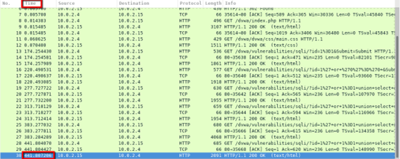
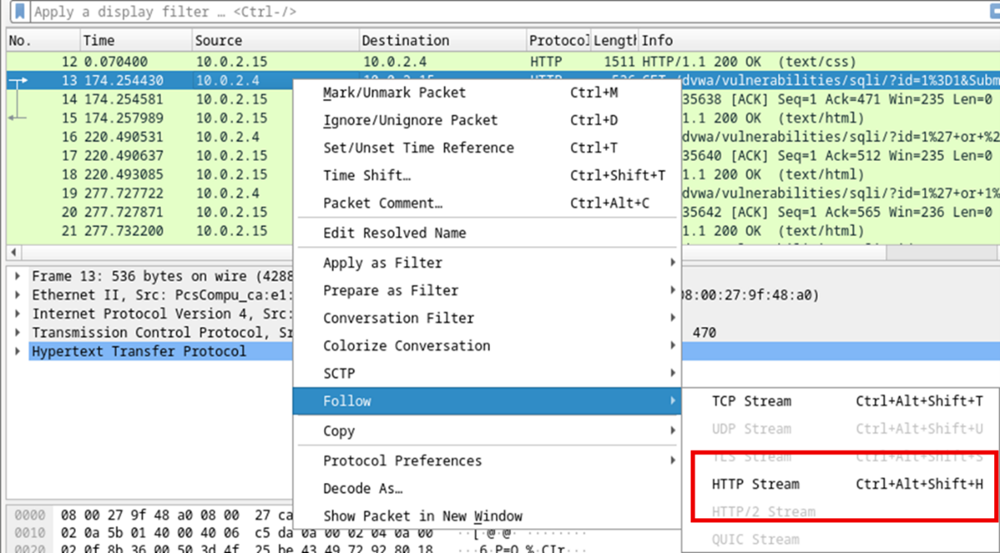
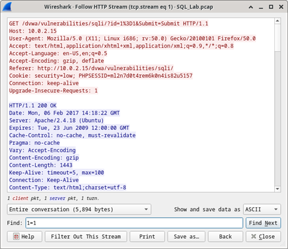
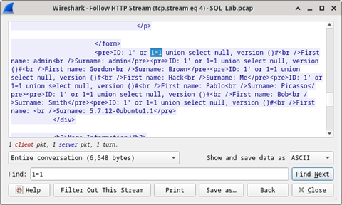
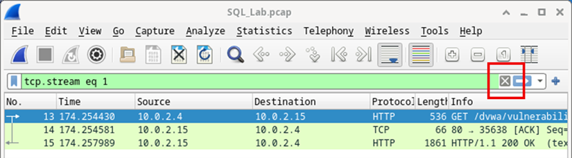
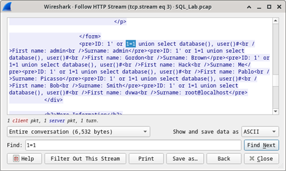
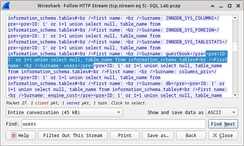
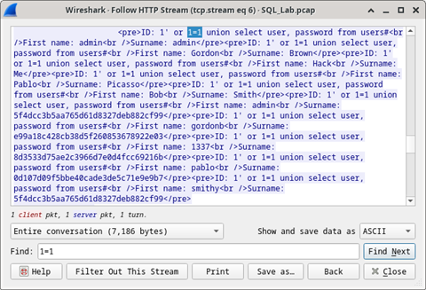

<title coding="utf-8">Atacar una base de datos mySQL</title>

# Laboratorio - Atacar una base de datos mySQL
# Objetivos
En esta práctica de laboratorio verán un archivo PCAP de un ataque anterior a una base de datos SQL.
* Parte 1: Abrir Wireshark y cargar el archivo PCAP.
* Parte 2: Visualizar el ataque de inyección SQL.
* Parte 3: El ataque de inyección SQL continúa...
* Parte 4: El ataque de inyección SQL proporciona información del sistema.
* Parte 5: El ataque de inyección SQL e información de tablas
* Parte 6: El ataque de inyección SQL concluye.

# Trasfondo/Situación
Los ataques de inyección SQL permiten que los hackers maliciosos escriban sentencias SQL en un sitio web y reciban una respuesta de la base de datos. Esto permite que los atacantes modifiquen los datos actuales de la base de datos, suplanten identidades y ejecuten malware variado.

Hemos creado un archivo PCAP para que vean un ataque anterior a una base de datos SQL. En esta práctica de laboratorio verán los ataques a la base de datos SQL y responderán las preguntas.

# Recursos necesarios
* Máquina virtual Security Workstation

# Instrucciones
Utilizará Wireshark, un analizador de paquetes de red común, para analizar el tráfico de red. Después de iniciar Wireshark, abrirá una captura de red ya guardada y verá un ataque de inyección SQL paso a paso contra una base de datos SQL.

## Parte 1: Abrir Wireshark y cargar el archivo PCAP
La aplicación Wireshark se puede abrir por medio de diversos métodos en una estación de trabajo de Linux.
1. Inicie la máquina virtual Security Workstation.
2. En el escritorio haga clic en Aplicaciones > CyberOPS > Wireshark y luego busque la aplicación Wireshark.
3. En la aplicación Wireshark, hagan clic en Open (Abrir) en el medio de la aplicación, en la sección Files (Archivos).
4. Vaya al directorio `/home/analyst/` y busque `lab.support.files`. En el directorio `lab.support.files` abra el archivo `SQL_Lab.pcap`.
5. El archivo PCAP se abre dentro de Wireshark para mostrar el tráfico de red capturado. Este archivo de captura se extiende por un período de 8 minutos (441 segundos), la duración de este ataque de inyección SQL.

	

 * En función de la información que aparece en pantalla, ¿cuáles son las dos direcciones IP involucradas en este ataque de inyección SQL?
 
## Parte 2: Visualizar el ataque de inyección SQL.
En este paso visualizarán el comienzo de un ataque.
1. Dentro de la captura de Wireshark, haga clic derecho sobre la línea 13 y seleccione Follow > HTTP Stream (Seguir flujo de HTTP). Se eligió la línea 13 porque es una solicitud GET HTTP. Esto será muy útil para seguir el flujo de datos a medida que lo ven las capas de aplicación y se genera una prueba de consulta para la inyección SQL.
El tráfico de origen se muestra en rojo. El origen ha enviado una solicitud GET al host 10.0.2.15. En color azul, el dispositivo de destino le está respondiendo al origen.

	

2. En el apartado Find (Encontrar) , escriba 1=1. Haga clic en Buscar siguiente.

	

3. El atacante ha ingresado una consulta (1=1) en un cuadro de búsqueda de UserID en el destino 10.0.2.15 para ver si la aplicación es vulnerable a la inyección SQL. En lugar de responder con un mensaje de falla en el inicio de sesión, la aplicación respondió con un registro de la base de datos. El atacante ha verificado que puede ingresar un comando SQL y que la base de datos le responderá. La cadena de búsqueda 1=1 crea una sentencia SQL que siempre será verdadera. En el ejemplo no importa lo que se haya ingresado en el campo, siempre será verdadera.

	

4. Cierre la ventana Follow HTTP Stream.
5. Haga clic en Clear display filter para mostrar toda la conversación de Wireshark.

	

## Parte 3: El ataque de inyección SQL continúa...
En este paso visualizarán cómo prosigue un ataque.
1. Dentro de la captura de Wireshark, haga clic derecho en la línea 19, y luego haga clic en Follow > HTTP Stream.
2. En el apartado Find (Encontrar) , escriba 1=1. Haga clic en Buscar siguiente.
3. El atacante ha ingresado una consulta (1’ or 1=1 union select database(), user()#) en un cuadro de búsqueda de ID de usuario en el destino 10.0.2.15. En lugar de responder con un mensaje de falla en el inicio de sesión, la aplicación respondió con la siguiente información:

	

 El nombre de la base de datos es dvwa y su respectivo usuario es root@localhost. También se muestran varias cuentas de usuario.

4. Cierre la ventana Follow HTTP Stream.
5. Haga clic en Clear display filter para mostrar toda la conversación de Wireshark.

## Parte 4: El ataque de inyección SQL proporciona información del sistema.
El atacante prosigue y comienza a buscar información más específica.
1. Dentro de la captura de Wireshark, haga clic derecho sobre la línea 22 y seleccione Follow HTTP Stream (Seguir flujo de HTTP) . El tráfico de origen se muestra en rojo, y está enviando la solicitud GET al host 10.0.2.15. En color azul, el dispositivo de destino le está respondiendo al origen.
2. En el apartado Find (Encontrar) , escriba 1=1. Haga clic en Buscar siguiente.
3. El atacante ha ingresado una consulta (1’ or 1=1 union select null, version ()#) en un cuadro de búsqueda de ID de usuario en el destino 10.0.2.15 para localizar el identificador de la versión. Observe que es el identificador de versión se encuentra al final del resultado justo antes de

	

 ¿Cuál es la versión?

4. Cierre la ventana Follow HTTP Stream.
5. Haga clic en Clear display filter para mostrar toda la conversación de Wireshark.

## Parte 5: El ataque de inyección SQL e información de tablas
El atacante sabe que hay gran cantidad de tablas SQL repletas de información. Trata de encontrarlas.
1. Dentro de la captura de Wireshark, haga clic derecho en la línea 25, y luego seleccione Follow > HTTP Stream. El origen se muestra en rojo. Ha enviado una solicitud GET al host 10.0.2.15. En color azul, el dispositivo de destino le está respondiendo al origen.
2. En el apartado Find , escriba users. Haga clic en Buscarsiguiente.
3. El atacante ha ingresado una consulta (1’ or 1=1 union select null, table_name from information_schema.tables#) en un cuadro de búsqueda de ID de usuario en el destino 10.0.2.15 para ver todas las tablas de la base de datos. Esto proporciona una enorme salida de muchas tablas, ya que el atacante especificó “null” sin más especificaciones.

	

 ¿Cuál sería el comando modificado de ( ?1' OR 1=1 UNION SELECT null, column_name FROM INFORMATION_SCHEMA.columns WHERE table_name='users')?

4. Cierre la ventana Follow HTTP Stream.
5. Haga clic en Clear display filter para mostrar toda la conversación de Wireshark.

## Parte 6: El ataque de inyección SQL concluye.
El ataque finaliza con el mejor premio posible: hashes de contraseñas.
1. Dentro de la captura de Wireshark, haga clic derecho sobre la línea 28 y seleccione Follow HTTP Stream (Seguir flujo de HTTP) . El origen se muestra en rojo. Ha enviado una solicitud GET al host 10.0.2.15. En color azul, el dispositivo de destino le está respondiendo al origen.
2. Haga clic en Find y escriba 1 =1. Busquen esta entrada. Cuando se encuentre el texto, hagan clic en Cancel (Cancelar) en el cuadro de búsqueda de texto Find.
¡El atacante ha ingresado una consulta (1’ or 1=1 union select user, password from users#) en un cuadro de búsqueda de ID de usuario en el destino 10.0.2.15 para obtener nombres de usuario y hashes de contraseñas!

	

¿Qué usuario tiene "8d3533d75ae2c3966d7e0d4fcc69216b" como hash de su contraseña?

3. Utilice un sitio web como https://crackstation.net/ para copiar el hash de la contraseña en el decodificador de hashes de contraseñas y comenzar a decodificarlo.
* ¿Cuál es la contraseña en texto plano (plain-text)?
4. Cierre la ventana Follow HTTP Stream. Y cerrar todas las ventanas abiertas.

## Preguntas de reflexión
1. ¿Cuál es el riesgo de hacer que las plataformas utilicen el lenguaje SQL?
2. Realice una búsqueda en internet sobre "Evitar ataques de inyección SQL". ¿Cuáles son 2 métodos o pasos que se pueden utilizar para evitar ataques de inyección SQL?
* Filtrar las entrada de usuario.
* Implementar un cortafuegos de aplicaciones web
* Deshabilitar características y funciones innecesarias de la base de datos
* Monitorear las sentencias SQL
* Usar procedimientos almacenados con consultas parametrizadas.

