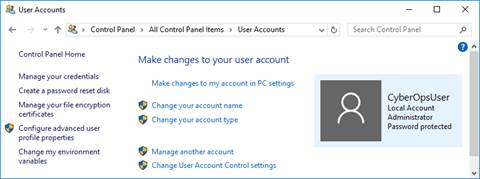
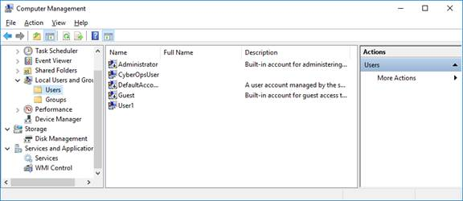
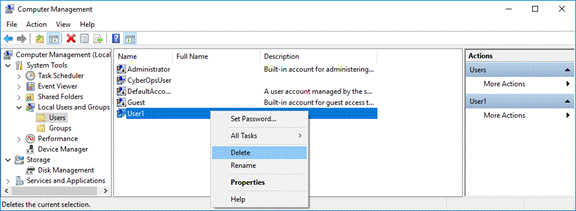

<title coding="utf-8">Crear cuentas de usuario</title>

# Práctica de laboratorio: Crea cuentas de usuario
# Introducción
En esta práctica de laboratorio usted creará y modificará cuentas de usuario en Windows.
* Parte 1: Creando una cuenta de usuario local nueva
* Parte 2: Revisando propiedades de cuentas de usuario
* Parte 3: Modificando cuentas de usuario locales

# Recursos necesarios
* Una PC con Windows

# Instrucciones
## Parte 1: Creando de una nueva cuenta de usuario local
### Paso 1: Abra la herramienta Cuenta de usuario.
1. Inicie Sesión en la PC Windows con una cuenta de administrador En este ejemplo se utiliza la cuenta CyberOpsUser.
2. Haga clic en Inicio > busqueda Panel de Control Seleccione Cuentas de usuario en la vista de Iconos pequeños. Para cambiar la vista, seleccione Iconos pequeños en la lista desplegable de Vista.

### Paso 2: Cree una cuenta de usuario.
1. En la Cuentas de usuario ventana, haga clic en Administrar otra cuenta.

	

 

2. En la Administrar cuentas ventana, haga clic en Agregue un nuevo usuario en la configuración del PC.
3. En la Configuración ventana, haga clic en Agregue a otra persona a esta PC.
4. En la ¿Cómo iniciará sesión esta persona? ventana, haga clic en No tengo la información de inicio de sesión de esta persona.
5. En la Vamos a crear su cuenta ventana, haga clic en Agregue un usuario sin una cuenta Microsoft.
6. En la Cree una cuenta para esta PC ventana, provea la información necesaria para crear la nueva cuenta de usuario llamada Usuario1 Haga clic en Siguiente para crear la cuenta de usuario nuevo.
* ¿Qué tipo de cuenta de usuario acaba de crear?
7. Intente iniciar sesión en la cuenta de usuario recién creada Esto debe tener éxito.
8. Diríjase a la carpeta C:\Usuarios. Haga clic derecho sobre la carpeta Usuario1 y seleccione Propiedades luego elija la ficha Seguridad.
* ¿Qué grupos o usuarios tienen control total de esta carpeta?
9. Abra la carpeta que pertenece a CyberOpsUser. Haga clic derecho en la carpeta y luego haga clic en la ficha Propiedades.
* ¿Pudo acceder a la carpeta? Explique.
10. Cierre la sesión de la cuenta Usuario1. Inicie sesión como CyberOpsUser.
11. Diríjase a la carpeta C:\Usuarios. Haga clic en el botón secundario en la carpeta y seleccione Propiedades. Haga clic en la pestaña Seguridad.
* ¿Qué grupos o usuarios tienen control total de esta carpeta?

## Parte 2: Revisando propiedades de cuentas de usuario
1. Hagan clic en Inicio > Busque y elija el Panel de control > Seleccione Herramientas administrativas y luego, Administración de la computadora.
2. Seleccione Usuarios y grupos locales. Haga clic en la carpeta Usuarios.

	

 

3. Haga clic con el botón derecho en Usuario1 y seleccione Propiedades.
4. Haga clic en la pestaña Miembro de.
* ¿A qué grupo pertenece __User1__?
5. Haga clic con el botón derecho en Usuario1 y seleccione Propiedades.
6. Haga clic en la pestaña Miembro de.
* ¿A qué grupo pertenece __User1__?
7. Haga clic derecho en su cuenta CyberOpsUser y seleccione Propiedades.
* ¿A qué grupo pertenece este usuario?

## Parte 3: modificar las cuentas de usuario local
### Paso 1: cambiar el tipo de cuenta.
1. Diríjase al __Panel de control__ y seleccione __Cuentas de usuario__. Haga clic en __Administrar otra cuenta__. Seleccione __User1__.
2. En la ventana __Cambiar una cuenta__, haga clic en la cuenta __User1__ . Haga clic en __Cambiar el tipo de cuenta__.
3. Seleccione el botón de opción __Administrador__ . Haga clic en __Cambiar el tipo de cuenta__.
4. Ahora la cu__enta __User1__ tiene derechos administrativos.
5. Diríjase a Panel de control > Herramientas administrativas > Administración dela computadora__. Haga clic en __Usuarios y grupos locales__.
6. Haga clic derecho en __Usuario1__ y seleccione __Propiedades__. Haga clic en la pestañana __Miembro de__.
* ¿A qué grupos pertenece __User1__?
7. Seleccione __Administradores__ y haga clic en __Quitar__ para quitar __User1__ del grupo Administrativo. Haga clic en __Aceptar__ para continuar.

### Paso 2: Eliminar la cuenta.
1. Para eliminar la cuenta, haga clic derecho sobre __User1__ y seleccione __Eliminar__.

	

 

2. Haga clic en Aceptar para confirmar la eliminación.
* ¿De qué otra manera se puede eliminar una cuenta de usuario?

# Preguntas de reflexión
1. ¿Por qué es importante proteger todas las cuentas con contraseñas seguras?
2. ¿Por qué se crearía un usuario con privilegios estándar?