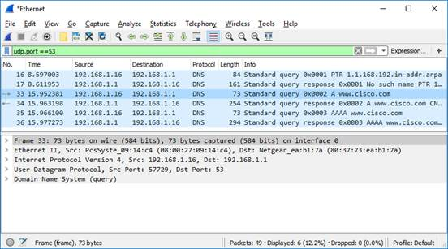
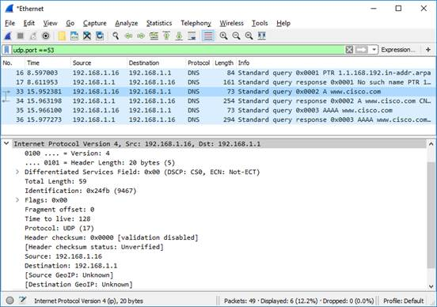
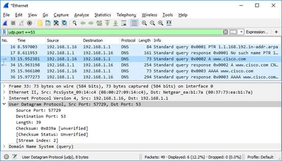
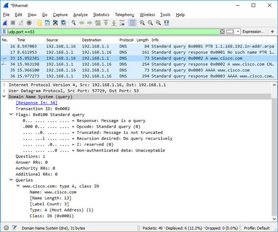
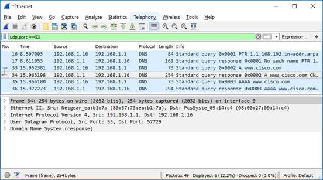
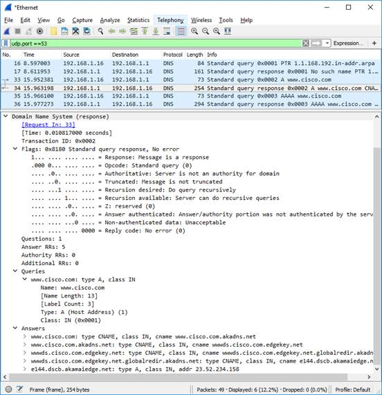

<title coding="utf-8">Explorar tráfico DNS</title>

# Explorar tráfico DNS
# Objetivos
* __Parte 1__: Capturar tráfico DNS
* __Parte 2__: Explorar tráfico de consultas DNS
* __Parte 3__: Explorar tráfico de respuestas DNS

# Trasfondo/Situación
Wireshark es una herramienta de captura y análisis de paquetes de código abierto. Wireshark proporciona un desglose detallado de la pila de protocolos de red. Wireshark le permite filtrar tráfico para solucionar problemas de red, investigar problemas de seguridad y analizar protocolos de red. Como Wireshark permite ver los detalles de los paquetes, un atacante también puede utilizarla como herramienta de reconocimiento.

En esta práctica de laboratorio instalaremos y utilizaremos Wireshark para filtrar paquetes DNS y ver los detalles de los paquetes de consultas y respuestas DNS.

# Recursos necesarios
* Una computadora personal con acceso a internet y Wireshark instalado

# Instrucciones
## Parte 1: Capture el tráfico DNS
### Paso 1: Descargue e instale Wireshark.
1. Descargue la última versión estable de Wireshark desde la siguiente dirección web: www.wireshark.org. Elija la versión de software que necesita según la arquitectura y el sistema operativo de la PC.
2. Siga las instrucciones que aparecen en la pantalla para instalar Wireshark. Si le aparece un cuadro solicitando que instale USBPcap, __NO debe__ instalar USBPcap para la captura de tráfico normal. USBPcap es experimental, y podría causar problemas en los dispositivos USB de su computadora personal.

### Paso 2: Capture tráfico DNS
1. Inicie Wireshark. Seleccione una interfaz activa con tráfico para la captura de paquetes.
2. Limpie el caché DNS
	1) En Windows , escriba `ipconfig /flushdns` en el Command Prompt.
	2) Para la mayoría de las distribuciones de Linux, se utiliza una de las siguientes utilidades para el almacenamiento caché DNS: Systemd -Resolved, DNSMasq y NSCD. Si la distribución Linux que está usando no utiliza ninguna de las utilidades mencionadas, busque en internet la herramienta para vaciar caché DNS para esa distribución Linux.
	Identifique la herramienta utilizada en una distribución Linux, comprobando el estado (_status_):
		1. Systemd -Resolved: `systemctl status systemd-resolved.service`
		2. DNSMasq : `systemctl status dnsmasq.service`
		3. NSCD : `systemctl status nscd.service`
 		Si está utilizando systemd-Resolved, debe escribir `systemd-resolve --flush-caches` para vaciar la caché de Systemd-Resolved antes de reiniciar el servicio. Los siguientes comandos reinician el servicio asociado mediante privilegios elevados:
		4. Systemd -Resolved: `sudo systemctl restart systemd-resolved.service`
		5. DNSMasq : `sudo systemctl restart dnsmasq.service`
		6. NSCD : `sudo systemctl restart nscd.service`
	3) Para macOS , escriba `sudo killall -HUP mDNSResponder` para limpiar la caché DNS en la consola Terminal. Busque en internet cuales son los comandos que se usan para limpiar el caché DNS de una versión pasada del sistema operativo
3. En el command prompt, escriba `nslookup` para entrar en el modo interactivo.
4. Introduzcan el nombre de dominio del sitio web. En este ejemplo se utiliza el nombre de dominio www.cisco.com.
5. Escriba exit cuando haya terminado. Cierre el símbolo del sistema.
6. Hagan clic en Stop capturing packets (Dejar de capturar paquetes) para detener la captura de Wireshark.

## Parte 2: Explorar tráfico de consultas DNS
1. Observe el tráfico capturado en el panel de Lista de Paquetes (Packet List) de Wireshark. Introduzca `udp.port == 53` en el cuadro de filtros y luego haga clic en la flecha (o presione enter) para mostrar solamente paquetes DNS. Nota: Las capturas de pantalla proporcionadas son solo ejemplos. La salida que obtenga puede ser ligeramente diferente a la mostrada.

	

2. Seleccione el paquete DNS que contiene la Standard query ( Consulta estándar) y a www.cisco.com en la columna Información.
3. En el panel de Detalles del paquete (Packet Details), observe que este paquete tiene Ethernet II, Internet Protocol Version 4, User Datagram Protocol y Domain Name System (query).
4. Expanda Ethernet II para ver los detalles. Observe los campos de origen y de destino.
	* ¿Qué sucedió con las direcciones MAC de origen y de destino? ¿Con qué interfaces de red están asociadas estas direcciones MAC?

	

5. Expanda Internet Protocol Version 4. Observe las direcciones IPv4 de origen y de destino.
	* ¿Cuáles son las direcciones IP de origen y destino? ¿Con qué interfaces de red están asociadas estas direcciones IP?

	

6. Expanda el User Datagram Protocol. Observe los puertos de origen y de destino.
	* ¿Cuáles son los puertos de origen y de destino? ¿Cuál es el número de puerto de DNS predeterminado?

	

6. Determine las direcciones IP y MAC de la computadora personal.
	1) En el command prompt de Windows, introduzca arp –a y ipconfig /all para registrar las direcciones MAC y las direcciones IP de la computadora personal.
	2) Para Linux y macOS, introduzca ifconfig o ip address en la consola terminal.
		* Compare las direcciones MAC y las direcciones IP presentes en los resultados de Wireshark con los resultados obtenidos del símbolo del sistema o terminal. ¿Cuál es su opinión?

	

7. Expanda Domain Name System (query) en el panel de Detalles del paquete Luego, expanda Flags y Queries.
8. Observe los resultados. El marcador está definido para realizar la consulta recursivamente y así consultar la dirección IP en www.cisco.com.

## Parte 3: Explorar tráfico de respuestas DNS
1. Seleccione el paquete que contiene la Standard query response (respuesta de consulta estándar) y A www.cisco.com en la columna "Info" (Información)
	* ¿Cuáles son las direcciones MAC e IP y los números de puerto de origen y de destino? ¿Que similitudes y diferencias tienen con las direcciones presentes en los paquetes de consultas DNS?

	

2. Expanda Domain Name System (response). Después expanda Flags,Queriesy Answers .
3. Observe los resultados.
	* ¿El servidor DNS puede realizar consultas recursivas?

	

4. Observe los registros "CNAME" y "A" en los detalles de "Answers" (respuestas).
	* ¿Qué similitudes y diferencias tienen con los resultados de nslookup?

## Reflexión
1. A partir de los resultados de Wireshark. ¿qué más pueden averiguar sobre la red cuando quitan el filtro?
2. ¿De qué manera un atacante puede utilizar Wireshark para poner en riesgo la seguridad de sus redes?