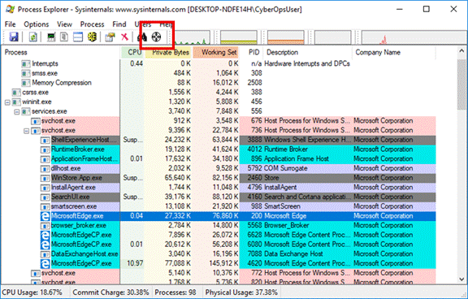
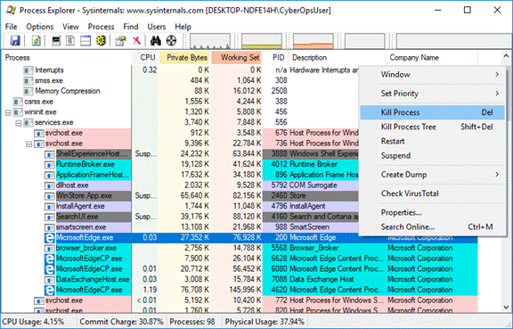

<title coding="utf-8">Explorar procesos, subprocesos, controles y el registro de Windows</title>

# Explorar procesos, subprocesos, controles y el registro de Windows
# Objetivos
En esta práctica de laboratorio explorarán los procesos, subprocesos y controles con el Explorador de procesos en la suite SysInternals. También utilizarán el Registro de Windows para cambiar un ajuste.
* Parte 1: Explorando procesos
* Parte 2: Explorando subprocesos y controles
* Parte 3: Explorando el Registro de Windows

# Recursos necesarios
* Una PC Windows con acceso a Internet

# Instrucciones
## Parte 1: Explorando procesos
En esta parte explorará procesos. Los procesos son programas o aplicaciones en ejecución. Estudiará los procesos con el Explorador de procesos en la suite Sysinternals para Windows. También iniciará y observará un proceso nuevo.

### Paso 1: Descargue Windows Sysinternals Suite.
1. Diríjase al siguiente enlace para descargar la suite SysInternals para Windows:
	* https://technet.microsoft.com/en-us/sysinternals/bb842062.aspx
2. Una vez finalizada la descarga, extraiga los archivos de la carpeta.
3. Deje abierto el navegador web para los pasos siguientes.

### Paso 2: Explore un proceso activo
1. Diríjase a la carpeta SysinternalsSuite con todos los archivos extraídos.
2. Abra `procexp.exe`. Acepte el Acuerdo de licencia de Process Wxplorer cuando el sistema se lo solicite.
3. El Explorador de procesos muestra una lista de los procesos activos actualmente.
4. Para ubicar el proceso del navegador web, arrastre el icono de Buscar proceso de Windows ( a la ventana abierta del navegador web. En este ejemplo se utiliza Microsoft Edge.

	

5. El proceso de Microsoft Edge se puede finalizar desde el Explorador de procesos. Haga clic derecho sobre el proceso seleccionado y elija _Kill Process_ (Finalizar proceso). Haga clic en Aceptar para continuar.

	

* ¿Qué sucedió con la ventana del navegador web cuando se finalizó el proceso?

### Paso 3: Inicie otro proceso.
1. Abra el Command Prompt. (Start > Buscar Command Prompt > Seleccionar Command Prompt)
2. Arrastre el icono Encontrar proceso de Windows en la ventana Command Prompt y localice el proceso resaltado en el explorador de procesos.
3. El proceso correspondiente al Command Prompt es cmd.exe. Su proceso principal es explorer.exe. cmd.exe tiene un proceso secundario: conhost.exe.
4. Diríjase a la ventana del Command Prompt. Inicie un ping en el cursor y observe los cambios que se producen en el proceso cmd.exe.
* ¿Qué sucedió durante el proceso de ping?
5. Mientras observa la lista de procesos activos, descubrirá que el proceso secundario conhost.exe puede ser sospechoso. Para buscar contenido maliciosos, haga clic derecho sobre conhost.exe y seleccione Check VirusTotal(Revisar VirusTotal). Cuando el sistema se lo solicite, haga clic en Yes (Sí) para aceptar los Términos de servicio de VirusTotal. Luego haga clic en Aceptar para ver el siguiente mensaje.
6. Expanda la ventana del Explorador de procesos o desplácese hacia la derecha hasta ver la columna de VirusTotal. Haga clic en el enlace de la columna VirusTotal. Se abre el navegador web predeterminado con los resultados relacionados con el contenido maliciosos de conhost.exe.
7. Haga clic derecho sobre el proceso seleccionado y elijan KillProcess (Finalizar proceso).
* ¿Qué sucedió con el proceso secundario conhost.exe?

## Parte 2: Explorar subprocesos y controles
En esta parte explorará subprocesos y controles. Los procesos pueden tener uno o más subprocesos. Un subproceso es una unidad de ejecución en un proceso. Un control es una referencia abstracta a bloques de memoria o a objetos administrados por un sistema operativo. Utilizará el Explorador de procesos (procexp.exe) en la suite SysInternals para Windows para explorar los subprocesos y controles.

### Paso 1: Explore subprocesos
1. Abra el Command Prompt.
2. En la ventana del Explorador de procesos, haga clic derecho sobre conhost.exe y seleccione Properties…(Propiedades...). Haga clic en la ficha Threads (Subprocesos) para ver los subprocesos activos correspondientes al proceso conhost.exe. Haga clic en Aceptar para continuar si se le solicita un cuadro de diálogo de advertencia.
3. Examine los detalles del subproceso.
* ¿Qué tipo de información está disponible en la ventana de Propiedades?
4. Haga clic en Aceptar para continuar.

### Paso 2: Explore controles
1. En el Explorador de procesos, haga clic en Vista > seleccionar Vista de panel inferior > Controles para ver los controles asociados con el proceso conhost.exe.
* Examine los controles. ¿Hacia dónde apuntan los controles?
2. Cierre el Explorador de procesos cuando haya terminado.

## Parte 3: Explorar el Registro de Windows
El Registro de Windows es una base de datos jerárquica que almacena la mayoría de los ajustes de configuración del sistema operativo y del entorno del escritorio.

1. Para acceder al Registro de Windows, haga clic en Inicio, busque regedit y seleccione el Editor del registro. Haga clic en Sí para permitir que esta aplicación realice cambios en sus dispositivos.
	* El Editor del registro tiene cinco secciones. Estas secciones se encuentran en el nivel superior del registro.
		* HKEY_ CLASSES_ROOT es en realidad la subclave de Clases de HKEY_LOCAL_MACHINE\Software\. Almacena información utilizada por aplicaciones registradas como la asociación de extensiones de archivos, al igual que datos de un identificador programático (ProgID), ID de clase (CLSID) e ID de interfaz (IID).
		* HKEY_CURRENT_USER contiene los ajustes y las configuraciones correspondientes a los usuarios que tienen sesión iniciada.
		* HKEY_LOCAL_MACHINE almacena información de configuración específica de la computadora local.
		* HKEY_USERS contiene los ajustes y las configuraciones correspondientes a la computadora local. HKEY_CURRENT_USER es una subclave de HKEY_USERS.
		* HKEY_ CURRENT_CONFIG almacena la información de hardware que se utiliza la computadora local al momento del arranque.
2. En un paso anterior había aceptado el acuerdo EULA correspondiente al Explorador de procesos. Diríjanse a la clave del registro `EulaAccepted` correspondiente al Explorador de procesos.
Para seleccionar el Explorador de procesos, haga clic en _HKEY_CURRENT _ USER > Software > Sysinternals > Process Explorer_. Desplácese hacia abajo para ubicar la clave `EulaAccepted`. En este momento, el valor correspondiente a la clave de registro `EulaAccepted` es `0x00000001(1)`.
3. Haga doble clic en la clave del registro `EulaAccepted`. En este momento, el dato del valor está definido en 1. El valor de 1 indica que el acuerdo EULA ha sido aceptado por el usuario.
4. Cambie el 1 por un 0 en el dato del Valor. El valor de 0 indica que no se aceptó el EULA. Haga clic en Aceptar para continuar.
* ¿Cuál es el valor correspondiente a esta clave del registro en la columna Data (Datos)?
5. Abra el Exploradorde procesos. Diríjase a la carpeta en la que hayan descargado SysInternals. Abra la carpeta SysInternalsSuite y, luego, abra procexp.exe.
* ¿Qué vieron cuando abrieron el Explorador de procesos?