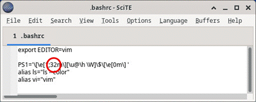

# Trabajando con los archivos de texto en la CLI
# Objetivos
En este laboratorio, se familiarizará con el uso de editores de texto y archivos de configuración de la línea de comando de Linux.
* Parte 1: Editor gráfico de texto
* Parte 2: Editor de texto por línea de comando
* Parte 3: Trabajar con archivos de configuración

# Recursos necesarios
* Máquina virtual Security Workstation

# Instrucciones
## Parte 1: Editor gráfico de texto
Antes de trabajar con archivos de texto en Linux, deben familiarizarse con los editores de texto.

Los editores de texto pertenecen a una de las categorías más antiguas de aplicaciones creadas para computadoras. Linux, al igual que muchos otros sistemas operativos, tiene muchos editores de texto diferentes, con diversas características y funciones. Algunos editores de texto tiene interfaces gráficas, mientras que otros solo se pueden utilizar desde la línea de comandos. Cada editor de texto tiene un conjunto de características diseñadas para admitir una situación de trabajo específica. Algunos editores de texto están enfocados en el programados y tiene características como resaltado de sintaxis, correspondencia de paréntesis y corchetes, buscar y reemplazar, compatibilidad con expresiones regulares multilínea, corrector ortográfico y otras características centradas en la programación.

Para guardar espacio y mantener la máquina virtual ligera, la máquina virtual Cisco CyberOps solo incluye SciTE como una aplicación gráfica de editor de texto. SciTE es un editor de texto simple, pequeño y rápido. No tiene muchas características avanzadas, pero es totalmente compatible con el trabajo que se realiza en este curso.

__Nota__: La elección del editor de texto es personal. Ningún editor de texto es mejor que otro. El mejor editor de texto es con el que se sienta más cómodo y se adapte mejor a su trabajo.

### Paso 1: Abrir SciTE desde la GUI
1. Inicie sesión en la VM Security Workstation con  analyst como usuario y cyberops como contraseña. En toda esta práctica de laboratorio se utiliza la cuenta analyst como el usuario ejemplo.
2. En la barra superior, diríjase a Aplicaciones > CyberOPS > SciTE para abrir el editor de texto     SciTE.
3. SciTE     es simple pero tiene ciertas características importantes: entorno con fichas y resaltado de sintaxis, entre otras. Trabajen algunos minutos con SciTE. En el área de trabajo principal, escriban o copien y peguen el siguiente texto: "El espacio es grande. Realmente grande. Simplemente no creerán lo vasto, enorme y abobinablemente grande que es. Es decir, pueden pensar que la farmacia está lejos, pero no puede compararse con el espacio" ― Douglas Adams, The Hitchhiker’s Guide to the Galaxy.
4. Haga clic en Save para guardar el archivo. Observen que SciTE trata de guardar el archivo en el directorio de inicio del usuario actual (analyst) de manera predeterminada. Llame `space.txt `al archivo y haga clic en Guardar.
5. Cierre SciTE; para ello, haga clic en el icono de la X del ángulo superior derecho de la ventana y, luego, vuelva a abrir SciTE.
6. Hagan clic en Archivo > Abrir y busque el archivo que acaba de guardar : `space.txt`.
* ¿Pudieron encontrar `space.txt` inmediatamente? No
7. Aunque SciTE está buscando en el directorio correcto (/home/analyst), no se ve space.txt. Esto se debe a que SciTE está buscando extensiones conocidas, y .txt no es una de ellas. Para mostrar todos los archivos, hagan clic en el menú desplegable de la parte inferior de la ventana Abrir Archivoy seleccione Todos los Archivos (\*).
8. Seleccione `space.txt` para abrirlo.
	__Nota__: Si bien los sistemas de archivos Linux no dependen de las extensiones, algunas aplicaciones como SciTE pueden tratar de utilizarlas para identificar tipos de archivos.
9. Cierre `space.txt` cuando haya terminado.

### Paso 2: Abrir SciTE desde el terminal
1. Como alternativa, también puede abrir SciTe desde la línea de comandos. Haga clic en el icono del terminal que se encuentra en el Dock de la parte inferior. Se abre el emulador de terminales predeterminado.
2. Escriba el comando ls para enumerar el contenido del directorio actual. Observe que space.txt está en la lista. Esto quiere decir que no han proporcionado información sobre la ruta para abrir el archivo.
3. Escriba `scite space.txt` para abrir SciTE. Tenga presente que con esto no solo se abrirá SciTE en la GUI, sino que también se cargará automáticamente el archivo de texto space.txt que se creó previamente.
	```shell
	[analyst@secOps ~]$ scite space.txt
	```
4. Fíjese que aunque SciTE está abierto en primer plano, la ventana del terminal que se utiliza para abrirlo sigue abierta en segundo plano. Además, observe que en la ventana del terminal que se utilizó para abrir SciTE ya no aparece el cursor.
* ¿Por qué no se muestra el prompt en el terminal? Porque la terminal está ejecutando SciTE, por lo tanto, no puede recibir comandos.
5. Cierren esta instancia de  SciTE; para ello, haga clic en el icono de la X como antes o regrese a la ventana del terminal desde la que se abrió SciTE y detenga el proceso. Puede detener el proceso si presiona `CTRL+C`.
	__Nota__: Iniciar SciTE desde la línea de comandos es útil cuando se quiere ejecutar SciTE como `root`. Simplemente antepongan el comando sudo a scite: `sudo scite`.
6. Cierre SciTE y pase a la sección siguiente.

## Parte 2: Editor de texto por línea de comando
Si bien los editores de texto gráficos son prácticos y fáciles de usar, los basados en la línea de comandos con muy importantes en computadoras con Linux. El principal beneficio de los editores de texto basados en la línea de comandos es que permiten editar un archivo de texto desde una shell remota de una computadora remota.

Tenga en cuenta el siguiente escenario. Un usuario tiene que realizar tareas administrativas en una computadora con Linux pero no está sentado al frente de este equipo. Usando SSH, el usuario inicia un shell remoto a la computadora antes mencionada. En la shell remota basada en texto, es posible que la interfaz gráfica no esté disponible y eso hace que resulte imposible trabajar con editores de texto gráficos. En este tipo de situación, los editores de texto basados en texto son cruciales.

__Nota__: Esto resulta especialmente cierto cuando se establecen conexiones con servidores remotos sin periféricos que no tienen interfaz GUI.

La máquina virtual incluye algunos editores de texto basados en línea de comandos. Este curso se enfoca en `nano`.

__Nota__: Otro editor de texto extremadamente popular se llama `vi`. Aunque la curva de aprendizaje de `vi` se considera empinada, `vi` es un editor de texto muy potente basado en la línea de comando. Está incluido de manera predeterminada en todas las distribuciones de Linux y su código original se creó en 1976. Existe una versión actualizada de `vi` que se llama `vim` , y significa _vi-improved_. Actualmente, lamayoría de los usuarios de vi en realidad están utilizando la versión actualizada: `vim` .

Debido a la falta de soporte gráfico, `nano` (o `GNU nano`) se puede controlar solamente desde el teclado. `CTRL+O` guarda el archivo actual; `CTRL+W` abre el menú de búsqueda. `GNU nano` utiliza una barra de accesos directos de dos líneas en la parte inferior de la pantalla; allí se incluyen varios comandos para el contexto actual. Después de abrir `nano`, presione `CTRL+G` para ver la pantalla de ayuda y una lista completa.
1. En la ventana del terminal escriba `nano space.txt` para abrir el archivo de texto que crearon en la Parte 1.
	```shell
	[analyst@secOps ~]$ nano space.txt
	```
2. `nano` se abrirá y cargará automáticamente el archivo de texto `space.txt` . Aunque puede parecer que el texto está truncado o incompleto, no es así. Como el texto se creó sin caracteres de retorno y la justificación de línea no está habilitada de manera predeterminada, `nano` está mostrando una línea de texto larga. Utilicen las teclas Inicio y Fin del teclado para desplazarse rápidamente hasta el comienzo y el final de una línea, respectivamente.
* ¿Qué carácter utiliza `nano` para indicar que una línea continúa más allá de los límites de la pantalla? 
3. Como se muestra en las líneas de acceso directo de la parte inferior, `CTRL+X` puede utilizarse para salir de `nano`. `nano` le preguntará si desea guardar el archivo antes de salir (“S” para Sí o “N” para No). Si elige ‘Y’, se le solicitará que presionen Intro para aceptar el nombre de archivo proporcionado, cambiar el nombre de archivo o introducir un nombre de archivo si se trata de un documento nuevo sin nombre.
4. Para controlar `nano` pueden utilizar las teclas `CTRL`, `ALT`, `ESCAPE` o `META`. La tecla `META` es la tecla del teclado que tiene el logotipo de Windows o Mac, dependiendo de la configuración del teclado.

La navegación en `nano` es muy simple. Utilicen las flechas para desplazarse por los archivos. También se pueden utilizar las teclas `RePág` y `AvPág` para saltar páginas enteras hacia adelante o hacia atrás. Trabaje unos minutos con `nano` y con su pantalla de ayuda. Para entrar a la pantalla de ayuda presione `CTRL+G`. Presione q para salir de la pantalla de ayuda y volver a la edición de documentos en `nano`.

## Parte 3: Trabajar con archivos de configuración
En Linux, todo es tratado como un archivo, incluyendo la memoria, los discos, el monitor, los archivos y los directorios. Desde el punto de vista del sistema operativo, todo es un archivo. No debería sorprendernos que el propio sistema esté configurado por medio de archivos. Conocidos como archivos de configuración, suelen ser archivos de texto y son utilizados por diversas aplicaciones y servicios para almacenar ajustes y valores de configuración correspondientes a cada aplicación o servicio específico. En Linux, prácticamente todo depende de archivos de configuración para funcionar. Algunos servicios no tiene solo uno sino varios archivos de configuración.

Los usuarios con los niveles de permisos correctos utilizan editores de texto para cambiar el contenido de dichos archivos de configuración. Después de realizados los cambios, se guarda el archivo que ya puede ser utilizado por el servicio o la aplicación relacionados. Los usuarios pueden especificar exactamente cómo quieren que se comporte cualquier aplicación o servicio determinado. Cuando se abren, los servicios y las aplicaciones comprueban el contenido de archivos de configuración específicos y ajustan su comportamiento en consecuencia.

Paso 1: Localizando archivos de configuración
El autor del programa define la ubicación de la configuración correspondiente a un programa determinado (servicio o aplicación). Por ese motivo, se debe consultar la documentación cuando se evalúa la ubicación del archivo de configuración. Sin embargo, convencionalmente, en Linux, los archivos de configuración que se utilizan para configurar aplicaciones del usuario a menudo se ubican en el directorio de inicio del usuario, mientras que los archivos de configuración utilizados para controlar servicios que abarcan a todo el sistema se ubican en el directorio /etc . Los usuarios siempre tiene permiso para escribir en sus propios directorios de inicio, y pueden configurar el comportamiento de las aplicaciones que utilizan.

1. Utilice el comando `ls` para generar una lista de todos los archivos presentes en el directorio de inicio de _analyst_:
	```shell
	[analyst@secOps ~]$ ls –l
	total 20
	drwxr-xr-x 2 analyst analyst 4096 Mar 22 2018 Desktop
	drwxr-xr-x 3 analyst analyst 4096 Apr 2 14:44 Downloads
	drwxr-xr-x 9 analyst analyst 4096 Jul 19 2018 lab.support.files
	drwxr-xr-x 2 analyst analyst 4096 Mar 21 2018 second_drive
	-rw-r--r-- 1 analyst analyst 255 Apr 17 16:42 space.txt
	```

	Aunque se muestran algunos archivos, ninguno de ellos parece ser un archivo de configuración. Esto se debe a que la convención es ocultar los archivos de configuración alojados en los directorios de inicio anteponiendo un carácter de "." (punto) a sus nombres.
2. Vuelva     a utilizar el comando   ls , pero esta vez agregue la opción –a para incluir los archivos ocultos en la salida:
	```shell
	[analyst@secOps ~]$ ls –la
	total 144
	drwx------ 14 analyst analyst 4096 Apr 17 16:34 .
	drwxr-xr-x 3 root root 4096 Mar 20 2018 ..
	-rw------- 1 analyst analyst 424 Apr 17 12:52 .bash_history
	-rw-r—r— 1 analista 141 Feb 7 2018 .bashrc_stock
	-rw-r--r-- 1 analyst analyst 57 Feb 7 2018 .bash_profile
	-rw-r--r-- 1 analyst analyst 97 Mar 20 2018 .bashrc
	-rw-r—r— 1 analista 141 Feb 7 2018 .bashrc_stock
	drwxr-xr-x 8 analyst analyst 4096 Mar 25 12:18 .cache
	drwxr-xr-x 10 analyst analyst 4096 Jul 19 2018 .config
	drwxr-xr-x 2 analyst analyst 4096 Mar 22 2018 Desktop
	-rw-r--r-- 1 analyst analyst 23 Mar 23 2018 .dmrc
	drwxr-xr-x 3 analyst analyst 4096 Apr 2 14:44 Downloads
	drwx------ 3 analyst analyst 4096 Mar 22 2018 .gnupg
	-rw------- 1 analyst analyst 2520 Mar 24 12:32 .ICEauthority
	drwxr-xr-x 2 analyst analyst 4096 Mar 24 2018 .idlerc
	drwxr-xr-x 9 analyst analyst 4096 Jul 19 2018 lab.support.files
	-rw------- 1 analyst analyst 61 Mar 24 12:36 .lesshst
	drwxr-xr-x 3 analyst analyst 4096 Mar 22 2018 .local
	drwx------ 5 analyst analyst 4096 Mar 24 2018 .mozilla
	drwxr-xr-x 2 analyst analyst 4096 Mar 21 2018 second_drive
	-rw-r--r-- 1 analyst analyst 255 Apr 17 16:42 space.txt
	<Se omitió alguna salida>
	```
3. Utilice el comando `cat` para mostrar el contenido del archivo `.bashrc`. Este archivo se utiliza para configurar el comportamiento y la personalización de terminales específicos del usuario.
	```shell
	[analyst@secOps ~]$ cat .bashrc
	export EDITOR=vim
	PS1='\[\e[1;32m\][\u@\h \W]\$\[\e[0m\] '
	alias ls="ls --color"
	alias vi="vim"
	```
	Por el momento, no se preocupen demasiado por la sintaxis de `.bashrc`. Lo que es importante observar es que `.bashrc` contiene la configuración correspondiente al terminal. Por ejemplo la línea:
	```shell
	PS1='\[\e[1;32m\][\u@\h \W]\$\[\e[0m\] ' 
	```
	define la estructura del cursor en el cursor que muestra el terminal: `[nombredeusuario@dir_actual del nombredehost]`, seguido por un signo de dólar, todo en color verde. Ciertas configuraciones adicionales incluyen acceso directos a comandos como `ls` y `vi`. En este caso, cada vez que el usuario escribe `ls`, el _shell_ lo convierte automáticamente en `ls–color` para exhibir una salida codificada por colores correspondiente a `ls` (los directorios en azul, los archivos comunes en gris, los archivos ejecutables en verde, etc.).

	La sintaxis específica está fuera del alcance de este curso. Lo importante es entender que las configuraciones del usuario convencionalmente se almacenan como archivos ocultos en el directorio de inicio del usuario.

4. Mientras que los archivos de configuración relacionados con aplicaciones del usuario convencionalmente se ubican en el directorio de inicio del usuario, los relacionados con servicios que abarcan a todo el sistema se colocan en el directorio `/etc`, por convención. Los servicios web, servicios de impresión, servicios FTP y los servicios de correo electrónico son ejemplos de servicios que afectan todo el sistema y cuyos archivos de configuración se almacenan en `/etc`. Tengan presente que los usuarios comunes no tienen acceso de lectura a `/etc`. Esto es importante porque restringe la capacidad para cambiar la configuración de servicios que abarcan a todo el sistema solamente al usuario raíz (`root`).
Utilice el comando `ls` para generar una lista con el contenido del directorio `/etc`:
	```shell
		[analyst@secOps ~]$ ls /etc/
		adjtime				host.conf		mke2fs.conf				rc_maps.cfg
		apache-ant			hostname		mkinitcpio.conf			request-key.conf
		.
		.
		.
		<Se omitió alguna salida por brevedad>
	```

5. Utilice     el comando   cat para mostrar el contenido del archivo `bash.bashrc`:
	```shell
	[analyst@secOps ~]$ cat /etc/bash.bashrc
	#
	# /etc/bash.bashrc
	#
	
	# Si no se ejecuta de forma interactiva, no haga nada
	[[ $- != *i* ]] && return
	
	[[ $DISPLAY ]] && shopt -s checkwinsize
	
	PS1='[\u@\h \W]\$ '
	
	case ${TERM} in
		xterm*|rxvt*|Eterm|aterm|kterm|gnome*)
			PROMPT_COMMAND=${PROMPT_COMMAND:+$PROMPT_COMMAND; }'printf "\033]0;%s@%s:%s\007" "${USER}" "${HOSTNAME%%.*}" "${PWD/#$HOME/\~}"
	;;
		pantalla)
			PROMPT_COMMAND=${PROMPT_COMMAND:+$PROMPT_COMMAND; }'printf "\033_%s@%s:%s\033\\" "${USER}" "${HOSTNAME%%.*}" "${PWD/#$HOME/\~}"'
	;;
	esac
	
	[ -r /usr/share/bash-completion/bash_completion   ] && . /usr/share/bash-completion/bash_completion
	[analyst@secOps ~]$
	```

	La sintaxis de `bash.bashrc` está fuera del alcance de este curso. Este archivo define el comportamiento predeterminado del shell para todos los usuarios. Si un usuario quiere personalizar el comportamiento de su propio shell, se puede anular el comportamiento predeterminado si se edita el archivo .bashrc ubicado en el directorio de inicio del usuario. Como se trata de una configuración que abarca a todo el sistema, el archivo de configuración se ubica en /etc, por lo que solo puede ser editado por el usuarioraíz. Por lo tanto, el usuario tendrá que iniciar sesión como root para modificar `bash.bashrc`.
	¿Por qué los archivos de configuración de las aplicaciones del usuario se guardan en el directorio de inicio del usuario y no en /etc , junto con los demás archivos de configuración que abarcan a todo el sistema?

### Paso 2: Editar y guardar archivos de configuración
Como ya se mencionó, los archivos de configuración se pueden editar con editores de texto. Editemos `.bashrc` para cambiar el color del indicador del shell de verde a rojo para el usuario _analyst_.
1. Primero, abra SciTE; para ello, seleccione `Aplicaciones > CyberOPS > SciTE` desde la barra de herramientas situada en la parte superior de la pantalla de la VM CyberOPS de Cisco.
2. Seleccione `Archivo > Abrir`, para abrirla ventana de archivo de SciTE.
3. Como `.bashrc` es un archivo oculto sin extensión, SciTE no lo muestra en la lista de archivos. Si la característica Ubicación no está visible en el cuadro de diálogo, cambie el tipo de archivo que se muestra seleccionando Todos los archivos (\*) en el cuadro desplegable de tipo, como se muestra a continuación. Se muestran todos los archivos en el directorio de inicio del analista.
4. Seleccione `.bashrc` y haga clic en Abrir.
5. Ubique el `32` y reemplácenlo por un `31`. `32` es el código de color correspondiente al verde, mientras que `31` representa al rojo.

<div style="width: 50%;padding-left: 20%;">
	
</div><br />

6. Seleccione `Archivo > Guardar` para guardar el archivo, y hagan clic en el icono de la X para cerrar SciTE       .
7. Haga clic en el icono del terminal ubicado en el Dock, en la parte inferior central de la pantalla de la VM Cisco CyberOPS. El cursor debería verse de color rojo y no verde.
La ventana del terminal que ya estaba abierta, ¿también cambió de color, de verde a rojo? Explique.
8. El mismo cambio se podría haber hecho desde la línea de comando con un editor de texto como `nano`. En una ventana del terminal nueva escriba `nano .bashrc` para abrir `nano` y cargarle automáticamente el archivo `.bashrc`:
	```shell
	[analyst@secOps ~]$ nano .bashrc
	GNU nano 4.9.2                    File: .bashrc                              
	export EDITOR=vim
	PS1='\[\e[1;31m\][\u@\h \W]\$\[\e[0m\] '
	alias ls="ls --color"
	alias vi="vim"

 

                                [ Read 5 lines ]
	^G Get Help ^O Write Out ^W Where Is ^K Cut Text ^J Justify ^C Cur Pos
	^X Exit      ^R Read File ^\ Replace   ^U Uncut Text^T To Spell  ^_ Go To Line
	```
9. Cambien el `31` por un `33`, que es el código de color correspondiente al amarillo.
10. Presione `CTRL+X` para guardar y Y para confirmar. El editor de texto _nano_ también ofrece cambiar el nombre del archivo. Simplemente presionen `INTRO` para utilizar el mismo nombre: `.bashrc`.
11. El editor de texto _nano_ terminará, y volverá al _shell prompt_. Esta vez vuelva a cargar el terminal bash introduciendo el comando bash en el terminal. El cursor ahora debería verse de color amarillo y no rojo.

### Paso 3: Editar archivos de configuración correspondientes a servicios
Los archivos de configuración que abarcan a todo el sistema no son muy diferentes de los archivos de aplicación de usuario. _nginx_ es un servidor web ligero que está instalado en la Máquina virtual CiscoCyberOPS. Se puede personalizar _nginx_ cambiando su archivo de configuración, que se encuentra en `/etc/nginx`.
1. Primero abra el archivo de configuración de _nginx_ con _nano_. El nombre del archivo de configuración que utilizamos aquí es custom_server.conf. A continuación, observe que el comando está precedido por el comando sudo. Después de escribir _nano_, incluya un espacio y el modificador `-l` para activar la numeración de líneas.
	```shell
	[analyst@secOps ~]$ sudo nano -l /etc/nginx/custom_server.conf
	[sudo] contraseña para analyst:
	Utilicen las teclas de las flechas para desplazarse por el archivo.
	GNU nano 4.9.2                /etc/nginx/custom_server.conf                         
	1
	2 #user html;
	3 worker_processes  1;
	4
	5 #error_log  logs/error.log;
	6 #error_log  logs/error.log  notice;
	7 #error_log  logs/error.log  info;
	8
	9 #pid        logs/nginx.pid;
	10
	11
	12 eventos {
	13     worker_connections  1024;
	14 }
	15
	16
	17 http {
	18     include       mime.types;
	19     default_type  application/octet-stream;
	20
	21     #log_format  main  '$remote_addr - $remote_user [$time_local] "$request" '
	22     #                  '$status $body_bytes_sent "$http_referer" '
	23     #                  '"$http_user_agent" "$http_x_forwarded_for"';
	24
	25     #access_log  logs/access.log  main;
	26
	27     sendfile        on;
	28     #tcp_nopush     on;
	29
	30     #keepalive_timeout  0;
	31     keepalive_timeout  65;
	32
	33     #gzip  on;
	34
	35     types_hash_max_size 4096;
	36     server_names_hash_bucket_size 128;
	37
	38     server {
	39         listen       81;
	40         server_name  localhost;
	41         server_name  localhost;
	42         #charset koi8-r;
	43
	44         #access_log  logs/host.access.log  main;
	45
	46         location / {
	47             root   /usr/share/nginx/html;
	48             index  index.html index.htm;
	49         }
	
	<Alguna salida omitida>
	```
	__Nota__: Convencionalmente, las extensiones .conf se usan para identificar archivos de configuración.
2. Aunque que el archivo de configuración tiene muchos parámetros, configuraremos solo dos: el puerto nginx escucha en busca de conexiones entrantes, y el directorio desde el que atenderá páginas web, incluido el archivo de la página de inicio HTML del índice.
3. Observe que, en la parte inferior de la ventana (arriba de los comandos de nano), el número de línea se ve resaltado y litado. En la línea 39, cambien el número de puerto de 81 a 8080. Esto le indicará a _nginx_ que escuche solicitudes HTTP en el puerto TCP 8080.
4. A continuación, diríjase a la línea 47 y cambie la ruta de `/usr/compartir/nginx/html/` a `/usr/share/nginx/html/text_ed_lab/`.
	__Nota__: Tome la precaución de no quitar el signo de punto y coma del final de la línea ; si lo hacen, nginxarrojará un error al arrancar.
5. Presione `CTRL+X` para guardar el archivo. Presione Y y luego `INTRO` para confirmar y utilizar custom `_server.conf` como nombre de archivo.
6. Escriba el comando que se indica a continuación para ejecutar _nginx_ utilizando el archivo de configuración modificado:
	```shell
	[analyst@secOps ~]$ sudo nginx -c custom_server.conf
	```
7. Haga clic en el icono del navegador web del Dock para abrir el navegado web.
8. En la barra de direcciones, escriban ` ` para conectarse a un servidor web aojado en el puerto 8080 de la máquina local. Debería aparecer una página relacionada con esta práctica de laboratorio.
9. Después de que haya podido abrir la página de inicio de _nginx_, mire el mensaje de conexión en la ventana del terminal.
* ¿A qué se refiere el mensaje de error?
10. Para cerrar el servidor web de _nginx_ presione `INTRO` y le aparecerá un símbolo del sistema; allí escriba el siguiente comando en la ventana del terminal:
	```shell
	[analyst@secOps ~]$ sudo pkill nginx
	```
11. Puede probar si el servidor _nginx_ realmente está cerrado si primero borra el historial reciente del navegador web y, luego, lo cierra y vuelve a abrirlo para finalmente dirigirse a la página de inicio de _nginx_: `127.0.0.1:8080`.
* ¿Aparece la página web?
* __Desafío__: ¿Puede editar el archivo `/etc/nginx/custom_configuration.conf` con SciTE? Describa el proceso a continuación.
* __Recuerde__: como el archivo está almacenado en `/etc`, necesitará permisos de usuario raíz para editarlo.

## Reflexión
* Dependiendo del servicio, es posible que haya más opciones disponibles para su configuración.
* La ubicación del archivo de configuración, su sintaxis y sus parámetros disponibles variarán según el servicio. Siempre consulte la documentación si necesitan información.
* Los permisos son una causa muy común de problemas. Asegúrese de tener los permisos correctos antes de tratar de editar archivos de configuración.
* Lo más frecuente es que sea necesario reiniciar los servicios para que los cambios surtan efecto.