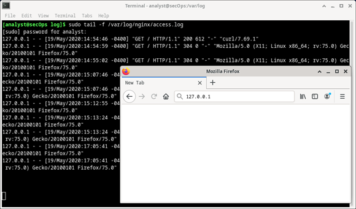
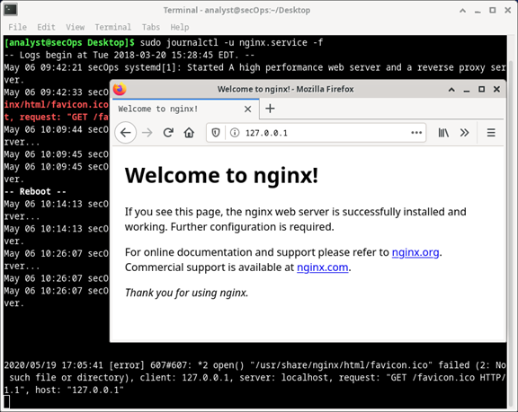

# Ubicar los archivos de registro
# Objetivos
En esta práctica de laboratorio se familiarizarán con los pasos para ubicar y manipular archivos de registro de Linux.
* Parte 1: Descripción general de los archivos de registro
* Parte 2: Ubicar los archivos de registro en sistemas desconocidos
* Parte 3: Monitorear archivos de registro en tiempo real

# Recursos necesarios
* Máquina virtual Security Workstation

## Parte 1: Descripción general de los archivos de registro
Los archivos de registro, son archivos que las computadoras utilizan para registrar eventos. Los programas de software, los procesos en segundo plano, los servicios o las transacciones entre servicios (incluido el propio sistema) pueden generar tales eventos. Los archivos de registro dependen de la aplicación que los genera. Cumplir con la convención de los archivos de registro es responsabilidad del desarrollador de la aplicación. La documentación del software debe incluir información sobre sus archivos de registro.

### Paso 1: Ejemplo de archivo de registro del servidor web
Como los archivos de registro esencialmente son una forma de rastrear eventos específicos, el tipo de información almacenado varía según la aplicación o los servicios que generan los eventos.
1. Considere la siguiente entrada de registro. Fue generada por Apache, un servidor web popular.
```shell
[Wed Mar 22 11:23:12.207022 2017] [core:error] [pid 3548:tid 4682351596] [client 209.165.200.230] File does not exist: /var/www/apache/htdocs/favicon.ico
```
La entrada de registro anterior representa un evento web grabado por Apache. Ciertos fragmentos de información son importantes en transacciones web, como la dirección IP del cliente, la hora y los detalles de la transacción. La entrada anterior puede desglosarse en cinco partes principales:
* Timestamp (Marca de hora): esta parte registra el momento en el que sucedió el evento. Es muy importante que el reloj del servidor esté sincronizado correctamente ya que eso permite definir referencias cruzadas exactas para realizar un seguimiento de eventos del pasado.
* Tipo: este es el tipo de evento. En este caso, se trató de un error.
* PID: contiene información sobre el ID de proceso que está utilizando Apache en ese momento.
* Cliente: registra la dirección IP del cliente solicitante.
* Descripción: contiene una descripción del evento.
	* Básense en la entrada de registro anterior para describir lo que sucedió.
Utilicen el comando `cat` que sigue para mostrar una archivo de registro de muestra de un servidor web. El archivo de muestra se encuentra en `/var/log`:
```shell
[analyst@secOps ~]$ cat /var/log/logstash-tutorial.log
83.149.9.216 - - [04/Jan/2015:05:13:42 +0000] "GET /presentations/logstash-monitorama-2013/images/kibana-search.png HTTP/1.1" 200 203023 "http://semicomplete.com/presentations/logstash-monitorama-2013/" "Mozilla/5.0 (Macintosh; Intel Mac OS X 10_9_1) AppleWebKit/537.36 (KHTML, like Gecko) Chrome/32.0.1700.77 Safari/537.36"
83.149.9.216 - - [04/Jan/2015:05:13:42 +0000] "GET /presentations/logstash-monitorama-2013/images/kibana-dashboard3.png HTTP/1.1" 200 171717 "http://semicomplete.com/presentations/logstash-monitorama-2013/" "Mozilla/5.0 (Macintosh; Intel Mac OS X 10_9_1) AppleWebKit/537.36 (KHTML, like Gecko) Chrome/32.0.1700.77 Safari/537.36"
83.149.9.216 - - [04/Jan/2015:05:13:44 +0000] "GET /presentations/logstash-monitorama-2013/plugin/highlight/highlight.js HTTP/1.1" 200 26185 "http://semicomplete.com/presentations/logstash-monitorama-2013/" "Mozilla/5.0 (Macintosh; Intel Mac OS X 10_9_1) AppleWebKit/537.36 (KHTML, like Gecko) Chrome/32.0.1700.77 Safari/537.36”
<alguna salida omitida>
```
* ¿La salida anterior todavía se considera una transacción web? Explique por qué la salida del comando `cat` tiene un formato diferente al de la entrada única que se presenta en el punto (a).

### Paso 2: Ejemplo de archivo de registro del sistema operativo
Cualquier software puede conservar archivos de registro, incluido el propio sistema operativo. Convencionalmente, Linux utiliza el directorio /var/log para almacenar diversos archivos de registro, incluidos los del sistema operativo. Los sistemas operativos modernos son complejos componentes de software y, por ende, emplean varios archivos diferentes para registrar eventos. En esta sección veremos rápidamente el archivo `/var/log/messages`.
1. Almacenados en `/var/log`, el archivo messages almacena diversos eventos del sistema La conexión de una unidad USB nueva, el momento en el que una tarjeta de red pasa a estar disponible y demasiados intentos fallidos para iniciar sesión como raíz, son algunos ejemplos de eventos que se registran en el archivo `/var/log/messages`. Utilicen el comando `more` para mostrar el contenido del archivo `/var/log/messages`. A diferencia del comando `cat`, `more` permite desplazarse gradualmente por el archivo. Presionen `INTRO` para avanzar línea por línea o la `BARRA ESPACIADORA` para avanzar una página completa. Presione `q` o `CTRL + C` para cancelar y salir de `more`.
	__Nota__: El comando sudo es necesario porque el archivo messages pertenece al usuario root.
```shell
[analyst@secOps ~]$ sudo more /var/log/messages
[sudo] contraseña para analyst:
Mar 20 08:34:38 secOps kernel: [6.149910] random: crng init done
Mar 20 08:34:40 secOps kernel: [8.280667] floppy0: no floppy controllers found
Mar 20 08:34:40 secOps kernel: [8.280724] work still pending
Mar 20 08:35:16 secOps kernel: [ 44.414695] hrtimer: interrupt took 5346452 ns
Mar 20 14:28:29 secOps kernel: [21239.566409] pcnet32 0000:00:03.0 enp0s3: link down
Mar 20 14:28:33 secOps kernel: [21243.404646] pcnet32 0000:00:03.0 enp0s3: link up, 100Mbps, full-duplex
Mar 20 14:28:35 secOps kernel: [21245.536961] pcnet32 0000:00:03.0 enp0s3: link down
Mar 20 14:28:43 secOps kernel: [21253.427459] pcnet32 0000:00:03.0 enp0s3: link up, 100Mbps, full-duplex
Mar 20 14:28:53 secOps kernel: [21263.449480] pcnet32 0000:00:03.0 enp0s3: link down
Mar 20 14:28:57 secOps kernel: [21267.500152] pcnet32 0000:00:03.0 enp0s3: link up, 100Mbps, full-duplex
Mar 20 14:29:01 secOps kernel: [21271.551499] pcnet32 0000:00:03.0 enp0s3: link down
Mar 20 14:29:05 secOps kernel: [21275.389707] pcnet32 0000:00:03.0 enp0s3: link up, 100Mbps, full-duplex
Mar 22 06:01:40 secOps kernel: [0.000000] Linux version 4.8.12-2-ARCH (builduser@andyrtr) (gcc version 6.2.1 20160830 (GCC) ) #1 SMP PREEMPT Fri Dec 2 20:41:47 CET 2016
Mar 22 06:01:40 secOps kernel: [0.000000] x86/fpu: Supporting XSAVE feature 0x001: 'x87 floating point registers'
Mar 22 06:01:40 secOps kernel: [0.000000] x86/fpu: Supporting XSAVE feature 0x002: 'SSE registers'
Mar 22 06:01:40 secOps kernel: [0.000000] x86/fpu: Supporting XSAVE feature 0x004: 'AVX registers'
Mar 22 06:01:40 secOps kernel: [0.000000] x86/fpu: xstate_offset[2]: 576, xstate_sizes[2]: 256
Mar 22 06:01:40 secOps kernel: [0.000000] x86/fpu: Enabled xstate features 0x7, context size is 832 bytes, using 'standard' format.
Mar 22 06:01:40 secOps kernel: [0.000000] x86/fpu: Using 'eager' FPU context switches.
<some output omitted>
```
Observen que los eventos enumerados anteriormente son muy diferentes de los eventos de un servidor web. Como el propio sistema operativo está generando este registro, todos los eventos registrados son en relación con el SO en sí.

2. Si es necesario, presione `Ctrl + C` para salir del comando anterior.
3. Los archivos de registro son muy importantes para la solución de problemas. Suponer que un usuario de ese sistema específico reporta que todas las operaciones de red eran lentas aproximadamente alredor de las 4:20 am el 19 de mayo.
* ¿Puede encontrar pruebas de ello en las entradas de registro de arriba? Si es así, ¿en qué líneas? Explique.

## Parte 2: Ubicando los archivos de registro en sistemas desconocidos
Security Workstation VM incluye _nginx_, un servidor web ligero. En esta sección verá cómo encontrar y exhibir archivos de registro de _nginx_ utilizando la VM CyberOps Workstation.
	__Nota__: _nginx_ se instaló en el Security Workstation VM con la configuración predeterminada. Con la configuración predeterminada, su archivo de configuración global se encuentra en `/etc/nginx/nginx.conf`, su archivo de registro de acceso está en `/var/log/nginx/access.log` y los errores se redirigen a la ventana el terminal. Sin embargo, es común que un analista especializado en seguridad trabaje en computadoras en las que se desconocen los detalles de instalación correspondientes a herramientas y servicios. En esta sección se describe el proceso para ubicar los archivos descritos para _nginx_ pero no debe considerarse como una descripción completa bajo ningún concepto. No obstante, seguramente será un buen ejercicio relacionado con la ubicación y exhibición de archivos de registro en sistemas desconocidos.
1. Cuando se está trabajando con software nuevo, el primer paso es consultar la documentación. Proporciona información importante sobre el software, incluidos datos sobre sus archivos de registro. Utilicen el comando `man` para mostrar la página del manual de _nginx_:
```shell
[analyst@secOps ~]$ man nginx
NGINX(8)                            Manual del administrador del sistema BSD                           NGINX(8)

NOMBRE
     nginx: servidor proxy inverso y HTTP, servidor proxy de correo

SINOPSIS
     nginx [-?hqTtVv] [-c file] [-g directives] [-p prefix] [-s signal]

DESCRIPCIÓN
     nginx (pronunciado "engine x") es un servidor proxy inverso y HTTP, así como un proxy de correo servidor. Es conocido por su alto rendimiento, estabilidad, rico conjunto de características, configuración simple y bajo consumo de recursos.

<alguna salida omitida>
```

2. Desplácense hacia abajo por la página para ubicar la sección de registros de _nginx_. En la documentación se aclara que _nginx_ admite archivos de registro, y que la ubicación de sus archivos de registro se define al momento de la compilación.
```shell
# [SALIDA PARCIAL EXTRAÍDA DE LA PÁGINA DEL MANUAL DE NGINX]
REGISTRO DE DEPURACIÓN
     Para habilitar un registro de depuración, vuelva a configurar nginx para compilar con depuración:
           ./configure --with-debug ...

     y luego establezca el nivel de depuración de error_log:
           error_log /path/to/log debug;

     También es posible habilitar la depuración para una dirección IP en particular:
           eventos {
                   debug_connection 127.0.0.1;
           }
```

3. La página del manual también contiene información sobre los archivos que utiliza nginx. Sigan desplazándose hacia abajo para mostrar los archivos operativos de nginx en la sección Files (Archivos):
```shell
ARCHIVOS
     %%PID_PATH%%
            Contiene el ID de proceso de nginx.  El contenido de este archivo es no es sensible, por lo que puede ser legible en todo el mundo.

     %%CONF_PATH%%
             El archivo de configuración principal.

     %%ERROR_LOG_PATH%%
             Archivo de registro de errores.
```
Las salidas de arriba le sirven para concluir que _nginx_ admite registros y que puede guardar archivos de registro. La salida también sugiere que hay un archivo de configuración para _nginx_.

4. Antes de buscar archivos _nginx_, utilicen los comandos `ps` y `grep` para asegurarse de que _nginx_ se esté ejecutando en la VM.
__Nota__: Utilice `man` para obtener más información sobre los comandos `ps` y `grep`.
```shell
[analyst@secOps ~]$ ps ax | grep nginx
  415 ?        Ss     0:00 nginx: master process /usr/bin/nginx -g pid /run/nginx.pid; error_log stderr;
  416 ?        S      0:00 nginx: proceso de trabajo
 1207 pts/0    S+     0:00 grep nginx
```
La salida anterior confirma que _nginx_ se está ejecutando. Además, el resultado también muestra los parámetros que se utilizaron cuando se inició _nginx_. El ID de proceso de _nginx_ se almacena en `/run/nginx.pid` y los mensajes de error se redirigen al terminal.
	__Nota__: Si _nginx_ no se está ejecutando, introduzca sudo /usr/sbin/_nginx_ en el indicador para iniciar el servicio con la configuración predeterminada.
	__Nota__: Si tiene que reiniciar _nginx_, puede cancelar el servicio con el comando sudo pkill _nginx_ . Para iniciar _nginx_ con la configuración personalizada de una práctica de laboratorio anterior, ejecute el comando: `sudo nginx -c custom_server.conf`, y pruebe el servidor abriendo un navegador web y dirigiéndose a la siguiente URL: `127.0.0.1:8080`. Si quieren iniciar _nginx_ con una configuración predeterminada, pueden hacerlo con el siguiente comando: `sudo /usr/sbin/nginx`, abrir un navegador web y dirigirse a la siguiente URL: `127.0.0.1`.
Como no se especificó la ubicación de los archivos de registro, se debe buscar dicha ubicación en el archivo de configuración global de _nginx_.

5. Por diseño, Security Workstation VM utiliza ubicaciones y definiciones predeterminadas tanto como sea posible. Convencionalmente, en el directorio `/var/log` se alojan diversos archivos de registro correspondientes a diversas aplicaciones y servicios; mientras que los archivos de configuración se guardan en el directorio `/etc`. Si bien en la página del manual de _nginx_ no se ofrecía la ubicación exacta de sus archivos de registro, no solo confirmó que _nginx_ admite los registros sino que también sugirió la ubicación de un archivo de configuración. Como es frecuente que se puedan personalizar las ubicaciones de los archivos de registro en los archivos de configuración, el siguiente paso lógico es utilizar el comando ls para buscar en `/etc` y ver si hay algún archivo de configuración:
```shell
[analyst@secOps ~]$ ls /etc/
adjtime           host.conf          mke2fs.conf         rc_maps.cfg
apache-ant        hostname           mkinitcpio.conf     request-key.conf
apparmor.d        hosts              mkinitcpio.d        request-key.d
arch-release      ifplugd            modprobe.d          resolv.conf
avahi             initcpio           modules-load.d      resolvconf.conf
bash.bash_logout  inputrc            motd                rpc
bash.bashrc       iproute2           mtab                rsyslog.conf
binfmt.d          iptables           nanorc              securetty
ca-certificates   issue              netconfig           security
crypttab          java-7-openjdk     netctl              services
dbus-1            java-8-openjdk     netsniff-ng         shadow
default           kernel             nginx               shadow-
depmod.d          krb5.conf          nscd.conf           shells
dhcpcd.conf       ld.so.cache        nsswitch.conf       skel
dhcpcd.duid       ld.so.conf         ntp.conf            ssh
dkms              ld.so.conf.d       openldap            ssl
drirc             libnl              openvswitch         sudoers
elasticsearch     libpaper.d         os-release          sudoers.d
environment       lightdm            pacman.conf         sudoers.pacnew
ethertypes        locale.conf        pacman.conf.pacnew  sysctl.d
<output omitted>
```

6. Observe la carpeta _nginx_ en `/etc` en el resultado de arriba. Si volvemos a utilizar `ls`, encontramos algunos archivos, incluido uno de nombre `nginx.conf`.
```shell
[analyst@secOps ~]$ ls -l /etc/nginx/
total 48
-rw-r--r-- 1 root root 2730 Mar 21 16:02 custom_server.conf
-rw-r--r-- 1 root root 1077 Nov 18 15:14 fastcgi.conf
-rw-r--r-- 1 root root 1007 Nov 18 15:14 fastcgi_params
-rw-r--r-- 1 root root 2837 Nov 18 15:14 koi-utf
-rw-r--r-- 1 root root 2223 Nov 18 15:14 koi-win
-rw-r--r-- 1 root root 2743 Jan  6 15:41 mal_server.conf
-rw-r--r-- 1 root root 3957 Nov 18 15:14 mime.types
-rw-r--r-- 1 root root 3264 Mar 22 13:34 nginx.conf
-rw-r--r-- 1 root root 3261 Oct 19 16:42 nginx.conf.working
-rw-r--r-- 1 root root  636 Nov 18 15:14 scgi_params
-rw-r--r-- 1 root root  664 Nov 18 15:14 uwsgi_params
-rw-r--r-- 1 root root 3610 Nov 18 15:14 win-utf
```

7. Utilice el comando `cat` para generar una lista con el contenido de `/etc/nginx/nginx.conf`. También puede utilizar `more` o `less` para ver el archivo, y nano o SciTE para editarlo. Estas herramientas permiten desplazarse fácilmente por archivos de texto largos (a continuación solo se muestra el resultado de `cat`).
```shell
[analyst@secOps ~]$ cat /etc/nginx/nginx.conf
#user html;
worker_processes  1;

#error_log  logs/error.log;
#error_log  logs/error.log  notice;
#error_log  logs/error.log  info;
#pid        logs/nginx.pid;

events {
    worker_connections  1024;
}
<alguna salida omitida>
```
__Nota__: Las líneas que comienzan con ‘#’ son comentarios y nginxlas ignora.

8. Si echamos un vistazo al archivo de configuración, descubrimos que es un archivo de configuración de _nginx_. Como no hay ninguna mención directa a la ubicación de los archivos de registro de _nginx_, es muy probable que _nginx_ esté utilizando los valores predeterminados. Siga la convención que indica que los archivos de registro se almacenan en `/var/log` y utilice el comando `ls` para generar una lista de su contenido:
```shell
[analyst@secOps ~]$ ls -l /var/log/
total 5708
-rw-r-----  1 root    log              188962 Apr 19 10:35 auth.log
-rw-rw----  1 root    utmp                384 Apr 19 10:05 btmp
-rw-rw----  1 root    utmp               1536 Mar 22 08:50 btmp.1
-rw-r-----  1 root    log              849038 Apr 19 10:05 daemon.log
-rw-r-----  1 root    log                4416 Apr 19 09:45 errors.log
-rw-r-----  1 root    log             1819814 Apr 19 10:05 everything.log
-rw-------  1 root    root              32032 Apr 19 10:05 faillog
drwxr-sr-x+ 4 root    systemd-journal    4096 Mar 20 15:28 journal
-rw-r-----  1 root    log              927701 Apr 19 09:45 kernel.log
-rw-rw-r--  1 root    utmp             292292 Mar 26 11:03 lastlog
drwx--x--x  2 root    lightdm            4096 Apr 19 09:45 lightdm
-rw-r--r--  1 analyst analyst           24464 Apr 19 10:05 logstash-tutorial.log
-rw-r-----  1 root    log             1673153 Apr 19 10:05 messages
drwxr-xr-x  2 root    root               4096 Apr 19 10:28 nginx
-rw-r--r--  1 http    root                989 Apr 19 10:05 nginx-logstash.log
drwxr-xr-x  2 root    root               4096 Jan  5 14:17 old
-rw-r--r--  1 root    root              97655 Apr 17 12:52 pacman.log
drwxr-xr-x  2 snort   snort              4096 Mar 26 11:03 snort
-rw-r-----  1 root    log                 563 Apr 19 09:45 syslog.log
-rw-------  1 root    root              64064 Mar 26 11:03 tallylog
-rw-r-----  1 root    log                 216 Apr 17 13:04 user.log
-rw-rw-r--  1 root    utmp              70272 Apr 19 09:45 wtmp
-rw-r--r--  1 root    root              24756 Apr 19 09:45 Xorg.0.log
-rw-r--r--  1 root    root              25585 Apr 17 14:43 Xorg.0.log.old
```

9. Tal como se muestra arriba, el directorio `/var/log` tiene un subdirectorio llamado _nginx_. Vuelva a utilizar el comando `ls` para generar una lista con el contenido de `/var/log/nginx`.
__Nota__: Como `/var/log/nginx` pertenece al usuario `http`, debe ejecutar `ls` como `root` anteponiéndole el comando `sudo`.
```shell
[analyst@secOps ~]$ sudo ls -l /var/log/nginx
[sudo] contraseña para analyst:
total 16
-rw-r----- 1 http log   0 May 18 17:53 access.log
-rw-r----- 1 http log 175 May  6 09:42 access.log.1.gz
-rw-r----- 1 http log 593 May  5 16:58 access.log.2.gz
-rw-r----- 1 http log 193 Jul 19  2018 access.log.3.gz
-rw-r----- 1 http log 425 Apr 19  2018 access.log.4.gz
```
Muy probablemente estos sean los archivos de registro que está utilizando _nginx_. Pasen a la próxima sección para monitorear estos archivos y confirmar que en efecto son archivos de registro de _nginx_.
	__Nota__: El resultado puede ser diferente. Los archivos de registro .GZ anteriores se generaron por un servicio de rotación de registro. A menudo, los sistemas Linux implementan un servicio para rotar registros, para asegurarse de que los archivos de registro individuales no sean demasiado grandes. El servicio de rotación de registro toma el archivo de registro más reciente, lo comprime y lo guarda con un nombre diferente (`access.log.1.gz`, `access.log.2.gz`, etc). Luego, se crea un nuevo archivo de registro principal vacío, y se utiliza para almacenar las entradas del registro más recientes.

## Parte 3: Monitoreando archivos de registro en tiempo real
Como ya vimos en las secciones anteriores, los archivos de registro se pueden mostrar con muchas herramientas de presentación de texto. Aunque se puede utilizar cat,more , less ynano para trabajar con archivos de registro, no son adecuados para monitorearlos en tiempo real. Los desarrolladores diseñaron diversas herramientas que permiten monitorear archivos de registro en tiempo real. Algunas herramientas se basan en texto mientras que otras tienen una interfaz gráfica. Esta práctica de laboratorio seenfoca en `tail`, una herramienta simple pero eficiente que está disponible prácticamente en todos los sistemas basados en Unix.

### Paso 1: Usar el comando `tail`
El comando `tail` muestra el final de un archivo de texto. De manera predeterminada, `tail` muestra las últimas diez (10) líneas de un archivo de texto.

__Nota__: Si no ve ninguna entrada de registro, vaya a 127.0.0.1 en un navegador web y actualice la página un par de veces.

1. Utilicen el comando `tail` para mostrar el final de `/var/log/nginx/access.log`.
```shell
[analyst@secOps ~]$ sudo tail /var/log/nginx/access.log
[sudo] contraseña para analyst:
127.0.0.1 - - [21/May/2017:15:32:32 -0400] "GET / HTTP/1.1" 304 0 "-" "Mozilla/5.0 (X11; Linux i686; rv:50.0) Gecko/20100101 Firefox/50.0"
127.0.0.1 - - [21/May/2017:15:32:34 -0400] "GET / HTTP/1.1" 304 0 "-" "Mozilla/5.0 (X11; Linux i686; rv:50.0) Gecko/20100101 Firefox/50.0"
127.0.0.1 - - [21/May/2017:15:32:41 -0400] "GET / HTTP/1.1" 200 612 "-" "Mozilla/5.0 (X11; Linux i686; rv:50.0) Gecko/20100101 Firefox/50.0"
127.0.0.1 - - [21/May/2017:15:32:41 -0400] "GET /favicon.ico HTTP/1.1" 404 169 "-" "Mozilla/5.0 (X11; Linux i686; rv:50.0) Gecko/20100101 Firefox/50.0"
127.0.0.1 - - [21/May/2017:15:32:44 -0400] "GET / HTTP/1.1" 304 0 "-" "Mozilla/5.0 (X11; Linux i686; rv:50.0) Gecko/20100101 Firefox/50.0"
127.0.0.1 - - [22/May/2017:11:20:27 -0400] "GET /favicon.ico HTTP/1.1" 404 169 "-" "Mozilla/5.0 (X11; Linux i686; rv:50.0) Gecko/20100101 Firefox/50.0"
127.0.0.1 - - [22/May/2017:12:49:26 -0400] "GET / HTTP/1.1" 304 0 "-" "Mozilla/5.0 (X11; Linux i686; rv:50.0) Gecko/20100101 Firefox/50.0"
127.0.0.1 - - [22/May/2017:12:49:50 -0400] "GET / HTTP/1.1" 304 0 "-" "Mozilla/5.0 (X11; Linux i686; rv:50.0) Gecko/20100101 Firefox/50.0"
127.0.0.1 - - [22/May/2017:12:49:53 -0400] "GET / HTTP/1.1" 200 612 "-" "Mozilla/5.0 (X11; Linux i686; rv:50.0) Gecko/20100101 Firefox/50.0"
127.0.0.1 - - [22/May/2017:13:01:55 -0400] "GET /favicon.ico HTTP/1.1" 404 169 "-" "Mozilla/5.0 (X11; Linux i686; rv:50.0) Gecko/20100101 Firefox/50.0"
[analyst@secOps ~]$
```
__Nota__: Si no ve ninguna entrada de registro, vaya a `127.0.0.1` en un navegador web y actualice la página un par de veces.

2. Utilice la opción `–n` para especificar cuántas líneas desde el final de un archivo debe mostrar `tail`.
```shell
[analyst@secOps ~]$ sudo tail -n 5  /var/log/nginx/access.log
127.0.0.1 - - [22/May/2017:11:20:27 -0400] "GET /favicon.ico HTTP/1.1" 404 169 "-" "Mozilla/5.0 (X11; Linux i686; rv:50.0) Gecko/20100101 Firefox/50.0"
127.0.0.1 - - [22/May/2017:12:49:26 -0400] "GET / HTTP/1.1" 304 0 "-" "Mozilla/5.0 (X11; Linux i686; rv:50.0) Gecko/20100101 Firefox/50.0"
127.0.0.1 - - [22/May/2017:12:49:50 -0400] "GET / HTTP/1.1" 304 0 "-" "Mozilla/5.0 (X11; Linux i686; rv:50.0) Gecko/20100101 Firefox/50.0"
127.0.0.1 - - [22/May/2017:12:49:53 -0400] "GET / HTTP/1.1" 200 612 "-" "Mozilla/5.0 (X11; Linux i686; rv:50.0) Gecko/20100101 Firefox/50.0"
127.0.0.1 - - [22/May/2017:13:01:55 -0400] "GET /favicon.ico HTTP/1.1" 404 169 "-" "Mozilla/5.0 (X11; Linux i686; rv:50.0) Gecko/20100101 Firefox/50.0"
[analyst@secOps ~]$
```

3. Puede utilizar el comando `tail` con la opción `-f` para monitorear el archivo access.log de nginx en tiempo real. `-f`, la abreviatura de "follow" (seguir), le indica a `tail` que muestre en forma continua el final de un archivo de texto determinado. En una ventana del terminal, emitan `tail` con la opción `–f`:
```shell
[analyst@secOps log]$ sudo tail -f /var/log/nginx/access.log
[sudo] contraseña para analyst:
127.0.0.1 - - [21/Mar/2017:15:32:32 -0400] "GET / HTTP/1.1" 304 0 "-" "Mozilla/5.0 (X11; Linux i686; rv:50.0) Gecko/20100101 Firefox/50.0"
127.0.0.1 - - [21/Mar/2017:15:32:34 -0400] "GET / HTTP/1.1" 304 0 "-" "Mozilla/5.0 (X11; Linux i686; rv:50.0) Gecko/20100101 Firefox/50.0"
127.0.0.1 - - [21/Mar/2017:15:32:41 -0400] "GET / HTTP/1.1" 200 612 "-" "Mozilla/5.0 (X11; Linux i686; rv:50.0) Gecko/20100101 Firefox/50.0"
127.0.0.1 - - [21/Mar/2017:15:32:41 -0400] "GET /favicon.ico HTTP/1.1" 404 169 "-" "Mozilla/5.0 (X11; Linux i686; rv:50.0) Gecko/20100101 Firefox/50.0"
127.0.0.1 - - [21/Mar/2017:15:32:44 -0400] "GET / HTTP/1.1" 304 0 "-" "Mozilla/5.0 (X11; Linux i686; rv:50.0) Gecko/20100101 Firefox/50.0"
127.0.0.1 - - [22/Mar/2017:11:20:27 -0400] "GET /favicon.ico HTTP/1.1" 404 169 "-" "Mozilla/5.0 (X11; Linux i686; rv:50.0) Gecko/20100101 Firefox/50.0"
127.0.0.1 - - [22/Mar/2017:12:49:26 -0400] "GET / HTTP/1.1" 304 0 "-" "Mozilla/5.0 (X11; Linux i686; rv:50.0) Gecko/20100101 Firefox/50.0"
127.0.0.1 - - [22/Mar/2017:12:49:50 -0400] "GET / HTTP/1.1" 304 0 "-" "Mozilla/5.0 (X11; Linux i686; rv:50.0) Gecko/20100101 Firefox/50.0"
127.0.0.1 - - [22/Mar/2017:12:49:53 -0400] "GET / HTTP/1.1" 200 612 "-" "Mozilla/5.0 (X11; Linux i686; rv:50.0) Gecko/20100101 Firefox/50.0"
127.0.0.1 - - [22/Mar/2017:13:01:55 -0400] "GET /favicon.ico HTTP/1.1" 404 169 "-" "Mozilla/5.0 (X11; Linux i686; rv:50.0) Gecko/20100101 Firefox/50.0"
```
Como antes, `tail` muestra las últimas 10 líneas del archivo. Sin embargo, observen que `tail` no se cierra después de mostrar las líneas; el símbolo del sistema no está visible: eso indica que `tail` sigue activo.

__Nota__: el archivo `/var/log/access.log` puede estar vacío debido a la rotación de registro. Si continua la práctica de laboratorio como un archivo `/var/log/access.log` vacío, la práctica de laboratorio no se verá afectada.

4. Con `tail` todavía activo en la ventana del terminal, haga clic en icono del navegador web en el Dock para abrir una ventana de navegador web. Cambie el tamaño de la ventana del navegador web de modo que les permita ver la parte inferior de la ventana del terminal en la que `tail` sigue activo.

__Nota__: En la siguiente captura de pantalla, se presionó la tecla `Intro` un par de veces en la ventana del terminal donde se estáejecutando `tail`. Esto solo es para la visualización, ya que `tail` no procesa ninguna entrada cuando se está ejecutando con la opción –f . Las líneas vacías adicionales permiten detectar entradas nuevas más fácilmente, ya que se las muestra en la parte inferior de la ventana del terminal.

<div style="width: 50%;padding-left: 20%;">
	
</div>

5. Introduzca `127.0.0.1` en la barra de direcciones del navegador web y presione `Intro`. Esta es la dirección de la VM en sí, que le indica al navegador que debe conectarse a un servidor web que se está ejecutando en la computadora local. Se debe registrar una entrada nueva en el archivo `/var/log/nginx/access.log`. Actualice la página web para ver las entradas nuevas que se agregaron al archivo de registro.
```shell
127.0.0.1 - - [23/Mar/2017:9:48:36 -0400] "GET / HTTP/1.1" 200 612 "-" "Mozilla/5.0 (X11; Linux i686; rv:50.0) Gecko/20100101 Firefox/50.0"
```
Como `tail` sigue activo, debería mostrar la entrada nueva en la parte inferior de la ventana del terminal. Salvo por la marca de hora, sus entradas deberían verse como la de arriba.

__Nota__: Firefox guarda páginas en caché para usarlas en el futuro. Si una página ya está en el caché, obligue a Firefox a ignorar el caché y a hacer solicitudes web, presione `<CTRL+MAYÚS+R>` para volver a cargar la página.

6. Como _nginx_ está actualizando el archivo de registro, podemos aseverar que /var/log/acess.log es el archivo de registro que está usando _nginx_.
7. Presione `Ctrl + C` para finalizar la sesión de monitoreo de `tail`.

### Paso 2: Herramienta adicional Journalctl
La máquina virtual Security Workstation se basa en Arch Linux. Categorizado como una distribución de Linux, Arch Linux está diseñado como un producto liviano, minimalista y simple. Como parte de esta filosofía de diseño, Arch Linux emplea systemd como su sistema de inicialización (_init_). En Linux, el proceso _init_ es el primero que se carga cuando arranca la computadora. Directa o indirectamente, _init_ es el padre de todos los procesos que se ejecutan en el sistema. Es iniciado por el kernel al momento del arranque y sigue ejecutándose hasta que se apaga la computadora. Habitualmente, el ID de proceso de _init_ es 1.

Un sistema _init_ es un conjunto de reglas y convenciones que rigen la forma en la que se crea un espacio de usuario en un sistema Linux determinado y se lo pone a disposición del usuario. Los sistemas _init_ también especifican parámetros que abarcan a todo el sistema, como los archivos de configuración global, la estructura de los archivos de registro y la administración de servicios.

Systemd es un moderno sistema _init_ diseñado para unificar la configuración y el comportamiento de los servicios de Linux en todas sus distribuciones, y cada ve fue más adoptado por las principales distribuciones de Linux. Arch Linux depende de systemd para la funcionalidad de _init_. La máquina virtual Security Workstation también usa systemd.

`system-journald` (o simplemente `journald`) es el servicio de registro de eventos de systemd y utiliza archivos binarios "append-only" (solo anexar) que actúan como sus archivos de registro. Observen que `journald` no impide que el uso de otros sistemas de archivos de registro como `syslog` o `rsyslog`.

En esta sección se brinda una breve descripción general de journalctl, una utilidad de `journald` que se utiliza para visualizar archivos de registro y monitorearlos en tiempo real.
1. En una ventana del terminal del Security Workstation VM, emita el comando journalctl sin opciones para mostrar todas las entradas de registro de diario (puede ser una lista bastante larga):
```shell
[analyst@secOps ~]$ journalctl
Sugerencia: actualmente no está viendo mensajes de otros usuarios y del sistema.
      Los usuarios de los grupos 'adm', 'systemd-journal', 'wheel' pueden ver todos los mensajes.
      Pase -q para desactivar este aviso.
-- Logs begin at Fri 2014-09-26 14:13:12 EDT, end at Fri 2017-03-31 09:54:58 EDT
Sep 26 14:13:12 dataAnalyzer systemd[1087]: Starting Paths.
Sep 26 14:13:12 dataAnalyzer systemd[1087]: Reached target Paths.
Sep 26 14:13:12 dataAnalyzer systemd[1087]: Starting Timers.
Sep 26 14:13:12 dataAnalyzer systemd[1087]: Reached target Timers.
Sep 26 14:13:12 dataAnalyzer systemd[1087]: Starting Sockets.
Sep 26 14:13:12 dataAnalyzer systemd[1087]: Reached target Sockets.
Sep 26 14:13:12 dataAnalyzer systemd[1087]: Starting Basic System.
Sep 26 14:13:12 dataAnalyzer systemd[1087]: Reached target Basic System.
Sep 26 14:13:12 dataAnalyzer systemd[1087]: Starting Default.
Sep 26 14:13:12 dataAnalyzer systemd[1087]: Reached target Default.
Sep 26 14:13:12 dataAnalyzer systemd[1087]: Startup finished in 18ms.
Sep 26 14:14:24 dataAnalyzer systemd[1087]: Stopping Default.
<alguna salida omitida>
```
La salida comienza con una línea similar a la de abajo, que señala la marca de hora en la que el sistema comenzó las operaciones de registro. Tenga presente que las marcas de hora variarán según el sistema.

<pre>-- Logs begin at Fri 2014-09-26 13:22:51 EDT, end at Fri 2017-03-31 10:12:19 EDT. –-</pre>

`journalctl` incluye numerosas funcionalidades como desplazamiento de páginas y mensajes codificados por colores, entre otras. Utilice las teclas de flechas hacia arriba y hacia abajo del teclado para desplazarse por la salida, una línea a la vez. Utilice las teclas de las flechas hacia la izquierda/derecha del teclado para desplazarse lateralmente y mostrar entradas de registro que se extienden por fuera de los límites de la ventana del terminal. La tecla `<ENTER>` muestra la siguiente línea, mientras que la barra espaciadora muestra la siguiente página de la salida. Presionen la tecla q para salir de `journalctl`.

Observen el mensaje de la sugerencia provisto por `journalctl`:

<pre>Sugerencia: actualmente no está viendo mensajes de otros usuarios y del sistema.
      Los usuarios de los grupos 'adm', 'systemd-journal', 'wheel' pueden ver todos los mensajes.
      Pase -q para desactivar este aviso.</pre>

Este mensaje le recuerda que, como analyst es un usuario común que no pertenece a los grupos adm, systemd-journal ni wheel, `journalctl` no mostrará todas las entradas de registro. También indica que si se ejecuta `journalctl` con la opción `–q` option se suprime el mensaje de la sugerencia.
* ¿Cómo pueden ejecutar `journalctl` y ver todas las entradas de registro?

`journalctl` incluye opciones que ayudan a filtrar el resultado. Utilice la opción –b para mostrar entradas de registro relacionadas con el arranque:
```shell
[analyst@secOps ~]$ sudo journalctl -b
-- Logs begin at Fri 2014-09-26 13:22:51 EDT, end at Fri 2017-03-31 10:18:04 EDT. --
Mar 31 05:54:43 secOps systemd-journald[169]: El tiempo dedicado a vaciar a /var es 849us para 0 entradas.
Mar 31 05:54:43 secOps kernel: Linux version 4.8.12-2-ARCH (builduser@andyrtr) (gcc version 6.2.1 20160830 (GCC) ) #1 SMP PREEM
Mar 31 05:54:43 secOps kernel: x86/fpu: Supporting XSAVE feature 0x001: 'x87 floating point registers'
Mar 31 05:54:43 secOps kernel: x86/fpu: Supporting XSAVE feature 0x002: 'SSE registers'
Mar 31 05:54:43 secOps kernel: x86/fpu: Supporting XSAVE feature 0x004: 'AVX registers'
Mar 31 05:54:43 secOps kernel: x86/fpu: xstate_offset[2]:  576, xstate_sizes[2]:  256
Mar 31 05:54:43 secOps kernel: x86/fpu: Enabled xstate features 0x7, context size is 832 bytes, using 'standard' format.
Mar 31 05:54:43 secOps kernel: x86/fpu: Using 'eager' FPU context switches.
Mar 31 05:54:43 secOps kernel: e820: BIOS-provided physical RAM map:
Mar 31 05:54:43 secOps kernel: BIOS-e820: [mem 0x0000000000000000-0x000000000009fbff] usable
Mar 31 05:54:43 secOps kernel: BIOS-e820: [mem 0x000000000009fc00-0x000000000009ffff] reserved
Mar 31 05:54:43 secOps kernel: BIOS-e820: [mem 0x00000000000f0000-0x00000000000fffff] reserved
Mar 31 05:54:43 secOps kernel: BIOS-e820: [mem 0x0000000000100000-0x000000007ffeffff] usable
<some output omitted>
```

3. Para ver las entradas relacionadas con el último arranque, agregue `-1` al comando de arriba. Para ver las entradas relacionadas con los últimos dos arranques, agreguen la opción `-2`.
```shell
[analyst@secOps ~]$ sudo journalctl –b -2
-- Logs begin at Fri 2014-09-26 13:22:51 EDT, end at Fri 2017-03-31 10:21:03 EDT. --
Mar 22 09:35:11 secOps systemd-journald[181]: El tiempo dedicado al vaciado a /var es 4.204ms para 0 entradas.
Mar 22 9:35:11 secOps kernel: Linux version 4.8.12-2-ARCH (builduser@andyrtr) (gcc version 6.2.1 20160830 (GCC) ) #1 SMP PREEM
Mar 22 9:35:11 secOps kernel: x86/fpu: Supporting XSAVE feature 0x001: 'x87 floating point registers'
Mar 22 9:35:11 secOps kernel: x86/fpu: Supporting XSAVE feature 0x002: 'SSE registers'
Mar 22 9:35:11 secOps kernel: x86/fpu: Supporting XSAVE feature 0x004: 'AVX registers'
Mar 22 09:35:11 secOps kernel: x86/fpu: xstate_offset[2]:  576, xstate_sizes[2]:  256
Mar 22 9:35:11 secOps kernel: x86/fpu: Enabled xstate features 0x7, context size is 832 bytes, using 'standard' format.
Mar 22 9:35:11 secOps kernel: x86/fpu: Using 'eager' FPU context switches.
Mar 22 9:35:11 secOps kernel: e820: BIOS-provided physical RAM map:
Mar 22 9:35:11 secOps kernel: BIOS-e820: [mem 0x0000000000000000-0x000000000009fbff] usable
Mar 22 9:35:11 secOps kernel: BIOS-e820: [mem 0x000000000009fc00-0x000000000009ffff] reserved
Mar 22 9:35:11 secOps kernel: BIOS-e820: [mem 0x00000000000f0000-0x00000000000fffff] reserved
Mar 22 9:35:11 secOps kernel: BIOS-e820: [mem 0x0000000000100000-0x000000007ffeffff] usable
Mar 22 09:35:11 secOps kernel: BIOS-e820: [mem 0x000000007fff0000-0x000000007fffffff] ACPI data
Mar 22 09:35:11 secOps kernel: BIOS-e820: [mem 0x00000000fec00000-0x00000000fec00fff] reserved
Mar 22 09:35:11 secOps kernel: BIOS-e820: [mem 0x00000000fee00000-0x00000000fee00fff] reserved
<alguna salida omitida>
```

4. Utilicen la opción `--list-boots` para generar una lista de los arranques anteriores:
```shell
[analyst@secOps ~]$ sudo journalctl –-list-boots
-144 fbef03a1b59c40429f3e083613ab775a Fri 2014-09-26 13:22:51 EDT—Fri 2014-09-26 14:05:00 EDT
-143 69ebae646d6b41f0b3de9401cb3aa591 Fri 2014-09-26 14:05:07 EDT—Fri 2014-09-26 20:35:29 EDT
-142 73a305f65dea41e787b164411dfc6750 Fri 2014-09-26 20:35:34 EDT—Fri 2014-09-26 20:52:22 EDT
-141 48a113d5d2f44979a849c9c0d9ecdfa2 Fri 2014-09-26 20:52:33 EDT—Fri 2014-09-26 21:08:35 EDT
-140 002af74c3fc44008a882384f546c438d Fri 2014-09-26 21:08:45 EDT—Fri 2014-09-26 21:16:39 EDT
-139 f3ca1d06495c4e26b367e6867f03374c Fri 2014-09-26 21:16:47 EDT—Fri 2014-09-26 21:50:19 EDT
-138 bd232f288e544a79aa3bc444e02185a8 Fri 2014-09-26 21:50:28 EDT—Fri 2014-09-26 22:33:13 EDT
-137 2097c11f249c431aa8ad8da31a5b26d1 Fri 2014-09-26 22:40:39 EDT—Fri 2014-09-26 23:55:46 EDT
-136 b24d5e718a724b18b352e9b2daed3db6 Sat 2014-09-27 10:57:32 EDT—Sat 2014-09-27 14:26:43 EDT
-135 5a189fc68352484a8b40cd719ff7dd41 Sat 2014-09-27 19:44:23 EDT—Sat 2014-09-27 22:50:24 EDT
-134 d0be08c1f26642a1a20bb70bfc7b722c Mon 2014-09-29 09:17:14 EDT—Mon 2014-09-29 12:12:10 EDT
-133 b00b0d4c07464071b0d3cac4eb79dda3 Mon 2014-09-29 12:39:12 EDT—Mon 2014-09-29 13:24:38 EDT
<some output omitted>
```

5. Utilice `--since "" "` para especificar el intervalo de tiempo para el cual se deben mostrar entradas de registro. Los dos comandos que se indican a continuación muestran todas las entradas de registro generadas en las últimas dos horas y en el último día, respectivamente:
```shell
[analyst@secOps ~]$ sudo journalctl –-desde "hace 2 horas"
-- Logs begin at Fri 2014-09-26 13:22:51 EDT, end at Fri 2017-03-31 10:28:29 EDT. --
Mar 31 09:54:45 secOps kernel: 00:00:00.008577 main     5.1.10 r112026 started. Verbose level = 0
Mar 31 09:54:45 secOps systemd[1]: el tiempo ha sido cambiado
Mar 31 09:54:45 secOps systemd[1]: Comenzó a rotar archivos de registro.
Mar 31 09:54:45 secOps ovsdb-server[263]: 2017-03-31T13:54:45Z|00001|ovsdb_server|INFO|ovsdb-server (Open vSwitch) 2.6.1
Mar 31 09:54:45 secOps ovsdb-server[263]: ovs|00001|ovsdb_server|INFO|ovsdb-server (Open vSwitch) 2.6.1
Mar 31 09:54:45 secOps kernel: openvswitch: Open vSwitch switching datapath
Mar 31 09:54:45 secOps systemd[1]: Started Open vSwitch Daemon.
Mar 31 09:54:45 secOps dhcpcd[279]: enp0s3: soliciting an IPv6 router
Mar 31 09:54:45 secOps ovs-vswitchd[319]: 2017-03-31T13:54:45Z|00001|ovs_numa|INFO|Discovered 1 CPU cores on NUMA node 0
Mar 31 09:54:45 secOps ovs-vswitchd[319]: 2017-03-31T13:54:45Z|00002|ovs_numa|INFO|Discovered 1 NUMA nodes and 1 CPU cores
Mar 31 09:54:45 secOps ovs-vswitchd[319]: ovs|00001|ovs_numa|INFO|Discovered 1 CPU cores on NUMA node 0
Mar 31 09:54:45 secOps ovs-vswitchd[319]: ovs|00002|ovs_numa|INFO|Discovered 1 NUMA nodes and 1 CPU cores
Mar 31 09:54:45 secOps ovs-vswitchd[319]: 2017-03-31T13:54:45Z|00003|reconnect|INFO|unix:/run/openvswitch/db.sock: connecting..
Mar 31 09:54:45 secOps ovs-vswitchd[319]: 2017-03-31T13:54:45Z|00004|reconnect|INFO|unix:/run/openvswitch/db.sock: connected
Mar 31 09:54:45 secOps ovs-vswitchd[319]: ovs|00003|reconnect|INFO|unix:/run/openvswitch/db.sock: connecting...
Mar 31 09:54:45 secOps ovs-vswitchd[319]: ovs|00004|reconnect|INFO|unix:/run/openvswitch/db.sock: connected
Mar 31 09:54:45 secOps ovs-vswitchd[319]: 2017-03-31T13:54:45Z|00005|ovsdb_idl|WARN|Interface table in Open_vSwitch database la
Mar 31 09:54:45 secOps ovs-vswitchd[319]: 2017-03-31T13:54:45Z|00006|ovsdb_idl|WARN|Mirror table in Open_vSwitch database lacks
<some output omitted>

[analyst@secOps ~]$ sudo journalctl –-desde "hace 1 día"
-- Logs begin at Fri 2014-09-26 13:22:51 EDT, end at Fri 2017-03-31 10:26:48 EDT. --
Mar 30 05:54:43 secOps systemd-journald[169]: Time spent on flushing to /var is 849us for 0 entries.
Mar 30 05:54:43 secOps kernel: Linux version 4.8.12-2-ARCH (builduser@andyrtr) (gcc version 6.2.1 20160830 (GCC) ) #1 SMP PREEM
Mar 30 05:54:43 secOps kernel: x86/fpu: Supporting XSAVE feature 0x001: 'x87 floating point registers'
Mar 30 05:54:43 secOps kernel: x86/fpu: Supporting XSAVE feature 0x002: 'SSE registers'
Mar 30 05:54:43 secOps kernel: x86/fpu: Supporting XSAVE feature 0x004: 'AVX registers'
Mar 30 05:54:43 secOps kernel: x86/fpu: xstate_offset[2]:  576, xstate_sizes[2]:  256
Mar 31 05:54:43 secOps kernel: x86/fpu: Enabled xstate features 0x7, context size is 832 bytes, using 'standard' format.
Mar 30 05:54:43 secOps kernel: x86/fpu: Using 'eager' FPU context switches.
Mar 30 05:54:43 secOps kernel: e820: BIOS-provided physical RAM map:
Mar 30 05:54:43 secOps kernel: BIOS-e820: [mem 0x0000000000000000-0x000000000009fbff] usable
Mar 30 05:54:43 secOps kernel: BIOS-e820: [mem 0x000000000009fc00-0x000000000009ffff] reserved
Mar 30 05:54:43 secOps kernel: BIOS-e820: [mem 0x00000000000f0000-0x00000000000fffff] reserved
<alguna salida omitida>
```
`journalctl` también permite mostrar entradas de registro relacionadas con un servicio específico si se utiliza la opción `–u`. El siguiente comando muestra entradas de registro relacionadas con _nginx_:
```shell
[analyst@secOps ~]$ sudo journalctl –u nginx.service
-- Logs begin at Fri 2014-09-26 13:22:51 EDT, end at Fri 2017-03-31 10:30:39 EDT. --
Oct 19 16:47:57 secOps systemd[1]: Iniciando un servidor web de alto rendimiento y un servidor proxy inverso...
Oct 19 16:47:57 secOps nginx[21058]: 2016/10/19 16:47:57 [warn] 21058#21058: cnombre de servidor en conflicto "localhost" en 0.0.0.0:80,
Oct 19 16:47:57 secOps systemd[1]: nginx.service: PID file /run/nginx.pid no legible (¿todavía?) después del inicio: no existe tal archivo
Oct 19 16:47:57 secOps systemd[1]: Started A high performance web server and a reverse proxy server.
Oct 19 17:40:09 secOps nginx[21058]: 2016/10/19 17:40:09 [error] 21060#21060: *1 open() "/usr/share/nginx/html/favicon.ico" fai
Oct 19 17:40:09 secOps nginx[21058]: 2016/10/19 17:40:09 [error] 21060#21060: *1 open() "/usr/share/nginx/html/favicon.ico" fai
Oct 19 17:41:21 secOps nginx[21058]: 2016/10/19 17:41:21 [error] 21060#21060: *2 open() "/usr/share/nginx/html/favicon.ico" fai
Oct 19 17:41:21 secOps nginx[21058]: 2016/10/19 17:41:21 [error] 21060#21060: *2 open() "/usr/share/nginx/html/favicon.ico" fai
Oct 19 18:36:33 secOps systemd[1]: Deteniendo Un servidor web de alto rendimiento y un servidor proxy inverso...
Oct 19 18:36:33 secOps systemd[1]: Deteniendo Un servidor web de alto rendimiento y un servidor proxy inverso.
-- Reboot --
Oct 19 18:36:49 secOps systemd[1]: Starting A high performance web server and a reverse proxy server...
Oct 19 18:36:49 secOps nginx[399]: 2016/10/19 18:36:49 [warn] 399#399: conflicting server name "localhost" on 0.0.0.0:80, ignor
Oct 19 18:36:49 secOps systemd[1]: nginx.service: PID file /run/nginx.pid not readable (yet?) after start: No such file or dire
Oct 19 18:36:49 secOps systemd[1]: Started A high performance web server and a reverse proxy server.
<some output omitted>
```
__Nota__: Como parte de _systemd_, los servicios se describen como unidades. La mayoría de los paquetes de instalación de servicios crean unidades y las habilitan durante el proceso de instalación.

6. En forma similar a lo que sucede con `tail –f`, `journalctl` también admite monitoreo en tiempo real. Utilice la opción `–f` para ordenarle a `journalctl` que siga un archivo de registro específico. Presione `Ctrl + C` para salir.
```shell
[analyst@secOps ~]$ sudo journalctl -f
[sudo] contraseña para analyst:
-- Logs begin at Fri 2014-09-26 13:22:51 EDT. --
Mar 31 10:34:15 secOps filebeat[222]: 2017/03/31 14:34:15.077058 logp.go:232: INFO Sin métricas distintas de cero en los últimos 30 s
Mar 31 10:34:40 secOps sudo[821]: pam_unix(sudo:session): sesión cerrada para el usuario root
Mar 31 10:34:45 secOps filebeat[222]: 2017/03/31 14:34:45.076057 logp.go:232: INFO Sin métricas distintas de cero en los últimos 30s
Mar 31 10:35:15 secOps filebeat[222]: 2017/03/31 14:35:15.076118 logp.go:232: INFO Sin métricas distintas de cero en los últimos 30s
Mar 31 10:35:45 secOps filebeat[222]: 2017/03/31 14:35:45.076924 logp.go:232: INFO Sin métricas distintas de cero en los últimos 30s
Mar 31 10:36:15 secOps filebeat[222]: 2017/03/31 14:36:15.076060 logp.go:232: INFO Sin métricas distintas de cero en los últimos 30s
Mar 31 10:36:45 secOps filebeat[222]: 2017/03/31 14:36:45.076122 logp.go:232: INFO Sin métricas distintas de cero en los últimos 30s
Mar 31 10:37:15 secOps filebeat[222]: 2017/03/31 14:37:15.076801 logp.go:232: INFO Sin métricas distintas de cero en los últimos 30s
Mar 31 10:37:30 secOps sudo[842]:  analyst : TTY=pts/0 ; PWD=/home/analyst ; USER=root ; COMMAND=/usr/bin/journalctl -f
Mar 31 10:37:31 secOps sudo[842]: pam_unix(sudo:session): session opened for user root by (uid=0)
<alguna salida omitida>
```
`journalctl` también admite opciones combinadas para lograr el conjunto de filtros que se desea. El siguiente comando monitorea eventos del sistema de _nginx_ en tiempo real.
```shell
[analyst@secOps ~]$ sudo journalctl -u nginx.service -f
-- Logs begin at Fri 2014-09-26 13:22:51 EDT. --
Mar 23 10:08:41 secOps systemd[1]: Deteniendo Un servidor web de alto rendimiento y un servidor proxy inverso...
Mar 23 10:08:41 secOps systemd[1]: Detenido Un servidor web de alto rendimiento y un servidor proxy inverso.
-- Reboot --
Mar 29 11:28:06 secOps systemd[1]: Iniciando Un servidor web de alto rendimiento y un servidor proxy inverso...
Mar 29 11:28:06 secOps systemd[1]: nginx.service: PID file /run/nginx.pid no legible (¿todavía?) Después de comenzar: No existe tal archivo o directorio
Mar 29 11:28:06 secOps systemd[1]: Iniciado Un servidor web de alto rendimiento y un servidor proxy inverso.
Mar 29 11:31:45 secOps systemd[1]: Deteniendo Un servidor web de alto rendimiento y un servidor proxy inverso...
Mar 29 11:31:45 secOps systemd[1]: Detenido Un servidor web de alto rendimiento y un servidor proxy inverso.
-- Reboot --
Mar 31 09:54:51 secOps systemd[1]: Iniciando un servidor web de alto rendimiento y un servidor proxy inverso...
Mar 31 9:54:51 secOps systemd[1]: nginx.service: PID file /run/nginx.pid no se puede leer (¿todavía?) después del inicio: No existe tal archivo o directorio
Mar 31 9:54:51 secOps systemd[1]: Iniciado Un servidor web de alto rendimiento y un servidor proxy inverso.
```

7. No interrumpa el comando anterior, abra una ventana nueva del navegador web y escriba `127.0.0.1` (configuración predeterminada) o `127.0.0.1:8080` (custom_server.conf) en la barra de direcciones. `journalctl` debería mostrar un error relacionado con un archivo `favicon.ico` faltante en tiempo real. Utilice `Ctrl + C` para salir de `journalctl`.

<div style="width: 50%;padding-left: 20%;">
	
</div>

# Reflexión
Los archivos de registro son extremadamente importantes para la solución de problemas.

La ubicación de los archivos de registro respeta las convenciones pero, en última instancia, es elección del desarrollador.

Lo más frecuente es que se incluya información sobre los archivos de registro (ubicación, nombres de los archivos, etc.) en la documentación. Si en la documentación no se proporciona información útil sobre los archivos de registro, se debe utilizar una combinación de investigación en la red y en el sistema.

Los relojes siempre deben estar sincronizados para garantizar que todos los sistemas tengan la hora correcta. Si los relojes no están definidos correctamente, es muy difícil realizar un retroseguimiento de los eventos.

Es importante saber cuándo tuvieron lugar eventos específicos. Además de eso, a menudo se analizan simultáneamente eventos provenientes de diferentes fuentes.