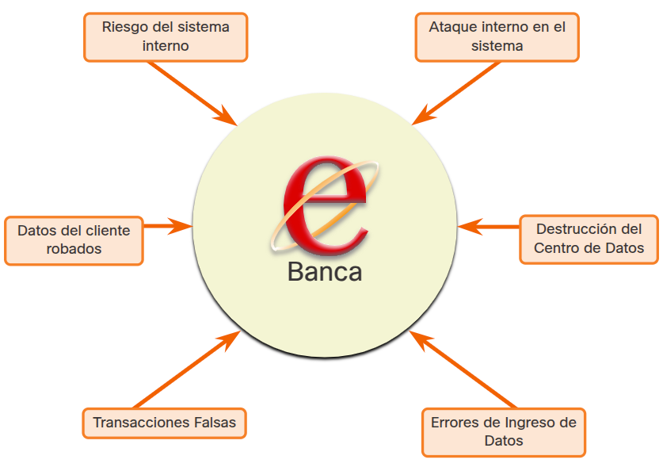
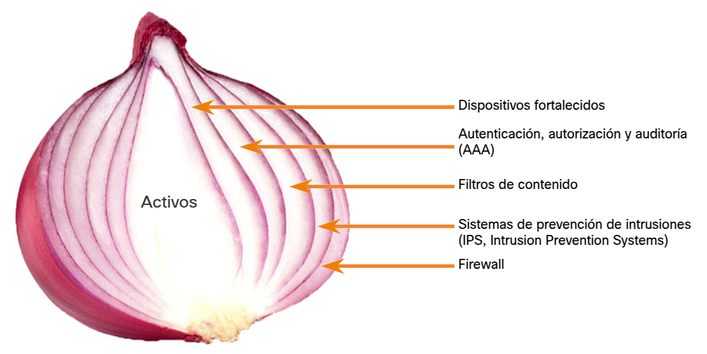
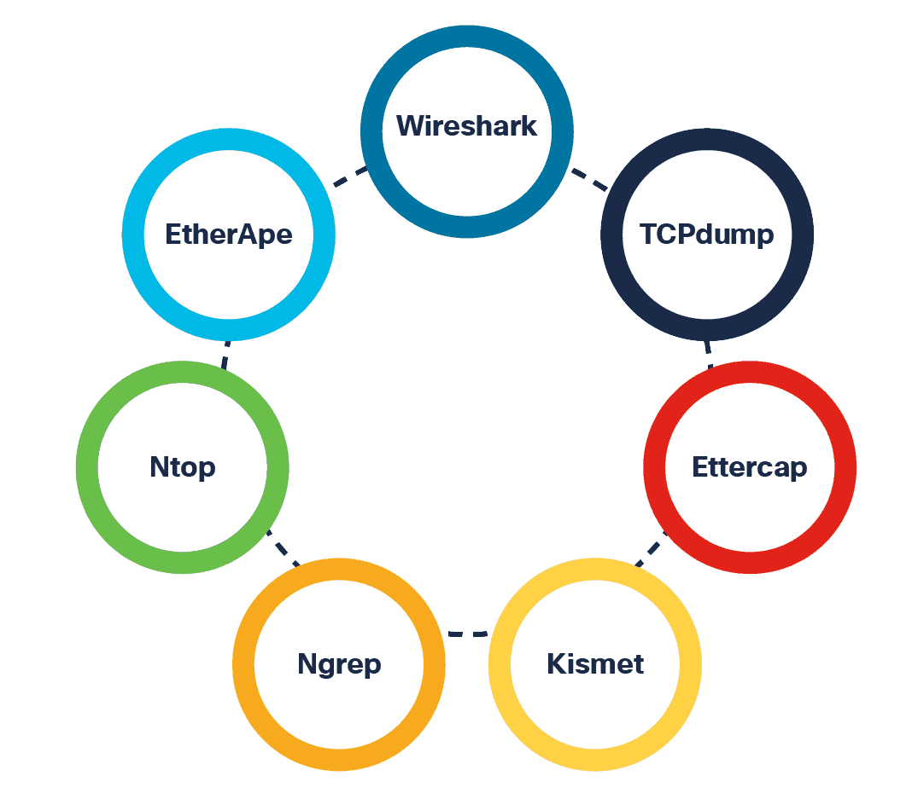

<a href="./00-Curso.md"><< Menú principal del módulo</a>

# 1. Comprendiendo qué es Defensa
# Defensa en Profundidad
## Activos, vulnerabilidades y amenazas
Los analistas de ciberseguridad deben prepararse para cualquier tipo de ataque. Es su trabajo proteger los activos de la red de la organización. Para ello, los analistas de ciberseguridad deben identificar primero lo siguiente:
* __Activos__. Cualquier cosa de valor para una organización que deba protegerse, incluidos servidores, dispositivos de infraestructura, dispositivos finales y el mayor activo, los datos.
* __Vulnerabilidades__. Una debilidad en un sistema o en su diseño que podría ser aprovechada por un atacante.
* __Amenazas__. Cualquier peligro potencial para un activo.

## Identificar los activos
A medida que una organización crece, también lo hacen sus activos, por lo que es posible imaginar la cantidad de activos que debe proteger una organización de gran tamaño. Las organizaciones también pueden adquirir otros activos mediante fusiones con otras empresas. Como resultado, muchas organizaciones solamente tienen una idea general de los activos que necesitan proteger.

Los activos son el conjunto de todos los dispositivos y la información que la organización posee o administra. Los activos constituyen la superficie de ataque a la que podrían apuntar los agentes de amenaza. Estos activos deben inventariarse y evaluarse a fin de determinar el nivel de protección necesario para frustrar posibles ataques.

La administración de activos consiste en inventariar todos los activos y, luego, desarrollar e implementar políticas y procedimientos para protegerlos. Esta tarea puede ser agotadora si se tiene en cuenta que muchas organizaciones deben proteger usuarios y recursos internos, trabajadores móviles y servicios virtuales y basados en la nube.

Además, las organizaciones necesitan identificar dónde se almacenan los activos de información fundamentales, y cómo se obtiene acceso a dicha información. Los activos de información varían, al igual que las amenazas contra ellos. Por ejemplo, es posible que una tienda minorista almacene información de las tarjetas de crédito de los clientes. Una empresa de ingeniería almacenará software y diseños que no debe ver la competencia. Un banco almacenará los datos del cliente, información de la cuenta y otra información financiera confidencial. Cada uno de estos activos puede atraer distintos agentes de amenaza que tienen distintos niveles de habilidad y motivaciones.

## Clasificación de los activos
La clasificación de activos asigna los recursos de una organización en grupos según características comunes. La información más importante debe recibir el mayor nivel de protección e incluso puede requerir un manejo especial.

Se puede utilizar un sistema de etiquetado para determinar el valor, la sensibilidad y la importancia de la información.
1. Determine la __categoría de identificación de activos__ correcta.
	* Activos de información. 
	* Activos de software. 
	* Activos físicos. 
	* Servicios. 
2. Establezca la __responsabilidad de los activos__ identificando al propietario de cada activo de información y cada pieza de software:
	* Identifique al propietario de todos los activos de información.
	* Identifique al propietario de todo el software de aplicaciones.
3. Determine los __criterios de clasificación__.
	* Confidencialidad. 
	* Valor. 
	* Tiempo. 
	* Derechos de acceso. 
	* Destrucción.
4. Implemente un __esquema de clasificación__.
	* Adoptar una forma consistente de identificar la información para garantizar una protección uniforme y facilitar el control.

## Estandarización de activos
Los estándares de activos identifican productos de hardware y software específicos utilizados por una organización.

Cuando ocurre una falla, actuar inmediatamente ayuda a mantener tanto el acceso como la seguridad. Si una organización no estandariza su selección de hardware, el personal deberá esforzarse por encontrar los componentes de repuesto. Los entornos no estandarizados requieren más experiencia para su administración y aumentan el costo de los contratos de mantenimiento e inventario.

## Etapas del ciclo de vida de los activos
Para los especialistas en ciberseguridad, parte del trabajo consiste en administrar los recursos de información y los sistemas relacionados durante todo el ciclo de vida de los recursos.

Las etapas del ciclo de vida de los activos son:
* __Adquisiciones__. La organización compra los activos según las necesidades identificadas a partir de los datos recopilados para justificar la compra. El activo se agrega al inventario de la organización.
* __Implementación__. El activo se ensambla e inspecciona para detectar defectos u otros problemas. El personal realiza pruebas e instala etiquetas o códigos de barras con fines de seguimiento. El activo pasa del inventario al estado en uso.
* __Utilización__. Esta es la etapa más larga del ciclo. El rendimiento del activo se verifica continuamente. Las actualizaciones, las correcciones con parches, la compra de nuevas licencias y las auditorías de cumplimiento forman parte de la etapa de uso.
* __Mantenimiento__. El mantenimiento ayuda a extender la vida productiva de un activo. El personal puede modificar o actualizar el activo.
* __Eliminación__. Al final de su vida productiva el activo debe eliminarse. Todos los datos deben eliminarse del activo. La eliminación puede incluir el desmantelamiento de un activo para obtener piezas de repuesto. Cualquier pieza que pueda causar un riesgo ambiental debe eliminarse de acuerdo con las normativas locales.

## Identificación de vulnerabilidades
La identificación de amenazas le brinda a una organización una lista de probables amenazas en un entorno determinado. Para identificar las amenazas, es importante hacerse varias preguntas:
* ¿Cuáles son las posibles vulnerabilidades de un sistema?
* ¿Quién podría aprovechar estas vulnerabilidades para obtener acceso a activos de información específicos?
* ¿Cuáles serían las consecuencias si alguien aprovecha vulnerabilidades del sistema y se pierden activos?

Para ver un ejemplo, consulte la ilustración
 

	

La identificación de amenazas para un sistema de banca electrónica incluiría lo siguiente:
* __Compromiso del sistema interno__. El atacante utiliza los servidores de banca electrónica expuestos para entrar en un sistema bancario interno.
* __Robo de datos de clientes__. Un atacante roba los datos personales y financieros de los clientes del banco de la base de datos de clientes.
* __Transacciones falsas desde un servidor externo__. Un atacante altera el código de la aplicación de banca electrónica y realiza transacciones haciéndose pasar por un usuario legítimo.
* __Transacciones falsas con una tarjeta inteligente o un PIN robados__. Un atacante roba la identidad de un cliente y realiza transacciones maliciosas desde la cuenta robada.
* __Ataque al sistema desde el interior__. Un empleado del banco encuentra una falla en el sistema y la aprovecha para iniciar un ataque.
* __Errores de ingreso de datos__. Un usuario ingresa datos incorrectos o realiza solicitudes de transacciones incorrectas.
* __Destrucción del centro de datos__. Un evento catastrófico daña gravemente o destruye el centro de datos.

La identificación de vulnerabilidades en una red requiere comprender las aplicaciones importantes que se utilizan, así como las diferentes vulnerabilidades de esa aplicación y del hardware. Esto puede exigirle al administrador de redes un nivel importante de investigación.

## Identificar amenazas
Las organizaciones deben emplear un enfoque de defensa profunda para identificar amenazas y asegurar activos vulnerables. En este enfoque se utilizan varias capas de seguridad en el perímetro de la red, dentro de la red y en los terminales de la red.

Para ver un ejemplo, consulte la ilustración.

	

La ilustración de esta diapositiva muestra una topología simple de un enfoque de defensa en profundidad.
* __Router de borde__. La primera línea de defensa se conoce como router de borde (R1 en la figura). El router perimetral tiene un conjunto de reglas que especifica el tráfico autorizado y denegado, y pasa por el firewall todas las conexiones destinadas a la red LAN interna.
* __Firewall__. La segunda línea de defensa es el firewall. El firewall es un dispositivo de control que efectúa un filtrado adicional y rastrea el estado de las conexiones. Deniega el inicio de conexiones desde las redes externas (no confiables) a la red interna (confiable) mientras permite que los usuarios internos establezcan conexiones bidireccionales con las redes no confiables. También puede realizar la autenticación de usuario (proxy de autenticación) para otorgarles a los usuarios remotos externos acceso a recursos de la red interna.
* __Router interno__. Otra línea de defensa es el router interno (R2 en la imagen). Puede aplicar las reglas de filtrado finales en el tráfico antes de que se reenvíe a su destino.

Los routers y firewalls no son los únicos dispositivos que se utilizan en el enfoque de defensa en profundidad. Otros dispositivos de seguridad incluyen Sistemas de Prevención de Intrusiones (IPS, _Intrusion Prevention System_), Protección Avanzada contra Malware (AMP, _Advanced Malware Protection_), sistemas de seguridad de contenido web y de correo electrónico, servicios de identidad, controles de acceso a la red y muchos más.

En el enfoque de seguridad de defensa en profundidad por capas, las diferentes capas trabajan juntas para crear una arquitectura de seguridad en la que la falla de una capa de protección no afecte la eficacia de las demás.

## Security Onion y Security Artichoke
Hay dos analogías comunes que se utilizan para describir un enfoque de defensa en profundidad.
* __Security Onion__. Una analogía común utilizada para describir un enfoque de defensa en profundidad se denomina “La Cebolla de Seguridad" Cómo se puede observar en la figura, un atacante tendría que quitar los mecanismos de defensa de la red capa por capa, de manera similar a pelar una cebolla. Solo después de penetrar en cada capa el actor de amenazas llegaría al sistema o a los datos a los cuales pretendía llegar.
__Nota__: El enfoque tipo cebolla de Security Onion descrito en esta página es una manera de visualizar la defensa en profundidad. No debe confundirse con el conjunto de herramientas de seguridad Security Onion.

	

* __Security Artichoke__. El panorama cambiante de las redes (por ejemplo, la evolución de las redes sin fronteras) ha cambiado esta analogía de "Cebolla de Seguridad" a "Alcachofa de Seguridad” la cual beneficia al atacante.

Como se puede observar en la imagen, los agentes de amenaza ya no tienen que desprender cada capa. solamente necesitan quitar “hojas de la alcachofa”. No solo eso, sino que cada “hoja” de la red puede revelar datos confidenciales que no están bien protegidos.

Por ejemplo, es más fácil para un agente de amenaza atacar un dispositivo móvil que un servidor o una computadora internos que están protegidos por capas de defensa. Cada dispositivo móvil es una hoja; cada vez que el hacker quita una hoja, encuentra más datos. En el corazón de la alcachofa se encuentran los datos más confidenciales. Cada hoja proporciona una capa de protección que, al mismo tiempo, es un camino para el ataque.

No es necesario quitar cada hoja para llegar al corazón de la alcachofa. Los hackers “descascaran” la armadura de seguridad del perímetro para llegar al “corazón” de la empresa.

Mientras que los sistemas orientados a Internet suelen estar muy bien protegidos y las protecciones de los límites suelen ser sólidas, los hackers insistentes, ayudados por una combinación de habilidad y suerte, eventualmente encuentran una brecha en este duro perímetro por la que pueden entrar e ir donde les plazca.

	

## Estrategias de defensa en profundidad
Si una organización solo cuenta con una medida de seguridad para proteger los datos y la información, los ciberdelincuentes solo deben superar esa única defensa para robar información o causar otro daño. Para garantizar la disponibilidad de los datos y la información, una organización debe elaborar distintos niveles de protección.
* __Estratificación__. Para asegurarse de que los datos y la información sigan estando disponibles, una organización debe establecer diferentes capas de protección, creando una barrera de múltiples defensas que trabajen juntas para prevenir los ataques. Un buen ejemplo de estratificación es una organización que almacena sus documentos ultrasecretos en un servidor protegido por contraseña en un edificio cerrado rodeado por una cerca electrificada.

	Un enfoque por capas proporciona la protección más completa porque, incluso si los ciberdelincuentes penetran una capa, aún deben lidiar con varias defensas más. Idealmente, cada capa debería ser más complicada de superar.

	La defensa en profundidad no proporciona un escudo impenetrable, pero ayudará a una organización a minimizar el riesgo manteniéndose un paso por delante de los ciberdelincuentes.
* __Restricción__. Limitar el acceso a los datos y la información reduce la posibilidad de una amenaza. Una organización debe restringir el acceso para que los usuarios solo tengan el nivel de acceso requerido para realizar su trabajo.

	Una organización debe contar con las herramientas y configuraciones adecuadas, como permisos de archivos, para limitar el acceso, así como las medidas de procedimiento adecuadas que definan pasos específicos para hacer cualquier cosa que pueda afectar la seguridad. Por ejemplo, un procedimiento restrictivo que obligue a los empleados a consultar siempre los documentos sensibles en una sala que disponga de CCTV garantiza que nunca sacarán dichos documentos de las instalaciones.
* __Diversidad__. Si todos los niveles protegidos fueran iguales, no sería muy difícil que los ciberdelincuentes realicen un ataque exitoso. Las capas deben ser diferentes para que, si se penetra una capa, la misma técnica no funcione en todas las demás, lo que comprometería todo el sistema. Además, una organización normalmente utilizará diferentes algoritmos de cifrado y sistemas de autenticación para proteger los datos en diferentes estados.

	Para lograr el objetivo de la diversidad en las defensas, las organizaciones pueden utilizar productos de seguridad de distintas empresas como diferentes factores de autenticación, como una tarjeta magnética de una empresa y un lector de huellas dactilares fabricado por otra, así como diversas medidas de seguridad, como cerraduras con retardo de tiempo en los armarios y la supervisión de un miembro del personal de seguridad al desbloquearlo.
* __Ocultamiento__. El ocultamiento de información también puede proteger los datos y la información. Una organización no debe revelar ninguna información que los ciberdelincuentes puedan utilizar para identificar qué sistema operativo está ejecutando un servidor, o el tipo o marca de equipo o software que utiliza.

	Los mensajes de error o la información del sistema no deben contener ningún detalle que un ciberdelincuente pueda usar para determinar qué vulnerabilidades están presentes. Ocultar ciertos tipos de información hace que sea más difícil para los ciberdelincuentes atacar.
* __Simplicidad__. La complejidad no necesariamente garantiza la seguridad. Si una organización implementa sistemas complejos que son difíciles de entender y solucionar, esto puede resultar contraproducente. Si los empleados no entienden cómo configurar correctamente una solución, por ejemplo, si configuran su cuenta mediante un proceso innecesariamente complejo, esto puede facilitar que los ciberdelincuentes pongan en peligro esos sistemas.

	Una solución de seguridad debe ser sencilla por dentro pero compleja por fuera.

# Gestión de operacíones de ciberseguridad
## Administración de la configuración
La gestión de la configuración se refiere a identificar, controlar y auditar la implementación y cualquier cambio realizado en la línea de base establecida de un sistema.

La configuración de referencia incluye todos los ajustes que se configuran para un sistema que proporciona la base para todos los sistemas similares ─como una especie de plantilla─.

Por ejemplo, los responsables de desplegar estaciones de trabajo Windows a los usuarios deben instalar las aplicaciones necesarias y establecer los ajustes del sistema según una configuración documentada. Esta es la configuración de referencia para las estaciones de trabajo con Windows dentro de esta organización.

Los recursos de configuración ddocuemntados pueden incluri lo siguiente:
* Mapas de red, diagramas de cableado y especificaciones de configuración de aplicaciones.
* Convenciones de nomenclatura estándar utilizadas para las computadoras.
* Esquema de IP para rastrear las direcciones IP.

Reforzar el sistema operativo es una parte importante para garantizar que los sistemas tengan configuraciones seguras. La configuración de los archivos de registro junto con la auditoría, el cambio de nombres de cuenta y contraseñas por defecdto y la implementación de políticas de cuentas y control de acceso a nivel de archivos se utilizan para crear un sistema operativo seguro.

## Archivos de registro
Un registro registra todos los eventos a medida que ocurren. Las entradas de registro conforman el archivo de registro y contienen toda la información relacionada con un evento específico. Los registros precisos y completos son muy importantes en ciberseguridad.

Por ejemplo, un registro de auditoría sigue los intentos de autenticación del usuario y un registro de acceso proporciona todos los datos de solicitudes de archivos específicos en un sistema. Por lo tanto, monitorear los registros del sistema nos ayudará a determinar cómo ocurrió un ataque y cuáles de las defensas implementadas tuvieron éxito y cuáles no.

Dado que cada vez se genera un mayor número de archivos de registro con fines de seguridad informática, las organizaciones deberían considerar un proceso de gestión de registros. La administración de datos de registro de seguridad informática debe determinar los procedimientos para lo siguiente:
* Generación de archivos de registro
* Transmisión de archivos de registro
* Almacenamiento de archivos de registro
* Análisis de los datos de registro
* Eliminación de los datos de registro

## Registos del sistema operativo y registros de seguridad de aplicaciones
Los registros del sistema operativo registran eventos vinculados a acciones que tienen que ver con el sistema operativo. Los eventos del sistema incluyen lo siguiente:
* Las solicitudes de clientes y las respuestas de servidores, como autenticaciones de usuario exitosas.
* Información de uso que contiene la cantidad y el tamaño de las transacciones en un período determinado.

Las organizaciones utilizan software de seguridad basado en la red y/o en el sistema para detectar actividades maliciosas. Este software genera un registro de seguridad para proporcionar datos de seguridad informática. Estos registros son útiles para realizar análisis de auditoría e identificar tendencias y problemas a largo plazo. Los registros además permiten que una organización proporcione documentación que evidencie el cumplimiento de las leyes y los requisitos normativos.

## Analizadores de protocolo
Los analizadores de paquetes, también conocidos como _packet sniffers_, interceptan y registran el tráfico de la red.

El analizador de paquetes captura cada paquete, mira los valores de varios campos del paquete y analiza su contenido. Puede capturar el tráfico de red tanto en redes cableadas como inalámbricas.

Los analizadores de paquetes realizan las siguientes funciones:
* Registro del tráfico.
* Análisis de problemas de red.
* Detección de usos indebidos de la red.
* Detección de intentos de intrusión en la red.
* Aislamiento de los sistemas vulnerados

	

# Políticas, regulaciones y estándares de seguridad
## Políticas de la empresa
Las políticas empresariales son las pautas que desarrollan las organizaciones para regir sus acciones y las de sus empleados. Las políticas definen estándares de comportamiento correcto para la empresa y sus empleados. En el ámbito de las redes, las políticas definen las actividades autorizadas en la red. Esto permite establecer un patrón de referencia de uso aceptable. Si se detecta un comportamiento que viola la política de la empresa en la red, es posible que se haya infringido la seguridad.

Una organización puede tener varias políticas orientadoras, como las que se mencionan en la tabla.

<table>
	<tr><th>Política<th>Descripción
	<tr><td><b>Políticas de la empresa</b><td colspan="3"><ul><li>Estas políticas establecen las normas de conducta y las responsabilidades tanto de los empleados como de los empresarios.<li>Las políticas protegen los derechos de los trabajadores, así como los intereses comerciales de los empleadores.<li>Dependiendo de las necesidades de la organización, diversas políticas y procedimientos establecen normas relativas a la conducta de los empleados, la asistencia, el código de vestimenta, la privacidad y otras áreas relacionadas con los términos y condiciones de empleo.</ul>
	<tr><td><b>Políticas para los empleados</b><td><ul><li>Estas políticas son creadas y mantenidas por el personal de recursos humanos para identificar el salario de los empleados, el calendario de pagos, los beneficios de los empleados, el horario de trabajo, las vacaciones y más.<li>Suelen entregarse a los nuevos empleados para que las revisen y las firmen.</ul>
	<tr><td><b>Políticas de seguridad</b><td><ul><li>Estas políticas identifican un conjunto de objetivos de seguridad para una empresa, definen las reglas de comportamiento para los usuarios y administradores, y especifican los requisitos del sistema.<li>Estos objetivos, reglas y requisitos garantizan colectivamente la seguridad de una red y de los sistemas informáticos de una organización.<li>Al igual que un plan de continuidad, una política de seguridad es un documento en constante evolución basado en los cambios en el panorama de las amenazas, las vulnerabilidades y los requisitos de la empresa y los empleados.</ul>
</table>

## Política de seguridad
Una política de seguridad integral tiene varios beneficios:
* Demuestra el compromiso de una organización con la seguridad.
* Establece las reglas del comportamiento esperado.
* Garantiza la uniformidad en las operaciones del sistema, el software y la adquisición y uso de hardware, y el mantenimiento.
* Define las consecuencias legales de las violaciones.
* Brinda al personal de seguridad el respaldo para la administración.

Las políticas de seguridad se usan para informar a los usuarios, al personal y a los gerentes los requisitos de una organización para proteger la tecnología y los activos de información. Una política de seguridad también especifica los mecanismos necesarios para cumplir con los requisitos de seguridad y proporciona un patrón de referencia para adquirir, configurar y auditar el cumplimiento normativo de sistemas informáticos y redes.

En la siguiente tabla se mencionan las políticas que pueden incluirse en una directiva de seguridad.

<table>
	<tr><th><b>Política<th>Descripción
	<tr><td><b>Política de identificación y autenticación</b><td>Especifica las personas autorizadas que pueden tener acceso a los recursos de la red y los procedimientos de verificación de la identidad.
	<tr><td><b>Política de contraseñas</b><td>Garantiza que las contraseñas cumplan los requisitos mínimos y se cambien regularmente.
	<tr><td><b>Política de uso aceptable (AUP)</b><td>Identifica las aplicaciones y usos de la red que son aceptables para la organización. También puede identificar las ramificaciones si se viola esta política.
	<tr><td><b>Política de acceso remoto</b><td>Identifica cómo los usuarios remotos pueden acceder a una red y a qué se puede acceder a través de la conectividad remota.
	<tr><td><b>Política de mantenimiento de la red</b><td>Especifica los sistemas operativos de los dispositivos de red y los procedimientos de actualización de las aplicaciones de los usuarios finales.
	<tr><td><b>Procedimientos de gestión de incidentes</b><td>Describe cómo se gestionan los incidentes de seguridad.
</table>

Uno de los componentes más comunes de la política de seguridad es una Política de Uso Aceptable (AUP) también denominada política de uso adecuado. Este componente define qué pueden y no pueden hacer los usuarios en los distintos componentes del sistema. Esto incluye el tipo de tráfico que se autoriza en la red. La AUP debe ser lo más explícita posible para evitar la malinterpretación.

Por ejemplo, una AUP puede especificar páginas web, grupos informativos o aplicaciones de uso intensivo de ancho de banda a los que los usuarios tengan prohibido el acceso utilizando las computadoras o la red de la empresa. Todos los empleados deben firmar una AUP y las AUP firmadas deben conservarse durante el término del empleo.

## Políticas BYOD (_Bring Your Own Device_)
Hoy en día, muchas organizaciones también deben admitir el uso de dispositivos propios (BYOD, Bring Your Own Device). Esto les permite a los empleados utilizar sus propios dispositivos móviles para tener acceso a sistemas, software, redes o información de la empresa. BYOD supone numerosos beneficios clave para las empresas, como el aumento de la productividad, la reducción de costos operacionales y de TI, la optimización de la movilidad para los empleados y mayor atractivo a la hora de contratar y retener empleados.

Sin embargo, estas ventajas también presentan un aumento en el riesgo que corre la seguridad de la información, ya que BYOD puede conducir a violaciones de datos y a una mayor responsabilidad para la organización.

Es necesario desarrollar una política de seguridad de BYOD para lograr lo siguiente:
* Especificar los objetivos del programa BYOD.
* Identificar qué empleados pueden traer sus propios dispositivos.
* Identificar los dispositivos que se admitirán.
* Identificar el nivel de acceso que se otorgará a los empleados cuando utilicen dispositivos personales.
* Describir los derechos de acceso y las actividades autorizadas al personal de seguridad en el dispositivo.
* Identificar qué normas deben respetarse cuando los empleados utilicen sus dispositivos.
* Identificar medidas de seguridad para poner en marcha si un dispositivo está en riesgo.

En la tabla se mencionan las buenas prácticas de seguridad de BYOD para ayudar a mitigar las vulnerabilidades de BYOD.

<table>
	<tr><th>Mejores prácticas<th>Descripción
	<tr><td><b>Acceso protegido por contraseña</b><td>Utilice contraseñas únicas para cada dispositivo y cuenta.
	<tr><td><b>Controle manualmente la conectividad inalámbrica</b><td>Desactive la conectividad Wi-Fi y Bluetooth cuando no la utilice. Conéctese solo a redes de confianza.
	<tr><td><b>Manténgase actualizado</b><td>Mantenga siempre actualizado el sistema operativo del dispositivo y el resto del software. El software actualizado suele contener parches de seguridad para mitigar las últimas amenazas o exploits.
	<tr><td><b>Haga una copia de setguridad de los datos</b><td>Habilite una copia de seguridad del dispositivo en caso de pérdida o robo.
	<tr><td><b>Habilite "Buscar mi dispositivo"</b><td>Suscríbase a un servicio de localización de dispositivos con función de borrado remoto.
	<tr><td><b>Proporcione software antivirus</b><td>Proporcione software antivirus para los dispositivos BYOD aprobados.
	<tr><td><b>Utilizce software de gestión de dispositivos móviles (MDM)</b><td>El software MDM permite a los equipos de TI implementar ajustes de seguridad y configuraciones de software en todos los dispositivos que se conectan a las redes de la empresa.
</table>

## Cumplimiento de reglamentos y normas
También hay reglas externas en materia de seguridad de la red. Los profesionales de seguridad de la red deben estar familiarizados con las leyes y los códigos de ética obligatorios para los profesionales de la seguridad de los sistemas de información (INFOSEC, Information Systems Security).

Muchas organizaciones deben desarrollar e implementar políticas de seguridad. Las reglas de cumplimiento definen qué organizaciones deben hacerlo y qué responsabilidad tienen si no las cumplen. Las reglas de cumplimiento que una organización está obligada a seguir dependen del tipo de organización y de los datos que maneja. Las reglas de cumplimiento específicas se analizarán más adelante en el curso.

## Lab - Documentar los problemas de ciberseguridad de la empresa
* <a href="./notes/lab_documentar_problemas_ciberseguridad_empresa.md" target="_blank">Documentar los problemas de ciberseguridad de la empresa</a>

# Resumen
## Defensa en profundidad
Para prepararse para cualquier tipo de ataque, los técnicos de ciberseguridad primero deben identificar los activos, las vulnerabilidades y las amenazas. Los activos son el conjunto de todos los dispositivos y la información que la organización posee o administra. Los activos constituyen la superficie de ataque a la que podrían apuntar los agentes de amenaza. Existen cuatro pasos para la identificación y clasificación de activos: 1. Determinar la categoría de identificación de activos correcta., 2. Establecer la responsabilidad de los activos identificando al propietario de cada activo de información y cada pieza de software., 3. Determinar los criterios de clasificación., y 4. Implementar un esquema de clasificación. Los estándares de activos identifican productos de hardware y software específicos utilizados por una organización. Las etapas del ciclo de vida de los recursos son la adquisición, la implementación, la utilización, el mantenimiento y la eliminación. La identificación de vulnerabilidades en una red requiere comprender las aplicaciones importantes que se utilizan, así como las diferentes vulnerabilidades de esa aplicación y del hardware. Las organizaciones deben emplear un enfoque de defensa profunda para identificar amenazas y asegurar activos vulnerables. En este enfoque se utilizan varias capas de seguridad en el perímetro de la red, dentro de la red y en los terminales de la red. Hay dos analogías comunes que se utilizan para describir un enfoque de defensa en profundidad: Security Onion y Security Artichoke. Para asegurarse de que los datos y la infraestructura permanecen seguros, una organización debe crear diferentes niveles de protección incluyendo la estratificación, la limitación, la diversidad, el oscurecimiento y la simplicidad.

## Gestión de operaciones de ciberseguridad
La gestión de la configuración se refiere a identificar, controlar y auditar la implementación y cualquier cambio realizado en la línea de base establecida de un sistema. Los recursos de configuración documentados pueden incluir mapas de red, diagramas de cableado, estándares de configuración de aplicaciones, convenciones de nomenclatura y un esquema de IP. La configuración de los archivos de registro junto con la auditoría, el cambio de nombres de cuenta y contraseñas por defecto y la implementación de políticas de cuentas y control de acceso a nivel de archivos se utilizan para crear un sistema operativo seguro. La gestión de los datos de registro de seguridad informática debe determinar los procedimientos para lo siguiente: generar, transmitir y almacenar los archivos de registro, así como analizar y eliminar los datos de registro. Los registros del sistema operativo registran eventos vinculados a acciones que tienen que ver con el sistema operativo. Las organizaciones utilizan software de seguridad basado en la red y/o en el sistema para detectar actividades maliciosas. Este software genera registros de seguridad que son útiles para realizar análisis de auditoría e identificar tendencias y problemas a largo plazo. Los registros además permiten que una organización proporcione documentación que evidencie el cumplimiento de las leyes y los requisitos normativos. Los analizadores de paquetes, también conocidos como packet sniffers, interceptan y registran el tráfico de la red. Los analizadores de paquetes realizan las siguientes funciones: registro de tráfico, análisis de problemas en la red, detección de usos indebidos de la red, detección de intentos de intrusión en la red y aislamiento de sistemas vulnerados.

## Políticas, regulaciones y estándares de seguridad
Las políticas empresariales definen estándares de comportamiento correcto para la empresa y sus empleados. En las redes, las políticas definen las actividades que se permiten en la red, estableciendo una línea base de uso aceptable. Si se detecta un comportamiento que viola la política de la empresa en la red, es posible que se haya infringido la seguridad. La mayoría de las organizaciones tendrán políticas de la empresa, políticas de los empleados y políticas de seguridad. Las políticas de seguridad se componen de una variedad de políticas que incluyen: identificación y autenticación, contraseñas, uso aceptable, acceso remoto, mantenimiento de la red y manejo de incidentes. Las políticas de BYOD se componen de mejores prácticas, entre ellas: acceso protegido por contraseña, control manual de la conectividad inalámbrica, parches y actualizaciones al día, copias de respaldo actualizadas, habilitación de “Find my Device” (Encontrar mi dispositivo), uso de software antivirus y uso de MDM. También hay reglas externas en materia de seguridad de la red. Los profesionales de seguridad de la red deben estar familiarizados con las leyes y los códigos de ética obligatorios para los profesionales de la seguridad de los sistemas de información (INFOSEC, Information Systems Security).

# Enlaces de interés
1. 
2. 
3. 
 
 
 
 
 
 
 
 
 
<a href="#1-comprendiendo-qué-es-defensa">⬆️</a>
<a href="./00-Curso.md"><< Menú principal del módulo</a>