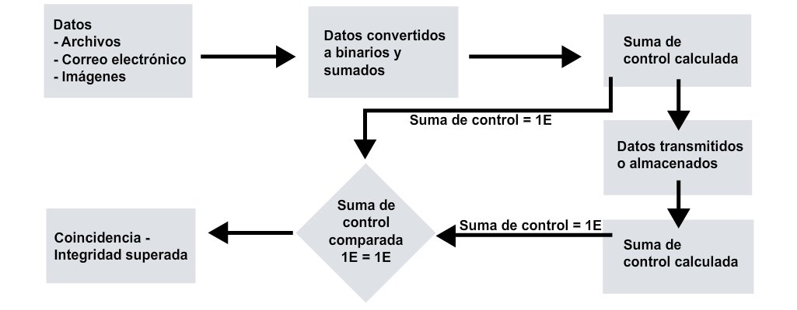
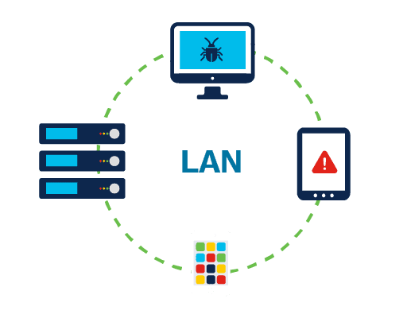
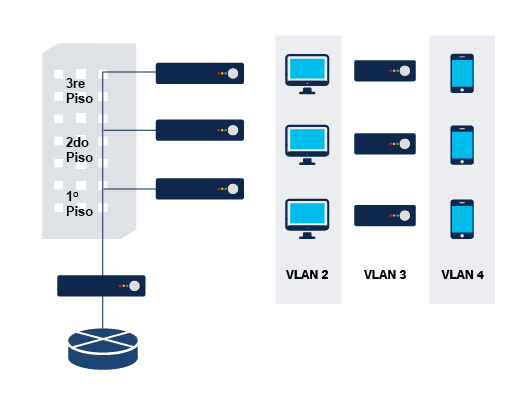
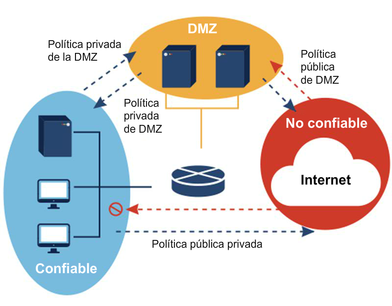
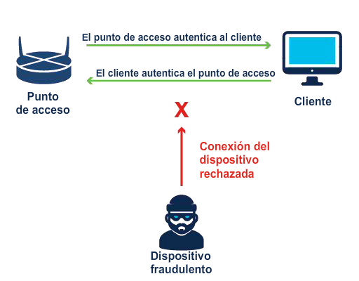
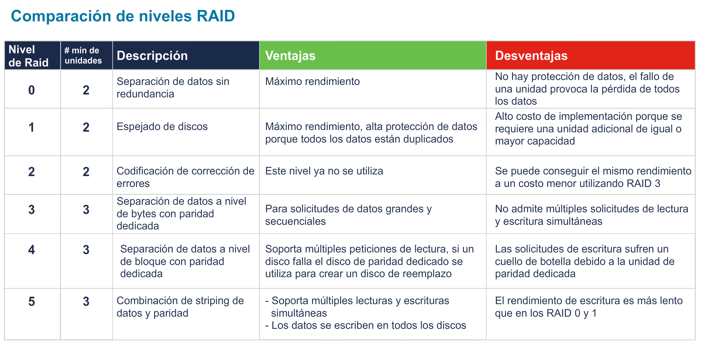
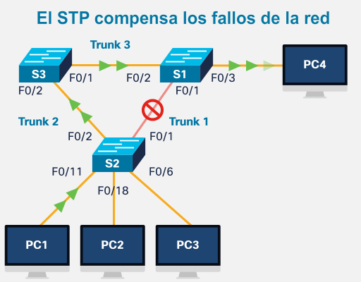
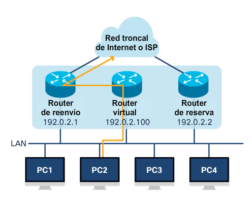
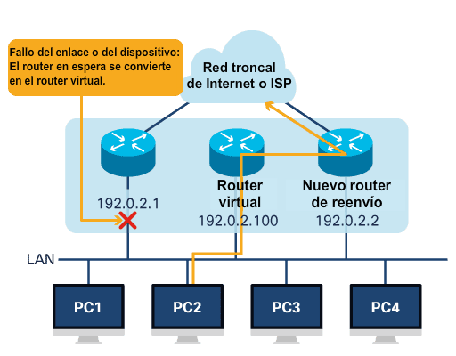

<a href="./00-Curso.md"><< Menú principal del módulo</a>

# 2. Defensa del sistema y de la red
# Seguridad física
## Cercas y barreras físicas
Las barricadas o el vallado suelen ser lo primero que se nos ocurre cuando pensamos en tipos de seguridad física.

En muchas situaciones, son la capa de defensa más externa y la más visible. Todas las barreras físicas deben cumplir con los requisitos específicos de diseño y con las especificaciones de los materiales.
* __Barreras físicas__. Las barreras físicas pueden tener los siguientes componentes:
	* Uns sistema de cerca perimetral.
	* Un sistema de puerta de seguridad.
	* Pilones (postes cortos utilizados para detener las intrusiones de vehículos).
	* Barreras de entrada de vehículos.
	* Refugios de protección.
	* Cercado.
* __Cercado__. Un cerco es una barrera que encierra zonas seguras y designa los límites. Al diseñar un sistema de cercado perimtral se aplican las siguientes pautas de altura:
	* 1 metro (3-4 pies) solo disuadirá a los intrusos ocasionales.
	* 2 metros (6-7 pìes) son demasiado altos para ser escalados por intrusos casuales.
	* 2.5 metros (8 pies) ofrecerán un retraso limitado a un intruso decidido.

Las zonas de alta seguridad suelen requerir una 'protección superior' tal como alambre de púas o concertinas. Los protectores superiores actúan como un elemento disuasorio adicional y pueden retrasar al intruso causándole graves lesiones. Sin embargo, los atacantes pueden utilizar una manta o un colchón para aliviar esta amenaza.

Las regulaciones locales pueden restringir el tipo de sistema de cercado que una organización puede usar y es importante recordar que las cercas requieren un mantenimiento regular. Los animales pueden cavar debajo de la cerca o la tierra puede socavarse y dejar la cerca inestable, lo que proporcionará un acceso sencillo al intruso. Los sistemas de cercado deberían ser inspeccionados regularmente.

Además, los vehículos nunca deben estacionarse cerca de una cerca de seguridad, ya que esto podría ayudar al intruso a trepar o causar daños a la cerca.

## Biometría
La biometría se refiere a las características fisiológicas o de comportamiento de un individuo, y existen prácticas de seguridad basadas en la identificación y la concesión de acceso mediante la biometría.
* __Los sistemas de autenticación biométrica pueden incluir medidas del rostro, huellas digitales, geometría de la mano, iris, retina, firma y voz__. Las tecnologías biométricas son la base de la identificación altamente segura y las soluciones de verificación personal. La popularidad y el uso de sistemas biométricos han aumentado debido a la mayor cantidad de infracciones a la seguridad y fraude de transacciones.
	
	La biometría puede garantizar la confidencialidad de las transacciones financieras y la privacidad de los datos personales: un ejemplo muy conocido son los teléfonos inteligentes que utilizan lectores de huellas dactilares para desbloquear el dispositivo y acceder a las aplicaciones, incluidos los sistemas de pago y la banca en línea.
* __Al seleccionar sistemas biométricos hay varios factores importantes a tener en cuenta__.
	* Precisión.
	* Velocidad o tasa de transferencia.
	* Aceptabilidad de los usuarios.
	* Unicidad del órgano biométrico y la acción.
	* Resistencia a la falsificación.
	* Confiabilidad.
	* Requisitos de almacenamiento de datos.
	* Tiempo de inscripción.
	* Intrusividad del análisis.
	El más importante de estos factores es la precisión, que se expresa en tipos y tasas de error.
* __El primer índice de error es el error de Tipo I o falso rechazo__. El error de Tipo I rechaza a una persona que se registra y es un usuario autorizado. En el control de acceso, donde el objetivo principal es mantener alejados a los ciberdelincuentes, el falso rechazo es el error menos importante. Significa que alguien que debe obtener acceso no lo obtiene.
	Sin embargo, en muchas aplicaciones biométricas, particularmente en el comercio minorista o la banca, los falsos rechazos pueden tener un impacto muy negativo en el negocio debido a la pérdida de una transacción o venta.
* __La falsa aceptación es un Error de tipo II__. Los errores de Tipo II permiten la entrada a personas que no deben tener acceso, lo que significa que un ciberdelincuente puede obtener acceso. Por esta razón, los errores de tipo II se consideran normalmente el error más importante para un sistema de control de acceso biométrico.
	La tasa de aceptación también es un concepto importante aquí. Expresado en forma de porcentaje, es la tasa en la que un sistema acepta a personas no registradas o impostoras como usuarios auténticos, es decir, la tasa de errores de Tipo II por el total de casos de concesión de permisos.

## Tarjetas de identificación y registros de acceso
La tarjeta de identificación de acceso permite que una persona obtenga acceso a un área con puntos de ingreso automatizados. 
* Se desliza una credencial de acceso
* El lector de tarjetas lee un número en la tarjeta de acceso
* El sistema envía el número a una computadora
* La computadora toma decisiones de control de acceso basadas en la credencial proporcionada
* El sistema registra la transacción para su posterior recuperación.

## Vigilancia
Todos los controles de acceso físico, incluidos los sistemas de disuasión y detección, dependen en última instancia de la intervención del personal para detener el ataque o la intrusión real.
* Guardias y escoltas. Los guardias de seguridad son una gran solución para el control de acceso que requiere una respuesta instantánea y adecuada. Sin embargo, el uso de guardias de seguridad tiene numerosas desventajas, como el costo y la imposibilidad de controlar y registrar grandes volúmenes de tráfico. El uso de guardias también introduce el riesgo de error humano.
En las instalaciones de sistemas de información de alta seguridad, los guardias controlan el acceso a las áreas confidenciales de la organización. La ventaja de utilizar guardias en este caso es que pueden adaptarse más que los sistemas automatizados. Los guardias pueden descubrir y diferenciar varias condiciones y situaciones y tomar decisiones en el lugar.
* Vigilancia por video y electrónica. La videovigilancia y la vigilancia electrónica pueden complementar o, en algunos casos, sustituir a los guardias de seguridad. Las ventajas de la videovigilancia y la vigilancia electrónica son, entre otras, la posibilidad de vigilar zonas en las que no hay otras personas, la capacidad de grabar y registrar vídeos y datos de vigilancia durante largos periodos, además de poder vincularse a la tecnología de detección de movimiento y a las notificaciones cuando sea necesario. Otra gran ventaja es que las cámaras de vigilancia pueden colocarse para ofrecer puntos de vista claros y son mucho más económicas a la hora de vigilar todo el perímetro de una instalación.
En un entorno de alta seguridad, la vigilancia por vídeo y electrónica debe colocarse en todas las entradas, salidas, plataformas de carga, escaleras y zonas de recolección de residuos.
* Vigilancia inalámbrica e RFID. La gestión y localización de activos importantes del sistema de información es un reto clave para la mayoría de las organizaciones. El crecimiento en la cantidad de dispositivos móviles y dispositivos de IoT ha hecho que este trabajo sea incluso más difícil. El tiempo que insume buscar equipos críticos puede provocar costosas demoras o tiempo de inactividad. El uso de etiquetas de identificación de recursos por radiofrecuencia (RFID) puede ser de gran valor para el personal de seguridad. Una organización puede posicionar lectores de RFID en los marcos de las puertas de las áreas seguras de manera tal que no sean visibles para las personas.
El beneficio de las etiquetas de identificación de recursos de RFID es que pueden seguir cualquier activo que deje físicamente un área segura. Los nuevos sistemas de etiquetas de identificación de recursos de RFID pueden leer múltiples etiquetas en simultáneo. Los sistemas RFID tampoco requieren una línea de vista para escanear las etiquetas. Otra ventaja de la RFID es la capacidad para leer las etiquetas que no son visibles. A diferencia de los códigos de barras y las etiquetas legibles por el ser humano, que deben localizarse físicamente y mostrarse abiertamente para ser leídas, las etiquetas RFID no necesitan ser visibles para ser escaneadas.
Las computadoras portátiles de oficina actualmente tienen etiquetas visibles que solo se pueden escanear manualmente. El uso de una RFID en su lugar significaría que estas etiquetas pueden ser escaneadas sin siquiera ser vistas, y por lo tanto alertarían al sistema si alguien intenta salir por la puerta con uno de estos portátiles escondidos en su persona o dentro de su bolsa, sin que el ladrón se dé cuenta de que algo está siendo escaneado.

# Seguridad de las aplicaciones
Una parte clave de la protección de una organización implica la protección de las aplicaciones, los sitios web y los servicios en línea que desarrolla y utiliza. La seguridad debe ser la máxima prioridad al desarrollar, probar e implementar aplicaciones.

## Desarrollo de las aplicaciones
Para mantener la seguridad en todas las etapas del desarrollo de aplicaciones es necesario seguir un proceso sólido.
* __Desarrollo y prueba__. El software se desarrolla y actualiza en un entorno de desarrollo, donde se puede desarrollar, probar y depurar antes de implementarlo. Un entorno de desarrollo es menos restrictivo que el entorno real y tiene un nivel de seguridad más bajo. El software de control de versiones ayuda a seguir y gestionar los cambios en el código del software. Los desarrolladores también pueden trabajar en un entorno aislado (sandbox) para que el código no se sobrescriba mientras lo desarrollan. 
Durante las pruebas, los desarrolladores observan cómo interactúa el código con el entorno normal. El control de calidad (QA) puede encontrar defectos en el software. Es mucho más fácil corregir cualquier defecto encontrado en esta fase.
* __Pruebas y producción__. Los entornos de pruebas deben coincidir con el entorno de producción de la organización. Al realizar las pruebas en un entorno, los desarrolladores pueden verificar que el software se ejecuta con la configuración de seguridad requerida. Después de que el desarrollador ejecuta y prueba la seguridad, el programa puede implementarse en producción.
* __Aprovisionamiento y desaprovisionamiento__. El aprovisionamiento es la creación o actualización de software. El desaprovisionamiento es su eliminación. Una organización puede utilizar un portal de autoservicio para automatizar el aprovisionamiento y desaprovisionamiento de software.

## Técnicas de codificación de seguridad
Al codificar aplicaciones, los desarrolladores utilizan varias técnicas para validar que se hayan cumplido todos los requisitos de seguridad.
* __Normalización__. La normalización se utiliza para organizar los datos en una base de datos y ayudar a mantener la integridad de los mismos. La normalización convierte una cadena de entrada a su forma más simple conocida para garantizar que todas las cadenas tengan representaciones binarias únicas y que se identifique cualquier entrada maliciosa.
* __Procedimientos almacenados__. Un procedimientos almacenado (_stored procedure_) es un grupo de instrucciones SQL precompiladas almacenadas en una base de datos que ejecuta una tarea. Si utiliza un procedimiento almacenado para aceptar parámetros de entrada de clientes que utilizan datos de entrada diferentes, reducirá el tráfico de red y obtendrá resultados más rápidos.
* __Ofuscación y camuflaje__. Un desarrollador puede utilizar la ofuscación y el camuflaje para evitar que el software sea objeto de ingeniería inversa. La ofuscación oculta los datos originales con caracteres o datos aleatorios. El camuflaje sustituye los datos sensibles por datos ficticios realistas.
* __Reutilización de código__. La reutilización del código significa utilizar el software existente para construir un nuevo software, ahorrando tiempo y costos de desarrollo. Sin embargo, hay que tener cuidado para evitar la introducción de vulnerabilidades.
* __SDK__. Las bibliotecas de terceros y los kits de desarrollo de software (SDK) proporcionan un repositorio de código útil para que el desarrollo de aplicaciones sea más rápido y barato. El inconveniente es que cualquier vulnerabilidad en los SDK o en las bibliotecas de terceros puede afectar potencialmente a muchas aplicaciones.

Los ciberdelincuentes suelen apuntar a información confidencial almacenada en bases de datos. La implementación de prácticas de seguridad de aplicaciones ayuda a proteger las bases de datos contra ataques.

## Validación de entrada
El control del proceso de introducción de datos es fundamental para mantener la integridad de la base de datos. Muchos ataques se ejecutan contra una base de datos e insertan datos con formato incorrecto. Estos ataques pueden confundir, bloquear o hacer que la aplicación divulgue demasiada información al atacante. Desplácese hacia abajo para ver un ejemplo - en este caso, un ataque de entrada automatizado.

Los clientes rellenan un formulario web para suscribirse a un boletín de noticias. Una aplicación de base de datos genera y envía automáticamente confirmaciones por correo electrónico a los clientes. Cuando los clientes reciben el correo electrónico con un enlace URL para confirmar su suscripción, los atacantes han modificado el enlace URL. 

Estas modificaciones pueden cambiar el nombre de usuario, la dirección de correo electrónico o el estado de suscripción de los clientes cuando hacen clic para confirmar su suscripción. De este modo, cuando el correo electrónico es devuelto al host, éste recibe información falsa de la que podría no ser consciente si no comprueba cada dirección de correo electrónico con la información de suscripción.

Los hackers pueden automatizar este ataque para inundar la aplicación web con miles de suscriptores no válidos a la base de datos del boletín.

## Reglas de validación
Una regla de validación verifica que los datos se encuentren dentro los parámetros definidos por el diseñador de la base de datos. Una regla de validación ayuda a garantizar la integridad, la precisión y la coherencia de los datos. Los criterios utilizados en una regla de validación incluyen los siguientes:
* __Tamaño__: Controla la cantidad de caracteres en un elemento de datos
* __Formato__: Controla que los datos se ajusten a un formato específico
* __Coherencia__: Controla la coherencia de los códigos en los elementos de datos relacionados
* __Rango__: Controla que los datos se encuentran dentro de un valor mínimo y un valor máximo
* __Dígito de control__: Proporciona un cálculo adicional para generar un dígito de control para la detección de errores.

## Controles de integridad
Los datos comprometidos pueden poner en riesgo la seguridad de sus dispositivos y sistemas.

Un control de integridad puede medir la consistencia de los datos en un archivo, imagen o registro para garantizar que no se hayan dañado. El control de integridad realiza una función _hash_ para tomar una instantánea de los datos y luego utiliza esta instantánea para garantizar que los datos permanezcan sin cambios. Un _checksum_ (suma de control) es un ejemplo de una función de _hash_.

	

* __Suma de control__ (_checksum_). Una suma de comprobación verifica la integridad de los archivos, o cadenas de caracteres, antes y después de que se transfieran entre dispositivos a través de una red local o de Internet. Las sumas de comprobación convierten cada pieza de información en un valor y suman el total. Para comprobar la integridad de los datos, un sistema receptor repite el proceso. Si las dos sumas son iguales, los datos son válidos. De lo contrario, se produjo un cambio en algún punto de la línea.
* __Funciones de *hash*__. Las funciones de _hash_ comunes incluyen `MD5`, `SHA-1`, `SHA-256` y `SHA-512`. Utilizan complejos algoritmos matemáticos para comparar los datos con un valor _hash_. Por ejemplo, después de descargar un archivo, el usuario puede verificar la integridad del mismo comparando los valores _hash_ de la fuente con los generados por cualquier calculadora de _hash_.
* __Control de versiones__. Las organizaciones utilizan el control de versiones para evitar que los usuarios autorizados realicen cambios accidentales. El control de versiones significa que dos usuarios no pueden actualizar el mismo objeto, como un archivo, registro de base de datos o transacción, exactamente al mismo tiempo. Por ejemplo, el primer usuario que abre un documento tiene permiso para modificarlo; la segunda persona que intente abrirlo mientras el primer usuario sigue trabajando en él sólo podrá acceder a una versión de solo lectura.
* __Copias de respaldo__. Las copias de respaldo precisas permiten mantener la integridad de datos si los datos se dañan. Una organización necesita verificar su proceso de copia de seguridad para garantizar la integridad de la misma.
* __Autorización__. La autorización determina quién tiene acceso a los recursos de una organización según lo que necesita saber. Por ejemplo, los permisos de archivos y los controles de acceso del usuario garantizan que solo ciertos usuarios pueden modificar los datos. Un administrador puede configurar permisos de solo lectura para un archivo. Como resultado, un usuario con acceso a ese archivo no puede realizar ningún cambio.

## Otras prácticas de seguridad de las aplicaciones
¿Cómo puede estar seguro de que un software que está instalando es auténtico o de que la información está segura al navegar por Internet?
* __Firma de código__. La firma de código ayuda a demostrar que un software es auténtico. Los archivos ejecutables diseñados para instalarse y ejecutarse en un dispositivo están firmados digitalmente para validar la identidad del autor y garantizar que el código de software no haya cambiado desde su firma.
* __Cookies seguras__. El uso de cookies seguras protege la información almacenada en las mismas de los piratas informáticos. Cuando el sistema cliente interactúa con un servidor, el servidor envía una respuesta HTTP que indica a su navegador que cree al menos una cookie. La cookie luego almacena datos para futuras solicitudes mientras navega por ese sitio web. Los desarrolladores web deberían usar cookies con HTTPS para protegerlas y evitar que se transmitan a través de HTTP sin cifrar.

## Gestión de amenazas a las aplicaciones
Las organizaciones pueden implementar diversas medidas para manejar las amenazas al dominio de aplicación.
* __Acceso no autorizado a los centros de datos, las salas de computadores y loas armarios de cableado__.
	* Aplicar políticas, normas y procedimientos para el personal y los visitantes a fin de garantizar la seguridad de las instalaciones.
* __Tiempo de inactividad del servidor y del sistema__.
	* Desarrollar un plan de continuidad empresarial para que las aplicaciones críticas mantengan la disponibilidad de las operaciones.
	* Desarrollar un plan de recuperación tras un desastre para las aplicaciones y los datos críticos.
* __Vulnerabilidades de software del sistema operativo de la red__. 
	* Desarrollar una política para abordar las actualizaciones del sistema operativo y el software de aplicaciones.
	* Instale parches y actualizaciones periódicamente.
* __Acceso no autorizado a los sistemas__. 
	* Use autenticación de varios factores.
	* Supervisión de archivos de registro.
* __Pérdida de datos__.
	* Implementar estándares de clasificación de datos.
	* Implementar procedimientos de copia de respaldo.
* __Vulnerabilidades de desarrollo de software__.
	* Realizar pruebas de software antes del lanzamiento.

## Lab - Investigación de OWASP
* <a href="./notes/lab_investigacion_owasp.md" target="_blank">Investigación de OWASP</a>

# Endurecimiento de la red: Servicios y protocolos
## Servicios de red y enrutamiento
Los ciberdelincuentes usan servicios de red vulnerables para atacar un dispositivo o usarlo como parte de un ataque. Para verificar si existen servicios de red inseguros, revise el dispositivo y busque puertos abiertos mediante un escáner de puertos. Un escáner de puertos envía un mensaje a cada puerto y espera una respuesta que indique cómo se utiliza el puerto y si está abierto.

Pero cuidado, los ciberdelincuentes también utilizan los escáneres de puertos por esta misma razón. Proteger los servicios de red garantiza que solo los puertos necesarios estén expuestos y disponibles.
* __Protocolo de configuración dinámica de *host* (DHCP)__. DHCP utiliza un servidor para asignar una dirección IP y otra información de configuración a los dispositivos de red. En efecto, el dispositivo obtiene un permiso del servidor DHCP para utilizar la red. Los atacantes pueden apuntar a los servidores DHCP para denegar el acceso a los dispositivos de la red, pero las medidas de seguridad como el _snooping_<a href="#enlaces-de-interés"><b>1</b></a> DHCP evitan que los servidores DHCP falsos proporcionen direcciones IP a los clientes mediante la validación de los mensajes de fuentes que no son de confianza.
Una lista de control de seguridad para DHCP:
	* Proteja físicamente el servidor DHCP.
	* Aplique cualquier parche de software.
	* Ubique el servidor DHCP detrás de un firewall.
	* Supervise la actividad de DHCP revisando los registros de DHCP.
	* Mantenga una sólida solución antivirus.
	* Desinstale los servicios y las aplicaciones no utilizados.
	* Cierre los puertos no utilizados.
* __Sistema de nombres de dominio (DNS)__. DNS traduce una dirección URL o sitio web, como por ejemplo `www.cisco.com`, en una dirección IP numérica. Cuando los usuarios escriben una dirección web en la barra de direcciones, el servidor DNS reconocerá la dirección IP. Los atacantes apuntan a los servidores del DNS para denegar el acceso a los recursos de la red o redirigir el tráfico a sitios web falsos. Utilice el servicio y la autenticación seguros entre los servidores del DNS para protegerlos de estos ataques.
Las extensiones de seguridad DNS (DNSSEC<a href="#enlaces-de-interés"><b>2</b></a> <a href="#enlaces-de-interés"><b>3</b></a>) utilizan firmas digitales para fortalecer la autenticación y proteger contra las amenazas al DNS.
Una lista de verificación de seguridad para DNS:
	* Mantenga actualizado el software del DNS.
	* Evite que la cadena de versión revele información.
	* Separe los servidores DNS internos y externos.
	* Restrinja las transacciones permitidas por dirección IP del cliente.
	* Utilice firmas de transacciones para autenticar las transacciones.
	* Deshabilite o restrinja las transferencias de zona y las actualizaciones dinámicas tanto como sea posible.
	* Habilite el registro y analice los registros.
	* Utilice las extensiones de seguridad del sistema de nombres de dominio (DNSSEC: Domain Name System Security Extensions).
	* Zonas de señalización.
* __Protocolo de mensajes de control de internet (ICMP)__. Los dispositivos de red utilizan ICMP para enviar mensajes de error, por ejemplo de que un servicio solicitado no está disponible o de que el host no ha podido llegar al router.
El comando _ping_ es una utilidad de red que emplea ICMP para probar la posibilidad de conexión de un host en una red. El _ping_ envía mensajes de ICMP al host y espera una respuesta. Los ciberdelincuentes pueden alterar el uso de ICMP para ejecutar ataques de reconocimiento, de denegación de servicio (DoS) y de canal encubierto. Muchas redes filtran las solicitudes de ICMP para evitar estos ataques.
* __Protocolo de información de enrutamiento (RIP - *Routing Information Protocol*)__. RIP<a href="#enlaces-de-interés"><b>4</b></a> es un protocolo de enrutamiento que limita el número de saltos del origen al destino que se permiten en una ruta de red. La cantidad máxima de saltos permitida para el RIP es quince. El RIP es un protocolo de routing que se usa para intercambiar información de routing sobre qué redes alcanza cada router y el alcance de dichas redes.
RIP calcula la mejor ruta en función del conteo de saltos, pero los ciberdelincuentes también pueden apuntar a routers y al protocolo RIP. Dichos ataques a los servicios de routing pueden afectar el rendimiento y la disponibilidad; algunos ataques pueden incluso redirigir el tráfico. Utilice los servicios seguros con autenticación e implemente parches y actualizaciones del sistema para proteger los servicios de routing.
* __Protocolo de tiempo de red (NTP - *Network Time Protocol*)__. Tener el tiempo correcto dentro de las redes es importante. Las marcas de tiempo correctas hacen un seguimiento preciso de los eventos de red, por ejemplo, las violaciones de seguridad. Además, la sincronización de relojes es fundamental para la interpretación correcta de los eventos dentro de los archivos de datos syslog, así como para los certificados digitales.
Network Time Protocol (NTP) es un protocolo que sincroniza los relojes de los sistemas informáticos de la red. El NTP permite que los dispositivos de red sincronicen la configuración de la hora con un servidor del NTP. Los ciberdelincuentes atacan los servidores de tiempo para interrumpir la comunicación segura que depende de certificados digitales y ocultar la información del ataque. Utilice la autenticación NTP para verificar que el servidor sea de confianza.

## Telnet, SSH y SCP
__Secure Shell__ (SSH) es un protocolo que proporciona una conexión remota segura (cifrada) a un dispositivo. Telnet es un protocolo más antiguo que utiliza texto sin formato no seguro al autenticar un dispositivo (nombre de usuario y contraseña) y transmitir datos. Se debería usar SSH en lugar de Telnet para administrar las conexiones, ya que proporciona un cifrado sólido. El SSH utiliza el puerto TCP 22. Telnet utiliza el puerto TCP 23.

__Secure copy__ (SCP) transfiere de forma segura archivos entre dos sistemas remotos. SCP utiliza SSH para la transferencia de datos y la autenticación, garantizando la autenticidad y la confidencialidad de los datos en tránsito.
* __Captura de telnet en Wireshark__. Los ciberdelincuentes monitorean paquetes con Wireshark.
* __Captura de nombre de usuario y contraseña en texto plano__. Los ciberdelincuentes capturan el nombre de usuario y la contraseña del administrador desde la sesión de texto plano de Telnet.
* __Captura de SSH en Wireshark__. Los ciberdelincuentes rastrean la sesión utilizando la dirección IP del dispositivo del administrador.
* __Nombre de usuario y contraseña cifrados__. La sesión cifra el nombre de usuario y la contraseña.

## Protocolos seguros
Los atacantes pueden penetrar la infraestructura de una red a través de servicios, protocolos y puertos abiertos. Los protocolos más antiguos dejan una red en una posición vulnerable, por lo que los profesionales de ciberseguridad deben asegurarse de utilizar los protocolos actuales.
* __Protocolo simple de administración de redes (SNMP)__. SNMP recopila estadísticas de dispositivos TCP/IP para monitorear la red y los equipos informáticos. SNMPv3 es el estándar actual: utiliza la criptografía para evitar las escuchas y asegurarse de que no se hayan manipulado los datos durante el tránsito.
* __HTTP__. El protocolo de transferencia de hipertexto (HTTP: Hypertext Transfer Protocol) proporciona conectividad web básica y utiliza el puerto 80. HTTP contiene seguridad integrada limitada y está abierto a la supervisión del tráfico al transmitir contenido, lo que deja la computadora del usuario abierta a ataques. Veamos cómo otros protocolos proporcionan una conexión más segura:
	* _Secure Sockets Layer_ (SSL) administra el cifrado mediante un protocolo de enlace SSL al comienzo de una sesión para proporcionar confidencialidad y evitar escuchas y manipulaciones.
	* _Transport Layer Security_ (TLS) es un sustituto actualizado y más seguro de SSL.
	* SSL/TLS cifra la comunicación entre el cliente y el servidor. Cuando se utiliza, el usuario verá HTTPS en el campo URL de un navegador en lugar de HTTP.
* __FTP__. _File Transfer Protocol_ (FTP) transfiere archivos informáticos entre un cliente y un servidor. En FTP, el cliente utiliza un nombre de usuario y una contraseña en texto plano para conectarse. _File Transfer Protocol Secure_ (FTPS) es más seguro: añade soporte para TLS y SSL para evitar escuchas, manipulaciones y falsificaciones en los mensajes intercambiados.
* __POP, IMAP, MIME__. El correo electrónico utiliza _Post Office Protocol_ (POP), _Internet Message Access Protocol_ (IMAP) y _Multipurpose Internet Mail Extensions_ (MIME) para adjuntar datos no textuales, como una imagen o un vídeo, a un mensaje de correo electrónico.
Para proteger POP (puerto 110) o IMAP (puerto 143), utilice SSL/TLS para cifrar el correo durante la transmisión. El protocolo _Secure/Multipurpose Internet Mail Extensions_ (S/MIME) proporciona un método seguro de transmisión. Envía mensajes cifrados y firmados digitalmente que proporcionan autenticación, integridad de mensajes y no repudio.

# Endurecimiento de la red: segmentación
La segmentación implica dividir una red de computadoras en partes más pequeñas para mejorar el rendimiento y la seguridad de la red.

## Redes de área local virtuales (VLAN)
Una empresa está preocupada por proteger la información confidencial sobre el personal almacenado en la red. Desde sistemas se sugiere utilizar una red de área local virtual, una VLAN, para segmentar la red y crear un área segura para los datos confidenciales.
* __Los dispositivos están agrupados__. Las VLAN ofrecen una forma de agrupar dispositivos dentro de una LAN y en _switches_ individuales. Las VLAN no son lo mismo que las LAN: las LAN virtuales se basan en conexiones lógicas mientras que las LAN se basan en conexiones físicas. Los puertos individuales de un switch pueden asignarse a una VLAN específica. Se pueden usar otros puertos para interconectar físicamente los _switches_ y permitir el tráfico de varias VLAN entre los _switches_. Estos puertos se denominan enlaces troncales.

	

* __La red está segmentada__. Las VLAN le permiten a un administrador segmentar una red basándose en factores como la función, el equipo del proyecto o la aplicación. Los dispositivos de una VLAN actúan como si estuvieran en su propia red independiente, aunque compartan una infraestructura común con otras VLAN de la misma LAN. Una VLAN puede separar grupos de dispositivos que alojan datos sensibles del resto de la red, lo que disminuye las posibilidades de que se produzcan filtraciones de información confidencial; en nuestro ejemplo, el departamento de RRHH busca proteger los datos sensibles. Los enlaces troncales permiten que las personas en la VLAN de RR.HH. se conecten físicamente a varios _switches_.

	

* __Los datos están protegidos__. Las VLAN proporcionan una manera de limitar el tráfico de broadcast en una red conmutada. Pero cuidado, los ciberdelincuentes pueden atacar el rendimiento y la disponibilidad de las VLAN. Para proteger la VLAN supervise su rendimiento, utilice configuraciones avanzadas e instale periódicamente parches y actualizaciones.

	

## La zona desmilitarizada (DMZ)
Una zona desmilitarizada<a href="#enlaces-de-interés"><b>5</b></a> (DMZ - _Demilitarized Zone_) es una red pequeña entre una red privada confiable e Internet.

	

* __Acceso a redes no confiables__. Los servidores web y los servidores de correo generalmente se colocan dentro de la DMZ para permitir que los usuarios accedan a una red no confiable, como Internet, sin comprometer la red interna.
* __Zonas de riesgo__. La mayoría de las redes tienen de dos a cuatro zonas de riesgo: la LAN privada confiable, la DMZ, Internet y una extranet.
	* Dentro de la zona LAN el nivel de riesgo es bajo y el nivel de confianza es alto. 
	* Dentro de la zona de extranet el nivel de riesgo es medio-bajo y el nivel de confianza medio-alto.
	* Dentro de la DMZ el nivel de riesgo es medio-alto y el nivel de confianza es medio-bajo.
	* Dentro de la zona de Internet el nivel de riesgo es alto y el nivel de confianza es bajo. 
* __Modelo *Zero Trust*__. Los firewalls gestionan el tráfico este-oeste (el tráfico que va entre servidores dentro del centro de datos de la organización) y el tráfico norte-sur (los datos que entran y salen de la red de la organización).
Para proteger su red, una organización puede implementar un modelo de confianza cero (_Zero Trust_). Confiar automáticamente en los usuarios y los terminales de la organización puede poner en riesgo cualquier red, ya que los usuarios de confianza pueden desplazarse por toda la red para acceder a los datos. La red Zero Trust monitorea constantemente a todos los usuarios en la red, independientemente de su estado o función.

# Protección de dispositivos móviles e inalámbricos
Es probable que la red de su oficina incluya una amplia gama de dispositivos inalámbricos, desde teléfonos móviles y computadoras hasta routers y cámaras IP. Proteger sus dispositivos y redes inalámbricas de las ciberamenazas debería ser una de las principales preocupaciones.

Utilice los protocolos de seguridad y las protecciones de los dispositivos para estar a la vanguardia en lo que respecta a la seguridad de los dispositivos inalámbricos.

## Seguridad de dispositivos inalámbricos
_Wired Equivalent Privacy_ (WEP) fue el primer protocolo de seguridad utilizado para redes inalámbricas. Fue reemplazado por _Wi-Fi Protected Access_ (WPA), que mejoró la seguridad de las conexiones inalámbricas.
* __Configuración de WPA__. _Wi-Fi Protected Access_ (WPA) fue la respuesta del sector informático a las debilidades del estándar WEP. WPA-PSK (_Pre-Shared Key_) es la configuración más común de WPA. Las claves utilizadas por el WPA son de 256 bits, un aumento significativo respecto de las claves de 64 y 128 bits empleadas por el sistema de WEP.
* __Características de WPA__. El estándar de WPA proporcionó varias mejoras de seguridad. Primero, el WPA proporcionó controles de integridad de mensajes (MIC - _Message Integrity Check_) que podían detectar si un atacante había capturado y alterado los datos que pasaban entre el punto de acceso inalámbrico y un cliente inalámbrico. Otro avance de la seguridad de las claves fue el protocolo de integridad de la clave temporal (TKIP - _Temporal Key Integrity Protocol_). El estándar TKIP mejoró la capacidad para manejar, proteger y modificar las claves de cifrado. _Advanced Encryption Standard_ (AES) reemplazó a TKIP para una mejor protección de la administración y cifrado de claves.
* __WPA2 (_Wi-Fi Protected Access II_)__. El estándar _Wi-Fi Protected Access II_ (WPA2) fue publicado en 2006. Esto introdujo el uso obligatorio de los algoritmos AES y sustituyó el TKIP por el modo de contracifrado con el protocolo de código de autenticación de mensajes en cadena de bloques (CCMP - _Counter Mode Cipher Block Chaining Message Authentication Code Protocol_).
* __WPA3 (_Wi-Fi Protected Access III_)__. WPA3 agregó más funciones a WPA2, como mantener algoritmos criptográficos sólidos y mejorar el intercambio de claves.
* ___Wi-Fi Protected Setup_ (WPS)__. _Wi-Fi Protected Setup_ (WPS) se puede utilizar para configurar una red doméstica inalámbrica segura. Se utiliza un código PIN para conectar los dispositivos a la red inalámbrica. Sin embargo, WPS plantea una vulnerabilidad de seguridad importante, ya que el PIN del usuario puede detectarse mediante un ataque de fuerza bruta. Debido a esto, WPS no debería utilizarse y debería deshabilitarse por completo.

## Packet Tracer - Configure el fortalecimiento y la seguridad del router inalámbrico.
* <a href="./notes/lab_seguridad_proteccion_router_inalambrico.md" target="_blank">Configuración de seguridad y protección del router inalámbrico</a>

## Autenticación
Los dispositivos inalámbricos se han convertido en el tipo de dispositivo predominante en la mayoría de las redes modernas. Proporcionan movilidad y comodidad pero son vulnerables a una variedad de problemas de ciberseguridad. Están expuestos a robos, hackeos y accesos remotos no autorizados, _sniffing_, ataques _man-in-the-middle_, así como ataques contra el rendimiento y la disponibilidad.

La mejor manera de proteger una red inalámbrica es utilizar la autenticación y el cifrado. El estándar inalámbrico original (801.11) introdujo dos tipos de autenticación.
* __Autenticación abierta__. Cualquier dispositivo inalámbrico puede conectarse a la red inalámbrica. Use este método en situaciones donde la seguridad no sea un problema.
* __Autenticación de clave compartida__. Proporciona macanismos para autenticar y cifrar datos entre un cliente inalámbrico y un punto de acceso o router inalámbrico.

## Protocolos de Autenticación
El protocolo de autenticación extensible (EAP - __Extensible Authentication Protocol__) es un marco de autenticación utilizado en redes inalámbricas. Veamos cómo funciona.
1. El usuario solicita conectarse a la red inalámbrica a través de un punto de acceso.
2. El punto de acceso le solicita al usuario los datos de identificación (nombre de usuario) que luego se envían a un servidor de autenticación.
3. El servidor de autenticación solicita pruebas de que la ID es válida.
4. El punto de acceso le solicita al usuario pruebas de que la ID es válida , en forma de contraseña.
5. El usuario le proporciona al punto de acceso su contraseña. El punto de acceso envía esto de vuelta al servidor de autenticación.
6. El servidor confirma que el nombre de usuario y la contraseña son correctos y pasa esta información al punto de acceso y al usuario.
7. El usuario se conecta a la red inalámbrica.

A continuación se comparan cuatro protocolos utilizados con EAP para proporcionar autenticación para redes inalámbricas.

__Protocolo__|__Requiere certificado cliente__|__Requiere certificado servidor__|__Facilidad de implementación__|__Seguridad__
:-|:-:|:-:|:-:|:-:|
__EAP-TLS__|Sí|Sí|Difícil|Alta
__PEAP__|No|Sí|Moderado|Media
__EAP-TTLS__|No|Sí|Moderado|Media
__EAP-FAST__|No|No|Fácil|Media

## Autenticación mutua
Su red inalámbrica y sus datos confidenciales son susceptibles de acceso no autorizado por parte de hackers mediante una conexión inalámbrica. Pero, ¿qué puede hacer para evitar un ataque?
* __Puntos de acceso no autorizados__. Un punto de acceso es cualquier dispositivo de hardware que permite que otros dispositivos inalámbricos se conecten a una red cableada. Todo dispositivo que tenga un transmisor inalámbrico y una interfaz cableada a una red puede actuar potencialmente como punto de acceso no autorizado o falso.
El punto de acceso no autorizado suele imitar a un punto de acceso autorizado, permitiendo a los usuarios conectarse a la red inalámbrica, pero pudiendo robar sus datos o realizar otras actividades nefastas en el proceso.
* __Prevención de ataques__. Cuando se conecta a un punto de acceso no autorizado, el impostor que lo configura puede solicitar y copiar datos de su dispositivo. Este tipo de ataque de intermediarios (_man-in-the-middle_) es muy difícil de detectar y puede generar el robo de las credenciales de inicio de sesión y los datos.
La autenticación mutua es una autenticación bidireccional que puede evitar puntos de acceso no autorizados. Es un proceso en el que ambas entidades en un enlace de comunicaciones se autentican entre sí antes de conectarse. Esto permite a los clientes detectar puntos de acceso no autorizados y evitar estos ataques MitM. 

	

## Métodos de comunicación
Los dispositivos móviles utilizan comunicaciones celulares para conectarse con un proveedor de servicios. Los proveedores de redes inalámbricas utilizan redes 5G LTE basadas en IP para acceder a Internet y otros servicios de datos, por ejemplo.

Echemos un vistazo más de cerca a cómo los dispositivos móviles se conectan y comunican.
* __Wi-Fi y Bluetooth__. Los dispositivos móviles pueden utilizar señales inalámbricas tales como Wi-Fi y Bluetooth. Puede configurar el acceso inalámbrico a través del menú de configuración del dispositivo. Bluetooth se utiliza comúnmente para conectar auriculares o para emparejar un teléfono con el sistema de sonido de un automóvil.
* __Comunicación de campo cercano (NFC - _Near Field Communication_)__. la comunicación de campo cercano permite la comunicación sin contacto entre dispositivos. Los chips NFC utilizan campos electromagnéticos para permitir pagos sin contacto, lo que significa, por ejemplo, que simplemente debe mantener el dispositivo cerca de una terminal de pago para procesar el pago.
* __Infrarrojo (IR - _Infrared_)__. El infrarrojo proporciona comunicación de corto alcance mediante un receptor de IR. Por ejemplo, IR le permite controlar su televisor a través de su teléfono móvil.
* __Comunicación USB__. El único tipo de comunicación por cable en esta lista es la comunicación por USB que le permite utilizar su teléfono inteligente para almacenar datos o audio. La conectdividad USB también permite que un dispositivo móvil funcione como módem o fax. Puede conecdtar un dispositivo móvil a dispositivos de adquisición forense a través del puerto USB si necesita recopilar información par una investigación.

## Administración de dispositivos móviles
Un dispositivo móvil suministrado por una organización puede contener tanto datos personales como de la organización: puede ser de propiedad corporativa o de propiedad personal (COPE).

Una organización también puede tener la opción Traiga Su Propio Dispositivo (BYOD - _Bring Your Own Device_). Las políticas de seguridad y protección de datos deben aplicarse cuando hay información corporativa confidencial en el dispositivo de un usuario.
* __Segmentación y contenedorización del almacenamiento__. La segmentación y contenedorización del almacenamiento permiten separar el contenido personal y laboral en un dispositivo. Proporciona un área autenticada y cifrada que separa la información confidencial de la empresa de los datos personales del usuario.
La contenedorización también nos permite:
	* Aislar aplicaciones.
	* Controlar las funciones de las aplicaciones.
	* Eliminar la información del contenedor.
	* Borrar el dispositivo de manera remota.
* __Administración de contenido__. Una organización debe considerar los riesgos de seguridad que implica el uso de aplicaciones que comparten datos, por ejemplo, Dropbox, Box, Google Drive e iCloud. Se puede utilizar un sistema de seguridad de administración de identidades para controlar a qué datos puede acceder un usuario.
* __Administración de aplicaciones__. Las listas blancas le permiten firmar digitalmente las aplicaciones para poder autorizar qué aplicaciones pueden instalar los usuarios. Esto ayuda a garantizar que las aplicaciones instaladas provengan de una fuente confiable.
La autenticación con contraseñas seguras es una buena práctica para aquellas aplicaciones que requieren credenciales de usuario.

## Protecciones de dispositivos móviles
Ya sea que un dispositivo móvil sea propiedad de la organización o sea un dispositivo personal utilizado para el trabajo, se deben tomar medidas para mantenerlo a salvo de las amenazas cibernéticas.
* __¿Cuáles son los riesgos?__. Las amenazas a los dispositivos móviles incluyen:
	* Robo
	* Pérdida
	* Acceso no autorizado
	* Riesgos del sistema operativo
	* Riesgos de la aplicación
	* Riesgos de la red
* __Jailbreaking, rooting y sideloading__. El jailbreaking, el rooting y el sideloading son formas de saltarse las limitaciones de un dispositivo para hacer cosas que el dispositivo tiene restringidas. Los usuarios pueden intentar hacer jailbreak (dispositivos Apple) o rootear (dispositivos Android) sus dispositivos para ejecutar una aplicación no autorizada o no disponible en la tienda.
El jailbreak elimina la restricción de que solo las aplicaciones autorizadas por Apple puedan ejecutarse en el dispositivo. El rooting omite la arquitectura de seguridad de Android para permitir un acceso administrativo completo al dispositivo. Ambos plantean un riesgo para la organización. 
Hay soluciones disponibles que pueden detectar un dispositivo liberado o rooteado. El dispositivo se marca como no compatible y se elimina de la red o se le deniega el acceso a las aplicaciones de la organización.
Las tiendas de aplicaciones de terceros también pueden suponer un riesgo para las organizaciones porque las aplicaciones a las que proporcionan acceso no se han evaluado correctamente. El sideloading se produce cuando el usuario se salta la configuración de las aplicaciones aprobadas para instalar aplicaciones no aprobadas. Esto es menos invasivo que el jailbreaking o el rooting pero sigue siendo un riesgo.
* ¿Cuáles son las medidas de seguridad? Las medidas de seguridad contra amenazas de dispositivos móviles incluyen lo siguiente:
	* Los __bloqueos de pantalla__ requieren una contraseña, un PIN o un patrón para acceder al dispositivo.
	* La __autenticación biométrica__ utiliza una característica física única (huella digital, cara, iris o voz).
	* La __autenticación sensible al contexto__ utiliza el aprendizaje automático para determinar el acceso según el comportamiento normal de un usuario.
	* El __borrado remoto__ elimina los datos del dispositivo en caso de robo o pérdida.
	* El __cifrado completo del dispositivo__ puede cifrar todos los datos en un dispositivo móvil.

## Seguimiento por GPS
El sistema de posicionamiento global (GPS - _Global Positioning System_) utiliza satélites y computadoras para determinar la ubicación de un dispositivo. La tecnología GPS es una función estándar en los smartphones y proporciona un seguimiento de la posición en tiempo real que, por lo general, puede identificar una ubicación dentro de aproximadamente 5 metros.

Muchas aplicaciones de telefonía celular utilizan el seguimiento del GPS para rastrear la ubicación de un teléfono. Por ejemplo, Facebook permite a los usuarios registrar una ubicación, que es visible para las personas en sus redes. Algunas aplicaciones utilizan el _geofencing_ o la geolocalización, que utilizan la identificación por radiofrecuencia (RFID) para determinar una zona geográfica.

Las notificaciones automáticas a veces también usan geolocalización y _geofencing_. Esto permite a las organizaciones locales 'enviar' mensajes publicitarios basados en la configuración de la ubicación del usuario. Lamentablemente, los ciberatacantes, cada vez más expertos, han comenzado a utilizar notificaciones automáticas para capturar datos.

# Resiliencia de la ciberseguridad
## Alta disponibilidad
El término "alta disponibilidad" (HA - _High Availability_) describe los sistemas diseñados para evitar el tiempo de inactividad tanto como sea posible. La disponibilidad continua de los sistemas de información es imprescindible, no solo para las organizaciones sino también para la vida moderna, ya que todos usamos y dependemos de los sistemas informáticos y de la información más que nunca.

Los sistemas de alta disponibilidad suelen basarse en tres principios de diseño.
* __Eliminar puntos únicos de falla__. El primer principio que define los sistemas de alta disponibilidad comienza con la identificación de todos los dispositivos y componentes del sistema cuya falla daría lugar a una falla en todo el sistema. Los métodos para eliminar los puntos únicos de falla incluyen el reemplazo o la eliminación de dispositivos de reserva activos, componentes redundantes y múltiples conexiones o rutas.
* __Proporcionando un _crossover_ confiable__. Las fuentes de alimentación redundantes, los sistemas de alimentación de respaldo y los sistemas de comunicaciones de respaldo brindan un _crossover_ confiable: el segundo principio de diseño.
* __Detectar fallas a medida que se producen__. El tercer principio es el monitoreo activo de dispositivos y sistemas para detectar muchos tipos de eventos, incluidas fallas de sistemas y dispositivos. Los sistemas de control incluso pueden activar el sistema de respaldo en caso de falla.

## Los cinco nueves
Todas las organizaciones quieren ser capaces de operar sin interrupciones, incluso en condiciones extremas, como durante un ataque.

Una de las prácticas de alta disponibilidad más populares es la práctica de los cinco nueves. Recibe su nombre de su objetivo de lograr una tasa de disponibilidad del 99,999%, cinco nueves seguidos. En la práctica, esto significa que el tiempo de inactividad es inferior a 5,26 minutos al año.

Los pasos habituales para conseguir estos "cinco nueves" son los siguientes:
* __Sistemas estandarizados__. La estandarización de sistemas proporciona sistemas que usan los mismos componentes. Como resultado, los inventarios de piezas son más fáciles de mantener y es posible y fácil intercambiar componentes, incluso durante una emergencia.
En las instalaciones de sistemas de información de alta seguridad, los guardias controlan el acceso a las áreas confidenciales de la organización. La ventaja de utilizar guardias en este caso es que pueden adaptarse más que los sistemas automatizados. Los guardias pueden descubrir y diferenciar varias condiciones y situaciones y tomar decisiones en el lugar.
* __Agrupaciones__. Varios dispositivos agrupados proporcionan un servicio que, para los usuarios, parece ser una sola entidad. Si uno de los dispositivos de un clúster falla, los demás permanecen disponibles y pueden intervenir.
* __Sistemas de componentes compartidos__. Los sistemas se construyen para que un sistema completo pueda sustituir a otro que haya fallado.

## Puntos únicos de falla
Los puntos únicos de falla son los puntos débiles en la cadena que pueden ocasionar interrupciones en las operaciones de la organización. Un punto único de falla es cualquier parte de la operación de la organización cuyo fallo significa la falla completa de todo el sistema; en otras palabras, si falla, todo el sistema falla.   

Un punto único de falla puede ser una pieza específica de hardware, un proceso, una pieza de datos específica, o incluso una utilidad esencial. Por lo general, la solución a un punto único de falla es modificar la operación crítica para que no dependa de un solo elemento. La organización también puede desarrollar componentes redundantes en la operación crítica para controlar el proceso si uno de estos puntos falla.

## Redundancia N+1
La redundancia N+1 ayuda a garantizar la disponibilidad del sistema en caso de falla de un componente. Esto significa que los componentes (N) deben tener al menos un componente de respaldo (+1).

Una buena manera de pensar en esto es que un automóvil tiene cuatro llantas (N) y una de repuesto (+1) en el baúl en caso de pinchazo.

Aunque un sistema con arquitectura N+1 contiene equipos redundantes, no es un sistema totalmente redundante.

En una red, la redundancia N+1 significa que el diseño del sistema puede soportar la pérdida de uno de cada componente.

La N se refiere a cada uno de los diferentes componentes de la infraestructura que forman parte del sistema. Por ejemplo, un centro de datos incluye servidores, fuentes de alimentación, switches y routers. El +1 es el componente o sistema adicional en espera y listo para utilizarse si es necesario. La redundancia N+1 en un centro de datos que consta de los elementos anteriores significa que tenemos un servidor, una fuente de alimentación, un switch y un router en espera, listos para entrar en funcionamiento si algo le ocurre al servidor principal, a la fuente de alimentación principal, al switch o al router.

## RAID
La matriz redundante de discos independientes (RAID - _Redundant Array of Independent Disks_) toma datos normalmente almacenados en un disco duro y los extiende por varios discos. Excepto con RAID 0, si se pierde un disco, el usuario puede recuperar los datos de otros discos.

RAID también puede aumentar la velocidad de recuperación de datos, ya que varias unidades recuperarán más rápidamente los datos solicitados que un solo disco haciendo lo mismo.

Una solución de RAID puede estar basada en hardware o software. Una solución basada en hardware requiere un controlador de hardware especializado en el sistema que contiene las unidades RAID, mientras que el RAID por software se gestiona mediante un software de utilidad en el sistema operativo.

Los siguientes términos describen las diversas formas en que RAID puede almacenar datos en la matriz de discos.

* __Mirroring__. Almacena los datos, luego los duplica y los almacena en una segunda unidad.
* __Striping__. Escribe los datos en varias unidades para que los segmentos consecutivos se almacenen en diferentes unidades.
* __Paridad__. Más precisamente, striping con paridad. Después de la segmentación, se generan sumas de verificación para comprobar que no existan errores en los datos segmentados. Estos _checksums_ se almacenan en una tercera unidad.
* 
Existen otras arquitecturas RAID, que combinan principalmente los elementos anteriores.

	

## Spanning Tree
La redundancia aumenta la disponibilidad de la infraestructura protegiendo la red de un punto de falla único, como un cable de red o un switch defectuosos.

Pero cuando los diseñadores incorporan la redundancia física a una red, se producen bucles y tramas duplicadas. Esto trae consecuencias graves para las redes conmutadas.

El protocolo Spanning Tree (STP - _Spanning Tree Protocol_) resuelve estos problemas. La función básica del STP es evitar bucles en la red cuando los switches se interconectan a través de varias rutas. STP garantiza que los enlaces físicos redundantes estén libres de bucles y que solo se ejecute una ruta lógica entre todos los destinos de la red. Para lograr esto, el STP bloquea intencionalmente las rutas redundantes que pueden generar un bucle.

El bloqueo de las rutas redundantes es fundamental para evitar bucles en la red. Las rutas físicas aún existen para proporcionar redundancia, pero el STP deshabilita estas rutas para evitar que se generen bucles. Si un switch o cable de red falla, el STP recalcula las rutas y desbloquea los puertos necesarios para permitir que la ruta redundante se active.

Esta imagen muestra las etapas del STP cuando se produce una falla.

	

1. La PC1 envía una transmisión a la red.
2. El enlace troncal entre el S2 y el S1 falla, lo que da como resultado una interrupción en la ruta original.
3. S2 desbloquea el puerto que se había bloqueado anteriormente para Trunk2 y permite que el tráfico de broadcast atraviese la ruta alternativa alrededor de la red, permitiendo que la comunicación continúe.
4. Si el enlace entre el S2 y el S1 tiene copia de respaldo, el STP bloquea el enlace entre el S2 y el S3.

## Redundancia de router
El gateway predeterminado generalmente es el router que brinda a los dispositivos el acceso al resto de la red o a Internet. Si hay un solo router que funciona como gateway predeterminado, es un punto único de falla. Para evitarlo, una organización puede optar por instalar un router de reserva adicional.

Un protocolo de redundancia determina qué router debe tomar el papel activo en el reenvío de tráfico; ¿el router de reenvío o el router de reserva? Cada uno está configurado con una dirección IP física y una dirección IP del router virtual. Los dispositivos finales utilizan la dirección IP virtual como puerta de enlace predeterminada, que es `192.0.2.100`.

	

El router de transmisión y el router de suspensión utilizan sus direcciones IP físicas para enviar mensajes periódicos. El objetivo de estos mensajes es asegurarse de que ambos sigan en línea y disponibles.

Si el router en espera deja de recibir estos mensajes periódicos del router de reenvío, entiende que es el único router disponible y asume la función de reenvío por sí mismo. Mientras tanto, como los PC de la red siguen comunicándose con el router virtual en `192.0.2.100`, siguen en línea a pesar de todo lo que ha ocurrido, ya que el router virtual ahora reenvía a lo que antes era el router en espera.

	

La capacidad de una red para recuperarse dinámicamente del fallo de un dispositivo que actúa como gateway por defecto se conoce como __first-hop redundancy__, como hemos visto en este escenario.

	

## Redundancia de la ubicación
Una organización también puede querer considerar la redundancia de la ubicación, dependiendo de sus necesidades.
* __Replicación sincrónica__. 
	* Sincroniza ambas ubicaciones en tiempo real.
	* Requiere el uso intensivo de ancho de banda.
	* Las ubicaciones deben estar juntas para reducir la latencia.
* __Replicación asincrónica__. 
	* Sincronizada en tiempo casi real.
	* Requiere menos ancho de banda.
	* Los sitios pueden estar separados porque la latencia no representa un problema.
* __Replicación puntual__. 
	* Actualiza la ubicación de los datos de la copia de seguridad periódicamente, a determinados momentos
	* Más conservador en cuanto al ancho de banda porque no requiere una conexión constante

El equilibrio correcto entre el costo y la disponibilidad determinará la opción adecuada para una organización.

## Diseño resiliente
Se denomina resiliencia a los métodos y configuraciones utilizados para que un sistema o una red sean tolerantes a los fallos.
* __Ejemplos__. Un ejemplo de resiliencia es una red con enlaces redundantes entre switches que ejecutan STP. Aunque el STP proporciona una ruta alternativa a través de la red si un enlace falla, la conmutación puede no ser inmediata si la configuración no es óptima, por lo que estos enlaces redundantes junto con el STP proporcionan más resiliencia.
Los protocolos de routing también ofrecen recuperabilidad, pero el ajuste puede mejorar el intercambio de manera tal que los usuarios de la red no lo notarán. Los administradores deberían investigar las configuraciones no predeterminadas en una red de prueba para ver si pueden mejorar los tiempos de recuperación de la red, lo que llevaría a una interrupción mínima.
Como se ha visto en los ejemplos anteriores, el diseño resiliente es algo más que agregar redundancia. Es fundamental comprender las necesidades empresariales de la organización y luego incorporar la redundancia para crear una red resiliente.
* __Recuperabilidad de la aplicación__. La resiliencia de las aplicaciones es la capacidad de una aplicación para reaccionar ante los problemas de los componentes sin dejar de funcionar. Un administrador eventualmente deberá cerrar las aplicaciones para colocar parches, actualizar las versiones o implementar nuevas características.
Lograr la resiliencia de la infraestructura de las aplicaciones significa evitar la pérdida de clientes, de la moral de los empleados o del negocio debido a un fallo de la aplicación.
Existen tres soluciones de disponibilidad para abordar la resiliencia de las aplicaciones. A medida que aumenta el factor de disponibilidad de cada solución, también aumentan la complejidad y el costo.
	* Hardware tolerante a fallos: Un sistema diseñado multiplicando todos los componentes críticos en la misma computadora.  
	* Arquitectura de clúster: Un grupo de servidores que actúan como un único sistema.
	* Copia de seguridad y restauración: Copia de archivos con el fin de poder restaurarlos si se produce una pérdida de datos.
* __Recuperabilidad del IOS__. El sistema operativo Interwork (IOS) para los routers y switches de Cisco incluye una característica de configuración resiliente. Permite una recuperación más rápida si alguien maliciosa o inintencionadamente reformatea la memoria flash o borra el archivo de configuración de inicio. La función mantiene una copia de funcionamiento segura del archivo de imagen del IOS del router y una copia del archivo de configuración en ejecución. El usuario no puede eliminar estos archivos seguros también conocidos como bootset primario.
Los comandos que se muestran en la figura protegen el archivo de configuración en ejecución e imagen del IOS.

## Copias de seguridad del sistema y de los datos
Una organización puede perder datos si los delincuentes cibernéticos los roban, si el equipo falla, o si ocurre un desastre u otro error, por lo que es importante hacer una copia de seguridad de los datos con regularidad.

Una copia de seguridad de datos almacena una copia de la información de una computadora en un medio de respaldo. Cuando dichos medios son extraíbles, el operador los almacena en un lugar seguro.

La realización de copias de respaldo de datos es uno de los métodos más eficaces para evitar la pérdida de estos. Si el hardware falla, el usuario puede restaurar los datos desde la copia de seguridad una vez que el sistema vuelva a ser funcional, o incluso cuando se mueve a un nuevo sistema.

Una política de seguridad sólida debe incluir copias de respaldo de datos periódicas. Las copias de seguridad suelen almacenarse fuera de las instalaciones para proteger los datos en caso de que ocurra algo en las instalaciones principales.
* __Frecuencia__. La realización de copias de respaldo puede llevar mucho tiempo. En ocasiones es más sencillo realizar una copia de respaldo completa mensual o semanalmente y luego realizar copias de respaldo parciales de los datos que se hayan modificado desde la última copia de respaldo completa. No obstante, tener muchas copias de respaldo parciales incrementa el tiempo necesario para restaurar los datos.
* __Almacenamiento__. Para mayor seguridad, las copias de respaldo se deben trasladar a una ubicación de almacenamiento externa diariamente, semanalmente o mensualmente, según lo exija la política de seguridad.
* __Seguridad__. Proteja las copias de respaldo con contraseñas. El operador introducirá la contraseña antes de restaurar los datos desde el soporte de copia de seguridad.
* __Validación__. Valide siempre las copias de seguridad para garantizar la integridad de los datos.

## Diseño de sistemas de alta disponibilidad
La alta disponibilidad incorpora tres principios fundamentales para lograr el objetivo de un acceso ininterrumpido a los datos y servicios:
* __Eliminación o reducción de los puntos únicos de falla__. Es importante comprender las formas de abordar el punto de falla único. Un punto de falla único puede ser un router o switch centrales, servicios de red e incluso personal de TI altamente calificado.
Lo que hace que estos puntos únicos de falla es el hecho de que una pérdida o falla de este sistema, proceso o persona tendría un impacto muy disruptivo en todo el sistema, lo que debe evitarse. La clave es contar con procesos, recursos y componentes que reduzcan los puntos de falla únicos.
Los clústeres de alta disponibilidad son una manera de proporcionar redundancia. Estos clústeres consisten en un grupo de computadoras con configuraciones idénticas y acceso al mismo almacenamiento compartido. Todos los servidores participan en el proceso de un servicio simultáneamente. Desde el exterior, el grupo de servidores parece un solo dispositivo, pero la ventaja añadida es que si un servidor del clúster falla, los demás servidores siguen procesando el mismo servicio que el dispositivo que ha fallado.
* __Tolerancia de fallas__. La tolerancia a fallas permite que un sistema siga operando si uno o más de sus componentes fallan. La replicación de puertos es un ejemplo de tolerancia a fallas. En caso de que se produzca un fallo que provoque la interrupción de un dispositivo como un controlador de disco, el sistema espejado proporciona los datos solicitados sin interrupción del servicio aparente para el usuario.
* __Recuperabilidad del sistema__. La resiliencia de un sistema refiere a su capacidad para mantener la disponibilidad de los datos y el proceso operativo a pesar de eventos de interrupción o ataques. Por lo general, esto requiere sistemas redundantes en términos de potencia y procesamiento de manera tal que, en caso de que falle un sistema, el otro pueda tomar el control de las operaciones sin ninguna interrupción del servicio. La resiliencia del sistema es más que la protección de los dispositivos; requiere que tanto los datos como los servicios estén disponibles incluso durante un ataque.

## Energía
Un aspecto crítico de la protección de los sistemas de información son los sistemas y las consideraciones de energía eléctrica. Un suministro continuo de energía eléctrica es esencial para las instalaciones masivas de servidores y almacenamiento de datos de hoy en día.

Estas son algunas reglas generales en el desarrollo de sistemas de suministro eléctrico eficaces:
* Los centros de datos deben estar en una fuente de alimentación distinta al resto del edificio.
* Utilice fuentes de alimentación redundantes: dos o más alimentaciones procedentes de dos o más subestaciones eléctricas.
* Implementar el acondicionamiento de la energía.
* Con frecuencia se requieren sistemas energéticos de respaldo.
* El sistema de alimentación ininterrumpida ( UPS) debe estar disponible para apagar los sistemas de manera correcta.
 
 Algunos términos estándar relacionados con los eventos del sistema de energía eléctrica.
 * __Exceso de energía__.
 	* Pico: alto voltaje momentáneo.
	* Sobretensión: alta tensión prolongada.
* __Pérdida de energía__.
	* Falla: Pérdida de energía momentánea.
	* Apagón: Pérdida de energía completa.
* __Degradación de energía__.
	* Caída: baja tensión momentánea.
	* Baja de tensión: baja tensión prolongada.
	* Corriente de irrupción: aumento inicial de la potencia.

## Calefacción, ventilación y aire aconcidionado
Los sistemas de HVAC (_Heating, Ventilation, and Air Conditioning_) son fundamentales para la seguridad de las personas y los sistemas de información en las instalaciones de la organización. En el diseño de las instalaciones informáticas modernas, estos sistemas desempeñan un papel muy importante en la estabilidad y seguridad generales.
* __Sistema HVAC__. Los sistemas de calefacción, ventilación y aire acondicionado (HVAC) controlan el ambiente, incluyendo la temperatura, la humedad y el flujo de aire. Esto debe administrarse junto con los componentes de datos tales como hardware, cableado, almacenamiento de datos, protección contra incendios, sistemas de seguridad física y alimentación, y sus necesidades.
* __Un documento de especificaciones del producto__. Casi todos los dispositivos de hardware informático físicos tienen requisitos ambientales que incluyen temperatura y rangos de humedad aceptables. Los requisitos medioambientales se detallan en la documentación de las especificaciones del producto y/o en las guías de planificación física. Es fundamental mantener estos requisitos ambientales para evitar fallas del sistema y extender la vida útil de los sistemas de TI.
* __Contratista de sistemas de HVAC__. Los sistemas de HVAC comerciales y otros sistemas de administración de edificios ahora se conectan a Internet para su supervisión y control. Pero los últimos acontecimientos han demostrado que estos sistemas 'inteligentes' también plantean grandes problemas de seguridad, ya que los contratistas de sistemas de calefacción, ventilación y aire acondicionado o los proveedores de terceros acceden a ellos y los gestionan.
* __Riesgos para la seguridad de la organización__. Debido a que los técnicos de HVAC necesitan encontrar la información rápidamente, los datos cruciales tienden a almacenarse en muchos lugares diferentes, lo que los hace accesibles a muchas más personas. Esto permite que una amplia red de individuos, incluyendo a los asociados de los contratistas, tenga acceso al sistema HVAC. Pero cuanto más personas tengan acceso, menos seguros serán estos sistemas, mientras que su interrupción puede suponer un riesgo considerable para la seguridad de la organización.

## Manejo de las amenazas a las instalaciones físicas
Las organizaciones pueden implementar varias medidas para manejar las amenazas a las instalaciones físicas. Por ejemplo:
* Control de acceso y cobertura de circuito cerrado de televisión (CCTV - Videovigilancia) en todas las entradas
* Políticas y procedimientos para los invitados que visitan la instalación.
* Pruebas de seguridad de los edificios, incluido el uso de medios digitales y físicos para acceder de forma encubierta
* Cifrado de credenciales para el ingreso
* Planificación de recuperación tras un desastre
* Planificación de continuidad de negocios
* Formación periódica en concientización sobre la seguridad
* Sistema de etiquetado de activos

# Sistemas embebidos y especializados
## Amenazas para sectores clave de la insdustria
Durante la última década, los ciberataques como Stuxnet demostraron que un ataque cibernético puede destruir o interrumpir con éxito las infraestructuras críticas. El ataque de Stuxnet apuntó al sistema de control de supervisión y adquisición de datos (SCADA - _Supervisory Control And Data Acquisition_) utilizado para controlar y supervisar los procesos industriales. SCADA y otros sistemas de control industrial (ICS - _Industrial Control System_) se utilizan en sistemas de fabricación, producción, energía y comunicaciones.

¿Cómo pueden los ataques cibernéticos como estos afectar a los sectores de la industria y qué medidas se pueden tomar para evitar que se produzcan?

Un ciberataque de este tipo podría hacer caer o interrumpir instalaciones vitales como las telecomunicaciones, los sistemas de transporte o las centrales eléctricas. También puede interrumpir el sector de servicios financieros.

Los entornos que usan SCADA son vulnerables. Cuando se desarrolló por primera vez la arquitectura SCADA, los diseñadores no la conectaron al entorno de TI tradicional e Internet. Por lo tanto, no tuvieron en cuenta la ciberseguridad de manera adecuada durante la fase de desarrollo de estos sistemas. 

Ahora, sin embargo, las organizaciones que utilizan sistemas SCADA reconocen el valor de la recopilación de datos para mejorar las operaciones y reducir los costos. La tendencia resultante es conectar los sistemas SCADA a la infraestructura de TI en línea más amplia de la organización. Esto aumenta la vulnerabilidad de los sectores que utilizan los sistemas SCADA.

Para evitar ataques a estos sistemas, segregue las redes internas y externas para separar la red SCADA de la LAN de la organización.

## El surgimiento de Internet de las Cosas (IoT)
El Internet de las Cosas (IoT) es el conjunto de tecnologías que permiten la conexión de varios dispositivos a Internet. La evolución tecnológica asociada con la llegada del IoT está cambiando los entornos comerciales y de consumidores.

Las tecnologías de IoT permiten a las personas conectar miles de millones de dispositivos tales como automóviles, máquinas industriales, robots, dispositivos, cerraduras, motores y dispositivos de entretenimiento, por nombrar solo algunos. Esta tecnología afecta la cantidad de datos que necesitan protección. Como los usuarios necesitan acceder a estos dispositivos de forma remota, se colocan en línea, lo que en general aumenta la cantidad de posibles puntos de entrada a esa red local.

Además, con la aparición del IoT hay muchos más datos que gestionar y asegurar. Todos estos dispositivos, más la ampliación de la capacidad de almacenamiento y los servicios de almacenamiento ofrecidos a través de la nube y la virtualización, han provocado el crecimiento exponencial de los datos. Esta expansión de datos ha creado una nueva área de interés en la tecnología y los negocios denominada 'Big Data'.

Los dispositivos IoT amplían enormemente la superficie de ataque cibernético. En IoT, miles de nuevos dispositivos requieren acceso a redes para enviar datos y ser administrados y operados. Los dispositivos inteligentes conectados a Internet se infectaron con malware y se utilizaron para lanzar algunos de los ataques DDoS más grandes de la historia. Por lo tanto, la seguridad de los dispositivos IoT es extremadamente importante. Primero, todos los dispositivos IoT deben evaluarse para garantizar que puedan actualizar su firmware con parches de seguridad, preferiblemente a través de redes inalámbricas. Además, las credenciales de administrador predeterminadas en estos dispositivos siempre se deben cambiar de la configuración predeterminada porque esta configuración es de conocimiento público.

## Sistemas embebidos
Los sistemas embebidos capturan, almacenan y acceden a los datos. Plantean desafíos de seguridad únicos debido a su amplia adopción tanto por el mundo corporativo como por el de consumo. Se utilizan en televisores inteligentes, sistemas de control de HVAC, dispositivos médicos e incluso automóviles.

__¿Por qué los sistemas embebidos son vulnerables a los ataques?__
Los ataques contra sistemas embebidos aprovechan las vulnerabilidades de seguridad en los componentes de software y hardware. Son susceptibles de sufrir ataques de sincronización, mediante los cuales los atacantes descubren las vulnerabilidades estudiando el tiempo que tarda el sistema en responder a diferentes entradas. Un ataque de sincronización se considera un ataque de canal lateral.

Este tipo de ataque se basa en la información obtenida de la implementación de un sistema, más que en las debilidades del software. La información de sincronización, el consumo de energía, las fugas electromagnéticas o incluso el sonido pueden ser esa fuente de información.

__¿Cómo se pueden proteger los sistemas embebidos?__
Una de las técnicas consiste en utilizar la tecnología _System on Chip_ (SoC). La tecnología SoC es un módulo de hardware de factor de forma pequeño (SFF - _Small Form Factor_). Ejemplos de clientes son dispositivos como Raspberry Pi y Arduino. Estos dispositivos son computadoras de placa única que pueden implementarse utilizando un _Field-Programmable Gate Array_ (FGPA), un circuito integrado que puede programarse o modificarse sobre el terreno. Esto significa que el usuario puede realizar cambios después de implementar el dispositivo.

Estos dispositivos tienen una buena potencia de procesamiento en un espacio reducido. Esto reduce el consumo de energía, disminuye el costo y ofrece un mejor rendimiento que los componentes tradicionales más grandes. SoC integra un microcontrolador, una aplicación o un microprocesador y periféricos, como una GPU, un módulo Wi-Fi o un coprocesador. El procesador puede ejecutar un sistema operativo tal como Windows, Linux o Android.

Muchos de estos dispositivos SoC tienen una autenticación deficiente y/o no pueden actualizarse o emparcharse. Debido a la naturaleza de estos dispositivos es necesario un nivel de confianza implícita, ya que no existe un programa formal para verificar los controles de seguridad.

## Internet de las Cosas
El despliegue y uso de dispositivos y sensores inteligentes es uno de los sectores de las tecnologías de la información que más rápido está creciendo. La industria informática lidera este sector como Internet de las cosas (IdC).

Las empresas y los consumidores usan dispositivos de IoT para automatizar procesos, supervisar condiciones del entorno y alertar a los usuarios acerca de condiciones adversas. La mayoría de los dispositivos de IoT se conectan a una red mediante tecnología inalámbrica. Incluyen cámaras, cerraduras de puertas, sensores de proximidad, luces y otros sensores utilizados para recoger información sobre un entorno o el estado de un dispositivo. Algunos fabricantes utilizan sensores de IoT para informar a los usuarios de que hay que sustituir piezas, que los componentes están fallando o que los suministros se están agotando.

Las organizaciones utilizan dispositivos IoT para hacer un seguimiento del inventario, los vehículos y el personal. Los dispositivos de IdC tienen sensores geoespaciales. Un usuario puede localizar, monitorear y controlar globalmente las variables del entorno, como la temperatura, la humedad y la iluminación. Las aplicaciones de IoT utilizan un sistema operativo en tiempo real (RTOS), un sistema operativo pequeño que permite el cambio rápido de tareas que se centran en el tiempo en lugar del rendimiento. Estas aplicaciones se ejecutan con sincronización precisa y alta confiabilidad. La tecnología RTOS se encuentra en dispositivos portátiles, dispositivos médicos, sistemas en vehículos y dispositivos de automatización del hogar.

El sector de IdC representa un enorme desafío para los profesionales de seguridad de la información porque muchos dispositivos de IdC capturan y transmiten información confidencial. Las vulnerabilidades asociadas con RTOS incluyen la inyección de código, los ataques de denegación de servicio y la inversión de prioridad (donde una tarea de mayor prioridad se adelanta por una tarea de menor prioridad).

El uso de un escáner de IoT como Shodan es una manera fácil de determinar si un dispositivo de automatización del hogar es vulnerable a los ataques. Los dispositivos de IoT se comunican mediante métodos de corto alcance, mediano o largo alcance e incluyen celular (4G, 5G), radio y Zigbee. Zigbee es un conjunto inalámbrico de protocolos para redes inalámbricas de área personal (WPAN . _Wireless Personal Area Network_).

Para proteger los dispositivos de IoT:
* Asegure la red inalámbrica
* Sepa exactamente qué dispositivos se comunican en su red.
* Sepa lo que hace cada uno de los dispositivos de IoT en su red.
* Instale software de seguridad en los dispositivos siempre que sea posible.
* Proteja los smartphones y las aplicaciones móviles que se utilizan para comunicarse con los dispositivos de IoT.

## Equipos de VoIP
VoIP utiliza Internet para realizar y recibir llamadas.

__¿Qué equipo necesita?__
Necesita una conexión a Internet y un teléfono para VoIP. Varias opciones están disponibles para los equipos de teléfono:
* Un teléfono tradicional con un adaptador (el adaptador actúa como interfaz de hardware entre el teléfono analógico tradicional y la línea de VoIP digital).
* Un teléfono habilitado para VoIP.
* Software de VoIP instalado en una computadora.

__¿Es segura la VoIP?__
La mayoría de los servicios de VoIP para consumidores utiliza Internet para las llamadas telefónicas. Muchas organizaciones, sin embargo, utilizan sus redes privadas debido a que proporcionan una seguridad más sólida y un servicio de calidad. La seguridad de VoIP es tan confiable como la seguridad de red subyacente. Los ciberdelincuentes atacan estos sistemas para obtener acceso a servicios telefónicos gratuitos, para espiar las llamadas telefónicas o para afectar al rendimiento y la disponibilidad.

__¿Cómo puede proteger su servicio de VoIP?__
Implemente las siguientes contramedidas para proteger la VoIP:
* Cifre los paquetes de mensajes de voz para protegerlos de las infiltraciones.
* Utilice el SSH para proteger los gateways y switches.
* Cambie las contraseñas predeterminadas.
* Utilice un sistema de detección de intrusiones para detectar ataques, como el envenenamiento del ARP.
* Utilice una autenticación fuerte para mitigar la suplantación de registro (los ciberdelincuentes enrutan todas las llamadas entrantes para la víctima hacia ellos mismos), la suplantación de proxy (engañando a la víctima para que se comunique a través de un proxy falso creado por los ciberdelincuentes) y el secuestro de llamadas (interceptando y redirigiendo las llamadas a una ruta diferente antes de llegar a su destino).
* Implemente firewalls que reconozcan la VoIP para monitorear las transmisiones y filtrar las señales anormales.

## Sistemas embebidos de propósito especial
Los sistemas embebidos funcionan en una variedad de industrias. Puede encontrar dispositivos embebidos de propósito especial en sectores como la medicina, la industria automotriz y la aviación.
* __Dispositivos médicos__. Dispositivos como marcapasos, bombas de insulina, implantes médicos y desfibriladores tienen capacidad de conectividad inalámbrica, monitoreo remoto y comunicación de campo cercano (NFC). Las vulnerabilidades de estos dispositivos médicos pueden dar lugar a problemas de seguridad de los pacientes, a filtraciones de historiales médicos o al riesgo de dar acceso a la red a los ciberdelincuentes, que se moverán por ella en busca de un objetivo.
* __Automóviles__. Los sistemas a bordo del vehículo producen y almacenan los datos necesarios para el funcionamiento del mismo junto con su mantenimiento, protección de seguridad y transmisión de contactos de emergencia. Por lo general, una interfaz inalámbrica se conecta a Internet y a una interfaz de diagnóstico a bordo. Muchos vehículos registran la velocidad, la ubicación y las maniobras de frenado, y luego pueden enviar los datos recopilados a la compañía de seguros del conductor.
Por lo tanto, los riesgos para las comunicaciones en el vehículo incluyen el seguimiento no autorizado, la interferencia inalámbrica y la suplantación de identidad. Para proteger los sistemas del vehículo implemente las siguientes contramedidas:
	* Proteja las prácticas de diseño de software del sistema
	* Cifrado básico para toda la comunicación entre controladores
	* Implementación de firewall
* __Aeronáutica__. Un avión tiene muchos sistemas de control embebidos, tales como su sistema de control de vuelo y su sistema de comunicación. Los problemas de seguridad incluyen el uso de credenciales de inicio de sesión codificadas, protocolos inseguros y puertas traseras.
En la misma categoría, los vehículos aéreos no tripulados (UAV - _Unmanned Aerial Vehicles_), más comúnmente llamados drones, se han utilizado en aplicaciones militares, agrícolas y cartográficas, entre otras. Los drones son muy útiles para fotografía aérea, vigilancia y topografía. Sin embargo, los drones son susceptibles de ser secuestrados, sufrir ataques de Wi-Fi, ataques de suplantación de GPS, interferencias y ataques de desautenticación que pueden permitir a un atacante interceptar o inutilizar un dron y acceder a sus datos.

## Tecnologías de engaño
Las organizaciones utilizan tecnologías de engaño para distraer a los atacantes de las redes de producción. También las utilizan para conocer los métodos de un atacante y para advertir sobre posibles ataques que podrían lanzarse contra la red. El engaño agrega una capa falsa a la infraestructura de la organización.

Las dos tácticas más comunes son las siguientes:
* __Mieleros__. Un _honeypot_ es un sistema señuelo que se configura para imitar un servidor en la red de la organización. Se deja a propósito expuesto para atraer a los atacantes. Cuando un atacante persigue al _honeypot_, sus actividades se registran y monitorean para su posterior revisión. El _honeypot_ distrae al atacante de los recursos de red reales de la organización.
Una organización podría incluso crear una _honeypot_, una colección de _honeypots_ para imitar su red y distraer a los atacantes. Mientras tanto, los _honeyfiles_ son archivos ficticios que atraen a un atacante pero no contienen ninguna información real.
* __Sumideros DNS__. Un _DNS sinkhole_ impide la resolución de nombres de host para URL específicas y puede alejar a los usuarios de los recursos maliciosos.

## Packet Tracer - Implementar las seguridad física con dispositivos de IoT
* <a href="./notes/lab_seguridad_fisica_iot.md" target="_blank">Implementar la seguridad física con dispositivos de IoT</a>

# Resumen
## Seguridad física
Las barricadas o las cercas son los dos tipos más comunes de seguridad física. Los datos biométricos son las características fisiológicas o de comportamiento de un individuo. Los sistemas de autenticación biométrica pueden incluir medidas del rostro, huellas digitales, geometría de la mano, iris, retina, firma y voz. El método más ampliamente utilizado para medir la precisión de la autenticación biométrica es el índice de error de conexión cruzada (CER: Crossover Error Rate). La tarjeta de identificación de acceso permite que una persona obtenga acceso a un área con puntos de ingreso automatizados. Los guardias de seguridad son una gran solución para el control de acceso que requiere una respuesta instantánea y adecuada. La videovigilancia y la vigilancia electrónica pueden complementar o, en algunos casos, sustituir a los guardias de seguridad. Las etiquetas RFID para activos pueden rastrear cualquier activo que salga físicamente de una zona segura. Los nuevos sistemas de etiquetas de identificación de recursos de RFID pueden leer múltiples etiquetas en simultáneo.

## Seguridad de aplicación
Para mantener la seguridad en todas las etapas del desarrollo de aplicaciones, siga un proceso que incluya: desarrollo y prueba, preparación y producción, y aprovisionamiento y desaprovisionamiento. Al codificar aplicaciones, los desarrolladores utilizan técnicas para validar que se hayan cumplido todos los requisitos de seguridad, incluyendo: normalización, stored procedure, ofuscación y camuflaje, reutilización de código y SDK. El control del proceso de introducción de datos es fundamental para mantener la integridad de la base de datos. Muchos ataques se ejecutan contra una base de datos e insertan datos con formato incorrecto. Una regla de validación verifica que los datos se incluyan en los parámetros definidos por el diseñador de la base de datos. Esto ayuda a garantizar la integridad, exactitud y coherencia de los datos. El control de integridad realiza una función hash para tomar una instantánea de los datos y luego utiliza esta instantánea para garantizar que los datos permanezcan sin cambios. Un checksum es un ejemplo de una función de hash. La firma del código ayuda a demostrar que una pieza de software es auténtica. El uso de cookies seguras protege la información. Las organizaciones pueden aplicar diversas medidas, tales como políticas de acceso, planes de continuidad del negocio y de recuperación de desastres, políticas de parches y actualizaciones de aplicaciones y sistemas operativos, control de la MFA y de los archivos de registro, normas de clasificación de datos y procedimientos de copia de seguridad, y pruebas de software antes de su lanzamiento.

## Fortalecimiento de la red: servicios y protocolos
Los ciberdelincuentes usan servicios de red vulnerables para atacar un dispositivo o usarlo como parte del ataque. Utilice un escáner de puertos para detectar puertos abiertos en un dispositivo. Un escáner de puertos envía un mensaje a cada puerto y espera una respuesta que indique cómo se utiliza el puerto y si está abierto. Proteger los servicios de red garantiza que solo los puertos necesarios estén expuestos y disponibles. DHCP utiliza un servidor para asignar una dirección IP y otra información de configuración a los dispositivos de red. DHCP snooping evita que los servidores DHCP no autorizados proporcionen direcciones IP a los clientes mediante la validación de los mensajes procedentes de fuentes que no son de confianza. DNSSEC utiliza firmas digitales para fortalecer la autenticación y proteger contra amenazas al DNS. El comando ping es una utilidad de red que emplea ICMP para probar la posibilidad de conexión de un host en una red. Los ciberdelincuentes pueden alterar el uso de ICMP para ejecutar ataques de reconocimiento, DoS y de canal encubierto. Filtre las solicitudes de ICMP para evitar tales ataques. RIP calcula la mejor ruta en función del conteo de saltos, pero los ciberdelincuentes también pueden apuntar a routers y al protocolo RIP. Utilice los servicios seguros con autenticación e implemente parches y actualizaciones del sistema para proteger los servicios de routing. El NTP permite que los dispositivos de red sincronicen la configuración de la hora con un servidor del NTP. Utilice la autenticación NTP para verificar que el servidor sea de confianza. Secure Shell (SSH) es un protocolo que proporciona una conexión remota segura (cifrada) a un dispositivo. Telnet es un protocolo antiguo que utiliza texto plano cuando autentica un dispositivo y transmite datos. Siempre que sea posible, utilice SSH en lugar de Telnet para administrar las conexiones. El SSH utiliza el puerto TCP 22. Telnet utiliza el puerto TCP 23. SCP utiliza SSH para la transferencia de datos y la autenticación, garantizando la autenticidad y la confidencialidad de los datos en tránsito. SNMP recopila estadísticas de dispositivos TCP/IP para monitorear la red y los equipos informáticos. SNMPv3 es el estándar actual: utiliza la criptografía para evitar las escuchas y asegurarse de que no se hayan manipulado los datos durante el tránsito. HTTP proporciona conectividad web básica y utiliza el puerto 80. Utilice SSL o TLS para una mejor seguridad.

## Fortalecimiento de la red: segmentación
Las VLAN ofrecen una forma de agrupar dispositivos dentro de una LAN y en switches individuales. Las VLAN se basan en conexiones lógicas mientras que las LAN se basan en conexiones físicas. Los puertos individuales de un switch pueden asignarse a una VLAN específica. Otros puertos ( trunks) pueden utilizarse para interconectar físicamente los switches y permitir el tráfico de múltiples VLANs entre los switches. Las VLAN permiten que un administrador segmente una red. Una VLAN puede separar grupos de dispositivos que alojan datos sensibles del resto de la red, disminuyendo las posibilidades de que se produzcan filtraciones de información confidencial. Los enlaces troncales permiten que las personas en la VLAN de RR. HH. se conecten físicamente a varios switches. Para proteger la VLAN supervise su rendimiento, utilice configuraciones avanzadas e instale periódicamente parches y actualizaciones.

Una DMZ es una red pequeña entre una red privada confiable e Internet. Los servidores web y los servidores de correo generalmente se colocan dentro de la DMZ para permitir que los usuarios accedan a una red no confiable, como Internet, sin comprometer la red interna. La mayoría de las redes tienen de dos a cuatro zonas de riesgo: la LAN privada confiable, la DMZ, Internet y una extranet. Para proteger su red, una organización puede implementar un modelo de confianza cero (Zero Trust). Confiar automáticamente en los usuarios y los terminales de la organización puede poner en riesgo cualquier red, ya que los usuarios de confianza pueden desplazarse por toda la red para acceder a los datos. La red Zero Trust monitorea constantemente a todos los usuarios en la red, independientemente de su estado o función.

## Protección de sipositivos móviles e inalámbricos
WEP fue el primer protocolo de seguridad utilizado para redes inalámbricas. Fue reemplazado por WPA, que mejoró la seguridad de las conexiones inalámbricas. La evolución de WPA incluye WPA2, WPA3 y WPS. La autenticación de sistema abierto es donde cualquier dispositivo inalámbrico puede conectarse a la red inalámbrica. La autenticación de clave compartida proporciona mecanismos para autenticar y cifrar datos entre el cliente inalámbrico y un AP o router inalámbrico. EAP es un marco de autenticación utilizado en redes inalámbricas. EAP incluye EAP-TLS, PEAP, EAP-TTLS y EAP-FAST. El punto de acceso no autorizado a menudo imitará un punto de acceso autorizado, lo que permitirá a los usuarios conectarse a la red inalámbrica y potencialmente robar sus datos. La autenticación mutua es una autenticación bidireccional en la que ambas entidades en un enlace de comunicaciones se autentican entre sí antes de conectarse. Los dispositivos móviles pueden utilizar señales inalámbricas tales como Wi-Fi y Bluetooth. NFC permite la comunicación sin contacto entre dispositivos. IR proporciona comunicación de corto alcance mediante un receptor de IR. La comunicación por USB es el único tipo de comunicación por cable en esta lista. Le permite utilizar su smartphone para almacenar datos o audio. La segmentación y contenedorización del almacenamiento permiten separar el contenido personal y laboral en un dispositivo. Proporciona un área autenticada y cifrada que separa la información confidencial de la empresa de los datos personales del usuario. Existen riesgos de seguridad relacionados con el uso de aplicaciones que comparten datos (por ejemplo, Dropbox, Box, Google Drive e iCloud). Se puede utilizar un sistema de seguridad de gestión de identidad para controlar a qué datos puede acceder un usuario. La lista de permitidos le permite firmar aplicaciones digitalmente para que pueda autorizar qué aplicaciones pueden instalar los usuarios. El jailbreaking, el rooting y el sideloading son formas de saltarse las limitaciones de un dispositivo para hacer cosas que el dispositivo tiene restringidas. Las protecciones incluyen bloqueos de pantalla, autenticación biométrica, autenticación sensible al contexto, borrado remoto y cifrado completo del dispositivo. GPS utiliza satélites y computadoras para determinar la ubicación de un dispositivo.

## Resiliencia de la ciberseguridad
Los sistemas de alta disponibilidad generalmente se basan en tres principios de diseño: eliminar los puntos únicos de falla, proporcionar un crossover confiable y detectar las fallas a medida que ocurren. Un objetivo popular de alta disponibilidad se llama 'cinco nueves'. Recibe su nombre de su objetivo de lograr una tasa de disponibilidad del 99,999%. La estandarización de sistemas proporciona sistemas que usan los mismos componentes. El clustering consiste en que varios dispositivos agrupados proporcionan un servicio que, para los usuarios, parece ser una sola entidad. Los sistemas de componentes compartidos se construyen para que un sistema completo pueda sustituir a otro que haya fallado. Un punto único de falla puede ser una pieza específica de hardware, un proceso, una pieza de datos específica, o incluso una utilidad esencial. Por lo general, la solución a un punto único de falla es modificar la operación crítica para que no dependa de un solo elemento. Construya componentes redundantes en la operación que se encarguen del proceso en caso de que uno de estos puntos falle. La redundancia N+1 ayuda a garantizar la disponibilidad del sistema en caso de falla de un componente. Esto significa que los componentes (N) deben tener al menos un componente de respaldo (+1). La matriz redundante de discos independientes (RAID) toma datos normalmente almacenados en un disco duro y los extiende por varios discos. Excepto con RAID 0, si se pierde un disco, el usuario puede recuperar los datos de otros discos. La función básica del STP es evitar bucles en la red cuando los switches se interconectan a través de varias rutas. STP garantiza que los enlaces físicos redundantes estén libres de bucles y que solo se ejecute una ruta lógica entre todos los destinos de la red. El gateway predeterminado generalmente es el router que brinda a los dispositivos el acceso al resto de la red o a Internet. Si hay un solo router que funciona como gateway predeterminado, es un punto único de falla. Instale un router de reserva. Utilice la redundancia de ubicación, incluyendo: la replicación sincrónica y asincrónica, y la replicación point-in-time. El diseño robusto es más que solo añadir redundancia. Existen tres soluciones de disponibilidad para abordar la resiliencia de las aplicaciones: hardware tolerante a fallas, arquitectura de clúster y copia de respaldo y restauración. Una política de seguridad sólida debe incluir copias de respaldo de datos periódicas. Las copias de seguridad suelen almacenarse fuera de las instalaciones para proteger los datos en caso de que ocurra algo en las instalaciones principales. La protección de los sistemas de información incluye los sistemas de energía eléctrica y las consideraciones de energía. Un suministro continuo de energía eléctrica es esencial para las instalaciones masivas de servidores y almacenamiento de datos de hoy en día. Los sistemas de calefacción, ventilación y aire acondicionado (HVAC) controlan el ambiente, incluyendo la temperatura, la humedad y el flujo de aire. Esto debe administrarse junto con los componentes de datos tales como hardware, cableado, almacenamiento de datos, protección contra incendios, sistemas de seguridad física y alimentación, y sus necesidades. Los requisitos medioambientales se detallan en la documentación de las especificaciones del producto y/o en las guías de planificación física.

## Sistemas embebidos y especializados
Ciberataques como Stuxnet demostraron que un ataque cibernético puede destruir o interrumpir con éxito las infraestructuras críticas. Para evitar ataques a estos sistemas, segregue las redes internas y externas para separar la red SCADA de la LAN de la organización. El Internet de las Cosas (IoT) es el conjunto de tecnologías que permiten la conexión de varios dispositivos a Internet. La mayoría de los dispositivos de IoT se conectan a una red mediante tecnología inalámbrica. Las aplicaciones de IoT usan RTOS. Esta expansión de los datos creó una nueva área en la tecnología y los negocios llamada 'Big Data'. Los sistemas embebidos capturan, almacenan y acceden a los datos. Son susceptibles de sufrir ataques de sincronización, mediante los cuales los atacantes descubren las vulnerabilidades estudiando el tiempo que tarda el sistema en responder a diferentes entradas. La tecnología SoC es un módulo de hardware de factor de forma pequeño (SFF: Small Form Factor). Ejemplos de clientes incluyen dispositivos como Raspberry Pi y Arduino. Estos dispositivos son computadoras de placa única que se pueden implementar mediante FGPA, que es un circuito integrado que se puede programar o modificar en el campo. El uso de un escáner de IoT como Shodan es una manera fácil de determinar si un dispositivo de automatización del hogar es vulnerable a los ataques. Los dispositivos de IoT se comunican mediante métodos de corto, mediano o largo alcance e incluyen celular (4G, 5G), radio. Necesita una conexión a Internet y un teléfono para VoIP. La seguridad de VoIP es tan confiable como la seguridad de red subyacente. Hay varias maneras de proteger su servicio de VoIP. Dos de estas medidas son: cifrar los paquetes de mensajes de voz para proteger contra las escuchas y utilizar SSH para proteger los gateways y los switches. Los dispositivos como marcapasos, bombas de insulina, implantes médicos y desfibriladores tienen capacidad de conectividad inalámbrica, monitoreo remoto y NFC. Las vulnerabilidades de estos dispositivos médicos pueden dar lugar a problemas de seguridad de los pacientes, a filtraciones de historiales médicos o al riesgo de dar acceso a la red a los ciberdelincuentes. Los sistemas a bordo del vehículo producen y almacenan los datos necesarios para el funcionamiento del mismo junto con su mantenimiento, protección de seguridad y transmisión de contactos de emergencia. Por lo general, una interfaz inalámbrica se conecta a Internet y a una interfaz de diagnóstico a bordo. Cifre toda la comunicación entre controladores y utilice un firewall. Un avión tiene muchos sistemas de control embebidos, tales como su sistema de control de vuelo y su sistema de comunicación. Los problemas de seguridad incluyen el uso de credenciales de inicio de sesión codificadas, protocolos inseguros y puertas traseras. Los vehículos aéreos no tripulados (UAV: Unmanned Aerial Vehicles), más comúnmente llamados drones, se han utilizado en aplicaciones militares, agrícolas y cartográficas, entre otras. Los drones son muy útiles para fotografía aérea, vigilancia y topografía. Sin embargo, los drones son susceptibles de ser secuestrados, sufrir ataques de Wi-Fi, ataques de suplantación de GPS, interferencias y ataques de desautenticación. Las organizaciones utilizan tecnologías de engaño para distraer a los atacantes de las redes de producción. También las utilizan para conocer los métodos de un atacante y para advertir sobre posibles ataques que podrían lanzarse contra la red. El engaño agrega una capa falsa a la infraestructura de la organización. Un honeypot es un sistema señuelo que se configura para imitar un servidor en la red de la organización. Se deja a propósito expuesto para atraer a los atacantes. Cuando un atacante persigue al honeypot, sus actividades se registran y monitorean para su posterior revisión. Una honeynet es una colección de honeypots. Un DNS sinkhole impide la resolución de nombres de host para URL específicas y puede alejar a los usuarios de los recursos maliciosos.

# Enlaces de interés
1. <a href="https://community.cisco.com/t5/blogs-routing-y-switching/configurando-dhcp-snooping/ba-p/3101169" target="_blank">Configurando DHCP Snooping</a>
2. <a href="https://www.incibe.es/empresas/blog/dnssec-asegurando-integridad-y-autenticidad-tu-dominio-web" target="_blank">DNSSEC, asegurando la integridad y autenticidad de tu dominio web</a>
3. <a href="https://sec.cloudapps.cisco.com/security/center/resources/dnssec_best_practices.html" target="_blank">Preparing for DNSSEC: Best Practices, Recommendations, and Tips for Successful Implementation</a>
4. <a href="https://ccnadesdecero.es/routing-information-protocol-rip/" target="_blank">RIP: Routing Information Protocol</a>
5. <a href="https://www.incibe.es/empresas/blog/dmz-y-te-puede-ayudar-proteger-tu-empresa" target="_blank">Qué es una DMZ y cómo te puede ayudar a proteger tu empresa</a>
 
 
 
 
 
 
 
<a href="#2-defensa-del-sistema-y-de-la-red">⬆️</a>
<a href="./00-Curso.md"><< Menú principal del módulo</a>