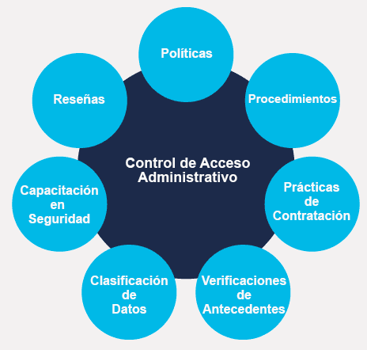
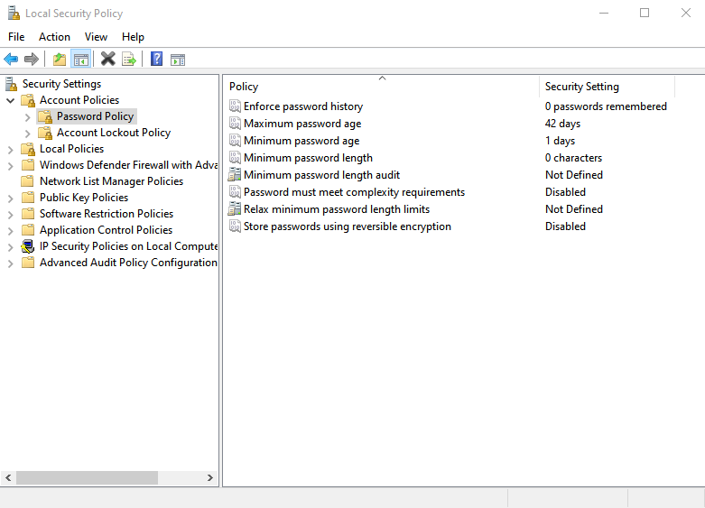
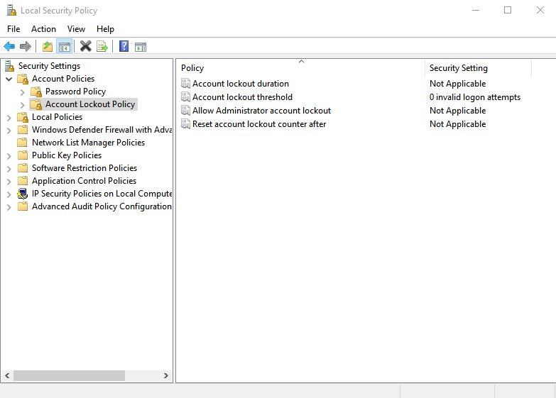
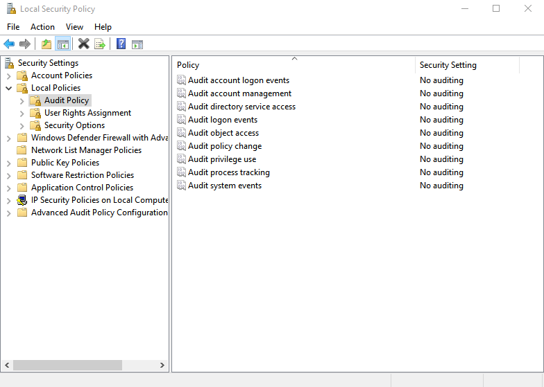
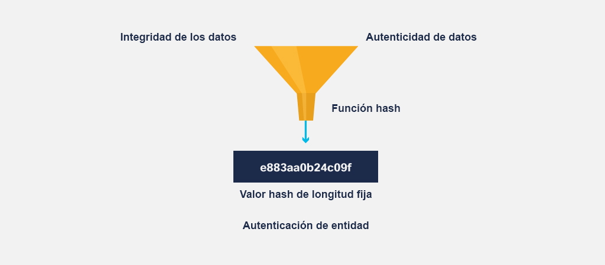
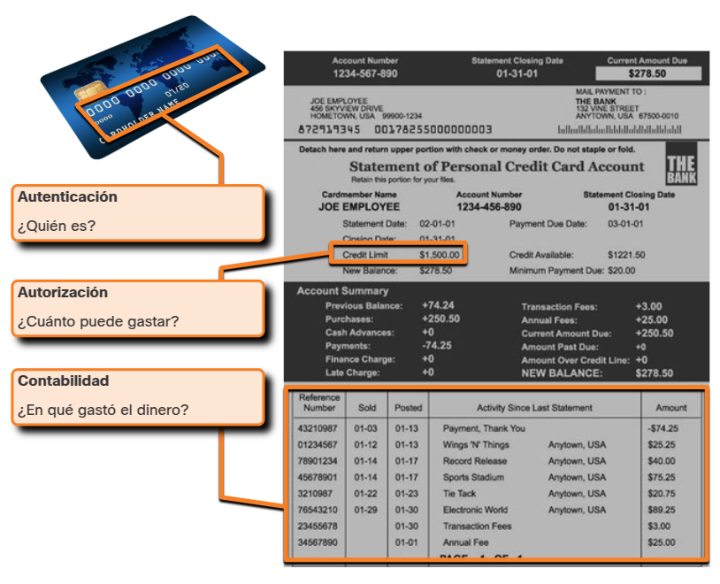
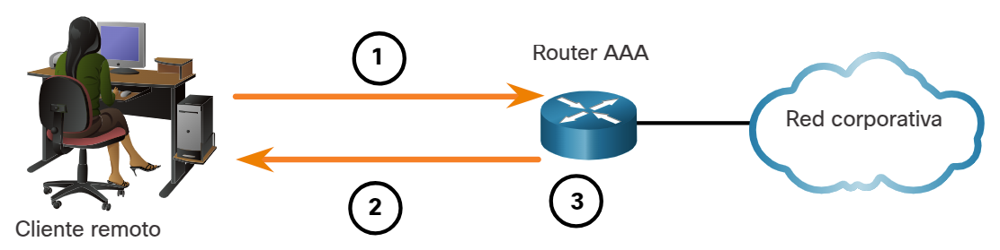
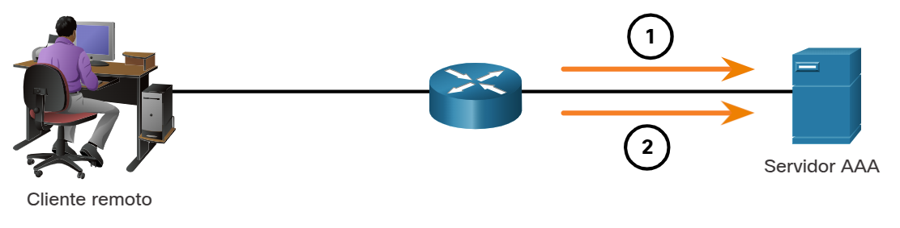

<a href="./00-Curso.md"><< Menú principal del módulo</a>

# 3. Control de Acceso
# Controles de Acceso
Hay muchos tipos diferentes de controles de acceso. En este tema exploraremos ejemplos de controles físicos, lógicos y administrativos antes de examinar detenidamente cómo se controla el acceso a través de "AAA": autorización, autenticación y accounting.

## Controles de acceso físico
Los controles de acceso físico son barreras reales desplegadas para evitar el contacto físico directo con los sistemas. El objetivo es evitar que los usuarios no autorizados tengan acceso físico a las instalaciones, el equipamiento y otros activos de la organización.

Por ejemplo, el control de acceso físico determina quién puede entrar (o salir), dónde puede entrar (o salir) y cuándo puede entrar (o salir).

Estos son algunos ejemplos de controles de acceso físico:
* Guardias para vigilar las instalaciones
* Vallas para proteger el perímetro
* Detectores de movimiento para detectar objetos en movimiento
* Candados para computadoras portátiles para salvaguardar los equipos portátiles
* Puertas cerradas para evitar el acceso no autorizado
* Tarjetas magnéticas para permitir el acceso a zonas restringidas
* Perros guardianes para proteger las instalaciones
* Cámaras de vídeo para vigilar una instalación recogiendo y grabando imágenes
* Sistemas de entrada tipo trampa para escalonar el flujo de personas en la zona de seguridad y atrapar a los visitantes no deseados
* Alarmas para detectar intrusiones

## Controles de acceso lógico
Los controles de acceso lógico son soluciones de hardware y software que se utilizan para administrar el acceso a recursos y sistemas. Estas soluciones basadas en tecnología incluyen las herramientas y los protocolos que los sistemas informáticos utilizan para la identificación, autenticación, autorización y responsabilidad.

Los ejemplos de control de acceso lógico incluyen:
* El cifrado es el proceso de tomar un texto plano y crear un texto cifrado.
* Las tarjetas inteligentes tienen un microchip integrado.
* Las contraseñas son cadenas de caracteres protegidas.
* La biometría son las características físicas de los usuarios.
* Las listas de control de acceso (ACL) definen el tipo de tráfico permitido en una red.
* Los protocolos son un conjunto de reglas que rigen el intercambio de datos entre dispositivos.
* Los firewalls evitan el tráfico de red no deseado.
* Los routers conectan al menos dos redes.
* Los sistemas de detección de intrusiones supervisan una red para detectar actividades sospechosas.
* Los niveles de recorte son ciertos umbrales de error permitidos antes de activar una bandera roja.

## Controles de acceso administrativo
Los controles de acceso administrativo son las políticas y los procedimientos que definen las organizaciones para implementar y hacer cumplir todos los aspectos del control de acceso no autorizado.

	

Los controles administrativos se enfocan en las prácticas de personal y las prácticas empresariales.
* Las politícas son declaraciones de intenciones.
* Los procedimientos son los pasos detallados necesarios para realizar una actividad.
* Las prácticas de contratación definen los pasos que toma una organización para encontrar empleados calificados.
* La comprobación de los antecedentes es un tipo de examen de los empleados que incluye información sobre la verificación de empleos anteriores, el historial crediticio y los antecedentes penales.
* La clasificación de datos califica los datos según su sensibilidad.
* La capacitación de seguridad educa a los empleados sobre las políticas de seguridad en una organización.
* Las revisiones evalúan el rendimiento laboral de un empleado.

## Controles de acceso administrativo en detalle
Analicemos los controles de acceso administrativo con más detalle.

El concepto de control de acceso administrativo implica tres servicios de seguridad: autenticación, autorización y accounting (AAA).

Estos servicios proporcionan el marco principal para controlar el acceso, lo que evita el acceso no autorizado a una computadora, red, base de datos u otro recurso de datos.

### Autenticación
La primera "A" de AAA representa la autenticación. La autenticación verifica la identidad de cada usuario para evitar el acceso no autorizado. Los usuarios prueban su identidad con un nombre de usuario o un identificador. Además, los usuarios tienen que verificar su identidad proporcionando uno de los siguientes datos:
* Algo que saben (por ejemplo, una contraseña)
* Algo que tienen (por ejemplo, un _token_ o tarjeta)
* Algo que son (por ejemplo, una huella digital)

En el caso de la autenticación de dos factores, que se está convirtiendo cada vez más en la norma, el sistema requiere una combinación de dos de los anteriores en lugar de uno solo para verificar la identidad de alguien.

### Autorización
Los servicios de autorización determinan a qué recursos pueden acceder los usuarios, así como las operaciones que pueden realizar.

Algunos sistemas logran esto con una lista de control de acceso o ACL. Una ACL determina si un usuario tiene ciertos privilegios de acceso una vez que el usuario autentica. El hecho de que pueda conectarse a la red corporativa no significa que tenga permiso para utilizar la impresora de color de alta velocidad, por ejemplo.

La autorización también puede controlar cuándo un usuario tiene acceso a un recurso específico. Por ejemplo, los empleados pueden tener acceso a una base de datos de ventas durante el horario de trabajo, pero el sistema los bloquea después del horario.

### Auditoría
No relacionada con la contabilidad financiera, la auditoría (_accounting_) en AAA hace un seguimiento de lo que hacen los usuarios, incluyendo a qué acceden, la cantidad de tiempo que acceden a los recursos y cualquier cambio que hagan.

Por ejemplo, un banco hace un seguimiento de cada cuenta del cliente. Una auditoría de ese sistema puede revelar el tiempo y la cantidad de todas las transacciones y el empleado o el sistema que ejecutaron las transacciones. Los servicios de auditoría de ciberseguridad trabajan de la misma manera. El sistema realiza un seguimiento de cada transacción de datos y proporciona resultados de auditoría. Los administradores del sistema pueden configurar políticas informáticas para habilitar la auditoría del sistema.

El concepto de AAA es similar al uso de una tarjeta de crédito. La tarjeta de crédito identifica quién puede utilizarla, cuánto puede gastar ese usuario y da cuenta de los artículos o servicios que ha comprado.

La auditoría de la ciberseguridad rastrea y monitorea en tiempo real.

## ¿Qué es la identificación?
La identificación aplica las reglas establecidas por la política de autorización: cada vez que se solicita el acceso a un recurso, los controles de acceso determinan si se concede o se deniega.

Un identificador único garantiza la asociación correcta entre las actividades permitidas y los sujetos. Un nombre de usuario es el método más común utilizado para identificar a un usuario. Un nombre de usuario puede ser una combinación alfanumérica, un número de identificación personal (PIN), una tarjeta inteligente o un método biométrico, por ejemplo una huella digital, el escaneo de retina o el reconocimiento de voz.

Un identificador único garantiza que un sistema pueda identificar a cada usuario individualmente, permitiendo así que un usuario autorizado realice las acciones apropiadas en un recurso concreto.

Las políticas de ciberseguridad y la sensibilidad de la información o los sistemas determinan qué controles de identificación deben utilizarse y cuán estrictos deben ser.

## Gestión de identidad federada
La gestión de identidad federada hace referencia a varias empresas que permiten a sus usuarios utilizar las mismas credenciales de identificación para obtener acceso a las redes de todas las empresas del grupo. Desafortunadamente, esto amplía el alcance y aumenta la probabilidad de un efecto en cascada en caso de que ocurra un ataque.

En general, una identidad federada vincula la identidad electrónica de un sujeto a través de distintos sistemas de gestión de identidades, como por ejemplo poder acceder a varios sitios web utilizando las mismas credenciales de inicio de sesión.

El objetivo de la administración de identidades federada es compartir la información de identidad automáticamente a través de los límites del castillo. Desde la perspectiva del usuario particular, esto significa un único inicio de sesión a la red.

Es imperativo que las organizaciones analicen la información de identificación compartida con los socios, incluso, por ejemplo, dentro del mismo grupo corporativo. Compartir números de seguridad social, nombres y direcciones puede dar a los ladrones de identidad la oportunidad de robar esta información de un socio para cometer fraude. La manera más común de proteger la identidad federada es vincular la capacidad de inicio de sesión a un dispositivo autorizado.

## Métodos de autenticación
Como hemos dicho antes, los usuarios demuestran su identidad con un nombre de usuario o ID. Además, los usuarios tienen que verificar su identidad proporcionando uno de los siguientes datos.

### Lo que sabe
Las contraseñas, las frases de acceso o los PIN son ejemplos de algo que el usuario conoce. Las contraseñas son el método más popular que se utiliza para la autenticación.

Los términos frase de acceso, código de acceso, clave de acceso y PIN se denominan genéricamente contraseña. Una contraseña es una cadena de caracteres que se utiliza para autenticar la identidad de un usuario. Si esta cadena de caracteres se relaciona con un usuario (por ejemplo, si es su nombre, fecha de nacimiento o dirección), será más fácil para los ciberdelincuentes adivinar la contraseña de este usuario.

Varias publicaciones recomiendan que la contraseña tenga al menos ocho caracteres. Los usuarios no deben crear una contraseña que sea tan larga y por lo tanto sea difícil de memorizar, o a la inversa, que sea tan corta y que por lo tanto sea fácil de descifrarla. Las contraseñas deben contener una combinación de letras mayúsculas y minúsculas, números y caracteres especiales.

Los usuarios deben utilizar diferentes contraseñas para los distintos sistemas, ya que si un delincuente descifra la contraseña del usuario una vez, tendrá acceso a todas las cuentas del usuario. Un administrador de contraseñas puede ayudarlo a crear y usar contraseñas seguras, y significa que tampoco tiene que recordar cada una de estas contraseñas. 

### Lo que tiene
Las tarjetas inteligentes y los llaveros de seguridad son ejemplos de algo que los usuarios tienen en su poder y que se pueden usar con fines de autenticación.

Una tarjeta inteligente es una tarjeta de plástico del tamaño de una tarjeta de crédito, con un pequeño chip incrustado. El chip es un soporte de datos inteligente, capaz de procesar, almacenar y salvaguardar datos. Las tarjetas inteligentes contienen información privada, como números de cuentas bancarias, identificación personal, historiales médicos y firmas digitales, y utilizan la criptografía para mantener la seguridad de los datos al tiempo que proporcionan un medio de autenticación.

Una llave de seguridad es un dispositivo lo suficientemente pequeño como para colocarlo en un llavero. En la mayoría de los casos, los llaveros de seguridad se utilizan para la autenticación de dos factores (2FA), que es mucho más segura que una combinación de nombre de usuario y contraseña.

Por ejemplo, supongamos que desea acceder a su banca electrónica, que utiliza la autenticación de dos factores. Primero, ingresa su nombre de usuario (identificación). Luego, la contraseña, que es su primer factor de autenticación. Entonces, necesita una segunda, porque es 2FA. Ingresa un PIN o una tarjeta en su mando de seguridad, y este muestra un número. En este ejemplo, demostrando que tiene acceso a este dispositivo (que fue emitido para usted), este número es el segundo factor que se ingresa para iniciar sesión en la cuenta de banca electrónica.

### Quién es usted
Se denominan datos biométricos a las características físicas únicas, como la huella dactilar, la retina o la voz, que identifican a una persona concreta. La seguridad biométrica compara características físicas con perfiles almacenados para autenticar usuarios. En este caso, un perfil es un archivo de datos que contiene características conocidas de una persona. El sistema otorga acceso al usuario si sus características coinciden con las configuraciones guardadas. Un lector de huellas digitales es un dispositivo biométrico común.

Existen dos tipos de identificadores biométricos:
* Características fisiológicas: huellas dactilares, ADN, rostro, manos, la retina o rasgos del oído.
* Características de comportamiento: patrones de comportamiento como los gestos, la voz, la forma de andar o el ritmo de tecleo.

Los datos biométricos son cada vez más popular en sistemas de seguridad pública, productos electrónicos de consumo y aplicaciones de punto de venta. La implementación de datos biométricos utiliza un dispositivo de escaneo o lectura, un software que convierte la información escaneada en formato digital y una base de datos que almacena datos biométricos para su comparación.

## Autenticación multifactor
Como hemos comentado antes, la autenticación multifactor utiliza al menos dos métodos de verificación, como una contraseña y algo que usted tiene, por ejemplo, un llavero de seguridad. Esto se puede llevar un paso más allá añadiendo algo que usted es, como un escáner de huellas dactilares.

La autenticación multifactor puede reducir la incidencia del robo de identidad en línea porque significa que conocer una contraseña no dará acceso a los ciberdelincuentes a la cuenta de un usuario.

Por ejemplo, un sitio web de banca online puede requerir una contraseña y un PIN único que el usuario recibe en su smartphone. En este caso, el primer factor es su contraseña y el segundo factor el PIN temporal, ya que demuestra que usted tiene acceso a lo que está registrado como su teléfono.

Sacar dinero de un cajero automático es otro ejemplo sencillo de autenticación multifactor, ya que el usuario debe tener la tarjeta bancaria y conocer el PIN antes de que el cajero automático le dispense dinero.

Tenga en cuenta que la autenticación de dos factores (2FA) es un método de autenticación multifactor que implica dos factores en particular, pero los dos términos se usan indistintamente.

## Autorización
La autorización controla lo que el usuario puede hacer o no en la red después de una autenticación satisfactoria: Después de que un usuario demuestre su identidad, el sistema verifica a qué recursos de la red puede acceder y qué puede hacer con esos recursos.

### Cuándo implementar la autorizaćión
La autorización utiliza un conjunto de atributos que describen el acceso del usuario a la red para responder la pregunta "¿Qué privilegios de lectura, copia, edición, creación y eliminación tiene este usuario?".

El sistema compara estos atributos con la información contenida en la base de datos de autenticación, determina un conjunto de restricciones para ese usuario y lo entrega al dispositivo local donde el usuario está conectado.

La autorización es automática y no requiere que los usuarios tomen medidas adicionales después de la autenticación. Los administradores del sistema han configurado la red para implementar la autorización inmediatamente después de que el usuario se autentique.

### Uso de la autorización
La definición de reglas de autorización es el primer paso para controlar el acceso. Una política de autorización establece estas reglas.

Una política de pertenencia a grupos define la autorización según la pertenencia a un grupo determinado. Todos los empleados de una organización pueden tener una tarjeta magnética, por ejemplo, que permite el acceso a las instalaciones, pero puede no permitir el acceso a una sala de servidores. Es posible que solo los empleados de nivel superior y los miembros del equipo de TI puedan acceder a la sala de servidores con sus tarjetas magnéticas.

Una política de autoridad define los permisos de acceso según la posición de un empleado dentro de la organización.

## Packet Tracer - Configurar el control de acceso
* <a href="./notes/pt_configurar_control_acceso.md" target="_blank">Configurar el Control de Acceso</a>

## Implementación de Accountability
Accountability rastrea una acción hasta una persona o un proceso que realiza este cambio en un sistema. Accountability luego recopila esta información e informa los datos de uso. La organización puede utilizar estos datos para fines como auditorías o facturación. Los datos recogidos pueden incluir el tiempo de inicio de sesión de un usuario, si el inicio de sesión del usuario fue exitoso o no, o a qué recursos de red accedió. Esto permite a una organización rastrear acciones, errores y equivocaciones durante una auditoría o investigación.

 La implementación de Accountability consiste en tecnologías, políticas, procedimientos y educación. Los archivos de registro proporcionan información detallada según los parámetros seleccionados. Por ejemplo, una organización puede ver el registro de los inicios de sesión fallidos y correctos. Las fallas de inicio de sesión pueden indicar que un delincuente intentó hackear una cuenta, y los inicios de sesión exitosos indican a una organización qué usuarios están usando qué recursos y cuándo.

Las políticas y los procedimientos de la organización explican qué medidas deben registrarse y cómo se generan, se revisan y almacenan los archivos de registro.

La conservación de los datos, la eliminación de los soportes y los requisitos de cumplimiento de la normativa brindan Accountability. Muchas leyes requieren la implementación de medidas para proteger diferentes tipos de datos. Estas leyes guían a una organización de forma correcta para administrar, almacenar y desechar datos. La educación y el conocimiento de las políticas, los procedimientos y las leyes relacionadas de una organización también pueden contribuir al Accountability.

## Lab - Configurar la autenticación y la autorización en Linux
* <a href="./notes/lab_autenticacion_autorizacion_linux.md" target="_blank">Configurar la autenticación y la autorización en Linux</a>

# Conceptos del control de acceso
## Seguridad de confianza cero
Zero Trust es un enfoque integral para garantizar el acceso a todas las redes, las aplicaciones y entornos. Este enfoque ayuda a proteger el acceso de usuarios, dispositivos de usuario final, API, IoT, microservicios, containers y mucho más. Protege las fuerzas de trabajo, las cargas de trabajo y el lugar de trabajo. El principio de un enfoque Zero Trust es, "nunca confíe, siempre verifique". Asuma Zero Trust cada vez que alguien o algo solicite acceso a los activos. Un marco de seguridad zero trust ayuda a evitar el acceso no autorizado, contener brechas y reducir el riesgo de movimiento lateral de un atacante a través de una red.

Tradicionalmente, el perímetro de la red, o el borde, era el límite entre el interior y el exterior, o de confianza y no confiable. En un enfoque Zero Trust, cualquier lugar en el que se requiera una decisión de control de acceso debe considerarse un perímetro. Esto significa que, aunque un usuario u otra entidad puede haber pasado correctamente el control de acceso anteriormente, no se confía en que accedan a otra área o recurso hasta que se autentiquen. En algunos casos, los usuarios pueden tener que autenticarse varias veces y de diferentes maneras, para obtener acceso a diferentes capas de la red.

Los tres pilares de "Zero Trust" son: la fuerza de trabajo, las cargas de trabajo y el lugar de trabajo.

### Zero Trust para los grupos de trabajo
Este pilar está formado por personas (por ejemplo, empleados, contratistas, compañeros y proveedores) que acceden a las aplicaciones de trabajo mediante el uso de sus dispositivos personales o gestionados por la empresa. Este pilar garantiza que solo los usuarios adecuados y los dispositivos seguros puedan acceder a las aplicaciones, independientemente de la ubicación.

### Zero Trust para cargas de trabajo
Este pilar se refiere a las aplicaciones que se ejecutan en la nube, en centros de datos y otros entornos virtualizados que interactúan entre sí. Se centra en el acceso seguro cuando una API, un micro-servicio o un container acceden a una base de datos dentro de una aplicación.

### Zero Trust para el lugar de trabajo
Este pilar se centra en el acceso seguro para todos y cada uno de los dispositivos, incluyendo el Internet de las cosas (IoT), que se conectan a redes empresariales, como puntos finales de usuario, servidores físicos y virtuales, impresoras, cámaras, sistemas HVAC, quioscos, bombas de infusión, sistemas de control industrial y mucho más.

## Modelos de control de acceso
Una organización debe implementar controles de acceso adecuados para proteger sus recursos de red, recursos de sistemas de información y la información misma.

Un analista de seguridad debe entender los diferentes modelos básicos de control de acceso para tener una idea acabada de cómo los atacantes pueden violar los controles de acceso.

Los distintos tipos de métodos de control de acceso.
* __Control de Acceso Discrecional (DAC, Discretionary access control)__
	* Este es el modelo menos restrictivo y permite a los usuarios controlar el acceso de sus datos como si fueran propietarios de esos datos.
	* El DAC puede utilizar ACLs u otros métodos para especificar qué usuarios o grupos de usuarios tienen acceso a la información.
* __Control de Acceso Obligatorio (MAC, Mandatory access control)__
	* Se aplica el más estricto control de acceso y suele utilizarse en aplicaciones militares o fundamentales para la misión.
	* Asigna etiquetas del nivel de seguridad a la información y habilita el acceso de los usuarios en función del nivel de autorización de seguridad.
* __Control de Acceso Basado en Roles (Role-based access control - RBAC)__
	* Las decisiones de acceso se basan en los roles y las responsabilidades del individuo dentro de la organización.
	* Se asignan privilegios de seguridad a diferentes roles y se asignan personas al perfil RBAC para el rol.
	* Las funciones pueden incluir diferentes puestos, clasificaciones de puestos o grupos de clasificaciones de puestos.
	* También se conoce como un tipo de control de acceso no discrecional.
* __Control de acceso basado en atributos (ABAC, Attribute-based access control)__
	* Permite el acceso según los atributos del objeto (recurso) al que se tendrá acceso, el sujeto (usuario) que tendrá acceso al recurso y los factores del entorno respecto de cómo se tendrá acceso al objeto (por ejemplo, la hora del día).
* __Control de acceso basado en reglas (RBAC, Rule-based access control)__
	* El personal de seguridad de red especifica conjuntos de reglas o condiciones asociadas con el acceso a datos o sistemas.
	* Estas reglas pueden especificar direcciones IP permitidas o denegadas, o ciertos protocolos y otras condiciones.
	* También conocido como RBAC basado en reglas.
* __Control de acceso basado en tiempo (TAC, Time-based access control)__
	* TAC Permite el acceso a los recursos de red en función de la hora y el día.
	
Otro modelo de control de acceso es el principio de privilegios mínimos, que especifica un enfoque limitado y con base en las necesidades para otorgar derechos de acceso de usuarios y procesos a información y herramientas específicas. Según el principio de privilegios mínimos, a los usuarios solo se les debe otorgar el acceso mínimo necesario para desempeñar su función.

Un ataque común se conoce como escalamiento de privilegios. Durante este ataque, se explotan vulnerabilidades en servidores o sistemas de control de acceso para conceder a un usuario o proceso de software no autorizados más niveles de privilegio que los que deberían tener. Después de que el privilegio se otorga, el agente de amenaza puede tener acceso a información confidencial o tomar el control de un sistema.

## Sistemas de control de acceso a la red
Los sistemas de control de acceso a la red (NAC - _Network Access Control_) apoyan la gestión del acceso aplicando las políticas de la organización con respecto a las personas y los dispositivos que intentan acceder a la red. Los sistemas NAC permiten a los profesionales de la ciberseguridad supervisar a los usuarios y dispositivos conectados a la red, y controlar manualmente el acceso según sea necesario.

Los sistemas de control de acceso a la red proporcionan las siguientes capacidades:
* Aplicar rápidamente las políticas de acceso que se han creado para diferentes condiciones operativas.
* Reconocer y perfilar a los usuarios y dispositivos conectados para evitar que el software malicioso de los sistemas no conformes cause daños.
* Proporcionar acceso seguro a los invitados de la red, a menudo a través de portales de registro.
* Evaluar la conformidad de los dispositivos con las políticas de seguridad por tipo de usuario, tipo de dispositivo y sistema operativo antes de permitir el acceso a la red.
* Mitigar los incidentes de seguridad bloqueando, aislando o reparando los dispositivos no conformes.

Dado que las redes BYOD e IoT amplían en gran medida la superficie de ataque de la red, las funciones de automatización del sistema NAC hacen práctico el control focalizado del acceso a la red por parte de dichos dispositivos. El sistema NAC está configurado para hacer cumplir las políticas de la organización. Las políticas pertinentes se promulgan para permitir o denegar el acceso a la red según una amplia gama de factores que el sistema NAC detecta en los dispositivos que intentan acceder. Sin los sistemas NAC sería imposible para el personal de ciberseguridad evaluar los miles de dispositivos que podrían intentar acceder a la red.

El NAC es un componente importante de una arquitectura de seguridad de confianza cero que impone el cumplimiento de la política de seguridad a todos los dispositivos y usuarios que intentan acceder a la red.

# Administración de cuentas
El administrador de red desempeña un papel importante en la seguridad del sistema. Garantiza que cada usuario de la organización tenga un tipo de cuenta adecuado a su función. Esto significa que los usuarios solo pueden acceder a los datos y modificarlos según la "necesidad de saber", lo que ayuda a gestionar los riesgos de seguridad o de cumplimiento.

## Tipos de cuenta
Una organización no debe compartir cuentas para usuarios privilegiados, administradores o aplicaciones. La cuenta de administrador solo debe utilizarse para administrar un sistema. Si un usuario accede a un sitio web infectado con malware o abre un correo electrónico malicioso mientras usa la cuenta de administrador, esto pondría a la organización en riesgo.

Los administradores deben conocer las cuentas de grupo y de usuario por defecto que puede instalar un sistema operativo. Conocer estas cuentas ayudará al administrador a decidir cuáles deben permitirse y cuáles deshabilitarse.

Esto se debe a que las cuentas predeterminadas, como la cuenta de invitado o administrador, pueden ser un riesgo de seguridad en sistemas antiguos, ya que los atacantes están familiarizados con la configuración predeterminada utilizada. Para mejorar la seguridad reemplace siempre las cuentas predeterminadas y asegúrese de que todos los tipos de cuenta requieran una contraseña.

Es importante administrar correctamente las cuentas para mantener la seguridad.
* Al contratar a un nuevo empleado, cree un perfil de identidad, registre la computadora y los dispositivos móviles del empleado y habilite el acceso a la red de la organización. Como proveedor de identidades (IdP - _Identity Provider_), la organización es responsable de autenticar su identidad.
* Deshabilite o desactive las cuentaws que ya no sean necesarias y recupere los datos o las aplicaciones de la organización de los dispositivos del usuario.
* No conceda a unusuario más acceso del necesario para realizar las tareas asignadas (privilegio mínimo).
* Revise el acceso de los usuarios para identificar los ajustes de control de acceso que deban realizarse.
* Utilice las trestricciones horarioas poara controlar cuándo puede conectarse un usuario.
* Utilice restricciones de ubicación para controlar desde dónde un usuario o dispositivo puede iniciar sesión.
	* El geoperímetro (geofencing) se utiliza para disparar una acción cuando un usuario entra o sale de un límite geográfico.
	* La geolocaclización identifica un dispositivo en función de su ubicación geográfica.
	* El geoetiquetado (geotagging) añade un identificador a algo basado en la ubicación (como una foto tomada en un smartphone etiquetada con las coordenadas del lugar donde se tomó la foto).

## Cuentas privilegiadas
Los ciberdelincuentes apuntan a cuentas con privilegios. ¿Por qué? Porque son las cuentas más potentes de la organización con acceso elevado y sin restricciones a los sistemas. Los administradores usan estas cuentas para implementar y administrar los sistemas operativos, las aplicaciones y los dispositivo de red.

Las organizaciones deben adoptar prácticas sólidas para proteger las cuentas privilegiadas.
* Identificar y reducir la cantidad de cuentas privilegiadas
* Aplique el principio de menor privilegio. El principio significa que los usuarios, sistemas y procesos sólo tienen acceso a los recursos (redes, sistemas y archivos) que son absolutamente necesarios para realizar la función que se les ha asignado.
* Revocar los derechos de acceso cuando los empleados se van o cambian de trabajo.
* Eliminar las cuentas compartidas con contraseñas que no caducan.
* Proteja el almacenamiento de contraseña.
* Eliminar las credenciales compartidas entre varios administradores.
* Cambiar automáticamente las contraseñas de las cuentas privilegiadas cada 30 o 60 días.
* Registrar las sesiones privilegiadas.
* Implantar un proceso para cambiar las contraseñas embebidas de los scripts y las cuentas de servicio.
* Registrar toda la actividad de los usuarios.
* Generar alertas para los comportamientos inusuales.
* Deshabilitar las cuentas privilegiadas inactivas.
* Usar la autenticación multifactor para todos los accesos administrativos.
* Implementar un gateway entre el usuario final y los activos confidenciales para limitar la exposición de la red al malware.

Asegurar y bloquear continuamente las cuentas privilegiadas es fundamental para la seguridad de la organización. Evalúe periódicamente este proceso y realice ajustes para mejorar la protección.

## Control de acceso a los archivos
Echemos un vistazo más de cerca a cómo los permisos pueden ayudar a proteger los datos.

Los permisos son reglas configuradas para limitar el acceso a carpetas o archivos para un individuo o un grupo. Los usuarios deben estar limitados a solo los recursos que necesitan en un sistema informático o red. Por ejemplo, no deberían estar disponibles para acceder a todos los archivos en un servidor si solo necesitan acceso a una sola carpeta. Si bien puede resultar más sencillo permitir el acceso de los usuarios a toda la unidad, es más seguro limitar el acceso solo a la carpeta que necesitan para realizar su trabajo. Este es el principio del menor privilegio y está estrechamente relacionado con el concepto de "necesidad de conocer" el acceso. Limitar el acceso a los recursos también evita que los ciberdelincuentes accedan a esos recursos si la computadora del usuario se infecta.
* __Control total__. Los usuarios pueden:
	* Ver el contenido de un archivo o de una carpeta.
	* Modificar y eliminar archivos y carpetas existentes.
	* Crear nuevos archivos y carpetas.
	* Ejecutar programas de una carpeta.
* __Modificar__. Los usuarios pueden modificar y eliminar archivos y carpetas existentes pero no pueden crear nuevos.
* __Lectdura y ejecución__. Los usuarios pueden ver el contenido de los archivos y carpetas existentes y pueden ejecutar programas en una carpeta.
* __Escritura__. Los usuarios pueden crear nuevos archivos y carpetas y realizar cambios en los archivos y carpetas existentes.
* __Lectura__. Los usuarios pueden ver el contenido de una carpeta y abrir archivos y carpetas.

Si un administrador deniega a un individuo o grupo los permisos para un recurso compartido de red, esto anulará cualquier otra configuración de permisos.

Por ejemplo, si un administrador le niega el permiso de acceso a un intercambio de red a una persona, el usuario no podrá acceder a este intercambio aunque sea el administrador o forme parte del grupo de administradores. La política de seguridad local debe describir los recursos a los que puede acceder cada usuario y grupo, y el tipo de acceso para cada uno.

Una vez que se establecen los permisos de la carpeta principal, las carpetas y los archivos que se crean dentro de ésta heredan sus permisos. Además, la ubicación de los datos y la acción realizada en los datos determinan la propagación de los permisos:
* Los datos movidos en el mismo volumen mantendrán los permisos originales. 
* Los datos copiados en el mismo volumen heredarán los nuevos permisos. 
* Los datos movidos a un volumen diferente heredarán los nuevos permisos.
* Los datos copiados a un volumen diferente heredarán los nuevos permisos.

## Políticas de cuentas de en Windows
En la mayoría de las redes que utilizan computadoras Windows, un administrador configura Active Directory con dominios en un servidor Windows. Las computadoras con Windows que se unen al dominio se convierten en miembros del dominio.

El administrador configura una política de seguridad de dominio que se aplica a todos los miembros del dominio. Por ejemplo, las políticas de cuenta se configuran automáticamente cuando un usuario inicia sesión en Windows.

Cuando una computadora no es parte de un dominio de _Active Directory_, el usuario configura las políticas a través de la política de seguridad local de Windows. En todas las versiones de Windows, excepto en Home Edition, introduzca `secpol.msc` en el comando Run para abrir la herramienta _Local Security Policy_.

### Política de contraseñas
Un administrador puede configurar las políticas de las cuentas de usuario, como las políticas de contraseña y las políticas de bloqueo.

En el ejemplo mostrado, los usuarios deben cambiar sus contraseñas cada 90 días y utilizar cada nueva contraseña durante al menos un día. Las contraseñas deben contener ocho caracteres y tres de las siguientes cuatro categorías: letras mayúsculas, letras minúsculas, números y símbolos. Por último, el usuario puede reutilizar la contraseña después de 24 contraseñas únicas. 

Esto es solo un ejemplo; se pueden establecer diferentes políticas de contraseñas según los requisitos y las necesidades de la organización.

	

### Directiva de bloqueo de cuentas
Una política de bloqueo de cuentas bloquea una cuenta durante un tiempo determinado cuando se producen demasiados intentos de inicio de sesión incorrectos.

Por ejemplo, la política que se muestra aquí permite al usuario introducir un nombre de usuario y/o una contraseña erróneos cinco veces. Después de cinco intentos, la cuenta queda bloqueada por 30 minutos. Después de 30 minutos, el número de intentos se pone a cero y el usuario puede volver a intentar conectarse.

	

### Políticas de auditoría
Hay más ajustes de seguridad disponibles seleccionando la carpeta "local policies" en Windows. Una política de auditoría crea un archivo de registro de seguridad que se utiliza para rastrear los siguientes eventos:
* Eventos de inicio de sesión de cuenta.
* Gestión de cuentas de auditoría.
* Acceso al servicio de directorio.
* Acceso a objetos.
* Cambios de políticas.
* Uso de privilegios.
* Seguimiento de procesos.
* Eventos del sistema.

	

## Gestión de la autenticación
Los problemas de autenticación y autorización incluyen credenciales sin cifrar, permisos incorrectos y violaciones de acceso. Pero, ¿cómo mantiene alejados a los ciberdelincuentes y, al mismo tiempo, facilita el inicio de sesión de los usuarios autorizados? La gestión de la autenticación tiene como objetivo garantizar un inicio de sesión seguro y, al mismo tiempo, facilitar su uso.
* Una solución de inicio de sesión único (SSO - _Single Sign-On_) permite al usuario utilizar un conjunto de credenciales de inicio de sesión para autenticarse en varias aplicaciones. De esta manera, el usuario solo necesita recordar una contraseña segura. 
* __OAuth__ es un estándar que permite que la información de la cuenta de un usuario sea utilizada por servicios de terceros como Facebook o Google.  
* Una bóveda de contraseñas puede proteger y almacenar las credenciales del usuario con una sola contraseña segura requerida para acceder a ellas.
* Muchas organizaciones implementan la autenticación basada en el conocimiento (KBA - _Knowledge Based Authentication_) para proporcionar un restablecimiento de contraseña en caso de que un usuario la olvide. KBA se basa en información personal conocida por el usuario o en una serie de preguntas.

## Código de autenticación de mensajes basado en _hash_
El código de autenticación de mensajes basados en hash (HMAC, _Hash-Based Message Authentication Code_) utiliza una clave de cifrado con una función hash para autenticar a un usuario web. Muchos servicios web utilizan la autenticación básica, la cual no cifra el nombre de usuario y la contraseña durante la transmisión. Con el HMAC, el usuario envía un identificador de clave privada y un HMAC. El servidor busca la clave privada del usuario y crea un HMAC. El HMAC del usuario debe coincidir con el que calcula el servidor.

Las VPN que utilizan IPsec dependen de las funciones de HMAC para autenticar el origen de cada paquete y proporcionar verificación de la integridad de los datos.

	

Los productos CISCO utilizan el _hashing_ con fines de autenticación de entidades, integridad de datos y autenticidad de datos.
* Los routers de CISCO IOS utilizan el _hash_ con las claves secretas utilizando el HMAC como la manera de agregar información de autenticación a las actualizaciones de protocolo de _routing_.
* Los _gateways_ y los clientes de IPSec utilizan algoritmos de _hash_, como MD5 y SHA-1 en el modo HMAC, para proporcionar integridad y autenticidad del paquete.
* Las imágenes de software de CISCO en `cisco.com` tienen una suma de comprobación (_checksum_) basado en MD5 disponible para que los clientes puedan verificar la integridad de las imágenes descargadas.

## Protocolos y tecnologías de autenticación
Un protocolo de autenticación autentica datos entre dos entidades para evitar el acceso no autorizado. Un protocolo describe el tipo de información que debe compartirse para autenticarse y conectarse.
* __Protocolo de autenticación Extensible (EAP - _Extensible Authentication Protocol_)__. La contraseña del cliente se envía mediante un hash al servidor de autenticación. El servidor de autenticación tiene un certificado (el cliente no necesita un certificado).
* __Protocolo de autenticación de contraseña (PAP - _Password Authentication Protocol_)__. Un nombre de usuario y una contraseña se envían a un servidor de acceso remoto en texto plano. La mayoría de los servidores remotos de sistemas operativos de red admiten PAP.
* __Protocolo de confirmación de aceptación de la autenticación (CHAP; _Challenge Handshake Authentication Protocol_)__. CHAP valida la identidad de clientes remotos mediante una función de hash unidireccional creada por el cliente. El servicio también calcula el valor hash esperado. El servidor (el autenticador) compara los dos valores. Si los valores coinciden, la transmisión continúa. CHAP también verifica periódicamente la identidad del cliente durante la transmisión.
* __802.1x__. Una organización autentica su identidad y autoriza el acceso a la red. Su identidad se determina en función de las credenciales o de un certificado confirmado por un servidor RADIUS.
* __RADIUS__. Cuando se necesita una autenticación simple de nombre de usuario/contraseña, use RADIUS para aceptar o denegar el acceso. RADIUS solo encripta la contraseña del usuario desde el cliente RADIUS al servidor RADIUS. El nombre de usuario, el registro de uso y los servicios autorizados se transmiten en texto plano. Cuando se integra RADIUS en un producto, son necesarias medidas de seguridad que protejan contra los ataques de repetición.
* __TACACS+__. TACACS+ utiliza TCP como protocolo de transporte. TACACS+ cifra todos los datos (nombre de usuario, contraseña, registros de uso y servicios autorizados) entre el cliente y el servidor. Dado que los administradores de red pueden definir ACLs, filtros y privilegios de usuario, TACACS+ es una mejor opción para las redes corporativas que requieren pasos de autenticación más sofisticados y control sobre las actividades de autorización.
* __Kerberos__. Kerberos utiliza un cifrado fuerte, solicitando a un cliente que demuestre su identidad a un servidor, y el servidor a su vez se autentica ante el cliente.
El servidor Kerberos contiene ID de usuario y contraseñas con hash para todos los usuarios que tendrán autorizaciones para los servicios del dominio. El servidor Kerberos también tiene claves secretas compartidas con todos los servidores a los que concederá tickets de acceso. La base para la autenticación en un entorno Kerberos es el ticket. Los tickets se utilizan en un proceso de dos pasos con el cliente. El primer ticket es un ticket de concesión de tickets emitido por el servicio de autenticación a un cliente solicitante. El cliente puede presentar este ticket al servidor Kerberos con una solicitud de ticket para acceder a un servidor específico. 
Este ticket cliente-servidor (también conocido como ticket de servicio) se utiliza para acceder al servicio de un servidor. Al poder cifrar toda la sesión se elimina la transmisión intrínsecamente insegura de elementos (como las contraseñas) que pueden ser interceptados en la red. Los tickets tienen fecha de caducidad, por lo que cualquier intento de reutilización de un ticket no tendrá éxito.

## Aplicaciones de funciones hash criptográficas
Como hemos visto anteriormente, las funciones hash criptográficas nos ayudan a garantizar la integridad de los datos y a verificar la autenticación. Las funciones hash criptográficas se utilizan en las siguientes situaciones:
* Para proporcionar una prueba de autenticidad cuando se utiliza con una clave de autenticación secreta simétrica, como Seguridad IP (IPsec) o autenticación del protocolo de routing.
* Para proporcionar autenticación al generar respuestas de única vez y unidireccionales a los desafíos que se presentan en los protocolos de autenticación.
* Para proporcionar pruebas de comprobación de la integridad de los mensajes (como las que se utilizan en los contratos firmados digitalmente) y certificados de infraestructura de clave pública (PKI - _Public Key Infrastructure_) (como los que se aceptan al acceder a un sitio web seguro).

Al elegir un algoritmo de hash utilice SHA-256 o superior, ya que son los más seguros actualmente. Evite SHA-1 y MD5 debido a las fallas de seguridad que se han descubierto.

Mientras que el hashing puede detectar cambios accidentales, no puede proteger contra los cambios deliberados y, por lo tanto, es vulnerable a los ataques "man-in-the-middle".

## Estrategias de control de acceso
Las estrategias de control de acceso permiten a una organización conceder o restringir el acceso a un dispositivo de red o a los datos.
* __Control de acceso obligatorio__. El control de acceso obligatorio restringe las acciones que un usuario puede realizar en un objeto (como un archivo, un puerto o un dispositivo). Una regla de autorización hace que un usuario pueda acceder al objeto.
Las organizaciones utilizan el control de acceso obligatorio cuando existen diferentes niveles de clasificación de seguridad. Cada objeto tiene una etiqueta y cada usuario tiene una autorización. Un sistema de control de acceso obligatorio restringe a un usuario en función de la clasificación de seguridad del objeto y de la etiqueta que lleva el usuario.
* __Control de acceso discrecional__. En los sistemas que emplean controles de acceso discrecionales, el propietario de un objeto puede decidir qué usuarios pueden acceder a ese objeto y qué acceso específico pueden tener.
Los permisos y las listas de control de acceso se pueden utilizar para implementar el control de acceso discrecional. El propietario de un archivo puede especificar qué permisos pueden tener otros usuarios (como lectura, escritura o ejecución). Un lista de control de acceso utiliza reglas para determinar qué tráfico puede ingresar o salir de una red.
* __Control de acceso basado en roles__. El control de acceso basado en roles depende del rol o función laboral del usuario. Los roles específicos requieren permisos para realizar ciertas operaciones y los usuarios adquieren permisos a través de su rol.
El control de acceso basado en roles puede funcionar en combinación con los controles de acceso discrecionales o los controles de acceso obligatorios aplicando las políticas de cualquiera de ellos. El control de acceso basado en roles ayuda a implementar la administración de la seguridad en grandes organizaciones con cientos de usuarios y miles de permisos posibles. Las organizaciones aceptan ampliamente el uso del control de acceso basado en roles para administrar los permisos de la computadora dentro de un sistema o aplicación, como una mejor práctica.
* __Control de acceso basado en reglas__. El control de acceso basado en reglas utiliza listas de control de acceso para ayudar a determinar si se concede el acceso. La lista de control de acceso contiene una serie de reglas y la decisión de conceder el acceso depende de estas reglas. Por ejemplo, una norma que establezca que ningún empleado puede tener acceso al archivo de nóminas fuera del horario de trabajo o los fines de semana.
Al igual que con el control de acceso obligatorio, los usuarios no pueden cambiar las reglas de acceso. Es importante destacar que las organizaciones pueden combinar el control de acceso basado en reglas con otras estrategias para implementar restricciones de acceso. Por ejemplo, los métodos de control de acceso obligatorio pueden utilizar un enfoque basado en reglas para la implementación.

# Uso y funcionamiento de AAA
## Funcionamiento de AAA
Una red debe diseñarse para controlar quién puede conectarse a ella y qué puede hacer cuando está conectado. Estos requisitos de diseño se identifican en la política de seguridad de la red. La política especifica cómo los administradores de redes, usuarios corporativos, usuarios remotos, partners comerciales y clientes tienen acceso a los recursos de la red. La política de seguridad de red también puede exigir la implementación de un sistema de auditoría que registre quién inició sesión y cuándo, y qué hizo mientras permaneció conectado. Algunas reglas de cumplimiento pueden especificar que el acceso se debe registrar y que se deben conservar los registros durante un plazo específico.

El protocolo de autenticación, autorización y auditoría (AAA) proporciona el marco de trabajo necesario para habilitar la seguridad de acceso escalable.

Las tres funciones de seguridad independientes que ofrece el marco arquitectónico AAA.
* __Autenticación__.
	* Los usuarios y administradores deben probar que son quienes dicen ser.
	* La autenticación se puede establecer utilizando combinaciones de nombre de usuario y contraseña, preguntas de desafío y respuesta, tarjetas token y otros métodos.
	* La autenticación AAA proporciona una forma centralizada de controlar el acceso a la red.
* __Autorización__.
	* Una vez autenticado el usuario, los servicios de autorización determinan a qué recursos puede acceder el usuario y qué operaciones está habilitado para realizar.
	* Un ejemplo es "El usuario 'estudiante' puede acceder al servidor host XYZ usando solo SSH".
* __Auditoría__.
	* Los registros de auditoría tienen también la función de registrar lo que hace el usuario, incluidos los elementos a los que accede, la cantidad de tiempo que accede al recurso y todos los cambios que se realizaron.
	* La auditoría realiza un seguimiento de la forma en que se utilizan los recursos de red.
	* Un ejemplo es "El usuario 'estudiante' tuvo acceso al servidor host XYZ mediante SSH durante 15 minutos".

Este concepto es similar a utilizar una tarjeta de crédito, como se indica en la figura. La tarjeta de crédito identifica quién la puede utilizar y cuánto puede gastar ese usuario, y lleva un registro de los elementos en los que el usuario gastó dinero.

	

## Autenticación AAA
La autenticación de AAA puede usarse para autenticar a los usuarios para el acceso administrativo o puede usarse para autenticar a los usuarios para el acceso remoto a la red.

Cisco ofrece dos métodos comunes de implementar servicios de AAA:
* __Autenticación AAA local__. Este método también se conoce como autenticación autónoma porque autentica a los usuarios en función de nombres de usuario y contraseñas almacenados localmente, como se ve en la imagen. AAA local es ideal para las redes pequeñas.

	

* __Autenticación AAA basada en el servidor__. Este método autentica en función de un servidor AAA central que contiene los nombres de usuario y contraseñas de todos los usuarios. La autenticación AAA con base en el servidor es adecuada para redes de tamaño mediano a grande.

	

La autenticación AAA centralizada tiene más capacidad de escala y administración que la autenticación AAA local y, por lo tanto, es la implementación de AAA preferida.

Un sistema de AAA centralizado puede mantener bases de datos para la autenticación, autorización y auditoría de manera independiente. Puede aprovechar Active Directory o el protocolo ligero de acceso a directorios (LDAP, Lightweight Directory Access Protocol) para la autenticación de usuarios y la membrecía de grupos, manteniendo sus propias bases de datos de autorización y auditoría.

Los dispositivos se comunican con el servidor AAA centralizado usando los protocolos Remote Authentication Dial-In User Service (RADIUS) o Terminal Access Controller Access Control System (TACACS+).

En la tabla se mencionan las diferencias entre estos programas.

||TACACS+|RADIUS|
:-|:-|:-
__Funcionalidad__|Separa las funciones de autenticación, autorización y auditoría según la arquitectura AAA. Esto permite la modularidad de la implementación del servidor de seguridad.|Combina la autenticación y la autorización pero separa la auditoría, lo que permite una menor flexibilidad en la implementación que TACACS+
__Estándar__|Soportado mayoritariamente por Cisco|Estándar abierto/RFC
__Transporte__|Puerto TCP 49|Puertos UDP 1812 y 1813, o 1645 y 1646
__Protocolo CHAP__|Desafío y respuesta bidireccionales como los utilizados en el Protocolo de Autenticación por Desafío (CHAP: Challenge Handshake Authentication Protocol) El NAC es un componente importante de una arquitectura de seguridad de confianza cero que impone el cumplimiento de la política de seguridad a todos los dispositivos y usuarios que intentan acceder a la red. Protocol (CHAP)|Desafío y respuesta unidireccionales del servidor de seguridad RADIUS al cliente RADIUS
__Confidencialidad__|Cifra todo el cuerpo del paquete pero deja una cabecera TACACS+ estándar|Cifra solo la contraseña en el paquete de solicitud de acceso del cliente al servidor. El resto del paquete no está cifrado, dejando el nombre de usuario, los servicios autorizados y la auditoría sin protección
__Personalización__|Proporciona autorización de los comandos delk router por usuario o por grupo|No tiene la opción de autorizar los comandos del router por usuario o por grupo.
__Auditoría (Accounting)__|Limitada|Amplia

## Registros de auditoría AAA
La AAA centralizada también permite el uso del método de auditoría. Los registros de auditoría provenientes de todos los dispositivos se envían a repositorios centralizados, lo que permite simplificar la auditoría de las acciones del usuario.

La auditoría de AAA recopila datos de uso en los registros de AAA y los informa. Estos registros son útiles para las auditorías de seguridad. Los datos recopilados pueden incluir la hora de inicio y finalización de la conexión, los comandos ejecutados, la cantidad de paquetes y el número de bytes.

Un uso muy implementado de la auditoría es en combinación con la autenticación AAA. Esto ayuda a que el personal administrativo de la red administre el acceso a dispositivos de interconexión de redes. La auditoría proporciona más que solo autenticación. Los servidores AAA mantienen un registro detallado de lo que el usuario autenticado hace exactamente en el dispositivo, como se muestra en la imagen. Esto incluye todos los comandos EXEC y de configuración que emite el usuario. El registro contiene varios campos de datos, incluidos el nombre de usuario, la fecha y hora, y el comando real que introdujo el usuario. Esta información resulta útil para solucionar problemas de dispositivos y también proporciona evidencia contra individuos que realizan actividades maliciosas.

	

1. Cuando se autentica a un usuario, el proceso de auditoría AAA genera un mensaje de inicio que comienza el proceso de auditoría.
2. Cuando el usuario termina, se registra un mensaje de finalización y se da por terminado el proceso de auditoría.

A continuación se muestran los distintos tipos de información de accounting que se pueden recopilar.
* __Auditoría de redes__. La auditoría de redes captura la información para todas las sesiones de protocolo punto a punto (PPP, Point-to-Point Protocol), incluidos los recuentos de paquetes y bytes.
* __Auditoría de conexiones__. La auditoría de conexiones captura información acerca de todas las conexiones salientes desde el cliente de AAA, como SSH.
* __Auditoría de EXEC__. La auditoría de EXEC captura información sobre sesiones del terminal de usuario EXEC (shells de usuario) en el servidor de acceso de la red, incluyendo: nombre de usuario, fecha, hora de inicio y finalización, y la dirección IP del servidor de acceso.
* __Auditoría de sistemas__. La auditoría de sistemas captura información sobre todos los eventos de nivel de sistema (por ejemplo, cuándo se reinicia el sistema o cuándo se activa o desactiva ).
* __Auditoría de comandos__. Captura información sobre los comandos EXEC de shell para un nivel de privilegio especificado, así como la fecha y hora en que se ejecutó cada comando y el usuario que lo ejecutó.
* __Auditoría de recursos__. La implementación de Cisco de la auditoría de AAA captura el soporte de registro de "inicio" y "detención" para las conexiones que han pasado la autenticación de usuario. También se admite la característica adicional de generar registros de "detención" para las conexiones que no se autentican como parte de la autenticación del usuario. Dichos registros son necesarios para los usuarios que están empleando registros de auditoría para administrar y monitorear sus redes.

## Packet Tracer - Conigurar la autenticación basada en servidor con TACACS+ y RADIUS
* <a href="./notes/pt_configurar_autenticacion_servidor.md" target="_blank">Configurar la autenticación basada en servidor con TACACS+ y RADIUS</a>

# Resumen
## Controles de acceso
Hay muchos tipos diferentes de controles de acceso. Este tema abordó los controles físicos, lógicos y administrativos. Los controles de acceso físico son barreras reales desplegadas para evitar el contacto físico directo con los sistemas. Los ejemplos incluyen guardias para monitorear las instalaciones, detectores de movimiento y trampas (mantraps). Los controles de acceso lógico son las soluciones de hardware y software utilizadas para administrar los recursos y sistemas de acceso. Los ejemplos incluyen cifrado, ACL y sistemas de detección de intrusiones. El concepto de control de acceso administrativo implica tres servicios de seguridad: autenticación, autorización y accounting. La identificación aplica las reglas establecidas por el proceso de autorización. La autenticación de varios factores utiliza al menos dos métodos de verificación. La autorización controla lo que el usuario puede hacer o no en la red después de una autenticación satisfactoria: Accountability rastrea una acción hasta una persona o un proceso que realiza este cambio en un sistema.

## Conceptos del control de acceso
La tríada de la CIA consiste de tres componentes primarios de la seguridad de la información: confidencialidad, integridad y disponibilidad. Los datos de la red se pueden encriptar (volverse ilegibles para usuarios no autorizados) mediante diversas aplicaciones de criptografía. La tendencia es que todos los datos sean cifrados. Zero Trust es un enfoque integral para garantizar el acceso a todas las redes, las aplicaciones y entornos. El principio Zero Trust es "nunca confiar, siempre verificar". Tradicionalmente, el perímetro de la red, o el borde, era la frontera entre el interior y el exterior, o confiable y no confiable. En un enfoque de "zero trust", cualquier lugar en el que se requiera una decisión de control de acceso debe considerarse un perímetro. Esto significa que, aunque un usuario u otra entidad puede haber pasado correctamente el control de acceso anteriormente, no se confía en que accedan a otra área o recurso hasta que se autentiquen. Los pilares de confianza son la zero trust para la fuerza de trabajo, la zero trust para las cargas de trabajo y la zero trust para el lugar de trabajo. Los métodos de control de acceso incluyen el control de acceso discrecional (DAC), el control de acceso obligatorio (MAC), el control de acceso basado en roles (RBAC), el control basado en atributos (ABAC), el acceso basado en reglas (RBAC) y el control de acceso basado en tiempo (TAC). Un ataque común se conoce como escalamiento de privilegios. En este ataque, se aprovechan vulnerabilidades en servidores o sistemas de control de acceso para conceder acceso a un usuario no autorizado o a un proceso no autorizado de software.

## Admnistración de cuentas
Los tipos de cuenta pueden incluir cuentas de administrador, cuentas de usuario, cuentas de servicio y cuentas de invitado. Además de no conceder a los usuarios más acceso del necesario, también es importante desactivar las cuentas que ya no son necesarias. El principio del privilegio mínimo está estrechamente relacionado con el concepto de acceso a la “necesidad de saber”. Se pueden asignar niveles de permisos a archivos y carpetas para incluir control total, modificación, lectura y ejecución, escritura y lectura. En un equipo Windows, un administrador configura una política de seguridad de dominio que se aplica a todos los miembros del dominio. Los administradores utilizan cuentas con privilegios para implementar y administrar sistemas operativos, aplicaciones y dispositivos de red. Se deben adoptar prácticas sólidas para proteger las cuentas con privilegios, ya que a menudo son el blanco de los delincuentes cibernéticos. La gestión de la autenticación tiene como objetivo garantizar un inicio de sesión seguro y, al mismo tiempo, facilitar su uso. Los métodos incluyen SSO, Oath, una bóveda de contraseñas y KBA. HMAC utiliza una clave de cifrado con una función hash para autenticar a un usuario web. Un protocolo de autenticación autentica datos entre dos entidades para evitar el acceso no autorizado. Los protocolos seguros incluyen EAP, PAP, CHAP, 802.1x, RADIUS, TACACS+ y Kerberos.

## Uso y funcionamiento de AAA
Una red debe diseñarse para controlar quién puede conectarse a ella y qué puede hacer cuando está conectado. Estos requisitos de diseño se identifican en la política de seguridad de la red. La política también puede ordenar la implementación de un sistema de auditoría que haga un seguimiento de quienes se conectaron y cuándo, además que hicieron cuando iniciaron sesión. Los sistemas de autenticación, autorización y auditoría (AAA) proporcionan el marco necesario para habilitar la seguridad escalable. La autenticación de AAA puede usarse para autenticar a los usuarios para el acceso local o puede usarse para autenticar a los usuarios para el acceso remoto a la red. Cisco proporciona dos métodos comunes para implementar servicios de AAA: Autenticación de AAA Local y Autenticación de AAA basada en servidor. La AAA centralizada tiene más capacidad de escala y administración que la AAA local, y por lo tanto, es la implementación de AAA preferida. Una AAA centralizada puede aprovechar Active Directory o el Protocolo Ligero de Acceso a Directorios (LDAP, en inglés) para la autenticación de usuarios y la membresía de grupos, manteniendo sus propias bases de datos de autorización y auditoría Los dispositivos se comunican con el servidor AAA centralizado usando el protocolo de Servicio de Autenticación Remota de Marcación de Usuario (RADIUS, _Remote Authentication Dial-In User Service_) o el Sistema de Control de Acceso del Controlador de Acceso Terminal Mejorado (TACACS+, _Terminal Access Controller Access Control Systems_). La AAA centralizada también permite el uso del método de auditoría. La auditoría de AAA recopila datos de uso en los registros de AAA y los reporta. Varios tipos de información contable que se pueden recopilar son la auditoría de red, la auditoría de conexión, la auditoría EXEC, la auditoría del sistema, la auditoría de comandos y la auditoría de recursos.

# Enlaces de interés
 
 
 
 
 
 
 
 
 
 
 
<a href="#3-control-de-acceso">⬆️</a>
<a href="./00-Curso.md"><< Menú principal del módulo</a>