<a href="./00-Curso.md"><< Menú principal del módulo</a>

# 4. Listas de control de acceso
# Introducción a las Listas de Control de Acceso
## ¿Qué es una ACL?
Los enrutadores toman decisiones de enrutamiento basadas en la información del encabezado del paquete. El tráfico que ingresa a una interfaz de enrutador se enruta únicamente en función de la información dentro de la tabla de enrutamiento. El router compara la dirección IP de destino con las rutas de la tabla de enrutamiento para encontrar la mejor coincidencia y, a continuación, reenvía el paquete según la mejor ruta de coincidencia. Ese mismo proceso se puede utilizar para filtrar el tráfico mediante una lista de control de acceso (ACL).

Una ACL es una serie de comandos del IOS que controlan si un router reenvía o descarta paquetes según la información que se encuentra en el encabezado del paquete. De forma predeterminada, un router no tiene ninguna ACL configurada. Sin embargo, cuando se aplica una ACL a una interfaz, el router realiza la tarea adicional de evaluar todos los paquetes de red a medida que pasan a través de la interfaz para determinar si el paquete se puede reenviar.

Una ACL utiliza una lista secuencial de declaraciones de permiso o denegación, conocidas como entradas de control de acceso (ACE).

Nota: Las ACE también suelen llamarse instrucciones ACL.

Cuando el tráfico de la red atraviesa una interfaz configurada con una ACL, el router compara la información dentro del paquete con cada ACE, en orden secuencial, para determinar si el paquete coincide con una de las ACE. Este proceso se denomina filtrado de paquetes.

Varias tareas realizadas por los enrutadores requieren el uso de ACL para identificar el tráfico. La tabla enumera algunas de estas tareas con ejemplos.
* Limitan el tráfico de la red para aumentar su rendiminento.
	* Una política corporativa prohíbe el tráfico de video para reducir la carga de la red.
	* Se puede aplicar una directiva mediante ACL para bloquear el tráfico de vídeo.
* Proporcionan control del flujo de tráfico.
	* Una política corporativa requiere que el tráfico del protocolo de enrutamiento se limite solo a ciertos enlaces.
	* Se puede implementar una política utilizando ACL para restringir la entrega de actualizaciones de enrutamiento solo a aquellas que provienen de una fuente conocida.
* Proporcionan un nivel básico de seguridad para el acceso a la red.
	* La política corporativa exige que el acceso a la red de Recursos Humanos esté restringido únicamente a usuarios autorizados.
	* Se puede aplicar una política mediante ACL para limitar el acceso a redes específicas.
* Filtran el tráfico según el tipo de tráfico.
	* La política corporativa exige que se permita el tráfico de correo electrónico en una red, pero que se deniegue el acceso Telnet.
	* Una directiva se puede implementar mediante ACL para filtrar el tráfico por tipo.
* Filtran a los _hosts_ para permitirles o denegarles el acceso a los servicios de red.
	* La política corporativa requiere que el acceso a algunos tipos de archivos (por ejemplo, FTP o HTTP) se limite a grupos de usuarios.
	* Se puede implementar una política utilizando ACL para filtrar el acceso de los usuarios a los servicios.
* Proporcionar prioridad a dterminadas clases de tráfico de red.
	* El tráfico corporativo especifica que el tráfico de voz se reenvíe lo más rápido posible para evitar cualquier interrupción.
	* Se puede implementar una política utilizando ACL y servicios QoS para identificar el tráfico de voz y procesarlo de inmediato.

## Filtrado de paquetes
El filtrado de paquetes controla el acceso a una red mediante el análisis de los paquetes entrantes y salientes y la transferencia o el descarte de estos según criterios determinados. El filtrado de paquetes puede producirse en la capa 3 o capa 4, como se muestra en la ilustración.

<div style="width: 40%;padding-left: 20%;">
	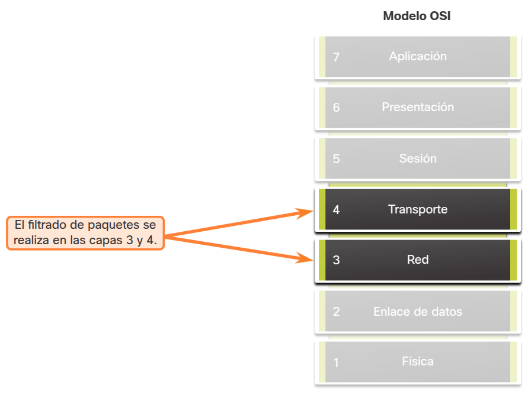
</div>

Los routers Cisco admiten los siguientes dos tipos de ACL:
* __ACL estándar__. Las ACL solo filtran en la capa 3 utilizando únicamente la dirección IPv4 de origen.
* __ACL extendidas__. Las ACLs filtran en la capa 3 utilizando la dirección IPv4 de origen y/o destino. También pueden filtrar en la Capa 4 usando TCP, puertos UDP e información de tipo de protocolo opcional para un control más fino.

## ACL numeradas y nombradas
### ACL numeradas
Las ACL número 1 a 99, o 1300 a 1999 son ACL estándar, mientras que las ACL número 100 a 199, o 2000 a 2699 son ACL extendidas, como se muestra en la salida.
```shell
R1(config)# access-list ?
  <1-99>       IP standard access list
  <100-199>    IP extended access list
  <1100-1199>  Extended 48-bit MAC address access list
  <1300-1999>  IP standard access list (expanded range)
  <200-299>    Protocol type-code access list
  <2000-2699>  IP extended access list (expanded range)
  <700-799>    48-bit MAC address access list
  rate-limit   Simple rate-limit specific access list
  template     Enable IP template acls
R1(config)# access-list
```

### ACL nombradas
Las ACL con nombre son el método preferido para configurar ACL. Específicamente, las ACL estándar y extendidas se pueden nombrar para proporcionar información sobre el propósito de la ACL. Por ejemplo, nombrar un FILTRO FTP-ACL extendido es mucho mejor que tener un ACL 100 numerado.

El comando de configuración global `ip access-list` se utiliza para crear una ACL con nombre, como se muestra en el siguiente ejemplo.
```shell
R1(config)# ip access-list extended FTP-FILTER
R1(config-ext-nacl)# permit tcp 192.168.10.0 0.0.0.255 any eq ftp
R1(config-ext-nacl)# permit tcp 192.168.10.0 0.0.0.255 any eq ftp-data
R1(config-ext-nacl)#
```

A continuación se resumen las reglas que se deben seguir para las ACL con nombre:
* Asigne un nombre para identificar el propósito de la ACL.
* Los nombres pueden contener caracteres alfanuméricos.
* Los nombres no pueden contener espacios ni signos de puntuación.
* Se sugiere escribir el nombre en MAYÚSCULAS.
* Se pueden agregar o eliminar entradas dentro de la ACL.

## Funcionamiento de la ACL
Las ACL definen el conjunto de reglas que proporcionan un control adicional para los paquetes que ingresan por las interfaces de entrada, para los que retransmiten a través del router y para los que salen por las interfaces de salida del router.

Las ACL se pueden configurar para aplicarse al tráfico entrante y al tráfico saliente, como se muestra en la figura.

<div style="width: 40%;padding-left: 20%;">
	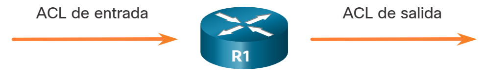
</div>

__Nota__: Las ACLs no actúan sobre los paquetes que se originan en el propio router.

Las ACL de entrada filtran los paquetes que ingresan a una interfaz específica y lo hacen antes de que se enruten a la interfaz de salida. Las ACL de entrada son eficaces, porque ahorran la sobrecarga de enrutar búsquedas si el paquete se descarta. Si las ACL permiten el paquete, este se procesa para el routing. Las ACL de entrada son ideales para filtrar los paquetes cuando la red conectada a una interfaz de entrada es el único origen de los paquetes que se deben examinar.

Las ACL de salida filtran los paquetes después de que se enrutan, independientemente de la interfaz de entrada. Los paquetes entrantes se enrutan a la interfaz saliente y luego se procesan a través de la ACL saliente. Las ACL de salida son ideales cuando se aplica el mismo filtro a los paquetes que proporcionan varias interfaces de entrada antes de salir por la misma interfaz de salida.

Cuando se aplica una ACL a una interfaz, sigue un procedimiento operativo específico. Por ejemplo, estos son los pasos operativos utilizados cuando el tráfico ha entrado en una interfaz del router con una ACL IPv4 estándar entrante configurada:

1. Un router configurado con una ACL de IPv4 estándar recupera la dirección IPv4 de origen del encabezado del paquete.
2. El router comienza en la parte superior de la ACL y compara la dirección con cada ACE de manera secuencial.
3. Cuando encuentra una coincidencia, el router realiza la instrucción, que puede ser permitir o denegar el paquete. Las demás entradas en el ACL no son analizadas.
4. Si la dirección IPv4 de origen no coincide con ninguna ACE de la ACL, el paquete se descarta porque hay una ACE de denegación implícita aplicada automáticamente a todas las ACL.

La última instrucción de una ACL siempre es una instrucción deny implícita que bloquea todo el tráfico. De forma predeterminada, esta instrucción se implica automáticamente al final de una ACL aunque esté oculta y no se muestre en la configuración.

__Nota__: Una ACL debe tener al menos una declaración de permiso, de lo contrario se denegará todo el tráfico debido a la declaración deny implícita de ACE.

# Enmascaramiento _wildcard_
## Descripción de la máscara comodín (_wildcard_)
En el tema anterior aprendió sobre el propósito de las ACL. En este tema se explica cómo las ACL utilizan máscaras wildcard. Un ACE IPv4 utiliza una máscara wildcard de 32-bit para determinar qué bits de la dirección debe examinar para obtener una coincidencia. El protocolo de enrutamiento Open Shortest Path First (OSPF) también utiliza máscaras wildcard.

Una máscara wildcard es similar a una máscara de subred, ya que utiliza el proceso AnDing para identificar los bits de una dirección IPv4 que deben coincidir. Sin embargo, difieren en la forma en que coinciden binarios 1s y 0s. Sin embargo, a diferencia de una máscara de subred en la que el 1 binario equivale a una coincidencia y el 0 binario no es una coincidencia, en las máscaras wildcard es al revés.

Las máscaras wildcard utilizan las siguientes reglas para establecer la coincidencia entre los unos y ceros binarios:
* __Máscara wildcard bit 0__. Coincide con el valor del bit correspondiente en la dirección.
* __Máscara wildcard bit 1__. Ignora el valor del bit correspondiente en la dirección.

La tabla enumera algunos ejemplos de máscaras wildcard y lo que identificarían.
<table>
	<tr><th>Máscara comodín<th>Último octeto (en binario)<th>Significado (0 - conicide; 1 - se ignora)
	<tr><td>0.0.0.0<td>00000000<td>Coincide con todos los octetos.
	<tr><td rowspan="3">0.0.0.63<td rowspan="3">00111111<td>Coincide con todos los octetos.
	<tr><td> Coincide con los dos bits más a la izquierda del último octeto.
	<tr><td> Ignora los últimos 6 bits.
	<tr><td rowspan="3">0.0.0.15<td rowspan="3">00001111<td>Coincide con los tres primeros octetos.
	<tr><td> Coincide con los cuatro bits más a la izquierda del último octeto.
	<tr><td> Ignora los últimos 4 bits del último octeto.
	<tr><td rowspan="3">0.0.0.252<td rowspan="3">11111100<td>Coincide con los tres primeros octetos.
	<tr><td> Ignora los 6 bits más a la izquierda del último octeto.
	<tr><td> Coincide con los dos últimos bits.
	<tr><td rowspan="3">0.0.0.255<td rowspan="2">11111111<td>Coincide con los tres primeros octetos.
	<tr><td> Ignora el último octeto.
</table>

## Tipos de máscaras comodín
Usar máscaras wildcard tomará algo de práctica. Consulte los ejemplos para obtener información sobre cómo se utiliza la máscara wildcard para filtrar el tráfico de un host, una subred y un rango de direcciones IPv4.

### Comodín para coincidir con un _host_
En este ejemplo, la máscara wildcard se utiliza para que coincida con una dirección IPv4 de host específica. Supongamos que ACL 10 necesita una ACE que solo permita el host con la dirección IPv4 `192.168.1.1`. Recuerde que «0» es igual a una coincidencia y «1» es igual a ignorar. Para que coincida con una dirección IPv4 de host específica, se requiere una máscara wildcard que consta de todos los ceros (es decir, `0.0.0.0`).

La tabla muestra en binario, la dirección IPv4 del host, la máscara wildcard y la dirección IPv4 permitida.

La máscara de wildcard 0.0.0.0 estipula que cada bit debe coincidir exactamente. Por lo tanto, cuando se procesa el ACE, la máscara wildcard permitirá sólo la dirección `192.168.1.1`. El ACE resultante en ACL 10 sería `access-list 10 permit 192.168.1.1 0.0.0.0`.

||Decimal|Binario
|:-|:-:|:-:
|Dirección IPv4|192.168.1.1|11000000.10101000.00000001.00000001
|Máscara comodín|0.0.0.0|00000000.00000000.00000000.00000000
|Dirección IPv4 permitida|192.168.1.1|11000000.10101000.00000001.00000001

### Máscara comodín para que coincida con una subred IPv4
En este ejemplo, ACL 10 necesita una ACE que permita todos los hosts de la red 192.168.1.0/24. La máscara wildcard `0.0.0.255` estipula que los tres primeros octetos deben coincidir exactamente, pero el cuarto octeto no lo hace.

La tabla muestra en binario, la dirección IPv4 del host, la máscara comodín y las direcciones IPv4 permitidas.

Cuando se procesa, la máscara wildcard `0.0.0.255` permite todos los hosts de la red `192.168.1.0/24`. El ACE resultante en ACL 10 sería `access-list 10 permit 192.168.1.0 0.0.0.255`.

||Decimal|Binario
|:-|:-:|:-:
|Dirección IPv4|192.168.1.1|11000000.10101000.00000001.00000001
|Máscara comodín|0.0.0.255|00000000.00000000.00000000.11111111
|Direcciones IPv4 de host permitidas|192.168.1.1 a 192.168.1.254|11000000.10101000.00000001.00000001 a 11000000.10101000.00000001.11111111

### Máscara comodín para que coincida con un rango de direcciones IPv4
En este ejemplo, ACL 10 necesita una ACE que permita todos los hosts de las redes `192.168.16.0/24`, `192.168.17.0/24`,..., `192.168.31.0/24`. La máscara wildcard `0.0.15.255` filtraría correctamente ese rango de direcciones.

La tabla muestra en binario la dirección IPv4 del host, la máscara wildcard y las direcciones IPv4 permitidas.

Los bits de máscara wildcard resaltados identifican qué bits de la dirección IPv4 deben coincidir. Cuando se procesa, la máscara de wildcard `0.0.15.255` permite todos los hosts de las redes `192.168.16.0/24` a `192.168.31.0/24`. El ACE resultante en ACL 10 sería `access-list 10 permit 192.168.16.0 0.0.15.255`.

||Decimal|Binario
|:-|:-:|:-:
|Dirección IPv4|192.168.16.0|11000000.10101000.00010000.00000000
|Máscara comodín|0.0.15.255|00000000.00000000.00001111.11111111
|Direcciones IPv4 de host permitidas|192.168.16.1 a 192.168.31.254|11000000.10101000.00010000.00000000 a 11000000.10101000.00011111.11111111

## Cálculo de máscara comodín
El cálculo de máscaras de wildcard puede ser difícil. Un método abreviado es restar la máscara de subred a 255.255.255.255. Consulte los ejemplos para aprender a calcular la máscara wildcard mediante la máscara de subred.

### Ejemplo 1
Suponga que desea un ACE en ACL 10 para permitir el acceso a todos los usuarios en la red `192.168.3.0/24`. Para calcular la máscara wildcard, reste la máscara de subred (es decir, `255.255.255.0`) de `255.255.255.255`, como se muestra en la tabla.

El resultado genera la máscara wildcard `0.0.0.255`. Por lo tanto, la ACE sería `access-list 10 permit 192.168.3.0 0.0.255`.
<table>
<tr><td>Valor inicial<td>255.255.255.255
<tr><td>Reste la máscara de subred<td>- 255.255.255.0
<tr><td>Máscara comodín resultante<td>0.0.0.255
</table>

### Ejemplo 2
En este ejemplo, suponga que desea un ACE en ACL 10 para permitir el acceso a la red a los 14 usuarios en la subred `192.168.3.32/28`. Resta la subred (es decir, `255.255.255.240`) de `255.255.255.255`, como se muestra en la tabla.

Esta solución produce la máscara wildcard `0.0.0.15`. Por lo tanto, la ACE sería `access-list 10 permit 192.168.3.32 0.0.0.15`.
<table>
<tr><td>Valor inicial<td>255.255.255.255
<tr><td>Reste la máscara de subred<td>- 255.255.255.240
<tr><td>Máscara comodín resultante<td>0.0.0.15
</table>

### Ejemplo 3
En este ejemplo, suponga que necesitaba una ACE en ACL 10 para permitir sólo las redes `192.168.10.0` y `192.168.11.0`. Estas dos redes se pueden resumir como `192.168.10.0/23`, que es una máscara de subred de `255.255.254.0`. Nuevamente, restará la máscara de subred `255.255.254.0` de `255.255.255.255`, como se muestra en la tabla.

Esta solución produce la máscara wildcard `0.0.1.255`. Por lo tanto, la ACE sería `access-list 10 permit 192.168.10.0 0.0.1.255`.
<table>
<tr><td>Valor inicial<td>255.255.255.255
<tr><td>Reste la máscara de subred<td>- 255.255.254.0
<tr><td>Máscara comodín resultante<td>0.0.1.255
</table>

### Ejemplo 4
Considere un ejemplo en el que necesita un número 10 de ACL para que coincida con las redes en el rango entre `192.168.16.0/24` y `192.168.31.0/24`. Este rango de red podría resumirse como `192.168.16.0/20`, que es una máscara de subred de `255.255.240.0`. Por lo tanto, reste la máscara de subred `255.255.240.0` de `255.255.255.255`, como se muestra en la tabla.

Esta solución produce la máscara wildcard `0.0.15.255`. Por lo tanto, la ACE sería `access-list 10 permit 192.168.16.0 0.0.15.255`.
<table>
<tr><td>Valor inicial<td>255.255.255.255
<tr><td>Reste la máscara de subred<td>- 255.255.240.0
<tr><td>Máscara comodín resultante<td>0.0.15.255
</table>

## Palabras clave de una máscara comodín
Trabajar con representaciones decimales de los bits binarios de máscaras wildcard puede ser tedioso. Para simplificar esta tarea, Cisco IOS proporciona dos palabras clave para identificar los usos más comunes del enmascaramiento de wildcards. Las palabras clave reducen las pulsaciones de teclas de la ACL pero, lo que es más importante, facilitan la lectura de la ACE.

Las dos palabras clave son:
* __host__ - Esta palabra clave sustituye a la máscara `0.0.0.0`. Esta máscara indica que todos los bits de direcciones IPv4 deben coincidir para filtrar solo una dirección de host.
* __any__ - Esta palabra clave sustituye a la máscara `255.255.255.255`. Esta máscara establece que se omita la dirección IPv4 completa o que se acepte cualquier dirección.

Por ejemplo, en la salida del comando, se configuran dos ACL. ACL 10 ACE permite sólo el host `192.168.10.10` y ACL 11 ACE permite todos los hosts.
```shell
R1(config)# access-list 10 permit 192.168.10.10  0.0.0.0
R1(config)# access-list 11 permit  0.0.0.0 255.255.255.255
R1(config)#
```

Alternativamente, las palabras clave host y any podrían haber sido utilizadas para reemplazar la salida resaltada.

Los siguientes comandos cumplen la misma tarea que los comandos anteriores.
```shell
R1(config)# access-list 10 permit  host  192.168.10.10
R1(config)# access-list 11 permit  any
R1(config)#
```

# Configurar ACL
## Crear una ACL
En el módulo anterior aprendió acerca de lo que hace una ACL y por qué es importante. En este tema, aprenderá a crear ACL.

Todas las listas de control de acceso (ACL) deben planificarse. Sin embargo, esto es especialmente cierto para las ACL que requieren varias entradas de control de acceso (ACE).

Al configurar una ACL compleja, se sugiere que:
* Utilice un editor de texto y escriba los detalles de la política que se va a implementar.
* Agregue los comandos de configuración del IOS para realizar esas tareas.
* Incluya comentarios para documentar la ACL.
* Copie y pegue los comandos en el dispositivo.
* Pruebe siempre exhaustivamente una ACL para asegurarse de que aplica correctamente la política deseada.

Estas recomendaciones le permiten crear la ACL cuidadosamente sin afectar el tráfico de la red.

## Sintaxis de ACL IPv4 estándar numerada
Para crear una ACL estándar numerada, utilice el siguiente comando de configuración global:
```shell
Router(config)# access-list access-list-number {deny | permit | remark text} source [source-wildcard] [log]
```

Utilice el comando de configuración global `no access-list access-list-number` para eliminar una ACL estándar numerada.

La tabla proporciona una explicación detallada de la sintaxis
<table>
	<tr><th>Parámetro<th>Descripción
	<tr><td rowspan="2"><b>access-list-number</b><td>Es el número decimal de la ACL
	<tr><td>El rango estándar de números de ACL es de 1 a 99 o de 1300 a 1999.
	<tr><td><b>deny</b><td>Deniega el acceso si se cumple la condición.
	<tr><td><b>permit</b><td>Permite el acceso si se cumple la condición.
	<tr><td rowspan="3"><b>remark text</b><td>(Opcional) Añade una entrada de texto con fines de documentación.
	<tr><td>Los comentarios son extremadamente útiles, especialmente en ACL más largas o complejas.
	<tr><td>Cada comentario está limitado a 100 caracteres
	<tr><td rowspan="3"><b>source</b><td>Identifica la red de origen o la dirección de host que se va a filtrar.
	<tr><td>Utilice la palabra clave <b>any</b> para especificar todas las redes.
	<tr><td>Utilice la palabra clave <b>host</b> <i>ip-addresss</i> o simplemente introduzca una dirección IP (sin la palabra clave <b>host</b>) para identificar una dirección IP específica.
	<tr><td><b>source-wildcard</b><td>(Opcional) Se trata de una máscara de comodín de 32 bits que se aplica a la fuente. Si se omite, se asume una máscara <code>0.0.0.0</code> por defecto.
	<tr><td rowspan="4"><b>log</b><td>(Opcional) Esta palabra clave genera un mensaje informativo cada vez que se produce una coincidencia con la ACE.
	<tr><td>El mensaje incluye el número de la ACL, la condición de coincidencia (es decir, permitido o denegado), la dirección de origen y el número de paquetes.
	<tr><td>Este mensaje se genera para el primer paquete coincidente.
	<tr><td>Desafortunadamente, el registro de ACL puede ser intensivo para la CPU y puede afectar negativamente a otras funciones, por lo que solo debería implementarse para la resolución de problemas o por razones de seguridad.
</table>

## Sintaxis de ACL IPv4 estándar con nombre
La asignación de nombres a las ACL hace más fácil comprender su función. Para crear una ACL estándar con nombre, utilice el siguiente comando de configuración global:
```shell
Router(config)# ip access-list standard access-list-name
```

Este comando entra en el modo de configuración estándar con nombre en el que se configuran las ACE del ACL.

Los nombres de las ACL son alfanuméricos, distinguen mayúsculas de minúsculas y deben ser únicos. No es necesario que los nombres de las ACL comiencen con mayúscula, pero esto los hace destacarse cuando se observa el resultado de show running-config. También hace que sea menos probable que cree accidentalmente dos ACL diferentes con el mismo nombre pero con distinto uso de mayúsculas.

__Nota__: utilice el comando de configuración global no ip access-list standard access-list-name para eliminar una ACL IPv4 estándar con nombre.

En el ejemplo, se crea una ACL estándar para IPv4 llamada `NO-ACCESS`. Observe que el indicador cambia al modo de configuración de ACL estándar con nombre. Las sentencias ACE se introducen en el modo de subconfiguración ACL estándar con nombre. Utilice la función de ayuda para ver todas las opciones de ACE ACL estándar con nombre.

Las tres opciones resaltadas se configuran de forma similar a la ACL estándar numerada. A diferencia del método de ACL numeradas, no es necesario repetir el comando inicial `ip access-list` para cada ACE.
```shell
R1(config)# ip access-list standard NO-ACCESS
R1(config-std-nacl)# ?
Standard Access List configuration commands:
  <1-2147483647> Sequence Number
  default        Set a command to its defaults
  deny           Specify packets to reject
  exit           Exit from access-list configuration mode
  no             Negate a command or set its defaults
  permit         Specify packets to forward
  remark         Access list entry comment
R1(config-std-nacl)#
```

## Sintaxis de ACL IPv4 extendida numerada
Los pasos del procedimiento para configurar ACL extendidas son los mismos que para las ACL estándar. Primero se configura la ACL extendida y, a continuación, se activa en una interfaz. Sin embargo, la sintaxis de los comandos y los parámetros son más complejos, a fin de admitir las funciones adicionales proporcionadas por las ACL extendidas.

Para crear una ACL extendida numerada, utilice el siguiente comando de configuración global:
```shell

Router(config)# access-list access-list-number {deny | permit | remark text} protocol source source-wildcard [ operator {port}] destination destination-wildcard [operator {port}] [established] [log]
```

Utilice el comando de configuración golbal `no access-list access-list-number` para eliminar una ACL extendida.

Aunque existen muchas palabras clave y parámetros para las ACL extendidas, no es necesario usarlas todas al configurar una ACL extendida. La tablas proporciona una explicación detallada de la sintaxis de una ACL extendida.

<table>
	<tr><th>Parámetro<th>Descripción
	<tr><td rowspan="2"><b>access-list-number</b><td>Es el rango decimal de la ACL.
	<tr><td>El rango de números de ACL extendida es de 100 a 199 y de 2000 a 2699.
	<tr><td><b>deny</b><td>Deniega el acceso si se cumple la condición.
	<tr><td><b>permit</b><td>Permite el acceso si se cumple la condición.
	<tr><td rowspan="2"><b>remark text</b><td>(Opcional) Añade una entrada de texto con fines de documentación.
	<tr><td>Cada comentario está limitado a 100 caracteres.
	<tr><td rowspan="3"><b>protocol</b><td>Nombre o número de un protocolo de Internet.
	<tr><td>Las palabras clave más comunes son ip, tcp, udp e icmp.
	<tr><td>La palabra clave ip coincide con todos los protocolos IP.
	<tr><td rowspan="2"><b>source</b><td>Identifica la red de origen o la dirección de host a filtrar.
	<tr><td>Utiliza la palabra clave <b>any</b> para especificar todas las redes. Utilice la palabra clave <b>host ip-address</b> o simplemente introduzca una dirección IP (sin la palabra clave <b>host</b>) para identificar una dirección IP específica.
	<tr><td><b>source-wildcard</b><td>(Opcional) Se trata de una máscara comodín de 32 bits qye se aplica al origen.
	<tr><td><b>destination-wildcard</b><td>(Opcional) Es una máscara comodín de 32 bits que se aplica al destino.
	<tr><td rowspan="3"><b>destination</b><td>Identifica la red de destino o la dirección de host que se va a filtrar.
	<tr><td>Utiliza la palabra clave <b>any</b> para especidficar todas las redes.
	<tr><td>Utiliza la palabra clave <b>host ip-address</b> o <b>ip-address</b>.
	<tr><td rowspan="2"><b>established</b><td>(Opcional) Solo para el protocolo TCP.
	<tr><td>Esta es una función del firewall de primera generación.
	<tr><td><b>port</b><td>(Opcional) el número decimal o el nombre de un puerto TCP o UDP.
	<tr><td rowspan="2"><b>operator</b><td>(Opcional) Compara los puertos de origen o destino.
	<tr><td>Algunos operadores son <code>lt</code> (<i>less than</i> - menor que), <code>gt</code> (<i>greater than</i> - mayor que), <code>eq</code> (<i>equals</i> - igual) y <code>neq</code> (<i>not equals</i> - no igual).
	<tr><td rowspan="5"><b>log</b><td>(Opcional) Esta palabra clave genera un mensaje informativo cada vez que se produce una coincidencia con la ACE.
	<tr><td>El mensaje incluye el número de ACL, la condición de coincidencia (es decir, permitido o denegado), la dirección de origen y el número de paquetes.
	<tr><td>Este mensaje se genera para el primer paquete coincidente.
	<tr><td>Esta palabra clave solo debería implementarse para la resolución de problemas o por razones de seguridad.
</table>

El comando para aplicar una ACL extendida de IPv4 a una interfaz es el mismo que el comando utilizado para las ACL estándar de IPv4.
```shell
Router(config-if)# ip access-group {access-list-number | access-list-name} {in | out}
```

Para eliminar una ACL de una interfaz, primero introduzca el comando de configuración de interfaz no ip access-group. Para eliminar la ACL del router utilice el comando de configuración global no access-list.

__Nota__: La lógica interna aplicada al ordenamiento de las instrucciones de las ACL estándar no se aplica a las ACL extendidas. El orden en que se introducen las instrucciones durante la configuración es el orden en que se muestran y se procesan.

## Protocolos y número de puerto
Las ACL extendidas pueden filtrar en muchos tipos diferentes de protocolos y puertos de Internet. Haga clic en cada botón para obtener más información acerca de los protocolos de Internet y los puertos en los que las ACL extendidas pueden filtrar.

### Opciones de protocolo
Los cuatro protocolos resaltados son las opciones más populares.
__Nota__: Utilice la tecla `?` para obtener ayuda cuando introduzca una ACE compleja.
__Nota__: Si un protocolo de Internet no aparece en la lista, se puede especificar el número de protocolo IP. Por ejemplo, el número de protocolo ICMP es 1, TCP es 6 y UDP es 17.
```shell
R1(config)# access-list 100 permit ?
<0-255>           An IP protocol number
ahp               Authentication Header Protocol
dvmrp             dvmrp
eigrp             Cisco\'s EIGRP routing protocol
esp               Encapsulation Security Payload
gre               Cisco\'s GRE tunneling
icmp              Internet Control Message Protocol (*)
igmp              Internet Gateway Message Protocol
ip                Any Internet Protocol (*)
ipinip            IP in IP tunneling
nos               KA9Q NOS compatible IP over IP tunneling
object-group      Service object group
ospf              OSPF routing protocol
pcp              Payload Compression Protocol
pim              Protocol Independent Multicast
tcp              Transmission Control Protocol (*)
udp              User Datagram Protocol (*)
R1(config)# access-list 100 permit
```

### Opciones de palabras clave del puerto.
La selección de un protocolo influye en las opciones del puerto. Por ejemplo, si se selecciona:

* Protocolo tcp proporcionaría opciones de puertos relacionados con TCP
* Protocolo udp proporcionaría opciones de puertos específicos de UDP
* Protocolo icmp proporcionaría opciones de puertos relacionados con ICMP (es decir, mensajes)

Nuevamente, observe cuántas opciones de puertos TCP están disponibles. Los puertos resaltados son opciones populares.

Se pueden especificar nombres o números de puertos. Sin embargo, los nombres de los puertos facilitan la comprensión del propósito de una ACE. Observe cómo algunos nombres de puertos comunes (por ejemplo, SSH y HTTPS) no aparecen en la lista. Para estos protocolos habrá que especificar los números de puerto.
```shell
R1(config)# access-list 100 permit tcp any any eq ?
<0-65535>        Port number
bgp              Border Gateway Protocol (179)
chargen          Character generator (19)
cmd              Remote commands (rcmd, 514)
daytime          Daytime (13)
discard          Discard (9)
domain           Domain Name Service (53)
echo             Echo (7)
exec             Exec (rsh, 512)
finger           Finger (79)
ftp              File Transfer Protocol (21)
ftp-data         FTP data connections (20)
gopher           Gopher (70)
hostname         NIC hostname server (101)
ident            Ident Protocol (113)
irc              Internet Relay Chat (194)
klogin           Kerberos login (543)
kshell           Kerberos shell (544)
login            Login (rlogin, 513)
lpd              Printer service (515)
msrpc            MS Remote Procedure Call (135)
nntp             Network News Transport Protocol (119)
onep-plain       Onep Cleartext (15001)
onep-tls         Onep TLS (15002)
pim-auto-rp      PIM Auto-RP (496)
pop2             Post Office Protocol v2 (109)
pop3             Post Office Protocol v3 (110)
smtp             Simple Mail Transport Protocol (25)
sunrpc           Sun Remote Procedure Call (111)
syslog           Syslog (514) (111)
tacacs           TAC Access Control System (49)
talk             Talk (517)
telnet           Telnet (23)
time             Time (37)
uucp             Unix-to-Unix Copy Program (540)
whois            Nicname (43)
www              World Wide Web (HTTP, 80)
```

## Ejemplos de configuración de protocolos y números de puerto
Las ACL extendidas pueden filtrar en diferentes opciones de número de puerto y nombre de puerto. En este ejemplo se configura una ACL 100 extendida para filtrar el tráfico HTTP. El primer ACE usa el nombre de puerto www. El segundo ACE utiliza el número de puerto 80. Ambas ACE logran exactamente el mismo resultado.
```shell
R1(config)# access-list 100 permit tcp any any eq www
R1(config)# !or...
R1(config)# access-list 100 permit tcp any any eq 80
```

La configuración del número de puerto es necesaria cuando no aparece un nombre de protocolo específico, como SSH (número de puerto 22) o HTTPS (número de puerto 443), como se muestra en el siguiente ejemplo.
```shell
R1(config)# access-list 100 permit tcp any any eq 22
R1(config)# access-list 100 permit tcp any any eq 443
R1(config)#
```

## ACL extendida establecida por TCP
TCP también puede realizar servicios básicos de _firewall stateful_ utilizando la palabra clave `TCP established`. La palabra clave permite que el tráfico interno salga de la red privada interna y permite que el tráfico de respuesta devuelta entre en la red privada interna, como se muestra en la figura.

<div style="width: 47%;padding-left: 23%;">
	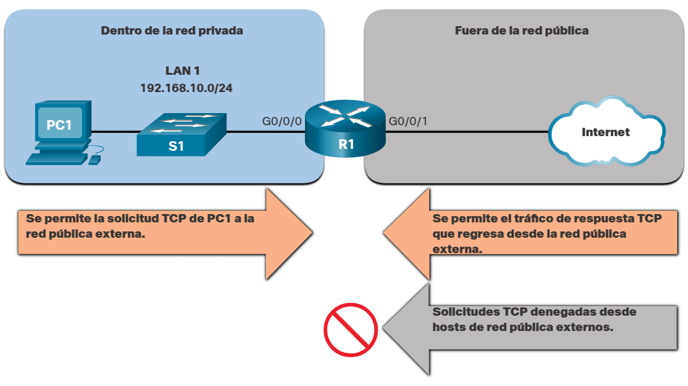
</div>

Sin embargo, se deniega el tráfico TCP generado por un host externo e intentando comunicarse con un host interno.

La palabra clave `established` se puede usar para permitir solo el tráfico HTTP de retorno de los sitios web solicitados, mientras se deniega el resto del tráfico.

En la topología, el diseño de este ejemplo muestra que ACL 110, que se configuró previamente, filtrará el tráfico de la red privada interna. ACL 120, utilizando la palabra clave `established`, filtrará el tráfico que ingresa a la red privada interna desde la red pública externa.

<div style="width: 47%;padding-left: 23%;">
	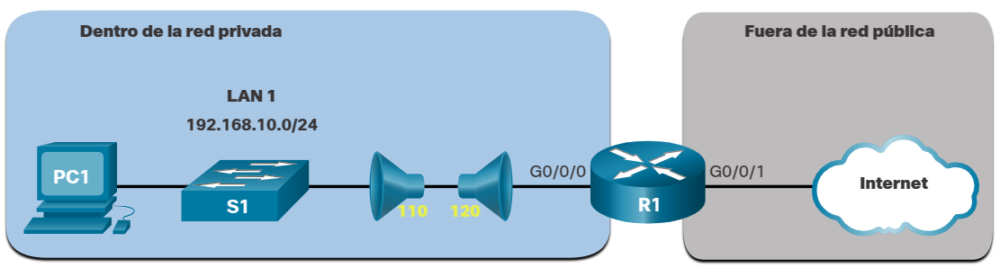
</div>

En el ejemplo, ACL 120 está configurado para permitir sólo devolver tráfico web a los hosts internos. A continuación, la nueva ACL se aplica saliente en la interfaz R1 G0/0/0. El comando `show access-list` muestra ambas ACL. Aviso de las estadísticas de coincidencia que dentro de los hosts han estado accediendo a los recursos web seguros desde Internet.
```shell
R1(config)# access-list 120 permit tcp any 192.168.10.0 0.0.0.255 established
R1(config)# interface g0/0/0
R1(config-if)# ip access-group 120 out
R1(config-if)# end
R1# show access-lists
Extended IP access list 110
    10 permit tcp 192.168.10.0 0.0.0.255 any eq www
    20 permit tcp 192.168.10.0 0.0.0.255 any eq 443 (657 matches)
Extended IP access list 120
    10 permit tcp any 192.168.10.0 0.0.0.255 established (1166 matches)
R1#
```

Observe que el permiso de contadores HTTPS seguros (es decir, eq 443) en ACL 110 y los contadores de retorno establecidos en ACL 120 han aumentado.

El parámetro `established` permite que solo las respuestas al tráfico procedente de la red 192.168.10.0/24 vuelvan a esa red. Específicamente, se produce una coincidencia si el segmento TCP devuelto tiene los bits de indicador ACK o reset (RST) establecidos. Esto indica que el paquete pertenece a una conexión existente. Sin el parámetro `established` en la instrucción de la ACL, los clientes pueden enviar tráfico a un servidor web y recibir el tráfico que vuelve de dicho servidor. Todo el tráfico estaría permitido.

## Sintaxis de ACL IPv4 extendida con nombre
La asignación de nombres a las ACL hace más fácil comprender su función. Para crear una ACL extendida con nombre, utilice el siguiente comando de configuración global:
```shell
Router(config)# ip access-list extended access-list-name
```

Este comando ingresa al modo de configuración extendida con nombre. Recuerde que los nombres de ACL son alfanuméricos, distinguen entre mayúsculas y minúsculas y deben ser únicos.

En el ejemplo, se crea una ACL extendida con nombre llamada NO-FTP-ACCESS y el indicador cambia a modo de configuración ACL extendida con nombre. Las instrucciones ACE se introducen en el modo de subconfiguración de ACL extendido con nombre.
```shell
R1(config)# ip access-list extended NO-FTP-ACCESS
R1(config-ext-nacl)#
```

## Ejemplo de ACL IPv4 extendida con nombre
Las ACL extendidas con se crean esencialmente de la misma forma que las ACL estándar con nombre.

La topología de la figura se utiliza para demostrar la configuración y aplicación de dos ACL IPv4 extendidas con nombre a una interfaz:
* __SURFING__. Esto permitirá que el tráfico interno HTTP y HTTPS salga a Internet.
* __BROWSING__. Esto solo permitirá el retorno del tráfico web a los hosts internos, mientras que el resto del tráfico que sale de la interfaz R1 G0/0/0 es implícitamente denegado.

<div style="width: 47%;padding-left: 23%;">
	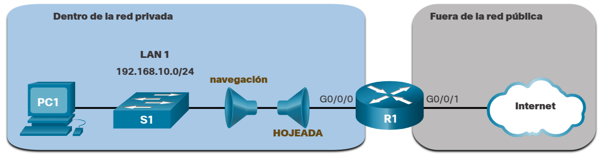
</div>

El ejemplo muestra la configuración de la ACL de SURFING entrante y la ACL de BROWSING saliente.

La ACL de SURFING permite que el tráfico HTTP y HTTPS de los usuarios internos salga de la interfaz G0/0/1 conectada a Internet. La ACL de BROWSING permite que el tráfico web que regrese de Internet vuelva a la red privada interna.

La ACL de SURFING se aplica de entrada y la ACL de BROWSING se aplica de salida en la interfaz G0/0/0 en R1, como se muestra en el ejemplo.

Los hosts internos han estado accediendo a los recursos seguros de la web desde Internet. El comando show access-lists se utiliza para verificar las estadísticas de la ACL. Observe que los contadores HTTPS seguros de permiso (es decir, eq 443) en la ACL de SURFING y los contadores de retorno establecidos en la ACL de BROWSING han aumentado.
```shell
R1(config)# ip access-list extended SURFING
R1(config-ext-nacl)# Remark Permitirs inside HTTP and HTTPS traffic
R1(config-ext-nacl)# permit tcp 192.168.10.0 0.0.0.255 any eq 80
R1(config-ext-nacl)# permit tcp 192.168.10.0 0.0.0.255 any eq 443
R1(config-ext-nacl)# exit
R1(config)#
R1(config)# ip access-list extended BROWSING
R1(config-ext-nacl)# Remark Only permit returning HTTP and HTTPS traffic
R1(config-ext-nacl)# permit tcp any 192.168.10.0 0.0.0.255 established
R1(config-ext-nacl)# exit
R1(config)# interface g0/0/0
R1(config-if)# ip access-group SURFING in
R1(config-if)# ip access-group BROWSING out
R1(config-if)# end
R1# show access-lists
Extended IP access list SURFING
   10 permit tcp 192.168.10.0 0.0.0.255 any eq www
   20 permit tcp 192.168.10.0 0.0.0.255 any eq 443 (124 matches)
Extended IP access list BROWSING
   10 permit tcp any 192.168.10.0 0.0.0.255 established (369 matches)
R1#
```

# Sintaxis de ACL con nombre estándar IPv4
## Dos métodos para modificar una ACL
Después de configurar una ACL, es posible que deba modificarse. Las ACL con varias ACE pueden ser complejas de configurar. A veces, el ACE configurado no produce los comportamientos esperados. Por estos motivos, las ACL pueden requerir inicialmente un poco de prueba y error para lograr el resultado de filtrado deseado.

En esta sección se analizarán dos métodos que se utilizarán al modificar una ACL:
* Utilice un editor de texto.
* Utilice Números de secuencia

## Método del editor de texto
Las ACL con varias ACE deben crearse en un editor de texto. Esto le permite planificar las ACE requeridas, crear la ACL y luego pegarla en la interfaz del router. También simplifica las tareas para editar y corregir una ACL.

Por ejemplo, supongamos que la ACL 1 se introdujo incorrectamente utilizando 19 en lugar de 192 para el primer octeto, como se muestra en la configuración en ejecución.
```shell
R1# show run | section access-list
access-list 1 deny 19.168.10.10
access-list 1 permit 192.168.10.0 0.0.0.255
R1#
```

En el ejemplo, la primera ACE debería haber sido denegar el host en 192.168.10.10. Sin embargo, el ACE se ingresó incorrectamente.

Para corregir el error:
* Copie la ACL de la configuración en ejecución y péguela en el editor de texto.
* Realice los cambios necesarios.
* Elimine la ACL configurada previamente en el router. De lo contrario, al pegar los comandos ACL editados solo se anexarán (es decir, se añadirán) a las ACE de las ACL existentes en el router.
* Copie y pegue la ACL editada de nuevo en el router.

Supongamos que ACL 1 se ha corregido. Por lo tanto, se debe eliminar la ACL incorrecta y las instrucciones ACL 1 corregidas deben pegarse en modo de configuración global, como se muestra en el ejemplo.
```shell
R1(config)# no access-list 1
R1(config)#
R1(config)# access-list 1 deny 19.168.10.10
R1(config)# access-list 1 permit 192.168.10.0 0.0.0.255
R1(config)#
```

## Método del número de secuencia
Una ACE ACL también se puede eliminar o agregar utilizando los números de secuencia ACL. Los números de secuencia se asignan automáticamente cuando se introduce una ACE. Estos números se muestran en el comando show access-list. El comando show running-config no muestra números de secuencia.

En el ejemplo anterior, el ACE incorrecto para ACL 1 está utilizando el número de secuencia 10, como se muestra en el ejemplo.
```shell
R1# show access-lists
Standard IP access list 1
   10 deny 19.168.10.10
   20 permit 192.168.10.0, wildcard bits 0.0.0.255
R1#
```

Utilice el comando ip access-list standard para editar una ACL. Las instrucciones no se pueden sobrescribir con el mismo número de secuencia que el de una instrucción existente. Por lo tanto, la instrucción actual debe eliminarse primero con el comando no 10. A continuación, se configura el ACE correcto utilizando el número de secuencia 10. Verifique los cambios utilizando el comando show access-lists, como se muestra en el ejemplo.
```shell
R1# conf t
R1(config)# ip access-list standard 1
R1(config-std-nacl)# no 10
R1(config-std-nacl)# 10 deny host 192.168.10.10
R1(config-std-nacl)# end
R1# show access-lists
Standard IP access list 1
   10 deny 192.168.10.10
   20 permit 192.168.10.0, wildcard bits 0.0.0.255
R1#
```

# Implementar ACL
## Pautas de configuración de ACL
Una ACL está formada por una o más entradas de control de acceso (ACE) o instrucciones. Al configurar y aplicar una ACL, tenga en cuenta las pautas resumidas en esta lista:
* Cree una ACL a nivel global y luego aplíquela.
* Asegúrese de que la última declaración sea un `deny any` implícito o `deny ip any`.
* Recuerde que el orden de las instrucciones es importante porque las ACL se procesan de arriba hacia abajo.
* En cuanto una sentencia coincide, se sale de la ACL.
* Siempre filtre de lo más específico a lo más genérico. Por ejemplo, deniegue un host específico y luego permita todos los demás hosts.
* Recuerde que solo se permite una ACL por interfaz, protocolo y dirección.
* Recuerde que las declaraciones nuevas para una ACL existente se agregan al final de la ACL de forma predeterminada.
* Recuerde que los paquetes generados por el router no son filtrados por las ACL salientes.
* Coloque las ACL estándar lo más cerca posible del destino.
* Coloque las ACL extendidas lo más cerca posible del origen.

## Aplicar una ACL
Después de crear una ACL, el administrador puede aplicarla de diferentes maneras. A continuación se muestra la sintaxis del comando para aplicar una ACL a una interfaz o a las líneas vty.
```shell
Router(config-if)# ip access-group {acl-# | name} {in | out}

Router(config-line)# ip access-class {acl-# | name} {in | out}
```
La siguiente figura muestra una ACL estándar con nombre aplicada al tráfico saliente.

<div style="width: 47%;padding-left: 23%;">
	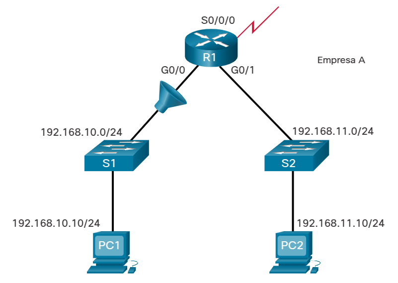
</div>

```shell
R1(config)# ip access-list standard NO_ACCESS
R1(config-std-nacl)# deny host 192.168.11.10
R1(config-std-nacl)# permit any
R1(config-std-nacl)# exit
R1(config)# interface g0/0
R1(config-if)# ip access-group NO_ACCESS out
```

Esta figura muestra dos ACL extendidas con nombre. La ACL SURFING se aplica al tráfico de entrada y la ACL BROWSING se aplica al tráfico de salida.

<div style="width: 47%;padding-left: 23%;">
	
</div>

```shell
R1(config)# ip access-list extended SURFING
R1(config-ext-nacl)# permit tcp 192.168.10.0 0.0.0.255 any eq 80
R1(config-ext-nacl)# permit tcp 192.168.10.0 0.0.0.255 any eq 443
R1(config-ext-nacl)# exit
R1(config)# ip access-list extended BROWSING
R1(config-ext-nacl)# permit tcp any 192.168.10.0 0.0.0.255 established
R1(config-ext-nacl)# exit
R1(config)# interface g0/0
R1(config-if)# ip access-group SURFING in
R1(config-if)# ip access-group BROWSING out
```

ACL con nombre en líneas VTY con registro.

<div style="width: 47%;padding-left: 23%;">
	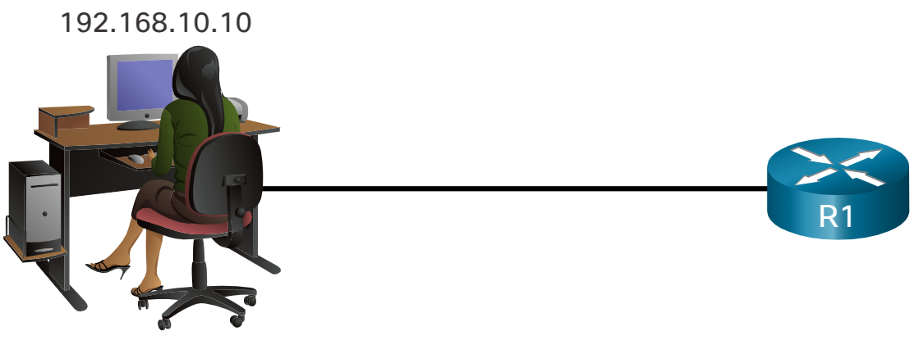
</div>

La habilitación del parámetro log en un router o switch de Cisco afecta seriamente el rendimiento de ese dispositivo. El parámetro log solo debe utilizarse cuando la red está bajo ataque y un administrador intenta determinar quién es el atacante.

La aplicación de ACL a interfaces y líneas es solo uno de sus muchos usos posibles. Las ACL también son una parte integral de otras configuraciones de seguridad tales como la traducción de direcciones de red (NAT), los firewalls basados en zonas y las redes privadas virtuales.
```shell

R1(config)# ip access-list standard VTY_ACCESS
R1(config-std-nacl)# permit 192.168.10.10 log
R1(config-std-nacl)# deny any
R1(config-std-nacl)# exit
R1(config)# line vty 0 4
R1(config-line)# access-class VTY_ACCESS in
R1(config-line)# end
R1#
R1# !The administrator accesses the vty lines from 192.168.10.10
R1#
*Feb 26 18:58:30.579: %SEC-6-IPACCESSLOGNP: list VTY_ACCESS permitted 0
192.168.10.10 -> 0.0.0.0, 5 packets
R1# show access-lists
Standard IP access list VTY_ACCESS
   10 permit 192.168.10.10 log (6 matches)
   20 deny any
```

Para eliminar una ACL de una interfaz, primero introduzca el comando `no ip access-group interface configuration`. Sin embargo, la ACL seguirá configurada en el enrutador. Para eliminar la ACL, se utiliza el comando de configuración global `no access-list`.

## Dónde ubicar las ACL
Cada ACL debe colocarse donde sea más eficiente.

La figura ilustra dónde deben ubicarse las ACL estándar y extendidas en una red empresarial. Suponga que el objetivo es evitar que el tráfico que se origina en la red `192.168.10.0/24` llegue a la red `192.168.30.0/24`.

<div style="width: 47%;padding-left: 23%;">
	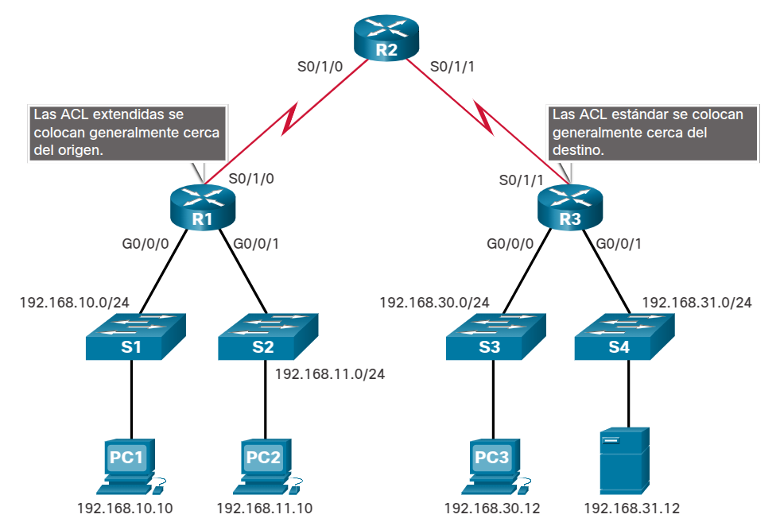
</div>

Las ACL extendidas deben ubicarse lo más cerca posible del origen del tráfico que se desea filtrar. De esta manera, el tráfico no deseado se deniega cerca de la red de origen, sin que cruce la infraestructura de red.

Las ACL estándar deben aplicarse lo más cerca posible del destino. Si se ha colocado una ACL estándar en el origen del tráfico, el "permiso" o la "denegación" se producirán en función de la dirección de origen dada, independientemente del destino del tráfico.

La colocación de la ACL y, por lo tanto, el tipo de ACL utilizada, también puede depender de una variedad de factores que se enumeran en la tabla.

<table>
	<tr><th>Factores que influyen en la ubicación de ACL's<th>Explicación
	<tr><td><b>El grado de control de la organización</b><td>La ubicación de la ACL puede depender de si la organización tiene o no el control de las redes de origen y destino.
	<tr><td><b>Ancho de banda de las redes implicadas</b><td>Puede ser conveniente filtrar el tráfico no deseado en el origen para evitar la transmisión de tráfico que consume ancho de banda.
	<tr><td rowspan="2"><b>Facilidad de configuración</b><td>Puede ser más fácil implementar una ACL en el destino, pero el tráfico utilizará el ancho de banda innecesariamente.
	<tr><td>Se podría utilizar una ACL extendida en cada router donde se origine el tráfico. Esto ahorraria ancho de banda al filtrar el tráfico en el origen, pero requeriría crear ACL extendidas en varios routers.
</table>

## Ejemplo de ubicación de una ACL estándar
Siguiendo las pautas para la colocación de ACL, las ACL estándar deben ubicarse lo más cerca posible del destino.

En la ilustración, el administrador desea impedir que el tráfico que se origina en la red `192.168.10.0/24` llegue a la red `192.168.30.0/24`.

<div style="width: 47%;padding-left: 23%;">
	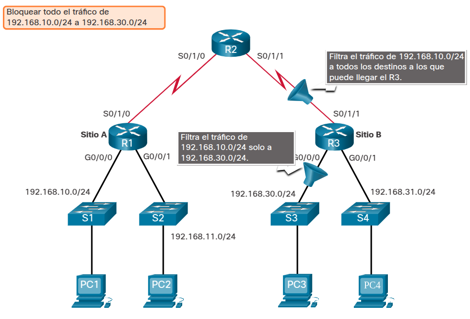
</div>

Siguiendo las pautas básicas de colocación, el administrador colocaría una ACL estándar en el router R3. Hay dos interfaces posibles en R3 para aplicar la ACL estándar:

* __Interfaz R3 S0/1/1 (entrante)__. La ACL estándar puede aplicarse de forma entrante en la interfaz R3 S0/1/1 para denegar el tráfico de la red .10. Sin embargo, también filtraría el tráfico .10 a la red 192.168.31.0/24 (.31 en este ejemplo). Por lo tanto, la ACL estándar no debe aplicarse a esta interfaz.
* __Interfaz R3 G0/0/0 (saliente)__. La ACL estándar puede aplicarse de forma saliente en la interfaz R3 G0/0/0. Esto no afecta a las otras redes con las que se puede comunicar R3. Los paquetes de la red.10 seguirán siendo capaces de llegar a la red.31. Esta es la mejor interfaz para colocar la ACL estándar para cumplir con los requisitos de tráfico.

## Packet Tracer - Congurar ACL de IPv4 estándar con nombre
* <a href="./notes/pt_configurar_acl_ipv4_nombre.md" target="_blank">Congurar ACL de IPv4 estándar con nombre</a>

## Packet Tracer - Congurar ACL de IPv4 estándar numeradas
* <a href="./notes/pt_configurar_acl_ipv4_numerada.md" target="_blank">Congurar ACL de IPv4 estándar numeradas</a>

## Ejemplo de ubicación de una ACL extendida
Las ACL extendidas deben ubicarse lo más cerca posible del origen del tráfico que se desea filtrar. Esto evita que el tráfico no deseado se envíe a través de varias redes y luego sea denegado cuando llegue a destino.

Sin embargo, los administradores de red solo pueden colocar las listas ACL en los dispositivos que controlan. Por lo tanto, la colocación se debe determinar en el contexto de hasta dónde se extiende el control del administrador de red.

En la figura, por ejemplo, la empresa A quiere denegar el tráfico Telnet y FTP a la red `192.168.30.0/24` de la compañía B desde su red `192.168.11.0/24` mientras permite el resto del tráfico.

<div style="width: 47%;padding-left: 23%;">
	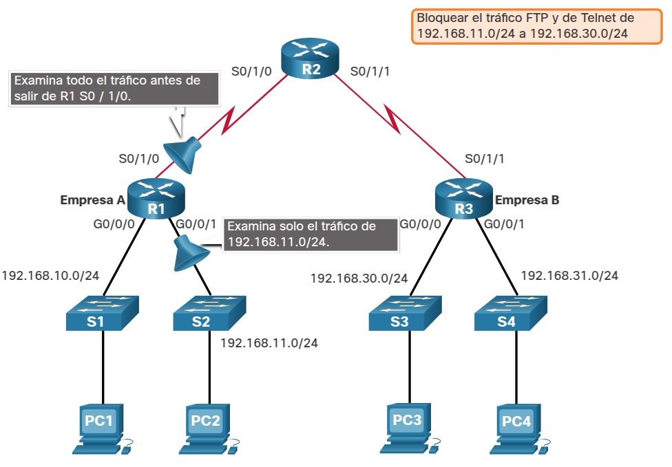
</div>

Existen varias formas de lograr estos objetivos. Una ACL extendida en `R3`, que bloquee Telnet y FTP de la red, cumpliría el objetivo, pero el administrador no controla `R3`. Además, esta solución también permite que el tráfico no deseado cruce toda la red y luego sea bloqueado en el destino. Esto afecta la eficacia general de la red.

La solución es colocar una ACL extendida en `R1` que especifique las direcciones de origen y destino.

La figura muestra dos interfaces en `R1` en las que sería posible aplicar la ACL extendida:

__Interfaz R1 S0/1/0 (outbound)__. La ACL extendida puede aplicarse outbound en la interfaz S0/1/0. Sin embargo, esta solución procesará todos los paquetes que salgan de `R1`, incluidos los paquetes de `192.168.10.0/24`.

__Interfaz R1 G0/0/1 (inbound)__. La ACL extendida puede aplicarse _inbound_ en el `G0/0/1` para que solo los paquetes de la red `192.168.11.0/24` estén sujetos al procesamiento de la ACL en `R1`. Como el filtro debe limitarse solo a los paquetes que salen de la red `192.168.11.0/24`, aplicar la ACL extendida a `G0/0/1` es la mejor solución.

## Configurar ACL estándar
Utilice este diagrama de topología de red para responder a los tres escenarios.

<div style="width: 47%;padding-left: 23%;">
	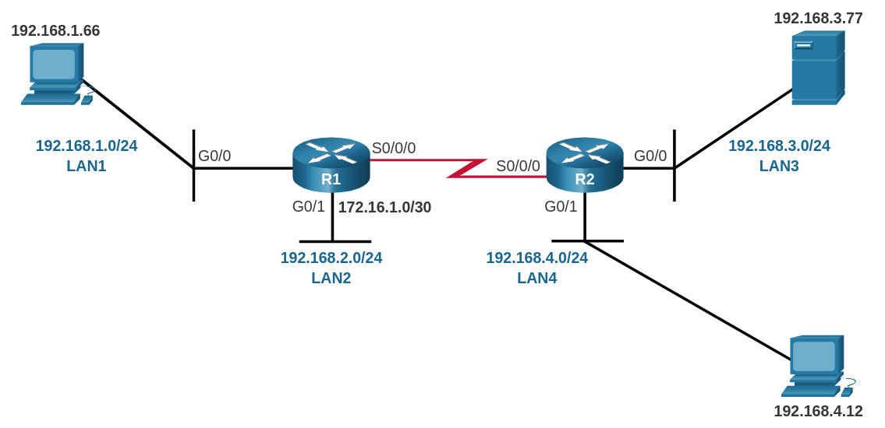
</div>

### Escenario 1
Consulte el diagrama de topología de red, cuando sea necesario, para completar esta actividad. Seleccione los comandos en las listas desplegables que se proporcionan. Configure el router para alcanzar el objetivo de ACL colocando los comandos en el orden correcto para controlar la entrada en la LAN 192.168.1.0. El host 192.168.3.77 no debería poder acceder a esta LAN, pero todos los demás hosts de la red 192.168.3.0, y luego la red 192.168.4.0 deberían tener permitido el acceso.
```shell
access-list 44 deny 192.168.3.77 0.0.0.0
access-list 44 permit 192.168.4.0 0.0.0.255
access-list 44 permit 192.168.3.0 0.0.0.255
interface g0/0
íp access-group 44 out
```

### Escenario 2
Consulte el diagrama de topología de red, cuando sea necesario, para completar esta actividad. Seleccione los comandos en las listas desplegables que se proporcionan. Configure el router para alcanzar el objetivo de la ACL colocando los comandos en el orden correcto para controlar el acceso al host 192.168.4.12. Tanto el host 192.168.1.66 como todos los hosts en la LAN 192.168.2.0 deben tener permitido el acceso a este host. El resto de las redes no deben tener acceso al host 192.168.4.12. Haga clic en el botón Escenario 3 para continuar con esta actividad.
```shell
access-list 66 permit 192.168.1.66 0.0.0.0
access-list 66 permit 192.168.2.0 0.0.0.255
interface g0/1
ip access-group 66 out
```

### Escenario 3
Consulte el diagrama de topología de red, cuando sea necesario, para completar esta actividad. Seleccione los comandos en las listas desplegables que se proporcionan. Configure el router para alcanzar el objetivo de la ACL colocando los comandos en el orden correcto para controlar el acceso a las LAN 192.168.3.0 y 192.168.4.0. Todos los hosts en la LAN 192.168.1.0 deben tener permitido el acceso a estas dos redes. La red 192.168.2.0 no debe tener acceso a estas redes.
```shell
access-list 88 permit 192.168.1.0 0.0.0.255
interface s0/0/0
ip access-group 88 in
```

## Crear una declaración de ACL extendida
### Escenario 1
Cree una instrucción de ACL numerada que permita que solo los usuarios de la red `10.1.1.0/24` tengan acceso HTTP al servidor web en la red `10.1.3.0/24`. La ACL se aplica al `R2 S0/0/0` saliente.

Cree una ACL extendida basada en los requisitos y la topología mostrada. Seleccione los componentes de la declaración ACL en las listas desplegables para que, al leerlos de izquierda a derecha, haya creado una ACL válida para el escenario. Algunos componentes no se van a utilizar.

<div style="width: 47%;padding-left: 23%;">
	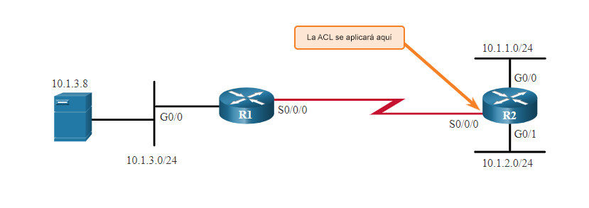
</div>

```shell
access-list 101 permit tcp 10.1.1.0 0.0.0.255 host 10.1.3.8 eq 80
```

### Escenario 2
Cree una instrucción de ACL numerada que bloquee el host 10.1.2.9 para que no tenga acceso FTP a la red 10.1.1.0/24. La ACL se aplica al R2 G0/1 entrante.

Cree una ACL extendida basada en los requisitos y la topología mostrada. Seleccione los componentes de la declaración ACL en las listas desplegables para que, al leerlos de izquierda a derecha, haya creado una ACL válida para el escenario. Algunos componentes no se van a utilizar.

<div style="width: 47%;padding-left: 23%;">
	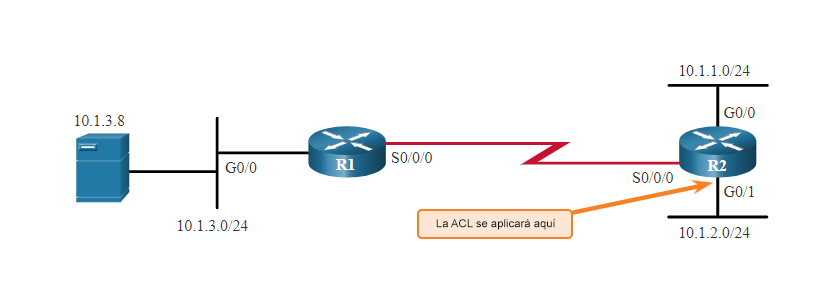
</div>

```shell
access-list 122 deny tcp host 10.1.2.9 10.1.1.0 0.0.0.255 eq 21
```

### Escenario 3
Cree una instrucción de ACL numerada que permita que solamente el host 10.1.3.8 en la red 10.1.3.0/24 llegue a los destinos que estén más allá de esa red. La ACL se aplica a R1 G0/0 entrante.

Cree una ACL extendida basada en los requisitos y la topología mostrada. Seleccione los componentes de la declaración ACL en las listas desplegables para que, al leerlos de izquierda a derecha, haya creado una ACL válida para el escenario. Algunos componentes no se van a utilizar.

<div style="width: 47%;padding-left: 23%;">
	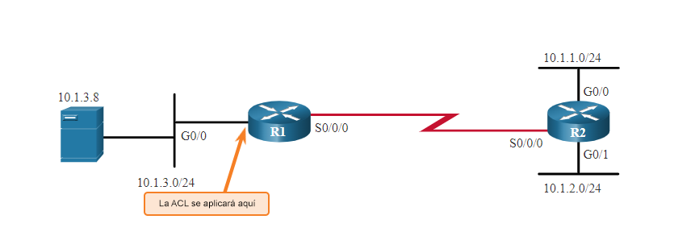
</div>

```shell
access-list 150 permit ip host 10.1.3.8 any
```

## Evaluar las ACL extendidas
Consulte la siguiente imagen para revisar la topología en cualquier momento.

<div style="width: 47%;padding-left: 23%;">
	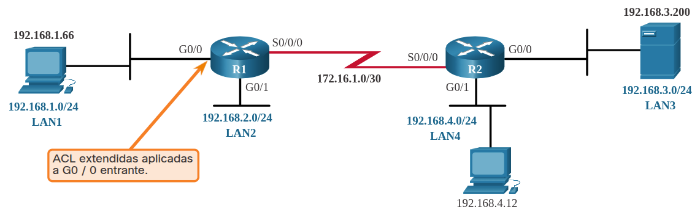
</div>

### Escenario 1
Consulte la topología de la figura anterior. En esta situación, se proporciona la ACL 103 extendida y las combinaciones de origen y destino en la tabla. Sobre la base de esta información, determine si se permitirán o denegarán los paquetes. Seleccione Permitirir o Denegar en el menú desplegable junto a cada combinación de origen y destino.

<div style="width: 47%;padding-left: 23%;">
	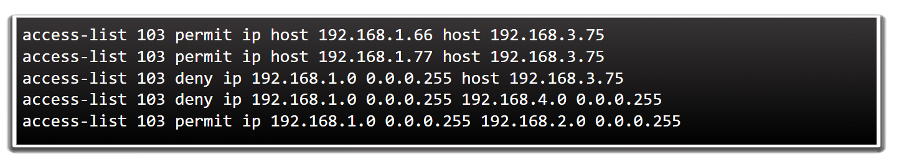
</div>

__Fuente__|__Destino__|__Permitir o denegar__
:-:|:-:|:-:
`192.168.1.66`|`192.168.3.51`|Denegar
`192.168.1.66`|`192.168.3.75`|Permitir
`192.168.1.88`|`192.168.3.51`|Denegar
`192.168.1.88`|`192.168.3.75`|Denegar
`192.168.1.77`|`192.168.3.75`|Permitir
`192.168.1.33`|`192.168.3.34`|Permitir

### Escenario 2
Consulte la topología de la figura anterior. En esta situación, se proporciona la ACL 104 extendida y las combinaciones de origen y destino en la tabla. Sobre la base de esta información, determine si se permitirán o denegarán los paquetes. Arrastre los botones Permitirir o Denegar hacia el campo junto a cada combinación de origen y destino.

<div style="width: 47%;padding-left: 23%;">
	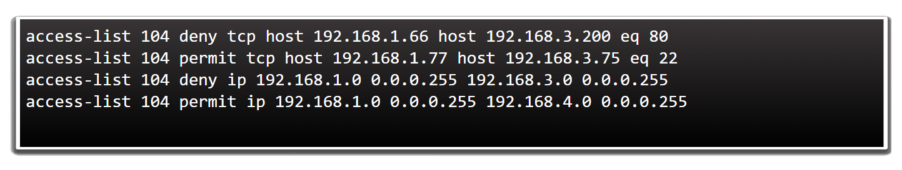
</div>

__Fuente__|__Destino__|__Protocolo__|__Permitir o denegar__
:-:|:-:|:-:|:-:
`192.168.1.66`|`172.16.1.88`|http|Denegar
`192.168.1.66`|`192.167.3.75`|ssh|Permitir
`192.168.1.77`|`192.168.3.75`|http|Denegar
`192.168.1.88`|`192.168.2.75`|http|Denegar
`192.168.1.77`|`192.168.3.75`|ssh|Permitir
`192.168.1.66`|`192.168.3.200`|http|Permitir

### Escenario 3
Consulte la topología de la figura anterior. En esta situación, se proporciona la ACL 104 extendida y las combinaciones de origen y destino en la tabla. Sobre la base de esta información, determine si se permitirán o denegarán los paquetes. Arrastre los botones Permitirir o Denegar hacia el campo junto a cada combinación de origen y destino.

<div style="width: 47%;padding-left: 23%;">
	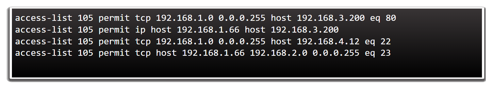
</div>

__Fuente__|__Destino__|__Protocolo__|__Permitir o denegar__
:-:|:-:|:-:|:-:
`192.168.1.67`|`192.168.2.88`|http|Denegar
`192.168.1.66`|`192.168.4.12`|ssh|Permitir
`192.168.1.77`|`192.168.3.75`|http|Denegar
`192.168.1.66`|`192.168.2.75`|telnet|Denegar
`192.168.1.77`|`192.168.2.75`|telnet|Permitir
`192.168.1.66`|`192.168.3.200`|telnet|Permitir

## Packet Tracer - Congurar ACL extendidas escenario 1
* <a href="./notes/pt_configurar_acl_extendida_1.md" target="_blank">Configurar ACL extendidas escenario 1</a>

## Packet Tracer - Congurar ACL extendidas escenario 2
* <a href="./notes/pt_configurar_acl_extendida_2.md" target="_blank">Configurar ACL extendidas escenario 2</a>

# Mitigar ataques con ACL
## Mitigar los ataques de suplantación de identidad
Las ACL pueden utilizarse para mitigar muchas amenazas de red, tales como la suplantación de direcciones IP y los ataques de denegación de servicio (DoS). La mayoría de los ataques de DoS utilizan algún tipo de suplantación. La suplantación de direcciones IP anula el proceso normal de creación de paquetes mediante la inserción de un encabezado IP personalizado con una dirección IP de origen diferente. Los atacantes pueden ocultar su identidad falsificando la dirección IP de origen.

Hay muchas clases conocidas de direcciones IP que nunca deben verse como direcciones IP de origen para el tráfico que ingresa a la red de una organización. Por ejemplo, en la figura, la interfaz S0/0/0 está conectada a Internet y nunca debe aceptar paquetes entrantes de las siguientes direcciones:
* Todas las direcciones con ceros
* Direcciones de difusión (broadcast)
* Direcciones de host local (127.0.0.0/8)
* Direcciones IP privadas automáticas (APIPA) (169.254.0.0/16)
* Direcciones privadas reservadas (RFC 1918)
* Rango de direcciones IP multicast (224.0.0.0/4)

La red 192.168.1.0/24 está conectada a la interfaz R1 G0/0. Esta interfaz solo debe permitir paquetes entrantes con una dirección de origen de esa red. La ACL para G0/0 que se muestra en la figura solo permitirá los paquetes entrantes de la red 192.168.1.0/24. Todos los demás se descartarán.

<div style="width: 60%;padding-left: 18%;">
	
</div>

Entrante en S0/0/0:
```shell
R1(config)# access-list 150 deny ip host 0.0.0.0 any
R1(config)# access-list 150 deny ip 10.0.0.0 0.255.255.255 any
R1(config)# access-list 150 deny ip 127.0.0.0 0.255.255.255 any
R1(config)# access-list 150 deny ip 172.16.0.0 0.15.255.255 any
R1(config)# access-list 150 deny ip 192.168.0.0 0.0.255.255 any
R1(config)# access-list 150 deny ip 224.0.0.0 15.255.255.255 any
R1(config)# access-list 150 deny ip host 255.255.255.255 any
```

Entrante en G0/0:
```shell
R1(config)# access-list 105 permit ip 192.168.1.0 0.0.0.255 any
```

## Permitir el tráfico necesario a través de un firewall
Una estrategia eficaz para mitigar los ataques es permitir explícitamente solo ciertos tipos de tráfico a través de un firewall. Por ejemplo, el Sistema de Nombres de Dominio (DNS), el Protocolo Simple de Transferencia de Correo (SMTP) y el Protocolo de Transferencia de Archivos (FTP) son servicios que a menudo se deben permitir a través de un firewall. También es común configurar un firewall para que los administradores puedan tener acceso remoto a través del firewall. Secure Shell (SSH), syslog y Protocolo Simple de Administración de Redes (SNMP) son ejemplos de servicios que un router puede necesitar incluir. Si bien muchos de estos servicios son útiles, deben controlarse y monitorearse. La explotación de estos servicios genera vulnerabilidades de seguridad.

La figura muestra un ejemplo de topología con configuraciones de ACL para permitir servicios específicos en la interfaz serial 0/0/0.

<div style="width: 60%;padding-left: 18%;">
	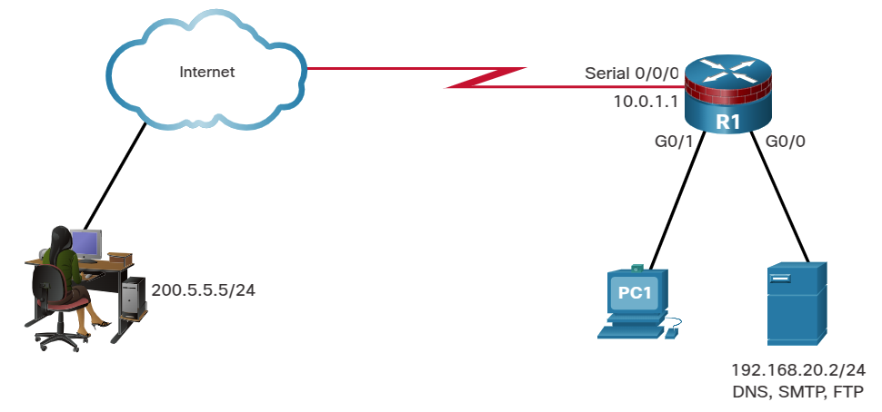
</div>

Entrante en S0/0/0:
```shell
R1(config)# access-list 180 permit udp any host 192.168.20.2 eq domain
R1(config)# access-list 180 permit tcp any host 192.168.20.2 eq smtp
R1(config)# access-list 180 permit tcp any host 192.168.20.2 eq ftp
R1(config)# access-list 180 permit tcp host 200.5.5.5 host 10.0.1.1 eq 22
R1(config)# access-list 180 permit udp host 200.5.5.5 host 10.0.1.1 eq syslog
R1(config)# access-list 180 permit udp host 200.5.5.5 host 10.0.1.1 eq snmptrap
```

## Mitigar los ataques de ICMP
Los hackers pueden utilizar paquetes de eco (pings) del Protocolo de Mensajes de Control de Internet (ICMP) para descubrir subredes y hosts en una red protegida y para generar ataques de inundación DoS. Los hackers pueden usar mensajes de redireccionamiento ICMP para alterar las tablas de routing de host. El router debe bloquear los mensajes entrantes de eco y redireccionamiento de ICMP.

Se recomiendan varios mensajes de ICMP para el correcto funcionamiento de la red y deben permitirse en la red interna:

Echo reply - Permitire a los usuarios hacer ping a hosts externos.
Fuente quench - Solicita al emisor que disminuya la tasa de tráfico de mensajes.
Unreachable - Se genera para los paquetes que son denegados administrativamente por una ACL.
Se requieren varios mensajes ICMP para el correcto funcionamiento de la red y se les debe permitir salir de la red:
* ___echo___ - Permitire a los usuarios hacer ping a hosts externos.
* ___parameter problem___ - Informa al host de los problemas de encabezado de los paquetes.
* ___packet too big___ - Activa el descubrimiento de la unidad de transmisión máxima (MTU) de los paquetes.
* ___source quench___ - Reduce el tráfico cuando es necesario.

Como regla, bloquea todos los demás tipos de mensajes ICMP salientes.

Las ACL se utilizan para bloquear la suplantación de direcciones IP, permitir servicios específicos a través de un firewall y permitir solo los mensajes ICMP requeridos. La figura muestra una topología de ejemplo y posibles configuraciones de ACL para permitir servicios ICMP específicos en las interfaces G0/0 y S0/0/0.

<div style="width: 60%;padding-left: 18%;">
	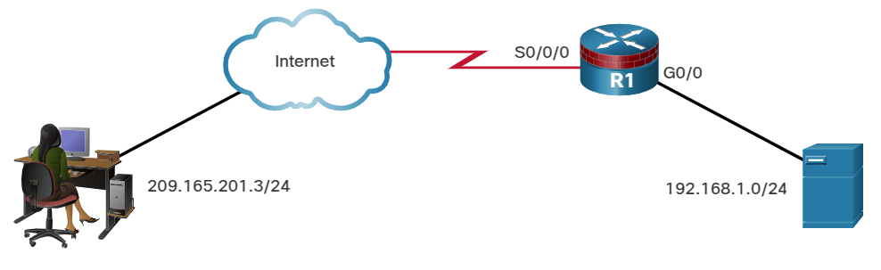
</div>

(__Aquí el curso está equivocado y pone el mismo enunciado a los dos, cuando uno de ellos es para el interfaz G0/0. Hay que comprobar cuál es cuál.__)
Entrante en S0/0/0:
```shell
R1(config)# access-list 112 permit icmp any any echo-reply
R1(config)# access-list 112 permit icmp any any source-quench
R1(config)# access-list 112 permit icmp any any unreachable
R1(config)# access-list 112 deny icmp any any
R1(config)# access-list 112 permit ip any any
```

Entrante en S0/0/0:
```shell
R1(config)# access-list 114 permit icmp 192.168.1.0 0.0.0.255 any echo
R1(config)# access-list 114 permit icmp 192.168.1.0 0.0.0.255 any parameter-problem
R1(config)# access-list 114 permit icmp 192.168.1.0 0.0.0.255 any packet-too-big
R1(config)# access-list 114 permit icmp 192.168.1.0 0.0.0.255 any source-quench
R1(config)# access-list 114 deny icmp any any
R1(config)# permit ip any any
```

## Mitigar los ataques de SNMP
Los protocolos de administración, como SNMP, son útiles para la supervisión remota y la administración de dispositivos en red. Sin embargo, aún pueden ser explotados. Si el SNMP es necesario, la explotación de las vulnerabilidades del SNMP se puede mitigar aplicando ACLs de interfaz para filtrar los paquetes SNMP de los sistemas no autorizados. Un exploit todavía puede ser posible si el paquete SNMP proviene de una dirección que ha sido falsificada y está permitida por la ACL.

Estas medidas de seguridad son útiles, pero el medio más efectivo de prevención de explotación es deshabilitar el servidor SNMP en los dispositivos IOS para los que no es necesario. Como se muestra en la figura, utilice el comando no snmp-server para deshabilitar los servicios SNMP en el IOS de los dispositivos Cisco.

<div style="width: 60%;padding-left: 18%;">
	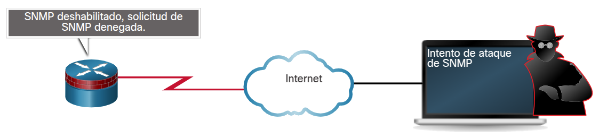
</div>

```shell
Router(config)# no snmp-server
```

## Packet Tracer - Congurar ACL de IP para mitigar ataques
* <a href="./notes/pt_configurar_acl_ip_mitigacion.md" target="_blank">Configurar ACL de IP para mitigar ataques</a>

# ACL de IPv6
## Descripción general de ACL IPv6
En los últimos años muchas redes han comenzado la transición a un entorno IPv6. Parte de la necesidad de la transición a IPv6 se debe a las debilidades inherentes a IPv4.

Lamentablemente, a medida que la migración a IPv6 continúa, los ataques a IPv6 son cada vez más generalizados. IPv4 no desaparecerá de la noche a la mañana. IPv4 coexistirá con IPv6 y luego se reemplazará gradualmente por IPv6. Esto crea posibles brechas de seguridad. Un ejemplo de una preocupación de seguridad son los actores de amenazas que aprovechan IPv4 para explotar IPv6 en entornos de doble pila. La doble pila es un método de integración en el que un dispositivo tiene conectividad tanto a redes IPv4 como a IPv6. En un entorno de doble pila los dispositivos funcionan con dos pilas de protocolo IP.

Los actores de la amenaza pueden llevar a cabo ataques sigilosos que resultan en la explotación de la confianza mediante el uso de hosts de doble pila, mensajes falsos del Protocolo de Descubrimiento de Vecinos (NDP) y técnicas de túnel. El túnel Teredo, por ejemplo, es una tecnología de transición a IPv6 que proporciona una asignación automática de direcciones IPv6 cuando los hosts IPv4/IPv6 se encuentran detrás de dispositivos de traducción de direcciones de red (NAT) IPv4. Logra esto embebiendo los paquetes IPv6 dentro de los paquetes UDP de IPv4. El actor de la amenaza gana un punto de apoyo en la red IPv4. El host comprometido envía anuncios de router (RA) falsos, lo que activa a los hosts de doble pila para obtener una dirección IPv6. El actor de la amenaza puede entonces utilizar este punto de apoyo para moverse, o pivotar, dentro de la red. El agente de amenazas puede comprometer hosts adicionales antes de devolver el tráfico fuera de la red, como se muestra en la figura.

Ejemplo de vulnerabilidad de IPv6

<div style="width: 60%;padding-left: 18%;">
	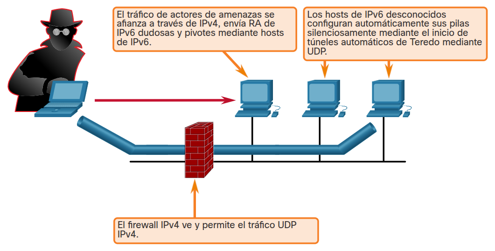
</div>

Es necesario desarrollar e implementar una estrategia para mitigar los ataques contra infraestructuras y protocolos IPv6. Esta estrategia de mitigación debe incluir el filtrado en el perímetro mediante diversas técnicas, tales como las ACL de IPv6.

## Sintaxis de ACL IPv6
La funcionalidad de ACL en IPv6 es similar a la de las ACL en IPv4. Sin embargo, no existe un equivalente a las ACL estándar de IPv4. Además, todas las ACL de IPv6 deben configurarse con un nombre. Las ACLs IPv6 permiten el filtrado basado en las direcciones de origen y destino que viajan de entrada y salida a una interfaz específica. También admiten el filtrado de tráfico basado en las cabeceras de opción de IPv6 y la información opcional de tipo de protocolo de capa superior para una mayor granularidad de control, similar a las ACL extendidas en IPv4. Para configurar una ACL de IPv6, utilice el comando ipv6 access-list para ingresar al modo de configuración de ACL de IPv6. A continuación, utilice la sintaxis que se muestra en la figura para configurar cada entrada de la lista de acceso para permitir o denegar específicamente el tráfico. La sintaxis que se muestra es una versión simplificada de la sintaxis de ACE IPv6. Hay opciones adicionales. A partir de la sintaxis proporcionada debería quedar claro que las ACL IPv6 son considerablemente más flexibles que las ACL IPv4.

Aplique una ACL IPv6 a una interfaz con el comando `ipv6 traffic-filter`.
```shell
Router(config)# ipv6 access-list access-list-name
Router(config-ipv6-acl)# deny | permit protocol {source-ipv6-prefix / prefix-length | any | host source-ipv6-address} [ operator [ port-number ]] { destination-ipv6-prefix / prefix-length | any | host destination-ipv6-address } [ operator [ port-number ]] [ dscp value ] [ fragments ] [ log ] [ log-input ] [ sequence value ] [ time-range name ]
```

__Parámetro__|__Descripción__
:-|:-
_deny / permit_|Especifica si se debe denegar o permitir el paquete.
_protocol_|Introduzca el nombre o el número de un protocolo de Internet, o un número entero que represente un número de protocolo IPv6.
_source-ipv6-prefix / prefix-length_|La red IPv6 de origen o la clase de redes para las que se establecen las condiciones de denegación o permiso.
_destination-ipv6-address / prefix length_|La red IPv6 de destino o la clase de redes para las que se establecen las condiciones de denegación o permiso.
_any_|Introduzca `any` como abreviatura del prefijo IPv6 `::/O`. Esto coincide con todas las direcciones.
_host_|Para `host source-ipv6-address` o `destination-ipv6-address`, introduzca la dirección de _host_ IPv6 de origen o destino para la que se establecen las condiciones `deny` o `permit`.
_operator_|(Opcional) Un operador que compara los puertos de origen y destino del protocolo especificado. Los operandos son `lt` (menor que), `gt` (mayor que), `eq` (igual), `neq` (no igual) y `range`.
_port number_|(Opcional) Un número decimal o el nombre de un puerto TCP o UDP para filtrar TCP o UDP, respectivamente.
_dscp_|(Opcional) Compara un valor de punto de código de servicios diferenciados con el valor de la clase de tráfico en el campo `Traffic Class` de cada cabecera depaquete IPv6. El rango aceptable es de 0 a 63.
_fragments_|(Opcional) Conicide con paquetes fragmentados no iniciales en los que la cabercera de extensión de fragmentos contiene un desplazamiento de fragmentos distinto de cero. La palabra clave `fragments` es una opción solo si no se especifican los argumentos del operador [port-number]. Cuando se utiliza esta palabra clave, también coincide con el primer fragmento no tiene información de capa 4.
_log_|(Opcional) Hace que s3e envíe a la consola un mensaje de registro informativo sobre el paquete que coincide con la entrada. (El nivel de los mensajes que se registran en la consola se controla con el comando `logging console`).
_log input_|(Opcional) Proporciona la misma función qu ela palabra clave `log`, excepto que el mensaje de registro también incluye la interfaz de entrada.
_sequence value_|(Opcional) Especifica el valor del número de secuencia para la declaración de la lista de acceso. El rango aceptable es de 1 a `4.294.967.295`.
_time-range name_|(Opcional) Especifica el rango de tiempo que se aplica a la declaración de permiso. El nombre del rango de tiempo y sus restricciones se especifican mediante los comandos `time-range` y `absolute` o `periodic`, respectivamente.

## Configurar ACL IPv6
Una ACL IPv6 contiene un `deny ipv6 any any` implícito. Cada ACL de IPv6 también contiene reglas de permiso implícitas para habilitar la detección de vecinos de IPv6. El Protocolo de Descubrimiento de Vecinos (NDP) de IPv6 requiere el uso de la capa de red de IPv6 para enviar anuncios de vecinos (NA) y solicitudes de vecinos (NS). Si un administrador configura el comando `deny ipv6 any any` sin permitir explícitamente la detección de vecinos, el NDP se deshabilitará.

En la figura, R1 está permitiendo el tráfico entrante en G0/0 desde la red 2001:DB8:1:1::/64. Los paquetes NA y NS están explícitamente permitidos. El tráfico proveniente de cualquier otra dirección IPv6 se rechaza explícitamente. Si el administrador solo configurara la primera declaración de permiso, la ACL tendría el mismo efecto. Sin embargo, es una buena práctica documentar las declaraciones implícitas configurándolas explícitamente.

<div style="width: 60%;padding-left: 18%;">
	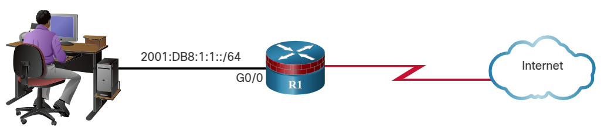
</div>

```shell
R1
Internet2001:DB8:1:1::/64G0/0
R1(config)# ipv6 access-list LAN_ONLY
R1(config-ipv6-acl)# permit 2001:db8:1:1::/64 any
R1(config-ipv6-acl)# permit icmp any any nd-na
R1(config-ipv6-acl)# permit icmp any any nd-ns
R1(config-ipv6-acl)# deny ipv6 any any
R1(config-ipv6-acl)# end
R1# show ipv6 access-list
IPv6 access list LAN_ONLY
    permit ipv6 2001:DB8:1:1::/64 any sequence 10
    permit icmp any any nd-na sequence 20
    permit icmp any any nd-ns sequence 30
    deny ipv6 any any sequence 40
R1#
```

## Packet Tracer - Congurar ACL de IPv6
* <a href="./notes/pt_configurar_acl_ipv6.md" target="_blank">Configurar ACL de IPv6</a>

# Resumen
## Introducción a las Listas de Control de Acceso
Una ACL es una serie de comandos del IOS que controlan si un router reenvía o descarta paquetes según la información que se encuentra en el encabezado del paquete. De forma predeterminada, un router no tiene ninguna ACL configurada. Una ACL es una lista secuencial de instrucciones permit (permitir) o deny (denegar), conocidas como “entradas de control de acceso” (ACE). El proceso de filtrado de paquetes se produce cuando el tráfico de red pasa a través de una interfaz configurada con una ACL, y el router compara la información del paquete con cada ACE, en orden secuencial, para determinar si el paquete coincide con una de las ACE. El filtrado de paquetes se puede realizar en la Capa 3 o en la Capa 4. Los routers Cisco soportan ACL estándar y ACL extendida. Las ACL número 1 a 99, o 1300 a 1999 son ACL estándar mientras que las ACL número 100 a 199, o 2000 a 2699 son ACL extendidas. Las ACL con nombre son el método preferido para configurar ACL. El nombre proporciona información sobre el propósito de la ACL. Las ACL definen el conjunto de reglas que proporcionan un control adicional para los paquetes que ingresan por las interfaces de entrada, para los que retransmiten a través del router y para los que salen por las interfaces de salida del router.

## Máscaras de comodín
Un ACE IPv4 utiliza una máscara wildcard de 32-bit para determinar qué bits de la dirección debe examinar para obtener una coincidencia. Las máscaras wildcard también son utilizadas por el protocolo de enrutamiento OSPF. Una máscara wildcard es similar a una máscara de subred, ya que utiliza el proceso AnDing para identificar los bits de una dirección IPv4 que deben coincidir. Sin embargo, difieren en la forma en que coinciden binarios 1s y 0s. Sin embargo, a diferencia de una máscara de subred en la que el 1 binario equivale a una coincidencia y el 0 binario no es una coincidencia, en las máscaras wildcard es al revés. Un método rápido para calcular las máscaras wildcard es restar la máscara de subred de `255.255.255.255`. Cisco IOS proporciona dos palabras clave, `host` y `any`, para simplificar los usos más comunes del enmascaramiento wildcard. Las palabras clave reducen las pulsaciones de teclas ACL y facilitan la lectura del ACE.

## Configurar ACL
Cuando se configura una ACL compleja, se sugiere utilizar un editor de texto y escribir los detalles de la política que se va a implementar, añadir los comandos de configuración del IOS para realizar esas tareas, incluir comentarios para documentar la ACL, y copiar y pegar los comandos en el dispositivo. Pruebe siempre a fondo una ACL para asegurarse de que aplica correctamente la política deseada. Para crear una ACL estándar numerada, utilice el comando `access-list access-list-number {deny | permit remark text} source [source-wildcard] [log]`. Para crear una ACL estándar con nombre, utilice el comando `ip access-list standard access-list-name`. Los nombres de las ACL son alfanuméricos, distinguen mayúsculas de minúsculas y deben ser únicos. Los pasos del procedimiento para configurar ACL extendidas son los mismos que para las ACL estándar. El comando para aplicar una ACL IPv4 extendida a una interfaz es el mismo que se utiliza para las ACL IPv4 estándar y es `ip access-group {access-list-number | access-list-name} {in | out}`. Las ACL extendidas pueden filtrar en muchos tipos diferentes de protocolos y puertos de Internet. TCP también puede realizar servicios básicos de firewall stateful utilizando la palabra clave TCP established. La palabra clave permite que el tráfico interno salga de la red privada interna y permite que el tráfico de respuesta devuelta entre en la red privada interna.

## Sintaxis de ACL con nombre estándar IPv4
Las ACL con varias ACE deben crearse en un editor de texto. Esto le permite planificar las ACE requeridas, crear la ACL, y luego pegarla en la interfaz del router, y hace que la edición de la ACL sea más sencilla. Una ACE ACL también se puede eliminar o agregar utilizando los números de secuencia ACL. Los números de secuencia se asignan automáticamente cuando se introduce una ACE. Estos números se muestran en el comando `show access-list`.

## Implementar ACL
Al configurar y aplicar una ACL, tenga en cuenta las pautas resumidas en esta lista:
* Cree una ACL a nivel global y luego aplíquela.
* Asegúrese de que la última declaración sea un `deny any` implícito o `deny ip any any`.
* Recuerde que el orden de las instrucciones es importante porque las ACL se procesan de arriba hacia abajo.
* En cuanto una sentencia coincide, se sale de la ACL.
* Siempre filtre de lo más específico a lo más genérico. Por ejemplo, deniegue un host específico y luego permita todos los demás hosts.
* Recuerde que solo se permite una ACL por interfaz, protocolo y dirección.
* Recuerde que las declaraciones nuevas para una ACL existente se agregan al final de la ACL de forma predeterminada.
* Recuerde que los paquetes generados por el router no son filtrados por las ACL salientes.
* Coloque las ACL estándar lo más cerca posible del destino.
* Coloque las ACL extendidas lo más cerca posible del origen.

Cada ACL debe colocarse donde sea más eficiente. Las ACL extendidas deben ubicarse lo más cerca posible del origen del tráfico que se desea filtrar. Las ACL estándar deben aplicarse lo más cerca posible del destino. Los factores que influyen en la colocación de ACL son el grado de control organizativo, el ancho de banda de las redes implicadas y la facilidad de configuración.

## Mitigar ataques con ACL
Las ACL pueden utilizarse para mitigar muchas amenazas de red, tales como la suplantación de direcciones IP y los ataques DoS. Una estrategia eficaz para mitigar los ataques es permitir explícitamente solo ciertos tipos de tráfico a través de un firewall. El router debe bloquear los mensajes entrantes de eco y redireccionamiento de ICMP. Si el SNMP es necesario, la explotación de las vulnerabilidades del SNMP se puede mitigar aplicando ACLs de interfaz para filtrar los paquetes SNMP de los sistemas no autorizados. Se recomiendan varios mensajes ICMP para el correcto funcionamiento de la red y deben ser permitidos en la red interna, incluyendo echo reply, source quench y unreachable. Se debe permitir la salida de varios mensajes ICMP de la red, incluyendo echo, parameter problem, packet too big y source quench. Como regla, bloquea todos los demás tipos de mensajes ICMP salientes.

## ACL de IPv6
IPv6 tiene varias características que cumplen con los requisitos de red actuales: IPsec, IP móvil, RSVP y escalabilidad de direcciones. La doble pila es un método de integración en el que un dispositivo tiene conectividad tanto a redes IPv4 como a IPv6. En un entorno de doble pila los dispositivos funcionan con dos pilas de protocolo IP. Los atacantes pueden llevar a cabo ataques sigilosos que resultan en la explotación de la confianza mediante el uso de hosts de doble pila, mensajes NDP falsos y técnicas de tunneling. Para mitigar los ataques contra las infraestructuras y los protocolos IPv6, la estrategia debe incluir el filtrado en el borde mediante diversas técnicas, como las ACL IPv6. La funcionalidad de ACL en IPv6 es similar a la de las ACL en IPv4. Sin embargo, no existe un equivalente a las ACL estándar de IPv4. Además, todas las ACL de IPv6 deben configurarse con un nombre. Las ACLs IPv6 permiten el filtrado basado en las direcciones de origen y destino que viajan de entrada y salida a una interfaz específica. También admiten el filtrado de tráfico basado en las cabeceras de opción de IPv6 y la información opcional de tipo de protocolo de capa superior para una mayor granularidad de control, similar a las ACL extendidas en IPv4.

# Enlaces de interés
<br />
<br />
<br />
<br />
<br />
<br />
<br />
<br />
<br />
<br />
<br />
<a href="#4-listas-de-control-de-acceso">⬆️</a>
<a href="./00-Curso.md"><< Menú principal del módulo</a>