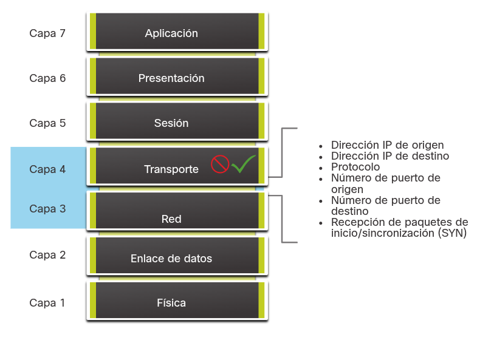
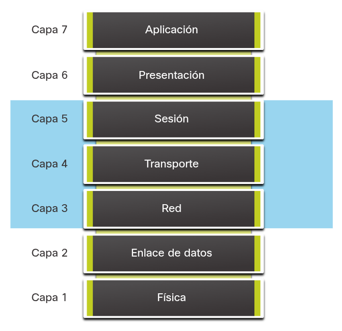
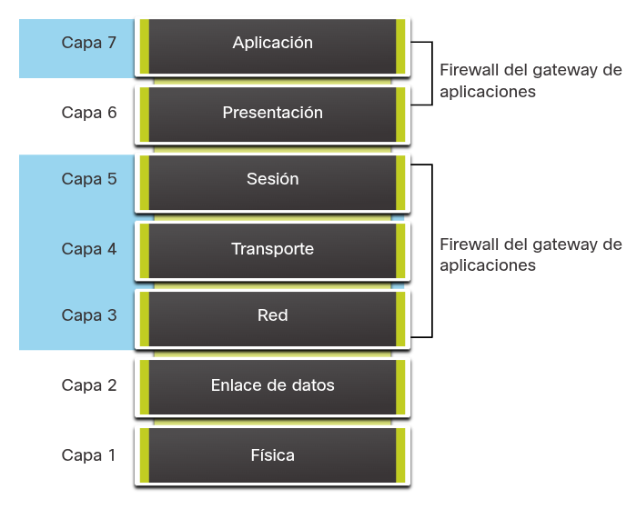
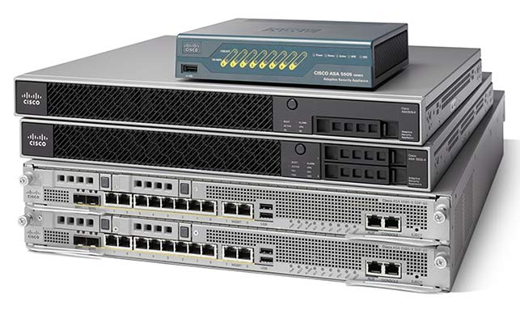
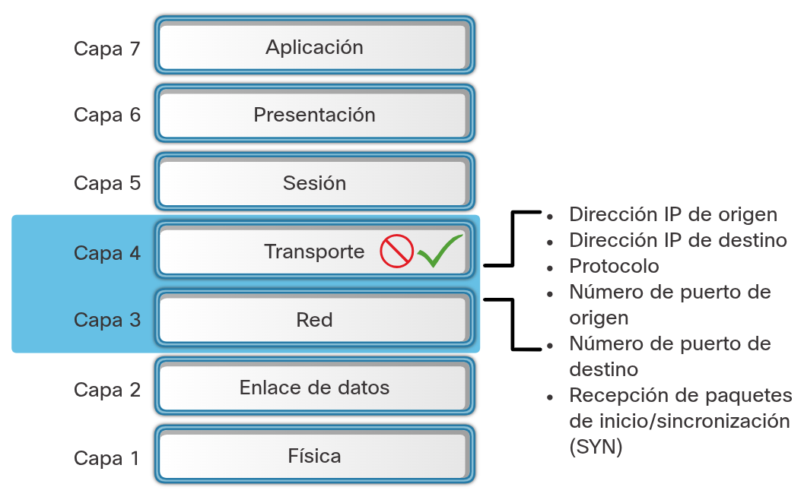
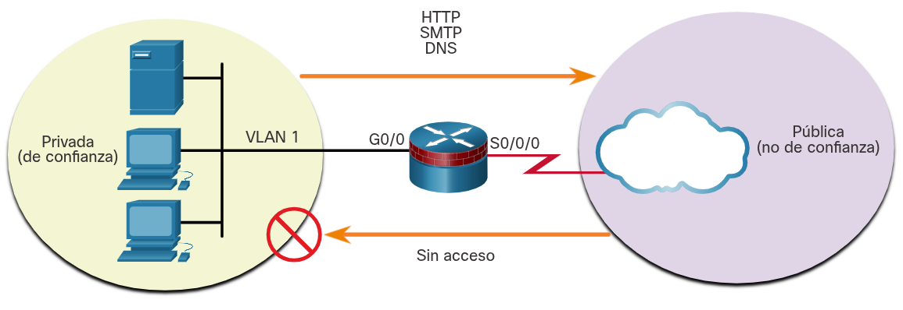
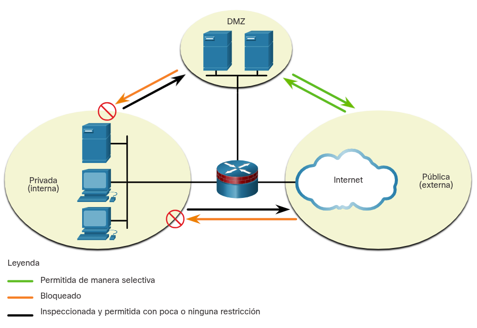
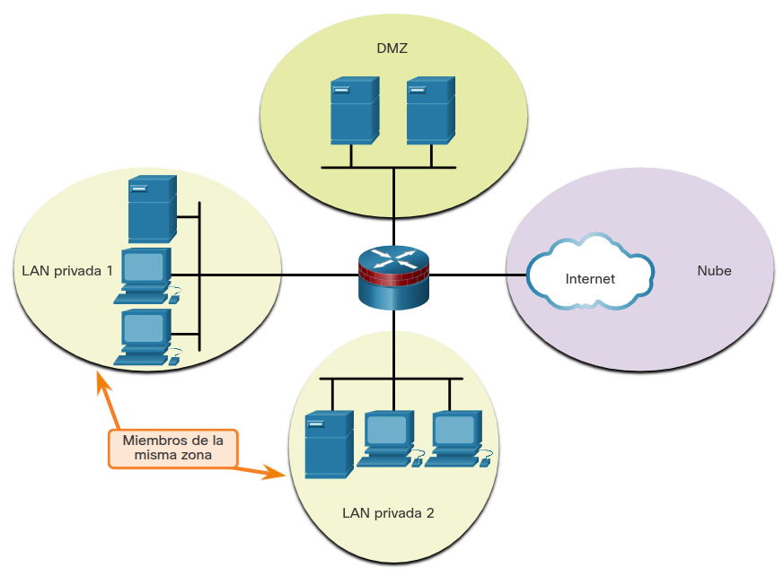

<a href="./00-Curso.md"><< Menú principal del módulo</a>

# 5. Tecnologías de firewall
# Redes seguras con firewalls
## Firewalls
Un firewall es un sistema o grupo de sistemas que impone una política de control de acceso entre redes.
* __Permitir__:
	* El tráfico de toda dirección externa al servidor web.
	* El tráfico al servidor FTP.
	* El tráfico al servidor SMTP.
	* El tráfico al servidor IMAP interno.
* __Denegar__:
	* Todo el tráfico entrante con direcciones de red que coincidan con las direcciones IP internas registradas.
	* Todo el tráfico entrante al servidor proveniente de direcciones externas.
	* Todo el tráfico entrante de solicitudes de eco de ICMP.
	* Todas las consultas entrantes de MS Active Directory.
	* Todas las consultas de tráfico entrante al servidor MS-SQL.
	* Todas las difusiones locales de dominios de MS.

### Propiedades comunes del firewall
Todos los firewalls comparten algunas propiedades comunes:
* Los firewalls resisten ataques de red.
* Los firewalls son el único punto de tránsito entre las redes corporativas internas y las redes externas porque todo el tráfico circula por ellos.
* Los firewalls aplican la política de control de acceso.

### Ventajas del firewall
Los firewalls en una red brindan numerosos beneficios:
* Evitan la exposición de hosts, recursos y aplicaciones confidenciales a usuarios no confiables.
* Sanean el flujo de protocolos, lo que evita el aprovechamiento de las fallas de protocolos.
* Bloquean los datos maliciosos de servidores y clientes.
* Simplifican la administración de la seguridad, ya que la mayor parte del control del acceso a redes se deriva a unos pocos firewalls de la red.

### Limitaciones del firewall
* Un firewall mal configurado puede tener graves consecuencias para la red, por ejemplo, convertirse en un punto único de falla.
* Los datos de muchas aplicaciones no se pueden transmitir con seguridad mediante firewalls.
* Los usuarios pueden buscar maneras de esquivar el firewall para recibir material bloqueado, lo que expone a la red a posibles ataques.
* Puede reducirse la velocidad de la red.
* El tráfico no autorizado se puede tunelizar u ocultar como tráfico legítimo a través del firewall.

## Tipos de firewalls
Es importante entender los diferentes tipos de firewalls y sus capacidades específicas, de modo que se utilice el firewall adecuado para cada situación.

### Firewall para el filtrado de paquetes (sin estado)
Los firewalls de filtrado de paquetes suelen formar parte de un firewall de router, que autoriza o rechaza el tráfico a partir de la información de las capas 3 y 4. Son firewalls sin estado que utilizan una simple búsqueda en la tabla de políticas que filtra el tráfico según criterios específicos.

Por ejemplo, los servidores SMTP escuchan el puerto 25 de manera predeterminada. Un administrador puede configurar el firewall de filtrado de paquetes para bloquear el puerto 25 desde una estación de trabajo específica a fin de evitar que difunda un virus por correo electrónico.

	

### Firewall activo
Los firewalls con estado son los más versátiles y las tecnologías de firewall más comúnmente usadas. Los firewalls activos proporcionan un filtrado de paquetes utilizando la información de conexión que se mantiene en una tabla de estados. El filtrado con estado es una arquitectura de firewall que se clasifica en la capa de red. También analiza el tráfico en las capas 4 y 5 de OSI.

	

### Firewall del gateway de aplicaciones
Un firewall de gateway de aplicaciones (firewall proxy), como se muestra en la figura, filtra la información en las capas 3, 4, 5 y 7 del modelo de referencia OSI. La mayor parte del control y filtrado del firewall se realiza en el software. Cuando un cliente necesita tener acceso a un servidor remoto, se conecta a un servidor proxy. El servidor proxy se conecta al servidor remoto en nombre del cliente. Por lo tanto, el servidor solamente ve una conexión desde el servidor proxy.

	

### Firewall de próxima generación
Los firewalls de próxima generación (NGFW - _Next Generation Firewall_) van más allá de los firewalls con estado y ofrecen lo siguiente:
* Prevención de intrusiones integrada.
* Control y reconocimiento de aplicaciones para ver y bloquear aplicaciones riesgosas.
* Rutas de actualización para incluir futuros datos de información.
* Técnicas para afrontar amenazas de seguridad en constante evolución.

	

Otros métodos de implementación de firewall incluyen los siguientes:
* __Firewall basado en host (servidor y personal)__. Una PC o servidor con software de firewall ejecutándose en él.
* __Firewall transparente__. Filtra el tráfico IP entre un par de interfaces puenteadas.
* __Firewall híbrido__. Una combinación de los distintos tipos de firewall. Por ejemplo, un firewall de inspección de aplicación combina un firewall con estado y un firewall de gateway de aplicación.

## Beneficios y limitaciones del firewall de filtrado de paquetes (sin estado)
Los firewalls de filtrado de paquetes suelen formar parte de un firewall de router, que autoriza o rechaza el tráfico a partir de la información de las capas 3 y 4. Son firewalls sin estado que utilizan una búsqueda de tabla de políticas simple que filtra el tráfico según criterios específicos, como se ve en la figura. Por ejemplo, los servidores SMTP escuchan el puerto 25 de manera predeterminada. Un administrador puede configurar el firewall de filtrado de paquetes para bloquear el puerto 25 desde una estación de trabajo específica a fin de evitar que difunda un virus por correo electrónico.

	

Existen varias ventajas de usar un firewall de filtrado de paquetes:
* Los filtros de paquetes implementan conjuntos simples de reglas de permiso o denegación.
* Los filtros de paquetes tienen un bajo impacto en el rendimiento de la red.
* Los filtros de paquetes son fáciles de implementar y son compatibles con la mayoría de los routers.
* Los filtros de paquetes proporcionan un grado inicial de seguridad en la capa de red.
* Los filtros de paquetes realizan casi todas las tareas de un firewall de gama alta a un costo mucho menor.

Los filtros de paquetes no representan una solución de firewall completa, pero son un elemento importante de una política de seguridad de firewall. Existen varias desventajas de usar un firewall de filtrado de paquetes:
* Los filtros de paquetes son susceptibles a la suplantación de IP. Los atacantes pueden enviar paquetes arbitrarios que cumplan con los criterios de la ACL y pasar por el filtro.
* Los filtros de paquetes no filtran de manera confiable los paquetes fragmentados. Dado que los paquetes IP fragmentados llevan el encabezado TCP en el primer fragmento y los filtros de paquetes filtran la información del encabezado TCP, todos los fragmentos después del primero pasan sin condiciones. Las decisiones de usar filtros de paquetes suponen que el filtro del primer fragmento aplica con precisión la política.
* Los filtros de paquetes utilizan ACL complejas, que pueden ser difíciles de implementar y mantener.
* Los filtros de paquetes no pueden filtrar dinámicamente ciertos servicios. Por ejemplo, las sesiones que utilizan negociaciones de puerto dinámicas son difíciles de filtrar sin abrir el acceso a una amplia gama de puertos.

Los filtros de paquetes no tienen estado. Examinan cada paquete individualmente y no en el contexto del estado de una conexión.

## Beneficios y limitaciones del firewall con estado
El uso de un firewall con estado en una red tiene varias ventajas:
* Los firewalls con estado se utilizan a menudo como medio principal de defensa, filtrando el tráfico no deseado, innecesario o indeseable.
* Los firewalls con estado refuerzan el filtrado de paquetes proporcionando un control más estricto de la seguridad.
* Los firewalls con estado mejoran el rendimiento en comparación con los filtros de paquetes o los servidores proxy.
* Los firewalls con estado protegen contra la suplantación de identidad y los ataques de denegación de servicio determinando si los paquetes pertenecen a una conexión existente o provienen de una fuente no autorizada.
* Los firewalls con estado proporcionan más información de registro que un firewall de filtrado de paquetes.

Los firewalls con estado también tienen algunas limitaciones:
* Los firewalls con estado no pueden evitar ataques de la capa de aplicaciones porque no examinan el contenido real de la conexión HTTP.
* No todos los protocolos tienen estado. Por ejemplo, UDP e ICMP no generan información de conexión para una tabla de estado y, por lo tanto, no tienen tanto soporte para el filtrado.
* Es difícil realizar un seguimiento de las conexiones que utilizan la negociación dinámica de puertos. Algunas aplicaciones abren varias conexiones. Esto requiere un rango completamente nuevo de puertos que se deben abrir para permitir esta segunda conexión.
* Los firewalls con estado no admiten la autenticación de usuarios.

__Beneficios__|__Limitaciones__
:-|:-
Principal medio de defensa|No hay inspección de la capa de aplicación
Fuerte filtrado de paquetes|Seguimiento limitado de los protocolos sin estado
Mejor rendimiento que los filtros de paquetes|Difícil de defender contra la negociación dinámica de puertos
Defiende contra la suplantación de identidad y los ataques DoS| No hay soporte de autenticación
Registro de datos más rico|

# Firewalls en el diseño de redes
## Arquitecturas de seguridad comunes
Principalmente, el diseño de firewall tiene por objetivo permitir o denegar el tráfico según el origen, el destino y el tipo de tráfico. Algunos diseños son tan simples y solo consisten en diseñar una red externa y una interna, que son determinadas por dos interfaces en un firewall.

Aquí hay tres diseños comunes de firewall.

### Privado y público
Como se ve en la Figura, la red pública (o externa) no es de confianza y la red privada (o interna) es de confianza.

Normalmente, un firewall con dos interfaces se configura del siguiente modo:
* El tráfico procedente de la red privada se autoriza e inspecciona mientras viaja hacia la red pública. También se autoriza el tráfico inspeccionado que regresa de la red pública y está relacionado con el tráfico que se originó en la red privada.
* Generalmente, se bloquea el tráfico procedente de la red pública que viaja hacia la red privada.

	

### Zona perimetral
Una zona perimetral (DMZ - _Demilitarized Zone_) es un diseño de firewall donde, normalmente, hay una interfaz interna conectada a la red privada, una interfaz externa conectada a la red pública y una interfaz de DMZ, como se ve en la figura.

* El tráfico procedente de la red privada se inspecciona mientras viaja hacia la red pública o la DMZ. Este tráfico se permite casi sin restricciones. También se permite el tráfico inspeccionado que regresa a la red privada desde la DMZ o la red pública.
* Con frecuencia, se bloquea el tráfico procedente de la DMZ que viaja hacia la red privada.
* El tráfico procedente de la DMZ y que viaja hacia la red pública se permite, siempre y cuando cumpla con los requisitos de servicio.
* El tráfico procedente de la red pública que viaja hacia la DMZ se permite de manera selectiva y se inspecciona. Este tipo de tráfico suele ser de correo electrónico, DNS, HTTP o HTTPS. Se permite de manera dinámica el tráfico que regresa de la DMZ a la red pública.
* Se bloquea el tráfico procedente de la red pública que viaja hacia la red privada.

	

### Firewall de políticas basados en zonas
En los firewalls de políticas basadas en zonas (ZPF - _Zone-based policy firewalls_) se utiliza el concepto de zonas para ofrecer mayor flexibilidad. Una zona es un grupo de al menos una interfaz con funciones o características similares. Las zonas ayudan a especificar dónde se debe implementar una regla o política de firewall. En la figura, las políticas de seguridad para las redes LAN 1 y LAN 2 son similares y pueden agruparse en una zona para las configuraciones de firewall. De manera predeterminada, el tráfico entre interfaces en la misma zona no está sujeto a ninguna política y pasa libremente. Sin embargo, se bloquea todo el tráfico de zona a zona. Con el fin de permitir el tráfico entre zonas, debe configurarse una política que permita o inspeccione el tráfico.

La única excepción a esta política predeterminada de denegar todo (deny any) es la auto-zona del router. La zona autónoma del router es el router en sí mismo e incluye todas las direcciones IP de interfaz de router. Las configuraciones de políticas que incluyen la zona autónoma se aplican al tráfico hacia el router y procedente de él. De manera predeterminada, no hay ninguna política para este tipo de tráfico. El tráfico que debe tenerse en cuenta al diseñar una política para la zona autónoma incluye el tráfico del plano de control y del plano de administración, como SSH, SNMP y protocolos de enrutamiento.

	

## Defensa por capas
1. __Seguridad principal de la red__. Protege contra software malicioso y anomalías de tráfico, aplica políticas de red y garantiza la supervivencia.
2. __Seguridad perimetral__. Protege los límites entre zonas.
3. __Seguridad de las comunicaciones__. Proporciona seguridad de la información.
4. __Seguridad de terminales__. Proporciona identidad y cumplimiento de políticas de seguridad de dispositivos.

Una defensa en capas utiliza diferentes tipos de firewalls que se combinan en capas para agregar profundidad a la seguridad de una organización. Las políticas se pueden aplicar entre las capas y dentro de las capas. Estos puntos de aplicación de políticas determinan si el tráfico se reenvía o se descarta. Por ejemplo, el tráfico que proviene de la red no confiable primero encuentra un filtro de paquetes en el router de borde. Si la política lo permite, el tráfico pasa al firewall de detección o al sistema de host de bastión que aplica más reglas al tráfico y descarta los paquetes sospechosos. Un host de bastión es una computadora reforzada que generalmente se encuentra en la DMZ. Luego, el tráfico va a un router de detección interior. El tráfico pasa al host de destino interno solo después de pasar correctamente por todos los puntos de aplicación de políticas entre el router externo y la red interna. Este tipo de configuración de DMZ se denomina configuración de subred filtrada.

Un enfoque de defensa por capas no es todo lo que se necesita para garantizar una red interna segura. Un administrador de red debe considerar muchos factores a la hora de construir una defensa completa en profundidad:
* Los firewalls generalmente no detienen las intrusiones que provienen de hosts dentro de una red o zona.
* Los firewalls no protegen contra las instalaciones de puntos de acceso fraudulentos.
* Los firewalls no reemplazan los mecanismos de respaldo y recuperación de desastres como resultado de ataques o fallas de hardware.
* Los firewalls no pueden sustituir a usuarios y administradores informados.

Esta lista parcial de mejores prácticas puede servir como punto de partida para una política de seguridad de firewall.
* Coloque firewalls en los límites de seguridad. Los firewalls son una parte fundamental de la seguridad de la red, pero no es prudente confiar exclusivamente en un firewall para la seguridad.
* Denegar todo el tráfico por defecto.
* Permitir solo los servicios que sean necesarios.
* Asegurarse de controlar el acceso físico al firewall.
* Monitorear regularmente los registros de firewall.
* Practicar la gestión de cambios para los cambios de configuración del firewall.
* Recuerde que los firewalls protegen principalmente contra ataques técnicos que se originan desde el exterior.

# Resumen
## Redes seguras con firewalls
Hay varios tipos diferentes de firewalls. Los firewalls de filtrado de paquetes (sin estado) proporcionan filtrado de Capa 3 y, a veces, de Capa 4. Una inspección de estado de firewall permite o bloquea el tráfico basado en estado, puerto, y protocolo. Firewall de gateway de aplicación (firewall proxy) filtra la información de capa 3, 4, 5 y 7. Los firewalls de próxima generación proporcionan servicios adicionales más allá de los gateways de aplicaciones, como la prevención de intrusiones integrada, el conocimiento y control de las aplicaciones para ver y bloquear las aplicaciones de riesgo, el acceso a futuras fuentes de información y las técnicas para hacer frente a las amenazas de seguridad en desarrollo.

## Firewalls en el diseños de redes
Las arquitecturas de seguridad comunes definen los límites del tráfico que entra y sale de la red. Si echamos un vistazo a una topología que tiene acceso a redes externas o públicas, debemos ser capaces de determinar la arquitectura de seguridad. Algunos diseños son tan simples y solo consisten en diseñar una red externa y una interna, que son determinadas por dos interfaces en un firewall. Las redes que requieren acceso público a servicios a menudo tienen una DMZ a la que puede acceder el público, mientras que bloquean estrictamente el acceso a la red interna. Los ZPF emplean el concepto de las zonas para brindar más flexibilidad. Una zona es un grupo de una o más interfaces que tienen funciones similares, características y requerimientos de seguridad. Un enfoque de seguridad por capas utiliza firewalls y otras medidas de seguridad para proporcionar seguridad en diferentes capas funcionales de la red.

# Enlaces de interés
 
 
 
 
 
 
 
 
 
 
 
<a href="#5-tecnologías-de-firewall">⬆️</a>
<a href="./00-Curso.md"><< Menú principal del módulo</a>