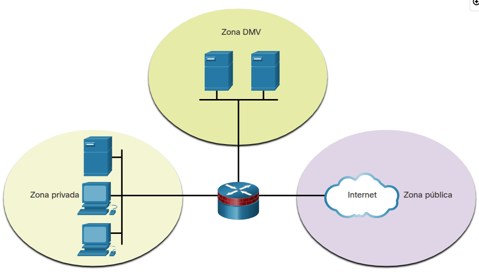
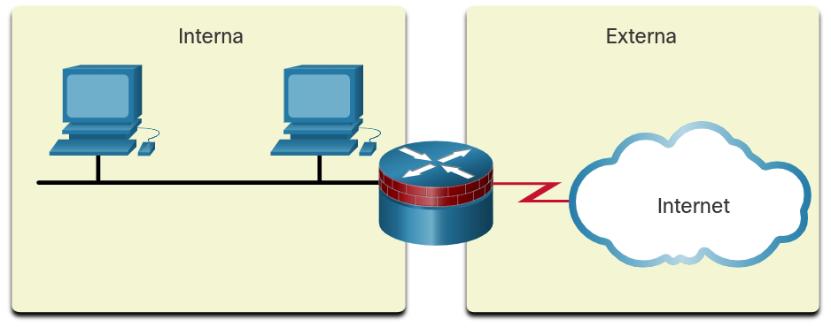
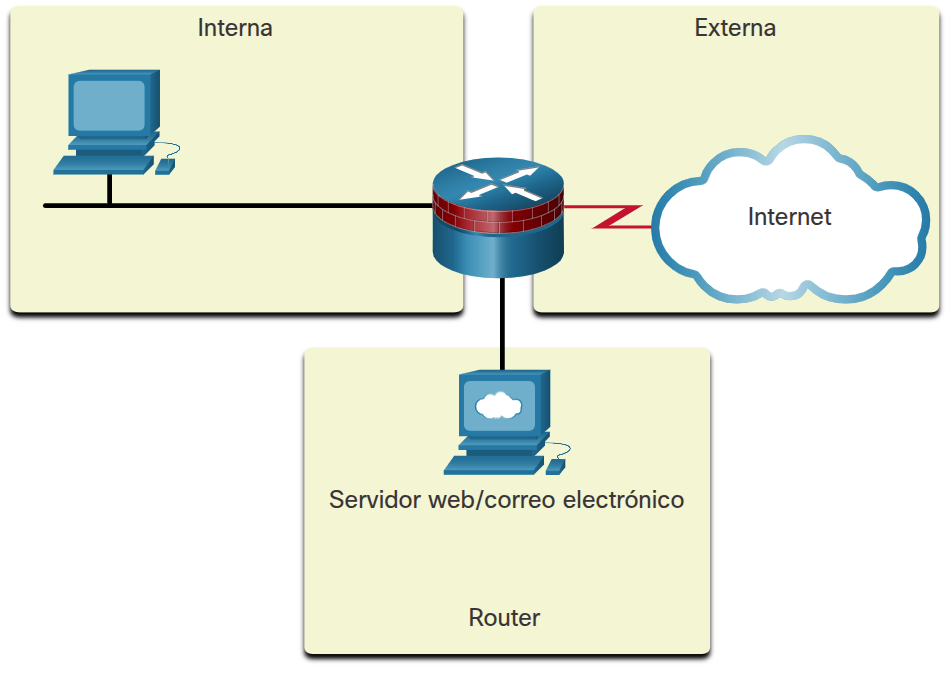
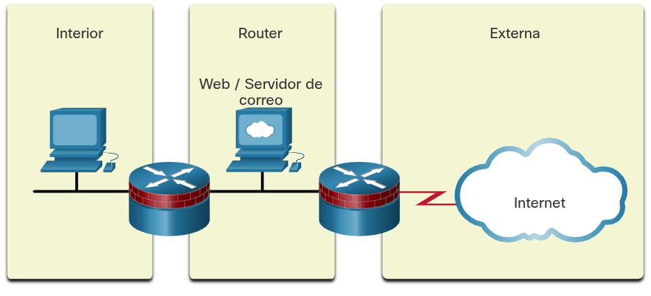
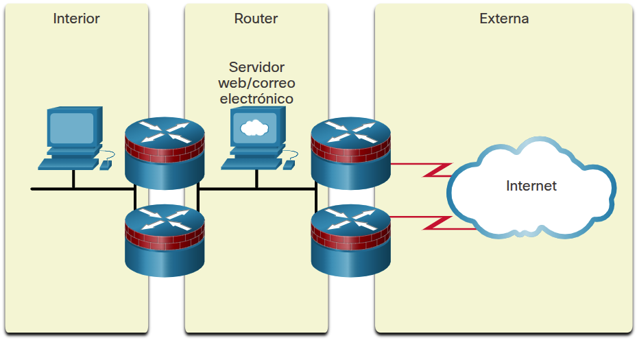
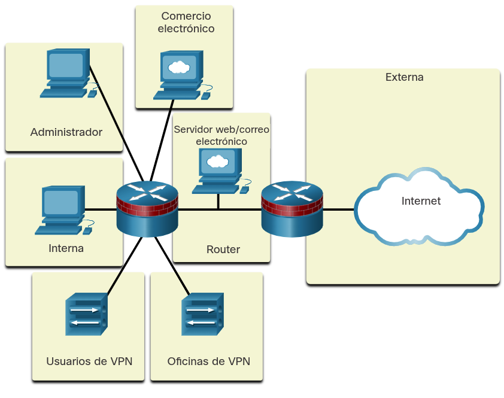
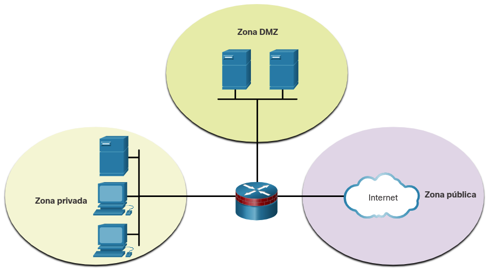
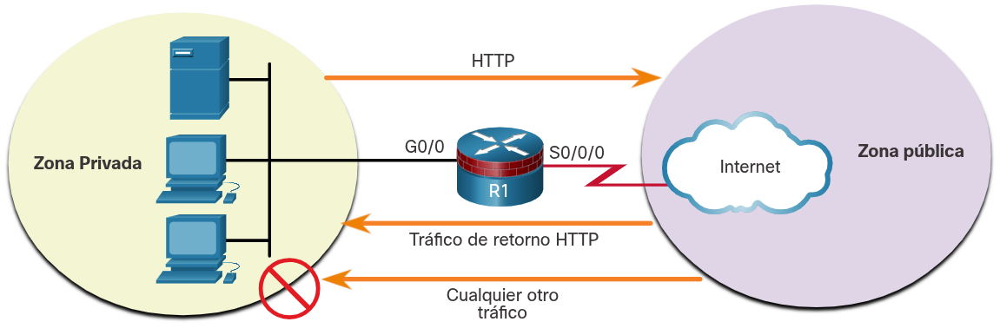

<a href="./00-Curso.md"><< Menú principal del módulo</a>

# 6. Firewalls de políticas basadas en zonas
# Visión general de ZPF
## Beneficios de un ZPF
Hay dos modelos de configuración para Cisco IOS Firewall:

* __Classic Firewall__. El modelo de configuración tradicional en el que la política de firewall se aplica en las interfaces.
* ___Zone-based Policy Firewall_ (ZPF)__. El modelo de configuración en el que las interfaces se asignan a zonas de seguridad, y la política de firewall se aplica al tráfico que se mueve entre las zonas.

Si se añade una interfaz adicional a la zona privada, los hosts conectados a la nueva interfaz en la zona privada pueden pasar tráfico a todos los hosts de la interfaz existente en la misma zona. En la figura se muestra una red simple de tres zonas.

<div style="width: 47%;padding-left: 23%;">
	
</div>

Las principales motivaciones para que los profesionales de seguridad de redes migren al modelo ZPF son la estructura y la facilidad de uso. El enfoque estructurado es útil para la documentación y la comunicación. La facilidad de uso hace que las implementaciones de seguridad de la red sean más accesibles para una comunidad más grande de profesionales de seguridad.

Las ventajas de una ZPF son varias:

* No depende de las ACL.
* La postura de seguridad del router es bloquear, a menos que se permita explícitamente.
* Las políticas son fáciles de leer y corregir con Cisco Common Classification Policy Language (C3PL). C3PL es un método estructurado para crear políticas de tráfico basadas en eventos, condiciones y acciones. Esto proporciona escalabilidad porque una política afecta cualquier tráfico dado, en lugar de necesitar varias ACL y acciones de inspección para diferentes tipos de tráfico.
* Las interfaces virtuales y físicas pueden agruparse en zonas.
* Las políticas se aplican al tráfico unidireccional entre zonas.

Al decidir si se debe implementar IOS Classic Firewall o un ZPF es importante tener en cuenta que ambos modelos de configuración pueden habilitarse simultáneamente en un router. Sin embargo, los modelos no se pueden combinar en una sola interfaz. Por ejemplo, una interfaz no puede ser configurada simultáneamente como miembro de una zona de seguridad y para la inspección de IP.

## Diseño de ZPF
El diseño de ZPF implica varios pasos:
* __Paso 1. Determinar las zonas__. El administrador se centra en la separación de la red en zonas. Las zonas establecen las fronteras de seguridad de la red. Una zona define una frontera donde el tráfico se somete a las restricciones de las políticas al pasar a otra región de la red. Por ejemplo, la red pública sería una zona y la red interna sería otra zona.
* __Paso 2. Establecer políticas entre zonas__. Para cada par de zonas de 'origen-destino' (por ejemplo, de la red interna a Internet externa), defina las sesiones que los clientes en las zonas de origen pueden solicitar a los servidores en las zonas de destino. Estas sesiones suelen ser sesiones TCP y UDP, pero también pueden ser sesiones ICMP tales como el eco ICMP. Para el tráfico que no se basa en el concepto de sesiones, el administrador debe definir flujos de tráfico unidireccionales desde el origen hasta el destino y viceversa. Las políticas son unidireccionales y se definen en función de las zonas de origen y destino conocidas como pares de zonas.
* __Paso 3. Diseñar la infraestructura física__. Después de identificar las zonas y documentar los requisitos de tráfico entre ellas, el administrador debe diseñar la infraestructura física. El administrador debe tener en cuenta los requisitos de seguridad y disponibilidad al diseñar la infraestructura física. Esto incluye dictar la cantidad de dispositivos entre las zonas más seguras y las menos seguras y determinar los dispositivos redundantes.
* __Paso 4. Identificar subconjuntos dentro de zonas y combinar requisitos de tráfico__. Para cada dispositivo de firewall en el diseño, el administrador debe identificar los subconjuntos de zonas que están conectados a sus interfaces y combinar los requisitos de tráfico para esas zonas. Por ejemplo, varias zonas pueden estar asociadas indirectamente a una sola interfaz de firewall. Esto daría lugar a una política entre zonas específica del dispositivo. Aunque es una consideración importante, la implementación de subconjuntos de zonas está más allá del alcance de este currículum.

### Ejemplos de diseño de ZPF
* __LAN a Internet__
	<div style="width: 47%;padding-left: 23%;">
		
	</div>

* __Firewall con servidores públicos 1__
	<div style="width: 47%;padding-left: 23%;">
		
	</div>

* __Firewall con servidores públicos 2__
	<div style="width: 47%;padding-left: 23%;">
		
	</div>

* __Firewalls redundantes__
	<div style="width: 47%;padding-left: 23%;">
		
	</div>

* __Firewall complejo__
	<div style="width: 47%;padding-left: 23%;">
		
	</div>

# Funcionamiento de ZPF
## Acciones de ZPF
Las políticas identifican las acciones que ZPF realizará en el tráfico de red. Se pueden configurar tres acciones posibles para procesar el tráfico por protocolo, zonas de origen y destino (pares de zonas) y otros criterios.
* __Inspecciona__. Realiza la inspección de paquetes de Cisco IOS _stateful_.
* __Descarta__. Esto es análogo a una declaración __denegar__ en una ACL. Hay disponible una opción _log_ para registrar los paquetes rechazados.
* __Pasa__. Esto es análogo a una declaración __permitir__ en una ACL. La acción _Pasa_ no realiza un seguimiento del estado de las conexiones o sesiones dentro del tráfico.

## Reglas para el tráfico de tránsito
Las reglas dependen de si las interfaces de entrada y salida son miembros de la misma zona:
* Si ninguna de las interfaces es miembro de la zona, la acción resultante es pasar el tráfico.
* Si ambas interfaces son miembros de la misma zona, la acción resultante es pasar el tráfico.
* Si una interfaz es miembro de una zona, pero la otra no, la acción resultante es eliminar el tráfico, independientemente de si existe un par de zonas.
* Si ambas interfaces pertenecen al mismo par de zonas y existe una política, la acción resultante es inspeccionar, permitir o descartar según lo definido por la política.

La tabla resume estas reglas.

¿Interfaz de origen miembro de la zona?|¿Interfaz de destino miembro de la zona?|¿Existe un par de zonas?|¿Existe una política?|Resultado
:-|:-|:-|:-|:-
NO|NO|NO DISPONIBLE|NO DISPONIBLE|PASA
SI|NO|NO DISPONIBLE|NO DISPONIBLE|DESCARTA
NO|SI|NO DISPONIBLE|NO DISPONIBLE|DESCARTA
SI (privado)|SI (privado)|NO DISPONIBLE|NO DISPONIBLE|PASA
SI (privado)|SI (público)|NO|NO DISPONIBLE|DESCARTA
SI (privado)|SI (público)|SI|NO|PASA
SI (privado)|SI (público)|SI|SI|INSPECCIONA

El tráfico que transita por las interfaces del router está sujeto a varias reglas que rigen el comportamiento de la interfaz. Para el ejemplo de tráfico de tránsito, consulte la topología mostrada en la figura.

<div style="width: 47%;padding-left: 23%;">
	
</div>

## Reglas para el tráfico a la Self Zone
La self zone es el propio router e incluye todas las direcciones IP asignadas a las interfaces del mismo. Este es el tráfico que se origina en el router o se dirige a una interfaz de router. Específicamente, el tráfico es para la administración de dispositivos, por ejemplo SSH, o para el control de reenvío de tráfico, como el tráfico del protocolo de routing. Las reglas para un ZPF son diferentes para la self zone. Para el ejemplo de tráfico de self zone consulte la topología mostrada en la figura anterior.

Las reglas dependen de si el router es el origen o el destino del tráfico, como se muestra en la tabla. Si el router es el origen o el destino, entonces se permite todo el tráfico. La única excepción es si el origen y el destino son un par de zonas con una política de servicio específica. En ese caso, la política se aplica a todo el tráfico.

¿Interfaz de origen miembro de la zona?|¿Interfaz de destino miembro de la zona?|¿Existe un par de zonas?|¿Existe una política?|Resultado|
:-|:-|:-|:-|:-|
SI (self zone)|SI|NO|NO DISPONIBLE|PASA
SI (self zone)|SI|SI|NO|PASA
SI (self zone)|SI|SI|SI|INSPECCIONA
SI|SI (self zone)|NO|NO DISPONIBLE|PASA
SI|SI (self zone)|SI|NO|PASA
SI|SI (self zone)|SI|SI|INSPECCIONA

# Configurar ZPF
## Configurar un ZPF
* Paso 1: Cree las zonas.
* Paso 2: Identifique el tráfico con un mapa de clase.
* Paso 3: Defina una acción con un mapa de políticas.
* Paso 4: Identifique un par de zonas y relaciónelo con un mapa de políticas.
* Paso 5: Asigne zonas a las interfaces correspondientes.

La topología que se muestra en la figura se utilizará en el resto de este tema para demostrar la configuración de ZPF. No se requiere la secuencia de pasos. Sin embargo, algunas configuraciones deben completarse en orden. Por ejemplo, se debe configurar un class-map antes de asignarlo a un policy-map. De manera similar, no se puede asignar un policy-map a un zone-pair hasta que se configura la política. Si se intenta configurar una sección que depende de otra parte de la configuración que aún no se configuró, el router responde con un mensaje de error.

<div style="width: 50%;padding-left: 20%;">
	
</div>

## Paso 1. Crear las zonas
El primer paso es crear las zonas. Sin embargo, antes de crear las zonas responda algunas preguntas:
* ¿Qué interfaces se deben incluir en las zonas?
* ¿Cuál será el nombre de cada zona?
* ¿Qué tráfico es necesario entre las zonas y en qué dirección?

En la topología de ejemplo tenemos dos interfaces, dos zonas y el tráfico fluyendo en una dirección. No se permitirá el tráfico proveniente de la zona pública. Cree las zonas privadas y públicas para el firewall con el comando de seguridad de zona, como se muestra aquí.
```shell
Router(config)# zone security zone-name

R1(config)# zone security PRIVATE
R1(config-sec-zone)# exit
R1(config)# zone security PUBLIC
R1(config-sec-zone)# exit
R1(config)#
```

## Paso 2. Identificar tráfico
El segundo paso es utilizar un mapa de clase para identificar el tráfico al que se aplicará una política. Una clase es una forma de identificar un conjunto de paquetes según su contenido mediante condiciones de “coincidencia”. Por lo general, define una clase para poder aplicar una acción al tráfico identificado que refleja una política. Una clase se define con mapas de clase.

El siguiente ejemplo muestra la sintaxis del comando `class-map`. Hay varios tipos de mapas de clases. Para una configuración de ZPF utilice la palabra clave `inspect` para definir un mapa de clase. Determine cómo se evalúan los paquetes cuando existen varios criterios de coincidencia. Los paquetes deben cumplir uno de los criterios de coincidencia (_match-any_) o todos los criterios de coincidencia (_match-all_) para ser considerados miembros de la clase.

```shell
Router(config)# class-map type inspect [match-any | match-all] class-map-name
```

__Parámetro__|__Descripción__
:-|:-
__match-any__|Los paquetes deben cumplir uno de los criterios de coincidencia para ser considerados miembros de la clase.
__match-all__|Los paquetes deben cumplir todos los criterios de coincidencia para ser considerados miembros de la clase.
__class-map-name__|Nombre del mapa de clase que se utilizará para configurar la política para la clase en el mapa de política.

El ejemplo siguiente muestra la sintaxis de las declaraciones de coincidencia en el modo de subconfiguración de `class-map`. Haga coincidir el tráfico con una ACL, un protocolo específico o incluso otro mapa de clase.

```shell
Router(config-cmap)# match access-group {acl-# | acl-name }
Router(config-cmap)# match protocol protocol-name
Router(config-cmap)# match class-map class-map-name
```

__Parámetro__|__Descripción__
:-|:-
__match-access-group__|Configura los criterios de coincidencia para un mapa de clase basado en el número o nombre de la ACL especificada.
__match-protocol__|Configura los criterios de coincidencia para un mapa de clase basado en el protocolo especificado.
__match class-map__|Utiliza otro mapa de clase para identificar el tráfico.

En la topología, se permite que el tráfico HTTP cruce R1 desde la zona PRIVATE a la zona PUBLIC. Al permitir el tráfico HTTP, se recomienda incluir específicamente protocolos HTTPS y DNS, como se muestra en el ejemplo a continuación. El tráfico puede coincidir con cualquiera de las instrucciones para convertirse en miembro de la clase HTTP-TRAFFIC.

```shell
R1(config)# class-map type inspect match-any HTTP-TRAFFIC
R1(config-cmap)# match protocol http
R1(config-cmap)# match protocol https
R1(config-cmap)# match protocol dns
```

## Paso 3. Definir una acción
El tercer paso es utilizar un mapa de políticas para definir qué medidas se deben tomar para el tráfico que es miembro de una clase. El siguiente ejemplo muestra la sintaxis del comando para configurar un mapa de políticas. Una acción es una funcionalidad específica. Por lo general, se asocia con una clase de tráfico. Por ejemplo, `inspect`, `descart`, y `pass` son acciones.

```shell
R1(config)# policy-map type inspect policy-map-name
R1(config-pmap)# class type inspect class-map-name
R1(config-pmap-c)# {inspect | descarta | pass}
```

__Parámetro__|__Descripción__
:-|:-
__inspect__|Acción que ofrece un control del tráfico basado en el estado. El router mantiene la información de la sesión para TCP y UDP y permite el tréfico de retorno.
__descart__|Descarta el tráfico no deseado.
__pass__|Una acción sin estado que permite al router reenviar el tráfico de una zona a otra.

El siguiente ejemplo muestra un ejemplo de configuración de asignación de políticas. La clase HTTP-TRAFFIC que se configuró en el paso anterior está asociada a un nuevo mapa de políticas llamado PRIV-TO-PUB-POLICY. El tercer comando `inspect` configura R1 para mantener la información de estado de todo el tráfico que es miembro de la clase HTTP-TRAFFIC.

```shell
R1(config)# policy-map type inspect PRIV-TO-PUB-POLICY
R1(config-pmap)# class type inspect HTTP-TRAFFIC
R1(config-pmap-c)# inspect
```

* __inspect__. Esta acción ofrece un control del tráfico basado en el estado. Por ejemplo, si se inspecciona el tráfico que viaja desde la zona PRIVADA a la zona PÚBLICA, el router mantiene la información de conexión o sesión para el tráfico TCP y UDP. El router permitiría entonces el tráfico de retorno enviado desde los hosts de la zona PUBLIC en respuesta a las solicitudes de conexión de la zona PRIVATE.
* __descart__. Esta es la acción por defecto para todo el tráfico. Al igual que el __deny any__ implícito al final de cada ACL, hay un descarta explícito aplicado por el IOS al final de cada __policy-map__. Aparece como __class class-default__ en la última sección de la configuración de cualquier __policy-map__. También se pueden configurar otros mapas de clases dentro de un mapa de políticas para eliminar el tráfico no deseado. A diferencia de las ACLs, el tráfico se descarta silenciosamente y no se envían mensajes ICMP inalcanzables al origen del tráfico.
* __pass__. Esta acción permite al router reenviar el tráfico de una zona a otra. La acción `pass` no realiza un seguimiento del estado de las conexiones. Pasa sólo permite el tráfico en una dirección. Se debe aplicar la política correspondiente para permitir que el tráfico de retorno pase en la dirección opuesta. La acción `pass` es ideal para protocolos seguros con comportamiento predecible, como IPsec. Sin embargo, en ZFW el tráfico de la mayoría de las aplicaciones se procesa mejor con la acción `inspect`.

## Paso 4. Identificar un par de zonas y hacerlo coincidir con una política
El cuarto paso es identificar un par de zonas y asociar ese par de zonas a un mapa de políticas. El siguiente ejemplo muestra la sintaxis del comando. Cree un par de zonas con el comando de seguridad zone-pair. Luego use el comando service-policy type inspect para adjuntar un mapa de políticas y su acción asociada al par de zonas.

```shell
Router(config)# zone-pair security zone-pair-name source {source-zone-name | self} destination {destination-zone-name | self}
Router(config-sec-zone-pair)# service-policy type inspect policy-map-name
```

__Parámetro__|__Descripción__
:-|:-
__source source-zone-name__|Especifica el nombre de la zona desde la que se origina el tráfico.
__destination destination-zone-name__|Especifica el nombre de la zona a la que se destina el tráfico.
__self__|Especifica la zona definida por el sistema. Indica si el tráfico va a ir hacia o desde el propio router.

El siguiente ejemplo muestra un ejemplo de configuración de pares de zonas. Se crea un par de zonas denominado PRIV-PUB con PRIVATE asignado como zona de origen y PUBLIC asignado como zona de destino. Luego, el mapa de políticas creado en el paso anterior se asocia al par de zonas.

Una vez configurada la política de firewall, el administrador la aplica al tráfico entre un par de zonas mediante el comando de seguridad zone-pair. Para aplicar una política, se asigna a un par de zonas. El par de zonas debe especificar la zona de origen, la zona de destino y la política para manejar el tráfico entre las zonas de origen y destino.

```shell
R1(config)# zone-pair security PRIV-PUB source PRIVATE destination PUBLIC
R1(config-sec-zone-pair)# service-policy type inspect PRIV-TO-PUB-POLICY
```

## Paso 5. Asignar zonas a las interfaces
El quinto paso es asignar zonas a las interfaces correspondientes. La asociación de una zona a una interfaz aplicará inmediatamente la política de servicio asociada a la zona. Si aún no se configura una política de servicio para la zona, se descartará todo el tráfico de tránsito. Utilice el comando zone-member security para asignar una zona a una interfaz, como se muestra en el ejemplo a continuación.

```shell
Router(config-if)# zone-member security zone-name
```

En el siguiente ejemplo, `GigabitEthernet 0/0` tiene asignada la zona PRIVATE y `Serial 0/0/0` la zona PUBLIC.

```shell
R1(config)# interface GigabitEthernet 0/0
R1(config-if)# zone-member security PRIVATE
R1(config-if)# interface Serial 0/0/0
R1(config-if)# zone-member security PUBLIC
```

La política de servicio ahora está activa. Se inspeccionará el tráfico HTTP, HTTPS y DNS que proviene de la zona PRIVATE y está destinado a la zona PUBLIC. El tráfico que proviene de la zona PUBLIC y está destinado a la zona PRIVATE solo se permitirá si forma parte de las sesiones iniciadas originalmente por los hosts de la zona PRIVATE.

## Verificar la configuración de un ZPF
Verifique la configuración de ZPF viendo la configuración en ejecución. Observe que el mapa de clase aparece primero. Luego, el mapa de políticas hace uso del mapa de clases. Además, fíjese en la clase resaltada class-default que dejará caer todo el resto del tráfico que no sea miembro de la clase HTTP-TRAFFIC.

Las configuraciones de zona siguen las configuraciones del mapa de políticas con el nombramiento de zonas, el emparejamiento de zonas y la asociación de una política de servicio al par de zonas. Por último, las interfaces son zonas asignadas.

```shell
R1# show run | begin class-map
!
<some output omitted>
!
class-map type inspect match-any HTTP-TRAFFIC
 match protocol http
 match protocol https
 match protocol dns
!
policy-map type inspect PRIV-TO-PUB-POLICY
 class type inspect HTTP-TRAFFIC
  inspect
 class class-default
  descarta
!
zone security PRIVATE
zone security PUBLIC
zone-pair security PRIV-PUB source PRIVATE destination PUBLIC
 service-policy type inspect PRIV-TO-PUB-POLICY
!
interface GigabitEthernet0/0
 zone-member security PRIVATE
!
interface Serial0/0/0
 zone-member security PUBLIC
!
```

El siguiente ejemplo muestra información de verificación después de una prueba de la configuración de ZPF. Un host de la zona PRIVADA 192.168.1.3 estableció una sesión HTTPS con un servidor web en 10.1.1.2. Observe más abajo en la salida del comando que cuatro paquetes coinciden con la clase class-default. Esta información de verificación se generó haciendo que el host 192.168.1.3 hiciera ping al servidor web en 10.1.1.2.

```shell
R1# show policy-map type inspect zone-pair sessions
 
policy exists on zp PRIV-PUB
  Zone-pair: PRIV-PUB
 
  Service-policy inspect : PRIV-TO-PUB-POLICY
 
   Class-map: HTTP-TRAFFIC (match-any)
      Match: protocol http
        12 packets, 384 bytes
        30 second rate 0 bps
      Match: protocol https
        5 packets, 160 bytes
        30 second rate 0 bps
      Match: protocol dns
        0 packets, 0 bytes
        30 second rate 0 bps
 
Inspecciona
 
  Number of Established Sessions = 1
  Established Sessions
   Session 2204E220 (192.168.1.3:1049)=>(10.1.1.2:443) https:tcp
  SIS_OPEN/TCP_CLOSEWAIT
          Created 00:00:14, Last heard 00:00:11
          Bytes sent (initiator:responder) [821:1431]
 
   Class-map: class-default (match-any)
     Match: any
     Descarta
       4 packets, 160 bytes
R1#
```

El siguiente ejemplo muestra otros cuatro comandos de verificación de ZPF que permiten ver partes específicas de la configuración de ZPF.

```shell
R1# show class-map type inspect
Class Map type inspect match-any HTTP-TRAFFIC (id 1)
   Match protocol http
   Match protocol https
   Match protocol dns
 
R1# show zone security
zone self
Descripción: System Defined Zone
 
zone PRIVATE
 Member Interfaces:
 GigabitEthernet0/0
 
zone PUBLIC
 Member Interfaces:
 Serial0/0/0
 
R1# show zone-pair security
Zone-pair name PRIV-PUB
    Source-Zone PRIVATE Destination-Zone PUBLIC
    service-policy PRIV-TO-PUB-POLICY
 
R1# show policy-map type inspect
Policy Map type inspect PRIV-TO-PUB-POLICY
    Class HTTP-TRAFFIC
      Inspecciona
    Class class-default
      Descarta
```

## Consideraciones sobre la configuración de un ZPF
Al configurar un ZPF con la CLI, hay varios factores a tener en cuenta:
* El router nunca filtra el tráfico entre las interfaces en la misma zona.
* Una interfaz no puede pertenecer a varias zonas. Para crear una unión de zonas de seguridad, especifique una nueva zona y un mapa de políticas y pares de zonas adecuados.
* ZPF puede coexistir con un firewall clásico, aunque no se pueden utilizar en la misma interfaz. Elimine el comando de configuración de la interfaz `ip inspect` antes de aplicar el comando de seguridad `zone-member`.
* El tráfico nunca puede fluir entre una interfaz asignada a una zona y una interfaz que no ha sido asignada a una zona. La aplicación del comando de configuración `zone-member` siempre da como resultado una interrupción temporal del servicio hasta que el otro miembro de zona esté configurado.
* La política predeterminada entre zonas es descartar todo el tráfico, a menos que la política de servicio configurada específicamente para el par de zonas lo permita.
* El comando `zone-member` no protege el router en sí (el tráfico hacia y desde el router no se ve afectado) a menos que los pares de zona se configuren con la zona automática predefinida.

## Packet Tracer - Configurar un ZPF
* 6-3-11_packet-tracer-configure-a-zpf.pksz

# Resumen ZPF
## Visión general de un ZPF
El IOS ZPF proporciona un reemplazo flexible y potente para el antiguo Classic IOS Firewall. Proporciona un nuevo modo de configuración en el que las interfaces se asignan a zonas de seguridad y las políticas de firewall se aplican al tráfico que se mueve entre las zonas. El ZPF proporciona un método estructurado y simplificado para diseñar e implementar la seguridad de la red en los routers que realizan una función de firewall.

## Funcionamiento del ZPF
Las ZPF utilizan políticas definidas por el usuario para actuar sobre el tráfico específico que viaja desde una zona de origen a una zona de destino. Se pueden especificar tres acciones:
* Inspecciona - El ZPF realiza una inspección de paquetes con estado.
* Descarta - El tráfico no está autorizado a viajar al destino. Los paquetes rechazados se pueden registrar.
* Pasa - El tráfico está autorizado a viajar a la zona de destino. Esto no realiza un seguimiento del estado de las conexiones o sesiones.

Las reglas predeterminadas se aplican al tráfico en tránsito según la configuración de las interfaces de entrada y salida y la existencia de políticas. Por ejemplo, si ninguna de las interfaces de entrada o salida está definida como miembro de una zona, se permite que el tráfico salga por la interfaz de salida. De manera similar, si ambas interfaces son miembros de la misma zona, se permite el paso del tráfico. Sin embargo, si una de las interfaces es miembro de una zona y la otra no, el tráfico se descartará. Es importante comprender estas y otras reglas que se describen en el módulo.

Existe una zona especial que se conoce como self zone. La self zone es el propio router. En la self zone, las interfaces del router funcionan como el origen o el destino del tráfico. El tráfico de la self zone es para la administración del dispositivo o para el control de reenvío de tráfico. De manera similar a las reglas para el tráfico en tránsito, existen reglas sobre cómo se manejará el tráfico en la self zone.

## Configurar un ZPF
Hay cinco pasos en el proceso de configuración de un ZPF. Primero se crean las zonas. A continuación, se crean uno o más mapas de clase para especificar el tráfico que debe asociarse con una política. Luego, se crean políticas que asocian el tráfico del mapa de clases con las acciones de aprobación, descarte o inspección. Luego es necesario crear pares de zonas que se asociarán con los mapas de políticas. Finalmente, las interfaces se asocian con zonas. En este punto, la política de ZPF está activa.

# Enlaces de interés
<br />
<br />
<br />
<br />
<br />
<br />
<br />
<br />
<br />
<br />
<br />
<a href="#6-firewalls-de-políticas-basadas-en-zonas">⬆️</a>
<a href="./00-Curso.md"><< Menú principal del módulo</a>